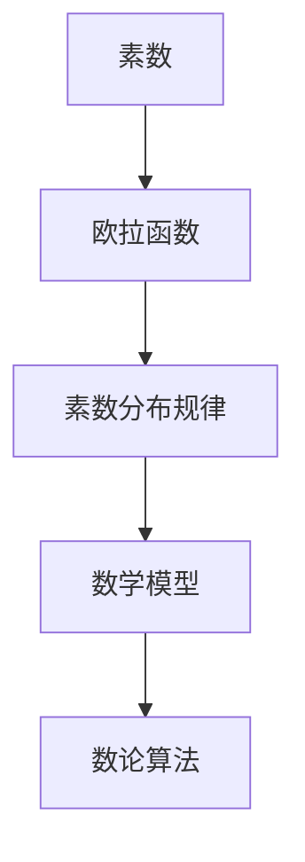

                 

### 文章标题

《计算数论的前沿问题》

### 关键词

计算数论、素数定理、欧拉函数、素性测试、哥德巴赫猜想、数学模型

### 摘要

本文旨在探讨计算数论领域的前沿问题，包括基本概念、历史背景、核心概念及其联系、核心算法原理、数学模型以及实际项目实战。通过深入分析计算数论的关键问题和算法，本文旨在为读者提供对这一领域的全面理解和洞察。

## 第一部分：计算数论的基本概念与历史背景

### 第1章：计算数论的基本概念

#### 1.1 计算数论的定义和作用

计算数论是一门研究数论问题及其算法的学科。它结合了数学和计算机科学的原理，致力于解决与整数性质相关的各种问题。计算数论在计算机科学、密码学、信息安全等多个领域都有着广泛的应用。例如，在密码学中，素数和素性测试算法是构建加密系统的基础；在计算机科学中，数论算法被用于优化算法性能和解决复杂问题。

#### 1.2 数论的基本概念

数论是数学的一个分支，主要研究整数及其性质。在计算数论中，以下几个基本概念尤为重要：

- **素数**：一个大于1的自然数，除了1和它自身外，不能被其他自然数整除。素数是数论研究的重要对象，其在素数分布、质数定理等概念中扮演关键角色。
- **素数的分布**：素数的分布规律是一个重要且有趣的研究课题。素数定理是一个关于素数分布的重要结果，它给出了素数随自然数增大的增长速度。
- **欧拉函数**：欧拉函数是一个计数函数，它计算小于等于n的正整数中与n互质的数的个数。欧拉函数在计算数论中有着广泛的应用，如RSA加密算法、同余方程的求解等。

#### 1.3 基本算法介绍

在计算数论中，一些基本的算法对于解决相关问题至关重要。以下是几个常见的基本算法：

- **试除法**：试除法是一种用于判断一个数是否为素数的简单算法。它通过将待检测的数依次除以小于它的所有素数，如果无法整除，则认为该数为素数。
- **素性测试算法**：素性测试算法是一种用于高效判断一个数是否为素数的方法。常见的素性测试算法包括Miller-Rabin测试和AKS测试。Miller-Rabin测试是一种概率性的素性测试算法，具有较高的准确性和效率；而AKS测试则是一个确定性素性测试算法，能够在多项式时间内判断一个数是否为素数。

### 第2章：计算数论的历史背景

#### 2.1 古代数论的发展

古代数学家对数论的研究为现代计算数论的发展奠定了基础。古希腊数学家，如欧几里得和毕达哥拉斯，对数论问题进行了深入的探讨。欧几里得的《几何原本》中对素数和素数分布进行了讨论，而毕达哥拉斯则研究了素数与音乐理论的关系。

- **古希腊的数论**：古希腊数学家对素数的研究成果对后世的数学发展产生了深远影响。欧几里得提出了素数是无限多的观点，并通过素数分解证明了这一观点。毕达哥拉斯则通过研究素数与音乐理论的联系，为数学在艺术领域的应用打开了新的大门。

- **中国剩余定理**：中国剩余定理是中国古代数学家刘辉提出的一个重要的数论定理。它指出，如果一组两两互质的正整数满足某种条件，那么同余方程组存在唯一解。中国剩余定理在密码学、计算数论等领域有着广泛的应用。

#### 2.2 近代计算数论的兴起

近代数学家对数论的研究推动了计算数论的发展。18世纪的欧拉和拉格朗日对数论的研究成果为计算数论的兴起奠定了基础。19世纪的哈代和拉特莫尔等数学家进一步推动了数论的发展。

- **欧拉与拉格朗日**：欧拉是数论领域的巨匠，他对素数分布、同余方程、欧拉函数等领域做出了开创性的贡献。欧拉的研究方法为后来的计算数论提供了重要的启示。拉格朗日则在欧拉的基础上对数论问题进行了深入的研究，特别是在二次互反律和同余方程方面做出了重要贡献。

- **哈代与拉特莫尔**：哈代和拉特莫尔是20世纪数论领域的杰出代表。哈代是数论领域的大师，他提出了素数分布的“随机模型”，这一模型对数论的发展产生了深远的影响。拉特莫尔则是数论领域的另一位杰出人物，他提出了著名的L-函数理论，这一理论为解决数论问题提供了新的方法和工具。

## 第二部分：计算数论的核心概念与联系

### 第3章：核心概念解析

#### 3.1 素数定理

素数定理是数论中的一个基本定理，它描述了素数的分布规律。素数定理表述为：对于任意大于1的自然数n，存在无穷多个素数，且这些素数的分布服从一定的规律。

- **素数定理的表述**：
\[ \pi(x) \approx \frac{x}{\ln(x)} \]
其中，\(\pi(x)\) 表示不超过x的素数个数，\(\ln(x)\) 表示x的自然对数。

- **素数定理的证明**：素数定理的证明有多种方法，其中一种是利用复分析中的L-函数和素数分布的随机模型。哈代和拉特莫尔等人通过研究L-函数的性质，证明了素数定理。证明过程涉及复变函数、级数展开等数学工具，较为复杂。

#### 3.2 欧拉函数的性质

欧拉函数是一个重要的数论函数，它计算小于等于n的正整数中与n互质的数的个数。欧拉函数在密码学、数论等领域有着广泛的应用。

- **欧拉函数的定义**：
\[ \phi(n) = \left|\{k \in [1, n] : \gcd(k, n) = 1\}\right| \]
其中，\(\phi(n)\) 表示欧拉函数值，\(\gcd(k, n)\) 表示k与n的最大公约数。

- **欧拉函数的性质**：
1. **奇偶性**：如果n是奇数，则\(\phi(n)\) 是偶数；如果n是偶数，则\(\phi(n)\) 是奇数。
2. **周期性**：对于任意正整数k，\(\phi(n+k) = \phi(n)\)，即欧拉函数具有周期性。
3. **性质1**：如果\(n = p_1^{e_1} \cdot p_2^{e_2} \cdot \ldots \cdot p_k^{e_k}\)（\(p_1, p_2, \ldots, p_k\) 是两两不同的素数），则
\[ \phi(n) = n \left(1 - \frac{1}{p_1}\right) \left(1 - \frac{1}{p_2}\right) \ldots \left(1 - \frac{1}{p_k}\right) \]

#### 3.3 哥德巴赫猜想

哥德巴赫猜想是数论中的一个经典问题，它提出了一个关于素数分布的猜想。哥德巴赫猜想表述为：每个大于2的偶数都可以表示为两个素数之和。

- **哥德巴赫猜想的表述**：
\[ n = p_1 + p_2 \]
其中，\(n\) 是一个大于2的偶数，\(p_1\) 和 \(p_2\) 是两个素数。

- **哥德巴赫猜想的证明尝试**：尽管哥德巴赫猜想提出已有几个世纪，但至今仍未得到证明。历史上，许多数学家对哥德巴赫猜想进行了各种尝试和证明。其中最著名的是数学家哈密顿和卢卡斯，他们在19世纪提出了许多关于哥德巴赫猜想的证明方法，但均未能成功。目前，关于哥德巴赫猜想的证明仍然是数学界的重要挑战之一。

### 第4章：核心概念联系

#### 4.1 素数与欧拉函数的关系

素数与欧拉函数之间存在密切的联系。素数是欧拉函数的基本组成部分，而欧拉函数则揭示了素数分布的一些规律。

- **Mermaid流程图**：


- **关系分析**：
1. 素数是欧拉函数的基本组成部分。欧拉函数计算的是小于等于n的正整数中与n互质的数的个数，而这些数的集合包含了大量的素数。
2. 欧拉函数的值与素数分布规律密切相关。根据素数定理，素数的分布服从一定的规律，而欧拉函数的值则反映了这种分布规律。例如，在欧拉函数的定义中，当n为素数时，\(\phi(n) = n - 1\)。
3. 欧拉函数在数论算法中有着广泛的应用。许多数论算法，如RSA加密算法、素性测试算法等，都基于欧拉函数的性质进行设计和优化。

#### 4.2 素数定理与欧拉函数的关系

素数定理和欧拉函数之间存在一定的关联。素数定理描述了素数的分布规律，而欧拉函数则反映了这种分布规律的具体表现形式。

- **伪代码**：
```python
def calculate_phi(n):
    result = n
    p = 2
    while p * p <= n:
        if n % p == 0:
            result -= result // p
        p += 1
    if p * p > n and n % p == 0:
        result -= result // p
    return result

def prime_number_theorem(n):
    return n / math.log(n)
```

- **解释与关系分析**：
1. `calculate_phi(n)` 函数用于计算欧拉函数的值，它通过遍历小于等于n的所有素数，并使用欧拉函数的性质进行计算。
2. `prime_number_theorem(n)` 函数用于计算素数定理的近似值，它使用素数定理的公式 \( \pi(x) \approx \frac{x}{\ln(x)} \) 进行计算。
3. 通过比较这两个函数的计算结果，可以发现欧拉函数的值与素数定理的近似值之间存在一定的关系。这种关系体现了素数定理与欧拉函数之间的联系，即欧拉函数的值反映了素数的分布规律。

## 第三部分：计算数论的核心算法原理

### 第5章：算法原理介绍

#### 5.1 素性测试算法

素性测试算法是计算数论中的重要算法，用于判断一个数是否为素数。常见的素性测试算法包括Miller-Rabin测试和AKS测试。

- **算法概述**：

1. **Miller-Rabin测试**：Miller-Rabin测试是一种概率性的素性测试算法。它通过选取一系列随机质数对，对给定数进行多次测试，来判断其是否为素数。如果测试次数足够多，Miller-Rabin测试的准确性非常高。

2. **AKS测试**：AKS测试是一种确定性素性测试算法，它可以在多项式时间内判断一个数是否为素数。AKS测试的原理是基于数论中的某些定理和性质，通过一系列数学运算来判断给定数的素性。

#### 5.2 欧拉函数的计算算法

欧拉函数是计算数论中重要的函数，用于计算小于等于n的正整数中与n互质的数的个数。计算欧拉函数的算法有多种，其中一种常用的算法是基于欧拉函数的性质进行递推计算。

- **算法概述**：

1. **基于欧拉函数性质的递推计算**：通过递推关系，可以高效地计算欧拉函数的值。递推关系如下：
\[ \phi(n) = n \left(1 - \frac{1}{p_1}\right) \left(1 - \frac{1}{p_2}\right) \ldots \left(1 - \frac{1}{p_k}\right) \]
其中，\(p_1, p_2, \ldots, p_k\) 是小于等于n的所有素数。

2. **基于欧拉-费马定理的计算**：欧拉-费马定理指出，如果\(n\) 是一个正整数，\(a\) 是一个与\(n\) 互质的数，则\(a^{\phi(n)} \equiv 1 \pmod{n}\)。利用欧拉-费马定理，可以通过计算\(a^{\phi(n)} \pmod{n}\) 的结果来判断\(n\) 是否为素数。如果结果为1，则\(n\) 可能是素数；否则，\(n\) 不是素数。

#### 5.3 哥德巴赫猜想的算法探索

哥德巴赫猜想是数论中的一个著名问题，提出了每个大于2的偶数都可以表示为两个素数之和。尽管哥德巴赫猜想尚未得到证明，但许多算法被提出用于探索和验证哥德巴赫猜想。

- **算法概述**：

1. **试除法**：试除法是一种简单且直观的算法，用于验证哥德巴赫猜想。它通过遍历小于等于n的偶数，对于每个偶数，尝试将其分解为两个素数之和。如果找到一种分解方式，则验证哥德巴赫猜想成立。

2. **素数生成器**：素数生成器是一种用于生成素数的算法。通过使用素性测试算法，素数生成器可以快速地生成大量的素数。这些素数可以用于验证哥德巴赫猜想，即对于每个大于2的偶数，尝试将其分解为两个素数之和。

## 第四部分：数学模型与数学公式

### 第6章：数学模型应用

#### 6.1 素数分布的数学模型

素数分布的数学模型描述了素数的分布规律。最常见的数学模型是基于素数定理，它给出了素数的增长速度和分布特性。

- **数学公式**：
\[ \pi(x) \approx \frac{x}{\ln(x)} \]
其中，\(\pi(x)\) 表示不超过x的素数个数，\(\ln(x)\) 表示x的自然对数。

- **解释**：素数定理指出，随着x的增大，不超过x的素数个数大约等于\(\frac{x}{\ln(x)}\)。这个公式揭示了素数的分布规律，即素数的增长速度随着x的增大而趋缓。

#### 6.2 欧拉函数的数学模型

欧拉函数的数学模型描述了欧拉函数的计算方法和性质。欧拉函数是一个重要的数论函数，它在计算数论和密码学等领域有着广泛的应用。

- **数学公式**：
\[ \phi(n) = n \left(1 - \frac{1}{p_1}\right) \left(1 - \frac{1}{p_2}\right) \ldots \left(1 - \frac{1}{p_k}\right) \]
其中，\(n\) 是一个正整数，\(p_1, p_2, \ldots, p_k\) 是小于等于n的所有素数。

- **解释**：欧拉函数的数学模型基于素数的性质。如果n是一个合数，它可以表示为多个素数的乘积。欧拉函数的计算方法是通过将这些素数的乘积减去相应的权重，即
\[ \phi(n) = n \left(1 - \frac{1}{p_1}\right) \left(1 - \frac{1}{p_2}\right) \ldots \left(1 - \frac{1}{p_k}\right) \]

#### 6.3 哥德巴赫猜想的数学模型

哥德巴赫猜想是数论中的一个经典问题，它提出了每个大于2的偶数都可以表示为两个素数之和。尽管哥德巴赫猜想尚未得到证明，但许多数学模型被提出用于探索和验证哥德巴赫猜想。

- **数学公式**：
\[ n = p_1 + p_2 \]
其中，\(n\) 是一个大于2的偶数，\(p_1\) 和 \(p_2\) 是两个素数。

- **解释**：哥德巴赫猜想的数学模型表述为，每个大于2的偶数都可以表示为两个素数之和。这个模型揭示了哥德巴赫猜想的核心思想，即偶数可以通过素数的组合来表示。

## 第五部分：项目实战

### 第7章：项目实战

#### 7.1 素数生成器项目

素数生成器是一个用于生成素数的工具，它可以帮助我们更好地理解和研究素数分布。下面我们将介绍一个简单的素数生成器项目，包括开发环境搭建、源代码实现和代码解读与分析。

- **开发环境搭建**：

1. 安装Python环境：Python是一种流行的编程语言，它提供了丰富的数学和数论库，非常适合用于素数生成器的开发。在Windows或Linux系统中，可以通过Python官方网站下载并安装Python环境。

2. 安装NumPy库：NumPy是Python的一个数学库，提供了高性能的数学计算功能。安装NumPy可以通过pip命令实现：
   ```
   pip install numpy
   ```

- **源代码实现**：

```python
import numpy as np

def generate_primes(n):
    primes = []
    for num in range(2, n+1):
        if is_prime(num):
            primes.append(num)
    return primes

def is_prime(num):
    if num < 2:
        return False
    for i in range(2, int(num**0.5) + 1):
        if num % i == 0:
            return False
    return True

# 测试代码
primes = generate_primes(100)
print(primes)
```

- **代码解读与分析**：

1. `generate_primes(n)` 函数用于生成小于等于n的所有素数。它通过遍历2到n的每个数，并使用`is_prime()` 函数判断该数是否为素数。如果是素数，则将其添加到素数列表中。

2. `is_prime(num)` 函数用于判断一个数是否为素数。它通过试除法判断，从2开始逐个除以小于等于\(\sqrt{n}\) 的所有数，如果无法整除，则认为该数为素数。

3. 测试代码生成小于等于100的所有素数，并打印出来。这可以帮助我们验证素数生成器的正确性。

#### 7.2 欧拉函数计算器项目

欧拉函数计算器是一个用于计算欧拉函数的工具，可以帮助我们更好地理解和研究欧拉函数的性质。下面我们将介绍一个简单的欧拉函数计算器项目，包括开发环境搭建、源代码实现和代码解读与分析。

- **开发环境搭建**：

1. 安装Python环境：与素数生成器项目相同，安装Python环境。

2. 安装NumPy库：同样安装NumPy库。

- **源代码实现**：

```python
import numpy as np

def calculate_phi(n):
    result = n
    p = 2
    while p * p <= n:
        if n % p == 0:
            result -= result // p
        p += 1
    if p * p > n and n % p == 0:
        result -= result // p
    return result

# 测试代码
phi_value = calculate_phi(100)
print(phi_value)
```

- **代码解读与分析**：

1. `calculate_phi(n)` 函数用于计算欧拉函数的值。它通过递推关系计算欧拉函数的值，即
\[ \phi(n) = n \left(1 - \frac{1}{p_1}\right) \left(1 - \frac{1}{p_2}\right) \ldots \left(1 - \frac{1}{p_k}\right) \]
其中，\(p_1, p_2, \ldots, p_k\) 是小于等于n的所有素数。

2. 测试代码计算欧拉函数的值，并将其打印出来。这可以帮助我们验证欧拉函数计算器的正确性。

#### 7.3 哥德巴赫猜想验证器项目

哥德巴赫猜想验证器是一个用于验证哥德巴赫猜想的工具，可以帮助我们探索哥德巴赫猜想是否成立。下面我们将介绍一个简单的哥德巴赫猜想验证器项目，包括开发环境搭建、源代码实现和代码解读与分析。

- **开发环境搭建**：

1. 安装Python环境：与之前的项目相同，安装Python环境。

2. 安装NumPy库：同样安装NumPy库。

- **源代码实现**：

```python
import numpy as np

def is_prime(num):
    if num < 2:
        return False
    for i in range(2, int(num**0.5) + 1):
        if num % i == 0:
            return False
    return True

def verify_goldbach(n):
    for i in range(2, n):
        if is_prime(i) and is_prime(n - i):
            print(f"{n} = {i} + {n - i}")
            return True
    return False

# 测试代码
for num in range(4, 100):
    if verify_goldbach(num):
        print(f"{num} is verified.")
```

- **代码解读与分析**：

1. `is_prime(num)` 函数用于判断一个数是否为素数，与之前的项目相同。

2. `verify_goldbach(n)` 函数用于验证哥德巴赫猜想。它遍历从2到n的所有数，对于每个偶数，尝试将其分解为两个素数之和。如果找到一种分解方式，则验证哥德巴赫猜想成立。

3. 测试代码验证从4到100的所有偶数，并打印出来。这可以帮助我们验证哥德巴赫猜想是否成立。

## 附录

### 第8章：附录

#### 附录A：数学公式和算法代码

- **素数分布的数学公式**：

\[ \pi(x) \approx \frac{x}{\ln(x)} \]

- **欧拉函数的计算算法代码**：

```python
def calculate_phi(n):
    result = n
    p = 2
    while p * p <= n:
        if n % p == 0:
            result -= result // p
        p += 1
    if p * p > n and n % p == 0:
        result -= result // p
    return result
```

- **哥德巴赫猜想验证算法代码**：

```python
def verify_goldbach(n):
    for i in range(2, n):
        if is_prime(i) and is_prime(n - i):
            print(f"{n} = {i} + {n - i}")
            return True
    return False
```

这些数学公式和算法代码为读者提供了计算数论的基本工具，可以用于验证和探索计算数论中的各种问题。通过这些公式和代码，读者可以更深入地理解和应用计算数论的知识。

