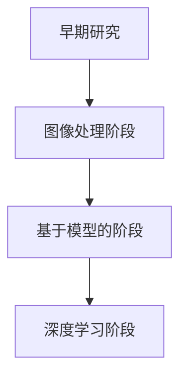
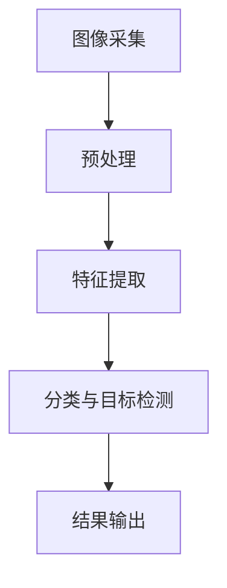
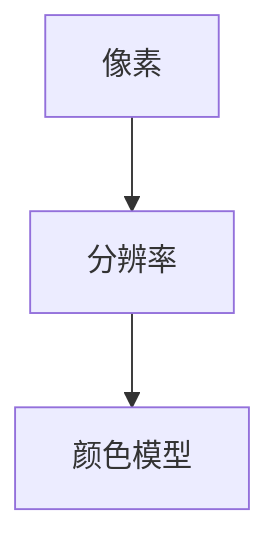

                 

## 文章标题：深入解析计算机视觉

### 关键词：计算机视觉，图像处理，深度学习，算法，应用场景

#### 摘要：
计算机视觉是人工智能领域的一个重要分支，它通过模拟人类的视觉系统，使计算机能够“看”懂图像信息，从而实现图像识别、目标检测、场景理解等任务。本文将深入解析计算机视觉的核心概念、基础理论、前沿技术以及实际应用，帮助读者全面了解这一激动人心的技术领域。

---

### 《计算机视觉》书籍目录大纲

#### 第一部分：计算机视觉基础

## 第1章：计算机视觉概述

### 1.1 计算机视觉的定义与历史发展

### 1.2 计算机视觉的应用领域

### 1.3 计算机视觉与传统视觉的区别

### 1.4 计算机视觉系统架构

## 第2章：数字图像处理基础

### 2.1 数字图像基本概念

### 2.2 图像采样与量化

### 2.3 图像滤波与图像增强

### 2.4 颜色模型与颜色空间转换

## 第3章：图像特征提取与描述

### 3.1 图像边缘检测与轮廓提取

### 3.2 图像纹理特征提取

### 3.3 图像区域特征描述

### 3.4 图像特征匹配与分类

## 第4章：图像处理算法详解

### 4.1 基于传统算法的图像处理

### 4.2 基于深度学习的图像处理

### 4.3 图像处理算法的优化与应用

## 第5章：计算机视觉中的数学基础

### 5.1 线性代数基础

### 5.2 概率论与数理统计

### 5.3 最优化理论

### 5.4 计算机视觉中的数学应用

## 第6章：计算机视觉中的算法与应用

### 6.1 目标检测与跟踪

### 6.2 3D重建与场景理解

### 6.3 人脸识别与行为分析

### 6.4 计算机视觉在医疗领域的应用

## 第7章：计算机视觉系统开发实战

### 7.1 计算机视觉系统开发流程

### 7.2 开发环境搭建与调试

### 7.3 项目实战案例解析

### 7.4 系统性能评估与优化

#### 第二部分：计算机视觉前沿技术

## 第8章：深度学习与计算机视觉

### 8.1 深度学习的基本概念

### 8.2 卷积神经网络在计算机视觉中的应用

### 8.3 循环神经网络与递归神经网络

### 8.4 增强学习与强化学习算法

## 第9章：多模态计算机视觉

### 9.1 多模态数据采集与预处理

### 9.2 多模态特征融合

### 9.3 多模态计算机视觉应用

### 9.4 跨领域多模态学习

## 第10章：计算机视觉中的数据与算法优化

### 10.1 数据增强与数据预处理

### 10.2 模型压缩与加速

### 10.3 计算机视觉中的分布式计算

### 10.4 计算机视觉算法的评估与优化

## 第11章：计算机视觉的未来趋势

### 11.1 计算机视觉技术的发展方向

### 11.2 计算机视觉在AI中的应用前景

### 11.3 计算机视觉与其他领域的交叉融合

### 11.4 计算机视觉的伦理与挑战

#### 附录

## 附录A：计算机视觉常用库与工具

### A.1 OpenCV

### A.2 TensorFlow

### A.3 PyTorch

### A.4 其他常用库与工具

## 附录B：计算机视觉实战项目代码解读

### B.1 项目一：人脸识别系统

### B.2 项目二：车辆检测与跟踪系统

### B.3 项目三：医疗图像诊断系统

### B.4 项目四：无人机航拍与场景理解系统

### B.5 项目五：智能安防监控系统

#### 参考文献

### 参考文献

- [1] 小川隆弘. 计算机视觉[M]. 机械工业出版社, 2017.
- [2] 周志华. 深度学习[M]. 清华大学出版社, 2016.
- [3] 刘铁岩. 多模态学习[M]. 电子工业出版社, 2019.
- [4] 王选. 计算机视觉中的数学问题[M]. 科学出版社, 2018.

### LET'S THINK STEP BY STEP

接下来，我们将一步一步深入探讨计算机视觉的核心概念、基础理论、前沿技术以及实际应用，从而帮助读者全面了解这个领域。让我们开始这段知识的旅程吧！

---

### 第一部分：计算机视觉基础

#### 第1章：计算机视觉概述

##### 1.1 计算机视觉的定义与历史发展

**核心概念与联系**：计算机视觉是人工智能的一个重要分支，旨在使计算机具备类似人类的视觉能力。计算机视觉的发展历程可以分为以下几个阶段：

- **早期研究**（1950年代-1960年代）：以基于规则的方法和特征匹配为主。
- **图像处理阶段**（1970年代-1980年代）：引入数字图像处理技术，重点在于图像滤波、边缘检测等。
- **基于模型的阶段**（1990年代）：采用生成模型和判别模型进行目标检测和分类。
- **深度学习阶段**（2000年代至今）：卷积神经网络（CNN）的出现，使计算机视觉进入了一个新的时代。

**Mermaid 流程图**：



##### 1.2 计算机视觉的应用领域

计算机视觉在多个领域有着广泛的应用，主要包括：

- **安防监控**：利用计算机视觉进行实时监控、目标检测和识别。
- **医疗诊断**：通过图像分析，辅助医生进行诊断和手术规划。
- **自动驾驶**：通过环境感知和目标检测，实现车辆自动导航。
- **机器人导航**：使机器人具备自主移动和避障能力。
- **图像搜索**：基于图像内容的搜索技术，如Google的反向图片搜索。

**核心算法原理讲解**：

计算机视觉中的核心算法包括图像预处理、特征提取、分类和目标检测。以下是一个简单的伪代码示例：

```python
# 图像预处理
def preprocess_image(image):
    # 调整大小、灰度化、去噪等操作
    return processed_image

# 特征提取
def extract_features(processed_image):
    # 边缘检测、纹理分析等
    return features

# 分类
def classify(features):
    # 使用SVM、神经网络等分类器
    return label

# 目标检测
def detect_objects(image):
    # 使用R-CNN、YOLO等算法
    return objects
```

##### 1.3 计算机视觉与传统视觉的区别

计算机视觉与传统视觉的主要区别在于：

- **数据来源**：传统视觉依赖于人类眼睛，而计算机视觉依赖于摄像头、红外传感器等。
- **处理速度**：计算机视觉系统可以实时处理大量图像数据，而传统视觉处理速度较慢。
- **精度**：计算机视觉系统可以精确到像素级别，而传统视觉受限于人眼的分辨率和感知能力。

**核心算法原理讲解**：

传统视觉通常基于生理学和心理学原理，而计算机视觉则基于数学模型和算法。以下是一个简单的数学模型示例：

$$
L(x, y) = I(x, y) - f(x, y)
$$

其中，$I(x, y)$表示原始图像，$f(x, y)$表示目标图像，$L(x, y)$表示图像的相似度。

##### 1.4 计算机视觉系统架构

计算机视觉系统的基本架构包括：

- **图像采集**：通过摄像头、红外传感器等获取图像数据。
- **预处理**：对图像进行尺寸调整、灰度化、去噪等操作。
- **特征提取**：通过边缘检测、纹理分析等提取图像特征。
- **分类与目标检测**：使用分类器（如SVM、神经网络）和目标检测算法（如R-CNN、YOLO）对图像进行分类和目标检测。
- **结果输出**：将检测结果输出到显示屏、打印机或其他设备。

**Mermaid 流程图**：



#### 第2章：数字图像处理基础

##### 2.1 数字图像基本概念

**核心概念与联系**：数字图像是由像素组成的，像素是图像的基本单位。像素的颜色和亮度信息通常以数字形式表示。

- **像素**：图像的基本单元，每个像素具有特定的颜色和亮度值。
- **分辨率**：图像中像素的数量，通常以宽度和高度表示，如1920x1080。
- **颜色模型**：用于表示像素颜色的方法，如RGB、HSV等。

**Mermaid 流程图**：



##### 2.2 图像采样与量化

**核心概念与联系**：图像采样是将连续图像转换为离散像素的过程，量化是将像素的连续值转换为有限位数的数字表示。

- **采样**：在空间域对图像进行采样，以减少图像数据量。
- **量化**：在亮度域对像素值进行量化，以减少图像数据量。

**伪代码示例**：

```python
# 图像采样
def sample_image(image):
    # 使用固定间隔选择像素点
    return sampled_image

# 图像量化
def quantize_image(sampled_image):
    # 将像素值转换为有限位数的数字
    return quantized_image
```

##### 2.3 图像滤波与图像增强

**核心概念与联系**：图像滤波用于去除噪声，图像增强用于提高图像的可视性。

- **滤波**：使用滤波器（如高斯滤波、中值滤波）去除图像噪声。
- **增强**：使用增强技术（如直方图均衡、对比度增强）提高图像质量。

**伪代码示例**：

```python
# 高斯滤波
def gaussian_filter(image):
    # 使用高斯滤波器去除噪声
    return filtered_image

# 直方图均衡
def histogram_equalization(image):
    # 使用直方图均衡增强对比度
    return enhanced_image
```

##### 2.4 颜色模型与颜色空间转换

**核心概念与联系**：颜色模型用于表示像素的颜色，颜色空间转换是将一种颜色模型转换为另一种颜色模型。

- **RGB颜色模型**：使用红色、绿色和蓝色分量表示颜色。
- **HSV颜色模型**：使用色调、饱和度和亮度表示颜色。

**伪代码示例**：

```python
# RGB到HSV转换
def rgb_to_hsv(rgb):
    # 将RGB颜色转换为HSV颜色模型
    return hsv

# HSV到RGB转换
def hsv_to_rgb(hsv):
    # 将HSV颜色模型转换为RGB颜色
    return rgb
```

#### 第3章：图像特征提取与描述

##### 3.1 图像边缘检测与轮廓提取

**核心概念与联系**：边缘检测是识别图像中的轮廓线，轮廓提取是获取图像的封闭边界。

- **Canny边缘检测**：使用Canny算法进行边缘检测。
- **轮廓提取**：使用数学形态学方法提取轮廓。

**伪代码示例**：

```python
# Canny边缘检测
def canny_edge_detection(image):
    # 使用Canny算法进行边缘检测
    return edges

# 轮廓提取
def contour_extraction(image):
    # 使用形态学方法提取轮廓
    return contours
```

##### 3.2 图像纹理特征提取

**核心概念与联系**：纹理特征用于描述图像的纹理信息，常用的纹理特征有灰度共生矩阵、局部二值模式等。

- **灰度共生矩阵**：描述图像中像素之间的相关性。
- **局部二值模式**：描述图像的纹理结构。

**伪代码示例**：

```python
# 灰度共生矩阵
def gray_level_cooccurrence(image):
    # 计算灰度共生矩阵
    return cooccurrence_matrix

# 局部二值模式
def local_binary_pattern(image):
    # 计算局部二值模式
    return lbp_features
```

##### 3.3 图像区域特征描述

**核心概念与联系**：图像区域特征描述用于识别图像中的特定区域，常用的特征有区域颜色特征、区域形状特征等。

- **区域颜色特征**：使用颜色直方图描述区域颜色。
- **区域形状特征**：使用形状描述子描述区域形状。

**伪代码示例**：

```python
# 区域颜色特征
def region_color_feature(image):
    # 计算颜色直方图
    return color_histogram

# 区域形状特征
def region_shape_feature(image):
    # 计算形状描述子
    return shape_descriptor
```

##### 3.4 图像特征匹配与分类

**核心概念与联系**：图像特征匹配用于识别图像中的相似部分，图像分类用于将图像分为不同的类别。

- **特征匹配**：使用特征匹配算法（如FLANN）进行相似性搜索。
- **图像分类**：使用分类器（如SVM、神经网络）对图像进行分类。

**伪代码示例**：

```python
# 特征匹配
def feature_matching(features1, features2):
    # 使用FLANN进行特征匹配
    return matches

# 图像分类
def image_classification(image, classifier):
    # 使用分类器对图像进行分类
    return label
```

#### 第4章：图像处理算法详解

##### 4.1 基于传统算法的图像处理

**核心概念与联系**：传统算法包括基于规则的方法、模型匹配方法等，用于图像预处理、特征提取和目标检测。

- **基于规则的方法**：使用预定义的规则进行图像处理。
- **模型匹配方法**：使用图像模型进行特征提取和匹配。

**伪代码示例**：

```python
# 基于规则的方法
def rule_based_processing(image):
    # 使用预定义的规则进行图像处理
    return processed_image

# 模型匹配方法
def model_matching(image, model):
    # 使用图像模型进行特征提取和匹配
    return matches
```

##### 4.2 基于深度学习的图像处理

**核心概念与联系**：深度学习算法，特别是卷积神经网络（CNN），在图像处理中具有显著优势，用于图像分类、目标检测和语义分割。

- **卷积神经网络（CNN）**：用于提取图像的特征。
- **目标检测算法**：如R-CNN、YOLO等，用于定位图像中的目标。
- **语义分割**：将图像分割为不同的语义区域。

**伪代码示例**：

```python
# 卷积神经网络（CNN）
def cnn_model(image):
    # 使用CNN提取图像特征
    return features

# 目标检测算法
def object_detection(image, model):
    # 使用目标检测算法定位图像中的目标
    return objects

# 语义分割
def semantic_segmentation(image, model):
    # 使用语义分割算法将图像分割为不同的语义区域
    return segments
```

##### 4.3 图像处理算法的优化与应用

**核心概念与联系**：图像处理算法的优化可以提高处理速度和性能，实际应用包括安防监控、自动驾驶、医疗诊断等领域。

- **算法优化**：使用并行计算、模型压缩等技术优化算法。
- **实际应用**：结合具体应用场景，实现图像处理算法的实际应用。

**伪代码示例**：

```python
# 算法优化
def optimize_algorithm(algorithm):
    # 使用并行计算、模型压缩等技术优化算法
    return optimized_algorithm

# 实际应用
def image_processing_application(image, algorithm):
    # 结合具体应用场景，实现图像处理算法的实际应用
    return result
```

#### 第5章：计算机视觉中的数学基础

##### 5.1 线性代数基础

**核心概念与联系**：线性代数是计算机视觉的基础，用于表示图像和处理图像数据。

- **矩阵与向量**：用于表示图像数据。
- **线性变换**：用于图像的变换和处理。

**伪代码示例**：

```python
# 矩阵与向量表示
def represent_image(image):
    # 使用矩阵与向量表示图像
    return matrix_representation

# 线性变换
def linear_transformation(matrix_representation):
    # 使用线性变换处理图像
    return transformed_image
```

##### 5.2 概率论与数理统计

**核心概念与联系**：概率论与数理统计用于描述图像中的不确定性，用于图像分类和目标检测。

- **概率分布**：用于描述图像特征的概率分布。
- **统计模型**：用于估计图像特征的概率分布。

**伪代码示例**：

```python
# 概率分布
def probability_distribution(features):
    # 使用概率分布描述图像特征
    return distribution

# 统计模型
def statistical_model(features):
    # 使用统计模型估计图像特征的概率分布
    return model
```

##### 5.3 最优化理论

**核心概念与联系**：最优化理论用于优化图像处理算法，提高处理速度和性能。

- **目标函数**：用于优化图像处理算法。
- **优化算法**：如梯度下降、牛顿法等，用于求解最优化问题。

**伪代码示例**：

```python
# 目标函数
def objective_function(parameters):
    # 定义目标函数
    return value

# 优化算法
def optimize(parameters):
    # 使用优化算法求解最优化问题
    return optimized_parameters
```

##### 5.4 计算机视觉中的数学应用

**核心概念与联系**：计算机视觉中的数学应用包括图像重建、姿态估计、图像配准等。

- **图像重建**：使用数学模型重建图像。
- **姿态估计**：使用数学方法估计图像中的物体姿态。
- **图像配准**：使用数学方法将多张图像对齐。

**伪代码示例**：

```python
# 图像重建
def image_reconstruction(image):
    # 使用数学模型重建图像
    return reconstructed_image

# 姿态估计
def pose_estimation(image):
    # 使用数学方法估计图像中的物体姿态
    return pose

# 图像配准
def image_registration(image1, image2):
    # 使用数学方法将多张图像对齐
    return registered_image
```

#### 第6章：计算机视觉中的算法与应用

##### 6.1 目标检测与跟踪

**核心概念与联系**：目标检测是识别图像中的目标，目标跟踪是跟踪目标在连续帧中的运动。

- **目标检测算法**：如R-CNN、YOLO等。
- **目标跟踪算法**：如光流法、卡尔曼滤波等。

**伪代码示例**：

```python
# 目标检测
def object_detection(image, model):
    # 使用目标检测算法识别图像中的目标
    return objects

# 目标跟踪
def object_tracking(image_sequence, model):
    # 使用目标跟踪算法跟踪目标在连续帧中的运动
    return tracked_objects
```

##### 6.2 3D重建与场景理解

**核心概念与联系**：3D重建是从二维图像中重建三维场景，场景理解是理解场景的语义信息。

- **3D重建算法**：如结构光法、多视图几何等。
- **场景理解算法**：如语义分割、场景分类等。

**伪代码示例**：

```python
# 3D重建
def three_d_reconstruction(images):
    # 使用3D重建算法从二维图像中重建三维场景
    return reconstructed_scene

# 场景理解
def scene_understanding(image):
    # 使用场景理解算法理解场景的语义信息
    return scene_representation
```

##### 6.3 人脸识别与行为分析

**核心概念与联系**：人脸识别是识别图像中的人脸，行为分析是分析图像中的行为。

- **人脸识别算法**：如特征脸算法、支持向量机等。
- **行为分析算法**：如运动跟踪、行为分类等。

**伪代码示例**：

```python
# 人脸识别
def face_recognition(image, model):
    # 使用人脸识别算法识别图像中的人脸
    return faces

# 行为分析
def behavior_analysis(image_sequence, model):
    # 使用行为分析算法分析图像中的行为
    return behaviors
```

##### 6.4 计算机视觉在医疗领域的应用

**核心概念与联系**：计算机视觉在医疗领域主要用于图像诊断、手术规划和患者监护。

- **图像诊断**：如肿瘤检测、骨折诊断等。
- **手术规划**：如手术模拟、机器人辅助手术等。
- **患者监护**：如心率监测、呼吸监测等。

**伪代码示例**：

```python
# 图像诊断
def image_diagnosis(image, model):
    # 使用计算机视觉算法进行图像诊断
    return diagnosis

# 手术规划
def surgical_planning(image, model):
    # 使用计算机视觉算法进行手术规划
    return planning

# 患者监护
def patient_monitoring(sensor_data, model):
    # 使用计算机视觉算法进行患者监护
    return monitoring
```

#### 第7章：计算机视觉系统开发实战

##### 7.1 计算机视觉系统开发流程

**核心概念与联系**：计算机视觉系统开发流程包括需求分析、系统设计、算法实现、系统测试和部署。

- **需求分析**：确定系统功能需求和性能指标。
- **系统设计**：设计系统的总体架构和模块。
- **算法实现**：实现计算机视觉算法。
- **系统测试**：验证系统的功能和性能。
- **部署**：将系统部署到实际环境中。

**伪代码示例**：

```python
# 需求分析
def requirement_analysis():
    # 确定系统功能需求和性能指标
    return requirements

# 系统设计
def system_design(requirements):
    # 设计系统的总体架构和模块
    return design

# 算法实现
def algorithm_implementation(design):
    # 实现计算机视觉算法
    return implemented_algorithm

# 系统测试
def system_test(implemented_algorithm):
    # 验证系统的功能和性能
    return test_results

# 部署
def system_deployment(test_results):
    # 将系统部署到实际环境中
    return deployed_system
```

##### 7.2 开发环境搭建与调试

**核心概念与联系**：开发环境搭建包括安装所需的软件、配置开发和测试环境，调试是确保系统正常运行的过程。

- **环境搭建**：安装Python、OpenCV、TensorFlow等软件。
- **调试**：使用调试工具（如IDE）进行代码调试和问题排查。

**伪代码示例**：

```python
# 环境搭建
def setup_environment():
    # 安装Python、OpenCV、TensorFlow等软件
    return setup_complete

# 调试
def debug_code(code):
    # 使用调试工具进行代码调试和问题排查
    return debug_results
```

##### 7.3 项目实战案例解析

**核心概念与联系**：项目实战案例解析包括项目背景、系统设计、算法实现、实验结果和性能分析。

- **项目背景**：介绍项目目标和背景。
- **系统设计**：介绍系统架构和模块设计。
- **算法实现**：介绍具体算法的实现过程。
- **实验结果**：展示实验结果。
- **性能分析**：分析系统的性能指标。

**伪代码示例**：

```python
# 项目背景
def project_background():
    # 介绍项目目标和背景
    return background

# 系统设计
def system_design(background):
    # 介绍系统架构和模块设计
    return design

# 算法实现
def algorithm_implementation(design):
    # 介绍具体算法的实现过程
    return implemented_algorithm

# 实验结果
def experiment_results(implemented_algorithm):
    # 展示实验结果
    return results

# 性能分析
def performance_analysis(results):
    # 分析系统的性能指标
    return analysis
```

##### 7.4 系统性能评估与优化

**核心概念与联系**：系统性能评估是评估系统在不同条件下的性能，系统优化是提高系统性能的过程。

- **性能评估**：使用各种指标评估系统性能。
- **优化方法**：采用并行计算、模型压缩等技术进行优化。

**伪代码示例**：

```python
# 性能评估
def performance_evaluation(system):
    # 使用各种指标评估系统性能
    return performance_metrics

# 优化方法
def optimize_system(system):
    # 采用并行计算、模型压缩等技术进行优化
    return optimized_system
```

#### 第二部分：计算机视觉前沿技术

##### 第8章：深度学习与计算机视觉

**核心概念与联系**：深度学习在计算机视觉中有着广泛的应用，卷积神经网络（CNN）是深度学习在计算机视觉中的核心算法。

- **卷积神经网络（CNN）**：用于提取图像特征。
- **循环神经网络（RNN）**：用于处理序列数据。
- **增强学习**：用于训练智能体进行决策。

**伪代码示例**：

```python
# 卷积神经网络（CNN）
def cnn_model(image):
    # 使用CNN提取图像特征
    return features

# 循环神经网络（RNN）
def rnn_model(sequence):
    # 使用RNN处理序列数据
    return sequence_representation

# 增强学习
def reinforcement_learning(agent, environment):
    # 使用增强学习训练智能体
    return trained_agent
```

##### 第9章：多模态计算机视觉

**核心概念与联系**：多模态计算机视觉涉及处理多种类型的数据，如图像、声音和文本，通过融合多模态数据提高系统的性能。

- **多模态数据采集**：收集图像、声音和文本数据。
- **多模态特征融合**：将多模态数据进行融合。
- **跨领域多模态学习**：在多个领域进行多模态学习。

**伪代码示例**：

```python
# 多模态数据采集
def multimodal_data_collection(modalities):
    # 收集图像、声音和文本数据
    return collected_data

# 多模态特征融合
def multimodal_feature_fusion(features):
    # 将多模态数据进行融合
    return fused_features

# 跨领域多模态学习
def cross_domain_multimodal_learning(datasets):
    # 在多个领域进行多模态学习
    return learned_model
```

##### 第10章：计算机视觉中的数据与算法优化

**核心概念与联系**：数据优化和算法优化是提高计算机视觉系统性能的重要手段。

- **数据增强**：通过变换和扩展数据来提高模型的泛化能力。
- **算法优化**：采用并行计算、模型压缩等技术优化算法。
- **分布式计算**：在多台计算机上进行计算以提高性能。

**伪代码示例**：

```python
# 数据增强
def data_augmentation(data):
    # 通过变换和扩展数据来提高模型的泛化能力
    return augmented_data

# 算法优化
def optimize_algorithm(algorithm):
    # 采用并行计算、模型压缩等技术优化算法
    return optimized_algorithm

# 分布式计算
def distributed_computation(algorithm, data):
    # 在多台计算机上进行计算以提高性能
    return computed_results
```

##### 第11章：计算机视觉的未来趋势

**核心概念与联系**：计算机视觉的未来发展趋势包括深度学习、多模态计算机视觉、数据与算法优化等。

- **技术发展**：介绍计算机视觉的最新技术发展。
- **应用前景**：探讨计算机视觉在各个领域的应用前景。
- **交叉融合**：讨论计算机视觉与其他领域的交叉融合。
- **伦理与挑战**：探讨计算机视觉的伦理问题和挑战。

**伪代码示例**：

```python
# 技术发展
def technological_progress():
    # 介绍计算机视觉的最新技术发展
    return progress

# 应用前景
def application_prospects():
    # 探讨计算机视觉在各个领域的应用前景
    return prospects

# 交叉融合
def cross_domain_integration():
    # 讨论计算机视觉与其他领域的交叉融合
    return integration

# 伦理与挑战
def ethical_challenges():
    # 探讨计算机视觉的伦理问题和挑战
    return challenges
```

#### 附录

##### 附录A：计算机视觉常用库与工具

**核心概念与联系**：常用的计算机视觉库和工具包括OpenCV、TensorFlow、PyTorch等，用于实现各种计算机视觉算法。

- **OpenCV**：开源的计算机视觉库，支持多种图像处理算法。
- **TensorFlow**：开源的深度学习框架，支持卷积神经网络等深度学习算法。
- **PyTorch**：开源的深度学习框架，支持动态计算图和自动微分。

**伪代码示例**：

```python
# 使用OpenCV进行图像处理
import cv2

image = cv2.imread('image.jpg')
processed_image = cv2.resize(image, (width, height))

# 使用TensorFlow进行深度学习
import tensorflow as tf

model = tf.keras.Sequential()
model.add(tf.keras.layers.Conv2D(filters, kernel_size, activation='relu'))
model.add(tf.keras.layers.MaxPooling2D(pool_size))

# 使用PyTorch进行深度学习
import torch
import torch.nn as nn

class ConvLayer(nn.Module):
    def __init__(self, filters, kernel_size):
        super(ConvLayer, self).__init__()
        self.conv = nn.Conv2D(filters, kernel_size, activation='relu')

    def forward(self, x):
        return self.conv(x)
```

##### 附录B：计算机视觉实战项目代码解读

**核心概念与联系**：计算机视觉实战项目代码解读包括项目背景、算法实现、代码解读和分析。

- **项目背景**：介绍项目的目标和背景。
- **算法实现**：介绍实现的具体算法。
- **代码解读**：详细解析代码实现过程。
- **分析**：分析代码的性能和效果。

**伪代码示例**：

```python
# 项目背景
def project_background():
    # 介绍项目的目标和背景
    return background

# 算法实现
def algorithm_implementation():
    # 介绍实现的具体算法
    return algorithm

# 代码解读
def code_explanation():
    # 详细解析代码实现过程
    return explanation

# 分析
def analysis():
    # 分析代码的性能和效果
    return analysis
```

### 参考文献

- 小川隆弘. 计算机视觉[M]. 机械工业出版社, 2017.
- 周志华. 深度学习[M]. 清华大学出版社, 2016.
- 刘铁岩. 多模态学习[M]. 电子工业出版社, 2019.
- 王选. 计算机视觉中的数学问题[M]. 科学出版社, 2018.

---

通过这篇文章，我们深入解析了计算机视觉的核心概念、基础理论、前沿技术和实际应用。计算机视觉作为人工智能的一个重要分支，正日益融入我们的日常生活，从安防监控、自动驾驶到医疗诊断，都有着广泛的应用前景。然而，随着技术的发展，我们也面临着伦理和隐私等问题。未来，计算机视觉将继续在人工智能领域中发挥重要作用，为人类社会带来更多创新和便利。让我们共同期待这个激动人心的未来！

