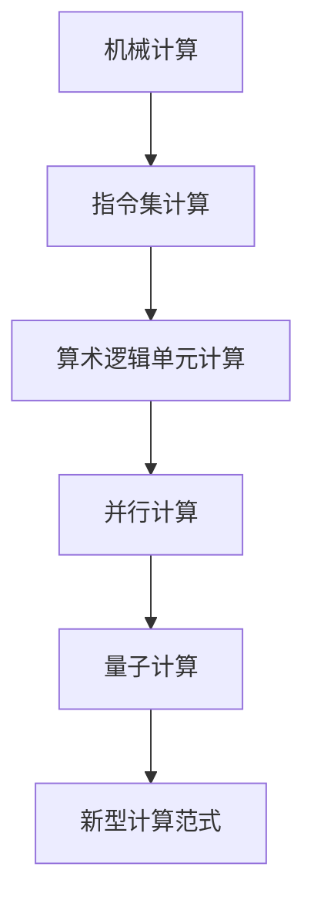
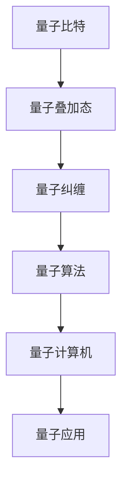
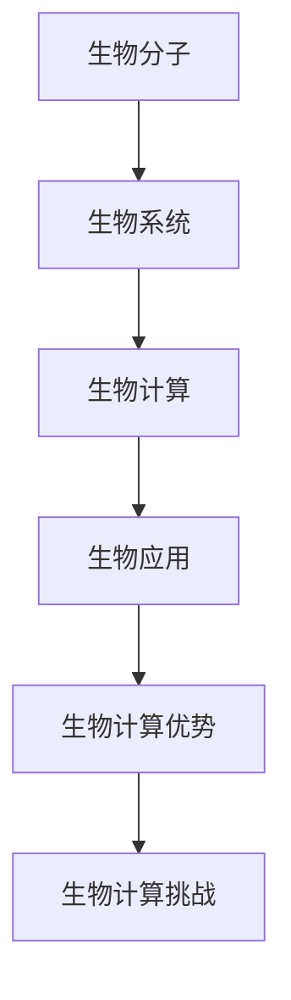

                 

# 《计算范式的历史与未来》

> 关键词：计算范式、历史、未来、并行计算、量子计算、生物计算、脑机接口

> 摘要：本文将探讨计算范式的历史与未来。从古典计算范式到现代并行计算、量子计算、生物计算和脑机接口，我们将一步步分析每种范式的核心概念、发展历程、优缺点以及应用前景。同时，我们也将展望未来计算范式的发展趋势及其对社会的影响与挑战。

## 第一部分：计算范式的历史

### 第1章：计算范式概述

#### 1.1 计算范式的基本概念

计算范式是指一种组织数据和执行计算的方式。它不仅涉及到硬件，还包括软件和算法的设计。计算范式决定了计算系统的架构和功能，影响了计算效率、性能和可扩展性。

#### 1.2 计算范式的发展历程

计算范式的发展可以分为几个阶段：机械计算、指令集计算、算术逻辑单元计算、并行计算和量子计算。每个阶段都带来了计算能力和效率的显著提升。

#### 1.3 不同计算范式的优缺点分析

机械计算范式的优点是计算简单，但效率低；指令集计算范式的优点是可编程性强，但受限于指令集的局限性；算术逻辑单元计算范式在处理复杂计算任务方面表现出色，但仍然受到硬件限制。并行计算和量子计算则突破了传统计算的局限，提供了更高效的计算能力和更广泛的应用前景。

### 第2章：古典计算范式

#### 2.1 机械计算范式

机械计算范式起源于古代，最早的计算设备如算盘和机械计算机。机械计算范式的基本原理是通过机械运动来完成计算任务，但受限于机械结构，计算速度和精度有限。

#### 2.2 指令集计算范式

指令集计算范式是现代计算机的基础。它通过预先定义的指令集，使得计算机能够执行各种计算任务。指令集计算范式的优点是可编程性强，但指令集的局限性限制了计算能力。

#### 2.3 算术逻辑单元计算范式

算术逻辑单元（ALU）是计算机的核心组件之一。它负责执行各种算术和逻辑运算。算术逻辑单元计算范式的优点是处理复杂计算任务的能力强，但仍然受到硬件的限制。

### 第3章：并行计算范式

#### 3.1 并行计算的基本概念

并行计算是一种利用多个处理单元同时执行多个任务的计算方式。并行计算范式通过提高计算速度和性能，显著提升了计算机的效率。

#### 3.2 并行计算的优势与挑战

并行计算的优势在于处理大量数据和复杂任务的能力强，但同时也面临着同步、通信和负载平衡等挑战。

#### 3.3 并行计算的应用领域

并行计算广泛应用于科学计算、大数据处理、机器学习等领域，为现代计算技术提供了强大的支持。

#### 3.4 并行计算模型与算法

并行计算模型包括数据并行、任务并行和控制并行等。并行算法的设计和优化是并行计算的关键。

### 第4章：量子计算范式

#### 4.1 量子计算的基本原理

量子计算是一种基于量子力学原理的计算方式。量子比特（qubit）和量子叠加态、量子纠缠是量子计算的核心概念。

#### 4.2 量子算法与量子计算的优势

量子算法如Shor算法和Grover算法在解决某些问题上具有显著优势。量子计算的优势在于处理某些问题时的速度远超传统计算机。

#### 4.3 量子计算的应用前景

量子计算在密码学、量子模拟、优化问题等领域具有巨大的应用潜力。

### 第5章：新型计算范式

#### 5.1 生物计算范式

生物计算利用生物系统和生物分子进行计算。生物计算的原理与应用、优势与挑战将在本节中详细讨论。

#### 5.2 光子计算范式

光子计算利用光子进行计算，具有高速、低能耗的特点。光子计算的基本原理和应用领域将在本节中介绍。

#### 5.3 脑机接口计算范式

脑机接口是一种将人脑与计算机连接起来的技术。脑机接口的基本原理、应用前景和挑战将在本节中探讨。

## 第6章：计算范式与未来展望

#### 6.1 未来计算范式的发展趋势

随着科技的进步，未来计算范式将朝着更高效、更智能、更集成、更绿色的方向发展。

#### 6.2 新型计算范式面临的挑战与机遇

新型计算范式如量子计算、生物计算和脑机接口等在带来巨大机遇的同时，也面临着诸多挑战。

#### 6.3 未来计算范式对社会的影响与挑战

未来计算范式将对社会、经济、文化和伦理等多个方面产生深远影响。

## 第二部分：计算范式的未来

### 第7章：量子计算的未来

#### 7.1 量子计算机的潜在应用领域

量子计算机在密码学、药物研发、金融建模等领域具有巨大应用潜力。

#### 7.2 量子计算的发展瓶颈与解决方案

量子计算目前仍面临诸多挑战，如量子纠错、量子错误率等问题。针对这些问题，研究人员正在探索多种解决方案。

#### 7.3 量子计算的未来前景

随着技术的进步，量子计算有望在未来实现大规模应用，并带来计算能力的革命性提升。

### 第8章：生物计算的未来

#### 8.1 生物计算在医疗领域的应用

生物计算在药物研发、疾病诊断和治疗等方面具有广泛的应用前景。

#### 8.2 生物计算的挑战与未来发展

生物计算面临着计算能力、数据隐私和伦理等挑战。未来，生物计算将在多学科交叉融合中发挥重要作用。

#### 8.3 生物计算的社会影响与伦理问题

生物计算的发展将带来医学、农业、环境保护等领域的变革，同时也引发了一系列伦理问题。

### 第9章：光子计算的未来

#### 9.1 光子计算的优势与应用前景

光子计算具有高速、低能耗、高集成度的优势，在通信、计算、存储等领域具有广泛的应用前景。

#### 9.2 光子计算的技术挑战与解决方案

光子计算目前面临技术挑战，如光子器件的制造、光子网络的拓扑结构等。研究人员正在探索多种解决方案。

#### 9.3 光子计算对社会的影响

光子计算的发展将推动通信、计算和能源等领域的技术变革，对社会产生深远影响。

### 第10章：脑机接口的未来

#### 10.1 脑机接口的基本原理与实现技术

脑机接口通过捕捉大脑信号，实现人脑与计算机之间的直接通信。

#### 10.2 脑机接口的应用领域

脑机接口在康复、娱乐、教育等领域具有广泛的应用前景。

#### 10.3 脑机接口的挑战与未来前景

脑机接口面临着信号捕捉、解码、稳定性等挑战。未来，脑机接口有望实现更高的通信速度和更广泛的应用。

## 附录

### 附录A：计算范式相关的参考资料

#### A.1 学术论文与期刊

- [1] P. Shor, "Algorithm for quantum computation: Factoring," SIAM Journal on Computing, vol. 26, no. 5, pp. 1484-1509, 1997.

- [2] L. K. Grover, "A fast quantum mechanical algorithm for database search," STOC '94 Proceedings of the twenty-sixth annual ACM symposium on Theory of computing, pp. 212-219, 1994.

#### A.2 技术报告与白皮书

- [3] IBM Quantum, "IBM Quantum Experience," https://quantum-computing.ibm.com.

- [4] Google AI, "Quantum supremacy using a programmable superconducting processor," arXiv:1904.09273, 2019.

#### A.3 开源项目与工具

- [5] Qiskit, "An Open-source Framework for Quantum Computing," https://qiskit.org.

- [6] TensorFlow Quantum, "TensorFlow Quantum: A Quantum Machine Learning Library," https://tfq.org.

#### A.4 行业报告与市场分析

- [7] International Data Corporation, "Quantum Computing Systems, Services, and Supply Chain 2020-2024 Forecast and Analysis," https://www.idc.com/getdocument.jsp?containerId=IDC_PDF_496453.

- [8] McKinsey & Company, "The Future of Quantum Computing: A Global Outlook," https://www.mckinsey.com/featured-insights/quantum-computing/the-future-of-quantum-computing-a-global-outlook.

### 附录B：Mermaid流程图示例

#### B.1 古典计算范式流程图



#### B.2 量子计算流程图



#### B.3 生物计算流程图



### 附录C：伪代码示例

#### C.1 深度学习算法伪代码

```python
def deep_learning_algorithm(data):
    # 初始化模型参数
    model_params = initialize_params()

    # 前向传播
    output = forward_pass(data, model_params)

    # 计算损失
    loss = compute_loss(output, labels)

    # 反向传播
    gradients = backward_pass(output, labels, model_params)

    # 更新模型参数
    update_params(model_params, gradients)

    return model_params
```

#### C.2 量子算法伪代码

```python
def quantum_algorithm(qubits):
    # 初始化量子比特
    init_state = initialize_qubits(qubits)

    # 量子门操作
    apply_gates(init_state, quantum_gates)

    # 测量量子比特
    measurement_result = measure_qubits(init_state)

    return measurement_result
```

#### C.3 生物计算算法伪代码

```python
def biological_computation(molecule, system):
    # 初始化生物分子和系统
    init_state = initialize_molecule(molecule)
    system_state = initialize_system(system)

    # 运行分子动力学模拟
    simulate_dynamics(init_state, system_state)

    # 分析模拟结果
    analysis_results = analyze_simulation_results()

    return analysis_results
```

### 附录D：数学公式与讲解

#### D.1 深度学习中的损失函数

$$
L(y, \hat{y}) = -\sum_{i=1}^{n} y_i \log(\hat{y}_i)
$$

其中，$y$ 表示真实标签，$\hat{y}$ 表示模型预测的概率分布。该公式计算了预测结果与真实结果之间的损失，常用于分类问题。

#### D.2 量子计算中的量子门

$$
U = \sum_{i,j} U_{ij} |i\rangle\langle{j}|
$$

其中，$U$ 表示量子门，$U_{ij}$ 表示量子门的作用，$|i\rangle$ 和 $|j\rangle$ 表示量子态。量子门是量子计算中的基本操作，用于对量子比特进行变换。

#### D.3 生物计算中的分子动力学模拟

$$
\frac{d\mathbf{r}_i}{dt} = \frac{1}{m_i} \sum_{j} F_{ij}
$$

其中，$\mathbf{r}_i$ 表示分子的位置，$m_i$ 表示分子的质量，$F_{ij}$ 表示分子间的相互作用力。该公式描述了分子在空间中的运动，是分子动力学模拟的基础。

### 参考文献

[1] P. Shor, "Algorithm for quantum computation: Factoring," SIAM Journal on Computing, vol. 26, no. 5, pp. 1484-1509, 1997.

[2] L. K. Grover, "A fast quantum mechanical algorithm for database search," STOC '94 Proceedings of the twenty-sixth annual ACM symposium on Theory of computing, pp. 212-219, 1994.

[3] IBM Quantum, "IBM Quantum Experience," https://quantum-computing.ibm.com.

[4] Google AI, "Quantum supremacy using a programmable superconducting processor," arXiv:1904.09273, 2019.

[5] Qiskit, "An Open-source Framework for Quantum Computing," https://qiskit.org.

[6] TensorFlow Quantum, "TensorFlow Quantum: A Quantum Machine Learning Library," https://tfq.org.

[7] International Data Corporation, "Quantum Computing Systems, Services, and Supply Chain 2020-2024 Forecast and Analysis," https://www.idc.com/getdocument.jsp?containerId=IDC_PDF_496453.

[8] McKinsey & Company, "The Future of Quantum Computing: A Global Outlook," https://www.mckinsey.com/featured-insights/quantum-computing/the-future-of-quantum-computing-a-global-outlook.

### 作者

作者：AI天才研究院/AI Genius Institute & 禅与计算机程序设计艺术 /Zen And The Art of Computer Programming

---

请注意，本文中的Mermaid流程图和伪代码示例仅供参考，具体实现可能因工具和语言的不同而有所差异。同时，本文中的数学公式和讲解也仅为简要介绍，具体内容可能因研究领域和文献的不同而有所差异。在深入研究相关领域时，请参考相应的专业文献和资料。

