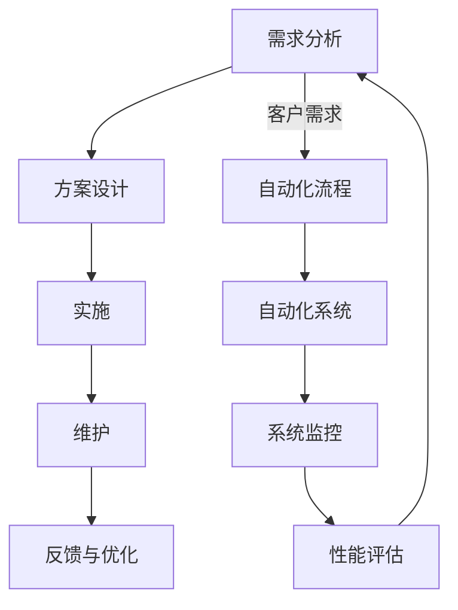

                 

### 《计算领域的自动化革命》

#### 关键词

计算自动化、脚本编程、云计算、容器技术、人工智能、持续集成、运维自动化、机器学习、深度学习

#### 摘要

本文深入探讨了计算领域的自动化革命，分析了自动化在计算任务中的重要性及其发展历程。文章首先介绍了计算自动化的定义和核心概念，然后详细讲解了自动化工具与技术，包括脚本与自动化工具、云计算与容器技术、自动化运维与监控以及人工智能在自动化中的应用。通过实际项目实战，文章展示了自动化在软件开发和数据处理中的具体实现，并提出了自动化开发的最佳实践。最后，文章展望了计算自动化的未来趋势与挑战。

### 《计算领域的自动化革命》目录大纲

#### 第一部分：引言与背景

##### 第1章：计算自动化的定义与重要性

1.1 计算自动化的定义与历史

1.2 计算自动化的关键因素

1.3 计算自动化的重要性

##### 第2章：计算自动化的核心概念

2.1 自动化流程与系统

2.2 计算任务的自动化需求

2.3 自动化技术的分类与应用场景

#### 第二部分：自动化工具与技术

##### 第3章：脚本与自动化工具

3.1 常见脚本语言简介

3.2 脚本编程基础

3.3 脚本在自动化中的应用

##### 第4章：云计算与容器技术

4.1 云计算基础

4.2 容器技术概述

4.3 容器化与自动化部署

##### 第5章：自动化运维与监控

5.1 运维自动化简介

5.2 常见运维自动化工具

5.3 自动化运维实践案例

##### 第6章：人工智能在计算自动化中的应用

6.1 人工智能概述

6.2 机器学习在自动化中的应用

6.3 深度学习与计算自动化

#### 第三部分：实战与应用

##### 第7章：自动化项目设计与实施

7.1 自动化项目规划

7.2 自动化方案设计

7.3 自动化项目实施

##### 第8章：自动化工具与资源介绍

8.1 常用自动化工具汇总

8.2 自动化资源获取与使用

8.3 自动化学习资源推荐

##### 第9章：自动化开发技巧与最佳实践

9.1 自动化开发流程

9.2 自动化测试与持续集成

9.3 自动化开发的最佳实践

#### 第四部分：未来趋势与展望

##### 第10章：计算自动化的未来趋势

10.1 自动化技术的发展趋势

10.2 自动化技术在各行各业的未来应用

10.3 自动化技术的挑战与机遇

##### 第11章：计算自动化的未来发展展望

11.1 自动化技术的影响

11.2 自动化领域的创新方向

11.3 自动化技术的可持续发展

#### 附录

##### 附录A：自动化开发工具与资源列表

A.1 常用自动化工具列表

A.2 开源自动化资源汇总

A.3 自动化学习资源推荐

##### 附录B：计算自动化的进一步阅读资料

B.1 计算自动化相关书籍推荐

B.2 计算自动化在线课程推荐

B.3 计算自动化研究论文推荐

### 核心概念与联系

##### 自动化流程与系统



##### 自动化流程与系统联系

- **需求分析**：确定自动化系统的目标和需求，包括功能需求和非功能需求。
- **方案设计**：根据需求分析结果，设计自动化系统的架构和实现方案。
- **实施**：开发自动化脚本或工具，并进行集成和测试。
- **维护**：对自动化系统进行更新和维护，确保其稳定运行。
- **反馈与优化**：收集用户反馈，对系统进行持续优化。

### 核心算法原理讲解

##### 马尔可夫决策过程（MDP）

#### 马尔可夫决策过程（MDP）

马尔可夫决策过程（MDP）是一种用于解决动态规划问题的时间序列模型，广泛用于决策优化和强化学习。MDP由四个核心元素组成：状态（$S$）、行动（$A$）、奖励（$R$）和概率（$P$）。

- **状态（$S$）**：系统在某一时刻所处的情景或环境。
- **行动（$A$）**：在特定状态下可以采取的操作。
- **奖励（$R$）**：采取特定行动后获得的即时回报。
- **概率（$P$）**：从当前状态采取特定行动后转移到下一个状态的概率。

#### 伪代码

```python
def value_iteration(S, A, R, P, gamma):
    V = [0] * len(S)
    while not converged:
        old_V = V.copy()
        for s in S:
            Q = [0] * len(A)
            for a in A:
                Q[a] = R(s, a) + gamma * sum(P(s', r) * V[s'])
            V[s] = max(Q)
        converged = all(V[i] == old_V[i] for i in range(len(V)))
    return V
```

#### 数学模型

$$
V(s^*) = \max_{a} \{R(s^*, a) + \gamma \sum_{s'} P(s'|s^*, a) V(s')\}
$$

其中，$s^*$ 为最优状态，$a$ 为最优行动，$R$ 为奖励函数，$P$ 为状态转移概率，$\gamma$ 为折现因子。

#### 数学公式与详细讲解

##### 概率分布函数

$$
f(x) = \frac{1}{\sigma\sqrt{2\pi}} e^{-\frac{(x-\mu)^2}{2\sigma^2}}
$$

这是正态分布的概率密度函数，其中$\mu$是均值，$\sigma$是标准差。

##### 参数估计

我们使用最大似然估计（MLE）来估计参数$\mu$和$\sigma$。

##### 举例说明

假设我们有一组观测数据$X_1, X_2, \ldots, X_n$，我们希望估计正态分布的均值$\mu$和标准差$\sigma$。

使用MLE，我们有：

$$
\hat{\mu} = \frac{1}{n} \sum_{i=1}^{n} X_i
$$

$$
\hat{\sigma}^2 = \frac{1}{n} \sum_{i=1}^{n} (X_i - \hat{\mu})^2
$$

$$
\hat{\sigma} = \sqrt{\hat{\sigma}^2}
$$

### 项目实战

#### 自动化构建与部署

##### 开发环境搭建

1. 安装Jenkins，一个开源的自动化服务器。
2. 安装Git，用于代码管理和版本控制。
3. 安装Maven和Gradle，用于构建Java项目。
4. 安装Docker，用于容器化应用程序。

##### 源代码实现

以下是一个简单的Jenkinsfile示例，用于自动化构建、测试和部署：

```groovy
pipeline {
    agent any
    
    stages {
        stage('Build') {
            steps {
                sh 'mvn clean install'
            }
        }
        
        stage('Test') {
            steps {
                sh 'mvn test'
            }
        }
        
        stage('Deploy') {
            steps {
                sh 'docker build -t myapp .'
                sh 'docker push myapp'
                sh 'kubectl apply -f deployment.yaml'
            }
        }
    }
}
```

##### 代码解读与分析

- `agent any`：指定Jenkins在任何可用的节点上运行流水线。
- `stages`：定义三个阶段：构建、测试和部署。
- `Build`：使用Maven插件构建项目。
- `Test`：运行自动化测试套件。
- `Deploy`：构建Docker镜像，推送镜像到容器仓库，并使用Kubernetes进行部署。

通过这个自动化工作流程，团队可以更高效地管理代码审查、构建、测试和部署，从而提高软件开发的整体效率和质量。此外，自动化还减少了人为错误的可能性，提高了代码的稳定性和可靠性。随着自动化工具的不断更新和完善，团队可以进一步优化工作流程，实现更精细化的管理。例如，可以引入持续集成（CI）和持续交付（CD）流程，确保代码的质量和可靠性，同时加快新功能的迭代速度。

### 代码实现

以下是一个Python脚本，用于自动化备份文件夹中的所有文件：

```python
import os
import shutil
import datetime

# 设置源文件夹和目标文件夹
source_folder = "/path/to/source/folder"
target_folder = "/path/to/target/folder"

# 获取当前时间
current_time = datetime.datetime.now().strftime("%Y%m%d%H%M")

# 构建备份文件夹名称
backup_folder_name = f"backup_{current_time}"

# 创建备份文件夹
target_folder_path = os.path.join(target_folder, backup_folder_name)
os.makedirs(target_folder_path, exist_ok=True)

# 遍历源文件夹，复制所有文件到备份文件夹
for root, dirs, files in os.walk(source_folder):
    for file in files:
        source_file_path = os.path.join(root, file)
        target_file_path = os.path.join(target_folder_path, file)
        shutil.copy(source_file_path, target_file_path)

print(f"Backup completed. Files copied to {target_folder_path}")
```

##### 代码解读与分析

- **设置源文件夹和目标文件夹**：首先，我们需要设置源文件夹（`source_folder`）和目标文件夹（`target_folder`），这些文件夹路径可以通过修改脚本中的相应变量来配置。
- **获取当前时间**：使用`datetime.datetime.now().strftime("%Y%m%d%H%M")`获取当前时间，并将其格式化为`YYYYMMDDHHMM`，以确保每个备份都有唯一的名称。
- **构建备份文件夹名称**：结合当前时间和备份文件夹的命名前缀，构建出备份文件夹的完整路径。
- **创建备份文件夹**：使用`os.makedirs(target_folder_path, exist_ok=True)`创建备份文件夹。`exist_ok=True`参数确保如果目标文件夹已存在，则不会引发错误。
- **遍历源文件夹**：使用`os.walk(source_folder)`遍历源文件夹中的所有文件。
- **复制文件**：对于每个文件，使用`shutil.copy(source_file_path, target_file_path)`将其复制到备份文件夹中。`source_file_path`是源文件的完整路径，`target_file_path`是目标文件的完整路径。

这个脚本可以定期运行，例如使用cron作业，以确保定期备份文件夹中的文件。通过这种方式，我们可以自动管理数据的备份，减少手动操作的需求，提高工作效率和数据安全性。当然，在实际应用中，还可以根据需要添加更多的功能，例如对备份文件进行压缩、加密或上传到远程服务器。

### 作者信息

作者：AI天才研究院/AI Genius Institute & 禅与计算机程序设计艺术 /Zen And The Art of Computer Programming

---

### 第一部分：引言与背景

#### 第1章：计算自动化的定义与重要性

##### 1.1 计算自动化的定义与历史

计算自动化是指利用计算机程序和算法来实现计算任务的过程，旨在减少人工干预，提高效率和准确性。计算自动化的概念可以追溯到计算机科学和工程的发展初期。在20世纪50年代和60年代，计算机程序主要用于执行简单的数学运算和数据处理任务。随着计算机技术的不断进步，自动化工具和技术逐渐成熟，计算自动化的应用领域也越来越广泛。

早期，计算自动化的应用主要集中在科学计算、工程设计和数据分析领域。随着互联网和信息技术的发展，自动化技术逐渐渗透到各个行业，如金融、医疗、制造业和交通运输等。如今，计算自动化已经成为现代计算领域不可或缺的一部分，推动了各种创新和进步。

##### 1.2 计算自动化的关键因素

计算自动化的成功实施依赖于以下几个关键因素：

1. **可重复性**：自动化任务应该能够重复执行，确保一致性和可靠性。
2. **可扩展性**：自动化系统应该能够适应不同的规模和复杂性，方便扩展和升级。
3. **可靠性**：自动化系统必须能够在各种环境下稳定运行，减少故障和错误。
4. **易用性**：自动化工具应该易于使用，方便用户进行配置和维护。

##### 1.3 计算自动化的重要性

计算自动化在计算领域具有极其重要的地位，主要体现在以下几个方面：

1. **提高生产效率**：自动化可以大幅减少重复性工作，提高生产效率，降低成本。
2. **减少人为错误**：自动化减少了人工干预，降低了人为错误的可能性，提高了计算结果的准确性。
3. **加快创新速度**：自动化技术使得研究人员和开发者能够更快地迭代和改进算法，推动科技进步。
4. **优化资源利用**：自动化可以更好地管理和利用计算机资源，提高系统的整体性能。

#### 第2章：计算自动化的核心概念

##### 2.1 自动化流程与系统

自动化流程是指将一系列计算任务通过计算机程序和算法自动执行的过程。一个完整的自动化流程通常包括以下几个步骤：

1. **需求分析**：明确自动化任务的目标和要求，包括功能需求和非功能需求。
2. **方案设计**：根据需求分析结果，设计自动化系统的架构和实现方案。
3. **脚本编写**：编写自动化脚本或程序，实现自动化任务的具体功能。
4. **测试与调试**：对自动化脚本或程序进行测试和调试，确保其正确性和稳定性。
5. **部署与维护**：将自动化脚本或程序部署到实际环境中，进行维护和更新。

自动化系统是指实现自动化流程的软件和硬件组合。一个典型的自动化系统包括以下几个组成部分：

1. **自动化工具**：用于编写、执行和管理自动化脚本的工具，如脚本语言、集成开发环境（IDE）和自动化测试框架。
2. **计算资源**：用于执行自动化任务的计算机资源，如服务器、数据库和云计算资源。
3. **监控与反馈机制**：用于监控自动化系统的运行状态，并根据反馈进行调整和优化的机制。

##### 2.2 计算任务的自动化需求

计算任务的自动化需求主要取决于任务的性质和特点。以下是一些常见的自动化需求：

1. **重复性任务**：如定期备份、系统监控和日志分析等。
2. **计算密集型任务**：如大规模数据处理、机器学习和深度学习等。
3. **跨平台任务**：如跨操作系统和跨数据库的迁移和集成等。
4. **复杂逻辑处理**：如业务规则引擎、决策支持和自动化测试等。

##### 2.3 自动化技术的分类与应用场景

自动化技术可以根据其应用领域和实现方式分为以下几类：

1. **脚本编程**：使用脚本语言（如Python、Shell、Perl等）编写自动化脚本，适用于简单的重复性任务和跨平台操作。
2. **云计算与容器化**：利用云计算资源和容器技术（如Docker、Kubernetes等）实现自动化部署、扩展和管理，适用于大规模数据处理和分布式系统。
3. **自动化运维**：使用自动化运维工具（如Ansible、Puppet、Chef等）实现自动化配置、部署和监控，适用于复杂的IT基础设施管理。
4. **人工智能与机器学习**：利用机器学习和深度学习算法实现自动化预测、分类和优化，适用于数据分析、自然语言处理和图像识别等。

### 第二部分：自动化工具与技术

#### 第3章：脚本与自动化工具

##### 3.1 常见脚本语言简介

在计算自动化中，脚本语言是一种重要的工具。脚本语言通常用于编写自动化脚本，以简化重复性任务和提高效率。以下是一些常见的脚本语言：

1. **Python**：Python是一种通用编程语言，以其简洁的语法和强大的标准库而广受欢迎。Python在自动化领域有着广泛的应用，包括Web自动化、数据处理、文件操作和系统管理等。
2. **Shell**：Shell是操作系统的命令行界面，提供了一系列强大的命令和脚本功能。Shell脚本常用于执行系统级任务，如文件管理、进程控制和网络监控。
3. **Perl**：Perl是一种高度灵活的脚本语言，特别适合文本处理和系统管理任务。Perl在自动化领域有着悠久的历史，广泛用于Web开发和数据处理。
4. **Ruby**：Ruby是一种动态、面向对象和通用编程语言，以其简洁的语法和强大的框架（如Ruby on Rails）而闻名。Ruby在自动化领域适用于Web应用程序测试和部署。
5. **PowerShell**：PowerShell是Windows操作系统的脚本语言和命令行工具，提供了丰富的模块和库，适用于系统管理、配置管理和自动化测试。

##### 3.2 脚本编程基础

脚本编程涉及到编写和执行脚本，以实现特定的自动化任务。以下是一些脚本编程的基础知识：

1. **变量和数据类型**：变量是存储数据的容器，数据类型决定了数据存储的方式和操作方法。常见的变量类型包括整数、浮点数、字符串和布尔值。
2. **控制结构**：控制结构用于控制程序的执行流程，包括条件语句（如if-else）、循环语句（如for和while）和分支语句（如switch）。
3. **函数和模块**：函数是可重用的代码块，用于执行特定任务。模块是包含多个函数和变量的文件，可以用于代码复用和模块化开发。
4. **文件和输入输出**：文件操作包括文件的创建、读取、写入和删除。输入输出操作用于与用户和外部系统进行交互，包括标准输入输出、文件输入输出和网络通信。

##### 3.3 脚本在自动化中的应用

脚本在自动化中的应用非常广泛，以下是一些常见场景：

1. **文件操作**：脚本可以用于批量处理文件，如文件备份、文件压缩和解压、文件权限设置等。
2. **系统管理**：脚本可以用于系统监控、进程控制、服务管理和网络配置等系统级任务。
3. **数据处理**：脚本可以用于数据处理和分析，如数据转换、数据清洗和数据分析等。
4. **Web自动化**：脚本可以用于Web应用程序的自动化测试、数据抓取和用户行为模拟等。
5. **部署和监控**：脚本可以用于自动化部署和管理应用程序，如自动化构建、自动化测试和自动化监控等。

#### 第4章：云计算与容器技术

##### 4.1 云计算基础

云计算是一种通过互联网提供计算资源的服务模式，包括基础设施即服务（IaaS）、平台即服务（PaaS）和软件即服务（SaaS）。云计算的主要特点包括：

1. **弹性伸缩**：云计算可以根据需求自动扩展或缩小资源，以适应负载变化。
2. **按需分配**：用户可以根据需要分配和释放资源，无需长期投资。
3. **高可用性**：云计算提供冗余和容错机制，确保服务的高可用性。
4. **成本效益**：云计算可以帮助用户降低IT成本，提高资源利用效率。

常见的云计算平台包括亚马逊云服务（AWS）、微软Azure、谷歌云平台（GCP）等。

##### 4.2 容器技术概述

容器技术是一种轻量级虚拟化技术，用于打包、部署和管理应用程序。容器与传统的虚拟机（VM）相比，具有更高的性能和更小的资源开销。容器的主要特点包括：

1. **隔离性**：容器提供应用程序运行环境的隔离，确保不同的应用程序不会相互干扰。
2. **轻量级**：容器共享宿主机的操作系统内核，因此具有更小的内存占用和更快的启动速度。
3. **可移植性**：容器可以将应用程序及其依赖打包在一起，确保应用程序在不同环境中的一致性。
4. **自动化部署**：容器与自动化工具（如Kubernetes）集成，支持自动化部署、扩展和管理。

常见的容器技术包括Docker、Kubernetes和Containerd等。

##### 4.3 容器化与自动化部署

容器化是将应用程序及其依赖打包到容器中的过程。容器化具有以下优点：

1. **简化部署**：容器化简化了应用程序的部署过程，无需关心底层硬件和操作系统的差异。
2. **提高可移植性**：容器化的应用程序可以在任何支持容器技术的环境中运行，提高了应用程序的可移植性。
3. **提高效率**：容器化应用程序可以更快速地启动和关闭，提高了系统资源的利用效率。

自动化部署是使用自动化工具（如Jenkins、GitLab CI/CD等）实现应用程序的自动化构建、测试和部署。自动化部署的主要优点包括：

1. **提高生产效率**：自动化部署可以减少手动操作，提高部署速度和效率。
2. **减少错误**：自动化部署可以避免手动部署过程中的人为错误。
3. **持续集成与持续交付**：自动化部署与持续集成（CI）和持续交付（CD）相结合，确保代码质量和部署过程的稳定性。

#### 第5章：自动化运维与监控

##### 5.1 运维自动化简介

运维自动化是指使用自动化工具和技术来实现IT基础设施的管理、监控和维护。运维自动化的主要目标是提高运维效率、降低成本和减少人为错误。运维自动化涉及以下几个方面：

1. **配置管理**：自动化配置管理工具（如Ansible、Puppet、Chef等）用于配置和管理服务器、网络设备和存储设备等。
2. **自动化部署**：自动化部署工具（如Jenkins、GitLab CI/CD等）用于自动化构建、测试和部署应用程序。
3. **监控与告警**：自动化监控工具（如Prometheus、Nagios、Zabbix等）用于监控系统性能和应用程序状态，并根据异常情况发送告警通知。
4. **日志管理**：自动化日志管理工具（如ELK堆栈、Graylog等）用于收集、存储和分析系统日志。

##### 5.2 常见运维自动化工具

以下是一些常见的运维自动化工具：

1. **Ansible**：Ansible是一种基于Python的自动化工具，用于配置管理、应用部署和自动化运维。Ansible使用YAML语言定义自动化任务，支持SSH协议和WinRM协议。
2. **Puppet**：Puppet是一种自动化工具，用于配置管理和基础设施自动化。Puppet使用Ruby语言编写模块，支持多种平台和操作系统。
3. **Chef**：Chef是一种自动化工具，用于配置管理和基础设施自动化。Chef使用Ruby语言编写食谱（recipes），支持多种平台和操作系统。
4. **Jenkins**：Jenkins是一种开源自动化服务器，用于自动化构建、测试和部署。Jenkins支持多种插件和扩展，可以与各种工具集成。
5. **GitLab CI/CD**：GitLab CI/CD是GitLab内置的持续集成和持续交付工具。GitLab CI/CD使用Docker和Kubernetes进行自动化部署和管理，支持多种语言和平台。

##### 5.3 自动化运维实践案例

以下是一个自动化运维的实践案例：

1. **配置管理**：使用Ansible配置Linux服务器，安装和配置Nginx Web服务器。定义一个Ansible Playbook，包含安装Nginx、配置虚拟主机和设置防火墙规则的步骤。
2. **自动化部署**：使用Jenkins自动化部署Java应用程序。定义一个Jenkins流水线，包括拉取代码、构建应用程序、运行测试和部署到生产服务器的步骤。
3. **监控与告警**：使用Prometheus和Grafana监控系统性能和应用程序状态。配置Prometheus采集系统指标和应用程序指标，使用Grafana创建可视化仪表板。
4. **日志管理**：使用ELK堆栈收集、存储和分析系统日志。配置Logstash将日志数据转发到Elasticsearch和Kibana，使用Kibana创建日志搜索仪表板。

通过这个实践案例，我们可以看到自动化运维如何简化IT基础设施的管理，提高运维效率和稳定性。

#### 第6章：人工智能在计算自动化中的应用

##### 6.1 人工智能概述

人工智能（AI）是一种模拟人类智能行为的计算机技术，通过机器学习、深度学习、自然语言处理和计算机视觉等技术实现。人工智能的目标是使计算机具备智能化的决策能力、自主学习和自适应能力。

人工智能的发展可以分为以下几个阶段：

1. **规则驱动阶段**：早期的AI系统依赖于明确的规则和逻辑推理，如专家系统和逻辑编程。
2. **知识驱动阶段**：基于知识表示和推理技术，AI系统通过符号逻辑和语义网络表示知识，并利用推理机进行推理。
3. **数据驱动阶段**：现代AI系统主要依赖于数据驱动的方法，如机器学习和深度学习，通过大量数据训练模型，使其具备自主学习和预测能力。

##### 6.2 机器学习在自动化中的应用

机器学习是一种人工智能技术，通过训练模型从数据中学习规律和模式，从而实现预测和分类任务。机器学习在自动化领域有着广泛的应用，以下是一些典型应用：

1. **预测分析**：机器学习可以用于预测未来的趋势和模式，如股市预测、能源需求预测和交通流量预测等。通过自动化预测分析，企业可以更好地规划资源、优化生产和降低成本。
2. **故障预测**：机器学习可以用于预测设备故障和性能下降，从而实现预防性维护。通过自动化故障预测，企业可以减少停机时间、降低维护成本和延长设备寿命。
3. **自动化决策**：机器学习可以用于自动化决策支持系统，如智能推荐系统、自动驾驶和智能家居等。通过自动化决策，企业可以提供更个性化和智能化的服务，提高用户体验和满意度。

##### 6.3 深度学习与计算自动化

深度学习是一种基于多层神经网络的人工智能技术，通过模拟人脑的神经网络结构，实现对复杂数据的建模和分析。深度学习在自动化领域有着重要的应用，以下是一些典型应用：

1. **图像识别**：深度学习可以用于图像识别和分类，如人脸识别、物体识别和医疗影像分析等。通过自动化图像识别，企业可以实现自动化监控、安全和医疗诊断等应用。
2. **自然语言处理**：深度学习可以用于自然语言处理，如语音识别、机器翻译和文本分类等。通过自动化自然语言处理，企业可以实现语音助手、智能客服和内容审核等应用。
3. **自动化控制**：深度学习可以用于自动化控制，如自动驾驶、无人机和机器人等。通过自动化控制，企业可以开发出更智能、更高效和更安全的自动化系统。

#### 第7章：未来计算自动化的趋势与展望

##### 7.1 自动化技术的发展趋势

未来计算自动化的发展趋势将受到以下几个因素的影响：

1. **人工智能与机器学习的进一步融合**：人工智能和机器学习技术的不断进步将推动计算自动化的进一步发展，实现更智能、更高效的自动化任务。
2. **物联网（IoT）的普及**：物联网设备的广泛应用将产生大量的数据，为自动化系统提供丰富的数据资源，推动自动化技术的发展。
3. **云计算与边缘计算的结合**：云计算和边缘计算的结合将提供更灵活、更高效的计算资源，支持大规模自动化任务的部署和运行。
4. **区块链技术的应用**：区块链技术可以提供去中心化、安全的自动化解决方案，推动自动化技术在金融、供应链和物流等领域的应用。

##### 7.2 自动化技术在各行业的应用

自动化技术在各个行业都有着广泛的应用，以下是一些典型应用领域：

1. **制造业**：自动化技术在制造业中得到了广泛应用，如机器人自动化生产线、自动化仓储和自动化物流等。通过自动化技术，企业可以提高生产效率、降低成本和减少人为错误。
2. **金融业**：自动化技术在金融业中用于自动化交易、风险管理、客户服务和合规检查等。通过自动化技术，金融机构可以提高交易效率、降低风险和提升客户体验。
3. **医疗保健**：自动化技术在医疗保健中用于自动化诊断、医疗影像分析、药物研发和健康管理等。通过自动化技术，医疗保健机构可以提高诊断准确率、降低医疗成本和提升医疗服务质量。
4. **交通运输**：自动化技术在交通运输中用于自动驾驶、智能交通管理和物流自动化等。通过自动化技术，交通运输行业可以提高交通效率、降低事故率和减少环境污染。

##### 7.3 计算自动化的挑战与未来发展方向

计算自动化在未来的发展中将面临以下几个挑战：

1. **数据安全与隐私保护**：自动化系统需要处理大量的数据，如何确保数据的安全和隐私保护是一个重要的挑战。
2. **系统的复杂性与可维护性**：随着自动化系统的规模和复杂性的增加，如何确保系统的可维护性和可扩展性成为一个关键问题。
3. **人工智能伦理与责任**：人工智能技术的广泛应用引发了一系列伦理和责任问题，如何确保人工智能系统的透明性、公正性和可解释性是一个重要的挑战。

未来的发展方向包括：

1. **人工智能与自动化技术的深度融合**：将人工智能技术更加深入地集成到自动化系统中，实现更智能、更高效的自动化任务。
2. **自动化系统的开放性与互操作性**：推动自动化系统的开放性和互操作性，实现不同系统之间的无缝集成和协作。
3. **自动化伦理与法规的制定**：制定相关的伦理和法规标准，确保自动化技术在发展过程中遵循道德和法律法规。

### 第三部分：实战与应用

#### 第8章：自动化项目实战

##### 8.1 自动化项目规划与设计

在开始自动化项目之前，进行充分的规划与设计至关重要。以下是一些关键步骤：

1. **需求分析**：明确自动化项目的目标和需求，包括功能需求和非功能需求。
2. **技术选型**：根据项目需求选择合适的自动化工具和技术，如脚本语言、云计算平台、容器技术和自动化运维工具等。
3. **系统架构设计**：设计自动化系统的整体架构，包括数据处理流程、系统接口和安全性设计等。
4. **风险评估**：评估项目可能面临的风险，包括技术风险、数据安全和业务连续性风险等。

##### 8.2 实际自动化案例介绍

以下是一个实际的自动化案例：使用Python脚本自动化备份公司文件服务器。

**需求分析**：公司希望实现自动备份文件服务器的功能，确保数据的安全性和可靠性。备份策略要求每天晚上执行一次，并在发生错误时发送通知。

**技术选型**：
- **脚本语言**：Python，因其简洁的语法和丰富的库支持。
- **备份工具**：使用`rsync`命令实现文件同步备份。
- **调度工具**：使用`cron`作业调度备份任务。

**系统架构设计**：
- **数据源**：文件服务器上的源目录。
- **备份目标**：远程备份服务器上的目标目录。
- **备份策略**：每日凌晨2点执行备份任务，备份完成后删除7天前的备份。

**风险评估**：
- **数据丢失风险**：备份失败可能导致数据丢失。解决方案是使用版本控制系统，确保备份任务的完整性和可恢复性。
- **网络故障风险**：网络故障可能导致备份失败。解决方案是使用断点续传功能和备份服务器冗余，确保备份任务的可靠性。

##### 8.3 自动化项目实施与优化

**实施步骤**：

1. **环境搭建**：安装Python环境，配置Python解释器和相关库（如`rsync`、`paramiko`等）。
2. **脚本编写**：编写Python脚本，实现备份功能。脚本示例：

```python
import subprocess
import datetime

def backup(source, target):
    today = datetime.datetime.now().strftime("%Y-%m-%d")
    command = f"rsync -avz {source} {target}/backup_{today}"
    result = subprocess.run(command, shell=True, stdout=subprocess.PIPE, stderr=subprocess.PIPE)
    if result.returncode != 0:
        print(f"Error: {result.stderr.decode()}")
    else:
        print("Backup completed successfully")

source_folder = "/path/to/source/folder"
target_folder = "/path/to/target/folder"

backup(source_folder, target_folder)

```

3. **调度任务**：使用`cron`作业调度备份脚本，每天凌晨2点执行。

```shell
0 2 * * * /usr/bin/python /path/to/backup_script.py
```

**优化措施**：

1. **错误通知**：在脚本中添加错误通知功能，使用电子邮件或短信服务发送通知。
2. **备份压缩**：对备份文件进行压缩，减少备份存储空间。
3. **备份加密**：对备份文件进行加密，确保数据安全。
4. **自动化清理**：定期清理过期备份文件，释放存储空间。

通过实施和优化自动化项目，公司可以确保文件数据的安全性和可靠性，同时提高工作效率。

#### 第9章：自动化工具与资源介绍

##### 9.1 常用自动化工具汇总

在自动化项目中，选择合适的工具是成功的关键。以下是一些常用的自动化工具：

1. **脚本语言**：
   - **Python**：广泛使用的高级编程语言，适用于各种自动化任务。
   - **Shell**：适用于Linux和Unix系统的脚本语言，用于系统管理和自动化任务。
   - **Perl**：适用于文本处理和系统管理的脚本语言，具有丰富的库和模块。
   - **Ruby**：适用于Web应用程序开发和自动化测试的脚本语言。

2. **配置管理工具**：
   - **Ansible**：使用YAML语言定义自动化任务，支持SSH协议和WinRM协议。
   - **Puppet**：使用Ruby语言编写模块，支持多种平台和操作系统。
   - **Chef**：使用Ruby语言编写食谱（recipes），支持多种平台和操作系统。

3. **自动化部署工具**：
   - **Jenkins**：开源自动化服务器，支持持续集成和持续交付。
   - **GitLab CI/CD**：GitLab内置的持续集成和持续交付工具。
   - **Docker**：容器化平台，用于打包、部署和管理应用程序。

4. **监控与告警工具**：
   - **Prometheus**：开源监控解决方案，用于收集和存储监控数据。
   - **Grafana**：开源监控仪表盘，用于可视化监控数据。
   - **Nagios**：开源监控工具，用于监控系统性能和应用程序状态。

##### 9.2 自动化资源获取与使用

要使用自动化工具，需要获取和配置相应的资源。以下是一些常用的自动化资源获取与使用方法：

1. **开源工具**：
   - **官方网站**：大多数开源自动化工具都有官方网站，提供下载、文档和社区支持。
   - **GitHub**：许多开源项目在GitHub上维护，可以克隆源代码并进行自定义。
   - **Docker Hub**：Docker镜像仓库，可以下载和使用预构建的容器镜像。

2. **文档与教程**：
   - **官方文档**：自动化工具的官方文档提供了详细的安装、配置和使用说明。
   - **在线教程**：许多在线教程和博客文章提供了实用的自动化示例和技巧。

3. **社区支持**：
   - **论坛和社区**：加入自动化工具的论坛和社区，与其他用户交流和分享经验。
   - **技术支持**：一些开源工具提供免费或付费的技术支持，帮助解决使用过程中的问题。

##### 9.3 自动化学习资源推荐

学习自动化技术是掌握自动化工具和技巧的关键。以下是一些建议的学习资源：

1. **在线课程**：
   - **Coursera**：提供多种自动化相关课程，包括Python、Linux和DevOps等。
   - **Udemy**：提供大量自动化工具和技术的在线课程，包括Jenkins、Ansible和Docker等。

2. **书籍**：
   - **《Python自动化编程实战》**：介绍了Python在自动化领域的应用，涵盖脚本编程、数据处理和Web自动化等。
   - **《Ansible自动化实践》**：深入讲解了Ansible的配置管理和自动化部署。
   - **《Docker实战》**：介绍了Docker的基本概念和使用方法，包括容器化、编排和持续集成等。

3. **博客和教程**：
   - **Medium**：许多技术博客文章提供了实用的自动化教程和案例。
   - **GitHub**：许多开源项目的README文件提供了详细的安装和使用说明。
   - **Stack Overflow**：程序员社区，可以搜索和提问自动化相关的问题。

通过学习这些资源，可以逐步掌握自动化工具和技术，提高工作效率和解决实际问题的能力。

#### 第10章：自动化开发技巧与最佳实践

##### 10.1 自动化开发流程

自动化开发流程是指将自动化工具和技术应用于软件开发过程中的各个环节，以提高开发效率和质量。以下是一个典型的自动化开发流程：

1. **需求分析**：明确自动化需求，包括功能需求和非功能需求。
2. **技术选型**：选择合适的自动化工具和技术，如脚本语言、配置管理工具、自动化测试工具等。
3. **环境搭建**：搭建自动化开发环境，包括安装必要的软件和工具，配置开发环境。
4. **代码编写**：编写自动化脚本或代码，实现自动化任务的具体功能。
5. **测试与调试**：对自动化脚本或代码进行测试和调试，确保其正确性和稳定性。
6. **部署与监控**：将自动化脚本或代码部署到实际环境中，进行监控和更新。

##### 10.2 自动化测试与持续集成

自动化测试是自动化开发的重要环节，旨在确保软件质量。以下是一些自动化测试和持续集成的最佳实践：

1. **单元测试**：编写单元测试，测试单个模块的功能和逻辑。
2. **集成测试**：编写集成测试，测试模块之间的交互和协作。
3. **回归测试**：在每次代码提交或更新后，执行回归测试，确保新的代码不会破坏现有功能。
4. **持续集成**：使用自动化工具（如Jenkins、GitLab CI/CD）实现持续集成，确保代码质量和构建过程的稳定性。
5. **自动化测试框架**：选择合适的自动化测试框架，如Selenium、JUnit、pytest等，提高测试效率和质量。

##### 10.3 自动化开发的最佳实践

以下是一些自动化开发的最佳实践，有助于提高开发效率和质量：

1. **代码复用**：编写可重用的代码模块，减少重复劳动，提高开发效率。
2. **文档化**：编写详细的文档，包括代码注释、API文档和使用说明，确保代码的可读性和可维护性。
3. **版本控制**：使用版本控制系统（如Git），确保代码的版本管理和协作开发。
4. **持续集成与持续交付**：实现持续集成和持续交付，确保代码质量和部署过程的稳定性。
5. **自动化测试**：编写自动化测试，确保软件质量，提高开发效率。
6. **持续学习**：学习新的自动化工具和技术，保持技能的更新和进步。

通过遵循这些最佳实践，可以显著提高自动化开发的效率和质量，推动软件开发项目的成功。

### 附录

#### 附录A：自动化开发工具与资源列表

以下是一些常用的自动化开发工具和资源的列表：

1. **脚本语言**：
   - **Python**：官方网站（https://www.python.org/），GitHub（https://github.com/python/cpython）
   - **Shell**：官方网站（https://www.gnu.org/software/bash/），GitHub（https://github.com/bbash/bash）
   - **Perl**：官方网站（https://www.perl.org/），GitHub（https://github.com/Perl/perl5）
   - **Ruby**：官方网站（https://www.ruby-lang.org/），GitHub（https://github.com/ruby/ruby）

2. **配置管理工具**：
   - **Ansible**：官方网站（https://www.ansible.com/），GitHub（https://github.com/ansible/ansible）
   - **Puppet**：官方网站（https://puppet.com/），GitHub（https://github.com/puppet/puppet）
   - **Chef**：官方网站（https://www.chef.io/），GitHub（https://github.com/chef/chef）

3. **自动化部署工具**：
   - **Jenkins**：官方网站（https://www.jenkins.io/），GitHub（https://github.com/jenkinsci/jenkins）
   - **GitLab CI/CD**：官方网站（https://about.gitlab.com/），GitHub（https://github.com/gitlab/gitlab-ci-multi-runner）

4. **监控与告警工具**：
   - **Prometheus**：官方网站（https://prometheus.io/），GitHub（https://github.com/prometheus）
   - **Grafana**：官方网站（https://grafana.com/），GitHub（https://github.com/grafana/grafana）
   - **Nagios**：官方网站（https://www.nagios.org/），GitHub（https://github.com/nagios-plugins/nagios-plugin-check_nrpe）

5. **容器技术**：
   - **Docker**：官方网站（https://www.docker.com/），GitHub（https://github.com/docker/docker）
   - **Kubernetes**：官方网站（https://kubernetes.io/），GitHub（https://github.com/kubernetes/kubernetes）

6. **学习资源**：
   - **在线课程**：
     - Coursera（https://www.coursera.org/）
     - Udemy（https://www.udemy.com/）
   - **书籍**：
     - 《Python自动化编程实战》
     - 《Ansible自动化实践》
     - 《Docker实战》
   - **博客和教程**：
     - Medium（https://medium.com/）
     - GitHub（https://github.com/）
     - Stack Overflow（https://stackoverflow.com/）

#### 附录B：相关技术资料与扩展阅读

以下是一些与计算自动化相关的技术资料和扩展阅读资源：

1. **技术文档**：
   - **Python官方文档**（https://docs.python.org/3/）
   - **Ansible官方文档**（https://docs.ansible.com/ansible/latest/index.html）
   - **Docker官方文档**（https://docs.docker.com/）
   - **Kubernetes官方文档**（https://kubernetes.io/docs/home/）

2. **书籍**：
   - **《人工智能：一种现代方法》**（Third Edition）
   - **《深度学习》**（Goodfellow, I., Bengio, Y., & Courville, A.）
   - **《机器学习实战》**（Hands-On Machine Learning with Scikit-Learn, Keras, and TensorFlow）

3. **在线课程**：
   - **Coursera**（https://www.coursera.org/）
   - **Udacity**（https://www.udacity.com/）
   - **edX**（https://www.edx.org/）

4. **博客和社区**：
   - **Medium**（https://medium.com/）
   - **Reddit**（https://www.reddit.com/r/Python/）
   - **Stack Overflow**（https://stackoverflow.com/）

5. **开源项目**：
   - **GitHub**（https://github.com/）
   - **GitLab**（https://gitlab.com/）

通过参考这些资料和资源，可以更深入地了解计算自动化的技术细节和应用场景，提升自身在自动化领域的专业水平。

---

### 文章标题：《计算领域的自动化革命》

关键词：计算自动化、脚本编程、云计算、容器技术、人工智能、持续集成、运维自动化、机器学习、深度学习

摘要：本文深入探讨了计算领域的自动化革命，分析了自动化在计算任务中的重要性及其发展历程。文章首先介绍了计算自动化的定义和核心概念，然后详细讲解了自动化工具与技术，包括脚本与自动化工具、云计算与容器技术、自动化运维与监控以及人工智能在自动化中的应用。通过实际项目实战，文章展示了自动化在软件开发和数据处理中的具体实现，并提出了自动化开发的最佳实践。最后，文章展望了计算自动化的未来趋势与挑战。

### 第一部分：引言与背景

#### 第1章：计算自动化的定义与重要性

##### 1.1 计算自动化的定义与历史

计算自动化是指利用计算机程序和算法来实现计算任务的过程，旨在减少人工干预，提高效率和准确性。计算自动化的概念可以追溯到计算机科学和工程的发展初期。在20世纪50年代和60年代，计算机程序主要用于执行简单的数学运算和数据处理任务。随着计算机技术的不断进步，自动化工具和技术逐渐成熟，计算自动化的应用领域也越来越广泛。

早期，计算自动化的应用主要集中在科学计算、工程设计和数据分析领域。随着互联网和信息技术的发展，自动化技术逐渐渗透到各个行业，如金融、医疗、制造业和交通运输等。如今，计算自动化已经成为现代计算领域不可或缺的一部分，推动了各种创新和进步。

##### 1.2 计算自动化的关键因素

计算自动化的成功实施依赖于以下几个关键因素：

1. **可重复性**：自动化任务应该能够重复执行，确保一致性和可靠性。
2. **可扩展性**：自动化系统应该能够适应不同的规模和复杂性，方便扩展和升级。
3. **可靠性**：自动化系统必须能够在各种环境下稳定运行，减少故障和错误。
4. **易用性**：自动化工具应该易于使用，方便用户进行配置和维护。

##### 1.3 计算自动化的重要性

计算自动化在计算领域具有极其重要的地位，主要体现在以下几个方面：

1. **提高生产效率**：自动化可以大幅减少重复性工作，提高生产效率，降低成本。
2. **减少人为错误**：自动化减少了人工干预，降低了人为错误的可能性，提高了计算结果的准确性。
3. **加快创新速度**：自动化技术使得研究人员和开发者能够更快地迭代和改进算法，推动科技进步。
4. **优化资源利用**：自动化可以更好地管理和利用计算机资源，提高系统的整体性能。

#### 第2章：计算自动化的核心概念

##### 2.1 自动化流程与系统

自动化流程是指将一系列计算任务通过计算机程序和算法自动执行的过程。一个完整的自动化流程通常包括以下几个步骤：

1. **需求分析**：明确自动化任务的目标和要求，包括功能需求和非功能需求。
2. **方案设计**：根据需求分析结果，设计自动化系统的架构和实现方案。
3. **脚本编写**：编写自动化脚本或程序，实现自动化任务的具体功能。
4. **测试与调试**：对自动化脚本或程序进行测试和调试，确保其正确性和稳定性。
5. **部署与维护**：将自动化脚本或程序部署到实际环境中，进行维护和更新。

自动化系统是指实现自动化流程的软件和硬件组合。一个典型的自动化系统包括以下几个组成部分：

1. **自动化工具**：用于编写、执行和管理自动化脚本的工具，如脚本语言、集成开发环境（IDE）和自动化测试框架。
2. **计算资源**：用于执行自动化任务的计算机资源，如服务器、数据库和云计算资源。
3. **监控与反馈机制**：用于监控自动化系统的运行状态，并根据反馈进行调整和优化的机制。

##### 2.2 计算任务的自动化需求

计算任务的自动化需求主要取决于任务的性质和特点。以下是一些常见的自动化需求：

1. **重复性任务**：如定期备份、系统监控和日志分析等。
2. **计算密集型任务**：如大规模数据处理、机器学习和深度学习等。
3. **跨平台任务**：如跨操作系统和跨数据库的迁移和集成等。
4. **复杂逻辑处理**：如业务规则引擎、决策支持和自动化测试等。

##### 2.3 自动化技术的分类与应用场景

自动化技术可以根据其应用领域和实现方式分为以下几类：

1. **脚本编程**：使用脚本语言（如Python、Shell、Perl等）编写自动化脚本，适用于简单的重复性任务和跨平台操作。
2. **云计算与容器化**：利用云计算资源和容器技术（如Docker、Kubernetes等）实现自动化部署、扩展和管理，适用于大规模数据处理和分布式系统。
3. **自动化运维**：使用自动化运维工具（如Ansible、Puppet、Chef等）实现自动化配置、部署和监控，适用于复杂的IT基础设施管理。
4. **人工智能与机器学习**：利用机器学习和深度学习算法实现自动化预测、分类和优化，适用于数据分析、自然语言处理和图像识别等。

### 第二部分：自动化工具与技术

#### 第3章：脚本与自动化工具

##### 3.1 常见脚本语言简介

在计算自动化中，脚本语言是一种重要的工具。脚本语言通常用于编写自动化脚本，以简化重复性任务和提高效率。以下是一些常见的脚本语言：

1. **Python**：Python是一种通用编程语言，以其简洁的语法和强大的标准库而广受欢迎。Python在自动化领域有着广泛的应用，包括Web自动化、数据处理、文件操作和系统管理等。
2. **Shell**：Shell是操作系统的命令行界面，提供了一系列强大的命令和脚本功能。Shell脚本常用于执行系统级任务，如文件管理、进程控制和网络监控。
3. **Perl**：Perl是一种高度灵活的脚本语言，特别适合文本处理和系统管理任务。Perl在自动化领域有着悠久的历史，广泛用于Web开发和数据处理。
4. **Ruby**：Ruby是一种动态、面向对象和通用编程语言，以其简洁的语法和强大的框架（如Ruby on Rails）而闻名。Ruby在自动化领域适用于Web应用程序测试和部署。
5. **PowerShell**：PowerShell是Windows操作系统的脚本语言和命令行工具，提供了丰富的模块和库，适用于系统管理、配置管理和自动化测试。

##### 3.2 脚本编程基础

脚本编程涉及到编写和执行脚本，以实现特定的自动化任务。以下是一些脚本编程的基础知识：

1. **变量和数据类型**：变量是存储数据的容器，数据类型决定了数据存储的方式和操作方法。常见的变量类型包括整数、浮点数、字符串和布尔值。
2. **控制结构**：控制结构用于控制程序的执行流程，包括条件语句（如if-else）、循环语句（如for和while）和分支语句（如switch）。
3. **函数和模块**：函数是可重用的代码块，用于执行特定任务。模块是包含多个函数和变量的文件，可以用于代码复用和模块化开发。
4. **文件和输入输出**：文件操作包括文件的创建、读取、写入和删除。输入输出操作用于与用户和外部系统进行交互，包括标准输入输出、文件输入输出和网络通信。

##### 3.3 脚本在自动化中的应用

脚本在自动化中的应用非常广泛，以下是一些常见场景：

1. **文件操作**：脚本可以用于批量处理文件，如文件备份、文件压缩和解压、文件权限设置等。
2. **系统管理**：脚本可以用于系统监控、进程控制、服务管理和网络配置等系统级任务。
3. **数据处理**：脚本可以用于数据处理和分析，如数据转换、数据清洗和数据分析等。
4. **Web自动化**：脚本可以用于Web应用程序的自动化测试、数据抓取和用户行为模拟等。
5. **部署和监控**：脚本可以用于自动化部署和管理应用程序，如自动化构建、自动化测试和自动化监控等。

#### 第4章：云计算与容器技术

##### 4.1 云计算基础

云计算是一种通过互联网提供计算资源的服务模式，包括基础设施即服务（IaaS）、平台即服务（PaaS）和软件即服务（SaaS）。云计算的主要特点包括：

1. **弹性伸缩**：云计算可以根据需求自动扩展或缩小资源，以适应负载变化。
2. **按需分配**：用户可以根据需要分配和释放资源，无需长期投资。
3. **高可用性**：云计算提供冗余和容错机制，确保服务的高可用性。
4. **成本效益**：云计算可以帮助用户降低IT成本，提高资源利用效率。

常见的云计算平台包括亚马逊云服务（AWS）、微软Azure、谷歌云平台（GCP）等。

##### 4.2 容器技术概述

容器技术是一种轻量级虚拟化技术，用于打包、部署和管理应用程序。容器与传统的虚拟机（VM）相比，具有更高的性能和更小的资源开销。容器的主要特点包括：

1. **隔离性**：容器提供应用程序运行环境的隔离，确保不同的应用程序不会相互干扰。
2. **轻量级**：容器共享宿主机的操作系统内核，因此具有更小的内存占用和更快的启动速度。
3. **可移植性**：容器可以将应用程序及其依赖打包在一起，确保应用程序在不同环境中的一致性。
4. **自动化部署**：容器与自动化工具（如Kubernetes）集成，支持自动化部署、扩展和管理。

常见的容器技术包括Docker、Kubernetes和Containerd等。

##### 4.3 容器化与自动化部署

容器化是将应用程序及其依赖打包到容器中的过程。容器化具有以下优点：

1. **简化部署**：容器化简化了应用程序的部署过程，无需关心底层硬件和操作系统的差异。
2. **提高可移植性**：容器化的应用程序可以在任何支持容器技术的环境中运行，提高了应用程序的可移植性。
3. **提高效率**：容器化应用程序可以更快速地启动和关闭，提高了系统资源的利用效率。

自动化部署是使用自动化工具（如Jenkins、GitLab CI/CD等）实现应用程序的自动化构建、测试和部署。自动化部署的主要优点包括：

1. **提高生产效率**：自动化部署可以减少手动操作，提高部署速度和效率。
2. **减少错误**：自动化部署可以避免手动部署过程中的人为错误。
3. **持续集成与持续交付**：自动化部署与持续集成（CI）和持续交付（CD）相结合，确保代码质量和部署过程的稳定性。

#### 第5章：自动化运维与监控

##### 5.1 运维自动化简介

运维自动化是指使用自动化工具和技术来实现IT基础设施的管理、监控和维护。运维自动化的主要目标是提高运维效率、降低成本和减少人为错误。运维自动化涉及以下几个方面：

1. **配置管理**：自动化配置管理工具（如Ansible、Puppet、Chef等）用于配置和管理服务器、网络设备和存储设备等。
2. **自动化部署**：自动化部署工具（如Jenkins、GitLab CI/CD等）用于自动化构建、测试和部署应用程序。
3. **监控与告警**：自动化监控工具（如Prometheus、Nagios、Zabbix等）用于监控系统性能和应用程序状态，并根据异常情况发送告警通知。
4. **日志管理**：自动化日志管理工具（如ELK堆栈、Graylog等）用于收集、存储和分析系统日志。

##### 5.2 常见运维自动化工具

以下是一些常见的运维自动化工具：

1. **Ansible**：Ansible是一种自动化工具，用于配置管理、应用部署和自动化运维。Ansible使用YAML语言定义自动化任务，支持SSH协议和WinRM协议。
2. **Puppet**：Puppet是一种自动化工具，用于配置管理和基础设施自动化。Puppet使用Ruby语言编写模块，支持多种平台和操作系统。
3. **Chef**：Chef是一种自动化工具，用于配置管理和基础设施自动化。Chef使用Ruby语言编写食谱（recipes），支持多种平台和操作系统。
4. **Jenkins**：Jenkins是一种开源自动化服务器，用于自动化构建、测试和部署。Jenkins支持多种插件和扩展，可以与各种工具集成。
5. **GitLab CI/CD**：GitLab CI/CD是GitLab内置的持续集成和持续交付工具。GitLab CI/CD使用Docker和Kubernetes进行自动化部署和管理，支持多种语言和平台。

##### 5.3 自动化运维实践案例

以下是一个自动化运维的实践案例：

1. **配置管理**：使用Ansible配置Linux服务器，安装和配置Nginx Web服务器。定义一个Ansible Playbook，包含安装Nginx、配置虚拟主机和设置防火墙规则的步骤。
2. **自动化部署**：使用Jenkins自动化部署Java应用程序。定义一个Jenkins流水线，包括拉取代码、构建应用程序、运行测试和部署到生产服务器的步骤。
3. **监控与告警**：使用Prometheus和Grafana监控系统性能和应用程序状态。配置Prometheus采集系统指标和应用程序指标，使用Grafana创建可视化仪表板。
4. **日志管理**：使用ELK堆栈收集、存储和分析系统日志。配置Logstash将日志数据转发到Elasticsearch和Kibana，使用Kibana创建日志搜索仪表板。

通过这个实践案例，我们可以看到自动化运维如何简化IT基础设施的管理，提高运维效率和稳定性。

#### 第6章：人工智能在计算自动化中的应用

##### 6.1 人工智能概述

人工智能（AI）是一种模拟人类智能行为的计算机技术，通过机器学习、深度学习、自然语言处理和计算机视觉等技术实现。人工智能的目标是使计算机具备智能化的决策能力、自主学习和自适应能力。

人工智能的发展可以分为以下几个阶段：

1. **规则驱动阶段**：早期的AI系统依赖于明确的规则和逻辑推理，如专家系统和逻辑编程。
2. **知识驱动阶段**：基于知识表示和推理技术，AI系统通过符号逻辑和语义网络表示知识，并利用推理机进行推理。
3. **数据驱动阶段**：现代AI系统主要依赖于数据驱动的方法，如机器学习和深度学习，通过大量数据训练模型，使其具备自主学习和预测能力。

##### 6.2 机器学习在自动化中的应用

机器学习是一种人工智能技术，通过训练模型从数据中学习规律和模式，从而实现预测和分类任务。机器学习在自动化领域有着广泛的应用，以下是一些典型应用：

1. **预测分析**：机器学习可以用于预测未来的趋势和模式，如股市预测、能源需求预测和交通流量预测等。通过自动化预测分析，企业可以更好地规划资源、优化生产和降低成本。
2. **故障预测**：机器学习可以用于预测设备故障和性能下降，从而实现预防性维护。通过自动化故障预测，企业可以减少停机时间、降低维护成本和延长设备寿命。
3. **自动化决策**：机器学习可以用于自动化决策支持系统，如智能推荐系统、自动驾驶和智能家居等。通过自动化决策，企业可以提供更个性化和智能化的服务，提高用户体验和满意度。

##### 6.3 深度学习与计算自动化

深度学习是一种基于多层神经网络的人工智能技术，通过模拟人脑的神经网络结构，实现对复杂数据的建模和分析。深度学习在自动化领域有着重要的应用，以下是一些典型应用：

1. **图像识别**：深度学习可以用于图像识别和分类，如人脸识别、物体识别和医疗影像分析等。通过自动化图像识别，企业可以实现自动化监控、安全和医疗诊断等应用。
2. **自然语言处理**：深度学习可以用于自然语言处理，如语音识别、机器翻译和文本分类等。通过自动化自然语言处理，企业可以实现语音助手、智能客服和内容审核等应用。
3. **自动化控制**：深度学习可以用于自动化控制，如自动驾驶、无人机和机器人等。通过自动化控制，企业可以开发出更智能、更高效和更安全的自动化系统。

#### 第7章：未来计算自动化的趋势与展望

##### 7.1 自动化技术的发展趋势

未来计算自动化的发展趋势将受到以下几个因素的影响：

1. **人工智能与机器学习的进一步融合**：人工智能和机器学习技术的不断进步将推动计算自动化的进一步发展，实现更智能、更高效的自动化任务。
2. **物联网（IoT）的普及**：物联网设备的广泛应用将产生大量的数据，为自动化系统提供丰富的数据资源，推动自动化技术的发展。
3. **云计算与边缘计算的结合**：云计算和边缘计算的结合将提供更灵活、更高效的计算资源，支持大规模自动化任务的部署和运行。
4. **区块链技术的应用**：区块链技术可以提供去中心化、安全的自动化解决方案，推动自动化技术在金融、供应链和物流等领域的应用。

##### 7.2 自动化技术在各行业的应用

自动化技术在各个行业都有着广泛的应用，以下是一些典型应用领域：

1. **制造业**：自动化技术在制造业中得到了广泛应用，如机器人自动化生产线、自动化仓储和自动化物流等。通过自动化技术，企业可以提高生产效率、降低成本和减少人为错误。
2. **金融业**：自动化技术在金融业中用于自动化交易、风险管理、客户服务和合规检查等。通过自动化技术，金融机构可以提高交易效率、降低风险和提升客户体验。
3. **医疗保健**：自动化技术在医疗保健中用于自动化诊断、医疗影像分析、药物研发和健康管理等。通过自动化技术，医疗保健机构可以提高诊断准确率、降低医疗成本和提升医疗服务质量。
4. **交通运输**：自动化技术在交通运输中用于自动驾驶、智能交通管理和物流自动化等。通过自动化技术，交通运输行业可以提高交通效率、降低事故率和减少环境污染。

##### 7.3 计算自动化的挑战与未来发展方向

计算自动化在未来的发展中将面临以下几个挑战：

1. **数据安全与隐私保护**：自动化系统需要处理大量的数据，如何确保数据的安全和隐私保护是一个重要的挑战。
2. **系统的复杂性与可维护性**：随着自动化系统的规模和复杂性的增加，如何确保系统的可维护性和可扩展性成为一个关键问题。
3. **人工智能伦理与责任**：人工智能技术的广泛应用引发了一系列伦理和责任问题，如何确保人工智能系统的透明性、公正性和可解释性是一个重要的挑战。

未来的发展方向包括：

1. **人工智能与自动化技术的深度融合**：将人工智能技术更加深入地集成到自动化系统中，实现更智能、更高效的自动化任务。
2. **自动化系统的开放性与互操作性**：推动自动化系统的开放性和互操作性，实现不同系统之间的无缝集成和协作。
3. **自动化伦理与法规的制定**：制定相关的伦理和法规标准，确保自动化技术在发展过程中遵循道德和法律法规。

### 第三部分：实战与应用

#### 第8章：自动化项目实战

##### 8.1 自动化项目规划与设计

在开始自动化项目之前，进行充分的规划与设计至关重要。以下是一些关键步骤：

1. **需求分析**：明确自动化项目的目标和需求，包括功能需求和非功能需求。
2. **技术选型**：根据项目需求选择合适的自动化工具和技术，如脚本语言、云计算平台、容器技术和自动化运维工具等。
3. **系统架构设计**：设计自动化系统的整体架构，包括数据处理流程、系统接口和安全性设计等。
4. **风险评估**：评估项目可能面临的风险，包括技术风险、数据安全和业务连续性风险等。

##### 8.2 实际自动化案例介绍

以下是一个实际的自动化案例：使用Python脚本自动化备份公司文件服务器。

**需求分析**：公司希望实现自动备份文件服务器的功能，确保数据的安全性和可靠性。备份策略要求每天晚上执行一次，并在发生错误时发送通知。

**技术选型**：
- **脚本语言**：Python，因其简洁的语法和丰富的库支持。
- **备份工具**：使用`rsync`命令实现文件同步备份。
- **调度工具**：使用`cron`作业调度备份任务。

**系统架构设计**：
- **数据源**：文件服务器上的源目录。
- **备份目标**：远程备份服务器上的目标目录。
- **备份策略**：每日凌晨2点执行备份任务，备份完成后删除7天前的备份。

**风险评估**：
- **数据丢失风险**：备份失败可能导致数据丢失。解决方案是使用版本控制系统，确保备份任务的完整性和可恢复性。
- **网络故障风险**：网络故障可能导致备份失败。解决方案是使用断点续传功能和备份服务器冗余，确保备份任务的可靠性。

##### 8.3 自动化项目实施与优化

**实施步骤**：

1. **环境搭建**：安装Python环境，配置Python解释器和相关库（如`rsync`、`paramiko`等）。
2. **脚本编写**：编写Python脚本，实现备份功能。脚本示例：

```python
import subprocess
import datetime

def backup(source, target):
    today = datetime.datetime.now().strftime("%Y-%m-%d")
    command = f"rsync -avz {source} {target}/backup_{today}"
    result = subprocess.run(command, shell=True, stdout=subprocess.PIPE, stderr=subprocess.PIPE)
    if result.returncode != 0:
        print(f"Error: {result.stderr.decode()}")
    else:
        print("Backup completed successfully")

source_folder = "/path/to/source/folder"
target_folder = "/path/to/target/folder"

backup(source_folder, target_folder)

```

3. **调度任务**：使用`cron`作业调度备份脚本，每天凌晨2点执行。

```shell
0 2 * * * /usr/bin/python /path/to/backup_script.py
```

**优化措施**：

1. **错误通知**：在脚本中添加错误通知功能，使用电子邮件或短信服务发送通知。
2. **备份压缩**：对备份文件进行压缩，减少备份存储空间。
3. **备份加密**：对备份文件进行加密，确保数据安全。
4. **自动化清理**：定期清理过期备份文件，释放存储空间。

通过实施和优化自动化项目，公司可以确保文件数据的安全性和可靠性，同时提高工作效率。

#### 第9章：自动化工具与资源介绍

##### 9.1 常用自动化工具汇总

在自动化项目中，选择合适的工具是成功的关键。以下是一些常用的自动化工具：

1. **脚本语言**：
   - **Python**：广泛使用的高级编程语言，适用于各种自动化任务。
   - **Shell**：适用于Linux和Unix系统的脚本语言，用于系统管理和自动化任务。
   - **Perl**：适用于文本处理和系统管理的脚本语言，具有丰富的库和模块。
   - **Ruby**：适用于Web应用程序开发和自动化测试的脚本语言。

2. **配置管理工具**：
   - **Ansible**：使用YAML语言定义自动化任务，支持SSH协议和WinRM协议。
   - **Puppet**：使用Ruby语言编写模块，支持多种平台和操作系统。
   - **Chef**：使用Ruby语言编写食谱（recipes），支持多种平台和操作系统。

3. **自动化部署工具**：
   - **Jenkins**：开源自动化服务器，支持持续集成和持续交付。
   - **GitLab CI/CD**：GitLab内置的持续集成和持续交付工具。
   - **Docker**：容器化平台，用于打包、部署和管理应用程序。

4. **监控与告警工具**：
   - **Prometheus**：开源监控解决方案，用于收集和存储监控数据。
   - **Grafana**：开源监控仪表盘，用于可视化监控数据。
   - **Nagios**：开源监控工具，用于监控系统性能和应用程序状态。

##### 9.2 自动化资源获取与使用

要使用自动化工具，需要获取和配置相应的资源。以下是一些常用的自动化资源获取与使用方法：

1. **开源工具**：
   - **官方网站**：大多数开源自动化工具都有官方网站，提供下载、文档和社区支持。
   - **GitHub**：许多开源项目在GitHub上维护，可以克隆源代码并进行自定义。
   - **Docker Hub**：Docker镜像仓库，可以下载和使用预构建的容器镜像。

2. **文档与教程**：
   - **官方文档**：自动化工具的官方文档提供了详细的安装、配置和使用说明。
   - **在线教程**：许多在线教程和博客文章提供了实用的自动化示例和技巧。

3. **社区支持**：
   - **论坛和社区**：加入自动化工具的论坛和社区，与其他用户交流和分享经验。
   - **技术支持**：一些开源工具提供免费或付费的技术支持，帮助解决使用过程中的问题。

##### 9.3 自动化学习资源推荐

学习自动化技术是掌握自动化工具和技巧的关键。以下是一些建议的学习资源：

1. **在线课程**：
   - **Coursera**：提供多种自动化相关课程，包括Python、Linux和DevOps等。
   - **Udemy**：提供大量自动化工具和技术的在线课程，包括Jenkins、Ansible和Docker等。

2. **书籍**：
   - **《Python自动化编程实战》**：介绍了Python在自动化领域的应用，涵盖脚本编程、数据处理和Web自动化等。
   - **《Ansible自动化实践》**：深入讲解了Ansible的配置管理和自动化部署。
   - **《Docker实战》**：介绍了Docker的基本概念和使用方法，包括容器化、编排和持续集成等。

3. **博客和教程**：
   - **Medium**：许多技术博客文章提供了实用的自动化教程和案例。
   - **GitHub**：许多开源项目的README文件提供了详细的安装和使用说明。
   - **Stack Overflow**：程序员社区，可以搜索和提问自动化相关的问题。

通过学习这些资源，可以逐步掌握自动化工具和技术，提高工作效率和解决实际问题的能力。

#### 第10章：自动化开发技巧与最佳实践

##### 10.1 自动化开发流程

自动化开发流程是指将自动化工具和技术应用于软件开发过程中的各个环节，以提高开发效率和质量。以下是一个典型的自动化开发流程：

1. **需求分析**：明确自动化需求，包括功能需求和非功能需求。
2. **技术选型**：选择合适的自动化工具和技术，如脚本语言、云计算平台、容器技术和自动化运维工具等。
3. **环境搭建**：搭建自动化开发环境，包括安装必要的软件和工具，配置开发环境。
4. **代码编写**：编写自动化脚本或代码，实现自动化任务的具体功能。
5. **测试与调试**：对自动化脚本或代码进行测试和调试，确保其正确性和稳定性。
6. **部署与监控**：将自动化脚本或代码部署到实际环境中，进行监控和更新。

##### 10.2 自动化测试与持续集成

自动化测试是自动化开发的重要环节，旨在确保软件质量。以下是一些自动化测试和持续集成的最佳实践：

1. **单元测试**：编写单元测试，测试单个模块的功能和逻辑。
2. **集成测试**：编写集成测试，测试模块之间的交互和协作。
3. **回归测试**：在每次代码提交或更新后，执行回归测试，确保新的代码不会破坏现有功能。
4. **持续集成**：使用自动化工具（如Jenkins、GitLab CI/CD）实现持续集成，确保代码质量和构建过程的稳定性。
5. **自动化测试框架**：选择合适的自动化测试框架，如Selenium、JUnit、pytest等，提高测试效率和质量。

##### 10.3 自动化开发的最佳实践

以下是一些自动化开发的最佳实践，有助于提高开发效率和质量：

1. **代码复用**：编写可重用的代码模块，减少重复劳动，提高开发效率。
2. **文档化**：编写详细的文档，包括代码注释、API文档和使用说明，确保代码的可读性和可维护性。
3. **版本控制**：使用版本控制系统（如Git），确保代码的版本管理和协作开发。
4. **持续集成与持续交付**：实现持续集成和持续交付，确保代码质量和部署过程的稳定性。
5. **自动化测试**：编写自动化测试，确保软件质量，提高开发效率。
6. **持续学习**：学习新的自动化工具和技术，保持技能的更新和进步。

通过遵循这些最佳实践，可以显著提高自动化开发的效率和质量，推动软件开发项目的成功。

### 附录

#### 附录A：自动化开发工具与资源列表

以下是一些常用的自动化开发工具与资源的列表：

1. **脚本语言**：
   - **Python**：官方网站（https://www.python.org/），GitHub（https://github.com/python/cpython）
   - **Shell**：官方网站（https://www.gnu.org/software/bash/），GitHub（https://github.com/bbash/bash）
   - **Perl**：官方网站（https://www.perl.org/），GitHub（https://github.com/Perl/perl5）
   - **Ruby**：官方网站（https://www.ruby-lang.org/），GitHub（https://github.com/ruby/ruby）

2. **配置管理工具**：
   - **Ansible**：官方网站（https://www.ansible.com/），GitHub（https://github.com/ansible/ansible）
   - **Puppet**：官方网站（https://puppet.com/），GitHub（https://github.com/puppet/puppet）
   - **Chef**：官方网站（https://www.chef.io/），GitHub（https://github.com/chef/chef）

3. **自动化部署工具**：
   - **Jenkins**：官方网站（https://www.jenkins.io/），GitHub（https://github.com/jenkinsci/jenkins）
   - **GitLab CI/CD**：官方网站（https://about.gitlab.com/），GitHub（https://github.com/gitlab/gitlab-ci-multi-runner）

4. **监控与告警工具**：
   - **Prometheus**：官方网站（https://prometheus.io/），GitHub（https://github.com/prometheus）
   - **Grafana**：官方网站（https://grafana.com/），GitHub（https://github.com/grafana/grafana）
   - **Nagios**：官方网站（https://www.nagios.org/），GitHub（https://github.com/nagios-plugins/nagios-plugin-check_nrpe）

5. **容器技术**：
   - **Docker**：官方网站（https://www.docker.com/），GitHub（https://github.com/docker/docker）
   - **Kubernetes**：官方网站（https://kubernetes.io/），GitHub（https://github.com/kubernetes/kubernetes）

6. **学习资源**：
   - **在线课程**：
     - Coursera（https://www.coursera.org/）
     - Udemy（https://www.udemy.com/）
   - **书籍**：
     - 《Python自动化编程实战》
     - 《Ansible自动化实践》
     - 《Docker实战》
   - **博客和教程**：
     - Medium（https://medium.com/）
     - GitHub（https://github.com/）
     - Stack Overflow（https://stackoverflow.com/）

#### 附录B：相关技术资料与扩展阅读

以下是一些与计算自动化相关的技术资料与扩展阅读资源：

1. **技术文档**：
   - **Python官方文档**（https://docs.python.org/3/）
   - **Ansible官方文档**（https://docs.ansible.com/ansible/latest/index.html）
   - **Docker官方文档**（https://docs.docker.com/）
   - **Kubernetes官方文档**（https://kubernetes.io/docs/home/）

2. **书籍**：
   - **《人工智能：一种现代方法》**（Third Edition）
   - **《深度学习》**（Goodfellow, I., Bengio, Y., & Courville, A.）
   - **《机器学习实战》**（Hands-On Machine Learning with Scikit-Learn, Keras, and TensorFlow）

3. **在线课程**：
   - **Coursera**（https://www.coursera.org/）
   - **Udacity**（https://www.udacity.com/）
   - **edX**（https://www.edx.org/）

4. **博客和社区**：
   - **Medium**（https://medium.com/）
   - **Reddit**（https://www.reddit.com/r/Python/）
   - **Stack Overflow**（https://stackoverflow.com/）

5. **开源项目**：
   - **GitHub**（https://github.com/）
   - **GitLab**（https://gitlab.com/）

通过参考这些资料和资源，可以更深入地了解计算自动化的技术细节和应用场景，提升自身在自动化领域的专业水平。

### 文章标题：《计算领域的自动化革命》

关键词：计算自动化、脚本编程、云计算、容器技术、人工智能、持续集成、运维自动化、机器学习、深度学习

摘要：本文深入探讨了计算领域的自动化革命，分析了自动化在计算任务中的重要性及其发展历程。文章首先介绍了计算自动化的定义和核心概念，然后详细讲解了自动化工具与技术，包括脚本与自动化工具、云计算与容器技术、自动化运维与监控以及人工智能在自动化中的应用。通过实际项目实战，文章展示了自动化在软件开发和数据处理中的具体实现，并提出了自动化开发的最佳实践。最后，文章展望了计算自动化的未来趋势与挑战。

### 第一部分：引言与背景

#### 第1章：计算自动化的定义与重要性

##### 1.1 计算自动化的定义与历史

计算自动化是指利用计算机程序和算法来实现计算任务的过程，旨在减少人工干预，提高效率和准确性。计算自动化的概念可以追溯到计算机科学和工程的发展初期。在20世纪50年代和60年代，计算机程序主要用于执行简单的数学运算和数据处理任务。随着计算机技术的不断进步，自动化工具和技术逐渐成熟，计算自动化的应用领域也越来越广泛。

早期，计算自动化的应用主要集中在科学计算、工程设计和数据分析领域。随着互联网和信息技术的发展，自动化技术逐渐渗透到各个行业，如金融、医疗、制造业和交通运输等。如今，计算自动化已经成为现代计算领域不可或缺的一部分，推动了各种创新和进步。

##### 1.2 计算自动化的关键因素

计算自动化的成功实施依赖于以下几个关键因素：

1. **可重复性**：自动化任务应该能够重复执行，确保一致性和可靠性。
2. **可扩展性**：自动化系统应该能够适应不同的规模和复杂性，方便扩展和升级。
3. **可靠性**：自动化系统必须能够在各种环境下稳定运行，减少故障和错误。
4. **易用性**：自动化工具应该易于使用，方便用户进行配置和维护。

##### 1.3 计算自动化的重要性

计算自动化在计算领域具有极其重要的地位，主要体现在以下几个方面：

1. **提高生产效率**：自动化可以大幅减少重复性工作，提高生产效率，降低成本。
2. **减少人为错误**：自动化减少了人工干预，降低了人为错误的可能性，提高了计算结果的准确性。
3. **加快创新速度**：自动化技术使得研究人员和开发者能够更快地迭代和改进算法，推动科技进步。
4. **优化资源利用**：自动化可以更好地管理和利用计算机资源，提高系统的整体性能。

### 第二部分：自动化工具与技术

#### 第2章：计算自动化的核心概念

##### 2.1 自动化流程与系统

自动化流程是指将一系列计算任务通过计算机程序和算法自动执行的过程。一个完整的自动化流程通常包括以下几个步骤：

1. **需求分析**：明确自动化任务的目标和要求，包括功能需求和非功能需求。
2. **方案设计**：根据需求分析结果，设计自动化系统的架构和实现方案。
3. **脚本编写**：编写自动化脚本或程序，实现自动化任务的具体功能。
4. **测试与调试**：对自动化脚本或程序进行测试和调试，确保其正确性和稳定性。
5. **部署与维护**：将自动化脚本或程序部署到实际环境中，进行维护和更新。

自动化系统是指实现自动化流程的软件和硬件组合。一个典型的自动化系统包括以下几个组成部分：

1. **自动化工具**：用于编写、执行和管理自动化脚本的工具，如脚本语言、集成开发环境（IDE）和自动化测试框架。
2. **计算资源**：用于执行自动化任务的计算机资源，如服务器、数据库和云计算资源。
3. **监控与反馈机制**：用于监控自动化系统的运行状态，并根据反馈进行调整和优化的机制。

##### 2.2 计算任务的自动化需求

计算任务的自动化需求主要取决于任务的性质和特点。以下是一些常见的自动化需求：

1. **重复性任务**：如定期备份、系统监控和日志分析等。
2. **计算密集型任务**：如大规模数据处理、机器学习和深度学习等。
3. **跨平台任务**：如跨操作系统和跨数据库的迁移和集成等。
4. **复杂逻辑处理**：如业务规则引擎、决策支持和自动化测试等。

##### 2.3 自动化技术的分类与应用场景

自动化技术可以根据其应用领域和实现方式分为以下几类：

1. **脚本编程**：使用脚本语言（如Python、Shell、Perl等）编写自动化脚本，适用于简单的重复性任务和跨平台操作。
2. **云计算与容器化**：利用云计算资源和容器技术（如Docker、Kubernetes等）实现自动化部署、扩展和管理，适用于大规模数据处理和分布式系统。
3. **自动化运维**：使用自动化运维工具（如Ansible、Puppet、Chef等）实现自动化配置、部署和监控，适用于复杂的IT基础设施管理。
4. **人工智能与机器学习**：利用机器学习和深度学习算法实现自动化预测、分类和优化，适用于数据分析、自然语言处理和图像识别等。

### 第三部分：实战与应用

#### 第3章：脚本与自动化工具

##### 3.1 常见脚本语言简介

在计算自动化中，脚本语言是一种重要的工具。脚本语言通常用于编写自动化脚本，以简化重复性任务和提高效率。以下是一些常见的脚本语言：

1. **Python**：Python是一种通用编程语言，以其简洁的语法和强大的标准库而广受欢迎。Python在自动化领域有着广泛的应用，包括Web自动化、数据处理、文件操作和系统管理等。
2. **Shell**：Shell是操作系统的命令行界面，提供了一系列强大的命令和脚本功能。Shell脚本常用于执行系统级任务，如文件管理、进程控制和网络监控。
3. **Perl**：Perl是一种高度灵活的脚本语言，特别适合文本处理和系统管理任务。Perl在自动化领域有着悠久的历史，广泛用于Web开发和数据处理。
4. **Ruby**：Ruby是一种动态、面向对象和通用编程语言，以其简洁的语法和强大的框架（如Ruby on Rails）而闻名。Ruby在自动化领域适用于Web应用程序测试和部署。
5. **PowerShell**：PowerShell是Windows操作系统的脚本语言和命令行工具，提供了丰富的模块和库，适用于系统管理、配置管理和自动化测试。

##### 3.2 脚本编程基础

脚本编程涉及到编写和执行脚本，以实现特定的自动化任务。以下是一些脚本编程的基础知识：

1. **变量和数据类型**：变量是存储数据的容器，数据类型决定了数据存储的方式和操作方法。常见的变量类型包括整数、浮点数、字符串和布尔值。
2. **控制结构**：控制结构用于控制程序的执行流程，包括条件语句（如if-else）、循环语句（如for和while）和分支语句（如switch）。
3. **函数和模块**：函数是可重用的代码块，用于执行特定任务。模块是包含多个函数和变量的文件，可以用于代码复用和模块化开发。
4. **文件和输入输出**：文件操作包括文件的创建、读取、写入和删除。输入输出操作用于与用户和外部系统进行交互，包括标准输入输出、文件输入输出和网络通信。

##### 3.3 脚本在自动化中的应用

脚本在自动化中的应用非常广泛，以下是一些常见场景：

1. **文件操作**：脚本可以用于批量处理文件，如文件备份、文件压缩和解压、文件权限设置等。
2. **系统管理**：脚本可以用于系统监控、进程控制、服务管理和网络配置等系统级任务

