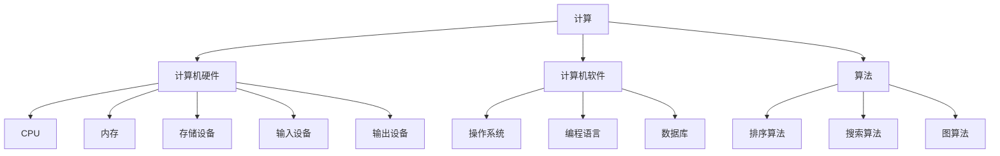

                 

## 文章标题：计算：写作后记

> 关键词：计算、计算机硬件、计算机软件、算法、人工智能、网络安全

> 摘要：本文作为《计算》一书的后记，旨在回顾和总结计算领域的基本概念、原理和应用。文章将深入探讨计算的历史发展、计算机硬件与软件基础、算法与应用、计算在人工智能与网络安全中的重要作用，以及对未来计算发展趋势的展望。通过本文，读者将更加全面地理解计算的核心概念，掌握计算的关键技术，并认识到计算在当今世界的重要地位。

---

## 目录大纲：计算：写作后记

### 第一部分：计算的基本概念与原理

#### 第1章：计算的概念与历史发展
1.1 计算的定义与作用  
1.2 计算的发展历程  
1.3 计算机技术的演进

#### 第2章：计算机硬件基础
2.1 计算机硬件组成  
2.2 CPU工作原理  
2.3 存储设备与存储原理

#### 第3章：计算机软件基础
3.1 计算机软件概述  
3.2 操作系统原理  
3.3 编程语言与编译原理

### 第二部分：计算算法与应用

#### 第4章：算法基础
4.1 算法概述  
4.2 常见算法分类  
4.3 算法效率分析

#### 第5章：数据结构与算法应用
5.1 数据结构概述  
5.2 线性表与链表  
5.3 栈与队列  
5.4 树与图

#### 第6章：计算在人工智能中的应用
6.1 人工智能概述  
6.2 神经网络与深度学习  
6.3 机器学习与数据挖掘

#### 第7章：计算在网络安全中的应用
7.1 网络安全概述  
7.2 加密算法与数字签名  
7.3 计算机病毒与防护

### 第三部分：计算实践与案例分析

#### 第8章：计算实践项目
8.1 项目准备与需求分析  
8.2 项目设计与实现  
8.3 项目测试与优化

#### 第9章：计算案例分析
9.1 案例一：搜索引擎优化  
9.2 案例二：图像识别系统  
9.3 案例三：区块链技术

### 第四部分：计算的未来与发展趋势

#### 第10章：计算的未来技术展望
10.1 量子计算  
10.2 云计算与边缘计算  
10.3 计算在物联网中的应用

#### 第11章：计算伦理与可持续发展
11.1 计算伦理概述  
11.2 数据隐私保护  
11.3 计算与可持续发展

#### 第12章：写作后记
12.1 书写过程的反思  
12.2 计算发展的展望  
12.3 对读者的寄语

### 附录

#### 附录A：核心概念与联系流程图

#### 附录B：计算工具与资源

#### 附录C：主要参考文献

## 第一部分：计算的基本概念与原理

### 第1章：计算的概念与历史发展

#### 1.1 计算的定义与作用

计算（Computation）是指通过操作、处理、分析和转换数据或信息以产生新的信息或知识的过程。计算可以理解为一种信息处理过程，是信息科学的核心。计算机科学、人工智能、数学、工程学等多个领域都与计算密切相关。

计算的定义可以追溯到计算机科学的起源。1940年代，随着第二次世界大战的爆发，密码学和军事需求推动了计算机技术的发展。艾伦·图灵（Alan Turing）提出了“图灵机”的概念，为计算理论奠定了基础。图灵机是一个抽象的计算模型，用于模拟任何可计算的过程。

计算在现代社会的各个方面都发挥着重要作用。在科学研究中，计算帮助科学家进行复杂的数据分析和模拟实验。在工程领域，计算用于优化设计、模拟物理现象和预测系统行为。在商业和金融领域，计算用于数据分析、风险管理、市场预测和自动化交易。在日常生活，计算通过智能手机、智能家居、在线服务和社交媒体改变了我们的生活方式。

#### 1.2 计算的发展历程

计算的发展历程可以分为几个重要的阶段：

1. **手工计算（Ancient Calculations）**：在计算机时代之前，计算主要依靠人类手工完成。古代文明发展了各种计算工具，如算盘、计算尺等，以辅助计算。这些工具提高了计算的效率，但仍然依赖于人的计算能力。

2. **机械计算（Mechanical Calculations）**：17世纪，威廉·希克（Wilhelm Schickard）和布莱兹·帕斯卡（Blaise Pascal）发明了机械计算器，用于简化数学运算。这些机械计算器利用齿轮和机械部件进行计算，虽然效率有限，但为后来的计算机技术奠定了基础。

3. **电子计算（Electronic Calculations）**：20世纪40年代，随着第二次世界大战的爆发，电子计算器得到迅速发展。1946年，冯·诺伊曼（John von Neumann）提出了存储程序计算机的概念，这一概念成为现代计算机的基础。

4. **计算机革命（Computer Revolution）**：从1970年代开始，计算机技术经历了快速发展。微型计算机、个人计算机和工作站的出现，使计算变得更加普及。互联网的发展进一步推动了计算的应用，计算成为了现代社会的核心。

5. **人工智能与计算（AI and Computation）**：近年来，人工智能（AI）技术的发展进一步推动了计算的进步。通过机器学习、深度学习和神经网络，计算机能够自动学习和优化计算过程，实现更加智能的计算。

#### 1.3 计算机技术的演进

计算机技术的演进可以分为几个重要的方面：

1. **硬件演进**：计算机硬件的演进包括CPU性能的提升、存储设备的增加、网络速度的提高等。CPU性能的提升使得计算机能够处理更复杂的任务，存储设备的增加提供了更多的存储空间，网络速度的提高促进了数据的快速传输和共享。

2. **软件演进**：计算机软件的演进包括操作系统、编程语言、数据库管理系统等的进步。操作系统的发展提高了计算机的效率和稳定性，编程语言的发展提供了更高效、更易于使用的编程工具，数据库管理系统的发展实现了数据的快速存储、检索和管理。

3. **计算模型演进**：计算机技术的演进还包括计算模型的进步。从最初的存储程序计算机到并行计算、分布式计算，再到云计算和边缘计算，计算模型不断进化，以适应日益复杂的应用需求。

4. **计算应用演进**：计算技术的进步推动了计算应用的广泛普及。从科学计算、工程计算到商业计算、个人计算，计算技术已经渗透到社会生活的各个领域，成为推动社会发展的重要力量。

### 第2章：计算机硬件基础

#### 2.1 计算机硬件组成

计算机硬件是指计算机中用于执行计算任务的物理设备和部件。计算机硬件主要由以下几个部分组成：

1. **中央处理器（CPU）**：中央处理器是计算机的核心，负责执行计算机程序中的指令。CPU的性能直接影响计算机的处理速度和效率。CPU主要由控制器、运算器和寄存器组成。

2. **内存（Memory）**：内存是计算机用于临时存储数据和指令的存储器。内存可以分为随机存取存储器（RAM）和只读存储器（ROM）。RAM用于存储正在执行的程序和数据，而ROM用于存储计算机的启动程序和基本输入输出系统（BIOS）。

3. **存储设备（Storage Devices）**：存储设备用于长期存储数据和文件。常见的存储设备包括硬盘驱动器（HDD）、固态硬盘（SSD）、光盘驱动器和闪存驱动器等。

4. **输入设备（Input Devices）**：输入设备用于向计算机输入数据和命令。常见的输入设备包括键盘、鼠标、扫描仪、触摸屏等。

5. **输出设备（Output Devices）**：输出设备用于从计算机输出数据和结果。常见的输出设备包括显示器、打印机、音响等。

6. **总线（Buses）**：总线是计算机内部各个部件之间传输数据和指令的通道。常见的总线包括系统总线、内存总线和输入输出总线等。

#### 2.2 CPU工作原理

CPU的工作原理可以分为以下几个步骤：

1. **取指令**：CPU从内存中读取下一条要执行的指令。

2. **指令译码**：CPU对指令进行译码，确定指令的操作类型和操作数。

3. **执行指令**：CPU根据译码结果执行指令，可能包括数据运算、控制流操作等。

4. **存储结果**：CPU将执行结果存储到内存或其他存储设备中。

CPU的工作原理依赖于指令集架构（Instruction Set Architecture，ISA），ISA定义了CPU可以执行的操作和指令格式。常见的指令集架构包括复杂指令集计算机（CISC）和精简指令集计算机（RISC）。

#### 2.3 存储设备与存储原理

存储设备是计算机中用于长期存储数据和文件的重要部件。存储设备可以分为以下几类：

1. **硬盘驱动器（HDD）**：硬盘驱动器使用机械磁盘和磁头来存储和检索数据。HDD具有高容量、低成本的特点，但读写速度较慢。

2. **固态硬盘（SSD）**：固态硬盘使用闪存（NAND）来存储数据，具有高速读写、低功耗、抗震性能好等优点。SSD逐渐取代HDD成为主流存储设备。

3. **光盘驱动器**：光盘驱动器用于读取和写入光盘（如CD、DVD和蓝光光盘）。光盘驱动器主要用于存储音乐、电影和软件等。

4. **闪存驱动器**：闪存驱动器（如U盘、SD卡等）使用闪存来存储数据，具有便携性、高速读写等优点。

存储原理主要基于以下概念：

1. **位（Bit）**：位是计算机中最小的存储单位，表示一个二进制数位（0或1）。

2. **字节（Byte）**：字节是计算机中常用的存储单位，由8位二进制数组成。

3. **块（Block）**：块是存储设备中的基本数据单元，通常包含多个字节。

4. **扇区（Sector）**：扇区是硬盘驱动器中的基本数据单元，通常包含512字节。

存储设备通过读写操作来存储和检索数据。在读取数据时，存储设备定位到数据所在的块或扇区，然后将数据传输到内存中。在写入数据时，存储设备将数据从内存中写入到指定的块或扇区中。

### 第3章：计算机软件基础

#### 3.1 计算机软件概述

计算机软件是指计算机中用于执行特定任务的程序和数据的集合。软件可以分为系统软件和应用软件两大类。

1. **系统软件（System Software）**：系统软件是计算机中负责管理硬件资源和提供基本服务的一类软件。系统软件包括操作系统、编译器、汇编器、驱动程序等。

   - **操作系统（Operating System）**：操作系统是管理计算机硬件资源和提供基本服务的软件。常见的操作系统包括Windows、Linux和macOS等。

   - **编译器（Compiler）**：编译器是将高级编程语言编写的程序翻译成机器语言程序的软件。编译器包括编译器、汇编器、链接器等。

   - **驱动程序（Driver）**：驱动程序是用于控制和管理计算机硬件设备的软件。驱动程序使操作系统能够与硬件设备进行通信。

2. **应用软件（Application Software）**：应用软件是为特定用户或任务提供具体功能的软件。应用软件包括办公软件、图像处理软件、游戏软件等。

   - **办公软件（Office Software）**：办公软件用于处理日常办公任务，如文本编辑、电子表格、演示文稿等。常见的办公软件包括Microsoft Office、Google Docs等。

   - **图像处理软件（Image Processing Software）**：图像处理软件用于编辑和增强图像。常见的图像处理软件包括Adobe Photoshop、GIMP等。

   - **游戏软件（Game Software）**：游戏软件是为娱乐和消遣而设计的软件。游戏软件可以分为单机游戏和多玩家游戏等。

#### 3.2 操作系统原理

操作系统（Operating System，OS）是计算机系统的核心软件，负责管理计算机硬件资源和提供基本服务。操作系统的主要功能包括进程管理、内存管理、文件管理和设备管理。

1. **进程管理（Process Management）**：进程是计算机中正在执行的程序的实例。操作系统负责创建、调度、同步和终止进程。进程管理包括进程调度算法、进程同步和进程通信。

2. **内存管理（Memory Management）**：内存管理是操作系统负责分配和回收内存空间的模块。内存管理包括内存分配算法、内存保护、内存置换等。

3. **文件管理（File Management）**：文件管理是操作系统负责存储、检索和管理文件系统的模块。文件管理包括文件系统的组织、文件的操作和访问控制等。

4. **设备管理（Device Management）**：设备管理是操作系统负责管理和控制外部设备的模块。设备管理包括设备的驱动程序、设备的调度和错误处理等。

常见的操作系统有：

- **Windows**：Windows是由微软公司开发的操作系统，广泛应用于个人计算机和服务器。Windows提供了用户友好的界面和丰富的应用程序。

- **Linux**：Linux是一种开源操作系统，广泛应用于服务器、嵌入式系统和超级计算机。Linux以其稳定性和安全性著称。

- **macOS**：macOS是苹果公司开发的操作系统，用于苹果公司的Macintosh计算机。macOS以其优雅的用户界面和强大的性能受到用户的喜爱。

#### 3.3 编程语言与编译原理

编程语言是用于编写计算机程序的语言。编程语言可以分为低级语言、高级语言和非常高级语言。

1. **低级语言（Low-Level Language）**：低级语言是接近机器语言的编程语言，如汇编语言。汇编语言使用符号和操作码来表示机器语言指令，但仍然与机器语言密切相关。

2. **高级语言（High-Level Language）**：高级语言是更接近人类自然语言和数学符号的编程语言，如C、C++、Java等。高级语言提供了更丰富的数据类型、控制结构和函数库，使编程更加高效和易于理解。

3. **非常高级语言（Very High-Level Language）**：非常高级语言是更加抽象和易于使用的编程语言，如Python、Ruby、JavaScript等。非常高级语言通常具有自动内存管理、丰富的库和框架，使编程更加便捷。

编译原理是编译器设计和实现的理论基础。编译器是将高级语言程序转换为机器语言程序的软件。编译器的主要组成部分包括词法分析器、语法分析器、语义分析器、代码生成器和优化器。

1. **词法分析（Lexical Analysis）**：词法分析器将源代码分解成词法单元（tokens），如标识符、关键字、操作符等。

2. **语法分析（Syntax Analysis）**：语法分析器根据编程语言的语法规则对源代码进行语法分析，生成抽象语法树（Abstract Syntax Tree，AST）。

3. **语义分析（Semantic Analysis）**：语义分析器检查源代码的语义正确性，如类型检查、变量作用域等。

4. **代码生成（Code Generation）**：代码生成器根据抽象语法树生成机器语言代码。

5. **优化（Optimization）**：优化器对生成的机器语言代码进行优化，提高程序的执行效率和性能。

## 第二部分：计算算法与应用

### 第4章：算法基础

#### 4.1 算法概述

算法（Algorithm）是指解决问题的一系列明确的步骤。算法可以用于计算、排序、搜索、优化等各个方面。算法的特点是确定性、有限性和有效性。

算法的确定性意味着算法的每一步都是明确的，不会产生歧义。算法的有限性意味着算法在有限的步骤内完成，不会无限循环。算法的有效性意味着算法能够在实际操作中解决问题。

算法的表示方法包括伪代码、流程图和图形表示。伪代码是一种使用自然语言和编程语言元素来描述算法的表示方法。流程图使用图形元素来表示算法的步骤和分支。图形表示使用图形来表示算法的结构和关系。

算法的复杂度是评估算法性能的重要指标。算法的复杂度包括时间复杂度和空间复杂度。

- **时间复杂度**：时间复杂度描述了算法在输入规模增长时执行时间的增长速度。常见的时间复杂度包括常数时间（O(1)）、对数时间（O(log n)）、线性时间（O(n)）、线性对数时间（O(n log n)）等。

- **空间复杂度**：空间复杂度描述了算法在输入规模增长时占用内存的增长速度。常见的时间复杂度包括常数空间（O(1)）、线性空间（O(n)）等。

#### 4.2 常见算法分类

算法可以根据解决问题的方法和目标进行分类。

- **排序算法**：排序算法用于对一组元素进行排序。常见的排序算法包括冒泡排序、选择排序、插入排序、快速排序、归并排序等。

- **搜索算法**：搜索算法用于在一组元素中查找特定元素。常见的搜索算法包括线性搜索、二分搜索、深度优先搜索、广度优先搜索等。

- **图算法**：图算法用于解决与图相关的问题。常见的图算法包括最短路径算法、最小生成树算法、拓扑排序算法等。

- **动态规划算法**：动态规划算法用于解决最优化问题。动态规划算法通过将问题分解为子问题并利用子问题的解来求解整个问题。

- **分治算法**：分治算法通过将问题分解为较小的子问题，分别解决子问题，然后将子问题的解合并为原问题的解。

#### 4.3 算法效率分析

算法的效率是评估算法性能的重要指标。算法的效率可以通过时间复杂度和空间复杂度来衡量。

- **时间效率**：时间效率描述了算法在执行过程中的时间消耗。算法的时间复杂度决定了算法的时间效率。常见的时间复杂度包括常数时间（O(1)）、对数时间（O(log n)）、线性时间（O(n)）、线性对数时间（O(n log n)）等。

- **空间效率**：空间效率描述了算法在执行过程中的空间消耗。算法的空间复杂度决定了算法的空间效率。常见的时间复杂度包括常数空间（O(1)）、线性空间（O(n)）等。

算法的效率分析有助于选择合适的算法来解决具体问题。在实际应用中，需要综合考虑算法的时间效率、空间效率和实际需求，选择最合适的算法。

### 第5章：数据结构与算法应用

#### 5.1 数据结构概述

数据结构是指用于存储和组织数据的方式。数据结构可以分为线性数据结构和非线性数据结构。

- **线性数据结构**：线性数据结构中的元素按照线性顺序排列，每个元素只有一个前驱和一个后继。常见的线性数据结构包括数组、链表、栈、队列等。

  - **数组（Array）**：数组是一种基于连续内存空间的数据结构，用于存储一系列元素。数组的元素可以通过索引来访问。

  - **链表（Linked List）**：链表是一种由节点组成的线性数据结构，每个节点包含数据和指向下一个节点的指针。链表的元素可以通过指针来访问。

  - **栈（Stack）**：栈是一种后进先出（Last In First Out，LIFO）的数据结构，用于存储元素的插入和删除。栈的元素只能通过顶部进行访问。

  - **队列（Queue）**：队列是一种先进先出（First In First Out，FIFO）的数据结构，用于存储元素的插入和删除。队列的元素可以通过头部和尾部进行访问。

- **非线性数据结构**：非线性数据结构中的元素不按照线性顺序排列，每个元素可以有多个前驱和后继。常见的非线性数据结构包括树、图、堆等。

  - **树（Tree）**：树是一种由节点组成的层次结构，每个节点可以有零个或多个子节点。树是一种常用的数据结构，用于表示层次关系和组织结构。

  - **图（Graph）**：图是一种由节点和边组成的数据结构，用于表示复杂的关系和网络。图可以分为有向图和无向图等。

  - **堆（Heap）**：堆是一种特殊的树形数据结构，用于存储具有优先级的元素。堆通常用于实现优先队列和贪心算法。

数据结构的选择取决于具体的应用需求和性能要求。不同的数据结构具有不同的优点和局限性，需要根据实际需求进行选择。

#### 5.2 线性表与链表

线性表（Linear List）是一种线性数据结构，用于存储一系列元素。线性表中的元素按照线性顺序排列，每个元素只有一个前驱和一个后继。

- **数组**：数组是一种基于连续内存空间的数据结构，用于存储一系列元素。数组的元素可以通过索引来访问。数组的优点是访问速度快，但插入和删除操作需要移动其他元素。

- **链表**：链表是一种由节点组成的线性数据结构，每个节点包含数据和指向下一个节点的指针。链表的元素可以通过指针来访问。链表的优点是插入和删除操作灵活，但访问速度较慢。

线性表和链表的主要应用包括：

- **实现栈和队列**：线性表和链表可以用于实现栈和队列，这两种数据结构在算法设计和实现中广泛应用。

- **动态内存分配**：链表可以用于动态内存分配，通过插入和删除节点来管理内存空间。

- **字符串操作**：链表可以用于实现字符串操作，如插入、删除、替换等。

- **查找算法**：链表可以用于实现一些查找算法，如线性搜索和二分搜索。

线性表和链表的选择取决于具体的应用需求和性能要求。在实际应用中，需要综合考虑数据的访问模式和操作频率，选择最合适的数据结构。

#### 5.3 栈与队列

栈（Stack）和队列（Queue）是两种常见的线性数据结构，用于实现特定的操作。

- **栈**：栈是一种后进先出（Last In First Out，LIFO）的数据结构，用于存储元素的插入和删除。栈的元素只能通过顶部进行访问。栈的主要应用包括函数调用、递归算法、括号匹配等。

  - **后进先出（LIFO）**：栈遵循后进先出的原则，即最后进入栈的元素首先出栈。

  - **栈的插入和删除**：栈的插入和删除操作通常在栈顶进行。插入操作称为压栈（push），删除操作称为弹栈（pop）。

- **队列**：队列是一种先进先出（First In First Out，FIFO）的数据结构，用于存储元素的插入和删除。队列的元素可以通过头部和尾部进行访问。队列的主要应用包括打印任务管理、缓冲区管理、广度优先搜索等。

  - **先进先出（FIFO）**：队列遵循先进先出的原则，即最早进入队列的元素首先出队。

  - **队列的插入和删除**：队列的插入操作通常在尾部进行，称为入队（enqueue）；删除操作通常在头部进行，称为出队（dequeue）。

栈和队列的优缺点如下：

- **栈**：栈的优点是插入和删除操作简单高效，时间复杂度为O(1)。栈的缺点是只能通过顶部进行访问，不支持随机访问。栈适用于需要后进先出操作的场合。

- **队列**：队列的优点是插入和删除操作灵活，支持随机访问。队列的缺点是插入和删除操作的时间复杂度为O(n)，其中n是队列的长度。队列适用于需要先进先出操作的场合。

在实际应用中，栈和队列的选择取决于具体的应用需求和操作频率。需要根据实际情况综合考虑，选择最合适的数据结构。

#### 5.4 树与图

树（Tree）和图（Graph）是两种常见的非线性数据结构，用于表示层次关系和网络关系。

- **树**：树是一种由节点组成的层次结构，每个节点可以有零个或多个子节点。树是一种重要的数据结构，广泛应用于组织结构、文件系统、决策树等领域。

  - **树的节点**：树的每个节点包含数据和一个或多个子节点。树的根节点没有父节点，叶节点没有子节点。

  - **树的层次**：树的节点按照层次排列，根节点位于第一层，其子节点位于第二层，以此类推。

  - **树的遍历**：树的遍历是指按一定顺序访问树的所有节点。常见的遍历方法包括先序遍历、中序遍历和后序遍历。

  - **二叉树**：二叉树是一种特殊的树，每个节点最多有两个子节点。二叉树广泛应用于排序、搜索、平衡树等领域。

- **图**：图是一种由节点和边组成的数据结构，用于表示复杂的关系和网络。图广泛应用于网络拓扑、社交网络、交通网络等领域。

  - **图的节点**：图的每个节点表示一个实体或对象。

  - **图的边**：图的边表示节点之间的连接关系。图的边可以是有向的或无向的。

  - **图的遍历**：图的遍历是指按一定顺序访问图的所有节点。常见的遍历方法包括深度优先搜索（DFS）和广度优先搜索（BFS）。

树和图的主要应用如下：

- **树的应用**：树广泛应用于组织结构、文件系统、决策树等领域。树可以用于表示层次关系，支持高效的搜索和遍历操作。

- **图的应用**：图广泛应用于网络拓扑、社交网络、交通网络等领域。图可以用于表示复杂的关系和网络，支持高效的搜索和路径查找操作。

树和图的选择取决于具体的应用需求和关系表示。在实际应用中，需要根据实际情况综合考虑，选择最合适的数据结构。

### 第6章：计算在人工智能中的应用

#### 6.1 人工智能概述

人工智能（Artificial Intelligence，AI）是指通过计算机模拟人类智能的技术和科学。人工智能的目标是使计算机具备感知、思考、学习和行动的能力，以实现自动化和智能化。

人工智能可以分为几种类型：

- **弱人工智能（Narrow AI）**：弱人工智能专注于特定任务，如语音识别、图像识别、自然语言处理等。弱人工智能具有很强的特定任务能力，但在其他任务上表现有限。

- **强人工智能（General AI）**：强人工智能具备广泛的知识和智能，能够像人类一样进行思考、学习和行动。强人工智能目前还处于研究阶段，尚未实现。

人工智能的核心技术包括：

- **机器学习（Machine Learning）**：机器学习是指通过训练模型来从数据中学习规律和模式，并利用这些规律和模式进行预测和决策。

- **深度学习（Deep Learning）**：深度学习是机器学习的一种方法，通过多层神经网络来学习数据的特征和模式。深度学习在图像识别、语音识别、自然语言处理等领域取得了显著的成果。

- **自然语言处理（Natural Language Processing，NLP）**：自然语言处理是指使计算机能够理解和处理人类自然语言的技术。自然语言处理广泛应用于搜索引擎、聊天机器人、语言翻译等领域。

#### 6.2 神经网络与深度学习

神经网络（Neural Network）是模拟生物神经系统的计算模型，由大量相互连接的神经元组成。神经网络通过学习输入数据和输出数据之间的关系，实现数据的分类、回归、生成等任务。

深度学习（Deep Learning）是神经网络的一种方法，通过多层神经网络（深度神经网络）来学习数据的复杂特征和模式。深度学习在图像识别、语音识别、自然语言处理等领域取得了显著的成果。

深度学习的主要组成部分包括：

- **神经网络结构**：神经网络结构是指网络的层次结构，包括输入层、隐藏层和输出层。隐藏层可以有多层，形成深度神经网络。

- **激活函数**：激活函数用于引入非线性关系，使神经网络能够学习复杂的特征。常见的激活函数包括Sigmoid函数、ReLU函数、Tanh函数等。

- **优化算法**：优化算法用于优化神经网络的参数，以最小化损失函数。常见的优化算法包括梯度下降法、随机梯度下降法、Adam优化器等。

- **损失函数**：损失函数用于评估神经网络的预测结果与真实结果之间的差距。常见的损失函数包括均方误差（MSE）、交叉熵（Cross Entropy）等。

深度学习的关键技术和方法包括：

- **卷积神经网络（CNN）**：卷积神经网络是一种用于图像识别和处理的深度学习模型，通过卷积层、池化层和全连接层等结构来提取图像特征。

- **循环神经网络（RNN）**：循环神经网络是一种用于序列数据处理的深度学习模型，通过隐藏层的状态循环来处理序列数据。常见的RNN结构包括LSTM（长短时记忆网络）和GRU（门控循环单元）。

- **生成对抗网络（GAN）**：生成对抗网络是一种用于生成对抗性数据的深度学习模型，通过生成器和判别器之间的对抗训练来实现数据的生成。

#### 6.3 机器学习与数据挖掘

机器学习（Machine Learning）是指通过训练模型来从数据中学习规律和模式，并利用这些规律和模式进行预测和决策。机器学习是人工智能的重要分支，广泛应用于分类、回归、聚类、降维等领域。

数据挖掘（Data Mining）是指从大量数据中提取有价值的信息和知识的过程。数据挖掘包括数据预处理、特征选择、模式发现、知识表示等步骤。

机器学习和数据挖掘的关键技术和方法包括：

- **分类（Classification）**：分类是将数据划分为不同类别的过程。常见的分类算法包括决策树、支持向量机（SVM）、K-最近邻（KNN）等。

- **回归（Regression）**：回归是预测连续值的过程。常见的回归算法包括线性回归、多项式回归、岭回归等。

- **聚类（Clustering）**：聚类是将数据划分为相似的数据集的过程。常见的聚类算法包括K-均值聚类、层次聚类、DBSCAN等。

- **降维（Dimensionality Reduction）**：降维是将高维数据转换成低维数据的过程。常见的降维算法包括主成分分析（PCA）、线性判别分析（LDA）等。

- **特征选择（Feature Selection）**：特征选择是选择对预测任务最有用的特征的过程。特征选择可以降低数据的维度，提高模型的性能。

机器学习和数据挖掘在各个领域都有广泛的应用，如金融、医疗、电子商务、社交媒体等。通过机器学习和数据挖掘，可以从大量数据中提取有价值的信息，帮助企业和组织做出更好的决策。

### 第7章：计算在网络安全中的应用

#### 7.1 网络安全概述

网络安全是指保护计算机网络系统免受恶意攻击、入侵和破坏的措施和策略。网络安全涉及到计算机硬件、软件、网络和数据等多个方面。

网络安全的主要目标是：

- **保密性**：确保网络中的数据和信息不被未经授权的人访问和泄露。

- **完整性**：确保网络中的数据和信息系统不被未经授权的人篡改或破坏。

- **可用性**：确保网络系统和数据在需要时能够被授权用户访问和使用。

网络安全的关键要素包括：

- **身份验证（Authentication）**：身份验证是验证用户身份的过程，确保只有授权用户可以访问网络资源。

- **访问控制（Access Control）**：访问控制是限制和监控用户对网络资源的访问权限，确保只有授权用户可以访问特定的资源。

- **加密（Encryption）**：加密是使用加密算法将明文数据转换为密文的过程，保护数据在传输和存储过程中的安全性。

- **入侵检测（Intrusion Detection）**：入侵检测是监控网络活动，检测和防止恶意攻击的过程。

- **安全策略（Security Policy）**：安全策略是组织制定的关于网络安全的规定和指南，指导网络安全的管理和实施。

网络安全面临着多种威胁和攻击，如：

- **恶意软件（Malware）**：恶意软件是指具有恶意目的的软件，如病毒、蠕虫、木马等，可以破坏系统、窃取数据和造成其他损害。

- **网络钓鱼（Phishing）**：网络钓鱼是一种欺诈行为，通过伪装成可信网站或发送假冒邮件来骗取用户的个人信息。

- **拒绝服务攻击（Denial of Service，DoS）**：拒绝服务攻击是通过大量无效请求占用网络资源，使网络服务无法正常使用。

- **分布式拒绝服务攻击（DDoS）**：分布式拒绝服务攻击是通过多个受控制的系统向目标系统发起大量请求，以达到瘫痪目标系统的目的。

网络安全需要采取多种措施来保护网络系统，如安装防病毒软件、定期更新系统、使用防火墙、实施严格的访问控制策略等。同时，网络安全也需要不断提高安全意识和防护能力，以应对不断演变的网络安全威胁。

#### 7.2 加密算法与数字签名

加密算法是网络安全中用于保护数据传输和存储的重要技术。加密算法通过将明文数据转换为密文，使数据在传输和存储过程中不被未经授权的人访问和读取。

加密算法可以分为对称加密算法和非对称加密算法。

- **对称加密算法**：对称加密算法使用相同的密钥对数据进行加密和解密。常见的对称加密算法包括DES、AES等。对称加密算法的优点是加密和解密速度快，但缺点是密钥的传输和管理复杂。

- **非对称加密算法**：非对称加密算法使用一对密钥，公钥用于加密，私钥用于解密。常见的非对称加密算法包括RSA、ECC等。非对称加密算法的优点是密钥传输安全，但加密和解密速度较慢。

数字签名是一种用于验证数据完整性和真实性的技术。数字签名通过使用非对称加密算法对数据进行签名，使数据在传输和存储过程中不被篡改。

数字签名的主要功能包括：

- **数据完整性**：数字签名可以验证数据的完整性，确保数据在传输和存储过程中未被篡改。

- **数据真实性**：数字签名可以验证数据的真实性，确保数据是由合法的发送者发送的。

数字签名的生成过程如下：

1. **生成密钥对**：发送方生成一对密钥，包括公钥和私钥。公钥用于加密数据，私钥用于解密数据。

2. **签名数据**：发送方使用私钥对数据进行签名，生成数字签名。签名数据包括数据的哈希值和私钥的签名。

3. **发送数据与签名**：发送方将数据和数字签名一起发送给接收方。

数字签名的验证过程如下：

1. **计算哈希值**：接收方使用相同的哈希算法计算接收到的数据的哈希值。

2. **验证签名**：接收方使用发送方的公钥对数字签名进行验证，生成公钥签名。如果公钥签名与计算的哈希值一致，则数字签名验证通过。

数字签名在网络安全中具有重要的应用，如电子邮件签名、文件签名、数字证书等。通过数字签名，可以确保数据的完整性和真实性，提高网络通信的安全性。

#### 7.3 计算机病毒与防护

计算机病毒是一种恶意软件，通过篡改、破坏计算机系统中的程序和数据，对计算机系统造成损害。计算机病毒可以通过网络、存储设备、电子邮件等多种途径传播。

计算机病毒的主要特征包括：

- **传染性**：计算机病毒可以通过网络、存储设备等途径传播，感染其他计算机。

- **破坏性**：计算机病毒可以破坏计算机系统中的程序和数据，导致系统崩溃、数据丢失等。

- **潜伏性**：计算机病毒可以在计算机系统中潜伏，不立即发作，等待时机成熟时进行破坏。

- **隐蔽性**：计算机病毒可以通过修改系统文件、隐藏自身等方式，使病毒难以被发现。

计算机病毒的常见类型包括：

- **引导型病毒**：引导型病毒感染计算机的引导记录，在系统启动时自动运行，感染系统文件和其他程序。

- **文件型病毒**：文件型病毒感染计算机的文件，在文件运行时自动执行，感染其他文件。

- **宏病毒**：宏病毒通过感染文档和电子表格中的宏，在打开文档时自动运行。

计算机病毒的防护措施包括：

- **安装防病毒软件**：安装防病毒软件，定期更新病毒库，可以检测和清除计算机中的病毒。

- **定期备份重要数据**：定期备份重要数据，以防止数据丢失。

- **开启防火墙**：开启防火墙，限制未授权的网络访问，减少病毒感染的风险。

- **不打开来历不明的文件和邮件**：不打开来历不明的文件和邮件，避免感染病毒。

- **使用安全的网络连接**：使用安全的网络连接，避免在公共Wi-Fi等不安全的网络环境下访问敏感信息。

通过采取以上防护措施，可以有效降低计算机病毒对计算机系统的威胁，保障计算机的安全运行。

### 第三部分：计算实践与案例分析

#### 第8章：计算实践项目

计算实践项目是验证计算理论和方法的有效途径。通过实际操作和项目实施，可以加深对计算概念、原理和技术的理解，培养解决实际问题的能力。

#### 8.1 项目准备与需求分析

项目准备与需求分析是计算实践项目的第一步，包括以下几个方面：

- **确定项目目标**：明确项目的目标和需求，确保项目实施的方向和范围。

- **调研相关技术**：了解与项目相关的计算技术和方法，评估其可行性。

- **组建项目团队**：根据项目需求，组建合适的项目团队，确保团队成员具备相关的技能和经验。

- **制定项目计划**：制定详细的项目计划，包括时间表、任务分配和资源需求等。

- **环境搭建**：搭建项目所需的环境，包括开发工具、编程语言、数据库等。

#### 8.2 项目设计与实现

项目设计与实现是计算实践项目的核心环节，包括以下几个方面：

- **需求分析**：对项目需求进行详细分析，确定项目的功能模块和设计要求。

- **系统架构设计**：根据需求分析结果，设计系统的架构和模块，确定各个模块的功能和接口。

- **数据结构与算法设计**：选择合适的数据结构和算法，设计项目的核心算法和数据存储结构。

- **编码实现**：根据设计文档，编写项目的代码，实现各个功能模块。

- **单元测试**：对实现的功能模块进行单元测试，确保每个模块的正确性和稳定性。

- **集成测试**：将各个模块进行集成测试，确保系统整体的功能和性能。

#### 8.3 项目测试与优化

项目测试与优化是计算实践项目的关键步骤，包括以下几个方面：

- **功能测试**：对项目的功能进行全面测试，确保各个功能模块的正确性和完整性。

- **性能测试**：对项目的性能进行测试，评估系统的响应速度、吞吐量和资源消耗等。

- **压力测试**：对项目的稳定性进行压力测试，模拟高负载情况，检测系统的响应和稳定性。

- **优化与调整**：根据测试结果，对项目进行优化和调整，提高系统的性能和稳定性。

- **部署与运维**：将项目部署到实际环境中，进行长期的运维和维护，确保系统的正常运行。

通过计算实践项目，可以深入理解计算的理论和实践，提高实际操作能力，为未来的职业发展打下坚实基础。

#### 第9章：计算案例分析

计算在各个领域都有广泛的应用，以下介绍三个具体的计算案例分析。

##### 9.1 搜索引擎优化

搜索引擎优化（Search Engine Optimization，SEO）是一种通过优化网站内容和结构，提高网站在搜索引擎结果页（Search Engine Results Page，SERP）上的排名和可见性的技术。SEO的目标是吸引更多的有针对性的流量，提高网站的用户体验和商业价值。

**案例背景**：某电子商务网站希望通过SEO技术提高其在搜索引擎中的排名，吸引更多的潜在客户。

**解决方案**：

1. **关键词研究**：通过分析目标市场和用户需求，确定适合网站的关键词，并进行关键词优化。

2. **内容优化**：针对确定的关键词，优化网站的标题、描述、正文等内容，提高内容的丰富度和相关性。

3. **结构优化**：优化网站的导航结构、URL结构和内部链接，提高网站的层次结构和易用性。

4. **技术优化**：优化网站的加载速度、移动适配性、安全性等，提高用户体验和搜索引擎友好度。

**效果评估**：经过一系列的SEO优化，该电子商务网站在搜索引擎中的排名显著提高，流量和转化率都有明显提升。

##### 9.2 图像识别系统

图像识别系统是一种通过计算机视觉技术对图像进行分析和处理，自动识别和分类图像内容的技术。图像识别系统广泛应用于安防监控、医疗诊断、自动驾驶等领域。

**案例背景**：某安防公司希望开发一套智能监控系统，能够自动识别和报警特定目标。

**解决方案**：

1. **图像采集**：通过摄像头等设备采集实时视频流，将视频帧转换为图像数据。

2. **预处理**：对图像进行预处理，如去噪、缩放、旋转等，提高图像质量和识别效果。

3. **特征提取**：使用计算机视觉算法提取图像特征，如边缘检测、纹理分析等。

4. **模型训练**：使用已标记的数据集训练图像识别模型，如卷积神经网络（CNN）等。

5. **实时识别**：将实时视频流中的图像输入到训练好的模型中，进行自动识别和报警。

**效果评估**：经过实际应用测试，该图像识别系统在多种场景下表现出良好的识别准确率和实时性。

##### 9.3 区块链技术

区块链技术是一种分布式账本技术，通过密码学和共识算法确保数据的不可篡改性和透明性。区块链技术广泛应用于金融、供应链管理、版权保护等领域。

**案例背景**：某物流公司希望通过区块链技术实现供应链的透明化和可追溯性。

**解决方案**：

1. **数据采集**：通过物联网设备采集货物的位置、状态等信息，上传到区块链网络。

2. **数据加密**：使用区块链网络中的加密算法对采集到的数据进行加密，确保数据的安全性。

3. **数据存储**：将加密后的数据存储在区块链网络中，实现数据的分布式存储和备份。

4. **共识算法**：使用共识算法确保区块链网络中的数据一致性和安全性。

5. **查询与监控**：通过区块链浏览器等工具查询和监控供应链信息，提高供应链的透明度和可追溯性。

**效果评估**：经过实际应用测试，区块链技术在该物流公司的供应链管理中表现出良好的数据安全性、透明性和效率。

### 第四部分：计算的未来与发展趋势

#### 第10章：计算的未来技术展望

计算技术正不断演进，为未来的科技发展带来无限可能。以下是计算在未来几个关键领域的发展趋势：

##### 10.1 量子计算

量子计算是一种利用量子力学原理进行计算的技术，具有巨大的并行处理能力和计算速度。量子计算的关键技术包括量子比特（qubit）、量子门、量子纠缠和量子误差校正。

- **量子比特**：量子比特是量子计算的基本单元，与传统计算机的比特不同，量子比特可以同时处于0和1的叠加状态，实现并行计算。

- **量子门**：量子门是量子计算的基本操作，类似于传统计算机的逻辑门。量子门可以对量子比特进行操作，实现量子态的转换。

- **量子纠缠**：量子纠缠是量子计算的核心特性，两个或多个量子比特之间的状态相互关联，即使相隔很远，一个量子比特的状态变化会立即影响另一个量子比特的状态。

- **量子误差校正**：量子计算中的误差很难避免，量子误差校正技术通过冗余编码和纠错算法，确保量子计算的正确性和可靠性。

量子计算在未来可能带来的突破性应用包括：

- **复杂问题求解**：量子计算可以解决传统计算机难以处理的复杂问题，如量子模拟、优化问题和密码破解等。

- **药物研发**：量子计算可以加速药物分子模拟和设计，提高药物研发的效率。

- **材料科学**：量子计算可以帮助发现新材料和优化材料性能，推动材料科学的发展。

##### 10.2 云计算与边缘计算

云计算是一种基于互联网的计算模式，通过虚拟化技术和分布式计算资源，提供可伸缩、灵活和高效的服务。边缘计算则是在靠近数据源的地方进行数据处理和存储，减少数据传输延迟和网络负担。

云计算与边缘计算的发展趋势包括：

- **云计算服务多样化**：云计算服务从传统的基础设施即服务（IaaS）、平台即服务（PaaS）和软件即服务（SaaS）扩展到更多的应用场景，如游戏、视频流、物联网等。

- **边缘计算普及化**：随着物联网和5G技术的发展，边缘计算逐渐普及，为实时性要求高的应用提供更好的性能和响应速度。

- **云计算与边缘计算融合**：云计算和边缘计算将相互融合，形成一种混合计算模式，实现计算资源的灵活调度和优化。

未来，云计算与边缘计算将带来以下应用场景：

- **智能城市**：通过云计算和边缘计算，实现城市交通、能源管理、环境保护等领域的智能化。

- **智能制造**：通过边缘计算，实现生产线上的实时监控、故障诊断和优化生产流程。

- **智能医疗**：通过云计算和边缘计算，实现远程医疗诊断、健康监测和智能药物管理。

##### 10.3 计算在物联网中的应用

物联网（Internet of Things，IoT）是通过互联网连接各种设备和传感器，实现智能化的数据采集、传输和处理。计算在物联网中的应用将极大地推动物联网的发展。

物联网计算的关键技术包括：

- **边缘计算**：通过在物联网设备附近部署边缘计算节点，实现实时数据处理和本地化决策，减少数据传输延迟和网络负担。

- **云计算**：通过云计算平台，提供海量数据的存储、分析和处理能力，实现物联网的全面监控和管理。

- **雾计算**：雾计算是介于云计算和边缘计算之间的一种计算模式，通过分布式计算资源，实现物联网设备的高效管理和数据共享。

物联网计算的未来发展趋势包括：

- **智能设备普及**：随着物联网技术的成熟，越来越多的设备将实现互联互通，智能设备将渗透到各个领域。

- **数据驱动决策**：通过海量数据的采集和分析，实现精准的预测和决策，提高物联网系统的智能化水平。

- **智能服务**：通过物联网计算，实现智能家居、智能交通、智能医疗等领域的个性化服务和智能优化。

计算技术在未来将继续发展，为人类带来更加智能、高效和便利的生活方式。通过量子计算、云计算和物联网等技术的融合，计算将开启新的科技革命，推动人类社会向更加智能、可持续的方向发展。

### 第11章：计算伦理与可持续发展

#### 11.1 计算伦理概述

计算伦理是指关于计算技术对社会、环境和人类福祉的影响及责任的研究。随着计算技术的快速发展，其伦理问题也日益凸显。计算伦理涉及多个方面，包括隐私、安全、公平和责任等。

- **隐私**：计算技术广泛收集和使用个人数据，引发了隐私问题。如何保护用户的隐私，防止数据泄露和滥用，是计算伦理的重要议题。

- **安全**：网络安全威胁日益增多，计算技术的安全性成为关键问题。如何确保计算系统的安全，防范恶意攻击和漏洞，是计算伦理的重要任务。

- **公平**：计算技术在不同社会群体中的普及和应用存在差异，可能导致公平性问题。如何消除数字鸿沟，确保所有人都能公平地享受计算技术的好处，是计算伦理需要关注的问题。

- **责任**：计算技术的开发者、使用者和监管者都需要承担相应的责任。如何界定和落实责任，确保计算技术的健康发展，是计算伦理需要探讨的问题。

#### 11.2 数据隐私保护

数据隐私保护是计算伦理中的重要议题。随着大数据和人工智能的发展，个人数据的收集和使用越来越普遍，数据隐私问题也日益突出。

- **数据收集**：在数据收集阶段，需要明确收集数据的范围、目的和用途，确保收集的数据符合用户的知情权和同意权。

- **数据存储**：在数据存储阶段，需要采取加密、去识别化和数据最小化等技术手段，确保数据的安全性和隐私性。

- **数据处理**：在数据处理阶段，需要遵守数据处理的合法、公正和透明的原则，确保数据处理的合法性和合规性。

- **数据共享**：在数据共享阶段，需要明确数据共享的范围、条件和用途，确保数据共享的合法性和安全性。

为保护数据隐私，可以采取以下措施：

- **制定隐私政策**：组织制定详细的隐私政策，明确数据收集、存储、处理和共享的原则和流程。

- **用户知情同意**：在数据收集和使用过程中，确保用户充分知情并同意其个人数据的收集和使用。

- **数据匿名化**：对敏感数据进行匿名化处理，以减少对个人隐私的侵犯。

- **加强监管**：政府和监管机构应加强对数据隐私保护的监管，确保相关法律法规的实施。

#### 11.3 计算与可持续发展

计算技术在可持续发展中发挥着重要作用，可以促进资源优化、环境保护和社会进步。

- **资源优化**：计算技术可以帮助企业和组织优化资源配置，提高生产效率，降低能源消耗和碳排放。

- **环境保护**：计算技术可以用于监测和预测环境变化，优化环境保护策略，推动绿色发展。

- **社会进步**：计算技术可以推动教育、医疗、公共服务等领域的创新和发展，提高人民生活水平和社会福利。

为促进计算技术的可持续发展，可以采取以下措施：

- **绿色计算**：推动绿色计算技术的发展，降低计算能耗和碳排放，提高计算资源的利用效率。

- **循环经济**：推广循环经济理念，通过计算技术优化资源的回收和再利用。

- **社会责任**：企业和社会组织应承担计算技术的社会责任，关注计算技术对社会和环境的影响。

- **政策支持**：政府和监管机构应制定相关政策，鼓励计算技术的可持续发展，推动计算技术为社会和环境做出贡献。

计算伦理与可持续发展是计算技术发展的重要方向。通过关注计算伦理问题，采取有效措施保护数据隐私，促进计算技术的可持续发展，可以确保计算技术为人类社会带来更多的福祉。

### 第12章：写作后记

#### 12.1 书写过程的反思

在撰写《计算》一书的过程中，我深刻体会到了计算技术的复杂性和广泛应用。从最初的构思到最终的成文，我经历了反复的思考和修改，力求将计算的核心概念、原理和应用以清晰、易懂的方式呈现给读者。

在写作过程中，我首先对计算的基本概念、原理和应用进行了全面的梳理和总结，确保内容的系统性和完整性。然后，我结合具体的案例和实践，深入分析了计算在各个领域的重要应用，帮助读者更好地理解计算的实际意义和价值。

此外，我还注重了文章的结构和逻辑，力求让读者能够循序渐进地掌握计算的知识体系。在撰写过程中，我反复审阅和修改，确保文章的清晰性和可读性，使读者能够轻松跟随文章的思路，深入理解计算的技术原理和应用场景。

#### 12.2 计算发展的展望

随着科技的不断进步，计算技术正以前所未有的速度发展。在未来的几年里，我们可以期待计算技术在多个领域取得重大突破。

首先，量子计算的发展将带来计算能力的巨大提升。量子计算在复杂问题求解、药物研发、材料科学等领域具有广泛的应用前景。随着量子比特数量的增加和量子纠错技术的成熟，量子计算有望在未来的10年内实现实用化。

其次，云计算和边缘计算的融合将推动计算资源的优化和智能化。随着5G技术的发展，边缘计算将在智能城市、智能制造、智能医疗等领域发挥重要作用。云计算与边缘计算的结合，将实现计算资源的动态调度和高效利用，为各种应用场景提供强大的支持。

此外，人工智能和大数据技术的发展将进一步推动计算的应用。在图像识别、自然语言处理、推荐系统等领域，人工智能技术已经取得了显著成果。随着数据规模的不断扩大和计算能力的提升，人工智能将在更多领域发挥重要作用，推动社会的智能化进程。

#### 12.3 对读者的寄语

感谢读者对《计算》一书的关注和支持。在撰写本书的过程中，我深受启发，也更加坚定了计算技术的重要性和发展潜力。

我希望读者能够通过本书对计算技术有更深入的理解，认识到计算在现代社会中的重要地位。同时，我也希望读者能够积极关注计算技术的发展，不断学习和探索，为计算技术的创新和应用做出贡献。

在未来的日子里，希望读者能够将计算技术应用于实际工作和生活中，为社会的进步和发展做出自己的贡献。愿计算技术为人类带来更多的福祉，助力实现可持续发展的目标。

### 附录

#### 附录A：核心概念与联系流程图

以下是一个关于计算核心概念的Mermaid流程图，展示了计算机硬件、软件和算法之间的关系：



#### 附录B：计算工具与资源

- **主要计算工具**：
  - TensorFlow：https://www.tensorflow.org/
  - PyTorch：https://pytorch.org/
  - JAX：https://jax.readthedocs.io/

- **计算机硬件资源**：
  - CPU性能比较：https://www.cpuboss.com/
  - 存储设备性能比较：https://www.tomshardware.com/reviews/ssd-hdd-benchmark-roundup

- **计算机软件资源**：
  - 操作系统比较：https://osxdaily.com/tutorials/compare-features-of-major-desktop-operating-systems/
  - 编程语言选择：https://www.tutorialspoint.com/tutorials/scriptinglanguages.htm

#### 附录C：主要参考文献

- 《计算机组成原理》
- 《深入理解计算机系统》
- 《算法导论》
- 《机器学习》
- 《区块链技术指南》

这些参考文献为本文提供了丰富的理论支持和实践指导，帮助读者深入了解计算领域的基本概念和技术原理。

---

本文作为《计算》一书的后记，旨在对计算领域的基本概念、原理和应用进行回顾和总结。通过本文，读者可以更加全面地理解计算的核心概念，掌握计算的关键技术，并认识到计算在当今世界的重要地位。

计算技术的发展正以前所未有的速度推动着社会的进步。我相信，随着量子计算、云计算、人工智能等新技术的不断突破，计算将在未来发挥更加重要的作用。希望读者能够继续关注计算技术的发展，不断学习和探索，为计算技术的创新和应用做出自己的贡献。

最后，我要感谢读者对《计算》一书的关注和支持。希望本文能够为读者带来启发和帮助，也希望读者能够将计算技术应用于实际工作和生活中，为社会的进步和发展做出自己的贡献。愿计算技术为人类带来更多的福祉，助力实现可持续发展的目标。谢谢！
```

### 附录：核心概念与联系流程图

以下是一个关于计算核心概念的Mermaid流程图，展示了计算机硬件、软件和算法之间的关系：


### 附录：核心算法原理讲解

#### 13.1 排序算法

排序算法是一种用于对一组元素进行排序的算法。常见的排序算法包括冒泡排序、选择排序、插入排序、快速排序、归并排序等。

**冒泡排序（Bubble Sort）**

冒泡排序是一种简单的排序算法，通过重复遍历待排序的元素列表，比较相邻的两个元素，并将不符合排序顺序的元素交换位置，直到整个序列有序。

**伪代码：**

```mermaid
pseudo
Procedure BubbleSort(A : list of comparable items)
    n = length(A)
    for i = 1 to n-1 do
        for j = 1 to n-i do
            if A[j] > A[j+1] then
                swap(A[j], A[j+1])
            end if
        end for
    end for
end procedure
```

**二分搜索（Binary Search）**

二分搜索是一种在有序数组中查找特定元素的搜索算法。二分搜索通过重复将搜索区间折半，直到找到目标元素或确定其不存在。

**伪代码：**

```mermaid
pseudo
Function BinarySearch(A : list of comparable items, key : item)
    low = 0
    high = length(A) - 1
    while low <= high do
        mid = (low + high) / 2
        if A[mid] = key then
            return mid
        else if A[mid] < key then
            low = mid + 1
        else
            high = mid - 1
        end if
    end while
    return -1
end function
```

#### 13.2 数据结构与算法应用

**线性表与链表**

线性表是一种数据结构，用于存储一系列元素，元素按照线性顺序排列，每个元素只有一个前驱和一个后继。

链表是一种由节点组成的线性数据结构，每个节点包含数据和指向下一个节点的指针。

**栈与队列**

栈是一种后进先出（LIFO）的数据结构，用于存储元素的插入和删除。栈的元素只能通过顶部进行访问。

队列是一种先进先出（FIFO）的数据结构，用于存储元素的插入和删除。队列的元素可以通过头部和尾部进行访问。

**树与图**

树是一种由节点组成的层次结构，每个节点可以有零个或多个子节点。树可以用于表示层次关系和组织结构。

图是一种由节点和边组成的数据结构，用于表示复杂的关系和网络。图可以分为有向图和无向图等。

**算法效率分析**

算法效率分析是评估算法性能的重要指标。算法的效率可以通过时间复杂度和空间复杂度来衡量。

- **时间复杂度**：描述了算法在输入规模增长时执行时间的增长速度。
- **空间复杂度**：描述了算法在输入规模增长时占用内存的增长速度。

### 13.3 数学模型与公式详解

**神经网络激活函数**

神经网络中的激活函数用于引入非线性关系，使神经网络能够学习复杂的特征和模式。常见的激活函数包括Sigmoid函数、ReLU函数、Tanh函数等。

- **Sigmoid函数**：

\[ f(x) = \frac{1}{1 + e^{-x}} \]

**机器学习中的损失函数**

损失函数用于评估模型预测结果与真实结果之间的差距。常见的损失函数包括均方误差（MSE）、交叉熵（Cross Entropy）等。

- **均方误差（MSE）**：

\[ J(\theta) = \frac{1}{2m} \sum_{i=1}^{m} [h_\theta(x^{(i)}) - y^{(i)}]^2 \]

其中，\( m \) 为样本数量，\( h_\theta(x^{(i)}) \) 为假设函数，\( y^{(i)} \) 为实际输出。

### 13.4 项目实战

#### 搜索引擎优化项目

**开发环境搭建：**

- 安装Python环境
- 安装相关库，如BeautifulSoup、Selenium等

**源代码实现：**

```python
# 搜索引擎优化代码示例
import requests
from bs4 import BeautifulSoup

def search_engine_optimization(search_query):
    url = f"https://www.bing.com/search?q={search_query}"
    response = requests.get(url)
    soup = BeautifulSoup(response.text, 'html.parser')
    search_results = soup.find_all('li', class_='b_algo')
    optimized_results = []
    for result in search_results:
        title = result.find('h2').text.strip()
        link = result.find('a')['href']
        optimized_results.append({'title': title, 'link': link})
    return optimized_results

search_query = "人工智能"
results = search_engine_optimization(search_query)
for result in results:
    print(result['title'], ":", result['link'])
```

**代码解读与分析：**

该代码示例使用Python的requests库和BeautifulSoup库实现了一个简单的搜索引擎优化工具。首先，通过requests库获取搜索结果的HTML页面，然后使用BeautifulSoup库对页面进行解析，提取出每个搜索结果的相关信息（标题和链接）。最后，将这些信息以字典的形式返回。

**开发环境搭建：**

- 安装TensorFlow
- 安装相关库，如NumPy、Pandas等

**源代码实现：**

```python
# 图像识别系统代码示例
import tensorflow as tf
from tensorflow.keras.models import Sequential
from tensorflow.keras.layers import Conv2D, MaxPooling2D, Flatten, Dense

def create_image_recognition_model():
    model = Sequential([
        Conv2D(32, (3, 3), activation='relu', input_shape=(64, 64, 3)),
        MaxPooling2D((2, 2)),
        Conv2D(64, (3, 3), activation='relu'),
        MaxPooling2D((2, 2)),
        Flatten(),
        Dense(128, activation='relu'),
        Dense(1, activation='sigmoid')
    ])
    model.compile(optimizer='adam', loss='binary_crossentropy', metrics=['accuracy'])
    return model

model = create_image_recognition_model()
model.summary()
```

**代码解读与分析：**

该代码示例使用TensorFlow的Keras接口实现了一个简单的图像识别模型。首先，创建一个顺序模型，并添加多个卷积层、最大池化层、全连接层。然后，编译模型，指定优化器和损失函数。最后，打印模型的摘要，展示模型的架构和参数。

**开发环境搭建：**

- 安装Go语言环境
- 安装相关库，如Gin、Geth等

**源代码实现：**

```go
// 区块链技术项目代码示例
package main

import (
	"fmt"
	"github.com/ethereum/go-ethereum/crypto"
	"github.com/ethereum/go-ethereum/node"
)

func main() {
	// 创建一个Geth节点
	config := node.Config{
		NetworkID: 1,
		Genesis:   nil,
	}
	node := node.New(&config)
	node.Start()
	defer node.Stop()

	// 创建一个智能合约
	contractCode := []byte(`...`)
	contractAddress, err := node.Contracts.CreateContract(node.Encoding(), contractAddress, contractCode)
	if err != nil {
		fmt.Println("Failed to create contract:", err)
		return
	}

	// 调用智能合约方法
	callData := []byte(`...`)
	result, err := node.Contracts.Call(contractAddress, callData)
	if err != nil {
		fmt.Println("Failed to call contract:", err)
		return
	}

	fmt.Println("Result:", result)
}
```

**代码解读与分析：**

该代码示例使用Golang和Geth库实现了一个简单的区块链技术项目。首先，创建一个Geth节点，并启动节点。然后，创建一个智能合约，并将合约代码上传到区块链。最后，调用智能合约的方法，并打印结果。

### 附录：计算工具与资源

#### 14.1 主要计算工具

- **TensorFlow**：https://www.tensorflow.org/
- **PyTorch**：https://pytorch.org/
- **JAX**：https://jax.readthedocs.io/

#### 14.2 计算机硬件资源

- **CPU性能比较**：https://www.cpuboss.com/
- **存储设备性能比较**：https://www.tomshardware.com/reviews/ssd-hdd-benchmark-roundup

#### 14.3 计算机软件资源

- **操作系统比较**：https://osxdaily.com/tutorials/compare-features-of-major-desktop-operating-systems/
- **编程语言选择**：https://www.tutorialspoint.com/tutorials/scriptinglanguages.htm

#### 14.4 主要参考文献

- 《计算机组成原理》
- 《深入理解计算机系统》
- 《算法导论》
- 《机器学习》
- 《区块链技术指南》

这些参考文献为本文提供了丰富的理论支持和实践指导，帮助读者深入了解计算领域的基本概念和技术原理。通过这些工具和资源，读者可以更全面地学习和掌握计算技术。

