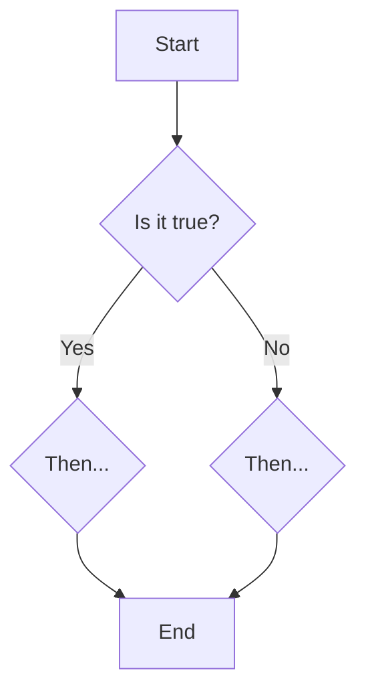
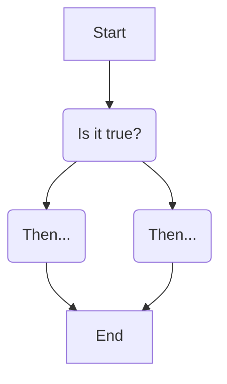

                 

# 文章标题：计算：第一部分 计算的诞生 第1章 毕达哥拉斯的困惑

> 关键词：毕达哥拉斯、无理数、古希腊数学、数学发展史、计算历史

> 摘要：本文将探讨计算的第一部分——计算的诞生，通过对古希腊数学家毕达哥拉斯的困惑以及古希腊、古印度、中国古代数学的简要回顾，揭示了计算从古代到现代的演变过程。本文旨在为广大读者呈现计算领域的发展历程，帮助读者理解计算的本质及其在现代社会的重要性。

## 《计算：第一部分 计算的诞生 第1章 毕达哥拉斯的困惑》目录大纲

### 第1章 毕达哥拉斯的困惑

#### 1.1 毕达哥拉斯的困惑：故事的开端

##### 1.1.1 毕达哥拉斯的生平与贡献

##### 1.1.2 毕达哥拉斯的困惑：无理数的发现

##### 1.1.3 毕达哥拉斯学派的思想与影响

#### 1.2 古希腊数学的发展

##### 1.2.1 埃拉托斯特尼与黄金比例

##### 1.2.2 欧几里得的《几何原本》

##### 1.2.3 阿基米德的数学与力学贡献

#### 1.3 古印度数学的崛起

##### 1.3.1 阿耶波多的《印度数学》

##### 1.3.2 阿拉伯数学的传播与影响

##### 1.3.3 古印度数学的主要贡献

#### 1.4 中国古代数学的卓越成就

##### 1.4.1 周髀算经与九章算术

##### 1.4.2 秦九韶与杨辉的数学贡献

##### 1.4.3 中国古代数学的特点与影响

#### 1.5 中世纪欧洲数学的演进

##### 1.5.1 欧洲中世纪数学的起源与发展

##### 1.5.2 阿尔-花拉子米的贡献

##### 1.5.3 欧洲中世纪数学的特点

#### 1.6 文艺复兴时期数学的繁荣

##### 1.6.1 笛卡尔的解析几何

##### 1.6.2 费马的大数学贡献

##### 1.6.3 文艺复兴时期数学的发展趋势

#### 1.7 近现代数学的奠基

##### 1.7.1 康托尔的集合论

##### 1.7.2 柯西的实数理论

##### 1.7.3 近现代数学的发展方向

## 第1章 毕达哥拉斯的困惑

### 1.1 毕达哥拉斯的困惑：故事的开端

##### 1.1.1 毕达哥拉斯的生平与贡献

毕达哥拉斯（Pythagoras），约公元前570年出生在希腊的萨摩斯岛，是古希腊著名的哲学家、数学家、天文学家。他是历史上最早的数学学派——毕达哥拉斯学派的创始人。毕达哥拉斯本人并没有留下任何著作，但我们通过后人的记载和学派的学说，可以了解到他在数学、哲学和天文学方面的巨大贡献。

在数学领域，毕达哥拉斯最重要的贡献之一是提出了著名的毕达哥拉斯定理，即直角三角形的两条直角边的平方和等于斜边的平方。这一发现不仅奠定了三角形几何学的基础，而且对于后续数学的发展产生了深远的影响。

此外，毕达哥拉斯还提出了“万物皆数”的思想，认为宇宙的本质是数，所有的物质和现象都可以通过数学来表达和解释。这一思想对古希腊哲学和数学产生了重要的影响。

##### 1.1.2 毕达哥拉斯的困惑：无理数的发现

然而，毕达哥拉斯的数学探索并非一帆风顺。他在研究正方形的面积和边长的关系时，遇到了一个无法解释的数学现象。

我们知道，正方形的面积等于边长的平方。假设边长为a，那么面积就是a²。当a为整数时，面积也是整数。然而，当a取某些特定的无理数时，面积将不再是整数。例如，边长为根号2的正方形的面积就是一个无理数，它无法用两个整数的比来表示。

这个发现对于毕达哥拉斯及其学派来说是一个巨大的冲击，因为他们坚信“万物皆数”，即所有的物质和现象都可以用数学来表达。无理数的发现挑战了这一信念，让他们开始思考数学的本质和局限性。

无理数的存在证明了数学并非万能，它不能解释所有的现象。这一发现不仅对数学，而且对哲学和科学产生了深远的影响。无理数的概念为后来的数学家提供了新的研究方向，也为数学的进一步发展奠定了基础。

##### 1.1.3 毕达哥拉斯学派的思想与影响

毕达哥拉斯学派是古希腊哲学和数学的重要流派之一，其思想对后世产生了深远的影响。学派成员包括哲学家、数学家、天文学家和音乐家等，他们共同探讨宇宙的本质和数学在宇宙中的角色。

学派的核心思想是“万物皆数”，即宇宙的本质是数。他们相信，通过研究数学，人们可以揭示宇宙的奥秘，理解自然界的规律。这一思想对古希腊哲学和科学产生了重要影响，也为后来的科学家提供了理论基础。

此外，毕达哥拉斯学派还提出了许多重要的数学理论，如毕达哥拉斯定理、黄金比例等。这些理论不仅在当时具有重要的学术价值，而且对后世数学的发展产生了深远的影响。

### 1.2 古希腊数学的发展

#### 1.2.1 埃拉托斯特尼与黄金比例

在毕达哥拉斯之后，古希腊数学继续发展，涌现出许多杰出的数学家。其中，埃拉托斯特尼（Eratosthenes）是古希腊时期最重要的数学家之一。

埃拉托斯特尼生于公元前276年，他提出了许多重要的数学理论，如埃拉托斯特尼筛法（用于求素数）。此外，他还提出了黄金比例的概念，即两个数的比例如果接近于φ（黄金比例的值约为1.618），那么它们在视觉上会显得非常和谐和美丽。

黄金比例不仅在数学中具有重要地位，而且在建筑、艺术和设计中也有广泛的应用。埃拉托斯特尼的工作为后来的数学家和艺术家提供了重要的理论支持。

#### 1.2.2 欧几里得的《几何原本》

欧几里得（Euclid）是古希腊数学的另一位巨匠，他生活在公元前300年左右。欧几里得最著名的著作是《几何原本》，这是一部系统阐述几何学基本原理的著作，对后世数学的发展产生了深远的影响。

《几何原本》分为十三卷，涵盖了点、线、面、三角形、四边形、圆等基本几何概念和定理。欧几里得通过公理、定义和定理的形式，将几何学建立在一个严谨的逻辑体系之上。

欧几里得的《几何原本》不仅是一部数学著作，也是一部哲学著作。它提出了许多重要的哲学问题，如什么是真理、什么是证明等。这些问题在后来的哲学和科学研究中得到了广泛探讨。

#### 1.2.3 阿基米德的数学与力学贡献

阿基米德（Archimedes）是古希腊数学和力学的杰出代表，他生活在公元前287年至公元前212年。阿基米德在数学和力学领域做出了许多开创性的贡献，他的成就对后世的科学和工程产生了深远的影响。

在数学方面，阿基米德提出了许多重要的几何定理和公式，如阿基米德螺线、阿基米德原理等。阿基米德还发明了许多实用的数学工具，如浮力秤、阿基米德螺旋等。

在力学方面，阿基米德提出了著名的浮力原理，即一个物体在流体中受到的浮力等于其排开的流体的重量。这一原理不仅为流体力学的发展奠定了基础，而且在工程实践中具有广泛的应用。

此外，阿基米德还研究了杠杆原理、滑轮系统等力学问题，提出了许多重要的力学定理和公式。他的成就为后来的科学家和工程师提供了宝贵的理论支持。

### 1.3 古印度数学的崛起

在古希腊数学发展繁荣的同时，古印度数学也在悄然崛起。古印度数学的历史可以追溯到公元前6世纪，那时印度出现了最早的数学文献《印度数学》。

阿耶波多（Aryabhata）是古印度数学的重要人物之一，他生活在公元476年至550年之间。阿耶波多的著作《印度数学》是古印度数学的重要文献，涵盖了算术、代数、天文学和三角学等多个领域。

在算术方面，阿耶波多提出了零的概念，这是数学史上的一项重大突破。零的概念不仅为后来的数学发展奠定了基础，而且在现代计算机科学中具有重要意义。

在代数方面，阿耶波多提出了方程求解的方法，他使用代数符号来表示未知数，这是代数学的一个重要发展。此外，他还研究了二次方程的求解，提出了“根的符号法则”。

在三角学方面，阿耶波多提出了正弦、余弦和正切的定义，并建立了三角函数的基本关系。他的成就为后来的三角学发展奠定了基础。

阿耶波多的著作《印度数学》对阿拉伯数学产生了重要影响，并通过阿拉伯人传播到欧洲，为后来的数学发展提供了宝贵的理论支持。

### 1.4 中国古代数学的卓越成就

中国古代数学在世界数学史上占有重要地位，其发展历程对后世的数学产生了深远的影响。中国古代数学文献中记载了许多重要的数学成就，如《周髀算经》和《九章算术》等。

《周髀算经》是中国最古老的天文学和数学著作之一，约成书于公元前1世纪。该书主要讨论了天文历法、勾股定理、比例等问题。其中，勾股定理是中国古代数学的重要成就之一，它指出直角三角形的两条直角边的平方和等于斜边的平方。这一发现与古希腊毕达哥拉斯定理相呼应，反映了不同文化背景下数学家对几何学的探索。

《九章算术》是中国古代最重要的数学著作之一，约成书于公元1世纪。该书分为九章，涵盖了算术、代数、几何、概率等多个领域。其中，秦九韶的《数书九章》和杨辉的《详解九章算法》是《九章算术》的后续著作，进一步丰富了古代数学的内容。

中国古代数学的特点是注重实际应用和问题解决。许多数学问题都与农业、商业、工程等领域密切相关，反映了数学在实际生活中的重要性。此外，中国古代数学在算术和代数方面取得了重要成就，如零的概念、负数的概念、一元二次方程的求解等。

中国古代数学对世界数学的发展产生了重要影响。通过丝绸之路，中国古代数学知识传入阿拉伯和欧洲，为后来的数学发展提供了宝贵的理论支持。

### 1.5 中世纪欧洲数学的演进

中世纪欧洲数学的发展经历了几个重要阶段，其演变过程反映了数学思想的不断深化和拓展。

#### 1.5.1 欧洲中世纪数学的起源与发展

中世纪欧洲数学的起源可以追溯到古希腊和罗马时期。公元5世纪，罗马帝国衰落，希腊文化逐渐传入欧洲，古希腊数学的著作被翻译成拉丁文，成为中世纪欧洲数学发展的基础。

公元12世纪，阿拉伯数学通过西班牙传入欧洲，阿拉伯数学的成果，如代数、三角学和算术等，对欧洲数学的发展产生了深远的影响。阿拉伯数学家阿尔-花拉子米（Al-Khwarizmi）的著作《代数学》对欧洲数学的发展产生了重要影响。

#### 1.5.2 阿尔-花拉子米的贡献

阿尔-花拉子米是中世纪最重要的数学家之一，他生活在公元780年至850年之间。他的著作《代数学》是中世纪欧洲数学的重要参考书，对后来的数学发展产生了深远的影响。

在《代数学》中，阿尔-花拉子米系统阐述了代数的基本原理，如方程求解、代数符号的使用等。他还提出了“算法”一词，意为“算法的过程”，这一概念对后来的数学和计算机科学产生了重要影响。

#### 1.5.3 欧洲中世纪数学的特点

中世纪欧洲数学的特点是注重实际应用和问题解决。数学家们致力于解决实际问题，如天文计算、水利工程、军事技术等。此外，中世纪欧洲数学在代数和几何学方面取得了重要进展，为后来的数学发展奠定了基础。

### 1.6 文艺复兴时期数学的繁荣

文艺复兴时期（14世纪至17世纪）是欧洲数学的繁荣时期，这一时期涌现出许多杰出的数学家，他们在数学的多个领域取得了重要成就。

#### 1.6.1 笛卡尔的解析几何

笛卡尔（René Descartes）是文艺复兴时期最重要的数学家之一，他提出了解析几何的思想，将几何与代数相结合。笛卡尔在《几何》一书中，通过坐标轴和代数方程来描述几何图形，建立了解析几何的基本框架。

解析几何的提出，使得数学家能够用代数方法解决几何问题，这为后来的数学和科学革命奠定了基础。笛卡尔的贡献，如函数的概念、坐标轴的使用等，对数学的发展产生了深远的影响。

#### 1.6.2 费马的大数学贡献

费马（Pierre de Fermat）是文艺复兴时期另一位杰出的数学家，他在数论、解析几何、概率论等领域取得了重要成就。费马提出了费马大定理，这一未解决的数学问题吸引了后世许多数学家的关注和研究。

在解析几何方面，费马提出了费马-笛卡尔定理，即通过代数方程可以解决任何几何问题。这一定理揭示了代数与几何之间的内在联系，为后来的数学发展提供了新的思路。

#### 1.6.3 文艺复兴时期数学的发展趋势

文艺复兴时期数学的发展趋势是向更加抽象和理论化的方向发展。数学家们开始关注数学本身的性质和结构，提出了许多新的数学概念和理论，如函数、极限、微积分等。

这一时期，数学的发展呈现出多样化和综合化的特点，数学家们不仅在纯数学领域取得了重要成就，而且将数学应用于实际问题中，如物理、工程、天文学等。文艺复兴时期数学的繁荣，为后来的数学和科学革命奠定了基础。

### 1.7 近现代数学的奠基

近现代数学的发展经历了几个重要阶段，其奠基过程反映了数学思想的不断深化和拓展。

#### 1.7.1 康托尔的集合论

康托尔（Georg Cantor）是近现代数学的奠基人之一，他在集合论领域做出了开创性的贡献。集合论是现代数学的基础，它研究集合的性质、运算和关系。

康托尔提出了无穷集合的概念，并建立了集合论的公理体系。他证明了无穷集合的不同性质，如可数无穷和不可数无穷。康托尔的集合论不仅改变了数学的基本观念，而且为后来的数学和逻辑学提供了新的理论基础。

#### 1.7.2 柯西的实数理论

柯西（Augustin-Louis Cauchy）是近现代数学的另一位重要人物，他在实数理论、微积分和代数学等方面做出了卓越的贡献。

柯西提出了实数序列的概念，并建立了实数的完备性原理。他通过级数理论研究了函数的性质，为后来的数学分析奠定了基础。柯西的实数理论对于数学的严谨化和精确化产生了重要影响。

#### 1.7.3 近现代数学的发展方向

近现代数学的发展方向是向更加抽象和理论化的方向发展。数学家们开始关注数学本身的性质和结构，提出了许多新的数学概念和理论，如拓扑学、群论、代数几何等。

这一时期，数学的发展呈现出多样化和综合化的特点，数学家们不仅在纯数学领域取得了重要成就，而且将数学应用于实际问题中，如物理学、经济学、计算机科学等。近现代数学的奠基，为后来的数学和科学革命奠定了基础。

## 第2章 算术与代数的基础

### 2.1 算术基本概念

算术是数学的基础，它研究数的概念、运算和性质。算术的基本概念包括自然数、整数、分数、小数等。

#### 2.1.1 自然数与整数

自然数是正整数，包括1、2、3、4等。整数是包括自然数、负整数和零的集合。整数集用符号Z表示。

整数的基本运算包括加法、减法、乘法和除法。加法和减法运算满足交换律、结合律和分配律等基本性质。乘法和除法运算也满足交换律、结合律和分配律等基本性质。

#### 2.1.2 分数与小数

分数是表示部分与整体关系的数，通常用分子和分母表示。分数的基本运算包括加法、减法、乘法和除法。分数运算时，需要确保分母不为零。

小数是分数的一种表示形式，通常用小数点分隔整数部分和小数部分。小数的基本运算包括加法、减法、乘法和除法。小数运算时，需要确保运算结果的有效数字位数。

#### 2.1.3 比例与比例尺

比例是表示两个数或量之间的等比关系的数学表达式。比例的基本性质包括比例的基本性质、比例的乘法和除法等。

比例尺是表示地图或图纸上距离与实际距离之间比例关系的数值。比例尺的基本概念包括比例尺的类型、比例尺的换算等。

### 2.2 代数基本概念

代数是数学的一个重要分支，它研究代数方程、代数式、函数等。代数的基本概念包括代数式、方程、不等式等。

#### 2.2.1 代数式与方程

代数式是由数字、字母和运算符组成的表达式。代数式的基本性质包括代数式的运算、代数式的化简等。

方程是含有未知数的等式。方程的基本类型包括一元一次方程、一元二次方程、多元一次方程等。方程的解法包括代入法、消元法、配方法等。

#### 2.2.2 解一元一次方程

一元一次方程是只含有一个未知数的线性方程。解一元一次方程的方法包括代入法、消元法、配方法等。

例如，解方程 2x + 3 = 7：

- 代入法：将x = 2代入方程，得到2 * 2 + 3 = 7，方程成立；
- 消元法：将方程两边减去3，得到2x = 4，再将两边除以2，得到x = 2；
- 配方法：将方程两边同时乘以2，得到4x + 6 = 14，再将两边减去6，得到4x = 8，最后将两边除以4，得到x = 2。

因此，方程的解为x = 2。

#### 2.2.3 解一元二次方程

一元二次方程是含有两个未知数的二次方程。解一元二次方程的方法包括配方法、公式法、因式分解法等。

例如，解方程 x² - 5x + 6 = 0：

- 配方法：将方程左边的二次项系数化为1，得到x² - 5x + 6 = (x - 2)(x - 3)，方程的解为x = 2或x = 3；
- 公式法：根据一元二次方程的求根公式，得到x = (5 ± √(5² - 4 * 1 * 6)) / 2，即x = (5 ± 1) / 2，方程的解为x = 2或x = 3；
- 因式分解法：将方程左边因式分解，得到(x - 2)(x - 3) = 0，方程的解为x = 2或x = 3。

因此，方程的解为x = 2或x = 3。

### 2.3 代数运算规则

代数运算规则是进行代数运算的基本规则，包括加法、减法、乘法和除法等。

#### 2.3.1 加法与减法

加法和减法运算满足交换律、结合律和分配律等基本性质。例如：

- 交换律：a + b = b + a，a - b = b - a；
- 结合律：(a + b) + c = a + (b + c)，(a - b) - c = a - (b - c)；
- 分配律：a * (b + c) = a * b + a * c，a * (b - c) = a * b - a * c。

#### 2.3.2 乘法与除法

乘法和除法运算满足交换律、结合律和分配律等基本性质。例如：

- 交换律：a * b = b * a；
- 结合律：(a * b) * c = a * (b * c)；
- 分配律：a * (b + c) = a * b + a * c，a * (b - c) = a * b - a * c。

#### 2.3.3 平方与平方根

平方是一个数自乘一次的结果，表示为a²。平方根是一个数的平方根，表示为√a。例如：

- 平方：2² = 4，(-2)² = 4；
- 平方根：√4 = 2，√9 = 3。

平方与平方根是代数中的重要概念，广泛应用于数学和其他科学领域。

## 第3章 几何的基本原理

### 3.1 几何基本概念

几何是研究空间图形和其性质的数学学科。几何的基本概念包括点、线、面、平面、立体图形等。

#### 3.1.1 点、线、面与立体图形

- 点：几何中最基本的元素，表示一个位置，没有大小和形状。
- 线：由无数个点组成的无限延伸的直线。
- 面积：由无数个点组成的无限延伸的平面。
- 立体图形：由多个面组成的几何图形，如立方体、圆柱体等。

#### 3.1.2 几何图形的分类

几何图形可以分为平面几何和立体几何。平面几何研究平面上的图形，如三角形、四边形、圆等。立体几何研究立体图形，如立方体、圆锥体、球体等。

#### 3.1.3 几何图形的变换

几何图形的变换包括平移、旋转、镜像等。

- 平移：将图形沿某个方向移动一定的距离，保持形状和大小不变。
- 旋转：将图形绕某个点旋转一定角度，保持形状和大小不变。
- 镜像：将图形沿某个轴翻转，保持形状和大小不变。

### 3.2 几何基本定理

几何基本定理是几何学中的重要定理，包括平行线定理、相似形定理、三角形定理等。

#### 3.2.1 平行线定理

平行线定理包括两条基本定理：

- 如果两条直线被第三条直线所截，那么同位角相等，则这两条直线平行。
- 如果两条直线被第三条直线所截，那么内错角相等，则这两条直线平行。

#### 3.2.2 相似形定理

相似形定理包括以下三个定理：

- 如果两个三角形的所有对应角度相等，则这两个三角形相似。
- 如果两个三角形的对应边长成比例，则这两个三角形相似。
- 如果两个三角形的一个角相等，且对应边长成比例，则这两个三角形相似。

#### 3.2.3 三角形定理

三角形定理包括以下三个基本定理：

- 三角形内角和定理：三角形的三个内角之和等于180度。
- 三角形两边之和大于第三边。
- 三角形两边之差小于第三边。

### 3.3 几何问题的解决方法

解决几何问题的方法包括作图、证明和求解等。

#### 3.3.1 几何作图

几何作图是解决几何问题的一种方法，包括以下步骤：

1. 确定问题所涉及的几何图形和条件。
2. 选择适当的工具和技巧进行作图。
3. 根据作图结果验证问题是否得到解决。

#### 3.3.2 几何证明

几何证明是解决几何问题的一种方法，通过逻辑推理证明几何命题的正确性。

几何证明的基本步骤包括：

1. 提出待证明的命题。
2. 构建辅助线或辅助图形。
3. 使用已知定理和推理规则进行证明。
4. 总结证明结果。

#### 3.3.3 几何问题的求解策略

求解几何问题的策略包括：

1. 分析问题的条件和结论。
2. 寻找问题中的已知条件和未知条件。
3. 选择合适的定理和公式进行求解。
4. 验证求解结果的正确性。

通过以上方法，可以有效地解决几何问题，并培养逻辑思维和空间想象能力。

## 第4章 微积分的起源与发展

### 4.1 微积分的基本概念

微积分是数学的一个重要分支，它研究函数的变化率和累积量。微积分的基本概念包括极限、导数、积分和微分方程等。

#### 4.1.1 极限与导数

极限是微积分的核心概念之一，它描述了一个函数在自变量趋近某一特定值时，函数值的变化趋势。导数是描述函数变化率的数学工具，它表示函数在某一点处的变化速度。

导数的定义如下：

设函数f(x)在点x₀处可导，则f(x)在点x₀处的导数定义为：

\[ f'(x₀) = \lim_{h \to 0} \frac{f(x₀ + h) - f(x₀)}{h} \]

其中，h是自变量x₀的增量。

#### 4.1.2 积分与原函数

积分是微积分的另一个重要概念，它表示函数在某区间上的累积量。积分的定义如下：

设函数f(x)在区间[a, b]上连续，则f(x)在区间[a, b]上的定积分定义为：

\[ \int_{a}^{b} f(x) \, dx = \lim_{n \to \infty} \sum_{i=1}^{n} f(x_i^*) \Delta x \]

其中，\( x_i^* \) 是区间 \([x_{i-1}, x_i]\) 上的任意一点，\(\Delta x = \frac{b-a}{n}\) 是区间 \([a, b]\) 的分割宽度。

原函数是指具有给定导数的函数。如果函数f(x)在区间[a, b]上有原函数F(x)，则F(x)称为f(x)的原函数。原函数的定义如下：

设函数f(x)在区间[a, b]上有原函数F(x)，则：

\[ F'(x) = f(x) \]

#### 4.1.3 微积分的基本定理

微积分的基本定理是微积分理论的核心，它将微分和积分联系起来。微积分的基本定理分为两部分：

1. 微积分第一基本定理：如果函数f(x)在区间[a, b]上连续，则它的原函数F(x)在区间[a, b]上可积，且：

\[ \int_{a}^{b} f(x) \, dx = F(b) - F(a) \]

2. 微积分第二基本定理：如果函数f(x)在区间[a, b]上可导，且原函数F(x)存在，则：

\[ \frac{d}{dx} \int_{a}^{x} f(t) \, dt = f(x) \]

### 4.2 微积分的基本运算

微积分的基本运算包括导数的求解、积分的求解和应用微积分解决实际问题。

#### 4.2.1 导数的求解方法

导数的求解方法主要包括定义法和公式法。

1. 定义法：

根据导数的定义，求解导数的过程可以表示为：

\[ f'(x) = \lim_{h \to 0} \frac{f(x+h) - f(x)}{h} \]

2. 公式法：

利用导数的基本公式和求导法则，可以直接求解导数。常见的导数公式包括：

- 常数函数的导数为0。
- 幂函数的导数为 \( nx^{n-1} \)。
- 指数函数的导数为 \( a^x \ln(a) \)。
- 三角函数的导数为 \( \cos(x) \) 和 \( \sin(x) \)。

#### 4.2.2 积分的求解方法

积分的求解方法主要包括直接积分法和换元积分法。

1. 直接积分法：

直接积分法是利用积分的基本公式和积分法则直接求解积分。常见的积分公式包括：

- \( \int x^n \, dx = \frac{x^{n+1}}{n+1} + C \)（n ≠ -1）。
- \( \int e^x \, dx = e^x + C \)。
- \( \int \cos(x) \, dx = \sin(x) + C \)。
- \( \int \sin(x) \, dx = -\cos(x) + C \)。

2. 换元积分法：

换元积分法是通过引入新变量，将复杂积分转化为简单积分。常见的换元方法包括：

- \( u \)-换元：令 \( u = g(x) \)，则 \( du = g'(x) \, dx \)。
- 三角换元：利用三角函数的性质，将积分转化为三角函数的积分。

#### 4.2.3 应用微积分解决实际问题

微积分在解决实际问题时具有重要的应用价值，包括物理、工程、经济学等领域。

1. 物理中的应用：

微积分在物理中主要用于求解动力学和热力学问题，如速度、加速度、动能、势能等。例如，求解物体在受力作用下的运动轨迹、求解热传导问题等。

2. 工程中的应用：

微积分在工程中主要用于求解设计问题、优化问题和控制问题。例如，求解最优路径问题、优化结构设计、控制系统设计等。

3. 经济学中的应用：

微积分在经济学中主要用于求解优化问题和均衡问题，如求解利润最大化问题、市场均衡分析等。

### 4.3 微积分的历史背景

微积分的历史可以追溯到古希腊和古代中国，但真正的发展始于17世纪的欧洲。当时，数学家们开始研究函数的变化率和累积量，从而形成了微积分的基本概念。

1. 古希腊：

古希腊的数学家如欧几里得和阿基米德等，对函数的研究做出了重要贡献。他们研究了面积、体积和曲线等问题，但并没有形成系统的微积分理论。

2. 古代中国：

古代中国的数学家如刘徽和祖冲之等，对微积分思想有所认识。他们提出了“割圆术”和“牟合方盖”等，为微积分的发展提供了理论基础。

3. 17世纪欧洲：

17世纪的欧洲是微积分发展的关键时期。牛顿（Isaac Newton）和莱布尼茨（Gottfried Wilhelm Leibniz）分别独立地建立了微积分的理论体系。牛顿在《自然哲学的数学原理》中提出了流数法，莱布尼茨则提出了微积分的符号表示法。

### 4.4 微积分的数学家

在微积分的发展过程中，许多数学家做出了重要贡献。

1. 牛顿（Isaac Newton）：

牛顿是微积分的奠基人之一，他提出了流数法，即微分法。牛顿的工作对后来的数学和物理学产生了深远的影响。

2. 莱布尼茨（Gottfried Wilhelm Leibniz）：

莱布尼茨是另一位微积分的奠基人，他提出了微积分的符号表示法，即微分和积分符号。莱布尼茨的工作推动了微积分的发展和应用。

3. 蒙塔格利亚纳（Gregorio Montallegre）：

蒙塔格利亚纳是意大利数学家，他提出了积分符号和积分法则，对微积分的推广和应用做出了贡献。

### 4.5 微积分的影响与应用领域

微积分对数学、物理学、工程学、经济学等多个领域产生了深远的影响。

1. 数学：

微积分的引入使得数学分析得以发展，为后来的数学分支如微分方程、复变函数、泛函分析等提供了基础。

2. 物理学：

微积分在物理学中的应用非常广泛，如牛顿力学、电磁学、热力学等，微积分提供了描述物理现象的工具。

3. 工程学：

微积分在工程学中的应用也非常重要，如结构设计、控制系统、信号处理等，微积分为工程问题提供了优化和分析的方法。

4. 经济学：

微积分在经济学中的应用主要体现在优化问题和均衡分析上，如利润最大化、成本最小化、市场均衡等。

总之，微积分是数学的重要分支，它的发展和应用为现代科学技术和社会经济提供了强大的理论支持。

## 第5章 数论的基础知识

### 5.1 数论的基本概念

数论是研究整数及其性质的数学分支，它是数学中最古老的分支之一。数论的基本概念包括自然数、整数、有理数、无理数等。

#### 5.1.1 自然数与整数的性质

自然数是正整数，包括1、2、3、4等。自然数具有递增的性质，即对于任意两个自然数a和b，如果a < b，则存在一个自然数c，使得a + c = b。

整数是包括自然数、负整数和零的集合。整数具有交换律、结合律和分配律等基本性质。例如：

- 交换律：对于任意两个整数a和b，有a + b = b + a，a * b = b * a。
- 结合律：对于任意三个整数a、b和c，有(a + b) + c = a + (b + c)，(a * b) * c = a * (b * c)。
- 分配律：对于任意三个整数a、b和c，有a * (b + c) = a * b + a * c，a * (b - c) = a * b - a * c。

#### 5.1.2 素数与合数的概念

素数是只能被1和自身整除的正整数。最小的素数是2，接下来是3、5、7、11等。素数是数论研究的重要对象，因为它们在数学和计算机科学中有广泛的应用。

合数是除了1和自身外，还能被其他整数整除的正整数。最小的合数是4，接下来是6、8、9、10等。合数可以分解为素数的乘积，这种分解称为素因数分解。

#### 5.1.3 最大公约数与最小公倍数

最大公约数（Greatest Common Divisor, GCD）是指两个或多个整数的公约数中最大的一个。例如，整数8和12的最大公约数是4。

最小公倍数（Least Common Multiple, LCM）是指两个或多个整数的公倍数中最小的一个。例如，整数8和12的最小公倍数是24。

#### 5.1.4 素数分布与定理

素数分布是数论研究的一个重要问题。素数的分布具有一定的规律性，例如：

- 莱布尼茨定理：小于等于n的素数个数大约是 \( n / \ln(n) \)，其中\( \ln(n) \)是n的自然对数。
- 莫德尔-欧拉定理：如果一个正整数n可以表示为两个素数的乘积，则n的欧拉函数值为 \( n - 1 \)。

### 5.2 数论的基本定理

数论的基本定理是数论研究中的一些重要定理，它们揭示了整数之间的性质和关系。

#### 5.2.1 费马小定理

费马小定理是数论中的一个基本定理，它描述了素数与整数的乘积的性质。费马小定理表明：如果p是一个素数，a是一个整数，且a不等于p，那么a的p-1次方模p的结果等于1。即：

\[ a^{p-1} \equiv 1 \pmod{p} \]

#### 5.2.2 欧拉定理

欧拉定理是数论中的另一个重要定理，它描述了正整数n与整数的乘积的性质。欧拉定理表明：如果n是一个正整数，a是一个整数，且a与n互质（即它们的最大公约数为1），那么a的欧拉函数值n次方模n的结果等于a的n-1次方模n的结果。即：

\[ a^{\phi(n)} \equiv 1 \pmod{n} \]

其中，\( \phi(n) \)是欧拉函数，表示小于等于n且与n互质的整数个数。

#### 5.2.3 托马斯·费尔玛大定理

托马斯·费尔玛大定理是数论中的一个著名定理，它描述了素数与整数的乘积的性质。托马斯·费尔玛大定理表明：如果n是一个正整数，且n > 2，那么对于任意一个整数a，有：

\[ a^n + b^n = c^n \]

其中，a、b、c是整数，且a、b、c不全为0。托马斯·费尔玛大定理也称为费尔玛大定理，它是数学史上著名的未解问题之一，直到1994年才被证明。

### 5.3 数论的应用

数论在数学、计算机科学、密码学等领域有广泛的应用。

#### 5.3.1 数论在密码学中的应用

数论在密码学中具有重要的应用，特别是在公钥密码系统中。公钥密码系统利用数论的原理来保证信息的安全传输。例如，RSA密码系统就是基于费马小定理和欧拉定理设计的。

#### 5.3.2 数论在计算机科学中的应用

数论在计算机科学中有广泛的应用，特别是在算法分析和密码学中。例如，素数生成算法、欧几里得算法、中国剩余定理等都是数论在计算机科学中的重要应用。

#### 5.3.3 数论在数学其他领域中的应用

数论在数学的其他领域也有广泛的应用，如数论在代数学、几何学、物理学中的应用。例如，数论在解决代数方程、研究几何图形的对称性、研究物理系统的稳定性等方面都有重要的应用。

## 第6章 数学工具与软件应用

### 6.1 MATLAB在数学中的应用

MATLAB（矩阵实验室）是一款广泛应用于工程、科学和数学计算的高性能软件工具。它提供了丰富的数学库和工具箱，可以方便地进行数学运算、数据分析和可视化。

#### 6.1.1 MATLAB基础操作

在使用MATLAB进行数学计算之前，首先需要了解MATLAB的基础操作，包括工作空间、变量、脚本和函数等。

1. **工作空间**：工作空间是MATLAB的核心界面，用于管理变量、数据和程序。
2. **变量**：在MATLAB中，变量可以存储数值、矩阵和其他数据类型。变量名必须以字母开头，可以包含数字、下划线和点。
3. **脚本**：脚本是一系列MATLAB命令的集合，可以用于自动化计算和分析。
4. **函数**：函数是一段独立运行的代码，可以接受输入参数并返回输出结果。

#### 6.1.2 MATLAB在微积分中的应用

MATLAB在微积分中的应用主要体现在求解导数、积分和微分方程等方面。

1. **导数求解**：

   使用MATLAB求解导数，可以通过内置函数`diff`实现。例如，求解函数f(x) = x²在x = 2处的导数，可以使用以下代码：

   ```matlab
   f = @(x) x^2;
   df = diff(f, 1); % 求一阶导数
   result = df(2); % 在x = 2处计算导数
   ```

2. **积分求解**：

   使用MATLAB求解定积分，可以通过内置函数`integral`实现。例如，求解函数f(x) = x在区间[1, 2]上的积分，可以使用以下代码：

   ```matlab
   f = @(x) x;
   result = integral(f, 1, 2); % 在区间[1, 2]上计算积分
   ```

3. **微分方程求解**：

   使用MATLAB求解微分方程，可以通过内置函数`ode45`实现。例如，求解一维波动方程：

   ```matlab
   function dydx = waveEquation(t, y)
       dydx = cos(t) - y;
   end

   tspan = [0, 10]; % 时间区间
   y0 = 1; % 初始条件
   [t, y] = ode45(@waveEquation, tspan, y0); % 求解微分方程
   plot(t, y); % 绘制解的曲线
   ```

#### 6.1.3 MATLAB在数论中的应用

MATLAB在数论中的应用主要体现在求解素数、因数分解、最大公约数等方面。

1. **素数生成**：

   使用MATLAB生成素数，可以通过内置函数`primes`实现。例如，生成前10个素数：

   ```matlab
   primes(10) % 生成前10个素数
   ```

2. **因数分解**：

   使用MATLAB进行因数分解，可以通过内置函数`factor`实现。例如，对整数120进行因数分解：

   ```matlab
   factor(120) % 对120进行因数分解
   ```

3. **最大公约数**：

   使用MATLAB求解最大公约数，可以通过内置函数`gcd`实现。例如，求解整数24和36的最大公约数：

   ```matlab
   gcd(24, 36) % 求解最大公约数
   ```

### 6.2 Python在数学中的应用

Python是一种功能强大的编程语言，广泛应用于科学计算、数据分析、机器学习和人工智能等领域。Python的数学库如NumPy、SciPy和SymPy等，为数学运算提供了丰富的工具。

#### 6.2.1 Python基础操作

在使用Python进行数学计算之前，首先需要了解Python的基础操作，包括变量、数据类型、函数等。

1. **变量**：在Python中，变量可以存储数值、列表、字典等数据类型。变量名必须以字母开头，可以包含数字、下划线和字母。
2. **数据类型**：Python的主要数据类型包括整数、浮点数、字符串和列表等。每种数据类型都有相应的操作方法和函数。
3. **函数**：Python的函数是一段独立运行的代码，可以接受输入参数并返回输出结果。Python内置了许多常用函数，如`sum`、`len`、`print`等。

#### 6.2.2 Python在微积分中的应用

Python在微积分中的应用主要体现在求解导数、积分和微分方程等方面。

1. **导数求解**：

   使用Python求解导数，可以通过内置函数`sympy.diff`实现。例如，求解函数f(x) = x²在x = 2处的导数，可以使用以下代码：

   ```python
   from sympy import symbols, diff

   x = symbols('x')
   f = x**2
   df = diff(f, x)
   result = df.subs(x, 2)
   print(result)
   ```

2. **积分求解**：

   使用Python求解定积分，可以通过内置函数`sympy.integrate`实现。例如，求解函数f(x) = x在区间[1, 2]上的积分，可以使用以下代码：

   ```python
   from sympy import symbols, integrate

   x = symbols('x')
   f = x
   result = integrate(f, (x, 1, 2))
   print(result)
   ```

3. **微分方程求解**：

   使用Python求解微分方程，可以通过内置函数`scipy.integrate.odeint`实现。例如，求解一维波动方程：

   ```python
   from scipy.integrate import odeint
   from numpy import array

   def wave_equation(y, t):
       return array([y[1], -y[0]])

   t = array([0, 1, 2, 3])
   y0 = array([1, 0])
   result = odeint(wave_equation, y0, t)
   print(result)
   ```

#### 6.2.3 Python在数论中的应用

Python在数论中的应用主要体现在求解素数、因数分解、最大公约数等方面。

1. **素数生成**：

   使用Python生成素数，可以通过编写自定义函数实现。例如，使用埃拉托斯特尼筛法生成前10个素数：

   ```python
   def primes(n):
       primes = []
       is_prime = [True] * (n+1)
       is_prime[0] = is_prime[1] = False

       for i in range(2, int(n**0.5) + 1):
           if is_prime[i]:
               primes.append(i)
               for j in range(i*i, n+1, i):
                   is_prime[j] = False

       for i in range(int(n**0.5) + 1, n+1):
           if is_prime[i]:
               primes.append(i)

       return primes[:n]

   print(primes(10))
   ```

2. **因数分解**：

   使用Python进行因数分解，可以通过编写自定义函数实现。例如，对整数120进行因数分解：

   ```python
   def factor(n):
       factors = []
       for i in range(2, n+1):
           while n % i == 0:
               factors.append(i)
               n //= i
       return factors

   print(factor(120))
   ```

3. **最大公约数**：

   使用Python求解最大公约数，可以通过内置函数`math.gcd`实现。例如，求解整数24和36的最大公约数：

   ```python
   from math import gcd

   result = gcd(24, 36)
   print(result)
   ```

### 6.3 其他数学工具的应用

除了MATLAB和Python，还有许多其他数学工具和软件在数学计算和数据分析中发挥着重要作用。

#### 6.3.1 LaTeX的数学公式编写

LaTeX是一种高质量排版系统，广泛应用于科学论文、书籍和文档的排版。LaTeX提供了丰富的数学公式编写工具，可以方便地编写复杂的数学公式。

例如，编写一个简单的数学公式：

\[ E = mc^2 \]

在LaTeX中，上述公式可以表示为：

```latex
E = mc^2
```

#### 6.3.2 Mermaid流程图的绘制

Mermaid是一种轻量级的图表和流程图绘制工具，支持Markdown语法。它可以帮助用户方便地绘制各种类型的图表和流程图。

例如，绘制一个简单的流程图：



在Mermaid中，上述流程图可以表示为：



#### 6.3.3 其他数学工具的简介

除了上述提到的数学工具，还有许多其他数学工具和软件，如Maple、Mathematica、MATLAB等，它们在不同领域有着广泛的应用。

1. **Maple**：Maple是一款强大的数学软件，广泛应用于数学计算、符号计算、数据分析和可视化。它提供了丰富的数学库和工具箱，可以方便地进行各种数学运算和分析。
2. **Mathematica**：Mathematica是一款功能强大的计算引擎，广泛应用于科学计算、工程、数学、统计学和数据分析等领域。它提供了强大的符号计算和图形可视化功能，可以方便地进行各种数学运算和分析。
3. **MATLAB**：MATLAB是一款广泛应用于工程、科学和数学计算的软件工具，它提供了丰富的数学库和工具箱，可以方便地进行各种数学运算和分析。MATLAB在微积分、数论、代数等领域有着广泛的应用。

总之，数学工具和软件在数学计算和分析中发挥着重要作用，为数学研究和工程应用提供了强大的支持。

## 第7章 数学在科学和工程中的重要性

### 7.1 数学在自然科学中的应用

数学在自然科学中扮演着至关重要的角色，它是许多科学领域的基础。以下是数学在自然科学中的应用：

#### 7.1.1 物理学中的数学应用

物理学是研究物质、能量、力和运动的科学。数学在物理学中的应用非常广泛，包括：

1. **经典力学**：经典力学中的牛顿运动定律、万有引力定律等都是基于数学公式推导得出的。数学在求解物体运动轨迹、分析力学系统稳定性等方面起着关键作用。
2. **量子力学**：量子力学是研究微观粒子的运动规律的学科。它使用复杂的数学工具，如波函数、算符和矩阵等，来描述粒子的行为。
3. **热力学**：热力学研究热量、工作、能量转换等。它使用数学模型，如热力学方程、熵等，来描述系统的状态和变化。
4. **电磁学**：电磁学是研究电和磁的学科。它使用麦克斯韦方程组等数学公式来描述电磁场的行为。

#### 7.1.2 化学中的数学应用

化学是研究物质的组成、性质、变化和反应的学科。数学在化学中的应用包括：

1. **量子化学**：量子化学使用数学模型，如薛定谔方程和哈密顿算符，来描述原子和分子的电子结构。
2. **化学动力学**：化学动力学研究化学反应的速率和机理。数学模型，如反应级数、速率常数等，被用于预测和解释化学反应。
3. **统计热力学**：统计热力学使用数学工具，如概率分布、统计平均等，来研究宏观系统的性质。

#### 7.1.3 地球科学中的数学应用

地球科学是研究地球及其环境的学科。数学在地球科学中的应用包括：

1. **地球物理学**：地球物理学使用数学模型，如波动方程、格林函数等，来研究地震、地球内部结构等。
2. **气象学**：气象学使用数学模型，如流体力学方程、大气物理方程等，来预测天气和气候。
3. **海洋学**：海洋学使用数学模型，如海洋环流方程、海洋热力学等，来研究海洋运动和海洋环境。

### 7.2 数学在工程技术中的应用

数学在工程技术中具有广泛的应用，它是许多工程领域的基础。以下是数学在工程技术中的应用：

#### 7.2.1 电子工程中的数学应用

电子工程是设计、开发和制造电子设备和技术系统的学科。数学在电子工程中的应用包括：

1. **电路分析**：电路分析使用数学模型，如基尔霍夫定律、欧姆定律等，来分析和设计电路系统。
2. **信号处理**：信号处理使用数学工具，如傅里叶变换、拉普拉斯变换等，来分析和处理信号。
3. **控制系统**：控制系统使用数学模型，如传递函数、状态空间模型等，来设计和分析控制系统。

#### 7.2.2 机械工程中的数学应用

机械工程是设计、制造和操作机械设备的学科。数学在机械工程中的应用包括：

1. **力学分析**：力学分析使用数学模型，如牛顿定律、能量守恒等，来分析机械系统的受力情况。
2. **结构分析**：结构分析使用数学工具，如有限元方法、矩阵分析等，来设计机械结构和材料。
3. **热力学分析**：热力学分析使用数学模型，如热传导方程、热力学定律等，来分析机械系统的热力学性能。

#### 7.2.3 计算机科学中的数学应用

计算机科学是研究计算机系统的设计、开发、应用和维护的学科。数学在计算机科学中的应用包括：

1. **算法设计**：算法设计使用数学工具，如排序算法、查找算法等，来设计高效的算法。
2. **密码学**：密码学使用数学模型，如加密算法、散列函数等，来保护信息安全。
3. **人工智能**：人工智能使用数学工具，如机器学习算法、神经网络等，来模拟和实现人类智能。

### 7.3 数学在经济学和管理学中的应用

数学在经济学和管理学中具有广泛的应用，它是分析经济现象和管理企业的重要工具。以下是数学在经济学和管理学中的应用：

#### 7.3.1 经济学中的数学模型

经济学使用数学模型来分析经济现象和预测市场趋势。数学模型在经济学中的应用包括：

1. **需求与供给**：经济学使用需求函数和供给函数来描述商品和服务的价格与数量之间的关系。
2. **成本与利润**：经济学使用成本函数和利润函数来分析企业的成本结构和盈利能力。
3. **宏观经济模型**：宏观经济模型，如IS-LM模型、AD-AS模型等，用于分析国民经济的总需求和总供给。

#### 7.3.2 管理学中的数学工具

管理学使用数学工具来优化决策、提高效率和实现目标。数学工具在管理学中的应用包括：

1. **线性规划**：线性规划用于求解资源分配问题，优化决策变量，使目标函数最大化或最小化。
2. **排队理论**：排队理论用于分析服务系统中的等待时间和效率，优化服务资源配置。
3. **决策分析**：决策分析使用数学工具，如决策树、敏感性分析等，来评估不同决策方案的风险和收益。

#### 7.3.3 数学在经济和管理中的应用前景

随着技术的进步和经济学管理学的不断发展，数学在经济和管理中的应用前景广阔。以下是数学在经济和管理中的一些新兴应用：

1. **大数据分析**：大数据分析使用数学工具，如数据挖掘、机器学习等，来分析和处理大量经济数据，帮助企业做出更明智的决策。
2. **金融风险管理**：金融风险管理使用数学模型，如风险价值（VaR）、蒙特卡罗模拟等，来评估和管理金融风险。
3. **运营管理**：运营管理使用数学工具，如排队理论、库存控制等，来优化生产和服务流程，提高运营效率。

总之，数学在科学、工程、经济学和管理学中的应用越来越广泛，它为解决实际问题提供了强有力的工具和方法。随着数学方法和技术的不断发展，数学在各个领域的重要性将进一步凸显。

## 第8章 未来数学的发展方向

### 8.1 数学在人工智能中的应用

随着人工智能（AI）技术的迅猛发展，数学在AI领域的应用前景广阔。数学为AI提供了理论基础和算法支持，使其在图像识别、自然语言处理、推荐系统等方面取得了显著成果。

#### 8.1.1 机器学习中的数学基础

机器学习是AI的核心技术之一，它依赖于数学中的概率论、统计学和线性代数等基本概念。以下是数学在机器学习中的应用：

1. **概率论**：概率论用于描述随机事件的发生概率，为机器学习中的概率模型提供了理论基础。例如，贝叶斯定理在分类问题中广泛应用。
2. **统计学**：统计学用于数据分析和建模，为机器学习中的模型训练和评估提供了工具。例如，均值、方差、协方差等统计量用于描述数据的特征。
3. **线性代数**：线性代数用于处理高维数据和线性变换，为机器学习中的矩阵运算提供了基础。例如，矩阵分解、特征值和特征向量等概念在降维和特征提取中具有重要应用。

#### 8.1.2 深度学习中的数学原理

深度学习是AI领域的一个重要分支，它依赖于神经网络和优化算法。以下是数学在深度学习中的应用：

1. **神经网络**：神经网络是由大量神经元组成的计算模型，用于模拟人脑的神经网络结构。数学中的偏微分方程和微积分等概念用于描述神经网络的传播和反向传播过程。
2. **优化算法**：优化算法用于求解神经网络中的参数优化问题。数学中的梯度下降、随机梯度下降等优化算法在深度学习中的应用具有重要意义。
3. **激活函数**：激活函数是神经网络中的关键组件，用于引入非线性关系。数学中的函数变换和极限概念用于分析和设计激活函数。

#### 8.1.3 数学在人工智能发展中的作用

数学在人工智能发展中的作用主要体现在以下几个方面：

1. **算法优化**：数学为人工智能提供了优化算法，使其在复杂问题求解中具有更高的效率和准确性。例如，优化算法在图像识别、语音识别和自然语言处理中的应用。
2. **模型评估**：数学为人工智能提供了模型评估方法，用于评估模型的性能和可靠性。例如，误差分析、置信区间和假设检验等数学方法在模型评估中的应用。
3. **新算法设计**：数学为人工智能提供了新算法设计的理论基础，促进了AI技术的发展。例如，深度强化学习、生成对抗网络等新型算法的设计和应用。

### 8.2 数学在量子计算中的应用

量子计算是AI领域的另一个重要方向，它利用量子力学原理实现高效计算。数学在量子计算中的应用为量子算法的设计和实现提供了关键支持。

#### 8.2.1 量子计算的数学基础

量子计算依赖于数学中的量子力学和线性代数等基本概念。以下是数学在量子计算中的应用：

1. **量子力学**：量子力学描述了量子系统的行为，如量子比特的叠加态和纠缠态。数学中的复数和矩阵等概念用于描述量子态和量子运算。
2. **线性代数**：线性代数用于处理量子比特的线性组合和变换。数学中的向量空间、线性变换和矩阵等概念用于构建量子计算模型。
3. **概率论**：概率论用于描述量子比特的概率测量结果。量子概率分布和量子随机变量等概念用于分析量子算法的性能。

#### 8.2.2 量子算法的数学原理

量子算法是量子计算的核心，它利用量子并行性和叠加态实现高效计算。以下是数学在量子算法中的应用：

1. **量子逆运算**：量子算法中的逆运算，如量子逆矩阵和量子逆变换等，依赖于数学中的线性代数和矩阵理论。
2. **量子随机游走**：量子随机游走是量子算法的一种基本方法，它利用量子态的叠加和纠缠实现高效搜索。数学中的随机游走理论和概率论用于分析和设计量子随机游走算法。
3. **量子近似优化算法**：量子近似优化算法用于求解优化问题，如旅行商问题、组合优化等。数学中的优化理论和概率论用于分析和设计量子近似优化算法。

#### 8.2.3 量子计算的未来发展

随着量子计算技术的不断发展，数学在量子计算中的应用前景广阔。以下是量子计算的未来发展趋势：

1. **量子算法的创新**：数学为量子算法的创新提供了理论基础，促进了量子计算技术的进步。例如，量子计算在密码学、化学模拟、量子计算优化等领域的应用。
2. **量子硬件的发展**：量子计算的发展依赖于量子硬件的进步。数学在量子硬件的设计、控制和优化中发挥着重要作用，如量子比特的制备、量子纠错和量子门等。
3. **量子计算的产业化**：随着量子计算技术的成熟，数学在量子计算的产业化中发挥着重要作用。例如，量子计算在金融、医疗、物流等领域的应用，将推动量子计算产业的发展。

### 8.3 数学在其他领域的发展趋势

数学不仅在人工智能和量子计算领域具有广泛的应用，还在其他新兴领域显示出巨大的潜力。以下是数学在其他领域的发展趋势：

#### 8.3.1 数学在生物信息学中的应用

生物信息学是研究生物信息的数据处理和分析的学科。数学在生物信息学中的应用包括：

1. **基因组分析**：数学用于分析基因组数据，如基因表达分析、基因突变检测等。数学中的概率论、统计学和优化理论等在基因组分析中发挥着重要作用。
2. **蛋白质结构预测**：数学用于预测蛋白质的三维结构，如使用分子动力学模拟、随机模型等。数学中的优化算法和机器学习技术用于蛋白质结构预测。

#### 8.3.2 数学在经济学中的应用

经济学是研究经济行为和经济现象的学科。数学在经济学中的应用包括：

1. **宏观经济模型**：数学用于建立宏观经济模型，如IS-LM模型、AD-AS模型等。数学中的优化理论和动态系统理论等在宏观经济模型中发挥着重要作用。
2. **金融模型**：数学用于建立金融模型，如资产定价模型、风险管理模型等。数学中的随机过程理论、概率论和统计学等在金融模型中发挥着重要作用。

#### 8.3.3 数学在其他新兴领域的发展方向

数学在其他新兴领域的发展方向包括：

1. **量子计算**：数学在量子计算中发挥着重要作用，如量子算法的设计、量子纠错和量子硬件的设计等。
2. **人工智能**：数学在人工智能中发挥着重要作用，如机器学习算法的设计、神经网络模型的分析和优化等。
3. **生物信息学**：数学在生物信息学中发挥着重要作用，如基因组分析、蛋白质结构预测和生物网络分析等。

总之，数学在人工智能、量子计算和其他新兴领域的应用前景广阔，它为解决实际问题提供了强有力的工具和方法。随着数学方法和技术的不断发展，数学在各个领域的重要性将进一步凸显。

## 第9章 总结与展望

### 9.1 数学的发展历程与成就

数学是人类智慧的结晶，它的发展历程充满了挑战与创新。从古代的几何和算术，到近现代的微积分和代数，数学在各个时期都取得了显著的成就。

在古代，古希腊和中国的数学家如毕达哥拉斯、欧几里得、阿基米德、刘徽等，奠定了几何学和算术的基础。古希腊数学家提出了勾股定理、黄金比例等重要的几何概念，而中国的《九章算术》和《周髀算经》则涵盖了丰富的算术和代数知识。

中世纪，阿拉伯数学家如阿尔-花拉子米对代数和三角学做出了重要贡献，他们的成果通过丝绸之路传入欧洲，推动了欧洲数学的发展。文艺复兴时期，笛卡尔和费马等数学家提出了解析几何和微积分的基本概念，为现代数学奠定了基础。

近现代，数学在各个领域取得了重大突破。康托尔的集合论和柯西的实数理论为现代数学奠定了严谨的基础，而希尔伯特、庞加莱等数学家的贡献推动了数学的发展。

### 9.2 数学在现代社会的重要性

数学在现代社会中具有不可替代的重要性。它是科学和工程的基础，为各个领域提供了理论支持和方法工具。

在自然科学中，数学用于描述物理现象、分析化学反应和模拟生物系统。在工程领域中，数学用于优化设计、控制系统和信号处理。在经济学和管理学中，数学用于建立模型、预测市场趋势和优化决策。

此外，数学在人工智能、大数据分析和量子计算等新兴领域中也发挥着关键作用。它为解决复杂问题提供了新的方法和思路，推动了科技和社会的发展。

### 9.3 数学教育的现状与展望

数学教育在各国教育体系中占据重要地位。目前，数学教育主要面临以下挑战：

1. **教育资源的分配**：在发展中国家，教育资源分配不均，导致数学教育质量差异较大。
2. **教学方法**：传统的数学教学方法侧重于公式和计算，忽视了数学思想的培养和实际问题解决能力的提升。
3. **教育公平**：性别、社会经济地位等因素对数学教育的影响较大，导致教育公平性受到挑战。

针对这些挑战，以下是一些建议：

1. **提高教育质量**：加强师资培训，采用创新的教学方法，注重培养学生的数学思维和实际问题解决能力。
2. **优化教育资源配置**：通过教育改革，实现教育资源的公平分配，缩小城乡、地区之间的教育差距。
3. **促进教育公平**：采取政策措施，减少性别和社会经济地位对数学教育的影响，确保每个学生都能获得平等的数学教育机会。

未来，数学教育将朝着更加个性化、实用化和国际化的方向发展。通过不断提升教育质量，培养更多的数学人才，数学将在推动科技进步和社会发展中发挥更加重要的作用。

## 第10章 附录

### 10.1 数学公式汇总

在本章中，我们将总结一些常见的数学公式，包括微积分、数论和几何等方面的公式。

#### 10.1.1 微积分公式

1. **导数公式**：

   - 基本导数公式：

     \[ \frac{d}{dx}(x^n) = nx^{n-1} \]
     
     \[ \frac{d}{dx}(e^x) = e^x \]
     
     \[ \frac{d}{dx}(\sin(x)) = \cos(x) \]
     
     \[ \frac{d}{dx}(\cos(x)) = -\sin(x) \]

   - 链式法则：

     \[ \frac{d}{dx}(f(g(x))) = f'(g(x)) \cdot g'(x) \]

   - 积分法则：

     \[ \frac{d}{dx}\left(\int_{a}^{x} f(t) \, dt\right) = f(x) \]

2. **积分公式**：

   - 定积分：

     \[ \int_{a}^{b} f(x) \, dx = F(b) - F(a) \]
     
     其中，\( F(x) \)是\( f(x) \)的一个原函数。

   - 不定积分：

     \[ \int f(x) \, dx = F(x) + C \]
     
     其中，\( C \)是积分常数。

#### 10.1.2 数论公式

1. **欧拉定理**：

   \[ a^{\phi(n)} \equiv 1 \pmod{n} \]
   
   其中，\( \phi(n) \)是欧拉函数，表示小于等于n且与n互质的整数个数。

2. **费马小定理**：

   \[ a^{p-1} \equiv 1 \pmod{p} \]
   
   其中，p是一个素数，a是一个整数，且a不等于p。

3. **最大公约数和最小公倍数**：

   \[ \gcd(a, b) \cdot \lcm(a, b) = a \cdot b \]
   
   其中，\( \gcd(a, b) \)是a和b的最大公约数，\( \lcm(a, b) \)是a和b的最小公倍数。

#### 10.1.3 几何公式

1. **平面几何**：

   - 三角形面积：

     \[ S = \frac{1}{2} \cdot a \cdot h \]
     
     其中，a是三角形的底边长，h是底边上的高。

   - 圆的面积：

     \[ S = \pi \cdot r^2 \]
     
     其中，r是圆的半径。

   - 圆的周长：

     \[ C = 2\pi \cdot r \]

2. **立体几何**：

   - 立方体的体积：

     \[ V = a^3 \]
     
     其中，a是立方体的边长。

   - 圆柱体的体积：

     \[ V = \pi \cdot r^2 \cdot h \]
     
     其中，r是圆柱体的底面半径，h是圆柱体的高。

   - 圆锥体的体积：

     \[ V = \frac{1}{3} \cdot \pi \cdot r^2 \cdot h \]

### 10.2 数学工具推荐

在数学学习和研究中，有许多优秀的数学工具和软件可以提供帮助。以下是几种常用的数学工具和软件推荐：

#### 10.2.1 MATLAB

MATLAB是一款功能强大的数学计算软件，广泛应用于工程、科学和数学领域。以下是MATLAB的几个特点：

- **强大的数学库**：MATLAB提供了丰富的数学库，包括线性代数、微积分、数论等。
- **可视化工具**：MATLAB具有强大的图形和可视化工具，可以方便地绘制各种数学图形。
- **工具箱**：MATLAB提供了多种工具箱，如信号处理、控制系统、机器学习等，可以满足不同领域的需求。

#### 10.2.2 Python

Python是一种灵活的编程语言，广泛应用于科学计算和数据分析。Python的数学库包括NumPy、SciPy和SymPy等，具有以下特点：

- **简洁易用**：Python的语法简洁，易于学习和使用。
- **广泛的数学支持**：NumPy和SciPy提供了丰富的数学库和函数，可以方便地进行数学计算。
- **丰富的扩展库**：Python拥有丰富的第三方扩展库，如Pandas、Matplotlib等，可以满足不同领域的需求。

#### 10.2.3 LaTeX

LaTeX是一种高质量的排版系统，广泛应用于数学论文和书籍的排版。以下是LaTeX的几个特点：

- **专业排版**：LaTeX提供了丰富的排版选项和样式，可以方便地生成专业的数学公式和排版效果。
- **数学公式支持**：LaTeX提供了丰富的数学公式编写工具，可以方便地编写复杂的数学公式。
- **兼容性**：LaTeX生成的文档兼容性较好，可以方便地导入和导出不同格式的文档。

#### 10.2.4 Mermaid

Mermaid是一种轻量级的图表和流程图绘制工具，支持Markdown语法。以下是Mermaid的几个特点：

- **简单易用**：Mermaid使用简单的Markdown语法，可以方便地绘制各种类型的图表和流程图。
- **灵活性强**：Mermaid支持多种图表和流程图类型，可以满足不同场景的需求。
- **跨平台支持**：Mermaid可以在多种平台上运行，包括浏览器和本地应用程序。

### 10.2.5 其他数学工具

除了上述提到的数学工具，还有许多其他优秀的数学工具和软件，如Maple、Mathematica、MathCAD等。以下是这些工具的简要介绍：

- **Maple**：Maple是一款功能强大的数学软件，广泛应用于数学计算、符号计算和可视化。
- **Mathematica**：Mathematica是一款功能强大的计算引擎，广泛应用于科学计算、符号计算和图形可视化。
- **MathCAD**：MathCAD是一款集成计算环境，适用于工程、科学和数学计算。

总之，这些数学工具和软件为数学学习和研究提供了丰富的工具和资源，可以方便地进行数学计算、分析和可视化。选择合适的数学工具，可以大大提高数学学习和研究的效率。

