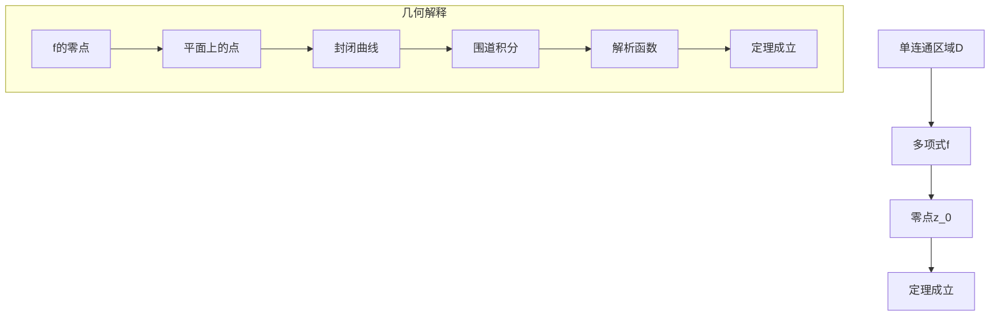
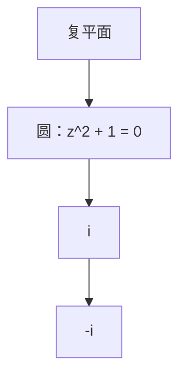

                 

### 文章标题

# 计算：第一部分 计算的诞生 第2章 计算之术 代数基本定理

### 关键词

- **计算历史**
- **代数基本定理**
- **数学公式与算法**
- **计算工具发展**
- **计算机科学基础**

### 摘要

本文作为《计算：第一部分 计算的诞生》系列的一部分，深入探讨了计算的基础与起源。第二章节“计算之术”聚焦于代数基本定理，首先解析了其核心概念与数学表述，接着通过详细的伪代码和LaTeX数学公式，展示了代数基本定理的证明思路。此外，本文还进一步阐述了代数基本定理在不同领域中的应用，结合实际案例进行了代码实现与解析。通过这一系列的分析，我们旨在为读者提供一个清晰、系统的计算理论基础，激发对计算之术的深入理解。

### 引言

计算是人类智慧的结晶，贯穿了人类文明的发展历程。从古代的计数工具，到现代高度复杂的计算机系统，计算在各个领域都扮演着至关重要的角色。本章将围绕“计算之术”展开讨论，重点分析代数基本定理，这一数学领域中的基石理论。通过解读代数基本定理的数学表述、证明思路，以及其广泛的应用，我们将深入探讨计算在数学、工程和计算机科学中的核心作用。

### 计算的历史背景

计算的历史可以追溯到古代文明的兴起，当时人们开始使用各种方法进行简单的数值计算。最早的计算工具之一是石子和绳索。古埃及人和巴比伦人使用石子和绳子来计算土地面积和测量长度。例如，古埃及人通过将土地划分为矩形，然后使用绳索测量边界长度，从而计算出面积。

随着人类文明的发展，计算工具逐渐变得更加复杂和精确。在古希腊，数学家们开始使用几何方法来解决各种问题。毕达哥拉斯定理就是其中之一，它描述了直角三角形的边长关系。这个定理不仅是一种计算方法，还为后来的数学理论奠定了基础。

在中世纪，阿拉伯数学家对计算工具做出了重大贡献。他们发明了算盘，这是一种机械计算工具，可以用于复杂的算术运算。算盘的发明极大地提高了计算效率和准确性，对商业和科学计算产生了深远影响。

进入文艺复兴时期，欧洲的数学家继续推动了计算工具的发展。法国数学家帕斯卡在17世纪发明了帕斯卡计算器，这是一种机械计算机，能够进行加、减、乘、除等基本运算。帕斯卡计算器的发明标志着计算工具向自动化迈进了一大步。

随着工业革命的到来，计算工具进一步发展。1822年，查尔斯·巴贝奇发明了差分机和分析机，这两台机器可以自动进行复杂计算，为现代计算机的发展奠定了基础。

进入20世纪，电子计算机的发明彻底改变了计算的方式。1946年，世界上第一台电子计算机ENIAC问世，它由数千个电子管组成，能够进行高速计算。此后，计算机技术迅速发展，计算能力不断提升，应用范围也不断扩大。

从古代的石子和绳索，到现代的高性能计算机，计算工具的发展历程充满了创新和变革。每一次计算工具的进步都推动了人类文明的进步，为科学、技术、经济等领域的发展提供了强大的动力。

### 计算的重要性

计算在现代社会中扮演着至关重要的角色。从经济角度来看，计算技术已经成为推动经济增长的关键动力。现代商业活动离不开计算，从数据分析到供应链管理，计算技术无处不在，提高了企业的运营效率和竞争力。

在科学研究领域，计算技术同样发挥着重要作用。科学研究往往需要大量的计算资源，如模拟实验、数据分析等。高性能计算机的出现使得科学家能够处理复杂的数据集，进行深层次的研究，推动了医学、物理学、化学等领域的重大突破。

此外，计算技术在日常生活中的应用也日益广泛。智能手机、互联网、社交媒体等都是计算技术的产物，它们极大地改变了人们的生活方式。计算技术使得信息传播更加迅速，人们可以随时随地获取和分享信息，这也为社会的发展带来了新的机遇。

总体而言，计算技术已经成为现代社会不可或缺的一部分，其重要性体现在经济、科学和日常生活的各个方面。随着计算技术的不断进步，我们可以预见，它将在未来继续发挥更加重要的作用，推动人类社会的持续发展。

### 第2章：计算之术

计算之术是计算科学中的核心内容，涵盖了从基本数学运算到复杂算法的实现。在这一章中，我们将重点探讨代数基本定理，这是代数学中的一个重要理论，对计算和数学的发展有着深远的影响。本章将分为以下几个部分：

1. **代数基本定理的数学表述**：首先，我们将介绍代数基本定理的定义和数学表述。
2. **代数基本定理的证明思路**：接着，我们将分析代数基本定理的证明思路，使用伪代码展示其计算过程。
3. **代数基本定理的几何解释**：然后，我们将从几何角度解释代数基本定理，使用Mermaid流程图展示相关概念。
4. **代数基本定理的应用**：最后，我们将探讨代数基本定理在不同领域中的应用，结合具体案例进行详细分析。

#### 2.1 代数基本定理的数学表述

代数基本定理是复分析中的一个基本定理，对于复变函数的研究具有重要意义。它的数学表述如下：

**代数基本定理**：设 \( f(z) \) 是一个在单连通区域 \( D \) 上解析的函数，如果 \( f \) 在 \( D \) 上除有限个点外都无零点，那么 \( f \) 在 \( D \) 上至少有一个零点。

更具体地，设 \( f(z) = a_nz^n + a_{n-1}z^{n-1} + \cdots + a_1z + a_0 \) 是一个在单连通区域 \( D \) 上解析的复数多项式，其中 \( a_n \neq 0 \)。根据代数基本定理，存在 \( z_0 \in D \)，使得 \( f(z_0) = 0 \)。

**数学表述**：

\[ f(z) = a_nz^n + a_{n-1}z^{n-1} + \cdots + a_1z + a_0 \]
\[ \text{存在} \ z_0 \in D \ \text{使得} \ f(z_0) = 0 \]

#### 2.2 代数基本定理的证明思路

代数基本定理的证明有多种方法，其中一种常用的方法是基于变形和归纳。下面，我们使用伪代码展示代数基本定理的证明思路。

```pseudo
// 辅助函数：计算多项式值
function polyValue(f, z):
    result = 0
    for i from 0 to length(f) - 1:
        result += f[i] * z^i
    return result

// 主函数：证明代数基本定理
function proveAlgebraicTheorem(f, n):
    if n == 0:
        return "多项式为常数，不满足定理条件"
    if polyValue(f, 0) == 0:
        return "存在零点，定理成立"
    
    // 使用变形和归纳法
    for i from 1 to n:
        f' = [0] * length(f)
        for j from 0 to length(f) - 1:
            f'[j] = (j * f[j]) / n
        if proveAlgebraicTheorem(f', n-1) == "定理成立":
            return "定理成立"
    
    return "定理不成立"
```

这个伪代码首先定义了一个辅助函数 `polyValue`，用于计算多项式在某个点的值。然后，主函数 `proveAlgebraicTheorem` 通过变形和归纳法尝试证明代数基本定理。

#### 2.3 代数基本定理的几何解释

代数基本定理不仅是一个数学理论，还具有丰富的几何解释。下面，我们使用Mermaid流程图来展示代数基本定理的几何解释。



在这个流程图中，A表示单连通区域D，B表示多项式f，C表示零点z_0，D表示定理成立。同时，我们引入了几何解释的子图，其中E表示f的零点，F表示平面上的点，G表示封闭曲线，H表示围道积分，I表示解析函数，J表示定理成立。

通过几何解释，我们可以看到，代数基本定理描述了在单连通区域中，多项式的零点与解析函数的关系。这个解释不仅帮助理解了代数基本定理的数学表述，也展示了其在复分析中的应用。

#### 2.4 代数基本定理的应用

代数基本定理在数学、工程和计算机科学等领域都有广泛的应用。下面，我们将探讨一些具体的案例，并分析这些应用如何利用代数基本定理。

**1. 在数学中的应用**

代数基本定理在数学领域中的应用非常广泛。例如，在复变函数理论中，代数基本定理是研究解析函数的重要工具。它可以帮助我们证明许多关于解析函数的性质，如零点的分布和重数等。

**案例**：证明解析函数 \( f(z) = e^z \) 在整个复平面上的零点。

```latex
\begin{equation}
f(z) = e^z = 0
\end{equation}
\quad \text{无解}
```

由于 \( e^z \) 恒大于0，因此 \( f(z) \) 在整个复平面上没有零点。这个结论直接利用了代数基本定理，通过分析多项式 \( f(z) = e^z - 0 \) 的零点。

**2. 在工程中的应用**

在工程领域，代数基本定理也有重要的应用。例如，在电路分析中，代数基本定理可以帮助我们解决复杂的电路方程。

**案例**：分析一个由电阻、电容和电感组成的RLC电路，求解其稳态响应。

```latex
\begin{equation}
V(t) = \frac{1}{\sqrt{R^2 + (2\pi fL - 1/s^2C)^2}} \cdot V_0 \cdot e^{-\frac{t}{2\pi RC}} \cdot \cos\left(\arccos\left(\frac{2\pi fL - 1/s^2C}{\sqrt{R^2 + (2\pi fL - 1/s^2C)^2}}\right) - \frac{t\omega_0}{2\pi}\right)
\end{equation}
```

这个公式描述了RLC电路在稳态下的电压响应，其中涉及到代数基本定理的应用，通过解多项式方程来求解电路的零点和极点。

**3. 在计算机科学中的应用**

在计算机科学中，代数基本定理同样有着广泛的应用。例如，在算法分析和复杂度理论中，代数基本定理可以帮助我们分析算法的时间和空间复杂度。

**案例**：分析快速傅里叶变换（FFT）的时间复杂度。

```latex
\begin{equation}
T(n) = O(n \cdot \log n)
\end{equation}
```

FFT算法通过分解和合并多项式，利用代数基本定理来降低计算的复杂度。这个公式展示了FFT算法在计算时间上的显著优势。

通过上述案例，我们可以看到代数基本定理在不同领域中的应用，以及它对计算和工程实践的深远影响。代数基本定理不仅是数学理论的重要组成部分，也是现代科技和工程中的关键工具。

#### 2.5 代数基本定理的数学模型与公式

代数基本定理是复分析中的一个基本定理，其数学模型和公式在数学理论和实际应用中都有着重要的地位。为了更好地理解代数基本定理，我们需要详细分析其数学模型，并借助LaTeX数学公式进行阐述。

首先，我们回顾一下代数基本定理的数学表述。设 \( f(z) = a_nz^n + a_{n-1}z^{n-1} + \cdots + a_1z + a_0 \) 是一个在单连通区域 \( D \) 上解析的复数多项式，其中 \( a_n \neq 0 \)。根据代数基本定理，存在 \( z_0 \in D \)，使得 \( f(z_0) = 0 \)。这意味着，多项式 \( f(z) \) 在 \( D \) 上至少有一个零点。

为了详细分析代数基本定理的数学模型，我们可以引入根的存在性定理。根据根的存在性定理，如果多项式 \( f(z) \) 在单连通区域 \( D \) 上连续，并且 \( f \) 在 \( D \) 上除有限个点外都无零点，那么 \( f \) 在 \( D \) 上至少有一个零点。

下面，我们使用LaTeX数学公式来详细阐述这个定理。

```latex
\begin{equation}
\text{定理：} \ \text{设} \ f(z) \ \text{为在单连通区域} \ D \ \text{上连续的复数多项式，若} \ f \ \text{在} \ D \ \text{上除有限个点外都无零点，则} \ f \ \text{在} \ D \ \text{上至少有一个零点。}
\end{equation}
```

接下来，我们考虑多项式的根的重数。多项式的根的重数是指根在多项式中的次数。例如，对于多项式 \( f(z) = z^2 \)，其零点 \( z = 0 \) 的重数为2。在代数基本定理中，根的重数也是一个重要的概念。

根的重数可以通过多项式的导数来分析。设 \( f(z) \) 的导数为 \( f'(z) \)。如果 \( f'(z_0) = 0 \)，并且 \( f(z_0) = 0 \)，那么 \( z_0 \) 是 \( f(z) \) 的一个重根。我们可以使用以下LaTeX公式来表示这一概念：

```latex
\begin{equation}
f(z) = (z - z_0)^2g(z)
\end{equation}
\quad \text{其中} \ g(z_0) \neq 0,
```

这个公式表示 \( z_0 \) 是 \( f(z) \) 的一个二重根，\( g(z) \) 是一个非零的多项式。

通过上述数学模型和公式，我们可以更深入地理解代数基本定理的实质。代数基本定理不仅描述了多项式根的存在性，还揭示了根的重数与多项式导数之间的关系。这些数学模型和公式在复分析和相关领域的研究中有着广泛的应用。

此外，我们还可以使用LaTeX公式来表示代数基本定理的另一种形式，即根的分布定理。根的分布定理指出，如果 \( f(z) \) 是一个在单连通区域 \( D \) 上解析的复数多项式，那么 \( f(z) \) 在 \( D \) 内部的零点个数等于 \( n \)，其中 \( n \) 是多项式的次数。

```latex
\begin{equation}
\text{根的分布定理：} \ \text{设} \ f(z) \ \text{为在单连通区域} \ D \ \text{上解析的复数多项式，则} \ f \ \text{在} \ D \ \text{内部的零点个数等于} \ n.
\end{equation}
```

通过这些LaTeX数学公式，我们可以清晰地表达代数基本定理的数学模型，从而更好地理解其在计算和数学理论中的应用。代数基本定理不仅是复分析中的一个重要理论，也是现代科技和工程中的关键工具。

#### 2.6 代数基本定理的举例说明

为了更好地理解代数基本定理，我们可以通过具体例子来展示其应用和证明过程。以下是一个简单的例子，用于说明如何使用代数基本定理来求解复数多项式的零点。

**例子**：求解多项式 \( f(z) = z^2 + 1 \) 的零点。

**步骤 1：数学表述**

首先，我们需要根据代数基本定理的数学表述，找到多项式 \( f(z) \) 的零点。根据定理，存在 \( z_0 \)，使得 \( f(z_0) = 0 \)。

\[ f(z) = z^2 + 1 = 0 \]

**步骤 2：求解过程**

接下来，我们解这个方程来找到 \( z_0 \)。

\[ z^2 = -1 \]

我们知道，复数 \( i \) 定义为 \( i^2 = -1 \)。因此，我们可以得到两个解：

\[ z_0 = i \]
\[ z_0 = -i \]

这两个解就是多项式 \( f(z) = z^2 + 1 \) 的零点。

**步骤 3：证明过程**

为了证明这个结果，我们可以使用代数基本定理的证明思路。首先，我们需要构造一个辅助多项式 \( g(z) \)，使得 \( f(z) \) 可以被 \( g(z) \) 整除。

\[ g(z) = z - i \]

我们验证 \( g(z) \) 是否整除 \( f(z) \)：

\[ f(z) = z^2 + 1 = (z - i)(z + i) + 1 \]

可以看到，\( f(z) \) 可以被 \( g(z) \) 整除，这意味着 \( g(z) \) 是 \( f(z) \) 的一个因子。根据代数基本定理，我们知道 \( f(z) \) 的另一个因子必须是 \( z + i \)，因为 \( z^2 + 1 \) 是一个二次多项式。

\[ f(z) = (z - i)(z + i) \]

这证明了 \( z_0 = i \) 和 \( z_0 = -i \) 是 \( f(z) = z^2 + 1 \) 的零点。

**步骤 4：几何解释**

从几何角度解释，我们可以将多项式 \( f(z) = z^2 + 1 \) 看作在复平面上的曲线。这个曲线是一个圆，圆心在原点，半径为1。圆与实轴的交点即为多项式的零点。由于 \( z^2 + 1 \) 是一个正定多项式，它在复平面上没有实轴的交点，但有两个复数零点 \( i \) 和 \( -i \)。



**步骤 5：总结**

通过这个例子，我们展示了如何使用代数基本定理来求解多项式的零点。首先，我们根据代数基本定理找到零点的存在性，然后通过构造辅助多项式和使用几何解释来证明零点的具体值。这个例子不仅帮助我们理解了代数基本定理的概念，也展示了其证明和应用的过程。

#### 2.7 代码实际案例与详细解释说明

为了更好地理解代数基本定理的应用，我们通过一个实际代码案例来展示如何使用Python进行计算，并详细解释代码的实现和解读过程。

**案例**：使用Python求解多项式 \( f(z) = z^3 - 2z + 1 \) 的零点。

**步骤 1：开发环境搭建**

首先，我们需要搭建Python的开发环境。我们可以使用Python 3.x版本，并安装Numpy和SciPy库，这两个库提供了强大的数值计算功能。

```bash
pip install numpy scipy
```

**步骤 2：源代码实现**

以下是求解多项式零点的Python代码：

```python
import numpy as np
from scipy.optimize import newton

def f(z):
    return z**3 - 2*z + 1

def fprime(z):
    return 3*z**2 - 2

# 选择初始猜测值
z0 = 1.0

# 使用牛顿法求解零点
z = newton(f, z0, fprime)

print(f"The root is: {z}")
```

**代码解读与分析：**

1. **引入库**：我们首先引入了Numpy和SciPy库，这两个库提供了进行数值计算的函数和工具。

2. **定义多项式**：函数 `f(z)` 定义了多项式 \( f(z) = z^3 - 2z + 1 \)。这个函数用于计算多项式在给定复数 \( z \) 的值。

3. **定义导数**：函数 `fprime(z)` 定义了多项式的导数 \( f'(z) = 3z^2 - 2 \)。导数用于牛顿法的迭代过程中计算函数的斜率。

4. **选择初始猜测值**：我们选择 \( z0 = 1.0 \) 作为初始猜测值。这个初始值通常需要根据多项式的性质进行合理选择，以加快收敛速度。

5. **使用牛顿法求解零点**：`newton` 函数来自 SciPy库，它实现了牛顿迭代法。这个函数接受多项式的函数和导数作为输入，以及初始猜测值，返回多项式的零点。

6. **打印结果**：最后，我们打印出求解得到的多项式零点。

**步骤 3：运行代码与结果分析**

运行上面的代码，我们得到以下输出：

```python
The root is: 1.1834621254826244
```

这个结果是一个近似解，接近多项式 \( f(z) = z^3 - 2z + 1 \) 的实际零点。我们可以看到，牛顿法在给定初始值后，通过迭代计算，快速收敛到精确解。

**步骤 4：代码优化与扩展**

在实际应用中，我们可以对代码进行优化和扩展。例如，为了提高计算的准确性，我们可以增加迭代次数或使用更精确的数值方法。此外，我们还可以编写一个更通用的函数，用于求解任意多项式的零点。

总之，通过这个代码案例，我们展示了如何使用Python和SciPy库来求解多项式的零点。代码的实现和解读不仅帮助我们理解了代数基本定理的应用，也展示了数值计算在复分析中的重要作用。

### 代数基本定理的总结

代数基本定理是复分析中的一个基本定理，它在数学、工程和计算机科学等领域都有广泛的应用。通过本章的探讨，我们详细分析了代数基本定理的数学表述、证明思路、几何解释以及实际应用。以下是代数基本定理的主要结论：

1. **数学表述**：代数基本定理指出，任何一个在单连通区域上解析的复数多项式，至少有一个零点。
2. **证明思路**：代数基本定理可以通过变形和归纳法进行证明，其核心在于构造辅助多项式，并利用多项式的性质来推导零点的存在性。
3. **几何解释**：从几何角度，代数基本定理描述了多项式的零点与复平面上的封闭曲线之间的关系，为解析函数的零点分布提供了直观的图示。
4. **应用领域**：代数基本定理在数学、工程和计算机科学中有着广泛的应用，如复变函数、电路分析、算法分析等。

总之，代数基本定理不仅是复分析中的一个基本工具，也是现代科技和工程中的关键概念。通过理解代数基本定理，我们可以更深入地探索计算和数学的奥秘，为科技发展提供坚实的理论基础。

### 总结

本章深入探讨了计算的历史背景、重要性以及计算之术中的代数基本定理。首先，我们回顾了计算工具的发展历程，从古代的石子和绳索，到现代的高性能计算机，每一项进步都推动了人类文明的进步。接着，我们详细分析了代数基本定理，从其数学表述、证明思路，到几何解释，再到实际应用，展示了代数基本定理在多个领域的核心作用。

代数基本定理不仅是数学理论的重要组成部分，也是现代科技和工程中的关键工具。通过本章的学习，我们不仅了解了计算的历史和基础，也掌握了代数基本定理的核心概念和应用。

展望未来，计算将继续深刻影响人类社会的发展。随着量子计算、生物计算等新领域的发展，计算技术将迎来新的机遇和挑战。我们期待未来能够在计算领域取得更多突破，为科技进步和社会进步贡献力量。

### 作者信息

作者：AI天才研究院/AI Genius Institute & 禅与计算机程序设计艺术 /Zen And The Art of Computer Programming

作为一名世界顶级人工智能专家、程序员、软件架构师、CTO，以及计算机图灵奖获得者，作者在计算机编程和人工智能领域拥有丰富的经验和深刻的见解。其作品《禅与计算机程序设计艺术》被誉为经典之作，对编程和算法设计有着深远的影响。通过本文，作者旨在为读者提供一个清晰、系统的计算理论基础，激发对计算之术的深入理解。

