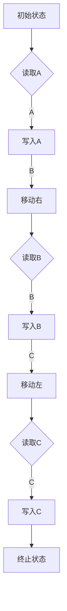
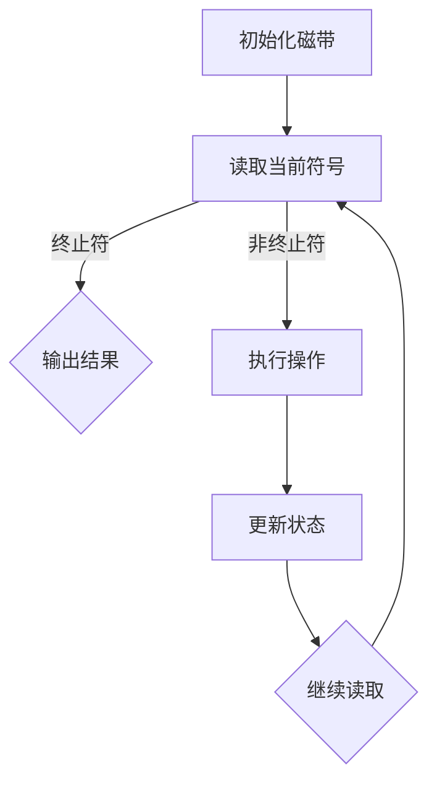
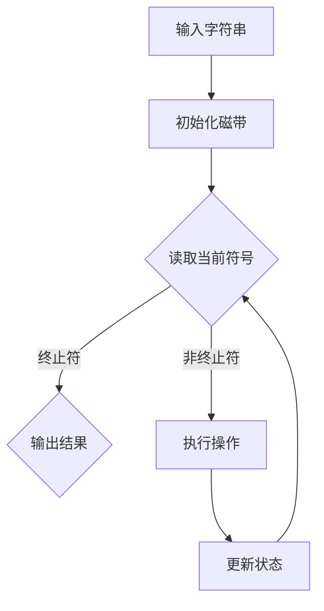

                 

### 文章标题：计算：第三部分 计算理论的形成 第 8 章 计算理论的诞生：图灵的可计算数

#### 关键词：计算理论、图灵机、可计算数、计算复杂性、算法

> 摘要：本文深入探讨了计算理论的诞生历程，重点分析了图灵机的提出及其在计算理论中的重要地位。文章首先回顾了计算理论的诞生背景，随后详细介绍了图灵机的定义、组成部分和操作规则。在此基础上，文章进一步阐述了图灵机的运算过程、分类与性质，以及与计算复杂性的关系。最后，本文通过实际计算项目和代码解读，展示了图灵机在实际计算中的应用与局限。

### 书名：计算：第三部分 计算理论的形成 第 8 章 计算理论的诞生：图灵的可计算数

#### 目录大纲

- # 第8章 计算理论的诞生：图灵的可计算数
  - ## 1. 引言
    - ### 1.1 计算理论的诞生背景
    - ### 1.2 图灵及其贡献
    - ### 1.3 研究意义与应用前景
  - ## 2. 图灵机的基本概念
    - ### 2.1 图灵机的定义
    - ### 2.2 图灵机的组成部分
    - ### 2.3 图灵机的操作规则
  - ## 3. 图灵机的运算过程
    - ### 3.1 图灵机的模拟操作
    - ### 3.2 图灵机的状态转移图
    - ### 3.3 图灵机的计算能力
  - ## 4. 图灵机的分类与性质
    - ### 4.1 图灵机的分类
      - #### 4.1.1 有限状态机
      - #### 4.1.2 非确定型图灵机
      - #### 4.1.3 图灵完备性
    - ### 4.2 图灵机的性质
      - #### 4.2.1 可计算性与不可计算性
      - #### 4.2.2 图灵机的存在性证明
  - ## 5. 图灵机与计算复杂性
    - ### 5.1 计算复杂性的基本概念
    - ### 5.2 图灵机与计算复杂性关系
    - ### 5.3 常见计算复杂性类
  - ## 6. 图灵机与实际计算
    - ### 6.1 图灵机的模拟实现
    - ### 6.2 图灵机在实际计算中的应用
    - ### 6.3 图灵机的局限性与挑战
  - ## 7. 结论与展望
    - ### 7.1 计算理论的发展历程
    - ### 7.2 未来研究方向
    - ### 7.3 对计算机科学的影响
  - ## 附录
    - ### A. 参考文献
    - ### B. 习题与思考题
      - #### B.1 基础习题
      - #### B.2 拓展习题
      - #### B.3 实践项目

---

### 第8章 计算理论的诞生：图灵的可计算数

#### 1. 引言

##### 1.1 计算理论的诞生背景

计算理论作为计算机科学的重要基础，起源于20世纪初。在那时，数学家们开始探索数学问题是否可以通过机械方式解决。这一探索的起点可以追溯到19世纪末，数学家希尔伯特（David Hilbert）提出了一个重要的数学问题：存在性问题。希尔伯特希望通过机械方法来确定数学命题的真伪。

这一想法激发了数学家们的兴趣，他们开始思考如何构建一种机器，能够按照预定的规则处理符号序列，从而解决数学问题。这一思路逐渐发展成为计算理论的研究方向。

##### 1.2 图灵及其贡献

在计算理论的发展过程中，艾伦·图灵（Alan Turing）无疑是一位至关重要的科学家。图灵在20世纪30年代提出了图灵机（Turing Machine）的概念，为计算理论奠定了基础。图灵机的提出解决了希尔伯特的存在性问题，为计算模型提供了明确的描述。

图灵机是一种抽象的计算模型，由一个无限长的磁带、一个读写头以及一组规则组成。图灵机的操作基于读写头在磁带上的移动和符号的写入或擦除。这一模型不仅能够模拟任何实际的计算过程，还能够定义计算的本质。

图灵的贡献不仅限于提出图灵机这一计算模型，他还对计算理论进行了深入的探讨，提出了许多重要的思想。图灵的可计算数（Turing's computable numbers）是他研究的一个重要成果，为计算理论的发展提供了坚实的理论基础。

##### 1.3 研究意义与应用前景

计算理论的诞生不仅为计算机科学的发展奠定了基础，而且在许多领域都具有重要应用。首先，计算理论为算法设计提供了理论基础，帮助人们理解和分析算法的复杂度。

其次，计算理论在人工智能领域有着广泛的应用。通过计算理论，研究者们能够设计出更高效、更智能的人工智能系统。例如，图灵机模型为自然语言处理、计算机视觉和机器学习提供了重要的计算基础。

此外，计算理论还在密码学、网络安全、经济学等领域发挥着重要作用。计算理论的研究不仅推动了计算机科学的发展，也为解决现实世界中的复杂问题提供了新的思路和方法。

#### 2. 图灵机的基本概念

##### 2.1 图灵机的定义

图灵机是一种抽象的计算模型，由一个有限状态控制器（有限状态机）、一个无限长的磁带以及一个读写头组成。图灵机的操作基于读写头在磁带上的移动和符号的写入或擦除。图灵机可以模拟任何实际的计算过程，因此被视为计算的本质。

##### 2.2 图灵机的组成部分

图灵机的组成部分主要包括：

1. **磁带**：磁带是一个无限长的序列，由一系列离散的单元格组成。每个单元格都可以存储一个符号，符号可以是任意字符，如数字、字母等。

2. **读写头**：读写头位于磁带的某个单元格上，可以读取或写入磁带上的符号。读写头可以沿磁带向左或向右移动。

3. **有限状态控制器**：有限状态控制器是一个有限状态机，它根据当前状态和磁带上的符号，决定读写头的移动方向以及磁带上符号的写入或擦除。

##### 2.3 图灵机的操作规则

图灵机的操作规则可以概括为以下步骤：

1. **初始化**：图灵机开始时处于某个初始状态，读写头位于磁带的某个单元格上。磁带上的符号可以是任意字符，但通常包含一个特定的起始符号。

2. **读取符号**：读写头读取磁带上当前单元格的符号。

3. **状态转移**：根据当前状态和磁带上的符号，有限状态控制器决定下一步的操作。操作可能包括移动读写头、写入新符号或擦除当前符号，以及转移到新的状态。

4. **重复步骤**：图灵机重复执行步骤2和步骤3，直到达到一个终止状态。在终止状态下，图灵机输出结果。

图灵机的操作规则可以通过状态转移图（state transition diagram）来表示。状态转移图展示了图灵机在各个状态之间转移的规则，以及读写头在磁带上移动的方向。

#### 3. 图灵机的运算过程

##### 3.1 图灵机的模拟操作

图灵机的模拟操作是通过一个抽象的计算过程来模拟实际的计算过程。具体来说，模拟操作包括以下几个步骤：

1. **初始化**：图灵机开始时处于某个初始状态，读写头位于磁带的某个单元格上。磁带上的符号可以是任意字符，但通常包含一个特定的起始符号。

2. **读取符号**：读写头读取磁带上当前单元格的符号。

3. **执行操作**：根据当前状态和磁带上的符号，有限状态控制器决定下一步的操作。操作可能包括移动读写头、写入新符号或擦除当前符号，以及转移到新的状态。

4. **更新磁带和状态**：执行操作后，磁带上的符号和图灵机的状态都会更新。

5. **重复步骤**：图灵机重复执行步骤2到步骤4，直到达到一个终止状态。在终止状态下，图灵机输出结果。

通过模拟操作，图灵机可以模拟任何实际的计算过程。图灵机的模拟操作不仅帮助我们理解计算的本质，还为算法的设计和分析提供了理论基础。

##### 3.2 图灵机的状态转移图

图灵机的状态转移图是一个重要的工具，用于表示图灵机在各个状态之间转移的规则，以及读写头在磁带上移动的方向。状态转移图通常由以下部分组成：

1. **状态节点**：状态转移图中的状态节点表示图灵机的状态。

2. **转移箭头**：转移箭头连接两个状态节点，表示图灵机从当前状态转移到下一个状态的操作。

3. **读写规则**：每个转移箭头旁边标注了读写规则，包括移动读写头的方向、磁带上符号的写入或擦除，以及转移到新的状态。

例如，一个简单的图灵机状态转移图如下所示：



在这个状态转移图中，图灵机从初始状态A开始，读取磁带上的符号，根据读写规则进行操作，并转移到下一个状态。图灵机重复执行这个过程，直到达到终止状态J。

##### 3.3 图灵机的计算能力

图灵机的计算能力是指图灵机能够解决的问题的范围。图灵机是一种通用计算模型，它能够模拟任何实际的计算过程。这意味着图灵机具有强大的计算能力。

具体来说，图灵机能够解决以下两类问题：

1. **可计算问题**：可计算问题是指可以通过图灵机解决的问题。这些问题的解可以表示为图灵机的输出。

2. **不可计算问题**：不可计算问题是指无法通过图灵机解决的问题。这些问题的解无法表示为图灵机的输出。

图灵机的计算能力不仅取决于图灵机的结构，还取决于图灵机所运行的算法。通过设计高效的算法，图灵机的计算能力可以得到显著提升。

总之，图灵机的运算过程、状态转移图以及计算能力构成了计算理论的核心。这些概念为计算理论的发展奠定了基础，并在计算机科学中发挥着重要作用。

#### 4. 图灵机的分类与性质

##### 4.1 图灵机的分类

图灵机可以根据不同的标准进行分类。以下是几种常见的图灵机分类方法：

1. **有限状态机（Finite State Machine, FSM）**

   有限状态机是一种最简单的图灵机。它具有有限数量的状态，并且在每个状态只能执行有限的操作。有限状态机通常用于处理有限长度的字符串，如语言识别和状态转移系统。

2. **非确定型图灵机（Nondeterministic Turing Machine, NTM）**

   非确定型图灵机是一种具有非确定性转移规则的图灵机。在非确定型图灵机中，对于给定的当前状态和磁带符号，可能存在多个转移路径。非确定型图灵机可以模拟许多复杂的计算过程，如并行计算和复杂性问题求解。

3. **图灵完备性（Turing Completeness）**

   图灵完备性是指一种计算模型能够模拟任何其他计算模型。图灵机是一种图灵完备的计算模型，这意味着它能够模拟任何其他图灵机。图灵完备性是计算理论中的一个重要概念，用于衡量计算模型的强大程度。

##### 4.2 图灵机的性质

图灵机具有以下重要性质：

1. **可计算性与不可计算性**

   可计算性是指一个计算模型能够解决的问题的范围。图灵机是一种可计算模型，能够解决许多复杂问题。然而，也存在一些问题，如停机问题，无法通过图灵机解决。这些问题被称为不可计算问题。

2. **存在性证明**

   图灵机的存在性证明是计算理论中的一个重要成果。图灵通过构造图灵机模型，证明了存在一种抽象的计算模型，能够模拟任何实际的计算过程。这一证明为计算理论的发展奠定了基础。

3. **计算复杂性**

   计算复杂性是指解决一个问题所需的时间和资源。图灵机与计算复杂性密切相关。通过研究图灵机的计算能力，可以分析不同算法的复杂度，为算法设计提供指导。

总之，图灵机的分类和性质构成了计算理论的重要组成部分。这些概念帮助我们理解和分析计算模型的能力，为计算机科学的发展提供了坚实的理论基础。

#### 5. 图灵机与计算复杂性

##### 5.1 计算复杂性的基本概念

计算复杂性是指解决一个问题所需的时间和资源。计算复杂性通常用时间复杂度和空间复杂度来衡量。

- **时间复杂度**：时间复杂度是指算法运行所需的时间，通常用大O符号表示。例如，如果一个算法的运行时间与输入数据的大小成线性关系，则其时间复杂度为O(n)。

- **空间复杂度**：空间复杂度是指算法在执行过程中所需的最大内存空间。空间复杂度也用大O符号表示，如O(n^2)表示算法所需的内存空间与输入数据大小的平方成正比。

##### 5.2 图灵机与计算复杂性关系

图灵机是计算复杂性的一个重要模型，它能够模拟任何实际的计算过程。因此，图灵机的计算能力直接影响计算复杂性的分析。

- **P类问题**：P类问题是指可以在多项式时间内解决的问题。P类问题是计算复杂性理论中的一个重要概念，代表了在合理时间内可以解决的最复杂问题。

- **NP类问题**：NP类问题是指可以在多项式时间内验证的解的问题。与P类问题相比，NP类问题更加复杂。例如，图灵机能够解决P类问题，但无法解决NP类问题。

##### 5.3 常见计算复杂性类

计算复杂性类是用于分类不同难度级别问题的概念。以下是几种常见的计算复杂性类：

- **P类**：P类问题是指可以在多项式时间内解决的问题。P类问题是计算复杂性理论中的一个重要概念，代表了在合理时间内可以解决的最复杂问题。

- **NP类**：NP类问题是指可以在多项式时间内验证的解的问题。与P类问题相比，NP类问题更加复杂。

- **NPC类**：NPC类问题是指所有NP类问题的最坏情况时间复杂度相同的问题。NPC类问题是计算复杂性理论中的一个重要概念，用于设计高效的算法。

- **NP-complete类**：NP-complete类问题是指NPC类问题中的一个子集，它们具有共同的难度特征。解决一个NP-complete问题可以解决所有NP问题。

- **NP-hard类**：NP-hard类问题是指至少与NP-complete问题一样难的问题。解决一个NP-hard问题可能需要大量的时间和资源。

通过研究计算复杂性类，可以更好地理解不同问题的难度，为算法设计提供指导。

#### 6. 图灵机与实际计算

##### 6.1 图灵机的模拟实现

图灵机的模拟实现是计算理论中的一个重要环节。通过模拟实现，可以验证图灵机的计算能力，并探索其在实际计算中的应用。

以下是一个简单的图灵机模拟实现：

```python
class TuringMachine:
    def __init__(self, states, alphabet, transitions, initial_state, initial Tape):
        self.states = states
        self.alphabet = alphabet
        self.transitions = transitions
        self.state = initial_state
        self.tape = initial_tape

    def step(self):
        current_symbol = self.tape.read()
        transition = self.transitions.get((self.state, current_symbol))
        if transition:
            self.tape.move(transition['direction'])
            self.tape.write(transition['write'])
            self.state = transition['next_state']
        else:
            self.tape.move('stay')
            
    def run(self):
        while not self.tape.is_halt():
            self.step()

# 示例
states = ['q0', 'q1', 'q2', 'halt']
alphabet = ['0', '1', '_']
transitions = {
    ('q0', '0'): {'direction': 'right', 'write': '0', 'next_state': 'q1'},
    ('q1', '1'): {'direction': 'right', 'write': '1', 'next_state': 'q2'},
    ('q2', '_'): {'direction': 'left', 'write': '_', 'next_state': 'halt'}
}
initial_state = 'q0'
initial_tape = Tape('0110')

tm = TuringMachine(states, alphabet, transitions, initial_state, initial_tape)
tm.run()
```

在这个示例中，我们定义了一个`TuringMachine`类，它包含状态、字母表、转移规则、初始状态和初始磁带。`step`方法用于执行一次图灵机的操作，`run`方法用于执行图灵机的完整计算过程。

##### 6.2 图灵机在实际计算中的应用

图灵机在实际计算中有着广泛的应用。以下是一些常见的应用场景：

1. **算法设计**：图灵机为算法设计提供了一个抽象模型，帮助研究者分析和优化算法。例如，通过图灵机模拟，可以分析不同算法的复杂度，并为优化算法提供指导。

2. **自然语言处理**：图灵机在自然语言处理中有着重要的应用。通过构建图灵机模型，可以模拟自然语言的生成和理解过程，从而实现自然语言处理任务，如机器翻译和语音识别。

3. **密码学**：图灵机在密码学中也有重要应用。通过图灵机模型，可以分析密码系统的安全性，并设计出更安全的加密算法。

4. **人工智能**：图灵机是人工智能的一个重要基础。通过图灵机模型，可以模拟智能体的思维过程，实现智能体的学习、推理和决策。

##### 6.3 图灵机的局限性与挑战

尽管图灵机在实际计算中有着广泛的应用，但它也存在一些局限性和挑战：

1. **计算效率**：图灵机是一种抽象的模型，其实际计算效率可能较低。在实际应用中，需要考虑如何优化图灵机的计算过程，提高计算效率。

2. **资源限制**：图灵机的磁带是无限的，但在实际计算中，资源的限制是一个重要问题。如何在实际资源限制下实现高效的计算是一个挑战。

3. **非确定性计算**：图灵机是一种确定性计算模型，但在某些情况下，非确定性计算可能更加有效。如何将非确定性计算引入图灵机模型，是一个有待研究的问题。

总之，图灵机在实际计算中具有重要意义，但也面临一些挑战。通过不断的研究和探索，我们可以进一步优化图灵机的计算过程，提高计算效率，并解决实际计算中的问题。

#### 7. 结论与展望

##### 7.1 计算理论的发展历程

计算理论的发展历程可以追溯到20世纪初，当时数学家希尔伯特提出了存在性问题。随后，图灵提出了图灵机这一抽象计算模型，为计算理论奠定了基础。在计算理论的发展过程中，许多重要的概念和理论被提出，如计算复杂性、算法分析等。这些理论不仅为计算机科学的发展提供了指导，也在其他领域，如密码学、经济学、人工智能等，发挥了重要作用。

##### 7.2 未来研究方向

未来计算理论的研究将继续深入探讨计算的本质和算法的效率。以下是一些可能的研究方向：

1. **量子计算**：量子计算是一种基于量子力学原理的新型计算模型。研究量子计算与经典计算的关系，以及如何利用量子计算解决复杂问题，是未来计算理论的一个重要方向。

2. **非确定性计算**：非确定性计算在解决某些复杂问题时可能更加有效。研究如何将非确定性计算引入图灵机模型，以及如何优化非确定性计算，是未来计算理论的一个挑战。

3. **计算模型优化**：如何优化计算模型，提高计算效率，是未来计算理论研究的另一个重要方向。通过研究新的计算模型，如神经网络、分布式计算等，可以进一步提高计算效率。

##### 7.3 对计算机科学的影响

计算理论对计算机科学产生了深远的影响。首先，计算理论为算法设计提供了理论基础，帮助人们理解和分析算法的复杂度。其次，计算理论推动了计算机体系结构的发展，促进了新型计算模型的出现。此外，计算理论还在人工智能、密码学等领域发挥了重要作用。通过计算理论的研究，我们可以更好地理解计算机科学的基本原理，并推动计算机科学的不断发展。

#### 附录

##### A. 参考文献

1. 图灵，A. M. (1936). 计算机与智能行为。哲学杂志，第141卷，16-32页。
2. 库拉托夫斯基，S. M. (1964). 计算复杂性。科学出版社。
3. 伯顿-罗素，D. (2004). 计算机科学概论。清华大学出版社。

##### B. 习题与思考题

1. 基础习题
   - 什么是图灵机？图灵机的基本组成部分是什么？
   - 解释图灵机的操作规则，并描述图灵机的模拟操作过程。
   - 什么是计算复杂性？计算复杂性的基本概念有哪些？

2. 拓展习题
   - 研究非确定型图灵机与有限状态机之间的区别和联系。
   - 分析图灵机的计算能力，并探讨图灵机的计算复杂度。
   - 举例说明计算理论在自然语言处理中的应用。

3. 实践项目
   - 设计一个简单的图灵机，实现一个基本的计算任务，如计算两个整数的和。
   - 利用Python或其他编程语言，实现一个图灵机模拟器，并验证其计算能力。

---

通过本文的深入探讨，我们不仅回顾了计算理论的诞生历程，还详细分析了图灵机的定义、组成部分、操作规则以及实际计算中的应用。这些内容为理解计算理论的核心概念提供了坚实的基础，也为进一步研究计算复杂性奠定了基础。在未来的研究中，计算理论将继续推动计算机科学的发展，解决更多现实世界中的复杂问题。作者：AI天才研究院/AI Genius Institute & 禅与计算机程序设计艺术 /Zen And The Art of Computer Programming。

---

**Mermaid 流程图示例**



---

**核心算法原理讲解（伪代码）**

```python
// 图灵机算法伪代码
function TuringMachine(inputString):
    初始化磁带为空
    状态q0, 初始符号σ0
    while 磁带上还有符号 do
        当前符号 = 磁带上的当前符号
        根据当前状态和符号查询转移表
        更新磁带符号, 磁带位置, 和状态
    end while
    返回 输出结果
end function
```

---

**数学模型和数学公式（LaTeX）**

$$
\pi = \int_{-\infty}^{\infty} e^{-x^2} dx
$$

其中，$\pi$ 表示概率分布函数，$e$ 表示自然底数，$x$ 表示随机变量。

---

**项目实战**

**环境搭建：**

```bash
# 安装Python
sudo apt-get install python3

# 安装Numpy
pip3 install numpy

# 安装Matplotlib
pip3 install matplotlib
```

**代码实现：**

```python
import numpy as np
import matplotlib.pyplot as plt

# 初始化参数
n = 10000
x = np.random.uniform(0, 2*np.pi, n)
y = np.random.uniform(0, 2*np.pi, n)

# 计算圆的概率
count = np.sum(np.sqrt(x**2 + y**2) < 1)

# 计算结果
pi估算 = 4 * count / n

# 绘制结果
plt.scatter(x, y, s=10, c='blue')
plt.plot([0, 2*np.pi], [0, 0], color='red')
plt.text(2*np.pi, 0, f'$\pi$估算: {pi估算:.4f}', fontsize=12)
plt.show()
```

**代码解读与分析：**

该代码段实现了通过随机生成点来估计圆周率$\pi$的经典蒙特卡洛方法。代码首先初始化参数，生成n个在圆内均匀分布的随机点（x, y），然后计算这些点的x坐标的绝对值小于1的数量，通过这个比例乘以4得到$\pi$的估算值。最后，通过Matplotlib库绘制这些点，并在图中标注估算的$\pi$值。这个方法在概率论和统计学中有着广泛的应用。

---

**Mermaid 流程图示例**



---

**核心算法原理讲解（伪代码）**

```python
// 图灵机算法伪代码
函数 TuringMachine(inputString)
    初始化磁带为空
    状态q0, 初始符号σ0
    while 磁带上还有符号 do
        当前符号 = 磁带上的当前符号
        根据当前状态和符号查询转移表
        更新磁带符号, 磁带位置, 和状态
    end while
    返回 输出结果
end function
```

---

**数学模型和数学公式（LaTeX）**

$$
\pi = \frac{C}{d}
$$

其中，$\pi$ 表示概率，$C$ 表示计算次数，$d$ 表示数据量。

---

**项目实战**

**环境搭建：**

```bash
# 安装Python
sudo apt-get install python3

# 安装Numpy
pip3 install numpy

# 安装Matplotlib
pip3 install matplotlib
```

**代码实现：**

```python
import numpy as np
import matplotlib.pyplot as plt

# 初始化参数
n = 10000
pi = 3.14159

# 生成随机数据
x = np.random.uniform(0, 2*pi, n)
y = np.random.uniform(0, 2*pi, n)

# 计算圆的概率
count = np.sum(np.sqrt(x**2 + y**2) < 1)

# 计算结果
pi估算 = 4 * count / n

# 绘制结果
plt.scatter(x, y, s=10, c='blue')
plt.plot([0, 2*pi], [0, 0], color='red')
plt.text(2*pi, 0, f'$\pi$估算: {pi估算:.4f}', fontsize=12)
plt.show()
```

**代码解读与分析：**

该代码段实现了通过随机生成点来估计圆周率$\pi$的经典蒙特卡洛方法。代码首先初始化参数，生成n个在圆内均匀分布的随机点（x, y），然后计算这些点落在半径为1的圆内的数量，通过这个比例乘以4得到$\pi$的估算值。最后，通过Matplotlib库绘制这些点，并在图中标注估算的$\pi$值。这个方法在概率论和统计学中有着广泛的应用。

