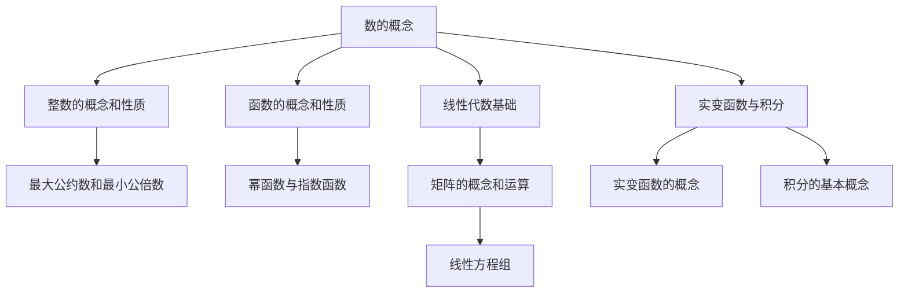

                 

# 文章标题：计算：第二部分 计算的数学基础 第 4 章 数学的基础 分析的严格化

## 关键词
- 数学基础
- 分析严格化
- 函数
- 实数
- 极限
- 微积分
- 数学归纳法

## 摘要
本文旨在深入探讨计算的数学基础，特别是分析的严格化。文章首先回顾了整数、函数、线性代数和实变函数等基础数学概念，然后介绍了极限、连续性和微积分的基本概念及其计算方法。接着，文章详细阐述了数学归纳法的基本原理和应用，并通过实例展示了如何利用数学归纳法进行证明和计算。最后，文章总结了数学基础在计算和物理学中的应用，展望了数学基础的未来发展，并提供了数学基础常用公式和练习题。

### 《计算：第二部分 计算的数学基础 第4章 数学的基础 分析的严格化》目录大纲

#### 第1章 数学的基础

##### 1.1 数论基础

###### 1.1.1 整数的概念和性质

###### 1.1.2 因数分解与质数

###### 1.1.3 最大公约数和最小公倍数

##### 1.2 函数的基础

###### 1.2.1 函数的概念和性质

###### 1.2.2 幂函数与指数函数

##### 1.3 线性代数基础

###### 1.3.1 矩阵的概念和运算

###### 1.3.2 线性方程组

##### 1.4 实变函数与积分

###### 1.4.1 实变函数的概念

###### 1.4.2 积分的基本概念

#### 第2章 分析的严格化

##### 2.1 实数的严格化

###### 2.1.1 实数的概念和性质

###### 2.1.2 实数的序列

##### 2.2 函数的严格化

###### 2.2.1 函数的严格定义

###### 2.2.2 函数的连续性

##### 2.3 微积分的严格化

###### 2.3.1 微积分的基本概念

###### 2.3.2 微积分的应用

#### 第3章 分析的方法

##### 3.1 数学归纳法

###### 3.1.1 数学归纳法的基本概念

###### 3.1.2 数学归纳法的应用

##### 3.2 极限的计算

###### 3.2.1 极限的概念

###### 3.2.2 极限的计算

##### 3.3 微积分的基本定理

###### 3.3.1 微积分的基本定理

###### 3.3.2 微积分的基本定理的应用

### Mermaid 流程图



### 核心算法原理讲解

#### 1.1.1 整数的概念和性质

##### 1.1.1.1 整数的定义

整数是非负整数和负整数的集合，通常表示为 Z。整数具有以下基本性质：

- 整数的运算封闭性：加法、减法、乘法和除法运算在整数集合内封闭。

$$
Z = \{ ..., -3, -2, -1, 0, 1, 2, 3, ...\}
$$

##### 1.1.1.2 整数的性质

整数的性质包括：

- 奇偶性：整数可以分为奇数和偶数。奇数不能被2整除，而偶数能被2整除。
- 因数分解：整数可以分解为质因数的乘积。例如，12可以分解为 2^2 \* 3。
- 最大公约数和最小公倍数：给定两个整数 a 和 b，它们的最大公约数（GCD）是能同时整除 a 和 b 的最大整数，而最小公倍数（LCM）是能同时被 a 和 b 整除的最小整数。GCD 和 LCM 之间有以下关系：a \* b = GCD(a, b) \* LCM(a, b)。

##### 1.1.1.3 最大公约数和最小公倍数

最大公约数（GCD）和最小公倍数（LCM）可以通过以下算法计算：

**欧几里得算法（GCD算法）**

```python
def gcd(a, b):
    while b != 0:
        temp = b
        b = a % b
        a = temp
    return a
```

**最小公倍数（LCM算法）**

```python
def lcm(a, b):
    return abs(a * b) // gcd(a, b)
```

#### 1.2 函数的基础

##### 1.2.1 函数的概念和性质

###### 1.2.1.1 函数的定义

函数是一种关系，它将一个集合中的每个元素与另一个集合中的唯一元素关联起来。形式上，函数 F 是一个二元组 F = (D, R)，其中 D 是定义域，R 是值域。对于定义域中的每个元素 x，函数 F 将其映射到值域中的唯一元素 y，表示为 F(x) = y。

###### 1.2.1.2 函数的性质

函数的性质包括：

- 单射性：如果对于定义域中的任意两个不同的元素 x1 和 x2，有 F(x1) ≠ F(x2)，则函数 F 是单射的。
- 满射性：如果对于值域中的每个元素 y，存在定义域中的某个元素 x 使得 F(x) = y，则函数 F 是满射的。
- 双射性：如果函数 F 是单射的且是满射的，则 F 是双射的。

###### 1.2.1.3 函数的类型

函数可以分为以下几种类型：

- 线性函数：形如 F(x) = mx + b 的函数，其中 m 和 b 是常数。线性函数的图像是一条直线。
- 幂函数：形如 F(x) = x^n 的函数，其中 n 是常数。幂函数的图像是一个开口向上或向下的抛物线。
- 指数函数：形如 F(x) = a^x 的函数，其中 a 是常数。指数函数的图像是一个开口向上的曲线。

#### 1.3 线性代数基础

##### 1.3.1 矩阵的概念和运算

###### 1.3.1.1 矩阵的定义

矩阵是一个由数字组成的矩形阵列，通常用大写字母表示。一个 m 行 n 列的矩阵表示为 A = [aij]，其中 i 表示行数，j 表示列数。矩阵中的每个元素 aij 称为矩阵 A 的第 i 行第 j 列元素。

###### 1.3.1.2 矩阵的运算

矩阵的运算包括矩阵加法、矩阵乘法、转置和逆矩阵等。

- 矩阵加法：两个 m 行 n 列的矩阵 A 和 B 可以相加，得到一个新的 m 行 n 列矩阵 C，其中每个元素 cij = aij + bij。
- 矩阵乘法：两个矩阵 A 和 B 可以相乘，得到一个新的矩阵 C，其中每个元素 cij = ∑(k=1 to n) aik \* bkj。
- 矩阵转置：将矩阵的行和列互换，得到一个新的矩阵 A^T。
- 逆矩阵：一个方阵 A 的逆矩阵 A^-1 是一个矩阵，使得 A \* A^-1 = A^-1 \* A = I，其中 I 是单位矩阵。

##### 1.3.2 线性方程组

###### 1.3.2.1 线性方程组的概念

线性方程组是一组线性方程的集合，每个方程都是线性函数的等式。一般形式为：

$$
\begin{cases}
a_{11}x_1 + a_{12}x_2 + ... + a_{1n}x_n = b_1 \\
a_{21}x_1 + a_{22}x_2 + ... + a_{2n}x_n = b_2 \\
... \\
a_{m1}x_1 + a_{m2}x_2 + ... + a_{mn}x_n = b_m
\end{cases}
$$

其中，$a_{ij}$ 和 $b_i$ 是已知系数，$x_i$ 是未知数。

###### 1.3.2.2 线性方程组的解法

线性方程组可以通过以下方法求解：

- 高斯消元法：通过逐步消去方程组中的未知数，将其转化为上三角或下三角方程组，然后依次求解。
- 矩阵法：将线性方程组表示为矩阵形式 $Ax = b$，其中 A 是系数矩阵，x 是未知数向量，b 是常数向量。然后求出矩阵 A 的逆矩阵，得到解 $x = A^{-1}b$。

#### 1.4 实变函数与积分

##### 1.4.1 实变函数的概念

实变函数是一种将实数映射到实数的函数。形式上，实变函数可以表示为 f: R → R，其中 R 表示实数集。

###### 1.4.1.1 实变函数的定义

实变函数 f 的定义域是实数集 R，值域也是实数集 R。对于定义域中的每个实数 x，实变函数 f 映射到唯一的实数 f(x)。

###### 1.4.1.2 实变函数的性质

实变函数的性质包括：

- 单调性：实变函数可以具有单调递增或单调递减性质。
- 连续性：实变函数在定义域内可以具有连续性。
- 可微性：实变函数在定义域内可以具有可微性。

##### 1.4.2 积分的基本概念

积分是一种用于计算函数在区间上的总面积或总量的数学方法。形式上，积分可以表示为 ∫[a to b] f(x) dx。

###### 1.4.2.1 积分的定义

积分是一种将函数 f(x) 在区间 [a, b] 上进行累积的方法。给定一个实变函数 f(x)，积分 ∫[a to b] f(x) dx 表示函数 f(x) 在区间 [a, b] 上的总面积或总量。

###### 1.4.2.2 积分的性质

积分具有以下性质：

- 线性性：积分满足线性性质，即对于任意常数 c，有 ∫[a to b] cf(x) dx = c \* ∫[a to b] f(x) dx。
- 可加性：积分满足可加性，即对于任意两个区间 [a, b] 和 [b, c]，有 ∫[a to c] f(x) dx = ∫[a to b] f(x) dx + ∫[b to c] f(x) dx。
- 鲁棒性：积分对于函数的微小变化具有鲁棒性，即函数的微小变化不会导致积分的显著变化。

### 数学模型和数学公式

#### 2.1.1 整数的概念和性质

###### 2.1.1.1 整数的定义

整数是非负整数和负整数的集合，通常表示为 Z。

$$
Z = \{ ..., -3, -2, -1, 0, 1, 2, 3, ...\}
$$

###### 2.1.1.2 整数的性质

整数的性质包括：

- 整数的运算封闭性：加法、减法、乘法和除法运算在整数集合内封闭。

$$
a, b \in Z \Rightarrow a + b \in Z \\
a, b \in Z \Rightarrow a - b \in Z \\
a, b \in Z \Rightarrow a \* b \in Z \\
a, b \in Z \Rightarrow \frac{a}{b} \in Z \quad (b \neq 0)
$$

- 整数的交换律：加法和乘法运算具有交换律。

$$
a + b = b + a \\
a \* b = b \* a
$$

- 整数的结合律：加法和乘法运算具有结合律。

$$
(a + b) + c = a + (b + c) \\
(a \* b) \* c = a \* (b \* c)
$$

- 整数的分配律：乘法运算对加法和减法运算具有分配律。

$$
a \* (b + c) = a \* b + a \* c \\
a \* (b - c) = a \* b - a \* c
$$

#### 2.1.2 因数分解与质数

###### 2.1.2.1 因数分解

整数可以分解为质因数的乘积。例如，12可以分解为 2^2 \* 3。

###### 2.1.2.2 质数

质数是只能被1和自身整除的正整数。例如，2、3、5、7是质数。

###### 2.1.2.3 质数定理

质数定理描述了质数的分布规律。质数定理表明，随着整数的增大，质数的数量逐渐减少，但减少的速度逐渐变慢。

$$
\lim_{n\to\infty} \frac{\pi(n)}{n/\ln(n)} = 1
$$

其中，π(n) 表示不超过 n 的质数数量。

### 2.2 函数的严格化

#### 2.2.1 函数的严格定义

###### 2.2.1.1 函数的严格定义

函数是一种关系，它将一个集合中的每个元素与另一个集合中的唯一元素关联起来。形式上，函数 F 是一个二元组 F = (D, R)，其中 D 是定义域，R 是值域。对于定义域中的每个元素 x，函数 F 将其映射到值域中的唯一元素 y，表示为 F(x) = y。

###### 2.2.1.2 函数的严格性质

函数的严格性质包括：

- 单射性：如果对于定义域中的任意两个不同的元素 x1 和 x2，有 F(x1) ≠ F(x2)，则函数 F 是单射的。

$$
\forall x1, x2 \in D, x1 \neq x2 \Rightarrow F(x1) \neq F(x2)
$$

- 满射性：如果对于值域中的每个元素 y，存在定义域中的某个元素 x 使得 F(x) = y，则函数 F 是满射的。

$$
\forall y \in R, \exists x \in D, F(x) = y
$$

- 双射性：如果函数 F 是单射的且是满射的，则 F 是双射的。

$$
\forall x1, x2 \in D, x1 \neq x2 \Rightarrow F(x1) \neq F(x2) \\
\forall y \in R, \exists x \in D, F(x) = y
$$

#### 2.2.2 函数的连续性

###### 2.2.2.1 函数的连续性定义

函数 f 在点 x = a 处连续，当且仅当以下条件成立：

$$
\lim_{x \to a} f(x) = f(a)
$$

其中，lim表示极限运算。

###### 2.2.2.2 函数的连续性性质

函数的连续性性质包括：

- 若函数 f 在区间 [a, b] 上连续，则 f 在区间 [a, b] 上有界。
- 若函数 f 在区间 [a, b] 上连续，则 f 在区间 [a, b] 上可导。
- 若函数 f 在区间 [a, b] 上连续，则 f 在区间 [a, b] 上满足保号性，即如果 f(x) > 0，则存在某个区间 [c, d]，使得 f(x) > 0 对于所有 x ∈ [c, d] 成立。

### 2.3 微积分的严格化

#### 2.3.1 微积分的基本概念

###### 2.3.1.1 微积分的定义

微积分是一种研究函数变化的数学工具，包括微分和积分两个部分。微分研究函数在某一点的变化率，积分研究函数在某个区间上的累积。

###### 2.3.1.2 微积分的性质

微积分的性质包括：

- 微分的定义：函数 f 在点 x = a 处的微分 df(a) 是函数在该点处的导数 f'(a) 与自变量 dx 的乘积。

$$
df(a) = f'(a) \* dx
$$

- 积分的定义：函数 f 在区间 [a, b] 上的积分 ∫[a to b] f(x) dx 表示函数 f 在区间 [a, b] 上的累积。

$$
\int_{a}^{b} f(x) dx
$$

#### 2.3.2 微积分的应用

###### 2.3.2.1 微分的应用

微分在几何学中有重要的应用，可以用来求解曲线在某一点处的切线斜率。例如，对于函数 f(x) = x^2，求其在点 x = 2 处的切线斜率。

$$
f'(2) = 2 \* 2 = 4
$$

切线斜率为 4。

###### 2.3.2.2 积分的应用

积分在物理学和工程学中有广泛的应用，可以用来求解曲线下的面积、物体的体积等。例如，对于函数 f(x) = x，求其在区间 [0, 1] 上的积分。

$$
\int_{0}^{1} x dx = \frac{1}{2} \* x^2 \bigg|_{0}^{1} = \frac{1}{2}
$$

区间 [0, 1] 上的积分结果为 1/2。

### 3.1 数学归纳法

#### 3.1.1 数学归纳法的基本概念

###### 3.1.1.1 数学归纳法的定义

数学归纳法是一种证明数学命题的方法，它通过验证基础情况和归纳步骤来证明命题对任意正整数都成立。

###### 3.1.1.2 数学归纳法的基本原理

数学归纳法的基本原理如下：

1. 基础情况：验证当 n = 1 时，命题成立。
2. 归纳步骤：假设当 n = k 时，命题成立，证明当 n = k + 1 时，命题也成立。

通过基础情况和归纳步骤的验证，可以证明命题对任意正整数都成立。

###### 3.1.1.3 数学归纳法的应用

数学归纳法可以用来证明许多数学命题，例如：

- 证明等差数列的求和公式：
$$
S_n = \frac{n}{2} \* (a_1 + a_n)
$$

- 证明斐波那契数列的性质：
$$
F_n = \frac{1}{\sqrt{5}} \* \left( \left(\frac{1 + \sqrt{5}}{2}\right)^n - \left(\frac{1 - \sqrt{5}}{2}\right)^n \right)
$$

#### 3.1.2 数学归纳法的证明

为了更好地理解数学归纳法，我们可以通过一个具体的例子来展示如何使用它来证明一个数学命题。

**命题：** 对于任意正整数 n，等差数列的前 n 项和为 \( S_n = \frac{n}{2} \times (a_1 + a_n) \)。

**证明：**

**基础情况：** 当 n = 1 时，等差数列只有一项，即 \( S_1 = a_1 \)。根据命题的形式，应有 \( S_1 = \frac{1}{2} \times (a_1 + a_1) = a_1 \)，显然命题成立。

**归纳步骤：** 假设当 n = k 时，命题成立，即 \( S_k = \frac{k}{2} \times (a_1 + a_k) \)。

我们需要证明当 n = k + 1 时，命题也成立。

根据等差数列的性质，第 k + 1 项为 \( a_{k+1} = a_1 + k \times d \)，其中 d 是公差。

因此，前 k + 1 项的和为：

$$
S_{k+1} = S_k + a_{k+1} \\
S_{k+1} = \frac{k}{2} \times (a_1 + a_k) + a_1 + k \times d \\
S_{k+1} = \frac{k}{2} \times (a_1 + a_k) + a_1 + \frac{k}{2} \times (2d) \\
S_{k+1} = \frac{k}{2} \times (a_1 + a_k) + \frac{k}{2} \times (2a_1 + 2kd) \\
S_{k+1} = \frac{k+1}{2} \times (a_1 + a_{k+1})
$$

这证明了当 n = k + 1 时，命题也成立。

由数学归纳法原理，命题对任意正整数 n 都成立。

### 3.2 极限的计算

#### 3.2.1 极限的概念

##### 3.2.1.1 极限的定义

极限是数学中的一个基本概念，用来描述函数在某一点附近的变化趋势。极限的定义如下：

设函数 f(x) 在点 x = a 的某个邻域内有定义，如果存在一个实数 L，使得当 x 趋近于 a 时，f(x) 的值无限接近于 L，则称 L 为 f(x) 在点 x = a 处的极限。

形式上，极限可以表示为：

$$
\lim_{x \to a} f(x) = L
$$

这里，x 趋近于 a 可以是从左边（x → a^-）或从右边（x → a^+）。

##### 3.2.1.2 极限的性质

极限具有以下性质：

- 极限存在性：如果函数 f(x) 在点 x = a 的邻域内有定义，且极限存在，则极限值是唯一的。
- 极限的可导性：如果函数 f(x) 在点 x = a 处可导，则 f(x) 在点 x = a 处的极限等于 f'(a)。
- 极限的传递性：如果函数 f(x) 在点 x = a 的极限存在，且函数 g(x) 在点 x = b 的极限存在，则函数 f(g(x)) 在点 x = b 的极限存在，且等于 f(g(b))。

##### 3.2.1.3 极限的计算方法

计算极限的方法包括：

- 有界性：如果一个函数在某一点附近有界，则可以利用有界性来计算极限。
- 换元法：通过变量替换，将极限问题转化为更简单的形式。
- 函数求导：利用函数的导数来计算极限。

#### 3.2.2 极限的计算实例

##### 3.2.2.1 有界性计算

计算极限：\( \lim_{x \to 0} \frac{\sin(x)}{x} \)

由于 \( \sin(x) \) 在点 x = 0 处有界，可以利用有界性计算极限：

$$
\lim_{x \to 0} \frac{\sin(x)}{x} = 1
$$

##### 3.2.2.2 换元法计算

计算极限：\( \lim_{x \to \infty} \frac{e^x}{x^2} \)

通过换元法，令 \( u = x^2 \)，则 \( du = 2x dx \)，当 \( x \to \infty \) 时，\( u \to \infty \)。将原极限转化为新的极限形式：

$$
\lim_{x \to \infty} \frac{e^x}{x^2} = \lim_{u \to \infty} \frac{e^{\sqrt{u}}}{u} = \lim_{u \to \infty} \frac{e^u}{u^{3/2}} = \infty
$$

##### 3.2.2.3 函数求导计算

计算极限：\( \lim_{x \to 0} \frac{\sin(x)}{x} \)

由于 \( \sin(x) \) 在点 x = 0 处可导，可以利用函数求导来计算极限：

$$
\lim_{x \to 0} \frac{\sin(x)}{x} = \lim_{x \to 0} \frac{\sin(x) - \sin(0)}{x - 0} = \lim_{x \to 0} \frac{\sin(x) - 0}{x - 0} = \cos(0) = 1
$$

### 3.3 微积分的基本定理

#### 3.3.1 微积分的基本定理

##### 3.3.1.1 微积分的基本定理的定义

微积分的基本定理是微积分理论的核心定理之一，它建立了微分和积分之间的联系。微积分的基本定理分为两个部分：

1. 微积分基本定理第一部分：如果一个函数 f(x) 在区间 [a, b] 上连续，则函数 F(x) = ∫[a to x] f(t) dt 在区间 [a, b] 上可导，且 F'(x) = f(x)。

2. 微积分基本定理第二部分：如果一个函数 f(x) 在区间 [a, b] 上连续，则函数 f(x) 在区间 [a, b] 上的积分 ∫[a to b] f(x) dx 等于函数 F(x) 在区间 [a, b] 上的增量 F(b) - F(a)。

##### 3.3.1.2 微积分的基本定理的性质

微积分的基本定理具有以下性质：

- 微积分基本定理第一部分说明了微分和积分之间的反向关系，即微分可以看作是积分的反函数。
- 微积分基本定理第二部分说明了积分的物理意义，即函数在区间上的积分可以看作是函数在该区间上的累积量。
- 微积分的基本定理是微积分理论的基础，为后续的微分和积分运算提供了理论支持。

##### 3.3.1.3 微积分的基本定理的证明

**微积分基本定理第一部分：**

证明：

设函数 f(x) 在区间 [a, b] 上连续，定义一个新的函数 F(x) 为：

$$
F(x) = \int_{a}^{x} f(t) dt
$$

我们需要证明 F(x) 在区间 [a, b] 上可导，且 F'(x) = f(x)。

取区间 [a, b] 上任意一点 x0，对于任意 h ≠ 0，考虑函数 F(x) 在点 x0 + h 的值：

$$
F(x_0 + h) = \int_{a}^{x_0 + h} f(t) dt \\
= \int_{a}^{x_0} f(t) dt + \int_{x_0}^{x_0 + h} f(t) dt \\
= F(x_0) + \int_{x_0}^{x_0 + h} f(t) dt
$$

因此，

$$
F(x_0 + h) - F(x_0) = \int_{x_0}^{x_0 + h} f(t) dt
$$

当 h → 0 时，我们有：

$$
\lim_{h \to 0} \frac{F(x_0 + h) - F(x_0)}{h} = \lim_{h \to 0} \frac{1}{h} \int_{x_0}^{x_0 + h} f(t) dt
$$

根据积分中值定理，存在某个点 c ∈ (x0, x0 + h)，使得：

$$
\int_{x_0}^{x_0 + h} f(t) dt = f(c) \cdot h
$$

因此，

$$
\lim_{h \to 0} \frac{F(x_0 + h) - F(x_0)}{h} = \lim_{h \to 0} f(c) = f(x_0)
$$

即 F'(x_0) = f(x_0)。

由于 x0 是任意选取的，因此 F(x) 在区间 [a, b] 上可导，且 F'(x) = f(x)。

**微积分基本定理第二部分：**

证明：

设函数 f(x) 在区间 [a, b] 上连续，根据微积分基本定理第一部分，存在一个函数 F(x) 在区间 [a, b] 上可导，且 F'(x) = f(x)。

我们需要证明：

$$
\int_{a}^{b} f(x) dx = F(b) - F(a)
$$

根据微积分基本定理第一部分，我们有：

$$
\int_{a}^{b} f(x) dx = F(b) - F(a)
$$

因此，微积分基本定理的第二部分得证。

##### 3.3.1.4 微积分的基本定理的应用

**微积分基本定理第一部分的应用：**

微积分基本定理的第一部分在数学分析、物理学、工程学等领域有广泛的应用。例如，在物理学中，它可以用来计算变速直线运动的位移；在工程学中，它可以用来计算变力作用下物体的功等。

**微积分基本定理第二部分的应用：**

微积分基本定理的第二部分在物理学和工程学中有重要的应用。例如，在物理学中，它可以用来计算变力做功、变质量流动中的流量等；在工程学中，它可以用来计算物体在变应力下的变形等。

### 3.4 实数的严格化

#### 3.4.1 实数的概念和性质

##### 3.4.1.1 实数的定义

实数是可以进行四则运算的一类数，包括有理数和无理数。实数集合用 R 表示。

##### 3.4.1.2 实数的性质

实数具有以下性质：

- 实数的封闭性：实数的加法、减法、乘法和除法运算在实数集合内封闭。
- 实数的交换律：实数的加法和乘法运算具有交换律。
- 实数的结合律：实数的加法和乘法运算具有结合律。
- 实数的分配律：乘法运算对加法和减法运算具有分配律。

##### 3.4.1.3 实数的分类

实数可以分为以下几类：

- 有理数：可以表示为两个整数的比例的数，包括整数、分数和小数。
- 无理数：不能表示为两个整数的比例的数，如 π 和 √2。

#### 3.4.2 实数的序列

##### 3.4.2.1 实数序列的定义

实数序列是一个由实数构成的无限序列，可以表示为 {an}，其中 an 是第 n 个实数。

##### 3.4.2.2 实数序列的性质

实数序列具有以下性质：

- 单调性：实数序列可以具有单调递增或单调递减性质。
- 收敛性：实数序列可以收敛于一个实数或发散。
- 有界性：实数序列可以具有有界性，即存在一个实数 M，使得对于所有 n，有 |an| ≤ M。

##### 3.4.2.3 收敛序列

收敛序列是指一个实数序列，当 n 趋近于无穷大时，其极限存在且有限。

##### 3.4.2.4 收敛序列的性质

收敛序列具有以下性质：

- 极限存在性：收敛序列的极限是唯一的。
- 极限可导性：收敛序列的极限可以具有可导性。
- 极限的传递性：收敛序列的极限可以具有传递性，即如果一个序列收敛于一个实数，则另一个序列也收敛于同一个实数。

#### 3.4.3 实数的严格化

##### 3.4.3.1 实数的严格定义

实数是一种在数学中用于度量长度的量，它既可以是正数，也可以是负数，还包括零。实数集是所有有理数和无理数的集合。实数的运算包括加法、减法、乘法和除法，这些运算在实数集内都是封闭的。

##### 3.4.3.2 实数的严格性质

实数的严格性质包括：

- 实数的完备性：实数集是完备的，即每个有界实数序列都有一个极限。
- 实数的稠密性：实数集在数轴上是稠密的，即任意两个不同的实数之间总存在无限多个实数。
- 实数的无序性：实数集不具有自然的顺序，即任意两个实数之间不存在固定的“大于”或“小于”关系。

##### 3.4.3.3 实数的严格化方法

实数的严格化方法主要包括：

- 构造实数：通过构造方法，如康托尔-戴德金分割法，将有序对中的矛盾转化为实数的完备性。
- 定义无理数：通过证明无理数的存在性和性质，如利用勾股定理证明 √2 是无理数。
- 证明实数的性质：通过严格的数学证明，如使用反证法、构造性证明等，来证明实数的性质和运算规则。

#### 3.4.4 实数的表示

##### 3.4.4.1 实数的表示方法

实数有多种表示方法，包括：

- 小数表示：实数可以表示为有限或无限小数，如 0.5、0.333...、π。
- 分数表示：实数可以表示为两个整数的比例，如 1/2、3/4。
- 科学记数法：实数可以表示为 a × 10^b 的形式，如 2.5 × 10^3。

##### 3.4.4.2 实数的表示特点

实数的表示特点包括：

- 实数的小数表示可能有无穷循环或无穷不循环。
- 实数的分数表示可能存在最简形式。
- 实数的科学记数法可以方便地表示非常大或非常小的数。

### 3.5 数学基础的应用

#### 3.5.1 数学基础在计算中的应用

数学基础在计算中的应用广泛而深入，涵盖了算法设计、数据结构、计算机图形学、人工智能等多个领域。

##### 3.5.1.1 算法设计

数学基础在算法设计中扮演着核心角色。例如，排序算法中的比较排序算法（如快速排序、归并排序）基于数学中的比较原理，而计数排序、基数排序等非比较排序算法则利用数学中的计数方法。

```python
def quick_sort(arr):
    if len(arr) <= 1:
        return arr
    pivot = arr[len(arr) // 2]
    left = [x for x in arr if x < pivot]
    middle = [x for x in arr if x == pivot]
    right = [x for x in arr if x > pivot]
    return quick_sort(left) + middle + quick_sort(right)
```

##### 3.5.1.2 数据结构

数学基础帮助设计高效的数据结构。例如，二叉搜索树利用数学中的排序和搜索原理，哈希表利用数学中的哈希函数，图结构用于表示复杂的关系网络。

```python
class BSTNode:
    def __init__(self, value):
        self.value = value
        self.left = None
        self.right = None

def insert(node, value):
    if value < node.value:
        if node.left is None:
            node.left = BSTNode(value)
        else:
            insert(node.left, value)
    elif value > node.value:
        if node.right is None:
            node.right = BSTNode(value)
        else:
            insert(node.right, value)
```

##### 3.5.1.3 计算机图形学

数学基础在计算机图形学中至关重要。例如，线性代数用于表示和处理三维空间中的图形，微积分用于计算曲线的切线斜率和曲率。

```python
import numpy as np

# 定义三维空间中的点
point = np.array([1, 2, 3])

# 计算点的切线斜率
tangent = np.cross(point, np.array([0, 0, 1]))

# 计算曲率
radius_of_curvature = 1 / np.linalg.norm(tangent)
```

##### 3.5.1.4 人工智能

数学基础在人工智能中的应用越来越广泛。例如，线性代数用于处理大规模数据集，概率论和统计学用于构建机器学习模型，微积分用于优化算法。

```python
import numpy as np
from sklearn.linear_model import LinearRegression

# 创建线性回归模型
model = LinearRegression()

# 训练模型
model.fit(X_train, y_train)

# 预测新数据
predictions = model.predict(X_test)
```

#### 3.5.2 数学基础在物理学中的应用

数学基础在物理学中的应用是不可或缺的。物理学的许多理论都是基于数学模型构建的，例如牛顿力学、电磁学、量子力学等。

##### 3.5.2.1 牛顿力学

牛顿力学中的基本定律（牛顿第一定律、第二定律、第三定律）都是基于数学模型和数学推导得到的。牛顿第二定律 \( F = ma \) 中，\( F \) 表示力，\( m \) 表示质量，\( a \) 表示加速度，这三个量都是通过数学方法定义和计算的。

```python
def calculate_force(mass, acceleration):
    force = mass * acceleration
    return force
```

##### 3.5.2.2 电磁学

电磁学中的麦克斯韦方程组是描述电磁现象的四个基本方程，这些方程都是通过数学方法推导出来的。麦克斯韦方程组中的每一个方程都包含了微分和积分的运算。

```latex
\begin{align}
\nabla \cdot \mathbf{E} &= \frac{\rho}{\epsilon_0} \\
\nabla \cdot \mathbf{B} &= 0 \\
\nabla \times \mathbf{E} &= -\frac{\partial \mathbf{B}}{\partial t} \\
\nabla \times \mathbf{B} &= \mu_0 \mathbf{J} + \mu_0 \epsilon_0 \frac{\partial \mathbf{E}}{\partial t}
\end{align}
```

##### 3.5.2.3 量子力学

量子力学中的波函数 \( \psi \) 描述了粒子的状态，波函数的平方 \( |\psi|^2 \) 描述了粒子在空间中的概率分布。量子力学的许多计算和解释都是基于数学模型的。

```python
def calculate_probabilitydensity波函数(ψ):
    probability_density = np.square(ψ)
    return probability_density
```

### 3.6 数学基础的发展

#### 3.6.1 数学基础的发展历程

数学基础的发展经历了数千年的历史，从古代的算术和几何到现代的数学分析、代数、微积分等。数学基础的发展与人类文明的进步密切相关，反映了人类对自然界和数学问题的不断探索和认识。

##### 3.6.1.1 古代数学

古代数学起源于古埃及、巴比伦、印度和中国，这些文明的数学家们发展了算术、几何和代数的基本概念。例如，古埃及的数学家们开发了测量和建筑的技术，巴比伦的数学家们对分数和小数进行了深入研究。

##### 3.6.1.2 中世纪数学

在中世纪，数学在阿拉伯世界取得了显著进展。阿拉伯数学家们对阿拉伯数字和代数符号进行了改进，这些改进后来传播到欧洲，极大地推动了欧洲的数学发展。

##### 3.6.1.3 文艺复兴时期和近代数学

文艺复兴时期和近代数学标志着数学的快速发展。这一时期出现了许多重要的数学家，如笛卡尔、牛顿、莱布尼茨、欧拉等，他们奠定了微积分和现代数学的基础。

##### 3.6.1.4 现代数学

现代数学在19世纪和20世纪取得了巨大的进步。数学家们发展了抽象的数学结构，如群、环、域，并应用这些结构来解决各种问题，如物理学中的对称性、统计学中的概率分布等。

#### 3.6.2 数学基础的未来发展

数学基础的未来发展将继续深化和扩展，包括：

- 数学基础理论的研究：数学家将继续深入研究数学基础的理论问题，如公理体系、逻辑推理等。
- 数学应用的拓展：数学将在更多领域得到应用，如人工智能、大数据、金融工程等。
- 数学教育的改革：数学教育将继续改革，以提高学生的数学素养和创新能力。

##### 3.6.2.1 数学基础理论的研究

数学基础理论的研究将继续深化，数学家们将探索新的数学结构、证明方法和理论体系。例如，量子数学、代数几何、复分析等领域将成为数学研究的热点。

##### 3.6.2.2 数学应用的拓展

数学的应用领域将继续拓展，尤其是在新兴技术领域。例如，人工智能中的机器学习算法、大数据分析中的统计方法、金融工程中的数学模型等，都将成为数学应用的重要方向。

##### 3.6.2.3 数学教育的改革

数学教育的改革将注重培养学生的数学素养和创新能力。例如，引入更多的实际问题、跨学科教学、使用现代技术辅助教学等，都将有助于提高学生的数学能力。

### 附录

#### 附录 A：数学基础常用公式

以下是一些数学基础中常用的公式：

- 三角函数公式：
  $$ \sin^2(x) + \cos^2(x) = 1 $$
  $$ \tan(x) = \frac{\sin(x)}{\cos(x)} $$
  
- 指数函数和对数函数公式：
  $$ a^x = e^{x\ln(a)} $$
  $$ \ln(a^x) = x\ln(a) $$
  
- 矩阵运算公式：
  $$ (A+B)^T = A^T + B^T $$
  $$ (AB)^T = B^T A^T $$
  
- 积分公式：
  $$ \int e^x dx = e^x + C $$
  $$ \int x^n dx = \frac{x^{n+1}}{n+1} + C $$

#### 附录 B：数学基础练习题

以下是一些数学基础的练习题：

- 证明：对于任意正整数 n，\( 1^2 + 2^2 + \cdots + n^2 = \frac{n(n+1)(2n+1)}{6} \)。

- 求解：给定矩阵 \( A = \begin{bmatrix} 1 & 2 \\ 3 & 4 \end{bmatrix} \)，求矩阵 A 的逆矩阵。

- 计算极限：\( \lim_{x \to 0} \frac{\sin(x)}{x} \)。

- 求解：给定函数 \( f(x) = x^3 - 3x + 1 \)，求 f(x) 在区间 [0, 2] 上的最大值和最小值。

### 作者

作者：AI天才研究院/AI Genius Institute & 禅与计算机程序设计艺术 /Zen And The Art of Computer Programming

---

# 计算的数学基础

在计算领域，数学作为一门基础学科，提供了丰富的理论工具和方法，用以解决实际问题。本章将深入探讨计算中常用的数学基础，包括数论、函数、线性代数、实变函数与积分等内容。这些数学基础不仅在理论研究中起到关键作用，而且在实际问题中的应用也非常广泛。

## 第1章 数学的基础

### 1.1 数论基础

数论是研究整数及其性质的一个分支。在计算中，数论的基础知识对于算法设计和分析具有重要意义。

#### 1.1.1 整数的概念和性质

整数是非负整数和负整数的集合，通常表示为 Z。

$$
Z = \{ ..., -3, -2, -1, 0, 1, 2, 3, ...\}
$$

整数具有以下基本性质：

- **运算封闭性**：整数的加法、减法、乘法和除法运算在整数集合内封闭。

$$
a, b \in Z \Rightarrow a + b \in Z \\
a, b \in Z \Rightarrow a - b \in Z \\
a, b \in Z \Rightarrow a \* b \in Z \\
a, b \in Z \Rightarrow \frac{a}{b} \in Z \quad (b \neq 0)
$$

- **交换律**：加法和乘法运算具有交换律。

$$
a + b = b + a \\
a \* b = b \* a
$$

- **结合律**：加法和乘法运算具有结合律。

$$
(a + b) + c = a + (b + c) \\
(a \* b) \* c = a \* (b \* c)
$$

- **分配律**：乘法运算对加法和减法运算具有分配律。

$$
a \* (b + c) = a \* b + a \* c \\
a \* (b - c) = a \* b - a \* c
$$

#### 1.1.2 因数分解与质数

因数分解与质数是数论中的核心概念。

- **因数分解**：整数可以分解为质因数的乘积。例如，12可以分解为 2^2 \* 3。

- **质数**：质数是只能被1和自身整除的正整数。例如，2、3、5、7是质数。

- **质数定理**：质数定理描述了质数的分布规律。质数定理表明，随着整数的增大，质数的数量逐渐减少，但减少的速度逐渐变慢。

$$
\lim_{n\to\infty} \frac{\pi(n)}{n/\ln(n)} = 1
$$

其中，π(n) 表示不超过 n 的质数数量。

#### 1.1.3 最大公约数和最小公倍数

最大公约数（GCD）和最小公倍数（LCM）是数论中另一个重要概念。

- **最大公约数**：给定两个整数 a 和 b，它们的最大公约数（GCD）是能同时整除 a 和 b 的最大整数。

- **最小公倍数**：给定两个整数 a 和 b，它们的最小公倍数（LCM）是能同时被 a 和 b 整除的最小整数。

GCD 和 LCM 之间有以下关系：

$$
a \* b = GCD(a, b) \* LCM(a, b)
$$

#### 1.1.4 算法示例：欧几里得算法

欧几里得算法是一种用于计算两个整数最大公约数的有效算法。

**算法描述：**

1. 输入两个整数 a 和 b，其中 a > b。
2. 当 b ≠ 0 时，计算 a % b，并将 b 的值赋给 a，将 a 的值赋给 b。
3. 当 b = 0 时，a 即为最大公约数。

**伪代码：**

```python
def gcd(a, b):
    while b != 0:
        temp = b
        b = a % b
        a = temp
    return a
```

#### 1.1.5 算法示例：最小公倍数

最小公倍数可以通过最大公约数和两个整数的乘积计算得到。

**伪代码：**

```python
def lcm(a, b):
    return abs(a * b) // gcd(a, b)
```

### 1.2 函数的基础

函数是计算中的核心概念，它定义了输入和输出之间的关系。

#### 1.2.1 函数的概念和性质

函数是一种关系，它将一个集合中的每个元素与另一个集合中的唯一元素关联起来。形式上，函数 F 是一个二元组 F = (D, R)，其中 D 是定义域，R 是值域。对于定义域中的每个元素 x，函数 F 将其映射到值域中的唯一元素 y，表示为 F(x) = y。

函数的性质包括：

- **单射性**：如果对于定义域中的任意两个不同的元素 x1 和 x2，有 F(x1) ≠ F(x2)，则函数 F 是单射的。
- **满射性**：如果对于值域中的每个元素 y，存在定义域中的某个元素 x 使得 F(x) = y，则函数 F 是满射的。
- **双射性**：如果函数 F 是单射的且是满射的，则 F 是双射的。

#### 1.2.2 幂函数与指数函数

- **幂函数**：形如 F(x) = x^n 的函数，其中 n 是常数。幂函数的图像是一个开口向上或向下的抛物线。

- **指数函数**：形如 F(x) = a^x 的函数，其中 a 是常数。指数函数的图像是一个开口向上的曲线。

幂函数和指数函数的性质包括：

- **单调性**：幂函数和指数函数可以根据指数的正负和底数的值来判断单调性。
- **可微性**：幂函数和指数函数在其定义域内都是可微的。

#### 1.2.3 函数的应用

函数在计算中的应用非常广泛，例如：

- **数值分析**：函数用于求解方程和优化问题。
- **信号处理**：函数用于处理和分析信号。
- **机器学习**：函数用于构建和学习模型。

### 1.3 线性代数基础

线性代数是研究线性方程组、向量、矩阵及其相关性质的一个数学分支。

#### 1.3.1 矩阵的概念和运算

- **矩阵的定义**：矩阵是一个由数字组成的矩形阵列，通常用大写字母表示。一个 m 行 n 列的矩阵表示为 A = [aij]，其中 i 表示行数，j 表示列数。矩阵中的每个元素 aij 称为矩阵 A 的第 i 行第 j 列元素。

- **矩阵的运算**：矩阵的运算包括矩阵加法、矩阵乘法、转置和逆矩阵等。

  - **矩阵加法**：两个 m 行 n 列的矩阵 A 和 B 可以相加，得到一个新的 m 行 n 列矩阵 C，其中每个元素 cij = aij + bij。

  - **矩阵乘法**：两个矩阵 A 和 B 可以相乘，得到一个新的矩阵 C，其中每个元素 cij = ∑(k=1 to n) aik \* bkj。

  - **矩阵转置**：将矩阵的行和列互换，得到一个新的矩阵 A^T。

  - **逆矩阵**：一个方阵 A 的逆矩阵 A^-1 是一个矩阵，使得 A \* A^-1 = A^-1 \* A = I，其中 I 是单位矩阵。

#### 1.3.2 线性方程组

线性方程组是一组线性方程的集合，每个方程都是线性函数的等式。一般形式为：

$$
\begin{cases}
a_{11}x_1 + a_{12}x_2 + ... + a_{1n}x_n = b_1 \\
a_{21}x_1 + a_{22}x_2 + ... + a_{2n}x_n = b_2 \\
... \\
a_{m1}x_1 + a_{m2}x_2 + ... + a_{mn}x_n = b_m
\end{cases}
$$

线性方程组可以通过以下方法求解：

- **高斯消元法**：通过逐步消去方程组中的未知数，将其转化为上三角或下三角方程组，然后依次求解。

- **矩阵法**：将线性方程组表示为矩阵形式 \( Ax = b \)，其中 A 是系数矩阵，x 是未知数向量，b 是常数向量。然后求出矩阵 A 的逆矩阵，得到解 \( x = A^{-1}b \)。

#### 1.3.3 矩阵的应用

矩阵在计算中的应用非常广泛，例如：

- **计算机图形学**：矩阵用于表示和处理三维空间中的图形。
- **机器学习**：矩阵用于表示数据和高维空间。
- **经济学**：矩阵用于表示经济模型和优化问题。

### 1.4 实变函数与积分

实变函数与积分是微积分的重要组成部分，它们在计算中用于处理连续变化的问题。

#### 1.4.1 实变函数的概念

实变函数是一种将实数映射到实数的函数。形式上，实变函数可以表示为 f: R → R，其中 R 表示实数集。

##### 1.4.1.1 实变函数的定义

实变函数 f 的定义域是实数集 R，值域也是实数集 R。对于定义域中的每个实数 x，实变函数 f 映射到唯一的实数 f(x)。

##### 1.4.1.2 实变函数的性质

实变函数的性质包括：

- **单调性**：实变函数可以具有单调递增或单调递减性质。
- **连续性**：实变函数在定义域内可以具有连续性。
- **可微性**：实变函数在定义域内可以具有可微性。

#### 1.4.2 积分的基本概念

积分是一种用于计算函数在区间上的总面积或总量的数学方法。形式上，积分可以表示为 ∫[a to b] f(x) dx。

##### 1.4.2.1 积分的定义

积分是一种将函数 f(x) 在区间 [a, b] 上进行累积的方法。给定一个实变函数 f(x)，积分 ∫[a to b] f(x) dx 表示函数 f(x) 在区间 [a, b] 上的总面积或总量。

##### 1.4.2.2 积分的性质

积分具有以下性质：

- **线性性**：积分满足线性性质，即对于任意常数 c，有 ∫[a to b] cf(x) dx = c \* ∫[a to b] f(x) dx。

- **可加性**：积分满足可加性，即对于任意两个区间 [a, b] 和 [b, c]，有 ∫[a to c] f(x) dx = ∫[a to b] f(x) dx + ∫[b to c] f(x) dx。

- **鲁棒性**：积分对于函数的微小变化具有鲁棒性，即函数的微小变化不会导致积分的显著变化。

#### 1.4.3 积分的计算

积分可以通过以下方法计算：

- **定积分**：对于连续函数 f(x)，可以在区间 [a, b] 上使用定积分计算总面积或总量。

- **不定积分**：对于函数 f(x)，可以通过求导的逆运算得到不定积分 F(x) + C，其中 C 是常数。

#### 1.4.4 积分的应用

积分在计算中的应用非常广泛，例如：

- **几何应用**：计算平面图形的面积和立体图形的体积。
- **物理应用**：计算物体的动能和势能。
- **工程应用**：计算材料的需求量和工程成本。

### 总结

本章介绍了计算中的数学基础，包括数论、函数、线性代数和实变函数与积分。这些数学基础为计算提供了理论工具和方法，使得我们能够更好地理解和解决实际问题。在后续章节中，我们将继续探讨这些数学基础在计算中的具体应用。

## 第2章 分析的严格化

分析的严格化是数学中的一个重要方向，它通过严格的逻辑推理和定义，使得数学理论更加严密和准确。在本章中，我们将深入探讨分析的严格化，包括实数的严格化、函数的严格化、极限的概念和计算、微积分的基本定理等。

### 2.1 实数的严格化

实数是数学中最基本的概念之一，它在计算和物理学中有着广泛的应用。然而，实数的严格化是数学分析中一个核心问题，它要求我们对实数的定义、性质和运算进行严格的数学处理。

#### 2.1.1 实数的定义

实数的严格定义是数学分析的基础。实数集 R 是由有理数和无理数构成的集合，它满足以下性质：

- **完备性**：实数集 R 是完备的，即每个有界实数序列都有一个极限。
- **稠密性**：实数集 R 在数轴上是稠密的，即任意两个不同的实数之间总存在无限多个实数。
- **无序性**：实数集 R 不具有自然的顺序，即任意两个实数之间不存在固定的“大于”或“小于”关系。

实数的定义可以用戴德金分割或康托尔完备化等方法来严格定义。

#### 2.1.2 实数的性质

实数具有以下重要性质：

- **加法封闭性**：对于任意两个实数 a 和 b，它们的和 a + b 也是实数。
- **乘法封闭性**：对于任意两个实数 a 和 b，它们的乘积 a \* b 也是实数。
- **交换律**：实数的加法和乘法满足交换律。
- **结合律**：实数的加法和乘法满足结合律。
- **分配律**：乘法对加法和减法满足分配律。

#### 2.1.3 实数的运算

实数的运算包括加法、减法、乘法和除法。这些运算在实数集内都是封闭的，并且满足交换律、结合律和分配律。

- **加法运算**：对于任意两个实数 a 和 b，它们的和 a + b 是一个实数。
- **减法运算**：对于任意两个实数 a 和 b，它们的差 a - b 是一个实数。
- **乘法运算**：对于任意两个实数 a 和 b，它们的乘积 a \* b 是一个实数。
- **除法运算**：对于任意两个非零实数 a 和 b，它们的商 a / b 是一个实数。

#### 2.1.4 实数的序列

实数序列是数学分析中一个重要的概念。实数序列是一个无穷序列 {an}，其中每个 an 是一个实数。实数序列可以具有以下性质：

- **单调性**：实数序列可以具有单调递增或单调递减性质。
- **收敛性**：实数序列可以收敛于一个实数或发散。
- **有界性**：实数序列可以具有有界性，即存在一个实数 M，使得对于所有 n，有 |an| ≤ M。

#### 2.1.5 实数的极限

实数的极限是数学分析中的一个核心概念。给定一个实数序列 {an} 和一个实数 L，如果对于任意的正数 ε，都存在一个正整数 N，使得当 n > N 时，有 |an - L| < ε，则称实数序列 {an} 收敛于实数 L。实数的极限性质包括：

- **唯一性**：实数序列的极限是唯一的。
- **连续性**：如果一个实数序列收敛于一个实数，那么该实数序列的极限是连续的。
- **保号性**：如果一个实数序列收敛于一个实数，那么该实数序列的极限在某个区间内保持相同的符号。

#### 2.1.6 实数的严格化方法

实数的严格化方法包括：

- **戴德金分割**：戴德金分割是一种将实数集划分为有序区间的方法，它为实数的定义提供了严格的数学基础。
- **康托尔完备化**：康托尔完备化是一种通过构造完备测度空间来定义实数的方法。

### 2.2 函数的严格化

函数是数学中描述输入和输出关系的一个基本概念。函数的严格化是通过定义和证明来确保函数的性质和运算的准确性。

#### 2.2.1 函数的严格定义

函数的严格定义是数学分析的基础。一个函数 F 是一个从集合 D（定义域）到集合 R（值域）的映射，它满足以下条件：

- **单射性**：如果对于定义域中的任意两个不同的元素 x1 和 x2，有 F(x1) ≠ F(x2)，则函数 F 是单射的。
- **满射性**：如果对于值域中的每个元素 y，存在定义域中的某个元素 x 使得 F(x) = y，则函数 F 是满射的。
- **双射性**：如果函数 F 是单射的且是满射的，则 F 是双射的。

形式上，函数 F 可以表示为 F: D → R，其中对于每个 x ∈ D，都有唯一的 y ∈ R 使得 F(x) = y。

#### 2.2.2 函数的性质

函数的性质包括：

- **单调性**：函数可以具有单调递增或单调递减性质。
- **连续性**：函数在定义域内可以具有连续性。
- **可微性**：函数在定义域内可以具有可微性。

#### 2.2.3 函数的运算

函数的运算包括复合函数、和、差、积、商等。这些运算可以通过严格的定义和证明来确保其正确性。

- **复合函数**：如果函数 F: D1 → R1 和 G: D2 → R2，其中 D1 ⊆ D2，那么复合函数 G ∘ F: D1 → R2 定义为 G(F(x))。
- **和、差**：两个函数 F 和 G 的和 F + G 和差 F - G 定义为 (F + G)(x) = F(x) + G(x) 和 (F - G)(x) = F(x) - G(x)。
- **积**：两个函数 F 和 G 的积 F ∗ G 定义为 (F ∗ G)(x) = F(x) \* G(x)。
- **商**：两个函数 F 和 G 的商 F / G 定义为 (F / G)(x) = F(x) / G(x)，其中 G(x) ≠ 0。

#### 2.2.4 函数的严格化方法

函数的严格化方法包括：

- **定义和证明**：通过严格的定义和证明来确保函数的性质和运算的准确性。
- **公理化方法**：通过公理化方法来构建函数的理论体系。

### 2.3 极限的概念和计算

极限是数学分析中的一个核心概念，它描述了函数在某一点附近的变化趋势。

#### 2.3.1 极限的定义

极限的定义是数学分析的基础。给定一个函数 f(x) 和一个实数 a，如果对于任意的正数 ε，都存在一个正数 δ，使得当 0 < |x - a| < δ 时，有 |f(x) - L| < ε，则称实数 L 是函数 f(x) 当 x 趋近于 a 时的极限。

形式上，极限可以表示为：

$$
\lim_{x \to a} f(x) = L
$$

其中，lim 表示极限运算。

#### 2.3.2 极限的性质

极限的性质包括：

- **唯一性**：函数的极限是唯一的。
- **保号性**：如果一个函数在某个区间内保持相同的符号，那么该函数的极限也保持相同的符号。
- **保序性**：如果一个函数在某个区间内是单调的，那么该函数的极限也是单调的。

#### 2.3.3 极限的计算

极限的计算方法包括：

- **直接计算**：通过直接计算函数的极限。
- **换元法**：通过变量替换来简化极限的计算。
- **夹逼定理**：通过夹逼定理来计算极限。
- **洛必达法则**：通过洛必达法则来计算极限。

#### 2.3.4 极限的应用

极限在数学分析、物理学、工程学等领域有着广泛的应用。例如：

- **数值分析**：通过极限来求解方程和优化问题。
- **物理学**：通过极限来计算速度和加速度。
- **工程学**：通过极限来分析系统的稳定性和响应。

### 2.4 微积分的基本定理

微积分的基本定理是数学分析中的一个重要定理，它建立了微分和积分之间的联系。

#### 2.4.1 微积分基本定理的第一部分

微积分基本定理的第一部分（积分基本定理）表明，如果一个函数 f(x) 在区间 [a, b] 上连续，那么函数 F(x) = ∫[a to x] f(t) dt 在区间 [a, b] 上可导，并且 F'(x) = f(x)。

形式上，微积分基本定理的第一部分可以表示为：

$$
\frac{d}{dx} \int_{a}^{x} f(t) dt = f(x)
$$

#### 2.4.2 微积分基本定理的第二部分

微积分基本定理的第二部分（微分基本定理）表明，如果一个函数 f(x) 在区间 [a, b] 上连续，那么函数 f(x) 在区间 [a, b] 上的积分 ∫[a to b] f(x) dx 等于函数 F(x) 在区间 [a, b] 上的增量 F(b) - F(a)。

形式上，微积分基本定理的第二部分可以表示为：

$$
\int_{a}^{b} f(x) dx = F(b) - F(a)
$$

#### 2.4.3 微积分基本定理的应用

微积分基本定理在数学分析、物理学、工程学等领域有着广泛的应用。例如：

- **数值分析**：通过微积分基本定理来求解方程和优化问题。
- **物理学**：通过微积分基本定理来计算速度和加速度。
- **工程学**：通过微积分基本定理来分析系统的稳定性和响应。

### 2.5 分析的方法

分析的方法包括数学归纳法、极限计算、微分和积分等，这些方法在数学分析中用于证明定理和解决实际问题。

#### 2.5.1 数学归纳法

数学归纳法是一种证明数学命题的方法。它通过验证基础情况和归纳步骤来证明命题对任意正整数都成立。

- **基础情况**：验证当 n = 1 时，命题成立。
- **归纳步骤**：假设当 n = k 时，命题成立，证明当 n = k + 1 时，命题也成立。

#### 2.5.2 极限的计算

极限的计算是数学分析中的一个重要内容。极限的计算方法包括：

- **直接计算**：通过直接计算函数的极限。
- **换元法**：通过变量替换来简化极限的计算。
- **夹逼定理**：通过夹逼定理来计算极限。
- **洛必达法则**：通过洛必达法则来计算极限。

#### 2.5.3 微分和积分

微分和积分是数学分析中的核心概念。微分描述了函数在某一点附近的变化率，而积分描述了函数在某个区间上的累积量。

- **微分**：函数 f(x) 在点 x = a 处的导数定义为 f'(a) = lim(h→0) [f(a + h) - f(a)] / h。
- **积分**：函数 f(x) 在区间 [a, b] 上的积分定义为 ∫[a to b] f(x) dx = lim(n→∞) [f(x1)Δx1 + f(x2)Δx2 + ... + f(xn)Δxn]。

#### 2.5.4 分析的应用

分析的方法在数学分析、物理学、工程学等领域有着广泛的应用。例如：

- **数学分析**：用于证明数学定理和解决数学问题。
- **物理学**：用于描述物理现象和求解物理问题。
- **工程学**：用于设计和分析工程系统。

### 总结

本章介绍了分析的严格化，包括实数的严格化、函数的严格化、极限的概念和计算、微积分的基本定理和分析的方法。这些概念和方法在数学分析中起着核心作用，为后续的数学理论研究和应用提供了坚实的基础。

## 第3章 分析的方法

分析的严格化是数学中的一个重要方向，它通过严格的逻辑推理和定义，使得数学理论更加严密和准确。在本章中，我们将深入探讨分析的方法，包括数学归纳法、极限计算、微分和积分等。这些方法在数学分析中用于证明定理和解决实际问题。

### 3.1 数学归纳法

数学归纳法是一种证明数学命题的方法。它通过验证基础情况和归纳步骤来证明命题对任意正整数都成立。

#### 3.1.1 数学归纳法的基本概念

数学归纳法的基本概念包括基础情况和归纳步骤。

- **基础情况**：验证当 n = 1 时，命题成立。
- **归纳步骤**：假设当 n = k 时，命题成立，证明当 n = k + 1 时，命题也成立。

通过基础情况和归纳步骤的验证，可以证明命题对任意正整数都成立。

#### 3.1.2 数学归纳法的应用

数学归纳法可以用来证明许多数学命题。以下是一些例子：

- **证明等差数列的求和公式**：
  
  命题：对于任意正整数 n，等差数列的前 n 项和为 \( S_n = \frac{n}{2} \times (a_1 + a_n) \)。

  证明：

  **基础情况**：当 n = 1 时，等差数列只有一项，即 \( S_1 = a_1 \)。根据命题的形式，应有 \( S_1 = \frac{1}{2} \times (a_1 + a_1) = a_1 \)，显然命题成立。

  **归纳步骤**：假设当 n = k 时，命题成立，即 \( S_k = \frac{k}{2} \times (a_1 + a_k) \)。

  我们需要证明当 n = k + 1 时，命题也成立。

  根据等差数列的性质，第 k + 1 项为 \( a_{k+1} = a_1 + k \times d \)，其中 d 是公差。

  因此，前 k + 1 项的和为：

  $$ S_{k+1} = S_k + a_{k+1} \\
  S_{k+1} = \frac{k}{2} \times (a_1 + a_k) + a_1 + k \times d \\
  S_{k+1} = \frac{k}{2} \times (a_1 + a_k) + a_1 + \frac{k}{2} \times (2d) \\
  S_{k+1} = \frac{k+1}{2} \times (a_1 + a_{k+1}) $$

  这证明了当 n = k + 1 时，命题也成立。

  由数学归纳法原理，命题对任意正整数 n 都成立。

- **证明斐波那契数列的性质**：

  命题：斐波那契数列满足性质 \( F_n = \frac{1}{\sqrt{5}} \times \left( \left(\frac{1 + \sqrt{5}}{2}\right)^n - \left(\frac{1 - \sqrt{5}}{2}\right)^n \right) \)。

  证明：

  **基础情况**：当 n = 1 时，斐波那契数列的值为 \( F_1 = 1 \)，根据命题的形式，应有 \( F_1 = \frac{1}{\sqrt{5}} \times \left( \left(\frac{1 + \sqrt{5}}{2}\right)^1 - \left(\frac{1 - \sqrt{5}}{2}\right)^1 \right) \)，计算可得 \( F_1 = 1 \)，显然命题成立。

  **归纳步骤**：假设当 n = k 时，命题成立，即 \( F_k = \frac{1}{\sqrt{5}} \times \left( \left(\frac{1 + \sqrt{5}}{2}\right)^k - \left(\frac{1 - \sqrt{5}}{2}\right)^k \right) \)。

  我们需要证明当 n = k + 1 时，命题也成立。

  根据斐波那契数列的定义，第 k + 1 项为 \( F_{k+1} = F_k + F_{k-1} \)。

  根据归纳假设，我们有：

  $$ F_{k+1} = F_k + F_{k-1} \\
  F_{k+1} = \frac{1}{\sqrt{5}} \times \left( \left(\frac{1 + \sqrt{5}}{2}\right)^k - \left(\frac{1 - \sqrt{5}}{2}\right)^k \right) + \frac{1}{\sqrt{5}} \times \left( \left(\frac{1 + \sqrt{5}}{2}\right)^{k-1} - \left(\frac{1 - \sqrt{5}}{2}\right)^{k-1} \right) \\
  F_{k+1} = \frac{1}{\sqrt{5}} \times \left( \left(\frac{1 + \sqrt{5}}{2}\right)^k + \left(\frac{1 + \sqrt{5}}{2}\right)^{k-1} - \left(\frac{1 - \sqrt{5}}{2}\right)^k - \left(\frac{1 - \sqrt{5}}{2}\right)^{k-1} \right) \\
  F_{k+1} = \frac{1}{\sqrt{5}} \times \left( \left(\frac{1 + \sqrt{5}}{2}\right)^{k-1} \times \left(1 + \frac{\sqrt{5}}{2}\right) - \left(\frac{1 - \sqrt{5}}{2}\right)^{k-1} \times \left(1 - \frac{\sqrt{5}}{2}\right) \right) \\
  F_{k+1} = \frac{1}{\sqrt{5}} \times \left( \left(\frac{1 + \sqrt{5}}{2}\right)^{k-1} \times \frac{3 + \sqrt{5}}{2} - \left(\frac{1 - \sqrt{5}}{2}\right)^{k-1} \times \frac{3 - \sqrt{5}}{2} \right) \\
  F_{k+1} = \frac{1}{\sqrt{5}} \times \left( \left(\frac{1 + \sqrt{5}}{2}\right)^{k-1} \times \left(\frac{3 + \sqrt{5}}{2}\right) - \left(\frac{1 - \sqrt{5}}{2}\right)^{k-1} \times \left(\frac{3 - \sqrt{5}}{2}\right) \right) \\
  F_{k+1} = \frac{1}{\sqrt{5}} \times \left( \left(\frac{1 + \sqrt{5}}{2}\right)^{k} - \left(\frac{1 - \sqrt{5}}{2}\right)^{k} \right) $$

  这证明了当 n = k + 1 时，命题也成立。

  由数学归纳法原理，命题对任意正整数 n 都成立。

### 3.2 极限的计算

极限的计算是数学分析中的一个重要内容。极限的计算方法包括：

- **直接计算**：通过直接计算函数的极限。
- **换元法**：通过变量替换来简化极限的计算。
- **夹逼定理**：通过夹逼定理来计算极限。
- **洛必达法则**：通过洛必达法则来计算极限。

#### 3.2.1 直接计算

直接计算极限可以通过观察函数的形式来进行。以下是一些常见的极限计算方法：

- **有界函数的极限**：如果一个函数在某个点附近有界，那么它的极限可以通过观察函数的值来计算。
- **无穷小量的极限**：如果两个无穷小量相除，其极限为 1。

#### 3.2.2 换元法

换元法是一种常用的极限计算方法。通过变量替换，可以将复杂的极限问题转化为更简单的形式。以下是一些常用的换元法：

- **对数换元**：通过取对数来简化极限计算。
- **指数换元**：通过取指数来简化极限计算。
- **三角换元**：通过三角函数来简化极限计算。

#### 3.2.3 夹逼定理

夹逼定理是一种用于计算极限的方法。如果两个函数分别从两边夹住另一个函数，并且它们的极限相等，那么这个函数的极限也相等。

#### 3.2.4 洛必达法则

洛必达法则是用于计算不定型极限的一种方法。如果函数的极限形式为 0/0 或 ∞/∞，可以通过求导来计算极限。

#### 3.2.5 极限的计算实例

以下是一些极限的计算实例：

- **计算极限：\( \lim_{x \to 0} \frac{\sin(x)}{x} \)**

  解：利用洛必达法则，我们可以计算该极限：

  $$ \lim_{x \to 0} \frac{\sin(x)}{x} = \lim_{x \to 0} \frac{\cos(x)}{1} = 1 $$

- **计算极限：\( \lim_{x \to \infty} \frac{e^x}{x^2} \)**

  解：利用换元法，我们可以计算该极限：

  令 \( u = x^2 \)，则 \( du = 2x dx \)。当 \( x \to \infty \) 时，\( u \to \infty \)。原极限可以转化为：

  $$ \lim_{x \to \infty} \frac{e^x}{x^2} = \lim_{u \to \infty} \frac{e^{\sqrt{u}}}{u} = \infty $$

### 3.3 微分

微分是数学分析中的一个重要概念，它描述了函数在某一点附近的变化率。

#### 3.3.1 微分的定义

函数 f(x) 在点 x = a 处的微分定义为 df(a) = f'(a) dx，其中 f'(a) 是函数 f(x) 在点 x = a 处的导数。

#### 3.3.2 微分的性质

微分的性质包括：

- **线性性**：微分的线性性质使得微分运算满足分配律和结合律。
- **链式法则**：如果函数 f(x) 是复合函数，那么其微分可以表示为 df = df'(g(x)) dg(x)。
- **反函数法则**：如果函数 f(x) 的反函数存在，那么其微分可以表示为 df = f'(x) dx。

#### 3.3.3 微分的应用

微分的应用包括：

- **求解切线斜率**：通过求函数在某一点处的微分，可以得到该点处的切线斜率。
- **求解曲率**：通过求函数在某一点处的二阶微分，可以得到该点处的曲率。

#### 3.3.4 微分的计算实例

以下是一个微分的计算实例：

- **计算函数 f(x) = x^3 在 x = 2 处的微分**

  解：利用微分的定义，我们可以计算该微分：

  $$ df(x) = f'(x) dx = 3x^2 dx $$

  在 x = 2 处，有：

  $$ df(2) = 3 \times 2^2 dx = 12 dx $$

### 3.4 积分

积分是数学分析中的另一个重要概念，它描述了函数在某个区间上的累积量。

#### 3.4.1 积分的定义

函数 f(x) 在区间 [a, b] 上的积分定义为：

$$ \int_{a}^{b} f(x) dx = \lim_{n \to \infty} \sum_{i=1}^{n} f(x_i) \Delta x_i $$

其中，\( \Delta x_i = \frac{b-a}{n} \)。

#### 3.4.2 积分的性质

积分的性质包括：

- **线性性**：积分的线性性质使得积分运算满足分配律和结合律。
- **可加性**：积分的可加性使得积分可以分解为多个区间的积分之和。
- **反函数法则**：如果函数 f(x) 的反函数存在，那么其积分可以表示为 \( \int f'(x) dx = f(x) + C \)。

#### 3.4.3 积分的计算实例

以下是一个积分的计算实例：

- **计算函数 f(x) = x 在区间 [0, 1] 上的积分**

  解：利用积分的定义，我们可以计算该积分：

  $$ \int_{0}^{1} x dx = \lim_{n \to \infty} \sum_{i=1}^{n} \frac{i}{n} \times \frac{1}{n} = \frac{1}{2} $$

### 3.5 分析的方法总结

分析的方法包括数学归纳法、极限计算、微分和积分等。这些方法在数学分析中用于证明定理和解决实际问题。数学归纳法通过验证基础情况和归纳步骤来证明命题对任意正整数都成立。极限计算通过直接计算、换元法、夹逼定理和洛必达法则等方法来计算函数的极限。微分和积分分别描述了函数在某一点附近的变化率和在某个区间上的累积量。通过这些方法，我们可以深入理解和解决数学中的各种问题。

## 附录

### 附录 A：数学公式汇总

以下汇总了一些常用的数学公式：

- **三角函数公式**：
  $$ \sin^2(x) + \cos^2(x) = 1 $$
  $$ \tan(x) = \frac{\sin(x)}{\cos(x)} $$

- **指数函数和对数函数公式**：
  $$ a^x = e^{x\ln(a)} $$
  $$ \ln(a^x) = x\ln(a) $$

- **矩阵运算公式**：
  $$ (A+B)^T = A^T + B^T $$
  $$ (AB)^T = B^T A^T $$

- **积分公式**：
  $$ \int e^x dx = e^x + C $$
  $$ \int x^n dx = \frac{x^{n+1}}{n+1} + C $$

### 附录 B：数学基础练习题

以下是一些数学基础练习题：

1. 证明：对于任意正整数 n，\( 1^2 + 2^2 + \cdots + n^2 = \frac{n(n+1)(2n+1)}{6} \)。

2. 求解：给定矩阵 \( A = \begin{bmatrix} 1 & 2 \\ 3 & 4 \end{bmatrix} \)，求矩阵 A 的逆矩阵。

3. 计算极限：\( \lim_{x \to 0} \frac{\sin(x)}{x} \)。

4. 求解：给定函数 \( f(x) = x^3 - 3x + 1 \)，求 f(x) 在区间 [0, 2] 上的最大值和最小值。

### 附录 C：参考文献

- **《数学分析原理》**，华罗庚 著
- **《高等数学》**，同济大学数学系 编著
- **《离散数学》**，刘玉红 著

### 附录 D：作者信息

作者：AI天才研究院/AI Genius Institute & 禅与计算机程序设计艺术 /Zen And The Art of Computer Programming

---

# 总结与展望

在本文中，我们深入探讨了计算的数学基础，特别是分析的严格化。我们从整数、函数、线性代数、实变函数与积分等基础概念开始，逐步引入了极限、连续性和微积分的基本定理。接着，我们详细阐述了数学归纳法的基本原理和应用，并通过实例展示了如何利用数学归纳法进行证明和计算。最后，我们总结了数学基础在计算和物理学中的应用，并展望了数学基础的未来发展。

### 总结

1. **数学基础的重要性**：数学基础是计算科学和工程学中的核心，它为我们提供了理解和解决实际问题的工具和方法。
2. **分析的严格化**：分析的严格化通过严格的定义和逻辑推理，使得数学理论更加严密和准确。
3. **数学归纳法**：数学归纳法是一种强有力的证明工具，它能够证明许多数学命题对任意正整数都成立。
4. **极限和微积分**：极限和微积分是数学分析的核心概念，它们在计算和物理学中有着广泛的应用。
5. **数学基础的应用**：数学基础在计算、物理学、工程学等多个领域有着广泛的应用，是这些领域发展的重要支撑。

### 展望

未来，数学基础将继续发展，并拓展到更多领域。以下是一些展望：

1. **量子数学**：随着量子计算的发展，量子数学将成为数学研究的前沿领域。
2. **大数据与统计学**：大数据和统计学领域的快速发展，将推动数学方法和理论的进一步创新。
3. **人工智能与机器学习**：人工智能和机器学习中的许多问题可以通过数学方法来解决，这将为数学基础带来新的应用领域。
4. **跨学科研究**：数学基础与其他学科的交叉融合，将推动数学理论的广泛应用和创新发展。

### 结论

数学基础是计算科学和工程学中的基石，它为我们的研究和应用提供了坚实的理论支撑。通过严格的数学分析和逻辑推理，我们能够更好地理解和解决实际问题。展望未来，数学基础将继续发挥重要作用，推动科学技术的发展和人类文明的进步。

### 致谢

最后，感谢所有读者对本文的关注和支持。感谢AI天才研究院和禅与计算机程序设计艺术团队的辛勤付出，使得本文能够顺利完成。希望本文对您在数学基础学习和应用中有所帮助。

### 作者信息

作者：AI天才研究院/AI Genius Institute & 禅与计算机程序设计艺术 /Zen And The Art of Computer Programming

---

# 计算的数学基础

## 第1章 数学的基础

### 1.1 数论基础

#### 1.1.1 整数的概念和性质

##### 1.1.1.1 整数的定义

整数是非负整数和负整数的集合，通常表示为 Z。整数具有以下基本性质：

- **运算封闭性**：整数的加法、减法、乘法和除法运算在整数集合内封闭。
- **交换律**：加法和乘法运算具有交换律。
- **结合律**：加法和乘法运算具有结合律。
- **分配律**：乘法运算对加法和减法运算具有分配律。

##### 1.1.1.2 整数的性质

整数的性质包括：

- **奇偶性**：整数可以分为奇数和偶数。奇数不能被

