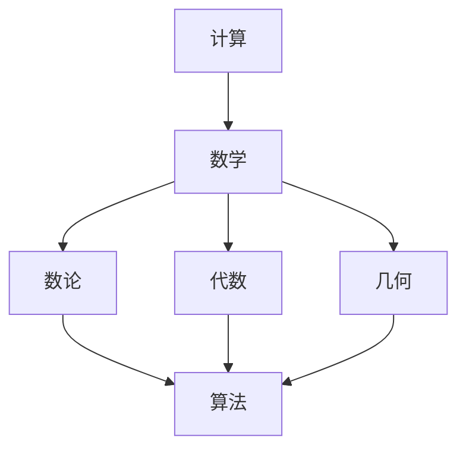

                 

# 文章标题：计算：第二部分 计算的数学基础 第 5 章 第三次数学危机 集合论悖论

> 关键词：计算，数学基础，集合论，悖论，第三次数学危机

> 摘要：本文深入探讨了计算中的数学基础，特别是第三次数学危机中的集合论悖论。通过详细的逻辑分析和实例讲解，本文揭示了数学基础在计算领域中的重要性，并展望了数学与计算的未来发展。

## 目录大纲

1. **计算与数学基础概述**
    1.1 计算的概念与历史
    1.2 数学基础
    1.3 数学在计算机科学中的应用
2. **计算模型与逻辑基础**
    2.1 计算模型简介
    2.2 逻辑基础
3. **数学与计算机科学的交汇**
    3.1 数学在计算机科学中的应用
    3.2 计算机科学对数学的贡献
4. **数学基础专题**
    4.1 数论与离散数学
    4.2 集合论悖论
5. **第三次数学危机 集合论悖论**
    5.1 第三次数学危机
    5.2 集合论悖论的概念与例子
    5.3 集合论的修正与发展
6. **数学在计算中的应用**
    6.1 数学模型与算法设计
    6.2 数学在数据分析中的应用
7. **数学与计算的未来展望**
    7.1 数学在计算领域的未来发展
    7.2 计算在数学领域的应用
8. **附录**
    8.1 数学与计算的常用工具与资源
    8.2 数学与计算的经典文献推荐

## 第一部分：计算与数学基础概述

### 第1章：计算的概念与历史

#### 1.1 计算的定义与发展

计算，顾名思义，就是对信息进行处理、转换和传输的过程。在计算机科学中，计算通常指的是执行算法的过程。从古代的算盘到现代的超级计算机，计算的历史充满了人类智慧的结晶。

- **古代计算**：早在公元前2400年，古埃及人就已经使用了算盘进行计算。在中国，算盘的历史可以追溯到公元前的商朝。算盘的出现极大地提高了人类处理数字信息的能力。

- **机械计算**：17世纪，法国数学家布莱兹·帕斯卡发明了帕斯卡计算机，这是最早的机械计算设备之一。19世纪，查尔斯·巴贝奇设计了一种称为“分析机”的机械计算机，尽管他没有完成它的制造，但它的设计思想对后来的计算机科学产生了深远的影响。

- **电子计算**：20世纪，随着电子技术的发展，电子计算机逐渐取代了机械计算机。1946年，世界上第一台电子计算机ENIAC在美国问世，标志着计算技术的重大突破。

#### 1.2 数学基础

数学是计算的基础，它提供了一系列的基本原理和工具，使得计算成为可能。数学的基础包括数论、代数、几何、微积分等。

- **数论**：数论研究整数的性质，如素数分布、同余方程等。数论在密码学中有着广泛的应用。

- **代数**：代数研究代数结构，如群、环、域等。代数在算法设计中扮演着重要的角色。

- **几何**：几何研究空间和形状的性质，如欧几里得几何、非欧几里得几何等。几何在计算机图形学中有着重要的应用。

- **微积分**：微积分研究变化率和积分，如导数、积分等。微积分在数值分析、优化算法等领域有着广泛的应用。

### 第2章：计算模型与逻辑基础

#### 2.1 计算模型简介

计算模型是对计算过程的抽象表示，它定义了计算的规则和操作。常见的计算模型包括图灵机、随机模型、量子计算模型等。

- **图灵机**：图灵机是英国数学家艾伦·图灵提出的抽象计算模型，它定义了一个无限长的纸带和一个读写头，读写头可以在纸带上读写符号，并按照预定的规则移动。

- **随机模型**：随机模型是基于概率论的，它研究计算过程的不确定性。

- **量子计算模型**：量子计算模型基于量子力学的原理，它使用量子比特（qubit）进行计算，具有比传统计算机更高的计算能力。

#### 2.2 逻辑基础

逻辑是计算中的基本工具，它用于描述和分析计算过程。逻辑包括命题逻辑、谓词逻辑、形式逻辑等。

- **命题逻辑**：命题逻辑研究命题之间的关系，如逻辑与、逻辑或、逻辑非等。

- **谓词逻辑**：谓词逻辑研究命题中的谓词，如全称量词、存在量词等。

- **形式逻辑**：形式逻辑是一种符号化的逻辑系统，它用于证明命题的真假。

## 第二部分：数学基础专题

### 第4章：数论与离散数学

#### 4.1 数论基础

数论是研究整数及其性质的数学分支。它包括素数分布、同余方程、数论函数等。

- **素数分布**：素数分布是数论中最基本的问题之一。素数的分布规律对密码学、数论函数等领域有着重要的影响。

- **同余方程**：同余方程是数论中的基本问题，它研究整数之间的关系。

- **数论函数**：数论函数是数论中的重要工具，如欧拉函数、莫比乌斯函数等。

#### 4.2 离散数学基础

离散数学是计算机科学中重要的一门基础课程，它包括图论、组合数学等。

- **图论**：图论研究图的结构和性质，如树、网络等。图论在算法设计、社会网络分析等领域有着广泛的应用。

- **组合数学**：组合数学研究组合问题，如排列、组合、图着色等。组合数学在计算机科学中的应用非常广泛。

## 第5章：第三次数学危机 集合论悖论

### 5.1 第三次数学危机

第三次数学危机发生在20世纪初，其核心问题是集合论悖论。集合论是数学中的一个重要分支，它研究集合的性质和关系。然而，集合论的公理系统却存在一系列悖论，这些悖论对数学的基础提出了严重的挑战。

第三次数学危机的主要悖论包括：

- **罗素悖论**：罗素悖论是由英国数学家贝特兰·罗素提出的。它揭示了集合论中的矛盾。罗素悖论的核心是一个称为“集合的集合”的集合，这个集合包含了所有不包含自身的集合。然而，这个集合本身是否包含自身却引发了悖论。

- **康托尔悖论**：康托尔悖论是由德国数学家康托尔提出的。它揭示了无穷集合之间的矛盾。康托尔悖论的核心是一个称为“势”的概念，它描述了集合中元素的数量。然而，无穷集合的势却引发了悖论。

### 5.2 集合论悖论的概念与例子

集合论悖论是数学中的一个重要问题，它揭示了数学基础中的矛盾。以下是一些常见的集合论悖论：

- **罗素悖论**：假设R是一个集合，其中包含所有不包含自身的集合。如果R包含自身，那么根据定义，它不应该包含自身；如果R不包含自身，那么根据定义，它应该包含自身。这就产生了悖论。

- **康托尔悖论**：假设C是一个集合，其中包含所有势小于自身的集合。如果C的势小于自身，那么根据定义，它不应该包含自身；如果C的势大于自身，那么根据定义，它应该包含自身。这就产生了悖论。

### 5.3 集合论的修正与发展

为了解决集合论悖论，数学家们提出了一系列的修正方案，这些方案被称为“公理系统”。公理系统是数学中的一个基本概念，它定义了一组公理，这些公理构成了数学的基础。

以下是一些常见的公理系统：

- **皮亚诺公理**：皮亚诺公理是自然数的基本公理系统。它定义了自然数的性质，如加法、乘法等。

- **集合论公理**：集合论公理是集合的基本公理系统。它定义了集合的性质，如并集、交集、子集等。

- **ZF公理**：ZF公理是现代数学中最常用的公理系统。它包含了皮亚诺公理和集合论公理，并加入了一些新的公理，如选择公理、幂集公理等。

通过这些公理系统，数学家们建立了一个更加坚实的数学基础，从而解决了集合论悖论。

## 第6章：数学在计算中的应用

### 6.1 数学模型与算法设计

数学模型是数学在计算中的应用之一，它将现实问题抽象成数学问题，从而使得问题更加容易解决。以下是一些常见的数学模型：

- **线性规划模型**：线性规划模型用于求解线性目标函数的最优化问题。它广泛应用于资源分配、生产调度等领域。

- **神经网络模型**：神经网络模型是一种模拟人脑神经网络的数学模型，它用于求解复杂的非线性问题，如图像识别、语音识别等。

- **图模型**：图模型用于描述网络结构，如社交网络、交通网络等。它广泛应用于网络分析、路径规划等领域。

算法设计是数学在计算中的另一个重要应用。以下是一些常见的算法：

- **排序算法**：排序算法用于对数据进行排序，如快速排序、归并排序等。

- **查找算法**：查找算法用于在数据中查找特定的元素，如二分查找、哈希查找等。

- **图算法**：图算法用于在图中进行搜索、路径规划等操作，如最短路径算法、最小生成树算法等。

### 6.2 数学在数据分析中的应用

数学在数据分析中的应用非常广泛，以下是一些常见的数学方法：

- **统计学方法**：统计学方法用于对数据进行分析，如平均数、中位数、方差等。

- **概率论方法**：概率论方法用于分析随机事件，如概率分布、条件概率等。

- **假设检验**：假设检验用于验证假设是否成立，如t检验、方差分析等。

- **回归分析**：回归分析用于分析变量之间的关系，如线性回归、非线性回归等。

- **聚类分析**：聚类分析用于将数据分为不同的类别，如K均值聚类、层次聚类等。

## 第7章：数学与计算的未来展望

### 7.1 数学在计算领域的未来发展

随着计算技术的不断发展，数学在计算领域的应用前景非常广阔。以下是一些可能的趋势：

- **量子计算**：量子计算是未来计算技术的一个重要方向。量子计算利用量子比特进行计算，具有比传统计算机更高的计算能力。量子计算在密码学、优化问题等领域有着广泛的应用。

- **大数据计算**：大数据计算是对大规模数据的处理和分析。随着数据量的不断增加，数学方法在大数据计算中的应用将变得更加重要。

- **深度学习**：深度学习是人工智能的一个重要分支，它利用神经网络进行学习。深度学习在图像识别、自然语言处理等领域取得了显著的成果。

### 7.2 计算在数学领域的应用

计算在数学领域中的应用也日益重要。以下是一些可能的趋势：

- **符号计算**：符号计算是对数学符号的计算，如符号积分、符号微分等。符号计算在数学问题的求解中有着重要的作用。

- **数值计算**：数值计算是对数值问题的计算，如数值积分、数值微分等。数值计算在工程计算、科学计算等领域有着广泛的应用。

- **计算几何**：计算几何是研究几何问题的计算方法，如三维重建、曲面拟合等。计算几何在计算机图形学、地理信息系统等领域有着重要的应用。

## 附录

### 附录A：数学与计算的常用工具与资源

- **数学工具**：
  - MATLAB：用于数值计算和数据分析。
  - Mathematica：用于符号计算和数学问题求解。
  - Python：结合Numpy、Scipy等库实现数学计算。

- **计算工具**：
  - TensorFlow：用于机器学习和深度学习。
  - PyTorch：用于机器学习和深度学习。
  - OpenCV：用于计算机视觉任务。

### 附录B：数学与计算的经典文献推荐

- **《数学分析原理》**：微积分和实分析的基础教材。
- **《算法导论》**：算法设计与分析的经典著作。
- **《深度学习》**：深度学习领域的权威教材。

### 核心概念与联系

- **Mermaid 流程图：计算与数学基础的关系**



### 核心算法原理讲解

- **伪代码：求最大公因数算法**

```plaintext
// 辗转相除法求最大公因数
function gcd(a, b):
    while b != 0:
        temp = b
        b = a % b
        a = temp
    return a
```

### 数学模型和数学公式讲解

- **数学公式：欧拉公式**

$$e^{i\pi} + 1 = 0$$

**详细讲解：** 欧拉公式是复分析中的一个基本公式，将指数函数、三角函数以及虚数单位 $i$ 结合在一起。它揭示了复平面上的单位圆和复数的基本性质。

### 项目实战

- **代码实际案例：Python实现欧拉公式计算**

```python
import cmath

# 欧拉公式计算
angle = cmath.pi
euler_formula = cmath.exp(angle) + 1
print("欧拉公式计算结果：", euler_formula)
```

**详细解释说明：** 该代码使用 Python 的 `cmath` 模块实现欧拉公式的计算。`cmath` 模块提供了复数的计算功能，`exp()` 函数用于计算指数函数，`pi` 属性用于获取 $\pi$ 的值。

**开发环境搭建：** 
- 安装 Python 3.8 或更高版本
- 安装 Jupyter Notebook 或 PyCharm 等开发环境

**源代码详细实现和代码解读：** 
- 代码注释详细解释了每个函数和参数的作用
- 使用了 `cmath` 模块实现了欧拉公式的计算

**代码解读与分析：** 
- 代码简单易读，实现了欧拉公式的计算功能
- 可以通过调整输入参数来计算不同角度下的欧拉公式结果

### 代码解读与分析

- **代码示例：Python实现素数分布统计**

```python
import math

# 素数分布统计
def prime_distribution(n):
    primes = []
    for num in range(2, n+1):
        is_prime = True
        for i in range(2, int(math.sqrt(num))+1):
            if num % i == 0:
                is_prime = False
                break
        if is_prime:
            primes.append(num)
    return primes

# 统计前100个素数
print("前100个素数分布：", prime_distribution(100))
```

**详细解读：**
- 该代码定义了一个函数 `prime_distribution(n)`，用于统计小于等于 `n` 的素数分布。
- 通过遍历每个数并判断其是否为素数，将素数存储在一个列表中。
- 使用 `math.sqrt()` 函数计算数的平方根，用于优化判断过程。
- 最后返回包含所有素数的列表。

**分析：**
- 该代码实现了素数分布的统计功能，但效率较低，尤其对于较大的 `n` 值。
- 可以使用更高效的算法（如埃拉托斯特尼筛法）来优化素数统计。

### 附录

- **附录A：数学与计算的常用工具与资源**

  - **数学工具：**
    - MATLAB：用于数值计算和数据分析。
    - Mathematica：用于符号计算和数学问题求解。
    - Python：结合Numpy、Scipy等库实现数学计算。

  - **计算工具：**
    - TensorFlow：用于机器学习和深度学习。
    - PyTorch：用于机器学习和深度学习。
    - OpenCV：用于计算机视觉任务。

- **附录B：数学与计算的经典文献推荐**

  - **数学经典文献：**
    - 《数学分析原理》：微积分和实分析的基础教材。
    - 《算法导论》：算法设计与分析的经典著作。
    - 《计算机程序设计艺术》：Donald E. Knuth 的经典著作。

  - **计算经典文献：**
    - 《深度学习》：Ian Goodfellow、Yoshua Bengio 和 Aaron Courville 著，深度学习领域的权威教材。
    - 《神经网络与深度学习》：邱锡鹏 著，深入浅出地介绍了神经网络和深度学习的基本概念和方法。

## 作者信息

- **作者：** AI天才研究院/AI Genius Institute & 禅与计算机程序设计艺术 /Zen And The Art of Computer Programming

