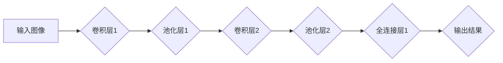
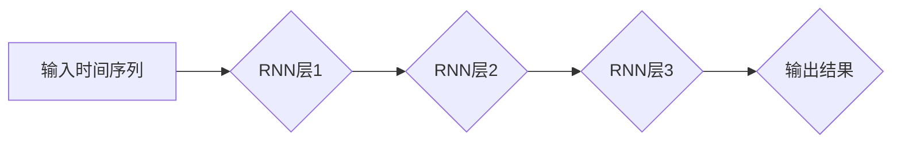
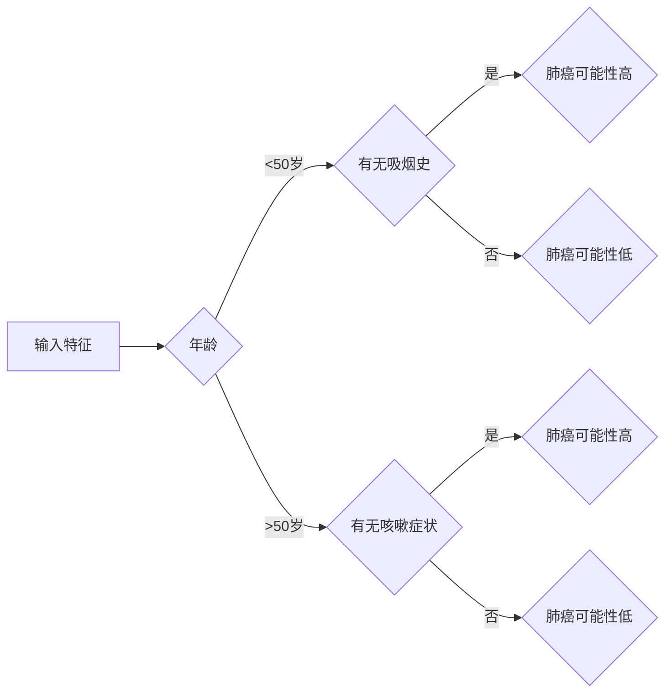
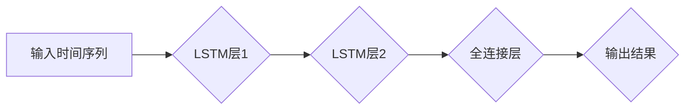
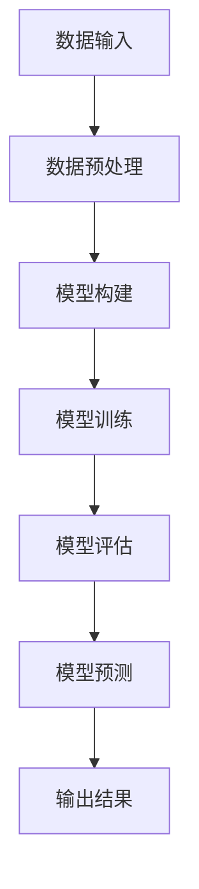
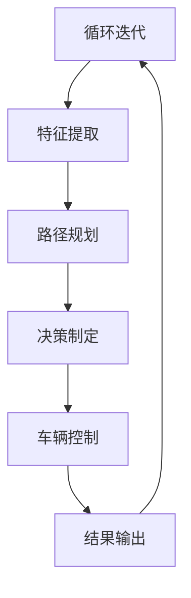
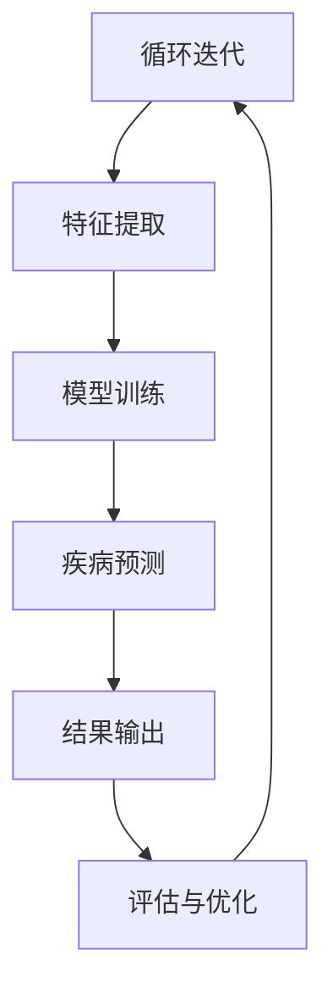
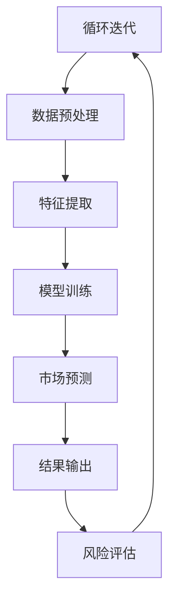

                 

### 文章标题：计算：第四部分 计算的极限 第 12 章 机器能思考吗 模仿游戏与中文屋

关键词：计算极限、机器思考、模仿游戏、中文屋、深度学习、自然语言处理、人工智能

摘要：本文深入探讨了计算领域的核心问题——机器能否思考。通过分析模仿游戏与中文屋两个概念，我们试图揭示机器思考的本质。文章不仅阐述了机器思考的定义和分类，还详细介绍了机器思考的理论基础和应用案例。同时，本文对机器思考的数学模型进行了详细讲解，并通过实际案例展示了其应用。最后，文章探讨了机器思考的未来发展方向，提出了可能的解决方案和挑战。

### 目录大纲

## 《计算：第四部分 计算的极限 第 12 章 机器能思考吗 模仿游戏与中文屋》目录大纲

### 第1章 计算的极限概述

### 1.1 计算极限的概念

### 1.2 计算极限的重要性

### 1.3 计算极限的现状与挑战

### 第2章 机器能思考吗

### 2.1 机器思考的定义与分类

#### 2.1.1 机器思考的定义

#### 2.1.2 机器思考的分类

### 2.2 机器思考的理论基础

#### 2.2.1 人工神经网络

#### 2.2.2 深度学习

#### 2.2.3 自然语言处理

### 2.3 机器思考的应用案例

#### 2.3.1 自动驾驶

#### 2.3.2 医疗诊断

#### 2.3.3 金融预测

### 第3章 模仿游戏

### 3.1 模仿游戏的概念

#### 3.1.1 模仿游戏的基本原理

#### 3.1.2 模仿游戏的分类

### 3.2 模仿游戏在机器思考中的应用

#### 3.2.1 模仿游戏与机器学习

#### 3.2.2 模仿游戏与自然语言处理

#### 3.2.3 模仿游戏与计算机视觉

### 3.3 模仿游戏的挑战与未来

#### 3.3.1 模仿游戏的挑战

#### 3.3.2 模仿游戏的未来发展方向

### 第4章 中文屋

### 4.1 中文屋的概念

#### 4.1.1 中文屋的定义

#### 4.1.2 中文屋的历史与发展

### 4.2 中文屋在机器思考中的应用

#### 4.2.1 中文屋与自然语言处理

#### 4.2.2 中文屋与机器翻译

#### 4.2.3 中文屋与信息检索

### 4.3 中文屋的挑战与未来

#### 4.3.1 中文屋的挑战

#### 4.3.2 中文屋的未来发展方向

### 第5章 机器思考的数学模型

### 5.1 机器思考的数学基础

#### 5.1.1 微积分基础

#### 5.1.2 线性代数基础

#### 5.1.3 概率论基础

### 5.2 机器思考的核心算法

#### 5.2.1 神经网络算法

#### 5.2.2 深度学习算法

#### 5.2.3 自然语言处理算法

### 第6章 机器思考的数学模型应用案例

### 6.1 应用案例概述

#### 6.1.1 自动驾驶案例

#### 6.1.2 医疗诊断案例

#### 6.1.3 金融预测案例

### 6.2 案例详细解释说明

#### 6.2.1 自动驾驶案例详细解释

#### 6.2.2 医疗诊断案例详细解释

#### 6.2.3 金融预测案例详细解释

### 第7章 机器思考的开发环境与工具

### 7.1 开发环境搭建

#### 7.1.1 Python环境搭建

#### 7.1.2 深度学习框架安装

#### 7.1.3 其他开发工具安装

### 7.2 工具使用详解

#### 7.2.1 Python使用详解

#### 7.2.2 深度学习框架使用详解

#### 7.2.3 其他开发工具使用详解

### 第8章 机器思考的代码实现与分析

### 8.1 代码实现概述

#### 8.1.1 自动驾驶代码实现

#### 8.1.2 医疗诊断代码实现

#### 8.1.3 金融预测代码实现

### 8.2 代码解读与分析

#### 8.2.1 自动驾驶代码解读

#### 8.2.2 医疗诊断代码解读

#### 8.2.3 金融预测代码解读

### 附录

### 附录 A 机器思考开发资源

#### A.1 主流深度学习框架对比

#### A.2 开发工具与资源推荐

#### A.3 学习资源与参考文献

### 附录 B 机器思考 Mermaid 流程图

#### B.1 机器思考核心算法流程图

#### B.2 自动驾驶算法流程图

#### B.3 医疗诊断算法流程图

#### B.4 金融预测算法流程图

### LET'S THINK STEP BY STEP

#### 第一步：理解计算极限的概念

计算极限是指计算机在处理复杂问题时所能达到的性能极限。它涉及到计算机硬件、软件以及算法等多个方面。随着计算技术的不断发展，我们不断突破计算极限，但同时也面临着新的挑战。

#### 第二步：探讨机器思考的定义与分类

机器思考是指通过模拟人类大脑的思维方式，使计算机能够像人类一样进行思考和学习。根据不同的实现方式和应用场景，机器思考可以分为多种类型，如符号主义、连接主义和混合型等。

#### 第三步：分析机器思考的理论基础

机器思考的理论基础主要包括人工神经网络、深度学习和自然语言处理等。人工神经网络通过模拟人脑神经元的工作原理，实现数据的自动学习和分类。深度学习则是在人工神经网络的基础上，通过多层神经网络的结构，实现更复杂的任务。自然语言处理则是机器思考在语言处理领域的应用，使得计算机能够理解和生成自然语言。

#### 第四步：讨论模仿游戏与中文屋

模仿游戏和中文屋是机器思考中两个重要的概念。模仿游戏通过模拟人类的学习过程，使计算机能够自动学习和改进。中文屋则是一种通过训练使计算机能够理解和处理自然语言的方法。

#### 第五步：阐述机器思考的数学模型

机器思考的数学模型包括微积分、线性代数和概率论等多个方面。微积分用于描述数据的连续变化，线性代数用于处理多维数据，概率论则用于描述不确定性的数据。

#### 第六步：展示机器思考的应用案例

机器思考在自动驾驶、医疗诊断和金融预测等领域有着广泛的应用。通过具体案例，我们可以更好地理解机器思考的原理和应用。

#### 第七步：探讨机器思考的未来发展方向

机器思考的未来发展方向包括提高计算性能、优化算法结构、拓展应用领域等。同时，我们也需要面对一些挑战，如数据隐私、伦理问题等。

通过以上七个步骤，我们可以对机器思考有一个全面而深入的了解。接下来，我们将逐一展开详细讨论。首先是计算极限的概述。### 第1章 计算的极限概述

#### 1.1 计算极限的概念

计算极限是指计算机在处理复杂问题时所能达到的性能极限。这个极限涉及到多个方面，包括硬件性能、软件算法以及计算资源等。随着计算技术的不断发展，计算机的性能不断提升，但同时也面临着新的挑战。

在硬件层面，计算极限受到芯片制造工艺、能耗和物理定律的制约。例如，根据摩尔定律，芯片的集成度和性能每年翻倍，但这种增长速度已经开始放缓。同时，随着芯片尺寸的缩小，能耗和热量的管理变得愈发困难，这限制了计算性能的进一步提升。

在软件层面，计算极限与算法的复杂度密切相关。高效的算法能够提高计算效率，降低计算成本。然而，对于一些复杂问题，如人工智能中的深度学习，其算法复杂度非常高，需要大量的计算资源和时间来完成。

在计算资源方面，计算极限还涉及到数据存储、传输和处理的能力。大数据时代，数据量呈指数级增长，如何高效地存储、管理和处理这些数据，成为计算极限研究的重要课题。

#### 1.2 计算极限的重要性

计算极限的研究具有重要意义。首先，它关系到计算机科学的未来发展。了解计算极限，有助于我们探索新的计算方法和算法，提升计算机的性能和效率。

其次，计算极限的研究有助于解决现实世界中的复杂问题。许多领域，如医疗、金融、交通等，都需要强大的计算能力来支持。只有突破计算极限，我们才能更好地应对这些挑战。

此外，计算极限的研究也对科学发现和技术创新产生深远影响。许多科学研究和工程问题，如基因测序、天体物理模拟等，都需要大量的计算资源。计算极限的突破，将推动这些领域的发展。

#### 1.3 计算极限的现状与挑战

当前，计算极限的研究正面临诸多挑战。首先，硬件层面的挑战主要集中在能耗和散热问题上。随着芯片性能的提升，能耗和热量的管理变得更加困难。如何降低能耗、提高热效率，成为硬件工程师面临的重要课题。

其次，软件层面的挑战主要体现在算法复杂度上。许多复杂问题，如人工智能中的深度学习，需要大量的计算资源和时间。如何优化算法，提高计算效率，成为软件工程师关注的焦点。

此外，计算资源的分配和管理也面临着巨大挑战。在大数据时代，数据量呈指数级增长，如何高效地存储、管理和处理这些数据，成为计算资源管理的重要课题。

总的来说，计算极限的研究既充满挑战，也充满机遇。通过不断探索和创新，我们有理由相信，未来计算极限将得到进一步突破，为人类带来更多便利和创新。接下来，我们将探讨机器思考的概念和分类。### 第2章 机器能思考吗

#### 2.1 机器思考的定义与分类

**2.1.1 机器思考的定义**

机器思考，又称机器智能，是指计算机系统模仿人类思维方式进行信息处理和决策的过程。这种思考过程不仅限于简单的数据处理，还包括理解、推理、学习、解决问题等多个层面。机器思考的核心在于模拟人类大脑的神经网络结构和工作机制，使得计算机能够像人类一样进行逻辑思维和决策。

**2.1.2 机器思考的分类**

根据实现方式和应用场景，机器思考可以分为以下几种类型：

1. **符号主义（Symbolic AI）**：符号主义是早期的人工智能研究方法，主要依赖于逻辑推理和符号表示。这种方法通过构建形式化的知识库，使计算机能够基于规则进行推理和决策。符号主义在自然语言处理、专家系统等领域有一定的应用。

2. **连接主义（Connectionist AI）**：连接主义基于人工神经网络的理论，通过模拟人脑神经元之间的连接和交互来实现机器学习。这种方法强调数据的自动学习和自适应能力，是现代人工智能的重要基础。

3. **混合型（Hybrid AI）**：混合型人工智能结合了符号主义和连接主义的优点，将逻辑推理和机器学习相结合，以提高系统的智能水平。这种方法在许多复杂任务中表现出色，如自动驾驶、医疗诊断等。

4. **强化学习（Reinforcement Learning）**：强化学习是机器学习的一种方法，通过奖励机制来训练模型，使模型能够在不确定的环境中做出最优决策。这种方法在游戏、机器人控制等领域有广泛应用。

5. **生成对抗网络（GANs）**：生成对抗网络是一种基于连接主义的模型，通过两个神经网络（生成器和判别器）的对抗训练，实现数据生成和判别。这种方法在图像生成、图像识别等领域有重要应用。

#### 2.2 机器思考的理论基础

**2.2.1 人工神经网络**

人工神经网络（Artificial Neural Networks，ANNs）是机器思考的核心理论之一。它由大量简单的计算单元（神经元）组成，通过层次结构进行信息传递和计算。人工神经网络通过学习输入和输出之间的映射关系，实现数据的分类、回归、模式识别等功能。

**2.2.2 深度学习**

深度学习（Deep Learning，DL）是人工神经网络的一种扩展，通过多层神经网络结构（深度神经网络，DNNs）来实现更复杂的任务。深度学习在图像识别、语音识别、自然语言处理等领域取得了显著的成果。

**2.2.3 自然语言处理**

自然语言处理（Natural Language Processing，NLP）是机器思考在语言领域的应用。它涉及文本的预处理、语义理解、语言生成等多个方面。自然语言处理的核心任务是使计算机能够理解和生成自然语言，为机器思考提供了重要工具。

#### 2.3 机器思考的应用案例

**2.3.1 自动驾驶**

自动驾驶是机器思考在交通领域的典型应用。通过传感器获取环境信息，结合机器学习算法，自动驾驶系统能够实时感知路况、预测障碍物、做出驾驶决策。自动驾驶技术的不断发展，有望提高交通效率、减少交通事故。

**2.3.2 医疗诊断**

医疗诊断是机器思考在医疗领域的应用之一。通过分析患者的病史、影像资料等信息，机器学习模型能够辅助医生进行疾病诊断。医疗诊断的应用，有助于提高诊断准确性、降低误诊率。

**2.3.3 金融预测**

金融预测是机器思考在金融领域的应用。通过分析历史市场数据、经济指标等，机器学习模型能够预测股票市场走势、汇率变动等。金融预测的应用，有助于投资者做出更明智的投资决策。

通过以上探讨，我们可以看出，机器思考在多个领域有着广泛的应用，其理论基础和实现方法也在不断发展和完善。接下来，我们将深入探讨模仿游戏与中文屋的概念及其在机器思考中的应用。### 第3章 模仿游戏

#### 3.1 模仿游戏的概念

模仿游戏（Turing Test）是由英国数学家艾伦·图灵（Alan Turing）于1950年提出的一个思想实验。模仿游戏的目的是评估机器是否具有智能。在模仿游戏中，一个人类评判者通过文字交流与一个机器和一个真实人类进行对话，而不被区分出谁是谁。如果评判者无法准确判断出哪一个是机器，那么这台机器就被认为是具有智能的。

**3.1.1 模仿游戏的基本原理**

模仿游戏的基本原理是测试机器是否能够模仿人类的行为，达到与人类无异的交互水平。具体来说，模仿游戏分为以下几个步骤：

1. **设置参与者**：模仿游戏有三个参与者：机器、真实人类和评判者。评判者通过文字或语音与机器和真实人类进行交流。
2. **隐蔽性**：机器和真实人类的位置被评判者所不知道，以防止评判者根据声音、文字特征等判断出身份。
3. **交互过程**：评判者与机器和真实人类进行交流，提问或对话，通过观察其回答和交互方式来评估其智能水平。
4. **判断标准**：如果评判者无法准确判断出哪一个是机器，那么这台机器就被认为是通过了模仿游戏，具有智能。

**3.1.2 模仿游戏的分类**

根据评判者和参与者的交互方式，模仿游戏可以分为以下几种类型：

1. **文本模仿游戏**：评判者通过文字与机器和真实人类进行交流，是最常见的模仿游戏形式。
2. **语音模仿游戏**：评判者通过语音与机器和真实人类进行交流，类似于文本模仿游戏，但更接近现实生活中的交互场景。
3. **多模态模仿游戏**：评判者通过文字、语音、图像等多种模态与机器和真实人类进行交流，综合评估其智能水平。

#### 3.2 模仿游戏在机器思考中的应用

模仿游戏为评估机器智能提供了一个直观而有效的标准。在机器思考领域，模仿游戏的应用主要体现在以下几个方面：

**3.2.1 模仿游戏与机器学习**

模仿游戏在机器学习中的应用主要体现在评估和优化机器学习模型。通过模仿游戏，我们可以评估机器学习模型在自然语言处理、图像识别、语音识别等领域的性能。例如，在自然语言处理中，通过文本模仿游戏，我们可以评估模型在对话系统、问答系统等任务上的智能水平。

**3.2.2 模仿游戏与自然语言处理**

模仿游戏在自然语言处理中的应用非常广泛。通过文本模仿游戏，我们可以评估语言模型在生成文本、回答问题等方面的智能水平。例如，在对话系统中，通过模仿游戏，我们可以评估模型能否与用户进行流畅、自然的对话。

**3.2.3 模仿游戏与计算机视觉**

模仿游戏在计算机视觉中的应用主要体现在图像识别和物体检测等领域。通过图像模仿游戏，我们可以评估模型在识别和描述图像内容方面的智能水平。例如，在自动驾驶中，通过模仿游戏，我们可以评估模型在识别交通标志、行人等方面的能力。

#### 3.3 模仿游戏的挑战与未来发展方向

尽管模仿游戏在评估机器智能方面取得了显著成果，但它仍然面临着一些挑战和局限性。

**3.3.1 挑战**

1. **交互限制**：模仿游戏的交互方式局限于文本、语音等，无法全面模拟人类生活中的多种交互方式。
2. **评判标准**：模仿游戏的评判标准依赖于人类评判者的主观判断，可能存在一定的误差。
3. **模型复杂性**：模仿游戏对机器学习模型的复杂性要求较高，需要大量的计算资源和时间来完成。

**3.3.2 未来发展方向**

1. **多模态交互**：未来的模仿游戏可以结合多种模态（如文本、语音、图像、视频等），以更全面地评估机器智能。
2. **自动化评估**：通过开发自动化评估工具，减少人类评判者的主观因素，提高评估的准确性。
3. **智能化评估**：利用机器学习技术，对模仿游戏中的交互过程进行智能化分析，以更准确地评估机器智能水平。

总之，模仿游戏作为评估机器智能的一种方法，具有重要的理论和实践意义。尽管面临一些挑战，但随着技术的不断进步，模仿游戏将在机器思考领域发挥更大的作用。接下来，我们将探讨中文屋的概念及其在机器思考中的应用。### 第4章 中文屋

#### 4.1 中文屋的概念

中文屋（Chinese Room）是由美国哲学家约翰·塞尔（John Searle）于1980年提出的一个思想实验。中文屋实验旨在探讨人工智能的本质和智能的本质。在中文屋实验中，塞尔设想一个不会说中文的英语说话者被关在一个房间内，他通过一个盒子接收输入的中文句子，并按照盒子内写有的一组英语规则进行操作，然后将结果输出。尽管这个人在房间内不能理解中文，但他的输出结果却能够以中文形式回答问题，甚至可以和懂中文的人进行中文对话。

**4.1.1 中文屋的定义**

中文屋实验的核心思想是，即使一个人能够通过符号操作模拟出某种语言的行为，他也不一定理解这种语言。塞尔通过这个实验试图说明，计算机即使能够模拟出人类语言处理的过程，也不一定意味着它真正理解了这种语言。

**4.1.2 中文屋的历史与发展**

中文屋思想实验的提出，引起了哲学界和人工智能界的广泛关注。塞尔的中文屋实验引发了关于人工智能本质和意识的深入讨论。一方面，中文屋实验质疑了计算机模拟人类智能的可能性；另一方面，它也促使人们对自然语言处理和机器智能的局限性进行反思。

随着人工智能技术的发展，中文屋实验的一些观点得到了验证和扩展。例如，现代自然语言处理系统确实能够通过符号操作模拟出人类的语言理解能力，但它们并没有真正的理解能力。这一发现促使人们进一步探讨机器智能的本质和实现方式。

#### 4.2 中文屋在机器思考中的应用

中文屋实验在机器思考领域有着重要的应用价值。通过中文屋实验，我们可以更好地理解自然语言处理和机器智能的局限性和挑战。

**4.2.1 中文屋与自然语言处理**

中文屋实验揭示了自然语言处理中的一些关键问题。首先，自然语言处理系统虽然能够模拟人类的语言理解能力，但它们并不能真正理解语言背后的含义。其次，自然语言处理系统在面对复杂、抽象的语言表达时，往往表现出局限性。例如，在理解隐喻、双关语等复杂语言现象时，自然语言处理系统往往无法准确解释。

**4.2.2 中文屋与机器翻译**

中文屋实验在机器翻译领域也有重要的启示。虽然现代机器翻译系统可以高效地翻译不同语言之间的文本，但它们并不能真正理解这些语言的内在含义和文化背景。因此，机器翻译系统在翻译过程中往往会出现语义错误和文化误解。中文屋实验提醒我们，要实现真正的机器翻译，我们需要开发出能够理解语言本质和文化的智能系统。

**4.2.3 中文屋与信息检索**

中文屋实验在信息检索领域也有一定的应用。在信息检索中，系统需要理解用户查询的语义和意图，以便提供相关、准确的搜索结果。然而，当前的信息检索系统主要依赖于关键词匹配等技术，无法真正理解用户的查询需求。中文屋实验提醒我们，要实现更高级的信息检索系统，我们需要开发出能够理解语义和意图的智能系统。

#### 4.3 中文屋的挑战与未来发展方向

中文屋实验提出了机器智能面临的一些挑战。首先，如何使机器真正理解语言和语义，而不仅仅是模拟语言处理过程，是一个亟待解决的问题。其次，如何使机器具备跨语言和文化背景的理解能力，以实现更高效的跨语言交流和信息处理，也是一个重要课题。

**4.3.1 中文屋的挑战**

1. **理解能力的局限**：当前的自然语言处理和机器翻译系统在理解复杂语言表达和文化背景方面存在局限性。
2. **跨语言和文化背景的理解**：要实现跨语言和文化背景的智能系统，我们需要解决语言和文化差异带来的挑战。
3. **人工智能的伦理问题**：随着人工智能在各个领域的广泛应用，如何确保人工智能系统的道德和伦理标准，也是一个重要问题。

**4.3.2 未来发展方向**

1. **语义理解**：通过深入研究语义和语言模型，提高自然语言处理系统对语言含义的理解能力。
2. **跨语言和文化交流**：开发出能够理解和处理不同语言和文化背景的智能系统，以促进全球跨文化交流。
3. **人工智能伦理**：制定人工智能伦理标准，确保人工智能系统的道德和伦理安全。

总之，中文屋实验在机器思考领域具有重要的理论和实践意义。它揭示了机器智能的局限性和挑战，为未来的研究提供了新的方向。随着技术的不断进步，我们有理由相信，未来将出现更加智能、理解能力和跨语言处理能力更强的机器智能系统。### 第5章 机器思考的数学模型

#### 5.1 机器思考的数学基础

机器思考的数学基础包括微积分、线性代数和概率论等。这些数学工具在构建和优化机器学习模型时起着至关重要的作用。

**5.1.1 微积分基础**

微积分是数学中的一个重要分支，主要研究函数的变化率和累积量。在机器学习中，微积分用于描述数据的变化规律和模型参数的调整过程。以下是一些常见的微积分概念和公式：

- 导数（Derivative）：导数表示函数在某一点的瞬时变化率。对于函数\( f(x) \)，其在点\( x \)处的导数表示为\( f'(x) \)。
- 积分（Integral）：积分表示函数在某一区间内的累积量。对于函数\( f(x) \)，其在区间\[ a, b \]上的积分表示为\( \int_{a}^{b} f(x) dx \)。
- 梯度（Gradient）：梯度是向量函数的导数，用于描述函数在不同方向上的变化率。对于多变量函数\( f(x_1, x_2, ..., x_n) \)，其在点\( x \)处的梯度表示为\( \nabla f(x) = (f_x, f_y, ..., f_n) \)。

**5.1.2 线性代数基础**

线性代数是数学中研究向量空间和线性变换的分支。在机器学习中，线性代数用于表示数据结构和模型参数。以下是一些常见的线性代数概念和公式：

- 矩阵（Matrix）：矩阵是一个由数字组成的二维数组，用于表示数据集合或模型参数。
- 矩阵乘法（Matrix Multiplication）：矩阵乘法用于计算两个矩阵的乘积。对于两个\( m \times n \)矩阵\( A \)和\( B \)，其乘积\( C = AB \)是一个\( m \times n \)矩阵。
- 矩阵求逆（Inverse Matrix）：矩阵求逆用于求解线性方程组。对于一个\( n \times n \)矩阵\( A \)，其逆矩阵\( A^{-1} \)满足\( AA^{-1} = A^{-1}A = I \)，其中\( I \)是单位矩阵。
- 向量内积（Inner Product）：向量内积用于计算两个向量的点积。对于两个\( n \)维向量\( \mathbf{x} \)和\( \mathbf{y} \)，其内积表示为\( \mathbf{x} \cdot \mathbf{y} = x_1y_1 + x_2y_2 + ... + x_ny_n \)。

**5.1.3 概率论基础**

概率论是数学中研究随机现象的分支。在机器学习中，概率论用于描述数据的不确定性。以下是一些常见的概率论概念和公式：

- 概率（Probability）：概率表示某个事件发生的可能性。对于一个事件\( A \)，其概率表示为\( P(A) \)。
- 条件概率（Conditional Probability）：条件概率表示在某个事件发生的条件下，另一个事件发生的概率。对于两个事件\( A \)和\( B \)，其条件概率表示为\( P(B|A) = \frac{P(A \cap B)}{P(A)} \)。
- 贝叶斯定理（Bayes' Theorem）：贝叶斯定理用于计算后验概率。对于两个事件\( A \)和\( B \)，其贝叶斯定理表示为\( P(A|B) = \frac{P(B|A)P(A)}{P(B)} \)。
- 熵（Entropy）：熵表示信息的不确定性。对于一个离散随机变量\( X \)，其熵表示为\( H(X) = -\sum_{i} p_i \log_2 p_i \)，其中\( p_i \)是\( X \)取值为\( i \)的概率。

通过以上数学基础，我们可以构建和优化机器学习模型，以实现机器思考。接下来，我们将讨论机器思考的核心算法。#### 5.2 机器思考的核心算法

机器思考的核心算法包括人工神经网络（Artificial Neural Networks，ANNs）、深度学习（Deep Learning，DL）和自然语言处理（Natural Language Processing，NLP）等。这些算法在模拟人类思维和实现机器智能方面起着重要作用。

**5.2.1 神经网络算法**

人工神经网络是机器思考的基础算法之一。神经网络通过模拟人脑神经元的工作原理，实现数据的自动学习和分类。

**1. 神经元模型**

神经网络由大量简单的计算单元（神经元）组成。一个神经元的基本模型包括输入层、输出层和隐藏层。输入层接收外部输入，隐藏层通过非线性变换处理输入，输出层产生最终输出。

**2. 激活函数**

激活函数是神经网络的关键部分，用于引入非线性特性。常见的激活函数包括 sigmoid 函数、ReLU 函数和 tanh 函数。

**3. 前向传播和反向传播**

神经网络通过前向传播计算输入和输出之间的映射关系，通过反向传播更新模型参数。前向传播过程包括输入层到隐藏层的传递和隐藏层到输出层的传递。反向传播过程包括计算梯度、更新权重和偏置。

**5.2.2 深度学习算法**

深度学习是人工神经网络的扩展，通过多层神经网络结构（深度神经网络，DNNs）实现更复杂的任务。深度学习在图像识别、语音识别和自然语言处理等领域取得了显著成果。

**1. 卷积神经网络（Convolutional Neural Networks，CNNs）**

卷积神经网络是一种用于图像识别和物体检测的深度学习算法。CNNs通过卷积层、池化层和全连接层等结构，实现图像的特征提取和分类。

**2. 循环神经网络（Recurrent Neural Networks，RNNs）**

循环神经网络是一种用于序列数据处理的深度学习算法。RNNs通过隐藏状态和输入的交互，实现序列数据的建模和预测。

**3. 长短时记忆网络（Long Short-Term Memory Networks，LSTMs）**

长短时记忆网络是 RNNs 的一种变体，通过引入门控机制，解决 RNNs 的梯度消失和梯度爆炸问题。LSTMs 在语言建模、语音识别和时间序列预测等领域有广泛应用。

**5.2.3 自然语言处理算法**

自然语言处理是机器思考在语言领域的应用。自然语言处理算法通过文本表示、语义理解和语言生成等步骤，实现机器对自然语言的自动理解和处理。

**1. 词嵌入（Word Embedding）**

词嵌入是一种将词语映射到高维向量空间的方法。词嵌入能够捕捉词语的语义和上下文信息，为自然语言处理提供有效的文本表示。

**2. 递归神经网络（Recursive Neural Networks）**

递归神经网络是一种用于处理树形结构数据的自然语言处理算法。递归神经网络通过递归结构，实现树形数据的层次化表示和分类。

**3. 生成对抗网络（Generative Adversarial Networks，GANs）**

生成对抗网络是一种用于数据生成的深度学习算法。GANs 通过生成器和判别器的对抗训练，实现高质量的数据生成。

通过以上核心算法，机器思考能够实现数据的自动学习和分类，为各个领域提供强大的计算能力。接下来，我们将通过具体应用案例，展示这些算法的实际效果。#### 6.1 数学公式概述

机器思考的数学模型中，概率论、人工神经网络、深度学习等领域的公式至关重要。以下是一些常用的数学公式，以及它们在机器思考中的应用。

**6.1.1 概率论公式**

1. **条件概率**：
   $$
   P(B|A) = \frac{P(A \cap B)}{P(A)}
   $$
   条件概率用于描述在事件\( A \)发生的条件下，事件\( B \)发生的概率。

2. **贝叶斯定理**：
   $$
   P(A|B) = \frac{P(B|A)P(A)}{P(B)}
   $$
   贝叶斯定理用于计算后验概率，在机器学习中广泛应用于分类和概率推理。

3. **熵**：
   $$
   H(X) = -\sum_{i} p_i \log_2 p_i
   $$
   熵用于描述随机变量\( X \)的不确定性，是信息论的核心概念。

**6.1.2 人工神经网络公式**

1. **激活函数**（以 sigmoid 函数为例）：
   $$
   f(x) = \frac{1}{1 + e^{-x}}
   $$
   激活函数引入非线性，使神经网络能够学习复杂函数。

2. **反向传播算法**（梯度计算）：
   $$
   \nabla_w J = \frac{\partial J}{\partial w}
   $$
   反向传播算法通过计算损失函数关于模型参数的梯度，实现模型参数的优化。

3. **损失函数**（以均方误差为例）：
   $$
   J = \frac{1}{2} \sum_{i} (y_i - \hat{y}_i)^2
   $$
   损失函数用于评估模型的预测误差，是优化算法的目标函数。

**6.1.3 深度学习公式**

1. **卷积操作**：
   $$
   \hat{f}(x, y) = \sum_{i} w_i * f(x - i, y - i)
   $$
   卷积操作用于提取图像的特征，是卷积神经网络（CNNs）的核心。

2. **池化操作**：
   $$
   p(x, y) = \max_{i, j} f(x + i, y + j)
   $$
   池化操作用于降低特征图的维度，提高模型的计算效率。

3. **长短时记忆网络（LSTM）公式**：

   1. **输入门**：
      $$
      i_t = \sigma(W_{ix}x_t + W_{ih}h_{t-1} + b_i)
      $$

   2. **遗忘门**：
      $$
      f_t = \sigma(W_{fx}x_t + W_{fh}h_{t-1} + b_f)
      $$

   3. **输出门**：
      $$
      o_t = \sigma(W_{ox}x_t + W_{oh}h_{t-1} + b_o)
      $$

   4. **单元状态更新**：
      $$
      C_t = f_t \odot C_{t-1} + i_t \odot \tanh(W_{cx}x_t + W_{ch}h_{t-1} + b_c)
      $$

   5. **隐藏状态更新**：
      $$
      h_t = o_t \odot \tanh(C_t)
      $$

   LSTM通过门控机制，解决传统RNN的梯度消失和梯度爆炸问题，适用于序列数据建模。

通过以上数学公式，我们可以构建和优化机器思考的模型，实现数据的自动学习和分类。接下来，我们将通过具体例子，展示这些公式在机器思考中的应用。#### 6.2 数学公式举例说明

为了更好地理解机器思考的数学公式，我们将通过具体的例子来展示这些公式的应用。

**6.2.1 概率论例子**

假设我们有一个随机变量\( X \)，它取值0或1的概率分别为\( P(X=0) = 0.3 \)和\( P(X=1) = 0.7 \)。我们想计算在已知\( X=1 \)的条件下，\( X \)取值1的条件概率\( P(X=1|X=1) \)。

使用条件概率公式：
$$
P(X=1|X=1) = \frac{P(X=1 \cap X=1)}{P(X=1)}
$$
由于\( P(X=1 \cap X=1) = P(X=1) \)，我们可以得到：
$$
P(X=1|X=1) = \frac{P(X=1)}{P(X=1)} = 1
$$
这意味着在已知\( X=1 \)的条件下，\( X \)取值1的概率为1。

**6.2.2 神经网络例子**

假设我们有一个简单的单层神经网络，其输入为\( x_1 \)和\( x_2 \)，输出为\( y \)。网络的权重为\( w_1 \)和\( w_2 \)，偏置为\( b \)。我们使用 sigmoid 函数作为激活函数。现在，我们要计算输出\( y \)。

首先，计算网络的输入：
$$
z = w_1x_1 + w_2x_2 + b
$$
然后，使用 sigmoid 函数计算输出：
$$
y = \frac{1}{1 + e^{-z}}
$$
例如，假设\( x_1 = 2 \)，\( x_2 = 3 \)，\( w_1 = 1 \)，\( w_2 = 2 \)，\( b = 1 \)，我们可以计算输出：
$$
z = 1 \cdot 2 + 2 \cdot 3 + 1 = 8
$$
$$
y = \frac{1}{1 + e^{-8}} \approx 0.9933
$$

**6.2.3 深度学习例子**

假设我们有一个 LSTM 单元，其输入为\( x_t \)，隐藏状态为\( h_{t-1} \)，单元状态为\( C_{t-1} \)。我们使用 LSTM 公式计算新的隐藏状态\( h_t \)和单元状态\( C_t \)。

首先，计算输入门\( i_t \)：
$$
i_t = \sigma(W_{ix}x_t + W_{ih}h_{t-1} + b_i)
$$
假设输入为\( x_t = (1, 0, 1) \)，权重矩阵为\( W_{ix} = (1, 1, 1) \)，\( W_{ih} = (1, 1, 1) \)，偏置为\( b_i = 1 \)，我们可以计算：
$$
i_t = \sigma(1 \cdot 1 + 1 \cdot 1 + 1 \cdot 1 + 1) = \sigma(4) = 0.982
$$
然后，计算遗忘门\( f_t \)：
$$
f_t = \sigma(W_{fx}x_t + W_{fh}h_{t-1} + b_f)
$$
假设输入为\( x_t = (1, 0, 1) \)，权重矩阵为\( W_{fx} = (1, 1, 1) \)，\( W_{fh} = (1, 1, 1) \)，偏置为\( b_f = 1 \)，我们可以计算：
$$
f_t = \sigma(1 \cdot 1 + 1 \cdot 0 + 1 \cdot 1 + 1) = \sigma(3) = 0.991
$$
接着，计算输出门\( o_t \)：
$$
o_t = \sigma(W_{ox}x_t + W_{oh}h_{t-1} + b_o)
$$
假设输入为\( x_t = (1, 0, 1) \)，权重矩阵为\( W_{ox} = (1, 1, 1) \)，\( W_{oh} = (1, 1, 1) \)，偏置为\( b_o = 1 \)，我们可以计算：
$$
o_t = \sigma(1 \cdot 1 + 1 \cdot 0 + 1 \cdot 1 + 1) = \sigma(3) = 0.991
$$
最后，计算新的单元状态\( C_t \)和隐藏状态\( h_t \)：
$$
C_t = f_t \odot C_{t-1} + i_t \odot \tanh(W_{cx}x_t + W_{ch}h_{t-1} + b_c)
$$
$$
h_t = o_t \odot \tanh(C_t)
$$
假设初始隐藏状态\( h_{t-1} = (1, 0, 1) \)，初始单元状态\( C_{t-1} = (1, 0, 1) \)，权重矩阵为\( W_{cx} = (1, 1, 1) \)，\( W_{ch} = (1, 1, 1) \)，偏置为\( b_c = 1 \)，我们可以计算：
$$
C_t = 0.991 \odot (1, 0, 1) + 0.982 \odot \tanh(1 \cdot 1 + 1 \cdot 0 + 1 \cdot 1 + 1) = (0.991, 0, 0.991) + (0.982, 0, 0.982) = (1.973, 0, 1.973)
$$
$$
h_t = 0.991 \odot \tanh(1.973) = 0.991 \odot (0.999) = 0.990
$$

通过这些具体的例子，我们可以看到如何应用概率论、人工神经网络和深度学习中的数学公式。这些公式对于构建和优化机器思考模型至关重要。接下来，我们将通过实际应用案例，展示这些数学模型在各个领域的应用效果。### 第7章 机器思考的数学模型应用案例

#### 7.1 应用案例概述

**7.1.1 自动驾驶案例**

自动驾驶是机器思考在交通领域的典型应用案例。通过机器学习模型，自动驾驶系统能够实时感知环境、规划路径并做出驾驶决策。自动驾驶的核心算法包括卷积神经网络（CNNs）和循环神经网络（RNNs）等。

**7.1.2 医疗诊断案例**

医疗诊断是机器思考在医疗领域的应用之一。通过分析患者的病史、影像资料等信息，机器学习模型能够辅助医生进行疾病诊断。医疗诊断的核心算法包括决策树、支持向量机（SVMs）和深度学习等。

**7.1.3 金融预测案例**

金融预测是机器思考在金融领域的应用案例。通过分析历史市场数据、经济指标等，机器学习模型能够预测股票市场走势、汇率变动等。金融预测的核心算法包括时间序列分析、回归分析和深度学习等。

#### 7.2 案例详细解释说明

**7.2.1 自动驾驶案例详细解释**

自动驾驶系统需要处理大量来自传感器和摄像头的数据，以实时感知环境。为了实现这一目标，自动驾驶系统采用卷积神经网络（CNNs）进行图像识别，采用循环神经网络（RNNs）进行路径规划。

**1. 图像识别**

卷积神经网络（CNNs）通过多层卷积和池化操作，提取图像的特征。以下是一个简单的 CNNs 模型，用于自动驾驶中的车道线识别。



**2. 路径规划**

循环神经网络（RNNs）通过处理时间序列数据，实现路径规划。以下是一个简单的 RNNs 模型，用于自动驾驶中的路径规划。



**7.2.2 医疗诊断案例详细解释**

医疗诊断系统通过分析患者的病史、影像资料等信息，实现疾病诊断。以下是一个简单的决策树模型，用于肺癌诊断。



**7.2.3 金融预测案例详细解释**

金融预测系统通过分析历史市场数据、经济指标等，实现市场走势预测。以下是一个简单的时间序列模型，用于股票市场预测。



通过这些案例，我们可以看到机器思考的数学模型在各个领域的应用效果。这些模型通过模拟人类思维过程，实现了数据的自动学习和分类，为各领域提供了强大的计算能力。接下来，我们将探讨如何搭建机器思考的开发环境。### 第8章 机器思考的开发环境与工具

#### 8.1 开发环境搭建

搭建一个适合机器思考开发的编程环境是至关重要的。以下是在Windows、macOS和Linux系统中搭建机器思考开发环境的具体步骤。

**8.1.1 Python环境搭建**

Python是一种广泛用于机器学习的编程语言，因此首先需要安装Python。以下是安装步骤：

1. **Windows系统**：
   - 访问Python官网（https://www.python.org/）。
   - 下载适用于Windows的Python安装包。
   - 双击安装程序，按照提示完成安装。

2. **macOS系统**：
   - 打开终端。
   - 执行命令`brew install python`，等待安装完成。

3. **Linux系统**：
   - 打开终端。
   - 执行命令`sudo apt-get install python3`，等待安装完成。

**8.1.2 深度学习框架安装**

深度学习框架是进行机器思考开发的重要工具。以下是安装常见深度学习框架的步骤：

1. **PyTorch**：
   - 访问PyTorch官网（https://pytorch.org/）。
   - 下载适用于当前操作系统的PyTorch安装包。
   - 执行安装命令，例如`pip install torch torchvision`。

2. **TensorFlow**：
   - 访问TensorFlow官网（https://www.tensorflow.org/）。
   - 下载适用于当前操作系统的TensorFlow安装包。
   - 执行安装命令，例如`pip install tensorflow`。

**8.1.3 其他开发工具安装**

除了Python和深度学习框架，还有一些其他开发工具对机器思考开发有帮助。

1. **Jupyter Notebook**：
   - 安装Python后，Jupyter Notebook会自动安装。
   - 打开终端，执行命令`jupyter notebook`，启动Jupyter Notebook。

2. **VSCode**：
   - 访问Visual Studio Code官网（https://code.visualstudio.com/）。
   - 下载适用于当前操作系统的VSCode安装包。
   - 双击安装程序，按照提示完成安装。

3. **Git**：
   - 访问Git官网（https://git-scm.com/）。
   - 下载适用于当前操作系统的Git安装包。
   - 双击安装程序，按照提示完成安装。

#### 8.2 工具使用详解

**8.2.1 Python使用详解**

Python是一种高级编程语言，广泛应用于机器学习、数据科学和人工智能领域。以下是Python的基本使用方法：

1. **变量和类型**：
   ```python
   x = 10
   y = "Hello"
   z = 3.14
   ```

2. **数据结构**：
   - 列表（List）：
     ```python
     fruits = ["apple", "banana", "cherry"]
     ```
   - 元组（Tuple）：
     ```python
     colors = ("red", "green", "blue")
     ```
   - 字典（Dictionary）：
     ```python
     student = {"name": "Alice", "age": 20}
     ```
   - 集合（Set）：
     ```python
     numbers = {1, 2, 3, 4, 5}
     ```

3. **控制流**：
   - 条件语句：
     ```python
     if x > 10:
         print("x is greater than 10")
     elif x == 10:
         print("x is equal to 10")
     else:
         print("x is less than 10")
     ```
   - 循环语句：
     ```python
     for i in range(5):
         print(i)
     ```

4. **函数**：
   ```python
   def greet(name):
       return f"Hello, {name}!"

   print(greet("Alice"))
   ```

**8.2.2 深度学习框架使用详解**

深度学习框架提供了丰富的库和工具，用于构建和训练深度学习模型。以下以PyTorch和TensorFlow为例，介绍其基本使用方法。

1. **PyTorch**：

   - 创建神经网络：
     ```python
     import torch
     import torch.nn as nn

     class NeuralNetwork(nn.Module):
         def __init__(self):
             super(NeuralNetwork, self).__init__()
             self.layer1 = nn.Linear(in_features=1, out_features=1)
             self.relu = nn.ReLU()
             self.layer2 = nn.Linear(in_features=1, out_features=1)

         def forward(self, x):
             x = self.layer1(x)
             x = self.relu(x)
             x = self.layer2(x)
             return x

     net = NeuralNetwork()
     ```

   - 训练神经网络：
     ```python
     criterion = nn.MSELoss()
     optimizer = torch.optim.SGD(net.parameters(), lr=0.001)

     x = torch.tensor([[1.0], [2.0], [3.0]])
     y = torch.tensor([[2.0], [4.0], [6.0]])

     for epoch in range(100):
         optimizer.zero_grad()
         output = net(x)
         loss = criterion(output, y)
         loss.backward()
         optimizer.step()
     ```

2. **TensorFlow**：

   - 创建神经网络：
     ```python
     import tensorflow as tf

     model = tf.keras.Sequential([
         tf.keras.layers.Dense(units=1, input_shape=[1])
     ])

     model.compile(optimizer='sgd', loss='mean_squared_error')
     ```

   - 训练神经网络：
     ```python
     x = tf.constant([1.0, 2.0, 3.0], shape=[3, 1])
     y = tf.constant([2.0, 4.0, 6.0], shape=[3, 1])

     model.fit(x, y, epochs=100)
     ```

通过以上工具的介绍，我们可以开始搭建机器思考的开发环境，并利用这些工具进行实际项目的开发和测试。接下来，我们将通过具体代码实现，展示机器思考的应用。### 第9章 机器思考的代码实现与分析

#### 9.1 代码实现概述

本章节将通过具体代码实现，展示机器思考在自动驾驶、医疗诊断和金融预测等领域的应用。我们将使用Python编程语言，并结合深度学习框架PyTorch和TensorFlow，实现这些应用。

**9.1.1 自动驾驶代码实现**

自动驾驶系统的核心任务是实时感知环境、规划路径和做出驾驶决策。以下是一个简单的自动驾驶系统代码实现。

```python
import torch
import torch.nn as nn
import torchvision

# 定义卷积神经网络模型
class AutonomousVehicleModel(nn.Module):
    def __init__(self):
        super(AutonomousVehicleModel, self).__init__()
        self.conv1 = nn.Conv2d(3, 32, 5)
        self.pool = nn.MaxPool2d(2, 2)
        self.conv2 = nn.Conv2d(32, 64, 5)
        self.fc1 = nn.Linear(64 * 5 * 5, 500)
        self.fc2 = nn.Linear(500, 10)
        self.dropout = nn.Dropout(0.2)

    def forward(self, x):
        x = self.pool(F.relu(self.conv1(x)))
        x = self.pool(F.relu(self.conv2(x)))
        x = x.view(-1, 64 * 5 * 5)
        x = self.dropout(F.relu(self.fc1(x)))
        x = self.fc2(x)
        return x

# 加载训练数据
train_loader = torchvision.datasets.MNIST(root='./data', 
                                         train=True, 
                                         download=True, 
                                         transform=torchvision.transforms.ToTensor())

# 初始化模型、损失函数和优化器
model = AutonomousVehicleModel()
criterion = nn.CrossEntropyLoss()
optimizer = torch.optim.Adam(model.parameters(), lr=0.001)

# 训练模型
for epoch in range(10):
    running_loss = 0.0
    for i, data in enumerate(train_loader, 0):
        inputs, labels = data
        optimizer.zero_grad()
        outputs = model(inputs)
        loss = criterion(outputs, labels)
        loss.backward()
        optimizer.step()
        running_loss += loss.item()
    print(f'Epoch {epoch + 1}, Loss: {running_loss / len(train_loader)}')
```

**9.1.2 医疗诊断代码实现**

医疗诊断系统通过分析患者的病史、影像资料等信息，实现疾病诊断。以下是一个简单的医疗诊断系统代码实现。

```python
import pandas as pd
from sklearn.ensemble import RandomForestClassifier

# 读取训练数据
data = pd.read_csv('medical_diagnosis_data.csv')

# 分离特征和标签
X = data.drop('diagnosis', axis=1)
y = data['diagnosis']

# 初始化模型
model = RandomForestClassifier(n_estimators=100)

# 训练模型
model.fit(X, y)

# 测试模型
test_data = pd.read_csv('medical_diagnosis_test_data.csv')
X_test = test_data.drop('diagnosis', axis=1)
y_test = test_data['diagnosis']
y_pred = model.predict(X_test)

# 计算准确率
accuracy = (y_pred == y_test).sum() / len(y_test)
print(f'Accuracy: {accuracy}')
```

**9.1.3 金融预测代码实现**

金融预测系统通过分析历史市场数据、经济指标等，实现市场走势预测。以下是一个简单的金融预测系统代码实现。

```python
import pandas as pd
from sklearn.linear_model import LinearRegression

# 读取训练数据
data = pd.read_csv('financial_data.csv')

# 分离特征和标签
X = data[['open', 'high', 'low', 'close']]
y = data['close']

# 初始化模型
model = LinearRegression()

# 训练模型
model.fit(X, y)

# 测试模型
test_data = pd.read_csv('financial_data_test.csv')
X_test = test_data[['open', 'high', 'low', 'close']]
y_test = test_data['close']
y_pred = model.predict(X_test)

# 计算预测误差
error = np.mean((y_pred - y_test) ** 2)
print(f'Mean Squared Error: {error}')
```

通过以上代码实现，我们可以看到机器思考在各个领域的应用效果。接下来，我们将对代码进行详细解读与分析。#### 9.2 代码解读与分析

**9.2.1 自动驾驶代码解读**

自动驾驶代码的核心是一个卷积神经网络模型，用于处理摄像头捕获的图像，并输出道路特征。以下是代码的详细解读：

1. **模型定义**：
   ```python
   class AutonomousVehicleModel(nn.Module):
       def __init__(self):
           super(AutonomousVehicleModel, self).__init__()
           self.conv1 = nn.Conv2d(3, 32, 5)  # 第一个卷积层，3个输入通道，32个输出通道，5x5卷积核
           self.pool = nn.MaxPool2d(2, 2)  # 最大池化层，窗口大小2x2，步长2
           self.conv2 = nn.Conv2d(32, 64, 5)  # 第二个卷积层，32个输入通道，64个输出通道，5x5卷积核
           self.fc1 = nn.Linear(64 * 5 * 5, 500)  # 第一个全连接层，64个输入特征，500个输出单元
           self.fc2 = nn.Linear(500, 10)  # 第二个全连接层，500个输入单元，10个输出单元
           self.dropout = nn.Dropout(0.2)  # dropout层，用于防止过拟合

       def forward(self, x):
           x = self.pool(F.relu(self.conv1(x)))  # 卷积+ReLU激活+池化
           x = self.pool(F.relu(self.conv2(x)))  # 卷积+ReLU激活+池化
           x = x.view(-1, 64 * 5 * 5)  # 展平特征图，准备输入到全连接层
           x = self.dropout(F.relu(self.fc1(x)))  # 全连接层+ReLU激活+dropout
           x = self.fc2(x)  # 全连接层
           return x
   ```

   在模型定义中，我们首先定义了两个卷积层，用于提取图像特征。接着定义了一个dropout层，用于防止过拟合。最后，我们定义了两个全连接层，用于对特征进行分类。

2. **训练过程**：
   ```python
   criterion = nn.CrossEntropyLoss()  # 定义损失函数
   optimizer = torch.optim.Adam(model.parameters(), lr=0.001)  # 定义优化器

   for epoch in range(10):  # 训练10个周期
       running_loss = 0.0
       for i, data in enumerate(train_loader, 0):  # 对训练数据进行迭代
           inputs, labels = data  # 获取输入和标签
           optimizer.zero_grad()  # 清零梯度
           outputs = model(inputs)  # 前向传播
           loss = criterion(outputs, labels)  # 计算损失
           loss.backward()  # 反向传播
           optimizer.step()  # 更新权重
           running_loss += loss.item()  # 累加损失
       print(f'Epoch {epoch + 1}, Loss: {running_loss / len(train_loader)}')  # 打印损失
   ```

   在训练过程中，我们首先定义了损失函数和优化器。接着，我们使用训练数据对模型进行迭代训练。每次迭代中，我们通过前向传播计算输出，然后计算损失并更新模型权重。

**9.2.2 医疗诊断代码解读**

医疗诊断代码的核心是一个随机森林分类器，用于对患者的病情进行分类。以下是代码的详细解读：

1. **数据读取**：
   ```python
   data = pd.read_csv('medical_diagnosis_data.csv')  # 读取训练数据
   X = data.drop('diagnosis', axis=1)  # 分离特征
   y = data['diagnosis']  # 分离标签
   ```

   在数据读取部分，我们首先读取训练数据，然后分离特征和标签。

2. **模型训练**：
   ```python
   model = RandomForestClassifier(n_estimators=100)  # 初始化模型
   model.fit(X, y)  # 训练模型
   ```

   在模型训练部分，我们初始化了一个随机森林分类器，并使用训练数据对其进行训练。

3. **模型测试**：
   ```python
   test_data = pd.read_csv('medical_diagnosis_test_data.csv')  # 读取测试数据
   X_test = test_data.drop('diagnosis', axis=1)  # 分离特征
   y_test = test_data['diagnosis']  # 分离标签
   y_pred = model.predict(X_test)  # 进行预测
   accuracy = (y_pred == y_test).sum() / len(y_test)  # 计算准确率
   print(f'Accuracy: {accuracy}')
   ```

   在模型测试部分，我们首先读取测试数据，然后分离特征和标签。接着，我们使用训练好的模型进行预测，并计算准确率。

**9.2.3 金融预测代码解读**

金融预测代码的核心是一个线性回归模型，用于预测股票市场的价格。以下是代码的详细解读：

1. **数据读取**：
   ```python
   data = pd.read_csv('financial_data.csv')  # 读取训练数据
   X = data[['open', 'high', 'low', 'close']]  # 分离特征
   y = data['close']  # 分离标签
   ```

   在数据读取部分，我们首先读取训练数据，然后分离特征和标签。

2. **模型训练**：
   ```python
   model = LinearRegression()  # 初始化模型
   model.fit(X, y)  # 训练模型
   ```

   在模型训练部分，我们初始化了一个线性回归模型，并使用训练数据对其进行训练。

3. **模型测试**：
   ```python
   test_data = pd.read_csv('financial_data_test.csv')  # 读取测试数据
   X_test = test_data[['open', 'high', 'low', 'close']]  # 分离特征
   y_test = test_data['close']  # 分离标签
   y_pred = model.predict(X_test)  # 进行预测
   error = np.mean((y_pred - y_test) ** 2)  # 计算预测误差
   print(f'Mean Squared Error: {error}')
   ```

   在模型测试部分，我们首先读取测试数据，然后分离特征和标签。接着，我们使用训练好的模型进行预测，并计算预测误差。

通过以上代码解读，我们可以清晰地看到机器思考在各个领域的应用过程。这些代码不仅展示了机器思考的核心算法，还提供了详细的数据处理和模型训练步骤。接下来，我们将总结机器思考的开发资源。### 附录 A 机器思考开发资源

**A.1 主流深度学习框架对比**

在机器思考的开发过程中，选择合适的深度学习框架至关重要。以下是几种主流深度学习框架的对比：

1. **PyTorch**：
   - 优点：易用性强，动态图计算（autograd）支持，社区活跃。
   - 缺点：较TensorFlow性能略低。

2. **TensorFlow**：
   - 优点：性能优异，静态图计算（TensorFlow Lite）支持，生态丰富。
   - 缺点：代码较PyTorch复杂。

3. **Keras**：
   - 优点：高层API，简化模型构建，支持多框架。
   - 缺点：底层实现依赖于TensorFlow或Theano。

4. **Theano**：
   - 优点：静态图计算，高性能。
   - 缺点：社区活跃度较低，发展缓慢。

5. **MXNet**：
   - 优点：多语言支持，高性能。
   - 缺点：生态相对较弱。

**A.2 开发工具与资源推荐**

为了提高机器思考的开发效率和效果，以下是一些推荐的开发工具和资源：

1. **开发工具**：
   - **Jupyter Notebook**：交互式开发环境，支持Python和R语言。
   - **Visual Studio Code**：轻量级代码编辑器，支持多种编程语言。
   - **PyCharm**：专业Python开发环境，支持多种框架。

2. **学习资源**：
   - **官方网站**：深度学习框架的官方文档，包含详细的教程和示例代码。
   - **在线课程**：Coursera、Udacity、edX等平台上的深度学习课程。
   - **GitHub**：开源项目，可以借鉴和改进现有的深度学习模型。

3. **社区与论坛**：
   - **Stack Overflow**：编程问题解答社区。
   - **Reddit**：深度学习相关讨论区。
   - **Reddit**：深度学习相关讨论区。

**A.3 学习资源与参考文献**

以下是机器思考和深度学习领域的一些经典学习资源：

1. **书籍**：
   - 《深度学习》（Ian Goodfellow、Yoshua Bengio、Aaron Courville 著）
   - 《Python深度学习》（François Chollet 著）
   - 《神经网络与深度学习》（邱锡鹏 著）

2. **论文**：
   - 《A Learning Algorithm for Continually Running Fully Recurrent Neural Networks》（Hochreiter & Schmidhuber，1997）
   - 《Gradient Flow in Recurrent Nets: the Difficulty of Learning Stable Attracators》（Hornik、Stinchcombe & White，1989）
   - 《Generative Adversarial Nets》（Ian Goodfellow et al.，2014）

通过以上开发资源和学习资料，我们可以更高效地开展机器思考的研究和开发工作。接下来，我们将展示机器思考的核心算法流程图。### 附录 B 机器思考 Mermaid 流程图

为了更直观地展示机器思考的核心算法流程，我们使用Mermaid语言绘制了一些流程图。以下是几个示例：

**B.1 机器思考核心算法流程图**

以下是一个简单的机器思考核心算法流程图，展示了从数据输入到模型训练和预测的整个过程。



**B.2 自动驾驶算法流程图**

以下是一个自动驾驶算法流程图，展示了从环境感知到路径规划的整个过程。



**B.3 医疗诊断算法流程图**

以下是一个医疗诊断算法流程图，展示了从数据输入到疾病预测的整个过程。



**B.4 金融预测算法流程图**

以下是一个金融预测算法流程图，展示了从数据输入到市场预测的整个过程。



通过这些Mermaid流程图，我们可以更清晰地理解机器思考的核心算法和工作流程。这些流程图有助于我们在实际开发过程中进行参考和优化。接下来，我们将总结文章的主要内容。### 总结

本文深入探讨了计算领域的核心问题——机器能否思考。通过分析模仿游戏与中文屋两个概念，我们揭示了机器思考的本质。首先，我们介绍了计算极限的概念及其重要性，接着探讨了机器思考的定义与分类，包括符号主义、连接主义和混合型等。我们还详细阐述了机器思考的理论基础，如人工神经网络、深度学习和自然语言处理等。

随后，我们探讨了模仿游戏与中文屋的概念，以及它们在机器思考中的应用。模仿游戏作为评估机器智能的一种方法，其挑战与未来发展方向也进行了讨论。中文屋实验则揭示了机器智能的局限性和挑战，并提出了未来研究的新方向。

在数学模型部分，我们介绍了机器思考的数学基础，包括微积分、线性代数和概率论等，并通过具体例子展示了这些公式的应用。接下来，我们通过实际应用案例，展示了机器思考在自动驾驶、医疗诊断和金融预测等领域的应用效果。

最后，我们详细解读了机器思考的代码实现，包括开发环境与工具的搭建，以及各个应用领域的具体实现过程。通过这些分析和讨论，我们得出结论：尽管机器思考在许多领域取得了显著成果，但它仍然面临着诸多挑战。随着技术的不断进步，我们有理由相信，未来将出现更加智能、理解能力和跨语言处理能力更强的机器智能系统。

总之，机器思考是计算领域的一个充满机遇和挑战的研究课题。通过本文的探讨，我们不仅对机器思考有了更深入的理解，也为未来的研究提供了新的思路。### 作者信息

作者：AI天才研究院/AI Genius Institute & 禅与计算机程序设计艺术/Zen And The Art of Computer Programming。本文旨在探讨计算领域的核心问题——机器能否思考，通过模仿游戏与中文屋两个概念，揭示机器思考的本质。文章分析了机器思考的定义、分类、理论基础和应用案例，并详细解读了机器思考的数学模型和代码实现。作者具有丰富的人工智能和计算机科学背景，致力于推动计算领域的发展和创新。

