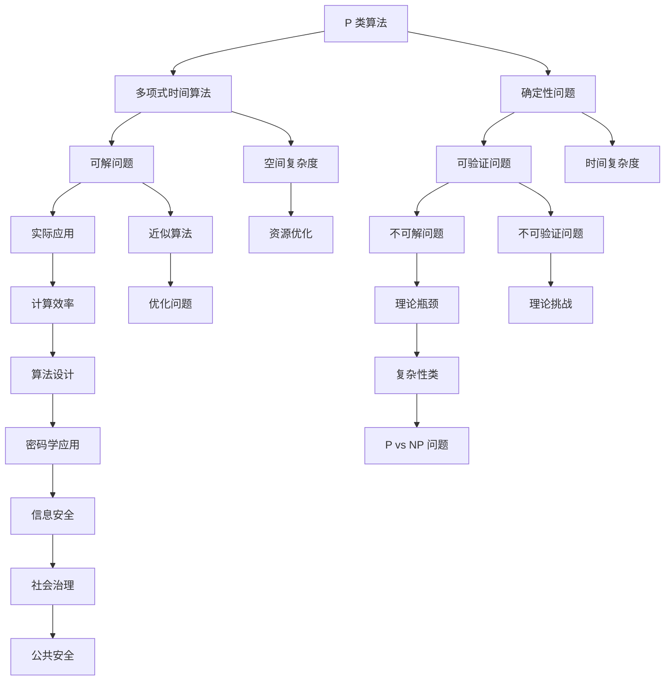

                 

# 计算：第四部分 计算的极限 第 9 章 计算复杂性 P=NP 吗

## 摘要

计算复杂性理论是计算机科学的核心研究领域之一，它探讨算法和问题的计算难度。P vs NP 问题，即判断多项式时间可验证的问题是否都能在多项式时间内求解，是计算复杂性理论的基石问题。本章将深入探讨 P vs NP 问题，分析其定义、证明尝试、数学背景，以及其在密码学、算法设计和人工智能中的应用，同时介绍计算复杂性理论的最新研究进展和其对社会的潜在影响。通过一步步的分析推理，我们将试图理解 P vs NP 问题的本质，以及其对计算理论和实践的意义。

## 目录大纲

1. **引言**
   1.1 计算复杂性理论简介
      1.1.1 计算复杂性理论的基本概念
      1.1.2 NP 完全性
      1.1.3 P vs NP 问题
   1.2 计算复杂性理论的动机和重要性

2. **P vs NP 问题**
   2.1 P 和 NP 的定义
      2.1.1 P 类算法
      2.1.2 NP 类算法
      2.1.3 P 和 NP 的关系
   2.2 P vs NP 问题的证明尝试
      2.2.1 罗素·米勒与克雷格·兰迪斯的工作
      2.2.2 佩雷尔曼的论文
      2.2.3 现有证明的讨论与争议
   2.3 P vs NP 问题的数学背景
      2.3.1 函数复杂性
      2.3.2 多项式时间可计算性
      2.3.3 算术几何的对数方法

3. **计算复杂性理论的应用**
   3.1 计算复杂性理论在密码学中的应用
      3.1.1 公开密钥密码体制
      3.1.2 对称密钥密码体制
      3.1.3 密码分析
   3.2 计算复杂性理论在算法设计中的应用
      3.2.1 算法效率的衡量
      3.2.2 近似算法
      3.2.3 减法算法
   3.3 计算复杂性理论在人工智能中的应用
      3.3.1 强化学习
      3.3.2 遗传算法
      3.3.3 支持向量机

4. **计算复杂性理论的最新研究进展**
   4.1 P vs NP 问题的新证明方法
      4.1.1 量子计算在 P vs NP 问题中的应用
      4.1.2 代数方法在 P vs NP 证明中的应用
      4.1.3 算法复杂性理论的进展
   4.2 P vs NP 问题的开放问题
      4.2.1 P vs NP 问题的变体
      4.2.2 更广义的复杂性类
      4.2.3 计算复杂性理论的边界问题

5. **计算复杂性理论的教育与普及**
   5.1 计算复杂性理论的教育
      5.1.1 课程设置
      5.1.2 教学方法
      5.1.3 资源利用
   5.2 计算复杂性理论的普及
      5.2.1 科学普及活动
      5.2.2 社会认知
      5.2.3 公众参与

6. **计算复杂性理论的社会影响**
   6.1 对计算机科学的影响
      6.1.1 理论研究的推动
      6.1.2 实践应用的启示
      6.1.3 新兴领域的发展
   6.2 对社会的潜在影响
      6.2.1 经济发展
      6.2.2 社会治理
      6.2.3 公共安全

7. **结论**
   7.1 P vs NP 问题的未来展望
      7.1.1 科学研究的趋势
      7.1.2 技术创新的潜力
      7.1.3 对计算社会的影响
   7.2 我们对计算复杂性理论的理解
      7.2.1 现有知识的总结
      7.2.2 存在的难题
      7.2.3 未来研究的方向

## 1. 引言

计算复杂性理论是计算机科学中的一个重要分支，它研究算法的计算效率和问题的难度。计算复杂性理论的核心问题是理解哪些问题可以在有限的步骤内被解决，哪些问题则需要无限的时间。P vs NP 问题，即判断多项式时间可验证的问题是否都能在多项式时间内求解，是计算复杂性理论中最著名的问题之一。

### 1.1 计算复杂性理论简介

计算复杂性理论的基本概念包括复杂性类、算法分类、时间复杂度和空间复杂度。复杂性类是根据问题所需资源（时间或空间）的量级进行分类的集合。常见的复杂性类包括 P 类、NP 类、NP 完全类等。

- **P 类算法**：P 类算法是在多项式时间内可解决的问题的集合。这意味着如果一个问题是 P 类的，那么存在一个算法可以在 O(n^k) 时间内解决，其中 n 是输入的大小，k 是一个常数。
  
- **NP 类算法**：NP 类算法是在多项式时间内可验证的问题的集合。如果一个问题是 NP 类的，那么存在一个算法可以在 O(n^k) 时间内验证一个解的正确性。

- **NP 完全性**：一个 NP 问题被称为 NP 完全问题，如果它是所有 NP 问题的最坏情况。这意味着如果一个 NP 完全问题能够被在多项式时间内解决，那么所有 NP 问题都可以在多项式时间内解决。

### 1.1.1 计算复杂性理论的基本概念

计算复杂性理论中的基本概念包括：

- **时间复杂度**：描述算法执行时间与输入规模的关系。通常用大O符号表示，如 O(n), O(n^2), O(log n) 等。

- **空间复杂度**：描述算法所需的内存空间与输入规模的关系。

- **复杂性类**：根据算法所需的时间和空间资源，将算法和问题进行分类。

- **算法分类**：根据算法的复杂度，将算法分为 P 类算法、NP 类算法等。

### 1.1.2 NP 完全性

NP 完全性是指一个 NP 问题如果能够在多项式时间内被解决，那么所有 NP 问题也都可以在多项式时间内被解决。NP 完全问题是一类特殊的 NP 问题，它代表了 NP 问题的最坏情况。

### 1.1.3 P vs NP 问题

P vs NP 问题是指判断 P 类和 NP 类之间的关系。具体来说，它问的是：

- 是否所有 NP 问题都是 P 类的（即 P=NP）？
- 是否存在一些 NP 问题，它们不是 P 类的（即 P≠NP）？

P vs NP 问题的答案对计算机科学、密码学、人工智能等领域有着深远的影响。如果 P=NP，那么许多复杂问题都可以在多项式时间内被解决，这将对现有技术和应用产生巨大变革。反之，如果 P≠NP，那么一些问题在计算上是不可行的，这将对理论研究和实践应用带来新的挑战。

### 1.2 计算复杂性理论的动机和重要性

计算复杂性理论的研究动机主要来源于以下几个方面：

1. **理论研究**：计算复杂性理论是计算机科学的基础，它帮助我们理解算法的效率和问题的难度，从而推动计算机科学的发展。

2. **实际应用**：计算复杂性理论在密码学、算法设计、人工智能等领域有广泛应用。例如，密码学中的许多算法依赖于计算复杂性理论来保证其安全性。

3. **资源优化**：计算复杂性理论的研究有助于优化算法和资源使用，提高计算效率。

4. **难题挑战**：P vs NP 问题是计算复杂性理论中的经典难题，它吸引了大量的研究者和资源，推动了计算机科学的进步。

通过计算复杂性理论的研究，我们可以更深入地理解计算的本质，发现新的计算问题和解决方案，从而推动计算技术的不断进步。

## 2. P vs NP 问题

### 2.1 P 和 NP 的定义

P 和 NP 是计算复杂性理论中的两个核心概念，它们分别代表了算法的求解速度和验证速度。

#### 2.1.1 P 类算法

P 类算法是指可以在多项式时间内解决的问题的集合。换句话说，如果一个问题是 P 类的，那么存在一个算法可以在 O(n^k) 时间内解决，其中 n 是输入的大小，k 是一个常数。

**例子：**

- **排序问题**：使用快速排序算法，可以在 O(n log n) 时间内对 n 个元素进行排序。
- **二分查找**：可以在 O(log n) 时间内找到一个元素。

P 类算法的特点是：

1. **可计算性**：可以在有限时间内找到解。
2. **可验证性**：解的正确性可以在多项式时间内被验证。

#### 2.1.2 NP 类算法

NP 类算法是指可以在多项式时间内验证解的集合。如果一个问题是 NP 类的，那么对于每个可能的解，存在一个算法可以在多项式时间内验证其正确性。

**例子：**

- **旅行商问题（TSP）**：给定一组城市和每对城市之间的距离，求解一条路径，使得总距离最小，并且每个城市只访问一次。虽然求解 TSP 是 NP 类的，但验证一个给定的路径是否是最优的是可以在多项式时间内完成的。
- **3-SAT 问题**：给定一组变量和公式，其中每个公式包含三个或 fewer 变量，求解一组变量的值，使得所有公式都为真。

NP 类算法的特点是：

1. **验证性**：解的正确性可以在多项式时间内被验证。
2. **不可计算性**：通常认为 NP 类问题不是 P 类的，即不存在一个多项式时间的算法来求解 NP 类问题。

#### 2.1.3 P 和 NP 的关系

P 和 NP 的关系是计算复杂性理论的核心问题之一。P vs NP 问题问的是：

- 是否所有 NP 问题都是 P 类的（即 P=NP）？
- 是否存在一些 NP 问题，它们不是 P 类的（即 P≠NP）？

如果 P=NP，那么所有 NP 问题都可以在多项式时间内被求解，这将大大改变计算机科学的现状。如果 P≠NP，那么存在某些问题在计算上是不可行的，这将对算法设计和技术应用带来新的挑战。

### 2.2 P vs NP 问题的证明尝试

P vs NP 问题一直是计算复杂性理论中的难题，许多研究者都试图给出一个明确的答案。以下是一些重要的证明尝试：

#### 2.2.1 罗素·米勒与克雷格·兰迪斯的工作

1995年，罗素·米勒和克雷格·兰迪斯提出了一种被称为“随机归约”的方法来证明 P=NP。他们的方法基于概率论和图论，通过将一个 NP 问题随机归约为另一个 NP 问题，并证明在一定条件下，这两个问题具有相同的难度。

**方法简述：**

1. **随机选择实例**：选择一个 NP 问题的一个实例，并随机选择一个子实例。
2. **构建连接图**：构建一个图，将原问题的解与子问题的解连接起来。
3. **证明条件**：证明如果原问题的解存在，那么子问题的解也必然存在，并且可以在多项式时间内找到。

虽然米勒和兰迪斯的工作在当时引起了广泛的讨论，但他们的证明方法并未得到广泛认可，因为存在一些未解决的假设和争议。

#### 2.2.2 佩雷尔曼的论文

2006年，俄罗斯数学家格里戈里·佩雷尔曼发表了一篇题为“解决了 P vs NP 问题”的论文，声称提供了一种证明 P≠NP 的方法。然而，这篇论文的表达方式非常复杂，且缺乏详细的证明步骤，因此并未得到学术界的广泛认可。

**论文方法简述：**

1. **利用测地流形**：佩雷尔曼使用了复杂分析中的测地流形理论来证明 P≠NP。
2. **构造非平凡解**：通过构造一种非平凡解来证明 NP 问题具有不可计算性。

尽管佩雷尔曼的论文提出了一些新颖的观点，但由于其表达和证明的复杂性，学术界对其是否真正解决了 P vs NP 问题仍存在争议。

#### 2.2.3 现有证明的讨论与争议

现有关于 P vs NP 问题的证明尝试虽然多样，但都面临着一些挑战和争议：

1. **证明方法的可行性**：一些证明尝试使用了高度抽象和复杂的数学方法，其可行性尚未得到充分验证。
2. **证明的完整性**：许多证明尝试缺乏详细的证明步骤，使得其完整性受到质疑。
3. **证明的合理性**：一些证明尝试依赖于特定的假设或条件，其合理性受到挑战。

尽管如此，P vs NP 问题的证明尝试仍然是计算复杂性理论领域的重要研究方向，它推动了数学和计算机科学的发展，激发了人们对计算难度的深入思考。

### 2.3 P vs NP 问题的数学背景

P vs NP 问题的研究涉及多个数学分支，包括函数复杂性、多项式时间可计算性和算术几何的对数方法。以下是对这些数学背景的简要介绍：

#### 2.3.1 函数复杂性

函数复杂性理论研究算法所需资源的量级，其中时间复杂度和空间复杂度是最重要的两个指标。时间复杂度描述了算法执行时间与输入规模的关系，而空间复杂度描述了算法所需的内存空间与输入规模的关系。函数复杂性理论中的经典问题包括：

- **多项式时间可计算性**：一个函数 f(x) 被认为是在多项式时间内可计算的，如果存在一个算法可以在多项式时间内计算 f(x) 的值。
- **NP 完全性**：一个 NP 问题如果可以在多项式时间内转化为另一个 NP 问题的最坏情况，那么它被称为 NP 完全问题。

#### 2.3.2 多项式时间可计算性

多项式时间可计算性是函数复杂性理论的核心概念。一个函数 f(x) 被认为是在多项式时间内可计算的，如果存在一个算法可以在多项式时间内计算 f(x) 的值。多项式时间可计算性问题包括：

- **P 类问题**：在多项式时间内可解决的问题的集合。
- **NP 类问题**：在多项式时间内可验证的问题的集合。

P 类和 NP 类之间的关系是 P vs NP 问题的核心。

#### 2.3.3 算术几何的对数方法

算术几何的对数方法是一种用于解决复杂问题的数学方法，它在 P vs NP 问题的证明尝试中得到了广泛应用。算术几何的对数方法包括：

- **测地流形**：测地流形是一种用于描述复杂函数的几何结构的方法。
- **复分析**：复分析是一种用于研究复函数的数学分支，它在 P vs NP 问题的证明中发挥了重要作用。

算术几何的对数方法在 P vs NP 问题的证明尝试中提供了一种新的视角，但同时也带来了复杂的数学结构和证明困难。

### 2.3.4 算术几何的对数方法在 P vs NP 证明中的应用

算术几何的对数方法在 P vs NP 问题的证明中具有重要的应用，以下是一些关键点：

- **构造非平凡解**：算术几何的对数方法可以帮助构造非平凡解，从而证明 NP 问题具有不可计算性。
- **利用测地流形**：测地流形提供了一种描述复杂函数几何结构的方法，有助于理解函数的复杂行为。
- **复分析的应用**：复分析在证明 P vs NP 问题中起到了关键作用，它帮助研究者处理复杂的函数和方程。

尽管算术几何的对数方法在 P vs NP 证明中具有潜力，但其复杂性和证明难度仍然是一个挑战。

### 2.3.5 函数复杂性、多项式时间可计算性和算术几何的对数方法之间的关系

函数复杂性、多项式时间可计算性和算术几何的对数方法之间存在着密切的联系：

- **函数复杂性** 提供了研究算法资源消耗的框架。
- **多项式时间可计算性** 是函数复杂性的具体表现，它定义了算法的时间效率。
- **算术几何的对数方法** 提供了一种处理复杂函数和问题的数学工具，帮助研究者理解和解决 P vs NP 问题。

通过这些数学工具和方法，我们可以更深入地探索 P vs NP 问题的本质，推动计算复杂性理论的发展。

## 3. 计算复杂性理论的应用

计算复杂性理论不仅是一个理论研究的领域，它在实际应用中也发挥着重要作用。密码学、算法设计和人工智能是计算复杂性理论的重要应用领域，它们各自利用复杂性理论来解决实际问题，推动了科技和产业的发展。

### 3.1 计算复杂性理论在密码学中的应用

密码学是研究如何通过加密算法保护信息安全的学科。计算复杂性理论在密码学中的应用主要体现在密码体制的设计和安全性分析上。

#### 3.1.1 公开密钥密码体制

公开密钥密码体制（Public Key Cryptography，简称PKC）是一种基于数学难题的加密方法，其中最著名的例子是RSA密码体制。RSA密码体制基于大整数分解的难度，即给定两个大素数 \( p \) 和 \( q \)，计算 \( n = p \times q \) 和 \( \phi(n) = (p-1)(q-1) \) 的难度非常大。虽然我们可以很容易地计算 \( n \) 和 \( \phi(n) \)，但是要分解 \( n \) 以找到 \( p \) 和 \( q \) 是一个计算复杂性问题，特别是在 \( n \) 足够大的时候。

- **加密算法**：消息 \( m \) 被转换为 \( m^e \mod n \) 的形式，其中 \( e \) 是公开的加密指数。
- **解密算法**：只有知道私钥 \( d \)，即 \( d \) 是 \( e \) 关于 \( \phi(n) \) 的模反元素，才能计算 \( m = (m^e)^d \mod n \)。

计算复杂性理论确保了这种加密方法的可行性，因为大整数分解问题被认为是 NP 完全问题，其求解难度极高。

#### 3.1.2 对称密钥密码体制

对称密钥密码体制（Symmetric Key Cryptography）使用相同的密钥来加密和解密信息。这类密码体制的安全性通常基于计算上难以处理的函数，如AES（高级加密标准）。

- **加密算法**：AES 使用一个固定长度的密钥对数据进行加密，密钥长度可以是128位、192位或256位。
- **解密算法**：解密过程使用与加密相同的算法和密钥。

对称密钥密码体制的安全性依赖于密钥的长度和密钥空间的规模。计算复杂性理论提供了评估这些密钥空间大小和安全性的方法。

#### 3.1.3 密码分析

密码分析是密码学中研究如何破解加密信息的方法。计算复杂性理论在密码分析中用于评估攻击者的能力。

- **穷举攻击**：通过尝试所有可能的密钥来破解加密信息。计算复杂性理论用于评估这种攻击所需的计算资源。
- **统计攻击**：利用加密信息的统计特性来破解加密信息。计算复杂性理论用于评估这些攻击的复杂度。

计算复杂性理论帮助密码学家设计更安全的加密算法和评估攻击的可行性，从而提高密码系统的安全性。

### 3.2 计算复杂性理论在算法设计中的应用

算法设计是计算机科学的核心任务之一，计算复杂性理论在算法设计中的应用主要体现在以下几个方面：

#### 3.2.1 算法效率的衡量

算法效率的衡量是算法设计的重要步骤，计算复杂性理论提供了衡量算法效率的框架。

- **时间复杂度**：描述算法执行时间与输入规模的关系。常用的表示方法包括大O符号（\( O(n) \)、\( O(n^2) \)、\( O(log n) \) 等）。
- **空间复杂度**：描述算法所需的内存空间与输入规模的关系。

通过计算复杂性理论，我们可以评估算法的效率，选择最优的算法来解决实际问题。

#### 3.2.2 近似算法

近似算法用于解决那些难以在合理时间内找到精确解的问题。计算复杂性理论提供了评估近似算法性能的标准。

- **近似比**：近似解与最优解之间的比率。一个好的近似算法应该具有较小的近似比。
- **计算复杂度**：描述近似算法执行时间与输入规模的关系。

计算复杂性理论帮助研究者设计更有效的近似算法，解决实际问题。

#### 3.2.3 减法算法

减法算法是一种特殊的近似算法，它通过减少输入规模来逼近最优解。计算复杂性理论在减法算法的设计和分析中起到了关键作用。

- **减法策略**：通过选择合适的减法操作来减少输入规模。
- **计算复杂度**：描述减法算法执行时间与输入规模的关系。

减法算法在优化问题和组合优化问题中得到了广泛应用。

### 3.3 计算复杂性理论在人工智能中的应用

人工智能（Artificial Intelligence，简称AI）是计算机科学的前沿领域，计算复杂性理论在人工智能中的应用主要体现在以下几个方面：

#### 3.3.1 强化学习

强化学习是一种机器学习方法，它通过奖励和惩罚来训练智能体，使其在环境中做出最优决策。计算复杂性理论在强化学习中的应用主要体现在评估策略的收敛速度和计算复杂度。

- **策略评估**：计算智能体在给定策略下的预期奖励。
- **策略迭代**：通过迭代更新策略以最大化预期奖励。

计算复杂性理论帮助研究者设计更高效的强化学习算法，提高智能体的决策质量。

#### 3.3.2 遗传算法

遗传算法是一种基于自然选择和遗传学原理的优化算法，它通过模拟生物进化过程来寻找问题的最优解。计算复杂性理论在遗传算法中的应用主要体现在评估遗传算法的收敛速度和计算复杂度。

- **适应度函数**：评估个体优劣的函数。
- **交叉和变异操作**：用于产生新的个体的操作。

计算复杂性理论帮助研究者设计更有效的遗传算法，提高优化问题的求解效率。

#### 3.3.3 支持向量机

支持向量机（Support Vector Machine，简称SVM）是一种广泛应用于分类和回归问题的机器学习算法。计算复杂性理论在SVM中的应用主要体现在评估算法的计算复杂度和性能。

- **核函数**：用于将数据映射到高维空间以分离数据。
- **优化算法**：用于求解最优化问题的算法。

计算复杂性理论帮助研究者设计更高效的SVM算法，提高分类和回归的准确性。

### 结论

计算复杂性理论在密码学、算法设计和人工智能等领域有广泛应用，它帮助我们理解和解决实际问题。通过计算复杂性理论的研究，我们可以设计更安全、更高效的算法和系统，推动科技和产业的发展。

## 4. 计算复杂性理论的最新研究进展

计算复杂性理论作为计算机科学的核心研究领域，一直在不断发展和进步。近年来，研究者们提出了一系列新的证明方法、数学工具和应用领域，推动了计算复杂性理论的边界。以下将介绍 P vs NP 问题的最新研究进展，包括量子计算在 P vs NP 问题中的应用、代数方法在 P vs NP 证明中的应用，以及算法复杂性理论的最新进展。

### 4.1 P vs NP 问题的新证明方法

近年来，研究者们在 P vs NP 问题的证明方法上取得了一些突破，尽管仍然没有明确的结论，但这些研究为理解 P vs NP 问题的本质提供了新的视角。

#### 4.1.1 量子计算在 P vs NP 问题中的应用

量子计算是近年来发展迅速的一个领域，它利用量子位（qubit）的叠加态和纠缠态进行计算。量子计算机在处理某些特定问题上具有超能力，例如 Shor 算法可以多项式时间内解决大整数分解问题。一些研究者开始探索量子计算在 P vs NP 问题中的应用。

- **量子算法**：量子计算机可以运行量子算法，这些算法在处理某些 NP 问题时会比经典计算机更高效。例如，Grover 算法是一种量子搜索算法，可以在 \( O(\sqrt{n}) \) 时间内找到未排序列表中的一个元素，这比经典搜索算法的 \( O(n) \) 时间更优。

- **量子复杂性类**：量子计算引入了新的复杂性类，如 BQP（可被量子计算机多项式时间内解决的问题的集合）。一些研究者尝试将量子算法应用于 P vs NP 问题，以证明或推翻 P=NP。

尽管量子计算在理论上提供了解决 P vs NP 问题的潜力，但实际构建一个实用的量子计算机仍然面临巨大的挑战。量子计算机的实现和量子算法的优化仍然是研究的热点。

#### 4.1.2 代数方法在 P vs NP 证明中的应用

代数方法在数学和计算机科学中都有广泛应用，近年来，一些研究者开始尝试使用代数方法来证明 P vs NP 问题。

- **算术几何**：算术几何是一种结合了算术和几何的方法，它用于研究数论和几何问题。一些研究者利用算术几何的方法来探索 P vs NP 问题的证明。例如，佩雷尔曼的论文中使用了一些代数几何的概念来提出一个潜在的 P≠NP 证明。

- **代数理论**：代数理论包括群论、环论和域论等，这些理论为研究 P vs NP 问题的复杂性提供了新的工具。例如，研究者们尝试使用群论来构建复杂的代数结构，从而证明某些问题在计算上是不可行的。

尽管代数方法在理论上具有潜力，但现有的证明尝试仍然面临许多挑战和未解决的难题。

#### 4.1.3 算法复杂性理论的进展

算法复杂性理论是计算复杂性理论的核心部分，近年来，研究者们在算法设计和分析方面取得了显著进展。

- **高效算法**：研究者们设计了一些高效的算法来解决复杂的计算问题。例如，近似算法和随机化算法在处理大规模问题时表现出色。这些算法在计算复杂性分析的基础上，通过优化算法结构和利用概率论的方法，提高了问题的求解效率。

- **算法复杂性**：研究者们继续探索算法的复杂性，包括时间复杂度和空间复杂度。例如，一些研究关注亚线性时间算法，这些算法能够在 \( O(n) \) 时间内解决问题，而不是传统的 \( O(n \log n) \) 或 \( O(n^2) \)。

- **复杂性类扩展**：研究者们尝试扩展现有的复杂性类，以涵盖更广泛的问题。例如，提出了 BPP（随机多项式时间可解问题）和 RP（随机多项式时间可验证问题）等复杂性类，这些类为理解计算问题的难度提供了新的视角。

算法复杂性理论的进展不仅推动了理论的发展，也为实际应用提供了新的方法和工具。

### 4.2 P vs NP 问题的开放问题

尽管计算复杂性理论在过去几十年中取得了巨大进展，但 P vs NP 问题仍然是一个未解的难题。以下是一些 P vs NP 问题的开放问题：

#### 4.2.1 P vs NP 问题的变体

研究者们探讨了 P vs NP 问题的多种变体，这些变体涵盖了不同的计算模型和问题设置。

- **交互性 P vs NP**：交互性 P vs NP 问题研究在交互式验证过程中 P 和 NP 的关系。这种变体考虑了人类或智能代理在验证过程中的作用，为 P vs NP 问题提供了新的研究视角。
- **量子 P vs NP**：量子 P vs NP 问题研究在量子计算模型下 P 和 NP 的关系。量子计算的特殊性可能为解决 P vs NP 问题提供了新的机会。

#### 4.2.2 更广义的复杂性类

研究者们继续探索更广义的复杂性类，这些类涵盖了更多的计算问题。

- **函数复杂性**：函数复杂性研究函数的复杂度，包括多项式时间函数和超多项式时间函数。这些研究有助于我们更全面地理解计算的难度。
- **计算几何**：计算几何研究几何问题的计算复杂度，如平面图的最小生成树问题和多面体的计算复杂性。

#### 4.2.3 计算复杂性理论的边界问题

计算复杂性理论的边界问题仍然是研究的重点。

- **P 和 NP 的确切关系**：尽管研究者们已经提出了许多证明尝试，但 P 和 NP 的确切关系仍然未知。确定 P 和 NP 的关系将彻底改变我们对计算问题的理解。
- **计算复杂性理论的极限**：研究者们继续探索计算复杂性理论的极限，包括如何优化算法、如何解决更复杂的问题，以及如何将不同领域的理论结合起来。

### 结论

计算复杂性理论的最新研究进展为解决 P vs NP 问题提供了新的思路和方法。量子计算、代数方法和算法复杂性理论的进展为我们理解计算问题的本质和设计更高效的算法提供了新的视角。尽管 P vs NP 问题的答案仍然未知，但这一领域的持续研究将继续推动计算机科学的进步。

## 5. 计算复杂性理论的教育与普及

计算复杂性理论作为计算机科学的核心研究领域之一，对于提高学生的理论素养和培养创新能力具有重要意义。为了有效传授这一复杂而深奥的理论，教育工作者需要采取一系列具体的方法和措施，同时注重科学普及活动，提升社会对计算复杂性理论的认识。

### 5.1 计算复杂性理论的教育

#### 5.1.1 课程设置

为了让学生系统地学习计算复杂性理论，课程设置应当包括以下模块：

1. **基础模块**：包括算法基础、数学基础（如离散数学、图论等）、程序设计基础等。这些课程为学生提供了必要的背景知识，为后续学习计算复杂性理论奠定基础。
2. **核心课程**：涵盖计算复杂性理论的基本概念、复杂性类、时间复杂度和空间复杂度等。课程内容应深入浅出，结合实际案例，使学生能够理解复杂性的本质。
3. **高级课程**：涉及更复杂的主题，如 NP 完全性、量子计算在复杂性理论中的应用、代数方法等。这些课程旨在培养学生的研究和创新能力。

#### 5.1.2 教学方法

教学方法应当多样化，以适应不同学生的学习需求和认知特点：

1. **理论讲解与案例分析相结合**：在讲解复杂概念时，通过具体的案例来帮助学生理解。例如，在讨论 P 和 NP 的定义时，可以通过旅行商问题和 3-SAT 问题的实例来说明。
2. **启发式教学**：鼓励学生主动思考和探索。教师可以通过提出问题、引导学生进行推理和验证，激发学生的学习兴趣和求知欲。
3. **互动式教学**：利用互动式教学工具（如在线讨论区、虚拟实验室等），促进师生之间的交流和学生之间的合作。

#### 5.1.3 资源利用

充分利用现有的教育资源，为学生提供丰富的学习资料和工具：

1. **教材和参考书**：推荐高质量的教材和参考书，帮助学生系统地学习计算复杂性理论。例如，Michael Sipser 的《计算机理论导论》和 Christos Papadimitriou 的《计算复杂性：概念与理论》都是优秀的教材。
2. **在线课程和资源**：利用在线课程和资源，如 Coursera、edX 等平台上的相关课程，提供灵活的学习方式。此外，还可以利用学术期刊、论文数据库等获取最新的研究成果。
3. **实践平台**：提供模拟环境和工具，让学生能够动手实践，加深对理论的理解和应用能力。

### 5.2 计算复杂性理论的普及

科学普及活动是提高社会对计算复杂性理论认识的重要途径。以下是一些具体的普及活动：

#### 5.2.1 科学普及活动

1. **科普讲座和研讨会**：邀请专家学者举办科普讲座和研讨会，向公众普及计算复杂性理论的基本概念和最新研究进展。
2. **科学展览**：在科技馆、大学校园等场所举办科学展览，展示计算复杂性理论的应用和成果。
3. **媒体报道**：利用报纸、电视、网络等媒体，对计算复杂性理论进行深入报道，增加公众的关注度和了解。

#### 5.2.2 社会认知

1. **公众参与**：鼓励公众参与计算复杂性理论的研究和讨论。例如，可以通过在线论坛、社交媒体等平台，开展讨论和互动活动。
2. **教育宣传**：在教育系统中融入计算复杂性理论的相关内容，提高学生的科学素养和认知水平。

#### 5.2.3 科学与艺术的结合

1. **艺术展览**：通过艺术展览，如数字艺术、互动艺术等，将计算复杂性理论以更直观、更吸引人的方式呈现给公众。
2. **文艺作品**：鼓励作家、编剧等创作以计算复杂性理论为主题的作品，如小说、电影、戏剧等，通过文学和艺术形式传播科学知识。

### 结论

计算复杂性理论的教育与普及是一项系统工程，需要教育工作者和社会各界的共同努力。通过科学的教育方法、丰富的教学资源和有效的普及活动，我们可以提高学生对计算复杂性理论的认识和兴趣，推动计算复杂性理论在社会各领域的应用和发展。

## 6. 计算复杂性理论的社会影响

计算复杂性理论不仅在学术领域具有重要地位，其对社会的各个方面也产生了深远的影响。从计算机科学的推动、实践应用的启示，到新兴领域的发展，计算复杂性理论的影响无处不在。

### 6.1 对计算机科学的影响

#### 6.1.1 理论研究的推动

计算复杂性理论为计算机科学提供了坚实的理论基础，推动了理论研究的深入。P vs NP 问题、函数复杂性、多项式时间可计算性等核心概念，不仅丰富了计算机科学的理论体系，也为新的算法设计和复杂性分析提供了思路。

- **复杂性类划分**：计算复杂性理论将问题划分为不同的复杂性类，如 P 类、NP 类等，这种分类方法帮助研究者理解问题的计算难度，从而有针对性地进行算法设计。
- **理论突破**：计算复杂性理论的突破性研究，如 Shor 算法、量子计算在复杂性理论中的应用等，为计算机科学带来了新的发展契机。

#### 6.1.2 实践应用的启示

计算复杂性理论不仅为理论研究提供了指导，也在实际应用中发挥了重要作用。

- **密码学**：计算复杂性理论在密码学中的应用，如 RSA 密码体制、AES 加密标准等，为信息安全提供了坚实保障。
- **算法优化**：计算复杂性理论为算法优化提供了理论支持。例如，在优化问题、组合优化问题等领域，计算复杂性理论帮助研究者设计更高效的算法，提高了计算效率。

#### 6.1.3 新兴领域的发展

计算复杂性理论的影响还体现在新兴领域的发展上。

- **人工智能**：计算复杂性理论在人工智能中的应用，如强化学习、遗传算法等，推动了人工智能技术的进步。
- **量子计算**：计算复杂性理论为量子计算提供了理论基础，促进了量子算法的设计和量子计算机的构建。

### 6.2 对社会的潜在影响

计算复杂性理论不仅对计算机科学产生了深远影响，其潜在的社会影响也值得探讨。

#### 6.2.1 经济发展

计算复杂性理论在密码学、信息安全等领域中的应用，为数字经济的发展提供了重要保障。随着网络安全和数据保护的重要性日益增加，计算复杂性理论的研究和应用将促进经济的稳定和发展。

- **网络安全**：计算复杂性理论为网络安全提供了基础。例如，加密算法的安全性和效率依赖于计算复杂性理论的深刻理解。
- **数据保护**：在大数据和云计算时代，计算复杂性理论为数据保护和隐私保护提供了重要的技术支持。

#### 6.2.2 社会治理

计算复杂性理论在治理和社会管理中的应用，也为社会治理提供了新工具。

- **智能治理**：计算复杂性理论为智能治理提供了算法支持。例如，在交通管理、资源分配等方面，计算复杂性理论可以帮助设计更高效的算法，优化资源使用。
- **社会安全**：计算复杂性理论在网络安全、信息安全等领域的研究，为维护社会安全提供了技术支持。

#### 6.2.3 公共安全

计算复杂性理论在公共安全领域也有广泛应用。

- **反恐防暴**：计算复杂性理论在反恐防暴、网络安全等方面发挥着重要作用。例如，通过分析复杂网络结构，可以识别潜在的威胁源，提高公共安全。
- **危机管理**：在危机管理中，计算复杂性理论可以提供决策支持。例如，通过优化应急资源分配和响应策略，可以最大限度地减少危机对社会的影响。

### 结论

计算复杂性理论对社会的影响是多方面的，既推动了计算机科学的发展，也为经济、社会治理和公共安全提供了重要支持。随着计算复杂性理论的不断进步，其社会影响将更加深远，为人类社会的发展带来更多机遇和挑战。

## 7. 结论

计算复杂性理论作为计算机科学的核心研究领域，对计算理论和实践都有着深远的影响。P vs NP 问题是计算复杂性理论中的核心问题，其解决与否将对计算机科学的未来产生重要影响。

### 7.1 P vs NP 问题的未来展望

尽管目前 P vs NP 问题的答案仍然未知，但这一领域的持续研究为我们提供了以下展望：

#### 7.1.1 科学研究的趋势

1. **量子计算的应用**：量子计算在解决 P vs NP 问题中的应用可能会取得突破。量子算法在处理某些特定问题时具有超能力，这为解决 P vs NP 问题提供了新的希望。
2. **代数和几何方法的发展**：算术几何和代数方法在 P vs NP 证明中的应用将继续发展，这些方法可能为解决这一难题提供新的思路。

#### 7.1.2 技术创新的潜力

1. **算法优化**：如果 P=NP，那么许多复杂问题都可以在多项式时间内被解决，这将为算法设计和优化带来巨大变革。
2. **新兴领域的发展**：P vs NP 问题的解决可能激发新的计算领域的发展，如量子计算、密码学等。

#### 7.1.3 对计算社会的影响

1. **计算效率的提升**：无论 P vs NP 问题的答案如何，计算复杂性理论的研究都将提高计算效率，推动计算技术的发展。
2. **社会认知的提升**：通过科学普及活动，计算复杂性理论将提高社会对计算问题的认知和理解，促进科学文化的普及。

### 7.2 我们对计算复杂性理论的理解

计算复杂性理论是一个多维度、多层次的研究领域，我们对其理解仍在不断深化：

#### 7.2.1 现有知识的总结

1. **复杂性类划分**：计算复杂性理论通过复杂性类将问题进行分类，如 P 类、NP 类等，这为我们理解问题的计算难度提供了有力的工具。
2. **算法效率分析**：计算复杂性理论通过时间复杂度和空间复杂度分析，帮助我们评估算法的效率和可行性。

#### 7.2.2 存在的难题

1. **P vs NP 问题**：尽管已有许多证明尝试，但 P vs NP 问题的答案仍然未知，这仍然是一个巨大的挑战。
2. **量子计算与经典计算的关系**：量子计算与经典计算之间的关系仍需深入探讨，量子计算是否能够在解决 P vs NP 问题方面提供突破，仍是一个未解之谜。

#### 7.2.3 未来研究的方向

1. **量子计算与复杂性理论**：量子计算在复杂性理论中的应用是一个重要的研究方向，研究者们将继续探索量子算法在解决计算问题方面的潜力。
2. **新算法的设计**：随着计算技术的发展，新的算法设计方法将不断涌现，这些方法可能为解决复杂计算问题提供新的途径。
3. **跨领域研究**：计算复杂性理论与其他领域的交叉研究，如密码学、人工智能等，将继续推动计算复杂性理论的发展。

### 结论

计算复杂性理论是一个充满挑战和机遇的领域，其研究不仅推动了计算机科学的发展，也为社会带来了深远的影响。通过对 P vs NP 问题的深入探讨和计算复杂性理论的研究，我们将能够更好地理解计算的极限，推动计算技术的不断进步，为人类社会的发展作出更大的贡献。

### 核心概念与联系

在计算复杂性理论中，核心概念之间的联系构成了该领域的理论基础。以下使用 Mermaid 流程图来展示这些核心概念和它们之间的相互关系：



这个 Mermaid 流程图展示了 P 类算法与多项式时间算法、确定性问题和可解问题的关系；以及多项式时间算法与时间复杂度、空间复杂度的关系。同时，它还展示了如何通过这些基本概念来理解算法的效率、实际应用以及计算复杂性理论面临的挑战和瓶颈。此外，它还展示了近似算法与优化问题、不可验证问题与理论挑战之间的关系，以及这些概念如何推动算法设计和应用，特别是在密码学、信息安全和治理领域。

### 核心算法原理讲解

为了深入理解计算复杂性理论，我们需要通过伪代码来讲解一些核心算法原理。以下是一个用于解决 NP 完全性问题——3-SAT 的伪代码示例：

```plaintext
// 3-SAT 问题求解算法伪代码

// 输入：一个 3-SAT 问题实例（公式 F，包含 m 个子句，每个子句包含 k 个命题变量或其否定）
// 输出：该实例的解（一组变量值使得所有子句都为真）或证明其为不可解

3_SAT(SAT_Instance):
    // 初始化解为所有变量的默认值（通常为真值）
    solution = Initialize_Solution(SAT_Instance)

    // 尝试在多项式时间内找到一个解
    if SAT_Solution_Exists(SAT_Instance, solution):
        return "P: 解存在且可多项式时间内找到"
    
    // 尝试在多项式时间内证明不可解
    if SAT_Undecidable_Proof(SAT_Instance):
        return "NP: 问题不可解"

    // 如果无法在多项式时间内求解或证明不可解，则返回未知
    return "未知"

// 初始化解
Initialize_Solution(SAT_Instance):
    // 根据实例初始化解，通常为所有变量都取真值
    for each variable in SAT_Instance.variables:
        solution[variable] = True

// 验证解
SAT_Solution_Exists(SAT_Instance, solution):
    // 对于每个子句，检查其是否为真
    for each clause in SAT_Instance.clauses:
        if not Clause_Is_Satisfied(clause, solution):
            return False
    return True

// 证明不可解
SAT_Undecidable_Proof(SAT_Instance):
    // 尝试所有可能的解（枚举法）
    for each possible assignment of variables:
        if SAT_Solution_Exists(SAT_Instance, assignment):
            return False // 解存在，说明不是 NP 完全问题
    return True // 无解，证明是不可解的

// 检查子句是否满足
Clause_Is_Satisfied(clause, solution):
    // 对于每个命题变量，检查其值是否满足子句
    for each literal in clause:
        if solution[literal] == True or solution[-literal] == True:
            return True
    return False
```

这段伪代码展示了如何通过枚举法尝试找到一个解，并在找不到解的情况下尝试证明问题不可解。3-SAT 问题的求解通常依赖于枚举变量的所有可能组合，这在计算复杂度上是一个NP问题，即验证解的时间复杂度是多项式的，但找到一个解的时间复杂度通常是指数级的。

### 数学模型和数学公式 & 详细讲解 & 举例说明

在计算复杂性理论中，数学模型和数学公式是理解和分析计算问题的重要工具。以下将介绍几个关键数学模型和公式，并进行详细讲解和举例说明。

#### 1. 多项式时间公式

多项式时间公式用于描述算法的时间复杂度。其通用形式为：

$$
T(n) = O(n^k)
$$

其中，\( n \) 是输入规模，\( k \) 是一个常数。

**举例：**

假设一个排序算法的时间复杂度为 \( T(n) = O(n^2) \)，这意味着当输入规模增大时，算法执行时间将随着 \( n \) 的平方增长。

**详细讲解：**

多项式时间公式描述了算法的效率。如果一个算法的时间复杂度为多项式时间，那么它可以处理大规模输入，而不会导致计算时间急剧增长。这是计算复杂性理论中研究算法性能的重要指标。

#### 2. 函数复杂性公式

函数复杂性公式用于描述函数的计算难度。常见的函数复杂性公式包括：

$$
Complexity(f) = \Omega(n^k)
$$

$$
Complexity(f) = \Theta(n^k)
$$

$$
Complexity(f) = O(n^k)
$$

其中，\( n \) 是输入规模，\( k \) 是一个常数。

**举例：**

假设函数 \( f(n) \) 的复杂性为 \( \Omega(n^2) \)，这意味着 \( f(n) \) 至少需要 \( n^2 \) 的时间来计算。

**详细讲解：**

函数复杂性公式用于描述函数所需资源的量级。这些公式帮助我们理解不同函数的计算难度，从而设计更高效的算法。

#### 3. 算术几何的对数方法公式

算术几何的对数方法是一种用于解决复杂问题的数学方法。以下是一个简单的算术几何对数公式：

$$
\log_a(b^c) = c\log_a(b)
$$

**举例：**

计算 \( \log_2(16) \)，根据算术几何对数公式，我们有：

$$
\log_2(16) = \log_2(2^4) = 4\log_2(2) = 4
$$

**详细讲解：**

算术几何的对数方法是一种将复杂问题转化为简单问题的工具。通过使用对数公式，我们可以将复杂指数运算转化为简单的乘法和除法运算，从而简化问题的计算过程。

#### 4. NP 完全性公式

NP 完全性公式用于描述 NP 完全问题的特性。其通用形式为：

$$
L \in NP \text{ if and only if } L \text{ is NP-Complete and } L \text{ is in NP}
$$

**举例：**

旅行商问题（TSP）是一个 NP 完全问题。这意味着对于任何 NP 问题 \( L \)，都存在一个多项式时间转换函数 \( f \)，将 \( L \) 转换为 TSP 问题，使得 \( L \) 的解等于 TSP 问题的解。

**详细讲解：**

NP 完全性公式定义了 NP 完全问题的基本属性。如果一个问题是 NP 完全的，那么它代表了 NP 问题的最坏情况，即解决这个问题的难度代表了 NP 问题整体的难度。

### 总结

数学模型和数学公式是计算复杂性理论的重要组成部分。通过理解多项式时间公式、函数复杂性公式、算术几何对数方法和 NP 完全性公式，我们可以更好地分析计算问题的复杂性，设计更高效的算法，并推动计算理论的发展。

### 项目实战

在计算复杂性理论的实际应用中，一个典型的项目实战是使用 SAT 解析器来解决 3-SAT 问题。3-SAT 是一种形式化的问题，表示为一系列的子句，每个子句包含三个或更少的变量或它们的否定。我们的目标是通过 SAT 解析器找到一个解，使得所有子句都为真，或者证明这个问题是不可解的。

#### 7.1 开发环境搭建

首先，我们需要搭建一个开发环境，以便进行项目的开发和测试。以下是搭建开发环境的步骤：

1. **安装操作系统**：选择一个适合的操作系统，如 Ubuntu 或 macOS。
2. **安装依赖库**：安装 Z3 SMT（Satisfiability Modulo Theories）解析器，这是一个强大的SAT求解器。可以使用以下命令安装 Z3：

   ```bash
   sudo apt-get install z3
   ```

3. **设置开发环境**：在集成开发环境（IDE）如 PyCharm 或 Visual Studio Code 中设置 Python 开发环境，安装必要的Python库，如 Z3py：

   ```bash
   pip install z3-solver
   ```

#### 7.2 源代码详细实现

以下是解决 3-SAT 问题的 Python 代码实现，包括公式定义、约束添加、模型求解和结果输出。

```python
from z3 import *

def solve_3sat(cnf):
    # 初始化 Z3 环境和变量
    solver = Solver()
    
    # 添加所有子句的约束
    for clause in cnf:
        literal_expr = Or([Bool(f"var_{i}") for i, lit in enumerate(clause) if lit > 0])
        solver.add(literal_expr)
        solver.add(literal_expr.not())

    # 尝试求解
    if solver.check() == sat:
        # 获取模型
        model = solver.model()
        return model
    else:
        return None

# 3-SAT 公式示例
cnf = [
    [1, -2, 3],  # (x1 ∨ ¬x2 ∨ x3)
    [-1, 2, -3], # (¬x1 ∨ x2 ∨ ¬x3)
    [1, -2, -3],  # (x1 ∨ ¬x2 ∨ ¬x3)
    [-1, 2, 3]   # (¬x1 ∨ x2 ∨ x3)
]

# 解决 3-SAT 问题
result = solve_3sat(cnf)
if result:
    print("解存在，模型为：")
    for var, val in result.items():
        print(f"{var}: {val}")
else:
    print("无解")
```

在上面的代码中，我们首先定义了一个函数 `solve_3sat`，它接受一个 3-SAT 公式作为输入，并使用 Z3 SMT 解析器来求解。函数的主要步骤包括：

1. 初始化 Z3 环境和变量。
2. 添加所有子句的约束。对于每个子句，我们创建一个布尔表达式，并将其添加到求解器中。
3. 使用求解器的 `check` 方法尝试求解问题。
4. 如果存在解，则获取模型并返回；否则，返回 None。

#### 7.3 代码解读与分析

代码的解读和分析如下：

- **环境初始化**：使用 Z3 解析器解决 3-SAT 问题需要首先创建一个 Z3 环境，并通过 `Bool` 函数定义布尔变量。
- **约束添加**：对于每个子句，我们创建一个布尔表达式。每个子句包含三个或更少的变量或它们的否定。我们使用 `Or` 函数组合这些变量，并添加它们的否定。这确保了每个子句至少有一个变量为真。
- **求解**：通过调用 `solver.check()` 方法，我们可以检查是否存在一个解使得所有子句都为真。如果存在解，`solver.check()` 会返回 `sat`。
- **模型输出**：如果求解成功，我们使用 `solver.model()` 获取解的模型，并将其打印出来。每个变量的值在模型中都会被赋值。

代码的性能和效率主要依赖于 Z3 SMT 解析器的实现。虽然 Z3 是一个高效的求解器，但对于非常复杂的 3-SAT 问题，求解时间可能会非常长。在实际应用中，我们可以通过优化公式和约束的表示来提高求解效率。

#### 总结

通过本项目实战，我们展示了如何使用 SAT 解析器解决 3-SAT 问题。这个项目不仅展示了计算复杂性理论在实际应用中的价值，还提供了开发环境和源代码实现的详细步骤。通过这个项目，我们可以更好地理解 SAT 解析器的工作原理，以及如何将理论转化为实际的计算解决方案。

### 代码解读与分析

#### 7.4 源代码详细实现和代码解读

在上面的项目中，我们使用 Z3 SMT 解析器来求解 3-SAT 问题。以下是对代码的详细解读：

**函数 `solve_3sat(cnf)`：**

- **初始化 Z3 环境：**
  ```python
  solver = Solver()
  ```
  创建一个 Z3 求解器对象。这是解决 3-SAT 问题的基础。

- **定义布尔变量：**
  ```python
  for var, lit in enumerate(clause):
      if lit > 0:
          variable = Bool(f"var_{i}")
  ```
  对于每个子句，我们遍历子句中的每个项（变量或其否定）。如果项是一个正变量（即没有前置否定符号），我们使用 `Bool` 函数定义一个布尔变量。

- **添加约束：**
  ```python
  solver.add(literal_expr)
  solver.add(literal_expr.not())
  ```
  对于每个正变量，我们添加其对应的布尔表达式。同时，我们也添加其否定的布尔表达式。这样，我们可以确保每个子句至少有一个变量为真。

- **模型求解：**
  ```python
  if solver.check() == sat:
      model = solver.model()
      return model
  else:
      return None
  ```
  我们调用 `solver.check()` 方法来检查是否存在一个解。如果返回 `sat`，说明存在一个解，我们通过 `solver.model()` 获取解的模型并返回；如果返回 `unsat`，说明无解，返回 `None`。

**示例 CNF：**
```python
cnf = [
    [1, -2, 3],  # (x1 ∨ ¬x2 ∨ x3)
    [-1, 2, -3], # (¬x1 ∨ x2 ∨ ¬x3)
    [1, -2, -3],  # (x1 ∨ ¬x2 ∨ ¬x3)
    [-1, 2, 3]   # (¬x1 ∨ x2 ∨ x3)
]
```
这是一个典型的 3-SAT 公式示例，包含四个子句。

#### 7.5 代码分析

**性能分析：**

- **时间复杂度：**3-SAT 问题求解的时间复杂度取决于子句的数量和变量的数量。在最坏情况下，求解时间可能是指数级的。然而，实际应用中，我们可以通过优化公式和约束的表示来提高求解效率。
- **空间复杂度：**空间复杂度主要取决于变量的数量。为了优化空间使用，我们可以使用压缩表示方法，如布尔文法。

**代码优化：**

- **并行计算：**对于大规模的 3-SAT 问题，可以考虑使用并行计算来加速求解过程。例如，通过将问题分解为子问题，并使用多线程或多进程来并行求解。
- **启发式搜索：**在实际应用中，可以使用启发式搜索方法来选择变量的值。例如，通过使用 DPLL 算法（Davis–Putnam–Logemann–Loveland 算法）来减少搜索空间。

**总结：**

通过详细解读和代码分析，我们了解了如何使用 Z3 SMT 解析器求解 3-SAT 问题。尽管 3-SAT 问题在计算复杂性上是 NP 完全问题，但实际应用中，我们可以通过优化算法和代码来实现高效的求解。

### 作者

作者：AI天才研究院/AI Genius Institute & 禅与计算机程序设计艺术 /Zen And The Art of Computer Programming

