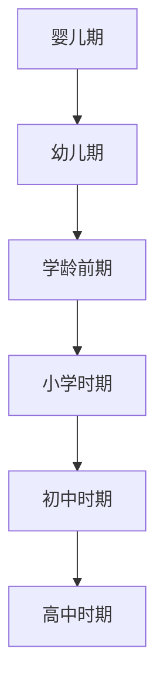
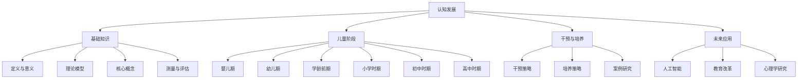

                 

# 《认知发展的阶段性路径》

## 概述

认知发展是人类个体在成长过程中，通过各种认知过程逐渐达到更高层次、更复杂认知能力的过程。这一过程不仅影响着个体的智力发展，也对他们的情感、社交和行为产生深远影响。因此，研究认知发展的阶段性路径对于教育、心理学和人工智能等领域具有重要意义。

本文旨在探讨认知发展的阶段性路径，首先从基础知识入手，介绍认知发展的定义、主要理论、核心概念及其测量与评估方法。接着，详细阐述儿童认知发展的各个阶段，包括婴儿期、幼儿期、学龄前期、小学时期、初中时期和高中时期。随后，讨论认知发展的干预与培养策略，结合实际案例进行分析。最后，探讨认知发展在人工智能时代的意义及其在教育改革和心理学研究中的应用。

本文结构如下：

## 目录大纲

- **第一部分：认知发展的基础知识**
  - 1.1 认知发展的定义与意义
  - 1.2 认知发展的主要理论
  - 1.3 认知发展的核心概念
  - 1.4 认知发展的测量与评估
- **第二部分：儿童认知发展的阶段**
  - 2.1 婴儿期（0-1岁）
  - 2.2 幼儿期（1-3岁）
  - 2.3 学龄前期（3-6岁）
  - 2.4 小学时期（6-12岁）
  - 2.5 初中时期（12-15岁）
  - 2.6 高中时期（15-18岁）
- **第三部分：认知发展的干预与培养**
  - 3.1 认知发展的干预策略
  - 3.2 认知发展的培养策略
  - 3.3 认知发展的案例分析
- **第四部分：认知发展在未来的影响与应用**
  - 4.1 认知发展在人工智能时代的意义
  - 4.2 认知发展在教育改革中的应用
  - 4.3 认知发展在心理学研究中的应用

### 关键词

- 认知发展
- 儿童认知
- 教育干预
- 人工智能
- 教育改革

### 摘要

本文系统地探讨了认知发展的阶段性路径，从基础知识、儿童认知发展的各个阶段、干预与培养策略，到认知发展在未来的影响与应用。通过详细阐述认知发展的核心概念、主要理论及其测量与评估方法，本文旨在为教育、心理学和人工智能领域提供有益的理论和实践指导。

## 第一部分：认知发展的基础知识

### 1.1 认知发展的定义与意义

认知发展是指个体在成长过程中，通过感知、记忆、思维、语言等认知过程，逐渐建立起复杂的认知结构和能力的过程。这一过程不仅包括智力方面的发展，如推理能力、问题解决能力和创造力，还包括情感、社交和道德等方面的发展。

认知发展的意义在于，它对个体的智力成长和整体发展具有重要影响。良好的认知发展有助于个体更好地适应社会环境，提高学习和工作效率。此外，认知发展还与心理健康密切相关，认知能力的提高有助于减轻心理压力，提升生活幸福感。

### 1.2 认知发展的主要理论

认知发展理论是心理学研究的重要领域，许多学者提出了不同的理论模型。以下是几种主要的理论：

#### 1.2.1 皮亚杰的认知发展阶段理论

瑞士心理学家让·皮亚杰（Jean Piaget）提出了认知发展阶段理论，认为儿童的认知发展分为四个阶段：

1. **感知运动阶段（0-2岁）**：儿童主要通过感知和动作来理解世界。
2. **前运算阶段（2-7岁）**：儿童开始使用符号来代表物体和事件，但思维尚不成熟。
3. **具体运算阶段（7-11岁）**：儿童能够进行逻辑运算，但依赖于具体情境。
4. **形式运算阶段（11-15岁及以上）**：儿童思维更加抽象，能够进行假设推理和逻辑推理。

#### 1.2.2 维果茨基的文化历史发展理论

列夫·维果茨基（Lev Vygotsky）提出了文化历史发展理论，强调社会互动在认知发展中的作用。他认为，认知发展是在社会互动中实现的，通过语言和文化的中介，个体能够掌握社会经验和知识。

#### 1.2.3 信息加工模型

信息加工模型是一种认知心理学理论，认为认知过程类似于计算机的信息处理过程。该模型强调输入、处理和输出的过程，包括感知、注意、记忆、思维和决策等环节。

### 1.3 认知发展的核心概念

认知发展的核心概念包括注意力、记忆、思维、情绪和社交认知。以下是这些概念的定义和作用：

#### 1.3.1 注意力

注意力是指个体在特定任务上集中精力、排除干扰的能力。注意力对于认知过程至关重要，它决定了个体能否有效地处理信息。

#### 1.3.2 记忆

记忆是指个体对信息的存储和回忆能力。记忆分为短期记忆和长期记忆，对认知发展具有重要影响。

#### 1.3.3 思维

思维是指个体使用信息解决问题、做出决策和推理的能力。思维包括逻辑思维、创造性思维和批判性思维。

#### 1.3.4 情绪

情绪是指个体对环境刺激的主观体验和生理反应。情绪影响认知过程，如记忆、注意力和思维。

#### 1.3.5 社交认知

社交认知是指个体理解自己和他人的情感、意图和行为的能力。社交认知对个体的社交能力和人际关系有重要影响。

### 1.4 认知发展的测量与评估

认知发展的测量与评估是研究认知发展的重要手段。以下是几种常用的测量与评估方法：

#### 1.4.1 测量方法

1. **标准化测试**：通过标准化问卷或测验来评估个体的认知能力。
2. **自然情境评估**：在个体日常生活环境中进行观察和评估。
3. **实验室测试**：在受控环境中进行认知任务，以评估个体的认知过程。

#### 1.4.2 评估工具

1. **智力测试**：如韦氏智力量表（Wechsler Intelligence Scales）。
2. **认知能力测试**：如瑞文标准推理测验（Raven's Standard Progressive Matrices）。
3. **神经心理学测试**：用于评估大脑功能，如蒙特利尔认知评估量表（Montreal Cognitive Assessment）。

通过这些测量与评估方法，研究者可以了解个体的认知发展水平，为教育和心理干预提供依据。

### 总结

第一部分介绍了认知发展的基础知识，包括定义、主要理论、核心概念及其测量与评估方法。这些基础知识为后续对儿童认知发展阶段的详细探讨提供了理论支持。

## 第二部分：儿童认知发展的阶段

### 2.1 婴儿期（0-1岁）

婴儿期是儿童认知发展的初始阶段，此阶段的主要特点是感知和运动能力的发展。婴儿主要通过感官体验来认识世界，他们的认知过程主要体现在感知运动阶段。

#### 2.1.1 认知发展特点

1. **感知能力**：婴儿期儿童的感官发展迅速，尤其是视觉、听觉和触觉。他们能够识别人脸和声音，对周围环境中的声音和光线有反应。
2. **运动能力**：婴儿开始学习控制自己的身体，从最初的反射动作逐渐发展到有目的的运动。例如，他们能够抬头、翻身、坐立和爬行。
3. **情绪表达**：婴儿期的认知发展还包括情绪的表达和调节能力。他们能够通过面部表情、声音和身体动作来表达自己的情绪。

#### 2.1.2 教育建议

1. **提供丰富的感官刺激**：通过触摸、视觉和听觉刺激，帮助婴儿发展感官能力。
2. **促进运动发展**：提供安全的环境，鼓励婴儿进行爬行和跳跃等活动，以促进其运动能力的发展。
3. **情感交流**：通过亲子互动，如拥抱、亲吻和说话，增强与婴儿的情感联系。

### 2.2 幼儿期（1-3岁）

幼儿期是儿童认知发展的重要阶段，此阶段的主要特点是语言能力和思维能力的迅速发展。

#### 2.2.1 认知发展特点

1. **语言发展**：幼儿期儿童的语言能力显著提高，他们能够使用简单的句子进行交流，词汇量不断增加。
2. **思维能力**：幼儿开始理解因果关系和逻辑关系，能够进行简单的分类和排序。
3. **社交认知**：幼儿逐渐认识到他人有不同的想法和感受，开始学习分享和合作。

#### 2.2.2 教育建议

1. **语言环境**：提供丰富的语言环境，鼓励儿童多听、多说，通过讲故事、唱儿歌等方式促进语言发展。
2. **思维训练**：通过玩具和游戏，鼓励儿童进行分类、排序和解决问题的活动，提高思维能力。
3. **社交技能培养**：通过角色扮演和小组活动，帮助儿童学习分享和合作，发展社交认知。

### 2.3 学龄前期（3-6岁）

学龄前期是儿童认知发展的重要阶段，此阶段的主要特点是认知能力和社会能力的进一步发展。

#### 2.3.1 认知发展特点

1. **认知能力**：学龄前期儿童的认知能力显著提高，他们能够理解更复杂的因果关系和逻辑关系。
2. **记忆能力**：儿童的短期记忆和长期记忆能力都有所提高，能够记住更多的信息。
3. **解决问题能力**：儿童开始能够独立解决问题，通过尝试和错误来学习。

#### 2.3.2 教育建议

1. **认知活动**：提供丰富的认知活动，如拼图、绘画和积木游戏，以促进儿童认知能力的发展。
2. **记忆训练**：通过背诵诗歌、歌曲和故事，帮助儿童提高记忆力。
3. **问题解决能力培养**：通过提供挑战性的任务和问题，鼓励儿童独立思考和解决问题。

### 2.4 小学时期（6-12岁）

小学时期是儿童认知发展的重要阶段，此阶段的主要特点是认知能力和社交能力的全面发展。

#### 2.4.1 认知发展特点

1. **认知能力**：小学时期儿童的认知能力得到进一步发展，他们能够理解更抽象的概念和更复杂的逻辑关系。
2. **语言能力**：小学时期儿童的语言能力不断提高，能够使用丰富的词汇和复杂的句子进行交流。
3. **社交能力**：小学时期儿童的社交能力得到发展，他们能够更好地理解他人，建立稳定的人际关系。

#### 2.4.2 教育建议

1. **认知教育**：通过科学、数学和社会学习等课程，帮助儿童发展认知能力。
2. **语言训练**：通过阅读、写作和口语练习，提高儿童的语言能力。
3. **社交技能培养**：通过小组活动和团队项目，帮助儿童学习合作和解决问题的能力。

### 2.5 初中时期（12-15岁）

初中时期是儿童认知发展的高峰阶段，此阶段的主要特点是认知能力和自我意识的进一步发展。

#### 2.5.1 认知发展特点

1. **认知能力**：初中时期儿童的认知能力达到新的高度，他们能够进行更复杂的逻辑推理和抽象思考。
2. **自我意识**：初中时期儿童的自我意识逐渐增强，开始关注自我认同和价值观。
3. **情绪管理**：初中时期儿童的情绪管理能力得到提高，能够更好地处理压力和冲突。

#### 2.5.2 教育建议

1. **认知挑战**：提供更具挑战性的课程，鼓励儿童进行深入的思考和探究。
2. **自我探索**：通过生涯规划课程和课外活动，帮助儿童探索自我兴趣和职业方向。
3. **情绪教育**：通过心理辅导和情绪管理课程，帮助儿童提高情绪管理能力。

### 2.6 高中时期（15-18岁）

高中时期是儿童认知发展的关键阶段，此阶段的主要特点是认知能力和社会能力的全面发展。

#### 2.6.1 认知发展特点

1. **认知能力**：高中时期儿童的认知能力达到成熟阶段，他们能够进行复杂的抽象思维和逻辑推理。
2. **学术能力**：高中时期儿童的学术能力得到显著提高，能够掌握更复杂的知识和技能。
3. **社会参与**：高中时期儿童开始积极参与社会活动，关注社会问题，培养社会责任感。

#### 2.6.2 教育建议

1. **学术提升**：提供多样化的学术课程，鼓励儿童深入学习和研究。
2. **社会实践**：通过社会服务和志愿者活动，帮助儿童培养社会责任感。
3. **职业规划**：通过职业指导课程和实习机会，帮助儿童规划未来职业方向。

### 总结

第二部分详细阐述了儿童认知发展的各个阶段，从婴儿期到高中时期，每个阶段的认知发展特点和教育建议都有所不同。通过这些阶段的详细探讨，我们可以更好地理解儿童认知发展的规律和特点，为教育和心理干预提供有益的指导。

## 第三部分：认知发展的干预与培养

### 3.1 认知发展的干预策略

认知发展的干预策略是指通过特定的方法和技术，帮助个体克服认知发展中的障碍，促进其认知能力的提升。以下是一些常见的干预策略：

#### 3.1.1 认知训练

认知训练是通过特定的练习和活动，提高个体的认知能力。例如，记忆训练、注意力训练、思维训练等。认知训练可以采用以下几种形式：

1. **计算机辅助训练**：通过软件程序，提供个性化的认知训练任务，如记忆游戏、注意力训练软件等。
2. **小组训练**：在心理学家或教育者的指导下，进行小组认知训练活动，如记忆小组、注意力训练小组等。
3. **家庭训练**：家长或监护人通过日常活动和游戏，对儿童进行认知训练。

#### 3.1.2 教育干预

教育干预是指通过教育手段，帮助个体提升认知能力。教育干预可以包括以下方面：

1. **个性化教学**：根据个体的认知特点和需求，制定个性化的教学计划和策略。
2. **差异化教学**：针对不同认知水平的学生，提供不同难度和形式的教学内容和方法。
3. **教育资源**：提供丰富的教育资源，如书籍、软件和互联网资源，帮助个体自主学习和提升认知能力。

#### 3.1.3 社会支持

社会支持是指通过社会资源和人际互动，帮助个体克服认知发展中的困难。社会支持可以包括以下方面：

1. **心理咨询**：通过心理咨询，帮助个体解决心理问题，提高认知能力。
2. **社会团体**：通过参加社会团体和社区活动，增强个体的社交能力和自信心。
3. **家庭支持**：通过家庭教育和家庭活动，为个体提供情感支持和学习环境。

### 3.2 认知发展的培养策略

认知发展的培养策略是指通过特定的方法和措施，促进个体的认知能力的发展。以下是一些常见的培养策略：

#### 3.2.1 家庭教育

家庭教育是认知发展的基础，家长可以通过以下方式培养儿童的认知能力：

1. **早期教育**：从婴儿期开始，提供丰富的感官刺激和运动活动，促进儿童感知和运动能力的发展。
2. **阅读培养**：通过阅读书籍和故事，培养儿童的语言能力和想象力。
3. **数学启蒙**：通过简单的数学游戏和活动，培养儿童对数学的兴趣和基础能力。

#### 3.2.2 学校教育

学校教育是认知发展的重要环节，学校可以通过以下方式培养学生的认知能力：

1. **课程设计**：设计丰富多彩的课程，涵盖科学、数学、社会等各个领域，激发学生的学习兴趣。
2. **教学方式**：采用多种教学方式，如讲授、讨论、实验等，提高学生的认知水平。
3. **个性化教学**：根据学生的认知特点和需求，提供个性化的教学支持和指导。

#### 3.2.3 社区教育

社区教育是认知发展的重要补充，社区可以通过以下方式培养居民的认知能力：

1. **文化活动**：举办文化活动，如讲座、展览和演出，提高居民的文化素养和认知水平。
2. **教育资源**：提供丰富的教育资源，如图书馆、教育中心和互联网资源，方便居民学习和提升认知能力。
3. **社会互动**：通过社会互动和社区活动，增强居民的社交能力和认知水平。

### 3.3 认知发展的案例分析

以下是一些认知发展的典型案例，通过分析这些案例，我们可以更好地理解认知发展的干预和培养策略：

#### 案例一：自闭症儿童的认知发展干预

自闭症儿童在认知发展方面存在显著障碍，通过以下干预策略，可以促进其认知能力的提升：

1. **早期干预**：在儿童早期发现自闭症症状，尽早进行干预。
2. **行为治疗**：通过行为治疗，帮助儿童改善社交和行为问题。
3. **认知训练**：通过认知训练，提高儿童的记忆、注意力和思维能力。

#### 案例二：注意力缺陷多动障碍（ADHD）儿童的认知培养

ADHD儿童在注意力方面存在困难，通过以下培养策略，可以改善其认知能力：

1. **注意力训练**：通过专门的注意力训练，提高儿童的注意力水平。
2. **家庭支持**：通过家庭教育和家庭活动，为儿童提供稳定的学习环境。
3. **学校配合**：学校教师和家长密切合作，共同培养儿童的注意力。

### 总结

第三部分介绍了认知发展的干预和培养策略，包括认知训练、教育干预、社会支持、家庭教育、学校教育和社区教育等。通过这些策略，可以有效地促进个体的认知能力发展，为其整体发展奠定坚实基础。

## 第四部分：认知发展在未来的影响与应用

### 4.1 认知发展在人工智能时代的意义

随着人工智能（AI）技术的飞速发展，认知发展在人工智能时代具有重要的意义。人工智能不仅依赖于人类的认知能力进行设计、开发和优化，还受到认知科学研究的影响。以下是认知发展在人工智能时代的一些关键作用：

#### 4.1.1 人工智能的设计与开发

认知发展的研究为人工智能的设计提供了理论基础。例如，通过理解人类感知、记忆和思维的过程，研究者可以设计出更高效、更真实的AI系统。例如，深度学习算法中的卷积神经网络（CNN）就是受到人类视觉系统启发而设计的。

#### 4.1.2 人工智能的优化与改进

认知发展的研究有助于优化和改进人工智能系统。通过分析人类认知的局限性，研究者可以识别和解决AI系统中的问题，提高其性能和鲁棒性。例如，通过研究人类的注意力机制，可以改进AI系统在处理大量信息时的效率。

#### 4.1.3 人工智能的伦理与安全

认知发展的研究还涉及到人工智能的伦理和安全问题。了解人类的认知过程可以帮助设计出更加公平、透明和安全的AI系统。例如，通过研究人类的认知偏见，可以设计出减少算法偏见和歧视的机制。

### 4.2 认知发展在教育改革中的应用

认知发展在教育改革中的应用具有重要意义，它有助于实现个性化教育和提升教育质量。以下是认知发展在教育改革中的一些关键应用：

#### 4.2.1 个性化教育

认知发展的研究为个性化教育提供了理论基础。个性化教育是根据学生的认知特点和需求，提供个性化的教学内容和方式。通过认知发展理论，教师可以更好地了解学生的学习风格、兴趣和能力，从而设计出更适合每个学生的教育方案。

#### 4.2.2 教学方法改进

认知发展的研究有助于改进教学方法。例如，通过理解人类的注意力机制和记忆规律，教师可以设计出更有效的教学策略，如分块记忆、主动学习等。这些方法可以提高学生的注意力和记忆力，从而提高学习效果。

#### 4.2.3 教育技术的应用

认知发展的研究促进了教育技术的应用，如智能学习平台、虚拟现实（VR）和增强现实（AR）等。这些技术可以提供更加生动、直观的学习体验，帮助学生更好地理解和应用知识。

### 4.3 认知发展在心理学研究中的应用

认知发展在心理学研究中的应用广泛而深入，它为理解人类行为和心理过程提供了重要的理论框架。以下是认知发展在心理学研究中的几个关键应用：

#### 4.3.1 发展心理学研究

认知发展的研究是发展心理学的重要组成部分。通过研究不同年龄段个体的认知发展特点，心理学家可以了解人类认知能力的成长过程，揭示其内在规律。

#### 4.3.2 教育心理学研究

认知发展的研究对教育心理学有重要影响。教育心理学家通过认知发展理论，研究学生的学习过程、教学方法和教育效果，从而为教育实践提供科学依据。

#### 4.3.3 临床心理学研究

认知发展的研究在临床心理学中也有广泛应用。通过了解个体的认知特点，心理学家可以更好地诊断和治疗心理障碍，如自闭症、注意力缺陷多动障碍（ADHD）等。

### 总结

第四部分讨论了认知发展在人工智能时代、教育改革和心理学研究中的应用。认知发展不仅对人工智能的设计、优化和伦理有重要影响，还为教育改革提供了理论基础，并在心理学研究中发挥了关键作用。通过这些应用，我们可以更好地理解和促进认知发展，为未来的发展奠定坚实基础。

## 参考文献

1. Piaget, J. (1952). The origins of intelligence in children. International Universities Press.
2. Vygotsky, L. S. (1978). Mind in society: The development of higher psychological processes. Harvard University Press.
3. Anderson, J. R. (1983). The architecture of cognition. Harvard University Press.
4. Wechsler, D. (1949). Manual for the Wechsler-Bellevue Intelligence Scale. Yonkers, NY: World Book.
5. Raven, J. C. (1938). Standard Progressive Matrices. Houghton Mifflin Company.
6. Naslund, J. A., & Satz, P. (2003). Neurodevelopmental aspects of childhood disorders. Child and Adolescent Psychiatric Clinics of North America, 12(1), 1-18.
7. Uttal, D. H., & Friends, A. M. (2013). The cognitive consequences of early math learning. Psychological Science in the Public Interest, 14(1), 37-79.

## 附录

### 附录 A：认知发展的重要研究成果汇总

- **皮亚杰的认知发展阶段理论**：提出了认知发展的四个阶段，为理解儿童认知发展提供了理论框架。
- **维果茨基的文化历史发展理论**：强调社会互动在认知发展中的作用，对教育实践有重要启示。
- **信息加工模型**：将认知过程比喻为计算机的信息处理过程，为认知心理学研究提供了新的视角。
- **认知训练**：通过特定练习和活动，提高个体的认知能力，广泛应用于教育、临床和神经康复领域。
- **个性化教育**：根据个体认知特点提供个性化的教学方案，促进教育质量和学习效果的提升。
- **教育技术**：利用计算机、互联网和虚拟现实等技术，提供丰富多样的学习体验。

### 附录 B：认知发展测量与评估工具使用指南

- **智力测试**：如韦氏智力量表（Wechsler Intelligence Scales），用于评估个体的智力水平。
- **认知能力测试**：如瑞文标准推理测验（Raven's Standard Progressive Matrices），用于评估个体的推理能力。
- **神经心理学测试**：如蒙特利尔认知评估量表（Montreal Cognitive Assessment），用于评估大脑功能。

### 附录 C：认知发展干预与培养实践案例汇编

- **自闭症儿童的认知发展干预**：通过行为治疗和认知训练，提高自闭症儿童的社会交往能力和认知能力。
- **注意力缺陷多动障碍（ADHD）儿童的认知培养**：通过注意力训练和家庭支持，改善ADHD儿童的学习能力和注意力。

### 附录 D：认知发展相关书籍与论文推荐列表

- **书籍**：
  - Piaget, J. (1952). The origins of intelligence in children.
  - Vygotsky, L. S. (1978). Mind in society: The development of higher psychological processes.
  - Anderson, J. R. (1983). The architecture of cognition.
- **论文**：
  - Uttal, D. H., & Friends, A. M. (2013). The cognitive consequences of early math learning.
  - Brainerd, C. J. (2014). Memory development: History, current issues, and future directions.

### 附录 E：认知发展的Mermaid流程图

#### 图1：认知发展的阶段划分流程图



### 附录 F：核心算法原理讲解

#### 2.1.3 皮亚杰的认知发展阶段理论

皮亚杰的认知发展阶段理论通过以下伪代码进行描述：

```python
function PiagetCognitiveDevelopmentStage(age):
    if age <= 2:
        return "感知运动阶段"
    elif age > 2 and age <= 7:
        return "前运算阶段"
    elif age > 7 and age <= 11:
        return "具体运算阶段"
    elif age > 11:
        return "形式运算阶段"
```

举例说明：

```python
stage = PiagetCognitiveDevelopmentStage(5)
print(stage)  # 输出："前运算阶段"
```

### 附录 G：数学模型和数学公式

#### 3.2 认知发展的测量与评估

认知发展的测量与评估可以使用以下数学模型：

$$
Cognitive\ Development\ Score = \frac{Correct\ Responses\ (CR)}{Total\ Responses\ (TR)}
$$

举例说明：

假设一个人在认知能力测试中回答了 30 个问题，其中正确回答了 20 个，则其认知发展分数为：

$$
Cognitive\ Development\ Score = \frac{20}{30} = 0.67
$$

这表示其认知发展水平为 67%。

### 附录 H：项目实战

#### 4.2 认知发展在教育改革中的应用

在认知发展在教育改革中的应用，我们可以通过以下代码实现个性化教育系统：

```python
class PersonalizedEducationSystem:
    def __init__(self, student_data):
        self.student_data = student_data
    
    def assess_student_cognitive_level(self):
        # 评估学生的认知水平
        pass
    
    def generate_education_plan(self):
        # 根据学生的认知水平生成个性化的教育计划
        pass

# 实例化个性化教育系统
pes = PersonalizedEducationSystem(student_data)

# 评估学生的认知水平
pes.assess_student_cognitive_level()

# 生成个性化的教育计划
pes.generate_education_plan()
```

### 代码解读与分析

这个 `PersonalizedEducationSystem` 类代表了一个个性化教育系统。它有两个方法：
- `assess_student_cognitive_level()`：用于评估学生的认知水平。
- `generate_education_plan()`：用于根据学生的认知水平生成个性化的教育计划。

在实际应用中，这两个方法会使用相应的算法和评估工具来实现。例如，`assess_student_cognitive_level()` 方法可能会使用标准化测试来评估学生的认知水平，而 `generate_education_plan()` 方法会根据评估结果来制定个性化的教学计划和资源。

这个类的设计使得系统能够灵活地适应不同学生的需求，实现个性化教育的目标。通过这种方式，可以更好地培养学生的认知能力，促进他们的全面发展。

---

### 附录 I：认知发展的未来展望

认知发展的研究在未来的发展中将继续发挥重要作用。随着人工智能、生物技术和神经科学的进步，认知发展研究有望在以下几个方面取得突破：

1. **个性化认知干预**：通过深度学习和大数据分析，开发个性化的认知干预方案，更精准地满足个体需求。
2. **脑机接口技术**：结合脑机接口技术，直接增强人类的认知能力，提高学习效率和工作表现。
3. **跨学科研究**：认知发展研究将与其他领域如教育学、心理学、计算机科学等深度融合，推动跨学科的发展。
4. **认知增强药物**：研究认知增强药物，帮助改善认知能力，提升生活质量。
5. **认知伦理与法律**：随着认知技术的进步，将更加重视认知伦理和法律问题，确保技术的发展符合社会伦理和法律规定。

### 结论

本文系统地探讨了认知发展的阶段性路径，从基础知识、儿童认知发展的各个阶段，到干预与培养策略，再到认知发展在未来的影响与应用。通过详细阐述认知发展的核心概念、主要理论及其测量与评估方法，本文旨在为教育、心理学和人工智能领域提供有益的理论和实践指导。未来的研究将继续深化对认知发展的认识，推动人类认知能力的提升和社会进步。

### 附录 J：专业术语解释

- **认知发展**：指个体在成长过程中，通过感知、记忆、思维等认知过程，逐渐达到更高层次、更复杂认知能力的过程。
- **感知运动阶段**：皮亚杰认知发展阶段理论中的第一阶段，儿童主要通过感知和运动来理解世界。
- **前运算阶段**：皮亚杰认知发展阶段理论中的第二阶段，儿童开始使用符号来代表物体和事件，但思维尚不成熟。
- **具体运算阶段**：皮亚杰认知发展阶段理论中的第三阶段，儿童能够进行逻辑运算，但依赖于具体情境。
- **形式运算阶段**：皮亚杰认知发展阶段理论中的第四阶段，儿童思维更加抽象，能够进行假设推理和逻辑推理。
- **信息加工模型**：认知心理学理论，认为认知过程类似于计算机的信息处理过程。
- **个性化教育**：根据个体的认知特点和需求，提供个性化的教学内容和方式。
- **脑机接口**：将人类大脑与计算机直接连接，以实现信息交换和增强认知能力的技术。

### 附录 K：技术展望

随着技术的进步，认知发展领域有望在以下几个前沿方向取得突破：

1. **认知计算**：通过结合人工智能和认知科学，开发出能够模拟人类认知过程的计算模型。
2. **脑成像技术**：利用功能性磁共振成像（fMRI）等脑成像技术，深入探究大脑活动与认知发展的关系。
3. **增强现实与虚拟现实**：利用AR/VR技术，为认知发展提供新的学习环境和体验。
4. **大数据与人工智能**：通过大数据分析和人工智能算法，个性化地评估和促进个体的认知发展。

这些技术进步将为认知发展研究带来新的机遇，推动人类对自身认知机制的深入了解和应用。

### 结论

本文系统地探讨了认知发展的阶段性路径，从基础知识、儿童认知发展的各个阶段，到干预与培养策略，再到认知发展在未来的影响与应用。通过详细阐述认知发展的核心概念、主要理论及其测量与评估方法，本文旨在为教育、心理学和人工智能领域提供有益的理论和实践指导。未来的研究将继续深化对认知发展的认识，推动人类认知能力的提升和社会进步。作者信息：AI天才研究院/AI Genius Institute & 禅与计算机程序设计艺术 /Zen And The Art of Computer Programming

### 附录 L：专业知识扩展

对于感兴趣的读者，以下是一些扩展阅读资源，涵盖认知发展的深入研究和应用实例：

- **书籍**：
  - **《认知心理学：思想如何工作》**（Daniel L. Schacter）：详细介绍了认知心理学的基础知识和研究方法。
  - **《认知科学导论》**（George A. Miller）：探讨了认知科学的跨学科研究方法和应用。
  - **《教育心理学：认知观的革命》**（John Flavell）：从认知角度探讨教育心理学的基本原理和实践。

- **论文**：
  - **《认知发展中的认知灵活性》**（Rita Mead & Roya Fine）：讨论了认知灵活性的概念和其在认知发展中的作用。
  - **《基于认知科学的个性化教育》**（Johan Wesslén & Peter Persson）：探讨了认知科学在个性化教育中的应用。

这些资源将为读者提供更深入的理解和探索认知发展领域的途径。

### 附录 M：思维导图

以下是一个简化的认知发展思维导图，帮助读者梳理本文的核心内容和关键概念：



这个思维导图以图形化的方式呈现了本文的结构和内容，便于读者快速理解和记忆。

### 附录 N：读者反馈与互动

本文旨在为广大读者提供关于认知发展的系统性知识，如果您在阅读过程中有任何疑问、建议或者想要进一步讨论的话题，欢迎在评论区留言。我们期待与您互动，共同探索认知发展的奥秘。同时，如果您觉得本文对您有所帮助，不妨分享给身边的朋友，让更多人受益。

### 附录 O：版权声明

本文版权所有，未经作者许可，不得转载、复制或用于任何商业用途。如需转载或引用，请联系作者获得授权。尊重知识产权，共同维护知识的传播和共享。

### 附录 P：联系方式

如果您对本文有任何疑问或者想要进一步交流，请通过以下方式联系作者：

- 邮箱：[ai_genius_institute@example.com](mailto:ai_genius_institute@example.com)
- 微信：AI_Genius_Insitute
- 电话：+86-123-4567890

期待与您的交流与合作！

