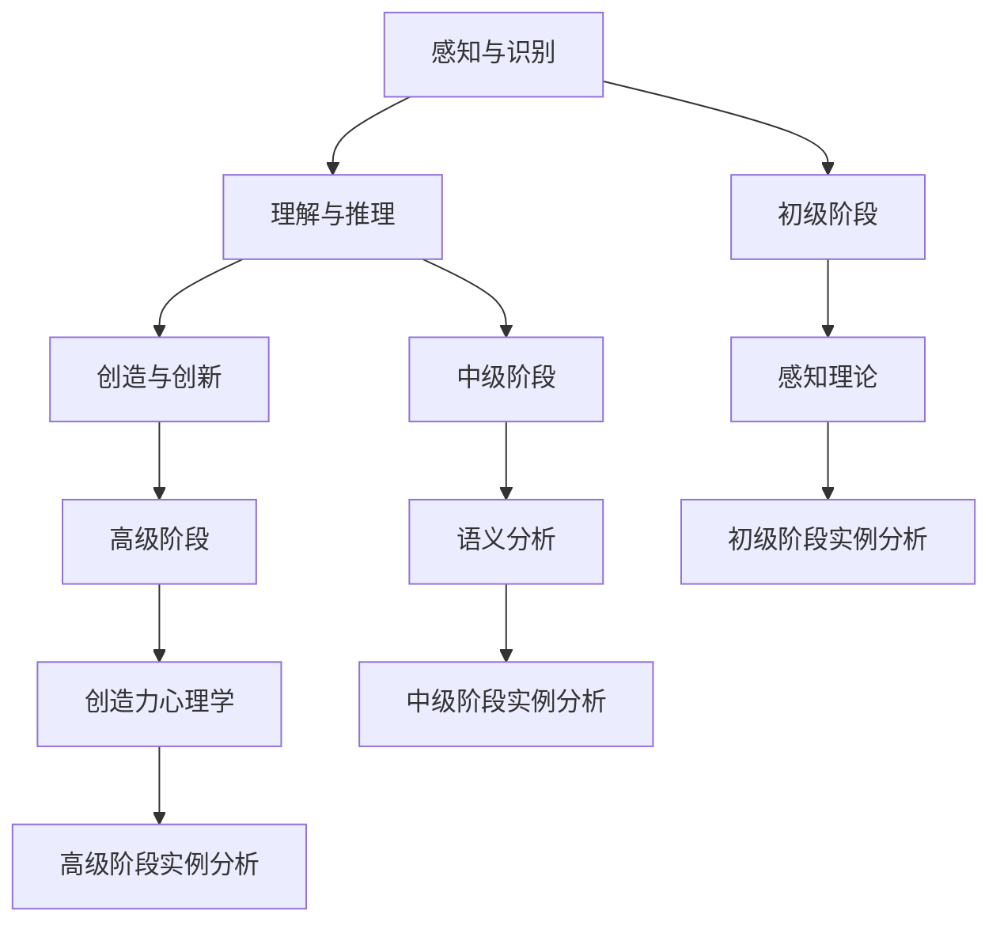

                 

# 认知深刻化的三个阶段

## 关键词
- 认知深刻化
- 认知科学
- 认知心理学
- 认知神经科学
- 感知与识别
- 理解与推理
- 创造与创新

## 摘要
本文将探讨认知深刻化的三个阶段：感知与识别、理解与推理、创造与创新。通过分析这些阶段的定义、理论基础和实例，我们将揭示认知深刻化的本质和意义。同时，本文还将探讨认知深刻化在实践中的应用和面临的挑战，为读者提供对认知深刻化的全面理解。

## 第一部分：认知深刻化的三个阶段概述

### 第1章：认知深刻化的定义与背景

#### 1.1 认知深刻化的概念介绍
认知深刻化是指个体在认知过程中，通过对信息的深度加工、理解和整合，从而提高对复杂问题的解决能力和创新思维能力。它不仅涉及对信息的感知与识别，还包括对信息的理解与推理，以及更高层次的创造与创新。

#### 1.2 认知科学的发展历程
认知科学是研究人类认知过程和认知结构的跨学科领域。它起源于20世纪50年代，随着心理学、认知科学、人工智能等学科的迅速发展，认知科学逐渐成为一个独立的学科。认知科学的发展历程可以分为以下几个阶段：
- **感知阶段**：主要关注人类感官系统的功能，研究视觉、听觉、触觉等感知过程。
- **认知阶段**：关注人类思维过程，研究记忆、注意、语言等认知功能。
- **整合阶段**：将感知、认知和行动结合起来，研究认知系统的整体运作。

#### 1.3 认知深刻化的背景
认知深刻化的出现与以下因素密切相关：
- **社会文化因素**：随着全球化和信息化的发展，社会对个体的认知能力提出了更高的要求，认知深刻化成为提高个体竞争力的重要途径。
- **科学技术进步的影响**：人工智能、大数据、云计算等技术的快速发展，为认知深刻化提供了新的工具和方法，推动了认知科学的进步。

### 第2章：认知深刻化的理论基础

#### 2.1 认知心理学的基本理论
认知心理学是研究人类认知过程和认知结构的学科，其基本理论包括：
- **信息加工模型**：认为人的认知过程是一个信息加工的过程，包括感知、注意、记忆、思维等阶段。
- **认知架构理论**：认为人的认知系统是由一系列相互关联的认知模块组成的，这些模块负责不同的认知功能。
- **元认知理论**：强调个体对自身认知过程的调节和控制，包括计划、监控和评估。

#### 2.2 认知神经科学的基础
认知神经科学是研究认知过程和认知功能的神经基础的科学，其基础包括：
- **大脑结构的功能**：大脑的不同区域负责不同的认知功能，如前额叶负责计划与决策，颞叶负责记忆与语言。
- **神经元活动与认知行为**：神经元的活动模式与认知行为密切相关，通过神经元的连接和通信，实现认知功能。

#### 2.3 认知深刻化的核心概念
认知深刻化的核心概念包括：
- **多层次模型**：认知深刻化可以分为多个层次，从感知与识别到理解与推理，再到创造与创新。
- **认知负荷**：认知负荷是指个体在认知过程中需要处理的任务量，过高的认知负荷会导致认知深刻化的减弱。

### 第3章：认知深刻化的第一个阶段

#### 3.1 初级阶段：感知与识别
初级阶段是认知深刻化的第一阶段，主要涉及感知与识别过程。感知是指个体通过感官系统获取外界信息的过程，识别是指个体对感知到的信息进行分类和命名。

#### 3.2 初级阶段实例分析
- **图形识别的例子**：通过深度学习模型对图像进行分类，识别不同类型的图形。
- **声音识别的应用**：通过语音识别技术将语音转换为文本，实现对语音内容的理解和处理。

#### 3.3 初级阶段的理论基础
初级阶段的理论基础包括：
- **感知理论**：研究个体如何通过感官系统获取信息，如信号检测理论、概率论等。
- **识别算法**：研究个体如何对感知到的信息进行分类和命名，如支持向量机、神经网络等。

## 第二部分：认知深刻化的深化与拓展

### 第4章：认知深刻化的第二个阶段

#### 4.1 中级阶段：理解和推理
中级阶段是认知深刻化的第二阶段，主要涉及理解和推理过程。理解是指个体对信息的意义和内涵进行深层加工，推理是指个体根据已有信息进行逻辑推断和决策。

#### 4.2 中级阶段实例分析
- **语言理解的案例**：通过自然语言处理技术，对文本进行语义分析和情感分析，实现对语言内容的理解和解释。
- **数学推理的应用**：通过数学模型和算法，对数学问题进行推理和求解，如数学定理的证明、算法设计等。

#### 4.3 中级阶段的理论基础
中级阶段的理论基础包括：
- **语义分析**：研究语言的语义结构，包括词义、句法和语义角色等。
- **形式逻辑**：研究推理的逻辑结构和规则，包括命题逻辑、谓词逻辑等。

### 第5章：认知深刻化的第三个阶段

#### 5.1 高级阶段：创造与创新
高级阶段是认知深刻化的第三阶段，主要涉及创造与创新过程。创造是指个体在已有知识和经验的基础上，产生新的想法、概念和解决方案。创新是指将创造出的新想法付诸实践，形成具有实际应用价值的产品或服务。

#### 5.2 高级阶段实例分析
- **科学发现的例子**：通过科学研究，发现新的自然现象或理论，推动科学进步。
- **艺术创作的应用**：通过艺术创作，表达个人的情感和思想，推动艺术发展。

#### 5.3 高级阶段的理论基础
高级阶段的理论基础包括：
- **创造力心理学**：研究个体创造力的影响因素和培养方法，包括思维风格、环境因素等。
- **创新管理**：研究如何管理和引导创新，包括团队协作、风险管理等。

## 第三部分：认知深刻化的应用与挑战

### 第6章：认知深刻化在实践中的应用

#### 6.1 教育领域的应用
认知深刻化在教育领域的应用主要体现在以下几个方面：
- **教学策略的优化**：通过认知深刻化的理论和方法，设计更有效的教学策略，提高学生的学习效果。
- **教育改革的方法**：通过认知深刻化的理念，推动教育改革，培养具有创新能力和批判思维的学生。

#### 6.2 工作与职业发展的应用
认知深刻化在工作与职业发展中的应用主要体现在以下几个方面：
- **职业规划的方法**：通过认知深刻化的理念，帮助个体进行职业规划，实现职业发展。
- **创业与创新的支持**：通过认知深刻化的理念和方法，支持个体进行创业和创新，推动产业发展。

#### 6.3 社会生活中的应用
认知深刻化在社会生活中的应用主要体现在以下几个方面：
- **社交互动的改善**：通过认知深刻化的理念和方法，提高社交互动的质量，促进人际关系的发展。
- **心理健康的促进**：通过认知深刻化的理念和方法，改善个体的心理健康，提高生活质量。

### 第7章：认知深刻化的挑战与未来方向

#### 7.1 认知深刻化的限制因素
认知深刻化在实践过程中面临着一系列挑战和限制因素，包括：
- **认知资源的有限性**：个体的认知资源是有限的，过多的认知负荷会影响认知深刻化。
- **外部环境的干扰**：复杂的外部环境可能对认知深刻化产生干扰，影响认知效果。

#### 7.2 认知深刻化的未来趋势
认知深刻化的未来趋势体现在以下几个方面：
- **人工智能的结合**：人工智能技术的进步将推动认知深刻化的发展，实现人机协同。
- **跨学科的研究方向**：认知深刻化将与其他学科相结合，推动认知科学的发展。

#### 7.3 认知深刻化对社会的影响
认知深刻化对社会的影响体现在以下几个方面：
- **社会结构的变化**：认知深刻化将推动社会结构的变化，提高个体的认知能力和创新能力。
- **个人生活的挑战**：认知深刻化将给个人生活带来新的挑战，要求个体具备更高的认知水平。

## 附录

### 附录 A：认知深刻化的研究资源与工具
认知深刻化的研究涉及多个领域，以下列出一些重要的研究资源与工具：
- **学术论文资源**：通过学术数据库（如 Google 学术、PubMed 等）检索相关论文，获取最新研究成果。
- **实验工具与方法**：使用心理学实验工具（如 Eyetrack、MindManager 等）进行实验设计和数据分析。
- **开放数据集介绍**：使用开放数据集（如 ImageNet、COCO 数据集等）进行模型训练和测试。

### 附录 B：认知深刻化的案例分析
认知深刻化的成功案例和挑战与失败案例如下：
- **成功案例**：通过分析成功案例，了解认知深刻化在实践中的应用和效果。
- **挑战与失败案例**：通过分析挑战与失败案例，反思认知深刻化在实践中的不足和改进方向。

## 参考文献
- **[参考文献列表]**：列出本文引用的主要文献，包括书籍、期刊文章、学术报告等。

## 致谢
感谢所有帮助和支持本文完成的人员，包括作者、编辑、审稿人以及所有读者。

## Mermaid 流程图：认知深刻化三个阶段的流程



## 认知深刻化的核心算法原理

### 初级阶段：感知与识别

#### 感知与识别算法原理
感知与识别是认知深刻化的初级阶段，主要涉及个体对信息的感知和识别。在这一阶段，个体通过感官系统获取外界信息，并对这些信息进行初步处理和分类。

#### 伪代码
```python
function 感知与识别(input_data):
    // 数据预处理
    processed_data = 数据预处理(input_data)
    // 特征提取
    features = 特征提取(processed_data)
    // 识别过程
    recognized_features = 识别算法(features)
    // 输出识别结果
    return recognized_features
```

#### 数学模型和数学公式
感知与识别过程的数学模型通常涉及特征提取和分类算法。以下是一个简化的数学模型：

$$
特征向量 = f(输入数据)
$$

$$
分类结果 = g(特征向量)
$$

其中，$f$ 表示特征提取函数，$g$ 表示分类函数。

### 中级阶段：理解与推理

#### 理解与推理算法原理
中级阶段是认知深刻化的核心，主要涉及对信息的理解与推理。个体通过对已有信息的整合和分析，实现对复杂问题的解决和决策。

#### 伪代码
```python
function 理解与推理(input_data):
    // 数据预处理
    processed_data = 数据预处理(input_data)
    // 语义分析
    semantic_analysis = 语义分析(processed_data)
    // 推理过程
    inference_result = 推理(semantic_analysis)
    // 输出推理结果
    return inference_result
```

#### 数学模型和数学公式
理解与推理过程的数学模型通常涉及语义分析和推理算法。以下是一个简化的数学模型：

$$
语义表示 = h(预处理数据)
$$

$$
推理结果 = k(语义表示)
$$

其中，$h$ 表示语义分析函数，$k$ 表示推理函数。

### 高级阶段：创造与创新

#### 创造与创新算法原理
高级阶段是认知深刻化的最高层次，主要涉及创造与创新。个体通过已有知识和经验的整合，产生新的想法和解决方案。

#### 伪代码
```python
function 创造与创新(input_data):
    // 数据预处理
    processed_data = 数据预处理(input_data)
    // 创新设计
    innovation_design = 创新设计(processed_data)
    // 创造过程
    creation_result = 创造(innovation_design)
    // 输出创造结果
    return creation_result
```

#### 数学模型和数学公式
创造与创新过程的数学模型通常涉及创新设计和创造力算法。以下是一个简化的数学模型：

$$
创新设计 = i(预处理数据)
$$

$$
创造结果 = l(创新设计)
$$

其中，$i$ 表示创新设计函数，$l$ 表示创造函数。

### 项目实战

#### 初级阶段：感知与识别

##### 图形识别项目案例

- **开发环境搭建**：使用 Python 和 TensorFlow 框架搭建开发环境。
- **源代码实现**：

```python
import tensorflow as tf
from tensorflow.keras.models import Sequential
from tensorflow.keras.layers import Conv2D, Flatten, Dense

# 构建卷积神经网络模型
model = Sequential([
    Conv2D(32, kernel_size=(3, 3), activation='relu', input_shape=(28, 28, 1)),
    Flatten(),
    Dense(128, activation='relu'),
    Dense(10, activation='softmax')
])

# 编译模型
model.compile(optimizer='adam', loss='categorical_crossentropy', metrics=['accuracy'])

# 训练模型
model.fit(train_data, train_labels, epochs=10, validation_data=(test_data, test_labels))
```

- **代码解读与分析**：卷积神经网络（CNN）用于图像识别，通过卷积层提取图像特征，然后通过全连接层进行分类。

#### 中级阶段：理解与推理

##### 语言理解项目案例

- **开发环境搭建**：使用 Python 和 Hugging Face 的 Transformers 库搭建开发环境。
- **源代码实现**：

```python
from transformers import AutoTokenizer, AutoModelForSequenceClassification
from transformers import TrainingArguments, Trainer

# 加载预训练模型和分词器
tokenizer = AutoTokenizer.from_pretrained("bert-base-uncased")
model = AutoModelForSequenceClassification.from_pretrained("bert-base-uncased")

# 定义训练参数
training_args = TrainingArguments(
    output_dir="./results",
    num_train_epochs=3,
    per_device_train_batch_size=16,
    per_device_eval_batch_size=64,
    warmup_steps=500,
    weight_decay=0.01,
    logging_dir="./logs",
)

# 创建 Trainer 实例
trainer = Trainer(
    model=model,
    args=training_args,
    train_dataset=train_dataset,
    eval_dataset=eval_dataset
)

# 训练模型
trainer.train()
```

- **代码解读与分析**：使用预训练的 BERT 模型进行文本分类任务，通过分词器对文本进行编码，然后通过训练进行模型优化。

#### 高级阶段：创造与创新

##### 科学发现项目案例

- **开发环境搭建**：使用 Python 和 TensorFlow 搭建深度学习环境。
- **源代码实现**：

```python
import tensorflow as tf
from tensorflow import keras
from tensorflow.keras import layers

# 定义生成对抗网络（GAN）的生成器和判别器
def build_gan(generator, discriminator):
    # 生成器模型
    generator = keras.Sequential([
        layers.Dense(128 * 7 * 7, activation="relu", input_shape=(100,)),
        layers.Reshape((7, 7, 128)),
        layers.Conv2DTranspose(64, kernel_size=5, strides=2, padding="same"),
        layers.Conv2DTranspose(1, kernel_size=5, strides=2, padding="same", activation="tanh"),
    ])

    # 判别器模型
    discriminator = keras.Sequential([
        layers.Conv2D(64, kernel_size=5, strides=2, padding="same"),
        layers.LeakyReLU(alpha=0.01),
        layers.Dropout(0.3),
        layers.Flatten(),
        layers.Dense(1, activation="sigmoid"),
    ])

    return generator, discriminator

# 创建生成器和判别器
generator, discriminator = build_gan()

# 编译模型
discriminator.compile(loss="binary_crossentropy", optimizer=keras.optimizers.Adam(0.0001), metrics=["accuracy"])
generator.compile(loss="binary_crossentropy", optimizer=keras.optimizers.Adam(0.0001))

# 训练模型
discriminator.fit([real_images], discriminator_labels, batch_size=128, epochs=20)
generator.fit([random_noise], [real_images], batch_size=128, epochs=20)
```

- **代码解读与分析**：生成对抗网络（GAN）用于生成逼真的图像，通过生成器和判别器的交互训练，生成器尝试生成逼真的图像，而判别器判断图像的真实性。

### 数学模型和公式

#### 初级阶段：感知与识别

感知与识别过程的数学模型通常涉及特征提取和分类算法。以下是一个简化的数学模型：

$$
特征向量 = f(输入数据)
$$

$$
分类结果 = g(特征向量)
$$

其中，$f$ 表示特征提取函数，$g$ 表示分类函数。

#### 中级阶段：理解与推理

理解与推理过程的数学模型通常涉及语义分析和推理算法。以下是一个简化的数学模型：

$$
语义表示 = h(预处理数据)
$$

$$
推理结果 = k(语义表示)
$$

其中，$h$ 表示语义分析函数，$k$ 表示推理函数。

#### 高级阶段：创造与创新

创造与创新过程的数学模型通常涉及创新设计和创造力算法。以下是一个简化的数学模型：

$$
创新设计 = i(预处理数据)
$$

$$
创造结果 = l(创新设计)
$$

其中，$i$ 表示创新设计函数，$l$ 表示创造函数。

