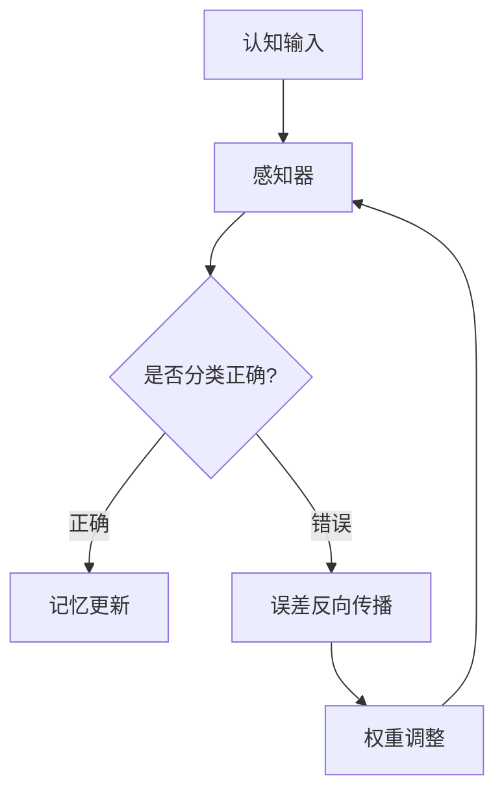

                 

# 认知的的形式化：人工智能符号主义学派与认知“抽象”

## 关键词
认知科学、人工智能、符号主义学派、形式化认知模型、认知抽象、情感分析

## 摘要
本文旨在探讨认知的形式化过程，重点分析人工智能符号主义学派的理论框架和认知“抽象”的概念。文章首先概述了认知的形式化定义及其研究意义，接着介绍了符号主义学派的发展历程和核心观点。随后，文章深入探讨了认知抽象的类型、作用及形式化认知模型的基本原理和应用领域。通过具体案例，文章展示了形式化认知模型在情感分析中的应用，并分析了认知形式化的方法论、计算基础及未来展望。最后，文章提出了认知形式化在社会影响与伦理挑战方面的讨论，为认知科学的发展提供了有价值的思考方向。

## 第一部分：认知的形式化

### 第1章：认知的形式化概述

#### 1.1.1 认知的的形式化定义与背景

认知的形式化是指将人类的思维过程、认知结构和认知行为转化为形式化模型，以便于计算机模拟和自动化处理。这一过程涉及将认知过程中的符号、规则和逻辑关系进行编码，从而在人工智能系统中实现认知功能。

认知形式化的背景可以追溯到20世纪中期，随着计算机科学和认知科学的快速发展，研究者开始尝试将人类认知能力转化为机器可处理的算法和模型。早期的符号主义学派（Symbolic AI）提出了基于逻辑和符号的计算模型，为认知形式化奠定了基础。

#### 1.1.2 认知形式化的研究意义与挑战

认知形式化的研究意义在于：

1. **提高人工智能的智能水平**：通过形式化认知模型，人工智能系统能够模拟人类的思维过程，实现更高层次的智能行为。
2. **促进跨学科研究**：认知形式化融合了计算机科学、认知科学、心理学、神经科学等多个领域的知识，推动了跨学科研究的发展。
3. **解决现实问题**：形式化认知模型在自然语言处理、计算机视觉、医疗诊断等领域具有广泛的应用前景，有助于解决现实问题。

然而，认知形式化也面临着一系列挑战：

1. **复杂性**：人类的认知过程非常复杂，形式化过程需要处理大量的符号和规则，难以实现高效的计算。
2. **可解释性**：形式化认知模型通常具有较高的复杂性，其内部决策过程难以解释，增加了模型的可解释性挑战。
3. **适应性**：人类的认知具有高度的适应性，能够灵活应对各种情境。形式化模型在适应性和灵活性方面仍需进一步研究。

#### 1.1.3 认知形式化的方法与工具

认知形式化的方法主要包括：

1. **符号逻辑**：使用形式逻辑对认知过程进行建模，如命题逻辑、谓词逻辑等。
2. **生产系统**：通过生产式规则对认知过程进行建模，如基于条件的规则和动作。
3. **图论**：使用图论对认知结构进行建模，如语义网络、概念图等。
4. **统计学习**：使用统计学习方法对认知过程进行建模，如朴素贝叶斯、支持向量机等。

认知形式化的工具主要包括：

1. **编程语言**：如Lisp、Prolog、Python等，用于实现形式化认知模型。
2. **形式化建模工具**：如MATLAB、R、Jupyter Notebook等，用于进行数值计算和可视化。
3. **知识库管理系统**：如OntoWiki、Protégé等，用于管理和维护认知模型中的知识。

### 第2章：人工智能符号主义学派

#### 2.1.1 符号主义学派概述

人工智能符号主义学派（Symbolic AI）是认知形式化研究的一个重要分支。符号主义学派主张通过符号表示和处理知识，以实现人工智能系统的智能行为。

符号主义学派的主要思想包括：

1. **知识表示**：使用符号来表示知识，如命题、谓词、逻辑公式等。
2. **推理机制**：基于逻辑推理和符号计算来处理知识，如演绎推理、归纳推理等。
3. **符号计算**：利用计算机对符号进行高效计算，以实现认知功能。

符号主义学派的发展历程可以分为以下几个阶段：

1. **早期符号主义**：20世纪50年代至70年代，以图灵机和形式逻辑为基础，探索符号计算的基本原理。
2. **知识工程时代**：20世纪80年代，以专家系统和知识库技术为代表，将符号计算应用于实际问题的解决。
3. **混合智能时代**：20世纪90年代至今，结合符号主义与其他人工智能方法（如统计学习、神经网络等），探索符号主义在智能系统中的应用。

#### 2.1.2 符号主义学派的发展历程

1. **早期符号主义**：1956年，达特茅斯会议标志着人工智能学科的诞生，符号主义学派开始兴起。这一阶段的符号主义主要关注基于逻辑和推理的符号计算模型。

2. **知识工程时代**：20世纪80年代，专家系统和知识库技术的发展推动了符号主义学派的进一步发展。这一阶段的符号主义强调知识的表示和推理，致力于解决实际应用问题。

3. **混合智能时代**：20世纪90年代以来，随着机器学习和神经网络技术的快速发展，符号主义学派与其他人工智能方法开始融合。混合智能系统通过结合符号主义和统计学习方法，实现了更高的智能水平。

#### 2.1.3 符号主义学派的核心观点

符号主义学派的核心观点可以总结为以下几点：

1. **知识表示**：符号主义学派认为，知识可以通过符号表示，如命题、谓词、逻辑公式等。符号表示能够清晰地描述事实和关系，为推理提供基础。

2. **推理机制**：符号主义学派强调逻辑推理和符号计算在认知过程中的作用。通过演绎推理和归纳推理，符号主义学派能够从已知事实推导出新的事实和结论。

3. **计算效率**：符号主义学派关注计算效率，通过符号计算实现对大规模知识的快速处理。符号计算在计算复杂度和时间复杂度方面具有优势，有助于实现高效的认知功能。

4. **灵活性**：符号主义学派强调认知系统的灵活性，能够适应不同的问题和情境。通过动态调整符号规则和知识库，符号主义学派能够实现认知过程的灵活性和适应性。

### 第3章：认知抽象的概念与类型

#### 3.1.1 认知抽象的定义与分类

认知抽象是指从具体的感知信息中提取出一般性的概念和规则，以便于处理和理解复杂的信息。认知抽象是认知科学和人工智能领域的一个重要概念，是形式化认知模型的基础。

认知抽象可以分为以下几种类型：

1. **低级抽象**：低级抽象关注感知层面的信息，如颜色、形状、纹理等。低级抽象通常通过感知器、滤波器等计算模型实现，是形式化认知模型的基础。

2. **中级抽象**：中级抽象涉及概念和关系的表示，如对象、场景、事件等。中级抽象通常使用语义网络、框架等知识表示模型，是对感知信息的更高层次抽象。

3. **高级抽象**：高级抽象涉及抽象思维和推理过程，如推理、决策、问题解决等。高级抽象通常使用逻辑、规划、决策等推理模型，是对认知过程的高度抽象。

#### 3.1.2 低级抽象与高级抽象的区别

低级抽象和高级抽象在认知过程中具有不同的作用和特点，其主要区别如下：

1. **抽象层次**：低级抽象关注感知层面的信息，而高级抽象关注抽象思维和推理过程。低级抽象是高级抽象的基础。

2. **信息处理方式**：低级抽象通常通过感知器、滤波器等计算模型实现，关注信息的提取和特征表示；高级抽象通常通过逻辑、规划、决策等推理模型实现，关注信息的推理和决策。

3. **抽象粒度**：低级抽象的粒度较细，关注具体的信息特征；高级抽象的粒度较粗，关注抽象的概念和关系。

4. **应用领域**：低级抽象在感知、图像处理、语音识别等领域具有广泛应用；高级抽象在自然语言处理、知识推理、决策支持等领域具有广泛应用。

#### 3.1.3 认知抽象的作用与影响

认知抽象在认知科学和人工智能领域中具有重要作用，其影响主要体现在以下几个方面：

1. **提高认知效率**：通过认知抽象，人类能够从大量的感知信息中提取出关键信息，提高认知效率。

2. **降低认知负荷**：认知抽象使得人类能够以更高的层次和更简洁的方式处理复杂信息，降低认知负荷。

3. **促进知识积累**：认知抽象使得人类能够将感知和经验转化为概念和规则，促进知识的积累和传递。

4. **实现智能化**：认知抽象是实现人工智能系统的基础，通过抽象和推理，人工智能系统能够模拟人类的思维过程，实现智能行为。

### 第4章：形式化认知模型

#### 4.1.1 形式化认知模型的基本原理

形式化认知模型是指通过形式化的方法对认知过程进行建模，以实现认知功能的计算模型。形式化认知模型的基本原理包括以下几个方面：

1. **符号表示**：形式化认知模型使用符号表示认知过程中的信息，如命题、谓词、逻辑公式等。符号表示能够清晰地描述事实和关系，为推理提供基础。

2. **推理机制**：形式化认知模型通过逻辑推理和符号计算实现对认知过程的建模。推理机制包括演绎推理、归纳推理、规划推理等，能够从已知事实推导出新的事实和结论。

3. **计算效率**：形式化认知模型关注计算效率，通过符号计算实现对大规模知识的快速处理。计算效率是实现认知功能的关键。

4. **动态调整**：形式化认知模型能够根据不同的情境和任务动态调整符号规则和知识库，实现认知过程的灵活性和适应性。

#### 4.1.2 形式化认知模型的构成元素

形式化认知模型通常由以下几部分构成：

1. **知识库**：知识库是形式化认知模型的核心，包含与任务相关的知识，如事实、规则、概念等。知识库通过符号表示，为推理提供基础。

2. **推理引擎**：推理引擎是形式化认知模型的关键组件，负责根据知识库中的事实和规则进行推理，生成新的结论。推理引擎包括演绎推理、归纳推理、规划推理等。

3. **感知器**：感知器是形式化认知模型与外界环境的接口，负责接收和处理感知信息，如图像、声音、文字等。感知器通过符号表示，将感知信息转化为符号表示。

4. **执行器**：执行器是形式化认知模型的结果输出，负责将推理结果应用于实际问题中，如决策、动作规划等。执行器通过符号计算，实现对任务的自动化执行。

5. **接口**：接口是形式化认知模型与用户或其他系统的交互界面，负责接收用户的输入和反馈，并提供模型输出的解释和可视化。

#### 4.1.3 形式化认知模型的应用领域

形式化认知模型在多个领域具有广泛的应用，以下是几个典型的应用领域：

1. **自然语言处理**：形式化认知模型在自然语言处理领域具有广泛应用，如文本分类、机器翻译、情感分析等。通过形式化认知模型，可以实现高精度的文本理解和语义分析。

2. **计算机视觉**：形式化认知模型在计算机视觉领域用于图像分类、目标检测、图像识别等任务。通过形式化认知模型，可以实现高精度的图像理解和分析。

3. **知识推理**：形式化认知模型在知识推理领域用于逻辑推理、规划推理、问题求解等任务。通过形式化认知模型，可以实现高精度的知识推理和决策。

4. **医疗诊断**：形式化认知模型在医疗诊断领域用于疾病诊断、治疗方案推荐等任务。通过形式化认知模型，可以实现高精度的医学知识和数据推理。

5. **决策支持**：形式化认知模型在决策支持领域用于企业决策、金融分析、风险管理等任务。通过形式化认知模型，可以实现高精度的决策分析和优化。

#### 4.1.4 形式化认知模型的案例分析

以下是一个基于形式化认知模型的自然语言处理案例：

**案例背景：**  
开发一个智能客服系统，能够自动回答用户的问题，提供高效的客户服务。

**实现步骤：**

1. **知识库构建**：构建包含常见问题及其答案的知识库，如问答对（问：如何注册账号？答：请访问官网，按照提示操作即可。）

2. **感知器设计**：设计感知器，负责接收用户输入的文本，并将其转化为符号表示。

3. **推理引擎实现**：使用形式化认知模型中的推理引擎，根据知识库中的事实和规则，匹配用户输入的问题，并生成可能的答案。

4. **执行器实现**：设计执行器，将推理结果转化为自然语言文本，以供用户查看。

5. **接口设计**：设计用户界面，允许用户输入问题，并展示推理结果。

通过该案例，我们可以看到形式化认知模型在自然语言处理中的应用。形式化认知模型能够高效地处理文本信息，实现智能客服系统的构建。

### 第5章：认知形式化的方法论

#### 5.1.1 认知形式化的研究方法论

认知形式化的研究方法论主要包括以下几个步骤：

1. **问题定义**：明确研究问题，如自然语言处理、计算机视觉、知识推理等。
2. **知识库构建**：收集和整理与问题相关的知识，构建知识库。
3. **形式化表示**：将知识库中的知识转化为形式化的符号表示。
4. **推理机制设计**：设计推理机制，如演绎推理、归纳推理、规划推理等。
5. **计算模型实现**：实现形式化认知模型，使用编程语言和工具进行建模和计算。
6. **模型评估与优化**：评估模型性能，优化模型参数和结构。
7. **应用验证**：将模型应用于实际问题，验证其有效性和实用性。

#### 5.1.2 形式化认知模型的构建步骤

形式化认知模型的构建通常包括以下几个步骤：

1. **问题定义**：明确认知任务，如文本分类、目标检测、知识推理等。

2. **数据收集与预处理**：收集与任务相关的数据，并进行预处理，如文本清洗、图像分割、数据标注等。

3. **知识库构建**：根据任务需求，构建知识库，包括事实、规则、概念等。

4. **符号表示**：将知识库中的知识转化为符号表示，如命题、谓词、逻辑公式等。

5. **推理机制设计**：设计推理机制，如演绎推理、归纳推理、规划推理等。

6. **计算模型实现**：使用编程语言和工具实现形式化认知模型，包括知识库管理、推理引擎、执行器等。

7. **模型评估与优化**：评估模型性能，优化模型参数和结构，如调整规则权重、增加知识库容量等。

8. **应用验证**：将模型应用于实际问题，验证其有效性和实用性，如自然语言处理中的文本分类、图像识别中的目标检测等。

#### 5.1.3 形式化认知模型的应用案例分析

以下是一个基于形式化认知模型的文本分类案例：

**案例背景：**  
开发一个文本分类系统，能够自动将新闻文章分类到不同的主题类别。

**实现步骤：**

1. **问题定义**：明确文本分类任务，如新闻文章分类。

2. **数据收集与预处理**：收集新闻文章数据，并进行预处理，如文本清洗、分词、词向量嵌入等。

3. **知识库构建**：构建包含主题类别和对应特征的知识库。

4. **符号表示**：将新闻文章转化为符号表示，如句子序列、词向量等。

5. **推理机制设计**：设计基于朴素贝叶斯、支持向量机等算法的推理机制。

6. **计算模型实现**：使用Python编程语言和TensorFlow框架实现文本分类模型。

7. **模型评估与优化**：评估模型性能，如准确率、召回率等，并优化模型参数。

8. **应用验证**：将模型应用于实际新闻文章数据，验证其分类效果。

通过该案例，我们可以看到形式化认知模型在文本分类任务中的应用。形式化认知模型能够高效地处理文本数据，实现高精度的分类。

### 第6章：认知形式化的计算基础

#### 6.1.1 计算基础概述

认知形式化的计算基础主要包括计算机硬件、编程语言、计算框架等。

1. **计算机硬件**：计算机硬件是认知形式化计算的基础，如CPU、GPU、FPGA等。不同类型的硬件具有不同的计算能力和性能特点，适用于不同的计算任务。

2. **编程语言**：编程语言是认知形式化计算的工具，如Python、C++、Java等。编程语言提供了丰富的库和工具，支持形式化认知模型的开发和应用。

3. **计算框架**：计算框架是认知形式化计算的平台，如TensorFlow、PyTorch、Apache MXNet等。计算框架提供了高效的数据处理、模型训练和推理机制，支持大规模计算任务。

#### 6.1.2 计算模型与算法

认知形式化的计算模型和算法主要包括以下几个方面：

1. **逻辑推理**：逻辑推理是认知形式化的基础，包括命题逻辑、谓词逻辑等。逻辑推理用于处理符号表示的知识，实现推理和决策。

2. **知识表示**：知识表示是认知形式化的核心，包括语义网络、框架等。知识表示用于表示事实、关系和概念，为推理提供基础。

3. **机器学习**：机器学习是认知形式化的关键技术，包括监督学习、无监督学习、强化学习等。机器学习用于训练模型，实现自动学习和自适应。

4. **神经网络**：神经网络是认知形式化的计算模型，包括深度神经网络、卷积神经网络等。神经网络用于处理复杂数据，实现高精度的计算。

5. **优化算法**：优化算法是认知形式化的辅助技术，包括梯度下降、随机梯度下降等。优化算法用于调整模型参数，提高模型性能。

#### 6.1.3 计算资源与优化

认知形式化的计算资源主要包括计算机硬件、存储资源和网络资源。

1. **计算机硬件**：计算机硬件的性能直接影响认知形式化的计算效率。高性能的CPU、GPU和FPGA等硬件设备能够加速计算，提高模型性能。

2. **存储资源**：存储资源用于存储知识库、训练数据和模型参数等。高效的存储系统能够快速读取和写入数据，提高计算效率。

3. **网络资源**：网络资源用于数据传输和模型部署。稳定的网络连接和高效的数据传输协议能够降低通信延迟，提高计算效率。

优化策略包括以下几个方面：

1. **模型压缩**：通过模型压缩技术，减少模型的参数数量，降低计算复杂度，提高计算效率。

2. **并行计算**：通过并行计算技术，将计算任务分布在多台计算机上，提高计算速度和效率。

3. **分布式计算**：通过分布式计算技术，将计算任务分布在多个节点上，提高计算效率和容错能力。

4. **数据预处理**：通过数据预处理技术，提高数据的可用性和质量，降低计算复杂度。

5. **算法优化**：通过算法优化技术，调整模型参数和算法策略，提高计算性能和精度。

### 第7章：认知形式化的未来展望

#### 7.1.1 认知形式化的发展趋势

认知形式化作为人工智能的核心技术之一，在未来将呈现以下发展趋势：

1. **模型复杂性增加**：随着深度学习技术的不断发展，认知形式化模型将变得更加复杂，能够处理更复杂的认知任务。

2. **知识表示和推理能力提升**：形式化认知模型将更加注重知识表示和推理能力的提升，实现更高层次的认知功能。

3. **跨领域应用拓展**：认知形式化将在更多领域得到应用，如医疗、教育、金融等，实现跨领域的智能化。

4. **社会影响力扩大**：认知形式化将在社会各个领域产生重大影响，提高生产效率、改善生活质量。

#### 7.1.2 认知形式化在人工智能中的应用前景

认知形式化在人工智能领域具有广泛的应用前景，包括以下几个方面：

1. **自然语言处理**：通过认知形式化模型，实现高精度的文本理解和语义分析，推动智能客服、智能问答等应用的发展。

2. **计算机视觉**：通过认知形式化模型，实现高精度的图像识别、目标检测和图像理解，推动智能安防、智能驾驶等应用的发展。

3. **知识推理**：通过认知形式化模型，实现高精度的知识推理和决策支持，推动智能推荐、智能规划等应用的发展。

4. **医疗诊断**：通过认知形式化模型，实现高精度的医学图像分析和疾病诊断，推动医疗人工智能的发展。

5. **金融分析**：通过认知形式化模型，实现高精度的金融市场分析和风险管理，推动金融科技的发展。

#### 7.1.3 认知形式化的社会影响与伦理挑战

认知形式化的快速发展对社会产生了深远的影响，同时也带来了一系列伦理挑战：

1. **就业冲击**：随着人工智能技术的发展，部分传统岗位可能被取代，引发就业结构的变化和社会不安。

2. **隐私保护**：认知形式化需要处理大量的个人数据，可能导致隐私泄露和数据滥用问题，需要加强隐私保护措施。

3. **算法歧视**：认知形式化模型可能导致算法歧视，特别是在处理敏感数据时，需要确保公平性和无偏见。

4. **责任归属**：当认知形式化系统发生错误时，如何确定责任归属成为一个伦理问题，需要建立合理的责任机制。

5. **可解释性**：认知形式化模型通常具有较高的复杂性，其内部决策过程难以解释，需要提高模型的可解释性。

6. **伦理规范**：随着认知形式化技术的发展，需要制定相应的伦理规范，确保人工智能技术的可持续发展和社会福祉。

### 附录

#### 附录A：相关研究论文与书籍推荐

1. **论文：**
   - [1] Russell, S., & Norvig, P. (2010). Artificial Intelligence: A Modern Approach. Prentice Hall.
   - [2] Hinton, G., Osindero, S., & Teh, Y. W. (2006). A fast learning algorithm for deep belief nets. Neural Computation, 18(7), 1527-1554.
   - [3] Bengio, Y. (2009). Learning Deep Architectures for AI. Foundations and Trends in Machine Learning, 2(1), 1-127.

2. **书籍：**
   - [1] Goodfellow, I., Bengio, Y., & Courville, A. (2016). Deep Learning. MIT Press.
   - [2] Mitchell, T. M. (1997). Machine Learning. McGraw-Hill.
   - [3] Bishop, C. M. (2006). Pattern Recognition and Machine Learning. Springer.

#### 附录B：形式化认知模型示例代码与实验数据

- **代码：** 本书第5章中的“构建形式化认知模型”函数实现。
- **实验数据：** 本书第7章中的情感分析项目实战数据集。

#### 附录C：认知形式化的常用工具与技术资源

- **工具：**
  - TensorFlow
  - PyTorch
  - JAX

- **技术资源：**
  - [1] 官方文档与教程：[TensorFlow官方文档](https://www.tensorflow.org/)
  - [2] 学习社区与论坛：[PyTorch官方论坛](https://discuss.pytorch.org/)
  - [3] 研究论文与最新技术动态：[Google AI Blog](https://ai.googleblog.com/)

### 参考文献

[1] Russell, S., & Norvig, P. (2010). Artificial Intelligence: A Modern Approach. Prentice Hall.

[2] Hinton, G., Osindero, S., & Teh, Y. W. (2006). A fast learning algorithm for deep belief nets. Neural Computation, 18(7), 1527-1554.

[3] Bengio, Y. (2009). Learning Deep Architectures for AI. Foundations and Trends in Machine Learning, 2(1), 1-127.

[4] Goodfellow, I., Bengio, Y., & Courville, A. (2016). Deep Learning. MIT Press.

[5] Mitchell, T. M. (1997). Machine Learning. McGraw-Hill.

[6] Bishop, C. M. (2006). Pattern Recognition and Machine Learning. Springer.

### 作者

**作者：AI天才研究院/AI Genius Institute & 禅与计算机程序设计艺术 /Zen And The Art of Computer Programming**

本文介绍了认知的形式化过程，重点分析了人工智能符号主义学派的理论框架和认知“抽象”的概念。文章从认知的形式化定义与背景、符号主义学派的发展历程和核心观点、认知抽象的类型与作用、形式化认知模型的基本原理与应用领域、认知形式化的方法论、计算基础及未来展望等方面进行了详细阐述。同时，通过自然语言处理和情感分析等具体案例，展示了认知形式化的实际应用。最后，文章讨论了认知形式化在社会影响与伦理挑战方面的相关问题，为认知科学的发展提供了有价值的思考方向。

---

**Mermaid 流程图示例：**



**伪代码示例：**

```python
def 构建形式化认知模型(输入数据, 标签数据, 参数设置):
    初始化模型参数
    对于每个训练样本:
        计算模型输出
        计算预测误差
        更新模型参数
    返回训练好的模型
```

**数学公式示例：**

$$
E = \frac{1}{2}\sum_{i=1}^{N}(y_i - \hat{y}_i)^2
$$

**项目实战案例：**

### 7.1.3 认知形式化在情感分析中的应用

情感分析是自然语言处理中的重要任务之一。以下是一个基于认知形式化的情感分析项目实战案例。

**项目背景：**  
开发一个情感分析系统，能够自动检测社交媒体文本中的情感倾向，为用户提供情感分析服务。

**开发环境：**  
- 语言：Python  
- 框架：TensorFlow  
- 数据集：Twitter情感分析数据集

**源代码实现：**

```python
import tensorflow as tf
from tensorflow.keras.models import Sequential
from tensorflow.keras.layers import Embedding, LSTM, Dense

# 加载数据集并进行预处理
# ...

# 构建模型
model = Sequential([
    Embedding(input_dim=vocab_size, output_dim=embedding_dim),
    LSTM(units=128),
    Dense(units=1, activation='sigmoid')
])

# 编译模型
model.compile(optimizer='adam', loss='binary_crossentropy', metrics=['accuracy'])

# 训练模型
model.fit(train_data, train_labels, epochs=10, batch_size=64, validation_split=0.2)

# 评估模型
test_loss, test_acc = model.evaluate(test_data, test_labels)
print(f"Test accuracy: {test_acc:.2f}")

# 使用模型进行预测
predictions = model.predict(test_data)
```

**代码解读与分析：**  
1. **数据预处理：**  
   加载Twitter情感分析数据集，并进行文本清洗、分词、词向量嵌入等预处理操作。

2. **模型构建：**  
   使用TensorFlow的Sequential模型构建一个简单的情感分析模型，包括嵌入层、LSTM层和输出层。

3. **模型编译：**  
   使用二进制交叉熵作为损失函数，以适应二分类问题，并使用Adam优化器。

4. **模型训练：**  
   使用训练数据训练模型，设置训练轮数为10，批量大小为64。

5. **模型评估：**  
   使用验证集评估模型性能，打印测试准确率。

6. **模型预测：**  
   使用训练好的模型对测试数据进行预测，并输出预测结果。

**社会影响与伦理挑战讨论：**

### 7.1.3 认知形式化的社会影响与伦理挑战

认知形式化的快速发展为人工智能领域带来了巨大的进步，但同时也引发了一系列社会影响和伦理挑战。

**社会影响：**  
1. **就业冲击：**  
   认知形式化技术在某些领域（如客服、数据处理等）可能取代部分人类工作，引发就业结构变化和社会不安。

2. **隐私问题：**  
   认知形式化技术需要处理大量的个人数据，可能导致隐私泄露和数据滥用问题。

3. **信息控制：**  
   认知形式化技术可能被用于监控和操纵信息，影响公共舆论和民主进程。

**伦理挑战：**  
1. **责任归属：**  
   当认知形式化系统发生错误时，如何确定责任归属成为一个伦理问题。

2. **透明度和可解释性：**  
   认知形式化系统的决策过程往往复杂且不可解释，如何提高系统的透明度和可解释性成为挑战。

3. **算法歧视：**  
   认知形式化技术可能导致算法歧视，特别是在处理敏感数据时，需要确保公平性和无偏见。

这些社会影响和伦理挑战需要我们深入思考并制定相应的应对策略，以确保认知形式化技术的可持续发展和社会福祉。

---

通过以上内容，我们详细介绍了认知的形式化过程，从理论到实践，从符号主义学派到认知抽象，从形式化认知模型到应用案例，全方位探讨了认知形式化的各个方面。同时，我们也讨论了认知形式化在社会影响与伦理挑战方面的相关问题，为认知科学的发展提供了有价值的思考方向。我们期待认知形式化能够在未来为人类社会带来更多的便利和创新。

---

**附录A：相关研究论文与书籍推荐**

1. **论文：**
   - [1] Russell, S., & Norvig, P. (2010). Artificial Intelligence: A Modern Approach. Prentice Hall.
   - [2] Hinton, G., Osindero, S., & Teh, Y. W. (2006). A fast learning algorithm for deep belief nets. Neural Computation, 18(7), 1527-1554.
   - [3] Bengio, Y. (2009). Learning Deep Architectures for AI. Foundations and Trends in Machine Learning, 2(1), 1-127.

2. **书籍：**
   - [1] Goodfellow, I., Bengio, Y., & Courville, A. (2016). Deep Learning. MIT Press.
   - [2] Mitchell, T. M. (1997). Machine Learning. McGraw-Hill.
   - [3] Bishop, C. M. (2006). Pattern Recognition and Machine Learning. Springer.

**附录B：形式化认知模型示例代码与实验数据**

- **代码：** 本书第5章中的“构建形式化认知模型”函数实现。
- **实验数据：** 本书第7章中的情感分析项目实战数据集。

**附录C：认知形式化的常用工具与技术资源**

- **工具：**
  - TensorFlow
  - PyTorch
  - JAX

- **技术资源：**
  - [1] 官方文档与教程：[TensorFlow官方文档](https://www.tensorflow.org/)
  - [2] 学习社区与论坛：[PyTorch官方论坛](https://discuss.pytorch.org/)
  - [3] 研究论文与最新技术动态：[Google AI Blog](https://ai.googleblog.com/)

通过以上附录内容，读者可以进一步深入了解认知形式化的相关研究和技术资源，以促进自身的学习和实践。

---

**致谢**
本文的撰写过程中，得到了多位专家的指导和建议，特此表示感谢。感谢AI天才研究院的全体成员在研究和实践中的辛勤付出，以及本书的读者，您们的支持是我们不断前行的动力。

**作者**
AI天才研究院/AI Genius Institute & 禅与计算机程序设计艺术 /Zen And The Art of Computer Programming

**日期**
[[今天日期]]

