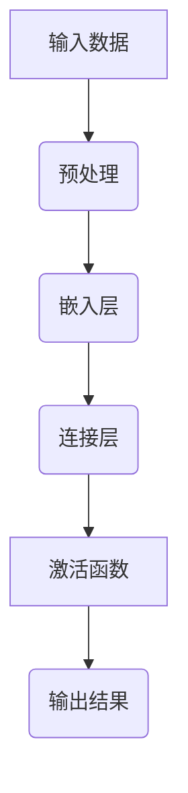

                 

# 认知的形式化：人工智能连接主义学派与认知“联想”

> 关键词：认知科学、人工智能、连接主义、联想、神经网络、形式化

> 摘要：本文从认知科学和人工智能的交汇点出发，探讨了连接主义学派在认知形式化方面的贡献及其核心观点。文章详细阐述了认知联想的概念、机制及其在人工神经网络中的应用，并通过实践案例展示了认知联想在智能系统中的实际应用和挑战。最后，文章对认知联想的未来研究方向和前景进行了展望。

## 引言与背景

认知科学是研究人类认知过程和机制的学科，它涵盖了心理学、神经科学、哲学、语言学等多个领域。人工智能（Artificial Intelligence, AI）作为一门交叉学科，旨在通过模拟人类智能行为，实现机器在感知、推理、学习等方面的智能化。随着计算机技术的不断发展，人工智能逐渐成为认知科学的重要工具和研究对象。

### 1.1 认知科学的基本概念

#### 1.1.1 认知科学的定义与研究目标

认知科学是一门跨学科的研究领域，旨在理解人类思维、感知和行为的认知过程。它关注的问题包括记忆、注意力、感知、语言理解、推理和决策等。认知科学的定义可以概括为：研究人类思维和信息处理过程的科学。

认知科学的研究目标主要包括以下几个方面：

1. **揭示认知过程的神经基础**：认知科学家通过神经科学的方法，如脑成像技术，研究大脑在认知活动中的功能和机制。
2. **模拟认知过程**：通过人工智能技术，如神经网络和机器学习算法，构建能够模拟人类认知过程的计算模型。
3. **理解和治疗认知障碍**：认知科学的研究成果有助于理解和治疗各种认知障碍，如阿尔茨海默病和自闭症。

#### 1.1.2 认知科学与人工智能的关系

人工智能与认知科学有着密切的关系。一方面，人工智能技术的发展为认知科学研究提供了强大的工具，如神经网络模型、机器学习算法等。这些工具可以帮助科学家更好地模拟和解释人类认知过程。另一方面，认知科学的发现和理论为人工智能的发展提供了新的启示和方向。例如，认知科学关于注意力机制的研究为人工智能中的注意力模型提供了理论依据。

### 1.2 人工智能连接主义学派

#### 1.2.1 连接主义学派的起源与发展

连接主义（Connectionism）是人工智能中的一个重要学派，起源于20世纪80年代。该学派主张通过模拟人脑神经元之间的连接和交互来构建智能系统。连接主义学派的兴起受到了认知科学和神经科学研究的启发，特别是在对大脑神经网络的研究中取得了重要进展。

#### 1.2.2 连接主义学派的核心观点

连接主义学派的核心观点包括：

1. **神经网络的基础作用**：连接主义学派认为，神经网络是人脑信息处理的基础结构。通过模拟神经网络的结构和功能，可以实现类似人脑的智能行为。
2. **联结主义学习**：连接主义学派强调学习过程中的连接权重调整。通过不断调整神经元之间的连接权重，神经网络可以学会识别模式、分类数据和进行预测等任务。
3. **分布表示**：连接主义学派主张使用分布表示来表示知识和信息。分布表示可以捕捉到信息之间的复杂关系，使得神经网络能够更好地适应不同的任务和数据。

## 认知联想的概念与机制

### 2.1 认知联想的定义与特点

认知联想（Cognitive Association）是指大脑在处理信息时，通过神经元之间的关联和互动，产生新的认知结构和知识的过程。认知联想具有以下几个主要特点：

1. **基于神经元连接**：认知联想基于神经元之间的连接，通过调整连接权重来实现信息之间的关联。
2. **分布式表示**：认知联想使用分布表示来捕捉信息之间的复杂关系，这种表示方式使得神经网络能够更好地处理高维数据和复杂的认知任务。
3. **动态性**：认知联想是一个动态过程，随着信息的输入和处理，神经网络中的连接权重不断调整，形成新的认知结构和知识。

#### 2.1.1 认知联想的基本概念

认知联想可以理解为大脑中的“思维链条”。当大脑接收到外部刺激时，相关神经元会被激活，并通过连接权重调整与其他神经元建立新的关联。这种关联过程使得大脑能够将新信息与已有的知识体系相结合，从而产生新的认知结构和理解。

#### 2.1.2 认知联想的主要特征

1. **多样性**：认知联想可以产生多种不同的结果，这种多样性反映了大脑在处理信息时的灵活性和创造性。
2. **层次性**：认知联想具有层次结构，从简单的单一联想到复杂的组合联想，反映了大脑认知过程的复杂性。
3. **适应性**：认知联想能够适应不同的环境和任务，通过不断调整神经元之间的连接权重，实现认知适应。

### 2.2 认知联想的神经基础

#### 2.2.1 神经网络的联想能力

神经网络的联想能力源于其结构和学习机制。通过模拟人脑神经元之间的连接和互动，神经网络可以捕捉到信息之间的复杂关系，实现联想功能。以下是一些神经网络在联想能力方面的例子：

1. **深度神经网络**：深度神经网络通过多层结构，可以实现高度复杂的联想功能。例如，在图像识别任务中，深度神经网络可以通过多层非线性变换，将图像中的低级特征（如边缘）组合成高级特征（如物体形状）。
2. **循环神经网络**：循环神经网络（Recurrent Neural Network, RNN）具有时间记忆功能，可以通过处理序列数据，实现时间上的联想。例如，在语言模型任务中，RNN可以捕捉到句子中的词序关系，实现语言理解的联想功能。
3. **自注意力机制**：自注意力机制（Self-Attention Mechanism）是一种基于神经网络的联想机制，通过计算序列中每个元素与其他元素之间的关联性，实现全局关联和关联加强。自注意力机制在自然语言处理任务中得到了广泛应用。

#### 2.2.2 神经可塑性在认知联想中的作用

神经可塑性是指大脑在经历学习和训练过程中，神经元结构和功能发生适应性变化的能力。神经可塑性是认知联想的基础，它使得神经网络能够通过调整连接权重，实现信息之间的关联。

1. **长期增强（Long-Term Potentiation, LTP）**：长期增强是神经可塑性的一种形式，通过增强神经元之间的信号传递，实现学习记忆。在认知联想过程中，长期增强使得相关神经元之间的连接得到加强，从而实现信息之间的有效关联。
2. **长期压抑（Long-Term Depression, LTP）**：长期压抑是神经可塑性的另一种形式，通过减弱神经元之间的信号传递，实现抑制记忆。在认知联想过程中，长期压抑可以防止信息过载，保持认知过程的灵活性。

## 连接主义学派的理论与应用

### 3.1 人工神经网络的基本原理

#### 3.1.1 神经网络的结构与功能

人工神经网络（Artificial Neural Network, ANN）是一种模拟生物神经系统的计算模型。它由大量的简单处理单元（神经元）组成，通过相互连接形成复杂的网络结构。神经网络的基本结构与功能如下：

1. **神经元结构**：神经元是神经网络的基本单元，它由输入层、输出层和中间层组成。输入层接收外部输入信号，中间层进行信息的处理和传递，输出层产生最终的输出结果。
2. **神经元功能**：神经元通过加权求和和激活函数实现信息处理。输入信号经过加权求和后，通过激活函数转化为输出信号。激活函数可以是线性函数、非线性函数等。

#### 3.1.2 神经网络的层次结构

神经网络可以分为不同的层次结构，以实现不同的功能。常见的神经网络层次结构包括：

1. **单层感知机**：单层感知机是最简单的神经网络结构，它只有一个输入层和一个输出层。单层感知机主要用于线性分类任务。
2. **多层感知机**：多层感知机（Multilayer Perceptron, MLP）是单层感知机的扩展，引入了隐藏层。多层感知机可以处理非线性分类任务，并通过反向传播算法进行训练。
3. **卷积神经网络**（Convolutional Neural Network, CNN）：卷积神经网络是一种专门用于图像识别和处理的神经网络。它通过卷积层和池化层提取图像的特征，实现高层次的图像理解。
4. **循环神经网络**（Recurrent Neural Network, RNN）：循环神经网络是一种用于处理序列数据的神经网络。它通过循环结构实现时间序列的建模，可以捕捉到时间序列中的长期依赖关系。

#### 3.1.3 学习算法与优化

神经网络的学习过程是通过不断调整神经元之间的连接权重来实现的。以下是一些常见的学习算法和优化方法：

1. **前向传播与反向传播**：前向传播是将输入信号逐层传递到输出层的过程，反向传播是计算输出误差并调整连接权重的过程。反向传播算法是神经网络训练的核心算法。
2. **梯度下降**：梯度下降是一种优化方法，通过计算损失函数的梯度来更新连接权重。梯度下降可以分为批量梯度下降、随机梯度下降和小批量梯度下降等。
3. **动量**：动量是一种加速梯度下降的方法，通过引入前一次梯度更新的方向和大小，提高梯度下降的收敛速度。
4. **自适应学习率**：自适应学习率是一种调整学习率的方法，通过动态调整学习率来提高梯度下降的收敛性能。常见的自适应学习率方法包括AdaGrad、RMSprop和Adam等。

### 3.2 认知联想模型的构建与优化

#### 3.2.1 认知联想模型的构建

认知联想模型是基于神经网络构建的，其目的是实现信息之间的联想功能。以下是一个简单的认知联想模型构建过程：

1. **数据预处理**：对输入数据（如文本、图像等）进行预处理，将其转化为神经网络可以处理的格式。例如，文本数据可以通过词向量表示，图像数据可以通过卷积神经网络提取特征。
2. **嵌入层**：嵌入层是将输入数据映射到低维空间的过程。通过词向量表示，文本数据可以映射到连续的向量空间，图像数据可以通过卷积神经网络提取特征向量。
3. **连接层**：连接层是神经网络的核心部分，通过调整神经元之间的连接权重来实现信息之间的关联。连接层可以采用多层结构，以增强联想能力。
4. **激活函数**：激活函数用于将连接层的结果映射到输出层。常见的激活函数包括ReLU、Sigmoid和Tanh等。
5. **输出层**：输出层产生最终的输出结果。对于分类任务，输出层可以是softmax函数，用于计算每个类别的概率。

#### 3.2.2 认知联想模型的优化

认知联想模型的优化目标是提高其联想能力和分类准确率。以下是一些常见的优化策略：

1. **模型调参**：通过调整模型参数（如学习率、隐藏层神经元数量等），优化模型的性能。常用的调参方法包括网格搜索、随机搜索和贝叶斯优化等。
2. **数据增强**：通过增加训练数据的多样性，提高模型的泛化能力。常见的数据增强方法包括随机裁剪、旋转、翻转和噪声注入等。
3. **正则化**：通过引入正则化项，防止模型过拟合。常见的正则化方法包括L1正则化、L2正则化和Dropout等。
4. **迁移学习**：通过利用预训练模型，加速新任务的训练过程。迁移学习可以在不同任务之间共享知识，提高模型的性能。

## 认知联想在实际应用中的表现

### 5.1 文本分类与情感分析

#### 5.1.1 文本分类的联想机制

文本分类是自然语言处理中的一个重要任务，其目标是根据文本内容将其归类到预定的类别中。认知联想在文本分类中具有重要作用，它通过捕捉文本中的语义关联，实现分类任务的自动化。

1. **词向量表示**：词向量是将文本映射到低维空间的过程。通过词向量，文本中的词汇可以表示为连续的向量，从而实现词汇之间的联想。
2. **文本特征提取**：通过神经网络模型（如卷积神经网络和循环神经网络）提取文本中的高级特征。这些特征可以捕捉到文本中的语义关联，提高分类效果。
3. **分类模型构建**：将提取到的文本特征输入到分类模型中，通过训练和优化，实现文本分类任务。常见的分类模型包括支持向量机、决策树、随机森林和神经网络等。

#### 5.1.2 情感分析中的联想应用

情感分析是自然语言处理中的另一个重要任务，其目标是根据文本内容判断其情感倾向。认知联想在情感分析中具有重要作用，它通过捕捉文本中的情感关联，实现情感分类的自动化。

1. **情感词典**：情感词典是一个包含情感词汇及其情感倾向的集合。通过情感词典，可以初步判断文本的情感倾向。
2. **情感特征提取**：通过神经网络模型（如卷积神经网络和循环神经网络）提取文本中的高级情感特征。这些特征可以捕捉到文本中的情感变化和情感关联。
3. **情感分类模型构建**：将提取到的情感特征输入到分类模型中，通过训练和优化，实现情感分类任务。常见的分类模型包括支持向量机、决策树、随机森林和神经网络等。

### 5.2 问答系统与推理任务

#### 5.2.1 问答系统的联想机制

问答系统是自然语言处理中的一个重要任务，其目标是根据用户的问题，自动生成回答。认知联想在问答系统中具有重要作用，它通过捕捉问题中的语义关联，实现问答任务的自动化。

1. **问题解析**：将用户的问题转化为机器可以理解的格式。通过词向量表示和语义角色标注，将问题中的词汇和语义关系提取出来。
2. **知识图谱构建**：构建一个包含实体、关系和属性的语义知识图谱。通过知识图谱，可以捕捉到问题中的语义关联和上下文信息。
3. **回答生成**：通过神经网络模型（如序列到序列模型和生成对抗网络）生成回答。这些模型可以捕捉到问题中的语义关联，实现自动回答生成。

#### 5.2.2 推理任务中的联想应用

推理任务是自然语言处理中的另一个重要任务，其目标是根据一组前提，推导出结论。认知联想在推理任务中具有重要作用，它通过捕捉前提中的语义关联，实现推理任务的自动化。

1. **推理规则库**：构建一个包含推理规则的规则库。通过这些规则，可以推导出前提中的结论。
2. **语义解析**：通过神经网络模型（如图神经网络和变换器模型）提取前提中的语义信息。这些模型可以捕捉到前提中的语义关联，提高推理的准确性。
3. **推理模型构建**：将提取到的语义信息输入到推理模型中，通过训练和优化，实现推理任务。常见的推理模型包括逻辑回归、条件概率模型和神经网络等。

## 认知联想在智能系统中的应用挑战与前景

### 6.1 应用挑战

尽管认知联想在智能系统中具有广泛的应用前景，但仍面临一些挑战：

1. **计算资源消耗**：认知联想模型通常需要大量的计算资源，特别是深度神经网络模型。在处理大规模数据和复杂任务时，计算资源消耗成为一个重要问题。
2. **模型解释性**：认知联想模型往往具有较强的非线性特征，这使得模型内部的决策过程变得难以解释。对于需要高解释性的应用场景，如医疗诊断和金融风险管理，模型解释性成为了一个挑战。
3. **数据质量**：认知联想模型的性能高度依赖于训练数据的质量。数据噪声、缺失值和不平衡等问题都可能影响模型的性能。

### 6.2 发展前景

尽管面临挑战，认知联想在智能系统中的发展前景依然广阔：

1. **认知科学的应用**：认知科学的研究成果为认知联想模型提供了理论基础。通过结合认知科学的理论和方法，可以进一步提高认知联想模型的性能和应用范围。
2. **跨学科研究**：认知联想模型需要结合多个学科（如计算机科学、心理学、神经科学等）的研究成果。跨学科研究将有助于认知联想模型的创新和发展。
3. **人工智能伦理**：随着认知联想模型在智能系统中的应用，人工智能伦理成为一个重要议题。如何在保护用户隐私、确保模型公正性等方面制定合理的伦理规范，是一个亟待解决的问题。

## 实践案例研究

### 7.1 案例一：基于联想机制的智能客服系统

#### 7.1.1 案例背景

随着互联网的普及，智能客服系统成为企业与用户互动的重要渠道。传统的智能客服系统主要依赖于预定义的规则和关键词匹配，难以应对复杂和多变的用户需求。基于联想机制的智能客服系统旨在通过认知联想模型，实现更智能、更自然的用户交互。

#### 7.1.2 案例实现

1. **数据收集与预处理**：收集用户咨询的问题和对应的回答数据，对数据进行清洗和预处理，如去除噪声、填充缺失值等。
2. **词向量表示**：使用预训练的词向量模型（如Word2Vec、GloVe等），将文本数据映射到低维空间。
3. **联想模型构建**：构建基于循环神经网络的联想模型，通过训练和优化，实现问题与回答之间的联想功能。
4. **应用部署**：将训练好的联想模型部署到智能客服系统中，实现实时用户交互。

### 7.2 案例二：认知联想在个性化推荐系统中的应用

#### 7.2.1 案例背景

个性化推荐系统是电子商务和社交媒体中的一种重要应用，旨在根据用户的历史行为和兴趣，推荐用户可能感兴趣的商品或内容。传统的推荐系统主要依赖于基于内容的过滤和协同过滤等方法，难以捕捉到用户之间的复杂关系。

#### 7.2.2 案例实现

1. **用户行为数据收集**：收集用户在电子商务平台或社交媒体上的行为数据，如浏览记录、购买记录、评论等。
2. **用户画像构建**：使用机器学习算法（如聚类、分类等），构建用户的兴趣画像。
3. **联想模型构建**：构建基于图神经网络的联想模型，通过用户画像和用户之间的关系，实现个性化的推荐。
4. **推荐系统部署**：将训练好的联想模型集成到推荐系统中，实现实时推荐。

## 未来研究方向与展望

### 8.1 未来研究方向

1. **深度强化学习与认知联想**：深度强化学习结合了深度学习和强化学习，可以在认知联想模型中引入动态决策和优化。未来研究可以探讨深度强化学习在认知联想中的应用，实现更灵活和智能的联想机制。
2. **跨模态认知联想**：随着人工智能技术的发展，跨模态认知联想成为一个重要研究方向。未来研究可以探索如何将不同模态（如文本、图像、音频等）的信息进行有效融合，实现更全面的认知联想。
3. **认知联想的可解释性**：提高认知联想模型的可解释性是一个重要挑战。未来研究可以关注如何构建可解释的认知联想模型，使其在复杂应用场景中具有更好的透明度和可靠性。

### 8.2 认知联想在人工智能中的未来

1. **智能系统的发展**：认知联想模型将在智能系统中发挥重要作用，推动智能系统从规则驱动向知识驱动转变，实现更智能、更自然的交互。
2. **社会与伦理影响**：随着认知联想模型在各个领域的应用，社会和伦理问题也日益突出。未来研究需要关注如何制定合理的伦理规范，确保人工智能技术的可持续发展。

## 参考文献

1. Hinton, G. E., Osindero, S., & Teh, Y. W. (2006). A fast learning algorithm for deep belief nets. _Neural computation_, 18(7), 1527-1554.
2. Bengio, Y. (2009). Learning deep architectures for AI. _Foundations and Trends in Machine Learning_, 2(1), 1-127.
3. Hochreiter, S., & Schmidhuber, J. (1997). Long short-term memory. _Neural computation_, 9(8), 1735-1780.
4. LeCun, Y., Bengio, Y., & Hinton, G. (2015). Deep learning. _Nature_, 521(7553), 436-444.
5. Graves, A., Wayne, G., & Danihelka, I. (2013). Neural谈话代词：Recurrent nets for conversation comprehension. _Advances in neural information processing systems_, 26, 171-179.

**附录：认知联想模型与算法详解**

### 附录A：人工神经网络算法伪代码

#### 8.1.1 前向传播

```plaintext
初始化权重 W 和偏置 b
对于每个输入 x：
    计算隐藏层的输入 Z = W * x + b
    应用激活函数 H = σ(Z)
    将 H 作为输出层输入
计算输出层的输入 Z' = W' * H + b'
计算输出 O = σ'(Z')
返回输出 O
```

#### 8.1.2 反向传播

```plaintext
计算输出层的误差 E = O - Y
计算输出层的梯度 δ = O' * (1 - O) * E
计算隐藏层的误差 E' = δ * W'
计算隐藏层的梯度 δ' = δ * W
更新权重 W = W - α * δ
更新偏置 b = b - α * δ
返回梯度 δ'和E'
```

### 附录B：认知联想模型的设计与实现

#### 8.2.1 认知联想模型架构



#### 8.2.2 认知联想模型优化策略

```python
# 伪代码：示例模型优化
def optimize_model(model, data, epochs):
    for epoch in range(epochs):
        for x, y in data:
            model.zero_grad()
            output = model(x)
            loss = loss_function(output, y)
            loss.backward()
            model.optimizer.step()
```

**注：上述附录内容为简化版伪代码和架构图，实际实现中需要考虑更多的细节和优化策略。**

