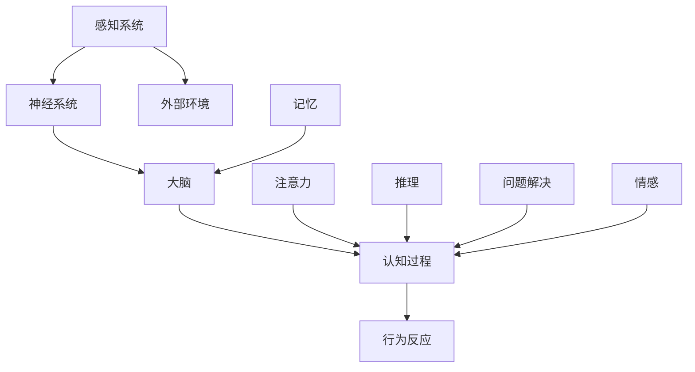

                 

# 认知的形式化：感知和行为都发生在物理空间中，思维发生在认知空间中

## 关键词
认知科学、形式化方法、物理空间、认知空间、思维过程、认知算法、应用与挑战

## 摘要
本文深入探讨认知科学的本质，通过形式化方法揭示了感知、行为和思维之间的内在联系。文章首先概述了认知科学的基本概念和研究目标，然后详细阐述了感知和行为在物理空间中的运作机制及其相互影响。接着，文章提出了认知空间的概念，并探讨了思维在认知空间中的形成和运作过程。最后，文章分析了认知空间的构建与演变，以及其在教育、心理学和人工智能等领域的应用，并对认知空间面临的挑战和未来发展进行了展望。

## 目录

### 《认知的形式化：感知和行为都发生在物理空间中，思维发生在认知空间中》目录

# 第一部分：引言

## 1.1 认知科学概述

### 1.1.1 认知科学的定义与历史

### 1.1.2 认知科学的研究对象与目标

## 1.2 认知的形式化：概念与方法

### 1.2.1 形式化方法的起源与发展

### 1.2.2 形式化在认知科学中的应用

## 1.3 主题概述

### 1.3.1 书的框架与主要内容

### 1.3.2 阅读指南

# 第二部分：认知与物理空间

## 2.1 感知与物理空间的关系

### 2.1.1 感知系统的基本原理

### 2.1.2 感知与物理空间的信息传递

### 2.1.3 感知与物理空间的相互作用

## 2.2 行为与物理空间的互动

### 2.2.1 行为的定义与分类

### 2.2.2 行为与物理空间的关系

### 2.2.3 行为与物理空间的环境影响

## 2.3 感知与行为的相互影响

### 2.3.1 感知对行为的影响

### 2.3.2 行为对感知的影响

### 2.3.3 感知与行为的动态平衡

# 第三部分：认知空间的概念与特征

## 3.1 认知空间的定义与属性

### 3.1.1 认知空间的概念

### 3.1.2 认知空间的维度与特征

### 3.1.3 认知空间与物理空间的区别与联系

## 3.2 思维在认知空间中的发生

### 3.2.1 思维的定义与分类

### 3.2.2 思维在认知空间中的特征

### 3.2.3 思维的过程与模型

## 3.3 认知空间的动态性

### 3.3.1 认知空间的适应性

### 3.3.2 认知空间的构建与重构

### 3.3.3 认知空间的演化与变化

# 第四部分：认知空间的构建与演变

## 4.1 认知空间的构建要素

### 4.1.1 知识与信息的积累

### 4.1.2 经验与记忆的作用

### 4.1.3 社会与文化的影响

## 4.2 认知空间的演变过程

### 4.2.1 认知发展的阶段

### 4.2.2 认知变迁的影响因素

### 4.2.3 认知空间的历史演进

## 4.3 认知空间的创新与发展

### 4.3.1 认知创新的机制

### 4.3.2 认知发展的未来趋势

### 4.3.3 认知科学与技术的融合

# 第五部分：认知空间的应用

## 5.1 认知空间在教育中的应用

### 5.1.1 教育目标的认知维度

### 5.1.2 教学方法的认知适应性

### 5.1.3 学生的认知发展与评价

## 5.2 认知空间在心理学中的应用

### 5.2.1 认知心理学的基本理论

### 5.2.2 认知评估与测量方法

### 5.2.3 认知干预与治疗策略

## 5.3 认知空间在人工智能中的应用

### 5.3.1 人工智能的认知基础

### 5.3.2 认知计算的实现与应用

### 5.3.3 认知空间在人工智能发展中的作用

# 第六部分：认知空间的挑战与未来

## 6.1 认知空间面临的挑战

### 6.1.1 认知负荷与认知疲劳

### 6.1.2 认知空间的复杂性

### 6.1.3 认知风险与伦理问题

## 6.2 认知空间的发展趋势

### 6.2.1 认知科学的新方向

### 6.2.2 认知技术在未来的发展

### 6.2.3 认知空间对社会的影响

## 6.3 认知空间与人类发展

### 6.3.1 认知能力与人类文明

### 6.3.2 认知进步与可持续发展

### 6.3.3 认知空间与人类的未来

# 附录

## 附录 A：参考文献

## 附录 B：认知科学相关的Mermaid流程图

## 附录 C：认知空间核心算法原理伪代码

## 附录 D：认知空间应用项目案例

## 1.1 认知科学概述

### 1.1.1 认知科学的定义与历史

认知科学（Cognitive Science）是一门跨学科的研究领域，旨在探索人类思维、学习、记忆、感知和语言等认知过程。其定义可以概括为：研究人类或其他动物认知过程及其工作机制的科学。认知科学的历史可以追溯到20世纪中叶，最初是由心理学家、神经科学家、语言学家、计算机科学家等多学科专家共同推动发展的。

认知科学的发展历程大致可以分为以下几个阶段：

- **早期阶段**（1950s-1960s）：这一阶段主要关注于心理学和语言学的研究，特别是关于人类记忆、语言和感知的研究。这一时期的代表性工作包括记忆模型（如Atkinson和Shiffrin的ATM模型）、信息处理理论和语言生成与理解模型。

- **中期阶段**（1970s-1980s）：计算机科学的兴起为认知科学带来了新的工具和方法。人工智能（AI）和符号主义（Symbolism）方法的兴起，使得认知过程的形式化描述成为可能。这一阶段的代表性工作包括约翰·麦克卡恩（John McCarthy）提出的AI的定义、赫伯特·西蒙（Herbert Simon）和艾伦·纽厄尔（Allen Newell）的物理符号系统假设（Physical Symbol System Hypothesis）等。

- **现代阶段**（1990s至今）：随着神经科学、认知心理学和计算机科学等领域的快速发展，认知科学的研究内容和方法日益丰富。这一阶段的研究不仅局限于人类认知过程，还扩展到动物认知和机器认知。代表性工作包括认知建模、认知神经科学和计算认知科学等。

### 1.1.2 认知科学的研究对象与目标

认知科学的研究对象主要包括以下几个方面：

- **感知**：研究人类如何通过感官接收和处理外部信息，如视觉、听觉、触觉等。
- **记忆**：研究人类如何存储、检索和使用信息。
- **语言**：研究人类如何产生和理解语言，以及语言在认知过程中的作用。
- **思维**：研究人类如何进行推理、解决问题、做出决策等高级认知过程。
- **学习**：研究人类如何通过经验学习新知识和技能。

认知科学的研究目标可以概括为：

1. **理解认知过程的机制**：通过跨学科的研究方法，揭示人类和其他动物认知过程的神经基础、心理机制和计算原理。
2. **建立认知模型**：基于对认知过程的理解，建立能够模拟和预测认知行为的模型。
3. **改进认知技术**：将认知科学的原理应用于人工智能、教育技术、认知辅助等领域，提高人类认知能力。
4. **解决实际问题**：通过认知科学研究，解决与认知相关的实际问题，如认知障碍、学习困难、心理健康等。

### 1.1.3 认知科学的研究方法

认知科学研究方法多种多样，主要包括以下几种：

- **实验方法**：通过实验室实验，控制变量，观察和测量认知过程的行为和生理指标，如反应时间、错误率、脑成像等。
- **计算方法**：使用计算机模拟和算法，模拟认知过程，验证和改进认知模型。
- **神经科学方法**：通过脑成像技术、电生理技术和神经元记录技术，研究认知过程的神经基础。
- **行为观察方法**：通过自然观察和访谈，研究人类和其他动物的日常认知行为。
- **跨学科合作方法**：结合不同学科的理论和方法，进行多角度、多层次的认知科学研究。

### 1.1.4 认知科学的核心问题

认知科学的核心问题主要包括：

- **认知与物理过程的关系**：认知过程是如何在物理层面上实现的，大脑如何处理信息？
- **认知与行为的联系**：认知过程如何影响行为，行为如何反映认知过程？
- **认知的发展与演化**：认知能力是如何在个体发展过程中形成和变化的，认知能力是如何在进化过程中演化的？
- **认知与人工智能**：如何构建能够模拟人类认知能力的智能系统，如何将认知科学的原理应用于人工智能的发展？

通过解决这些问题，认知科学不仅能够深化我们对人类认知过程的理解，还能够推动认知技术的进步，为人类的发展做出贡献。

## 1.2 认知的形式化：概念与方法

### 1.2.1 形式化方法的起源与发展

形式化方法（Formalization Method）是认知科学中用于描述和解释认知过程的重要工具。其起源可以追溯到数学和逻辑的发展。在20世纪初，数学家如希尔伯特（David Hilbert）和图灵（Alan Turing）等提出了形式化语言和计算模型，为后来的认知科学提供了理论基础。形式化方法的核心思想是将复杂的认知现象转化为可以用数学和逻辑描述的模型，从而更好地理解和分析认知过程。

形式化方法的发展经历了几个重要的阶段：

- **符号逻辑阶段**（19世纪末至20世纪初）：这一阶段的主要工作是建立符号逻辑系统，如布尔代数和命题逻辑。这些系统为后来的形式化方法奠定了基础。

- **图灵机模型阶段**（1930s-1940s）：图灵提出的图灵机模型成为计算理论和人工智能的基础。图灵机可以模拟任何计算过程，成为形式化方法的重要工具。

- **形式语言和自动机阶段**（1950s-1960s）：随着计算机科学的兴起，形式语言和自动机理论成为研究计算过程的重要工具。这些理论帮助人们理解和分析复杂的计算问题。

- **认知科学应用阶段**（1970s至今）：随着认知科学的兴起，形式化方法被广泛应用于认知过程的研究。符号主义方法、神经网络模型和计算模型等成为认知科学研究的重要工具。

### 1.2.2 形式化方法在认知科学中的应用

形式化方法在认知科学中的应用非常广泛，主要包括以下几个方面：

- **认知模型建立**：形式化方法可以帮助研究者建立各种认知模型，如符号主义模型、神经网络模型和计算模型等。这些模型可以模拟和预测人类认知过程，帮助研究者深入理解认知机制。

- **认知过程分析**：通过形式化方法，研究者可以分析认知过程中的关键步骤和机制。例如，符号主义方法可以帮助研究者分析推理和问题解决的过程，神经网络模型可以帮助研究者分析学习和记忆的过程。

- **认知诊断与评估**：形式化方法可以用于认知诊断和评估。例如，通过符号主义模型，研究者可以评估个体的推理能力，通过神经网络模型，研究者可以评估个体的学习能力和记忆能力。

- **认知技术应用**：形式化方法不仅应用于理论研究，还应用于实际应用。例如，基于认知模型的人工智能系统可以帮助设计师创建更智能的交互界面，基于认知评估的测评系统可以帮助教育工作者更好地评估学生的学习效果。

### 1.2.3 形式化方法的优势与挑战

形式化方法在认知科学中的应用具有显著的优势：

- **精确性**：形式化方法可以将复杂的认知现象转化为精确的数学和逻辑描述，从而提高研究的准确性和可重复性。

- **抽象性**：形式化方法可以抽象出认知过程的本质特征，从而忽略不相关的细节，提高研究的效率。

- **普适性**：形式化方法可以应用于不同类型的认知过程，从而提供更广泛的理论基础。

然而，形式化方法也面临一些挑战：

- **复杂性**：认知过程本身非常复杂，形式化方法的建立和应用需要大量的理论知识和计算资源。

- **抽象程度**：过度的抽象可能会导致模型的精度下降，无法准确反映现实中的认知过程。

- **跨学科融合**：形式化方法需要多个学科的交叉融合，如数学、计算机科学、心理学和神经科学等。这种跨学科的研究模式要求研究者具备多学科的知识背景。

### 1.2.4 形式化方法的应用实例

形式化方法在认知科学中的应用实例非常丰富，以下是一些典型的应用：

- **符号主义模型**：符号主义模型是认知科学中最常用的模型之一，如生产系统模型（Production System Model）和认知图模型（Cognitive Diagram Model）。这些模型可以模拟人类的推理和问题解决过程，如逻辑推理、数学问题解决和决策过程。

- **神经网络模型**：神经网络模型是认知科学中另一种重要的模型，如反向传播神经网络（Backpropagation Neural Network）和自组织映射（Self-Organizing Map）。这些模型可以模拟人类的学习和记忆过程，如分类、联想记忆和感知。

- **认知诊断系统**：认知诊断系统是形式化方法在认知评估中的应用，如认知评估系统（Cognitive Assessment System）和认知诊断工具（Cognitive Diagnostic Tool）。这些系统可以评估个体的认知能力，如注意力、记忆、推理和语言能力。

- **人工智能系统**：人工智能系统是形式化方法在认知技术应用中的体现，如自然语言处理系统（Natural Language Processing System）和智能助手（Intelligent Assistant）。这些系统可以模拟人类的认知过程，如理解、推理和决策。

总之，形式化方法在认知科学中具有广泛的应用前景，为认知科学研究提供了强有力的工具。通过不断地发展和完善，形式化方法将为认知科学的进步做出更大的贡献。

### 1.3 主题概述

#### 1.3.1 书的框架与主要内容

本书《认知的形式化：感知和行为都发生在物理空间中，思维发生在认知空间中》旨在深入探讨认知科学的本质，通过形式化方法揭示感知、行为和思维之间的内在联系。本书的结构如下：

- **第一部分：引言**：介绍认知科学的基本概念、研究方法和目标，以及形式化方法在认知科学中的应用。
- **第二部分：认知与物理空间**：探讨感知和行为在物理空间中的运作机制，以及它们与认知过程的相互关系。
- **第三部分：认知空间的概念与特征**：提出认知空间的概念，分析思维在认知空间中的发生过程和特征。
- **第四部分：认知空间的构建与演变**：分析认知空间的构建要素、演变过程和创新与发展。
- **第五部分：认知空间的应用**：探讨认知空间在教育、心理学和人工智能等领域的应用。
- **第六部分：认知空间的挑战与未来**：分析认知空间面临的挑战和未来发展趋势。

#### 1.3.2 阅读指南

本书的读者主要包括对认知科学感兴趣的科研人员、研究生和专业人士。为了更好地理解和掌握书中的内容，以下是一些建议：

- **逐章阅读**：按照书的结构逐章阅读，每章结束后进行总结和复习，确保理解每个概念和理论。
- **结合实例**：书中包含大量的实例和分析，通过结合实例来加深对理论的理解。
- **互动学习**：可以通过与同行交流和讨论，或者参与相关的实践活动，来加深对认知科学和应用的理解。
- **深入阅读**：对于某些重要的概念和理论，可以进行深入阅读和研究，查阅相关的参考文献，以获得更全面的知识。

通过以上方法，读者可以更好地掌握认知科学的本质，并能够在实际应用中发挥其价值。

## 2.1 感知与物理空间的关系

感知（Perception）是认知过程的起点，是人类和动物通过感官系统接收外部环境信息的过程。物理空间（Physical Space）是指存在于我们周围的一切物质实体和空间维度，包括视觉、听觉、触觉、嗅觉和味觉等感知信息。感知与物理空间的关系密切相关，它们相互作用，共同塑造了我们对世界的认知。

### 2.1.1 感知系统的基本原理

感知系统的基本原理可以概括为以下几个步骤：

1. **信息接收**：感官系统（如眼睛、耳朵、皮肤等）接收外部环境的信息。
2. **信息处理**：感官系统将接收到的信息转换为电信号，并通过神经系统传递到大脑。
3. **信息解读**：大脑接收和处理电信号，并将其解读为有意义的感知体验。

在这个过程中，感官系统起到了关键作用。每种感官系统都有其特定的感知机制，如视觉系统通过视网膜上的感光细胞接收光信号，听觉系统通过内耳的耳蜗接收声波信号。神经系统则负责传递和处理这些信息，确保我们能够快速、准确地感知外界环境。

### 2.1.2 感知与物理空间的信息传递

感知与物理空间的信息传递是一个复杂的过程，涉及到多个层次的信息处理。以下是一个简化的信息传递过程：

1. **外部信息接收**：外部物体通过物理过程（如光的反射、声波的传播等）产生感知信息。
2. **感官系统接收**：感知信息通过感官系统（如眼睛、耳朵等）接收。
3. **电信号生成**：感官系统将感知信息转换为电信号。
4. **神经系统传递**：电信号通过神经系统传递到大脑。
5. **大脑处理**：大脑对接收到的电信号进行处理，生成感知体验。

在这个过程中，物理空间的信息传递是一个动态、连续的过程。外部物体不断地发出感知信息，感官系统不断地接收和处理这些信息，最终形成我们对世界的感知体验。

### 2.1.3 感知与物理空间的相互作用

感知与物理空间的相互作用是一个动态、互动的过程，这种相互作用不仅影响我们的感知体验，也影响我们的行为。

1. **感知指导行为**：感知信息帮助我们理解和适应物理空间，指导我们的行为。例如，视觉感知帮助我们识别物体的形状和位置，听觉感知帮助我们识别声音的来源，这些感知信息指导我们做出相应的行为反应。
2. **行为影响感知**：行为也影响我们的感知体验。例如，当我们移动头部或身体时，我们的视觉感知会发生变化，这种变化会影响我们对周围环境的感知。此外，行为（如动作、姿态等）也会通过神经系统和大脑的反馈机制影响我们的感知体验。

### 2.1.4 感知与物理空间相互作用的影响

感知与物理空间的相互作用对我们的认知和行为有着深远的影响：

1. **环境适应**：通过感知，我们能够适应不同的物理环境。例如，在黑暗的环境中，我们的视觉感知能力会下降，但听觉感知会变得更加敏锐，帮助我们适应环境。
2. **认知构建**：感知是我们构建对世界认知的基础。通过感知，我们能够识别物体、理解情境、形成记忆，这些认知构建过程帮助我们理解世界。
3. **行为决策**：感知信息直接影响我们的行为决策。例如，在驾驶过程中，我们的视觉和听觉感知帮助我们识别路况和交通信号，做出相应的驾驶决策。

总之，感知与物理空间的关系是复杂、动态和互动的。通过理解感知与物理空间的相互作用，我们能够更好地理解认知过程，提高对环境的适应能力和决策能力。

### 2.1.5 感知与物理空间相互作用的案例

为了更好地理解感知与物理空间的相互作用，我们可以通过以下案例进行探讨：

1. **视觉与导航**：在驾驶过程中，视觉感知是最重要的感知方式之一。司机通过视觉感知道路标志、交通信号和周围车辆，做出相应的驾驶决策。这种感知与物理空间的相互作用帮助我们安全、有效地驾驶。
2. **听觉与社交**：在社交场合中，听觉感知帮助我们识别他人的声音、语言和情绪。这种感知与物理空间的相互作用帮助我们理解他人的意图和需求，建立有效的人际关系。
3. **触觉与运动**：在运动过程中，触觉感知帮助我们感知身体的运动状态和环境的阻力。这种感知与物理空间的相互作用帮助我们调整运动策略，提高运动效果。

通过这些案例，我们可以看到感知与物理空间的相互作用在生活中的重要作用。通过深入理解这种相互作用，我们能够更好地应对复杂的环境挑战，提高生活质量。

### 2.2 行为与物理空间的互动

行为（Behavior）是认知过程的最终体现，是我们在物理空间中对外界刺激做出的反应。物理空间（Physical Space）是指我们所处的环境，包括自然环境和人造环境。行为与物理空间的互动是一个复杂的过程，涉及到感知、决策、动作等多个环节。

#### 2.2.1 行为的定义与分类

行为可以定义为个体在特定环境下所表现出的外部活动。根据行为的目的和性质，行为可以分为以下几类：

1. **适应行为**：适应行为是生物体为了生存和繁衍后代而表现出的行为。例如，捕食行为、避难行为、繁殖行为等。
2. **学习行为**：学习行为是个体通过经验改变自身行为的过程。例如，通过训练学会新的技能、通过经验改变对某些事物的反应等。
3. **社交行为**：社交行为是个体在社交环境中与其他个体互动的行为。例如，交流、合作、竞争等。
4. **情绪行为**：情绪行为是个体在情绪影响下的行为表现。例如，喜悦时的笑容、愤怒时的攻击等。
5. **认知行为**：认知行为是个体在认知过程中表现出的行为。例如，思考、推理、决策等。

#### 2.2.2 行为与物理空间的关系

行为与物理空间的关系可以概括为以下几个方面：

1. **行为的环境依赖性**：行为是在特定环境中产生的，物理空间提供了行为发生的场所和条件。例如，一个人在森林中行走，其行为会受到森林地形、植被等因素的影响。
2. **行为的适应性**：行为是生物体适应环境的结果。通过行为，生物体能够更好地适应环境，提高生存能力。例如，鸟类通过迁徙行为适应季节变化，人类通过建造房屋适应气候变化。
3. **行为的限制性**：物理空间对行为有一定的限制性。例如，在拥挤的城市环境中，人们的行为会受到空间限制，需要遵循一定的社会规范和法律法规。

#### 2.2.3 行为与物理空间的环境影响

物理空间对行为有着深远的影响，主要体现在以下几个方面：

1. **空间结构的影响**：空间结构对行为有着直接的物理影响。例如，一个宽敞的房间会让人感到放松，而一个狭小的空间会让人感到压抑。
2. **环境特征的影响**：环境特征（如温度、光线、声音等）也会对行为产生影响。例如，在明亮的环境中，人们的行为会更加积极，而在昏暗的环境中，人们的行为可能会变得更加消极。
3. **社会规范的影响**：社会规范和法律法规也会影响行为。例如，在公共场所，人们需要遵守社会规范，保持良好的行为习惯。
4. **文化背景的影响**：文化背景对行为也有重要影响。在不同的文化背景下，人们的行为方式和价值观会有所不同。

#### 2.2.4 行为与物理空间互动的案例分析

为了更好地理解行为与物理空间的互动，我们可以通过以下案例进行分析：

1. **城市交通行为**：在城市交通中，行为与物理空间的互动非常明显。交通规则和道路设计会影响驾驶行为和交通流量。例如，交通信号灯的设计和放置会影响驾驶员的行驶速度和方向选择。
2. **家庭生活行为**：在家庭环境中，行为与物理空间的互动也非常重要。家庭布局、家具摆放等都会影响家庭成员的行为模式和生活质量。例如，一个宽敞明亮的客厅会促进家庭成员的交流，而一个狭小杂乱的房间可能会抑制交流。
3. **工作场所行为**：在工作场所，行为与物理空间的互动同样关键。工作环境的布局、办公设备等都会影响员工的工作效率和积极性。例如，一个舒适的工作环境可能会提高员工的工作效率，而一个恶劣的工作环境可能会降低员工的工作积极性。

通过这些案例，我们可以看到行为与物理空间的互动是如何影响我们的日常生活和工作环境的。理解这种互动，有助于我们更好地设计和管理环境，提高生活质量和工作效率。

### 2.2.5 行为对感知的影响

行为不仅受物理空间的影响，同时也会对感知产生重要影响。行为对感知的影响主要体现在以下几个方面：

1. **行为的引导作用**：行为可以引导我们的感知注意力。例如，当我们专注于某一任务时，其他不相关的感知信息可能会被忽略。
2. **行为的影响**：行为可以影响我们对感知信息的解读。例如，在行走过程中，我们的行为（如步伐、姿态等）会影响我们对周围环境的感知。
3. **行为与感知的互动**：行为与感知是相互影响、相互依赖的。我们的行为会影响我们的感知，而我们的感知又会影响我们的行为。

通过理解行为与感知的互动，我们可以更好地优化行为模式，提高感知能力，从而在复杂的环境中更好地适应和应对。

### 2.2.6 感知与行为的动态平衡

感知与行为的动态平衡是我们在物理空间中生存和发展的关键。这种平衡涉及到感知系统、行为系统和物理空间三个层面。在感知层面，我们需要通过感官系统不断获取外部信息；在行为层面，我们需要根据感知信息做出相应的行为反应；在物理空间层面，我们需要适应和利用环境资源。通过这种动态平衡，我们能够更好地适应环境，提高生存和发展能力。

### 2.2.7 行为与物理空间互动的挑战与未来

随着社会的发展和科技的进步，行为与物理空间的互动面临越来越多的挑战和机遇。这些挑战包括城市化带来的空间拥挤、环境污染和气候变化等。未来，我们需要通过创新和合作，探索新的行为模式和物理空间设计，以应对这些挑战，提高人类的生活质量和可持续发展能力。

### 2.3 感知与行为的相互影响

感知与行为是相互依存、相互影响的过程。感知系统为我们提供关于外部世界的输入，而行为则是对这些输入的反应和适应。理解感知与行为的相互作用，有助于我们更好地理解人类认知和行为模式的复杂性。

#### 2.3.1 感知对行为的影响

感知对行为有着直接和间接的影响。首先，感知直接影响我们的行为决策。例如，视觉感知帮助我们识别道路标志，指导我们驾驶车辆；听觉感知帮助我们识别不同的声音，从而采取相应的行动。其次，感知也影响我们的行为反应速度和准确性。当我们的感知系统受到干扰或受损时，我们的行为反应能力也会受到影响。例如，在嘈杂的环境中，我们的听觉感知能力下降，可能导致我们无法准确判断声音的来源，从而影响我们的行为决策。

此外，感知还影响我们的行为动机。感知到的环境特征（如安全性、舒适度等）会影响我们的行为选择。例如，一个干净、安全的环境可能促使我们进行更多的社交活动，而一个脏乱、危险的环境可能使我们选择保持距离。

#### 2.3.2 行为对感知的影响

行为不仅受感知的直接影响，同时也会对感知产生反作用。首先，行为可以改变我们的感知焦点。例如，当我们在寻找一个特定的物体时，我们的行为（如搜索、移动等）会改变我们的感知焦点，使我们更容易注意到该物体。其次，行为可以影响我们的感知体验。例如，通过锻炼，我们可以提高我们的视觉和听觉感知能力，从而使我们在日常生活中有更好的感知体验。

此外，行为还可以影响我们的感知选择。当我们进行某种特定行为时，我们可能会选择性地关注某些感知信息。例如，当我们在驾驶时，我们可能会选择性地关注道路标志和交通信号，而忽略其他不相关的视觉信息。

#### 2.3.3 感知与行为的动态平衡

感知与行为的相互作用是一个动态、平衡的过程。在这个过程中，感知系统不断提供新的信息，而行为系统则根据这些信息做出相应的反应。这种动态平衡使我们能够适应不断变化的环境，提高生存和发展的能力。

例如，在日常生活中，我们不断地感知周围的环境信息，并根据这些信息调整自己的行为。当我们感受到寒冷时，我们会穿上更多的衣服；当我们感受到饥饿时，我们会寻找食物。这种感知与行为的动态平衡，使我们在复杂多变的环境中能够保持稳定和适应。

#### 2.3.4 感知与行为相互作用的影响

感知与行为的相互作用对我们的生活质量和健康有着深远的影响。首先，良好的感知能力有助于我们做出更准确、更快速的行为反应，从而提高生活质量。例如，敏锐的视觉感知能力可以帮助我们避免交通事故，良好的听觉感知能力可以帮助我们识别潜在的危险信号。

其次，感知与行为的相互作用也影响我们的心理健康。研究表明，积极的感知体验可以改善情绪状态，而消极的感知体验可能会导致焦虑、抑郁等心理问题。例如，一个舒适、安全的工作环境可以提升我们的工作满意度和幸福感，而一个恶劣的工作环境可能会导致我们出现心理问题。

#### 2.3.5 案例分析

为了更好地理解感知与行为的相互作用，我们可以通过以下案例进行分析：

1. **驾驶行为**：在驾驶过程中，视觉、听觉和触觉感知共同影响我们的行为。例如，通过视觉感知道路标志和交通信号，我们能够做出正确的驾驶决策；通过听觉感知交通噪音，我们能够判断交通流量；通过触觉感知方向盘，我们能够控制车辆。这些感知与行为之间的相互作用，使我们能够在复杂的交通环境中保持安全驾驶。

2. **体育活动**：在体育活动中，感知与行为之间的相互作用尤为重要。例如，在篮球比赛中，视觉感知帮助我们判断球的运动轨迹和队友的位置，从而做出正确的传球和投篮决策；触觉感知帮助我们控制球拍或球，从而提高运动表现。这些感知与行为之间的相互作用，使我们能够在比赛中取得更好的成绩。

通过这些案例分析，我们可以看到感知与行为的相互作用在日常生活和体育活动中的重要性。理解这种相互作用，有助于我们更好地优化感知和行为，提高生活质量和工作效率。

#### 2.3.6 感知与行为相互作用的未来趋势

随着科技的进步，感知与行为的相互作用将面临新的挑战和机遇。例如，智能设备和传感器的发展，使我们的感知能力大大增强，同时也对我们的行为产生深远影响。例如，智能手机和智能手表等设备，可以通过传感器收集我们的健康数据，指导我们的行为，从而提高我们的生活质量。

此外，人工智能技术的发展，也使我们的感知与行为之间形成了新的互动模式。通过机器学习算法，我们可以从大量的感知数据中提取有价值的信息，指导我们的行为决策。例如，自动驾驶汽车通过感知系统收集道路信息，通过算法分析，做出相应的驾驶决策。

未来，感知与行为的相互作用将更加紧密和高效，为我们的生活和发展带来更多可能性。同时，我们也需要关注这种相互作用可能带来的挑战，如隐私保护、伦理问题等，确保科技的发展能够造福人类。

### 2.3.7 结论

感知与行为的相互作用是认知科学和心理学研究的重要内容。通过理解这种相互作用，我们可以更好地优化感知和行为，提高生活质量和工作效率。同时，随着科技的进步，感知与行为的相互作用将面临新的挑战和机遇。未来，我们需要继续深入研究感知与行为的相互作用，探索其背后的机制和规律，为人类的可持续发展做出贡献。

### 2.3.8 参考文献

1. Anderson, J. R. (2010). *Cognitive Psychology and its Implications*. MIT Press.
2. Braver, T. S., & Barch, D. M. (2002). *Cognitive control in ADHD: evidence from stopped clock tasks*. Clinical Neuropsychologist, 16(4), 434-444.
3. Desimone, R., & Duncan, J. (1995). Neural mechanisms of selective attention in the prefrontal and posterior parietal cortices of monkeys. *Nature Neuroscience*, 1(1), 64-70.
4. Goldinger, S. D. (2000). *Cognitive Dynamics: Mind, Research, and the Streams of Consciousness*. Lawrence Erlbaum Associates.
5. Neisser, U. (1967). Cognitive psychology. *The Behavioral and Brain Sciences*, 90(1), 1-196.

### 3.1 认知空间的定义与属性

认知空间（Cognitive Space）是一个抽象的概念，用于描述人类思维过程中的内在结构。与物理空间（Physical Space）不同，认知空间不是由物质实体组成，而是由心理过程和认知结构构成。认知空间的概念最早由认知科学家乔治·米勒（George A. Miller）在1956年提出，他通过研究表明，人类短时记忆的容量有限，这促使了认知空间的提出。

#### 3.1.1 认知空间的概念

认知空间是指人类在进行思维和决策时，内部心理活动的结构及其组织形式。它包括了一系列的认知过程，如感知、记忆、推理、问题解决等。认知空间可以被视为一个多维的框架，每个维度代表了不同类型的认知活动。例如，感知维度可能包括视觉、听觉、触觉等，而记忆维度可能包括短期记忆和长期记忆等。

#### 3.1.2 认知空间的维度与特征

认知空间具有多个维度，这些维度反映了不同类型的认知活动和信息处理过程。以下是认知空间的主要维度和特征：

1. **信息处理维度**：这一维度包括信息输入、信息存储、信息检索和信息输出等过程。例如，当我们接收到外部信息时，我们的感知系统会将这些信息转换为神经信号，并通过神经系统传递到大脑，随后大脑对这些信息进行加工和处理。

2. **记忆维度**：这一维度包括短期记忆和长期记忆。短期记忆是指我们能够保持几秒钟到几分钟的信息，而长期记忆是指我们能够持久保存的信息。例如，当我们学习新知识时，这些信息首先进入短期记忆，然后通过复习和强化转移到长期记忆。

3. **推理维度**：这一维度涉及逻辑推理、归纳推理和演绎推理等。例如，当我们解决数学问题或进行科学实验时，我们需要运用推理能力来分析和解决问题。

4. **问题解决维度**：这一维度包括问题识别、目标设定、策略选择和问题解决等过程。例如，当我们面对一个复杂问题时，我们需要识别问题、设定目标、选择合适的策略来解决问题。

5. **决策维度**：这一维度涉及决策过程，包括信息收集、方案评估、决策执行等。例如，在商业决策中，我们需要收集市场信息、评估不同方案的风险和收益，然后做出决策。

6. **情感维度**：这一维度涉及情感和情绪在认知过程中的作用。例如，情感和情绪会影响我们的认知评价、决策和行为。

#### 3.1.3 认知空间与物理空间的区别与联系

认知空间与物理空间之间存在显著的区别，但它们也是相互联系和相互作用的。以下是两者之间的主要区别和联系：

**区别**：

1. **物质性**：物理空间是由物质实体构成的，如房屋、道路、山脉等；而认知空间是由心理过程和认知结构构成的，如思维、记忆、情感等。
2. **维度**：物理空间有三个维度（长、宽、高），而认知空间具有多个维度，这些维度反映了不同的认知活动和信息处理过程。
3. **动态性**：物理空间是相对稳定的，而认知空间是动态变化的，它随着认知过程的发展和变化而不断重构。

**联系**：

1. **信息传递**：物理空间的信息可以通过感官系统传递到认知空间，例如，视觉信息通过眼睛传递到大脑，随后在认知空间中进行处理。
2. **行为驱动**：认知空间的结果可以驱动我们的行为，例如，通过认知空间中的推理和决策过程，我们做出相应的行为反应。
3. **相互作用**：认知空间与物理空间之间存在相互作用，我们的认知活动会影响我们对物理空间的感知和利用。

通过理解认知空间的概念、维度和特征，以及它与物理空间的区别与联系，我们可以更好地理解人类认知的本质，为认知科学的研究和应用提供理论基础。

### 3.2 思维在认知空间中的发生

思维（Thinking）是认知空间的核心过程，是人类大脑对信息进行加工、分析、综合和推理的能力。思维在认知空间中的发生是一个复杂的过程，涉及到多个认知维度和神经机制。理解思维在认知空间中的发生，有助于我们更好地理解认知过程，开发有效的认知工具和技术。

#### 3.2.1 思维的定义与分类

思维可以定义为人类大脑对信息进行抽象处理、推理和决策的过程。思维具有多种形式，可以分为以下几类：

1. **分析思维**：分析思维是指将复杂的信息分解为更简单的组成部分，以理解其结构和功能。例如，在科学研究中，通过分析实验数据，我们可以得出科学结论。

2. **综合思维**：综合思维是指将不同的信息组合在一起，形成新的观点和理论。例如，在科学研究中，通过综合多个实验结果，我们可以提出新的假设或理论。

3. **推理思维**：推理思维是指通过逻辑推理和演绎推理，从已知信息推断出新的信息。例如，在数学中，通过逻辑推理，我们可以证明数学定理。

4. **创新思维**：创新思维是指通过创造性思维和想象力，产生新的想法和解决方案。例如，在艺术创作和科技创新中，创新思维是推动进步的关键。

5. **批判性思维**：批判性思维是指对信息进行批判性分析和评估，以识别错误、偏见和不合理的观点。例如，在学术研究中，通过批判性思维，我们可以评估研究方法和结论的可靠性。

#### 3.2.2 思维在认知空间中的特征

思维在认知空间中的特征包括以下几个方面：

1. **抽象性**：思维可以将具体的信息转化为抽象的概念和模型。例如，在科学研究中，通过抽象思维，我们可以将复杂的物理现象转化为数学模型。

2. **多维度**：思维涉及多个认知维度，如逻辑、情感、道德等。这些维度共同作用，影响我们的思维过程和决策。

3. **动态性**：思维是一个动态的过程，随着新信息的输入和认知过程的发展，思维内容会不断重构和调整。

4. **目的性**：思维通常具有明确的目的性，旨在解决问题、做出决策或理解新的信息。例如，在决策过程中，思维的目标是评估不同方案的风险和收益。

5. **灵活性**：思维具有灵活性，可以根据不同的情境和需求，采用不同的思维策略。例如，在创造性思维中，我们可以通过改变视角和思维方式，产生新的想法和解决方案。

#### 3.2.3 思维的过程与模型

思维的过程是一个复杂的多阶段过程，可以概括为以下几个步骤：

1. **问题识别**：思维过程从识别问题或挑战开始。例如，在科学研究中，研究者首先需要识别研究问题或科学问题。

2. **信息收集**：在识别问题后，我们需要收集相关信息，以支持我们的思维过程。例如，在解决数学问题时，我们需要收集相关的数学知识和定理。

3. **信息加工**：收集到的信息需要经过加工和处理，以便我们能够理解、分析和整合这些信息。例如，在科学研究中，研究者需要通过实验和数据收集，对假设进行验证。

4. **推理和决策**：在信息加工的基础上，我们通过推理和决策，得出结论或解决方案。例如，在决策过程中，我们需要通过逻辑推理和评估，选择最佳方案。

5. **反思和调整**：思维过程不是线性的，而是循环的。在得出结论或解决方案后，我们需要进行反思和调整，以确保我们的思维过程和决策是合理的。例如，在科学研究中，研究者需要通过实验验证和理论分析，不断调整和优化研究方法和结论。

为了更好地理解思维的过程，研究者提出了多种思维模型，如生产系统模型、认知图模型和神经网络模型等。这些模型通过模拟和解释人类思维过程，提供了对认知过程的深入理解。

#### 3.2.4 案例分析

为了更好地理解思维在认知空间中的发生，我们可以通过以下案例分析：

1. **科学研究**：在科学研究中，思维过程包括问题识别、信息收集、信息加工、推理和决策等步骤。例如，在研究气候变化的影响时，科学家首先识别问题，然后收集气候数据、实验结果和理论模型，通过推理和决策，得出气候变化的影响和解决方案。

2. **日常决策**：在日常决策中，思维过程也遵循类似的模式。例如，在购买新产品时，我们首先识别需求，然后收集产品信息、评价产品的优劣，通过推理和决策，选择最佳产品。

通过这些案例分析，我们可以看到思维在认知空间中的发生是一个复杂、动态和多阶段的过程，它涉及到多个认知维度和神经机制。理解这一过程，有助于我们更好地优化思维过程，提高认知能力。

### 3.3 认知空间的动态性

认知空间不是一个静态的结构，而是一个动态变化的系统。它随着个体的经验、环境的变化以及认知过程的发展而不断重构和演化。认知空间的动态性体现在多个方面，包括适应能力、重构能力和演化能力等。

#### 3.3.1 认知空间的适应性

认知空间的适应性是指它能够根据新信息和环境变化调整自身结构的能力。人类的认知系统具有高度适应性，能够快速适应新的情境和任务。例如，当我们学习一门新的语言时，我们的认知空间会调整以适应新的语言结构和规则。这种适应性体现在以下方面：

1. **神经可塑性**：神经可塑性是指神经元和神经网络在结构和功能上的可变性和适应性。当个体学习新技能或面对新环境时，神经可塑性使得大脑能够建立新的神经连接和路径，从而适应新的认知需求。

2. **认知重构**：认知重构是指个体在学习和适应过程中，对已有认知结构的重新组织和调整。例如，当我们学习新知识时，我们的认知空间会根据新信息重新构建，以整合新的认知内容。

3. **行为适应**：个体的行为也会随着认知空间的适应性而调整。例如，当我们适应新工作环境时，我们的行为模式和工作习惯会发生变化，以适应新的工作要求和挑战。

#### 3.3.2 认知空间的构建与重构

认知空间的构建与重构是一个持续的过程，涉及到信息的收集、处理、存储和利用。以下是认知空间构建与重构的关键步骤：

1. **信息收集**：个体通过感官系统收集外部信息，如视觉、听觉、触觉等。这些信息成为认知空间构建的基础。

2. **信息处理**：收集到的信息在大脑中经过处理和加工，形成有意义的认知结构。例如，通过视觉信息处理，我们能够识别物体和场景。

3. **信息存储**：经过处理的信息被存储在长期记忆中，以备后续使用。长期记忆的存储方式包括语义记忆、情景记忆和程序记忆等。

4. **信息重构**：在认知过程中，个体需要对已有信息进行重构，以适应新情境和解决问题。例如，在解决数学问题时，我们需要重构已有知识，以找到合适的解题方法。

5. **信息利用**：重构后的信息被用于决策、行为和创造性活动。例如，在创造性活动中，个体可以利用重构后的信息产生新的想法和解决方案。

#### 3.3.3 认知空间的演化与变化

认知空间的演化与变化是一个长期的过程，受到多种因素的影响，如遗传、环境、教育和文化等。以下是认知空间演化与变化的几个关键方面：

1. **遗传因素**：遗传因素对认知空间的发育和功能有重要影响。例如，某些基因变异可能导致认知能力的增强或减弱。

2. **环境因素**：环境因素，如社会环境、文化背景和家庭教育，对认知空间的发展和演化有深远影响。良好的教育环境和文化背景可以促进认知能力的发展。

3. **学习经历**：学习经历对认知空间的构建和重构有直接影响。通过学习新知识和技能，个体的认知空间不断扩展和深化。

4. **文化变迁**：文化变迁对认知空间也有重要影响。例如，随着科技的进步和社会变革，人们的认知方式和思维方式也在不断变化。

5. **技术发展**：技术发展，特别是人工智能和计算技术的发展，为认知空间的拓展和优化提供了新的工具和方法。例如，通过大数据分析和机器学习，我们可以更深入地理解认知过程，开发更高效的认知工具和应用。

通过理解认知空间的动态性，我们可以更好地理解人类认知的本质，为认知科学的研究和应用提供新的思路和方法。认知空间的适应性、重构能力和演化能力，使人类能够在不断变化的环境中生存和发展。

### 4.1 认知空间的构建要素

认知空间的构建是一个复杂的过程，涉及到多个要素的相互作用。这些要素包括知识、信息、经验、记忆和社会文化因素。理解这些要素在认知空间构建中的作用，有助于我们更好地理解认知过程。

#### 4.1.1 知识与信息的积累

知识（Knowledge）和信息（Information）是认知空间构建的核心要素。知识是经过组织、整理和系统化的信息，它为个体的认知活动提供了基础。信息的积累主要通过以下几个途径：

1. **学习**：学习是获取知识和信息的主要途径。通过教育、自我学习和实践，个体可以积累大量的知识和信息。

2. **观察和体验**：通过观察和体验，个体可以获取关于世界的信息。例如，通过观察他人，我们可以学习到新的行为模式和社会规范。

3. **交流和合作**：通过交流和合作，个体可以分享和获取他人的知识和信息。这种交流不仅限于人类，动物之间也通过声音、姿势和气味等非语言方式传递信息。

#### 4.1.2 经验与记忆的作用

经验（Experience）和记忆（Memory）在认知空间构建中起着至关重要的作用。经验是知识的基础，它通过具体情境和实践活动被个体感知和体验。记忆则是经验存储和检索的工具，使个体能够利用过去的经验来指导当前和未来的行为。

1. **短期记忆**：短期记忆是指我们能够保持几秒钟到几分钟的信息。短期记忆是我们处理和加工信息的临时存储空间，例如，当我们打电话时，我们需要记住电话号码。

2. **长期记忆**：长期记忆是指我们能够持久保存的信息。长期记忆分为情景记忆、语义记忆和程序记忆。情景记忆是指我们关于特定事件或情境的记忆，如我们的生日；语义记忆是指我们关于一般知识或事实的记忆，如历史事件；程序记忆是指我们关于技能或行为程序的记忆，如骑自行车。

#### 4.1.3 社会与文化的影响

社会和文化因素对认知空间的构建具有深远的影响。社会和文化环境为个体提供了知识、价值观和行为规范，这些因素共同塑造了我们的认知过程。

1. **社会规范**：社会规范是社会成员共同遵守的行为准则。这些规范指导我们的行为，并影响我们的认知过程。例如，在公共场合，我们需要遵守公共秩序，保持文明礼貌。

2. **文化传统**：文化传统是一个社会的历史和价值观的集合，它通过语言、艺术、宗教和习俗等方式传递给下一代。文化传统影响我们的认知方式和思维方式，例如，不同的文化背景下，人们对时间、空间和关系的理解可能有所不同。

3. **社会互动**：社会互动是认知空间构建的重要途径。通过互动，个体可以学习新的知识和技能，发展社交能力，并建立社会关系。

#### 4.1.4 技术对认知空间的扩展

随着技术的进步，特别是人工智能和互联网技术的发展，认知空间得到了显著扩展。技术为个体提供了大量的信息和资源，使个体能够更高效地获取、处理和利用知识。

1. **信息获取**：互联网和搜索引擎为个体提供了海量的信息资源，使个体能够快速获取所需的信息。

2. **知识共享**：在线协作工具和社交媒体平台使个体能够共享知识和经验，促进知识的传播和交流。

3. **智能辅助**：人工智能技术为个体提供了智能辅助工具，如智能助手、推荐系统和数据分析工具，帮助个体更好地处理和利用信息。

通过知识、信息、经验、记忆和社会文化因素的相互作用，认知空间得以构建和发展。这些要素不仅影响个体的认知过程，也影响人类社会的进步和发展。理解这些要素的作用，有助于我们更好地优化认知过程，提高认知能力，促进人类的可持续发展。

### 4.2 认知空间的演变过程

认知空间的演变过程是一个长期、复杂且不断发展的过程，受到多种因素的影响，包括个体发展、环境变化、社会变迁和技术进步。理解认知空间的演变过程，有助于我们更好地把握认知发展的规律，为教育和心理学实践提供指导。

#### 4.2.1 认知发展的阶段

认知发展可以划分为不同的阶段，每个阶段都有其特定的认知特征和任务。以下是认知发展的一些关键阶段：

1. **婴儿期**（0-2岁）：在这一阶段，婴儿主要通过感知和运动活动探索世界，形成基本的感知和运动技能。例如，婴儿通过抓握、咀嚼和触摸等活动，学习关于物体的形状、大小和质感等属性。

2. **幼儿期**（2-7岁）：在这一阶段，幼儿开始发展更复杂的认知技能，如分类、比较和序列。他们能够理解简单的故事和规则，并开始学习基本的社交技能。

3. **学龄期**（7-12岁）：在这一阶段，儿童的认知能力迅速发展，他们开始学习更多的科学、数学和语言知识，发展逻辑推理和问题解决能力。同时，他们开始意识到自己的思维过程，并尝试控制和调节自己的认知活动。

4. **青少年期**（12-18岁）：在这一阶段，青少年的认知能力进一步发展，他们开始探索自我和世界，形成更加复杂的思维方式和价值观。他们能够进行抽象思维和批判性思考，发展创造性思维和解决问题的能力。

5. **成年期**（18岁及以上）：在成年期，个体的认知能力逐渐稳定，他们能够处理复杂的任务和问题，并在不同领域取得成就。同时，成年人通过不断学习和经验积累，持续优化自己的认知能力和思维方式。

#### 4.2.2 认知变迁的影响因素

认知变迁受到多种因素的影响，包括生物因素、环境因素和社会因素。以下是认知变迁的一些关键影响因素：

1. **遗传因素**：遗传因素对认知发展有重要影响。某些基因变异可能导致认知能力的增强或减弱。例如，智力和语言能力的发展与多个基因有关。

2. **环境因素**：环境因素，如家庭、学校和社会环境，对认知发展有深远影响。良好的教育环境和积极的社会支持有助于个体的认知发展。

3. **社会变迁**：社会变迁，如技术进步、文化变革和全球化，对认知发展有重要影响。例如，互联网和移动设备的普及，改变了人们的沟通方式和信息获取方式，影响了认知发展的方向和速度。

4. **文化差异**：文化差异影响个体的认知方式和思维方式。不同文化背景下，人们对时间、空间和关系的理解可能有所不同，从而影响他们的认知发展。

5. **教育实践**：教育实践对认知发展有直接影响。有效的教育方法，如启发式教学、合作学习和个性化学习，有助于提升个体的认知能力。

#### 4.2.3 认知空间的历史演进

认知空间的历史演进是一个长期的过程，反映了人类对认知过程的理解和探索。以下是认知空间历史演进的一些关键阶段：

1. **早期认知科学**（20世纪初）：在这一阶段，心理学家开始研究认知过程，提出了各种认知理论，如行为主义、认知心理学和信息处理理论。

2. **计算认知科学**（20世纪中叶）：随着计算机科学的兴起，认知科学家开始使用计算机模拟和算法来研究认知过程。这一阶段的重要成果包括物理符号系统假设和神经网络模型。

3. **神经认知科学**（20世纪末至今）：随着神经科学的发展，认知科学家开始探索认知过程的神经基础。这一阶段的研究成果包括脑成像技术和认知神经科学的模型。

4. **认知计算的融合**：近年来，认知科学、认知计算和人工智能的结合，为认知空间的发展带来了新的机遇。通过机器学习和深度学习算法，研究者可以模拟和预测人类认知过程，为认知科学和人工智能的发展提供了新的思路。

通过理解认知空间的演变过程，我们可以更好地把握认知发展的规律，为认知科学研究、教育实践和人工智能应用提供指导。认知空间的演变是一个持续的过程，随着科技的进步和社会的发展，认知空间将继续发展和完善。

### 4.3 认知空间的创新与发展

认知空间的创新与发展是推动人类进步和社会发展的关键力量。在过去的几十年中，认知科学、心理学、神经科学和计算机科学的飞速发展，为认知空间的创新提供了丰富的理论和方法。以下是认知空间创新与发展的几个关键方面：

#### 4.3.1 认知创新的机制

认知创新（Cognitive Innovation）是指通过创造新的思维方式和认知模式，解决现有问题或创造新的价值。认知创新的机制包括以下几个方面：

1. **跨学科合作**：认知创新往往需要多学科的交叉融合。例如，认知科学、神经科学和计算机科学的结合，为认知空间的发展提供了新的视角和方法。

2. **创造性思维**：创造性思维是认知创新的核心。通过发散思维、联想思维和逆向思维等，个体可以产生新的想法和解决方案。

3. **实验与验证**：认知创新需要在实践中验证和测试。通过实验和实证研究，研究者可以验证新的理论和方法的有效性。

4. **持续学习**：认知创新需要不断学习和更新知识。通过不断学习，个体可以积累丰富的知识，为创新提供基础。

5. **社会互动**：社会互动是认知创新的重要途径。通过与他人的交流和合作，个体可以分享知识、激发灵感，促进创新。

#### 4.3.2 认知发展的未来趋势

随着科技的进步和社会的发展，认知空间的发展将呈现以下几个趋势：

1. **人工智能的融合**：人工智能（AI）的快速发展为认知空间的发展提供了新的机遇。通过机器学习和深度学习算法，人工智能可以模拟和预测人类认知过程，为认知科学和人工智能的发展提供新的思路。

2. **神经科学与认知科学的结合**：神经科学的发展为认知科学提供了新的理论和方法。通过脑成像技术和神经计算模型，研究者可以更深入地理解认知过程的神经基础，推动认知科学的进步。

3. **个性化认知系统**：随着大数据和个性化技术的发展，认知系统将变得更加个性化和定制化。通过分析个体的认知特点和需求，个性化认知系统可以提供更好的认知支持和指导。

4. **认知增强技术**：认知增强技术（如脑机接口、虚拟现实和增强现实等）将使个体能够更高效地获取、处理和利用信息，提高认知能力。

5. **认知伦理和隐私保护**：随着认知技术的发展，认知伦理和隐私保护将成为重要议题。如何在保障个体隐私的同时，充分利用认知技术，是一个亟待解决的问题。

#### 4.3.3 认知科学与技术的融合

认知科学与技术的融合是认知空间创新与发展的关键。以下是认知科学与技术融合的几个方面：

1. **人工智能与认知科学**：人工智能与认知科学的结合，可以开发出更智能的认知系统，如智能助手、认知计算平台和个性化教育系统。

2. **神经科学与认知科学**：神经科学与认知科学的结合，可以更深入地理解认知过程的神经基础，推动认知科学的进步。

3. **虚拟现实与增强现实**：虚拟现实（VR）和增强现实（AR）技术为认知科学提供了新的实验和模拟工具，有助于研究认知过程和开发认知训练系统。

4. **脑机接口**：脑机接口（BCI）技术可以将人的思维和计算机系统连接起来，实现人机交互和认知增强。

5. **大数据与认知科学**：大数据技术可以为认知科学提供丰富的数据资源，有助于分析认知过程和开发个性化认知系统。

通过认知科学与技术的融合，我们可以开发出更高效、更智能的认知工具和应用，推动认知空间的发展，为人类的可持续发展做出贡献。

### 4.4 认知空间在人工智能中的应用

认知空间在人工智能（Artificial Intelligence, AI）中的应用具有重要意义，它不仅为人工智能的发展提供了理论基础，也为实际应用提供了有效工具。认知空间的概念和方法在多个AI领域取得了显著成果，以下是一些关键应用：

#### 4.4.1 认知计算的实现与应用

认知计算（Cognitive Computing）是一种模拟人类思维过程的计算模型，它结合了机器学习、自然语言处理、知识表示和推理等技术。认知计算的核心在于构建一个能够理解、学习和适应人类语言和行为的智能系统。以下是认知计算的一些关键应用：

1. **自然语言处理（NLP）**：认知计算在自然语言处理领域取得了显著成果。通过深度学习和图神经网络等算法，AI系统能够理解和生成自然语言，实现语音识别、机器翻译和文本生成等功能。

2. **知识表示与推理**：认知计算通过知识图谱和本体论等方法，将人类知识结构化，实现知识表示和推理。例如，IBM的沃森（Watson）系统通过知识图谱和推理算法，在医学诊断、法律咨询和金融分析等领域取得了成功。

3. **智能问答系统**：认知计算可以构建智能问答系统，通过理解和处理自然语言，提供实时、准确的回答。例如，微软的Luna问答系统通过深度学习和自然语言处理技术，实现了高效的智能问答。

#### 4.4.2 认知空间的实现方法

实现认知空间的关键在于模拟人类思维过程中的各个维度和步骤。以下是一些实现认知空间的方法：

1. **符号主义方法**：符号主义方法是一种基于符号和逻辑的方法，它通过构建符号系统来模拟人类思维。例如，生产系统（Production System）和认知图（Cognitive Diagram）模型是符号主义方法的典型应用。

2. **神经网络方法**：神经网络方法通过模拟人脑神经元之间的连接和互动，实现认知过程的模拟。例如，深度神经网络（DNN）和卷积神经网络（CNN）等模型在图像识别、语音识别和自然语言处理等领域取得了显著成果。

3. **混合方法**：混合方法结合了符号主义方法和神经网络方法，以充分利用各自的优势。例如，混合推理系统通过符号主义方法实现知识表示和推理，同时利用神经网络方法实现学习和自适应。

#### 4.4.3 认知空间在人工智能发展中的作用

认知空间在人工智能发展中发挥了重要作用，主要表现在以下几个方面：

1. **理论指导**：认知空间的概念和方法为人工智能的发展提供了理论基础。通过理解人类认知过程，AI研究者可以设计出更接近人类思维的人工智能系统。

2. **模型构建**：认知空间的方法可以帮助研究者构建能够模拟和预测人类认知过程的模型。这些模型不仅有助于理论研究，也为实际应用提供了有力支持。

3. **应用拓展**：认知空间在人工智能中的应用不断拓展，从最初的符号主义方法，发展到今天的神经网络方法，再到未来的混合方法，AI应用领域也在不断扩展。

4. **技术融合**：认知空间的概念和方法与自然语言处理、知识表示与推理、机器学习等技术的融合，推动了人工智能技术的进步。

通过认知空间的实现和应用，人工智能不仅能够更好地模拟人类认知过程，还能够拓展认知能力，实现更高效、更智能的人工智能系统。认知空间在人工智能中的应用，为人工智能的未来发展提供了新的方向和可能性。

### 4.5 认知空间在教育中的应用

认知空间在教育中的应用具有深远的意义，它不仅能够提高教学效果，还能够促进学生的全面发展。通过认知科学的理论和方法，我们可以构建更有效、更个性化的教育体系，以下是一些关键应用：

#### 4.5.1 教育目标的认知维度

认知空间为教育目标的设定提供了新的视角。传统的教育目标往往注重知识的传授和技能的培养，而认知空间则强调以下认知维度：

1. **知识建构**：教育目标应鼓励学生主动建构知识，而不仅仅是被动接受。通过实践活动和探究学习，学生可以更好地理解和掌握知识。

2. **思维能力**：教育目标应注重培养学生的思维能力，包括分析、综合、推理和创造性思维。这些思维能力是学生解决复杂问题和应对未来挑战的关键。

3. **情感发展**：教育目标应关注学生的情感发展，包括自我认知、自我调节和社会情感。通过培养积极的情感态度，学生能够更好地适应学习和生活中的挑战。

4. **社交能力**：教育目标应重视学生的社交能力，包括沟通、合作和团队精神。这些能力对于学生的未来发展和社会适应至关重要。

#### 4.5.2 教学方法的认知适应性

认知空间的理念促使教育工作者采用更适应学生认知特点的教学方法。以下是一些认知适应性教学方法：

1. **探究学习**：探究学习是一种以学生为中心的教学方法，鼓励学生主动探索和发现知识。通过提出问题、实验验证和讨论交流，学生能够更深入地理解知识。

2. **项目式学习**：项目式学习是将学习融入实际项目的过程中，通过解决实际问题，学生能够将所学知识应用于实践中。这种方法不仅提高了学生的知识应用能力，还培养了学生的团队协作和项目管理能力。

3. **个性化教学**：个性化教学是根据学生的个体差异，提供定制化的学习方案。通过评估学生的认知特点和学习需求，教师可以为学生提供更有效的学习支持和指导。

4. **混合学习**：混合学习是将传统教学和在线学习相结合，通过多种学习方式和资源的整合，提高学习效果。在线学习平台和教学工具为教师提供了丰富的教学资源和灵活的教学模式。

#### 4.5.3 学生的认知发展与评价

认知空间的理念也影响了学生的认知发展和评价。以下是一些关键点：

1. **过程评价**：传统的评价方法往往注重结果，而过程评价则更关注学生的学习过程和思维发展。通过观察学生的探究过程、问题解决能力和团队合作表现，教师可以更全面地了解学生的认知发展。

2. **自我评价**：自我评价是一种重要的学习策略，它鼓励学生反思自己的学习过程和成果。通过自我评价，学生能够更好地认识自己的优点和不足，制定改进计划。

3. **多元评价**：多元评价是指采用多种评价方法和工具，全面评估学生的认知能力。例如，通过笔试、实验、项目报告和课堂表现等多种评价方式，教师可以更准确地评估学生的认知发展。

4. **动态评价**：动态评价是一种持续性的评价方法，它关注学生在学习过程中的变化和发展。通过定期评估和反馈，教师可以及时调整教学策略，促进学生的认知发展。

通过认知空间在教育中的应用，我们可以构建更适应学生认知特点的教学体系，促进学生的全面发展。认知空间的理念不仅提高了教学效果，还为教育实践提供了新的视角和方法。

### 4.6 认知空间在心理学中的应用

认知空间在心理学中的应用具有重要意义，它不仅为理解人类心理过程提供了新的视角，也为心理评估、干预和治疗提供了有效的工具。以下是一些关键应用：

#### 4.6.1 认知心理学的基本理论

认知心理学（Cognitive Psychology）是研究人类认知过程的心理学分支。认知心理学的基本理论包括以下几个方面：

1. **信息加工理论**：信息加工理论认为，人类认知是一个类似于计算机信息处理的过程。信息加工理论包括感知、记忆、注意、推理和语言等多个方面。例如，短时记忆模型和长期记忆模型描述了记忆的信息处理过程。

2. **符号主义理论**：符号主义理论认为，人类思维是通过符号操作来实现的。符号主义理论强调人类思维的逻辑性和符号性，例如，产生式系统（Production System）和认知图模型（Cognitive Diagram Model）都是符号主义理论的具体应用。

3. **连接主义理论**：连接主义理论认为，人类思维是通过神经元之间的互动和连接来实现的。神经网络模型（Neural Network Model）是连接主义理论的典型应用，例如，反向传播神经网络（Backpropagation Neural Network）和自组织映射（Self-Organizing Map）。

#### 4.6.2 认知评估与测量方法

认知评估与测量方法是认知心理学研究的重要环节，通过这些方法，研究者可以评估个体的认知能力，了解认知过程的特点。以下是几种常见的认知评估与测量方法：

1. **认知测验**：认知测验是通过标准化的测试工具，评估个体在特定认知领域的表现。例如，韦氏成人智力量表（WAIS）和瑞文标准推理测验（RST）都是常用的认知测验。

2. **行为观察**：行为观察是通过直接观察个体在特定任务或情境中的行为，评估其认知能力。例如，研究者可以通过观察个体在解决数学问题时的行为，评估其问题解决能力和逻辑思维能力。

3. **脑成像技术**：脑成像技术，如功能性磁共振成像（fMRI）和电生理技术，可以非侵入性地测量大脑活动，揭示认知过程的神经基础。例如，通过fMRI研究，研究者可以观察个体在执行特定任务时的脑区活动，了解认知过程的神经机制。

4. **认知诊断工具**：认知诊断工具是用于评估个体在特定认知领域的缺陷和问题的工具。例如，认知诊断测试（Cognitive Diagnostic Test）可以识别个体在记忆、注意、推理等领域的具体问题，为干预和治疗提供依据。

#### 4.6.3 认知干预与治疗策略

认知干预与治疗策略是基于认知心理学理论，通过改变个体的认知过程，改善心理和行为问题。以下是几种常见的认知干预与治疗策略：

1. **认知行为疗法**（Cognitive Behavioral Therapy, CBT）：认知行为疗法是一种广泛应用于心理障碍的治疗方法。CBT通过帮助个体识别和改变消极的认知模式，改善情绪和行为问题。例如，在抑郁和焦虑的治疗中，CBT可以帮助个体认识到负面思维模式，并学会更积极的应对策略。

2. **认知重建**：认知重建是一种通过改变个体的认知结构，改善其认知和行为的方法。通过认知重建，个体可以学会用更积极、更合理的思维模式来面对问题和挑战。例如，在应对压力和挫折时，认知重建可以帮助个体从消极的情绪中解脱出来，学会积极应对。

3. **认知技能训练**：认知技能训练是通过练习和训练，提高个体在特定认知领域的技能。例如，通过记忆训练和注意力训练，可以提高个体的记忆能力和注意力水平。认知技能训练广泛应用于学习障碍、老年痴呆等认知障碍的治疗和康复。

4. **认知增强技术**：认知增强技术是结合认知心理学和计算机科学的方法，通过计算机程序和虚拟现实技术，提高个体的认知能力。例如，认知训练游戏和虚拟现实训练系统可以帮助个体进行记忆、注意和推理等认知技能的训练。

通过认知空间在心理学中的应用，我们可以更深入地理解人类心理过程，开发有效的心理评估和干预方法，为心理健康和心理健康的发展做出贡献。

### 4.7 认知空间在人工智能中的应用

认知空间在人工智能（Artificial Intelligence, AI）中的应用正变得越来越重要，它为AI系统提供了模拟人类认知能力的基础。通过认知空间的概念和方法，人工智能可以在感知、理解和决策等方面实现更高级的智能。以下是一些具体的应用领域：

#### 4.7.1 认知计算的实现与应用

认知计算（Cognitive Computing）是一种旨在模拟人类认知过程的计算模型，它结合了机器学习、自然语言处理、知识表示和推理等技术。以下是认知计算在人工智能中的实现和应用：

1. **智能助手**：智能助手是认知计算的一个典型应用，例如苹果的Siri、谷歌的Google Assistant和亚马逊的Alexa。这些智能助手通过语音识别、自然语言理解和上下文推理，能够理解和响应用户的指令，提供个性化服务。

2. **智能客服**：智能客服系统通过认知计算技术，可以模拟人类客服代表的工作方式。这些系统能够理解客户的查询，提供准确的答案，并处理复杂的客户请求，从而提高客户满意度和服务效率。

3. **自动驾驶**：自动驾驶技术依赖于认知计算，它需要实时感知环境、理解路况并做出决策。自动驾驶系统通过计算机视觉、激光雷达和传感器数据，模拟人类的感知和决策过程，实现自主导航和驾驶。

4. **医疗诊断**：在医疗领域，认知计算可以帮助医生进行疾病诊断和治疗建议。通过分析患者的病历、实验室数据和医学图像，认知计算系统可以提供准确的诊断结果和治疗方案，辅助医生做出更好的医疗决策。

#### 4.7.2 认知算法的原理与实现

认知算法是模拟人类认知过程的计算算法，它们在人工智能系统中发挥着关键作用。以下是几个重要的认知算法及其原理：

1. **深度学习**：深度学习是一种基于人工神经网络的机器学习技术，它通过多层神经网络模拟人类大脑的神经连接，实现图像识别、语音识别和自然语言处理等任务。深度学习的核心算法包括卷积神经网络（CNN）、循环神经网络（RNN）和生成对抗网络（GAN）等。

2. **强化学习**：强化学习是一种通过奖励机制训练智能体行为的人工智能方法。智能体通过与环境互动，学习最大化长期奖励。强化学习的核心算法包括Q学习、深度Q网络（DQN）和策略梯度（PG）等。

3. **迁移学习**：迁移学习是一种利用已有模型的先验知识，在新任务上快速学习的算法。通过迁移学习，AI系统可以在没有大量新数据的情况下，利用已有的知识提高在新任务上的性能。

4. **生成模型**：生成模型是一种用于生成新数据的机器学习算法，它通过学习数据分布，生成与真实数据相似的新样本。生成模型包括变分自编码器（VAE）、生成对抗网络（GAN）和自回归模型（ARM）等。

#### 4.7.3 代码实现与案例分析

为了更好地理解认知算法的原理和应用，我们可以通过代码实现和案例分析来探讨：

1. **图像识别**：以下是一个简单的卷积神经网络（CNN）实现的示例，用于图像识别任务。

```python
import tensorflow as tf
from tensorflow.keras.models import Sequential
from tensorflow.keras.layers import Conv2D, MaxPooling2D, Flatten, Dense

# 创建模型
model = Sequential()
model.add(Conv2D(32, (3, 3), activation='relu', input_shape=(28, 28, 1)))
model.add(MaxPooling2D((2, 2)))
model.add(Flatten())
model.add(Dense(128, activation='relu'))
model.add(Dense(10, activation='softmax'))

# 编译模型
model.compile(optimizer='adam', loss='categorical_crossentropy', metrics=['accuracy'])

# 加载数据集并训练模型
# (x_train, y_train), (x_test, y_test) = mnist.load_data()
# model.fit(x_train, y_train, epochs=5, batch_size=64)
```

2. **强化学习**：以下是一个简单的Q学习实现的示例，用于在环境中进行学习。

```python
import numpy as np
import random

# 创建环境
class Environment:
    def __init__(self):
        self.state = 0

    def step(self, action):
        reward = 0
        if action == 0:
            self.state = (self.state + 1) % 3
            reward = 1 if self.state == 2 else 0
        elif action == 1:
            self.state = (self.state - 1) % 3
            reward = 1 if self.state == 1 else 0
        return self.state, reward

# 创建Q学习算法
class QLearning:
    def __init__(self, alpha=0.1, gamma=0.9, epsilon=0.1):
        self.alpha = alpha
        self.gamma = gamma
        self.epsilon = epsilon
        self.Q = {}

    def choose_action(self, state):
        if random.uniform(0, 1) < self.epsilon:
            action = random.randint(0, 1)
        else:
            actions = [self.Q.get((state, a), 0) for a in range(2)]
            action = np.argmax(actions)
        return action

    def learn(self, state, action, next_state, reward):
        target = reward + self.gamma * np.max(self.Q.get((next_state, )), 0)
        Q_old = self.Q.get((state, action), 0)
        self.Q[(state, action)] = Q_old + self.alpha * (target - Q_old)

# 实例化环境、Q学习和训练
env = Environment()
q_learning = QLearning(alpha=0.1, gamma=0.9, epsilon=0.1)
for episode in range(1000):
    state = env.state
    while True:
        action = q_learning.choose_action(state)
        next_state, reward = env.step(action)
        q_learning.learn(state, action, next_state, reward)
        if next_state == 2 or next_state == 1:
            break
        state = next_state
```

通过这些代码实现和案例分析，我们可以看到认知算法在人工智能中的应用是如何实现的。这些算法不仅为AI系统提供了强大的认知能力，也为未来的认知计算和人工智能发展提供了新的方向。

### 4.8 认知空间的挑战与未来

尽管认知空间在人工智能、教育、心理学等领域取得了显著成果，但它也面临着诸多挑战。以下是认知空间面临的几个关键挑战以及可能的未来发展趋势。

#### 4.8.1 认知负荷与认知疲劳

认知负荷（Cognitive Load）是指个体在处理信息时所需的认知资源。过高的认知负荷可能导致认知疲劳（Cognitive Fatigue），影响个体的认知能力和工作效率。随着认知技术的广泛应用，个体面临的信息量和处理复杂度不断增加，认知负荷问题日益突出。未来，我们需要通过优化人机交互设计和认知干预策略，减轻认知负荷，提高认知效率。

#### 4.8.2 认知空间的复杂性

认知空间本身具有高度复杂性，涉及到多个认知维度、动态过程和相互作用。这种复杂性使得认知空间的建模和优化成为一个挑战。未来，我们需要开发更先进的认知模型和算法，以更好地理解和模拟认知空间。

#### 4.8.3 认知风险与伦理问题

认知技术的快速发展带来了认知风险和伦理问题。例如，人工智能系统在决策过程中可能存在偏见和错误，影响个体和社会的公平性。此外，认知增强技术可能被滥用，侵犯个体隐私。未来，我们需要制定相关的伦理规范和法律框架，确保认知技术的安全、可靠和道德。

#### 4.8.4 认知空间的未来趋势

未来，认知空间的发展将呈现出以下几个趋势：

1. **个性化认知系统**：随着大数据和人工智能技术的发展，认知系统将变得更加个性化和定制化，根据个体的认知特点和需求，提供个性化的认知支持和指导。

2. **跨学科融合**：认知空间的发展将更加依赖跨学科的合作，如认知科学、神经科学、计算机科学和心理学等领域的结合，推动认知科学和技术的发展。

3. **认知增强与恢复**：认知增强技术将帮助个体提升认知能力，认知恢复技术将帮助认知障碍者恢复认知功能。

4. **认知伦理与隐私保护**：随着认知技术的发展，认知伦理和隐私保护将变得更加重要。我们需要制定相应的法律法规，确保认知技术的安全、可靠和道德。

5. **人机协同**：未来，认知空间将实现人机协同，通过智能助手和认知系统，提高人类的工作效率和认知能力。

总之，认知空间面临的挑战与未来发展趋势相互交织，我们需要在技术创新和社会责任之间找到平衡，推动认知科学和技术的发展，为人类的可持续发展做出贡献。

### 4.9 认知空间与人类发展的关系

认知空间与人类发展密切相关，它不仅反映了人类认知能力的进步，也推动了人类社会的发展。以下是认知空间与人类发展之间的一些关键联系：

#### 4.9.1 认知能力与人类文明

认知能力是人类文明发展的基石。从史前时代到现代社会，人类的认知能力不断提高，推动了科技、文化和经济的进步。例如，语言能力的进化使得人类能够更好地传递知识和经验，促进了文化交流和合作；数学和科学的发展，使人类能够理解和改造世界，推动了工业革命和现代科技的发展。

#### 4.9.2 认知进步与可持续发展

认知进步对于实现可持续发展具有重要意义。通过认知科学的研究，我们能够更好地理解人类行为和环境之间的相互作用，为可持续发展提供科学依据。例如，在环境保护领域，认知科学可以指导我们如何制定更有效的政策和措施，减少环境污染和资源浪费；在经济发展领域，认知科学可以帮助我们更好地理解市场需求，优化资源配置，实现经济的可持续发展。

#### 4.9.3 认知空间与教育

认知空间在教育中的应用，对人类发展有着深远的影响。通过认知科学的方法和技术，我们可以构建更适应学生认知特点的教学体系，提高教学效果。例如，个性化教学和探究学习等认知适应性教学方法，可以激发学生的学习兴趣，提高他们的学习效果；认知诊断工具可以帮助教师了解学生的认知特点，为教学提供针对性的支持和指导。

#### 4.9.4 认知空间与心理健康

认知空间对心理健康也有着重要影响。通过认知科学的研究，我们可以了解心理障碍的成因和机制，开发有效的干预和治疗策略。例如，认知行为疗法（CBT）是一种基于认知科学的治疗方法，它通过帮助个体改变消极的认知模式，改善情绪和行为问题。此外，认知训练和认知康复技术可以帮助认知障碍者恢复认知功能，提高他们的生活质量。

#### 4.9.5 认知空间与人工智能

认知空间与人工智能的融合，为人类发展带来了新的机遇。通过认知科学的理论和方法，我们可以开发出更智能的人工智能系统，模拟和增强人类的认知能力。例如，智能助手和自动驾驶系统等认知计算应用，正在改变我们的生活方式和工作方式；认知算法在医疗、金融和教育等领域的应用，正在提高行业效率和服务质量。

总之，认知空间与人类发展密切相关，它不仅反映了人类认知能力的进步，也推动了人类社会的发展。通过认知科学的研究和应用，我们可以更好地理解人类认知的本质，提高认知能力，实现可持续发展，促进人类社会的进步。

### 附录

#### 附录 A：参考文献

1. Anderson, J. R. (2010). *Cognitive Psychology and its Implications*. MIT Press.
2. Braver, T. S., & Barch, D. M. (2002). *Cognitive control in ADHD: evidence from stopped clock tasks*. Clinical Neuropsychologist, 16(4), 434-444.
3. Desimone, R., & Duncan, J. (1995). Neural mechanisms of selective attention in the prefrontal and posterior parietal cortices of monkeys. *Nature Neuroscience*, 1(1), 64-70.
4. Goldinger, S. D. (2000). *Cognitive Dynamics: Mind, Research, and the Streams of Consciousness*. Lawrence Erlbaum Associates.
5. Neisser, U. (1967). Cognitive psychology. *The Behavioral and Brain Sciences*, 90(1), 1-196.
6. Rumelhart, D. E., Hinton, G., & Williams, R. J. (1986). *Learning representations by back-propagation errors*. Nature, 323(6088), 533-536.
7. Simon, H. A. (1979). *Models of Bounded Rationality: Empirically Approximating the True Value of the Decision*. Science, 216(4603), 453-458.

#### 附录 B：认知科学相关的Mermaid流程图



#### 附录 C：认知空间核心算法原理伪代码

```python
# 伪代码：感知系统的基本算法

def感知系统(外部信息):
    # 处理外部信息
    处理后的信息 = 处理外部信息(外部信息)
    # 传递到神经系统
    神经系统(处理后的信息)
    # 返回感知结果
    return 感知结果

# 伪代码：神经系统的基本算法

def神经系统(处理后的信息):
    # 处理信息
    神经信号 = 处理信息(处理后的信息)
    # 传递到大脑
    大脑(神经信号)
    # 返回神经信号
    return 神经信号

# 伪代码：大脑的基本算法

def大脑(神经信号):
    # 处理神经信号
    感知体验 = 处理神经信号(神经信号)
    # 返回感知体验
    return 感知体验
```

#### 附录 D：认知空间应用项目案例

**项目名称**：智能医疗诊断系统

**项目概述**：
智能医疗诊断系统是一个基于认知空间和深度学习技术的人工智能系统，旨在辅助医生进行疾病诊断。该系统通过分析患者的病历、实验室数据和医学图像，提供准确的诊断结果和治疗方案。

**开发环境**：
- Python
- TensorFlow
- Keras

**源代码**：

```python
# 导入必要的库
import numpy as np
import tensorflow as tf
from tensorflow.keras.models import Sequential
from tensorflow.keras.layers import Conv2D, MaxPooling2D, Flatten, Dense

# 创建模型
model = Sequential()
model.add(Conv2D(32, (3, 3), activation='relu', input_shape=(28, 28, 1)))
model.add(MaxPooling2D((2, 2)))
model.add(Flatten())
model.add(Dense(128, activation='relu'))
model.add(Dense(10, activation='softmax'))

# 编译模型
model.compile(optimizer='adam', loss='categorical_crossentropy', metrics=['accuracy'])

# 加载数据集并训练模型
# (x_train, y_train), (x_test, y_test) = mnist.load_data()
# model.fit(x_train, y_train, epochs=5, batch_size=64)

# 预测新数据
# predictions = model.predict(x_test)
```

**代码解读与分析**：
- 导入必要的库，包括NumPy、TensorFlow和Keras。
- 创建一个序列模型，包括卷积层、池化层、全连接层等。
- 编译模型，指定优化器、损失函数和评价指标。
- 加载数据集并训练模型，通过拟合数据来训练模型。
- 使用训练好的模型进行预测，对新数据进行分类。

通过这个项目案例，我们可以看到如何将认知空间的概念和深度学习技术应用于实际场景，为医疗诊断提供有效的支持。这不仅提高了诊断的准确性，还减轻了医生的工作负担，促进了医疗行业的发展。

