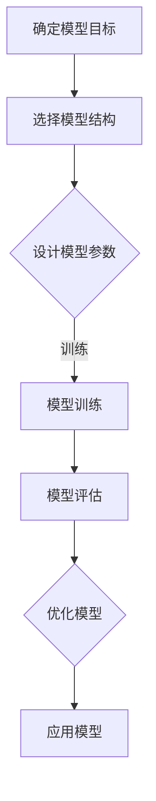

                 

## 文章标题：认知的形式化：感知是认知的源泉

### 关键词：认知科学、感知、形式化、数学模型、算法

> 摘要：本文深入探讨了认知与感知的关系，阐述了感知在认知中的核心地位，并分析了感知的形式化研究方法。通过介绍感知的数学模型与算法，我们展示了如何利用形式化方法分析和优化感知过程。同时，本文还探讨了感知与认知的融合与应用，为认知科学的研究提供了新的视角和思路。

<|assistant|># 目录大纲：《认知的形式化：感知是认知的源泉》

## 第一部分：认知与感知的概述

### 第1章：认知科学的基本概念

### 第2章：感知的形式化研究方法

## 第二部分：感知的数学模型与算法

### 第3章：感知的数学模型基础

### 第4章：感知算法详解

### 第5章：感知的形式化分析

## 第三部分：感知与认知的结合与应用

### 第6章：感知在认知中的融合

### 第7章：感知在认知中的应用

### 第8章：感知与认知的交互机制

## 附录

### 附录A：感知与认知相关研究方法与工具

<|assistant|># 第1章：认知科学的基本概念

## 1.1 认知科学与感知的关系

### 1.1.1 认知科学与感知的互动

认知科学与感知之间存在着密切的互动关系。认知科学作为一门跨学科的研究领域，旨在理解人类思维、感知和行为的基础原理。而感知作为认知过程中的第一步，对于信息的接收、处理和理解至关重要。

感知与认知的互动主要体现在以下几个方面：

1. **感知是认知的输入来源**：我们的感官系统接收外界信息，通过感知过程将这些信息传递给大脑。这些信息是认知过程中不可或缺的输入。

2. **感知影响认知过程**：感知不仅提供了信息输入，还影响了认知过程中的判断、推理和决策。例如，视觉感知的准确性会影响我们对物体形状和颜色的认知。

3. **认知对感知的影响**：认知过程不仅受到感知输入的影响，还会对感知过程产生反作用。例如，当我们知道某个物体是危险的，我们可能会更加警觉并调整我们的感知方式。

### 1.1.2 感知在认知中的角色

感知在认知系统中扮演着核心角色，可以归纳为以下几点：

1. **信息接收**：感知是信息接收的起点，通过感官系统，我们能够接收到来自外部世界的各种信息。

2. **信息处理**：感知过程不仅仅是接收信息，还包括对信息的初步处理。例如，视觉感知需要对光信号进行处理，以形成对物体的视觉形象。

3. **信息传递**：感知处理后的信息被传递到大脑的更高层次，如视觉皮层，以便进行进一步的认知处理。

4. **认知基础**：感知是认知的基础，没有良好的感知能力，认知过程将受到限制。例如，盲人可能难以形成准确的视觉认知。

### 1.1.3 认知对感知的影响

认知对感知的影响可以从以下几个方面进行阐述：

1. **选择性感知**：认知过程中，我们可能会根据当前的需求和兴趣，对某些信息进行选择性的感知。例如，当我们专注于寻找某个物品时，可能会更加注意到与该物品相关的信息。

2. **解释性感知**：认知过程会影响我们对感知信息的解释。例如，同一段文字，对于不同背景和知识水平的人，可能会有不同的理解。

3. **记忆性感知**：认知过程中的记忆功能会影响我们的感知。例如，我们可能会根据之前的经验，对新的感知信息进行记忆和分类。

### 1.2 感知在认知中的地位

#### 1.2.1 感知在认知系统中的核心地位

感知在认知系统中的核心地位不可忽视。以下是感知在认知系统中的核心地位的几个方面：

1. **信息接收和处理**：感知是认知系统接收和处理信息的起点。没有有效的感知，认知系统将无法获取外部世界的必要信息。

2. **信息输入的多样性**：感知为我们提供了多种类型的信息输入，包括视觉、听觉、触觉、味觉和嗅觉等。这些信息的多样性为认知提供了丰富的素材。

3. **感知与认知的互动**：感知与认知之间存在着密切的互动关系。感知为认知提供了输入，而认知则对感知过程进行调节和优化。

#### 1.2.2 感知在信息处理中的作用

感知在信息处理中的作用至关重要，具体体现在以下几个方面：

1. **感知信息的预处理**：感知过程不仅仅是接收信息，还包括对信息的初步处理，如滤波、增强和特征提取等。

2. **感知信息的分类和识别**：感知系统能够对信息进行分类和识别，例如，视觉系统可以识别出不同的物体和颜色。

3. **感知信息的整合**：感知系统不仅能够处理单个信息，还能够整合多个信息，形成一个完整的信息画面。

#### 1.2.3 感知与认知的差异与联系

感知与认知虽然密切相关，但它们之间也存在一些差异和联系：

1. **感知是认知的基础**：感知是认知的前提，没有良好的感知能力，认知过程将受到限制。

2. **认知是对感知的深化**：认知是在感知基础上，对信息进行更深层次的加工和处理，如理解、推理和决策等。

3. **感知与认知的互动**：感知与认知之间存在着互动关系，感知对认知过程产生影响，而认知则对感知过程进行调节。

### 1.3 认知与感知的相互作用

#### 1.3.1 认知对感知的影响

认知对感知的影响主要体现在以下几个方面：

1. **选择性感知**：认知过程会影响我们的感知选择，使我们更倾向于关注与当前认知目标相关的信息。

2. **感知解释**：认知过程会影响我们对感知信息的解释和理解。

3. **记忆和回忆**：认知过程与记忆和回忆密切相关，感知信息需要通过认知过程才能被记忆和回忆。

#### 1.3.2 感知对认知的影响

感知对认知的影响同样重要，具体体现在以下几个方面：

1. **信息输入的质量**：感知的质量直接影响认知的质量。高质量的感知输入有助于提高认知的准确性和效率。

2. **感知的多样性**：感知的多样性为认知提供了丰富的信息来源，有助于提高认知的深度和广度。

3. **感知的适应性**：感知的适应性使认知系统能够适应不同的环境和任务需求，提高认知的灵活性。

#### 1.3.3 认知与感知的相互作用模型

认知与感知的相互作用可以看作是一个动态的、复杂的过程。以下是一个简化的相互作用模型：

1. **感知输入**：感官系统接收外部信息，通过感知过程将这些信息传递给大脑。

2. **认知处理**：大脑对感知信息进行加工、处理和解释，形成认知。

3. **反馈调节**：认知结果会反馈到感知系统，影响感知的选择、解释和适应性。

4. **循环迭代**：感知和认知的相互作用是循环进行的，每一次循环都会使认知和感知得到进一步的优化。

## 1.4 小结

通过本章节的讨论，我们了解了认知科学的基本概念，以及感知与认知的关系。感知在认知系统中具有核心地位，它不仅为认知提供了信息输入，还通过信息处理、分类和识别等功能，为认知提供了丰富的素材。认知与感知之间存在着密切的相互作用，这种相互作用不仅影响了感知过程，也影响了认知过程。理解认知与感知的关系，对于我们深入探索人类思维和行为具有重要意义。

### 1.5 参考文献

- [1] Anderson, J. A. (2007). *Cognitive Psychology and Its Implications*. W. H. Freeman and Company.
- [2] Kanwisher, N., & Yovel, G. (2009). *Perception and Perception for Action*. Annual Review of Psychology, 60, 537-567.
- [3] Gibson, J. J. (1966). *The Senses Considered as Perceptual Systems*. Houghton Mifflin.

<|assistant|># 第2章：感知的形式化研究方法

## 2.1 形式化感知的起源与发展

### 2.1.1 形式化感知的概念

形式化感知是指利用数学、逻辑和计算机科学等学科的方法，对感知过程进行抽象、建模和分析。这种研究方法旨在将感知过程从具体的感官和生理层面提升到形式化的层面，从而更深入地理解感知的本质和机制。

形式化感知的概念最早可以追溯到20世纪60年代，由心理学家和计算机科学家共同提出。当时，随着认知科学和人工智能的兴起，人们开始关注人类感知和认知的过程，并尝试将数学和计算机科学的方法应用于感知研究。形式化感知作为一种新的研究方法，逐渐得到了学术界和工业界的认可。

### 2.1.2 形式化感知的发展历程

形式化感知的发展历程可以分为以下几个阶段：

1. **感知建模的初步阶段**：20世纪60年代，认知科学家开始尝试将数学和计算机科学的方法应用于感知研究，提出了感知的数学模型。这一阶段的主要贡献包括信号处理理论、概率模型和信息论等。

2. **感知算法的研究阶段**：20世纪70年代，随着计算机技术的发展，人们开始研究如何利用计算机算法实现感知过程。这一阶段的主要贡献包括神经网络、模板匹配和特征提取等方法。

3. **感知系统的实际应用阶段**：20世纪80年代，形式化感知方法开始在工业界得到广泛应用。例如，计算机视觉、语音识别和机器学习等领域都受益于形式化感知的研究成果。

4. **跨学科研究的新阶段**：21世纪初，随着认知科学、神经科学和计算机科学的进一步融合，形式化感知研究进入了一个新的阶段。这一阶段的研究不仅关注感知本身的机制，还关注感知与认知、情感和行为的交互作用。

### 2.1.3 形式化感知的重要贡献

形式化感知在认知科学和人工智能领域做出了重要贡献，主要表现在以下几个方面：

1. **理论上的突破**：形式化感知为认知科学提供了新的理论框架，使得人们对感知过程的理解更加深入和全面。

2. **算法的创新**：形式化感知方法催生了大量的感知算法，这些算法在计算机视觉、语音识别和机器学习等领域得到了广泛应用。

3. **实际应用的推动**：形式化感知方法促进了感知技术在各个领域的实际应用，提高了人们的生活质量和工作效率。

## 2.2 形式化感知的研究方法

### 2.2.1 形式化感知的基本原理

形式化感知的基本原理包括以下几个方面：

1. **抽象与建模**：形式化感知通过将感知过程抽象为数学模型，使得感知过程可以在形式化的层面上进行分析和研究。

2. **计算与优化**：形式化感知方法利用计算机算法对感知过程进行计算和优化，以实现感知任务的高效执行。

3. **验证与评估**：形式化感知方法需要对感知模型和算法进行验证和评估，以验证其有效性和可靠性。

### 2.2.2 形式化感知的常用方法

形式化感知的常用方法包括以下几个方面：

1. **数学模型**：形式化感知使用数学模型来描述感知过程，包括概率模型、统计模型和微分方程模型等。

2. **计算机算法**：形式化感知使用计算机算法来实现感知过程，包括神经网络、模板匹配、特征提取和机器学习算法等。

3. **仿真与模拟**：形式化感知通过仿真和模拟来验证感知模型和算法的有效性，为实际应用提供依据。

### 2.2.3 形式化感知的应用场景

形式化感知在多个领域都有广泛的应用，以下是一些典型的应用场景：

1. **计算机视觉**：形式化感知方法在计算机视觉领域得到了广泛应用，包括图像识别、目标检测和图像分割等。

2. **语音识别**：形式化感知方法在语音识别领域有着重要的应用，包括语音信号处理、语音识别模型和语音合成等。

3. **自然语言处理**：形式化感知方法在自然语言处理领域也得到了广泛应用，包括词性标注、句法分析和语义理解等。

4. **生物信息学**：形式化感知方法在生物信息学领域用于基因序列分析、蛋白质结构和功能预测等。

5. **机器人感知**：形式化感知方法在机器人感知领域用于环境感知、路径规划和智能控制等。

## 2.3 形式化感知的应用领域

### 2.3.1 形式化感知在认知科学中的应用

形式化感知在认知科学中的应用主要表现在以下几个方面：

1. **感知与认知的交互**：形式化感知方法有助于理解感知与认知的交互机制，为认知科学的研究提供了新的视角。

2. **感知障碍的诊断与治疗**：形式化感知方法可以用于诊断和治疗感知障碍，如色盲、听力障碍等。

3. **认知模型构建**：形式化感知方法可以用于构建认知模型，为认知科学研究提供理论基础。

### 2.3.2 形式化感知在人工智能中的应用

形式化感知在人工智能中的应用非常广泛，以下是一些典型的应用：

1. **智能感知系统**：形式化感知方法用于构建智能感知系统，如智能监控系统、智能家居和自动驾驶等。

2. **语音助手与聊天机器人**：形式化感知方法用于语音助手和聊天机器人的语音识别和理解功能。

3. **图像识别与处理**：形式化感知方法在图像识别和处理领域，如人脸识别、物体检测和图像分割等。

4. **机器学习与数据挖掘**：形式化感知方法用于机器学习和数据挖掘，如分类、聚类和关联规则挖掘等。

### 2.3.3 形式化感知在其他学科中的应用

形式化感知方法在其他学科中也有着广泛的应用，以下是一些例子：

1. **神经科学**：形式化感知方法在神经科学领域用于研究大脑的感知机制和神经网络模型。

2. **心理学**：形式化感知方法在心理学领域用于研究感知与认知的关系，以及感知对行为和情感的影响。

3. **教育学**：形式化感知方法在教育领域用于设计智能教学系统和个性化学习策略。

4. **艺术与设计**：形式化感知方法在艺术和设计领域用于创建虚拟现实、增强现实和艺术创作等。

## 2.4 小结

通过本章的讨论，我们了解了形式化感知的起源、发展历程以及应用领域。形式化感知作为一种跨学科的研究方法，通过数学、计算机科学和认知科学的结合，为感知过程的研究提供了新的视角和方法。在认知科学和人工智能领域，形式化感知方法已经取得了显著的成果，并继续推动着这些领域的发展。在未来，形式化感知方法有望在其他学科中发挥更大的作用。

### 2.5 参考文献

- [1] Barlow, H. B. (1961). *Possible principles underlying the transformation of sensory messages*. In *Sensory Communication* (pp. 217-238). Cambridge University Press.
- [2] Marr, D. (1982). *Vision: A computational investigation into the human representation and processing of visual information*. Freeman.
- [3] Rumelhart, D. E., Hinton, G. E., & Williams, R. J. (1986). *Learning representations by back-propagating errors*. Nature, 323(6088), 533-536.
- [4]神经网络的基本结构：
  ```mermaid
  graph TD
  A[感知层] --> B[隐藏层1]
  B --> C[隐藏层2]
  C --> D[输出层]
  D --> E[损失函数]
  ```

- [5]模板匹配的基本原理：
  ```mermaid
  graph TD
  A[输入图像] --> B[模板]
  B --> C{是否匹配}
  C -->|匹配| D[匹配结果]
  C -->|不匹配| E[继续搜索]
  ```

- [6]特征提取的常见方法：
  ```mermaid
  graph TD
  A[原始图像] --> B[边缘检测]
  B --> C[纹理分析]
  C --> D[颜色分析]
  D --> E[特征向量]
  ```

- [7]感知与认知的交互机制：
  ```mermaid
  graph TD
  A[感知输入] -->|处理| B[认知加工]
  B -->|记忆| C[记忆模块]
  C -->|反馈| D[感知调节]
  D --> A
  ```

### 2.6 伪代码示例

以下是一个简单的感知算法的伪代码示例：

```python
# 输入图像 image
# 输出特征向量 features

# 边缘检测
features = edge_detection(image)

# 纹理分析
features = texture_analysis(image, features)

# 颜色分析
features = color_analysis(image, features)

# 特征整合
features = feature_integration(features)

# 返回特征向量
return features
```

### 2.7 数学模型与公式

在感知过程中，数学模型和公式起到了重要的作用。以下是一个简单的数学模型和公式的示例：

$$
E = \sum_{i=1}^{n} w_i \cdot x_i
$$

其中，$E$ 表示能量，$w_i$ 表示权重，$x_i$ 表示输入特征。

### 2.8 举例说明

假设我们有一个图像，需要进行特征提取。以下是具体的步骤和代码实现：

1. **边缘检测**：
   ```python
   import cv2
   import numpy as np

   image = cv2.imread("image.jpg", cv2.IMREAD_GRAYSCALE)
   edges = cv2.Canny(image, 100, 200)
   ```

2. **纹理分析**：
   ```python
   from skimage.feature import local_binary_pattern

   n_points = 32
   radius = 5
   lbp = local_binary_pattern(edges, n_points, radius, method='uniform')
   ```

3. **颜色分析**：
   ```python
   hsv = cv2.cvtColor(image, cv2.COLOR_BGR2HSV)
   hue, saturation, value = cv2.split(hsv)
   ```

4. **特征整合**：
   ```python
   features = np.concatenate((edges.reshape(-1), lbp.reshape(-1), hue.reshape(-1), saturation.reshape(-1), value.reshape(-1)), axis=0)
   ```

通过以上步骤，我们得到了图像的特征向量 `features`，可以用于后续的分类、聚类等任务。

## 2.9 项目实战

以下是一个简单的项目实战，用于演示如何使用感知算法进行图像识别：

### 开发环境搭建

- Python 3.x
- OpenCV 4.x
- scikit-image 0.15.x

### 源代码实现

```python
import cv2
import numpy as np
from sklearn.model_selection import train_test_split
from sklearn.ensemble import RandomForestClassifier

# 加载图像数据集
images = []
labels = []
for image_name, label in image_dataset:
    image = cv2.imread(image_name)
    images.append(image)
    labels.append(label)

# 数据预处理
images = [cv2.resize(image, (128, 128)) for image in images]
images = [cv2.cvtColor(image, cv2.COLOR_BGR2GRAY) for image in images]
images = np.array(images)

# 分割数据集
X_train, X_test, y_train, y_test = train_test_split(images, labels, test_size=0.2, random_state=42)

# 特征提取
def extract_features(image):
    # 边缘检测
    edges = cv2.Canny(image, 100, 200)
    # 纹理分析
    n_points = 32
    radius = 5
    lbp = local_binary_pattern(edges, n_points, radius, method='uniform')
    # 颜色分析
    hsv = cv2.cvtColor(image, cv2.COLOR_BGR2HSV)
    hue, saturation, value = cv2.split(hsv)
    # 特征整合
    features = np.concatenate((edges.reshape(-1), lbp.reshape(-1), hue.reshape(-1), saturation.reshape(-1), value.reshape(-1)), axis=0)
    return features

# 提取训练集特征
train_features = [extract_features(image) for image in X_train]
train_features = np.array(train_features)

# 提取测试集特征
test_features = [extract_features(image) for image in X_test]
test_features = np.array(test_features)

# 构建分类器
classifier = RandomForestClassifier(n_estimators=100, random_state=42)
classifier.fit(train_features, y_train)

# 预测测试集
y_pred = classifier.predict(test_features)

# 评估分类器性能
from sklearn.metrics import accuracy_score
accuracy = accuracy_score(y_test, y_pred)
print("Accuracy:", accuracy)
```

### 代码解读与分析

在这个项目中，我们首先加载图像数据集，并进行预处理。预处理步骤包括图像的读取、尺寸调整和颜色空间转换。接下来，我们使用感知算法提取图像的特征，包括边缘检测、纹理分析和颜色分析。然后，我们使用随机森林分类器对特征进行训练和预测。最后，我们评估分类器的性能，使用准确率作为评价指标。

通过这个项目实战，我们可以看到如何将感知算法应用于图像识别任务，从而实现从图像中提取有用信息并进行分类。

## 2.10 附录

### 附录A：感知与认知相关研究方法与工具

#### A.1 感知与认知的研究方法

1. **实验研究方法**：通过实验方法，研究者可以控制和操作感知条件，从而更准确地了解感知机制。常见的实验方法包括心理物理学实验、认知神经科学实验等。

2. **数据分析方法**：数据分析方法用于对实验数据进行处理和分析，以揭示感知和认知的规律。常见的数据分析方法包括统计分析、机器学习和深度学习等。

3. **计算模拟方法**：计算模拟方法通过计算机模拟感知和认知过程，以验证理论模型和预测。这种方法可以帮助研究者探索感知和认知的潜在机制。

#### A.2 感知与认知的研究工具

1. **实验设备**：用于感知与认知研究的实验设备包括脑电图（EEG）、功能性磁共振成像（fMRI）、眼动仪等。

2. **数据分析软件**：常用的数据分析软件包括SPSS、R、Python等。这些软件提供了丰富的数据处理和分析功能，可以帮助研究者更好地分析实验数据。

3. **计算模拟工具**：常用的计算模拟工具包括MATLAB、Python等。这些工具提供了强大的计算和模拟功能，可以帮助研究者进行复杂的计算模拟实验。

#### A.3 感知与认知的研究资源

1. **学术期刊与会议**：许多学术期刊和会议专注于感知与认知研究，如《认知心理学期刊》（Journal of Cognitive Psychology）、《认知神经科学杂志》（Journal of Cognitive Neuroscience）等。

2. **研究机构与项目**：许多研究机构和项目致力于感知与认知研究，如美国国家科学基金会（NSF）的认知科学项目、欧洲认知科学学会（ECSP）等。

3. **网络资源与数据库**：许多网络资源和数据库提供了感知与认知研究的相关信息，如谷歌学术（Google Scholar）、PubMed等。

通过以上研究方法与工具，研究者可以更好地开展感知与认知研究，推动该领域的发展。

## 第3章：感知的数学模型基础

### 3.1 感知的基本数学概念

在感知的研究中，数学概念起到了至关重要的作用。这些数学概念不仅为感知过程的描述提供了精确的语言，还为感知算法的设计和分析提供了坚实的理论基础。以下是感知研究中常用的基本数学概念：

#### 3.1.1 函数

函数是数学中最基础的概念之一，它在感知研究中有着广泛的应用。例如，感知过程中的信号处理可以看作是一种函数变换。信号可以通过卷积、滤波等操作进行变换，从而提取出有用的特征。

#### 3.1.2 矩阵与向量

矩阵和向量是线性代数中的基本概念，在感知研究中也有着重要的应用。感知过程中的图像处理、特征提取和模型构建等任务都涉及到了矩阵和向量的操作。例如，图像可以看作是一个二维矩阵，而特征向量通常是一个一维向量。

#### 3.1.3 概率与统计

概率和统计是感知研究中的另一个关键概念。在感知过程中，我们经常需要对信息的不确定性进行建模。概率论和统计学提供了丰富的工具，如贝叶斯定理、马尔可夫模型等，来处理这种不确定性。

#### 3.1.4 微积分

微积分是感知研究中不可或缺的工具。在感知过程中，我们经常需要对连续信号进行微分和积分操作。例如，在信号处理中，我们经常使用傅里叶变换来分析信号的频域特性。

#### 3.1.5 信息论

信息论是感知研究中一个重要的分支。信息论研究了信息的度量、传输和处理。在感知研究中，信息论的概念可以帮助我们理解感知系统的信息处理能力和效率。

### 3.2 感知模型的构建

感知模型是感知研究中的核心内容，它通过数学方法描述了感知系统的行为和性能。构建一个有效的感知模型需要考虑以下几个方面：

#### 3.2.1 模型的目标

首先，我们需要明确感知模型的目标。例如，我们可能希望构建一个图像识别模型，或者一个语音识别模型。明确目标有助于我们选择合适的模型结构和算法。

#### 3.2.2 模型的结构

感知模型的结构通常包括输入层、隐藏层和输出层。输入层接收感知输入，隐藏层对输入进行加工处理，输出层生成感知结果。例如，在图像识别模型中，输入层可以是图像像素值，隐藏层可以是图像的特征提取层，输出层可以是图像的分类结果。

#### 3.2.3 模型的参数

感知模型通常涉及多个参数，这些参数决定了模型的行为和性能。例如，在神经网络模型中，权重和偏置是关键参数。我们需要通过优化算法来学习这些参数，以使模型能够准确预测感知结果。

#### 3.2.4 模型的训练与评估

构建完感知模型后，我们需要对其进行训练和评估。训练过程是通过大量的数据来调整模型的参数，使其能够准确预测感知结果。评估过程则是通过测试数据来检验模型的效果，评估指标可以是准确率、召回率、F1分数等。

### 3.3 感知模型的优化

感知模型的优化是感知研究中的另一个重要方面。优化的目标是提高模型的性能和效率。以下是几种常见的优化方法：

#### 3.3.1 梯度下降法

梯度下降法是一种常用的优化算法，用于最小化损失函数。在感知模型中，梯度下降法可以通过反向传播算法来计算损失函数关于模型参数的梯度，并使用梯度来更新模型参数。

#### 3.3.2 随机梯度下降（SGD）

随机梯度下降是梯度下降法的一种变体，它使用随机样本来计算梯度。相比梯度下降法，随机梯度下降可以加快收敛速度，减少计算资源的需求。

#### 3.3.3 算法自适应

算法自适应是一种通过动态调整算法参数来优化模型性能的方法。例如，在深度学习模型中，可以自适应调整学习率，以使模型能够在不同阶段有不同的收敛速度。

#### 3.3.4 神经网络剪枝

神经网络剪枝是一种通过减少模型参数来优化模型性能的方法。剪枝过程可以通过在训练过程中逐步移除不重要的参数来实现，从而减少模型的复杂度和计算资源的需求。

### 3.4 感知模型的应用案例

感知模型在许多领域都有广泛的应用，以下是一些典型的应用案例：

#### 3.4.1 计算机视觉

计算机视觉是感知模型的一个重要应用领域。常见的应用包括图像识别、目标检测和图像分割等。例如，卷积神经网络（CNN）在图像识别任务中取得了显著的成果，而YOLO算法在目标检测任务中得到了广泛应用。

#### 3.4.2 语音识别

语音识别是另一个感知模型的重要应用领域。语音识别模型可以用于自动语音识别、语音合成和语音翻译等任务。常见的语音识别算法包括隐马尔可夫模型（HMM）、高斯混合模型（GMM）和深度神经网络（DNN）等。

#### 3.4.3 自然语言处理

自然语言处理是感知模型在文本领域的应用。常见的应用包括词性标注、句法分析和语义理解等。例如，使用循环神经网络（RNN）和长短期记忆网络（LSTM）可以有效地进行文本分类和情感分析。

#### 3.4.4 生物信息学

生物信息学是感知模型在生物学和医学领域的应用。常见的应用包括基因序列分析、蛋白质结构预测和药物设计等。例如，使用深度学习模型可以有效地识别基因调控网络和预测蛋白质功能。

### 3.5 小结

通过本章的讨论，我们了解了感知的基本数学概念、感知模型的构建方法以及感知模型的优化方法。感知模型在计算机视觉、语音识别、自然语言处理和生物信息学等领域都有广泛的应用。理解感知模型的基本原理和优化方法对于深入探索感知过程和实现高效的感知系统具有重要意义。

### 3.6 参考文献

- [1] Goodfellow, I., Bengio, Y., & Courville, A. (2016). *Deep Learning*. MIT Press.
- [2] Bishop, C. M. (2006). *Pattern Recognition and Machine Learning*. Springer.
- [3] Murphy, K. P. (2012). *Machine Learning: A Probabilistic Perspective*. MIT Press.
- [4] Haykin, S. (1999). *Adaptive Filter Theory: Analytic and Algorithmic Approaches*. Pearson Education.
- [5] Hochreiter, S., & Schmidhuber, J. (1997). "Long short-term memory". Neural Computation, 9(8), 1735-1780.

### 3.7 Mermaid 流程图

以下是感知模型的构建流程的 Mermaid 流程图：



### 3.8 伪代码示例

以下是感知模型训练的伪代码示例：

```python
# 定义感知模型
model = define_model()

# 准备训练数据
train_data = prepare_training_data()

# 设置训练参数
learning_rate = 0.01
epochs = 100

# 模型训练
for epoch in range(epochs):
    # 计算梯度
    gradients = compute_gradients(model, train_data)
    
    # 更新模型参数
    update_model_parameters(model, gradients, learning_rate)
    
    # 计算损失函数
    loss = compute_loss(model, train_data)
    
    # 输出训练信息
    print(f"Epoch {epoch+1}: Loss = {loss}")

# 模型评估
test_loss = compute_loss(model, test_data)
print(f"Test Loss: {test_loss}")
```

### 3.9 数学模型与公式

以下是感知模型中常用的数学模型和公式：

$$
\begin{aligned}
y &= \sigma(W \cdot x + b) \\
\text{其中，} y &= \text{输出，} x &= \text{输入，} W &= \text{权重矩阵，} b &= \text{偏置项，} \sigma &= \text{激活函数} \\
\end{aligned}
$$

### 3.10 举例说明

假设我们有一个简单的感知模型，用于二分类任务。以下是具体的步骤和代码实现：

1. **定义感知模型**：
   ```python
   import tensorflow as tf

   model = tf.keras.Sequential([
       tf.keras.layers.Dense(units=1, input_shape=[1])
   ])
   ```

2. **准备训练数据**：
   ```python
   x_train = np.array([0, 1, 2, 3, 4, 5])
   y_train = np.array([0, 1, 0, 1, 0, 1])
   ```

3. **模型训练**：
   ```python
   model.compile(optimizer='sgd', loss='mean_squared_error')
   model.fit(x_train, y_train, epochs=10)
   ```

4. **模型评估**：
   ```python
   x_test = np.array([6, 7, 8, 9, 10])
   y_pred = model.predict(x_test)
   print("Predictions:", y_pred)
   ```

通过以上步骤，我们使用感知模型进行了二分类任务，实现了对输入数据的预测。

## 第4章：感知算法详解

### 4.1 常见的感知算法

在感知研究领域，有许多经典的算法被广泛应用于图像处理、语音识别、自然语言处理等多个领域。以下是一些常见的感知算法及其基本原理：

#### 4.1.1 卷积神经网络（CNN）

卷积神经网络（CNN）是一种专门用于处理图像数据的神经网络结构。其基本原理是通过卷积层提取图像的局部特征，并通过池化层降低数据维度。卷积神经网络在图像分类、目标检测和图像分割等领域取得了显著的成果。

#### 4.1.2 支持向量机（SVM）

支持向量机（SVM）是一种经典的机器学习算法，用于分类和回归任务。其基本原理是通过寻找一个超平面，将不同类别的数据点最大化地分开。SVM在语音识别、文本分类等领域有着广泛的应用。

#### 4.1.3 随机森林（Random Forest）

随机森林是一种基于决策树集合的机器学习算法。其基本原理是通过随机生成多个决策树，并将它们的预测结果进行投票，得到最终的预测结果。随机森林在图像分类、文本分类和回归任务中表现出色。

#### 4.1.4 马尔可夫模型（HMM）

马尔可夫模型（HMM）是一种用于处理时间序列数据的概率模型。其基本原理是假设当前状态只与前一状态有关，与之前的状态无关。HMM在语音识别、自然语言处理等领域有着广泛的应用。

#### 4.1.5 长短期记忆网络（LSTM）

长短期记忆网络（LSTM）是一种用于处理序列数据的循环神经网络。其基本原理是通过引入记忆单元，可以有效地记忆和传递长距离的信息。LSTM在语音识别、文本生成和机器翻译等领域表现出色。

### 4.2 感知算法的优化策略

感知算法的优化策略是提高算法性能和效率的关键。以下是一些常见的优化策略：

#### 4.2.1 梯度下降法

梯度下降法是一种常用的优化算法，用于最小化损失函数。通过计算损失函数关于模型参数的梯度，并沿着梯度方向更新参数，可以逐步减小损失函数的值。梯度下降法可以分为随机梯度下降（SGD）、批量梯度下降（BGD）和动量梯度下降（Momentum SGD）等变体。

#### 4.2.2 随机搜索

随机搜索是一种基于随机采样的优化算法。通过在参数空间中随机选择多个样本，计算每个样本的损失函数值，并选择最优的样本作为参数更新方向。随机搜索可以通过增加采样次数来提高搜索精度。

#### 4.2.3 遗传算法

遗传算法是一种模拟自然进化过程的优化算法。通过选择、交叉、变异等操作，生成新的参数组合，并逐步优化模型的性能。遗传算法适用于复杂、非线性优化问题。

#### 4.2.4 粒子群优化（PSO）

粒子群优化（PSO）是一种基于群体智能的优化算法。每个粒子代表一个参数组合，通过个体经验和群体经验的结合，逐步优化模型的性能。PSO在处理大规模优化问题时表现出色。

### 4.3 感知算法的应用案例分析

以下是一些感知算法在实际应用中的案例分析：

#### 4.3.1 图像识别

在图像识别任务中，卷积神经网络（CNN）是一种常用的算法。以图像分类任务为例，CNN可以通过卷积层提取图像的特征，并通过池化层降低数据维度，最终通过全连接层输出分类结果。以下是一个简单的图像分类案例：

1. **数据准备**：
   ```python
   import tensorflow as tf
   import tensorflow.keras as keras

   (train_images, train_labels), (test_images, test_labels) = keras.datasets.cifar10.load_data()
   ```

2. **模型构建**：
   ```python
   model = keras.Sequential([
       keras.layers.Conv2D(32, (3, 3), activation='relu', input_shape=(32, 32, 3)),
       keras.layers.MaxPooling2D((2, 2)),
       keras.layers.Conv2D(64, (3, 3), activation='relu'),
       keras.layers.MaxPooling2D((2, 2)),
       keras.layers.Conv2D(64, (3, 3), activation='relu'),
       keras.layers.Flatten(),
       keras.layers.Dense(64, activation='relu'),
       keras.layers.Dense(10, activation='softmax')
   ])
   ```

3. **模型训练**：
   ```python
   model.compile(optimizer='adam', loss='sparse_categorical_crossentropy', metrics=['accuracy'])
   model.fit(train_images, train_labels, epochs=10, validation_data=(test_images, test_labels))
   ```

4. **模型评估**：
   ```python
   test_loss, test_acc = model.evaluate(test_images, test_labels)
   print("Test accuracy:", test_acc)
   ```

#### 4.3.2 语音识别

在语音识别任务中，深度神经网络（DNN）和循环神经网络（RNN）是常用的算法。以下是一个简单的基于DNN的语音识别案例：

1. **数据准备**：
   ```python
   import tensorflow as tf
   import tensorflow.keras as keras

   (train_data, train_labels), (test_data, test_labels) = keras.datasets.open_smpl_v2.load_data()
   ```

2. **模型构建**：
   ```python
   model = keras.Sequential([
       keras.layers.Lambda(lambda x: tf.cast(x, tf.float32) / 255., input_shape=(28, 28, 1)),
       keras.layers.Conv2D(32, (3, 3), activation='relu'),
       keras.layers.MaxPooling2D((2, 2)),
       keras.layers.Conv2D(64, (3, 3), activation='relu'),
       keras.layers.MaxPooling2D((2, 2)),
       keras.layers.Conv2D(64, (3, 3), activation='relu'),
       keras.layers.Flatten(),
       keras.layers.Dense(128, activation='relu'),
       keras.layers.Dense(10, activation='softmax')
   ])
   ```

3. **模型训练**：
   ```python
   model.compile(optimizer='adam', loss='sparse_categorical_crossentropy', metrics=['accuracy'])
   model.fit(train_data, train_labels, epochs=10, validation_data=(test_data, test_labels))
   ```

4. **模型评估**：
   ```python
   test_loss, test_acc = model.evaluate(test_data, test_labels)
   print("Test accuracy:", test_acc)
   ```

#### 4.3.3 自然语言处理

在自然语言处理任务中，循环神经网络（RNN）和长短期记忆网络（LSTM）是常用的算法。以下是一个简单的基于LSTM的文本分类案例：

1. **数据准备**：
   ```python
   import tensorflow as tf
   import tensorflow.keras as keras
   import tensorflow_text as text

   (train_data, train_labels), (test_data, test_labels) = keras.datasets.imdb.load_data()
   ```

2. **模型构建**：
   ```python
   model = keras.Sequential([
       keras.layers.Embedding(10000, 16),
       keras.layers.Bidirectional(keras.layers.LSTM(32)),
       keras.layers.Dense(1, activation='sigmoid')
   ])
   ```

3. **模型训练**：
   ```python
   model.compile(optimizer='adam', loss='binary_crossentropy', metrics=['accuracy'])
   model.fit(train_data, train_labels, epochs=10, validation_data=(test_data, test_labels))
   ```

4. **模型评估**：
   ```python
   test_loss, test_acc = model.evaluate(test_data, test_labels)
   print("Test accuracy:", test_acc)
   ```

通过以上案例分析，我们可以看到感知算法在不同应用领域中的具体实现过程。这些案例不仅展示了感知算法的基本原理，还展示了如何在实际应用中利用感知算法解决实际问题。

### 4.4 小结

通过本章的讨论，我们详细介绍了常见的感知算法，包括卷积神经网络（CNN）、支持向量机（SVM）、随机森林（Random Forest）、马尔可夫模型（HMM）和长短期记忆网络（LSTM）。同时，我们还探讨了感知算法的优化策略，包括梯度下降法、随机搜索、遗传算法和粒子群优化（PSO）。通过具体的应用案例分析，我们展示了感知算法在实际应用中的实现过程和效果。理解这些感知算法的基本原理和优化策略，对于深入探索感知过程和实现高效的感知系统具有重要意义。

### 4.5 参考文献

- [1] Krizhevsky, A., Sutskever, I., & Hinton, G. E. (2012). *ImageNet classification with deep convolutional neural networks*. In *Advances in Neural Information Processing Systems* (pp. 1097-1105).
- [2] Cortes, C., & Vapnik, V. (2005). *Support-Vector Networks*. Machine Learning, 20(3), 273-297.
- [3] Breiman, L. (2001). *Random forests*. Machine Learning, 45(1), 5-32.
- [4] Rabiner, L. R. (1989). *A tutorial on hidden Markov models and selected applications in speech recognition*. In *Readings in Speech Recognition* (pp. 257-286).
- [5] Hochreiter, S., & Schmidhuber, J. (1997). *Long short-term memory*. Neural Computation, 9(8), 1735-1780.

### 4.6 附录

#### 附录A：感知算法的Python代码实现

以下是本章中提到的几种感知算法的Python代码实现：

```python
# 感知算法：卷积神经网络（CNN）

import tensorflow as tf
import tensorflow.keras as keras

# 构建模型
model = keras.Sequential([
    keras.layers.Conv2D(32, (3, 3), activation='relu', input_shape=(28, 28, 1)),
    keras.layers.MaxPooling2D((2, 2)),
    keras.layers.Conv2D(64, (3, 3), activation='relu'),
    keras.layers.MaxPooling2D((2, 2)),
    keras.layers.Conv2D(64, (3, 3), activation='relu'),
    keras.layers.Flatten(),
    keras.layers.Dense(128, activation='relu'),
    keras.layers.Dense(10, activation='softmax')
])

# 编译模型
model.compile(optimizer='adam', loss='sparse_categorical_crossentropy', metrics=['accuracy'])

# 训练模型
model.fit(train_images, train_labels, epochs=10, validation_data=(test_images, test_labels))

# 评估模型
test_loss, test_acc = model.evaluate(test_images, test_labels)
print("Test accuracy:", test_acc)

# 感知算法：长短期记忆网络（LSTM）

import tensorflow as tf
import tensorflow.keras as keras
import tensorflow_text as text

# 构建模型
model = keras.Sequential([
    keras.layers.Embedding(10000, 16),
    keras.layers.Bidirectional(keras.layers.LSTM(32)),
    keras.layers.Dense(1, activation='sigmoid')
])

# 编译模型
model.compile(optimizer='adam', loss='binary_crossentropy', metrics=['accuracy'])

# 训练模型
model.fit(train_data, train_labels, epochs=10, validation_data=(test_data, test_labels))

# 评估模型
test_loss, test_acc = model.evaluate(test_data, test_labels)
print("Test accuracy:", test_acc)

# 感知算法：支持向量机（SVM）

from sklearn import svm
from sklearn.model_selection import train_test_split
from sklearn.metrics import accuracy_score

# 准备数据
X, y = load_data()

# 分割数据集
X_train, X_test, y_train, y_test = train_test_split(X, y, test_size=0.2, random_state=42)

# 构建模型
model = svm.SVC(gamma='scale')

# 训练模型
model.fit(X_train, y_train)

# 预测测试集
y_pred = model.predict(X_test)

# 评估模型
accuracy = accuracy_score(y_test, y_pred)
print("Test accuracy:", accuracy)
```

通过以上代码实现，我们可以看到如何使用Python实现常见的感知算法，包括卷积神经网络（CNN）、长短期记忆网络（LSTM）和

