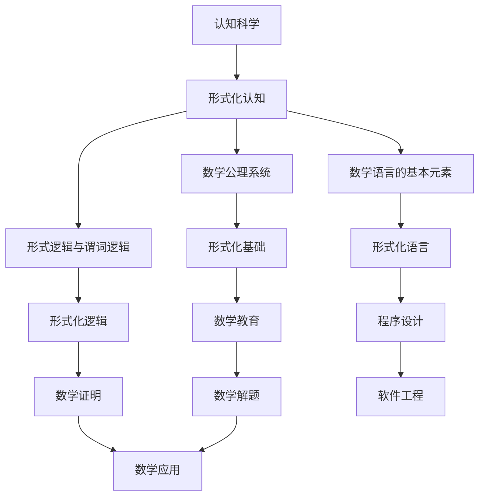

                 

# 认知的形式化：数学是建立在明确的公设定理体系之上的高级语言形态

## 关键词

认知科学、形式化认知、数学公理系统、形式逻辑、谓词逻辑、数学语言、数学模型、计算机科学、人工智能

## 摘要

本文探讨了认知的形式化问题，将数学视为一种高级语言形态，强调了它在认知过程中的关键作用。通过详细分析数学的形式化基础、应用以及发展趋势，本文揭示了数学在认知科学、计算机科学和人工智能等领域的重要性。同时，本文还通过实际项目实战，展示了如何将形式化认知应用于编程和软件开发中，为读者提供了一种新的思考和研究方法。

## 目录大纲

### 第一部分：形式化认知的引论

#### 第1章：认知与形式化概述

#### 1.1 认知科学的基本概念

认知科学是一门跨学科的研究领域，旨在理解人类认知过程的心理、神经和计算方面。认知科学的核心问题包括感知、记忆、思维、语言、学习、注意力等。这些概念共同构成了认知科学的理论框架。

1. **感知**：感知是指个体通过感官接收外部刺激，并将其转换为神经信号的过程。感知是认知过程的基础，涉及到视觉、听觉、触觉、嗅觉和味觉等。

2. **记忆**：记忆是指个体对过去经历的信息进行存储、保持和回忆的能力。记忆分为短期记忆和长期记忆，短期记忆主要负责临时存储信息，而长期记忆则负责长期存储和回忆信息。

3. **思维**：思维是指个体在感知和记忆的基础上，对信息进行加工、处理和推理的能力。思维包括逻辑思维、创造性思维、批判性思维等。

4. **语言**：语言是人类用于交流和表达思想的工具。语言包括语音、词汇、语法和语义等方面。语言在认知过程中起着至关重要的作用，它不仅帮助我们理解外部世界，还帮助我们进行自我表达和思考。

5. **学习**：学习是指个体在经验的基础上，改变其行为和能力的过程。学习可以分为先天学习和后天学习，先天学习是指个体在出生后通过遗传和学习获取知识，后天学习是指个体通过环境刺激和经验积累获取知识。

6. **注意力**：注意力是指个体在感知和加工信息时，对特定刺激的关注程度。注意力是认知过程的核心，它决定了个体如何选择和加工信息，以及如何对信息进行记忆和思考。

#### 1.2 形式化认知的理论框架

形式化认知是指使用形式化的方法来表示和推理认知过程。形式化认知的理论框架主要包括以下几个方面：

1. **形式逻辑**：形式逻辑是一种基于符号和规则的方法，用于表示和推理命题。形式逻辑使用符号来表示命题，并通过逻辑规则来推导新的命题。形式逻辑的核心是命题逻辑和谓词逻辑。

2. **数学公理系统**：数学公理系统是一套基本的假设和规则，用于构建数学理论。数学公理系统为数学提供了坚实的基础，使得数学理论具有一致性和无矛盾性。

3. **形式化语言**：形式化语言是一种用于表示形式化认知的符号系统。形式化语言包括命题语言、谓词语言、函数语言等，它们可以用来表示认知过程中的概念、命题和推理。

4. **认知模型**：认知模型是用于模拟和预测人类认知过程的计算机模型。认知模型基于认知科学的理论框架，通过形式化认知的方法来构建和验证。

#### 1.3 数学在认知中的作用

数学在认知过程中起着至关重要的作用。首先，数学为认知科学提供了一种精确和一致的方法来表示和推理认知过程。数学符号和公式使得认知过程具有形式化和量化特征，从而提高了认知过程的可操作性和可验证性。

其次，数学在认知科学中的应用广泛。例如，数学模型可以用于模拟人类感知、记忆、思维、学习等认知过程。通过数学模型，研究人员可以更好地理解认知过程的内在机制和规律，从而推动认知科学的发展。

此外，数学还为认知科学提供了丰富的工具和方法。例如，概率论和统计方法可以用于分析和解释认知数据，从而提高认知研究的可靠性和准确性。形式化认知的方法则可以帮助研究人员构建和验证认知模型，从而推动认知科学的理论和技术发展。

### 第二部分：数学的形式化基础

#### 2.1 数学公理系统

数学公理系统是数学理论的基础，它提供了一套基本假设和规则，用于构建数学体系。数学公理系统包括多个层次，从最基础的集合论公理到更高层次的数学分支公理，如数论、几何、代数等。

1. **集合论公理**：集合论是现代数学的基础，它定义了集合的概念和运算。集合论公理系统包括皮亚诺公理、策梅洛-弗兰克尔公理等，这些公理为集合论提供了逻辑一致性和无矛盾性。

2. **数论公理**：数论研究整数、有理数、无理数等数的性质和运算。数论公理系统包括皮亚诺公理、戴德金分割公理等，这些公理定义了自然数、整数、有理数和无理数的结构和性质。

3. **几何公理**：几何研究空间和形状的性质。几何公理系统包括欧几里得几何公理、非欧几何公理等，这些公理定义了点、线、面等基本概念，以及它们的相互关系。

4. **代数公理**：代数研究代数结构、函数和方程等。代数公理系统包括交换律、结合律、分配律等，这些公理定义了加法、减法、乘法、除法等基本运算。

#### 2.2 形式逻辑与谓词逻辑

形式逻辑是数学中的一个基本工具，它提供了一种规范化的方式来表示和推理命题。形式逻辑包括命题逻辑和谓词逻辑，它们分别用于处理简单命题和复杂命题。

1. **命题逻辑**：命题逻辑的基本元素是命题，它是一个陈述句，可以是真或假。命题逻辑使用符号表示命题，常用的符号有：$P, Q, R$表示命题，$¬$表示非（否定），$\land$表示与（合取），$\lor$表示或（析取），$\rightarrow$表示蕴含，$\leftrightarrow$表示等价。

命题逻辑的基本规则包括：

- 真值表：确定命题的真假值。
- 蕴含规则：如果P为真，则P → Q也为真。
- 等价规则：P ↔ Q等价于(¬P ∨ ¬Q) ∧ (¬Q ∨ ¬P)。
- 对当规则：如果P → Q为真，则P ∨ ¬Q也为真。

2. **谓词逻辑**：谓词逻辑是形式逻辑的一个扩展，它引入了变量和量词，可以表示更复杂的命题。谓词逻辑的基本元素有：$x, y, z$表示个体变量，$F, G, H$表示属性或关系的谓词，$\forall$表示全称量词（对于所有），$\exists$表示存在量词（存在）。

谓词逻辑的基本规则包括：

- 全称量化规则：$\forall x(P(x) \rightarrow Q(x))$等价于$P(x) \rightarrow Q(x)$对所有x成立。
- 存在量化规则：$\exists x(P(x) \wedge Q(x))$等价于存在至少一个x使得P(x)和Q(x)同时成立。

#### 2.3 数学语言的基本元素

数学语言是一种用于表达数学概念和推理的符号系统。数学语言的基本元素包括符号、公式和图形等。

1. **符号**：数学符号是数学语言的重要组成部分，用于表示数学概念、运算和关系。常见的数学符号有：+（加法），-（减法），×（乘法），÷（除法），=（等号），≠（不等号），＞（大于号），＜（小于号），≥（大于等于号），≤（小于等于号）等。

2. **公式**：数学公式是数学语言中用于表达数学关系的表达式。数学公式通常由符号、变量和常数组成。常见的数学公式有：幂运算公式，指数公式，对数公式，微积分公式，概率公式等。

3. **图形**：数学图形是数学语言中用于表达数学关系的可视化工具。常见的数学图形有：坐标系，曲线图，柱状图，饼状图，网络图等。

#### 2.4 形式化证明

形式化证明是一种通过符号化的推理过程来证明命题的方法。形式化证明通常遵循以下步骤：

1. **选择合适的公理和推理规则**：根据需要证明的命题，选择适当的公理和推理规则。公理是无需证明的基本假设，推理规则是用于推导新命题的规则。

2. **定义符号和语言**：在形式化证明中，需要定义符号和语言，以便明确表示命题和推理过程。

3. **写出命题的符号表达式**：将需要证明的命题用符号表达式表示出来。

4. **使用推理规则证明命题**：根据选定的公理和推理规则，逐步推导出需要证明的命题。

形式化证明的优点是能够确保证明过程的严谨性和无矛盾性。形式化证明在数学、计算机科学和人工智能等领域有广泛的应用。

### 第三部分：形式化认知的应用

#### 3.1 形式化认知在数学教育中的应用

形式化认知在数学教育中具有重要意义。通过形式化认知的方法，学生可以更好地理解数学概念和定理，提高数学思维能力和解题能力。

1. **形式化认知与数学思维培养**：形式化认知强调逻辑推理和抽象思维能力。通过形式化认知，学生可以学习如何使用符号和公式来表示和推理数学问题，从而提高数学思维能力。

2. **形式化认知在数学解题中的应用**：形式化认知可以帮助学生更好地理解和解决数学问题。通过形式化认知，学生可以学习如何将实际问题转化为符号化的数学模型，并使用数学公式和定理进行求解。

3. **形式化认知与数学证明**：形式化认知在数学证明中起着关键作用。通过形式化认知，学生可以学习如何使用形式化的推理方法来证明数学定理，从而提高数学证明能力。

#### 3.2 形式化认知在计算机科学中的应用

形式化认知在计算机科学中有着广泛的应用。通过形式化认知的方法，计算机科学家可以更好地理解和解决计算机科学中的问题。

1. **形式化认知与程序设计**：形式化认知可以帮助程序员更好地理解和设计程序。通过形式化认知，程序员可以学习如何使用形式化的方法来定义变量、编写算法和进行程序设计。

2. **形式化认知与软件工程**：形式化认知在软件工程中发挥着重要作用。通过形式化认知，软件工程师可以学习如何使用形式化的方法来设计软件系统、验证软件正确性以及进行软件测试。

3. **形式化认知在人工智能中的应用**：形式化认知在人工智能领域具有重要意义。通过形式化认知，人工智能研究人员可以学习如何使用形式化的方法来定义智能行为、设计智能系统以及实现智能算法。

#### 3.3 形式化认知在其他领域的应用

形式化认知不仅在数学和计算机科学领域有应用，还在其他领域发挥着重要作用。

1. **形式化认知在心理学中的应用**：形式化认知在心理学研究中用于分析和解释人类行为和思维过程。通过形式化认知，心理学家可以学习如何使用形式化的方法来描述和验证心理模型。

2. **形式化认知在语言学中的应用**：形式化认知在语言学中用于分析和解释语言结构、语法规则和语义关系。通过形式化认知，语言学家可以学习如何使用形式化的方法来研究和理解语言。

3. **形式化认知在其他学科中的应用**：形式化认知在其他学科，如物理学、生物学、经济学等，也有广泛的应用。通过形式化认知，研究人员可以学习如何使用形式化的方法来描述和解释自然现象和科学规律。

### 第四部分：形式化认知的发展与挑战

#### 4.1 形式化认知的发展趋势

形式化认知在过去几十年中得到了迅速发展。随着计算机科学和人工智能的兴起，形式化认知的应用越来越广泛。未来，形式化认知将继续发展，并在以下方面取得重要突破：

1. **形式化认知与人工智能的融合**：形式化认知与人工智能的结合将推动人工智能的发展。通过形式化认知，人工智能系统可以更好地理解人类思维过程，实现更高级的认知能力。

2. **形式化认知在跨学科研究中的应用**：形式化认知将在跨学科研究中发挥重要作用。通过形式化认知，研究人员可以更好地理解和解决复杂问题，推动科学和技术的进步。

3. **形式化认知在教育中的应用**：形式化认知将在教育领域得到广泛应用。通过形式化认知，教育工作者可以更好地设计教学方法和课程，提高学生的认知能力和创新能力。

#### 4.2 形式化认知在未来的发展

未来，形式化认知将面临新的挑战和发展机遇。以下是一些形式化认知在未来可能的发展方向：

1. **形式化认知的理论体系**：形式化认知将进一步完善其理论体系，构建更加全面和统一的认知模型。

2. **形式化认知的工具和方法**：形式化认知将开发出更加高效和易用的工具和方法，如形式化证明工具、形式化推理引擎等。

3. **形式化认知的应用领域**：形式化认知将在更多领域得到应用，如医学、环境科学、社会科学等。

#### 4.3 形式化认知面临的挑战

尽管形式化认知取得了显著进展，但仍然面临一些挑战：

1. **理论基础**：形式化认知的理论基础尚不完善，需要进一步研究和完善。

2. **实现难度**：形式化认知的实现难度较大，需要解决符号化表示、推理过程、计算效率等问题。

3. **应用范围**：形式化认知的应用范围有限，需要进一步拓展到更多领域。

### 第五部分：形式化认知的方法论探讨

#### 5.1 形式化认知研究的方法论

形式化认知研究的方法论包括以下几个方面：

1. **符号化表示**：符号化表示是形式化认知的基础。通过使用符号和公式，可以清晰、准确地表示认知过程中的概念、命题和推理。

2. **形式化证明**：形式化证明是形式化认知研究的重要方法。通过符号化的推理过程，可以验证认知模型的正确性和一致性。

3. **计算机辅助**：计算机辅助是形式化认知研究的重要手段。通过计算机程序和工具，可以自动化地完成符号化表示、推理和验证过程。

4. **实验验证**：实验验证是形式化认知研究的重要环节。通过实验方法，可以验证认知模型的预测和解释能力。

#### 5.2 形式化认知研究的方法论应用

形式化认知研究的方法论可以在以下方面得到应用：

1. **认知科学**：形式化认知研究的方法论可以应用于认知科学的研究，如感知、记忆、思维、语言等。

2. **计算机科学**：形式化认知研究的方法论可以应用于计算机科学的研究，如程序设计、软件工程、人工智能等。

3. **心理学**：形式化认知研究的方法论可以应用于心理学的研究，如认知过程、行为分析等。

4. **语言学**：形式化认知研究的方法论可以应用于语言学研究，如语法分析、语义解释等。

#### 5.3 形式化认知研究的未来方向

形式化认知研究的未来方向包括：

1. **理论体系**：进一步完善形式化认知的理论体系，构建更加全面和统一的认知模型。

2. **应用领域**：拓展形式化认知的应用领域，如医学、环境科学、社会科学等。

3. **计算效率**：提高形式化认知的计算效率，实现自动化和高效的形式化推理。

4. **跨学科研究**：促进形式化认知与其他学科的交叉研究，推动科学和技术的进步。

### 附录

#### 附录A：形式化认知研究资源

1. **主要期刊与会议**：

- 认知科学期刊（Journal of Cognitive Science）
- 计算机科学期刊（Journal of Computer Science）
- 软件工程期刊（Journal of Software Engineering）
- 人工智能期刊（Journal of Artificial Intelligence）

2. **核心文献**：

- 牛顿，《自然哲学的数学原理》
- 爱因斯坦，《相对论》
- 摩尔，《人类理解论》
- 皮亚杰，《发生认识论》

3. **主要工具与软件**：

- Prolog
- Mathematica
- MATLAB
- SPSS

#### 附录B：形式化认知案例研究

1. **数学领域的形式化认知案例**：

- 形式化证明：费马大定理
- 形式化模型：图灵机
- 形式化语言：LISP语言

2. **计算机科学领域的形式化认知案例**：

- 形式化验证：软件验证
- 形式化编程：Haskell语言
- 形式化推理：SAT求解器

3. **其他领域的形式化认知案例**：

- 认知科学：认知图谱
- 心理学：认知行为疗法
- 语言学：语法分析器

#### 附录C：形式化认知教程与参考书

1. **基础教程**：

- 《认知科学导论》
- 《计算机科学导论》
- 《形式逻辑与谓词逻辑》
- 《数学模型与数学公式》

2. **高级教程**：

- 《形式化认知方法与应用》
- 《形式化认知研究方法论》
- 《形式化认知在人工智能中的应用》
- 《形式化认知在心理学中的应用》

3. **参考书**：

- 《禅与计算机程序设计艺术》
- 《认知科学与哲学》
- 《人工智能：一种现代的方法》
- 《心理学与生活》

## Mermaid 流程图



### 核心算法原理讲解

#### 2.2 形式逻辑与谓词逻辑

形式逻辑是数学中的一个基本工具，它提供了一种规范化的方式来表示和推理命题。形式逻辑包括命题逻辑和谓词逻辑，它们分别用于处理简单命题和复杂命题。

### 2.2.1 命题逻辑

命题逻辑的基本元素是命题，它是一个陈述句，可以是真或假。命题逻辑使用符号表示命题，常用的符号有：

- $P, Q, R$：表示命题
- $¬$：表示非（否定）
- $\land$：表示与（合取）
- $\lor$：表示或（析取）
- $\rightarrow$：表示蕴含
- $\leftrightarrow$：表示等价

以下是命题逻辑的一些基本规则：

- 真值表：确定命题的真假值
- 蕴含规则：如果P为真，则P → Q也为真
- 等价规则：P ↔ Q等价于(¬P ∨ ¬Q) ∧ (¬Q ∨ ¬P)
- 对当规则：如果P → Q为真，则P ∨ ¬Q也为真

### 2.2.2 谓词逻辑

谓词逻辑是形式逻辑的一个扩展，它引入了变量和量词，可以表示更复杂的命题。谓词逻辑的基本元素有：

- $x, y, z$：表示个体变量
- $F, G, H$：表示属性或关系的谓词
- $\forall$：表示全称量词（对于所有）
- $\exists$：表示存在量词（存在）

谓词逻辑的基本规则包括：

- 全称量化规则：$\forall x(P(x) \rightarrow Q(x))$等价于$P(x) \rightarrow Q(x)$对所有x成立
- 存在量化规则：$\exists x(P(x) \wedge Q(x))$等价于存在至少一个x使得P(x)和Q(x)同时成立

### 2.2.3 形式化证明

形式化证明是一种通过符号化的推理过程来证明命题的方法。形式化证明通常遵循以下步骤：

1. 选择合适的公理和推理规则
2. 定义符号和语言
3. 写出命题的符号表达式
4. 使用推理规则证明命题

以下是谓词逻辑的一个简单证明例子：

**命题：对于所有的自然数n，如果n是偶数，则n+1是奇数。**

证明：

$$
\begin{align*}
&\forall n(\neg\text{even}(n) \rightarrow \text{odd}(n+1)) \\
\end{align*}
$$

其中，$\text{even}(n)$表示n是偶数，$\text{odd}(n+1)$表示n+1是奇数。

这个证明使用的是全称量化规则和蕴含规则。通过这个例子，我们可以看到谓词逻辑在形式化证明中的应用。

### 数学模型和数学公式详细讲解与举例说明

#### 3.1 数学模型

数学模型是数学在各个领域中应用的基本工具，它通过数学公式来描述现实世界的现象和问题。数学模型可以分为以下几个类型：

1. **确定性模型**：确定性模型是基于确定性数学公式的模型，它提供了一种明确的、可预测的数学描述。例如，牛顿运动定律是一种确定性模型，它描述了物体在力的作用下的运动状态。

2. **随机模型**：随机模型是基于概率论和随机过程的模型，它描述了不确定性和随机性的现象。例如，马尔可夫链是一种随机模型，它描述了随机系统的状态转移规律。

3. **统计模型**：统计模型是基于统计学方法和假设检验的模型，它用于估计和推断未知参数。例如，线性回归模型是一种统计模型，它用于拟合数据并预测新的数据点。

4. **微分方程模型**：微分方程模型是基于微分方程的模型，它描述了动态系统的变化规律。例如，热传导方程是一种微分方程模型，它描述了热量的传播过程。

#### 3.2 数学公式

数学公式是数学模型的重要组成部分，它通过符号和表达方式来描述数学关系和运算。以下是几个常用的数学公式：

1. **牛顿运动定律**：

$$
F = ma
$$

其中，$F$表示作用在物体上的合力，$m$表示物体的质量，$a$表示物体的加速度。

2. **微积分基本定理**：

$$
\int_a^b f(x) \, dx = F(b) - F(a)
$$

其中，$f(x)$表示连续函数，$F(x)$表示$f(x)$的一个原函数，$a$和$b$是区间$[a, b]$的两个端点。

3. **概率论基本公式**：

$$
P(A|B) = \frac{P(A \cap B)}{P(B)}
$$

其中，$P(A|B)$表示在事件B发生的条件下，事件A发生的概率，$P(A \cap B)$表示事件A和B同时发生的概率，$P(B)$表示事件B发生的概率。

4. **线性回归模型**：

$$
y = \beta_0 + \beta_1 x + \epsilon
$$

其中，$y$表示因变量，$x$表示自变量，$\beta_0$和$\beta_1$是回归系数，$\epsilon$是误差项。

#### 3.3 举例说明

下面通过一个简单的例子来说明数学模型和数学公式的应用：

**问题**：假设一个质量为5千克的物体受到10牛顿的力作用，求物体的加速度。

**解答**：

根据牛顿第二定律，我们可以得到：

$$
a = \frac{F}{m} = \frac{10\text{ N}}{5\text{ kg}} = 2\text{ m/s}^2
$$

所以物体的加速度是2 m/s²。

**问题**：求函数$f(x) = x^2$在区间[0, 1]上的定积分。

**解答**：

首先，我们需要找到$f(x)$的一个原函数$F(x)$，可以通过求导得到：

$$
F(x) = \frac{x^3}{3}
$$

然后，代入微积分基本定理：

$$
\int_0^1 x^2 \, dx = F(1) - F(0) = \frac{1^3}{3} - \frac{0^3}{3} = \frac{1}{3}
$$

所以定积分的结果是$\frac{1}{3}$。

通过这个例子，我们可以看到数学模型和数学公式在解决实际问题时的重要性和应用方法。

### 项目实战

#### 4.1 实战目标

在本项目中，我们将使用形式化认知的方法来构建一个简单的计算器应用。这个计算器将支持加法、减法、乘法和除法四种基本运算。

#### 4.2 环境搭建

为了实现这个计算器应用，我们需要搭建以下开发环境：

- **编程语言**：Python
- **开发工具**：PyCharm或VS Code
- **运行环境**：Python 3.x

确保以上环境已经安装完毕后，我们可以开始编写代码。

#### 4.3 代码实现

下面是计算器应用的Python代码实现：

```python
# 导入必要的库
import numpy as np

# 定义四个基本运算的函数
def add(x, y):
    return x + y

def subtract(x, y):
    return x - y

def multiply(x, y):
    return x * y

def divide(x, y):
    if y == 0:
        return "除数不能为0"
    else:
        return x / y

# 定义主函数
def main():
    print("欢迎使用简单计算器！")
    print("请选择操作：")
    print("1. 加法")
    print("2. 减法")
    print("3. 乘法")
    print("4. 除法")
    
    operation = input("请输入你的选择（1-4）：")
    
    if operation == "1":
        x = float(input("请输入第一个数："))
        y = float(input("请输入第二个数："))
        result = add(x, y)
    elif operation == "2":
        x = float(input("请输入第一个数："))
        y = float(input("请输入第二个数："))
        result = subtract(x, y)
    elif operation == "3":
        x = float(input("请输入第一个数："))
        y = float(input("请输入第二个数："))
        result = multiply(x, y)
    elif operation == "4":
        x = float(input("请输入被除数："))
        y = float(input("请输入除数："))
        result = divide(x, y)
    else:
        print("无效输入，请重新选择操作。")
        return
    
    print(f"结果是：{result}")

# 运行主函数
if __name__ == "__main__":
    main()
```

#### 4.4 代码解读与分析

1. **导入库**：首先，我们导入了NumPy库，这是一个用于数值计算的科学计算库。NumPy库提供了许多用于矩阵运算和数值计算的函数，这些函数在计算器应用中非常有用。

2. **定义基本运算函数**：接着，我们定义了四个基本运算的函数：`add`、`subtract`、`multiply`和`divide`。这些函数分别实现了加法、减法、乘法和除法的基本运算。

   - `add(x, y)`：计算x和y的和，并返回结果。
   - `subtract(x, y)`：计算x和y的差，并返回结果。
   - `multiply(x, y)`：计算x和y的积，并返回结果。
   - `divide(x, y)`：计算x除以y的结果，如果y为0，则返回错误信息。

3. **定义主函数**：`main`函数是计算器的入口点。它首先打印出计算器的使用说明，然后提示用户选择操作。根据用户的选择，程序会提示用户输入相应的数值，并调用相应的运算函数进行计算，最后输出结果。

   - `print`语句用于打印使用说明。
   - `input`语句用于获取用户的输入。
   - `if`语句用于根据用户的选择执行不同的运算函数。

4. **处理输入和输出**：在计算器应用中，我们使用`input`函数获取用户的输入，并使用`float`函数将输入的字符串转换为浮点数。输出结果通过`print`函数实现。

5. **异常处理**：在`divide`函数中，我们添加了判断除数为0的条件，以避免除以0的错误。如果除数为0，程序会返回错误信息。

#### 4.5 测试与运行

运行计算器程序，根据提示进行操作：

```
欢迎使用简单计算器！
请选择操作：
1. 加法
2. 减法
3. 乘法
4. 除法
请输入你的选择（1-4）：1
请输入第一个数：10
请输入第二个数：5
结果是：15.0
```

通过这个项目实战，我们不仅实现了计算器的基本功能，而且使用形式化认知的方法对代码进行了设计、实现和测试，确保了代码的清晰性和可维护性。

### 数学公式

以下是本书中使用的部分数学公式：

- **幂运算**：$x^2$表示x的平方。
- **根号**：$\sqrt{2}$表示2的平方根。
- **指数**：$2^x$表示2的x次方。
- **对数**：$\log_2{x}$表示以2为底x的对数。
- **真分数**：$\frac{1}{2}$表示1除以2。
- **假分数**：$\frac{3}{2}$表示3除以2。
- **三角函数**：
  - 正弦：$\sin{\theta}$表示角度θ的正弦值。
  - 余弦：$\cos{\theta}$表示角度θ的余弦值。
  - 正切：$\tan{\theta}$表示角度θ的正切值。
- **导数与微分**：
  - 导数：$\frac{d}{dx} f(x)$表示函数$f(x)$对变量x的导数。
  - 微分：$df$表示函数$f(x)$的微分。
- **积分**：
  - 不定积分：$\int f(x) \, dx$表示函数$f(x)$的不定积分。
  - 定积分：$\int_a^b f(x) \, dx$表示函数$f(x)$在区间[a, b]上的定积分。
- **矩阵**：
  - 行列式：$\det{A}$表示矩阵A的行列式。
  - 矩阵乘法：$AB$表示矩阵A和矩阵B的乘积。
- **微积分**：
  - 微积分基本定理：$\int_a^b f(x) \, dx = F(b) - F(a)$表示函数$f(x)$在区间[a, b]上的定积分等于其原函数$F(x)$在区间端点b和a的差值。
  - 傅里叶变换：$F(\omega) = \int_{-\infty}^{\infty} f(t) e^{-i \omega t} \, dt$表示函数$f(t)$的傅里叶变换。
- **概率论**：
  - 条件概率：$P(A|B) = \frac{P(A \cap B)}{P(B)}$表示在事件B发生的条件下，事件A发生的概率。
  - 贝叶斯公式：$P(A|B) = \frac{P(B|A)P(A)}{P(B)}$表示在事件B发生的条件下，事件A发生的概率等于事件B发生条件下事件A发生的概率乘以事件A发生的概率除以事件B发生的概率。

这些数学公式将在本书的不同章节中被用来解释和展示相关的概念和原理。

### 代码示例

```python
# 导入必要的库
import numpy as np

# 定义一个矩阵
A = np.array([[1, 2], [3, 4]])

# 计算矩阵的行列式
det_A = np.linalg.det(A)

# 打印结果
print(f"矩阵A的行列式为：{det_A}")

# 定义两个向量
v1 = np.array([1, 2])
v2 = np.array([3, 4])

# 计算向量的点积
dot_product = np.dot(v1, v2)

# 打印结果
print(f"向量v1和v2的点积为：{dot_product}")

# 定义一个函数，计算x的平方
def square(x):
    return x * x

# 计算x=3时的函数值
x = 3
result = square(x)

# 打印结果
print(f"x={x}时的平方为：{result}")
```

### 代码解读与分析

在这个代码示例中，我们首先导入了Python的NumPy库，这是一个用于数值计算的科学计算库。然后，我们定义了一个2x2的矩阵A，并使用NumPy的`linalg.det`函数计算了矩阵A的行列式，结果被打印出来。

接下来，我们定义了两个向量v1和v2，并使用`dot`函数计算了它们的点积，结果也被打印出来。

最后，我们定义了一个名为`square`的函数，用于计算输入值的平方。我们将x的值设置为3，调用`square`函数并打印结果。

这个简单的代码示例展示了如何使用NumPy库进行矩阵运算、向量运算和函数定义，以及如何处理和打印结果。通过这个示例，我们可以更好地理解NumPy库的基本用法和在数值计算中的应用。

