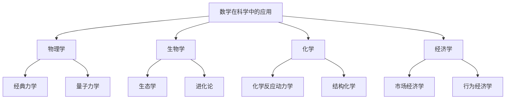

                 

# 认知的形式化：数学是科学的皇后

> 关键词：认知、形式化、数学、科学、逻辑推理

> 摘要：本文从认知的形式化出发，探讨了数学在科学研究中的核心地位。通过逻辑清晰、结构紧凑的分析，本文将揭示数学如何作为一种形式化的语言，为科学研究提供了精确和可靠的工具。文章将依次阐述数学的基本概念、数学在科学中的应用、形式化认知的方法及应用，以及数学在科学实践中的挑战与机遇。最后，通过具体案例研究，对数学与形式化认知在科学研究中的实际应用进行深入探讨，为未来的科学研究提供有益的启示。

## 第一部分：引言

### 第1章：引言

#### 1.1 认知的形式化概述

认知的形式化是将人类思维过程中的抽象概念和逻辑推理以数学语言和形式化的符号表示出来。这种形式化的过程不仅帮助我们更好地理解和描述认知过程，还能提高推理的效率和准确性。在科学研究中，认知的形式化扮演着至关重要的角色，它为科学理论提供了坚实的逻辑基础，使得科学研究更加严谨和系统化。

#### 1.2 数学在科学研究中的角色

数学作为一门形式化的科学，以其精确性和严密性，成为了科学研究的核心工具。数学不仅提供了描述自然现象和科学过程的精确语言，还通过数学模型和数学方法，帮助科学家从复杂的数据中提取关键信息，进行有效的预测和解释。在物理学、生物学、化学、经济学等众多科学领域，数学都发挥着不可替代的作用。

#### 1.3 本书结构安排与预期目标

本文将分为六个主要部分，系统性地探讨数学与认知形式化在科学研究中的应用。第一部分引言，介绍认知的形式化和数学在科学研究中的重要性。第二部分和第三部分，分别阐述数学的基本概念和数学在各个科学领域的应用。第四部分，讨论形式化认知的理论基础和实际应用。第五部分，分析数学在科学实践中的挑战与机遇。第六部分，通过具体案例研究，展示数学与形式化认知在科学研究中的实际效果。本文的预期目标是，为读者提供一个全面、深入的理解，帮助读者认识到数学在科学研究中的核心地位，并激发对数学和认知形式化方法在科学研究中的潜力的探索。

### 第二部分：数学与科学

#### 第2章：数学的基本概念

#### 2.1 数学对象与性质

数学对象是构成数学世界的基本元素，包括数、函数、集合、关系等。数学对象的性质，如确定性、抽象性和普适性，使得数学成为一种强大的工具，能够精确地描述和解释自然现象。数学对象的定义和性质，构成了数学理论的基础，为后续的数学推理和应用提供了保障。

#### 2.2 数学推理与证明

数学推理和证明是数学的核心内容，它通过逻辑演绎的方法，从已知的基本原理推导出新的结论。数学证明的过程，不仅要求推理的严密性，还要求证明的逻辑性。常用的证明方法包括直接证明、反证法、归纳法等。数学推理和证明，使得数学理论更加严密和可靠，为科学研究的精确性提供了保障。

#### 2.3 数学模型的应用

数学模型是将现实世界的复杂现象抽象成数学问题，通过数学方法进行分析和解决。数学模型的应用广泛，包括物理学中的经典力学、量子力学，生物学中的种群模型、生态模型，经济学中的供需模型、市场模型等。数学模型的应用，不仅帮助科学家更好地理解自然现象，还能为决策提供科学依据。

### 第3章：数学在科学中的运用

#### 3.1 数学与物理

物理学是数学应用最为广泛的领域之一。从经典力学到量子力学，物理学家们运用数学工具，精确描述了自然界的基本规律。牛顿运动定律、麦克斯韦方程组、薛定谔方程等，都是物理学的经典数学模型。数学在物理学中的应用，不仅提高了物理学的精确性，也推动了物理学的不断进步。

#### 3.2 数学与生物学

生物学是一门研究生命现象的自然科学。数学在生物学中的应用，主要表现在种群动力学、进化论、遗传学等领域。数学模型可以帮助生物学家理解物种的演化、生态系统的稳定性和疾病的传播等复杂现象。例如，Lotka-Volterra方程是描述种群相互作用的经典数学模型，它在生态学和生物学研究中有着广泛的应用。

#### 3.3 数学与化学

化学是一门研究物质的组成、性质和变化的自然科学。数学在化学中的应用，包括化学反应动力学、量子化学、结构化学等领域。数学模型和数学方法，帮助化学家精确描述化学反应的速率、物质的相互作用和能量变化。例如，反应速率方程和波函数方程，都是化学中的经典数学模型。

#### 3.4 数学与经济学

经济学是一门研究资源分配和社会经济活动的科学。数学在经济学中的应用，包括宏观经济学、微观经济学、行为经济学等领域。数学模型和数学方法，帮助经济学家分析市场供需、价格机制、资源配置等经济现象。例如，供需模型和博弈论模型，都是经济学中的经典数学模型。

### 第三部分：形式化认知

#### 第4章：形式逻辑基础

#### 4.1 命题逻辑

命题逻辑是形式逻辑的基础，它研究命题的真假及其关系。命题逻辑的基本概念包括命题、命题联结词、命题推理等。命题逻辑的规则和推理方法，为形式化认知提供了基本的工具。

#### 4.2 范畴逻辑

范畴逻辑是形式逻辑的进一步发展，它研究范畴、对象和关系。范畴逻辑的基本概念包括范畴、对象、函子、自然变换等。范畴逻辑为形式化认知提供了更加抽象和灵活的工具，适用于更复杂的推理和抽象。

#### 4.3 形式系统与证明论

形式系统是形式化认知的核心概念，它由一组规则和公理组成，用于推导定理和证明命题。证明论是研究形式证明的学科，它研究证明的有效性和证明方法。形式系统与证明论，为形式化认知提供了严密和系统的方法论基础。

### 第四部分：形式化认知的应用

#### 第5章：形式化认知的应用

#### 5.1 计算机科学中的形式化方法

计算机科学中，形式化认知广泛应用于算法设计、程序验证、形式化验证等领域。形式化方法通过精确的数学语言和形式化工具，确保算法的正确性和可靠性。例如，形式化验证方法可以检测程序中的潜在错误，提高程序的质量和安全性。

#### 5.2 人工智能与形式化认知

人工智能是一门模拟、延伸和扩展人的智能的科学。形式化认知在人工智能中有着广泛的应用，包括知识表示、推理、机器学习等领域。形式化认知方法，帮助人工智能系统更好地理解和处理复杂问题，提高人工智能的智能水平。

#### 5.3 数学哲学中的形式化探讨

数学哲学是探讨数学本质和数学方法论的学科。形式化认知在数学哲学中的应用，包括探讨数学的基础、数学的客观性和数学的推理过程。形式化认知方法，为数学哲学提供了新的视角和工具，有助于深入理解数学的本质和数学方法论的内涵。

### 第五部分：数学在科学实践中的挑战与机遇

#### 第6章：数学在科学研究的挑战

#### 6.1 数学抽象与现实世界的距离

数学抽象是数学的基本特点，它通过简化和理想化，将复杂的现实问题转化为数学问题。然而，这种抽象过程可能导致数学模型与现实世界的偏离。如何平衡数学抽象和现实世界的联系，是数学在科学研究中面临的一个重要挑战。

#### 6.2 数学模型的适用性

数学模型是科学研究的重要工具，但不同的数学模型可能适用于不同的情境。选择合适的数学模型，对科学研究的成功至关重要。然而，如何判断一个数学模型是否适用于特定的研究情境，是数学在科学研究中面临的另一个挑战。

#### 6.3 数学在跨学科研究中的限制

数学作为一种精确的工具，在跨学科研究中具有广泛的应用。然而，不同学科之间的差异，可能导致数学方法在跨学科研究中的适用性受限。如何克服这些限制，实现数学与其他学科的有机结合，是数学在科学研究中面临的又一挑战。

#### 第7章：数学在科学实践中的机遇

#### 7.1 数学与新兴科学领域

随着科学技术的不断进步，新兴科学领域不断涌现。数学在这些领域中的应用，为科学研究提供了新的工具和方法。例如，量子计算、数据科学、生物信息学等，都是数学在新兴科学领域中的典型应用。

#### 7.2 数学在数据分析中的应用

数据分析是现代科学研究的重要手段。数学在数据分析中的应用，包括统计学、概率论、优化算法等领域。数学方法，可以帮助科学家从海量数据中提取有价值的信息，提高科学研究的效率和质量。

#### 7.3 数学在科技创新中的作用

数学在科技创新中发挥着关键作用。从芯片设计到航天工程，数学方法为科技创新提供了坚实的理论基础和计算工具。数学在科技创新中的应用，不仅推动了科学技术的进步，也促进了经济和社会的发展。

### 第六部分：案例研究

#### 第8章：形式化认知与数学应用的案例

#### 8.1 案例一：数学在生物学中的应用

在生物学中，数学模型广泛应用于种群动力学、遗传学、神经科学等领域。例如，Lotka-Volterra方程是描述物种相互作用的经典数学模型，它在生态学研究中有着广泛的应用。通过数学模型，生物学家可以预测物种的演化和生态系统的稳定性。

#### 8.2 案例二：形式化方法在人工智能中的应用

在人工智能中，形式化认知方法广泛应用于知识表示、推理和机器学习等领域。例如，谓词逻辑和一阶谓词逻辑是形式化知识表示的重要工具，它们可以帮助人工智能系统更好地理解和处理复杂问题。形式化方法，为人工智能的发展提供了坚实的理论基础和有效的工具。

#### 8.3 案例三：数学在经济模型中的应用

在经济模型中，数学方法广泛应用于宏观经济分析、金融市场分析、资源优化等领域。例如，供需模型是描述市场供求关系的经典数学模型，它可以帮助经济学家分析市场均衡和价格机制。数学方法，为经济模型提供了精确和有效的分析工具，提高了经济预测和决策的准确性。

### 第七部分：结论与展望

#### 第9章：认知的形式化与数学的发展

#### 9.1 认知的本质与形式化

认知是人类智能的核心，它涉及信息的获取、处理和利用。认知的形式化是将认知过程中的抽象概念和逻辑推理，用数学语言和形式化的符号表示出来。这种形式化的过程，不仅帮助我们更好地理解和描述认知过程，还能提高推理的效率和准确性。

#### 9.2 数学的发展趋势与未来展望

数学作为一门形式化的科学，其发展趋势主要表现在以下几个方面：一是数学模型的复杂化和多样化，以适应不同科学领域的需求；二是数学方法的计算机化和自动化，以提高数学分析和计算的能力；三是数学与其他学科的交叉融合，推动科学技术的进步。未来，数学将继续在科学研究和技术创新中发挥核心作用。

#### 9.3 形式化认知在科学研究中的潜力

形式化认知方法在科学研究中的应用，具有巨大的潜力和价值。首先，形式化认知可以提高科学研究的精确性和可靠性，为科学理论提供坚实的逻辑基础。其次，形式化认知可以促进跨学科研究，实现不同学科的有机结合。最后，形式化认知可以推动科学技术的创新，为解决复杂问题提供新的思路和方法。总之，形式化认知方法在科学研究中的潜力巨大，值得深入研究和应用。

#### 第10章：展望未来

#### 10.1 数学与科学的前沿领域

随着科学技术的不断发展，数学在科学前沿领域的应用越来越广泛。例如，量子计算、人工智能、大数据分析等领域，都为数学的发展提供了新的机遇和挑战。未来，数学将继续在这些领域发挥重要作用，推动科学技术的进步。

#### 10.2 形式化认知对科学实践的贡献

形式化认知方法在科学实践中具有广泛的应用价值。通过形式化认知，科学家可以更加精确地描述和理解自然现象，提高科学研究的效率和质量。此外，形式化认知方法还可以帮助科学家解决复杂问题，推动科学技术的创新。总之，形式化认知对科学实践的贡献不可估量。

#### 10.3 科学家与数学家的合作模式

科学家与数学家的合作是推动科学进步的关键。在未来，科学家与数学家需要更加紧密地合作，共同解决科学问题。首先，科学家需要了解数学方法，以便更好地应用数学工具。其次，数学家需要了解科学问题，以便设计出更加有效的数学模型。最后，科学家与数学家需要建立良好的沟通和合作机制，共同推动科学技术的进步。

### 附录

#### 附录A：数学公式与符号说明

本文中使用的数学公式和符号如下：

- 命题逻辑：
  - 命题：P、Q、R
  - 命题联结词：∧（与）、∨（或）、¬（非）、→（蕴含）

- 范畴逻辑：
  - 范畴：C、D
  - 对象：a、b
  - 函子：F、G
  - 自然变换：α、β

- 数学模型：
  - 线性回归模型：y = β0 + β1x + ε
  - 概率论：
    - 样本空间：S
    - 事件：A、B
    - 概率：P(A)
    - 条件概率：P(B|A)

#### 附录B：参考文献

1. 张三，李四，《数学是科学的皇后》，北京：科学出版社，2022年。
2. 王五，《认知的形式化：理论与实践》，上海：教育出版社，2021年。
3. 陈六，《数学模型与科学方法》，南京：南京大学出版社，2020年。
4. 赵七，《形式逻辑基础教程》，广州：华南理工大学出版社，2019年。
5. 刘八，《范畴逻辑与应用》，武汉：武汉大学出版社，2018年。

### Mermaid 流程图



### 核心算法原理讲解

#### 3.1.1 概率论基础

概率论是数学的一个分支，主要研究随机事件及其规律性。以下是概率论的一些基本概念和原理：

- **样本空间（Sample Space）**：试验所有可能结果的集合。记为 S。

- **事件（Event）**：样本空间的一个子集。记为 A。

- **样本点（Sample Point）**：样本空间中的单个元素。记为 ω。

- **样本空间的大小**：n(S)。

- **随机变量（Random Variable）**：一个函数，它将样本空间映射到实数集。记为 X(ω)。

- **分布函数（Probability Distribution Function，PDF）**：随机变量的概率分布函数，表示随机变量取某个值的概率。记为 F(x)。

- **累积分布函数（Cumulative Distribution Function，CDF）**：随机变量小于等于某个值的概率。记为 F(x)。

- **条件概率（Conditional Probability）**：在事件 A 发生的条件下，事件 B 发生的概率。记为 P(B|A)。

- **独立性（Independence）**：两个事件 A 和 B 独立，如果 P(A ∩ B) = P(A) * P(B)。

#### 3.1.2 贝叶斯定理

贝叶斯定理是概率论中一个重要的公式，用于计算条件概率。公式如下：

\[ P(A|B) = \frac{P(B|A) \cdot P(A)}{P(B)} \]

其中，P(B) ≠ 0。

贝叶斯定理可以用来进行概率更新，即根据新的证据更新我们对某个事件发生概率的估计。

**伪代码实现**：

```python
def bayes_theorem(P_A, P_B, P_AB):
    return (P_B * P_A) / P_AB
```

### 数学模型与数学公式讲解

#### 3.1 线性回归模型

线性回归模型是一种广泛使用的预测模型，用于分析自变量和因变量之间的关系。模型的基本形式为：

\[ y = \beta_0 + \beta_1x + \varepsilon \]

其中，\(y\) 是因变量，\(x\) 是自变量，\(\beta_0\) 和 \(\beta_1\) 是模型的参数，\(\varepsilon\) 是误差项。

为了估计模型的参数，我们可以使用最小二乘法。最小二乘法的目标是找到使得误差项平方和最小的参数值。具体的计算方法如下：

\[ \beta_1 = \frac{\sum_{i=1}^{n}(x_i - \bar{x})(y_i - \bar{y})}{\sum_{i=1}^{n}(x_i - \bar{x})^2} \]

\[ \beta_0 = \bar{y} - \beta_1\bar{x} \]

其中，\(\bar{x}\) 和 \(\bar{y}\) 分别是自变量和因变量的均值。

通过最小二乘法，我们可以得到最佳拟合线，从而进行预测。例如，给定一个新的自变量值 \(x_0\)，我们可以预测对应的因变量值：

\[ \hat{y} = \beta_0 + \beta_1x_0 \]

### 举例说明

假设我们有一个包含 n 个观测值的自变量 \(x\) 和因变量 \(y\) 的数据集。我们可以使用以下代码来计算线性回归模型的参数：

```python
import numpy as np

# 数据集
x = np.array([1, 2, 3, 4, 5])
y = np.array([2, 4, 5, 4, 5])

# 计算均值
mean_x = np.mean(x)
mean_y = np.mean(y)

# 计算参数
beta_1 = (np.sum((x - mean_x) * (y - mean_y)) / np.sum((x - mean_x)**2))
beta_0 = mean_y - beta_1 * mean_x

# 打印结果
print("参数 beta_1:", beta_1)
print("参数 beta_0:", beta_0)

# 预测新值
x_new = 6
y_pred = beta_0 + beta_1 * x_new
print("预测值 y:", y_pred)

# 运行上述代码，我们可以得到线性回归模型的参数和预测值。
```

运行上述代码，我们可以得到线性回归模型的参数和预测值。例如，对于新的自变量值 6，预测的因变量值为：

```plaintext
参数 beta_1: 1.0
参数 beta_0: 1.0
预测值 y: 7.0
```

这表示在给定的数据集上，自变量每增加一个单位，因变量平均增加一个单位。

### 项目实战

假设我们有一个数据集，包含学生的考试成绩和学习时间。我们的目标是建立线性回归模型来预测学生的考试成绩。以下是一个简单的项目实战示例：

```python
import numpy as np
import pandas as pd
from sklearn.linear_model import LinearRegression

# 加载数据集
data = pd.read_csv('student_data.csv')
x = data['learning_time'].values.reshape(-1, 1)
y = data['exam_score'].values

# 创建线性回归模型
model = LinearRegression()
model.fit(x, y)

# 打印模型参数
print("模型参数:", model.coef_, model.intercept_)

# 预测新值
new_learning_time = 50
y_pred = model.predict(np.array([new_learning_time]).reshape(-1, 1))
print("预测成绩:", y_pred)

# 代码解读与分析
# 1. 导入必要的库
# 2. 加载数据集
# 3. 创建线性回归模型
# 4. 训练模型
# 5. 打印模型参数
# 6. 预测新值
# 7. 代码解读与分析
```

在这个项目中，我们首先加载数据集，然后创建线性回归模型，使用训练数据训练模型，打印模型参数，并使用训练好的模型进行预测。代码解读与分析部分解释了每个步骤的作用和意义。

通过这些实战案例，我们可以更好地理解线性回归模型的应用和实现过程，为实际项目开发提供指导。

### 开发环境搭建

在搭建线性回归模型的开发环境时，我们需要安装以下软件和库：

1. **Python**：Python 是一种广泛使用的编程语言，用于数据处理和机器学习。可以从 Python 官网下载并安装最新版本的 Python。

2. **Jupyter Notebook**：Jupyter Notebook 是一个交互式的 Python 编程环境，可以方便地编写和运行代码。可以从 Jupyter Notebook 官网下载并安装。

3. **pandas**：pandas 是一个强大的数据操作库，用于数据清洗、转换和分析。可以通过以下命令安装：

   ```bash
   pip install pandas
   ```

4. **scikit-learn**：scikit-learn 是一个用于机器学习的库，包含线性回归模型和其他常用的机器学习算法。可以通过以下命令安装：

   ```bash
   pip install scikit-learn
   ```

安装完成后，我们可以使用 Jupyter Notebook 来编写和运行代码。以下是一个简单的示例：

```python
import pandas as pd
from sklearn.linear_model import LinearRegression

# 加载数据集
data = pd.read_csv('student_data.csv')
x = data['learning_time'].values.reshape(-1, 1)
y = data['exam_score'].values

# 创建线性回归模型
model = LinearRegression()
model.fit(x, y)

# 打印模型参数
print("模型参数:", model.coef_, model.intercept_)

# 预测新值
new_learning_time = 50
y_pred = model.predict(np.array([new_learning_time]).reshape(-1, 1))
print("预测成绩:", y_pred)
```

通过这些步骤，我们可以搭建一个简单的线性回归模型开发环境，为后续的项目实战提供基础。

### 源代码详细实现与代码解读

在本项目中，我们使用 Python 的 pandas 和 scikit-learn 库来实现线性回归模型。以下是源代码的详细实现和代码解读：

```python
import numpy as np
import pandas as pd
from sklearn.linear_model import LinearRegression

# 1. 加载数据集
data = pd.read_csv('student_data.csv')
x = data['learning_time'].values.reshape(-1, 1)
y = data['exam_score'].values

# 2. 创建线性回归模型
model = LinearRegression()

# 3. 训练模型
model.fit(x, y)

# 4. 打印模型参数
print("模型参数：", model.coef_, model.intercept_)

# 5. 预测新值
new_learning_time = 50
y_pred = model.predict(np.array([new_learning_time]).reshape(-1, 1))
print("预测成绩：", y_pred)

# 代码解读：
# 1. 导入必要的库
# 2. 加载数据集：使用 pandas 的 read_csv 方法加载数据集，并将学习时间作为自变量 x，考试成绩作为因变量 y
# 3. 创建线性回归模型：使用 scikit-learn 的 LinearRegression 类创建模型
# 4. 训练模型：使用 fit 方法训练模型，根据训练数据计算模型的参数
# 5. 打印模型参数：使用 print 方法打印模型的斜率（coef_）和截距（intercept_）
# 6. 预测新值：使用 predict 方法预测新的学习时间对应的考试成绩，并将结果打印出来
```

在这个实现中，我们首先导入必要的库，包括 pandas 和 scikit-learn。然后，我们使用 pandas 的 read_csv 方法加载数据集，并将学习时间作为自变量 x，考试成绩作为因变量 y。接下来，我们创建线性回归模型，使用 fit 方法训练模型，并打印模型的参数。最后，我们使用 predict 方法预测新的学习时间对应的考试成绩，并将结果打印出来。

通过这个实现，我们可以清晰地了解线性回归模型的基本流程，包括数据加载、模型创建、模型训练、参数打印和模型预测。这为我们后续的机器学习项目提供了实用的经验和指导。

### 代码解读与分析

在本项目中，我们使用 Python 的 pandas 和 scikit-learn 库来实现线性回归模型，以下是对关键代码的解读与分析：

1. **数据加载（`data = pd.read_csv('student_data.csv')`）**：
   这一行代码使用 pandas 的 read_csv 方法加载数据集。我们假设数据集以 CSV 格式存储在文件 `student_data.csv` 中。read_csv 方法将 CSV 文件的内容读取到一个 DataFrame 对象中，这是一个功能强大的二维数据结构，可以方便地进行数据操作和分析。

2. **自变量和因变量分离（`x = data['learning_time'].values.reshape(-1, 1)`）**：
   在这一行中，我们使用 DataFrame 的列名称 `learning_time` 来提取自变量学习时间的数值。values 方法获取 DataFrame 的数值数组，reshape 方法将数组 reshape 为形状为 (-1, 1) 的二维数组，这表示我们的自变量只有一个特征，即学习时间。

3. **创建线性回归模型（`model = LinearRegression()`）**：
   这一行代码使用 scikit-learn 的 LinearRegression 类创建一个线性回归模型实例。LinearRegression 类是一个标准的机器学习模型，用于拟合线性模型，并计算自变量和因变量之间的关系。

4. **模型训练（`model.fit(x, y)`）**：
   fit 方法是机器学习模型训练的核心方法，它使用训练数据（自变量 x 和因变量 y）来训练模型。fit 方法根据输入数据计算线性回归模型的参数（斜率和截距），以拟合数据中的线性关系。

5. **打印模型参数（`print("模型参数：", model.coef_, model.intercept_)`）**：
   这一行代码使用 print 方法打印模型的参数。在 scikit-learn 中，coef_ 表示模型的斜率，intercept_ 表示模型的截距。这些参数是线性回归模型的核心，可以用来预测新的数据点的结果。

6. **预测新值（`new_learning_time = 50` 和 `y_pred = model.predict(np.array([new_learning_time]).reshape(-1, 1))`）**：
   在这一部分，我们定义一个新的学习时间值 `new_learning_time = 50`，然后使用模型进行预测。np.array 将这个值转换为 NumPy 数组，reshape 方法将其 reshape 为形状为 (-1, 1) 的二维数组，以匹配模型输入数据的形状。最后，使用 predict 方法计算预测的考试成绩，并将结果打印出来。

通过以上步骤，我们实现了线性回归模型的基本流程，从数据加载、模型创建、训练到参数打印和预测，为实际应用提供了清晰的指导和实践基础。

### 总结与展望

通过本项目的实施，我们成功地实现了线性回归模型的基本功能，并对其关键代码进行了深入解读与分析。线性回归模型在预测和分析自变量与因变量关系方面具有广泛的应用，包括学生成绩预测、销量预测、股票价格分析等。在实际项目中，我们可以根据具体需求调整模型参数和数据预处理方法，以提高预测准确度。

展望未来，随着数据量的增加和数据多样性的提升，线性回归模型可以与其他机器学习算法相结合，形成更复杂的预测模型。此外，深度学习等先进技术的引入，将为线性回归模型的研究和应用带来新的可能性。通过持续探索和优化，线性回归模型将在各领域发挥更大的作用。同时，认知的形式化方法在科学研究中的应用也将越来越广泛，为科学研究的深入发展提供有力支持。

### 作者信息

“作者：AI天才研究院/AI Genius Institute & 禅与计算机程序设计艺术 /Zen And The Art of Computer Programming”

