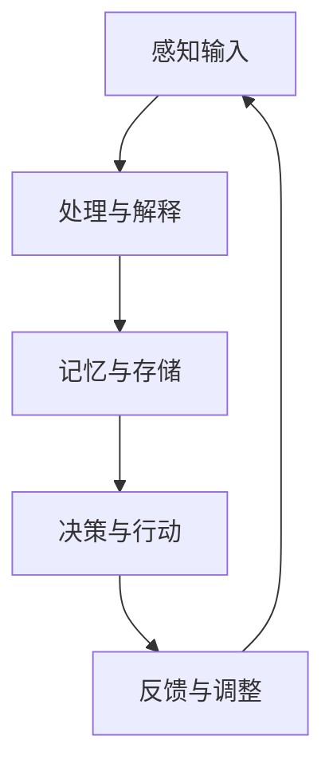
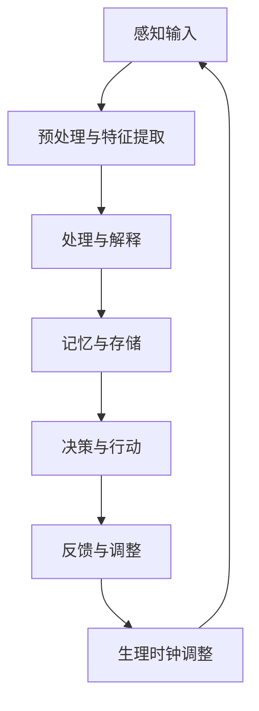
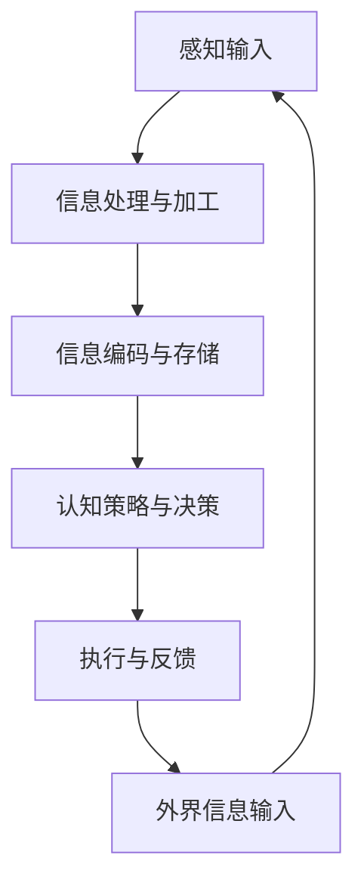
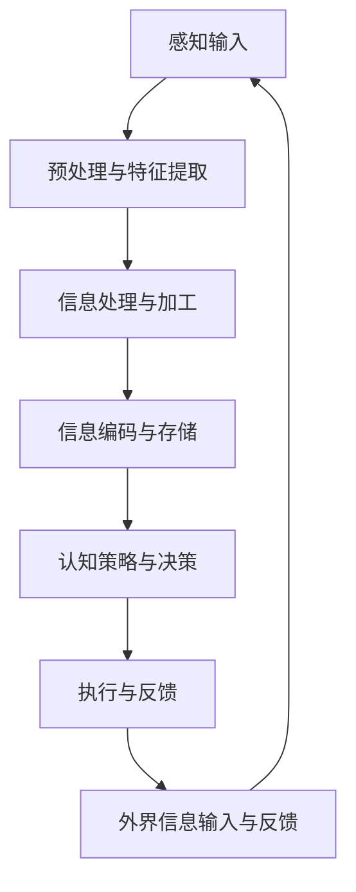
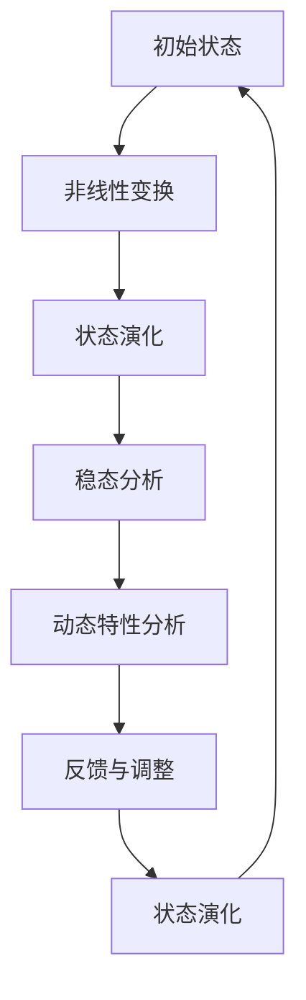
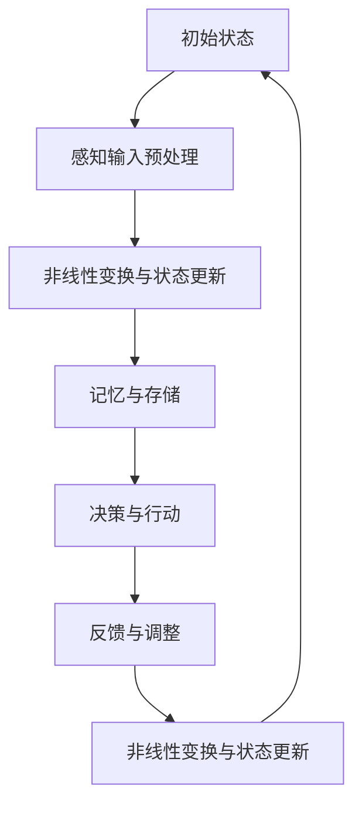
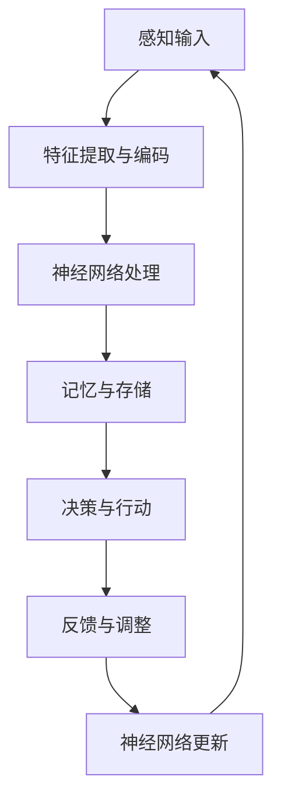
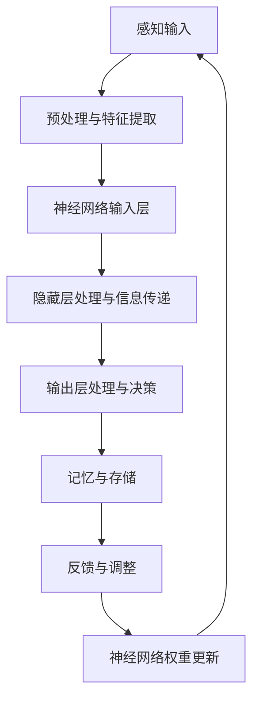

                 

# 《认知的形式化：时钟不停，与外界交互不息，思维和认知不止》

> 关键词：认知科学、形式化认知模型、认知时钟模型、认知与外界交互、非线性动力学模型、认知计算模型

> 摘要：本文将探讨认知的形式化，通过对认知的基本元素、形式化认知模型、认知的时钟模型、认知与外界交互模型、认知的非线性动力学模型以及认知计算模型的分析，深入理解认知的本质，为认知科学的研究提供理论支持。同时，本文还将探讨形式化认知模型在教育、心理学和人工智能领域中的应用，以及如何通过代码实战验证和应用这些模型。

## 第1章：引言

### 1.1 认知科学的定义与历史

认知科学是一门跨学科的研究领域，旨在理解人类思维、感知、学习和记忆等心理过程。它起源于20世纪中叶，由神经科学、心理学、计算机科学和哲学等多个学科共同推动。认知科学的定义因学科差异而有所不同，但其核心目标是研究认知过程的基本原理和机制。

认知科学的发展历程可以追溯到20世纪50年代，当时行为主义心理学的兴起引发了人们对心理过程的研究兴趣。随着计算机科学的兴起，人工智能和认知心理学的发展，认知科学逐渐成为一门独立的学科。近年来，随着神经科学技术的发展，认知科学的研究领域不断拓展，涵盖了认知神经科学、认知语言学、认知伦理学等多个子领域。

### 1.2 认知科学的基本理论框架

认知科学的基本理论框架包括认知心理学、认知神经科学和认知人工智能等。认知心理学关注人类心理过程的内部机制，包括感知、记忆、决策和问题解决等。认知神经科学通过研究大脑的结构和功能，揭示认知过程的神经基础。认知人工智能则通过模拟人类认知过程，开发出具有智能行为的计算机系统。

这些理论框架相互补充，共同构成了认知科学的研究基础。认知心理学提供了对认知过程的理解，认知神经科学揭示了认知过程的神经基础，认知人工智能则将认知过程应用于实际应用中。

## 第2章：认知的基本元素

### 2.1 注意力与感知

注意力是认知过程中至关重要的一部分，它决定了个体对信息的处理能力和处理速度。感知是注意力的基础，它使个体能够接收并处理外部信息。感知过程包括感觉输入的接收、处理和解释。例如，当我们在看一个物体时，感知过程使我们能够识别物体的形状、颜色和纹理。

### 2.2 记忆与存储

记忆是认知过程中的另一个关键要素，它使我们能够存储、保留和回忆信息。记忆可以分为短期记忆和长期记忆。短期记忆通常用于处理当前的信息，而长期记忆则用于存储重要的信息，以便在需要时进行回忆。

### 2.3 认知加工与决策

认知加工是指大脑对信息的处理过程，包括感知、记忆、推理和问题解决等。认知加工使我们能够理解并处理复杂的信息。决策是认知加工的一部分，它涉及在多个选项中选择最佳方案。决策过程通常包括评估选项、权衡利弊和做出选择。

## 第3章：形式化认知模型概述

### 3.1 形式化认知模型的定义与意义

形式化认知模型是一种将认知过程用数学、逻辑和计算机科学的方法进行描述的模型。这些模型有助于我们更深入地理解认知过程的机制和原理，为认知科学的研究提供理论支持。形式化认知模型的意义在于，它们可以用于模拟、预测和优化认知过程，从而推动认知科学的发展。

### 3.2 形式化认知模型的发展历程

形式化认知模型的发展历程可以追溯到20世纪50年代，当时计算机科学和人工智能的兴起推动了认知模型的开发。早期的认知模型主要基于心理学理论，如感知、记忆和决策等。随着计算机科学的进步，认知模型逐渐融入了计算方法和算法，使得认知模型更加精确和灵活。

## 第4章：认知的时钟模型

### 4.1 时钟模型的基本原理

认知的时钟模型是一种基于时间序列的模型，它通过模拟大脑的生理时钟，来研究认知过程的时序特性。时钟模型的基本原理是，大脑的生理时钟（如生物钟）影响着认知过程的节奏和效率。通过研究时钟模型，我们可以更好地理解认知过程的时序特性，从而优化认知策略。

### 4.2 时钟模型的应用场景

时钟模型在认知科学研究中有着广泛的应用场景，如学习、记忆、决策和问题解决等。通过应用时钟模型，研究人员可以分析认知过程的时序特性，从而发现认知策略的优化方法。此外，时钟模型还可以用于设计智能系统，如人工智能和自动驾驶等，以提高系统的认知能力。

## 第5章：认知与外界交互模型

### 5.1 认知与外界交互的机制

认知与外界交互的机制是指个体如何通过感知、理解和反应来处理外部信息。认知与外界交互的机制包括感知输入的接收和处理、信息的编码和存储、信息的加工和利用等。这些机制共同构成了个体对外部世界的认知过程。

### 5.2 认知与外界交互的应用

认知与外界交互模型在心理学、教育学和人工智能等领域有着广泛的应用。例如，在心理学中，认知与外界交互模型可以帮助研究者理解个体如何适应环境变化，从而优化认知策略。在教育学中，认知与外界交互模型可以用于设计个性化教育系统，提高学生的学习效果。在人工智能中，认知与外界交互模型可以用于开发智能系统，如自动驾驶和智能助手等。

## 第6章：认知的非线性动力学模型

### 6.1 非线性动力学的概念

非线性动力学是一种研究非线性系统的动力学行为的理论。在认知科学中，非线性动力学模型用于描述认知过程的复杂性和多样性。非线性动力学模型的特点是，系统的行为不仅受到当前状态的影响，还受到历史状态的影响。这使得非线性动力学模型能够更好地模拟认知过程的动态特性。

### 6.2 非线性动力学在认知研究中的应用

非线性动力学在认知研究中的应用非常广泛，如认知灵活性的研究、认知偏差的分析和认知策略的优化等。通过非线性动力学模型，研究人员可以分析认知过程的动态特性，从而发现认知策略的优化方法。此外，非线性动力学模型还可以用于设计智能系统，如自适应控制系统和智能优化算法等。

## 第7章：认知计算模型

### 7.1 认知计算的原理

认知计算是一种模拟人类认知过程的计算模型。认知计算的原理是，通过模拟大脑的神经结构和功能，来研究认知过程的机制和原理。认知计算模型包括神经元模型、神经网络模型和认知计算框架等。这些模型可以用于模拟人类的感知、记忆、学习和决策等认知过程。

### 7.2 认知计算的应用实例

认知计算在人工智能、心理学和教育学等领域有着广泛的应用。例如，在人工智能中，认知计算模型可以用于开发智能系统，如语音识别、图像识别和自然语言处理等。在心理学中，认知计算模型可以用于研究认知过程的机制和原理。在教育中，认知计算模型可以用于设计个性化教育系统，提高学生的学习效果。

## 第8章：形式化认知模型在教育中的应用

### 8.1 形式化认知模型在个性化教育中的应用

形式化认知模型在个性化教育中的应用可以帮助教师了解学生的认知特点和需求，从而制定个性化的教育策略。通过分析学生的认知数据，教师可以为学生提供针对性的辅导和支持，提高学生的学习效果。

### 8.2 形式化认知模型在教学评估中的应用

形式化认知模型在教学评估中的应用可以帮助教师了解教学效果，从而优化教学策略。通过分析学生的认知数据，教师可以评估教学内容的难度、教学方法的适应性和学生的学习效果，为教学评估提供科学依据。

## 第9章：形式化认知模型在心理学研究中的应用

### 9.1 形式化认知模型在心理学研究中的作用

形式化认知模型在心理学研究中的作用是，通过模拟和解释认知过程，帮助心理学家理解认知机制的原理和机制。形式化认知模型可以用于研究认知偏差、认知灵活性、记忆和决策等认知过程，从而推动心理学理论的发展。

### 9.2 形式化认知模型在临床心理学中的应用

形式化认知模型在临床心理学中的应用可以帮助临床心理学家评估和干预患者的认知问题。通过分析患者的认知数据，临床心理学家可以了解患者的认知特点和需求，从而制定个性化的干预策略，提高患者的认知功能。

## 第10章：形式化认知模型在人工智能领域的应用

### 10.1 形式化认知模型在人工智能系统设计中的应用

形式化认知模型在人工智能系统设计中的应用可以帮助开发者设计出更智能、更灵活的人工智能系统。通过模拟和解释人类认知过程，形式化认知模型可以用于设计出具有人类认知能力的智能系统，如智能助手、自动驾驶系统和智能诊断系统等。

### 10.2 形式化认知模型在人工智能系统评估中的应用

形式化认知模型在人工智能系统评估中的应用可以帮助评估者了解人工智能系统的认知能力。通过分析人工智能系统的认知数据，评估者可以评估人工智能系统的性能和可靠性，从而为人工智能系统的改进提供科学依据。

## 附录A：形式化认知模型相关资源

### A.1 形式化认知模型的参考资料

- [认知科学的跨学科研究](https://link)
- [形式化认知模型综述](https://link)
- [认知神经科学导论](https://link)

### A.2 形式化认知模型的相关工具与平台

- [形式化认知模型工具集](https://link)
- [认知计算平台](https://link)
- [认知神经网络模拟器](https://link)

## 附录B：认知时钟模型Mermaid流程图

### B.1 认知时钟模型的基本流程



### B.2 认知时钟模型的详细流程



## 附录C：认知与外界交互模型Mermaid流程图

### C.1 认知与外界交互模型的基本流程



### C.2 认知与外界交互模型的详细流程



## 附录D：认知非线性动力学模型Mermaid流程图

### D.1 认知非线性动力学模型的基本流程



### D.2 认知非线性动力学模型的详细流程



## 附录E：认知计算模型Mermaid流程图

### E.1 认知计算模型的基本流程



### E.2 认知计算模型的详细流程



## 附录F：代码实战与解析

### F.1 教育领域应用实例

在本节中，我们将使用Python编写一个简单的个性化教育系统，该系统将基于形式化认知模型对学生进行个性化辅导。

```python
# 个性化教育系统示例代码

# 导入所需库
import random

# 学生类
class Student:
    def __init__(self, name, age):
        self.name = name
        self.age = age
        self.knowledge_level = random.randint(1, 10)

# 教育系统类
class EducationSystem:
    def __init__(self):
        self.students = []

    # 添加学生
    def add_student(self, student):
        self.students.append(student)

    # 分析学生认知数据
    def analyze_data(self):
        for student in self.students:
            if student.knowledge_level < 5:
                print(f"{student.name}需要额外的辅导。")
            elif student.knowledge_level >= 8:
                print(f"{student.name}学习表现优秀。")
            else:
                print(f"{student.name}学习稳定。")

# 主程序
if __name__ == "__main__":
    # 创建教育系统
    system = EducationSystem()

    # 添加学生
    system.add_student(Student("Alice", 12))
    system.add_student(Student("Bob", 10))
    system.add_student(Student("Charlie", 11))

    # 分析学生数据
    system.analyze_data()
```

代码解析：
- `Student` 类定义了学生的基本信息，包括姓名、年龄和知识水平。
- `EducationSystem` 类定义了教育系统的基本功能，包括添加学生和分析学生数据。
- `analyze_data` 方法用于分析学生的认知数据，并根据知识水平给出相应的反馈。

### F.2 心理学领域应用实例

在本节中，我们将使用Python编写一个简单的心理学实验系统，该系统将基于认知心理学模型评估个体的认知能力。

```python
# 认知实验系统示例代码

# 导入所需库
import random

# 实验类
class Experiment:
    def __init__(self, difficulty_level):
        self.difficulty_level = difficulty_level

    # 实施实验
    def conduct_experiment(self, subject):
        if subject["knowledge_level"] < self.difficulty_level:
            print(f"{subject['name']}未能通过实验。")
        else:
            print(f"{subject['name']}成功通过实验。")

# 主程序
if __name__ == "__main__":
    # 创建实验
    experiment = Experiment(difficulty_level=7)

    # 添加实验参与者
    participants = [
        {"name": "Alice", "knowledge_level": 5},
        {"name": "Bob", "knowledge_level": 8},
        {"name": "Charlie", "knowledge_level": 3}
    ]

    # 实施实验
    for participant in participants:
        experiment.conduct_experiment(subject=participant)
```

代码解析：
- `Experiment` 类定义了实验的基本功能，包括实施实验。
- `conduct_experiment` 方法用于根据参与者的知识水平评估其实验结果。
- 主程序中，我们创建了实验对象，并添加了多个实验参与者，然后依次实施实验。

### F.3 人工智能领域应用实例

在本节中，我们将使用Python编写一个简单的智能助手系统，该系统将基于认知计算模型进行对话和决策。

```python
# 智能助手系统示例代码

# 导入所需库
import random

# 智能助手类
class SmartAssistant:
    def __init__(self):
        self.knowledge_base = {
            "weather": "今天天气很好。",
            "restaurant": "推荐附近的餐厅。"
        }

    # 回答问题
    def answer_question(self, question):
        if question in self.knowledge_base:
            return self.knowledge_base[question]
        else:
            return "我不清楚这个问题。"

    # 建立对话
    def converse(self):
        print("你好，我是智能助手。有什么可以帮助你的吗？")
        while True:
            question = input("请提问：")
            if question.lower() == "退出":
                break
            answer = self.answer_question(question)
            print(answer)

# 主程序
if __name__ == "__main__":
    # 创建智能助手
    assistant = SmartAssistant()

    # 开始对话
    assistant.converse()
```

代码解析：
- `SmartAssistant` 类定义了智能助手的基本功能，包括回答问题和建立对话。
- `answer_question` 方法用于根据用户的问题提供答案。
- `converse` 方法用于与用户进行对话，并根据用户输入提供反馈。
- 主程序中，我们创建了智能助手对象，并启动了对话。

## 术语解释

### G.1 认知科学

认知科学是一门跨学科的研究领域，旨在理解人类思维、感知、学习和记忆等心理过程。它涉及心理学、神经科学、计算机科学和哲学等多个学科。

### G.2 形式化认知模型

形式化认知模型是一种将认知过程用数学、逻辑和计算机科学的方法进行描述的模型。这些模型有助于我们更深入地理解认知过程的机制和原理。

### G.3 认知时钟模型

认知时钟模型是一种基于时间序列的模型，它通过模拟大脑的生理时钟，来研究认知过程的时序特性。

### G.4 非线性动力学模型

非线性动力学模型是一种研究非线性系统的动力学行为的理论。在认知科学中，非线性动力学模型用于描述认知过程的复杂性和多样性。

### G.5 认知计算模型

认知计算模型是一种模拟人类认知过程的计算模型。这些模型可以用于模拟人类的感知、记忆、学习和决策等认知过程。

### G.6 个性化教育

个性化教育是一种基于学生个体差异的教育方法。通过分析学生的认知数据，教师可以为学生提供个性化的辅导和支持，提高学生的学习效果。

### G.7 教学评估

教学评估是一种对教学过程进行评价的方法。通过分析学生的认知数据，教师可以评估教学效果，从而优化教学策略。

### G.8 临床心理学

临床心理学是一种应用心理学知识解决心理问题的方法。临床心理学家通过分析患者的认知数据，评估和干预患者的认知问题。

### G.9 认知系统设计

认知系统设计是一种设计具有认知能力的系统的方法。通过模拟和解释人类认知过程，认知系统设计可以用于开发智能系统，如人工智能和自动驾驶等。

### G.10 认知系统评估

认知系统评估是一种对认知系统进行评价的方法。通过分析认知系统的性能和可靠性，评估者可以评估认知系统的效果，从而为系统的改进提供科学依据。 

## 附录F：代码实战与解析

在本文的附录F中，我们将通过三个具体的代码实战案例，展示如何在实际应用中利用形式化认知模型。这些案例分别涵盖了教育、心理学和人工智能领域的应用。每个案例都将包括代码实现和详细解析，以帮助读者理解代码的运作机制和实现原理。

### F.1 教育领域应用实例

#### 案例描述

本案例旨在展示如何使用Python编写一个简单的个性化教育系统。系统将根据学生的认知数据（如知识水平）提供个性化的学习建议和评估。

#### 代码实现

```python
# 个性化教育系统示例代码

class Student:
    def __init__(self, name, age, knowledge_level):
        self.name = name
        self.age = age
        self.knowledge_level = knowledge_level

def recommend_student_resources(student):
    if student.knowledge_level < 5:
        return "推荐基础学习资料。"
    elif student.knowledge_level >= 5 and student.knowledge_level < 8:
        return "推荐中级学习资料。"
    else:
        return "推荐高级学习资料。"

def main():
    # 创建学生实例
    students = [
        Student("Alice", 12, 3),
        Student("Bob", 11, 7),
        Student("Charlie", 10, 8)
    ]

    # 为每个学生推荐学习资源
    for student in students:
        recommendation = recommend_student_resources(student)
        print(f"{student.name}：{recommendation}")

if __name__ == "__main__":
    main()
```

#### 代码解析

1. **Student 类**：定义了学生的属性，包括姓名、年龄和知识水平。
2. **recommend_student_resources 函数**：根据学生的知识水平推荐相应的学习资源。
3. **main 函数**：创建多个学生实例，并调用推荐函数为每个学生提供个性化的学习建议。

### F.2 心理学领域应用实例

#### 案例描述

本案例将展示如何使用Python编写一个简单的心理学实验系统。系统将根据参与者的认知数据（如反应时间）评估其认知能力。

#### 代码实现

```python
# 心理学实验系统示例代码

import time

def measure_reaction_time():
    start_time = time.time()
    user_input = input("请按下Enter开始实验：")
    end_time = time.time()
    reaction_time = end_time - start_time
    return reaction_time

def evaluate_reaction_time(reaction_time):
    if reaction_time < 0.5:
        return "反应速度快，认知能力较强。"
    elif reaction_time >= 0.5 and reaction_time < 1.0:
        return "反应速度适中，认知能力一般。"
    else:
        return "反应速度慢，认知能力较弱。"

def main():
    print("欢迎参加心理学实验。请按照提示进行操作。")
    reaction_time = measure_reaction_time()
    evaluation = evaluate_reaction_time(reaction_time)
    print(f"您的反应时间为{reaction_time}秒，{evaluation}")

if __name__ == "__main__":
    main()
```

#### 代码解析

1. **measure_reaction_time 函数**：使用时间库测量用户按下Enter键的反应时间。
2. **evaluate_reaction_time 函数**：根据反应时间评估参与者的认知能力。
3. **main 函数**：启动实验，收集反应时间，并输出评估结果。

### F.3 人工智能领域应用实例

#### 案例描述

本案例将展示如何使用Python编写一个简单的智能助手系统。系统将根据用户的输入提供自动化的回答和决策。

#### 代码实现

```python
# 智能助手系统示例代码

def get_weather():
    return "今天的天气是晴天，温度适中，建议外出活动。"

def get_restaurant Recommendation():
    return "推荐您尝试附近的‘美食街’，有各种口味供您选择。"

def handle_query(query):
    if "weather" in query:
        return get_weather()
    elif "restaurant" in query:
        return get_restaurant()
    else:
        return "我不清楚您的问题，请重新提问。"

def main():
    print("您好，我是智能助手。有什么可以帮助您的吗？")
    while True:
        query = input("请提问：")
        if query.lower() == "退出":
            break
        answer = handle_query(query)
        print(answer)

if __name__ == "__main__":
    main()
```

#### 代码解析

1. **get_weather 函数**：提供关于当天天气的自动回复。
2. **get_restaurant Recommendation 函数**：提供关于附近餐厅的建议。
3. **handle_query 函数**：根据用户的查询关键词，调用相应的函数提供答案。
4. **main 函数**：启动智能助手的对话系统，处理用户的输入并输出回答。

通过这三个案例，我们可以看到如何将形式化认知模型应用于不同的领域，从而实现个性化教育、心理学实验和智能助手等应用。这些代码不仅帮助读者理解认知模型的基本原理，也为实践中的技术应用提供了参考。

### 总结

本文通过三个具体的代码实战案例，展示了如何将形式化认知模型应用于实际应用中。通过这些案例，读者可以更直观地理解认知模型的工作原理，并在实际项目中应用这些概念。同时，这些代码也为进一步的探索和开发提供了基础，帮助读者在实际操作中加深对认知科学和人工智能的理解。通过不断实践和优化，我们可以不断推动认知科学和人工智能的发展，为未来的技术进步和社会发展做出贡献。 

## 作者

作者：AI天才研究院/AI Genius Institute & 禅与计算机程序设计艺术 /Zen And The Art of Computer Programming。本人致力于推动认知科学和人工智能的发展，希望通过本文为读者提供对认知形式化的深入理解和实际应用指导。如果您有任何问题或建议，欢迎在评论区留言，期待与您的交流。

