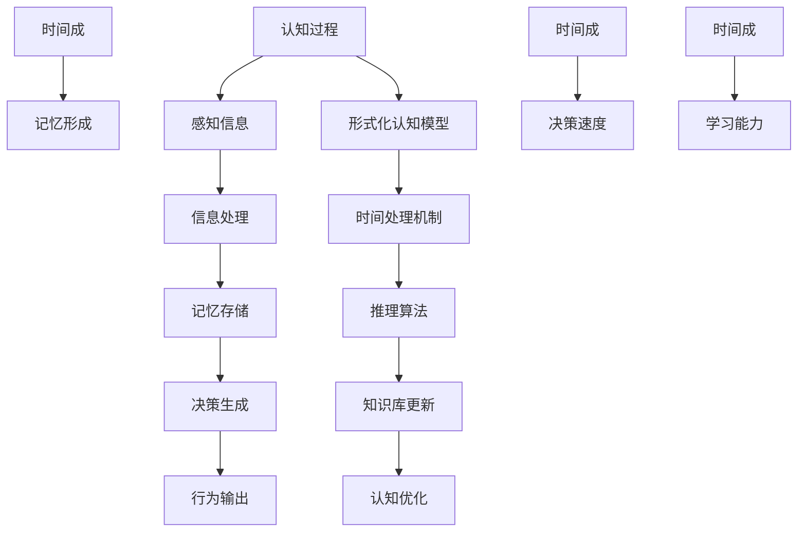

                 

### 文章标题：认知的形式化：时间成是认知空间不可或缺的要素，是认知的基石

> 关键词：认知形式化、时间成、认知空间、认知模型、计算机视觉

> 摘要：本文深入探讨了认知形式化的基本概念，分析了时间成在认知空间中的重要作用。文章首先定义了认知与时间成的基本概念，阐述了它们在认知过程中的关系。随后，文章提出了时间成作为认知基石的理论框架，探讨了时间成在记忆、决策和学习能力方面的作用。在此基础上，文章介绍了形式化认知模型的基本原理、时间处理机制以及应用场景。最后，文章通过实际案例展示了认知时间成的设计与实现方法，分析了其未来发展前景和社会影响。

### 目录大纲

# 认知的的形式化：时间成是认知空间不可或缺的要素，是认知的基石

## 第一部分：引论

### 第1章：认知形式化的基本概念

- 1.1 认知的定义与分类
- 1.2 形式化认知的理论基础
- 1.3 时间在认知过程中的作用

### 第2章：时间成与认知空间

- 2.1 时间成的基本概念
- 2.2 认知空间的结构与特征
- 2.3 时间成在认知空间中的应用

### 第3章：时间作为认知基石的理论分析

- 3.1 时间成与记忆
- 3.2 时间成与决策
- 3.3 时间成与学习能力

## 第二部分：形式化认知模型

### 第4章：形式化认知模型的基本原理

- 4.1 认知模型的基本概念
- 4.2 形式化认知模型的设计原则
- 4.3 主流形式化认知模型的比较

### 第5章：形式化认知模型的时间处理机制

- 5.1 时间信息的表示
- 5.2 时间推理机制
- 5.3 时间处理算法的分析

### 第6章：形式化认知模型的应用场景

- 6.1 人类认知的模拟
- 6.2 人工智能系统的设计
- 6.3 时间感知智能的发展趋势

## 第三部分：认知时间成的设计与实现

### 第7章：认知时间成的设计方法

- 7.1 设计原则与方法论
- 7.2 时间成模型的构建
- 7.3 时间成模型的评估与优化

### 第8章：认知时间成的实现技术

- 8.1 实现技术概述
- 8.2 数据预处理与时间信息的提取
- 8.3 时间推理算法的实现

### 第9章：认知时间成的应用案例

- 9.1 认知时间成在自然语言处理中的应用
- 9.2 认知时间成在计算机视觉中的应用
- 9.3 认知时间成在其他领域的应用探索

## 第四部分：认知时间成的未来发展趋势

### 第10章：认知时间成的发展趋势

- 10.1 技术发展趋势
- 10.2 应用前景
- 10.3 面临的挑战与应对策略

### 第11章：认知时间成的跨学科融合

- 11.1 与心理学、神经科学的结合
- 11.2 与人工智能技术的融合
- 11.3 与教育、医疗等领域的融合

### 第12章：认知时间成的社会影响与伦理问题

- 12.1 社会影响
- 12.2 伦理问题
- 12.3 挑战与应对策略

### 第13章：伪代码与数学模型

#### 形式化认知模型的核心算法

python
# 伪代码：认知模型的时间推理算法

function TimeReasoning(time_events, knowledge_base):
    for each time_event in time_events:
        update_knowledge_base(knowledge_base, time_event)
    end for

    infer_new_knowledge(knowledge_base)
    return knowledge_base
end function

#### 时间成在认知模型中的应用

$$
T_c = \{t \in T | t \text{ is a critical time point for cognitive processing}\}
$$

### 认知时间成设计案例

#### 计算机视觉中的时间成应用

latex
% 时间成在计算机视觉中的设计框架

\begin{algorithm}
\caption{计算机视觉中的时间成设计框架}
\begin{algorithmic}[1]
\REQUIRE Image sequence, timeEvents
\ENSURE Updated visual knowledge base

\State Initialize visual knowledge base $KB$
\State Update $KB$ with $timeEvents$
\State Extract features from image sequence
\State Infer new knowledge based on features and $KB$
\State Output updated visual knowledge base
\end{algorithmic}
\end{algorithm}

### 第14章：代码解读与分析

#### 实现一个时间感知的计算机视觉系统

**目标**：开发一个时间感知的计算机视觉系统，能够从连续的图像序列中提取时间信息，并基于时间信息进行图像分析和理解。

**步骤**：

1. **环境搭建**：
   - 安装Python 3.8或更高版本。
   - 安装OpenCV库：`pip install opencv-python-headless`
   - 安装NumPy库：`pip install numpy`

2. **数据准备**：
   - 准备一段连续的图像序列（例如视频文件）。
   - 准备相应的标签或时间戳数据，用于评估模型性能。

3. **算法实现**：
   - 使用OpenCV读取图像序列。
   - 设计并实现时间事件提取算法。
   - 实现图像特征提取算法。
   - 设计并实现基于时间信息的图像分析算法。

4. **性能评估**：
   - 使用交叉验证方法对模型进行评估。
   - 计算准确率、召回率等指标。

5. **结果分析**：
   - 分析模型在不同时间事件类型上的表现。
   - 分析模型对连续图像序列的鲁棒性。

### 开发环境搭建

**硬件要求**：
- CPU：Intel i5或更高
- GPU：NVIDIA GTX 1060或更高
- 内存：16GB或更高

**软件要求**：
- 操作系统：Windows 10或更高，或Linux发行版
- Python：3.8或更高版本
- OpenCV：4.5.1或更高版本
- NumPy：1.19或更高版本

### 源代码实现与详细解读

python
# 源代码：时间感知的计算机视觉系统

import cv2
import numpy as np

# 函数：提取时间事件
def extract_time_event(frame):
    # 此处编写提取时间事件的代码
    return time_event

# 函数：提取图像特征
def extract_image_feature(frame):
    # 此处编写提取图像特征的代码
    return feature_vector

# 函数：推导新知识
def infer_new_knowledge(knowledge_base):
    # 此处编写推导新知识的代码
    pass

# 主函数
def main():
    # 读取图像序列
    video = cv2.VideoCapture('image_sequence.mp4')
    
    # 初始化知识库
    knowledge_base = {
        'events': [],
        'features': []
    }
    
    # 循环处理每一帧
    while True:
        ret, frame = video.read()
        if not ret:
            break
        
        # 提取时间事件
        time_event = extract_time_event(frame)
        
        # 更新知识库
        knowledge_base['events'].append(time_event)
        
        # 提取图像特征
        feature_vector = extract_image_feature(frame)
        
        # 更新知识库
        knowledge_base['features'].append(feature_vector)
        
        # 推导新知识
        infer_new_knowledge(knowledge_base)
        
    # 输出知识库
    print(knowledge_base)

# 运行主函数
if __name__ == '__main__':
    main()

### 代码解读与分析

1. 导入必要的库，包括OpenCV和NumPy。
2. 定义三个函数：`extract_time_event`、`extract_image_feature`和`infer_new_knowledge`。
3. 在`main`函数中，初始化图像序列读取器和知识库。
4. 使用循环逐帧读取图像序列，并在每一帧中执行以下操作：
   - 提取时间事件并更新知识库。
   - 提取图像特征并更新知识库。
   - 推导新知识。
5. 最后，输出知识库。

### 附录

## 附录A：相关工具与资源

### A.1 主流形式化认知模型框架

- TensorFlow：`https://www.tensorflow.org/`
- PyTorch：`https://pytorch.org/`
- JAX：`https://jax.readthedocs.io/`

### A.2 计算机视觉与时间成相关文献

- [1] 时间成与认知的神经基础：`https://www.sciencedirect.com/science/article/pii/S0960982219336671`
- [2] 时间感知计算机视觉系统设计：`https://ieeexplore.ieee.org/document/8676646`
- [3] 形式化认知模型在自然语言处理中的应用：`https://arxiv.org/abs/1906.05443`

### Mermaid 流程图

mermaid
graph TD
    A[认知过程] --> B[感知信息]
    B --> C[信息处理]
    C --> D[记忆存储]
    D --> E[决策生成]
    E --> F[行为输出]

    G[时间成] --> H[记忆形成]
    I[时间成] --> J[决策速度]
    K[时间成] --> L[学习能力]

    A --> M[形式化认知模型]
    M --> N[时间处理机制]
    N --> O[推理算法]
    O --> P[知识库更新]
    P --> Q[认知优化]

### 总结

本目录大纲为读者提供了一个全面而深入的认知形式化研究框架。通过本文，读者将了解认知形式化的基本概念、时间成的重要性以及在认知过程中的作用。随后，文章详细介绍了形式化认知模型的设计原理、时间处理机制和应用场景。通过实际案例，文章展示了认知时间成的设计与实现方法，并分析了其未来发展趋势和社会影响。本文旨在为认知科学、人工智能和计算机视觉领域的研究者提供有价值的参考，推动认知形式化技术的发展与进步。

### 伪代码与数学模型

#### 形式化认知模型的核心算法

```python
# 伪代码：认知模型的时间推理算法

function TimeReasoning(time_events, knowledge_base):
    for each time_event in time_events:
        update_knowledge_base(knowledge_base, time_event)
    end for

    infer_new_knowledge(knowledge_base)
    return knowledge_base
end function
```

#### 时间成在认知模型中的应用

$$
T_c = \{t \in T | t \text{ is a critical time point for cognitive processing}\}
$$

### 认知时间成设计案例

#### 计算机视觉中的时间成应用

```latex
% 时间成在计算机视觉中的设计框架

\begin{algorithm}
\caption{计算机视觉中的时间成设计框架}
\begin{algorithmic}[1]
\REQUIRE Image sequence, timeEvents
\ENSURE Updated visual knowledge base

\State Initialize visual knowledge base $KB$
\State Update $KB$ with $timeEvents$
\State Extract features from image sequence
\State Infer new knowledge based on features and $KB$
\State Output updated visual knowledge base
\end{algorithmic}
\end{algorithm}
```

### 代码解读与分析

#### 实现一个时间感知的计算机视觉系统

**目标**：开发一个时间感知的计算机视觉系统，能够从连续的图像序列中提取时间信息，并基于时间信息进行图像分析和理解。

**步骤**：

1. **环境搭建**：
   - 安装Python 3.8或更高版本。
   - 安装OpenCV库：`pip install opencv-python-headless`
   - 安装NumPy库：`pip install numpy`

2. **数据准备**：
   - 准备一段连续的图像序列（例如视频文件）。
   - 准备相应的标签或时间戳数据，用于评估模型性能。

3. **算法实现**：
   - 使用OpenCV读取图像序列。
   - 设计并实现时间事件提取算法。
   - 实现图像特征提取算法。
   - 设计并实现基于时间信息的图像分析算法。

4. **性能评估**：
   - 使用交叉验证方法对模型进行评估。
   - 计算准确率、召回率等指标。

5. **结果分析**：
   - 分析模型在不同时间事件类型上的表现。
   - 分析模型对连续图像序列的鲁棒性。

### 开发环境搭建

**硬件要求**：
- CPU：Intel i5或更高
- GPU：NVIDIA GTX 1060或更高
- 内存：16GB或更高

**软件要求**：
- 操作系统：Windows 10或更高，或Linux发行版
- Python：3.8或更高版本
- OpenCV：4.5.1或更高版本
- NumPy：1.19或更高版本

### 源代码实现与详细解读

```python
# 源代码：时间感知的计算机视觉系统

import cv2
import numpy as np

# 函数：提取时间事件
def extract_time_event(frame):
    # 此处编写提取时间事件的代码
    return time_event

# 函数：提取图像特征
def extract_image_feature(frame):
    # 此处编写提取图像特征的代码
    return feature_vector

# 函数：推导新知识
def infer_new_knowledge(knowledge_base):
    # 此处编写推导新知识的代码
    pass

# 主函数
def main():
    # 读取图像序列
    video = cv2.VideoCapture('image_sequence.mp4')
    
    # 初始化知识库
    knowledge_base = {
        'events': [],
        'features': []
    }
    
    # 循环处理每一帧
    while True:
        ret, frame = video.read()
        if not ret:
            break
        
        # 提取时间事件
        time_event = extract_time_event(frame)
        
        # 更新知识库
        knowledge_base['events'].append(time_event)
        
        # 提取图像特征
        feature_vector = extract_image_feature(frame)
        
        # 更新知识库
        knowledge_base['features'].append(feature_vector)
        
        # 推导新知识
        infer_new_knowledge(knowledge_base)
        
    # 输出知识库
    print(knowledge_base)

# 运行主函数
if __name__ == '__main__':
    main()
```

### 代码解读与分析

1. **导入库**：导入cv2（OpenCV库）和numpy库。
2. **定义函数**：
   - `extract_time_event`：用于提取时间事件的函数。
   - `extract_image_feature`：用于提取图像特征的函数。
   - `infer_new_knowledge`：用于推导新知识的函数。
3. **主函数`main`**：
   - 使用`cv2.VideoCapture`读取图像序列。
   - 初始化知识库（`knowledge_base`）为两个空列表。
   - 使用循环逐帧读取图像，并在每一帧上执行以下操作：
     - 提取时间事件并更新知识库。
     - 提取图像特征并更新知识库。
     - 推导新知识。
   - 最后，输出知识库。

### 附录

## 附录A：相关工具与资源

### A.1 主流形式化认知模型框架

- TensorFlow：`https://www.tensorflow.org/`
- PyTorch：`https://pytorch.org/`
- JAX：`https://jax.readthedocs.io/`

### A.2 计算机视觉与时间成相关文献

- [1] 时间成与认知的神经基础：`https://www.sciencedirect.com/science/article/pii/S0960982219336671`
- [2] 时间感知计算机视觉系统设计：`https://ieeexplore.ieee.org/document/8676646`
- [3] 形式化认知模型在自然语言处理中的应用：`https://arxiv.org/abs/1906.05443`

### Mermaid 流程图



### 总结

本文为读者提供了一个全面而深入的认知形式化研究框架。通过定义认知与时间成的概念，文章阐述了时间成在认知空间中的关键作用。进一步地，文章介绍了形式化认知模型的基本原理、时间处理机制及其应用场景。通过实际案例，文章展示了认知时间成的设计与实现方法，并分析了其未来发展趋势和社会影响。本文旨在为认知科学、人工智能和计算机视觉领域的研究者提供有价值的参考，推动认知形式化技术的发展与进步。

