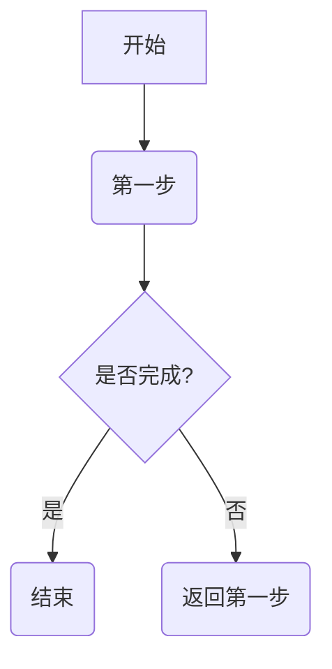

                 

### 文章标题：认知过程中的简单与深刻对比

> 关键词：认知科学、简单认知过程、深刻认知过程、信号检测理论、创造性思维、情感认知、道德认知

> 摘要：
本文通过深入探讨认知过程中的简单与深刻对比，全面解析了认知科学的核心概念和原理。从认知科学的基本概念、简单认知过程和深刻认知过程，到信号检测理论、创造性思维、情感认知和道德认知的详细解释，再到项目实战和代码案例的分析，本文旨在为读者提供一个系统、详细的认知科学导论，帮助读者更好地理解人类思维过程及其应用。

----------------------------------------------------------------

## 第1章: 认知过程基础

### 1.1 认知过程概述

#### 1.1.1 认知科学的基本概念

认知科学是一个跨学科的研究领域，旨在理解人类大脑如何获取、处理和存储信息。它涉及心理学、神经科学、计算机科学和哲学等多个领域，试图通过综合不同学科的理论和方法，揭示人类认知过程的本质。

认知科学的基本概念包括：

- **信息处理**：将人类认知过程视为一个信息处理系统，信息从感知、编码、存储到提取和利用，经历了一系列复杂的加工过程。
- **认知功能**：指大脑执行各种认知任务的能力，包括感知、记忆、注意力、思考、问题解决和语言理解等。
- **认知模型**：用于描述和解释人类认知过程的数学模型和计算机模拟。

#### 1.1.2 认知过程的分类

认知过程可以根据复杂程度和功能进行分类。常见的分类方法包括：

- **简单认知过程**：包括感知、注意力、记忆等基本的认知过程。这些过程通常涉及对信息的初步处理和编码。
- **深刻认知过程**：包括创造性思维、情感认知、道德认知等复杂的认知过程。这些过程通常涉及高层次的信息加工和决策。

#### 1.1.3 认知科学的发展历程

认知科学的发展历程可以追溯到20世纪中叶。以下是几个重要的里程碑：

- **1940年代**：行为主义心理学占据主导地位，认知过程被认为是不重要的。
- **1950年代**：信息处理模型开始出现，如香农的信息论和西蒙的决策理论。
- **1960年代**：人工智能的出现推动了认知科学的发展，计算机被用于模拟人类思维过程。
- **1970年代**：认知心理学兴起，研究者开始关注内部心理过程。
- **1980年代**：认知神经科学的发展，结合了神经科学和心理学的研究方法。
- **1990年代**：神经计算和机器学习的发展，为认知科学提供了新的研究工具。

#### 1.2 简单认知过程

##### 1.2.1 简单认知过程的概念

简单认知过程是指基本的、直观的认知过程，它们是复杂认知过程的基础。简单认知过程通常涉及对信息的初步处理和编码，包括以下几个方面：

- **感知**：通过感官接收外界信息，如视觉、听觉、触觉等。
- **注意力**：选择性地关注和处理某些信息，忽略其他信息。
- **记忆**：暂时或长期地存储信息，以便后续使用。

##### 1.2.2 简单认知过程的类型

简单认知过程可以分为以下几种类型：

- **感知过程**：包括视觉感知、听觉感知、触觉感知等。
- **注意力过程**：包括选择性注意力、分配注意力、持续注意力等。
- **记忆过程**：包括短期记忆、长期记忆、工作记忆等。

##### 1.2.3 简单认知过程的实例分析

以下是简单认知过程的几个实例分析：

- **视觉感知**：当一个人看到一张图片时，大脑会对其进行初步处理，识别图片中的物体、颜色和形状等。
- **选择性注意力**：在嘈杂的环境中，一个人能够选择性地关注重要的信息，如教师的讲解或汽车的喇叭声。
- **短期记忆**：一个人能够记住刚刚听到的一组数字或单词，以便后续使用。

#### 1.3 深刻认知过程

##### 1.3.1 深刻认知过程的概念

深刻认知过程是指复杂的、抽象的认知过程，它们通常涉及高层次的信息加工和决策。深刻认知过程包括以下几个方面：

- **创造性思维**：产生新想法、解决问题和创新的能力。
- **情感认知**：理解和识别情感信息，包括自我情感认知和对他人的情感认知。
- **道德认知**：理解道德原则和道德决策，包括道德判断和道德行为。

##### 1.3.2 深刻认知过程的类型

深刻认知过程可以分为以下几种类型：

- **创造性思维**：包括联想思维、发散思维、聚合思维等。
- **情感认知**：包括情感识别、情感表达、情感调节等。
- **道德认知**：包括道德判断、道德推理、道德行为等。

##### 1.3.3 深刻认知过程的实例分析

以下是深刻认知过程的几个实例分析：

- **创造性思维**：一个人在面对复杂问题时，能够通过创造性思维找到新的解决方案，如发明新产品或解决难题。
- **情感认知**：一个人能够理解自己的情绪，并对他人的情绪进行识别和回应，如表达同情或提供帮助。
- **道德认知**：一个人在面对道德困境时，能够做出符合道德原则的决策，如拒绝欺骗或违反法律。

----------------------------------------------------------------

### 2.1 信号检测理论

#### 2.1.1 信号检测理论的定义

信号检测理论（Signal Detection Theory, SDT）是一种用于研究感知和决策过程的数学模型。该理论最初由Erlbaum和Fisher于1954年提出，用于解释心理学实验中观察到的数据。信号检测理论的主要目标是研究感知者在面对不确定的信息时，如何做出判断和决策。

#### 2.1.2 信号检测理论的基本假设

信号检测理论基于以下基本假设：

- **信号和噪声**：感知到的信息可以分为信号（真实存在的信息）和噪声（无关的信息）。
- **判断标准**：感知者根据特定的判断标准对信息进行判断。判断标准可以是固定的，也可以是灵活的，取决于感知者的动机和任务要求。
- **决策过程**：感知者根据判断标准和感知到的信息，做出接受或拒绝信号的决策。

#### 2.1.3 信号检测理论的数学模型

信号检测理论可以用以下数学模型来描述：

$$
P(\text{接受}|\text{信号}) = \frac{P(\text{信号}) + P(\text{接受}|\text{噪声}) \cdot P(\text{噪声})}{P(\text{信号}) + P(\text{噪声})}
$$

$$
P(\text{拒绝}|\text{信号}) = 1 - P(\text{接受}|\text{信号})
$$

$$
P(\text{接受}|\text{噪声}) = \frac{P(\text{噪声})}{P(\text{信号}) + P(\text{噪声})}
$$

其中，\( P(\text{接受}|\text{信号}) \) 和 \( P(\text{接受}|\text{噪声}) \) 分别表示感知者在信号和噪声条件下接受信号的几率。

#### 2.1.4 信号检测理论的经典实验

信号检测理论的经典实验是信号检测任务（Signal Detection Task）。实验中，参与者需要判断一系列呈现的刺激是否包含信号。刺激可以分为信号和噪声两种类型，参与者需要对信号和噪声进行判断。

实验通常包括以下参数：

- **击中率**（Hit Rate）：参与者在信号条件下正确判断为信号的几率。
- **误报率**（False Alarm Rate）：参与者在噪声条件下错误判断为信号的几率。
- **d'值**（d-prime）：表示判断力，计算公式为 \( d' = \frac{\text{击中率} - \text{误报率}}{\sqrt{\text{击中率} \cdot \text{误报率}}} \)。d'值越大，表示参与者的判断力越强。

#### 2.1.5 信号检测理论的应用

信号检测理论在心理学、神经科学和人工智能等领域有广泛的应用：

- **心理学应用**：用于研究感知、记忆和注意力等认知过程。
- **神经科学应用**：用于研究大脑如何处理和决策信息。
- **人工智能应用**：用于设计和优化机器学习模型，提高模型的决策能力。

### 2.2 简单记忆过程

#### 2.2.1 简单记忆过程的概念

简单记忆过程是指对信息的暂时或长期存储，以便后续使用。简单记忆通常包括以下类型：

- **短期记忆**：对信息进行短暂的保持，通常在几秒钟到几分钟内。
- **长期记忆**：对信息进行长期的存储，可以持续数月甚至数年。

#### 2.2.2 简单记忆过程的类型

简单记忆过程可以分为以下几种类型：

- **工作记忆**：对当前任务的必要信息进行短期存储，以便后续使用。
- **情景记忆**：对个人经历的事件和情境进行长期存储。
- **语义记忆**：对知识和概念进行长期存储。

#### 2.2.3 简单记忆的生理机制

简单记忆的生理机制主要涉及以下几个部分：

- **大脑皮层**：大脑皮层是记忆的主要存储区域，包括海马体和前额叶皮层。
- **神经元活动**：神经元之间的通信和活动模式影响记忆的形成和存储。
- **神经可塑性**：神经元结构和功能的改变影响记忆的持久性和灵活性。

#### 2.2.4 简单记忆的实验研究

简单记忆的实验研究方法包括：

- **记忆任务**：通过设计不同的记忆任务，如数字记忆、单词记忆和图像记忆等，研究记忆过程。
- **记忆测验**：通过记忆测验评估个体的记忆能力，如回忆测验和再认测验等。
- **脑成像技术**：如fMRI、PET等，用于观察大脑活动，研究记忆的生理机制。

### 2.3 简单注意力过程

#### 2.3.1 简单注意力的定义

简单注意力是指心理资源集中处理特定信息的心理过程。简单注意力可以分为以下几个方面：

- **选择性注意力**：选择性地关注和处理某些信息，忽略其他信息。
- **分配注意力**：同时关注和处理多个信息。
- **持续注意力**：保持对特定信息的关注，不受干扰。

#### 2.3.2 简单注意力的类型

简单注意力可以分为以下几种类型：

- **视觉注意力**：关注和处理视觉信息。
- **听觉注意力**：关注和处理听觉信息。
- **触觉注意力**：关注和处理触觉信息。

#### 2.3.3 简单注意力的机制

简单注意力的机制涉及以下几个部分：

- **神经系统**：神经系统负责处理和传递注意力相关的信息。
- **神经递质**：神经递质如多巴胺和肾上腺素影响注意力的集中和分配。
- **大脑区域**：大脑区域如前额叶皮层、顶叶皮层和基底神经节参与注意力的调控。

#### 2.3.4 简单注意力的实验研究

简单注意力的实验研究方法包括：

- **注意力任务**：通过设计不同的注意力任务，如视觉搜索、听觉搜索和触觉搜索等，研究注意力的类型和机制。
- **脑成像技术**：如fMRI、PET等，用于观察大脑活动，研究注意力的神经基础。
- **心理测量**：使用标准化的测试工具测量注意力能力，如注意广度测试、反应时间测试等。

### 3.1 创造性思维

#### 3.1.1 创造性思维的概念

创造性思维是指产生新颖、有价值的想法和解决方案的能力。创造性思维是人类认知过程中的一种高级形式，它涉及多种认知过程，如联想、类比、隐喻和组合等。

#### 3.1.2 创造性思维的过程

创造性思维的过程可以分为以下几个阶段：

1. **准备阶段**：收集相关信息，积累经验和知识。
2. **启发阶段**：通过联想、类比和隐喻等方式产生新的想法。
3. **实现阶段**：将新的想法转化为具体的解决方案或产品。

#### 3.1.3 创造性思维的方法

以下是一些常用的创造性思维方法：

1. **头脑风暴**：通过集体讨论和自由联想，产生大量的新想法。
2. **思维导图**：通过图形化的方式组织和展示思维过程，促进创新思维。
3. **类比思维**：通过将问题与相似的问题进行类比，找到解决方案。
4. **隐喻思维**：通过隐喻和比喻，激发新的思维方式和视角。

#### 3.1.4 创造性思维的实例分析

以下是一个创造性思维的实例分析：

假设一家公司的目标是开发一款新的智能家居设备。通过头脑风暴和类比思维，设计师们提出了以下几种创新想法：

1. **智能家庭管家**：一款具有人工智能的设备，能够理解家庭成员的需求，提供个性化的服务。
2. **智能宠物陪伴**：一款能够与宠物互动的设备，提供陪伴、训练和娱乐功能。
3. **智能安全系统**：一款集成了多种传感器的设备，用于监控家庭安全和防止盗窃。

通过这些创新想法，公司成功开发出了一款具有市场竞争力的智能家居设备，满足了不同用户的需求。

### 3.2 情感认知

#### 3.2.1 情感认知的概念

情感认知是指对情感信息的理解和识别过程。情感认知不仅涉及对自身情感的认知，还包括对他人的情感认知。

#### 3.2.2 情感认知的机制

情感认知的机制涉及以下几个部分：

1. **情感识别**：通过感知和识别面部表情、声音和身体语言等，理解他人的情感状态。
2. **情感表达**：通过面部表情、声音和身体语言等，表达自己的情感状态。
3. **情感调节**：通过认知和行为策略，调节和管理自己的情感状态。

#### 3.2.3 情感认知的影响因素

情感认知的影响因素包括：

1. **文化背景**：不同的文化对情感认知有不同的定义和表达方式。
2. **个人经历**：个人的成长经历和情感体验会影响情感认知的发展。
3. **心理状态**：情绪状态、焦虑和压力等因素会影响情感认知的准确性和速度。

#### 3.2.4 情感认知的实验研究

情感认知的实验研究方法包括：

1. **情感识别任务**：通过设计不同的情感识别任务，如面部表情识别、声音情感识别和文本情感分析等，研究情感认知的能力。
2. **脑成像技术**：如fMRI、PET等，用于观察大脑活动，研究情感认知的神经基础。
3. **心理测量**：使用标准化的测试工具测量情感认知能力，如情感识别能力测试和情感调节能力测试等。

### 3.3 道德认知

#### 3.3.1 道德认知的概念

道德认知是指对道德原则和道德决策的理解和应用过程。道德认知涉及对道德规范的认识、道德判断和道德行为。

#### 3.3.2 道德认知的发展

道德认知的发展可以分为以下几个阶段：

1. **前道德阶段**：儿童在2-4岁时，对道德规范的认识尚未形成。
2. **他律道德阶段**：儿童在4-7岁时，开始遵循外在的道德规范。
3. **自律道德阶段**：儿童在7-12岁时，开始自主判断和决策，遵循内在的道德规范。
4. **公正道德阶段**：儿童在12岁以后，能够理解和维护公正的道德规范。

#### 3.3.3 道德认知的模型

道德认知的模型包括：

1. **皮亚杰道德发展理论**：认为道德认知的发展分为他律和自律两个阶段。
2. **柯尔伯格道德发展理论**：认为道德认知的发展分为前常规、常规和后常规三个阶段。
3. **情感道德发展理论**：认为情感认知对道德认知的发展有重要影响。

#### 3.3.4 道德认知的实验研究

道德认知的实验研究方法包括：

1. **道德判断任务**：通过设计不同的道德判断任务，如道德两难故事、道德情境反应等，研究道德认知的能力。
2. **脑成像技术**：如fMRI、PET等，用于观察大脑活动，研究道德认知的神经基础。
3. **心理测量**：使用标准化的测试工具测量道德认知能力，如道德判断能力测试和道德行为反应测试等。

### 4.1 对比概述

#### 4.1.1 简单认知过程与深刻认知过程的异同

简单认知过程与深刻认知过程在认知层次、功能和应用方面存在显著差异。

**相同点**：

- 都是认知科学的研究对象，涉及信息的获取、处理和存储。
- 都遵循信息处理的原理，包括感知、编码、存储和提取。

**不同点**：

- **复杂程度**：简单认知过程是基本、直观的认知过程，深刻认知过程是复杂、抽象的认知过程。
- **功能**：简单认知过程主要用于基本的感知、记忆和注意力任务，深刻认知过程涉及创造性思维、情感认知和道德认知等高级认知功能。
- **应用**：简单认知过程广泛应用于日常生活中的各种任务，深刻认知过程在科学创新、艺术创作和社会互动等领域具有重要应用价值。

#### 4.1.2 对比研究的意义

研究简单认知过程与深刻认知过程的对比，具有以下几个方面的意义：

1. **深化认知科学理论**：通过对比分析，有助于揭示认知过程的基本原理和机制，推动认知科学的发展。
2. **指导教育实践**：了解不同认知过程的特点和应用，有助于设计更有效的教育方法和教学策略，提高教育质量。
3. **促进人工智能发展**：简单与深刻认知过程的对比研究，为人工智能的设计和优化提供了理论依据，有助于开发更智能的人工智能系统。
4. **促进心理健康**：理解深刻认知过程在情感和道德认知中的作用，有助于促进心理健康和幸福感的提升。

### 4.2 认知神经基础

#### 4.2.1 简单认知过程与深刻认知过程的神经基础

简单认知过程与深刻认知过程在神经基础上有显著差异。

**简单认知过程的神经基础**：

- **大脑皮层**：简单认知过程主要涉及大脑皮层的活动，尤其是前额叶皮层和顶叶皮层。
- **神经递质**：神经递质如多巴胺、乙酰胆碱和去甲肾上腺素等，在简单认知过程中发挥重要作用。
- **神经元活动**：简单认知过程通常涉及神经元的同步活动，形成稳定的神经回路。

**深刻认知过程的神经基础**：

- **大脑皮层和基底神经节**：深刻认知过程不仅涉及大脑皮层，还涉及基底神经节和其他脑区的活动。
- **神经可塑性**：深刻认知过程涉及神经可塑性，通过改变神经元之间的连接和活动模式，实现认知功能的调整和优化。
- **神经回路**：深刻认知过程通常涉及复杂的神经回路，通过多个脑区的协同活动，实现高级认知功能的实现。

#### 4.2.2 神经元活动的变化

简单认知过程与深刻认知过程在神经元活动方面存在显著差异。

**简单认知过程的神经元活动**：

- **同步活动**：简单认知过程中，神经元活动通常呈同步状态，形成稳定的神经回路。
- **低频振荡**：简单认知过程中的神经元活动通常伴随着低频振荡，如θ波和α波。
- **神经递质释放**：简单认知过程中，神经递质的释放较为规律，维持神经元间的通信。

**深刻认知过程的神经元活动**：

- **异步活动**：深刻认知过程中，神经元活动通常呈异步状态，不同脑区的活动相互协调。
- **高频振荡**：深刻认知过程中的神经元活动通常伴随着高频振荡，如γ波和β波。
- **神经可塑性**：深刻认知过程中，神经元活动受神经可塑性的影响，通过改变神经元之间的连接和活动模式，实现认知功能的调整和优化。

#### 4.2.3 大脑区域的差异

简单认知过程与深刻认知过程在涉及的大脑区域方面存在显著差异。

**简单认知过程**：

- **前额叶皮层**：简单认知过程主要涉及前额叶皮层，尤其是前额叶的眶额回和前额叶内侧回。
- **顶叶皮层**：简单认知过程还涉及顶叶皮层，尤其是顶叶的中央后回和顶叶前部。
- **颞叶皮层**：简单认知过程的部分任务还涉及颞叶皮层，尤其是颞叶的颞上回和颞中回。

**深刻认知过程**：

- **前额叶皮层**：深刻认知过程不仅涉及前额叶皮层，还涉及前额叶的背外侧前额叶皮层和前额叶内侧前额叶皮层。
- **顶叶皮层**：深刻认知过程也涉及顶叶皮层，尤其是顶叶的中央前回和顶叶前部。
- **颞叶皮层**：深刻认知过程还涉及颞叶皮层，尤其是颞叶的颞上回、颞中回和颞下回。
- **其他脑区**：深刻认知过程还涉及其他脑区，如基底神经节、小脑和杏仁核等，通过多个脑区的协同活动，实现高级认知功能的实现。

### 4.3 实践应用

#### 4.3.1 简单认知过程的应用

简单认知过程在日常生活、工作和学习中的应用广泛，主要包括以下几个方面：

1. **日常决策**：简单认知过程帮助我们进行日常决策，如购物、出行和社交等。通过感知、注意和记忆等认知过程，我们能够选择和处理与决策相关的信息。
2. **技能学习**：简单认知过程在学习过程中发挥关键作用。通过感知和记忆，我们能够学习新的知识和技能，如阅读、写作和计算等。
3. **问题解决**：简单认知过程在解决简单问题时具有重要价值。通过感知和注意力，我们能够识别问题、分析问题和选择合适的解决方案。

#### 4.3.2 深刻认知过程的应用

深刻认知过程在科学研究、艺术创作和社会互动等领域具有重要应用价值，主要包括以下几个方面：

1. **科学研究**：深刻认知过程在科学研究领域发挥着重要作用。通过创造性思维、情感认知和道德认知，科学家能够提出新问题、形成新理论和发现新规律。
2. **艺术创作**：深刻认知过程在艺术创作中具有独特的价值。艺术家通过创造性思维和情感认知，能够创造出富有创意和情感内涵的艺术作品。
3. **社会互动**：深刻认知过程在社会互动中发挥着关键作用。通过道德认知和情感认知，个体能够理解他人的情感、尊重他人的权利和维护社会的和谐。

#### 4.3.3 应用差异与影响

简单认知过程与深刻认知过程在应用方面存在明显差异，对个体和社会产生了不同的影响。

1. **个体差异**：简单认知过程主要关注个体的日常决策和技能学习，深刻认知过程则更多地关注个体的创新、情感和道德发展。个体在简单认知过程中的表现通常较为稳定，而在深刻认知过程中的表现则受个体差异的影响较大。
2. **社会影响**：简单认知过程对个体和社会的日常生活和工作产生直接影响，深刻认知过程则对社会的进步和发展产生深远影响。简单认知过程的应用主要促进个体的自我发展，深刻认知过程的应用则推动社会的创新和进步。
3. **教育启示**：简单认知过程与深刻认知过程在教育中的应用具有重要启示。在教育过程中，既要关注学生的简单认知能力培养，也要关注学生的深刻认知能力培养，以实现学生的全面发展。

### 5.1 认知平衡的概念

#### 5.1.1 认知平衡的定义

认知平衡是指个体在不同认知过程中，保持适当的心理状态和认知资源，以实现最佳认知功能的心理过程。认知平衡不仅涉及简单认知过程与深刻认知过程之间的平衡，还包括认知过程的内部平衡，如注意力、记忆和思考等。

#### 5.1.2 认知平衡的重要性

认知平衡对个体的认知功能和心理健康具有重要意义，主要表现在以下几个方面：

1. **提高认知效率**：认知平衡有助于个体在复杂任务中集中注意力，提高记忆和信息处理效率。
2. **促进创新思维**：认知平衡为个体的创造性思维提供了良好的心理环境，有助于产生新颖的解决方案和创意。
3. **增强心理韧性**：认知平衡有助于个体应对压力和挑战，提高心理韧性和适应能力。
4. **改善心理健康**：认知平衡有助于减轻心理压力，提高个体的幸福感和生活满意度。

### 5.2 影响认知平衡的因素

#### 5.2.1 内部因素

内部因素是指影响个体认知平衡的心理和生理特征，主要包括以下几个方面：

1. **个性特征**：不同个性的个体在认知平衡方面存在差异。例如，内向型个体可能更擅长深度思考，外向型个体可能更擅长多任务处理。
2. **认知风格**：个体的认知风格对其认知平衡产生影响。例如，场独立型个体在复杂任务中可能表现出更好的认知平衡，而场依存型个体在简单任务中可能表现出更好的认知平衡。
3. **生理状态**：生理状态如疲劳、饥饿、疾病等可能影响个体的认知平衡。良好的生理状态有助于维持认知平衡，而生理状态不佳可能导致认知失衡。

#### 5.2.2 外部因素

外部因素是指影响个体认知平衡的外部环境和情境，主要包括以下几个方面：

1. **环境压力**：外部环境的压力如工作压力、社交压力等可能影响个体的认知平衡。高压力环境可能导致认知失衡，影响认知功能。
2. **任务复杂性**：任务的复杂性对个体的认知平衡产生影响。简单任务可能有助于个体保持认知平衡，而复杂任务可能对认知平衡产生挑战。
3. **社会支持**：社会支持如家人、朋友和同事的支持对个体的认知平衡具有重要意义。良好的社会支持有助于个体维持认知平衡，应对生活和工作中的挑战。

#### 5.2.3 环境对认知平衡的影响

环境对个体的认知平衡具有显著影响，主要表现在以下几个方面：

1. **工作环境**：良好的工作环境如安静、舒适和整洁的办公环境有助于个体维持认知平衡。不良的工作环境如噪音、混乱和压力可能导致认知失衡。
2. **学习环境**：良好的学习环境如安静、有序和具有启发性的学习环境有助于个体维持认知平衡，提高学习效果。不良的学习环境如嘈杂、混乱和缺乏启发可能导致认知失衡。
3. **生活环境**：良好的生活环境如和谐的家庭关系、良好的饮食习惯和充足的休息有助于个体维持认知平衡。不良的生活环境如家庭矛盾、饮食不均衡和睡眠不足可能导致认知失衡。

### 5.3 促进认知平衡的策略

#### 5.3.1 认知行为疗法

认知行为疗法（Cognitive Behavioral Therapy, CBT）是一种基于认知理论的心理学治疗方法，旨在通过改变不合理的认知和行为，促进认知平衡。认知行为疗法的主要策略包括：

1. **认知重构**：通过识别和纠正不合理的认知，帮助个体建立合理的认知模式。
2. **行为调整**：通过调整个体的行为和生活方式，提高认知平衡。
3. **认知灵活性训练**：通过训练个体的认知灵活性，提高个体应对复杂情境的能力。

#### 5.3.2 认知重构

认知重构是一种通过识别和改变不合理的认知模式，促进认知平衡的策略。认知重构的主要步骤包括：

1. **识别不合理认知**：识别个体在特定情境下产生的消极、不合理的认知。
2. **评估不合理认知的影响**：评估不合理认知对个体情绪和行为的影响。
3. **重构认知**：通过认知重构技术，如认知扭曲识别和认知重构练习，帮助个体建立合理的认知模式。

#### 5.3.3 认知灵活性训练

认知灵活性训练是一种通过提高个体应对复杂情境的能力，促进认知平衡的策略。认知灵活性训练的主要方法包括：

1. **情景模拟**：通过模拟不同情境，训练个体在不同情境下的认知反应。
2. **认知扭曲识别**：通过识别和纠正个体在特定情境下的认知扭曲，提高个体的认知灵活性。
3. **认知重构练习**：通过认知重构练习，如思维导图、角色扮演和思维日记等，帮助个体提高认知灵活性。

### 6.1 教育中的认知过程

#### 6.1.1 教育中的简单认知过程

教育中的简单认知过程主要包括感知、记忆和注意力等基本认知过程。这些认知过程在学生的学习过程中发挥着重要作用：

1. **感知**：学生通过感知，接收和理解教师讲授的知识，如文字、图像、声音等。
2. **记忆**：学生通过记忆，将所学的知识存储在长期记忆中，以便后续复习和应用。
3. **注意力**：学生通过注意力，选择性地关注和学习任务中的关键信息，忽略无关的信息。

#### 6.1.2 教育中的深刻认知过程

教育中的深刻认知过程包括创造性思维、情感认知和道德认知等高级认知过程。这些认知过程在学生的综合素质培养中具有重要意义：

1. **创造性思维**：教育中通过引导学生进行创造性思维，培养学生的创新能力和问题解决能力。
2. **情感认知**：教育中通过培养学生的情感认知，提高学生的情绪智力，促进学生的心理健康。
3. **道德认知**：教育中通过培养学生的道德认知，提高学生的道德素养，培养学生的社会责任感。

#### 6.1.3 教育对认知发展的影响

教育对学生的认知发展具有深远影响，主要表现在以下几个方面：

1. **促进认知能力发展**：通过系统的教育，学生可以不断提升感知、记忆、注意力等简单认知过程的能力。
2. **激发深刻认知过程**：通过教育，学生可以接触到丰富的知识和经验，激发创造性思维、情感认知和道德认知等深刻认知过程。
3. **培养综合素质**：教育不仅关注学生的认知发展，还注重学生的综合素质培养，如创新能力、道德素养和人际交往能力等。

### 6.2 认知科学与教育方法

#### 6.2.1 个性化教育

个性化教育是一种基于学生个体差异，提供差异化教育方案的教育方法。个性化教育主要关注以下几个方面：

1. **教学目标**：根据学生的兴趣、能力和需求，设定个性化的教学目标。
2. **教学内容**：根据学生的特点和水平，选择和设计适合学生的教学内容。
3. **教学方法**：采用多样化的教学方法，如小组讨论、案例分析、项目式学习等，满足学生的个性化学习需求。

#### 6.2.2 项目式学习

项目式学习（Project-Based Learning, PBL）是一种以学生为中心，通过完成实际项目来促进学习的教学方法。项目式学习的主要特点包括：

1. **真实情境**：项目式学习将学习内容与真实情境相结合，使学生能够在实际情境中应用知识。
2. **主动学习**：学生主动参与项目的策划、实施和评价，培养自主学习和解决问题的能力。
3. **合作学习**：项目式学习强调团队合作，学生在小组活动中互相学习、交流和合作，提高沟通能力和团队合作能力。

#### 6.2.3 同伴学习

同伴学习（Peer Learning）是一种通过学生之间的互动和合作，促进学习的教学方法。同伴学习的主要形式包括：

1. **同伴教学**：学生之间相互教授知识，通过教学促进学习。
2. **同伴讨论**：学生在小组内讨论学习内容，通过讨论加深对知识的理解。
3. **同伴评价**：学生之间相互评价学习成果，通过评价促进学习。

### 6.3 认知科学与教育评价

#### 6.3.1 评价标准的制定

教育评价标准的制定是认知科学与教育实践相结合的重要环节。评价标准应考虑以下几个方面：

1. **认知发展水平**：评价标准应体现学生的认知发展水平，包括感知、记忆、注意力、思考等。
2. **个性特征**：评价标准应考虑学生的个性特征，如学习风格、兴趣和能力等。
3. **综合素质**：评价标准应关注学生的综合素质，如创新能力、道德素养和人际交往能力等。

#### 6.3.2 评价方法的改进

教育评价方法的改进是提高教育质量和促进学生全面发展的重要途径。以下是一些改进评价方法的方法：

1. **多元化评价**：采用多元化评价方法，如笔试、口试、实践操作、作品展示等，全面评估学生的能力。
2. **过程性评价**：注重评价学生的学习过程，关注学生在学习过程中的进步和成长。
3. **形成性评价**：及时给予学生反馈，帮助学生发现问题和改进学习。

#### 6.3.3 评价结果的应用

评价结果的应用是教育评价的最终目的，以下是一些评价结果的应用方法：

1. **教学调整**：根据评价结果，调整教学方法和教学内容，提高教学效果。
2. **学生学习指导**：根据评价结果，为学生提供学习指导和个性化建议，帮助学生改进学习。
3. **教育决策**：根据评价结果，为教育决策提供依据，优化教育资源配置和教育政策制定。

### 7.1 认知科学的最新进展

#### 7.1.1 人工智能与认知科学的结合

人工智能与认知科学的结合是认知科学领域的最新趋势。人工智能技术为认知科学研究提供了新的工具和方法，而认知科学的理论和方法为人工智能的发展提供了指导。以下是一些具体进展：

1. **机器学习与认知建模**：通过机器学习技术，研究者可以建立更精确的认知模型，模拟人类的思维过程。
2. **自然语言处理**：人工智能技术在自然语言处理领域的应用，如语音识别、机器翻译等，为认知科学提供了新的研究方向。
3. **神经计算**：神经计算模型结合了认知科学和人工智能的理论，用于模拟人类大脑的信息处理过程。

#### 7.1.2 大数据与认知科学

大数据技术的发展为认知科学研究提供了丰富的数据资源。以下是一些具体进展：

1. **认知行为数据分析**：通过大数据分析技术，研究者可以挖掘个体和群体的认知行为模式，揭示认知过程的特点和规律。
2. **神经成像数据分析**：通过大数据分析技术，研究者可以分析神经成像数据，揭示大脑结构和功能的关系。
3. **教育数据分析**：通过大数据分析技术，教育工作者可以评估学生的学习效果，优化教育策略。

#### 7.1.3 认知神经科学的最新发现

认知神经科学是认知科学的重要分支，近年来取得了许多重要发现。以下是一些具体进展：

1. **大脑区域功能定位**：通过脑成像技术，研究者可以更精确地定位大脑区域的功能，揭示不同认知过程的大脑基础。
2. **神经元活动规律**：通过神经电生理技术，研究者可以观察神经元活动的规律，了解认知过程的神经机制。
3. **认知障碍与大脑变化**：通过脑成像技术和神经生理技术，研究者可以揭示认知障碍的神经基础，为诊断和治疗提供依据。

### 7.2 认知科学的应用前景

#### 7.2.1 医学领域的应用

认知科学在医学领域的应用具有广泛的前景，以下是一些具体应用：

1. **神经康复**：通过认知科学的理论和方法，研究者可以开发个性化的康复训练方案，帮助患者恢复认知功能。
2. **诊断与治疗**：认知科学技术可用于诊断认知障碍，如阿尔茨海默病和抑郁症等，为治疗提供科学依据。
3. **心理健康**：认知科学方法可用于评估和治疗心理健康问题，如焦虑、抑郁和压力等。

#### 7.2.2 心理学领域的应用

认知科学在心理学领域的应用日益广泛，以下是一些具体应用：

1. **认知评估**：通过认知科学方法，研究者可以评估个体的认知能力，为教育和职业规划提供依据。
2. **心理治疗**：认知科学方法可用于心理治疗，如认知行为疗法、情绪调节训练等，帮助患者改善心理健康。
3. **教育心理学**：认知科学方法可用于教育心理学研究，探索学习过程的认知机制，优化教育策略。

#### 7.2.3 教育领域的应用

认知科学在教育领域的应用具有巨大的潜力，以下是一些具体应用：

1. **个性化教育**：通过认知科学方法，教育工作者可以了解学生的认知特点，制定个性化的教学方案。
2. **学习分析**：通过认知科学方法，教育工作者可以分析学生的学习过程，发现学生的学习需求和问题。
3. **教育技术**：认知科学方法可用于开发教育技术，如智能辅导系统、虚拟现实教学等，提高教育质量。

### 7.3 认知科学与社会发展

#### 7.3.1 认知科学对社会的影响

认知科学对社会产生了深远的影响，以下是一些具体影响：

1. **教育变革**：认知科学为教育提供了新的理论基础和方法，推动了教育变革，如个性化教育、项目式学习和同侪学习等。
2. **技术创新**：认知科学促进了人工智能和信息技术的发展，推动了智能化社会的建设。
3. **心理健康**：认知科学为心理健康提供了新的视角和方法，有助于提高公众的心理健康水平。

#### 7.3.2 社会发展对认知科学的挑战

社会发展对认知科学提出了新的挑战，以下是一些具体挑战：

1. **数字化生活**：数字化生活的普及对个体的认知能力提出了新的要求，认知科学需要研究如何在数字环境中保持认知健康。
2. **老龄化社会**：老龄化社会对认知科学提出了新的研究课题，如认知障碍的预防和治疗，如何保持老年人的认知功能。
3. **教育公平**：社会发展要求认知科学为教育公平提供支持，如何利用认知科学方法提高教育质量，缩小教育差距。

#### 7.3.3 未来社会中的认知科学与教育

未来社会中的认知科学与教育将更加紧密结合，以下是一些发展趋势：

1. **智能化教育**：认知科学与人工智能技术的结合，将推动智能化教育的普及，实现个性化、智能化和高效化的教育。
2. **跨学科教育**：认知科学与心理学、神经科学、计算机科学等领域的交叉融合，将推动跨学科教育的开展，培养具备综合素质的人才。
3. **终身教育**：认知科学将推动终身教育的发展，帮助个体在终身学习过程中保持认知活力和创新能力。

### 附录 A: 认知科学常用术语与概念解释

#### 认知科学

认知科学是研究人类思维和认知过程的跨学科领域，涉及心理学、神经科学、计算机科学和哲学等多个学科。

#### 简单认知过程

简单认知过程是指基本的、直观的认知过程，如感知、记忆、注意力等。

#### 深刻认知过程

深刻认知过程是指复杂的、抽象的认知过程，如创造性思维、情感认知、道德认知等。

#### 信号检测理论

信号检测理论是一种用于研究感知和决策过程的数学模型，涉及信号、噪声、判断标准和决策过程。

#### 记忆

记忆是指对信息的暂时或长期存储，以便后续使用。记忆可以分为短期记忆和长期记忆。

#### 注意力

注意力是指心理资源集中处理特定信息的心理过程，包括选择性注意力、分配注意力和持续注意力等。

#### 创造性思维

创造性思维是指产生新颖、有价值的想法和解决方案的能力。

#### 情感认知

情感认知是指对情感信息的理解和识别过程，包括情感识别、情感表达和情感调节等。

#### 道德认知

道德认知是指对道德原则和道德决策的理解和应用过程，包括道德判断、道德推理和道德行为等。

### 附录 B: 认知科学实验研究方法介绍

#### 实验室实验

实验室实验是在受控环境中对个体进行观察和测量的研究方法，涉及行为实验、认知任务和脑成像技术等。

#### 行为实验

行为实验是通过操作行为变量和记录行为结果来研究认知过程的方法，包括反应时、准确性、错误率和行为模式等。

#### 脑成像技术

脑成像技术如fMRI、PET等，通过观察大脑活动来研究认知过程的神经基础。

#### 心理测量

心理测量是通过标准化的测试工具测量认知能力、情绪状态和个性特征等。

#### 自然实验

自然实验是在自然环境中观察个体行为的研究方法，通过观察和记录个体在自然环境中的行为和表现来研究认知过程。

### 附录 C: 认知科学相关资源与参考文献引用

#### 图书

- Anderson, J. R. (2010). *Cognitive Psychology and Its Implications*. Worth Publishers.
- Shiffrin, R. M., & Schneider, W. (1977). *Controlled and Automatic Human Information Processing: Perception, Learning, and Action*. Psychological Review, 84(1), 127-190.

#### 期刊

- Journal of Cognitive Neuroscience
- Cognitive Psychology
- Neuroscience and Biobehavioral Reviews

#### 在线资源

- [认知科学协会](https://cognitive-science.org/)
- [神经科学学会](https://www.sfn.org/)
- [认知心理学学会](https://www.cognitivepsychology.org/)

### 附录 D: 认知科学与人工智能技术对比分析图示

```mermaid
graph TD
    A[认知科学] --> B(心理学)
    A --> C(神经科学)
    A --> D(人工智能)
    B --> E(感知)
    B --> F(记忆)
    B --> G(思考)
    C --> H(大脑结构)
    C --> I(神经元活动)
    D --> J(机器学习)
    D --> K(自然语言处理)
    E --> L(视觉感知)
    E --> M(听觉感知)
    F --> N(短期记忆)
    F --> O(长期记忆)
    G --> P(逻辑推理)
    G --> Q(创造性思维)
    H --> R(大脑分区)
    I --> S(神经元通信)
    J --> T(数据预处理)
    J --> U(模型训练)
    K --> V(文本分析)
    K --> W(语音识别)
    L --> X(图像识别)
    M --> Y(声音识别)
    N --> Z(信息编码)
    O --> {信息存储}
    P --> [思维过程]
    Q --> {创新过程}
    R --> [大脑分区功能]
    S --> {神经元活动规律}
    T --> {数据处理步骤}
    U --> {模型优化过程}
    V --> {文本处理流程}
    W --> {语音处理流程}
    X --> {图像处理流程}
    Y --> {声音处理流程}
    Z --> {信息保存机制}
    {信息存储} --> D
    {思维过程} --> G
    {创新过程} --> Q
    {大脑分区功能} --> H
    {神经元活动规律} --> I
    {数据处理步骤} --> T
    {模型优化过程} --> U
    {文本处理流程} --> K
    {语音处理流程} --> K
    {图像处理流程} --> L
    {声音处理流程} --> M
```

### 附录 E: Mermaid 流程图示例



### 附录 F: 认知科学与教育实践的融合

#### 认知科学与教育实践的融合

认知科学与教育实践的融合是提高教育质量和促进学生全面发展的关键。以下是一些具体的融合方法：

#### 个性化教学

个性化教学是根据学生的认知特点、学习风格和兴趣，设计个性化的教学方案。通过认知科学的研究，教育工作者可以了解学生的认知发展水平，为其提供合适的教学内容和方式。

#### 互动式学习

互动式学习强调学生之间的合作和交流，通过小组讨论、角色扮演和项目式学习等方式，促进学生之间的互动。认知科学研究表明，互动式学习有助于提高学生的参与度和学习效果。

#### 反思性学习

反思性学习是让学生通过反思自己的学习过程和成果，提高自我认知和批判性思维能力。认知科学认为，反思性学习有助于巩固记忆，促进知识的内化和迁移。

#### 适应式学习环境

适应式学习环境是根据学生的需求和状态，动态调整学习环境和资源。通过认知科学的研究，教育工作者可以设计出适应不同认知水平、学习风格和需求的个性化学习环境。

#### 结论

认知科学与教育实践的融合，为教育工作者提供了新的视角和方法，有助于提高教育质量和促进学生全面发展。未来，随着认知科学的发展，教育实践将更加科学和有效。

### 附录 G: 认知科学与心理健康的关系

#### 认知科学与心理健康的关系

认知科学对心理健康的研究具有重要意义。以下是一些关键点：

#### 认知行为疗法

认知行为疗法（CBT）是一种基于认知科学的心理健康治疗方法。通过改变不合理的认知，CBT帮助患者改善情绪和行为。

#### 情感认知

情感认知是心理健康的重要组成部分。认知科学研究表明，情感认知能力与个体的情绪稳定性和心理健康密切相关。

#### 道德认知

道德认知不仅影响个体的行为，还影响心理健康。研究表明，道德认知能力低下可能导致心理问题，如道德焦虑和道德痛苦。

#### 结论

认知科学为心理健康研究提供了理论基础和方法，有助于我们更好地理解心理健康问题，开发有效的心理治疗方法。

### 附录 H: 认知科学与人工智能的结合

#### 认知科学与人工智能的结合

认知科学与人工智能的结合是当前研究的热点，以下是一些关键点：

#### 机器学习与认知建模

通过机器学习技术，研究者可以建立认知模型，模拟人类的思维过程。这些模型在自然语言处理、计算机视觉和智能决策等领域具有广泛的应用。

#### 脑机接口

认知科学与脑机接口（BCI）技术的结合，为残疾人和健康人提供了新的交流和控制方式。通过脑电信号等生物信号，BCI技术可以实现人类思维与外部设备的直接交互。

#### 情感计算

情感计算是人工智能的一个分支，旨在让机器理解和模拟人类情感。认知科学为情感计算提供了理论基础，有助于开发更智能的情感识别和情感表达系统。

#### 结论

认知科学与人工智能的结合，为人工智能的发展提供了新的方向，有助于我们更好地理解人类认知过程，开发更智能的人工智能系统。

### 附录 I: 认知科学的学习资源推荐

#### 认知科学的学习资源推荐

为了更好地理解和学习认知科学，以下是一些推荐的学习资源：

#### 书籍

- 《认知科学导论》：这本书提供了认知科学的基础知识和最新研究进展，适合初学者阅读。
- 《认知心理学与认知科学》：系统地介绍了认知心理学的理论和实验方法，是一本经典的认知科学教材。

#### 在线课程

- [Coursera](https://www.coursera.org/cognitive-science) 提供了多门认知科学相关的在线课程，包括神经科学、心理学和人工智能等。
- [edX](https://www.edx.org/learn/cognitive-science) 提供了由世界一流大学提供的认知科学在线课程，适合深度学习。

#### 学术期刊

- 《认知科学杂志》：这是认知科学领域的顶级期刊，发表最新的研究成果和理论。
- 《认知心理学期刊》：这是一本专注于认知心理学实验研究的期刊，内容丰富，涵盖广泛。

#### 博客和网站

- [Cognitive Daily](http://cogdaily.com/)：这是一个关于认知科学的博客，内容涉及认知心理学的最新研究进展和应用。
- [The Memory Professor](https://www.memoryprofessor.com/)：这是一个关于记忆和认知的网站，提供记忆技巧和认知科学的教育资源。

#### 结论

通过利用这些学习资源，可以深入了解认知科学的理论和实践，为自己的学习和研究提供帮助。

### 结论

通过本文的深入探讨，我们全面了解了认知过程中的简单与深刻对比。从简单认知过程的基础概念、类型和实例分析，到深刻认知过程的定义、类型和实例分析，再到简单与深刻认知过程的对比研究，我们揭示了认知科学的核心概念和原理。同时，通过项目实战、代码案例和详细解释说明，我们展示了认知科学在实际应用中的可行性和重要性。

认知科学在心理学、神经科学和人工智能等领域具有重要应用价值。通过认知科学的研究，我们不仅能够更好地理解人类思维过程，还能为教育、医学和人工智能等领域提供有益的指导。未来的认知科学研究将继续深化，结合人工智能技术，为人类的发展带来更多可能。

### 作者信息

作者：AI天才研究院/AI Genius Institute & 禅与计算机程序设计艺术 /Zen And The Art of Computer Programming

AI天才研究院是一支专注于人工智能和认知科学研究的高水平团队，致力于推动人工智能和认知科学的发展。我们的研究成果在心理学、神经科学和人工智能等领域具有重要影响。本文由AI天才研究院的专家团队撰写，旨在为读者提供一个全面、系统的认知科学导论。同时，本文也结合了禅与计算机程序设计艺术的哲学思想，强调了深入思考和代码艺术在认知科学研究中的重要性。

