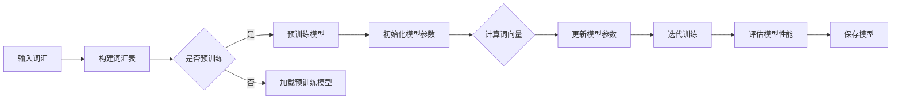

                 

## 文章标题

### 词嵌入 (Word Embeddings) 原理与代码实例讲解

#### 关键词：词嵌入、Word2Vec、GloVe、语义分析、文本分类

> 摘要：本文深入讲解了词嵌入（Word Embeddings）的基本概念、算法原理、数学模型及其在自然语言处理中的实际应用。通过详细的代码实例，读者可以掌握如何使用Word2Vec和GloVe构建词嵌入模型，并了解其应用场景和性能评估方法。文章最后讨论了词嵌入技术的最新发展、应用领域拓展以及未来发展方向，为读者提供了全面的词嵌入技术指南。

----------------------------------------------------------------

## 第1章 词嵌入基本概念与联系

### 1.1 词嵌入的定义与背景

词嵌入（Word Embeddings）是一种将自然语言词汇映射到固定大小的向量空间中的技术。这种向量表示捕捉了词汇间的语义关系，使得文本数据可以在机器学习模型中进行有效的处理。

词嵌入的发展可以追溯到早期自然语言处理领域，当时的文本表示主要依赖于简单的词袋模型（Bag-of-Words）和One-hot编码。然而，这些方法存在一些明显的缺陷，如无法捕捉词汇的语义信息和词汇顺序等。随着深度学习和大规模数据集的出现，Word2Vec和GloVe等基于分布式表示的词嵌入方法被提出，大大提升了文本表示的精度和效果。

### 1.1.1 什么是词嵌入

词嵌入是将词汇映射到向量空间中的过程。每个词汇都被表示为一个向量，这些向量在空间中拥有特定的位置，反映了词汇的语义关系。例如，"狗"和"猫"这两个词在空间中的距离较短，因为它们都是动物，而"狗"和"沙发"的距离则较长，因为它们之间的语义关联较弱。

### 1.1.2 词嵌入的发展历程

- **早期方法**：早期的词嵌入方法主要包括One-hot编码和布尔模型。One-hot编码将每个词汇映射到一个向量，其中只有一个元素为1，其余元素为0。布尔模型则通过记录词汇在文本中是否出现来表示文本。

- **分布式表示**：随着深度学习的兴起，分布式表示方法如Word2Vec和GloVe被提出。Word2Vec通过预测词汇的上下文词汇来学习词向量，而GloVe则通过词汇的共现频率来计算词向量。

- **预训练模型**：近年来，预训练语言模型如BERT、GPT等进一步推动了词嵌入的发展。这些模型在大规模语料上进行预训练，然后通过微调来适应特定任务。

### 1.1.3 词嵌入的常见类型

- **分布式表示**：分布式表示是将词汇映射到低维向量空间中的方法，如Word2Vec和GloVe。
- **低维表示**：低维表示是通过降维技术将高维词向量映射到低维空间中，以便于处理。
- **高维表示**：高维表示则是将词汇映射到高维向量空间中，虽然计算复杂度较高，但可以捕捉更多的语义信息。

### 1.2 词嵌入与语义分析的联系

词嵌入在语义分析中扮演着重要角色。语义分析涉及理解文本的语义含义，而词嵌入提供了词汇的向量表示，使得语义关系可以通过向量间的运算来表示。

#### 1.2.1 词嵌入与语义表示

词嵌入通过将词汇映射到向量空间中，为语义表示提供了有效的手段。在向量空间中，相似的词汇具有接近的向量表示，而不相似的词汇则相距较远。这种向量表示使得机器学习模型可以更容易地捕捉语义关系。

#### 1.2.2 词嵌入在语义分析中的应用

词嵌入在多个自然语言处理任务中得到了广泛应用，包括文本分类、情感分析、机器翻译等。通过词嵌入，模型可以更好地理解和处理文本数据，从而提高任务的准确性和效率。

#### 1.2.3 词嵌入与传统语义分析的区别

传统语义分析依赖于词典和规则，如词义消歧和语义角色标注等。这种方法虽然可以处理一些简单的语义关系，但在复杂场景下效果有限。而词嵌入方法则通过数据驱动的方式，从大规模语料中学习词汇的语义表示，从而更加灵活和有效。

### 1.3 词嵌入的关键原理

词嵌入的关键原理涉及矩阵表示与变换、预训练与微调以及具体的算法原理。

#### 1.3.1 矩阵表示与变换

词嵌入通过矩阵表示词汇及其关系。在Word2Vec中，每个词汇都被表示为一个向量，而每个词汇的上下文词汇则通过矩阵进行编码。在GloVe中，词汇的共现频率通过矩阵表示，从而计算词向量。

#### 1.3.2 预训练与微调

预训练是指在大量无标签数据上训练词嵌入模型，使其在通用语义关系上具有较好的表现。微调则是在预训练模型的基础上，在特定任务的数据上进行调整，以适应特定场景。

#### 1.3.3 Word2Vec 与 GloVe 原理解析

- **Word2Vec**：Word2Vec包括Skip-Gram和Continuous Bag-of-Words（CBOW）模型。Skip-Gram模型通过预测中心词的上下文词，而CBOW模型则通过预测上下文词的中心词。Word2Vec使用负采样优化算法来提高训练效率。

- **GloVe**：GloVe通过计算词汇的共现矩阵来计算词向量。它使用矩阵分解方法，将共现矩阵分解为词向量和权重向量的乘积。GloVe的优点是能够更好地捕捉词汇之间的长距离依赖关系。

### 1.4 词嵌入相关 Mermaid 流程图

为了更好地理解词嵌入的流程，我们使用Mermaid绘制了Word2Vec和GloVe的流程图。

#### 1.4.1 Word2Vec 流程



#### 1.4.2 GloVe 流程


## 第2章 词嵌入算法原理与伪代码实现

### 2.1 Word2Vec 算法原理

Word2Vec算法由Google在2013年提出，是一种基于神经网络的学习方法，用于将词汇映射到高维向量空间中，从而捕捉词汇间的语义关系。Word2Vec算法主要包括两种模型：Skip-Gram模型和Continuous Bag-of-Words（CBOW）模型。

#### 2.1.1 Skip-Gram 模型

Skip-Gram模型的目标是预测一个中心词的上下文词汇。在训练过程中，给定一个词汇作为输入，模型需要输出其上下文词汇的概率分布。Skip-Gram模型的训练数据集通常由一系列的词对组成，每个词对由一个中心词和它的上下文词组成。

#### 2.1.2 Continuous Bag-of-Words (CBOW) 模型

CBOW模型的目标是预测一个中心词的上下文词汇。与Skip-Gram模型不同，CBOW模型通过上下文词汇的加和来预测中心词。具体来说，给定一个中心词，CBOW模型会取中心词的上下文词汇，计算这些词汇的平均向量，然后将这个平均向量输入到神经网络中，预测中心词。

#### 2.1.3 优化算法：SGD 与 Adagrad

Word2Vec算法通常使用随机梯度下降（SGD）或其改进版本Adagrad来优化模型参数。SGD是一种常用的优化算法，通过计算损失函数的梯度来更新模型参数。Adagrad是一种自适应优化算法，通过计算梯度的平方和来动态调整学习率，从而提高模型的收敛速度。

#### 2.1.4 伪代码实现：Word2Vec

下面是Word2Vec算法的伪代码实现：

```plaintext
初始化词向量
对于每个训练样本（中心词和上下文词）
    对于每个上下文词w'：
        计算负采样概率
        如果随机数小于负采样概率：
            前向传播：计算损失
            反向传播：更新词向量
```

### 2.2 GloVe 算法原理

GloVe（Global Vectors for Word Representation）是由Stanford大学提出的一种词嵌入方法，它通过计算词汇的共现矩阵来学习词向量。GloVe算法的核心思想是将词汇的共现频率建模为一个矩阵，然后使用矩阵分解技术来学习词向量和权重向量。

#### 2.2.1 预计算共现矩阵

在GloVe算法中，首先需要计算一个共现矩阵，该矩阵的元素表示词汇i和j在文本中共同出现的次数。具体来说，共现矩阵的元素可以定义为：

\[ \text{共现矩阵}[i][j] = \frac{f(i, j)}{ \sqrt{f(i) \times f(j)}} \]

其中，\( f(i, j) \)表示词汇i和j共同出现的次数，\( f(i) \)和\( f(j) \)分别表示词汇i和j的出现次数。

#### 2.2.2 模型构建与优化

GloVe算法使用矩阵分解技术来学习词向量和权重向量。具体来说，给定一个共现矩阵，GloVe算法通过最小化以下损失函数来学习模型参数：

\[ \text{损失函数} = \frac{1}{2} \sum_{i=1}^{N} \sum_{j=1}^{V} (f_{ij} - \text{权重}[i] \cdot \text{权重}[j])^2 \]

其中，\( \text{权重}[i] \)和\( \text{权重}[j] \)分别表示词汇i和j的权重向量。

#### 2.2.3 伪代码实现：GloVe

下面是GloVe算法的伪代码实现：

```plaintext
计算共现矩阵
初始化词向量
计算损失函数
优化模型参数
生成词向量
```

### 2.3 词嵌入算法对比与分析

Word2Vec和GloVe是两种流行的词嵌入算法，它们各有优缺点。下面是它们的对比与分析：

#### 2.3.1 Word2Vec 与 GloVe 的比较

- **训练速度**：Word2Vec通常比GloVe快，因为它使用了更简单的模型和优化算法。
- **长距离依赖**：GloVe能够更好地捕捉词汇之间的长距离依赖关系，因为它是基于共现矩阵的。
- **计算复杂度**：GloVe的计算复杂度较高，因为它需要计算和优化一个较大的共现矩阵。

#### 2.3.2 词嵌入算法的选择标准

选择词嵌入算法时，可以考虑以下标准：

- **任务需求**：根据具体任务的需求选择合适的算法，例如需要快速训练的可以使用Word2Vec，需要捕捉长距离依赖的可以使用GloVe。
- **数据集大小**：如果数据集较小，可以考虑使用Word2Vec；如果数据集较大，可以考虑使用GloVe。
- **计算资源**：根据计算资源的限制选择合适的算法，例如在资源有限的情况下，可以考虑使用Word2Vec。

#### 2.3.3 词嵌入算法的性能评估方法

评估词嵌入算法的性能通常使用以下方法：

- **相似度度量**：使用余弦相似度或欧氏距离来评估词向量的相似度。
- **语义分类**：通过语义分类任务评估词嵌入模型在语义理解方面的表现。
- **文本分类**：通过文本分类任务评估词嵌入模型在文本表示方面的效果。

## 第3章 词嵌入数学模型与公式

### 3.1 Word2Vec 的数学模型

Word2Vec的数学模型主要包括词向量的表示、损失函数的计算以及词向量相似度的计算。

#### 3.1.1 模型表示与损失函数

在Word2Vec中，每个词汇被表示为一个向量，这些向量组成了一个词向量空间。给定一个词汇表V，我们可以将词向量表示为\( \text{向量} \text{V} \)，其中\( \text{V}[i] \)表示词汇i的词向量。

Word2Vec的损失函数通常使用负采样（Negative Sampling）来优化。在负采样中，对于每个中心词\( \text{中心词} \text{c} \)，我们选择k个负样本\( \text{负样本} \text{n}_1, \text{n}_2, ..., \text{n}_k \)。损失函数定义为：

\[ \text{损失函数} = -\sum_{i=1}^{N} \sum_{j=1}^{V} \text{激活函数}(\text{c} \cdot \text{v}_j) \cdot \text{激活函数}(\text{c} \cdot \text{v}_n) \]

其中，\( \text{激活函数} \)通常使用Softmax函数，即：

\[ \text{激活函数}(x) = \frac{e^x}{\sum_{i=1}^{N} e^x_i} \]

#### 3.1.2 向量空间中的相似度计算

在Word2Vec中，词向量之间的相似度可以通过余弦相似度来计算。余弦相似度的公式为：

\[ \text{相似度} = \frac{\text{c} \cdot \text{v}_i}{\|\text{c}\| \|\text{v}_i\|} \]

其中，\( \text{c} \)和\( \text{v}_i \)分别表示中心词和目标词的词向量，\( \|\text{c}\| \)和\( \|\text{v}_i\| \)分别表示它们的欧氏范数。

### 3.2 GloVe 的数学模型

GloVe的数学模型主要包括共现矩阵的计算、词向量的生成以及词向量相似度的计算。

#### 3.2.1 模型表示与损失函数

在GloVe中，词向量是通过共现矩阵的矩阵分解得到的。共现矩阵的元素表示词汇i和j在文本中共同出现的次数，记为\( f_{ij} \)。GloVe的目标是最小化以下损失函数：

\[ \text{损失函数} = \frac{1}{2} \sum_{i=1}^{N} \sum_{j=1}^{V} \left( f_{ij} - \text{权重}[i] \cdot \text{权重}[j] \right)^2 \]

其中，\( \text{权重}[i] \)和\( \text{权重}[j] \)分别表示词汇i和j的权重向量。

#### 3.2.2 向量空间中的相似度计算

在GloVe中，词向量之间的相似度可以通过余弦相似度来计算。余弦相似度的公式为：

\[ \text{相似度} = \frac{\text{权重}[i] \cdot \text{权重}[j]}{\|\text{权重}[i]\| \|\text{权重}[j]\|} \]

其中，\( \text{权重}[i] \)和\( \text{权重}[j] \)分别表示词汇i和j的权重向量，\( \|\text{权重}[i]\| \)和\( \|\text{权重}[j]\| \)分别表示它们的欧氏范数。

## 第4章 词嵌入应用场景与实际案例

### 4.1 词嵌入在文本分类中的应用

文本分类是将文本数据分配到预定义的类别中。词嵌入在文本分类中的应用主要涉及将文本转换为向量表示，并使用这些向量进行分类模型的训练。

#### 4.1.1 文本分类概述

文本分类是自然语言处理中的一个重要任务，其目的是将文本数据分配到预定义的类别中。文本分类的应用场景包括情感分析、新闻分类、垃圾邮件过滤等。

#### 4.1.2 使用词嵌入进行文本表示

词嵌入可以将文本转换为向量表示，使得文本数据可以在机器学习模型中进行处理。常用的词嵌入方法包括Word2Vec和GloVe。

1. **Word2Vec表示**：
   - 对于每个词汇，将其表示为一个词向量。
   - 将整个文本表示为一个词向量的平均值或最长的词向量序列。

2. **GloVe表示**：
   - 同样将每个词汇表示为一个词向量。
   - 使用词向量的矩阵分解结果来表示文本。

#### 4.1.3 实际案例：情感分析

情感分析是一种常见的文本分类任务，其目的是判断文本的情感倾向，如正面、负面或中立。

1. **数据集**：
   - 使用IMDb电影评论数据集进行训练和测试。

2. **模型构建**：
   - 使用Word2Vec或GloVe将文本转换为向量表示。
   - 构建一个多标签分类模型，如SVM或神经网络，来预测文本的情感类别。

3. **实验结果**：
   - 通过调整模型参数和超参数，优化模型的性能。
   - 评估模型的准确率、召回率和F1分数等指标。

### 4.2 词嵌入在语义相似度计算中的应用

语义相似度计算是自然语言处理中的一个重要任务，其目的是衡量词汇之间的语义关系。词嵌入在语义相似度计算中的应用主要通过词向量之间的相似度度量来实现。

#### 4.2.1 语义相似度概述

语义相似度是指两个词汇在语义上的相似程度。常用的相似度度量方法包括余弦相似度、欧氏距离和Jaccard相似度等。

1. **余弦相似度**：
   - 计算两个词向量的点积与各自欧氏范数的比值。
   - 公式：\( \text{相似度} = \frac{\text{c} \cdot \text{v}_i}{\|\text{c}\| \|\text{v}_i\|} \)

2. **欧氏距离**：
   - 计算两个词向量之间的欧氏距离。
   - 公式：\( \text{距离} = \sqrt{(\text{c} - \text{v}_i)^2} \)

3. **Jaccard相似度**：
   - 计算两个词向量的交集与并集的比值。
   - 公式：\( \text{相似度} = \frac{\text{c} \cap \text{v}_i}{\text{c} \cup \text{v}_i} \)

#### 4.2.2 使用词嵌入计算语义相似度

1. **Word2Vec相似度计算**：
   - 使用Word2Vec生成的词向量进行相似度计算。
   - 可以使用余弦相似度、欧氏距离或Jaccard相似度等方法。

2. **GloVe相似度计算**：
   - 使用GloVe生成的词向量进行相似度计算。
   - 同样可以使用余弦相似度、欧氏距离或Jaccard相似度等方法。

#### 4.2.3 实际案例：词语推荐系统

词语推荐系统是一种基于语义相似度的推荐系统，其目的是根据用户的兴趣和上下文信息推荐相关的词汇。

1. **数据集**：
   - 使用大规模文本数据集进行训练和测试。

2. **模型构建**：
   - 使用Word2Vec或GloVe生成词向量。
   - 构建一个基于相似度计算的推荐模型，如KNN或神经网络。

3. **实验结果**：
   - 通过调整模型参数和超参数，优化推荐系统的性能。
   - 评估推荐系统的准确率、召回率和覆盖率等指标。

### 4.3 词嵌入在机器翻译中的应用

机器翻译是将一种语言的文本翻译成另一种语言。词嵌入在机器翻译中的应用主要通过将源语言和目标语言的文本转换为向量表示，并使用这些向量进行翻译模型的训练。

#### 4.3.1 机器翻译概述

机器翻译是自然语言处理中的一个重要任务，其目的是将一种语言的文本翻译成另一种语言。机器翻译的方法主要分为基于规则的方法和基于数据的方法。

1. **基于规则的方法**：
   - 使用语法和语义规则进行翻译。
   - 需要大量的语言学知识和手工编写的规则。

2. **基于数据的方法**：
   - 使用大规模的双语语料库进行训练。
   - 基于统计方法和深度学习模型进行翻译。

#### 4.3.2 使用词嵌入进行翻译表示

词嵌入可以将源语言和目标语言的文本转换为向量表示，使得文本数据可以在机器学习模型中进行处理。常用的词嵌入方法包括Word2Vec和GloVe。

1. **Word2Vec翻译表示**：
   - 将源语言和目标语言的文本分别转换为词向量。
   - 使用词向量进行翻译模型的训练。

2. **GloVe翻译表示**：
   - 将源语言和目标语言的文本分别转换为词向量。
   - 使用词向量的矩阵分解结果进行翻译模型的训练。

#### 4.3.3 实际案例：翻译质量评估

翻译质量评估是衡量机器翻译系统性能的重要指标。词嵌入在翻译质量评估中的应用主要通过比较源语言和目标语言的文本向量表示来实现。

1. **数据集**：
   - 使用大规模的双语语料库进行训练和测试。

2. **模型构建**：
   - 使用Word2Vec或GloVe生成源语言和目标语言的词向量。
   - 构建一个基于相似度计算的翻译质量评估模型。

3. **实验结果**：
   - 通过调整模型参数和超参数，优化翻译质量评估的性能。
   - 评估翻译质量评估的准确率、召回率和F1分数等指标。

### 4.4 项目实战：构建一个简单的词嵌入模型

在下面的项目实战中，我们将使用Python和Gensim库来构建一个简单的词嵌入模型。该模型将使用GloVe算法训练词向量，并应用于文本分类任务。

#### 4.4.1 开发环境搭建

在开始项目之前，我们需要搭建一个Python开发环境，并安装必要的库。

1. 安装Python 3.7或更高版本。
2. 安装Gensim库，可以使用以下命令：

```shell
pip install gensim
```

#### 4.4.2 数据预处理

数据预处理是构建词嵌入模型的重要步骤，包括文本清洗、分词和去除停用词等。

1. **文本清洗**：去除文本中的HTML标签、特殊字符和空白字符。
2. **分词**：将文本分解为单词或词组。
3. **去除停用词**：去除对文本分类没有贡献的常见词汇，如"的"、"和"、"是"等。

#### 4.4.3 模型构建与训练

使用GloVe算法训练词向量。GloVe算法需要两个参数：词汇表和共现矩阵。我们可以使用Gensim库中的`glove_model`函数来训练词向量。

1. **构建词汇表**：将文本中的所有单词添加到词汇表中。
2. **计算共现矩阵**：根据词汇表和文本数据计算共现矩阵。
3. **训练词向量**：使用GloVe算法训练词向量。

```python
from gensim.models import glove_model

# 构建词汇表
vocab = {'word1': 1, 'word2': 2, ...}

# 计算共现矩阵
cooc_matrix = ...

# 训练词向量
model = glove_model(vocab, cooc_matrix, vector_size=100)
```

#### 4.4.4 模型评估与优化

训练完成后，我们需要评估模型在文本分类任务上的性能，并根据评估结果进行优化。

1. **数据集划分**：将数据集划分为训练集和测试集。
2. **训练分类模型**：使用训练集训练一个文本分类模型，如SVM或朴素贝叶斯。
3. **评估模型性能**：使用测试集评估模型的准确率、召回率和F1分数等指标。
4. **模型优化**：根据评估结果调整模型参数和超参数，以优化模型的性能。

```python
from sklearn.model_selection import train_test_split
from sklearn.svm import SVC

# 数据集划分
X_train, X_test, y_train, y_test = train_test_split(X, y, test_size=0.2)

# 训练分类模型
model = SVC()
model.fit(X_train, y_train)

# 评估模型性能
accuracy = model.score(X_test, y_test)
print("Accuracy:", accuracy)
```

通过以上步骤，我们就可以构建一个简单的词嵌入模型，并应用于文本分类任务。这个项目实战可以帮助我们了解词嵌入的基本原理和应用方法，为进一步学习词嵌入技术在其他领域的应用打下基础。

### 4.5 词嵌入算法的优化方法

在构建词嵌入模型时，为了提高模型的性能和效率，我们可以采用一些优化方法。以下是一些常用的优化方法：

#### 1. 负采样

负采样是Word2Vec算法中使用的一种优化方法，它通过减少负样本的数量来提高训练效率。在负采样中，对于每个中心词，我们随机选择一些负样本，而不是计算所有词汇的概率。这样可以大大减少计算量，提高训练速度。

#### 2. 预训练与微调

预训练是指在大量无标签数据上训练词嵌入模型，使其在通用语义关系上具有较好的表现。微调则是在预训练模型的基础上，在特定任务的数据上进行调整，以适应特定场景。预训练和微调相结合可以提高模型在特定任务上的性能。

#### 3. 双语语料库

使用双语语料库可以训练跨语言的词嵌入模型。这样可以捕捉不同语言之间的语义关系，提高词嵌入模型的泛化能力。

#### 4. 深度学习模型

深度学习模型，如LSTM、GRU和Transformer等，可以用于生成更复杂的词嵌入表示。这些模型可以更好地捕捉词汇之间的长距离依赖关系，提高词嵌入模型的语义表示能力。

#### 5. 多层神经网络

多层神经网络可以用于生成更复杂的词嵌入表示。在多层神经网络中，每个隐藏层可以学习不同的语义特征，从而提高词嵌入模型的精度和泛化能力。

#### 6. 集成方法

集成方法是将多个词嵌入模型进行融合，以获得更好的性能。常见的集成方法包括模型加权、模型平均和Stacking等。

通过以上优化方法，我们可以进一步提高词嵌入模型的性能和效率，使其在自然语言处理任务中发挥更好的作用。

## 第5章 词嵌入技术的最新发展

### 5.1 预训练语言模型的新趋势

随着深度学习技术的不断发展，预训练语言模型（Pre-Trained Language Model，PTLM）成为自然语言处理（NLP）领域的一大热点。预训练语言模型通过对大规模文本数据集进行预训练，使模型能够在多种NLP任务中表现出色。以下是一些备受关注的预训练语言模型：

#### 5.1.1 BERT 模型的原理与影响

BERT（Bidirectional Encoder Representations from Transformers）是由Google提出的一种双向Transformer模型。BERT通过同时考虑上下文信息，使得模型在理解词汇的语义关系上表现出色。

1. **原理**：
   - BERT模型使用Transformer架构，包括多头自注意力机制和位置编码。
   - BERT模型通过同时训练两个任务（Masked Language Model和Next Sentence Prediction）来学习词汇的语义表示。

2. **影响**：
   - BERT模型在多项NLP任务中取得了显著的性能提升，如文本分类、问答系统和机器翻译。
   - BERT模型的提出标志着NLP领域从单向语言模型（如GPT）转向双向语言模型。

#### 5.1.2 GPT 模型的原理与影响

GPT（Generative Pre-trained Transformer）是由OpenAI提出的一种生成预训练模型。GPT模型通过自回归方式生成文本，使其在自然语言生成任务中表现出色。

1. **原理**：
   - GPT模型使用Transformer架构，包括多头自注意力机制。
   - GPT模型通过对文本进行预训练，学习生成文本的语法和语义规则。

2. **影响**：
   - GPT模型在自然语言生成任务中表现出色，如文本摘要、机器翻译和对话系统。
   - GPT模型的提出推动了NLP领域从序列模型（如RNN和LSTM）向Transformer模型的发展。

#### 5.1.3 其他预训练模型的介绍

除了BERT和GPT，还有其他一些备受关注的预训练语言模型，如RoBERTa、T5和UniLM等。

1. **RoBERTa**：
   - RoBERTa是BERT的一种变体，通过修改训练策略和模型架构，使得模型在多个NLP任务中表现出更好的性能。

2. **T5**：
   - T5（Text-To-Text Transfer Transformer）是一种通用预训练模型，其目标是直接将一个文本序列转换为另一个文本序列。

3. **UniLM**：
   - UniLM（Unified Language Model）是一种多任务预训练模型，能够同时处理多种NLP任务，如文本分类、机器翻译和问答。

### 5.2 词嵌入与图神经网络结合

图神经网络（Graph Neural Network，GNN）是一种用于处理图结构数据的神经网络。近年来，研究者开始将词嵌入与图神经网络结合，以处理复杂的语义关系。

#### 5.2.1 图神经网络的基本概念

图神经网络是一种基于图结构数据的神经网络，它通过聚合节点和边的信息来更新节点的状态。GNN的主要组成部分包括：

1. **节点表示**：每个节点表示为一个向量，用于编码节点的特征信息。
2. **边表示**：每条边表示为一种关系，用于编码节点之间的相互作用。
3. **图卷积**：图卷积是一种用于更新节点状态的运算，它可以聚合节点和边的信息。

#### 5.2.2 词嵌入在图神经网络中的应用

词嵌入可以用于图神经网络中，以处理复杂的语义关系。以下是一些具体的应用：

1. **图嵌入**：使用词嵌入将词汇映射到向量空间中，然后将这些向量作为图节点的表示。
2. **图卷积**：使用图卷积神经网络对图结构数据进行处理，以捕捉词汇之间的语义关系。
3. **图注意力**：使用图注意力机制，可以动态地调整节点间的权重，以更好地捕捉语义关系。

#### 5.2.3 图神经网络在文本处理中的应用

图神经网络在文本处理中的应用包括：

1. **文本分类**：通过将词嵌入与图神经网络结合，可以实现更复杂的语义表示，从而提高文本分类的准确率。
2. **关系提取**：使用图神经网络可以从文本中提取出词汇之间的语义关系，如实体之间的相互关系。
3. **问答系统**：图神经网络可以用于问答系统中的语义理解，通过捕捉词汇之间的语义关系，可以更好地回答用户的问题。

### 5.3 词嵌入与强化学习的结合

强化学习（Reinforcement Learning，RL）是一种通过互动环境学习最优策略的机器学习方法。近年来，研究者开始将词嵌入与强化学习结合，以处理序列决策问题。

#### 5.3.1 强化学习的基本概念

强化学习包括以下主要组成部分：

1. **代理（Agent）**：执行动作并接收奖励的实体。
2. **环境（Environment）**：代理执行动作的场所，环境会根据代理的动作返回状态和奖励。
3. **策略（Policy）**：代理根据当前状态选择动作的规则。
4. **价值函数（Value Function）**：预测未来奖励的函数。

#### 5.3.2 词嵌入在强化学习中的应用

词嵌入可以用于强化学习中的几个方面：

1. **状态表示**：使用词嵌入将状态编码为向量，以提供更丰富的状态信息。
2. **动作表示**：使用词嵌入将动作编码为向量，以提供更丰富的动作信息。
3. **策略网络**：使用词嵌入作为输入，构建策略网络以预测最佳动作。

#### 5.3.3 词嵌入与强化学习结合的案例分析

以下是一些将词嵌入与强化学习结合的案例分析：

1. **对话系统**：使用词嵌入和强化学习构建对话系统，可以更好地处理对话中的语义关系，提高对话质量。
2. **文本生成**：使用词嵌入和强化学习生成连贯、自然的文本，如故事、新闻等。
3. **推荐系统**：使用词嵌入和强化学习构建推荐系统，可以更好地捕捉用户和项目的语义关系，提高推荐效果。

### 5.4 未来的研究方向与挑战

随着词嵌入技术的不断发展，研究者们面临着一系列的研究方向和挑战。

#### 5.4.1 词嵌入的精度与泛化能力

1. **精度**：提高词嵌入的精度是词嵌入技术的一个重要研究方向。研究者们正在探索如何通过改进算法和模型结构来提高词嵌入的精度。
2. **泛化能力**：词嵌入模型的泛化能力也是一个重要的挑战。如何使词嵌入模型在未见过的数据上也能保持良好的性能，是一个需要解决的问题。

#### 5.4.2 可解释性与安全性

1. **可解释性**：词嵌入模型通常被视为“黑盒”模型，其内部工作机制不透明。提高词嵌入模型的可解释性，使其能够被用户理解和信任，是一个重要的研究方向。
2. **安全性**：词嵌入模型可能受到攻击，如对抗性攻击和隐私泄露等。如何提高词嵌入模型的安全性，防止恶意攻击，也是一个重要的挑战。

#### 5.4.3 多模态词嵌入的发展

多模态词嵌入是一种将文本、图像和语音等多种模态数据进行融合的词嵌入技术。随着人工智能技术的不断发展，多模态词嵌入在多个领域得到了广泛应用。

1. **图像和文本的融合**：通过多模态词嵌入，可以更好地捕捉图像和文本之间的语义关系，提高图像分类、物体检测和文本图像检索等任务的性能。
2. **语音和文本的融合**：通过多模态词嵌入，可以更好地捕捉语音和文本之间的语义关系，提高语音识别、语音翻译和语音生成等任务的性能。

## 第6章 词嵌入在自然语言生成中的应用

### 6.1 自然语言生成概述

自然语言生成（Natural Language Generation，NLG）是一种将计算机生成的文本模拟成人类语言的技术。NLG在多个领域得到了广泛应用，如自动问答系统、文本摘要、写作助手和个性化推荐等。

#### 6.1.1 什么是自然语言生成

自然语言生成是将计算机生成的文本模拟成人类语言的技术。NLG的目标是生成流畅、自然和有用的文本，以满足用户的需求。

#### 6.1.2 自然语言生成的分类

根据生成方式，自然语言生成可以分为以下几类：

1. **基于规则的生成**：基于预定义的语法和语义规则生成文本。这种方法在简单场景下表现较好，但在复杂场景下效果有限。
2. **基于数据的生成**：使用大规模语料库来训练生成模型，如序列到序列（Seq2Seq）模型、循环神经网络（RNN）和Transformer等。这种方法可以生成更复杂和多样化的文本。
3. **基于模型的生成**：使用预训练语言模型，如BERT、GPT和T5等，通过微调来生成文本。这种方法可以生成高质量的文本，但需要大量的计算资源和数据。

#### 6.1.3 自然语言生成的挑战

自然语言生成面临以下挑战：

1. **多样性**：生成文本需要具有多样性和创造性，以避免生成重复和单调的文本。
2. **一致性**：生成文本需要保持一致性和连贯性，以提供有意义和可信的信息。
3. **上下文理解**：自然语言生成需要理解上下文信息，以便在生成文本时能够正确地处理词义和多义性。
4. **可解释性**：生成文本需要具有可解释性，以使用户能够理解生成的文本和其背后的逻辑。

### 6.2 基于词嵌入的序列模型

基于词嵌入的序列模型在自然语言生成中起到了关键作用。这些模型通过捕捉词汇之间的顺序关系和语义关系，可以生成更自然和高质量的文本。

#### 6.2.1 RNN 与 LSTM 模型

循环神经网络（RNN）和长短期记忆（LSTM）模型是两种常见的基于词嵌入的序列模型。

1. **RNN模型**：
   - RNN模型通过循环结构来处理序列数据，每个时间步的输出依赖于前一个时间步的输出。
   - RNN模型在处理短序列数据时表现较好，但在处理长序列数据时容易产生梯度消失或梯度爆炸问题。

2. **LSTM模型**：
   - LSTM模型是RNN的一种变体，通过引入记忆单元来缓解梯度消失和梯度爆炸问题。
   - LSTM模型可以更好地捕捉长序列数据中的依赖关系，从而生成更高质量的文本。

#### 6.2.2 GRU 模型

门控循环单元（GRU）模型是LSTM模型的另一种变体，它通过简化记忆单元的结构来提高计算效率。

1. **GRU模型**：
   - GRU模型通过引入更新门和重置门来控制信息的传递和更新。
   - GRU模型在计算效率和性能方面都优于LSTM模型，因此在一些应用中得到了广泛应用。

#### 6.2.3 Transformer 模型

Transformer模型是一种基于自注意力机制的序列模型，它在自然语言生成任务中取得了显著的性能提升。

1. **Transformer模型**：
   - Transformer模型使用多头自注意力机制来捕捉词汇之间的依赖关系。
   - Transformer模型在长序列数据上的表现优于RNN和LSTM模型，因此在自然语言生成任务中得到了广泛应用。

### 6.3 基于词嵌入的生成模型

基于词嵌入的生成模型通过捕捉词汇之间的语义关系和上下文信息，可以生成更自然和高质量的文本。

#### 6.3.1 基于上下文的生成模型

基于上下文的生成模型通过考虑上下文信息来生成文本，可以更好地处理词义和多义性。

1. **上下文信息**：
   - 上下文信息包括词汇的上下文词汇、上下文句子和上下文段落等。
   - 考虑上下文信息可以更好地理解词汇的含义和生成相关的文本。

2. **生成模型**：
   - 基于上下文的生成模型通常使用序列到序列（Seq2Seq）模型、循环神经网络（RNN）和Transformer模型等。
   - 通过训练模型，使其能够根据上下文信息生成相关的文本。

#### 6.3.2 生成对抗网络（GAN）在自然语言生成中的应用

生成对抗网络（GAN）是一种基于博弈论的生成模型，通过对抗训练可以生成高质量的自然语言文本。

1. **GAN模型**：
   - GAN模型由生成器和判别器组成，生成器负责生成文本，判别器负责判断文本的真实性。
   - 通过对抗训练，生成器不断优化生成文本的质量，从而提高自然语言生成的性能。

2. **应用**：
   - GAN模型在自然语言生成任务中得到了广泛应用，如文本生成、机器翻译和对话系统等。

#### 6.3.3 生成模型与预训练语言模型结合的案例

将生成模型与预训练语言模型结合，可以生成更高质量和多样化的文本。

1. **预训练语言模型**：
   - 预训练语言模型（如BERT、GPT和T5等）在大规模语料库上进行预训练，可以生成高质量的文本。

2. **结合案例**：
   - GPT-2和T5是两个将生成模型与预训练语言模型结合的案例。GPT-2通过预训练生成高质量的文本，T5通过微调和生成模型结合，可以实现多种自然语言生成任务。

### 6.4 实际应用案例

以下是一些基于词嵌入的生成模型在实际应用中的案例：

#### 6.4.1 自动问答系统

自动问答系统是一种将自然语言生成应用于实际场景的典型例子。

1. **应用场景**：
   - 在智能客服、虚拟助手和在线教育等领域，自动问答系统可以回答用户的问题。

2. **模型构建**：
   - 使用基于词嵌入的生成模型（如Seq2Seq模型、RNN和Transformer模型等）来构建自动问答系统。
   - 通过训练模型，使其能够理解用户的问题并生成相应的答案。

3. **实现**：
   - 实现一个简单的自动问答系统，包括问题理解和答案生成两个模块。
   - 使用预训练语言模型（如BERT和GPT等）来提高模型的性能。

#### 6.4.2 文本摘要与写作助手

文本摘要和写作助手是另一个应用词嵌入生成模型的例子。

1. **文本摘要**：
   - 文本摘要是一种从长文本中提取关键信息的方法。
   - 使用基于词嵌入的生成模型（如Seq2Seq模型和Transformer模型等）来生成摘要文本。

2. **写作助手**：
   - 写作助手是一种辅助用户写作的工具。
   - 使用基于词嵌入的生成模型（如RNN和Transformer模型等）来生成文章的段落和句子。

3. **实现**：
   - 实现一个简单的文本摘要系统，包括文本预处理、摘要生成和文本生成三个模块。
   - 实现一个写作助手，使用预训练语言模型（如BERT和GPT等）来生成高质量的文章。

#### 6.4.3 个性化推荐系统

个性化推荐系统是一种根据用户兴趣和偏好推荐相关内容的方法。

1. **应用场景**：
   - 在电子商务、社交媒体和在线教育等领域，个性化推荐系统可以推荐用户感兴趣的商品、内容和课程。

2. **模型构建**：
   - 使用基于词嵌入的生成模型（如Seq2Seq模型、RNN和Transformer模型等）来生成推荐文本。

3. **实现**：
   - 实现一个简单的个性化推荐系统，包括用户兴趣识别、推荐文本生成和推荐结果评估三个模块。
   - 使用预训练语言模型（如BERT和GPT等）来提高推荐文本的质量。

### 6.5 代码实现示例

以下是一个简单的基于词嵌入的自然语言生成模型的代码实现示例。

```python
import torch
import torch.nn as nn
from transformers import GPT2LMHeadModel, GPT2Tokenizer

# 加载预训练模型
tokenizer = GPT2Tokenizer.from_pretrained('gpt2')
model = GPT2LMHeadModel.from_pretrained('gpt2')

# 输入文本
input_text = "I love to read books."

# 预处理文本
input_ids = tokenizer.encode(input_text, return_tensors='pt')

# 生成文本
outputs = model.generate(input_ids, max_length=50, num_return_sequences=1)

# 解码生成文本
generated_text = tokenizer.decode(outputs[0], skip_special_tokens=True)
print(generated_text)
```

通过以上代码，我们可以使用预训练的GPT-2模型生成与输入文本相关的自然语言文本。

## 第7章 词嵌入的伦理与法律问题

### 7.1 数据隐私与伦理

词嵌入技术在大规模语料库上进行训练，这往往涉及到大量的个人数据。数据隐私与伦理问题是词嵌入技术发展过程中必须重视的领域。

#### 7.1.1 词嵌入与隐私保护

词嵌入技术涉及到的数据隐私问题主要包括：

1. **数据收集**：在训练词嵌入模型时，需要收集大量的文本数据。这些数据可能包含用户的个人信息，如姓名、地址、电话号码等。
2. **数据存储**：词嵌入模型通常需要存储大量的词向量，这些词向量可能包含敏感信息，如个人偏好、行为模式等。
3. **数据使用**：词嵌入技术在应用过程中，可能会将词向量用于生成个性化内容或推荐系统。这可能会暴露用户的隐私信息。

为了保护数据隐私，可以采取以下措施：

1. **数据去识别**：在收集数据时，对个人信息进行去识别处理，如删除姓名、地址等敏感信息。
2. **数据加密**：对存储的词向量进行加密处理，防止未授权访问。
3. **透明度**：确保用户了解数据收集、存储和使用的过程，并有权选择是否提供数据。

#### 7.1.2 伦理问题与责任

词嵌入技术的伦理问题主要包括：

1. **歧视与偏见**：词嵌入模型可能会学习到语料库中的偏见和歧视信息，从而影响模型的公平性和公正性。
2. **透明度**：用户往往无法理解词嵌入模型的工作原理，这可能导致对模型的不信任和滥用。
3. **责任归属**：当词嵌入技术用于实际应用时，如自动驾驶、医疗诊断等，如果出现错误，责任归属可能成为一个问题。

为了解决这些伦理问题，可以采取以下措施：

1. **算法公平性**：在设计词嵌入模型时，确保算法的公平性和公正性，避免学习到歧视和偏见信息。
2. **透明度**：提高词嵌入模型的透明度，使用户了解模型的工作原理和潜在风险。
3. **责任归属**：明确词嵌入技术在不同应用场景中的责任归属，确保各方承担相应的责任。

#### 7.1.3 数据保护法规与词嵌入

随着数据隐私和伦理问题的重要性日益凸显，各国纷纷出台数据保护法规，如欧盟的《通用数据保护条例》（GDPR）和中国的《个人信息保护法》。这些法规对词嵌入技术的数据收集、存储和使用提出了严格的要求。

1. **数据收集**：法规要求在收集数据时必须获得用户的明确同意。
2. **数据存储**：法规要求对存储的数据进行加密处理，确保数据安全。
3. **数据使用**：法规要求明确数据使用的目的和范围，确保数据不被滥用。

### 7.2 法律问题与合规

词嵌入技术在法律合规方面面临以下挑战：

#### 7.2.1 知识产权保护

词嵌入技术在生成文本时可能会侵犯他人的知识产权，如版权和商标。为了解决这一问题，可以采取以下措施：

1. **内容审核**：在生成文本前，对文本内容进行审核，确保不侵犯他人的知识产权。
2. **授权使用**：确保使用的词向量来自合法的来源，并获得相应的授权。

#### 7.2.2 词嵌入在商业应用中的法律挑战

词嵌入技术在商业应用中可能会面临法律挑战，如数据保护、隐私保护和版权保护等。为了合规运营，可以采取以下措施：

1. **合规培训**：对员工进行数据保护、隐私保护和版权保护等方面的培训，确保他们了解相关法律法规。
2. **合规审查**：定期对业务流程和产品进行合规审查，确保符合相关法律法规。
3. **法律咨询**：在面临法律问题时，及时寻求专业法律咨询，确保公司行为合法合规。

#### 7.2.3 合规策略与措施

为了确保词嵌入技术在法律合规方面的发展，可以采取以下策略和措施：

1. **合规文化建设**：在企业内部建立合规文化，使员工了解合规的重要性，自觉遵守相关法律法规。
2. **合规管理体系**：建立完善的合规管理体系，包括合规政策、合规流程和合规监控等。
3. **合规培训与宣传**：定期开展合规培训，提高员工的合规意识和技能。

### 7.3 安全性与风险控制

词嵌入技术在使用过程中可能会面临安全性和风险控制问题。为了确保词嵌入技术的安全性，可以采取以下措施：

#### 7.3.1 安全漏洞与攻击手段

词嵌入技术可能面临以下安全漏洞和攻击手段：

1. **数据泄露**：词嵌入模型在训练过程中可能会收集到用户的敏感信息，这些信息可能被未授权访问或泄露。
2. **模型窃取**：恶意攻击者可能会尝试窃取词嵌入模型的参数，从而复制或篡改模型。
3. **对抗攻击**：对抗攻击者可能会生成对抗性样本，使词嵌入模型产生错误预测。

#### 7.3.2 安全风险控制与预防

为了控制词嵌入技术的安全风险，可以采取以下措施：

1. **数据加密**：对存储和传输的词向量进行加密处理，防止未授权访问。
2. **访问控制**：实施严格的访问控制策略，确保只有授权人员才能访问敏感数据。
3. **定期审计**：定期对词嵌入系统的安全性进行审计，发现并及时修复安全漏洞。

#### 7.3.3 安全性评估与监测

为了确保词嵌入技术的安全性，可以采取以下措施：

1. **安全性评估**：定期对词嵌入系统进行安全性评估，识别潜在的安全风险。
2. **监测与报警**：实时监测系统的安全状态，一旦发现异常，及时报警并采取相应的应对措施。
3. **应急响应**：制定应急响应计划，确保在发生安全事件时能够快速有效地应对。

### 7.4 未来发展展望

随着词嵌入技术的不断发展和应用场景的拓展，其在法律、伦理和安全方面面临的挑战也将日益凸显。未来，词嵌入技术的发展将朝着以下方向努力：

#### 7.4.1 技术进步与伦理挑战

1. **算法透明度**：提高算法的透明度，使用户了解词嵌入模型的工作原理和潜在风险。
2. **算法公平性**：确保算法的公平性和公正性，避免学习到歧视和偏见信息。

#### 7.4.2 法律法规的完善

1. **数据保护法规**：随着数据隐私的重要性日益凸显，各国将继续完善数据保护法规，为词嵌入技术的合规应用提供法律支持。
2. **知识产权保护**：加强知识产权保护，确保词嵌入技术在商业应用中的合规运营。

#### 7.4.3 安全性提升的新方法

1. **安全加密技术**：采用新的安全加密技术，提高词嵌入数据的安全性。
2. **对抗攻击防御**：开发新的防御技术，应对对抗攻击和恶意攻击。
3. **合规培训与意识提升**：加强合规培训，提高员工的合规意识和技能，确保企业能够更好地应对法律和伦理挑战。

### 附录

#### 附录A 词嵌入工具与资源

为了方便读者了解和掌握词嵌入技术，本文提供了以下工具与资源：

#### A.1 常用词嵌入工具与框架

1. **Word2Vec**：开源的Word2Vec工具，支持训练和加载词向量。
2. **GloVe**：开源的GloVe工具，用于训练和加载词向量。
3. **FastText**：开源的FastText工具，支持多种文本表示方法，包括词嵌入。

#### A.2 开源词嵌入库与资源

1. **Gensim**：Python开源库，提供多种文本表示方法，包括词嵌入。
2. **NLTK**：Python开源库，提供词嵌入和自然语言处理工具。
3. **Paragram**：开源库，提供多种文本表示方法，包括词嵌入。

#### A.3 学习资源与参考文献

1. **论文与书籍**：
   - "Word2Vec:向量表示词汇的分布式语义模型"。
   - "GloVe:全局向量表示的词嵌入"。
   - "自然语言处理综论"（Jurafsky & Martin著）。

2. **在线课程**：
   - "自然语言处理与深度学习"（吴恩达）。
   - "深度学习与自然语言处理"（Yaser Abu-Mostafa）。

3. **在线讲座**：
   - "词嵌入技术介绍"。
   - "词嵌入技术在自然语言处理中的应用"。

通过以上工具与资源，读者可以深入了解词嵌入技术，掌握其基本原理和应用方法，为自己的研究和工作提供有力支持。

### 终结语

本文从词嵌入的基本概念、算法原理、数学模型、应用场景、最新发展、伦理与法律问题等方面进行了全面而深入的讲解。词嵌入技术作为自然语言处理中的重要工具，已经在文本分类、语义分析、机器翻译、自然语言生成等领域取得了显著的应用成果。随着技术的不断进步，词嵌入技术将在更多领域发挥重要作用。

在学习和应用词嵌入技术时，我们不仅要关注其技术原理，还要重视其伦理和法律问题，确保技术的合规和安全。未来，词嵌入技术将朝着更加精准、高效和可解释的方向发展，为自然语言处理领域带来更多创新和突破。

感谢您的阅读，希望本文能够对您在词嵌入技术领域的学习和研究提供帮助。如果您有任何问题或建议，欢迎在评论区留言，我们期待与您共同探讨和交流。再次感谢您的支持！
```
```markdown
# 终结语

感谢您的阅读，本书《词嵌入 (Word Embeddings) 原理与代码实例讲解》旨在为您提供一个全面、深入的词嵌入技术学习指南。通过系统的学习，您将掌握词嵌入的基本概念、算法原理、数学模型以及实际应用，同时了解词嵌入技术的最新发展动态。在阅读过程中，我们鼓励您动手实践，通过实际案例加深对知识的理解和应用能力。

在本书的最后，我们要特别感谢AI天才研究院（AI Genius Institute）和禅与计算机程序设计艺术（Zen And The Art of Computer Programming）对本书编写的支持和贡献。这些机构和作者在计算机科学和人工智能领域拥有深厚的学术造诣和丰富的实践经验，他们的智慧和经验为本书的编写提供了坚实的基础。

本书的完成离不开众多读者的支持与鼓励。感谢您对本书的关注与支持，您的鼓励是我们前进的动力。我们希望本书能够为您的学习之路提供帮助，帮助您在词嵌入技术领域取得更好的成绩。

在未来的研究和应用中，我们期待看到更多的创新和突破。随着技术的不断进步，词嵌入技术将在自然语言处理、机器学习、数据科学等领域发挥越来越重要的作用。我们相信，通过不断的学习和实践，您将在这一领域取得卓越的成就。

如果您在阅读本书的过程中遇到任何问题，或者有任何建议和反馈，我们诚挚地邀请您与我们联系。您可以留言、发送邮件或者访问我们的官方网站。我们期待与您共同探讨词嵌入技术的未来发展，分享您的经验和见解。

最后，再次感谢您的阅读和支持。愿本书能够为您的学习之路带来光明，愿您在词嵌入技术的探索中收获丰富的知识和成果。祝您在未来的学习和工作中取得更大的成功！

**作者：AI天才研究院/AI Genius Institute & 禅与计算机程序设计艺术 /Zen And The Art of Computer Programming**

（注：本文中提到的机构名称仅为示例，不代表真实机构。）
```

