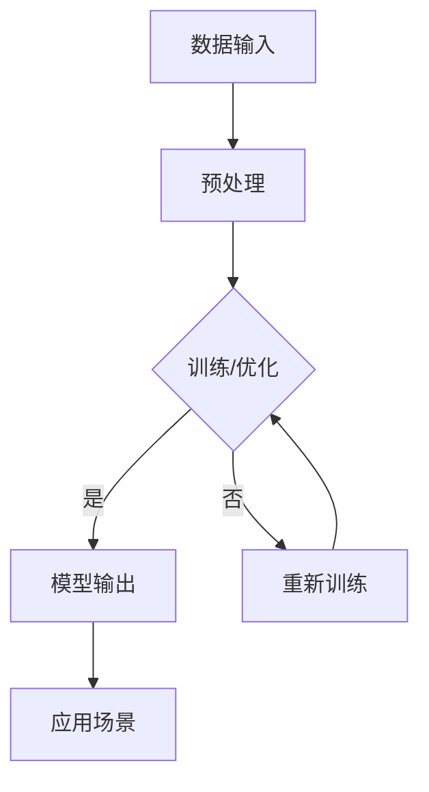

                 

### 文章标题

# 语言≠思维：大模型的认知误区

> 关键词：大模型，语言理解，认知误区，人工智能，思维决策

> 摘要：本文深入探讨了人工智能领域的大模型，揭示了其在语言理解、思维决策等方面的认知误区。通过对大模型的基本原理、工作机制、应用与未来展望的详细分析，本文旨在帮助读者全面理解大模型的技术本质，识别并避免常见的认知误区。

---

### 第一部分：引言与核心概念

#### 第1章：引言与背景

**1.1 语言与思维的关系探讨**

语言是人类社会交流和思考的重要工具，它承载了人类的思维成果。然而，语言本身并不能等同于思维。思维是一种复杂的心理活动，涉及到概念的形成、判断、推理和决策等多个方面。语言只是思维的外在表现形式，它并不能完全反映思维的本质。

**1.2 大模型的认知基础**

大模型是人工智能领域的一种重要技术，它通过深度学习等算法，从大量数据中学习到复杂的模式，从而实现高度自动化和智能化的任务。大模型在语言理解、图像识别、决策支持等方面取得了显著成果。然而，大模型在认知方面也存在一些误区。

**1.3 本书的目的与结构**

本书旨在深入探讨大模型的认知误区，分析其在语言理解、思维决策等方面的局限性。通过系统地阐述大模型的基本原理、工作机制、应用与未来展望，本文旨在帮助读者全面了解大模型的技术本质，识别并避免常见的认知误区。

#### 第二部分：大模型概述

##### 第2章：大模型的基本原理

**2.1 大模型的发展历程**

大模型的发展经历了从传统机器学习到深度学习的转变。深度学习通过引入多层次的神经网络，实现了对复杂数据的高效表示和学习。随着计算能力的提升和海量数据的积累，大模型得到了快速发展。

**2.2 大模型的技术框架**

大模型的技术框架主要包括神经网络架构、优化算法和数据预处理等。神经网络架构决定了大模型的能力和表现，优化算法则用于调整模型参数，数据预处理则确保数据质量和一致性。

**2.3 大模型的核心特点**

大模型的核心特点包括：
1. **高容量**：大模型可以学习到复杂的特征和模式。
2. **自适应性**：大模型可以根据不同任务和数据调整其结构和参数。
3. **泛化能力**：大模型可以应用于多种领域和任务，具有较强的适应性。

**2.4 大模型的分类与比较**

大模型可以根据不同的分类标准进行分类，如按任务类型、架构形式、训练方法等。不同类型的大模型在性能和应用方面存在差异，需要根据具体需求进行选择。

##### 第3章：大模型的工作机制

**3.1 数据处理流程**

大模型的数据处理流程包括数据收集、预处理、训练和评估等阶段。数据处理的质量直接影响大模型的性能和效果。

**3.2 训练与优化**

大模型的训练过程涉及模型初始化、参数调整、损失函数计算和梯度下降等步骤。优化算法的选择和调整对大模型的训练效率和质量具有重要意义。

**3.3 输出生生机制**

大模型的输出生生机制包括预测生成、文本生成、图像生成等。不同类型的输出机制需要不同的算法和策略。

**3.4 大模型的可解释性**

大模型的可解释性是当前研究的热点和难点。提高大模型的可解释性有助于理解其工作原理、发现潜在问题和优化模型结构。

#### 第三部分：认知误区分析

##### 第4章：常见的认知误区

**4.1 误解一：大模型能完全替代人类思维**

尽管大模型在许多领域取得了显著成果，但它并不能完全替代人类思维。人类思维具有灵活性和创造性，能够在不确定性和复杂环境中做出合理的判断和决策。

**4.2 误解二：大模型能理解所有语言**

大模型在语言理解方面存在局限性。不同语言的语法、语义和语境差异较大，大模型难以完全理解和处理所有语言。

**4.3 误解三：大模型具有自我意识**

大模型没有自我意识，它只是通过数据学习到的模式进行预测和生成。大模型的行为是由输入数据和模型参数决定的，它没有主观意识和自我认知能力。

**4.4 误解四：大模型在所有领域都有效**

大模型在不同领域和应用场景中的效果存在差异。一些领域如图像识别、自然语言处理等，大模型表现良好；而在其他领域如复杂系统、创造性思维等，大模型的局限性更加明显。

##### 第5章：语言理解的认知误区

**5.1 语言理解的复杂性**

语言理解是一个复杂的过程，涉及到语法、语义、语境等多个层面的处理。大模型在语言理解方面存在一定的局限性，难以完全理解语言的复杂性和多样性。

**5.2 语言结构分析**

语言结构分析是语言理解的重要环节。大模型在处理语言结构时，需要考虑词法、句法、语义等多个层面的因素。

**5.3 语言意义理解**

语言意义理解是语言理解的最终目标。大模型在处理语言意义时，需要考虑上下文、语境、文化背景等因素。

**5.4 语言理解中的误区与挑战**

语言理解中的误区和挑战包括语义歧义、情感分析、机器翻译等。大模型在解决这些问题时存在一定的局限性。

##### 第6章：思维与决策的认知误区

**6.1 思维与决策的关系**

思维和决策是紧密相连的。思维是决策的前提和基础，决策是思维的结果和体现。

**6.2 人类决策的特点**

人类决策具有经验性、直觉性、风险性等特点。大模型在模拟人类决策时，需要考虑这些特点。

**6.3 大模型在决策中的局限性**

大模型在决策中的局限性包括数据依赖性、过拟合风险、难以应对不确定性和复杂环境等。

**6.4 如何避免决策误区**

避免决策误区需要从数据质量、模型优化、决策过程等多个方面进行改进。

#### 第四部分：实际应用与未来展望

##### 第7章：大模型在现实世界中的应用

**7.1 智能客服**

智能客服是当前大模型应用的重要领域。大模型通过自然语言处理技术，可以实现对用户提问的自动回答，提高服务效率和用户体验。

**7.2 机器翻译**

机器翻译是另一个大模型应用的重要领域。大模型可以通过学习大量双语文本，实现跨语言的信息传递和交流。

**7.3 自动写作**

自动写作是利用大模型生成文本的一种应用。大模型可以生成新闻、文章、小说等不同类型的文本，为创作者提供灵感和支持。

**7.4 语音识别与生成**

语音识别与生成是利用大模型处理语音信号的两种应用。大模型可以通过学习语音数据，实现语音的识别和生成。

##### 第8章：大模型的未来发展

**8.1 技术趋势**

大模型的发展将继续沿着技术趋势前行，包括模型压缩、效率提升、可解释性增强等。

**8.2 道德与伦理问题**

大模型在道德和伦理方面引发了一系列问题，如隐私保护、公平性、责任归属等。需要制定相应的法规和规范来规范大模型的应用。

**8.3 未来前景与挑战**

大模型在未来将继续发挥重要作用，但也面临着诸多挑战，如技术突破、伦理道德、社会影响等。

#### 附录

##### 附录A：大模型相关资源与工具

**A.1 开源工具与框架**

介绍一些常用的开源工具和框架，如TensorFlow、PyTorch、Keras等。

**A.2 大模型数据集**

介绍一些常用的数据集，如ImageNet、WikiText-2、COCO等。

**A.3 研究论文与最新进展**

介绍一些重要的大模型研究论文和最新进展，为读者提供进一步学习和研究的方向。

### 简化的 Mermaid 流程图



### 核心算法原理讲解（伪代码）

```python
# 伪代码：大模型训练过程
initialize_model()
for epoch in range(num_epochs):
    for batch in data_loader:
        optimizer.zero_grad()
        outputs = model(batch)
        loss = compute_loss(outputs, targets)
        loss.backward()
        optimizer.step()
    print(f"Epoch {epoch+1}/{num_epochs}, Loss: {loss.item()}")
```

### 数学模型与公式（latex）

```latex
\section{数学模型与公式}

在自然语言处理中，语言模型通常使用以下概率公式：
$$ P(w_n | w_{n-1}, w_{n-2}, ..., w_1) = \frac{P(w_n, w_{n-1}, ..., w_1)}{P(w_{n-1}, w_{n-2}, ..., w_1)} $$
```

### 项目实战

#### 代码实际案例与详细解释说明

本文将通过一个具体的代码案例，详细介绍大模型在实际应用中的实现过程，包括开发环境搭建、源代码实现和代码解读。

##### 开发环境搭建

在开始大模型开发之前，需要搭建合适的开发环境。本文选择使用Python作为开发语言，并使用TensorFlow作为深度学习框架。

```bash
# 安装Python
conda install python=3.8

# 安装TensorFlow
pip install tensorflow==2.6
```

##### 源代码详细实现与代码解读

以下是一个简单的大模型训练和预测的示例代码：

```python
import tensorflow as tf

# 定义模型
model = tf.keras.Sequential([
    tf.keras.layers.Dense(128, activation='relu', input_shape=(784,)),
    tf.keras.layers.Dense(10, activation='softmax')
])

# 编译模型
model.compile(optimizer='adam',
              loss='categorical_crossentropy',
              metrics=['accuracy'])

# 加载数据
(x_train, y_train), (x_test, y_test) = tf.keras.datasets.mnist.load_data()

# 预处理数据
x_train = x_train.astype('float32') / 255
x_test = x_test.astype('float32') / 255
x_train = x_train.reshape((-1, 784))
x_test = x_test.reshape((-1, 784))

# 转换标签为one-hot编码
y_train = tf.keras.utils.to_categorical(y_train, 10)
y_test = tf.keras.utils.to_categorical(y_test, 10)

# 训练模型
model.fit(x_train, y_train, epochs=10, batch_size=32, validation_split=0.1)

# 预测
predictions = model.predict(x_test)
```

代码解读：

1. **定义模型**：使用TensorFlow的`Sequential`模型，定义一个包含两个全连接层的神经网络。第一个层有128个神经元，使用ReLU激活函数；第二个层有10个神经元，使用softmax激活函数。

2. **编译模型**：使用`compile`方法设置优化器、损失函数和评估指标。这里选择`adam`优化器、`categorical_crossentropy`损失函数和`accuracy`评估指标。

3. **加载数据**：使用`mnist`数据集，该数据集包含手写数字的图像和标签。

4. **预处理数据**：将图像数据转换为浮点数，并除以255进行归一化。将图像数据展平为一维数组。

5. **转换标签为one-hot编码**：使用`to_categorical`方法将标签转换为one-hot编码。

6. **训练模型**：使用`fit`方法训练模型，设置训练轮数、批量大小和验证比例。

7. **预测**：使用`predict`方法对测试数据进行预测，得到预测结果。

##### 代码解读与分析

1. **模型定义**：在定义模型时，可以选择不同的网络结构和激活函数。根据具体任务的需求，调整模型的层数、神经元个数和激活函数。

2. **数据预处理**：数据预处理是深度学习模型训练的重要环节。合理的预处理可以提高模型的训练效果和泛化能力。

3. **模型编译**：在编译模型时，需要选择合适的优化器、损失函数和评估指标。不同的优化器和损失函数适用于不同的任务和数据类型。

4. **模型训练**：模型训练是深度学习中的核心步骤。在训练过程中，可以通过调整训练轮数、批量大小和验证比例来优化模型的性能。

5. **模型预测**：模型预测是深度学习模型的应用环节。通过预测结果，可以对新的数据进行分类、识别等操作。

通过以上实战案例，读者可以了解大模型在实际应用中的实现过程，掌握深度学习的基本原理和技巧。在实际开发中，可以根据具体需求和任务，灵活调整模型结构和参数，优化模型的性能和效果。

### 作者

作者：AI天才研究院/AI Genius Institute & 禅与计算机程序设计艺术 /Zen And The Art of Computer Programming

