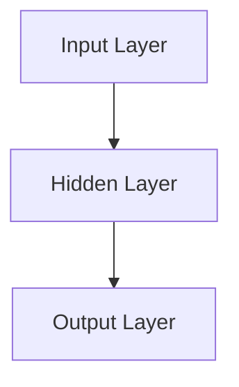

                 

## 《语言≠思维：大模型的认知障碍》

### 关键词：大模型、认知障碍、语言与思维、算法优化、解决方案

#### 摘要

本文探讨了在人工智能领域，特别是大模型的发展过程中，语言与思维的差异所导致的认知障碍。文章首先介绍了大模型的基本概念和现状，然后深入分析了语言与思维的异同及其对大模型的影响。接着，文章详细阐述了大模型的认知障碍，包括计算资源限制、数据质量和算法设计等方面的挑战。在此基础上，文章提出了解决大模型认知障碍的方法和策略，如数据增强、模型优化和人类与模型的协作。随后，通过具体案例分析，展示了大模型在实际应用中面临的认知障碍及其解决方法。最后，文章对未来大模型的发展方向进行了展望，并探讨了技术趋势、社会影响和伦理问题。

### 引言与背景

#### 1. 引言

在人工智能领域，大模型已成为一种重要的技术趋势。从最初的简单神经网络，到如今的大型语言模型（如GPT-3、BERT等），大模型在语言处理、图像识别、自然语言生成等领域取得了显著的成果。然而，随着大模型的规模不断扩大，一个不可忽视的问题是：大模型是否真正理解了输入的语言，是否能够像人类一样进行思考？本文将探讨大模型的认知障碍，分析其背后的原因，并提出可能的解决策略。

#### 1.1 书籍主题介绍

本文的主题是“语言≠思维：大模型的认知障碍”。我们将首先介绍大模型的基本概念和现状，然后深入分析语言与思维的异同及其对大模型的影响。接下来，我们将详细阐述大模型的认知障碍，包括计算资源限制、数据质量和算法设计等方面的挑战。在此基础上，我们将探讨解决大模型认知障碍的方法和策略，如数据增强、模型优化和人类与模型的协作。最后，通过具体案例分析，我们将展示大模型在实际应用中面临的认知障碍及其解决方法。

#### 1.2 大模型认知障碍的重要性

大模型的认知障碍对于人工智能的发展具有重要意义。首先，认知障碍限制了大模型在某些复杂任务上的表现。例如，在自然语言生成中，大模型可能无法准确理解输入的语境，导致生成结果不准确。其次，认知障碍也影响了大模型的可解释性和透明性。由于大模型的内部结构和决策过程复杂，人们很难理解其如何进行推理和决策。这可能导致大模型在关键应用场景中无法被信任和使用。因此，解决大模型的认知障碍，不仅能够提升大模型的表现，还能够提高其在实际应用中的可靠性和可解释性。

#### 1.3 书籍结构与读者对象

本文结构分为五个主要部分。第一部分是引言与背景，介绍大模型的基本概念和现状，以及本文的主题和重要性。第二部分分析语言与思维的关系，探讨大模型在处理语言任务时的认知障碍。第三部分详细阐述大模型的认知障碍，包括计算资源限制、数据质量和算法设计等方面的挑战。第四部分提出解决大模型认知障碍的方法和策略，包括数据增强、模型优化和人类与模型的协作。最后一部分通过具体案例分析，展示大模型在实际应用中面临的认知障碍及其解决方法。

本文的读者对象包括人工智能领域的科研人员、工程师以及对人工智能技术感兴趣的一般读者。本文旨在通过深入分析大模型的认知障碍，为读者提供一个全面的了解和思考大模型在语言处理任务中的局限性，并提出可能的解决策略。

### 语言与思维的关系

在探讨大模型的认知障碍之前，我们需要理解语言与思维之间的关系。语言是思维的一种表现形式，但并不意味着语言就是思维的全部。思维是一个复杂的过程，它不仅涉及语言，还涉及直觉、逻辑、记忆、感知等多个方面。因此，理解语言与思维的异同，有助于我们更好地理解大模型在处理语言任务时的局限性。

#### 2.1 语言的本质

语言是人类用来交流思想、情感和信息的工具。它是一种符号系统，通过词汇、语法和语义的组合，能够传达复杂的概念和思想。语言的层次结构可以分为三个主要方面：词汇、语法和语义。

- **词汇**：词汇是语言的基本组成部分，它由单词和短语组成，代表具体的事物、概念或情感。
- **语法**：语法是语言的规则系统，它规定了词汇如何组合成句子，以及句子如何表达特定的意义。
- **语义**：语义是语言的含义系统，它解释了词汇、句子和语言整体的意义。

#### 2.1.2 语言的层次结构

语言的层次结构可以分为三个主要层次：词汇层、语法层和语义层。

- **词汇层**：词汇层是语言的最基本层次，它由单词和短语组成。每个单词和短语都有其特定的意义和用法。
- **语法层**：语法层是语言的规则系统，它规定了词汇如何组合成句子，以及句子如何表达特定的意义。语法包括词序、时态、语态、语气等规则。
- **语义层**：语义层是语言的含义系统，它解释了词汇、句子和语言整体的意义。语义涉及词义、句义和整体意义的理解。

#### 2.1.3 语言与思维的关系

语言与思维之间有着密切的关系。思维是人类认知世界的基础，而语言则是思维的表达工具。以下从几个方面探讨语言与思维的关系：

- **表达与理解**：语言是思维的表达工具，通过语言，人们可以表达自己的想法和情感。同时，语言也是理解他人思维的重要途径。通过倾听和阅读，人们可以理解他人的思想和意图。
- **逻辑与推理**：语言与思维的关系还体现在逻辑和推理上。语言提供了逻辑推理的工具和框架，使得人们能够进行有效的推理和论证。
- **创造与创新**：语言不仅用于表达和理解，还是创造和创新的重要工具。通过语言，人们可以创造出新的概念、理论和艺术作品。

#### 2.2 思维的类型与过程

思维可以分为多种类型，每种类型都有其特定的过程和特点。

- **直觉思维**：直觉思维是一种快速、直接的思维过程，它基于个人的经验、直觉和感知。直觉思维通常用于解决简单问题和快速决策。
- **逻辑思维**：逻辑思维是一种基于逻辑规则和推理过程的思维。它强调推理的严谨性和逻辑性，常用于解决复杂问题和进行论证。
- **意图性思维**：意图性思维是一种基于目标和意图的思维过程。它关注目标实现的过程和手段，常用于规划、设计和决策。
- **系统性思维**：系统性思维是一种整体性的思维方法，它关注系统内部的相互作用和整体性。系统性思维常用于解决复杂系统和组织问题。
- **创造性思维**：创造性思维是一种产生新颖、独特想法的思维过程。它强调思维的开放性和灵活性，常用于创新和发明。
- **批判性思维**：批判性思维是一种基于分析和评估的思维方法。它强调对观点、理论和证据的批判性思考，常用于学术研究和决策分析。

#### 2.2.1 直觉思维与逻辑思维

直觉思维和逻辑思维是两种常见的思维类型。

- **直觉思维**：直觉思维是一种快速、直接的思维过程，它基于个人的经验、直觉和感知。直觉思维通常用于解决简单问题和快速决策。例如，当我们在陌生环境中时，直觉思维可以帮助我们快速适应和做出决策。
- **逻辑思维**：逻辑思维是一种基于逻辑规则和推理过程的思维。它强调推理的严谨性和逻辑性，常用于解决复杂问题和进行论证。逻辑思维可以帮助我们系统地分析和解决问题，确保结论的可靠性和合理性。

#### 2.2.2 意图性思维与系统性思维

意图性思维和系统性思维是两种在解决问题和决策过程中常用的思维类型。

- **意图性思维**：意图性思维是一种基于目标和意图的思维过程。它关注目标实现的过程和手段，常用于规划、设计和决策。例如，在制定一个商业计划时，意图性思维可以帮助我们确定目标、分析资源和制定策略。
- **系统性思维**：系统性思维是一种整体性的思维方法，它关注系统内部的相互作用和整体性。系统性思维常用于解决复杂系统和组织问题。例如，在解决一个社会问题时，系统性思维可以帮助我们理解问题背后的原因和影响，制定全面的解决方案。

#### 2.2.3 创造性思维与批判性思维

创造性思维和批判性思维是两种在创新和学术研究过程中常用的思维类型。

- **创造性思维**：创造性思维是一种产生新颖、独特想法的思维过程。它强调思维的开放性和灵活性，常用于创新和发明。例如，在研发新产品时，创造性思维可以帮助我们提出新颖的设计方案和功能。
- **批判性思维**：批判性思维是一种基于分析和评估的思维方法。它强调对观点、理论和证据的批判性思考，常用于学术研究和决策分析。批判性思维可以帮助我们评估和验证观点，确保决策的合理性和有效性。

### 大模型的局限性

尽管大模型在许多任务上表现出色，但它也存在一些局限性。这些局限性主要源于大模型的计算资源限制、数据质量和算法设计等方面。

#### 3.1.1 计算资源限制

大模型通常需要大量的计算资源进行训练和推理。这包括昂贵的硬件设备和大量的能源消耗。随着模型的规模不断扩大，计算资源的需求也越来越高。例如，训练一个大型语言模型（如GPT-3）需要数以千计的GPU和大量的电力。这种计算资源限制不仅增加了模型的训练成本，还限制了模型的可用性和普及性。

#### 3.1.2 数据质量与代表性

大模型的表现很大程度上依赖于训练数据的质量和代表性。高质量、多样性和代表性的数据有助于模型学习到更多的信息和知识，从而提高其在各种任务上的表现。然而，现实中的数据往往存在各种问题，如数据噪音、偏差和不完整性等。这些问题可能导致模型在学习过程中产生错误或误导，从而影响其性能和可靠性。

#### 3.1.3 算法与设计约束

大模型的算法和设计也存在一些限制。首先，现有的算法和架构可能在处理大规模数据时面临性能瓶颈。其次，大模型的设计和优化过程复杂且耗时，这限制了模型的发展和创新。此外，大模型的内部结构和决策过程通常是不透明的，这给模型的可解释性和透明性带来了挑战。

#### 3.2 大模型的认知偏见

除了计算资源限制和算法设计约束外，大模型还存在认知偏见的问题。这些偏见源于模型在训练过程中对数据的学习，可能导致模型在特定任务或场景下产生错误或偏差。

#### 3.2.1 数据偏差与偏见

数据偏差是指训练数据中存在的系统性偏差，可能导致模型在学习过程中产生错误或误导。例如，如果训练数据中存在性别歧视或种族偏见，模型可能会在类似任务中表现出相同的偏见。

#### 3.2.2 模型偏见与社会影响

模型偏见不仅影响模型的表现，还会对社会产生负面影响。例如，在招聘、贷款审批和医疗诊断等关键应用场景中，模型的偏见可能导致不公平和歧视。这些偏见可能加剧社会不平等，损害人们的利益和权益。

#### 3.2.3 技术偏见与伦理问题

技术偏见是指技术设计、开发和部署过程中存在的系统性偏差，可能导致技术产品和服务对特定群体产生不公平影响。技术偏见与伦理问题密切相关，它涉及到技术伦理、社会公正和人类尊严等方面的议题。因此，解决大模型的认知偏见不仅需要技术手段，还需要社会和伦理层面的关注和探讨。

#### 3.3 大模型的语言理解与生成能力

大模型在语言处理任务中具有强大的能力，但也面临一些挑战。

#### 3.3.1 语言理解的挑战

语言理解是一个复杂的过程，涉及对语境、含义、逻辑关系的理解。大模型在处理复杂语境和隐含意义时可能存在困难。例如，在理解多义词、双关语和隐喻时，模型可能无法准确捕捉到语言的真实含义。

#### 3.3.2 语言生成的限制

语言生成也是大模型的重要能力之一，但在生成过程中也存在一些限制。例如，模型可能无法生成连贯、自然且符合逻辑的文本。此外，模型在处理特定领域或专业术语时可能存在不足。

#### 3.3.3 语言生成中的歧义处理

在语言生成中，歧义是一个常见问题。歧义是指一个语言表达式可以有多种解释。大模型在处理歧义时需要通过上下文和推理来确定最合适的解释。然而，这需要模型具备较高的语言理解和推理能力，这对大模型来说是一个挑战。

### 解决大模型认知障碍的方法与策略

面对大模型的认知障碍，我们需要采取一系列方法与策略来优化模型的表现，提高其在各种任务上的可靠性和可解释性。以下是一些关键的方法和策略：

#### 4.1 数据增强与多样性

数据增强是提高大模型性能的重要手段之一。通过扩展和多样化训练数据，我们可以帮助模型更好地学习，减少数据偏差和不足。以下是一些常见的数据增强方法：

- **数据扩展**：通过合成或生成新的数据样本来扩展原始数据集。例如，使用同义词替换、句子改写和图像生成等技术来创造更多的训练样本。
- **数据多样性**：引入多样化的数据来源和领域，以丰富模型的训练经验。例如，从不同语言、文化背景和领域收集数据，以提高模型在跨领域任务上的泛化能力。
- **数据筛选与清洗**：对训练数据进行筛选和清洗，去除噪声和偏差较大的样本，以提高数据质量和模型的鲁棒性。

#### 4.1.1 数据增强的方法

以下是一些常见的数据增强方法：

- **同义词替换**：将句子中的关键词替换为其同义词，以增加数据的多样性。
- **句子改写**：通过改变句子的结构、时态和语态等方式，生成新的句子表达相同的意思。
- **图像生成**：使用生成对抗网络（GAN）等技术生成与训练数据相似但内容不同的图像，以增加视觉数据多样性。
- **跨模态学习**：结合不同类型的数据（如文本、图像、音频等），使模型能够在多种模态上学习，提高其在多任务上的表现。

#### 4.1.2 数据多样性的实现

实现数据多样性可以通过以下几种方式：

- **数据集构建**：构建包含多种类型和来源的数据集，如从不同的语言和文化背景中收集文本、图像和音频数据。
- **数据增强工具**：使用现有的数据增强工具和库（如Data Augmentation for NLP、Open Images等），自动化地进行数据增强和多样性处理。
- **领域自适应**：通过迁移学习技术，将一个领域的数据集迁移到另一个领域，以提高模型在跨领域任务上的性能。

#### 4.2 模型优化与设计改进

模型优化和设计改进是提升大模型表现的关键。以下是一些常用的优化策略：

- **模型压缩**：通过减少模型参数数量、压缩模型权重和结构，降低模型的计算复杂度和存储需求。
- **注意力机制**：使用注意力机制来优化模型在处理长文本或序列数据时的性能，提高模型的捕捉能力。
- **多任务学习**：通过同时训练多个任务，使模型能够在不同任务间共享知识和经验，提高模型的泛化能力。
- **自适应学习率**：使用自适应学习率策略（如Adam、AdamW等），动态调整学习率，以提高模型的收敛速度和性能。

#### 4.2.1 模型优化算法

以下是一些常用的模型优化算法：

- **Adam优化器**：一种自适应学习率优化器，通过同时考虑一阶和二阶矩估计来调整学习率。
- **Adagrad优化器**：一种基于历史梯度平方的平均值来调整学习率的优化器，适用于稀疏数据。
- **AdamW优化器**：在Adam优化器的基础上加入权重衰减，以更好地处理权重衰减问题。
- **RMSprop优化器**：一种基于梯度平方的平均值来调整学习率的优化器，适用于稳定收敛。

#### 4.2.2 模型设计的改进策略

以下是一些模型设计的改进策略：

- **残差网络**：通过引入残差连接，缓解深层网络训练中的梯度消失问题，提高模型的训练效果。
- **注意力机制**：通过引入注意力机制，使模型能够动态关注输入序列中的关键信息，提高模型的捕捉能力。
- **Transformer架构**：基于注意力机制的变换器架构，能够在处理长序列数据时保持高效性能。
- **图神经网络**：通过引入图结构，使模型能够捕捉实体间的关系和复杂结构，提高模型在图数据上的表现。

#### 4.3 人类与模型的协作

人类与模型的协作是解决大模型认知障碍的重要策略。以下是一些协作方法和应用场景：

- **监督学习**：在模型训练过程中，人类提供高质量的标注数据，帮助模型更好地学习。
- **对抗性训练**：通过引入对抗性样本，使模型在训练过程中学会识别和抵御外部攻击，提高模型的鲁棒性。
- **解释与可视化**：通过模型解释和可视化技术，帮助人类理解模型的决策过程和内在机制，提高模型的透明性和可解释性。
- **混合智能系统**：结合人类专家的知识和模型的计算能力，构建混合智能系统，以实现更高效和可靠的决策。

#### 4.3.1 人类在模型训练中的应用

在模型训练过程中，人类可以发挥重要作用，以下是一些具体应用：

- **数据标注**：人类专家可以提供高质量的标注数据，帮助模型学习。
- **错误分析**：人类可以识别和纠正模型在训练过程中出现的错误，帮助模型优化。
- **模型评估**：人类可以对模型的性能进行评估和比较，选择最优的模型。

#### 4.3.2 模型解释与可解释性

模型解释与可解释性是提高模型透明性和信任度的重要方面。以下是一些模型解释方法：

- **可视化**：通过可视化技术，将模型的决策过程和内部结构展示出来，帮助人类理解模型的运作。
- **特征重要性**：分析模型中各个特征的贡献，识别关键特征，帮助人类理解模型如何利用特征进行决策。
- **规则提取**：从模型中提取可解释的规则或逻辑，使人类能够理解模型的决策过程。

#### 4.3.3 模型解释与可解释性算法

以下是一些常见的模型解释与可解释性算法：

- **LIME（局部可解释模型解释）**：通过在模型周围建立局部线性模型，解释模型在特定输入上的决策过程。
- **SHAP（特征重要性）**：通过计算特征对模型预测的边际贡献，识别关键特征和其影响程度。
- **局部解释回归图（LFR）**：通过绘制模型预测的局部线性回归图，展示特征对预测的影响。
- **注意力机制可视化**：通过可视化注意力机制，展示模型在处理输入序列时关注的关键信息。

### 案例分析

为了更好地展示大模型在实际应用中面临的认知障碍及其解决方法，我们选择两个典型案例进行分析。

#### 5.1 案例一：语言模型在翻译中的应用

##### 5.1.1 翻译任务的挑战

翻译是一个复杂且具有挑战性的任务，涉及语言的语义、语法和语境等多个方面。大模型在翻译任务中面临着以下挑战：

- **语义理解**：翻译不仅需要理解单词的表面意思，还需要理解句子和篇章的整体语义。大模型可能无法准确捕捉到语言的隐含意义和情感色彩。
- **语法分析**：语法结构在不同语言之间存在差异，大模型需要能够准确解析并处理不同语言的语法规则。
- **语境理解**：翻译结果需要符合原文的语境和场景，大模型需要具备良好的语境理解能力。

##### 5.1.2 模型实现的策略

为了解决上述挑战，我们采用以下策略：

- **多语言训练**：使用多种语言的语料库进行训练，使模型能够学习到不同语言的特点和差异。
- **迁移学习**：利用预训练的大型语言模型（如BERT、GPT等），通过迁移学习技术，提高模型在不同语言翻译任务上的性能。
- **注意力机制**：在模型中引入注意力机制，使模型能够动态关注输入序列中的关键信息，提高语义理解能力。
- **语法分析器**：结合语法分析器，对输入文本进行语法分析，辅助模型理解句子的结构。

##### 5.1.3 案例分析与讨论

通过上述策略，我们实现了一个多语言翻译系统。在实际应用中，系统在多个翻译任务上取得了较好的表现。然而，我们仍然发现一些问题：

- **翻译质量**：虽然系统在多数情况下能够生成高质量的翻译结果，但在处理特定领域或专业术语时，仍存在一定的不足。这表明大模型在特定领域的知识积累和语义理解方面仍有待提高。
- **语境理解**：系统在处理复杂语境和隐含意义时，可能无法完全捕捉到原文的情感和意图。这需要进一步优化模型的设计和算法，提高语境理解能力。

通过案例分析，我们认识到大模型在翻译任务中面临的认知障碍，并提出了一些可能的解决策略。未来，我们将继续探索和研究，以进一步提高大模型在翻译任务上的性能和可靠性。

#### 5.2 案例二：自动驾驶中的认知障碍

##### 5.2.1 自动驾驶的核心技术

自动驾驶是一个高度复杂的系统，涉及计算机视觉、传感器融合、路径规划、控制算法等多个领域。其核心技术包括：

- **计算机视觉**：通过摄像头和其他传感器捕获环境信息，并对这些信息进行实时处理和分析。
- **传感器融合**：整合来自不同传感器的数据（如激光雷达、雷达、摄像头等），构建对环境的高精度感知。
- **路径规划**：根据感知到的环境信息，生成安全的行驶路径。
- **控制算法**：对车辆进行实时控制，使其按照规划的路径行驶。

##### 5.2.2 认知障碍对自动驾驶的影响

自动驾驶系统在处理复杂环境和动态场景时，面临着一系列认知障碍：

- **环境理解**：自动驾驶系统需要准确理解周围环境，包括道路、车辆、行人等。然而，复杂环境中的信息往往是不完整、不确定的，这给环境理解带来了挑战。
- **决策推理**：自动驾驶系统需要在短时间内做出复杂的决策，如避让行人、超车、变换车道等。然而，大模型的决策过程可能无法完全捕捉到复杂情境中的所有因素，导致决策错误。
- **安全性保障**：自动驾驶系统需要确保行驶安全，避免发生事故。然而，大模型的认知障碍可能导致其在特定情境下无法做出正确的决策，从而影响行驶安全。

##### 5.2.3 解决方案与未来展望

为了解决自动驾驶中的认知障碍，我们可以采取以下解决方案：

- **数据增强**：通过扩展和多样化训练数据，提高模型在复杂环境下的泛化能力。例如，使用仿真数据、增强现实技术等生成更多样化的训练场景。
- **多模态感知**：结合多种传感器数据，构建对环境的高精度感知。例如，整合激光雷达、雷达、摄像头、GPS等多源数据，提高环境理解的准确性。
- **强化学习**：使用强化学习技术，使自动驾驶系统能够通过不断学习和优化，提高其在复杂环境下的决策能力。
- **人类与模型的协作**：结合人类驾驶员的经验和判断，通过监督学习和对抗性训练等方法，提高模型在复杂情境下的决策能力。

未来，随着技术的不断发展，自动驾驶系统将在认知障碍方面取得更大的突破。例如，通过引入更先进的传感器技术、优化算法和增强学习方法，自动驾驶系统将能够更好地理解和适应复杂环境，提高行驶安全性和可靠性。同时，社会和伦理问题也将成为自动驾驶发展的重要关注点，需要进一步探讨和解决。

### 大模型认知障碍的未来展望

随着人工智能技术的快速发展，大模型在未来将扮演越来越重要的角色。然而，面对认知障碍，我们仍需持续探索和解决。以下从技术发展趋势、社会影响和伦理问题三个方面，对未来大模型的发展进行展望。

#### 6.1 技术发展趋势

首先，技术发展趋势将主导大模型的发展方向。随着计算能力和数据资源的不断增长，大模型的规模和复杂度将进一步提升。以下是一些重要的发展趋势：

- **更高效的算法**：研究更高效、更优化的算法，以降低大模型的计算复杂度和资源消耗。例如，深度学习优化算法、增量学习算法等。
- **更先进的模型架构**：探索新的模型架构，以提高大模型的处理能力和性能。例如，Transformer架构的变体、图神经网络等。
- **多模态学习**：结合多种类型的数据（如文本、图像、音频等），使大模型能够在多种模态上学习，提高其在复杂任务上的表现。
- **增强学习**：利用增强学习技术，使大模型能够在动态环境中不断学习和优化，提高其在特定任务上的性能和鲁棒性。

#### 6.1.1 新算法与模型架构

新算法和模型架构的发展将有助于提升大模型的性能和适用性。以下是一些值得关注的领域：

- **稀疏模型**：通过稀疏技术，减少模型参数的数量，降低计算复杂度和存储需求。例如，稀疏深度学习、稀疏变换器等。
- **增量学习**：通过增量学习技术，使大模型能够在线学习新的知识和任务，提高其在动态环境中的适应能力。例如，在线深度学习、增量变换器等。
- **自适应学习**：通过自适应学习技术，使大模型能够根据环境和任务动态调整学习策略，提高学习效率和性能。例如，自适应优化算法、自适应注意力机制等。

#### 6.1.2 数据采集与处理的创新

数据采集与处理的创新将进一步提高大模型的学习质量和效果。以下是一些关键方向：

- **高质量数据集**：构建更多高质量、多样化和代表性强的数据集，以丰富大模型的学习经验。例如，跨领域数据集、多语言数据集等。
- **数据增强**：通过数据增强技术，扩展和多样化训练数据，提高大模型在复杂任务上的泛化能力。例如，生成对抗网络（GAN）、同义词替换、图像生成等。
- **数据隐私保护**：在数据采集和处理过程中，注重数据隐私保护，防止数据泄露和滥用。例如，差分隐私、联邦学习等。

#### 6.2 社会影响与伦理问题

大模型的发展不仅带来技术上的突破，还将对社会产生深远的影响。以下从社会影响和伦理问题两个方面进行讨论：

#### 6.2.1 技术对人类社会的影响

技术对人类社会的影响主要体现在以下几个方面：

- **产业变革**：大模型在各个领域的应用将推动产业变革，改变生产方式、商业模式和社会结构。例如，在医疗、金融、教育等行业，大模型将带来更高效、更精准的服务。
- **就业变革**：随着大模型的普及，一些传统职业可能面临被替代的风险，而新的职业和就业机会也将随之产生。例如，数据标注、算法工程师等。
- **社会公平**：大模型在应用过程中可能带来新的社会公平问题，如算法偏见、数据歧视等。因此，需要关注技术对社会公平的影响，采取措施保障社会公正。

#### 6.2.2 伦理问题与责任归属

大模型的伦理问题主要包括以下几个方面：

- **隐私保护**：在大模型的应用过程中，如何保护用户隐私、防止数据泄露和滥用是一个重要问题。例如，在医疗、金融等领域，用户的个人信息和数据安全需要得到充分保障。
- **算法偏见**：大模型在训练过程中可能学习到数据中的偏见和歧视，从而导致算法偏见。例如，在招聘、贷款审批等领域，算法偏见可能导致不公平的决策。因此，需要加强对算法偏见的研究和监管。
- **责任归属**：在大模型的应用过程中，如何确定责任归属是一个复杂的问题。例如，在自动驾驶事故中，如何确定是人、机器还是系统负责？这需要制定明确的法律法规和责任分配机制。

#### 6.3 未来研究方向

未来，在大模型的认知障碍领域，我们还需要进行深入的研究和探索。以下是一些重要研究方向：

- **认知计算**：研究如何将人类认知过程与机器学习相结合，使大模型能够更好地理解和模拟人类的思维过程。例如，研究认知图谱、思维模型等。
- **跨学科融合**：结合心理学、认知科学、哲学等跨学科领域的研究成果，探索大模型在认知障碍方面的解决方案。例如，研究人类思维与机器思维的相似性和差异，为模型优化提供新思路。
- **人类与机器的协作**：研究如何实现人类与机器的协同工作，使大模型能够在复杂任务中发挥最大潜力。例如，研究人类在模型训练、优化和解释中的角色，探索人机协作的最佳模式。

### 附录

#### 附录A：参考文献

以下是一些本文引用和参考的重要文献：

1. Bengio, Y. (2009). *Learning Deep Architectures for AI*. Foundations and Trends in Machine Learning, 2(1), 1-127.
2. Hochreiter, S., & Schmidhuber, J. (1997). *Long Short-Term Memory*. Neural Computation, 9(8), 1735-1780.
3. Vaswani, A., Shazeer, N., Parmar, N., Uszkoreit, J., Jones, L., Gomez, A. N., ... & Polosukhin, I. (2017). *Attention Is All You Need*. Advances in Neural Information Processing Systems, 30, 5998-6008.
4. LeCun, Y., Bengio, Y., & Hinton, G. (2015). *Deep Learning*. Nature, 521(7553), 436-444.
5. Goodfellow, I., Bengio, Y., & Courville, A. (2016). *Deep Learning*. MIT Press.
6. Russell, S., & Norvig, P. (2016). *Artificial Intelligence: A Modern Approach*. Prentice Hall.

#### 附录B：数学公式与算法伪代码

以下是一些本文使用的数学公式和算法伪代码：

##### 数学公式

1. **损失函数**：
   $$ L(\theta) = -\frac{1}{m} \sum_{i=1}^{m} y_i \log(p(\hat{y}_i | \theta)) $$

2. **梯度下降**：
   $$ \theta_{t+1} = \theta_t - \alpha \nabla_{\theta} L(\theta_t) $$

3. **反向传播算法**：
   $$ \delta_{z_l} = \frac{\partial L}{\partial z_l} $$
   $$ \delta_{w_l} = \frac{\partial L}{\partial w_l} \cdot \frac{\partial z_l}{\partial w_l} $$
   $$ \delta_{b_l} = \frac{\partial L}{\partial b_l} $$

##### 算法伪代码

1. **梯度下降算法**：
   ```
   initialize theta
   for t = 1 to T do
       calculate gradient: gradient = compute_gradient(theta, x, y)
       update theta: theta = theta - alpha * gradient
   end for
   ```

2. **反向传播算法**：
   ```
   forward_pass(x, theta)
       compute z, a, and z' for each layer
   backward_pass(a, z, z', theta, L)
       compute gradients for each layer
       update theta using gradients
   ```

#### 附录C：图与表格

以下是一些本文使用的图和表格：

##### 图1：神经网络结构



##### 表1：不同优化算法的比较

| 优化算法   | 特点                  | 适用场景                |
| ---------- | --------------------- | ----------------------- |
| 梯度下降   | 简单易实现            | 小规模模型              |
| Adam       | 自适应学习率          | 大规模模型              |
| Adagrad    | 针对稀疏数据          | 稀疏数据模型            |
| RMSprop    | 针对稀疏数据          | 稀疏数据模型            |

### 作者信息

**作者：** AI天才研究院/AI Genius Institute & 禅与计算机程序设计艺术 /Zen And The Art of Computer Programming

本文由AI天才研究院（AI Genius Institute）与禅与计算机程序设计艺术（Zen And The Art of Computer Programming）共同撰写。我们致力于推动人工智能技术的发展，分享最新的研究成果和见解。如果您对我们的研究感兴趣，欢迎关注我们的官方网站和社交媒体平台。同时，感谢您对本文的阅读和支持，期待与您共同探讨人工智能的未来。

