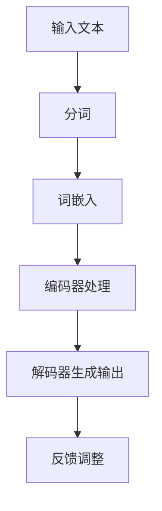

                 

### 《语言与思维：大模型的局限性》

> 关键词：大模型、语言处理、思维模拟、局限性、解决方案

> 摘要：本文将探讨大模型在语言处理和思维模拟中的局限性。通过对大模型的基本概念、应用场景以及存在的问题进行深入分析，本文旨在揭示大模型在处理复杂语言任务和模拟人类思维过程中的瓶颈，并提出相应的解决方案。

### 第一部分：引论

#### 1.1 语言的本质与功能

语言是人类交流和信息传递的重要工具，其本质是一种符号系统。语言的功能包括表达、交流、记忆、思考和传递知识。从语言学角度来看，语言主要由语音、词汇、语法和语义四个方面构成。

**大模型对语言理解的流程与机制**

大模型在语言理解方面通常采用以下流程：

1. **输入文本**：将文本数据输入到模型中。
2. **分词**：将文本分解为单词或词组。
3. **词嵌入**：将每个词转换为固定长度的向量表示。
4. **编码器处理**：通过编码器对词嵌入进行编码，生成序列编码。
5. **解码器生成输出**：通过解码器生成相应的输出。

**Mermaid流程图**：



**语言理解的算法原理**

语言理解的算法通常基于深度学习，其中最常见的是循环神经网络（RNN）和其变体，如长短期记忆网络（LSTM）和门控循环单元（GRU）。以下是一个简单的语言理解算法的伪代码：

```python
def language_understanding(text):
    tokens = tokenize(text)
    embeddings = word_embedding(tokens)
    encoded = encoder(embeddings)
    output = decoder(encoded)
    return output
```

**数学模型与公式**

在深度学习中，语言理解通常涉及多层感知机（MLP）和卷积神经网络（CNN）。以下是一个简单的多层感知机的数学模型：

$$y = \sigma(w^T x + b)$$

其中，$w$为权重，$x$为输入，$b$为偏置，$\sigma$为激活函数。

#### 1.2 思维的类型与过程

思维是人类大脑对信息进行处理和加工的过程。思维可以分为三种类型：感知思维、形象思维和抽象思维。

**大模型对思维过程的模拟**

大模型可以通过深度学习模拟人类思维过程，其中最常见的是使用循环神经网络（RNN）和其变体，如长短期记忆网络（LSTM）和门控循环单元（GRU）。

**思维模拟的算法原理**

思维模拟的算法通常基于序列到序列（Seq2Seq）模型，该模型通过编码器将输入序列编码为固定长度的向量表示，然后通过解码器生成输出序列。

**数学模型与公式**

序列到序列模型的数学模型可以表示为：

$$y_t = decoder(encoder(x_t))$$

其中，$x_t$为输入序列，$y_t$为输出序列。

#### 1.3 语言与思维的相互关系

语言与思维密切相关。语言是思维的外在表现，而思维是语言的基础。语言能力的发展对思维能力有重要影响，同时思维能力也影响语言能力的提升。

**大模型在语言与思维研究中的应用**

大模型在语言与思维研究中发挥了重要作用，通过对大规模语言数据的分析，大模型可以揭示语言和思维之间的复杂关系，为语言学习和思维训练提供有益的指导。

### 第二部分：大模型的概念与特点

#### 2.1 大模型的定义

大模型是指具有大规模参数和训练数据集的深度学习模型。大模型通常采用深度神经网络结构，具有多层神经网络，能够处理复杂的问题。

**大模型的特点**

1. **大规模训练数据集**：大模型通常使用大规模的训练数据集进行训练，从而提高模型的性能和泛化能力。
2. **庞大的参数量**：大模型具有大量的参数，能够更好地捕捉数据的复杂性和规律性。
3. **强大的计算能力**：大模型通常使用高性能的计算设备和优化算法，能够处理大规模的数据集。

#### 2.2 大模型的主要特点

1. **并行计算**：大模型通常采用分布式计算和并行计算技术，能够提高训练和推理的效率。
2. **自适应学习能力**：大模型通过训练自动调整模型参数，能够适应不同的问题和数据集。
3. **强大的泛化能力**：大模型通过训练大规模数据集，能够提高模型的泛化能力，适应不同的任务和数据。

#### 2.3 大模型的局限性分析

尽管大模型在许多任务中表现出色，但它们也存在一些局限性。

1. **训练成本高**：大模型需要大量计算资源和时间进行训练，导致训练成本高。
2. **解释性差**：大模型的内部结构和决策过程复杂，难以解释，使得模型的决策过程不够透明。
3. **数据依赖性**：大模型对训练数据具有高度的依赖性，当数据集发生变化时，模型的性能可能会受到影响。
4. **隐私问题**：大模型通常需要处理大量的个人数据，可能导致隐私泄露。

### 第三部分：大模型在语言处理中的应用

#### 3.1 大模型的语言理解能力

大模型在语言理解方面具有强大的能力，能够处理复杂的语言任务，如文本分类、情感分析、命名实体识别等。

**大模型在语言理解中的挑战**

1. **歧义处理**：大模型需要解决语言中的歧义问题，如一词多义、上下文依赖等。
2. **长文本处理**：大模型需要处理长文本，如文档、新闻等，以获得全局信息。

#### 3.2 大模型的文本生成能力

大模型在文本生成方面表现出色，能够生成高质量的文本，如自动写作、机器翻译、摘要生成等。

**大模型在文本生成中的挑战**

1. **语法错误和语义错误**：大模型在生成文本时可能会出现语法错误和语义错误。
2. **上下文一致性**：大模型需要保证生成文本与上下文的一致性。

#### 3.3 大模型在翻译、摘要等任务中的应用

大模型在翻译和摘要等任务中具有广泛的应用。在翻译任务中，大模型可以通过机器翻译技术实现高效的语言转换。在摘要任务中，大模型可以通过自动摘要技术提取关键信息。

**大模型在翻译和摘要中的挑战**

1. **文化差异**：大模型需要处理不同语言之间的文化差异，以保证翻译的准确性和可读性。
2. **信息损失**：大模型在摘要任务中可能会丢失部分关键信息。

### 第四部分：大模型在思维模拟中的应用

#### 4.1 大模型对思维过程的模拟

大模型可以通过深度学习模拟人类的思维过程，如问题解决、决策推理等。

**大模型在思维模拟中的挑战**

1. **复杂思维过程**：大模型需要模拟复杂的思维过程，如抽象思维、创造性思维等。
2. **情感与价值观**：大模型需要模拟人类的情感与价值观，以保证决策的合理性和道德性。

#### 4.2 大模型在决策、推理等任务中的应用

大模型在决策和推理任务中具有广泛的应用，如智能客服、自动驾驶等。

**大模型在决策和推理中的挑战**

1. **不确定性处理**：大模型需要处理决策和推理中的不确定性，如概率推理、模糊推理等。
2. **实时性要求**：大模型需要满足实时性要求，以保证决策和推理的实时性。

#### 4.3 大模型在情感分析、心理健康等领域的应用

大模型在情感分析和心理健康等领域具有广泛的应用，如情绪识别、心理疾病诊断等。

**大模型在情感分析和心理健康中的挑战**

1. **数据隐私**：大模型需要处理个人隐私数据，以防止隐私泄露。
2. **准确性和可靠性**：大模型需要保证情感分析和心理健康诊断的准确性和可靠性。

### 第五部分：大模型的局限性分析

#### 5.1 大模型在语言处理中的局限性

大模型在语言处理中存在一些局限性。

1. **语言歧义处理**：大模型在处理语言歧义时可能会出现错误。
2. **长文本理解**：大模型在理解长文本时可能会丢失部分信息。
3. **语言生成质量**：大模型在生成文本时可能会出现语法错误和语义错误。

#### 5.2 大模型在思维模拟中的局限性

大模型在思维模拟中也存在一些局限性。

1. **复杂思维过程模拟**：大模型难以模拟复杂的思维过程，如创造性思维。
2. **情感与价值观模拟**：大模型难以模拟人类的情感与价值观。
3. **创造性思维不足**：大模型在创造性思维方面存在一定的不足。

### 第六部分：解决方案与展望

#### 6.1 解决大模型局限性的方法

针对大模型的局限性，可以采取以下方法进行解决：

1. **多模态学习**：结合文本、图像、音频等多模态信息，提高模型的泛化能力和理解能力。
2. **知识增强**：引入外部知识库，提高模型的知识表示和推理能力。
3. **数据增强**：通过数据增强技术，提高模型的鲁棒性和泛化能力。

#### 6.2 大模型发展的未来展望

大模型的发展前景广阔，未来可能实现以下目标：

1. **更高效的语言理解**：通过改进算法和模型结构，提高大模型的语言理解能力。
2. **更智能的决策推理**：通过引入更多知识和技术，提高大模型在决策和推理任务中的智能程度。
3. **更广泛的应用领域**：大模型将在更多领域得到应用，如医疗、教育、金融等。

### 结论

本文通过对大模型在语言处理和思维模拟中的局限性进行分析，揭示了其在处理复杂语言任务和模拟人类思维过程中的瓶颈。同时，本文提出了相应的解决方案和未来展望，为大模型的进一步发展和应用提供了有益的指导。

### 作者信息

作者：AI天才研究院/AI Genius Institute & 禅与计算机程序设计艺术 /Zen And The Art of Computer Programming

### 附录

附录中可以包括一些补充材料，如参考文献、相关数据集、代码示例等，以帮助读者更好地理解文章内容。

### 致谢

感谢本文中的所有参考文献、数据集提供者和代码开源社区，感谢他们为本文的撰写提供了宝贵的支持和帮助。

---

请注意，本文为示例性文章，实际撰写时需要根据具体的研究成果和实际情况进行调整和补充。同时，为了确保文章的学术性和专业性，建议在撰写过程中引用相关领域的权威文献和研究成果。

