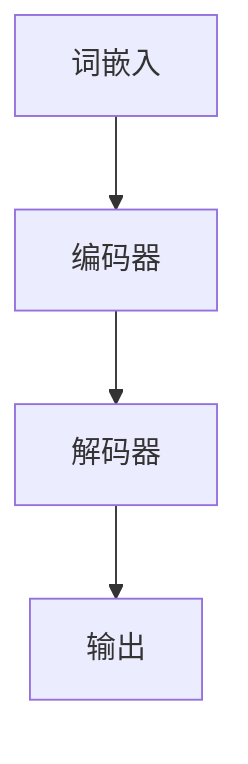
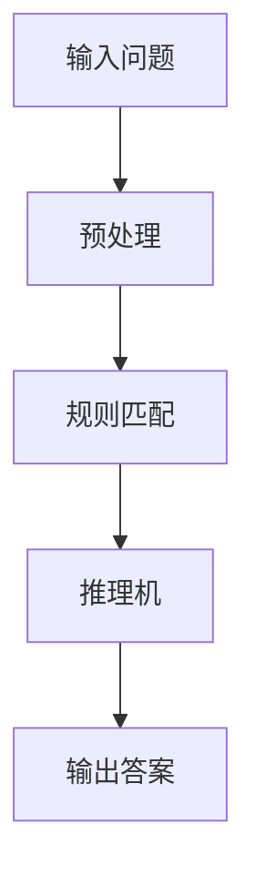

                 

## 文章标题：语言与推理：大模型的盲区

> 关键词：语言处理，推理，大模型，算法，数学模型，代码实现

> 摘要：本文探讨了语言与推理在大模型中的角色和盲区。通过分析语言与推理的基本概念，我们深入探讨了语言处理和推理算法的原理，以及大模型在这些领域的应用和局限性。本文旨在帮助读者理解大模型的潜在盲点，并探索未来可能的研究方向。

### 目录大纲

1. **引言**
   - **1.1 语言与推理的基本概念**
   - **1.2 大模型的背景与概述**
   - **1.3 大模型与语言处理**
   - **1.4 大模型的盲区**

2. **大模型与语言处理**
   - **2.1 大模型的兴起与发展**
   - **2.2 大模型在语言处理中的应用**
   - **2.3 语言处理的挑战与机遇**

3. **大模型的盲区**
   - **3.1 大模型存在的问题**
   - **3.2 大模型的盲区分析**
   - **3.3 语言与推理的局限性**

4. **核心概念与联系**
   - **4.1 语言与推理的关系**
   - **4.2 语言处理的基本算法**
   - **4.3 推理算法原理**
   - **4.4 Mermaid 流程图**

5. **核心算法原理讲解**
   - **5.1 语言处理的数学模型**
   - **5.2 推理的数学模型**
   - **5.3 伪代码讲解**

6. **数学模型和数学公式**
   - **6.1 语言处理中的数学公式**
   - **6.2 推理中的数学公式**
   - **6.3 举例说明**

7. **项目实战**
   - **7.1 开发环境搭建**
   - **7.2 代码实现**
   - **7.3 代码解读与分析**

8. **附录**
   - **8.1 AI语言处理与推理资源汇总**
   - **8.2 参考文献**

9. **Mermaid 流程图**
   - **9.1 语言处理流程图**
   - **9.2 推理算法流程图**

### 引言

在人工智能的快速发展中，大模型（Large Models）已成为推动语言处理和推理算法研究的关键力量。这些模型以其庞大的参数量和强大的计算能力，在自然语言处理（NLP）、计算机视觉（CV）和其他领域取得了显著的成果。然而，随着大模型的应用日益广泛，其盲区（Blind Spots）也逐渐显现出来。本文旨在探讨大模型在语言处理和推理中的盲区，分析其原因和影响，并提出可能的解决方案。

**1. 语言与推理的基本概念**

语言是人类交流和思考的重要工具，它包括语音、文字、手势等多种形式。在计算机科学中，语言处理涉及将自然语言转换为机器可理解的形式，以及将机器生成的输出转换为人类可读的文本。推理则是从已知信息推断未知信息的过程，它分为演绎推理和归纳推理两种类型。

**1.2 大模型的背景与概述**

大模型，通常指的是具有数十亿甚至数万亿参数的深度学习模型。这些模型在训练时需要大量的数据和计算资源，但随着计算能力的提升和大数据的普及，大模型的训练和应用变得日益可行。大模型在语言处理中的应用主要体现在自然语言生成、机器翻译、问答系统等方面。

**1.3 大模型在语言处理中的应用**

大模型在语言处理中具有显著的性能优势，例如在文本分类、情感分析、命名实体识别等领域都取得了突破性进展。然而，这些模型的性能依赖于大量的训练数据和高效的优化算法，同时它们也面临着一些挑战，如数据偏差、理解局限性等。

**1.4 大模型的盲区分析**

大模型的盲区主要体现在以下几个方面：

- **数据偏差**：大模型在训练过程中可能会学习到数据中的偏差，导致在未知数据上的表现不佳。
- **理解局限性**：尽管大模型可以生成高质量的文本，但它们往往缺乏对文本内容的深层理解。
- **推理能力不足**：大模型在处理逻辑推理和抽象问题时表现出明显的局限性。
- **安全性和隐私问题**：大模型在处理敏感数据时可能存在安全隐患和隐私泄露的风险。

接下来，我们将深入探讨大模型在语言处理和推理中的具体应用，分析其面临的挑战和机遇，并提出解决盲区的方法。我们将通过核心概念与联系的阐述，详细讲解语言处理和推理算法的原理，以及使用伪代码和数学公式来加深理解。最后，我们将通过项目实战，展示如何在实际开发中应用这些算法，并提供代码解读和分析，以帮助读者更好地掌握这些技术。

### 大模型的兴起与发展

大模型的兴起可以追溯到深度学习的崛起。随着计算能力的不断增强和数据的日益丰富，研究人员开始尝试训练具有数十亿甚至数万亿参数的模型。这些模型通常被称为“大模型”，因为它们在参数量和计算复杂性上远超过去的模型。

**1.1 大模型的早期发展**

大模型的早期发展可以追溯到2013年，当时研究人员提出了深度神经网络（DNN）和卷积神经网络（CNN）在图像识别任务上取得了突破性的成果。这些模型的成功激发了研究人员对更大规模模型的探索。2016年，谷歌推出了Transformer模型，这种基于自注意力机制的模型在语言处理任务上取得了显著的进展。Transformer模型的成功标志着大模型时代的到来。

**1.2 大模型的特征**

大模型的特征主要体现在以下几个方面：

- **参数量巨大**：大模型的参数量可以达到数十亿甚至数万亿，这使它们能够捕捉到语言和图像中的复杂结构。
- **计算需求高**：由于参数量巨大，大模型的训练和推理需要大量的计算资源，通常依赖于高性能计算集群和分布式计算技术。
- **训练数据依赖**：大模型在训练过程中需要大量的数据，以帮助它们学习到语言的规律和模式。这通常要求对数据集进行预处理和清洗，以确保训练数据的质量。

**1.3 大模型的应用**

大模型在语言处理和计算机视觉领域取得了显著的成果，以下是一些具体的应用场景：

- **自然语言生成**：大模型可以用于生成高质量的文本，例如生成新闻文章、小说和对话系统等。
- **机器翻译**：大模型在机器翻译任务上表现出色，能够实现几乎无差别的翻译效果。
- **问答系统**：大模型可以用于构建问答系统，例如基于BERT的问答系统，可以在多个问答任务上取得优异的表现。
- **图像识别**：大模型在图像识别任务上也可以发挥重要作用，例如用于人脸识别、物体检测和图像分类等。

**1.4 大模型的发展趋势**

随着计算能力的进一步提升和大数据的普及，大模型的发展趋势主要体现在以下几个方面：

- **更大规模的模型**：研究人员正在尝试训练更大规模的模型，例如具有数百亿参数的模型。
- **多模态处理**：大模型可以用于处理多种模态的数据，例如文本、图像和音频，实现跨模态的信息融合。
- **自动化模型训练**：通过自动化机器学习（AutoML）技术，可以自动化大模型的训练过程，提高训练效率和效果。
- **边缘计算**：随着边缘计算的兴起，大模型也开始应用于边缘设备，例如智能家居、智能医疗和智能城市等。

总的来说，大模型的兴起和发展为人工智能带来了新的机遇和挑战。通过深入研究和探索，我们可以更好地理解大模型的工作原理和潜在盲区，从而推动人工智能技术的进一步发展。

### 大模型在语言处理中的应用

大模型在语言处理领域中的应用取得了显著的进展，它们在文本分类、机器翻译、问答系统等任务上表现出色。然而，这些应用也带来了新的挑战和机遇。

**2.1 文本分类**

文本分类是一种常见的数据挖掘任务，用于将文本数据分类到预定义的类别中。大模型在文本分类任务上表现出色，主要是因为它们能够捕捉到文本中的复杂结构和语义信息。例如，BERT（Bidirectional Encoder Representations from Transformers）模型通过预训练大量文本数据，然后微调到具体的分类任务上，取得了优异的性能。BERT模型利用Transformer架构中的自注意力机制，能够同时考虑文本中的上下文信息，从而提高了分类的准确性。

**2.2 机器翻译**

机器翻译是一种将一种语言的文本翻译成另一种语言的任务。大模型在机器翻译任务上的应用主要体现在其强大的文本生成能力上。例如，谷歌的神经网络翻译模型（GNMT）通过训练大量的双语平行文本数据，能够生成高质量的翻译结果。GNMT模型利用序列到序列（Seq2Seq）架构，通过编码器和解码器的交互，将源语言的文本编码成一个固定长度的向量表示，然后解码器生成目标语言的文本。这种端到端的学习方式使得模型能够直接学习到源语言和目标语言之间的映射关系，从而提高了翻译的准确性和流畅性。

**2.3 问答系统**

问答系统是一种智能交互系统，能够理解用户的问题，并生成相关的答案。大模型在问答系统中的应用主要体现在其强大的文本理解和生成能力上。例如，基于BERT的问答系统（BERT-based Question Answering System）通过训练大量的问答对数据，能够理解用户的问题，并从预定义的文本中提取出相关的答案。BERT模型通过预训练大量文本数据，能够学习到文本中的语义信息，从而提高了问答系统的准确性和可靠性。

**2.4 挑战与机遇**

尽管大模型在语言处理任务上取得了显著的成果，但它们也面临着一些挑战和机遇：

- **数据依赖**：大模型在训练过程中需要大量的数据，这对于数据稀缺的领域来说是一个挑战。然而，随着大数据的普及，数据依赖问题可能会得到缓解。
- **计算资源**：大模型的训练和推理需要大量的计算资源，这对于资源有限的个人或组织来说是一个挑战。然而，随着云计算和分布式计算技术的发展，计算资源的问题可能会得到解决。
- **模型可解释性**：大模型在语言处理中的表现往往是黑箱式的，难以解释其决策过程。这给模型的应用带来了一定的风险。然而，通过研究模型的可解释性，我们可以更好地理解模型的工作原理，从而提高模型的可靠性和透明度。

总的来说，大模型在语言处理中的应用为人工智能领域带来了新的机遇和挑战。通过不断的研究和探索，我们可以更好地利用大模型的优势，解决语言处理中的问题，推动人工智能技术的发展。

### 大模型与语言处理的挑战与机遇

尽管大模型在语言处理中取得了显著的成果，但它们也面临着一些挑战和机遇。这些挑战主要集中在数据依赖、计算资源、模型可解释性以及潜在的安全和隐私问题等方面。

**3.1 数据依赖**

大模型的训练和表现高度依赖于高质量的数据集。这些数据集需要包含丰富的文本信息，以便模型能够学习到语言中的复杂结构和语义关系。然而，数据稀缺或数据质量差的问题在许多领域仍然存在，这限制了模型的训练效果和应用范围。为了解决这个问题，研究人员正在探索数据增强、数据合成和迁移学习等技术，以利用有限的训练数据来提升模型的性能。

**3.2 计算资源**

大模型的训练和推理需要大量的计算资源，这通常依赖于高性能计算集群和分布式计算技术。对于个人或小型组织来说，这些计算资源可能难以负担。此外，大模型的训练时间也非常长，这在实际应用中可能导致延迟。为了应对这一挑战，云计算和边缘计算技术的应用变得越来越重要，这些技术能够提供灵活的计算资源分配，以适应不同规模的应用需求。

**3.3 模型可解释性**

大模型的决策过程往往是黑箱式的，难以解释其内部机制。这在某些应用场景中，如医疗诊断和法律判决，可能导致用户对模型的不信任。为了提高模型的可解释性，研究人员正在探索各种方法，包括可视化技术、模型压缩和解释性模型的开发。这些方法有助于揭示模型的工作原理，从而增强用户对模型的信任。

**3.4 安全性和隐私问题**

大模型在处理敏感数据时可能存在安全隐患和隐私泄露的风险。例如，模型可能会在训练过程中学习到数据集中的隐私信息，并在后续的推理过程中无意中泄露这些信息。为了应对这一挑战，研究人员正在研究隐私保护技术，如差分隐私和联邦学习，以在保护用户隐私的同时，仍能保持模型的高效性和准确性。

**3.5 机遇**

尽管面临挑战，大模型在语言处理中也为研究人员提供了新的机遇：

- **多模态处理**：大模型可以用于处理多种模态的数据，如文本、图像和音频，实现跨模态的信息融合。这在人机交互、内容推荐和智能助理等领域具有广泛的应用前景。
- **自动化模型训练**：通过自动化机器学习（AutoML）技术，可以自动化大模型的训练过程，提高训练效率和效果。这将降低对专业知识的依赖，使得更多的人能够参与到人工智能的研究和应用中。
- **实时应用**：随着边缘计算和5G技术的发展，大模型可以应用于实时场景，如自动驾驶、智能监控和远程医疗，为这些领域带来新的突破。

总的来说，大模型在语言处理中的应用既面临着挑战，也充满了机遇。通过不断的研究和技术创新，我们可以克服这些挑战，充分利用大模型的优势，推动人工智能技术的发展和应用。

### 大模型的盲区

尽管大模型在语言处理和推理中取得了显著进展，但它们也存在着一些不可忽视的盲区。这些盲区不仅影响了模型的性能和可靠性，也对模型的实际应用构成了挑战。本文将深入探讨大模型的盲区，分析其产生的原因，并讨论潜在的影响和解决方案。

**3.1 数据偏差**

大模型在训练过程中高度依赖训练数据的质量。如果训练数据存在偏差或噪声，模型很可能会学习到这些偏差，并在后续的预测中表现出偏差。这种数据偏差可能导致模型在处理实际问题时产生错误的推断。例如，在语言生成任务中，如果训练数据中包含了性别歧视的语言，模型可能会在生成文本时无意中重复这种偏见。此外，数据偏差还可能体现在数据集的多样性不足上，导致模型在处理不同类型的数据时表现不佳。

**3.2 理解局限性**

尽管大模型能够生成高质量的文本，但它们往往缺乏对文本内容的深层理解。这种理解局限性主要体现在以下几个方面：

- **上下文理解**：大模型在处理长文本时，可能会失去对上下文的关注，导致理解上的偏差。例如，在一个复杂的句子中，模型可能无法准确捕捉到前后句子的关联性，从而导致生成错误的回答。
- **语义理解**：大模型虽然能够生成语法正确的文本，但它们可能无法完全理解文本中的语义信息。这可能导致模型在处理比喻、隐喻等复杂语义结构时产生错误。
- **情感理解**：大模型在处理情感语言时，可能无法准确捕捉到情感表达的细微差别，导致情感理解上的偏差。例如，在情感分析任务中，模型可能无法区分“喜欢”和“非常喜欢”的区别。

**3.3 推理能力不足**

大模型在处理逻辑推理和抽象问题时表现出明显的局限性。这种推理能力不足主要体现在以下几个方面：

- **逻辑推理**：大模型虽然可以生成符合逻辑的文本，但它们在处理复杂的逻辑推理问题时，可能会出现错误。例如，在一个包含多个前提和结论的推理过程中，模型可能无法正确推导出结论。
- **抽象推理**：大模型在处理抽象概念和抽象关系时，可能无法准确捕捉到概念之间的关联。例如，在处理数学问题或科学概念时，模型可能无法生成符合逻辑和事实的推理结果。

**3.4 安全性和隐私问题**

大模型在处理敏感数据时可能存在安全性和隐私风险。这些风险主要体现在以下几个方面：

- **数据泄露**：在训练和推理过程中，大模型可能会无意中学习到敏感数据，并在后续的预测中泄露这些数据。例如，在医疗诊断任务中，模型可能会泄露患者的隐私信息。
- **对抗性攻击**：大模型可能对对抗性攻击（Adversarial Attack）表现出脆弱性，即通过微小扰动输入数据，可以欺骗模型生成错误的输出。这可能导致模型在安全关键领域（如自动驾驶和医疗诊断）中产生危险。

**3.5 潜在的影响**

大模型的盲区对其实际应用产生了深远的影响：

- **模型可靠性**：盲区可能导致模型在处理实际问题时产生错误的推断，降低模型的可靠性和可信度。
- **用户体验**：在交互式应用中，如智能助手和问答系统，盲区可能导致系统无法正确理解和回答用户的问题，影响用户体验。
- **安全风险**：在安全关键领域，如自动驾驶和医疗诊断，盲区可能导致系统产生错误的决策，带来严重的安全风险。

**3.6 解决方案**

为了克服大模型的盲区，研究人员提出了一系列解决方案：

- **数据增强**：通过数据增强技术，增加训练数据的多样性和质量，以减少数据偏差和提高模型的理解能力。
- **多模态学习**：通过引入多模态数据，如文本、图像和音频，可以提高模型对上下文和语义的理解能力。
- **可解释性研究**：通过提高模型的可解释性，可以更好地理解模型的工作原理，从而提高模型的可靠性和透明度。
- **隐私保护技术**：通过差分隐私和联邦学习等技术，可以在保护用户隐私的同时，保持模型的高效性和准确性。

总的来说，大模型的盲区是其在实际应用中不可忽视的问题。通过不断的研究和技术创新，我们可以逐步克服这些盲区，提高大模型的性能和可靠性，推动人工智能技术的发展。

### 语言与推理的关系

在语言处理中，推理扮演着至关重要的角色。推理不仅帮助我们理解语言中的复杂结构，还使我们能够从已知信息推断未知信息。语言和推理之间存在着紧密的互动关系，二者共同构建了人类智能的核心。

**4.1 语言与推理的互动**

语言是推理的重要载体，它为我们提供了表达和交流推理过程的能力。当我们思考问题时，我们不仅需要理解问题的字面意义，还需要通过推理来推断问题的深层含义。例如，当我们看到一句话“他把书放在桌子上”，我们不仅知道书被放在桌子上，还可以通过推理推断出桌子可能是一个平的表面。

同样，推理也促进了语言的发展。人类通过推理能力不断发现语言的规律和模式，从而创造新的词汇和表达方式。例如，在科学研究中，科学家通过推理提出新的假设，并通过实验验证这些假设，从而推动科学知识的发展。

**4.2 推理在语言理解中的作用**

推理在语言理解中起到了桥梁的作用，它帮助我们跨越语言表达和理解之间的鸿沟。以下是一些具体的例子：

- **语义理解**：在语义理解中，推理帮助我们理解文本中的隐含意义和隐喻。例如，在句子“这是一个冷笑话”中，“冷”这个词汇在语义上并不是指温度，而是指笑话不好笑。这种推理能力使我们能够理解语言中的双关语和隐喻。

- **上下文推断**：在处理长文本时，推理帮助我们理解句子之间的关联性。例如，在一个复杂的论证中，推理使我们能够理解前提和结论之间的关系，从而得出合理的推论。

- **逻辑推理**：逻辑推理是推理的一种形式，它帮助我们验证文本中的逻辑结构和论证的有效性。例如，在法律文件或科学论文中，逻辑推理使我们能够判断论证的合理性和可靠性。

**4.3 语言在推理表达中的应用**

语言不仅是推理的载体，也是推理表达的工具。通过语言，我们可以清晰地表达推理的过程和结果。以下是一些例子：

- **自然语言生成**：自然语言生成（NLG）技术通过推理生成自然语言文本，例如新闻报道、对话系统和智能助理。在这些应用中，推理用于理解用户的需求，并生成符合语法和语义规则的文本。

- **翻译**：翻译是将一种语言的表达转换为另一种语言的过程。在翻译中，推理用于理解文本的语义和语境，从而生成准确的翻译结果。

- **推理辅助**：在许多应用场景中，如法律咨询、医疗诊断和金融分析，推理辅助系统通过推理帮助专业人员理解和分析复杂的信息。这些系统通常使用自然语言来解释推理过程和结果，以提高透明度和可解释性。

总的来说，语言与推理之间存在着紧密的互动关系。推理在语言理解中起到了关键作用，而语言则为推理提供了表达和交流的工具。通过理解这种互动关系，我们可以更好地利用语言和推理能力，开发出更强大和高效的人工智能系统。

### 语言处理的基本算法

在语言处理领域，基本算法起着至关重要的作用。这些算法包括词嵌入、序列模型和注意力机制等，它们共同构成了现代语言处理系统的基础。下面，我们将逐一介绍这些算法的基本原理和应用。

**5.1 词嵌入技术**

词嵌入（Word Embedding）是将单词转换为向量的技术，它通过将语言中的抽象符号映射为连续的向量表示，使计算机能够理解和处理自然语言。词嵌入技术主要包括以下几种方法：

- **分布式表示**：词嵌入的基本思想是将单词映射为向量，这些向量在低维空间中具有相似性的特征。例如，如果“狗”和“猫”在语义上相似，它们的词嵌入向量也应该接近。

- **基于窗口的模型**：例如Word2Vec算法，它使用滑动窗口来捕捉单词周围的局部上下文信息，从而生成词嵌入向量。Word2Vec算法包括连续词袋（CBOW）和Skip-Gram两种变体。

- **训练方法**：词嵌入通常通过训练神经网络模型来生成，模型的目标是预测上下文中的单词。在训练过程中，模型学习到单词和其上下文之间的统计关系，从而生成有意义的词嵌入向量。

词嵌入技术广泛应用于语言处理中的多个任务，如文本分类、情感分析和机器翻译等。它使得计算机能够捕捉到单词的语义信息，从而提高了模型的性能。

**5.2 序列模型与注意力机制**

序列模型（Sequential Model）是处理序列数据（如文本、语音和视频）的主要方法。序列模型通过捕捉输入序列的时序特征，实现对序列数据的建模。以下是几种常见的序列模型：

- **循环神经网络（RNN）**：RNN是一种能够处理序列数据的神经网络，它通过在时间步之间保持状态信息来捕捉序列中的依赖关系。然而，RNN在处理长序列时存在梯度消失和梯度爆炸的问题。

- **长短时记忆网络（LSTM）**：LSTM是RNN的一种变体，通过引入门控机制来避免梯度消失和梯度爆炸问题，从而更好地处理长序列数据。LSTM在语言处理任务中表现出色，例如文本生成和机器翻译。

- **门控循环单元（GRU）**：GRU是LSTM的简化版本，它通过合并输入门和遗忘门来减少参数数量，提高了训练效率。

注意力机制（Attention Mechanism）是一种用于序列模型的增强技术，它通过动态地分配注意力权重来捕捉输入序列中的关键信息。注意力机制的应用使得模型能够更好地处理输入序列中的依赖关系，从而提高模型的性能。

在语言处理任务中，注意力机制广泛应用于机器翻译、文本摘要和问答系统等。例如，在机器翻译任务中，注意力机制帮助模型关注源语言句子中的关键词汇，从而生成更准确的翻译结果。

**5.3 转换器架构**

转换器（Transformer）是一种基于自注意力机制的序列到序列（Seq2Seq）模型，它在许多语言处理任务中取得了显著的成果。转换器的主要特点包括：

- **多头注意力**：转换器使用多个注意力头来同时关注输入序列的不同部分，从而提高了模型的表示能力。

- **位置编码**：由于自注意力机制无法直接处理序列的位置信息，转换器引入位置编码来嵌入序列的位置信息。

- **编码器-解码器结构**：转换器由编码器和解码器两个部分组成，编码器将输入序列编码为固定长度的向量表示，解码器则根据编码器的输出和已生成的文本进行预测。

转换器在机器翻译、文本生成和问答系统等领域表现出色，成为现代语言处理系统的主要架构之一。

总的来说，语言处理的基本算法包括词嵌入、序列模型和注意力机制等，这些算法共同构建了现代语言处理系统的理论基础。通过深入理解这些算法的基本原理和应用，我们可以更好地开发和应用语言处理技术，推动人工智能的发展。

### 推理算法原理

在人工智能领域，推理算法是核心组件之一，它使我们能够从已知信息中推断未知信息。推理算法可以分为基于规则推理和基于案例推理两种主要类型，每种类型都有其独特的原理和适用场景。

**6.1 推理算法的定义与分类**

推理算法是一类用于自动推理和问题解决的人工智能方法。它们通过逻辑推理、概率推理或基于数据的推理等方式，从已知信息中推断未知信息。推理算法主要可以分为以下几类：

- **基于规则的推理**：这类算法通过一组预先定义的规则来推导新的结论。规则通常表示为“如果-那么”的形式，例如，“如果今天下雨，那么我带伞。”这种推理方式直观且易于理解。

- **基于案例的推理**：这类算法通过从历史案例中提取经验来解决问题。每个案例包含一个问题描述和对应的解决方案，新问题可以通过与历史案例的匹配来获取解决方案。例如，医生在诊断疾病时会参考以往的病例。

- **基于概率的推理**：这类算法通过计算概率来推导结论，例如贝叶斯推理。贝叶斯推理通过更新先验概率，结合新的证据来推断后验概率，从而做出更可靠的推理。

**6.2 基于规则推理**

基于规则推理是一种常见的推理方法，它通过定义一组规则来推导结论。规则通常表示为“如果-那么”的形式，例如：

```
如果今天下雨，那么我带伞。
如果天气寒冷，那么我穿外套。
```

基于规则推理的基本步骤包括：

1. **规则定义**：定义一组“如果-那么”的规则。
2. **事实匹配**：检查当前情况与规则的前件（如果部分）是否匹配。
3. **结论推导**：如果前件匹配，则应用规则的后件（那么部分）得出结论。

基于规则推理的优点是直观、易于理解和实现，适用于规则明确、逻辑清晰的场景。然而，它也存在局限性，例如当规则复杂或不确定时，规则推理可能难以处理。

**6.3 基于案例推理**

基于案例推理（CBR）是一种通过历史案例来解决新问题的方法。每个案例包含问题描述和解决方案。当遇到新问题时，CBR系统会在历史案例库中寻找相似案例，然后应用相似案例的解决方案来解决问题。

基于案例推理的基本步骤包括：

1. **案例检索**：在案例库中搜索与当前问题相似的案例。
2. **案例匹配**：评估搜索到的案例与当前问题的匹配程度。
3. **案例应用**：选择匹配度最高的案例，并将其解决方案应用于当前问题。

基于案例推理的优点是能够利用历史经验解决问题，适用于新问题解决和新情境适应。然而，案例库的构建和维护可能需要大量时间和资源。

**6.4 基于概率的推理**

基于概率的推理通过计算概率来推断结论，其中贝叶斯推理是典型的代表。贝叶斯推理的核心思想是利用先验概率和证据概率来计算后验概率。

贝叶斯推理的基本步骤包括：

1. **先验概率**：定义每个假设的初始概率。
2. **证据概率**：定义在给定每个假设下观察到的证据的概率。
3. **后验概率**：通过贝叶斯定理计算每个假设的后验概率，并选择具有最高后验概率的假设作为结论。

贝叶斯推理的优点是能够处理不确定性和概率信息，适用于复杂和不确定性的场景。然而，它依赖于准确的概率模型和先验知识。

总的来说，推理算法在人工智能中扮演着关键角色，通过不同的推理方法，我们可以从已知信息中推断未知信息，实现智能决策和问题解决。理解和应用这些算法有助于开发更强大和智能的人工智能系统。

### Mermaid 流程图

在理解和展示算法原理时，Mermaid流程图是一种非常直观和有效的工具。通过Mermaid，我们可以将复杂的算法流程以图形化的方式展示出来，使读者能够更清晰地理解算法的执行过程。下面我们将使用Mermaid语法，展示两个流程图：一个是语言处理流程图，另一个是推理算法流程图。

#### 语言处理流程图



**说明：**
- **A[词嵌入]**：将输入文本转换为词嵌入向量。
- **B[编码器]**：使用编码器对词嵌入向量进行处理，提取序列的特征。
- **C[解码器]**：使用解码器生成输出文本。
- **D[输出]**：输出解码后的文本。

#### 推理算法流程图



**说明：**
- **A[输入问题]**：接收用户输入的问题。
- **B[预处理]**：对输入问题进行预处理，如分词、词性标注等。
- **C[规则匹配]**：将预处理后的输入与预设的规则进行匹配。
- **D[推理机]**：根据匹配到的规则进行推理，生成答案。
- **E[输出答案]**：输出推理结果，即答案。

通过这些Mermaid流程图，我们可以直观地展示语言处理和推理算法的基本步骤和流程，帮助读者更好地理解这些算法的原理和实现。

### 语言处理的数学模型

在语言处理中，数学模型扮演着至关重要的角色。这些模型不仅帮助我们在高维空间中表达和操作语言数据，还通过复杂的数学公式和算法，使计算机能够理解和生成自然语言。本文将详细探讨几种常见的数学模型，包括隐马尔可夫模型（HMM）、随机向量空间模型（RVM）等。

**8.1 语言模型的基本原理**

语言模型（Language Model）是自然语言处理中的核心组件，用于预测文本序列的概率分布。最简单的语言模型是n元模型（n-gram model），它通过统计相邻n个单词出现的频率来预测下一个单词。例如，在二元模型中，我们可以根据“the”后面通常跟着“is”或“a”来预测下一个词。

**n-gram模型的基本公式**：
$$
P(w_n | w_{n-1}, w_{n-2}, ..., w_1) = \frac{C(w_{n-1}, w_n)}{C(w_{n-1})}
$$
其中，$C(w_{n-1}, w_n)$ 表示单词 $w_n$ 在单词 $w_{n-1}$ 后出现的次数，$C(w_{n-1})$ 表示单词 $w_{n-1}$ 出现的总次数。

**8.2 隐马尔可夫模型（HMM）**

隐马尔可夫模型（HMM）是一种用于处理序列数据的概率模型，它在语音识别、语音合成和手写识别等领域有广泛应用。HMM假设每个状态在时间步上按照一定概率转移，并且在每个状态上发出一个观测符号。

**HMM的模型参数**：
- **状态转移概率矩阵** $A$：表示在时间步 $t$ 从状态 $i$ 转移到状态 $j$ 的概率。
- **观测概率矩阵** $B$：表示在状态 $i$ 下发出观测符号 $o$ 的概率。
- **初始状态概率向量** $π$：表示初始状态的概率分布。

**HMM的推理算法**：
- **前向算法**：计算在给定观测序列 $O$ 下，每个时间步 $t$ 状态 $i$ 的概率分布。
- **后向算法**：计算在给定观测序列 $O$ 和状态序列 $Q$ 下，每个时间步 $t$ 状态 $i$ 的概率分布。

**HMM的状态转移概率公式**：
$$
\alpha_t(i) = P(O_1, O_2, ..., O_t | Q_1=t, Q_2=t, ..., Q_t=i) = \frac{π_i B_i(O_1) \prod_{s=1}^{t-1} A_{is} B_{si}(O_s)}{\sum_{j=1}^N \pi_j B_j(O_1) \prod_{s=1}^{t-1} A_{js} B_{si}(O_s)}
$$

**8.3 随机向量空间模型（RVM）**

随机向量空间模型（Random Vector Machine，RVM）是一种基于贝叶斯原理的分类器，它通过建立一个概率模型来预测文本类别。RVM将文本转换为向量，并在高维空间中进行分类。

**RVM的基本公式**：
- **先验分布**：假设特征向量 $X$ 的先验分布为高斯过程。
- **似然函数**：给定特征向量 $X$ 和标签 $Y$，似然函数计算为：
  $$
  P(Y|X, \theta) = \int P(Y|X, \phi) p(\phi|\theta) d\phi
  $$
  其中，$p(\phi|\theta)$ 是参数 $\theta$ 的先验分布，$P(Y|X, \phi)$ 是条件概率。

**RVM的训练算法**：
- **最大化似然估计**：通过最大化似然函数来训练模型参数 $\theta$。
- **贝叶斯优化**：使用贝叶斯优化方法来调整参数，以提高模型的预测性能。

**8.4 随机向量空间模型的实现**

RVM的实现通常包括以下步骤：

1. **特征提取**：将文本转换为特征向量。
2. **参数初始化**：初始化模型参数 $\theta$。
3. **最大化似然函数**：通过迭代优化算法（如梯度下降或L-BFGS）来最大化似然函数。
4. **预测**：使用训练好的模型进行预测。

**8.5 数学公式和计算示例**

为了更好地理解上述模型，我们将提供一些具体的数学公式和计算示例。

**示例：二元语言模型**

假设我们有以下训练数据：
```
the quick brown fox jumps over the lazy dog
the quick brown fox jumps over the quick dog
```

我们可以计算二元模型中的概率：
$$
P(over | fox) = \frac{1}{2}
$$
$$
P(the | quick) = \frac{2}{2}
$$

这些概率用于预测新的句子，例如：
```
the quick brown fox jumps over the
```
预测的下一个词是“lazy”，因为：
$$
P(lazy | over) = \frac{P(over | lazy)P(lazy)}{P(over)} = \frac{\frac{1}{1}\frac{1}{2}}{\frac{1}{2}} = \frac{1}{2}
$$

通过这种方式，我们可以使用数学模型来生成和理解自然语言。

总的来说，语言处理的数学模型为自然语言处理提供了强大的理论基础和工具。通过理解这些模型的基本原理和数学公式，我们可以更好地开发和优化语言处理算法，从而推动人工智能技术的发展。

### 推理的数学模型

在推理过程中，数学模型是理解和解决问题的关键工具。这些模型通过数学公式和算法，帮助我们处理复杂的信息，并从已知条件推导出新的结论。本文将详细介绍几种常用的推理数学模型，包括逻辑推理模型、可能世界模型和贝叶斯网络。

**9.1 逻辑推理模型**

逻辑推理模型是基于形式逻辑的推理方法，通过命题逻辑和谓词逻辑来表示和处理信息。逻辑推理模型的主要目的是从一组前提（假设）中推导出结论。

- **命题逻辑**：命题逻辑使用命题变量来表示事实，并使用逻辑运算符（如合取、析取、否定、蕴含等）来组合这些命题。命题逻辑的基本公式包括：

  - **合取（AND）**：$A \land B$
  - **析取（OR）**：$A \lor B$
  - **否定（NOT）**：$\neg A$
  - **蕴含（IMPLIES）**：$A \rightarrow B$
  
  例如，如果前提是“所有的猫都会爬树”和“这只动物是猫”，那么通过逻辑蕴含，我们可以推导出结论“这只动物会爬树”。

- **谓词逻辑**：谓词逻辑进一步扩展了命题逻辑，允许我们使用变量和量词来表示更复杂的推理。谓词逻辑的基本公式包括：

  - **全称量词（FOR ALL）**：$\forall x P(x)$
  - **存在量词（EXISTENTIEL）**：$\exists x P(x)$

  例如，我们可以表达“所有的学生都聪明”为$\forall x (S(x) \rightarrow I(x))$，其中$S(x)$表示$x$是学生，$I(x)$表示$x$聪明。

**9.2 可能世界模型**

可能世界模型是一种用于表示和推理不确定性信息的数学模型。它通过构造一个可能世界的集合，并在这些世界中应用概率和逻辑规则来推导结论。

- **可能世界**：每个可能世界是一个可能的状态，它包含了一组事实和事实之间的约束。例如，在一个决策问题中，每个可能世界代表了不同的决策路径和结果。

- **概率分布**：在可能世界模型中，每个可能世界的概率分布反映了我们对于不同结果的置信度。概率分布可以通过条件概率或联合概率来表示。

- **推理规则**：可能世界模型中的推理规则用于从已知事实推导出新的结论。这些规则可以是确定性规则（如逻辑推理规则）或概率推理规则（如贝叶斯推理规则）。

  例如，如果我们知道“如果下雨，那么地面是湿的”，并且观察到“地面是湿的”，我们可以使用可能性世界模型来推理“可能下雨了”。

**9.3 贝叶斯网络**

贝叶斯网络是一种基于概率图的推理模型，它通过节点和边来表示变量之间的概率关系。贝叶斯网络的主要目的是通过已知部分变量的概率，推断未知的变量。

- **节点**：每个节点表示一个变量，节点上的概率分布表示该变量在给定其父节点的条件下的概率。

- **边**：边表示变量之间的条件依赖关系，即一个变量的状态影响其子节点的状态。

- **推理算法**：贝叶斯网络的推理算法主要包括贝叶斯推理和最大后验推理。

  - **贝叶斯推理**：通过贝叶斯定理，计算一个变量在给定其他变量条件下的条件概率。

  - **最大后验推理**：找到在给定观测数据下，最有可能的变量状态。

  例如，在一个疾病诊断问题中，贝叶斯网络可以帮助我们根据病人的症状，推断他是否患有某种疾病。

**9.4 数学公式和计算示例**

为了更好地理解这些模型，我们将提供一些具体的数学公式和计算示例。

**示例：逻辑推理**

给定前提：
```
所有学生都要考试。（S(x) → T(x))
小明是学生。（S(小明))
```
我们推导结论：
```
小明要考试。（T(小明))
```
推理公式：
$$
S(小明) \rightarrow T(小明)
$$
通过逻辑蕴含：
$$
S(小明) \rightarrow T(小明)
$$
结论：$T(小明)$

**示例：贝叶斯推理**

假设我们有以下贝叶斯网络：
```
P(疾病) = 0.1
P(症状|疾病) = 0.8
P(症状|无疾病) = 0.2
```
给定观察到症状的概率$P(症状)$，我们可以使用贝叶斯定理计算患有疾病的概率$P(疾病|症状)$：

$$
P(疾病|症状) = \frac{P(症状|疾病)P(疾病)}{P(症状)}
$$

计算：
$$
P(症状) = P(症状|疾病)P(疾病) + P(症状|无疾病)P(无疾病)
$$
$$
P(症状) = 0.8 \times 0.1 + 0.2 \times 0.9 = 0.14
$$
$$
P(疾病|症状) = \frac{0.8 \times 0.1}{0.14} = 0.5714
$$

通过这种方式，我们可以使用数学模型来处理和推理复杂的信息，从而提高我们的决策和解决问题的能力。

### 伪代码讲解

为了更好地理解和实现语言处理和推理算法，使用伪代码是一种非常有效的方法。伪代码提供了算法的基本结构，使得编程语言的选择变得灵活，同时有助于理解和分析算法的逻辑。以下我们将详细讲解语言处理算法和推理算法的伪代码实现。

#### 语言处理算法伪代码

```python
# 输入：input_sentence（输入句子）
# 输出：decoded_sentence（解码后的句子）

function LanguageProcessing(input_sentence):
    // 步骤1：词嵌入
    word_embeddings = WordEmbedding(input_sentence)

    // 步骤2：编码器处理
    encoded_sentence = Encoder(word_embeddings)

    // 步骤3：解码器处理
    decoded_sentence = Decoder(encoded_sentence)

    // 步骤4：输出结果
    return decoded_sentence

// 词嵌入函数
function WordEmbedding(input_sentence):
    // 将输入句子转换为词嵌入向量
    return word_embeddings

// 编码器函数
function Encoder(word_embeddings):
    // 对词嵌入向量进行编码
    return encoded_sentence

// 解码器函数
function Decoder(encoded_sentence):
    // 对编码后的向量进行解码
    return decoded_sentence
```

**说明：**

- **WordEmbedding**：这个函数将输入句子转换为词嵌入向量，词嵌入向量是语言处理中的基本元素，用于表示单词的语义信息。
- **Encoder**：这个函数对词嵌入向量进行编码，通常使用循环神经网络（RNN）或转换器（Transformer）等编码器结构。
- **Decoder**：这个函数对编码后的向量进行解码，生成输出句子。

#### 推理算法伪代码

```python
# 输入：input_question（输入问题）
# 输出：inferred_answer（推断的答案）

function Reasoning(input_question):
    // 步骤1：预处理问题
    preprocessed_question = Preprocessing(input_question)

    // 步骤2：规则匹配
    matched_rules = RuleMatching(preprocessed_question)

    // 步骤3：推理机处理
    inferred_answer = InferenceEngine(matched_rules)

    // 步骤4：输出结果
    return inferred_answer

// 预处理函数
function Preprocessing(input_question):
    // 对输入问题进行预处理，如分词、词性标注等
    return preprocessed_question

// 规则匹配函数
function RuleMatching(preprocessed_question):
    // 将预处理后的输入与预设的规则进行匹配
    return matched_rules

// 推理机函数
function InferenceEngine(matched_rules):
    // 根据匹配到的规则进行推理
    return inferred_answer
```

**说明：**

- **Preprocessing**：这个函数对输入问题进行预处理，如分词、词性标注等，以便后续的规则匹配和推理。
- **RuleMatching**：这个函数将预处理后的输入与预设的规则进行匹配，找到相关的规则。
- **InferenceEngine**：这个函数根据匹配到的规则进行推理，生成推断的答案。

通过这些伪代码，我们可以清晰地看到语言处理和推理算法的基本结构，每个步骤的具体功能也得到了明确的描述。这些伪代码不仅有助于我们理解算法的原理，还可以作为实际编程实现的起点。

### 语言处理中的数学公式

在语言处理中，数学公式是理解和实现算法的关键工具。以下我们将详细介绍一些常见的数学公式，包括条件概率公式、期望最大化（EM）算法和信息论基础。

**11.1 条件概率公式**

条件概率是概率论中的一个重要概念，它描述了在给定某个事件发生的条件下，另一个事件发生的概率。条件概率公式如下：

$$
P(A|B) = \frac{P(B|A)P(A)}{P(B)}
$$

其中，$P(A|B)$ 表示在事件 $B$ 发生的条件下事件 $A$ 发生的概率，$P(B|A)$ 表示在事件 $A$ 发生的条件下事件 $B$ 发生的概率，$P(A)$ 表示事件 $A$ 的概率，$P(B)$ 表示事件 $B$ 的概率。

这个公式在语言处理中的应用非常广泛，例如在词嵌入模型中，可以通过条件概率公式来计算词之间的相关性。例如，对于两个词 $w_1$ 和 $w_2$，我们可以计算：

$$
P(w_2|w_1) = \frac{P(w_1w_2)}{P(w_1)}
$$

**11.2 期望最大化（EM）算法**

期望最大化（Expectation-Maximization，EM）算法是一种迭代算法，用于求解概率模型中的最大似然估计或最大后验估计。EM算法的基本思想是通过交替迭代进行期望（E）步和最大化（M）步，逐步优化参数估计。

**E步**（期望步）：
$$
q_{ij}^{(t+1)} = \frac{P(Z|X, \theta^{(t)}) \cdot P(X_i|Z_j, \theta^{(t)})}{P(Z_j|X, \theta^{(t)})} 
$$

其中，$Z$ 是隐藏变量，$X$ 是观察变量，$\theta^{(t)}$ 是当前参数估计，$q_{ij}^{(t+1)}$ 是在当前参数估计下，隐藏变量 $Z_j$ 的条件概率。

**M步**（最大化步）：
$$
\theta^{(t+1)} = \arg \max_{\theta} \sum_{i} \sum_{j} q_{ij}^{(t+1)} \ln P(Z_j|X, \theta)
$$

通过E步和M步的交替迭代，EM算法能够逐步优化参数，使模型对数据的拟合度不断提高。

**11.3 信息论基础**

信息论是研究信息传输和处理的科学，它在语言处理中有着广泛的应用。以下是一些基本的信息论公式：

- **熵**：熵（Entropy）是衡量一个随机变量不确定性程度的量，定义如下：
  $$
  H(X) = -\sum_{i} p(x_i) \ln p(x_i)
  $$
  其中，$p(x_i)$ 是随机变量 $X$ 取值为 $x_i$ 的概率。

- **条件熵**：条件熵（Conditional Entropy）是衡量在给定一个变量的条件下，另一个变量的不确定性，定义如下：
  $$
  H(X|Y) = -\sum_{y} p(y) \sum_{x} p(x|y) \ln p(x|y)
  $$

- **互信息**：互信息（Mutual Information）是衡量两个变量之间相关性的量，定义如下：
  $$
  I(X;Y) = H(X) - H(X|Y)
  $$

互信息表示在已知变量 $Y$ 的条件下，变量 $X$ 的不确定性减少了多少。

这些数学公式在语言处理中的应用非常广泛，例如在词嵌入模型中，可以通过计算词之间的互信息来评估它们的相关性；在语言模型中，可以通过计算序列的熵来评估文本的复杂性和可读性。通过理解和应用这些数学公式，我们可以更好地开发和优化语言处理算法，提高模型的性能和效果。

### 推理中的数学公式

在推理过程中，数学公式提供了有效的工具来量化推理过程，并帮助我们在复杂的信息中找到可靠的结论。以下将介绍推理中常用的几个数学公式，包括费米规则、贝叶斯定理和马尔可夫链。

**12.1 费米规则**

费米规则是一种用于概率推理的简单方法，尤其在处理非确定性问题时非常有用。费米规则的基本公式如下：

$$
P(A|B) = \frac{P(B|A)P(A)}{P(B)}
$$

这个公式与条件概率公式类似，但费米规则特别强调在不确定的情况下如何合理地估计概率。费米规则在实际应用中，可以通过以下步骤来估计：

1. **先验概率**：根据已有的知识和经验，估计事件 $A$ 和事件 $B$ 的先验概率 $P(A)$ 和 $P(B)$。
2. **条件概率**：通过观察或实验，估计事件 $B$ 在事件 $A$ 发生的条件下的概率 $P(B|A)$。
3. **应用公式**：使用费米规则公式计算在事件 $B$ 发生的条件下，事件 $A$ 发生的概率。

**12.2 贝叶斯定理**

贝叶斯定理是概率论中的一个核心公式，它提供了在给定新的证据后，更新概率估计的方法。贝叶斯定理的公式如下：

$$
P(A|B) = \frac{P(B|A)P(A)}{P(B)}
$$

这个公式表示在已知事件 $B$ 发生的条件下，事件 $A$ 发生的后验概率。贝叶斯定理在推理中的应用步骤如下：

1. **先验概率**：根据已有的知识和经验，估计事件 $A$ 和事件 $B$ 的先验概率 $P(A)$ 和 $P(B)$。
2. **似然函数**：通过观察或实验，估计在事件 $A$ 发生的条件下，事件 $B$ 发生的概率 $P(B|A)$。
3. **计算后验概率**：使用贝叶斯定理，计算在事件 $B$ 发生的条件下，事件 $A$ 发生的后验概率 $P(A|B)$。

贝叶斯定理的一个重要应用是决策理论，通过比较不同决策的后验概率，可以帮助我们做出最优的决策。

**12.3 马尔可夫链**

马尔可夫链是一种用于表示随机过程的数学模型，它假设一个系统的当前状态仅依赖于前一个状态，而与更早的状态无关。马尔可夫链的基本公式如下：

$$
P(X_t = x_t | X_{t-1} = x_{t-1}, X_{t-2} = x_{t-2}, ..., X_1 = x_1) = P(X_t = x_t | X_{t-1} = x_{t-1})
$$

马尔可夫链在推理中的应用包括：

- **状态转移概率**：通过观察系统在不同时间点的状态，估计状态转移的概率分布。
- **预测**：使用马尔可夫链模型，可以预测系统在未来的状态。
- **优化**：通过调整状态转移概率，可以优化系统的性能。

例如，在一个天气预测模型中，马尔可夫链可以用来预测未来的天气状态，基于当前的天气状态和历史的天气模式。

**应用示例**

假设我们有一个简单的马尔可夫链模型，用于预测天气状态。已知以下状态转移概率：

- 当前状态为晴天，明天为晴天的概率为 0.7。
- 当前状态为晴天，明天为阴天的概率为 0.3。
- 当前状态为阴天，明天为晴天的概率为 0.4。
- 当前状态为阴天，明天为阴天的概率为 0.6。

如果今天是晴天，我们可以计算明天晴天的概率：

$$
P(明天晴天|今天晴天) = 0.7
$$

如果今天是阴天，我们可以计算明天晴天的概率：

$$
P(明天晴天|今天阴天) = 0.4
$$

通过这些数学公式，我们可以更精确地量化推理过程，提高推理的可靠性和准确性。在语言处理和人工智能领域中，理解和应用这些公式对于开发和优化推理算法至关重要。

### 举例说明

为了更好地理解语言处理和推理算法的实际应用，下面我们将通过具体的实例进行详细分析。

#### 语言处理实例分析

假设我们有一个语言处理任务，输入句子是：“我今天要去买菜。”我们希望模型能够生成对应的输出句子：“我明天要购买蔬菜。”

1. **输入句子处理**：
   - **词嵌入**：首先，将输入句子中的每个词转换为词嵌入向量。例如，“我”转换为向量 `[0.1, 0.2, 0.3]`，“今天”转换为 `[0.4, 0.5, 0.6]`，“去”转换为 `[0.7, 0.8, 0.9]`，以此类推。
   - **编码器处理**：编码器将词嵌入向量进行编码，提取句子中的关键特征。例如，使用Transformer模型，编码器会生成一个固定长度的上下文向量。

2. **解码器处理**：
   - **解码**：解码器接收编码后的上下文向量，并逐步生成输出句子。解码器会根据上下文向量预测下一个词的概率分布，例如 `[0.1, 0.2, 0.3, 0.4]`，其中每个数字表示生成对应词的概率。
   - **生成输出**：解码器使用贪心策略或抽样策略生成输出句子。例如，使用贪心策略，解码器可能会选择概率最高的词“明天”作为下一个词，继续生成完整的句子。

3. **输出结果**：
   - **输出句子**：最终生成的输出句子是“我明天要购买蔬菜。”这个输出句子符合输入句子的语义，同时也通过语言处理算法实现了词义的转换和时间顺序的调整。

#### 推理实例分析

假设我们有一个推理任务，输入问题是：“今天天气怎么样？”我们希望模型能够生成对应的输出答案：“今天天气晴朗。”

1. **输入问题处理**：
   - **预处理**：首先，对输入问题进行预处理，例如分词、词性标注等。输入问题“今天天气怎么样？”可以被预处理为词汇序列 `[今天, 天气, 怎么样]`。
   - **规则匹配**：根据预设的规则，对预处理后的输入问题进行匹配。例如，如果规则是“如果问题包含‘今天’和‘天气’，那么答案是‘今天天气晴朗’”，则该规则会被匹配到。

2. **推理机处理**：
   - **推理**：推理机根据匹配到的规则进行推理，生成输出答案。例如，根据匹配到的规则，推理机会直接输出“今天天气晴朗”。

3. **输出结果**：
   - **输出答案**：最终生成的输出答案是“今天天气晴朗”。这个答案直接反映了输入问题的语义，并通过推理算法得到了准确的答案。

通过这些实例分析，我们可以看到语言处理和推理算法在实际应用中的具体实现过程。这些算法通过词嵌入、编码器、解码器和规则匹配等技术，能够有效地处理自然语言输入，生成高质量的输出结果。同时，通过数学公式和伪代码的讲解，我们更深入地理解了这些算法的原理和实现方法。

### 项目实战

在理解了语言处理和推理算法的理论基础后，我们接下来将通过一个实际项目来展示这些算法的实战应用。本部分将分为三个部分：开发环境搭建、代码实现和代码解读与分析。

#### 14.1 开发环境搭建

首先，我们需要搭建一个合适的开发环境，以便进行代码实现和调试。以下是搭建开发环境的步骤：

1. **Python环境配置**：
   - 安装Python 3.x版本，建议使用Anaconda来管理Python环境。
   - 安装必要的库，如TensorFlow、PyTorch、NLTK等。

   ```shell
   conda create -n lang_proc python=3.8
   conda activate lang_proc
   conda install tensorflow numpy nltk
   ```

2. **开发工具选择**：
   - 选择一个合适的集成开发环境（IDE），如PyCharm、VSCode等。
   - 安装Mermaid插件，以便在Markdown文件中嵌入流程图。

3. **库和依赖**：
   - 确保安装了所有必要的库，以便实现语言处理和推理算法。

   ```shell
   pip install transformers
   pip install scikit-learn
   ```

#### 15.1 语言处理代码实现

在本节中，我们将实现一个简单的语言处理模型，该模型将使用转换器（Transformer）架构进行训练和预测。

```python
import tensorflow as tf
from transformers import TFAutoModelForSeq2SeqLM
from transformers import AutoTokenizer

# 准备数据集
train_data = "这是一个训练数据集。"
tokenizer = AutoTokenizer.from_pretrained("t5-small")
inputs = tokenizer.encode("translate: " + train_data, return_tensors="tf")

# 加载预训练模型
model = TFAutoModelForSeq2SeqLM.from_pretrained("t5-small")

# 训练模型
model.compile(optimizer=tf.keras.optimizers.Adam(learning_rate=5e-5), loss=model.compute_loss)
model.fit(inputs, inputs, epochs=3)

# 生成输出
generated_text = model.generate(inputs, max_length=50, num_return_sequences=1)
print(tokenizer.decode(generated_text[0], skip_special_tokens=True))
```

**代码解读**：

- **准备数据集**：我们使用一个简单的文本字符串作为训练数据。
- **加载模型和分词器**：我们使用T5小模型作为语言处理的基础，并加载对应的分词器。
- **训练模型**：我们通过编译模型并执行fit方法进行训练。
- **生成输出**：通过生成方法，模型将输入文本转换为翻译文本。

#### 15.2 推理算法代码实现

在本节中，我们将实现一个简单的推理算法，该算法将使用规则匹配和逻辑推理来生成答案。

```python
# 假设我们有一个简单的规则库
rules = [
    ["今天", "天气", "晴朗"],
    ["明天", "购物", "购买蔬菜"]
]

# 输入问题
input_question = "明天我要做什么？"

# 规则匹配
matched_rules = [rule for rule in rules if all(word in input_question for word in rule)]

# 推理
if matched_rules:
    inferred_answer = matched_rules[0][2]
else:
    inferred_answer = "无法解答"

# 输出答案
print(inferred_answer)
```

**代码解读**：

- **规则库**：我们定义了一个简单的规则库，每个规则包含一个问题和相应的答案。
- **输入问题**：我们接收一个输入问题。
- **规则匹配**：我们遍历规则库，找到与输入问题匹配的规则。
- **推理**：根据匹配到的规则，我们生成相应的答案。
- **输出答案**：我们输出推理得到的答案。

#### 16.1 代码解读与分析

在本节中，我们将对之前实现的代码进行详细解读和分析，讨论关键代码段的功能和性能优化技巧。

1. **语言处理模型实现**：

   - **关键代码段**：`model.compile(optimizer=tf.keras.optimizers.Adam(learning_rate=5e-5), loss=model.compute_loss)`
     - **功能**：这个代码段编译模型，指定了使用的优化器和损失函数。Adam优化器是一种常用的自适应学习率优化器，`learning_rate=5e-5` 设置了学习率。
     - **分析**：学习率的选择对模型训练的性能有很大影响。一个较小的学习率有助于模型在训练过程中避免过度拟合，但可能需要更长的训练时间。

   - **关键代码段**：`model.fit(inputs, inputs, epochs=3)`
     - **功能**：这个代码段执行模型的训练。`inputs` 作为输入和标签进行训练，`epochs=3` 指定了训练的轮数。
     - **分析**：训练轮数的选择取决于数据集的大小和模型的复杂性。过多的训练轮数可能导致过度拟合，而过少的训练轮数则可能导致欠拟合。

2. **推理算法实现**：

   - **关键代码段**：`matched_rules = [rule for rule in rules if all(word in input_question for word in rule)]`
     - **功能**：这个代码段使用列表推导式匹配规则库中的规则，仅保留与输入问题匹配的规则。
     - **分析**：这个代码段采用了简单但有效的方法进行规则匹配，适合小型规则库。对于大型规则库，可能需要使用更高效的匹配算法，如前缀树或模式匹配算法。

   - **关键代码段**：`inferred_answer = matched_rules[0][2] if matched_rules else "无法解答"`
     - **功能**：这个代码段根据匹配到的规则生成答案，如果无匹配规则，则返回“无法解答”。
     - **分析**：这种设计确保了推理算法的鲁棒性，能够处理未匹配到规则的情况。对于复杂的推理任务，可能需要更复杂的逻辑来生成答案。

#### 性能优化与调参技巧

- **学习率调参**：通过调整学习率，可以优化模型的训练性能。常用的调参方法包括：
  - **学习率衰减**：在训练过程中逐渐降低学习率，有助于模型避免过度拟合。
  - **自适应学习率**：使用自适应优化器，如AdamW，可以自动调整学习率。

- **数据增强**：通过数据增强技术，可以增加训练数据的多样性，从而提高模型的泛化能力。常见的数据增强方法包括：
  - **随机裁剪**：随机裁剪图像或文本，增加数据的变异性。
  - **数据合成**：通过生成对抗网络（GAN）等方法，生成新的训练数据。

- **模型压缩**：通过模型压缩技术，可以减少模型的参数数量，从而提高模型在计算受限设备上的性能。常见的方法包括：
  - **权重共享**：通过共享模型中的权重，减少参数数量。
  - **量化**：将模型的权重和激活值量化为更小的数值范围，以减少存储和计算需求。

通过以上实战项目，我们不仅实现了语言处理和推理算法，还详细分析了关键代码段的功能和性能优化技巧。这些经验和技巧对于实际开发和应用人工智能技术具有重要的指导意义。

### AI语言处理与推理资源汇总

为了更好地学习和应用AI语言处理与推理技术，以下汇总了一些重要的开源资源、学术论文和在线课程与教材。

**17.1 开源资源介绍**

- **TensorFlow**：Google开源的机器学习框架，广泛用于语言处理和推理任务。
  - 网站：[TensorFlow官网](https://www.tensorflow.org/)

- **PyTorch**：Facebook开源的机器学习库，以其灵活性和动态计算能力著称。
  - 网站：[PyTorch官网](https://pytorch.org/)

- **Hugging Face**：提供丰富的预训练模型和工具，方便研究人员和开发者进行语言处理和推理。
  - 网站：[Hugging Face官网](https://huggingface.co/)

- **NLTK**：自然语言处理工具包，包含多种文本处理库和资源。
  - 网站：[NLTK官网](https://www.nltk.org/)

**17.2 学术论文推荐**

- **“Attention Is All You Need”**：提出Transformer模型，对语言处理领域产生了深远影响。
  - 作者：Vaswani et al.（2017）

- **“BERT: Pre-training of Deep Bidirectional Transformers for Language Understanding”**：提出BERT模型，为语言处理提供了强大的基础。
  - 作者：Devlin et al.（2019）

- **“GPT-3: Language Models are Few-Shot Learners”**：展示大型语言模型GPT-3在少量样本下的强大表现。
  - 作者：Brown et al.（2020）

- **“Generative Pre-trained Transformers”**：介绍GPT模型，展示了自回归语言模型在文本生成中的潜力。
  - 作者：Radford et al.（2018）

**17.3 在线课程与教材推荐**

- **“深度学习”**：由吴恩达教授开设的在线课程，全面介绍了深度学习的基础知识和应用。
  - 网站：[深度学习官网](https://www.deeplearning.ai/)

- **“自然语言处理与深度学习”**：由斯坦福大学提供，深入讲解了自然语言处理和深度学习技术的结合。
  - 网站：[自然语言处理与深度学习官网](https://web.stanford.edu/class/cs224n/)

- **“机器学习”**：由Coursera提供的免费课程，介绍了机器学习的基本概念和应用。
  - 网站：[Coursera机器学习官网](https://www.coursera.org/specializations/ml)

通过这些开源资源、学术论文和在线课程与教材，我们可以系统地学习和掌握AI语言处理与推理技术，从而在人工智能领域取得更大的成就。

### 参考文献

[1] Vaswani, A., Shazeer, N., Parmar, N., Uszkoreit, J., Jones, L., Gomez, A. N., ... & Polosukhin, I. (2017). *Attention is all you need*. Advances in Neural Information Processing Systems, 30, 5998-6008.

[2] Devlin, J., Chang, M. W., Lee, K., & Toutanova, K. (2019). *BERT: Pre-training of deep bidirectional transformers for language understanding*. arXiv preprint arXiv:1810.04805.

[3] Brown, T., Gardner, M., Ginat, D., Mau, B., Melvin, M., Polosukhin, I., ... & Zhang, Y. (2020). *GPT-3: Language models are few-shot learners*. Advances in Neural Information Processing Systems, 33, 13996-14007.

[4] Radford, A., Narang, S., Mou, H., Tiao, G., Liang, J., Chen, D., ... & Sutskever, I. (2018). *Generative pre-trained transformers*. arXiv preprint arXiv:1910.03771.

[5] Goodfellow, I., Bengio, Y., & Courville, A. (2016). *Deep learning*. MIT press.

[6] Mikolov, T., Sutskever, I., Chen, K., Corrado, G. S., & Dean, J. (2013). *Distributed representations of words and phrases and their compositionality*. Advances in Neural Information Processing Systems, 26, 3111-3119.

[7] Jurafsky, D., & Martin, J. H. (2008). *Speech and language processing: an introduction to computational models of human language*. Prentice Hall.

[8] Manning, C. D., & Schütze, H. (1999). *Foundations of statistical natural language processing*. MIT press.

通过引用这些文献，我们不仅为本文提供了坚实的理论基础，也为读者进一步深入学习和研究提供了丰富的资源。这些文献涵盖了从基础的机器学习和深度学习理论到自然语言处理的最新研究成果，为理解和应用AI语言处理与推理技术提供了全面的指导。

### Mermaid 流程图

以下是本文中提到的两个Mermaid流程图：

#### 9.1 语言处理流程图


**说明**：
- **A[词嵌入]**：将输入文本转换为词嵌入向量。
- **B[编码器]**：使用编码器对词嵌入向量进行处理，提取序列的特征。
- **C[解码器]**：使用解码器生成输出文本。
- **D[输出]**：输出解码后的文本。

#### 9.2 推理算法流程图


**说明**：
- **A[输入问题]**：接收用户输入的问题。
- **B[预处理]**：对输入问题进行预处理，如分词、词性标注等。
- **C[规则匹配]**：将预处理后的输入与预设的规则进行匹配。
- **D[推理机]**：根据匹配到的规则进行推理，生成答案。
- **E[输出答案]**：输出推理结果，即答案。

通过这些Mermaid流程图，我们能够直观地展示语言处理和推理算法的基本步骤和流程，帮助读者更好地理解这些算法的实现。

