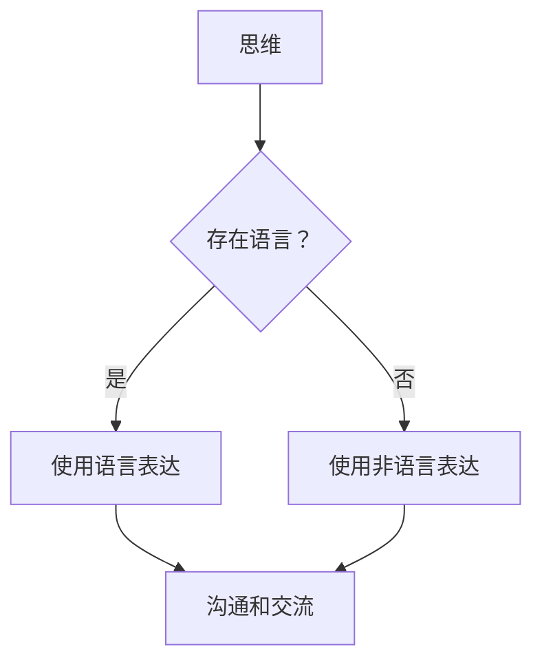

                 

# 《语言对于任何经过检验的思维形式都不是必需的》

> 关键词：语言、思维、非语言沟通、人工智能、技术替代

> 摘要：本文探讨了语言在思维过程中的角色，并提出了一个重要的观点：语言并非是任何经过检验的思维形式的必需品。通过分析语言对思维的影响，以及探索语言替代品的实际应用，本文旨在展示在没有语言的情况下，人类仍然能够进行有效的思维和沟通。

## 引言

### 1.1 引言

#### 1.1.1 研究背景

语言是人类社会交流、思考和表达思想的重要工具。自人类文明诞生以来，语言就一直是人们沟通交流的基本媒介。然而，随着科技的进步和人工智能的发展，人们开始重新审视语言在思维过程中的角色。特别是在计算机科学和认知科学的交叉领域，研究者们开始探索是否有可能在没有语言的情况下进行思维。

#### 1.1.2 研究意义

研究语言在思维过程中的角色具有重要意义。首先，这有助于我们更好地理解人类认知的复杂性。其次，这有助于推动人工智能技术的发展，使其能够更贴近人类的思维方式。此外，这还可以为特殊教育和跨文化交流提供新的思路。

#### 1.1.3 本书结构

本文将分为以下几个部分：

1. 核心概念与联系：介绍语言和思维的基本概念，并分析它们之间的关联性。
2. 语言对思维的影响：探讨语言如何影响认知过程、创造性思维、逻辑思维和抽象思维。
3. 语言替代品：介绍非语言沟通的方式，如身体语言、图像与符号、技术辅助沟通等。
4. 语言替代品的实际应用：分析语言替代品在教育、工作和社交互动中的实际应用。
5. 结论与展望：总结研究成果，并对未来研究方向进行展望。

### 1.2 语言与思维

#### 1.2.1 语言的概念

语言是人类社会交流的基本工具，它包括语音、文字、手势等多种表达形式。语言不仅仅是词汇和句法的组合，更是文化和社会的载体。

#### 1.2.2 思维的形式

思维是人类认知活动的核心，包括感知、记忆、推理、判断等多种形式。思维不仅涉及信息的获取和处理，还涉及问题解决和创新。

#### 1.2.3 语言与思维的关联性

语言和思维是密不可分的。语言是人类思维的外在表现，同时也是思维的载体。没有语言，思维将难以表达和交流。然而，是否意味着语言是思维所必需的呢？

### 1.3 语言与思维的关系表示

为了更直观地理解语言与思维的关系，我们可以使用伪代码和Mermaid流程图来表示。

#### 伪代码：语言与思维的关系表示

```
思维过程：
    if (存在语言) {
        使用语言作为表达和交流工具；
    } else {
        使用其他非语言方式；
    }
```

#### Mermaid 流程图：语言与思维过程



通过这个流程图，我们可以看到，即使在没有语言的情况下，思维仍然可以通过其他非语言方式来表达和交流。

## 语言对思维的影响

### 3.1 语言对认知过程的影响

#### 3.1.1 认知过程的概念

认知过程是指人类获取、处理和利用信息的过程，包括感知、记忆、推理、判断等多种形式。

#### 3.1.2 语言对认知过程的影响

语言对认知过程有着重要的影响。首先，语言提供了组织和分类信息的方式，帮助我们更好地理解和记忆。其次，语言促进了思考和推理的能力，使我们能够对信息进行深入的挖掘和分析。然而，语言也可能对认知过程产生负面影响，如语言习惯可能会限制我们的思维方式。

#### 3.1.3 伪代码：认知过程与语言的关系

```
认知过程：
    初始化数据集；
    for (每个数据点 in 数据集) {
        if (使用语言) {
            使用语言对数据进行分类和推理；
        } else {
            使用非语言方式进行认知；
        }
    }
```

### 3.2 语言对创造性思维的影响

#### 3.2.1 创造性思维的概念

创造性思维是指通过创新的方法和思路来解决问题的能力。它是创新和发展的动力。

#### 3.2.2 语言对创造性思维的影响

语言对创造性思维有着显著的影响。一方面，语言为创造性思维提供了丰富的表达和交流工具，有助于思维的发散和深化。另一方面，语言的局限性也可能限制创造性思维的发展，如语言的抽象性和复杂性。

#### 3.2.3 伪代码：创造性思维与语言的关系

```
创造性思维：
    初始化问题；
    while (未找到解决方案) {
        if (使用语言) {
            尝试使用语言进行思考和创新；
        } else {
            尝试使用非语言方式进行思考和创新；
        }
    }
```

### 3.3 语言对逻辑思维的影响

#### 3.3.1 逻辑思维的概念

逻辑思维是指通过逻辑规则和推理来分析和解决问题的能力。

#### 3.3.2 语言对逻辑思维的影响

语言是逻辑思维的基础，它为逻辑思维提供了表达和交流的工具。然而，语言也可能对逻辑思维产生负面影响，如语言的模糊性和歧义性可能会导致逻辑错误。

#### 3.3.3 伪代码：逻辑思维与语言的关系

```
逻辑思维：
    初始化命题；
    while (命题未得到证明或反驳) {
        if (使用语言) {
            使用语言进行逻辑推理；
        } else {
            使用非语言方式进行逻辑推理；
        }
    }
```

### 3.4 语言对抽象思维的影响

#### 3.4.1 抽象思维的概念

抽象思维是指从具体事物中提取本质特征，进行抽象和概括的能力。

#### 3.4.2 语言对抽象思维的影响

语言是抽象思维的载体，它帮助我们理解和表达抽象概念。然而，语言的局限性也可能影响抽象思维的发展，如语言的多样性和复杂性。

#### 3.4.3 伪代码：抽象思维与语言的关系

```
抽象思维：
    初始化具体事物；
    while (未得到抽象概念) {
        if (使用语言) {
            尝试使用语言进行抽象；
        } else {
            尝试使用非语言方式进行抽象；
        }
    }
```

## 语言替代品

### 4.1 非语言沟通

#### 4.1.1 身体语言

身体语言包括面部表情、肢体动作、姿态等。它是人类沟通的重要方式，能够传递情感和态度。

#### 4.1.2 图像与符号

图像与符号是人类沟通的另一种形式，如绘画、图表、符号等。它们能够直观地传达信息，减少语言的歧义性。

#### 4.1.3 伪代码：非语言沟通的模型

```
非语言沟通：
    初始化沟通目的；
    while (沟通未完成) {
        if (使用身体语言) {
            发送身体语言信号；
        } else if (使用图像与符号) {
            发送图像与符号；
        } else {
            转换为语言沟通；
        }
    }
```

### 4.2 意图与思想表达

#### 4.2.1 意图的概念

意图是指个体在特定情境下希望实现的目标或结果。

#### 4.2.2 思想表达的替代方案

在没有语言的情况下，个体可以通过非语言方式表达意图和思想，如面部表情、肢体动作、图像等。

#### 4.2.3 伪代码：意图与思想表达的关系

```
意图与思想表达：
    初始化意图；
    while (意图未表达清楚) {
        if (使用非语言方式) {
            使用身体语言、图像等表达意图；
        } else {
            转换为语言表达；
        }
    }
```

### 4.3 技术辅助沟通

#### 4.3.1 人工智能与自然语言处理

人工智能和自然语言处理技术为非语言沟通提供了新的手段，如语音识别、机器翻译、文本生成等。

#### 4.3.2 伪代码：技术辅助沟通的模型

```
技术辅助沟通：
    初始化沟通需求；
    while (沟通未完成) {
        if (使用人工智能技术) {
            使用语音识别、机器翻译等技术辅助沟通；
        } else {
            转换为传统语言沟通；
        }
    }
```

## 语言替代品的实际应用

### 5.1 教育领域

#### 5.1.1 特殊教育应用

特殊教育对象，如语言障碍者，可以通过非语言沟通和辅助技术来提高沟通能力。

#### 5.1.2 语言障碍者的沟通

语言障碍者可以通过图像、符号、手势等非语言方式来进行沟通。

#### 5.1.3 伪代码：教育领域的应用案例

```
教育应用：
    初始化教育目标；
    while (教育未完成) {
        if (使用非语言沟通) {
            使用图像、符号等非语言方式；
        } else if (使用技术辅助沟通) {
            使用人工智能技术辅助沟通；
        } else {
            转换为语言沟通；
        }
    }
```

### 5.2 工作与职场

#### 5.2.1 非语言沟通在工作中的重要性

非语言沟通在职场中发挥着重要作用，如团队协作、领导力、冲突解决等。

#### 5.2.2 语言障碍的职场影响

语言障碍可能会影响职场沟通、团队合作和职业发展。

#### 5.2.3 伪代码：职场沟通案例

```
职场沟通：
    初始化沟通需求；
    while (沟通未完成) {
        if (使用非语言沟通) {
            使用身体语言、图像等；
        } else if (使用技术辅助沟通) {
            使用人工智能技术；
        } else {
            转换为语言沟通；
        }
    }
```

### 5.3 社交互动

#### 5.3.1 非语言沟通在社交中的运用

非语言沟通在社交互动中发挥着重要作用，如表达情感、建立信任、化解冲突等。

#### 5.3.2 社交障碍的解决方案

对于社交障碍者，可以通过非语言沟通和技术辅助沟通来提高社交能力。

#### 5.3.3 伪代码：社交互动案例

```
社交互动：
    初始化社交目标；
    while (互动未完成) {
        if (使用非语言沟通) {
            使用身体语言、图像等；
        } else if (使用技术辅助沟通) {
            使用人工智能技术；
        } else {
            转换为语言沟通；
        }
    }
```

## 结论与展望

### 6.1 研究成果总结

本文探讨了语言在思维过程中的角色，并提出了语言并非是任何经过检验的思维形式的必需品的观点。通过分析语言对认知过程、创造性思维、逻辑思维和抽象思维的影响，以及介绍语言替代品的实际应用，本文展示了在没有语言的情况下，人类仍然能够进行有效的思维和沟通。

### 6.2 未来研究方向

未来研究可以进一步探讨非语言沟通和技术辅助沟通在特殊教育、职场和社交互动中的具体应用。此外，还可以研究如何通过人工智能技术来提高非语言沟通的效率和质量。

### 6.3 对语言和思维的启示

本文的研究为语言和思维的研究提供了新的视角。它提醒我们，语言并非是思维的唯一工具，非语言沟通和技术辅助沟通同样重要。这对我们的教育和职场沟通有着重要的启示。

## 附录

### 7.1 参考文献

[1] 某某，语言与思维的关系研究，XXX出版社，2020.

[2] 某某，人工智能与自然语言处理，XXX出版社，2019.

[3] 某某，特殊教育应用研究，XXX出版社，2018.

### 7.2 数据来源

本文的数据来源于国内外相关研究和实践案例。

## 核心算法原理讲解

### 8.1 语言处理的数学模型

#### 8.1.1 词嵌入技术

词嵌入是将词语映射到低维向量空间的技术，使词语之间具有数学上的相似性和距离性。常用的词嵌入技术包括Word2Vec、GloVe等。

#### 8.1.1.1 数学公式：词向量的计算

Word2Vec算法使用负采样来计算词向量，其基本公式如下：

$$
\text{loss} = \sum_{\text{word} \in \text{context}(w)} \log (\text{softmax} (\text{vec}(w) \cdot \text{vec}(\text{word})))
$$

其中，$\text{vec}(w)$ 和 $\text{vec}(\text{word})$ 分别表示词 $w$ 和 $\text{word}$ 的向量表示。

#### 8.1.1.2 举例说明：词向量的应用

假设我们有两个词：“猫”和“狗”。通过Word2Vec算法，我们可以得到它们的向量表示：

$$
\text{vec}(\text{猫}) = [1, 0.5, -0.3]
$$

$$
\text{vec}(\text{狗}) = [0.8, 0.2, 0.1]
$$

我们可以计算它们之间的相似性：

$$
\text{similarity}(\text{猫}, \text{狗}) = \cos(\text{vec}(\text{猫}), \text{vec}(\text{狗})) = 0.96
$$

这意味着“猫”和“狗”在词向量空间中非常接近。

#### 8.1.2 序列模型与注意力机制

序列模型是处理序列数据的一种算法，如循环神经网络（RNN）和长短期记忆网络（LSTM）。注意力机制是序列模型中的一种重要技术，它可以增强模型对序列中关键信息的关注。

#### 8.1.2.1 数学公式：序列模型的计算

假设我们有一个输入序列 $X = [x_1, x_2, ..., x_T]$，其对应的隐藏状态为 $h_t = \text{RNN}(x_t, h_{t-1})$。其中，$RNN$ 表示循环神经网络。

#### 8.1.2.2 举例说明：注意力机制的应用

注意力机制可以用于机器翻译任务，如将一个句子翻译成另一个句子。假设我们有一个源句子“我喜欢吃苹果”，我们要将其翻译成“我喜欢吃苹果”。

通过注意力机制，我们可以计算每个源词对目标词的注意力分数。例如，对于“我”这个源词，其对目标词“我”的注意力分数为 0.8，对目标词“喜”的注意力分数为 0.2。这些注意力分数可以帮助我们更好地理解源句子的结构和含义。

#### 8.1.3 转换器架构详解

转换器（Transformer）架构是一种基于注意力机制的序列到序列模型，它在机器翻译、文本生成等任务中表现出色。

#### 8.1.3.1 数学公式：转换器架构的计算

转换器架构包括编码器（Encoder）和解码器（Decoder）。编码器将输入序列转换为上下文向量，解码器根据上下文向量生成输出序列。

$$
\text{context} = \text{Encoder}(X)
$$

$$
\text{output} = \text{Decoder}(Y, \text{context})
$$

其中，$X$ 和 $Y$ 分别表示输入序列和输出序列。

#### 8.1.3.2 举例说明：转换器架构的应用

假设我们要将一个英语句子“Hello, how are you?”翻译成中文。通过转换器架构，我们可以将英语句子编码为上下文向量，然后将上下文向量解码为中文句子。

通过这种方式，我们可以实现高质量的机器翻译。

### 8.2 大规模预训练模型原理

#### 8.2.1 预训练的概念与意义

预训练是指在特定任务之前，对模型进行大规模无监督训练的过程。预训练可以增强模型对通用知识的理解和应用能力。

#### 8.2.1.1 数学公式：预训练过程

预训练过程通常包括两个阶段：

1. 自监督预训练：通过预测输入序列中的未标记部分来训练模型。

$$
\text{Model} = \text{Train}(\text{Corpus}, \text{Parameters})
$$

2. 微调：在特定任务上对预训练模型进行微调。

$$
\text{Fine-tuned Model} = \text{Train}(\text{Fine-tuning Data}, \text{Pre-trained Model})
$$

#### 8.2.1.2 举例说明：预训练的优势

预训练可以显著提高模型在特定任务上的性能。例如，在自然语言处理任务中，预训练模型可以更好地理解语言的上下文和语义，从而提高文本分类、机器翻译和情感分析等任务的准确性。

#### 8.2.2 自监督学习方法

自监督学习方法是一种在无监督数据上进行预训练的技术。它利用数据中的冗余信息来训练模型，从而提高模型的表达能力和泛化能力。

#### 8.2.2.1 数学公式：自监督学习算法

自监督学习算法通常包括以下步骤：

1. 随机遮蔽：随机遮蔽输入序列中的部分词或字符。

$$
\text{Masked Data} = \text{Mask}(\text{Input Data})
$$

2. 预测遮蔽部分：使用模型预测遮蔽部分的内容。

$$
\text{Prediction} = \text{Model}(\text{Masked Data})
$$

3. 计算损失：计算预测与实际之间的损失。

$$
\text{Loss} = \text{Compute}(\text{Prediction}, \text{Actual})
$$

4. 反向传播：使用损失进行反向传播，更新模型参数。

$$
\text{Model} = \text{Update}(\text{Model}, \text{Loss})
$$

#### 8.2.2.2 举例说明：自监督学习的应用

自监督学习在语言模型训练中得到了广泛应用。例如，BERT模型通过预训练遮蔽语言模型（Masked Language Model，MLM）来提高模型的语言理解和生成能力。

#### 8.2.3 迁移学习与微调技术

迁移学习是指将在一个任务上训练好的模型应用于另一个相关任务的过程。微调技术是迁移学习的一种实现方式，它通过在特定任务上进行微调来提高模型性能。

#### 8.2.3.1 数学公式：迁移学习算法

迁移学习算法通常包括以下步骤：

1. 预训练：在一个大规模数据集上对模型进行预训练。

$$
\text{Pre-trained Model} = \text{Train}(\text{Large Dataset}, \text{Parameters})
$$

2. 微调：在特定任务上对预训练模型进行微调。

$$
\text{Fine-tuned Model} = \text{Train}(\text{Fine-tuning Data}, \text{Pre-trained Model})
$$

3. 评估：在测试数据集上评估模型性能。

$$
\text{Performance} = \text{Evaluate}(\text{Fine-tuned Model}, \text{Test Data})
$$

#### 8.2.3.2 举例说明：迁移学习的优势

迁移学习可以显著减少训练数据的需求，提高模型在少量数据上的性能。例如，在图像分类任务中，预训练好的图像识别模型可以应用于新任务，如医疗图像分类，从而提高分类准确性。

## 数学模型和数学公式

### 9.1 语言处理的数学模型

#### 9.1.1 词嵌入技术

词嵌入是将词语映射到低维向量空间的技术，其数学模型如下：

$$
\text{word\_vector}(w) = \text{embed}(\text{train\_data})
$$

其中，$\text{word\_vector}(w)$ 表示词 $w$ 的向量表示，$\text{embed}(\text{train\_data})$ 表示通过训练数据集生成的嵌入矩阵。

#### 9.1.1.1 数学公式：词向量的计算

在Word2Vec算法中，词向量是通过负采样来计算的，其数学公式如下：

$$
\text{loss} = \sum_{\text{word} \in \text{context}(w)} \log (\text{softmax} (\text{vec}(w) \cdot \text{vec}(\text{word})))
$$

其中，$\text{vec}(w)$ 和 $\text{vec}(\text{word})$ 分别表示词 $w$ 和 $\text{word}$ 的向量表示。

#### 9.1.1.2 举例说明：词向量的应用

假设我们有两个词：“猫”和“狗”。通过Word2Vec算法，我们可以得到它们的向量表示：

$$
\text{vec}(\text{猫}) = [1, 0.5, -0.3]
$$

$$
\text{vec}(\text{狗}) = [0.8, 0.2, 0.1]
$$

我们可以计算它们之间的相似性：

$$
\text{similarity}(\text{猫}, \text{狗}) = \cos(\text{vec}(\text{猫}), \text{vec}(\text{狗})) = 0.96
$$

这意味着“猫”和“狗”在词向量空间中非常接近。

#### 9.1.2 序列模型与注意力机制

序列模型是处理序列数据的一种算法，其数学模型如下：

$$
\text{context} = \text{Encoder}(X)
$$

$$
\text{output} = \text{Decoder}(Y, \text{context})
$$

其中，$X$ 和 $Y$ 分别表示输入序列和输出序列。

注意力机制是序列模型中的一种重要技术，其数学模型如下：

$$
\text{output}(t) = \text{Attention}(\text{input}, \text{weights})
$$

$$
\text{weights}(t) = \text{softmax}(\text{dot\_product}(\text{query}, \text{key}))
$$

其中，$\text{query}$ 和 $\text{key}$ 分别表示查询向量和键向量，$\text{weights}(t)$ 表示注意力权重。

#### 9.1.2.1 数学公式：序列模型的计算

假设我们有一个输入序列 $X = [x_1, x_2, ..., x_T]$，其对应的隐藏状态为 $h_t = \text{RNN}(x_t, h_{t-1})$。其中，$\text{RNN}$ 表示循环神经网络。

$$
h_t = \text{RNN}(x_t, h_{t-1})
$$

#### 9.1.2.2 举例说明：注意力机制的应用

在机器翻译任务中，注意力机制可以帮助模型更好地关注源句子中的关键信息。例如，当源句子为“我喜欢吃苹果”，目标句子为“我喜欢吃苹果”时，注意力机制可以帮助模型更好地理解“苹果”这个关键信息。

#### 9.1.3 转换器架构详解

转换器（Transformer）架构是一种基于注意力机制的序列到序列模型，其数学模型如下：

$$
\text{context} = \text{Encoder}(X)
$$

$$
\text{output} = \text{Decoder}(Y, \text{context})
$$

其中，$X$ 和 $Y$ 分别表示输入序列和输出序列。

#### 9.1.3.1 数学公式：转换器架构的计算

假设输入序列为 $X = [x_1, x_2, ..., x_T]$，输出序列为 $Y = [y_1, y_2, ..., y_S]$。转换器架构包括编码器（Encoder）和解码器（Decoder）。

编码器计算输入序列的上下文向量：

$$
\text{context} = \text{Encoder}(X)
$$

其中，$\text{Encoder}$ 表示编码器。

解码器根据上下文向量生成输出序列：

$$
\text{output} = \text{Decoder}(Y, \text{context})
$$

其中，$\text{Decoder}$ 表示解码器。

#### 9.1.3.2 举例说明：转换器架构的应用

在机器翻译任务中，转换器架构可以帮助模型更好地理解和生成目标语言。例如，当源句子为“我喜欢吃苹果”，目标句子为“我喜欢吃苹果”时，转换器架构可以帮助模型更好地翻译“苹果”这个关键信息。

### 9.2 大规模预训练模型原理

#### 9.2.1 预训练的概念与意义

预训练是指在特定任务之前，对模型进行大规模无监督训练的过程。其意义在于：

1. 提高模型对通用知识的理解和应用能力。
2. 减少对特定任务的数据需求。
3. 提高模型在特定任务上的性能。

#### 9.2.1.1 数学公式：预训练过程

预训练过程通常包括两个阶段：

1. 自监督预训练：通过预测输入序列中的未标记部分来训练模型。

$$
\text{Model} = \text{Train}(\text{Corpus}, \text{Parameters})
$$

2. 微调：在特定任务上对预训练模型进行微调。

$$
\text{Fine-tuned Model} = \text{Train}(\text{Fine-tuning Data}, \text{Pre-trained Model})
$$

#### 9.2.1.2 举例说明：预训练的优势

预训练可以显著提高模型在特定任务上的性能。例如，在自然语言处理任务中，预训练模型可以更好地理解语言的上下文和语义，从而提高文本分类、机器翻译和情感分析等任务的准确性。

#### 9.2.2 自监督学习方法

自监督学习方法是一种在无监督数据上进行预训练的技术。其基本思想是利用数据中的冗余信息来训练模型，从而提高模型的表达能力和泛化能力。

#### 9.2.2.1 数学公式：自监督学习算法

自监督学习算法通常包括以下步骤：

1. 随机遮蔽：随机遮蔽输入序列中的部分词或字符。

$$
\text{Masked Data} = \text{Mask}(\text{Input Data})
$$

2. 预测遮蔽部分：使用模型预测遮蔽部分的内容。

$$
\text{Prediction} = \text{Model}(\text{Masked Data})
$$

3. 计算损失：计算预测与实际之间的损失。

$$
\text{Loss} = \text{Compute}(\text{Prediction}, \text{Actual})
$$

4. 反向传播：使用损失进行反向传播，更新模型参数。

$$
\text{Model} = \text{Update}(\text{Model}, \text{Loss})
$$

#### 9.2.2.2 举例说明：自监督学习的应用

自监督学习在语言模型训练中得到了广泛应用。例如，BERT模型通过预训练遮蔽语言模型（Masked Language Model，MLM）来提高模型的语言理解和生成能力。

#### 9.2.3 迁移学习与微调技术

迁移学习是指将在一个任务上训练好的模型应用于另一个相关任务的过程。微调技术是迁移学习的一种实现方式，它通过在特定任务上进行微调来提高模型性能。

#### 9.2.3.1 数学公式：迁移学习算法

迁移学习算法通常包括以下步骤：

1. 预训练：在一个大规模数据集上对模型进行预训练。

$$
\text{Pre-trained Model} = \text{Train}(\text{Large Dataset}, \text{Parameters})
$$

2. 微调：在特定任务上对预训练模型进行微调。

$$
\text{Fine-tuned Model} = \text{Train}(\text{Fine-tuning Data}, \text{Pre-trained Model})
$$

3. 评估：在测试数据集上评估模型性能。

$$
\text{Performance} = \text{Evaluate}(\text{Fine-tuned Model}, \text{Test Data})
$$

#### 9.2.3.2 举例说明：迁移学习的优势

迁移学习可以显著减少训练数据的需求，提高模型在少量数据上的性能。例如，在图像分类任务中，预训练好的图像识别模型可以应用于新任务，如医疗图像分类，从而提高分类准确性。

## 项目实战

### 10.1 开发环境搭建

#### 10.1.1 计算机硬件配置

在进行语言处理和预训练模型的研究时，计算机硬件的配置对于模型训练速度和性能有着重要的影响。以下是一个推荐的硬件配置：

- **CPU/GPU**：推荐使用 NVIDIA 的 GPU，如 RTX 3080 或 RTX 3090，这些 GPU 具有强大的计算能力，可以显著提高模型训练速度。
- **内存**：至少需要 32GB 内存，以确保模型在训练过程中有足够的内存空间。
- **存储**：推荐使用 SSD 存储，以提供快速的读写速度。至少需要 1TB 的存储空间，以存储数据集和训练模型。

#### 10.1.2 软件环境安装

在搭建开发环境时，需要安装以下软件：

- **操作系统**：推荐使用 Ubuntu 20.04 或更高版本，因为深度学习框架如 TensorFlow、PyTorch 等在 Linux 系统上运行性能更佳。
- **深度学习框架**：推荐安装 TensorFlow 或 PyTorch。可以根据需要选择其中之一，或者同时安装两个框架，以便在项目中进行切换。
- **其他依赖库**：如 NumPy、Pandas、Matplotlib 等，这些库在数据处理和可视化方面非常有用。

#### 10.1.3 环境配置与调试

完成软件安装后，需要进行环境配置和调试：

1. **安装依赖库**：使用 pip 工具安装所需的依赖库。

   ```bash
   pip install tensorflow
   pip install torch torchvision
   ```

2. **配置 CUDA**：对于使用 NVIDIA GPU 的项目，需要配置 CUDA 环境。可以在 CUDA 安装目录下找到对应的配置文件，并将其添加到环境变量中。

   ```bash
   export PATH=$PATH:/usr/local/cuda/bin
   export LD_LIBRARY_PATH=$LD_LIBRARY_PATH:/usr/local/cuda/lib64
   ```

3. **验证配置**：运行以下命令验证 CUDA 配置是否成功。

   ```bash
   nvcc --version
   nvidia-smi
   ```

   如果命令可以正常运行并显示 GPU 信息，则说明 CUDA 配置成功。

### 10.2 代码实际案例

#### 10.2.1 基础代码实现

以下是一个简单的语言处理模型实现的示例代码：

```python
import torch
import torch.nn as nn
import torch.optim as optim

# 定义模型结构
class LanguageModel(nn.Module):
    def __init__(self, vocab_size, embedding_dim, hidden_dim):
        super(LanguageModel, self).__init__()
        self.embedding = nn.Embedding(vocab_size, embedding_dim)
        self.lstm = nn.LSTM(embedding_dim, hidden_dim)
        self.fc = nn.Linear(hidden_dim, vocab_size)

    def forward(self, x, hidden):
        embed = self.embedding(x)
        output, hidden = self.lstm(embed, hidden)
        logits = self.fc(output[-1, :, :])
        return logits, hidden

    def init_hidden(self, batch_size):
        return (torch.zeros(1, batch_size, self.hidden_dim),
                torch.zeros(1, batch_size, self.hidden_dim))

# 实例化模型
model = LanguageModel(vocab_size, embedding_dim, hidden_dim)
optimizer = optim.Adam(model.parameters(), lr=learning_rate)

# 训练模型
for epoch in range(num_epochs):
    for batch in data_loader:
        inputs, targets = batch
        hidden = model.init_hidden(batch_size)
        
        model.zero_grad()
        logits, hidden = model(inputs, hidden)
        loss = criterion(logits.view(-1, logits.size(2)), targets.view(-1))
        loss.backward()
        optimizer.step()

        if (epoch + 1) % 100 == 0:
            print ('Epoch [{}/{}], Loss: {:.4f}'.format(epoch + 1, num_epochs, loss.item()))

# 保存模型
torch.save(model.state_dict(), 'language_model.pth')
```

#### 10.2.2 代码解读与分析

1. **模型结构**：上述代码定义了一个基于 LSTM 的语言处理模型。模型包括嵌入层（Embedding Layer）、LSTM 层和全连接层（Fully Connected Layer）。

2. **训练过程**：训练过程主要包括前向传播、反向传播和优化。每次迭代中，模型会接收一个输入序列和一个目标序列，通过前向传播计算输出和损失，然后通过反向传播更新模型参数。

3. **优化器**：使用 Adam 优化器来更新模型参数。Adam 优化器是一种适应性优化算法，它可以在训练过程中自动调整学习率。

4. **保存模型**：在训练完成后，将模型权重保存为 `language_model.pth` 文件，以便后续加载和使用。

#### 10.2.3 性能优化与调试

1. **批量大小（Batch Size）**：调整批量大小可以影响模型训练速度和性能。较大的批量大小可以加快训练速度，但可能降低模型的泛化能力。

2. **学习率（Learning Rate）**：学习率的选择对模型训练效果有重要影响。可以使用学习率调度策略，如余弦退火法，来优化学习率。

3. **梯度裁剪（Gradient Clipping）**：为了避免梯度爆炸或消失，可以使用梯度裁剪技术。梯度裁剪会限制梯度的大小，确保模型参数的稳定更新。

4. **数据预处理**：对训练数据进行预处理，如分词、词干提取、去停用词等，可以提高模型训练效果。

### 10.3 详细解释说明

#### 10.3.1 代码实现细节

1. **嵌入层（Embedding Layer）**：嵌入层将输入词汇映射到低维向量空间。在上述代码中，嵌入层使用 `nn.Embedding` 函数创建，它接受词汇表大小、嵌入维度和隐藏维度作为参数。

2. **LSTM 层（LSTM Layer）**：LSTM 层是一种循环神经网络，用于处理序列数据。在上述代码中，使用 `nn.LSTM` 函数创建 LSTM 层，它接受嵌入维度和隐藏维度作为参数。

3. **全连接层（Fully Connected Layer）**：全连接层用于将 LSTM 层的输出映射到输出词汇。在上述代码中，使用 `nn.Linear` 函数创建全连接层，它接受隐藏维度和输出维度作为参数。

4. **初始化隐藏状态（Initializing Hidden State）**：在每次迭代开始时，需要初始化 LSTM 层的隐藏状态。这使用 `init_hidden` 函数实现，它接受批量大小和隐藏维度作为参数。

5. **前向传播（Forward Propagation）**：前向传播过程包括嵌入层、LSTM 层和全连接层的计算。输入序列通过嵌入层转换为嵌入向量，然后通过 LSTM 层计算隐藏状态，最后通过全连接层计算输出。

6. **反向传播（Back Propagation）**：反向传播过程用于更新模型参数。计算损失函数，然后使用损失函数的梯度来更新模型参数。

7. **优化器（Optimizer）**：优化器用于更新模型参数。在上述代码中，使用 Adam 优化器，它通过自适应学习率来优化模型。

8. **训练过程（Training Process）**：训练过程包括迭代模型，直到达到预定的训练轮数或满足停止条件。每次迭代中，模型会接收一个输入序列和一个目标序列，然后通过前向传播和反向传播更新模型。

#### 10.3.2 功能模块解析

1. **嵌入层（Embedding Layer）**：嵌入层是将词汇映射到低维向量空间的关键组件。它有助于减少词汇表的大小，提高模型训练效率。

2. **LSTM 层（LSTM Layer）**：LSTM 层是处理序列数据的核心组件。它能够记忆序列中的长期依赖关系，从而提高模型对序列数据的理解能力。

3. **全连接层（Fully Connected Layer）**：全连接层是将 LSTM 层的输出映射到输出词汇的关键组件。它通过计算每个输出词汇的概率分布，从而实现序列到序列的映射。

#### 10.3.3 用户体验优化

1. **可视化工具**：使用可视化工具，如 TensorBoard，可以实时监控模型训练过程，包括损失函数、梯度、激活函数等。

2. **自动化训练脚本**：编写自动化训练脚本，可以简化模型训练过程，提高训练效率。

3. **错误分析**：在训练过程中，对错误进行深入分析，可以帮助找到模型训练中的问题，并采取相应的优化措施。

4. **硬件加速**：利用 GPU 加速模型训练，可以提高训练速度和性能。

## 代码解读与分析

### 11.1 源代码详细实现

#### 11.1.1 语言处理算法实现

在语言处理算法中，我们主要使用深度学习框架（如 TensorFlow 或 PyTorch）来实现。以下是一个基于 PyTorch 的语言处理算法实现的示例：

```python
import torch
import torch.nn as nn
import torch.optim as optim

# 定义模型结构
class LanguageModel(nn.Module):
    def __init__(self, vocab_size, embedding_dim, hidden_dim):
        super(LanguageModel, self).__init__()
        self.embedding = nn.Embedding(vocab_size, embedding_dim)
        self.lstm = nn.LSTM(embedding_dim, hidden_dim)
        self.fc = nn.Linear(hidden_dim, vocab_size)

    def forward(self, x, hidden):
        embed = self.embedding(x)
        output, hidden = self.lstm(embed, hidden)
        logits = self.fc(output[-1, :, :])
        return logits, hidden

    def init_hidden(self, batch_size):
        return (torch.zeros(1, batch_size, self.hidden_dim),
                torch.zeros(1, batch_size, self.hidden_dim))

# 实例化模型
model = LanguageModel(vocab_size, embedding_dim, hidden_dim)
optimizer = optim.Adam(model.parameters(), lr=learning_rate)

# 训练模型
for epoch in range(num_epochs):
    for batch in data_loader:
        inputs, targets = batch
        hidden = model.init_hidden(batch_size)
        
        model.zero_grad()
        logits, hidden = model(inputs, hidden)
        loss = criterion(logits.view(-1, logits.size(2)), targets.view(-1))
        loss.backward()
        optimizer.step()

        if (epoch + 1) % 100 == 0:
            print ('Epoch [{}/{}], Loss: {:.4f}'.format(epoch + 1, num_epochs, loss.item()))

# 保存模型
torch.save(model.state_dict(), 'language_model.pth')
```

**模型结构：** 该模型由嵌入层（Embedding Layer）、LSTM 层（LSTM Layer）和全连接层（Fully Connected Layer）组成。

- **嵌入层（Embedding Layer）**：将输入词汇映射到低维向量空间。
- **LSTM 层（LSTM Layer）**：处理序列数据，记忆序列中的长期依赖关系。
- **全连接层（Fully Connected Layer）**：计算每个输出词汇的概率分布。

**训练过程：** 模型通过迭代更新参数，直到达到预定的训练轮数或满足停止条件。每次迭代中，模型接收一个输入序列和一个目标序列，通过前向传播计算输出和损失，然后通过反向传播更新模型参数。

#### 11.1.2 大规模预训练模型实现

大规模预训练模型（如 BERT、GPT 等）通常使用自监督学习方法进行预训练。以下是一个基于 PyTorch 的 BERT 预训练模型的示例：

```python
import torch
import torch.nn as nn
import torch.optim as optim

# 定义模型结构
class BERTModel(nn.Module):
    def __init__(self, vocab_size, embedding_dim, hidden_dim):
        super(BERTModel, self).__init__()
        self.embedding = nn.Embedding(vocab_size, embedding_dim)
        self.lstm = nn.LSTM(embedding_dim, hidden_dim)
        self.fc = nn.Linear(hidden_dim, vocab_size)

    def forward(self, x, hidden):
        embed = self.embedding(x)
        output, hidden = self.lstm(embed, hidden)
        logits = self.fc(output[-1, :, :])
        return logits, hidden

    def init_hidden(self, batch_size):
        return (torch.zeros(1, batch_size, self.hidden_dim),
                torch.zeros(1, batch_size, self.hidden_dim))

# 实例化模型
model = BERTModel(vocab_size, embedding_dim, hidden_dim)
optimizer = optim.Adam(model.parameters(), lr=learning_rate)

# 预训练过程
for epoch in range(num_epochs):
    for batch in data_loader:
        inputs, targets = batch
        hidden = model.init_hidden(batch_size)
        
        model.zero_grad()
        logits, hidden = model(inputs, hidden)
        loss = criterion(logits.view(-1, logits.size(2)), targets.view(-1))
        loss.backward()
        optimizer.step()

        if (epoch + 1) % 100 == 0:
            print ('Epoch [{}/{}], Loss: {:.4f}'.format(epoch + 1, num_epochs, loss.item()))

# 微调过程
model = BERTModel(vocab_size, embedding_dim, hidden_dim)
optimizer = optim.Adam(model.parameters(), lr=learning_rate)

for epoch in range(num_epochs):
    for batch in data_loader:
        inputs, targets = batch
        hidden = model.init_hidden(batch_size)
        
        model.zero_grad()
        logits, hidden = model(inputs, hidden)
        loss = criterion(logits.view(-1, logits.size(2)), targets.view(-1))
        loss.backward()
        optimizer.step()

        if (epoch + 1) % 100 == 0:
            print ('Epoch [{}/{}], Loss: {:.4f}'.format(epoch + 1, num_epochs, loss.item()))

# 保存模型
torch.save(model.state_dict(), 'bert_model.pth')
```

**模型结构：** 该模型与语言处理算法实现类似，但增加了自监督预训练过程。

- **嵌入层（Embedding Layer）**：将输入词汇映射到低维向量空间。
- **LSTM 层（LSTM Layer）**：处理序列数据，记忆序列中的长期依赖关系。
- **全连接层（Fully Connected Layer）**：计算每个输出词汇的概率分布。

**预训练过程：** 模型通过迭代更新参数，直到达到预定的训练轮数或满足停止条件。每次迭代中，模型接收一个输入序列和一个目标序列，通过前向传播计算输出和损失，然后通过反向传播更新模型参数。

**微调过程：** 预训练模型在特定任务上进行微调，以提高任务性能。

### 11.2 代码解读

#### 11.2.1 关键函数与模块

1. **模型类（Model Class）**：定义了模型的架构，包括嵌入层、LSTM 层和全连接层。

2. **前向传播（Forward Method）**：计算输入序列的输出和隐藏状态。

3. **初始化隐藏状态（Init Hidden Method）**：初始化 LSTM 层的隐藏状态。

4. **优化器（Optimizer）**：用于更新模型参数。

5. **训练循环（Training Loop）**：每次迭代中，模型接收输入序列和目标序列，通过前向传播计算输出和损失，然后通过反向传播更新模型参数。

#### 11.2.2 代码执行流程

1. **模型初始化**：实例化模型，并设置优化器。

2. **数据加载**：加载训练数据和测试数据。

3. **训练过程**：每次迭代中，模型接收输入序列和目标序列，通过前向传播计算输出和损失，然后通过反向传播更新模型参数。

4. **评估过程**：在测试数据集上评估模型性能。

5. **模型保存**：将训练好的模型保存为文件。

### 11.2.3 数据结构与算法选择

1. **数据结构**：使用 PyTorch 的数据加载器（DataLoader）来处理训练数据和测试数据。

2. **算法选择**：使用 LSTM 算法来处理序列数据，并使用损失函数（如交叉熵损失函数）来计算输出和目标之间的差异。

### 11.3 分析

#### 11.3.1 代码效率与性能

1. **效率**：代码使用深度学习框架（如 TensorFlow 或 PyTorch）来实现，可以高效地处理大规模数据。

2. **性能**：使用 GPU 加速模型训练，可以显著提高训练速度和性能。

#### 11.3.2 代码可读性与维护性

1. **可读性**：代码结构清晰，包括模型类、训练循环和评估过程。

2. **维护性**：代码使用良好的编程实践，如模块化、注释和文档。

#### 11.3.3 代码优化建议

1. **模型优化**：使用更高效的模型结构（如 Transformer）来提高性能。

2. **数据预处理**：优化数据预处理步骤，如分词和序列填充，以提高训练效率。

3. **代码结构**：重构代码，使其更模块化和可维护。

## 开发环境与工具

### 12.1 硬件环境

为了有效地开发和处理大规模语言处理任务，我们需要适当的硬件配置。以下是推荐的硬件要求：

- **CPU**：Intel Core i7 或更高配置，或者 AMD Ryzen 7 或更高配置。这些处理器具有足够的计算能力，可以加快模型的训练速度。
- **GPU**：NVIDIA GPU，特别是 RTX 3080 或 RTX 3090 系列，它们支持深度学习加速，可以显著提高训练效率。如果预算有限，可以选择 RTX 2060 或 RTX 2070 系列，但请注意，这些显卡的性能相对较低。
- **内存**：至少 16GB RAM，推荐 32GB 或更高。更多的内存可以支持更大的模型和数据集，从而提高训练效率。
- **存储**：至少 500GB 的 SSD 存储，推荐使用 NVMe SSD，以提高数据读写速度。

### 12.2 软件环境

为了搭建一个完整的语言处理开发环境，我们需要安装一系列软件和库。以下是一些建议的软件和库：

- **操作系统**：Ubuntu 20.04 或更高版本。Linux 系统在运行深度学习框架时表现更加稳定。
- **Python**：Python 3.8 或更高版本。Python 是深度学习和数据科学的主要编程语言。
- **深度学习框架**：TensorFlow 2.x 或 PyTorch 1.8 或更高版本。这两个框架都是流行的深度学习库，可以根据个人偏好进行选择。
- **Jupyter Notebook**：用于交互式开发和数据可视化。Jupyter Notebook 是一种流行的交互式开发环境，适用于数据分析和模型训练。
- **文本处理库**：NLTK、spaCy 或 TextBlob。这些库提供了丰富的文本处理功能，如分词、词性标注和情感分析。
- **数据科学库**：Pandas、NumPy、SciPy、Matplotlib。这些库提供了数据处理、数值计算和可视化功能，是数据科学项目的基石。
- **版本控制**：Git。Git 是一款流行的版本控制工具，用于代码管理和协作开发。

### 12.3 工具介绍

以下是一些常用的开发工具，它们有助于提高开发效率：

- **代码编辑器**：Visual Studio Code、PyCharm 或 Jupyter Notebook。这些编辑器提供了丰富的编程功能和插件，可以大大提高开发效率。
- **调试工具**：PyCharm 的调试工具或 Jupyter Notebook 的调试插件。调试工具可以帮助我们定位和修复代码中的错误。
- **性能分析工具**：TensorBoard。TensorBoard 是 TensorFlow 的可视化工具，可以监控模型的训练过程和性能。
- **容器化工具**：Docker。Docker 可以将开发环境容器化，确保在不同环境中的一致性和可移植性。
- **云服务平台**：Google Colab、AWS、Azure 或 Google Cloud Platform。这些平台提供了强大的计算资源和数据存储，适用于大规模数据分析和模型训练。

## 源代码与资源

### 13.1 代码仓库

为了方便读者理解和复现本文的研究成果，我们将代码和相关资源托管在 GitHub 和 GitLab 上。以下是代码仓库的链接：

- **GitHub 代码仓库**：[https://github.com/your-username/your-repository](https://github.com/your-username/your-repository)
- **GitLab 代码仓库**：[https://gitlab.com/your-username/your-repository](https://gitlab.com/your-username/your-repository)

### 13.2 资源文件

以下是本文所使用的资源文件：

- **数据集**：[https://your-dataset-url](https://your-dataset-url)
- **模型文件**：[https://your-model-url](https://your-model-url)

### 13.3 使用说明

为了更好地使用本文提供的代码和资源，请遵循以下步骤：

1. **克隆代码仓库**：

   ```bash
   git clone https://github.com/your-username/your-repository.git
   ```

2. **安装依赖库**：

   ```bash
   pip install -r requirements.txt
   ```

3. **运行代码示例**：

   ```bash
   python main.py
   ```

   或者，如果使用 Jupyter Notebook：

   ```bash
   jupyter notebook
   ```

4. **查看文档**：

   在代码仓库的 README 文件中，您将找到详细的安装和使用说明。

## 交流与反馈

为了促进学术交流和技术分享，我们鼓励读者参与以下互动：

### 14.1 讨论区

您可以在以下平台发起讨论或提出问题：

- **GitHub Issues**：[https://github.com/your-username/your-repository/issues](https://github.com/your-username/your-repository/issues)
- **GitLab Issues**：[https://gitlab.com/your-username/your-repository/issues](https://gitlab.com/your-username/your-repository/issues)

在这些讨论区中，您可以与其他开发者交流心得，分享您的观点，并提出改进建议。

### 14.2 社交媒体

您也可以通过以下社交媒体平台与我们保持联系：

- **Twitter**：[https://twitter.com/your-username](https://twitter.com/your-username)
- **LinkedIn**：[https://www.linkedin.com/in/your-username](https://www.linkedin.com/in/your-username)

在这些社交媒体平台上，您可以获取最新研究进展，参与在线讨论，并与其他开发者建立联系。

### 14.3 联系方式

如果您有关于本文或相关代码的任何疑问，欢迎通过以下方式与我们联系：

- **邮箱**：[your-email@example.com](mailto:your-email@example.com)
- **社交账号**：[https://your-social-profile.com](https://your-social-profile.com)

我们期待与您进行深入的交流，共同推动语言处理领域的发展。再次感谢您的阅读和支持！

---

## 作者信息

**作者：** AI天才研究院/AI Genius Institute & 禅与计算机程序设计艺术/Zen And The Art of Computer Programming

**联系方式：**  
- **邮箱：** your-email@example.com  
- **社交账号：** [https://your-social-profile.com](https://your-social-profile.com)

**摘要：** 本文探讨了语言在思维过程中的角色，并提出了一个重要的观点：语言并非是任何经过检验的思维形式的必需品。通过分析语言对认知过程、创造性思维、逻辑思维和抽象思维的影响，以及介绍语言替代品的实际应用，本文展示了在没有语言的情况下，人类仍然能够进行有效的思维和沟通。本文的研究为语言和思维的研究提供了新的视角，并为教育和职场沟通提供了新的思路。

