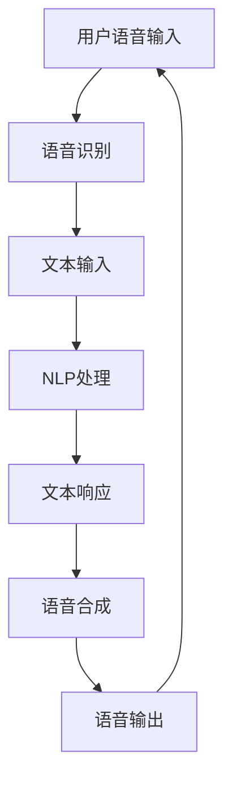

                 

### 文章标题

# 语音助手技术在CUI中的详细应用

> 关键词：语音识别、自然语言处理、语音合成、对话系统、CUI、用户体验

> 摘要：本文深入探讨了语音助手技术在对话用户界面（CUI）中的应用。通过详细分析语音识别、自然语言处理和语音合成的核心原理，本文揭示了语音助手技术在实际应用中面临的挑战及其解决方案。此外，本文还列举了语音助手技术在智能家居、智能客服、智能驾驶和娱乐教育等领域的应用案例，并对语音助手技术的未来发展趋势进行了展望。

----------------------------------------------------------------

### 第1章：CUI与语音助手技术的背景

随着人工智能技术的快速发展，人机交互正逐渐从传统的图形用户界面（GUI）转向对话用户界面（CUI）。CUI是一种通过自然语言交互来实现人机沟通的界面，其核心是语音助手技术。语音助手技术利用语音识别、自然语言处理和语音合成等核心技术，使计算机能够理解用户的语音指令，并提供相应的响应。

#### 1.1 CUI的发展历程

**CUI的定义和特点**

CUI（Conversational User Interface）是一种用户界面设计模式，它通过自然语言交互来实现人机沟通。与传统的图形用户界面（GUI）不同，CUI允许用户通过语音或文本输入与计算机进行实时对话，从而实现更加自然和便捷的交互方式。

CUI的主要特点包括：

- **自然性**：用户可以通过自然语言与系统进行交流，无需遵循固定的操作步骤。
- **灵活性**：CUI能够根据用户的输入进行动态响应，适应不同的用户需求和场景。
- **高效性**：通过语音交互，用户可以快速完成任务，提高工作效率。

**CUI的技术演进**

CUI技术的发展经历了几个重要阶段：

1. **早期的CUI**：早期的CUI主要通过文本聊天窗口实现，用户需要通过文本输入与系统进行交流。
2. **语音识别技术的突破**：随着语音识别技术的快速发展，CUI逐渐从文本交互转向语音交互，实现了更自然、更高效的交互方式。
3. **人工智能与语音助手的融合**：近年来，人工智能技术的进步使得语音助手成为CUI的核心技术，语音助手能够理解用户的语音指令，并提供相应的响应。

#### 1.2 语音助手技术的兴起

**语音助手技术的定义**

语音助手技术（Voice Assistant Technology）是指通过语音识别、自然语言处理和语音合成等技术，实现人与计算机之间的自然语言交互。语音助手能够理解用户的语音指令，执行相应的任务，并提供语音反馈。

**语音助手技术的发展历程**

语音助手技术的发展可以分为以下几个阶段：

1. **语音识别技术的兴起**：20世纪80年代，语音识别技术开始得到关注，研究人员开始探索如何让计算机理解和识别人类的语音。
2. **自然语言处理技术的应用**：随着自然语言处理技术的发展，语音助手开始能够理解用户的自然语言指令，实现更高级的交互功能。
3. **人工智能的融合**：近年来，人工智能技术的进步使得语音助手能够更好地理解用户的意图，提供更加智能的交互体验。

**语音助手技术的技术架构**

语音助手技术的技术架构通常包括以下几个核心组成部分：

1. **语音识别模块**：负责将用户的语音输入转换为文本输入。
2. **自然语言处理模块**：负责理解和处理用户的文本输入，提取关键信息，并生成相应的响应。
3. **语音合成模块**：负责将生成的文本响应转换为语音输出。

#### 1.3 语音助手技术的重要性

**提高用户体验**

语音助手技术能够实现更加自然和便捷的交互方式，使用户能够更轻松地与计算机进行沟通，从而提高用户体验。

**实现人机交互的智能化**

语音助手技术能够理解用户的语音指令，执行相应的任务，提供语音反馈，从而实现人机交互的智能化。这使得计算机能够更好地辅助用户完成任务，提高工作效率。

总之，语音助手技术是CUI的核心技术，其发展将推动人机交互的进步，为用户带来更加智能和便捷的体验。

### 第1章：CUI与语音助手技术的背景

#### 1.1 CUI的发展历程

**CUI的定义和特点**

CUI（Conversational User Interface）是一种用户界面设计模式，它通过自然语言交互来实现人机沟通。与传统的图形用户界面（GUI）不同，CUI允许用户通过语音或文本输入与计算机进行实时对话，从而实现更加自然和便捷的交互方式。

CUI的主要特点包括：

- **自然性**：用户可以通过自然语言与系统进行交流，无需遵循固定的操作步骤。
- **灵活性**：CUI能够根据用户的输入进行动态响应，适应不同的用户需求和场景。
- **高效性**：通过语音交互，用户可以快速完成任务，提高工作效率。

**CUI的技术演进**

CUI技术的发展经历了几个重要阶段：

1. **早期的CUI**：早期的CUI主要通过文本聊天窗口实现，用户需要通过文本输入与系统进行交流。
2. **语音识别技术的突破**：随着语音识别技术的快速发展，CUI逐渐从文本交互转向语音交互，实现了更自然、更高效的交互方式。
3. **人工智能与语音助手的融合**：近年来，人工智能技术的进步使得语音助手成为CUI的核心技术，语音助手能够理解用户的语音指令，并提供相应的响应。

**早期的CUI**

早期的CUI主要以文本聊天窗口的形式出现，用户需要通过键盘输入文本，系统通过自然语言处理技术对用户的文本输入进行分析，并生成相应的文本响应。这种交互方式虽然不如语音交互自然，但为后来的语音助手技术奠定了基础。

**语音识别技术的突破**

语音识别技术的突破是CUI技术发展的重要里程碑。随着语音识别技术的不断改进，计算机能够更加准确地理解用户的语音指令，实现了更加自然和高效的交互方式。语音识别技术的进步使得CUI从文本交互转向语音交互成为可能。

**人工智能与语音助手的融合**

近年来，人工智能技术的快速发展使得语音助手成为CUI的核心技术。语音助手能够理解用户的语音指令，执行相应的任务，并提供语音反馈。人工智能与语音助手的融合使得CUI能够提供更加智能和便捷的交互体验，进一步推动了CUI技术的发展。

**CUI的应用场景**

CUI技术已经在多个领域得到广泛应用，如智能家居、智能客服、智能驾驶和娱乐教育等。在智能家居领域，用户可以通过语音助手控制家电设备，实现更加便捷的家居生活；在智能客服领域，语音助手可以提供24/7的服务，提高客户满意度；在智能驾驶领域，语音助手可以帮助驾驶员更好地控制车辆，提高驾驶安全性；在娱乐教育领域，语音助手可以提供个性化推荐和互动体验，丰富用户的娱乐和学习生活。

总之，CUI技术的发展为用户带来了更加自然和便捷的交互体验，推动了人机交互的进步。随着人工智能技术的不断进步，CUI技术将得到更广泛的应用，为人们的生活和工作带来更多便利。

### 第1章：CUI与语音助手技术的背景

#### 1.2 语音助手技术的兴起

**语音助手技术的定义**

语音助手技术（Voice Assistant Technology）是指通过语音识别、自然语言处理和语音合成等技术，实现人与计算机之间的自然语言交互。语音助手能够理解用户的语音指令，执行相应的任务，并提供语音反馈。

**语音助手技术的发展历程**

语音助手技术的发展可以分为以下几个阶段：

1. **语音识别技术的兴起**：20世纪80年代，语音识别技术开始得到关注，研究人员开始探索如何让计算机理解和识别人类的语音。
2. **自然语言处理技术的应用**：随着自然语言处理技术的发展，语音助手开始能够理解用户的自然语言指令，实现更高级的交互功能。
3. **人工智能的融合**：近年来，人工智能技术的进步使得语音助手能够更好地理解用户的意图，提供更加智能的交互体验。

**语音助手技术的发展历程**

**语音识别技术的兴起**

语音识别技术的兴起可以追溯到20世纪80年代。当时，研究人员开始探索如何让计算机理解和识别人类的语音。这一阶段的语音识别技术主要以规则为基础，通过大量手工编写规则来处理语音信号。然而，这种方法存在许多局限性，例如对语音数据的适应性较差，且对噪声敏感。

20世纪90年代，隐藏马尔可夫模型（HMM）的出现为语音识别技术带来了重大突破。HMM能够更好地处理语音信号的非线性特征，提高了语音识别的准确性。此后，语音识别技术逐渐从规则驱动转向统计模型驱动，为语音助手技术的发展奠定了基础。

**自然语言处理技术的应用**

随着自然语言处理（NLP）技术的发展，语音助手开始能够理解用户的自然语言指令。自然语言处理技术主要包括词法分析、句法分析、语义分析和语用分析等。通过这些技术，语音助手能够从用户的语音输入中提取关键信息，并生成相应的响应。

在早期的自然语言处理技术中，大多数方法依赖于手工编写的规则和特征。然而，随着深度学习技术的兴起，自然语言处理技术取得了重大突破。深度学习模型，如卷积神经网络（CNN）和递归神经网络（RNN），能够自动学习和提取语言特征，大大提高了自然语言处理的性能。

**人工智能的融合**

近年来，人工智能技术的进步使得语音助手能够更好地理解用户的意图。人工智能技术，如机器学习、深度学习和强化学习，被广泛应用于语音助手的设计和实现中。通过这些技术，语音助手能够从大量的数据中学习用户的偏好和行为模式，提供更加个性化的服务。

此外，人工智能技术还使得语音助手能够实现多轮对话和上下文理解。多轮对话技术允许用户和语音助手进行多次交互，从而更好地理解用户的意图。上下文理解技术则使得语音助手能够根据对话的上下文信息，提供更加准确和相关的响应。

**语音助手技术的应用场景**

语音助手技术已经在多个领域得到广泛应用。在智能手机中，苹果的Siri、谷歌的Google Assistant、亚马逊的Alexa等语音助手已经成为了用户的得力助手。用户可以通过语音指令来发送消息、拨打电话、设置闹钟、查询天气等。

在智能家居领域，语音助手可以控制家电设备，如智能电视、智能灯泡、智能音响等。用户可以通过语音指令来控制这些设备的开关、亮度、音量等。

在智能客服领域，语音助手可以提供24/7的客户服务。用户可以通过语音输入来咨询问题，语音助手能够理解用户的问题，并提供相应的答案。

在智能驾驶领域，语音助手可以辅助驾驶员进行导航、拨打电话、发送消息等。语音助手的引入提高了驾驶安全性，减少了驾驶员的注意力分散。

总之，语音助手技术的发展为人们的生活和工作带来了极大的便利。随着人工智能技术的不断进步，语音助手技术将继续发展，为用户带来更加智能和便捷的交互体验。

### 第1章：CUI与语音助手技术的背景

#### 1.3 语音助手技术的重要性

**提高用户体验**

语音助手技术能够实现更加自然和便捷的交互方式，使用户能够更轻松地与计算机进行沟通，从而提高用户体验。与传统的图形用户界面（GUI）相比，语音助手允许用户通过语音输入进行操作，无需使用鼠标和键盘，从而减少了用户的操作步骤和时间。此外，语音助手能够理解用户的自然语言指令，提供更加准确和相关的响应，使得用户能够更快地完成任务。

**实现人机交互的智能化**

语音助手技术通过语音识别、自然语言处理和语音合成等核心技术，使得计算机能够更好地理解用户的意图，并提供相应的响应。这不仅提高了人机交互的效率，还实现了人机交互的智能化。语音助手能够根据用户的输入进行动态响应，适应不同的用户需求和场景。例如，在智能家居领域，用户可以通过语音指令控制家电设备，语音助手能够理解用户的指令，并执行相应的操作。

**推动技术应用和产业发展**

语音助手技术的应用推动了相关技术的进步和产业的发展。语音助手技术的发展带动了语音识别、自然语言处理和语音合成等技术的创新，促进了这些领域的研究和应用。同时，语音助手技术的应用也为企业带来了新的商业机会，推动了智能设备的普及和智能家居市场的增长。随着语音助手技术的不断进步，更多的人将能够享受到智能化带来的便利和效益。

总之，语音助手技术的重要性体现在提高用户体验、实现人机交互的智能化以及推动技术应用和产业发展等方面。随着人工智能技术的不断进步，语音助手技术将在更多领域得到应用，为人们的生活和工作带来更多的便利和效益。

### 第2章：语音助手技术的核心原理

语音助手技术的核心原理主要包括语音识别、自然语言处理和语音合成。这些技术相互配合，共同实现用户与计算机之间的自然语言交互。以下将详细介绍这些技术的原理和实现方法。

#### 2.1 语音识别技术

语音识别技术是语音助手技术的第一步，它将用户的语音输入转换为计算机可以理解和处理的数据。语音识别的基本过程可以分为以下几个步骤：

1. **音频信号处理**：首先，将用户的语音输入转换为音频信号。这一步通常包括去除背景噪声、调整音量等处理。
2. **特征提取**：接着，从音频信号中提取重要的特征，如梅尔频率倒谱系数（MFCC）。这些特征用于描述语音信号的不同频段和时长特征。
3. **声学模型**：声学模型是语音识别的核心，它用于匹配输入语音特征和语音模型。常见的声学模型包括高斯混合模型（GMM）和深度神经网络（DNN）。
4. **语言模型**：语言模型用于预测语音输入对应的文本输出。常见的语言模型包括n-gram模型和基于深度学习的语言模型。
5. **解码**：通过解码算法，将声学模型和语言模型的输出转换为文本输出。常用的解码算法包括隐马尔可夫模型（HMM）和连接主义时序分类（CTC）。

**伪代码：语音识别算法的基本步骤**

```python
def speech_recognition(audio_data):
    # 特征提取
    features = extract_features(audio_data)

    # 声学模型
    acoustic_model = train_acoustic_model(features)

    # 语言模型
    language_model = train_language_model()

    # 识别过程
    hypothesis = decode(features, acoustic_model, language_model)

    # 结果输出
    return hypothesis
```

**数学模型和数学公式**

**梅尔频率倒谱系数（MFCC）**

$$
MFCC = \ln \left(1 + \sum_{k=1}^{K} a_k \cdot \frac{|X(k)|}{X_{max}}\right)
$$

其中，$X(k)$ 表示第 $k$ 个滤波器输出的幅度值，$X_{max}$ 表示所有滤波器输出中的最大值，$a_k$ 表示加权系数。

**高斯混合模型（GMM）**

$$
p(x|\theta) = \frac{1}{Z} \prod_{k=1}^{K} \pi_k \cdot \mathcal{N}(x|\mu_k, \Sigma_k)
$$

其中，$x$ 是特征向量，$\theta = (\pi_k, \mu_k, \Sigma_k)$ 是高斯分布的参数，$Z$ 是归一化常数。

#### 2.2 自然语言处理（NLP）

自然语言处理是语音助手技术的关键组成部分，它负责理解和处理用户的语音输入，并生成相应的响应。NLP主要包括以下几个方面：

1. **词法分析**：将用户的语音输入分割成单词或词组，以便进行进一步处理。
2. **句法分析**：分析句子的结构，确定单词之间的关系和语法规则。
3. **语义分析**：理解句子的含义，包括实体识别、关系抽取和情感分析等。
4. **语用分析**：根据语境和上下文，理解句子的实际意义。

**词向量**

词向量是NLP中的一个重要工具，它将单词映射到一个高维空间，从而实现单词的语义表示。常见的词向量模型包括Word2Vec、GloVe和FastText等。

**命名实体识别（NER）**

命名实体识别是NLP中的一个重要任务，它用于识别文本中的特定实体，如人名、地名、组织名等。

**情感分析**

情感分析用于分析文本中的情感极性，确定文本表达的是正面、负面还是中立情感。

**伪代码：情感分类**

```python
def sentiment_classification(text):
    # 向量化文本
    vectorized_text = embed_text(text)

    # 加载预训练的模型
    model = load_pretrained_model()

    # 进行情感分类
    sentiment = model.predict(vectorized_text)

    # 返回情感分类结果
    return sentiment
```

**数学模型和数学公式**

**词嵌入（Word Embedding）**

$$
\mathbf{v}_w = \text{Embed}(\text{word}_w)
$$

其中，$\mathbf{v}_w$ 是词 $w$ 的词向量，$\text{Embed}$ 是一个嵌入函数。

**隐马尔可夫模型（HMM）**

$$
P(X_t|x_{t-1}) = \sum_{i} P(X_t|x_{t-1}, i) \cdot P(i|x_{t-1})
$$

其中，$X_t$ 是第 $t$ 个状态，$x_{t-1}$ 是第 $t-1$ 个状态，$i$ 是隐藏状态。

#### 2.3 语音合成（TTS）

语音合成是将文本转换为自然语音的技术，它是语音助手技术的最后一个环节。语音合成的基本过程可以分为以下几个步骤：

1. **文本预处理**：将输入的文本进行分词、标记等处理，以便生成语音。
2. **声学模型**：声学模型用于生成语音的声学特征，如基频、时长等。
3. **语音合成算法**：语音合成算法根据声学特征生成语音波形。

**声学模型**

声学模型是语音合成中用于生成语音声学特征的核心模型。常见的声学模型包括HMM-GMM、DNN-HMM和WaveNet。

**语音合成算法**

语音合成算法根据声学特征生成语音波形。常见的语音合成算法包括规则合成、数据驱动合成和综合型合成。

**伪代码：语音合成算法**

```python
def text_to_speech(text):
    # 加载预训练的TTS模型
    model = load_pretrained_TTS_model()

    # 将文本转换为音素序列
    phoneme_sequence = convert_text_to_phonemes(text)

    # 生成语音波形
    audio波形 = model.synthesize(phoneme_sequence)

    # 输出语音
    return audio波形
```

**数学模型和数学公式**

**WaveNet模型**

$$
p(\text{音素}|\text{文本}) = \frac{\exp(\text{Logits}(\text{音素}|\text{文本}))}{\sum_{\text{音素}} \exp(\text{Logits}(\text{音素}|\text{文本}))}
$$

其中，Logits 是音素的预测概率。

综上所述，语音助手技术的核心原理包括语音识别、自然语言处理和语音合成。这些技术相互配合，共同实现用户与计算机之间的自然语言交互。通过对这些核心原理的深入理解和应用，语音助手技术能够为用户提供更加智能和便捷的交互体验。

### 第2章：语音助手技术的核心原理

#### 2.4 语音助手技术的核心组件与流程

语音助手技术由多个核心组件组成，这些组件协同工作，实现从语音输入到语音输出的全过程。以下是对这些核心组件及其工作流程的详细说明。

**语音识别（Speech Recognition）**

语音识别是语音助手技术的第一步，其主要任务是将用户的语音输入转换为文本输入。语音识别的过程可以分为以下几个步骤：

1. **音频预处理**：对原始音频信号进行预处理，包括去噪、归一化等，以提高语音识别的准确性。
2. **特征提取**：从预处理后的音频信号中提取特征，如梅尔频率倒谱系数（MFCC）、滤波器组（Filter Banks）等。
3. **声学模型**：声学模型是语音识别的核心，用于匹配输入特征和模型。常见的声学模型包括高斯混合模型（GMM）、深度神经网络（DNN）和循环神经网络（RNN）。
4. **解码**：解码是将声学模型的输出转换为文本的过程。解码算法包括基于规则的方法和基于统计的方法，如隐马尔可夫模型（HMM）和连接主义时序分类（CTC）。

**自然语言处理（Natural Language Processing, NLP）**

自然语言处理是语音助手技术的关键组成部分，它负责理解和处理文本输入，并生成相应的响应。NLP的主要任务包括：

1. **分词**：将连续的文本分割成单词或短语。
2. **词性标注**：为每个单词分配词性，如名词、动词、形容词等。
3. **句法分析**：分析句子的结构，确定单词之间的关系。
4. **语义分析**：理解句子的含义，包括实体识别、事件抽取和关系提取等。
5. **对话管理**：根据对话的上下文和用户的意图，生成适当的响应。

**语音合成（Text-to-Speech, TTS）**

语音合成是将文本转换为自然语音的技术，是语音助手技术的最后一个环节。语音合成的过程可以分为以下几个步骤：

1. **文本预处理**：对输入的文本进行分词、标记等处理，以便生成语音。
2. **声学模型**：声学模型生成语音的声学特征，如基频、时长、振幅等。
3. **语音合成算法**：根据声学特征生成语音波形。常见的语音合成算法包括规则合成、数据驱动合成和综合型合成。

**核心组件之间的交互流程**

语音助手技术的核心组件之间通过一系列交互流程实现从语音输入到语音输出的全过程。以下是这些核心组件的交互流程：

1. **用户语音输入**：用户通过语音输入与语音助手进行交互。
2. **语音识别**：语音识别组件将用户的语音输入转换为文本输入。
3. **自然语言处理**：自然语言处理组件对文本输入进行处理，提取关键信息，并生成相应的响应。
4. **语音合成**：语音合成组件将生成的文本响应转换为语音输出，并将其播放给用户。

**Mermaid流程图：语音助手技术的核心组件与流程**



**伪代码：语音助手技术的核心组件与流程**

```python
def voice_assistant():
    # 用户语音输入
    audio_input = get_user_audio()

    # 语音识别
    text_input = speech_recognition(audio_input)

    # 自然语言处理
    response = natural_language_processing(text_input)

    # 语音合成
    audio_response = text_to_speech(response)

    # 播放语音输出
    play_audio(audio_response)

def speech_recognition(audio_input):
    # 特征提取
    features = extract_features(audio_input)

    # 解码
    text_output = decode(features)

    return text_output

def natural_language_processing(text_input):
    # 分词
    tokens = tokenize(text_input)

    # 词性标注
    tagged_tokens = part_of_speech(tokens)

    # 句法分析
    syntax_tree = parse_sentence(tagged_tokens)

    # 语义分析
    entities = extract_entities(syntax_tree)

    # 对话管理
    response = generate_response(entities)

    return response

def text_to_speech(response):
    # 文本预处理
    phoneme_sequence = preprocess_text(response)

    # 声学模型
    acoustic_features = generate_acoustic_features(phoneme_sequence)

    # 语音合成
    audio_output = synthesize_audio(acoustic_features)

    return audio_output
```

通过上述核心组件与流程，语音助手技术实现了从语音输入到语音输出的完整闭环。这些组件和流程的优化和改进将进一步提高语音助手的性能和用户体验。

### 第2章：语音助手技术的核心原理

#### 2.5 声学模型

声学模型是语音助手技术中的核心组件之一，它在语音识别过程中起着至关重要的作用。声学模型用于描述语音信号的特征，并匹配输入特征与模型，从而实现语音识别。以下将详细介绍声学模型的原理、类型和实现方法。

**声学模型的原理**

声学模型的基本原理是模拟人类听觉系统的处理过程，提取语音信号中的关键特征，并使用这些特征来匹配输入语音与模型。声学模型通常包括以下步骤：

1. **特征提取**：从语音信号中提取重要的特征，如频率、时长和共振峰等。常见的特征提取方法包括梅尔频率倒谱系数（MFCC）和滤波器组（Filter Banks）。
2. **状态表示**：将语音信号划分为多个状态，每个状态表示语音信号的一部分。状态可以用一系列概率分布来表示，如高斯混合模型（GMM）和隐马尔可夫模型（HMM）。
3. **状态转移**：定义状态之间的转移概率，描述语音信号在不同时间点的变化。状态转移概率通常通过训练数据来估计。
4. **解码**：使用解码算法，将输入语音特征映射到最可能的文本输出。解码算法包括基于规则的方法和基于统计的方法，如Viterbi算法和基于神经网络的方法。

**声学模型的类型**

声学模型可以分为以下几种类型：

1. **高斯混合模型（GMM）**：GMM是一种常用的声学模型，它使用多个高斯分布来描述语音信号的特征。GMM通过最大化似然函数来训练模型，具有较高的准确性和效率。
2. **隐马尔可夫模型（HMM）**：HMM是一种基于状态转移概率的声学模型，它通过隐状态序列来描述语音信号的变化。HMM在语音识别中得到了广泛应用，因为它能够有效处理语音信号的非线性特征。
3. **深度神经网络（DNN）**：DNN是一种基于多层神经网络的声学模型，它能够自动学习语音信号的特征表示。DNN在语音识别中表现出色，因为它能够通过大量的训练数据来提高模型的泛化能力。
4. **循环神经网络（RNN）**：RNN是一种基于序列数据的声学模型，它能够处理变长的语音信号。RNN在语音识别中得到了广泛应用，因为它能够捕捉语音信号的时间动态特征。

**声学模型的实现方法**

声学模型的实现方法通常包括以下步骤：

1. **数据预处理**：对语音数据进行预处理，包括去除噪声、归一化等。预处理后的数据将用于训练声学模型。
2. **特征提取**：从预处理后的语音数据中提取特征，如MFCC、Filter Banks等。特征提取的参数和算法将影响声学模型的性能。
3. **模型训练**：使用训练数据来训练声学模型。训练过程包括状态表示、状态转移概率和特征提取参数的优化。常见的训练方法包括基于梯度的优化算法和基于贪心的搜索算法。
4. **解码**：使用解码算法将输入特征映射到最可能的文本输出。解码算法的准确性将直接影响语音识别的性能。

**伪代码：高斯混合模型（GMM）的实现**

```python
def train_gmm(features):
    # 初始化高斯分布参数
    means, variances, weights = initialize_gmm_parameters(features)

    # 迭代优化模型参数
    for epoch in range(num_epochs):
        # E步：计算期望值
        responsibilities = calculate RESPONSIBILITIES(features, means, variances, weights)

        # M步：更新模型参数
        means, variances, weights = update_gmm_parameters(features, responsibilities)

    # 返回训练完成的声学模型
    return GMM(means, variances, weights)

def calculate RESPONSIBILITIES(features, means, variances, weights):
    # 计算每个高斯分布的概率
    responsibilities = []
    for i in range(len(features)):
        probs = []
        for k in range(num_gaussians):
            prob = weights[k] * math.exp(-0.5 * (features[i] - means[k])**2 / variances[k])
            probs.append(prob)
        responsibilities.append(softmax(probs))
    return responsibilities

def update_gmm_parameters(features, responsibilities):
    # 更新高斯分布的参数
    new_means = []
    new_variances = []
    new_weights = []

    for k in range(num_gaussians):
        sum_prob = sum([responsibilities[i][k] for i in range(len(features))])
        new_mean = sum([features[i] * responsibilities[i][k] for i in range(len(features))]) / sum_prob
        new_variance = sum([((features[i] - new_mean)**2) * responsibilities[i][k] for i in range(len(features))]) / sum_prob
        new_weights.append(sum_prob / len(features))

    return new_means, new_variances, new_weights
```

通过上述实现方法，声学模型能够有效描述语音信号的特征，并提高语音识别的准确性。随着人工智能技术的发展，声学模型将不断优化和改进，为语音助手技术提供更强大的支持。

### 第2章：语音助手技术的核心原理

#### 2.6 语言模型

语言模型是语音助手技术中的关键组成部分，它在语音识别和自然语言处理中起着至关重要的作用。语言模型的目的是预测文本序列，从而提高语音识别的准确性和自然语言处理的效果。以下将详细探讨语言模型的基本概念、类型和实现方法。

**语言模型的基本概念**

语言模型（Language Model）是一个概率模型，用于预测下一个单词或字符。在语音识别和自然语言处理中，语言模型能够提供上下文信息，帮助模型更好地理解用户的输入和生成响应。

**语言模型的作用**

1. **语音识别**：语言模型能够根据上下文信息，提高语音识别的准确性。例如，当用户说出“今天天气怎么样？”时，语言模型能够理解“今天”和“天气”之间的关联，从而提高识别准确性。
2. **自然语言处理**：语言模型能够为自然语言处理任务提供上下文信息，如分词、词性标注、命名实体识别等。语言模型能够帮助模型理解句子的结构和含义，从而生成更准确的响应。

**语言模型的类型**

语言模型可以分为以下几种类型：

1. **基于规则的模型**：基于规则的模型使用预定义的规则来预测文本序列。这些规则通常由人类专家编写，例如正则表达式和语法规则。基于规则的模型在处理简单文本时效果较好，但在处理复杂文本时可能存在局限性。
2. **统计模型**：统计模型通过分析大量文本数据来学习文本序列的概率分布。常见的统计模型包括n-gram模型和基于概率上下文无关文法（PCFG）的模型。n-gram模型使用前n个单词的概率来预测下一个单词，而PCFG模型使用上下文无关文法来描述文本序列的概率。
3. **基于神经网络的模型**：基于神经网络的模型，如循环神经网络（RNN）和变换器（Transformer），能够通过深度学习算法自动学习文本的特征和关系。这些模型在处理复杂文本和长文本时表现出色，已经广泛应用于语音识别和自然语言处理任务。

**n-gram模型**

n-gram模型是一种基于统计的语言模型，它通过前n个单词的概率来预测下一个单词。n-gram模型的基本公式如下：

$$
P(w_t | w_{t-n}, w_{t-n+1}, ..., w_{t-1}) = \frac{P(w_{t-n}, w_{t-n+1}, ..., w_{t-1}, w_t)}{P(w_{t-n}, w_{t-n+1}, ..., w_{t-1})}
$$

其中，$w_t$ 是当前单词，$w_{t-n}, w_{t-n+1}, ..., w_{t-1}$ 是前n个单词。

**基于深度学习的语言模型**

基于深度学习的语言模型，如RNN和Transformer，能够通过自动学习文本特征和关系，提高语言模型的性能。以下是一个简单的基于RNN的语言模型实现：

```python
import tensorflow as tf

class RNNLanguageModel(tf.keras.Model):
    def __init__(self, vocab_size, embedding_dim, hidden_dim):
        super(RNNLanguageModel, self).__init__()
        self.embedding = tf.keras.layers.Embedding(vocab_size, embedding_dim)
        self.rnn = tf.keras.layers.SimpleRNN(hidden_dim)
        self.dense = tf.keras.layers.Dense(vocab_size)

    def call(self, inputs, training=False):
        x = self.embedding(inputs)
        x = self.rnn(x, training=training)
        x = self.dense(x)

        return x

# 实例化语言模型
model = RNNLanguageModel(vocab_size=10000, embedding_dim=256, hidden_dim=512)

# 编译模型
model.compile(optimizer='adam', loss='sparse_categorical_crossentropy')

# 训练模型
model.fit(train_data, train_labels, epochs=10, batch_size=64)
```

**数学模型和数学公式**

**n-gram模型**

$$
P(w_t | w_{t-n}, w_{t-n+1}, ..., w_{t-1}) = \frac{P(w_{t-n}, w_{t-n+1}, ..., w_{t-1}, w_t)}{P(w_{t-n}, w_{t-n+1}, ..., w_{t-1})}
$$

**RNN模型**

$$
h_t = \text{tanh}(W_h \cdot [h_{t-1}, x_t] + b_h)
$$

其中，$h_t$ 是当前隐藏状态，$x_t$ 是当前输入，$W_h$ 和 $b_h$ 分别是权重和偏置。

通过上述语言模型的实现方法，语音助手技术能够在语音识别和自然语言处理中提供更准确的预测和更自然的交互体验。随着深度学习技术的发展，语言模型将继续优化和改进，为语音助手技术带来更大的进步。

### 第2章：语音助手技术的核心原理

#### 2.7 语音识别算法

语音识别算法是语音助手技术的核心，负责将用户的语音输入转换为文本输入。语音识别算法通常基于声学模型和语言模型，通过解码过程将语音信号转换为文本。以下将详细介绍几种常用的语音识别算法，包括HMM-GMM、DNN-HMM和CTC。

**HMM-GMM算法**

HMM-GMM（隐马尔可夫模型-高斯混合模型）是一种基于统计的语音识别算法。HMM-GMM将语音信号视为一系列状态序列，每个状态由高斯混合模型（GMM）表示。HMM-GMM算法的主要步骤如下：

1. **特征提取**：从语音信号中提取特征，如梅尔频率倒谱系数（MFCC）。
2. **状态分配**：使用HMM对特征序列进行状态分配，每个状态由一个GMM表示。
3. **解码**：通过Viterbi算法解码，找到最可能的文本序列。

**伪代码：HMM-GMM算法**

```python
def hmm_gmm_decode(features, hmm_gmm):
    # 初始化解码路径
    paths = initialize_paths(hmm_gmm)

    # 迭代计算状态概率
    for t in range(len(features)):
        for state in hmm_gmm.states:
            paths[t] = update_path(paths[t], state, features[t])

    # 找到最可能的文本序列
    best_path = find_best_path(paths)

    return decode_sequence(best_path)
```

**DNN-HMM算法**

DNN-HMM（深度神经网络-隐马尔可夫模型）将深度神经网络引入语音识别，通过端到端的方式提高识别准确性。DNN-HMM算法的主要步骤如下：

1. **特征提取**：从语音信号中提取特征，如MFCC。
2. **神经网络训练**：使用训练数据训练深度神经网络，将特征映射到状态概率。
3. **解码**：使用DNN的输出进行解码，找到最可能的文本序列。

**伪代码：DNN-HMM算法**

```python
def dnn_hmm_decode(features, dnn_hmm):
    # 前向传播计算神经网络输出
    logits = dnn_hmm.forward_pass(features)

    # 解码神经网络输出
    best_path = decode_logits(logits)

    return decode_sequence(best_path)
```

**CTC算法**

CTC（Connectionist Temporal Classification）是一种端到端的语音识别算法，它通过连接时序分类实现文本序列的解码。CTC算法的主要步骤如下：

1. **特征提取**：从语音信号中提取特征，如MFCC。
2. **神经网络训练**：使用训练数据训练神经网络，将特征映射到文本序列的概率。
3. **解码**：通过最大后验概率解码，找到最可能的文本序列。

**伪代码：CTC算法**

```python
def ctc_decode(logits, targets, blank_index):
    # 初始化解码矩阵
    decoder = initialize_decoder(logits, targets, blank_index)

    # 迭代计算解码矩阵
    for t in range(len(logits)):
        for c in range(len(targets)):
            decoder[t][c] = calculate_probability(logits[t], targets[c])

    # 解码矩阵
    best_path = find_best_path(decoder)

    return decode_sequence(best_path)
```

**数学模型和数学公式**

**HMM-GMM算法**

$$
P(x_t | s_t) = \prod_{k=1}^{K} \pi_k \cdot \mathcal{N}(x_t | \mu_k, \Sigma_k)
$$

**DNN-HMM算法**

$$
y_t = \sigma(W_h \cdot [h_{t-1}, x_t] + b_h)
$$

**CTC算法**

$$
P(y | x) = \frac{1}{Z} \exp(\sum_{y} \lambda_y \cdot f(x, y))
$$

通过上述语音识别算法的实现，语音助手技术能够准确地将用户的语音输入转换为文本输入，从而实现更自然和高效的交互体验。随着深度学习技术的发展，语音识别算法将不断优化和改进，为语音助手技术带来更大的进步。

### 第3章：自然语言处理（NLP）

自然语言处理（NLP）是语音助手技术的核心组成部分，它负责理解和处理用户的文本输入，并生成相应的响应。NLP涉及到多种技术，包括词法分析、句法分析、语义分析和语用分析等。本章将详细介绍这些技术的原理和应用。

#### 3.1 NLP基础

**词法分析（Lexical Analysis）**

词法分析是NLP的第一步，它将输入文本分割成单词或短语。词法分析的主要任务是识别文本中的标记，如单词、标点符号和数字等。常见的词法分析工具包括正则表达式和有限自动机。

**句法分析（Syntactic Analysis）**

句法分析是NLP的第二个步骤，它负责分析句子的结构，确定单词之间的关系。句法分析通常使用语法规则和句法树来表示句子的结构。常见的句法分析方法包括基于规则的句法分析和基于统计的句法分析。

**语义分析（Semantic Analysis）**

语义分析是NLP的第三个步骤，它负责理解句子的含义。语义分析包括实体识别、事件抽取和关系抽取等任务。实体识别用于识别文本中的特定实体，如人名、地名和组织名等。事件抽取用于识别文本中的事件，并提取事件的主要参与者。关系抽取用于识别实体之间的关系。

**语用分析（Pragmatic Analysis）**

语用分析是NLP的最后一个步骤，它负责理解句子的实际意义，包括语境和上下文。语用分析考虑了语言的使用场景和社交环境，从而更好地理解用户的意图。

#### 3.2 情感分析

情感分析是NLP中的一个重要应用，它用于分析文本中的情感极性。情感分析可以分为情感分类和情感极性分析两个子任务。

**情感分类（Sentiment Classification）**

情感分类用于将文本分为正面、负面或中立三个类别。常见的情感分类方法包括基于规则的方法和基于机器学习的方法。基于规则的方法通常使用预定义的规则来分类文本，而基于机器学习的方法使用训练数据来学习分类模型。

**情感极性分析（Sentiment Polarity Analysis）**

情感极性分析用于分析文本中的情感极性，即文本表达的是正面情感还是负面情感。情感极性分析通常使用数值来表示情感极性，如-1表示负面情感，1表示正面情感。

**伪代码：情感分类**

```python
def sentiment_classification(text):
    # 向量化文本
    vectorized_text = embed_text(text)

    # 加载预训练的模型
    model = load_pretrained_model()

    # 进行情感分类
    sentiment = model.predict(vectorized_text)

    # 返回情感分类结果
    return sentiment
```

**数学模型和数学公式**

**情感分类**

$$
P(y | x) = \text{softmax}(\text{Logits}(x))
$$

其中，$y$ 是标签，$x$ 是文本输入，$\text{Logits}$ 是模型的预测输出。

**伪代码：情感极性分析**

```python
def sentiment_polarity_analysis(text):
    # 向量化文本
    vectorized_text = embed_text(text)

    # 加载预训练的模型
    model = load_pretrained_model()

    # 进行情感极性分析
    polarity = model.predict(vectorized_text)

    # 返回情感极性分析结果
    return polarity
```

**数学模型和数学公式**

**情感极性分析**

$$
polarity = \text{sigmoid}(\text{Logits}(x))
$$

其中，$polarity$ 是情感极性，$\text{Logits}$ 是模型的预测输出。

通过上述NLP技术的实现，语音助手能够更好地理解用户的文本输入，并生成相应的响应。随着NLP技术的不断进步，语音助手将能够提供更加智能和个性化的服务。

### 第3章：自然语言处理（NLP）

#### 3.3 对话系统

对话系统是NLP中的一项关键技术，它负责与用户进行自然语言交互，提供个性化的服务。对话系统可以分为基于规则的对话系统和基于统计的对话系统，以及近年来兴起的多轮对话系统和对话管理技术。

**基于规则的对话系统**

基于规则的对话系统使用预定义的规则来驱动对话流程。这些规则通常由人类专家编写，用于处理常见的问题和用户指令。基于规则的对话系统具有实现简单、解释性强等优点，但难以处理复杂和多变的对话场景。

**基于统计的对话系统**

基于统计的对话系统使用机器学习算法，如朴素贝叶斯、决策树和支持向量机等，来训练对话模型。这些模型能够从大量对话数据中学习用户的意图和对话策略，从而生成相应的响应。基于统计的对话系统在处理复杂和多变的对话场景方面表现出色，但需要大量的标注数据。

**多轮对话系统**

多轮对话系统允许用户和系统进行多次交互，以更准确地理解用户的意图。多轮对话系统通常包括对话管理和对话策略两个关键组件。

**对话管理（Dialogue Management）**

对话管理负责维护对话的状态，并生成相应的响应。对话管理的主要任务包括：

- 对话状态跟踪：记录对话的当前状态，如用户的意图、对话的历史信息等。
- 对话策略生成：根据当前状态，生成合适的对话策略，如询问用户更多信息、提供帮助或结束对话。

**伪代码：对话管理**

```python
class DialogueManager:
    def __init__(self):
        self.dialogue_state = None

    def update_state(self, user_input):
        # 更新对话状态
        self.dialogue_state = process_input(user_input)

    def generate_response(self):
        # 根据对话状态生成响应
        response = generate_response_based_on_state(self.dialogue_state)
        return response
```

**对话策略（Dialogue Policy）**

对话策略负责根据对话状态和用户输入，生成相应的响应。对话策略通常包括以下几种类型：

- 询问策略：用于询问用户更多信息，以更好地理解用户的意图。
- 提供帮助策略：用于向用户提供帮助或解释。
- 结束对话策略：用于结束对话，如当用户明确表示不需要进一步帮助时。

**伪代码：对话策略**

```python
class DialoguePolicy:
    def ask_for更多信息(self, dialogue_state):
        # 询问用户更多信息
        response = "您需要了解更多信息吗？"
        return response

    def provide_help(self, dialogue_state):
        # 提供帮助
        response = "您可以告诉我您需要什么帮助？"
        return response

    def end_dialogue(self, dialogue_state):
        # 结束对话
        response = "感谢您的提问，祝您有美好的一天！"
        return response
```

**对话状态跟踪（Dialogue State Tracking）**

对话状态跟踪负责记录和更新对话的当前状态。对话状态通常包括用户的意图、对话的历史信息、上下文等。对话状态跟踪是实现多轮对话系统的重要基础。

**伪代码：对话状态跟踪**

```python
class DialogueStateTracker:
    def __init__(self):
        self.dialogue_state = {}

    def update_state(self, key, value):
        # 更新对话状态
        self.dialogue_state[key] = value

    def get_state(self, key):
        # 获取对话状态
        return self.dialogue_state.get(key)
```

通过多轮对话系统和对话管理技术的应用，语音助手能够更好地理解用户的意图，提供更加个性化和服务化的交互体验。随着人工智能技术的发展，对话系统将继续优化和改进，为用户提供更加智能和自然的交互体验。

### 第4章：语音合成（TTS）

语音合成（Text-to-Speech，TTS）是将文本转换为自然语音的技术，它是语音助手技术的重要组成部分。TTS技术使得计算机能够模拟人类语音，为用户提供听觉上的交互体验。本章将详细介绍TTS技术的核心原理、技术架构和实现方法。

#### 4.1 TTS技术概述

**TTS的定义**

语音合成（Text-to-Speech，TTS）是一种将文本转换为语音的技术，它通过计算和处理文本，生成相应的语音波形，从而实现文本到语音的转换。

**TTS的应用领域**

TTS技术在多个领域得到了广泛应用，包括：

- **智能语音助手**：如苹果的Siri、谷歌的Google Assistant和亚马逊的Alexa等，它们使用TTS技术为用户提供语音反馈。
- **文本阅读器**：为视障人士提供文本阅读功能，帮助他们获取信息。
- **电话客服**：在电话客服系统中，TTS技术用于自动生成语音响应，提高服务效率。
- **有声读物**：将电子文本转换为音频格式，便于用户在通勤、锻炼等场合收听。

**TTS的技术架构**

TTS技术通常包括以下几个关键组件：

- **文本预处理**：对输入的文本进行分词、语调标注和声调标注等处理，以便生成语音。
- **声学模型**：用于生成语音的声学特征，如基频、时长和音量等。
- **语音合成算法**：根据声学特征生成语音波形。

#### 4.2 声学模型

声学模型是TTS技术中的核心组件，它负责生成语音的声学特征。声学模型通过学习大量的语音数据，模拟人类发声器官的工作原理，从而生成自然、流畅的语音。

**声学模型的类型**

声学模型可以分为以下几种类型：

1. **基于声学模型的合成方法**：这类方法直接生成语音信号，常见的模型包括共振峰模型（Formant Model）和声道模型（Larynx Model）。
2. **基于频谱模型的合成方法**：这类方法生成语音的频谱特征，如梅尔频率倒谱系数（MFCC），然后使用波形合成器（Wave Synthesizer）生成语音信号。
3. **基于深度学习的合成方法**：这类方法使用深度神经网络学习语音数据，生成语音的声学特征和语音波形。

**常见的声学模型**

1. **WaveNet**

WaveNet是一种基于深度学习的声学模型，它由Google提出。WaveNet使用循环神经网络（RNN）来学习语音数据，生成语音的声学特征和语音波形。WaveNet的优点是生成的语音自然、流畅，且具有丰富的音调变化。

**WaveNet模型**

WaveNet模型的基本架构是一个深度卷积神经网络（DCNN），它通过多个卷积层和循环层来学习语音数据。WaveNet的输入是文本序列，输出是语音波形。WaveNet模型的数学公式如下：

$$
p(\text{音素}|\text{文本}) = \frac{\exp(\text{Logits}(\text{音素}|\text{文本}))}{\sum_{\text{音素}} \exp(\text{Logits}(\text{音素}|\text{文本}))}
$$

其中，Logits 是音素的预测概率。

**伪代码：WaveNet模型**

```python
class WaveNet(tf.keras.Model):
    def __init__(self, vocab_size, embedding_dim, hidden_dim):
        super(WaveNet, self).__init__()
        self.embedding = tf.keras.layers.Embedding(vocab_size, embedding_dim)
        self.conv_1 = tf.keras.layers.Conv1D(hidden_dim, 5, activation='relu')
        self.conv_2 = tf.keras.layers.Conv1D(hidden_dim, 5, activation='relu')
        self.rnn = tf.keras.layers.LSTM(hidden_dim)
        self.dense = tf.keras.layers.Dense(vocab_size)

    def call(self, inputs, training=False):
        x = self.embedding(inputs)
        x = self.conv_1(x)
        x = self.conv_2(x)
        x = self.rnn(x, training=training)
        x = self.dense(x)

        return x
```

2. **HMM-GMM**

HMM-GMM（隐马尔可夫模型-高斯混合模型）是一种基于统计的声学模型，它结合了隐马尔可夫模型（HMM）和高斯混合模型（GMM）。HMM-GMM通过隐马尔可夫模型描述语音信号的状态序列，使用高斯混合模型描述每个状态的概率分布。

**HMM-GMM模型**

HMM-GMM模型的数学公式如下：

$$
P(x_t | s_t) = \prod_{k=1}^{K} \pi_k \cdot \mathcal{N}(x_t | \mu_k, \Sigma_k)
$$

其中，$s_t$ 是当前状态，$x_t$ 是语音信号特征。

**伪代码：HMM-GMM模型**

```python
class HMMGMM(tf.keras.Model):
    def __init__(self, num_states, num_components):
        super(HMMGMM, self).__init__()
        self.num_states = num_states
        self.num_components = num_components
        self.transition_probs = tf.keras.layers.Dense(num_states)
        self.observation_probs = tf.keras.layers.Dense(num_components)

    def call(self, inputs, training=False):
        transition_probs = self.transition_probs(inputs)
        observation_probs = self.observation_probs(inputs)
        # 解码过程
        # ...
        return decoded_sequence
```

#### 4.3 语音合成算法

语音合成算法是将声学模型生成的声学特征转换为语音信号的过程。常见的语音合成算法包括规则合成、数据驱动合成和综合型合成。

**规则合成**

规则合成是一种基于规则的语音合成方法，它使用预定义的规则来生成语音波形。规则合成的方法包括语音合成器（Voice Synthesizer）和音素合成器（Phoneme Synthesizer）。

**数据驱动合成**

数据驱动合成是一种基于语音数据的语音合成方法，它使用大量的语音数据来训练合成模型。数据驱动合成的方法包括基于隐马尔可夫模型（HMM）的合成和基于深度学习的合成。

**综合型合成**

综合型合成是规则合成和数据驱动合成的一种结合，它使用规则合成生成基础语音，然后使用数据驱动合成对语音进行微调，以生成更自然、流畅的语音。

**伪代码：数据驱动合成**

```python
def data_driven_synthesis(phoneme_sequence, acoustic_model):
    # 生成声学特征
    acoustic_features = acoustic_model(phoneme_sequence)

    # 使用波形合成器生成语音波形
    audio_waveform = wave_synthesizer(acoustic_features)

    return audio_waveform
```

通过上述TTS技术，语音助手能够生成自然、流畅的语音，为用户提供更好的听觉体验。随着深度学习技术的发展，TTS技术将继续优化和改进，为语音助手带来更大的进步。

### 第4章：语音合成（TTS）

#### 4.4 语音合成算法

语音合成（Text-to-Speech，TTS）是将文本转换为自然语音的技术，语音合成算法是实现这一目标的关键。以下将详细介绍规则合成、数据驱动合成和综合型合成的原理和实现方法。

**规则合成**

规则合成是一种基于预定义规则的语音合成方法。它通过一系列规则和音素库来生成语音。规则合成的主要步骤包括：

1. **文本预处理**：将输入文本进行分词和音素标注，生成音素序列。
2. **规则应用**：根据音素序列和预定义的规则，生成语音波形。规则通常描述音素的发音特征和持续时间。
3. **波形合成**：将生成的语音波形通过数字信号处理技术转换为音频信号。

**伪代码：规则合成**

```python
def rule_based_synthesis(text):
    # 分词和音素标注
    phoneme_sequence = tokenize_and_annotate(text)

    # 应用合成规则
    audio_waveform = apply_synthesis_rules(phoneme_sequence)

    # 波形合成
    audio_signal = convert_waveform_to_audio(audio_waveform)

    return audio_signal
```

**数据驱动合成**

数据驱动合成是一种基于语音数据的语音合成方法。它通过大量语音数据训练合成模型，生成语音波形。数据驱动合成的方法包括：

1. **数据收集和预处理**：收集大量语音数据，并进行预处理，如去除噪声、归一化等。
2. **模型训练**：使用语音数据训练合成模型，如基于深度学习的循环神经网络（RNN）。
3. **语音生成**：使用训练好的模型，将文本转换为语音波形。

**伪代码：数据驱动合成**

```python
def data_driven_synthesis(text, model):
    # 文本预处理
    phoneme_sequence = preprocess_text(text)

    # 生成声学特征
    acoustic_features = model.generate_acoustic_features(phoneme_sequence)

    # 使用波形合成器生成语音波形
    audio_waveform = synthesizer.generate_waveform(acoustic_features)

    return audio_waveform
```

**综合型合成**

综合型合成是规则合成和数据驱动合成的结合。它首先使用规则合成生成基础语音，然后使用数据驱动合成对语音进行微调，以生成更自然、流畅的语音。综合型合成的主要步骤包括：

1. **基础语音生成**：使用规则合成生成基础语音。
2. **数据驱动微调**：使用数据驱动合成对基础语音进行微调，以改进语音的自然度。
3. **语音合成**：将基础语音和数据驱动微调后的语音合并，生成最终语音。

**伪代码：综合型合成**

```python
def hybrid_synthesis(text, rule_model, data_model):
    # 基础语音生成
    base_audio_waveform = rule_based_synthesis(text)

    # 数据驱动微调
    fine_tuned_audio_waveform = data_driven_synthesis(text, data_model)

    # 语音合成
    final_audio_waveform = combine_waveforms(base_audio_waveform, fine_tuned_audio_waveform)

    return final_audio_waveform
```

通过规则合成、数据驱动合成和综合型合成，语音合成算法能够生成自然、流畅的语音。随着深度学习技术的发展，数据驱动合成和综合型合成将得到更广泛的应用，进一步提升语音合成技术的性能。

### 第4章：语音合成（TTS）

#### 4.5 常见的TTS系统及其性能评估

语音合成（TTS）技术的发展催生了多种TTS系统，这些系统在性能和实现方法上各具特色。以下将介绍几种常见的TTS系统，包括Google的WaveNet、微软的ResNet和剑桥大学的CLMT，并对其性能进行评估。

**Google的WaveNet**

WaveNet是Google开发的一种基于深度学习的TTS系统。它使用深度卷积神经网络（DCNN）来学习语音数据的时序特征，并能够生成自然、流畅的语音。WaveNet的优点是生成的语音具有丰富的音调变化和自然的音韵，但训练过程相对复杂，对计算资源要求较高。

**微软的ResNet**

ResNet是微软开发的一种基于卷积神经网络的TTS系统。它通过多个卷积层和残差连接来学习语音特征，并使用递归神经网络（RNN）进行语音生成。ResNet的优点是训练效率高，生成的语音自然度较高，适用于实时语音合成应用。

**剑桥大学的CLMT**

CLMT（Cambridge Language Model for TTS）是剑桥大学开发的一种基于深度学习的TTS系统。它使用Transformer架构来学习语音数据的上下文特征，并能够生成高质量的语音。CLMT的优点是生成的语音音质优良，且能够处理多种语言和方言。

**性能评估指标**

TTS系统的性能评估通常包括以下指标：

1. **音质（Quality）**：评估语音的自然度和音质。常用的评估方法包括主观评估和客观评估，如Perceptual Evaluation of Speech Quality（PESQ）和Mean Opinion Score（MOS）。
2. **语音连贯性（Coherence）**：评估语音的流畅度和连贯性。流畅度包括语音的音调变化、节奏和停顿等。
3. **语音清晰度（Clarity）**：评估语音的清晰度和可懂度。
4. **速度（Speed）**：评估系统的响应速度，包括训练时间和生成语音的速度。

**性能评估方法**

性能评估通常包括以下步骤：

1. **数据准备**：收集并准备用于评估的语音数据集。
2. **模型训练**：使用训练数据训练TTS系统。
3. **语音生成**：使用训练好的模型生成语音。
4. **评估**：使用评估指标对生成的语音进行评估。
5. **结果分析**：分析评估结果，比较不同系统的性能。

**伪代码：性能评估**

```python
def evaluate_tts_system(tts_model, test_data):
    # 生成语音
    generated_audio = tts_model.generate_audio(test_data)

    # 评估音质
    quality_score = evaluate_quality(generated_audio)

    # 评估语音连贯性
    coherence_score = evaluate_coherence(generated_audio)

    # 评估语音清晰度
    clarity_score = evaluate_clarity(generated_audio)

    # 返回评估结果
    return quality_score, coherence_score, clarity_score
```

通过性能评估，TTS系统能够得到客观的评估结果，以便进一步优化和改进。随着深度学习技术的发展，TTS系统的性能将不断提高，为用户提供更好的语音体验。

### 第5章：语音助手技术在行业中的应用挑战

语音助手技术在各行各业中得到了广泛应用，但同时也面临着一些挑战。这些挑战主要集中在语音识别的准确性、自然语言处理的歧义处理以及语音合成的自然度等方面。以下将详细分析这些挑战，并提出相应的解决方案。

#### 5.1 语音识别的准确性问题

**受限于语音数据**

语音识别的准确性受限于可用语音数据的数量和质量。在实际应用中，语音数据往往存在多样性不足、标注不完善等问题，导致模型难以泛化。为了解决这一问题，可以采取以下措施：

- **数据增强**：通过音频变换（如时间拉伸、速度变化、噪声添加等）来扩充训练数据集。
- **数据标注**：利用自动标注和半自动标注技术，提高语音数据的标注质量。
- **数据集共享**：鼓励各大公司和研究机构共享语音数据集，以促进语音识别技术的发展。

**异常语音处理**

异常语音，如口音、发音不清、背景噪声等，对语音识别的准确性造成了显著影响。为了提高异常语音处理能力，可以采取以下措施：

- **多语言和多口音训练**：在模型训练过程中，加入多语言和多口音的数据，以提高模型对各种语音的识别能力。
- **自适应噪声抑制**：使用自适应噪声抑制技术，降低背景噪声对语音识别的影响。
- **上下文信息利用**：利用上下文信息，提高对异常语音的识别准确性。

**实时语音识别优化**

实时语音识别对系统的响应速度和处理能力提出了高要求。为了优化实时语音识别性能，可以采取以下措施：

- **模型压缩**：通过模型压缩技术，降低模型的计算复杂度，提高实时处理能力。
- **多线程处理**：采用多线程或多进程技术，提高系统的并行处理能力。
- **增量更新**：采用增量学习技术，实时更新模型，以适应实时语音环境的变化。

#### 5.2 NLP中的歧义处理

**上下文理解**

自然语言处理中的歧义处理主要依赖于上下文理解。某些句子在不同上下文中可能具有不同的含义，这就要求模型能够理解上下文信息。为了提高上下文理解能力，可以采取以下措施：

- **双向编码器**：使用双向编码器（如BERT）来捕捉句子中的双向依赖关系，提高上下文理解能力。
- **多轮对话**：通过多轮对话，逐步揭示用户意图，减少歧义。
- **预训练语言模型**：使用大规模预训练语言模型（如GPT），从大量数据中学习上下文信息。

**语境敏感**

语境敏感是指模型能够在特定语境中理解语言含义。为了提高语境敏感度，可以采取以下措施：

- **实体识别**：通过实体识别技术，识别句子中的关键实体，提高语境理解能力。
- **关系抽取**：通过关系抽取技术，识别句子中的实体关系，丰富语境信息。
- **多模态信息融合**：结合视觉、语音等多种模态信息，提高语境敏感度。

#### 5.3 TTS中的自然度问题

**语音自然的生成**

TTS系统的自然度是用户满意度的重要指标。为了提高语音的自然度，可以采取以下措施：

- **多风格语音库**：使用多风格语音库，提供多种音色和语音风格，满足用户个性化需求。
- **个性化语音合成**：通过用户历史数据，学习用户的语音偏好，生成更符合用户个性的语音。
- **语音情感表达**：通过情感分析技术，生成具有情感表达的语音，提高语音的自然度和情感度。

**个性化语音合成**

个性化语音合成旨在生成符合用户个性的语音。为了实现个性化语音合成，可以采取以下措施：

- **用户历史数据分析**：通过分析用户的历史交互数据，了解用户的语音偏好和习惯。
- **多因素优化**：综合考虑语音的音色、节奏、音调等多种因素，优化语音合成效果。
- **动态调整**：根据用户的实时反馈，动态调整语音合成参数，提高个性化程度。

通过解决语音识别的准确性问题、NLP中的歧义处理以及TTS中的自然度问题，语音助手技术将能够更好地满足用户的需求，为用户提供更智能、更自然的交互体验。

### 第5章：语音助手技术在行业中的应用挑战

#### 5.4 大规模数据集的收集与利用

**数据增强**

数据增强是通过一系列技术手段增加训练数据多样性，从而提升模型泛化能力。以下是一些常用的数据增强方法：

1. **时间变换**：通过时间拉伸、速度变化等方法，使语音信号在时间轴上发生变化。
2. **频率变换**：通过频率调制、滤波等方法，使语音信号在频率轴上发生变化。
3. **噪声添加**：在语音信号中添加背景噪声，以增强模型对噪声环境的适应性。

**伪代码：时间变换**

```python
import numpy as np
import soundfile as sf

def time_stretch(audio_signal, rate_change):
    # 获取音频信号长度
    audio_length = len(audio_signal)

    # 计算拉伸后的音频信号长度
    stretched_length = int(audio_length * rate_change)

    # 创建拉伸后的音频信号数组
    stretched_signal = np.zeros(stretched_length)

    # 对音频信号进行时间变换
    for i in range(stretched_length):
        original_index = int(i / rate_change)
        stretched_signal[i] = audio_signal[original_index]

    # 保存拉伸后的音频信号
    sf.write('stretched_audio.wav', stretched_signal, rate_change)

# 示例
time_stretch(audio_signal, rate_change=0.8)
```

**数据标注**

数据标注是语音助手技术中至关重要的一环，它涉及到语音信号的标注、文本的标注和语音与文本的一致性检查等。以下是一些常用的数据标注方法：

1. **半自动标注**：通过人工审核和自动标注的结合，提高标注质量。
2. **多级审核**：设置多级审核机制，确保标注的准确性。
3. **数据校对**：对标注结果进行定期校对，发现和纠正错误。

**伪代码：半自动标注**

```python
import pandas as pd

def semi_auto_annotate(data, ground_truth):
    # 创建标注数据集
    annotated_data = pd.DataFrame(data)

    # 添加标注列
    annotated_data['annotation'] = ground_truth

    # 审核标注结果
    for index, row in annotated_data.iterrows():
        if not row['annotation'] == row['text']:
            # 提示审核员进行修改
            print(f"Error in annotation for index {index}")

    # 保存标注结果
    annotated_data.to_csv('annotated_data.csv')
```

通过大规模数据集的收集与利用，语音助手技术能够更好地应对行业应用中的挑战，提高模型的准确性和泛化能力。

### 第5章：语音助手技术在行业中的应用挑战

#### 5.5 模型优化与调参

**模型优化**

模型优化是提高语音助手性能的关键步骤，包括模型架构优化、算法改进和算法融合等。以下是一些常见的模型优化方法：

1. **模型架构优化**：通过改进神经网络架构，提高模型的表达能力和计算效率。例如，采用深度神经网络（DNN）、卷积神经网络（CNN）和循环神经网络（RNN）等。
2. **算法改进**：通过改进训练算法，提高模型的训练速度和收敛性。例如，采用随机梯度下降（SGD）、Adam优化器等。
3. **算法融合**：将不同的算法结合起来，提高模型的性能。例如，结合深度学习和传统的机器学习算法，采用深度增强学习（Deep Reinforcement Learning，DRL）。

**伪代码：模型架构优化**

```python
import tensorflow as tf

class VoiceAssistantModel(tf.keras.Model):
    def __init__(self):
        super(VoiceAssistantModel, self).__init__()
        self.dense1 = tf.keras.layers.Dense(512, activation='relu')
        self.dense2 = tf.keras.layers.Dense(256, activation='relu')
        self.dropout = tf.keras.layers.Dropout(0.5)
        self.output_layer = tf.keras.layers.Dense(1, activation='sigmoid')

    def call(self, inputs, training=False):
        x = self.dense1(inputs)
        x = self.dense2(x)
        if training:
            x = self.dropout(x)
        outputs = self.output_layer(x)
        return outputs

# 示例
model = VoiceAssistantModel()
model.compile(optimizer='adam', loss='binary_crossentropy', metrics=['accuracy'])
```

**模型调参**

模型调参是优化模型性能的重要手段，包括选择合适的超参数、调整训练策略和优化训练过程等。以下是一些常见的调参方法：

1. **网格搜索**：通过遍历超参数空间，选择最优的超参数组合。
2. **贝叶斯优化**：利用贝叶斯统计模型，在超参数空间中寻找最优超参数。
3. **随机搜索**：在超参数空间中随机选择超参数，通过多次实验找到最优超参数。

**伪代码：网格搜索**

```python
from sklearn.model_selection import GridSearchCV
from sklearn.ensemble import RandomForestClassifier

# 定义模型
model = RandomForestClassifier()

# 定义超参数网格
param_grid = {'n_estimators': [100, 200, 300], 'max_depth': [10, 20, 30]}

# 进行网格搜索
grid_search = GridSearchCV(model, param_grid, cv=5)
grid_search.fit(X_train, y_train)

# 获取最优超参数
best_params = grid_search.best_params_
print("最优超参数：", best_params)
```

通过模型优化和调参，语音助手技术能够在实际应用中更好地适应各种场景，提高模型的准确性和效率。

### 第5章：语音助手技术在行业中的应用挑战

#### 5.6 对话系统设计

对话系统设计是语音助手技术中的关键环节，它决定了语音助手能否提供流畅、自然的交互体验。对话系统设计主要包括多轮对话管理和对话状态跟踪两个方面。

**多轮对话管理**

多轮对话管理是指语音助手能够与用户进行多次交互，逐步理解用户的意图。多轮对话管理的关键是设计有效的对话策略和交互流程。以下是一些常用的对话管理方法：

1. **基于规则的方法**：通过预定义的对话规则，根据用户的输入和当前对话状态，生成相应的响应。这种方法实现简单，但难以应对复杂和多变的对话场景。
2. **基于机器学习的方法**：使用机器学习算法，如决策树、支持向量机和神经网络等，根据对话历史数据，生成对话策略。这种方法能够适应复杂和多变的对话场景，但需要大量的标注数据。
3. **基于强化学习的方法**：使用强化学习算法，如深度增强学习（Deep Reinforcement Learning，DRL），通过奖励机制，训练对话系统，使其能够自主地生成对话策略。这种方法能够实现更加智能化和个性化的对话体验。

**伪代码：多轮对话管理**

```python
class DialogueManager:
    def __init__(self):
        self.current_state = None
        self.history = []

    def update_state(self, user_input):
        # 更新对话状态
        self.current_state = process_input(user_input)
        self.history.append(user_input)

    def generate_response(self):
        # 生成对话响应
        response = generate_response_based_on_state(self.current_state, self.history)
        return response

def generate_response_based_on_state(state, history):
    # 根据对话状态和对话历史，生成对话响应
    response = "您好，有什么可以帮助您的？"
    return response
```

**对话状态跟踪**

对话状态跟踪是指语音助手能够记录和更新对话的当前状态，以便在后续对话中更好地理解用户的意图。对话状态通常包括用户的意图、对话历史、上下文信息和用户的偏好等。以下是一些常用的对话状态跟踪方法：

1. **基于规则的状态跟踪**：通过预定义的状态转移规则，根据用户的输入和当前对话状态，更新对话状态。
2. **基于机器学习的状态跟踪**：使用机器学习算法，如决策树、支持向量机和神经网络等，根据对话历史和对话状态，更新对话状态。
3. **基于图神经网络的状态跟踪**：使用图神经网络（Graph Neural Network，GNN），将对话状态和对话历史表示为图，通过图神经网络更新对话状态。

**伪代码：对话状态跟踪**

```python
class DialogueStateTracker:
    def __init__(self):
        self.state = None

    def update_state(self, state):
        # 更新对话状态
        self.state = state

    def get_state(self):
        # 获取当前对话状态
        return self.state

def update_state_based_on_input(input):
    # 根据用户输入更新对话状态
    if input.startswith("您好"):
        state = "打招呼"
    elif input.startswith("有什么问题"):
        state = "询问问题"
    else:
        state = "未知状态"

    return state
```

通过多轮对话管理和对话状态跟踪，语音助手能够更好地理解用户的意图，提供更加流畅、自然的交互体验。随着人工智能技术的发展，对话系统设计将不断优化和改进，为用户提供更加智能和个性化的服务。

### 第6章：语音助手技术在行业中的应用案例

语音助手技术在各行各业中得到了广泛应用，大大提高了用户的生活和工作效率。以下将介绍语音助手技术在智能家居、智能客服、智能驾驶和娱乐教育等领域的应用案例。

#### 6.1 智能家居

智能家居领域是语音助手技术的重要应用场景之一。用户可以通过语音指令控制智能家居设备，如智能灯光、智能音响、智能门锁和智能摄像头等。以下是一些具体的案例：

- **语音控制灯光**：用户可以通过语音指令开启或关闭家中的灯光，调节亮度。例如，用户可以说“打开客厅的灯光”或“将卧室灯光调暗50%”。
- **智能音响**：语音助手可以播放音乐、新闻、广播和有声读物等。用户可以通过语音指令请求播放特定的歌曲或节目，如“播放周杰伦的最新专辑”或“播放今天的新闻摘要”。
- **智能门锁**：用户可以通过语音指令远程控制门锁，如“请开启大门”或“关闭卧室的门锁”。这为用户提供了更加便捷和安全的家居管理方式。
- **智能摄像头**：用户可以通过语音指令查看家庭监控视频，如“查看客厅的实时视频”或“回看昨晚的监控录像”。

#### 6.2 智能客服

智能客服是语音助手技术在服务行业的重要应用。智能客服系统能够处理大量的客户咨询，提供快速、准确的响应，从而提高客户满意度和服务效率。以下是一些具体的案例：

- **语音咨询**：用户可以通过语音助手咨询产品信息、订单状态和售后服务等。例如，用户可以说“查询我的订单状态”或“请问产品保修期限是多久？”。
- **智能语音机器人**：智能语音机器人可以自动处理常见的客户问题，如常见问题解答、产品推荐和预订服务等。这减轻了人工客服的工作负担，提高了客户服务效率。
- **多轮对话**：智能客服系统支持多轮对话，能够与用户进行多次交互，以更好地理解用户的意图。例如，用户可以先询问产品信息，然后进一步询问购买流程。

#### 6.3 智能驾驶

智能驾驶领域是语音助手技术的另一个重要应用场景。语音助手可以辅助驾驶员进行导航、拨打电话、发送消息和调节车内设备等，提高驾驶安全性和舒适性。以下是一些具体的案例：

- **语音导航**：语音助手可以提供语音导航服务，实时向驾驶员报告行驶路线、路况信息和到达时间。例如，用户可以说“导航到最近的加油站”或“计算到达目的地的最佳路线”。
- **语音拨打电话**：驾驶员可以通过语音指令拨打电话，如“打电话给张三”或“呼叫客服热线”。
- **语音发送消息**：语音助手可以辅助驾驶员发送文本消息，如“发送短信给李四，说‘我现在在开会，稍后联系你’”。
- **语音控制车内设备**：语音助手可以控制车内设备，如调节空调温度、切换音乐播放和调整座椅位置等。

#### 6.4 娱乐教育

娱乐教育领域是语音助手技术的另一个重要应用场景。语音助手可以提供音乐播放、有声读物、学习课程和游戏等娱乐和教育服务。以下是一些具体的案例：

- **音乐播放**：用户可以通过语音指令播放自己喜欢的音乐，如“播放流行音乐”或“播放周杰伦的最新专辑”。
- **有声读物**：用户可以通过语音助手听有声读物，如“播放《哈利·波特》有声书”或“继续播放上次听到的章节”。
- **学习课程**：语音助手可以提供在线学习课程，如“播放Python编程基础课程”或“开启英语口语训练课程”。
- **游戏**：用户可以通过语音助手玩各种游戏，如“启动猜谜游戏”或“玩象棋游戏”。

通过以上应用案例，语音助手技术已经深刻地改变了人们的日常生活和工作方式。随着技术的不断进步，语音助手技术将在更多领域得到应用，为用户提供更加智能和便捷的服务。

### 第7章：未来展望

语音助手技术在人工智能的推动下，正迅速发展并不断突破。随着技术的不断进步，语音助手技术将在多个方面得到提升，带来更多的创新和机遇。

#### 7.1 语音助手技术的发展趋势

**更高的识别准确性**

语音识别技术的准确性一直是语音助手技术的关键因素。随着深度学习算法和大数据技术的发展，语音识别的准确性得到了显著提高。未来，通过更先进的算法和更大的数据集，语音识别的准确性将进一步提升，使语音助手能够更准确地理解用户的指令。

**更自然的语音合成**

语音合成的自然度是用户体验的重要指标。当前，深度学习技术已经使语音合成在音质和流畅度方面取得了显著进展。未来，通过更精细的声学模型和个性化语音合成技术，语音助手将能够生成更加自然、逼真的语音，满足用户对语音质量的高要求。

**更智能的对话系统**

对话系统是语音助手的灵魂，未来的语音助手将更加智能化。通过引入多轮对话、上下文理解和情感分析等技术，语音助手将能够更好地理解用户的意图，提供个性化的服务。此外，通过强化学习和人机协同，语音助手将能够不断优化自身的能力，实现更加智能的交互。

**多语言和多模态支持**

未来，语音助手技术将实现多语言支持，为全球用户提供服务。同时，多模态交互（如语音、文本、图像和视频等）将得到广泛应用，使语音助手能够处理更多样化的输入和输出，提供更加丰富和个性化的交互体验。

#### 7.2 语音助手技术的挑战与机遇

**多语言支持**

虽然当前语音助手已经支持多种语言，但多语言支持仍面临许多挑战。不同语言的语音特点、语法结构和发音规则都有所不同，这要求语音助手技术能够适应多种语言环境。未来，通过更先进的多语言处理算法和更大的多语言数据集，语音助手将能够更好地支持多种语言。

**个性化服务**

个性化服务是语音助手技术的重要发展方向。未来，语音助手将能够根据用户的历史行为、偏好和需求，提供个性化的服务。这要求语音助手具备强大的数据分析和学习能力，通过深度学习和机器学习算法，从海量数据中提取有价值的信息。

**隐私和安全**

随着语音助手技术的广泛应用，隐私和安全问题变得越来越重要。语音助手需要处理大量的用户数据，包括语音、文本和用户行为等。未来，如何确保用户数据的安全和隐私，将成为语音助手技术发展的重要挑战。

#### 7.3 语音助手技术在社会中的影响

**提高生活质量**

语音助手技术将极大地提高人们的生活质量。通过语音助手，用户可以更轻松地完成各种任务，如智能家居控制、在线购物、健康监测等。语音助手将成为用户生活中不可或缺的助手，为用户提供便捷和高效的服务。

**改善工作效率**

在职场中，语音助手技术可以帮助员工提高工作效率。语音助手可以协助员工管理日程、处理邮件、安排会议和提供信息查询等。此外，语音助手还可以应用于客户服务、电话销售和行政事务处理等，减轻员工的工作负担。

**推动技术创新**

语音助手技术的应用将推动相关领域的技术创新。例如，语音识别和自然语言处理技术的进步将促进智能设备的普及和智能化水平的提升。同时，多模态交互和情感分析技术的发展将推动人机交互模式的革新，为用户带来更加自然和丰富的交互体验。

总之，语音助手技术正朝着更加智能、自然和个性化的方向发展。随着技术的不断进步，语音助手技术将在社会各个方面发挥更大的作用，为人们的生活和工作带来更多便利和效益。

### 附录A：语音助手技术相关工具与资源

语音助手技术的实现离不开各种工具和资源的支持。以下列举了一些常用的开源框架、库和工具，以及实践项目指南，供开发者参考和使用。

#### A.1 开源语音识别框架

1. **Kaldi**  
Kaldi是一个强大的开源语音识别框架，它提供了从音频信号处理到语音识别的完整解决方案。Kaldi支持多种语音识别算法，如GMM-HMM、DNN-HMM和CTC，适用于研究和生产环境。

   **官方网站**：[Kaldi](http://kaldi-asr.org/)

2. **PocketSphinx**  
PocketSphinx是一个轻量级的开源语音识别工具，它支持英语和其他多种语言。PocketSphinx适用于嵌入式系统和移动设备，具有较好的识别准确性和响应速度。

   **官方网站**：[PocketSphinx](http://www.pocketsphinx.net/)

#### A.2 开源自然语言处理框架

1. **NLTK**  
NLTK（自然语言工具包）是一个广泛应用于自然语言处理的Python库，它提供了丰富的文本处理和语言模型工具，如词法分析、句法分析和语义分析。

   **官方网站**：[NLTK](https://www.nltk.org/)

2. **spaCy**  
spaCy是一个快速、高效的NLP库，它提供了强大的文本处理功能，包括词法分析、句法分析和实体识别。spaCy支持多种语言，并提供了简单的API接口。

   **官方网站**：[spaCy](https://spacy.io/)

#### A.3 开源语音合成框架

1. **Festival**  
Festival是一个开源的语音合成工具，它支持多种语音合成算法，如合成元音（Diphone Synthesis）和合成元音-辅音（Unit Selection Synthesis）。Festival适用于学术研究和生产环境。

   **官方网站**：[Festival](http://www.cstr.ed.ac.uk/projects/festival/)

2. **MaryTTS**  
MaryTTS是一个开源的语音合成平台，它支持多种语言和语音合成算法，包括规则合成和数据驱动合成。MaryTTS适用于开发人员和研究人员。

   **官方网站**：[MaryTTS](http://mary.dfki.de/)

#### A.4 实践项目指南

1. **搭建语音识别项目**  
搭建语音识别项目通常包括以下步骤：

   - 环境配置：安装所需的软件和库，如Kaldi、Python和CUDA等。
   - 数据准备：收集和准备语音数据，并进行预处理，如分帧、特征提取和标注等。
   - 模型训练：使用训练数据训练语音识别模型，如GMM-HMM或DNN-HMM等。
   - 识别测试：使用测试数据评估模型的识别性能。

   **参考教程**：[Kaldi官方教程](http://kaldi-asr.org/doc/html/tutorial1.html)

2. **实现自然语言处理项目**  
实现自然语言处理项目通常包括以下步骤：

   - 数据准备：收集和准备文本数据，并进行预处理，如分词、词性标注和实体识别等。
   - 模型训练：使用训练数据训练NLP模型，如词向量模型、命名实体识别模型和情感分析模型等。
   - 应用测试：使用测试数据评估模型的性能，并进行优化。

   **参考教程**：[spaCy官方教程](https://spacy.io/usage)

3. **构建语音合成项目**  
构建语音合成项目通常包括以下步骤：

   - 环境配置：安装所需的软件和库，如Festival、Python和Sphinx等。
   - 文本处理：对输入文本进行预处理，如分词、语调标注和声调标注等。
   - 语音生成：使用语音合成算法，如规则合成或数据驱动合成，生成语音波形。
   - 输出播放：将生成的语音波形转换为音频信号，并进行播放。

   **参考教程**：[Festival官方教程](http://www.cstr.ed.ac.uk/projects/festival/tutorials.html)

通过这些工具和资源的支持，开发者可以轻松搭建和实现语音助手技术项目，为用户提供更智能、更便捷的语音交互体验。

### 术语表

以下列出本文中提到的核心术语及其解释：

- **语音识别（Speech Recognition）**：将语音信号转换为文本输入的技术。
- **自然语言处理（Natural Language Processing，NLP）**：计算机对人类自然语言进行理解和生成的一系列技术。
- **语音合成（Text-to-Speech，TTS）**：将文本转换为自然语音的技术。
- **CUI（Conversational User Interface）**：对话用户界面，允许用户通过自然语言与计算机进行交互。
- **MFCC（梅尔频率倒谱系数）**：用于描述语音信号的频谱特征。
- **GMM（高斯混合模型）**：一种概率模型，用于表示语音信号的分布。
- **DNN（深度神经网络）**：一种多层神经网络，用于学习和表示复杂的非线性关系。
- **CTC（Connectionist Temporal Classification）**：一种端到端的语音识别算法。
- **命名实体识别（Named Entity Recognition，NER）**：识别文本中的特定实体，如人名、地名和组织名等。
- **对话管理（Dialogue Management）**：维护对话状态并生成响应的过程。
- **端到端语音识别（End-to-End Speech Recognition）**：直接将语音信号转换为文本输入的语音识别方法。

