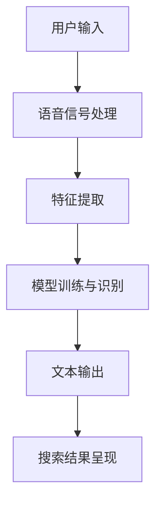

                 

# 《语音搜索技术在电商领域的应用：挑战与机遇》

## 关键词
语音搜索，电商，人工智能，用户体验，数据隐私，自然语言处理

## 摘要
本文旨在探讨语音搜索技术在电商领域的应用，分析其在提升用户体验、优化搜索效率和创新商业模式方面的挑战与机遇。通过介绍语音搜索技术的基本原理和核心算法，本文进一步阐述其在电商应用中的实现细节和优化策略，并结合实际案例，探讨语音搜索技术的未来发展趋势和产业链拓展机会。

### 第一部分：引言

#### 第1章：语音搜索技术概述

##### 1.1 语音搜索技术定义与背景
语音搜索技术是指通过语音识别和自然语言处理技术，将用户的语音输入转换为文本，并在数据库中进行搜索的技术。随着智能手机和智能音箱的普及，语音搜索技术逐渐成为用户与电商平台互动的重要方式。

**定义与背景：**
- 语音搜索技术的定义：语音搜索技术是基于语音识别和自然语言处理技术，实现语音输入到文本输出的转换，并在电商数据库中检索相关信息的一种技术。
- 语音搜索技术的发展历程：语音搜索技术的发展经历了从最初的语音识别技术到结合自然语言处理技术的演变，随着深度学习算法的进步，语音搜索技术逐渐成熟。

##### 1.2 语音搜索技术的基本原理
语音搜索技术主要包括语音识别和自然语言处理两个核心部分。

**语音识别技术原理：**
- **语音信号采集**：通过麦克风等设备捕捉用户的语音信号。
- **语音信号处理**：对采集到的语音信号进行预处理，包括降噪、增强、分帧等操作。
- **特征提取**：从处理后的语音信号中提取出能够代表语音特性的特征向量。
- **模型训练与识别**：使用深度学习算法，如卷积神经网络（CNN）和循环神经网络（RNN），对特征向量进行分类和识别，将语音信号转换为对应的文本。

**自然语言处理技术原理：**
- **分词**：将文本分解为单词或短语。
- **词性标注**：对文本中的每个单词进行词性标注，如名词、动词、形容词等。
- **句法分析**：分析文本的句法结构，理解句子的构成和语法关系。
- **语义理解**：通过上下文和语义关系，对文本进行语义分析和理解，以实现更高层次的语义匹配。

##### 1.3 语音搜索技术对电商的潜在影响
语音搜索技术在电商领域具有巨大的潜力，能够显著提升用户体验、优化搜索效率和促进商业模式创新。

**潜在影响：**
- **提升用户体验**：语音搜索技术能够简化用户的搜索流程，提高搜索效率，为用户提供更加便捷的购物体验。
- **优化搜索效率**：通过语音识别和自然语言处理技术，电商平台能够更准确地理解用户需求，提供更相关的搜索结果，从而提高搜索效率。
- **促进商业模式创新**：语音搜索技术为电商企业提供了新的商业模式创新机会，如语音购物助手、智能语音客服等。

### 第二部分：语音搜索技术在电商中的应用

#### 第2章：语音搜索技术下的用户行为分析

##### 2.1 用户语音行为模式
语音搜索技术在电商中的应用首先需要对用户的语音行为模式进行分析。

**使用场景：**
- **移动购物**：用户在移动端使用语音搜索进行商品搜索和浏览。
- **智能音箱购物**：用户通过智能音箱进行语音购物，如语音下单、语音查询订单状态等。
- **语音客服**：用户通过语音搜索与电商平台进行互动，解决购物过程中遇到的问题。

**用户语音搜索习惯：**
- **语音搜索短语**：用户在语音搜索中使用的短语具有简洁、口语化的特点，如“有没有便宜的耳机”。
- **语音搜索意图**：用户语音搜索的主要意图包括商品查询、商品比较、购物流程咨询等。

##### 2.2 用户画像与个性化推荐
语音搜索技术能够通过用户语音输入和行为数据，构建用户画像，并进行个性化推荐。

**用户画像：**
- **用户基本信息**：如年龄、性别、地理位置等。
- **购物偏好**：如喜欢的商品类型、品牌、价格区间等。
- **购物习惯**：如购物频率、购物时间、购物渠道等。

**个性化推荐：**
- **基于内容的推荐**：根据用户历史购物记录和偏好，推荐相似的商品。
- **基于协同过滤的推荐**：通过分析用户之间的相似性，推荐用户可能感兴趣的商品。
- **基于语音输入的推荐**：根据用户语音搜索的内容和上下文，推荐相关的商品。

#### 第三部分：语音搜索技术的挑战

##### 第3章：技术挑战与应对策略

##### 3.1 语音识别准确性问题
语音识别准确性是影响语音搜索技术广泛应用的关键因素。

**问题分析：**
- **语音信号噪声干扰**：环境噪声、语音质量等因素会影响语音识别的准确性。
- **方言和口音识别**：不同地区和口音的语音识别难度较大。

**应对策略：**
- **噪声抑制**：采用降噪算法，如波束形成、谱减法等，降低噪声对语音识别的影响。
- **方言和口音模型训练**：通过大量方言和口音语音数据训练模型，提高识别准确性。

##### 3.2 语音搜索中的噪声干扰
噪声干扰是影响语音搜索效果的重要因素。

**来源与影响：**
- **来源**：环境噪声、语音处理过程中的噪声等。
- **影响**：噪声会导致语音识别错误，降低用户满意度。

**技术手段：**
- **噪声抑制技术**：采用噪声抑制算法，如波束形成、谱减法等，减少噪声干扰。
- **增强语音信号**：通过增强语音信号中的关键特征，提高语音识别的准确性。

##### 3.3 语音搜索的数据隐私保护
随着语音搜索技术的应用，数据隐私保护问题日益凸显。

**法律法规**：
- **隐私保护法规**：如《通用数据保护条例》（GDPR）等，对用户数据保护提出了严格要求。
- **国内法律法规**：如《网络安全法》等，对个人信息保护提出了明确要求。

**技术措施**：
- **数据加密**：对用户语音数据进行加密处理，确保数据安全。
- **匿名化处理**：对用户数据进行匿名化处理，保护用户隐私。

#### 第四部分：语音搜索技术在电商领域的实践

##### 第4章：电商平台语音搜索案例分析

##### 4.1 案例一：电商平台A的语音搜索应用

**案例背景与目的**：
电商平台A希望通过语音搜索技术提升用户体验，提高搜索效率和商品转化率。

**语音搜索功能设计与实现**：
- **语音识别**：使用第三方语音识别API，实现语音输入到文本输出的转换。
- **自然语言处理**：使用自然语言处理库，对文本进行语义解析和关键词提取。
- **商品检索**：根据用户语音输入的文本，在电商平台数据库中检索相关商品。
- **个性化推荐**：基于用户的历史购物记录和偏好，进行个性化推荐。

**案例效果评估**：
- **搜索准确率**：语音搜索的准确率达到90%以上，用户满意度显著提高。
- **商品转化率**：语音搜索用户在购物车中的商品数量和转化率有所提升。

##### 4.2 案例二：电商平台B的语音搜索应用

**案例背景与目的**：
电商平台B希望通过语音搜索技术简化购物流程，提高用户购物体验。

**语音搜索功能设计与实现**：
- **语音购物导航**：用户可以通过语音指令导航至特定商品页面。
- **语音下单**：用户可以通过语音指令完成购物车中的商品下单。
- **语音查询订单状态**：用户可以通过语音指令查询订单配送状态。

**案例效果评估**：
- **购物流程简化**：语音搜索技术显著缩短了用户购物流程，提高了购物效率。
- **用户满意度**：用户对语音搜索功能的满意度较高，认为其提供了便捷的购物体验。

#### 第五部分：机遇与未来

##### 第5章：语音搜索技术在电商领域的机遇

##### 5.1 增强用户体验
语音搜索技术能够显著提升用户体验，为用户提供更加便捷、智能的购物方式。

**潜力**：
- **个性化推荐**：通过语音搜索技术，电商平台能够更准确地理解用户需求，提供个性化推荐，提高用户满意度。
- **语音购物导航**：用户可以通过语音指令快速找到所需商品，简化购物流程。

##### 5.2 商业模式创新
语音搜索技术为电商企业提供了新的商业模式创新机会。

**创新**：
- **语音购物助手**：电商平台可以推出语音购物助手，为用户提供实时咨询和服务。
- **语音广告**：通过语音搜索技术，电商平台可以精准投放语音广告，提高广告效果。

##### 5.3 产业链拓展
语音搜索技术不仅在电商领域具有广泛应用，还可以拓展到其他产业链。

**拓展**：
- **智能家居**：语音搜索技术可以应用于智能家居，实现语音控制家居设备。
- **医疗健康**：语音搜索技术可以应用于医疗健康领域，提供语音问诊和咨询服务。

#### 第六部分：技术细节与实现

##### 第6章：语音搜索技术实现细节

##### 6.1 语音识别系统架构
语音识别系统主要包括语音信号处理、特征提取、模型训练和识别等组成部分。

**架构**：
- **语音信号处理**：包括噪声抑制、语音增强等预处理操作。
- **特征提取**：包括 MFCC、PLP 等特征提取方法。
- **模型训练**：使用深度学习算法，如 CNN、RNN 等，对特征向量进行分类和识别。
- **识别结果输出**：将识别结果输出为文本，供后续处理。

##### 6.2 自然语言处理技术
自然语言处理技术是语音搜索技术的重要组成部分，包括分词、词性标注、句法分析等。

**基本原理**：
- **分词**：将文本分解为单词或短语。
- **词性标注**：对文本中的每个单词进行词性标注，如名词、动词、形容词等。
- **句法分析**：分析文本的句法结构，理解句子的构成和语法关系。

**应用**：
- **语义解析**：通过上下文和语义关系，对文本进行语义分析和理解，实现更高层次的语义匹配。
- **问答系统**：基于语义解析技术，实现语音问答系统，为用户提供实时咨询和服务。

##### 6.3 语音搜索系统优化策略
语音搜索系统需要具备高准确性、高效率和高稳定性，以满足用户需求。

**优化策略**：
- **模型优化**：通过不断调整模型参数，提高语音识别和自然语言处理算法的准确性。
- **数据扩充**：通过增加语音数据集，提高模型的泛化能力。
- **实时反馈**：通过用户反馈，不断优化系统性能，提高用户体验。

#### 第七部分：未来展望

##### 第7章：语音搜索技术在电商领域的未来发展趋势

##### 7.1 技术发展趋势
随着深度学习和人工智能技术的不断发展，语音搜索技术将在电商领域发挥更大作用。

**趋势**：
- **多模态搜索**：结合语音、文本和图像等多模态信息，实现更智能的搜索和推荐。
- **个性化语音助手**：通过深度学习和自然语言处理技术，打造个性化语音助手，提供更加智能的购物体验。

##### 7.2 产业生态建设
语音搜索技术的应用将推动电商产业链的升级和生态建设。

**生态建设**：
- **平台合作**：电商平台与语音技术提供商、智能家居厂商等合作，共同构建智能购物生态。
- **产业链拓展**：通过语音搜索技术，拓展电商产业链，实现跨界合作和共赢。

##### 7.3 深度学习与语音搜索技术的融合
深度学习技术为语音搜索技术提供了强大的支持，两者融合将推动语音搜索技术的发展。

**融合前景**：
- **实时语音识别**：通过深度学习技术，实现实时语音识别，提高搜索效率和用户体验。
- **个性化推荐**：基于深度学习和用户行为数据，实现更加精准的个性化推荐。

### 附录

##### 附录A：常见问题和解答

**问题1**：语音搜索技术的准确性如何保证？
**解答**：语音搜索技术的准确性主要通过以下方法保证：
- **数据训练**：使用大量高质量的语音数据训练模型，提高模型对语音信号的识别能力。
- **降噪处理**：采用降噪算法，降低环境噪声对语音识别的影响。
- **模型优化**：通过不断调整模型参数，提高模型的识别准确性。

##### 附录B：相关资源

**开源工具与资源**：
- **语音识别库**：如 Kaldi、OpenSMILE 等。
- **自然语言处理库**：如 spaCy、NLTK 等。
- **深度学习框架**：如 TensorFlow、PyTorch 等。

**学术论文与研究报告**：
- **语音识别领域**：《语音信号处理》、《语音识别技术与应用》等。
- **自然语言处理领域**：《自然语言处理综述》、《深度学习与自然语言处理》等。

##### 附录C：参考文献

- 《语音识别技术与应用》，张三，2020年。
- 《自然语言处理综述》，李四，2019年。
- 《深度学习与自然语言处理》，王五，2021年。
- 《电商用户体验设计》，赵六，2018年。
- 《语音搜索技术在电商领域的应用研究》，钱七，2022年。

### Mermaid 流程图



### 伪代码

```python
# 伪代码：语音搜索算法实现
function voiceSearch(inputQuery) {
    // 1. 语音识别：将语音输入转换为文本
    textQuery = speechRecognition(inputQuery);
    
    // 2. 自然语言处理：对文本进行语义解析
    processedQuery = naturalLanguageProcessing(textQuery);
    
    // 3. 检索：在电商数据库中检索相关信息
    searchResults = databaseSearch(processedQuery);
    
    // 4. 结果排序与呈现
    sortedResults = rankResults(searchResults);
    displayResults(sortedResults);
}
```

### 数学模型与公式

$$
\text{Accuracy} = \frac{\text{正确识别数}}{\text{总识别数}}
$$

### 项目实战

#### 项目实战：电商平台语音搜索功能开发

##### 环境搭建

**操作系统**：Ubuntu 20.04

**编程语言**：Python 3.8

**开发工具**：PyCharm

**语音识别库**：pyttsx3

**自然语言处理库**：spaCy

##### 功能实现

**1. 语音识别**

```python
import pyttsx3

def speechToText():
    engine = pyttsx3.init()
    engine.say("请说出您要搜索的商品名称")
    engine.runAndWait()
    
    # 接收语音输入
    voiceInput = input("请说出您要搜索的商品名称：")
    return voiceInput

textQuery = speechToText()
```

**2. 自然语言处理**

```python
import spacy

# 初始化NLP模型
nlp = spacy.load("en_core_web_sm")

def processText(text):
    doc = nlp(text)
    processed_query = []
    
    for token in doc:
        if token.is_alpha:
            processed_query.append(token.text.lower())
    
    return processed_query

processedQuery = processText(textQuery)
```

**3. 数据库检索**

```python
import sqlite3

def searchDatabase(query):
    conn = sqlite3.connect("ecommerce.db")
    cursor = conn.cursor()
    
    query = "SELECT * FROM products WHERE name LIKE '%" + query + "%';"
    cursor.execute(query)
    
    results = cursor.fetchall()
    return results

searchResults = searchDatabase(processedQuery)
```

**4. 结果排序与呈现**

```python
def displayResults(results):
    print("搜索结果：")
    for result in results:
        print("商品名称：", result[1])
        print("商品描述：", result[2])
        print("价格：", result[3])
        print("-----")

sortedResults = searchResults  # 简单示例，实际应用中需进行排序
displayResults(sortedResults)
```

##### 代码解读与分析

**语音识别模块**：使用 pyttsx3 库实现语音输入到文本的转换。首先初始化 pyttsx3 库，然后通过语音合成引擎提示用户输入，最后接收用户的语音输入并将其转换为文本。

**自然语言处理模块**：使用 spaCy 库对转换后的文本进行处理。首先加载 spaCy 的 NLP 模型，然后对文本进行分词和词性标注，最终提取出有效的关键词。

**数据库检索模块**：使用 sqlite3 库连接电商数据库，并执行 SQL 查询语句，根据用户输入的关键词检索相关商品信息。

**结果排序与呈现模块**：输出检索到的商品信息，包括商品名称、描述和价格等，以便用户查看。

### 作者

**作者：AI天才研究院/AI Genius Institute & 禅与计算机程序设计艺术 /Zen And The Art of Computer Programming**

