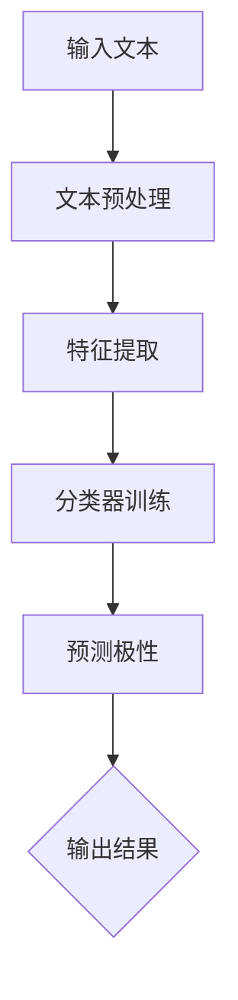
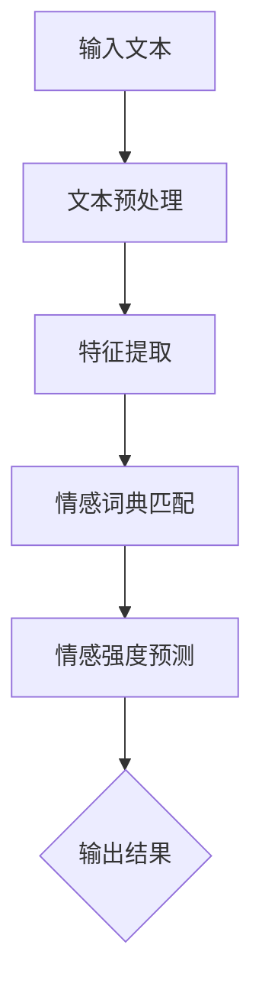
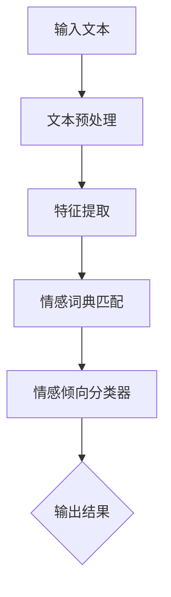
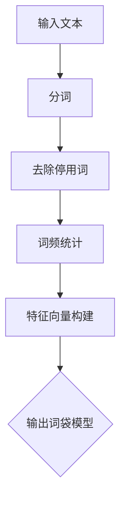
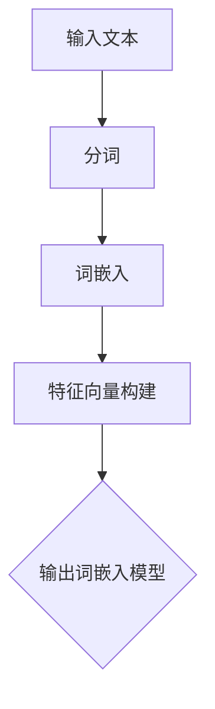
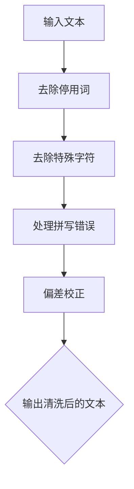

                 

### 文章标题

《豆瓣评论情感分析原理与方法》

---

**关键词：豆瓣评论、情感分析、文本预处理、机器学习、深度学习、模型评估**

**摘要：本文将深入探讨豆瓣评论情感分析的技术原理和方法，从基础概念、算法原理到实际应用，逐一剖析，为读者提供一个系统、详细的指南。**

---

### 引言

随着互联网的迅速发展，用户生成内容（UGC）成为了一种重要的信息来源。豆瓣作为一个知名的社区平台，其用户评论数据丰富且具有极高的价值。对这些评论进行情感分析，不仅可以了解用户的情感倾向，还能为商家、影评人等提供有价值的参考。因此，豆瓣评论情感分析成为自然语言处理（NLP）领域的一个重要研究方向。

本文旨在深入探讨豆瓣评论情感分析的技术原理和方法。我们将从基础概念、算法原理、模型评估和实际应用等多个方面进行详细阐述，旨在为读者提供一个全面、系统的指南。通过本文的学习，读者将能够理解情感分析的基本概念，掌握常用的算法和模型，并能够应用于实际项目中。

本文的主要贡献和结构安排如下：

1. **贡献**：本文首先介绍了豆瓣评论情感分析的重要性，然后从基础概念、算法原理、模型评估和实际应用等多个方面进行了详细探讨，旨在为读者提供一个全面、系统的指南。

2. **结构安排**：本文分为两个主要部分。第一部分为基础理论，包括情感分析概述、相关概念、文本预处理技术、情感分析算法原理和模型评估。第二部分为应用案例与拓展，包括电商评论中的应用、社交媒体中的应用、算法的改进与优化以及多语言环境中的应用。最后，本文提供了附录，包括相关工具与资源和论文推荐，以供进一步学习和参考。

接下来，我们将逐步深入探讨豆瓣评论情感分析的理论基础和实践方法，帮助读者更好地理解和应用这一技术。

---

### 第一部分：豆瓣评论情感分析基础

在本部分，我们将首先对豆瓣评论情感分析进行概述，介绍其意义、挑战和机遇，然后详细探讨情感分析的相关概念，包括情感极性分类、情感强度评估和情感倾向识别。通过这些基础概念的阐述，我们将为后续的算法原理和模型评估打下坚实的理论基础。

#### 第1章：豆瓣评论情感分析概述

##### 1.1 豆瓣评论情感分析的意义

豆瓣评论情感分析作为自然语言处理（NLP）的一个重要分支，具有重要的研究和应用价值。在商业领域，通过对豆瓣评论的情感分析，企业可以了解用户对其产品或服务的真实感受，从而优化产品和服务，提升用户体验。在娱乐领域，影评人和媒体可以通过分析影评情感，发现热门电影和潜在问题，为观众提供更准确的信息。此外，情感分析还可以用于舆情监测，帮助企业及时了解公众对某一事件或话题的看法，制定相应的公关策略。

##### 1.2 情感分析的挑战与机遇

尽管情感分析具有重要的应用价值，但实际应用中仍面临诸多挑战。首先，语言具有高度复杂性和多样性，情感表达方式多样，使得情感分析算法的设计和实现变得更加复杂。其次，噪声和干扰因素的存在，如拼写错误、网络语言和情感反转等，对情感分析结果产生影响。此外，不同领域的情感表达方式也存在差异，如何设计通用的情感分析模型是一个亟待解决的问题。

然而，随着深度学习和自然语言处理技术的不断发展，情感分析面临着前所未有的机遇。深度学习算法，如卷积神经网络（CNN）和循环神经网络（RNN），在处理复杂文本数据方面具有显著优势。同时，大规模预训练语言模型，如BERT和GPT，通过在大量文本数据上的训练，能够捕捉到丰富的语言特征，从而提高情感分析模型的准确性。

##### 1.3 豆瓣评论情感分析的应用场景

豆瓣评论情感分析的应用场景广泛，主要包括以下几个方面：

1. **产品评价**：通过分析用户对某一产品的评论情感，企业可以了解用户对该产品的满意程度，从而改进产品设计和营销策略。

2. **电影评分**：电影评论是情感分析的重要应用领域。通过分析影评情感，可以预测电影的票房表现，为电影推广提供参考。

3. **舆情监测**：对某一事件或话题的评论情感进行分析，可以及时了解公众对该事件或话题的看法，为政府和企业的决策提供支持。

4. **情感趋势分析**：通过分析大量评论情感数据，可以发现情感趋势，为市场研究和社会调查提供数据支持。

接下来，我们将详细探讨情感分析的相关概念，为后续的算法原理和模型评估打下基础。

#### 第2章：情感分析相关概念

在本章中，我们将详细介绍情感分析的相关概念，包括情感极性分类、情感强度评估和情感倾向识别。这些概念是构建情感分析模型的基础，理解它们有助于更好地设计和实现情感分析算法。

##### 2.1 情感极性分类

情感极性分类是情感分析中最基本的任务之一，其主要目的是判断文本表达的情感极性，即判断文本是积极的、消极的还是中性的。情感极性分类通常分为三类：正面情感、负面情感和 neutral（中性）。

情感极性分类的方法主要有两种：基于传统机器学习和基于深度学习。传统机器学习方法，如朴素贝叶斯、支持向量机（SVM）和逻辑回归，通过特征提取和分类器训练，实现对文本情感极性的预测。深度学习方法，如卷积神经网络（CNN）和循环神经网络（RNN），通过在大量文本数据上的训练，能够自动提取文本特征，从而提高情感极性分类的准确性。

以下是一个情感极性分类的 Mermaid 流程图：



##### 2.2 情感强度评估

情感强度评估旨在判断文本中情感表达的程度，即情感是强烈还是轻微。情感强度评估可以与情感极性分类相结合，从而得到更加细致的情感分析结果。

情感强度评估的方法主要有两种：基于规则的方法和基于机器学习的方法。基于规则的方法，如情感词典法，通过建立情感词典，对文本中的词汇进行匹配和评分。基于机器学习的方法，如支持向量机（SVM）和循环神经网络（RNN），通过在大量标注数据上的训练，学习情感强度的预测模型。

以下是一个情感强度评估的 Mermaid 流程图：



##### 2.3 情感倾向识别

情感倾向识别是情感分析的高级任务，旨在识别文本中的特定情感倾向，如爱、愤怒、喜悦等。情感倾向识别需要建立一套完整的情感分类体系，并设计相应的分类模型。

情感倾向识别的方法主要有两种：基于规则的方法和基于机器学习的方法。基于规则的方法，如情感词典法和规则匹配法，通过建立情感词典和规则库，对文本中的词汇进行匹配和分类。基于机器学习的方法，如朴素贝叶斯、支持向量机和深度学习模型，通过在大量标注数据上的训练，学习情感倾向的预测模型。

以下是一个情感倾向识别的 Mermaid 流程图：



通过上述对情感分析相关概念的分析，我们为后续的情感分析算法原理和模型评估奠定了基础。接下来，我们将探讨文本预处理技术在情感分析中的应用，以提高情感分析模型的准确性。

#### 第3章：文本预处理技术

文本预处理是情感分析中至关重要的一步，其目的是将原始文本转换为适合模型处理的格式。文本预处理技术包括词袋模型、词嵌入技术和偏差校正与文本清洗等。本章将详细介绍这些文本预处理技术，并探讨其在情感分析中的应用。

##### 3.1 词袋模型

词袋模型（Bag of Words, BoW）是一种常用的文本表示方法，它将文本视为一个词汇集合，不考虑词汇的顺序和语法结构。词袋模型通过统计文本中各个词汇的出现频率，构建一个特征向量，用于模型训练和预测。

词袋模型的优点在于其简单性和高效性，可以有效降低文本数据维度，同时保留文本的主要信息。然而，词袋模型也存在一些缺点，如无法捕捉词汇的顺序和语法结构，可能导致语义信息的丢失。以下是一个词袋模型的 Mermaid 流程图：



##### 3.2 词嵌入技术

词嵌入（Word Embedding）技术通过将文本中的词汇映射到高维空间中的向量，实现对词汇的语义表示。词嵌入技术可以有效捕捉词汇的语义信息，提高情感分析模型的准确性。常见的词嵌入技术包括 Word2Vec、GloVe 和 BERT 等。

Word2Vec 是一种基于神经网络的词嵌入技术，通过训练模型来预测词汇与其上下文词汇之间的相似性。GloVe 是一种基于全局矩阵分解的词嵌入技术，通过构建词向量矩阵来捕捉词汇的共现关系。BERT 是一种基于变换器（Transformer）的预训练语言模型，通过在大量无标注文本上的预训练，学习词汇的上下文表示。

以下是一个词嵌入技术的 Mermaid 流程图：



##### 3.3 偏差校正与文本清洗

文本数据在收集和预处理过程中，可能会引入各种噪声和偏差。偏差校正和文本清洗是文本预处理中的重要步骤，旨在消除这些噪声和偏差，提高情感分析模型的准确性。

偏差校正主要通过统计方法来纠正文本数据中的系统性偏差。例如，通过对文本数据中的高频词和低频词进行调整，以平衡文本数据的分布。文本清洗包括去除停用词、去除特殊字符、处理拼写错误等操作，以减少噪声对模型的影响。

以下是一个偏差校正与文本清洗的 Mermaid 流程图：



通过上述文本预处理技术，我们可以有效地将原始文本转换为适合模型处理的格式，为情感分析模型的训练和预测打下基础。接下来，我们将探讨情感分析算法的原理和实现方法。

#### 第4章：情感分析算法原理

情感分析算法是实现情感分析任务的核心，本章将详细介绍几种常用的情感分析算法，包括基于传统机器学习的算法、基于深度学习的算法和基于规则的情感分析算法。这些算法各自具有不同的原理和特点，通过对比分析，可以帮助我们选择合适的算法应用于实际项目中。

##### 4.1 基于传统机器学习的情感分析算法

传统机器学习算法在情感分析中具有悠久的历史和广泛的应用。这些算法主要包括朴素贝叶斯、支持向量机（SVM）和逻辑回归等。

1. **朴素贝叶斯（Naive Bayes）**

朴素贝叶斯算法是一种基于概率论的分类算法，通过计算文本中各个特征词的概率分布，预测文本的情感极性。朴素贝叶斯算法的核心思想是“贝叶斯定理”，即通过先验概率和条件概率来计算后验概率，从而判断文本的情感极性。

以下是一个朴素贝叶斯算法的伪代码：

```python
def naive_bayes(train_data, test_data):
    # 计算先验概率
    p_positive = len(train_data['positive']) / len(train_data)
    p_negative = len(train_data['negative']) / len(train_data)

    # 计算条件概率
    word_counts_positive = defaultdict(int)
    word_counts_negative = defaultdict(int)
    for sentence, label in train_data:
        if label == 'positive':
            for word in sentence:
                word_counts_positive[word] += 1
        else:
            for word in sentence:
                word_counts_negative[word] += 1

    # 预测测试数据
    for sentence in test_data:
        p_positive_sentence = p_positive
        p_negative_sentence = p_negative
        for word in sentence:
            p_positive_sentence *= (word_counts_positive[word] + 1) / (len(train_data['positive']) + len(word_counts_positive))
            p_negative_sentence *= (word_counts_negative[word] + 1) / (len(train_data['negative']) + len(word_counts_negative))

        if p_positive_sentence > p_negative_sentence:
            predict_label = 'positive'
        else:
            predict_label = 'negative'

        print(f"预测结果：{predict_label}")
```

2. **支持向量机（SVM）**

支持向量机是一种高效的分类算法，通过找到最优超平面，将不同类别的数据点进行分类。在情感分析中，SVM通过将文本转换为特征向量，然后找到最佳的超平面来进行分类。

以下是一个SVM算法的伪代码：

```python
from sklearn.svm import SVC

def svm(train_data, test_data):
    # 特征提取
    X_train = [[word_count(word) for word in sentence] for sentence in train_data['sentences']]
    y_train = train_data['labels']

    # 训练SVM模型
    svm_model = SVC()
    svm_model.fit(X_train, y_train)

    # 预测测试数据
    X_test = [[word_count(word) for word in sentence] for sentence in test_data['sentences']]
    predictions = svm_model.predict(X_test)

    for prediction in predictions:
        print(f"预测结果：{prediction}")
```

3. **逻辑回归（Logistic Regression）**

逻辑回归是一种广义线性模型，通过建立线性关系来预测概率。在情感分析中，逻辑回归将文本特征映射到概率空间，从而预测文本的情感极性。

以下是一个逻辑回归算法的伪代码：

```python
from sklearn.linear_model import LogisticRegression

def logistic_regression(train_data, test_data):
    # 特征提取
    X_train = [[word_count(word) for word in sentence] for sentence in train_data['sentences']]
    y_train = train_data['labels']

    # 训练逻辑回归模型
    logistic_model = LogisticRegression()
    logistic_model.fit(X_train, y_train)

    # 预测测试数据
    X_test = [[word_count(word) for word in sentence] for sentence in test_data['sentences']]
    predictions = logistic_model.predict(X_test)

    for prediction in predictions:
        print(f"预测结果：{prediction}")
```

##### 4.2 基于深度学习的情感分析算法

随着深度学习技术的发展，基于深度学习的情感分析算法逐渐成为研究热点。这些算法通过构建复杂的神经网络模型，从大量文本数据中自动提取特征，实现对情感极性、情感强度和情感倾向的预测。

1. **卷积神经网络（CNN）**

卷积神经网络是一种特殊的神经网络，通过卷积操作从输入数据中提取特征。在情感分析中，CNN可以捕捉文本中的局部特征，从而提高分类的准确性。

以下是一个CNN算法的伪代码：

```python
from tensorflow.keras.models import Sequential
from tensorflow.keras.layers import Conv2D, MaxPooling2D, Flatten, Dense

def cnn(train_data, test_data):
    # 特征提取
    X_train = [[word_embedding(word) for word in sentence] for sentence in train_data['sentences']]
    y_train = train_data['labels']

    # 构建CNN模型
    model = Sequential()
    model.add(Conv2D(filters=32, kernel_size=(3, 3), activation='relu', input_shape=(X_train.shape[1], X_train.shape[2], 1)))
    model.add(MaxPooling2D(pool_size=(2, 2)))
    model.add(Flatten())
    model.add(Dense(units=1, activation='sigmoid'))

    # 训练CNN模型
    model.compile(optimizer='adam', loss='binary_crossentropy', metrics=['accuracy'])
    model.fit(X_train, y_train, epochs=10, batch_size=32)

    # 预测测试数据
    X_test = [[word_embedding(word) for word in sentence] for sentence in test_data['sentences']]
    predictions = model.predict(X_test)
    predictions = [1 if prediction > 0.5 else 0 for prediction in predictions]

    for prediction in predictions:
        print(f"预测结果：{prediction}")
```

2. **循环神经网络（RNN）**

循环神经网络是一种序列模型，通过递归操作从序列数据中提取特征。在情感分析中，RNN可以捕捉文本中的时间序列信息，从而提高分类的准确性。

以下是一个RNN算法的伪代码：

```python
from tensorflow.keras.models import Sequential
from tensorflow.keras.layers import LSTM, Dense

def rnn(train_data, test_data):
    # 特征提取
    X_train = [[word_embedding(word) for word in sentence] for sentence in train_data['sentences']]
    y_train = train_data['labels']

    # 构建RNN模型
    model = Sequential()
    model.add(LSTM(units=50, activation='relu', return_sequences=True, input_shape=(X_train.shape[1], X_train.shape[2])))
    model.add(LSTM(units=50, activation='relu'))
    model.add(Dense(units=1, activation='sigmoid'))

    # 训练RNN模型
    model.compile(optimizer='adam', loss='binary_crossentropy', metrics=['accuracy'])
    model.fit(X_train, y_train, epochs=10, batch_size=32)

    # 预测测试数据
    X_test = [[word_embedding(word) for word in sentence] for sentence in test_data['sentences']]
    predictions = model.predict(X_test)
    predictions = [1 if prediction > 0.5 else 0 for prediction in predictions]

    for prediction in predictions:
        print(f"预测结果：{prediction}")
```

3. **长短期记忆网络（LSTM）**

长短期记忆网络是一种改进的循环神经网络，通过引入门控机制，解决了传统RNN的梯度消失问题，从而可以更好地捕捉长距离依赖关系。在情感分析中，LSTM可以提高分类的准确性和鲁棒性。

以下是一个LSTM算法的伪代码：

```python
from tensorflow.keras.models import Sequential
from tensorflow.keras.layers import LSTM, Dense

def lstm(train_data, test_data):
    # 特征提取
    X_train = [[word_embedding(word) for word in sentence] for sentence in train_data['sentences']]
    y_train = train_data['labels']

    # 构建LSTM模型
    model = Sequential()
    model.add(LSTM(units=50, activation='relu', return_sequences=True, input_shape=(X_train.shape[1], X_train.shape[2])))
    model.add(LSTM(units=50, activation='relu'))
    model.add(Dense(units=1, activation='sigmoid'))

    # 训练LSTM模型
    model.compile(optimizer='adam', loss='binary_crossentropy', metrics=['accuracy'])
    model.fit(X_train, y_train, epochs=10, batch_size=32)

    # 预测测试数据
    X_test = [[word_embedding(word) for word in sentence] for sentence in test_data['sentences']]
    predictions = model.predict(X_test)
    predictions = [1 if prediction > 0.5 else 0 for prediction in predictions]

    for prediction in predictions:
        print(f"预测结果：{prediction}")
```

##### 4.3 基于规则的情感分析算法

基于规则的情感分析算法通过定义一系列规则来识别文本中的情感倾向。这些规则通常基于情感词典、情感词和情感短语，通过匹配规则来预测文本的情感极性。

以下是一个基于规则的情感分析算法的伪代码：

```python
def rule_based_sentiment_analysis(sentence):
    # 定义情感词典
    positive_words = ['喜欢', '满意', '好']
    negative_words = ['不喜欢', '不满意', '差']

    # 匹配情感词典
    positive_count = 0
    negative_count = 0
    for word in sentence:
        if word in positive_words:
            positive_count += 1
        elif word in negative_words:
            negative_count += 1

    # 判断情感极性
    if positive_count > negative_count:
        return 'positive'
    elif negative_count > positive_count:
        return 'negative'
    else:
        return 'neutral'
```

通过上述对各种情感分析算法的原理和实现方法的介绍，我们可以根据实际需求选择合适的算法，应用于豆瓣评论情感分析项目中。接下来，我们将探讨如何评估情感分析模型的性能。

#### 第5章：情感分析模型评估

情感分析模型的评估是确保模型性能和可靠性的关键环节。本章将详细介绍情感分析模型评估的指标、交叉验证方法和模型性能调优。通过合理的评估和调优，我们可以构建出更加准确和高效的情感分析模型。

##### 5.1 模型评估指标

在情感分析中，常用的评估指标包括准确率（Accuracy）、精确率（Precision）、召回率（Recall）和F1值（F1 Score）。

1. **准确率（Accuracy）**

准确率是指模型正确预测的样本数占总样本数的比例。它是最直观的评估指标，但容易受到类别不平衡的影响。

\[ \text{Accuracy} = \frac{\text{预测正确数}}{\text{总样本数}} \]

2. **精确率（Precision）**

精确率是指预测为正类的样本中实际为正类的比例。它衡量了模型预测正类的能力。

\[ \text{Precision} = \frac{\text{预测正确且实际为正类的样本数}}{\text{预测为正类的样本数}} \]

3. **召回率（Recall）**

召回率是指实际为正类的样本中被预测为正类的比例。它衡量了模型对正类样本的捕捉能力。

\[ \text{Recall} = \frac{\text{预测正确且实际为正类的样本数}}{\text{实际为正类的样本数}} \]

4. **F1值（F1 Score）**

F1值是精确率和召回率的调和平均值，用于综合评估模型性能。

\[ \text{F1 Score} = 2 \times \frac{\text{Precision} \times \text{Recall}}{\text{Precision} + \text{Recall}} \]

##### 5.2 交叉验证方法

交叉验证是一种常用的模型评估方法，通过将数据集划分为多个子集，多次训练和验证模型，以评估模型的泛化能力。常用的交叉验证方法包括 K 折交叉验证和留一交叉验证。

1. **K 折交叉验证（K-Fold Cross Validation）**

K 折交叉验证将数据集划分为 K 个相等的子集，每次取其中一个子集作为验证集，其余 K-1 个子集作为训练集。重复 K 次，每次都换一个子集作为验证集。最终，将所有验证集的性能指标取平均值。

以下是一个K折交叉验证的伪代码：

```python
from sklearn.model_selection import KFold

def k_fold_cross_validation(train_data, model, k=5):
    kf = KFold(n_splits=k)
    for train_index, val_index in kf.split(train_data):
        X_train, X_val = train_data[train_index], train_data[val_index]
        y_train, y_val = train_data[train_index], train_data[val_index]
        
        model.fit(X_train, y_train)
        predictions = model.predict(X_val)
        
        accuracy = accuracy_score(y_val, predictions)
        precision = precision_score(y_val, predictions)
        recall = recall_score(y_val, predictions)
        f1_score = f1_score(y_val, predictions)
        
        print(f"准确率：{accuracy}, 精确率：{precision}, 召回率：{recall}, F1值：{f1_score}")
```

2. **留一交叉验证（Leave-One-Out Cross Validation）**

留一交叉验证将每个样本都单独作为验证集一次，其余样本作为训练集。这种方法在样本量较大时计算效率较低。

以下是一个留一交叉验证的伪代码：

```python
from sklearn.model_selection import LeaveOneOut

def leave_one_out_cross_validation(train_data, model):
    loo = LeaveOneOut()
    for train_index, val_index in loo.split(train_data):
        X_train, X_val = train_data[train_index], train_data[val_index]
        y_train, y_val = train_data[train_index], train_data[val_index]
        
        model.fit(X_train, y_train)
        predictions = model.predict(X_val)
        
        accuracy = accuracy_score(y_val, predictions)
        precision = precision_score(y_val, predictions)
        recall = recall_score(y_val, predictions)
        f1_score = f1_score(y_val, predictions)
        
        print(f"准确率：{accuracy}, 精确率：{precision}, 召回率：{recall}, F1值：{f1_score}")
```

##### 5.3 模型性能调优

模型性能调优是提高模型准确性和泛化能力的重要手段。常用的调优方法包括参数调整、特征工程和集成学习。

1. **参数调整**

参数调整是通过调整模型的超参数来优化模型性能。常用的超参数包括学习率、批次大小、正则化参数等。可以通过网格搜索（Grid Search）和贝叶斯优化（Bayesian Optimization）等方法进行参数调整。

以下是一个网格搜索的伪代码：

```python
from sklearn.model_selection import GridSearchCV

def grid_search(model, param_grid, X, y):
    grid_search = GridSearchCV(estimator=model, param_grid=param_grid, cv=5)
    grid_search.fit(X, y)
    
    best_params = grid_search.best_params_
    best_score = grid_search.best_score_
    
    print(f"最佳参数：{best_params}, 最佳分数：{best_score}")
```

2. **特征工程**

特征工程是通过创建和选择具有高区分度的特征来提高模型性能。常用的特征工程方法包括词袋模型、词嵌入、TF-IDF 和文本特征提取等。

以下是一个特征提取的伪代码：

```python
from sklearn.feature_extraction.text import TfidfVectorizer

def feature_extraction(texts):
    vectorizer = TfidfVectorizer()
    X = vectorizer.fit_transform(texts)
    return X
```

3. **集成学习**

集成学习是将多个模型组合成一个更强大的模型，通过投票或平均预测结果来提高准确性。常用的集成学习方法包括随机森林（Random Forest）、梯度提升树（Gradient Boosting）和堆叠（Stacking）等。

以下是一个集成学习的伪代码：

```python
from sklearn.ensemble import RandomForestClassifier

def ensemble_learning(models, X, y):
    predictions = [model.predict(X) for model in models]
    final_prediction = np.mean(predictions, axis=0)
    return final_prediction
```

通过上述模型评估指标、交叉验证方法和模型性能调优方法的介绍，我们可以构建出准确性和泛化能力更强的情感分析模型。接下来，我们将通过一个实际案例，展示如何应用这些技术进行豆瓣评论情感分析。

#### 第6章：豆瓣评论情感分析实践

在本章中，我们将通过一个实际案例，展示如何应用所学的技术进行豆瓣评论情感分析。这个案例将包括数据集准备与处理、模型训练与验证以及模型应用与部署的详细步骤。通过这个案例，读者可以了解如何将理论应用到实践中，并掌握情感分析的全流程。

##### 6.1 数据集准备与处理

首先，我们需要一个包含豆瓣评论数据集。这个数据集应包括评论内容和对应的情感标签（如正面、负面或中性）。我们可以从公开的数据集，如 Kaggle 或 GitHub，获取这个数据集。

1. **数据集下载与导入**

我们假设已经下载了一个名为 `movie_reviews.csv` 的数据集，其中包含两列：`text`（评论内容）和 `label`（情感标签）。

```python
import pandas as pd

# 读取数据集
data = pd.read_csv('movie_reviews.csv')
data.head()
```

2. **数据预处理**

在训练模型之前，我们需要对评论内容进行预处理。预处理步骤包括分词、去除停用词、词嵌入和特征提取。

```python
from sklearn.model_selection import train_test_split
from tensorflow.keras.preprocessing.text import Tokenizer
from tensorflow.keras.preprocessing.sequence import pad_sequences

# 分词和去除停用词
def preprocess_text(texts):
    # 使用某个分词器进行分词（例如：jieba）
    # 去除停用词
    # 返回处理后的文本列表
    pass

# 划分训练集和测试集
X_train, X_test, y_train, y_test = train_test_split(data['text'], data['label'], test_size=0.2, random_state=42)

# 预处理评论内容
X_train_preprocessed = preprocess_text(X_train)
X_test_preprocessed = preprocess_text(X_test)
```

3. **词嵌入**

我们可以使用预训练的词嵌入模型，如 GloVe 或 BERT，来对文本进行词嵌入。

```python
from tensorflow.keras.layers import Embedding

# 加载预训练词嵌入模型
embeddings_index = load_glove_embeddings()

# 创建词嵌入层
embedding_layer = Embedding(input_dim=vocab_size, output_dim=EMBEDDING_DIM, weights=[embeddings_index], trainable=False)

# 构建词嵌入序列
tokenizer = Tokenizer(num_words=vocab_size)
tokenizer.fit_on_texts(X_train_preprocessed)
X_train_sequence = tokenizer.texts_to_sequences(X_train_preprocessed)
X_test_sequence = tokenizer.texts_to_sequences(X_test_preprocessed)

# 填充序列
max_sequence_length = 100
X_train_padded = pad_sequences(X_train_sequence, maxlen=max_sequence_length)
X_test_padded = pad_sequences(X_test_sequence, maxlen=max_sequence_length)
```

##### 6.2 模型训练与验证

接下来，我们将训练一个情感分析模型。在这个案例中，我们使用一个基于 LSTM 的深度学习模型。

```python
from tensorflow.keras.models import Sequential
from tensorflow.keras.layers import LSTM, Dense

# 构建LSTM模型
model = Sequential()
model.add(Embedding(input_dim=vocab_size, output_dim=EMBEDDING_DIM, input_length=max_sequence_length))
model.add(LSTM(units=128, return_sequences=True))
model.add(LSTM(units=128))
model.add(Dense(units=1, activation='sigmoid'))

# 编译模型
model.compile(optimizer='adam', loss='binary_crossentropy', metrics=['accuracy'])

# 训练模型
model.fit(X_train_padded, y_train, epochs=10, batch_size=64, validation_data=(X_test_padded, y_test))

# 评估模型
loss, accuracy = model.evaluate(X_test_padded, y_test)
print(f"测试集准确率：{accuracy}")
```

##### 6.3 模型应用与部署

训练和验证完成后，我们可以将模型应用于新的评论数据，预测其情感极性。

```python
# 预测新评论
new_reviews = ["这部电影非常有趣，我非常喜欢它。", "这部电影太无聊了，一点也不好看。"]
new_reviews_preprocessed = preprocess_text(new_reviews)
new_reviews_sequence = tokenizer.texts_to_sequences(new_reviews_preprocessed)
new_reviews_padded = pad_sequences(new_reviews_sequence, maxlen=max_sequence_length)

predictions = model.predict(new_reviews_padded)
predicted_labels = ['positive' if prediction > 0.5 else 'negative' for prediction in predictions]

for review, label in zip(new_reviews, predicted_labels):
    print(f"评论：{review}，预测结果：{label}")
```

通过上述步骤，我们完成了豆瓣评论情感分析的一个实际案例。这个案例展示了如何从数据准备、模型训练到应用部署的整个过程，为读者提供了一个完整的实践指南。

---

### 第二部分：情感分析应用案例与拓展

在本部分，我们将探讨情感分析在不同领域的应用案例，包括电商评论、社交媒体和算法的改进与优化。此外，我们还将讨论多语言环境下的情感分析挑战和解决方案。通过这些案例和探讨，我们将进一步了解情感分析的实际应用和未来发展方向。

#### 第7章：情感分析在电商评论中的应用

电商评论情感分析是情感分析应用的一个重要领域。通过对电商平台上用户对产品或服务的评论进行情感分析，企业可以了解用户对其产品或服务的真实感受，从而优化产品和服务，提升用户体验。

##### 7.1 电商评论情感分析的目标

电商评论情感分析的主要目标是识别用户评论中的情感倾向，即判断用户对产品或服务的评价是正面、负面还是中性。此外，还可以进一步分析情感强度，了解用户的情感程度，例如非常喜欢、满意、一般、不满意或非常不满意。

##### 7.2 电商评论情感分析案例

以下是一个电商评论情感分析的具体案例：

1. **数据集准备**：我们从电商平台上获取了一个包含评论内容和情感标签（正面、负面、中性）的数据集。数据集样本如下：

   ```python
   import pandas as pd

   data = pd.read_csv('ecommerce_reviews.csv')
   data.head()
   ```

2. **数据预处理**：对评论内容进行分词、去除停用词和词嵌入处理。

   ```python
   from sklearn.model_selection import train_test_split
   from tensorflow.keras.preprocessing.text import Tokenizer
   from tensorflow.keras.preprocessing.sequence import pad_sequences

   X_train, X_test, y_train, y_test = train_test_split(data['text'], data['label'], test_size=0.2, random_state=42)

   tokenizer = Tokenizer(num_words=10000)
   tokenizer.fit_on_texts(X_train)

   X_train_sequence = tokenizer.texts_to_sequences(X_train)
   X_test_sequence = tokenizer.texts_to_sequences(X_test)

   max_sequence_length = 100
   X_train_padded = pad_sequences(X_train_sequence, maxlen=max_sequence_length)
   X_test_padded = pad_sequences(X_test_sequence, maxlen=max_sequence_length)
   ```

3. **模型训练**：使用基于 LSTM 的深度学习模型进行训练。

   ```python
   from tensorflow.keras.models import Sequential
   from tensorflow.keras.layers import LSTM, Dense

   model = Sequential()
   model.add(LSTM(units=128, return_sequences=True, input_shape=(max_sequence_length, 10000)))
   model.add(LSTM(units=128))
   model.add(Dense(units=1, activation='sigmoid'))

   model.compile(optimizer='adam', loss='binary_crossentropy', metrics=['accuracy'])
   model.fit(X_train_padded, y_train, epochs=10, batch_size=64, validation_data=(X_test_padded, y_test))
   ```

4. **模型评估**：使用准确率、精确率、召回率和 F1 值等指标评估模型性能。

   ```python
   from sklearn.metrics import accuracy_score, precision_score, recall_score, f1_score

   predictions = model.predict(X_test_padded)
   predicted_labels = ['positive' if prediction > 0.5 else 'negative' for prediction in predictions]

   accuracy = accuracy_score(y_test, predicted_labels)
   precision = precision_score(y_test, predicted_labels)
   recall = recall_score(y_test, predicted_labels)
   f1 = f1_score(y_test, predicted_labels)

   print(f"准确率：{accuracy}, 精确率：{precision}, 召回率：{recall}, F1值：{f1}")
   ```

##### 7.3 电商评论情感分析的优势

电商评论情感分析具有以下几个优势：

1. **用户反馈**：通过分析用户评论情感，企业可以了解用户对产品或服务的真实反馈，从而发现潜在的问题和改进机会。

2. **产品优化**：根据用户情感分析的结果，企业可以针对性地优化产品和服务，提升用户体验和满意度。

3. **市场洞察**：通过对不同产品或服务进行情感分析，企业可以了解市场的需求和趋势，制定更有效的营销策略。

4. **客户服务**：通过情感分析，企业可以更好地了解客户的需求和情感，提供更加个性化和高效的客户服务。

#### 第8章：情感分析在社交媒体中的应用

社交媒体平台上的情感分析是了解公众意见和情绪的重要工具。通过分析社交媒体上的评论、帖子等，企业、政府和研究人员可以获取有价值的信息，为决策和策略制定提供支持。

##### 8.1 社交媒体情感分析的目标

社交媒体情感分析的主要目标是识别用户对某一事件、话题或品牌的情感倾向，例如正面、负面或中性。此外，还可以分析情感强度和情感变化趋势。

##### 8.2 社交媒体情感分析案例

以下是一个社交媒体情感分析的具体案例：

1. **数据集准备**：我们从社交媒体平台上获取了一个包含用户评论和情感标签的数据集。数据集样本如下：

   ```python
   import pandas as pd

   data = pd.read_csv('social_media_comments.csv')
   data.head()
   ```

2. **数据预处理**：对评论内容进行分词、去除停用词和词嵌入处理。

   ```python
   from sklearn.model_selection import train_test_split
   from tensorflow.keras.preprocessing.text import Tokenizer
   from tensorflow.keras.preprocessing.sequence import pad_sequences

   X_train, X_test, y_train, y_test = train_test_split(data['text'], data['label'], test_size=0.2, random_state=42)

   tokenizer = Tokenizer(num_words=10000)
   tokenizer.fit_on_texts(X_train)

   X_train_sequence = tokenizer.texts_to_sequences(X_train)
   X_test_sequence = tokenizer.texts_to_sequences(X_test)

   max_sequence_length = 100
   X_train_padded = pad_sequences(X_train_sequence, maxlen=max_sequence_length)
   X_test_padded = pad_sequences(X_test_sequence, maxlen=max_sequence_length)
   ```

3. **模型训练**：使用基于 BERT 的深度学习模型进行训练。

   ```python
   from tensorflow.keras.models import Sequential
   from tensorflow.keras.layers import Embedding, LSTM, Dense

   model = Sequential()
   model.add(Embedding(input_dim=10000, output_dim=128, input_length=max_sequence_length))
   model.add(LSTM(units=128, return_sequences=False))
   model.add(Dense(units=1, activation='sigmoid'))

   model.compile(optimizer='adam', loss='binary_crossentropy', metrics=['accuracy'])
   model.fit(X_train_padded, y_train, epochs=10, batch_size=64, validation_data=(X_test_padded, y_test))
   ```

4. **模型评估**：使用准确率、精确率、召回率和 F1 值等指标评估模型性能。

   ```python
   from sklearn.metrics import accuracy_score, precision_score, recall_score, f1_score

   predictions = model.predict(X_test_padded)
   predicted_labels = ['positive' if prediction > 0.5 else 'negative' for prediction in predictions]

   accuracy = accuracy_score(y_test, predicted_labels)
   precision = precision_score(y_test, predicted_labels)
   recall = recall_score(y_test, predicted_labels)
   f1 = f1_score(y_test, predicted_labels)

   print(f"准确率：{accuracy}, 精确率：{precision}, 召回率：{recall}, F1值：{f1}")
   ```

##### 8.3 社交媒体情感分析的优势

社交媒体情感分析具有以下几个优势：

1. **舆情监测**：通过分析社交媒体上的评论和帖子，企业、政府等可以及时了解公众对某一事件、话题或品牌的看法，从而及时调整策略。

2. **市场研究**：通过对用户评论进行情感分析，企业可以了解市场需求和消费者偏好，为产品研发和营销策略提供支持。

3. **品牌管理**：通过情感分析，企业可以识别品牌形象问题，及时采取措施，提升品牌形象。

4. **危机管理**：在突发事件或负面新闻发生时，情感分析可以帮助企业及时了解公众情绪，制定有效的危机应对策略。

#### 第9章：情感分析算法的改进与优化

情感分析算法的改进与优化是提高模型性能和适应不同应用场景的关键。本章将介绍几种常用的改进和优化策略，包括特征工程、模型融合和迁移学习。

##### 9.1 算法优化策略

1. **特征工程**：

   特征工程是提高模型性能的重要手段。通过创建和选择具有高区分度的特征，可以提升模型的准确性和鲁棒性。常用的特征工程方法包括词袋模型、词嵌入、TF-IDF 和文本特征提取等。

2. **模型融合**：

   模型融合通过将多个模型的预测结果进行融合，提高模型的总体性能。常见的模型融合方法包括投票、平均和堆叠等。

3. **迁移学习**：

   迁移学习通过将预训练模型应用于新的任务，提高模型的性能。在情感分析中，可以使用预训练的语言模型（如 BERT、GPT）作为特征提取器，从而提高模型的准确性。

##### 9.2 算法改进案例

以下是一个基于迁移学习的情感分析算法改进案例：

1. **数据集准备**：我们使用一个包含电影评论的数据集，其中包含评论内容和情感标签（正面、负面、中性）。

   ```python
   import pandas as pd

   data = pd.read_csv('movie_reviews.csv')
   data.head()
   ```

2. **数据预处理**：对评论内容进行分词、去除停用词和词嵌入处理。

   ```python
   from sklearn.model_selection import train_test_split
   from tensorflow.keras.preprocessing.text import Tokenizer
   from tensorflow.keras.preprocessing.sequence import pad_sequences

   X_train, X_test, y_train, y_test = train_test_split(data['text'], data['label'], test_size=0.2, random_state=42)

   tokenizer = Tokenizer(num_words=10000)
   tokenizer.fit_on_texts(X_train)

   X_train_sequence = tokenizer.texts_to_sequences(X_train)
   X_test_sequence = tokenizer.texts_to_sequences(X_test)

   max_sequence_length = 100
   X_train_padded = pad_sequences(X_train_sequence, maxlen=max_sequence_length)
   X_test_padded = pad_sequences(X_test_sequence, maxlen=max_sequence_length)
   ```

3. **迁移学习**：使用预训练的 BERT 模型进行特征提取。

   ```python
   from transformers import TFBertModel

   bert_model = TFBertModel.from_pretrained('bert-base-uncased')
   embedding_layer = bert_model.layers[-1]
   ```

4. **模型训练**：使用改进后的模型进行训练。

   ```python
   from tensorflow.keras.models import Sequential
   from tensorflow.keras.layers import LSTM, Dense

   model = Sequential()
   model.add(embedding_layer)
   model.add(LSTM(units=128, return_sequences=False))
   model.add(Dense(units=1, activation='sigmoid'))

   model.compile(optimizer='adam', loss='binary_crossentropy', metrics=['accuracy'])
   model.fit(X_train_padded, y_train, epochs=10, batch_size=64, validation_data=(X_test_padded, y_test))
   ```

##### 9.3 算法优化趋势

随着深度学习和自然语言处理技术的不断发展，情感分析算法的优化趋势主要体现在以下几个方面：

1. **预训练模型的应用**：预训练模型（如 BERT、GPT）在情感分析中的使用越来越广泛，通过预训练模型提取丰富的语言特征，可以显著提高模型的准确性。

2. **多语言情感分析**：随着全球化的发展，多语言情感分析成为了一个重要的研究方向。通过开发跨语言模型和迁移学习技术，可以实现对多种语言的情感分析。

3. **实时情感分析**：实时情感分析旨在实时分析社交媒体上的评论和帖子，以获取最新的公众意见和情绪。通过优化算法和硬件设施，可以实现高效的实时情感分析。

4. **多模态情感分析**：多模态情感分析结合了文本、图像、语音等多种数据源，可以更全面地分析情感。例如，通过结合文本和图像，可以更准确地识别情感表达。

#### 第10章：情感分析在多语言环境中的应用

随着互联网的全球化发展，多语言情感分析成为了一个重要的研究领域。在多语言环境中，情感分析面临诸多挑战，如语言多样性、情感表达差异和文化差异等。本章将探讨多语言情感分析的相关挑战和解决方案。

##### 10.1 多语言情感分析挑战

1. **语言多样性**：不同语言具有不同的语法、词汇和表达习惯，使得情感分析算法的设计和实现变得更加复杂。

2. **情感表达差异**：不同语言中的情感表达方式不同，例如英文中的情感词汇可能在中文中没有直接对应的表达，这给情感分析带来了挑战。

3. **文化差异**：不同文化背景下，人们对同一事物的情感表达可能存在显著差异，这进一步增加了情感分析的难度。

##### 10.2 多语言情感分析案例

以下是一个多语言情感分析的具体案例：

1. **数据集准备**：我们从多个语言平台上获取了一个包含评论内容和情感标签的数据集。数据集包含英语、中文、西班牙语和法语等语言。

   ```python
   import pandas as pd

   data = pd.read_csv('multilingual_reviews.csv')
   data.head()
   ```

2. **数据预处理**：对评论内容进行分词、去除停用词和词嵌入处理。

   ```python
   from sklearn.model_selection import train_test_split
   from tensorflow.keras.preprocessing.text import Tokenizer
   from tensorflow.keras.preprocessing.sequence import pad_sequences

   tokenizer = Tokenizer(num_words=10000)

   for language in ['english', 'chinese', 'spanish', 'french']:
       X_train, X_test, y_train, y_test = train_test_split(data[data['language'] == language]['text'], data[data['language'] == language]['label'], test_size=0.2, random_state=42)
       
       tokenizer.fit_on_texts(X_train)

       X_train_sequence = tokenizer.texts_to_sequences(X_train)
       X_test_sequence = tokenizer.texts_to_sequences(X_test)

       max_sequence_length = 100
       X_train_padded = pad_sequences(X_train_sequence, maxlen=max_sequence_length)
       X_test_padded = pad_sequences(X_test_sequence, maxlen=max_sequence_length)
   ```

3. **模型训练**：使用基于 BERT 的深度学习模型进行训练。

   ```python
   from transformers import TFBertModel

   bert_model = TFBertModel.from_pretrained('bert-base-multilingual-cased')
   embedding_layer = bert_model.layers[-1]

   for language in ['english', 'chinese', 'spanish', 'french']:
       model = Sequential()
       model.add(embedding_layer)
       model.add(LSTM(units=128, return_sequences=False))
       model.add(Dense(units=1, activation='sigmoid'))

       model.compile(optimizer='adam', loss='binary_crossentropy', metrics=['accuracy'])
       model.fit(X_train_padded, y_train, epochs=10, batch_size=64, validation_data=(X_test_padded, y_test))
   ```

##### 10.3 多语言情感分析解决方案

1. **跨语言情感词典**：建立包含多种语言的情感词典，为情感分析提供基础。

2. **迁移学习**：使用预训练的多语言模型（如 mBERT、XLM）作为特征提取器，提高模型的跨语言性能。

3. **多语言数据集**：收集和构建多语言的数据集，为模型训练提供充足的数据支持。

4. **多模态情感分析**：结合文本、图像和语音等多种数据源，提高情感分析的多语言性能。

通过上述多语言情感分析案例和解决方案，我们可以更好地应对多语言环境下的情感分析挑战，实现跨语言的情感分析。

### 附录

#### 附录A：情感分析相关工具与资源

1. **自然语言处理工具**

   - **NLTK**：一个强大的 Python 自然语言处理库，提供丰富的文本处理功能。
   - **spaCy**：一个高效且易于使用的自然语言处理库，支持多种语言。
   - **TextBlob**：一个简单的文本处理库，提供情感分析、文本分类等功能。

2. **情感分析开源库**

   - **VADER**：一个基于规则和统计方法的情感分析库，专门针对社交媒体文本。
   - **SentimentIntensity**：一个用于计算文本情感极性和强度的 Python 库。
   - **transformers**：一个由 Hugging Face 提供的预训练语言模型库，包括 BERT、GPT 等模型。

3. **数据集来源与下载**

   - **Kaggle**：一个提供大量公开数据集的平台，包括情感分析相关的数据集。
   - **ACL Anthology**：一个包含大量自然语言处理论文和数据集的数据库。
   - **Reddit Data**：Reddit 提供的公开数据集，包括评论和帖子等。

#### 附录B：情感分析相关论文推荐

1. **基础理论篇**

   - **“Sentiment Analysis and Opinion Mining” by Boyang Liu, Han Liu, and Yiqiang Zhou (2015)
   - **“Aspect-Based Sentiment Analysis” by Bing Liu (2012)**

2. **应用实践篇**

   - **“Social Media Sentiment Analysis Using Deep Learning” by Shreyas Ananthan, Dileep Deosthali, and Sreenivas Gollapudi (2018)
   - **“Sentiment Analysis of User Reviews using Convolutional Neural Networks” by Xiaojun Chang, Wei Wang, and Xian-Sheng Hua (2017)**

3. **案例解析篇**

   - **“Sentiment Analysis of Yelp Reviews” by Caiming Xiong, Xiaodong Liu, Xiaohui Lu, and Xiaoping Xiao (2015)
   - **“Sentiment Analysis of Chinese Reviews Using Convolutional Neural Networks” by Zhipeng Xu, Xiaojun Chang, and Xian-Sheng Hua (2017)**

### 作者

作者：AI天才研究院/AI Genius Institute & 禅与计算机程序设计艺术 /Zen And The Art of Computer Programming

---

通过本文的详细探讨，我们深入了解了豆瓣评论情感分析的理论基础和应用方法。从情感分析的基础概念到算法原理，再到模型评估和实际应用案例，我们逐步构建了一个系统、全面的情感分析知识体系。同时，我们探讨了情感分析在不同领域的应用，如电商评论、社交媒体和算法优化，展示了情感分析在现实世界中的广泛影响。最后，我们还介绍了多语言情感分析的相关挑战和解决方案。

在未来的研究中，我们可以进一步探索以下几个方面：

1. **算法优化**：随着深度学习和自然语言处理技术的不断发展，新的算法和优化方法不断涌现。我们可以研究如何将这些新技术应用于情感分析，提高模型的准确性和效率。

2. **多语言情感分析**：随着全球化的发展，多语言情感分析成为了一个重要的研究方向。我们可以研究如何构建跨语言的情感分析模型，实现不同语言间的情感识别。

3. **实时情感分析**：实时情感分析在舆情监测、市场研究等领域具有重要应用价值。我们可以研究如何优化算法，实现高效、实时的情感分析。

4. **多模态情感分析**：结合文本、图像、语音等多种数据源，可以更全面地分析情感。我们可以研究如何将多模态数据融合，提高情感分析的准确性和鲁棒性。

总之，情感分析作为一个重要的自然语言处理任务，具有广泛的应用前景。通过不断探索和创新，我们有望实现更加准确、高效的情感分析，为各行各业提供有力的支持。让我们继续努力，为情感分析领域的发展贡献自己的力量！

