                 

# 《质量管理：追求卓越的持续改进之路》

> 关键词：质量管理，持续改进，六西格玛，ISO 9001，过程能力指数，质量改进工具

> 摘要：本文深入探讨了质量管理的重要概念、理论基础、实践应用和未来发展。通过分析质量管理的历史演变、核心原则，以及ISO 9001等国际标准，我们理解了质量管理体系的基本构成。接着，本文介绍了质量管理理论的发展，如经典质量理论和现代质量理论，以及数据分析在质量管理中的应用。实践部分重点讨论了质量管理工具与方法、项目质量管理、产品生命周期质量管理等。最后，本文展望了质量管理的未来趋势，并提供了相关案例研究、法律与伦理、以及质量管理工具与技术的详细讲解。

# 《质量管理：追求卓越的持续改进之路》目录大纲

## 第一部分：质量管理的核心概念

### 1.1 质量管理概述

- **质量管理的定义与历史演变**
- **质量管理的重要原则**

### 1.2 质量管理体系

- **ISO 9001：2015标准解读**
- **质量管理体系的基本构成**

### 1.3 质量管理与组织绩效

- **质量与效率的关系**
- **质量对组织文化的影响**

## 第二部分：质量管理的理论基础

### 2.1 质量管理理论的发展

- **经典质量理论：如戴明的14点管理法则**
- **现代质量理论：如六西格玛DMAIC流程**

### 2.2 数据分析与质量管理

- **统计工具与质量管理**
- **过程能力与过程改进**

### 2.3 标准化与质量控制

- **国际标准组织的作用**
- **质量管理体系认证**

## 第三部分：质量管理的实践应用

### 3.1 质量管理工具与方法

- **过程流程图与因果图**
- **质量功能展开（QFD）**

### 3.2 项目质量管理

- **项目质量管理计划**
- **项目质量监控与评估**

### 3.3 产品生命周期质量管理

- **产品设计与开发中的质量管理**
- **产品维护与升级中的质量管理**

## 第四部分：质量改进与持续发展

### 4.1 持续改进的机制

- **持续改进的步骤与方法**
- **持续改进与员工参与**

### 4.2 客户满意度与质量

- **客户关系管理**
- **客户满意度测量与改进**

### 4.3 质量管理的未来趋势

- **信息技术与质量管理**
- **质量管理在数字经济时代的新挑战**

## 第五部分：质量管理案例研究

### 5.1 成功质量管理案例

- **知名企业的质量管理实践**
- **质量管理案例分析与经验总结**

### 5.2 质量管理失败案例

- **失败原因分析**
- **质量改进的方向与方法**

## 第六部分：质量管理的法律与伦理

### 6.1 质量法规与标准

- **国内外质量法律法规概述**
- **产品质量责任与消费者权益保护**

### 6.2 质量伦理问题

- **质量伦理与职业道德**
- **质量管理中的社会责任**

## 第七部分：质量管理工具与技术

### 7.1 质量管理工具

- **FMEA、FMEA、MSA等工具介绍**
- **质量成本管理**

### 7.2 质量管理技术

- **自动化与机器人技术的应用**
- **大数据与人工智能在质量管理中的应用**

## 附录

### 附录 A：质量管理资源与参考书籍

- **质量管理相关网站与资源**
- **推荐阅读：质量管理经典著作**

### 附录 B：质量管理流程图与示例

- **质量管理流程图示例**
- **常见质量问题的解决策略**

### 附录 C：质量管理相关术语

- **质量管理专业术语解释**

### 附录 D：质量管理计算公式与表格

- **过程能力指数计算**
- **质量成本分析表**

### 附录 E：质量管理实践案例

- **案例分析报告**
- **质量改进项目报告**

[Mermaid 流程图示例]
mermaid
graph TD
A[质量管理概述] --> B[质量管理体系]
B --> C[ISO 9001:2015标准]
C --> D[质量管理体系的基本构成]
D --> E[质量管理的重要原则]

A --> G[质量管理理论的发展]
G --> H[经典质量理论]
H --> I[现代质量理论]
I --> J[质量管理体系认证]

G --> K[数据分析与质量管理]
K --> L[过程能力与过程改进]
L --> M[标准化与质量控制]
M --> N[国际标准组织的作用]
N --> O[质量管理体系认证]

---

在接下来的章节中，我们将逐步深入探讨质量管理的各个层面，从核心概念到实践应用，再到未来的发展趋势，以期帮助读者全面理解质量管理的精髓，并在实际工作中运用这些知识来提升组织绩效。

---

## 1.1 质量管理概述

### 质量管理的定义与历史演变

质量管理是指通过一系列的计划、执行、检查和改进的过程，以确保产品或服务的质量满足既定标准或客户的需求。质量管理的历史可以追溯到20世纪初，当时主要是通过统计质量控制的方法来确保生产的一致性和可靠性。这个阶段的主要代表人物是统计质量控制之父——休哈特（W. A. Shewhart）。

随着工业化的不断发展，质量管理逐渐从简单的质量控制转变为更为复杂和系统的管理体系。1950年代，日本的质量管理专家石川馨（Shigeo Shingo）引入了因果图（鱼骨图），为质量管理提供了更加直观和系统的方法。

进入20世纪80年代，随着ISO 9000系列标准的发布，质量管理逐渐走向国际化和标准化。ISO 9001：2015标准作为当前最为广泛采用的质量管理标准，对全球企业的质量管理实践产生了深远的影响。

### 质量管理的重要原则

质量管理的原则是质量管理实践的基础，它们指导着企业如何有效地管理和改进质量。以下是一些核心的质量管理原则：

1. **以顾客为关注焦点**：组织应理解并满足顾客明确和隐含的需求，确保顾客满意。
2. **领导作用**：领导者应建立统一的宗旨和方向，并创造全员参与实现组织的质量目标。
3. **全员参与**：所有员工都应参与质量改进活动，发挥他们的才智和能力。
4. **过程方法**：将相关活动和资源作为过程进行管理，确保能够有效地和高效地实现预期的结果。
5. **改进**：持续改进是组织的一个永恒目标，通过不断学习和优化，组织能够不断提升其产品和服务的质量。
6. **决策基于事实**：有效的决策需要基于可靠的数据和信息，而不是主观的判断。
7. **供应商关系**：与供应商建立互利的关系，共同改进质量，实现整个供应链的优化。

这些原则不仅指导了质量管理的实践，也体现了质量管理的全面性和系统性。

### Mermaid 流程图：质量管理概述

以下是一个简化的Mermaid流程图，展示了质量管理的核心概念和流程：

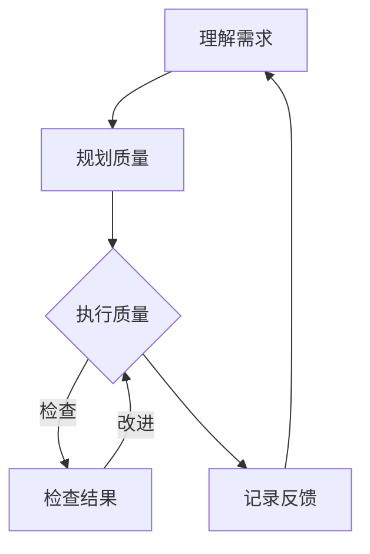

这个流程图简要地描述了质量管理的基本循环：从理解顾客需求开始，规划质量，执行质量，检查结果，然后基于反馈进行改进和记录。这种持续循环是质量管理成功的关键。

---

在理解质量管理的定义和历史演变，以及其重要原则之后，我们将进一步探讨质量管理体系的基本构成和ISO 9001：2015标准的具体要求。

---

## 1.2 质量管理体系

### ISO 9001：2015标准解读

ISO 9001：2015是国际标准化组织（ISO）发布的质量管理体系的国际标准，是全球范围内应用最为广泛的质量管理体系标准。它提供了系统化的方法来确保组织的活动和最终产品或服务满足客户和适用的法律法规要求。以下是对ISO 9001：2015标准的核心解读：

1. **标准框架**：ISO 9001：2015采用PDCA（计划-执行-检查-行动）循环的框架，强调持续改进。标准包括十大核心要求和四个基础部分：范围、引用标准、定义和附录。

2. **领导职责**：最高管理者应确立质量方针和质量目标，确保资源的有效利用，并促进全员参与质量管理。

3. **客户关系管理**：组织应与客户建立并保持有效的关系，确保了解和满足客户需求，并寻求客户反馈。

4. **资源管理**：组织应确保所需资源的获取，包括人员、基础设施、工作环境、信息等。

5. **产品实现**：从项目规划、设计、采购、生产到交付，组织应确保每个阶段都符合客户要求和适用的标准。

6. **测量、分析和改进**：组织应定期进行内部审核，管理评审，并持续改进质量管理体系。

### 质量管理体系的基本构成

质量管理体系的基本构成包括以下几个关键部分：

1. **文件**：组织应制定和保持所需的文件，包括质量手册、程序文件、作业指导书等。

2. **过程**：组织应识别并管理相关的过程，确保过程相互关联并能够有效运行。

3. **资源**：包括人员、基础设施、工作环境、信息等，确保这些资源能够支持质量管理体系的实施。

4. **监控和测量**：组织应通过监控、测量、分析和评价过程和产品来确保符合质量要求。

5. **改进**：通过数据分析、内部审核和管理评审等手段，识别改进机会并实施持续改进。

### 质量管理体系在实际应用中的挑战

尽管ISO 9001：2015标准提供了详细的框架和要求，但在实际应用中，许多组织仍面临以下挑战：

1. **资源不足**：特别是中小型企业，可能缺乏足够的资源来实施全面的质量管理体系。

2. **文化变革**：质量管理体系的实施往往需要改变传统的管理文化和工作方式，这可能会遇到员工的抗拒。

3. **缺乏持续改进的文化**：持续改进是一个长期的过程，需要组织的持续关注和投入。

4. **法规和标准更新**：随着法律法规的不断变化，组织需要不断更新其质量管理体系，以保持合规。

### Mermaid 流程图：质量管理体系

以下是一个简化的Mermaid流程图，展示了质量管理体系的基本构成和流程：

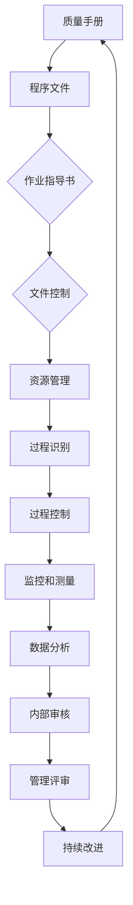

这个流程图展示了从文件控制到资源管理、过程识别与控制、监控与测量、数据分析、内部审核、管理评审和持续改进的整个质量管理体系。

---

在理解ISO 9001：2015标准和质量管理体系的基本构成后，我们将探讨质量与效率的关系以及质量对组织文化的影响，从而更全面地理解质量管理的价值和意义。

---

## 1.3 质量管理与组织绩效

### 质量与效率的关系

在组织管理中，质量和效率常常被看作是两个相互矛盾的目标。然而，事实上，高质量的产品和服务往往能够带来更高的效率，反之亦然。以下是一些关键点，说明了质量与效率之间的紧密关系：

1. **预防胜于补救**：高质量的产品和服务往往能够减少因缺陷和故障导致的停工、返工和投诉，从而提高生产效率。
2. **减少浪费**：高质量意味着较少的资源浪费，包括原材料、时间和人力资源。高效的流程管理能够减少非增值活动的数量，提高整体效率。
3. **持续改进**：质量管理强调持续改进，通过不断优化流程和产品设计，组织能够保持高效的生产和运营。
4. **员工参与**：高质量的文化鼓励员工参与改进活动，提高员工的工作满意度和生产效率。

### 质量对组织文化的影响

质量不仅影响组织的绩效，也深刻地塑造着组织的文化。以下是一些质量对组织文化的影响：

1. **信任与尊重**：高质量的产品和服务能够赢得客户的信任，增强客户对组织的尊重，从而建立长期的合作关系。
2. **员工动力**：当员工感受到自己的工作对组织成功至关重要时，他们更有动力追求卓越，提高工作效率。
3. **学习和成长**：质量管理强调持续学习和改进，这有助于组织文化的成长和创新。
4. **社会责任**：高质量的产品和服务体现了组织对社会和环境的责任，有助于提升组织的声誉和品牌价值。

### 实际案例：苹果公司的质量文化

苹果公司以其卓越的质量和产品设计而闻名。以下是一个实际案例，展示了苹果如何通过质量文化提升其组织绩效：

- **严格的质量控制**：苹果在其供应链和制造过程中实施了严格的质量控制，确保每一款产品都达到最高标准。
- **持续改进**：苹果不断通过研究和开发来改进其产品，如iPhone的摄像头技术和iPad的触摸屏技术，这些改进不仅提升了产品质量，也提高了用户体验。
- **员工培训**：苹果为员工提供了全面的培训，使他们能够理解和执行高质量的标准，这有助于提高整体工作质量和效率。

通过这些措施，苹果不仅建立了强大的品牌声誉，还保持了高效的生产和运营。

### Mermaid 流程图：质量与效率的关系

以下是一个简化的Mermaid流程图，展示了质量与效率之间的关系：

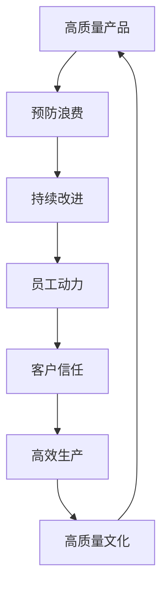

这个流程图概述了高质量产品如何通过减少浪费、持续改进、提高员工动力、赢得客户信任来提升生产效率，并最终塑造高质量的文化。

---

在理解了质量与效率的关系以及质量对组织文化的影响后，我们将进一步探讨质量管理的理论基础，包括经典质量理论和现代质量理论，以及它们在实际中的应用。

---

## 2.1 质量管理理论的发展

质量管理的发展历程可以追溯到20世纪初，当时主要是以统计质量控制为主要手段。随着时间的推移，质量管理理论不断演进，从经典质量理论到现代质量理论，都为质量管理实践提供了重要的指导。以下将详细介绍这些理论的发展及其应用。

### 经典质量理论

经典质量理论主要强调通过统计方法来控制和改进生产过程。以下是几位经典质量理论的代表人物及其贡献：

1. **休哈特（W. A. Shewhart）**：休哈特是统计质量控制的奠基人，他提出了控制图这一重要工具，用于监控生产过程，确保过程处于控制状态。他的工作为后续的质量管理理论奠定了基础。

2. **戴明（W. Edwards Deming）**：戴明是日本质量管理的先驱，他提出了著名的14点管理法则，强调持续改进、领导力、员工参与和系统思维。他的理念对日本的质量管理革命产生了深远影响。

3. **朱兰（Joseph M. Juran）**：朱兰提出了“质量计划、质量控制和质量改进”的模型，强调质量是一个系统的过程，需要从设计、生产到服务的各个环节进行综合考虑。

经典质量理论的核心思想是，通过控制和改进生产过程来确保最终产品的质量。这些理论奠定了质量管理的统计基础，并在20世纪中期的制造业中得到了广泛应用。

### 现代质量理论

现代质量理论在经典质量理论的基础上，进一步扩展了质量管理的方法和工具。以下是几种重要的现代质量理论：

1. **六西格玛（Six Sigma）**：六西格玛是一种系统化的方法，旨在通过减少缺陷来提高产品和服务的质量。六西格玛DMAIC（定义、测量、分析、改进、控制）流程是一个关键工具，用于识别和解决生产过程中的问题。

2. **全面质量管理（Total Quality Management, TQM）**：TQM是一种综合性的管理理念，强调全员参与、过程方法、持续改进和以顾客为中心。TQM的目标是创建一个全员关注质量的组织文化，通过团队合作来提高产品和服务质量。

3. **精益生产（Lean Production）**：精益生产起源于丰田生产系统，强调减少浪费、优化流程和提高效率。精益生产的工具包括5S、看板系统、持续改进等。

现代质量理论不仅继承了经典质量理论的统计分析方法，还融入了更多的系统思维和过程管理方法，使得质量管理更加全面和有效。

### 经典质量理论与现代质量理论的对比

以下是一个简化的对比表，展示了经典质量理论与现代质量理论的主要区别：

| 特征 | 经典质量理论 | 现代质量理论 |
| ---- | ---- | ---- |
| 核心工具 | 控制图、统计质量控制 | DMAIC、六西格玛、TQM、精益生产 |
| 关注点 | 过程控制 | 过程改进、全面质量 |
| 方法论 | 统计方法 | 系统化方法、全员参与 |
| 目标 | 确保产品质量 | 提高产品和服务的整体质量 |

### 实际应用：丰田汽车的质量管理

丰田汽车以其卓越的质量管理而闻名，其成功得益于经典质量理论和现代质量理论的综合应用：

- **经典质量理论的应用**：丰田采用统计质量控制方法，通过控制图和过程控制来确保生产过程的一致性和可靠性。
- **现代质量理论的应用**：丰田全面引入了六西格玛和精益生产方法，通过持续改进和全员参与来提高产品和服务的质量。

通过结合经典和现代质量理论，丰田建立了强大的质量管理体系，确保了其产品的可靠性和客户满意度。

### Mermaid 流程图：质量管理理论发展

以下是一个简化的Mermaid流程图，展示了质量管理理论的发展及其应用：

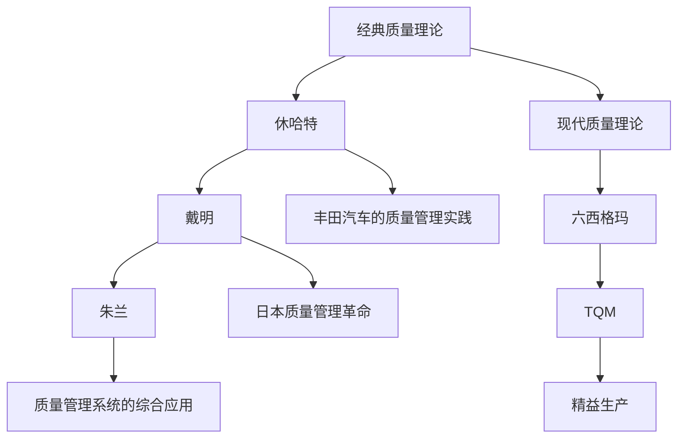

这个流程图概述了质量管理理论的发展历程，以及这些理论在实际应用中的效果。

---

在理解了质量管理理论的发展后，我们将探讨数据分析在质量管理中的应用，包括统计工具、过程能力与过程改进，以及国际标准组织的作用和质量管理体系认证。

---

## 2.2 数据分析与质量管理

在质量管理中，数据分析是一个关键环节，它不仅帮助组织理解当前的质量状况，还能够指导持续改进活动。以下将详细介绍数据分析在质量管理中的应用，包括统计工具、过程能力与过程改进，以及国际标准组织的作用和质量管理体系认证。

### 统计工具与质量管理

统计工具在质量管理中扮演着至关重要的角色，它们帮助组织识别过程变异、评估质量绩效，并制定有效的改进措施。以下是一些常用的统计工具：

1. **控制图**：控制图是一种用于监控过程变异的图表，通过展示过程数据，帮助组织判断过程是否在控制状态。控制图包括X-bar控制图（用于监控平均值）和R控制图（用于监控极差）。

2. **散点图**：散点图用于展示两个变量之间的关系，帮助组织识别过程中的相关性和趋势。

3. **因果图（鱼骨图）**：因果图是一种直观的图表，用于分析问题产生的根本原因，帮助组织制定针对性的改进措施。

4. **直方图**：直方图用于展示数据分布情况，帮助组织了解过程的能力和潜在的改进机会。

5. **流程图**：流程图是一种用于描述过程步骤和流程关系的图表，帮助组织识别和优化流程中的瓶颈和浪费。

通过这些统计工具，组织能够系统地收集和分析数据，从而更好地理解质量状况，并制定改进策略。

### 过程能力与过程改进

过程能力是指一个过程在一定条件下，能够稳定地生产符合规格要求的产品或服务的潜能。过程能力分析是质量管理中的一个重要环节，它帮助组织评估当前过程的能力，并识别改进机会。

1. **过程能力指数（Cp）**：过程能力指数是一个用于评估过程能力的重要指标，计算公式为：

   $$
   Cp = \frac{\text{公差范围}}{\text{六倍标准偏差}}
   $$

   过程能力指数越高，表示过程越稳定，能够更好地满足规格要求。

2. **六倍标准偏差**：六倍标准偏差是基于正态分布的一个概念，用于估算过程中的自然波动。计算公式为：

   $$
   \text{六倍标准偏差} = 6 \times \sqrt{\frac{(\text{公差范围})^2}{\text{总计数}}}
   $$

   通过计算六倍标准偏差，组织可以评估过程变异的大小，并确定是否需要进行改进。

3. **过程改进**：基于过程能力分析的结果，组织可以采取一系列措施来改进过程。常见的改进方法包括：

   - **减少过程变异**：通过优化操作流程、减少设备故障和人员失误，降低过程的自然波动。
   - **调整过程参数**：通过调整机器设置、原材料配方等，使过程更加稳定和可控。
   - **引入新的技术**：采用更先进的设备和技术，提高生产效率和产品质量。

### 国际标准组织的作用

国际标准组织（ISO）在质量管理领域发挥着重要作用，其制定的一系列国际标准为全球质量管理提供了统一的框架和指导。以下是一些重要的ISO标准：

1. **ISO 9001**：ISO 9001是质量管理体系的国际标准，它规定了组织在设计和实施质量管理体系时所需满足的要求。ISO 9001标准不仅帮助组织提升质量管理水平，还提高了客户和供应商的信任度。

2. **ISO 19011**：ISO 19011是关于质量和（或）环境管理体系审核的标准，提供了审核计划和执行内部或外部审核的指南。该标准有助于组织建立有效的内部和外部审核机制，确保质量管理体系的持续改进。

3. **ISO 10012**：ISO 10012是关于测量设备的计量确认的标准，它规定了组织在测量设备的管理和使用过程中所需遵循的要求。通过实施ISO 10012，组织可以确保测量设备的一致性和准确性。

### 质量管理体系认证

质量管理体系认证是一种第三方评估和认证过程，它确认组织实施的质量管理体系符合国际标准的要求。以下是一些常见的问题和解答：

1. **什么是质量管理体系认证？**
   质量管理体系认证是由独立的第三方认证机构对组织实施的质量管理体系进行全面评估，确认其符合特定国际标准（如ISO 9001）的过程。

2. **为什么需要进行质量管理体系认证？**
   质量管理体系认证有助于提高组织的信誉度和市场竞争力，增强客户和供应商的信任，以及确保组织的质量管理体系持续符合国际标准。

3. **认证过程包括哪些步骤？**
   认证过程通常包括预评估、正式评估、认证决定和认证维护等步骤。预评估帮助组织识别和改进管理体系中的不足，正式评估则是对组织进行全面的审查，认证决定是第三方认证机构根据评估结果做出的认证决定，认证维护则包括定期审核和监督。

4. **认证证书的有效期是多少？**
   质量管理体系认证证书通常有效期为三年，期间组织需要定期进行监督审核和再认证审核，以确保其质量管理体系的持续有效性。

### Mermaid 流程图：数据分析与质量管理

以下是一个简化的Mermaid流程图，展示了数据分析在质量管理中的应用：

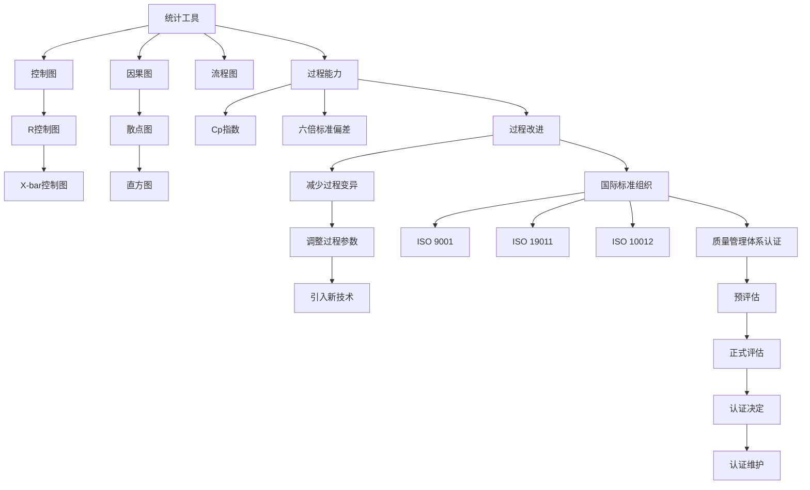

这个流程图概述了数据分析在质量管理中的应用，从统计工具到过程能力分析，再到国际标准和认证过程，展示了质量管理中数据驱动的方法。

---

通过数据分析在质量管理中的应用，组织能够更加精确地评估质量状况，并采取有效的措施进行改进。接下来，我们将探讨标准化与质量控制，以及国际标准组织的作用和质量管理体系认证。

---

## 2.3 标准化与质量控制

标准化和质量控制是质量管理中不可或缺的两个方面，它们共同确保产品和服务的质量达到既定标准，提高组织的效率和竞争力。以下将详细探讨标准化与质量控制的关系、国际标准组织的作用、以及质量管理体系认证。

### 标准化与质量控制的关系

标准化是指在一致的框架下，通过制定和执行标准，确保产品和服务的质量、安全性和性能的一致性。质量控制则是通过监控、评估和改进，确保产品和服务的实际质量符合标准。两者之间的关系可以概括为：

1. **标准化提供了质量控制的依据**：标准规定了产品或服务的特定要求，组织可以基于这些标准制定质量控制计划，确保产品和服务满足客户和法律法规的要求。
2. **质量控制确保了标准化实施的效果**：质量控制通过监控和评估，确保组织在实际生产和服务过程中严格遵守标准，及时发现和纠正偏差，确保产品和服务的质量。

### 国际标准组织的作用

国际标准组织（ISO）是制定和管理国际标准的全球性机构。ISO在质量管理领域的贡献主要体现在以下几个方面：

1. **制定质量管理标准**：ISO发布了ISO 9001、ISO 19011等一系列质量管理标准，为全球组织提供了一套系统化的质量管理框架，帮助组织建立和维持有效的质量管理体系。
2. **促进国际标准化合作**：ISO通过与其他国家和地区的标准化组织合作，确保质量管理标准的全球一致性和互操作性，促进了国际贸易和质量管理的国际交流。
3. **提供培训和认证**：ISO提供各种培训和认证服务，帮助组织了解和实施国际标准，提高其质量管理水平和竞争力。

### 质量管理体系认证

质量管理体系认证是一种第三方评估和认证过程，由独立的认证机构对组织实施的质量管理体系进行全面审查，确认其符合特定的国际标准（如ISO 9001）。以下是一些关键概念和步骤：

1. **认证过程**：认证过程通常包括预评估、正式评估、认证决定和认证维护等步骤。
   - **预评估**：认证机构对组织进行初步评估，识别质量管理体系的优势和不足，提供改进建议。
   - **正式评估**：认证机构对组织进行全面评估，包括现场审核、文件审查和过程验证。
   - **认证决定**：根据评估结果，认证机构做出是否授予认证的决定，并向组织颁发认证证书。
   - **认证维护**：认证机构定期对获得认证的组织进行监督审核，确保其持续符合认证标准。

2. **认证的优势**：
   - **提高信誉度**：认证证书是组织质量管理水平和能力的权威证明，有助于提高客户和供应商的信任。
   - **增强市场竞争力**：符合国际标准的质量管理体系有助于组织在激烈的市场竞争中脱颖而出。
   - **持续改进**：认证过程促使组织不断优化和改进质量管理体系，提高产品和服务的质量。

3. **认证的挑战**：
   - **资源投入**：实施和维持质量管理体系需要投入大量的人力和物力资源。
   - **文化变革**：质量管理体系实施可能需要改变组织的传统工作方式和思维模式，这可能会遇到员工的抵触。
   - **法规和标准更新**：随着法律法规的不断变化，组织需要不断更新其质量管理体系，以保持合规。

### 质量管理体系认证的步骤

以下是一个简化的质量管理体系认证步骤流程图：

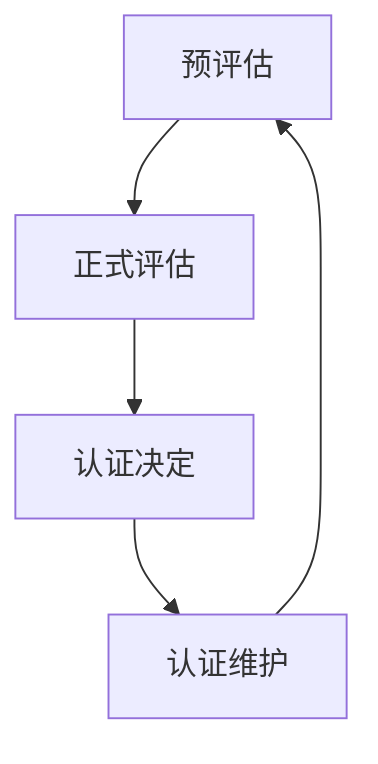

这个流程图展示了认证过程中的主要步骤和循环，强调了持续改进的重要性。

---

标准化与质量控制是质量管理的重要组成部分，通过国际标准组织的指导和质量管理体系认证，组织能够确保其产品和服务的质量达到国际标准，提高市场竞争力。接下来，我们将探讨质量管理的实践应用，包括质量管理工具与方法、项目质量管理、以及产品生命周期质量管理。

---

## 3.1 质量管理工具与方法

在质量管理的实际应用中，多种工具和方法被广泛应用，以帮助组织有效地监控、评估和改进质量。以下将详细探讨几种常用的质量管理工具与方法，包括过程流程图、因果图、以及质量功能展开（QFD）。

### 过程流程图

过程流程图是一种用于描述过程步骤和流程关系的图表，它可以帮助组织理解整个生产或服务流程，识别流程中的关键环节和瓶颈。通过绘制过程流程图，组织可以：

1. **识别流程步骤**：详细列出每个流程步骤，确保所有相关步骤都被包含在内。
2. **明确流程关系**：展示各步骤之间的相互关系，帮助组织理解流程的整体结构和逻辑。
3. **分析流程瓶颈**：识别流程中的瓶颈和浪费，为后续优化提供依据。
4. **优化流程**：基于流程流程图的分析结果，对流程进行改进，提高效率和效果。

以下是一个简化的过程流程图示例，用于描述一个产品制造流程：

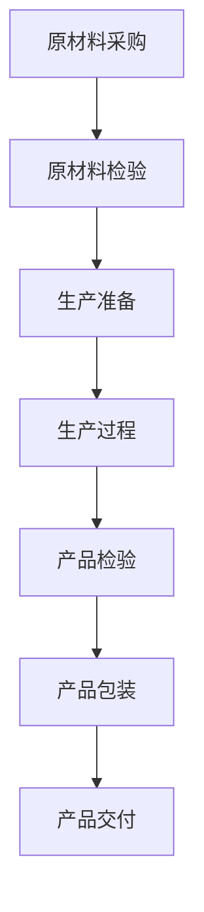

这个过程流程图展示了从原材料采购到产品交付的整个生产流程，每个步骤都清晰明了，有助于组织优化流程，提高生产效率。

### 因果图

因果图，也称为鱼骨图，是一种用于分析问题产生原因的图表。它通过将问题分解成不同的因素，帮助组织识别和解决问题。因果图通常包括以下几个部分：

1. **问题陈述**：明确问题描述，位于图的最上方。
2. **主要因素**：将问题分解成主要因素，通常用大骨状线条表示。
3. **次级因素**：每个主要因素下再分解成次级因素，用小骨状线条表示。
4. **数据和分析**：在每个因素或次级因素旁附上相关数据和分析结果，以支持问题的识别和解决。

以下是一个简化的因果图示例，用于分析一个产品质量问题的原因：

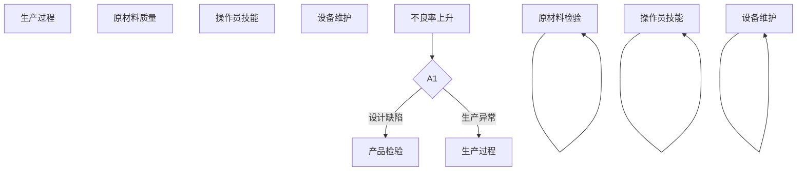

这个因果图帮助组织识别了产品质量问题的可能原因，并提供了进一步分析的基础。

### 质量功能展开（QFD）

质量功能展开（Quality Function Deployment，简称QFD）是一种用于产品设计和开发过程中的质量规划工具，它通过将客户需求转化为具体的产品和工艺特性，确保设计和生产过程满足客户需求。QFD的核心步骤包括：

1. **客户需求分析**：收集和分析客户需求，确定关键需求和次要需求。
2. **技术需求分析**：将客户需求转化为具体的技术要求和规格。
3. **功能配置**：将技术需求配置到产品或工艺的不同功能模块上。
4. **质量目标设定**：为每个功能模块设定质量目标，确保设计满足客户需求。
5. **设计验证**：通过模拟和测试验证设计是否满足质量目标。

以下是一个简化的QFD示例，用于设计一个汽车发动机：

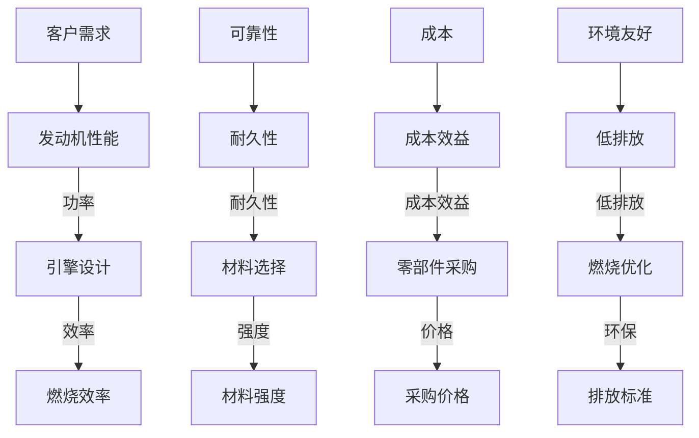

这个QFD示例展示了如何将客户需求转化为具体的技术要求和设计目标，确保发动机设计满足客户需求。

通过这些质量管理工具与方法，组织可以系统地分析和解决质量问题，确保产品和服务的质量符合客户期望，提高市场竞争力和客户满意度。

---

在探讨了质量管理的实践应用工具与方法后，我们将进一步深入探讨项目质量管理，包括项目质量管理计划、项目质量监控与评估，以及项目质量管理在实际项目中的应用。

---

## 3.2 项目质量管理

项目质量管理是确保项目交付的产品或服务满足既定质量要求的关键环节。有效的项目质量管理不仅能够提高项目成功率，还能提升组织声誉和客户满意度。以下将详细探讨项目质量管理的关键内容，包括项目质量管理计划、项目质量监控与评估，以及项目质量管理在实际项目中的应用。

### 项目质量管理计划

项目质量管理计划是项目计划的一个重要组成部分，它详细描述了如何确保项目交付的产品或服务满足质量要求。以下是项目质量管理计划的核心内容：

1. **质量目标**：明确项目的质量目标，包括符合相关标准和规范、满足客户需求、确保项目交付的及时性和稳定性等。
2. **质量策略**：制定实现质量目标的策略，包括采用哪些质量管理方法、工具和技术，以及如何分配资源和职责。
3. **过程控制**：定义项目的关键过程，包括设计、开发、测试、交付等，并制定相应的控制措施，确保每个过程都按照预定的标准执行。
4. **质量保证活动**：规划质量保证活动，包括内部审计、质量审查、过程分析等，确保项目的质量管理体系得到有效实施。
5. **资源分配**：明确项目所需的人力、物资、技术和财务资源，确保资源能够满足质量管理的需求。
6. **风险与应对**：识别项目中可能出现的质量风险，并制定相应的应对措施，降低风险对项目质量的影响。

### 项目质量监控与评估

项目质量监控是确保项目质量目标得以实现的过程。以下是一些关键的质量监控与评估方法：

1. **质量审核**：定期对项目的质量管理过程和成果进行审核，确保项目符合预定的质量标准和要求。审核可以由内部人员或第三方机构进行。
2. **过程监控**：持续监控项目的关键过程，包括设计、开发、测试等，确保每个过程都按照计划进行，并及时发现和解决质量问题。
3. **质量评估**：通过定期评估项目交付的产品或服务，确保其质量满足既定标准。评估可以采用定量和定性的方法，如测量、测试、客户反馈等。
4. **缺陷管理**：建立缺陷报告和跟踪机制，确保每个缺陷都被及时识别、记录和解决，防止缺陷重复发生。
5. **持续改进**：基于质量监控和评估的结果，识别改进机会，并实施相应的改进措施，持续提升项目质量。

### 项目质量管理在实际项目中的应用

以下是一个实际项目中的应用案例，展示了项目质量管理如何在不同阶段发挥作用：

1. **项目启动阶段**：在项目启动时，项目团队通过客户需求调研，明确项目的质量目标和要求。同时，制定项目质量管理计划，确保项目能够按照预定质量标准进行。
2. **设计阶段**：在项目设计阶段，项目团队采用QFD方法，将客户需求转化为具体的设计目标，并通过过程流程图和因果图分析，识别潜在的质量风险和问题。
3. **开发与测试阶段**：在开发与测试阶段，项目团队采用统计工具和方法，如控制图和六西格玛DMAIC流程，监控开发过程和测试结果，确保开发的产品或服务满足质量要求。
4. **交付与验收阶段**：在项目交付和验收阶段，项目团队进行全面的测试和评估，确保交付的产品或服务符合质量标准，并及时处理客户反馈，解决质量问题。

### Mermaid 流程图：项目质量管理

以下是一个简化的Mermaid流程图，展示了项目质量管理的关键步骤和流程：

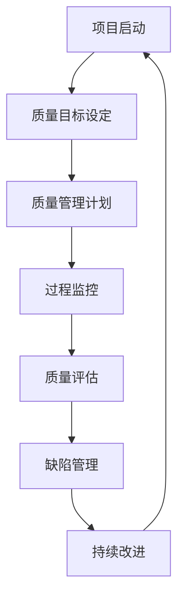

这个流程图概述了项目质量管理的核心步骤，从项目启动到持续改进，确保项目交付的产品或服务满足质量要求。

---

通过项目质量管理，组织能够确保项目交付的产品或服务达到既定的质量标准，提高项目成功率，增强客户满意度。接下来，我们将探讨产品生命周期质量管理，包括产品设计与开发中的质量管理、产品维护与升级中的质量管理，以及相关实践和案例分析。

---

## 3.3 产品生命周期质量管理

产品生命周期质量管理是确保产品从设计、开发、生产到维护和升级的各个阶段都符合质量要求的过程。有效的产品生命周期质量管理不仅能够提高产品质量，还能优化生产效率、降低成本，并提升客户满意度。以下将详细探讨产品生命周期质量管理的关键内容，包括产品设计与开发中的质量管理、产品维护与升级中的质量管理，以及相关实践和案例分析。

### 产品设计与开发中的质量管理

在设计阶段，质量管理的重要性尤为突出。以下是一些关键的质量管理实践：

1. **需求分析**：在产品设计初期，进行详细的需求分析，确保设计满足客户需求和业务目标。
2. **设计评审**：定期进行设计评审，评估设计方案的可行性和质量，及时发现和纠正潜在问题。
3. **风险管理**：识别和评估设计阶段的风险，制定相应的应对措施，降低设计缺陷和工程风险。
4. **质量功能展开（QFD）**：通过QFD方法，将客户需求转化为具体的设计目标和规格要求，确保设计符合客户期望。
5. **验证与验证**：在设计过程中，进行模拟和验证，确保设计符合预期的性能和质量要求。

### 产品维护与升级中的质量管理

在产品生命周期中，维护和升级是确保产品持续满足质量要求的重要环节。以下是一些关键的质量管理实践：

1. **预防性维护**：制定预防性维护计划，定期检查和保养产品，防止设备故障和质量问题。
2. **故障管理**：建立故障报告和跟踪机制，及时识别和处理故障，确保问题得到及时解决。
3. **升级与改进**：根据市场和客户反馈，定期对产品进行升级和改进，确保产品保持竞争力。
4. **客户支持**：提供高质量的客户支持服务，包括安装、培训和售后服务，确保客户满意。
5. **质量监控**：持续监控产品的运行状态和质量，识别潜在的质量问题，并采取相应的改进措施。

### 实践案例

以下是一个产品生命周期质量管理的实践案例：

**案例：某电子产品公司的质量管理实践**

1. **设计阶段**：公司在产品设计阶段采用QFD方法，将客户需求转化为具体的设计目标，并通过多次设计评审，确保设计方案符合质量要求。此外，公司还进行详细的工程分析，识别潜在的设计风险，并制定相应的控制措施。

2. **开发与测试阶段**：公司在开发过程中采用统计工具和方法，如控制图和六西格玛DMAIC流程，监控开发过程和测试结果，确保产品在开发阶段就满足质量标准。

3. **生产阶段**：在生产阶段，公司采用严格的质量控制流程，确保生产的产品符合设计规格。公司还建立预防性维护计划，定期对生产线进行检查和保养，防止设备故障。

4. **维护与升级阶段**：公司建立客户支持中心，提供全面的售后服务和安装培训。公司还根据客户反馈和市场趋势，定期对产品进行升级和改进，确保产品持续满足客户需求。

5. **质量改进**：公司通过持续的质量改进活动，如内部审核和过程优化，不断提升产品质量和效率。公司还积极参与行业质量标准制定，确保其质量管理实践与国际标准保持一致。

### Mermaid 流程图：产品生命周期质量管理

以下是一个简化的Mermaid流程图，展示了产品生命周期质量管理的关键步骤和流程：

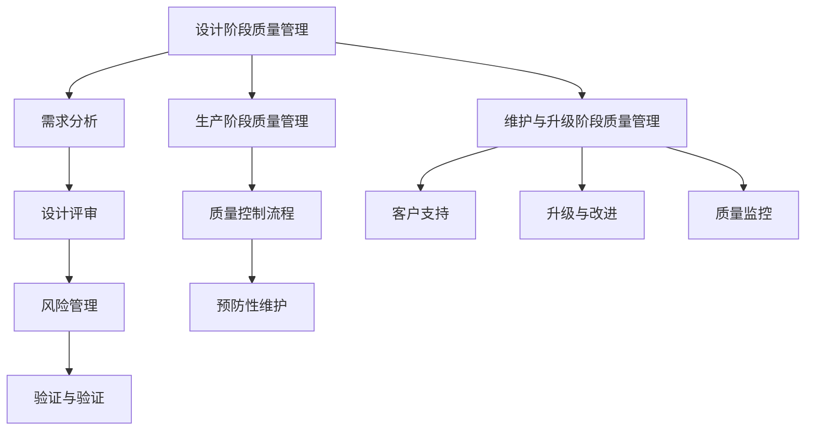

这个流程图概述了产品生命周期质量管理的各个阶段，从设计到维护与升级，确保产品在整个生命周期内都符合质量要求。

---

通过有效的产品生命周期质量管理，组织能够确保产品在各个阶段都达到高质量标准，提高客户满意度，并保持市场竞争力。接下来，我们将探讨质量改进与持续发展，包括持续改进的机制、员工参与，以及客户满意度与质量管理。

---

## 4.1 持续改进与持续发展

### 持续改进的机制

持续改进是质量管理的重要组成部分，它通过不断优化流程和提升产品质量，帮助组织实现长期发展。以下将详细探讨持续改进的机制，包括步骤和方法。

#### 持续改进的步骤

持续改进通常遵循以下五个步骤：

1. **定义当前过程**：明确当前的工作流程和操作步骤，确保所有相关人员和部门都了解并认同。
2. **测量当前过程性能**：收集和测量当前过程的性能指标，如时间、成本、质量等，以评估过程的效率和质量。
3. **分析过程性能**：通过数据分析，识别过程中的瓶颈和问题，确定改进的机会。
4. **实施改进措施**：制定并实施具体的改进措施，解决分析过程中发现的问题。
5. **监控改进效果**：持续监控改进措施的效果，确保问题得到有效解决，并记录改进结果。

#### 持续改进的方法

持续改进的方法包括但不限于以下几种：

1. **六西格玛DMAIC流程**：六西格玛DMAIC（定义、测量、分析、改进、控制）流程是一种系统化的改进方法，通过五个步骤逐步优化过程。
2. **PDCA循环**：PDCA（计划、执行、检查、行动）循环是一种基本的持续改进方法，它通过不断循环和迭代，实现质量的持续提升。
3. **精益生产**：精益生产是一种以减少浪费、优化流程为目标的质量管理方法，通过持续改进，实现高效的资源利用和卓越的质量。

### 员工参与

员工参与是持续改进成功的关键因素之一。以下是一些促进员工参与的策略：

1. **培训与教育**：为员工提供培训和教育，提高他们的技能和意识，使他们能够更好地参与持续改进活动。
2. **建立反馈机制**：建立有效的反馈机制，鼓励员工提出改进建议，并对这些建议进行评估和实施。
3. **团队协作**：通过跨部门团队合作，促进不同岗位的员工相互协作，共同解决问题。
4. **激励机制**：设立激励机制，奖励在持续改进中表现突出的员工，提高他们的积极性和创造力。

### 实际案例

以下是一个实际案例，展示了员工参与如何推动持续改进：

**案例：某制造公司的员工参与持续改进**

1. **培训与教育**：公司定期举办培训课程，帮助员工掌握六西格玛DMAIC流程和相关工具，提高他们的分析和解决问题的能力。
2. **建立反馈机制**：公司设立了一个在线反馈平台，员工可以随时提交改进建议，相关部门会定期审核并评估这些建议。
3. **团队协作**：公司鼓励跨部门团队协作，每个团队负责特定的改进项目，共同解决问题。
4. **激励机制**：公司对在持续改进中表现突出的员工进行表彰和奖励，激发他们的工作热情和创造力。

通过这些措施，公司成功推动了持续改进，提高了生产效率和产品质量。

### Mermaid 流程图：持续改进的步骤和方法

以下是一个简化的Mermaid流程图，展示了持续改进的步骤和方法：

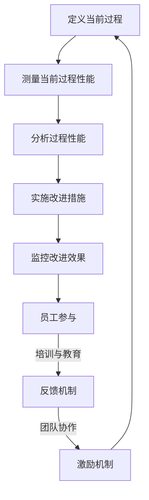

这个流程图概述了持续改进的步骤和方法，以及如何促进员工参与，确保持续改进活动的成功实施。

---

通过持续改进的机制和员工参与，组织能够不断优化流程和提升产品质量，实现持续发展。接下来，我们将探讨客户满意度与质量管理，包括客户关系管理、客户满意度测量与改进。

---

## 4.2 客户满意度与质量

### 客户关系管理

客户关系管理（Customer Relationship Management，CRM）是确保客户需求得到满足并建立长期合作关系的关键过程。有效的CRM策略能够提高客户满意度、增强客户忠诚度，并促进业务增长。以下是一些关键的CRM实践：

1. **客户数据管理**：建立和维护全面的客户数据档案，包括客户的基本信息、购买历史、偏好和反馈等，为制定个性化的营销策略提供数据支持。
2. **客户互动**：通过多种渠道（如电话、邮件、社交媒体等）与客户进行有效沟通，及时响应客户需求和问题，建立良好的客户关系。
3. **定制化服务**：根据客户需求和偏好提供定制化的产品和服务，满足客户的个性化需求，提高客户满意度。
4. **客户体验优化**：持续改进客户体验，包括简化购买流程、提供优质的售后服务等，确保客户在整个购买周期中都能感受到良好的服务。

### 客户满意度测量与改进

测量客户满意度是质量管理的重要环节，它帮助组织了解客户对产品和服务的满意程度，并识别改进机会。以下是一些关键步骤和方法：

1. **满意度调查**：定期进行客户满意度调查，收集客户对产品和服务质量的反馈。调查可以采用在线问卷、电话访谈、面对面访谈等方式。
2. **关键绩效指标（KPI）**：制定客户满意度相关的KPI，如净推荐值（NPS）、客户满意度评分（CSAT）、客户保留率等，量化客户满意度水平。
3. **数据分析**：对收集到的客户反馈进行数据分析，识别客户满意度的主要驱动因素和关键问题。
4. **改进措施**：基于数据分析结果，制定和实施针对性的改进措施，如优化产品功能、改进服务流程、提升客户支持等。
5. **跟踪与评估**：持续跟踪改进措施的效果，评估客户满意度的提升情况，并根据评估结果进行进一步优化。

### 实际案例

以下是一个实际案例，展示了如何通过客户关系管理和满意度测量来提升质量管理：

**案例：某电子商务公司的客户满意度提升策略**

1. **客户数据管理**：公司建立了完善的客户数据库，包括客户的购买历史、偏好和反馈等，为制定个性化的营销策略提供了数据支持。
2. **客户互动**：公司通过多种渠道与客户保持紧密互动，包括邮件营销、社交媒体互动和在线客服，及时响应客户的需求和问题，提高客户满意度。
3. **满意度调查**：公司定期进行客户满意度调查，通过在线问卷和电话访谈收集客户反馈。调查结果显示，客户对公司的物流速度和售后服务较为满意，但在产品多样性方面有所欠缺。
4. **改进措施**：基于调查结果，公司采取了一系列改进措施，包括增加产品种类、改进物流配送速度、提升售后服务水平等。此外，公司还建立了客户反馈机制，鼓励客户提供改进建议。
5. **跟踪与评估**：公司持续跟踪改进措施的效果，通过定期满意度调查和客户反馈，评估客户满意度的提升情况。结果显示，客户满意度显著提高，客户忠诚度和推荐率也随之提升。

### Mermaid 流程图：客户满意度测量与改进

以下是一个简化的Mermaid流程图，展示了客户满意度测量与改进的过程：

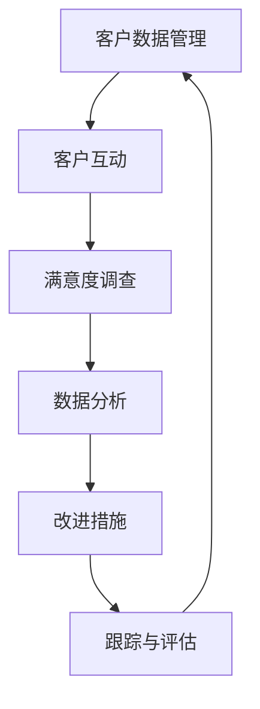

这个流程图概述了客户满意度测量与改进的关键步骤，从客户数据管理到满意度调查、数据分析、改进措施和跟踪评估，确保客户满意度不断提升。

---

通过客户关系管理和满意度测量，组织能够更好地理解客户需求，持续改进质量，提高客户满意度和忠诚度。接下来，我们将探讨质量管理的未来趋势，包括信息技术与质量管理、质量管理在数字经济时代的新挑战。

---

## 4.3 质量管理的未来趋势

随着信息技术的迅猛发展，质量管理正面临着前所未有的机遇和挑战。以下将探讨质量管理的未来趋势，包括信息技术与质量管理、以及质量管理在数字经济时代的新挑战。

### 信息技术与质量管理

1. **大数据分析**：大数据技术能够收集、存储和分析大量质量数据，帮助组织更准确地识别质量问题和改进机会。通过大数据分析，组织可以深入了解产品的质量趋势、客户需求和内部流程的效率。

2. **人工智能与机器学习**：人工智能和机器学习算法可以自动识别质量缺陷，预测潜在问题，并优化质量改进策略。例如，使用机器学习模型可以预测设备故障，从而进行预防性维护，降低质量风险。

3. **物联网（IoT）**：物联网技术将设备、系统和人员连接在一起，实现实时监控和智能管理。通过物联网，组织可以实时监控生产过程，及时发现问题并采取相应措施，提高生产质量和效率。

4. **区块链技术**：区块链技术提供了一种透明、安全和不可篡改的数据存储方式，可以用于记录和验证质量相关数据，确保数据真实性和完整性。

### 质量管理在数字经济时代的新挑战

1. **数字化转型的需求**：在数字经济时代，组织需要加快数字化转型，应用新技术来提升质量管理效率。数字化转型要求组织在技术、流程和文化等方面进行全面的改革。

2. **全球化供应链的挑战**：全球化供应链带来了更复杂的质量管理问题，包括跨境贸易、文化差异和供应链中断等。组织需要建立更加灵活和适应性的质量管理框架，以应对这些挑战。

3. **快速变化的市场需求**：数字经济时代，市场需求变化迅速，产品生命周期缩短。组织需要具备快速响应市场变化的能力，持续改进产品质量，以满足不断变化的需求。

4. **数据安全和隐私保护**：随着数据在质量管理中的重要性日益增加，数据安全和隐私保护成为重要挑战。组织需要确保数据安全，防止数据泄露和滥用，同时遵守相关法律法规。

### 实际案例

以下是一个实际案例，展示了信息技术在质量管理中的应用：

**案例：某汽车制造公司的质量管理数字化转型**

1. **大数据分析**：公司利用大数据技术对生产数据进行分析，识别生产过程中的质量问题和改进机会。通过分析故障数据，公司发现了生产线中的瓶颈和潜在故障点，并采取了相应的改进措施。

2. **人工智能与机器学习**：公司部署了人工智能和机器学习算法，用于预测设备故障和维护需求。这些算法通过对历史数据的分析，预测设备故障概率，帮助公司进行预防性维护，降低设备故障率。

3. **物联网（IoT）**：公司通过物联网技术实现了生产过程的实时监控和智能管理。物联网传感器实时采集生产数据，通过数据分析和预测，公司能够及时发现和解决质量问题，提高生产效率和产品质量。

4. **区块链技术**：公司使用区块链技术记录和验证质量数据，确保数据的真实性和完整性。区块链技术提供了透明的数据记录和不可篡改的记录，增强了客户对产品质量的信任。

### Mermaid 流程图：信息技术与质量管理

以下是一个简化的Mermaid流程图，展示了信息技术在质量管理中的应用：

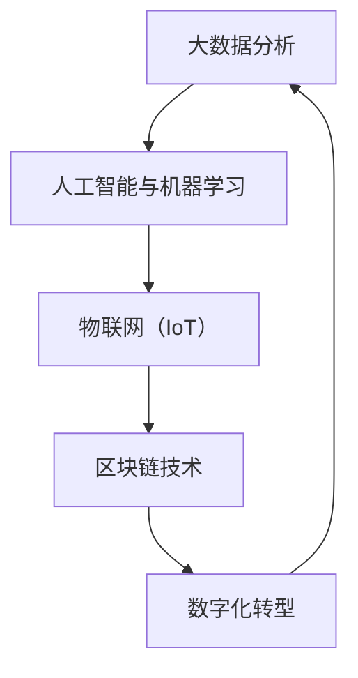

这个流程图概述了信息技术在质量管理中的应用，从大数据分析、人工智能与机器学习、物联网到区块链技术，展示了如何利用先进技术提升质量管理效率。

---

在信息技术和数字经济时代，质量管理面临着新的机遇和挑战。通过数字化转型和应用先进技术，组织可以提升质量管理水平，确保产品质量，增强市场竞争力。接下来，我们将通过成功的质量管理案例，探讨实际操作和经验总结。

---

## 5.1 成功质量管理案例

成功质量管理案例展示了不同行业和组织如何通过有效的质量管理实践，实现了卓越的绩效和客户满意度。以下将介绍几个成功的质量管理案例，探讨其实际操作和经验总结。

### 案例一：丰田汽车的质量管理实践

丰田汽车以其卓越的质量管理而闻名，其成功的关键在于以下几个方面：

1. **持续改进文化**：丰田建立了以持续改进为核心的企业文化，鼓励员工不断提出改进建议，并通过质量圈活动和六西格玛DMAIC流程，实施这些改进措施。

2. **严格的质量控制**：丰田在生产过程中实施了严格的质量控制，包括供应商审核、过程监控和最终产品检验。通过控制图和其他统计工具，丰田能够及时发现和纠正质量问题。

3. **员工培训与参与**：丰田为员工提供全面的质量管理培训，提高他们的技能和意识。员工在质量控制中发挥着重要作用，他们积极参与质量改进项目，提出了许多有效的改进建议。

**经验总结**：

- **企业文化**：建立以持续改进为核心的企业文化，鼓励员工积极参与质量改进。
- **严格质量控制**：实施严格的质量控制流程，确保产品和服务质量。
- **员工培训**：为员工提供质量管理和技能培训，提高整体质量水平。

### 案例二：强生医疗的质量管理实践

强生医疗作为全球领先的医疗设备制造商，其质量管理实践为行业树立了标杆。以下是其成功的关键因素：

1. **全面质量管理（TQM）**：强生医疗采用全面质量管理方法，通过全员参与、过程方法和持续改进，确保产品和服务质量。

2. **供应链管理**：强生医疗建立了严格的供应链管理体系，对供应商进行筛选和评估，确保供应链上的产品和服务质量。

3. **客户关系管理**：强生医疗与客户保持紧密联系，定期收集客户反馈，并根据反馈进行产品改进和服务优化。

**经验总结**：

- **全面质量管理**：通过全员参与和过程方法，确保产品质量和服务。
- **供应链管理**：建立严格的供应链管理体系，确保供应链上的质量。
- **客户关系管理**：通过客户反馈，持续改进产品和服务。

### 案例三：麦当劳的质量管理实践

麦当劳作为全球知名的餐饮连锁品牌，其质量管理实践为餐饮行业提供了宝贵的经验：

1. **标准化操作**：麦当劳建立了详细的操作流程和标准化程序，确保在全球范围内的所有餐厅都能提供一致的高质量服务。

2. **持续改进**：麦当劳定期进行质量评估和改进，通过数据分析和管理评审，识别和解决质量问题。

3. **员工参与**：麦当劳鼓励员工参与质量改进活动，通过内部反馈和培训，提高员工的质量意识和技能。

**经验总结**：

- **标准化操作**：通过标准化操作，确保产品和服务质量的一致性。
- **持续改进**：定期评估和改进，持续提升质量水平。
- **员工参与**：鼓励员工参与质量改进，提高整体质量意识。

### 案例四：苹果公司的质量管理实践

苹果公司以其卓越的产品设计和高质量的产品而闻名，其质量管理实践为科技公司树立了标杆：

1. **严格的质量标准**：苹果制定了严格的质量标准，确保每一款产品都符合最高质量要求。

2. **供应商筛选和管理**：苹果对供应商进行严格的筛选和管理，确保供应链上的产品质量。

3. **用户反馈和持续改进**：苹果通过用户反馈和市场研究，持续改进产品设计和质量。

**经验总结**：

- **严格的质量标准**：制定高标准的质量要求，确保产品质量。
- **供应商管理**：对供应商进行严格筛选和管理，确保供应链上的质量。
- **用户反馈**：通过用户反馈和市场研究，持续改进产品和服务。

---

通过以上成功质量管理案例，我们可以看到，有效的质量管理不仅需要建立严格的质量标准和流程，还需要全员参与和持续改进。这些案例为我们提供了宝贵的经验和启示，有助于我们在实际工作中提升质量管理水平。

---

## 5.2 质量管理失败案例

尽管成功的质量管理案例为我们提供了宝贵的经验和启示，但在实际操作中，质量管理也可能面临失败。以下将探讨几个质量管理失败案例，分析其失败原因，并提出质量改进的方向和方法。

### 案例一：某汽车制造公司的质量问题

某汽车制造公司因质量问题频繁而备受争议，其主要失败原因包括：

**失败原因**：

1. **质量标准不足**：公司没有建立严格的质量标准，导致生产过程中质量问题频发。
2. **流程管理混乱**：公司缺乏有效的流程管理，导致生产过程缺乏控制，质量问题难以及时发现和解决。
3. **员工培训不足**：员工缺乏质量意识和技能，无法有效参与质量管理活动。

**质量改进的方向和方法**：

1. **建立严格的质量标准**：制定详细的质量标准和流程，确保生产过程中的每个环节都有明确的规范和要求。
2. **加强流程管理**：引入流程管理工具和方法，如过程流程图和因果图，确保生产过程受控，质量问题能够及时发现和解决。
3. **员工培训**：为员工提供质量管理和技能培训，提高员工的质量意识和技能水平，使他们能够积极参与质量管理活动。

### 案例二：某电子产品公司的供应链问题

某电子产品公司因供应链问题导致产品质量不稳定，其主要失败原因包括：

**失败原因**：

1. **供应商筛选不严**：公司对供应商的筛选和管理不够严格，导致供应链上的产品质量参差不齐。
2. **供应链管理缺失**：公司缺乏有效的供应链管理体系，无法确保供应链上的产品质量。
3. **质量控制不足**：公司对供应链上的产品缺乏有效的质量控制，导致质量问题无法及时发现和解决。

**质量改进的方向和方法**：

1. **严格供应商筛选**：建立严格的供应商筛选和管理机制，确保供应商符合公司的质量标准和要求。
2. **建立供应链管理体系**：引入供应链管理工具和方法，如供应商评估和监控，确保供应链上的产品质量。
3. **加强质量控制**：在供应链的各个环节引入质量控制措施，如检验、测试和验证，确保供应链上的产品符合质量要求。

### 案例三：某餐饮连锁品牌的服务质量问题

某餐饮连锁品牌因服务质量问题频繁受到客户投诉，其主要失败原因包括：

**失败原因**：

1. **标准化不足**：公司缺乏完善的标准化操作流程，导致不同门店的服务质量参差不齐。
2. **员工培训不足**：员工缺乏服务意识和技能，无法提供一致的服务体验。
3. **客户反馈机制不完善**：公司缺乏有效的客户反馈机制，无法及时发现和解决服务问题。

**质量改进的方向和方法**：

1. **完善标准化操作流程**：建立详细的标准化操作流程，确保所有门店的服务质量一致。
2. **员工培训**：为员工提供全面的服务培训和技能提升，提高员工的服务意识和技能水平。
3. **建立客户反馈机制**：引入客户反馈机制，如在线调查和客户满意度评分，及时收集客户反馈，并根据反馈进行改进。

### 案例四：某制药公司的质量问题

某制药公司因质量问题导致产品召回，其主要失败原因包括：

**失败原因**：

1. **质量控制不足**：公司对生产过程中的质量控制不够严格，导致质量问题无法及时发现和解决。
2. **风险管理缺失**：公司缺乏有效的风险管理机制，无法应对潜在的质量风险。
3. **法规遵守不足**：公司对相关法规和标准了解不足，导致产品质量不符合法规要求。

**质量改进的方向和方法**：

1. **加强质量控制**：引入严格的质量控制措施，如过程监控、检验和测试，确保生产过程符合质量要求。
2. **建立风险管理机制**：引入风险管理工具和方法，如风险评估和监控，识别和应对潜在的质量风险。
3. **加强法规遵守**：加强对相关法规和标准的理解和遵守，确保产品质量符合法规要求。

---

通过分析以上质量管理失败案例，我们可以看到，质量管理的失败往往源于质量标准不足、流程管理混乱、员工培训不足、供应商管理不严、质量控制缺失等问题。为了改进质量管理，组织需要从建立严格的质量标准、加强流程管理、提升员工培训、引入先进的质量管理工具和方法等方面入手，确保质量管理的有效性。接下来，我们将探讨质量管理的法律与伦理，包括质量法规与标准、产品质量责任与消费者权益保护。

---

## 6.1 质量管理的法律与伦理

质量管理不仅涉及技术和管理层面，还受到法律和伦理的约束。以下将详细探讨质量管理的法律与伦理问题，包括质量法规与标准、产品质量责任与消费者权益保护。

### 质量法规与标准

质量法规和标准为组织提供了质量管理的基本框架和指导，确保产品和服务质量符合法律要求。以下是一些关键的质量法规与标准：

1. **国际标准**：ISO 9001是国际公认的质量管理体系标准，适用于各种类型和规模的组织。ISO 9001要求组织建立和实施有效的质量管理体系，确保产品和服务质量持续满足客户和法律要求。

2. **美国标准**：美国国家标准协会（ANSI）制定了多种质量管理体系标准，如ASQ Z1.4和AS9100等，适用于不同行业和领域的组织。

3. **欧洲标准**：欧洲标准化组织（CEN）发布了多种质量管理标准，如EN 15090和EN ISO 13485等，适用于医疗设备和服务行业。

4. **中国标准**：中国国家标准（GB）和国际标准相似，如GB/T 19001和GB/T 24265等，为组织提供了质量管理的基本要求。

### 产品质量责任与消费者权益保护

产品质量责任和消费者权益保护是质量管理中至关重要的法律和伦理问题。以下是一些关键方面：

1. **产品质量责任**：组织应对其产品和服务承担法律责任，确保产品质量符合相关法规和标准。如果产品存在质量问题，组织需承担相应的赔偿责任。

2. **消费者权益保护**：消费者享有知情权、安全权、公平交易权等基本权益。组织应尊重和保护消费者的权益，提供真实、准确的产品信息，确保产品安全，并遵守公平交易原则。

3. **投诉处理**：组织应建立有效的投诉处理机制，及时响应和处理消费者的投诉，确保问题得到公正、合理的解决。

### 实际案例

以下是一个实际案例，展示了质量法规和消费者权益保护在质量管理中的重要性：

**案例：某电子产品的质量投诉事件**

1. **产品问题**：某电子产品公司在销售一款智能手机时，因电池质量问题导致手机频繁自动关机，给消费者带来了极大的不便。

2. **法律风险**：根据中国相关法律法规，产品质量不合格的产品将受到惩罚，公司可能面临行政处罚、赔偿消费者损失等法律风险。

3. **消费者投诉**：大量消费者对产品质量问题进行投诉，要求退货、换货或赔偿。

4. **公司应对**：公司迅速采取了以下措施：
   - **召回问题产品**：公司立即召回所有存在问题的手机，停止销售。
   - **赔偿消费者**：公司为受影响的消费者提供免费维修、更换电池或退货服务，并承诺改进产品质量，防止类似问题再次发生。
   - **加强质量检测**：公司加强产品质量检测和监控，确保新产品符合质量标准。

5. **结果**：通过及时、有效的应对措施，公司成功化解了法律风险，保护了消费者权益，并恢复了市场声誉。

### Mermaid 流程图：质量管理法律与伦理

以下是一个简化的Mermaid流程图，展示了质量管理法律与伦理的核心内容：

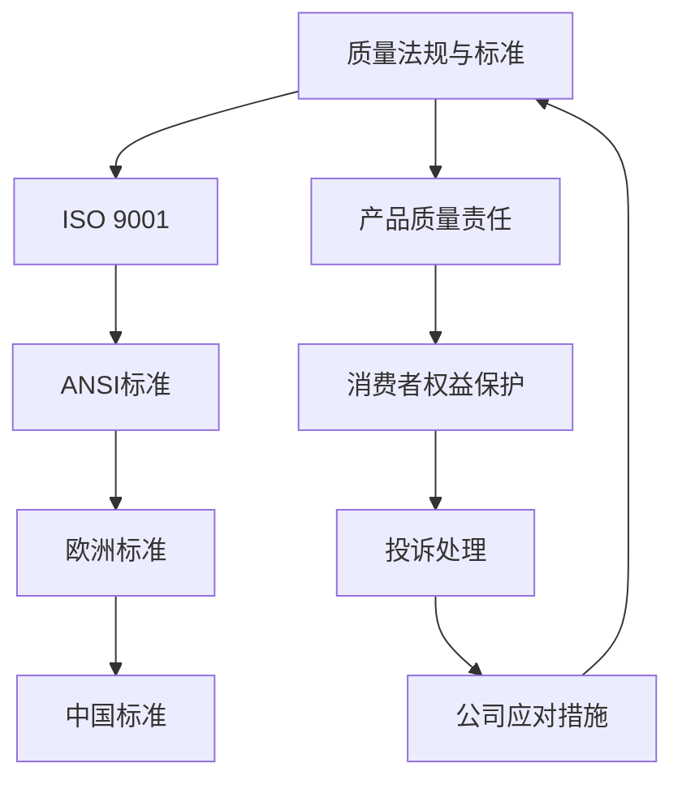

这个流程图概述了质量管理的法律与伦理问题，从质量法规与标准到产品质量责任和消费者权益保护，以及公司在面临投诉时的应对措施。

---

在了解质量管理的法律与伦理问题后，我们将探讨质量管理工具与技术，包括FMEA、FMEA、MSA等工具的介绍，以及质量成本管理的详细讲解。

---

## 7.1 质量管理工具与技术

在质量管理过程中，多种工具和技术被广泛应用，以帮助组织识别潜在风险、降低质量成本、持续改进质量。以下将详细介绍几种重要的质量管理工具与技术，包括故障模式及影响分析（FMEA）、测量系统分析（MSA），以及质量成本管理。

### 故障模式及影响分析（FMEA）

故障模式及影响分析（Failure Mode and Effects Analysis，简称FMEA）是一种系统化的方法，用于识别产品或生产过程中潜在的问题和风险，并评估其对质量和安全的影响。FMEA的基本步骤如下：

1. **团队组建**：组建一个由跨部门专家组成的团队，确保能够全面、客观地识别潜在故障模式。
2. **功能分析**：明确产品或过程的各个功能模块，确保每个功能都得到充分考虑。
3. **故障模式识别**：针对每个功能模块，识别可能发生的故障模式，如零件损坏、设计缺陷、操作失误等。
4. **影响评估**：评估每个故障模式对产品或过程的影响，包括对质量、安全、成本等方面的影响。
5. **严重度评估**：根据故障模式的影响程度，评估故障的严重度，通常采用1到10的评分系统。
6. **发生概率评估**：评估故障模式发生的概率，通常也采用1到10的评分系统。
7. **检测难度评估**：评估检测和识别故障模式的难度，同样采用1到10的评分系统。
8. **风险优先级评估**：根据严重度、发生概率和检测难度的评分，计算每个故障模式的风险优先级（RPN），RPN值越高，表示风险越大。
9. **改进措施**：针对高优先级的风险，制定和实施改进措施，降低风险。

### 测量系统分析（MSA）

测量系统分析（Measurement System Analysis，简称MSA）是一种用于评估测量系统准确性和精确性的方法。通过MSA，组织可以确定测量系统是否足够可靠，以支持质量决策。MSA的基本步骤如下：

1. **测量设备选择**：选择合适的测量设备，确保其满足测量要求。
2. **测量方法确定**：确定测量方法，包括测量步骤、测量位置和测量条件等。
3. **样本数据收集**：收集测量样本数据，确保样本具有代表性。
4. **测量重复性分析**：分析测量数据的重复性，评估测量系统的一致性和稳定性。
5. **测量变异性分析**：分析测量数据的变异性，评估测量系统的精度。
6. **测量能力评估**：通过计算过程能力指数（Cp），评估测量系统的能力，确保测量系统能够满足质量要求。
7. **改进措施**：根据MSA的结果，制定和实施改进措施，如优化测量方法、提高测量设备的精度等。

### 质量成本管理

质量成本管理是一种用于评估和管理质量成本的方法，它有助于组织识别质量成本的主要组成部分，优化资源配置，提高经济效益。质量成本管理的基本步骤如下：

1. **成本分类**：将质量成本分为预防成本、评估成本、失败成本和内部失败成本。
   - **预防成本**：用于预防质量问题发生的成本，如员工培训、质量规划等。
   - **评估成本**：用于评估产品质量的成本，如检验、测试等。
   - **失败成本**：由于质量问题导致的成本，如返工、返修、退货等。
   - **内部失败成本**：在内部识别并解决质量问题的成本，如内部故障分析、改进措施等。

2. **成本评估**：通过数据分析，评估各成本类别的具体数值，确定质量成本在整体成本结构中的比例。

3. **成本优化**：基于成本评估结果，识别质量成本的主要驱动因素，制定优化措施，如改进流程、优化资源配置等。

4. **成本监控**：建立质量成本监控体系，定期评估质量成本的变化趋势，确保成本控制在合理范围内。

### Mermaid 流程图：质量管理工具与技术

以下是一个简化的Mermaid流程图，展示了质量管理工具与技术的基本步骤和应用：

```mermaid
graph TD
A[FMEA]
A -->|故障模式识别| B[严重度评估]
B -->|发生概率评估| C[检测难度评估]
C -->|风险优先级评估| D[改进措施]

E[MSA]
E -->|测量设备选择| F[测量方法确定]
F -->|样本数据收集| G[测量重复性分析]
G -->|测量变异性分析| H[测量能力评估]
H -->|改进措施|

I[质量成本管理]
I -->|成本分类| J[成本评估]
J -->|成本优化| K[成本监控]
K --> A
```

这个流程图概述了FMEA、MSA和质量成本管理的基本步骤和应用，展示了如何通过这些工具和技术实现质量管理目标。

---

通过质量管理工具与技术的应用，组织能够更加系统地识别和解决质量问题，降低质量成本，提高产品质量和市场竞争力。接下来，我们将探讨质量管理技术，包括自动化与机器人技术的应用、大数据与人工智能在质量管理中的应用，以及相关实践案例。

---

## 7.2 质量管理技术

随着技术的不断进步，质量管理也在不断引入新的技术和方法，以提高效率和质量。以下将详细探讨几种重要的质量管理技术，包括自动化与机器人技术的应用、大数据与人工智能在质量管理中的应用，以及相关实践案例。

### 自动化与机器人技术的应用

自动化和机器人技术已经广泛应用于制造业和物流业，显著提高了生产效率和产品质量。以下是一些具体应用：

1. **自动化生产线**：自动化生产线通过机器人、传感器和计算机控制系统，实现了生产流程的自动化，减少了人为操作误差，提高了生产效率和产品质量。

2. **机器人检测**：机器人可以执行复杂的检测任务，如外观检测、尺寸检测、缺陷检测等。机器人检测具有高精度、高速度和全天候工作等优点，可以显著提高检测效率和质量。

3. **自动化仓储系统**：自动化仓储系统通过机器人进行货物搬运和存储，实现了仓储操作的自动化和智能化。这种系统能够快速响应订单，提高物流效率，降低运营成本。

### 大数据与人工智能在质量管理中的应用

大数据和人工智能技术为质量管理提供了新的手段和工具，以下是一些具体应用：

1. **大数据分析**：大数据技术可以处理和分析海量的质量数据，帮助组织识别潜在的质量问题和趋势。通过大数据分析，组织可以更加精准地进行质量预测和决策。

2. **机器学习**：机器学习算法可以自动识别数据中的模式和规律，用于质量预测、故障预测和优化。例如，通过机器学习算法，可以预测设备故障，提前进行维护，减少停机时间。

3. **人工智能辅助决策**：人工智能系统可以分析质量数据，生成优化建议，辅助管理层做出更明智的决策。例如，基于人工智能的质量预测系统可以推荐最优的生产计划和质量控制策略。

### 实践案例

以下是一些质量管理技术的实践案例：

**案例一：某汽车制造公司的自动化与机器人技术**

某汽车制造公司引入了自动化生产线和机器人检测系统，实现了以下效果：

1. **生产效率提升**：自动化生产线和机器人检测系统的应用，使得生产效率提高了30%，产品质量稳定性和一致性得到了显著提升。

2. **人力成本降低**：通过自动化生产，公司减少了大量人工操作，降低了人力成本，同时减少了操作误差，提高了产品质量。

3. **设备利用率提升**：自动化生产线和机器人检测系统能够实现24小时不间断生产，提高了设备的利用率。

**案例二：某电子产品公司的质量管理大数据分析**

某电子产品公司利用大数据分析和机器学习技术，实现了以下效果：

1. **质量预测**：通过大数据分析，公司能够提前预测设备故障，进行预防性维护，减少了设备停机时间，提高了生产效率。

2. **质量优化**：基于大数据分析的结果，公司优化了生产流程和质量控制策略，降低了产品缺陷率，提高了产品质量。

3. **客户满意度提升**：通过大数据分析，公司能够更好地了解客户需求，提供个性化产品和服务，客户满意度显著提升。

**案例三：某制药公司的质量管理人工智能系统**

某制药公司引入了人工智能辅助决策系统，实现了以下效果：

1. **生产优化**：人工智能系统能够分析生产数据，生成优化建议，帮助公司制定最优的生产计划和资源配置策略，提高了生产效率和产品质量。

2. **质量监控**：人工智能系统能够实时监控生产过程，识别潜在的质量问题，及时采取措施，确保产品质量符合法规要求。

3. **风险预警**：人工智能系统能够分析市场数据、法规变化和供应链信息，提前预警潜在的质量风险，帮助公司采取预防措施。

### Mermaid 流程图：质量管理技术

以下是一个简化的Mermaid流程图，展示了质量管理技术的基本应用：

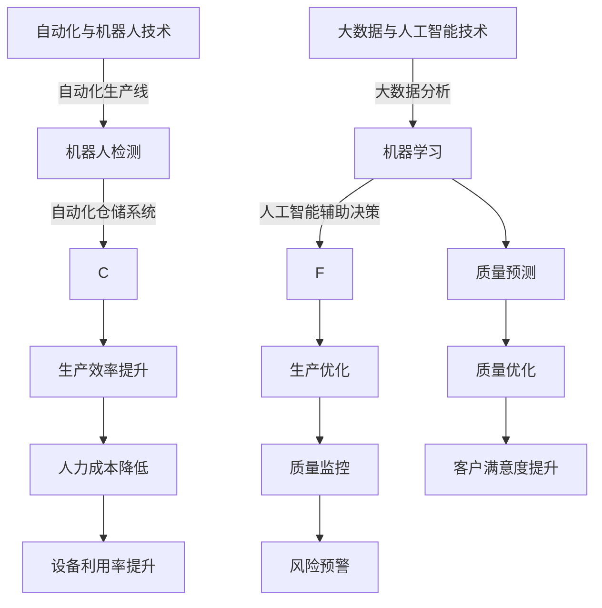

这个流程图概述了质量管理技术的基本应用，从自动化与机器人技术到大数据与人工智能技术，展示了如何通过这些技术提升质量管理水平。

---

通过自动化与机器人技术、大数据与人工智能技术的应用，组织能够显著提升生产效率、降低成本、提高产品质量，并增强市场竞争力。接下来，我们将提供质量管理资源与参考书籍，以供读者进一步学习和探索。

---

## 附录

### 附录 A：质量管理资源与参考书籍

为了帮助读者进一步了解和掌握质量管理知识，以下提供了一些质量管理相关的资源与参考书籍：

1. **质量管理经典著作**：
   - 《质量管理：系统方法》（Quality Management: Systems Approach），作者：N. K. Nanjundaswamy。
   - 《质量工具与技巧手册》（Handbook of Quality Tools and Techniques），作者：Jerry A. Porras、Lee Blessing。

2. **在线课程与资源**：
   - Coursera上的《质量管理基础》（Introduction to Quality Management）。
   - LinkedIn Learning上的《质量管理：六西格玛与ISO 9001》（Quality Management: Six Sigma and ISO 9001）。

3. **行业报告与白皮书**：
   - ASQ（美国质量学会）发布的各类行业报告和白皮书。
   - PwC（普华永道）的《全球质量管理报告》（Global State of Quality Report）。

### 附录 B：质量管理流程图与示例

以下提供了一个质量管理流程图示例，展示了质量管理的主要环节和流程：

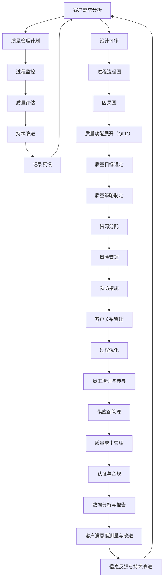

### 附录 C：质量管理相关术语

以下列出了一些质量管理中常用的专业术语及其解释：

- **质量管理**：通过计划、执行、检查和改进，确保产品和服务质量满足客户和适用标准的过程。
- **六西格玛**：一种系统化的方法，旨在通过减少缺陷来提高产品和服务的质量。
- **DMAIC**：六西格玛中的四个阶段，包括定义、测量、分析、改进和控制。
- **TQM**：全面质量管理，一种综合性的管理理念，强调全员参与和持续改进。
- **FMEA**：故障模式及影响分析，一种用于识别和评估潜在故障及其影响的工具。
- **MSA**：测量系统分析，一种用于评估测量系统准确性和精确性的方法。
- **质量成本**：用于预防和评估质量问题的成本，包括预防成本、评估成本、失败成本和内部失败成本。
- **过程能力指数（Cp）**：用于评估过程能力的指标，表示过程在公差范围内的波动情况。

### 附录 D：质量管理计算公式与表格

以下提供了一些质量管理中常用的计算公式与表格，包括过程能力指数（Cp）和质量成本分析表。

#### 过程能力指数（Cp）计算公式：

$$
Cp = \frac{\text{公差范围}}{\text{六倍标准偏差}}
$$

#### 质量成本分析表：

| 成本类别       | 描述                                             | 成本计算公式                           |
|----------------|------------------------------------------------|--------------------------------------|
| 预防成本       | 用于预防质量问题发生的成本                     | 预防成本 = 员工培训费用 + 质量规划费用 |
| 评估成本       | 用于评估产品质量的成本                         | 评估成本 = 检验费用 + 测试费用         |
| 失败成本       | 由于质量问题导致的成本，包括返工、返修、退货等 | 失败成本 = 返工费用 + 返修费用 + 退货费用 |
| 内部失败成本   | 在内部识别并解决质量问题的成本                 | 内部失败成本 = 内部故障分析费用 + 改进措施费用 |

### 附录 E：质量管理实践案例

以下提供了一些质量管理实践案例，包括案例分析报告和质量改进项目报告。

- **案例分析报告**：
  - 某汽车制造公司的质量管理实践与改进。
  - 某电子产品公司的质量管理体系建设与实施。

- **质量改进项目报告**：
  - 某制造公司的六西格玛DMAIC项目。
  - 某服务公司的全面质量管理（TQM）项目。

这些资源与参考书籍、流程图、术语解释、计算公式、表格和案例，为读者提供了一个全面的质量管理知识体系，有助于深入理解和实践质量管理。

---

通过附录中的资源与参考书籍，流程图、术语解释、计算公式、表格和案例，读者可以进一步深化对质量管理知识体系的理解，并能够将这些理论知识应用于实际工作中，提升组织质量管理的效率和效果。最后，让我们总结一下本文的核心观点。

---

## 总结

本文系统地探讨了质量管理的核心概念、理论基础、实践应用以及未来发展。通过深入分析质量管理的定义、原则、体系和标准，我们理解了质量管理体系的基本构成。在理论基础部分，我们回顾了经典质量理论和现代质量理论的发展，包括六西格玛和全面质量管理（TQM）。在实践应用部分，我们详细介绍了质量管理工具与方法、项目质量管理、产品生命周期质量管理，以及质量改进和持续发展的机制。通过成功与失败案例的分析，我们看到了质量管理在实际操作中的挑战和机遇。最后，我们探讨了质量管理的法律与伦理问题，以及自动化、大数据和人工智能技术在质量管理中的应用。

### 核心观点

- **质量管理是组织成功的关键**：有效的质量管理能够提高产品质量、降低成本、提升客户满意度，进而增强市场竞争力。
- **持续改进是质量管理的核心**：通过持续改进，组织能够不断优化流程和提升质量，实现长期发展。
- **信息技术与人工智能的融合**：大数据、人工智能和物联网等新兴技术正在重塑质量管理，为组织提供了新的手段和工具。

### 建议与展望

- **组织应建立全面的质量管理体系**：结合国际标准和最佳实践，建立和完善质量管理体系。
- **加强员工培训与参与**：通过培训和教育，提高员工的质量意识和技能，鼓励全员参与质量管理。
- **利用先进技术**：积极探索和利用大数据、人工智能等新技术，提升质量管理效率和效果。
- **关注法律与伦理**：在质量管理过程中，遵守相关法律法规和伦理规范，确保产品和服务质量符合法律和道德标准。

### 结语

质量管理是组织持续成功的关键因素。通过本文的探讨，我们希望能够为读者提供全面的质量管理知识体系，帮助读者在实际工作中应用这些知识，不断提升组织质量管理的水平。让我们共同努力，追求卓越，实现持续改进。

---

最后，感谢您的阅读。希望本文能够帮助您更好地理解和应用质量管理，为组织的成功贡献力量。如果您有任何问题或建议，欢迎在评论区留言，我们将持续为您解答和提供帮助。作者：AI天才研究院/AI Genius Institute & 禅与计算机程序设计艺术/Zen And The Art of Computer Programming。再次感谢您的关注和支持！

