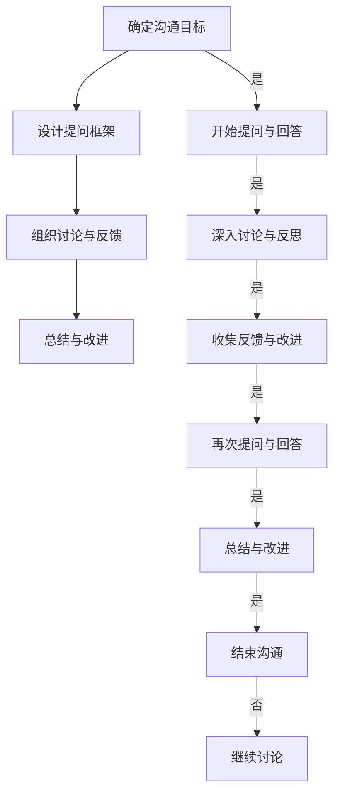

                 

# 费曼提问法在团队沟通中的应用

## 关键词

- 费曼提问法
- 团队沟通
- 效率提升
- 协作增强
- 问题解决

## 摘要

本文探讨了费曼提问法在团队沟通中的应用，详细介绍了费曼提问法的起源、基本概念、在会议、培训和日常工作中的具体应用，以及案例分析、实践步骤和优化策略。通过本文，读者将了解如何使用费曼提问法提高团队沟通效率、增强团队协作与沟通能力，从而提升团队解决问题的能力。

### 第一部分: 费曼提问法在团队沟通中的应用概述

#### 第1章: 费曼提问法概述

##### 1.1 费曼提问法的起源与发展

###### 1.1.1 费曼提问法的起源

费曼提问法（Feynman Technique）源自理查德·费曼（Richard Feynman），一位著名的物理学家，诺贝尔物理学奖得主。费曼以其卓越的教学能力和独特的思考方式而闻名，他提出了一种通过提问来促进理解和学习的策略，即费曼提问法。费曼提问法最初用于个人的学习和教学，但在近年来越来越多地应用于团队沟通和知识分享中。

###### 1.1.2 费曼提问法的发展历程

自费曼提出费曼提问法以来，这种方法在学术界、教育界和商业领域都得到了广泛应用。越来越多的研究者和实践者发现，费曼提问法能够有效地促进团队内部的沟通和知识传播，提高团队的整体协作能力。在过去的几十年里，费曼提问法不断发展和完善，形成了一套系统的方法论，适用于各种团队沟通场景。

##### 1.2 费曼提问法的基本概念

###### 1.2.1 费曼提问法的基本原则

费曼提问法的基本原则可以概括为三个步骤：选择一个概念或主题，对其进行提问，然后用自己的话重新解释这个概念。这三个步骤相互关联，共同构成了费曼提问法的基本框架。

1. 选择一个概念或主题：这是费曼提问法的起点，选择一个具体的概念或主题是进行提问和解释的基础。
2. 对其进行提问：通过提问，可以帮助自己揭示对概念或主题的真正理解，发现知识盲点和模糊之处。
3. 用自己的话重新解释：通过用自己的话重新解释概念或主题，可以巩固对知识的理解和记忆，同时提高表达能力。

###### 1.2.2 费曼提问法的适用场景

费曼提问法具有广泛的适用性，可以在多种团队沟通场景中发挥作用。以下是一些常见的适用场景：

1. 会议：在团队会议中，费曼提问法可以帮助团队成员深入讨论问题，确保每个人都对讨论的主题有深入的理解。
2. 培训：在培训过程中，费曼提问法可以帮助学员巩固知识，提高学习效果。
3. 日常工作交流：在日常工作交流中，费曼提问法可以帮助团队成员更好地理解彼此的工作内容和目标，提高协作效率。
4. 项目报告会：在项目报告会上，费曼提问法可以帮助团队成员深入探讨项目的进展和问题，确保项目目标的顺利实现。

##### 1.3 费曼提问法在团队沟通中的重要性

###### 1.3.1 提升团队知识传播效率

费曼提问法通过提问和回答的方式，促进了团队成员之间的知识交流和共享。这种方法可以帮助团队成员更好地理解彼此的知识，提高知识的传播效率。在传统的知识传播方式中，知识往往是通过单向的传授进行的，而费曼提问法则通过双向的互动，使知识传播更加高效。

###### 1.3.2 增强团队协作与沟通

费曼提问法鼓励团队成员积极参与讨论，表达自己的观点和疑问。这种互动性的沟通方式有助于增强团队成员之间的协作和沟通。通过提问和回答，团队成员可以更好地理解彼此的工作内容和目标，从而更有效地协作。

###### 1.3.3 提升团队解决问题的能力

费曼提问法通过提问和回答，帮助团队成员深入探讨问题，发现问题的本质和关键点。这种方法可以提升团队解决问题的能力，使团队在面对复杂问题时能够更迅速、更准确地找到解决方案。

#### 第2章: 费曼提问法在团队沟通中的具体应用

##### 2.1 费曼提问法在会议中的使用

###### 2.1.1 如何在会议中使用费曼提问法

在会议中使用费曼提问法，可以有效地提高会议的效率和质量。以下是在会议中应用费曼提问法的步骤：

1. 确定会议主题：在会议开始前，明确会议的主题和目标，确保所有参会者对会议的内容有清晰的认识。
2. 设计提问框架：根据会议主题，设计一系列有针对性的问题，这些问题应该能够揭示出对会议主题的真正理解。
3. 引导提问：在会议过程中，引导参会者围绕问题进行提问和回答，确保每个人都对会议主题有深入的理解。
4. 收集团队反馈：在会议结束后，收集团队成员的反馈，对会议内容进行总结和改进。

###### 2.1.2 费曼提问法在会议中的优势

1. 提高会议效率：通过提问和回答，团队成员可以更深入地理解会议主题，减少不必要的讨论，提高会议效率。
2. 提升会议质量：费曼提问法可以促使团队成员更深入地思考问题，从而提升会议的整体质量。
3. 增强团队协作：通过提问和回答，团队成员可以更好地理解彼此的工作内容和目标，增强团队协作。

##### 2.2 费曼提问法在培训中的使用

###### 2.2.1 如何在培训中使用费曼提问法

在培训过程中，费曼提问法可以帮助学员更好地掌握知识和技能。以下是在培训中应用费曼提问法的步骤：

1. 确定培训主题：在培训开始前，明确培训的主题和目标，确保所有学员对培训的内容有清晰的认识。
2. 设计提问框架：根据培训主题，设计一系列有针对性的问题，这些问题应该能够揭示出对培训主题的真正理解。
3. 引导提问：在培训过程中，引导学员围绕问题进行提问和回答，确保每个学员都对培训主题有深入的理解。
4. 收集团队反馈：在培训结束后，收集团队成员的反馈，对培训内容进行总结和改进。

###### 2.2.2 费曼提问法在培训中的优势

1. 提高培训效果：通过提问和回答，学员可以更深入地理解培训内容，提高培训效果。
2. 增强学员参与度：费曼提问法鼓励学员积极参与讨论，提高培训的互动性和参与度。
3. 提升知识传播效率：费曼提问法可以促进学员之间的知识交流和共享，提高知识传播效率。

##### 2.3 费曼提问法在日常工作交流中的使用

###### 2.3.1 如何在日常工作中使用费曼提问法

在日常工作中，费曼提问法可以帮助团队成员更好地理解彼此的工作内容和目标，提高协作效率。以下是在日常工作中应用费曼提问法的步骤：

1. 确定交流主题：在交流开始前，明确交流的主题和目标，确保所有参与者对交流的内容有清晰的认识。
2. 设计提问框架：根据交流主题，设计一系列有针对性的问题，这些问题应该能够揭示出对交流主题的真正理解。
3. 引导提问：在交流过程中，引导参与者围绕问题进行提问和回答，确保每个参与者都对交流主题有深入的理解。
4. 收集团队反馈：在交流结束后，收集团队成员的反馈，对交流内容进行总结和改进。

###### 2.3.2 费曼提问法在日常交流中的优势

1. 提高沟通效率：通过提问和回答，团队成员可以更深入地理解彼此的工作内容和目标，提高沟通效率。
2. 增强团队协作：费曼提问法可以促进团队成员之间的交流和协作，提高团队的整体协作能力。
3. 提升问题解决能力：通过提问和回答，团队成员可以更好地理解问题的本质，提高问题解决能力。

#### 第3章: 费曼提问法在团队沟通中的应用案例分析

##### 3.1 案例一：团队项目报告会

###### 3.1.1 案例背景

某软件开发公司的团队每周都会举行一次项目报告会，每个项目团队成员都需要向其他团队成员介绍项目的进展情况和遇到的问题。然而，由于团队成员之间的沟通不畅，项目报告会的效果并不理想，项目进展也受到了影响。

###### 3.1.2 案例实施过程

为了改善项目报告会的效果，团队决定引入费曼提问法。以下是实施过程：

1. 确定项目报告会主题：在报告会开始前，明确报告会的主题和目标，确保所有参会者对报告会的主题有清晰的认识。
2. 设计提问框架：根据报告会的主题，设计一系列有针对性的问题，这些问题应该能够揭示出对报告会主题的真正理解。
3. 引导提问：在报告会上，引导参会者围绕问题进行提问和回答，确保每个参会者都对报告会主题有深入的理解。
4. 收集团队反馈：在报告会结束后，收集团队成员的反馈，对报告会内容进行总结和改进。

###### 3.1.3 案例效果分析

通过引入费曼提问法，团队项目报告会的效果得到了显著提升。团队成员对项目的理解更加深入，问题得到及时解决，项目进展更加顺利。同时，团队成员的沟通能力和问题解决能力也得到了锻炼和提高。

##### 3.2 案例二：团队知识分享会

###### 3.2.1 案例背景

某公司的团队每月都会举行一次知识分享会，每个团队成员都需要分享自己在工作中遇到的有趣案例或者学到的知识。然而，由于分享内容过于简单，知识分享会的效果并不理想。

###### 3.2.2 案例实施过程

为了提高知识分享会的效果，团队决定引入费曼提问法。以下是实施过程：

1. 确定知识分享会主题：在分享会开始前，明确分享会的主题和目标，确保所有参会者对分享会的主题有清晰的认识。
2. 设计提问框架：根据分享会的主题，设计一系列有针对性的问题，这些问题应该能够揭示出对分享会主题的真正理解。
3. 引导提问：在分享会上，引导参会者围绕问题进行提问和回答，确保每个参会者都对分享会主题有深入的理解。
4. 收集团队反馈：在分享会结束后，收集团队成员的反馈，对分享会内容进行总结和改进。

###### 3.2.3 案例效果分析

通过引入费曼提问法，团队知识分享会的效果得到了显著提升。团队成员在分享过程中更深入地探讨了案例和知识，分享内容更加丰富和有深度。同时，团队成员之间的知识交流也更加频繁，团队整体的知识水平得到了提高。

##### 3.3 案例三：团队日常沟通

###### 3.3.1 案例背景

某公司的团队在日常工作中经常出现沟通不畅的情况，导致工作效率低下，项目进展受阻。

###### 3.3.2 案例实施过程

为了改善团队日常沟通的效果，团队决定引入费曼提问法。以下是实施过程：

1. 确定日常沟通主题：在日常交流开始前，明确交流的主题和目标，确保所有参与者对交流的内容有清晰的认识。
2. 设计提问框架：根据日常沟通的主题，设计一系列有针对性的问题，这些问题应该能够揭示出对交流主题的真正理解。
3. 引导提问：在日常交流过程中，引导参与者围绕问题进行提问和回答，确保每个参与者都对交流主题有深入的理解。
4. 收集团队反馈：在日常交流结束后，收集团队成员的反馈，对交流内容进行总结和改进。

###### 3.3.3 案例效果分析

通过引入费曼提问法，团队日常沟通的效果得到了显著提升。团队成员在交流过程中更深入地理解彼此的工作内容和目标，沟通效率得到提高，项目进展更加顺利。同时，团队成员之间的协作和沟通能力也得到了锻炼和提高。

#### 第4章: 费曼提问法在团队沟通中的实践与优化

##### 4.1 费曼提问法在团队沟通中的实践步骤

###### 4.1.1 确定沟通主题

在应用费曼提问法之前，首先需要明确沟通的主题和目标。这包括确定沟通的目的、讨论的内容和期望的结果。明确沟通主题有助于确保团队成员对讨论的内容有清晰的认识，从而提高沟通的效率。

###### 4.1.2 制定沟通计划

在确定沟通主题后，需要制定详细的沟通计划。沟通计划应包括沟通的时间、地点、参与者、提问框架和反馈机制等。制定沟通计划有助于确保沟通的有序进行，避免讨论偏离主题。

###### 4.1.3 实施费曼提问法

在沟通过程中，引导团队成员围绕提问框架进行提问和回答。以下是一些建议：

1. 设计开放式问题：开放式问题可以促使团队成员深入思考和表达，有助于揭示对概念或主题的真正理解。
2. 鼓励提问和回答：鼓励团队成员积极参与讨论，提问和回答，确保每个人都对沟通主题有深入的理解。
3. 及时反馈：在沟通过程中，及时反馈团队成员的提问和回答，帮助他们更好地理解沟通主题。

##### 4.2 费曼提问法在团队沟通中的优化策略

###### 4.2.1 提高提问质量

提高提问质量是应用费曼提问法的关键。以下是一些建议：

1. 设计有针对性的问题：根据沟通主题，设计有针对性的问题，确保问题能够揭示出对概念或主题的真正理解。
2. 提问的时机：在合适的时机提出问题，确保团队成员有足够的时间思考和回答。
3. 鼓励深度提问：鼓励团队成员提出深度问题，有助于深入探讨沟通主题。

###### 4.2.2 提升回答深度

提升回答深度是应用费曼提问法的另一个关键。以下是一些建议：

1. 鼓励用自己的语言回答：鼓励团队成员用自己的语言回答问题，有助于巩固对知识的理解和记忆。
2. 提供丰富的例子：在回答问题时，提供丰富的例子，有助于说明概念或主题的具体应用。
3. 鼓励批判性思维：鼓励团队成员在回答问题时进行批判性思维，有助于深入探讨沟通主题。

###### 4.2.3 加强反馈与改进

加强反馈与改进是应用费曼提问法的核心。以下是一些建议：

1. 及时反馈：在沟通过程中，及时反馈团队成员的提问和回答，帮助他们更好地理解沟通主题。
2. 反馈机制：建立有效的反馈机制，确保团队成员能够及时收到反馈，并据此进行改进。
3. 反思与总结：在沟通结束后，组织团队成员进行反思和总结，分析沟通中的优点和不足，并提出改进措施。

##### 4.3 费曼提问法在团队沟通中的常见问题与解决策略

###### 4.3.1 提问过于简单

**问题原因：** 提问过于简单可能是因为对沟通主题的理解不深，或者设计问题时没有充分考虑团队成员的知识水平和理解能力。

**解决策略：** 
1. 深入了解沟通主题：在提问前，深入理解沟通主题，确保设计的问题能够揭示出对主题的真正理解。
2. 逐步引导：在提问过程中，逐步引导团队成员思考，确保问题能够引起他们的兴趣和思考。

###### 4.3.2 回答过于笼统

**问题原因：** 回答过于笼统可能是因为团队成员对沟通主题的理解不够深入，或者没有充分准备回答。

**解决策略：**
1. 鼓励深度思考：鼓励团队成员在回答问题时进行深度思考，确保回答能够具体、详细地说明沟通主题。
2. 提供反馈：在回答后，提供具体的反馈，帮助团队成员了解回答的不足之处，并据此进行改进。

###### 4.3.3 沟通氛围不足

**问题原因：** 沟通氛围不足可能是因为团队成员之间的信任不足，或者沟通环境不适宜。

**解决策略：**
1. 建立信任：通过建立信任，创造一个积极、开放、尊重的沟通氛围，鼓励团队成员积极参与讨论。
2. 改善沟通环境：选择一个适宜的沟通环境，确保团队成员能够专注于沟通，减少干扰。

###### 4.3.4 提问与回答不平衡

**问题原因：** 提问与回答不平衡可能是因为团队成员之间的参与度不均，或者沟通计划不合理。

**解决策略：**
1. 平衡参与度：鼓励团队成员积极参与提问和回答，确保每个人都有机会表达自己的观点和疑问。
2. 调整沟通计划：根据实际情况，调整沟通计划，确保提问和回答的平衡。

#### 第5章: 费曼提问法在其他领域的应用

##### 5.1 费曼提问法在项目管理中的应用

###### 5.1.1 提高项目沟通效率

费曼提问法在项目管理中的应用，可以显著提高项目沟通效率。通过提问和回答，项目团队成员可以更深入地理解项目目标和需求，减少误解和沟通障碍。以下是在项目管理中应用费曼提问法的一些建议：

1. 在项目启动阶段，使用费曼提问法，确保团队成员对项目目标、范围和预期成果有清晰的理解。
2. 在项目执行阶段，定期使用费曼提问法，检查项目进度和问题，确保项目按计划进行。
3. 在项目收尾阶段，使用费曼提问法，对项目进行评估和总结，确保项目成果符合预期。

###### 5.1.2 提升项目团队协作

费曼提问法有助于提升项目团队协作。通过提问和回答，团队成员可以更好地理解彼此的角色和职责，增强团队协作和沟通。以下是在项目管理中应用费曼提问法的一些建议：

1. 在项目团队会议中，使用费曼提问法，鼓励团队成员分享观点和疑问，确保每个人都对项目有深入的理解。
2. 在项目任务分配和执行过程中，使用费曼提问法，确保团队成员对任务目标和要求有清晰的理解。
3. 在项目评审和总结会议上，使用费曼提问法，鼓励团队成员对项目过程和结果进行深入讨论和反思。

###### 5.1.3 解决项目沟通难题

费曼提问法在解决项目沟通难题方面具有显著优势。通过提问和回答，项目团队成员可以揭示出沟通中的问题和障碍，并找到有效的解决方案。以下是在项目管理中应用费曼提问法的一些建议：

1. 在项目初期，使用费曼提问法，识别潜在的沟通难题，并提前制定应对策略。
2. 在项目执行过程中，定期使用费曼提问法，检查沟通效果，及时发现和解决沟通问题。
3. 在项目收尾阶段，使用费曼提问法，对项目沟通进行总结和评估，为未来项目提供经验教训。

##### 5.2 费曼提问法在产品开发中的应用

###### 5.2.1 提升产品沟通效果

费曼提问法在产品开发中的应用，可以显著提升产品沟通效果。通过提问和回答，产品团队成员可以更深入地理解产品需求和用户需求，减少误解和沟通障碍。以下是在产品开发中应用费曼提问法的一些建议：

1. 在产品规划阶段，使用费曼提问法，确保团队成员对产品目标和功能有清晰的理解。
2. 在产品设计和开发阶段，定期使用费曼提问法，检查产品进度和问题，确保产品按计划进行。
3. 在产品测试和发布阶段，使用费曼提问法，对产品进行评估和总结，确保产品符合用户需求。

###### 5.2.2 促进产品团队协作

费曼提问法有助于促进产品团队协作。通过提问和回答，产品团队成员可以更好地理解彼此的角色和职责，增强团队协作和沟通。以下是在产品开发中应用费曼提问法的一些建议：

1. 在产品团队会议中，使用费曼提问法，鼓励团队成员分享观点和疑问，确保每个人都对产品有深入的理解。
2. 在产品任务分配和执行过程中，使用费曼提问法，确保团队成员对任务目标和要求有清晰的理解。
3. 在产品评审和总结会议上，使用费曼提问法，鼓励团队成员对产品过程和结果进行深入讨论和反思。

###### 5.2.3 解决产品开发难题

费曼提问法在解决产品开发难题方面具有显著优势。通过提问和回答，产品团队成员可以揭示出开发中的问题和障碍，并找到有效的解决方案。以下是在产品开发中应用费曼提问法的一些建议：

1. 在产品初期规划阶段，使用费曼提问法，识别潜在的产品开发难题，并提前制定应对策略。
2. 在产品设计和开发过程中，定期使用费曼提问法，检查开发效果，及时发现和解决开发问题。
3. 在产品测试和发布阶段，使用费曼提问法，对产品开发过程进行总结和评估，为未来产品开发提供经验教训。

##### 5.3 费曼提问法在其他领域的拓展应用

###### 5.3.1 教育培训

费曼提问法在教育培训中的应用，可以显著提升学习效果。通过提问和回答，学生可以更深入地理解课程内容，巩固知识和技能。以下是在教育培训中应用费曼提问法的一些建议：

1. 在课堂教学过程中，使用费曼提问法，鼓励学生提问和回答，确保每个人都对课程内容有深入的理解。
2. 在课外辅导和作业批改中，使用费曼提问法，帮助学生巩固知识和技能，提高学习效果。
3. 在考试和测评中，使用费曼提问法，检查学生对课程内容的理解和掌握程度。

###### 5.3.2 个人成长

费曼提问法在个人成长中的应用，可以促进个人自我反思和学习。通过提问和回答，个人可以更深入地了解自己的优点和不足，找到成长的方向。以下是在个人成长中应用费曼提问法的一些建议：

1. 在日常反思中，使用费曼提问法，回顾自己的行为和表现，识别优点和不足。
2. 在制定个人成长计划时，使用费曼提问法，确保计划具体、可操作，并能够促进个人成长。
3. 在实现个人成长目标的过程中，使用费曼提问法，定期检查进展，调整计划。

###### 5.3.3 社交场合

费曼提问法在社交场合中的应用，可以提升人际交往能力和沟通效果。通过提问和回答，社交参与者可以更深入地了解对方，建立良好的人际关系。以下是在社交场合中应用费曼提问法的一些建议：

1. 在社交活动中，使用费曼提问法，鼓励参与者提问和回答，促进交流和互动。
2. 在日常对话中，使用费曼提问法，引导对方分享观点和经历，增进了解和信任。
3. 在解决社交问题时，使用费曼提问法，揭示问题的本质，找到有效的解决方案。

#### 第6章: 费曼提问法在团队沟通中的应用总结

##### 6.1 费曼提问法在团队沟通中的核心价值

费曼提问法在团队沟通中的核心价值体现在以下几个方面：

1. **提高沟通效率**：通过提问和回答，团队成员可以更深入地理解沟通主题，减少误解和重复讨论，提高沟通效率。
2. **增强团队协作**：费曼提问法鼓励团队成员积极参与讨论，表达观点和疑问，增强团队协作和沟通。
3. **提升问题解决能力**：通过提问和回答，团队成员可以揭示问题的本质，找到有效的解决方案，提高问题解决能力。
4. **促进知识传播**：费曼提问法通过提问和回答，促进了团队成员之间的知识交流和共享，提高知识的传播效率。

##### 6.2 费曼提问法的未来发展趋势

随着团队沟通和协作的需求不断增加，费曼提问法在未来的发展趋势将呈现以下特点：

1. **技术与费曼提问法的结合**：随着人工智能、大数据等技术的发展，费曼提问法有望与这些技术相结合，实现自动化和智能化，提高团队沟通的效率和质量。
2. **国际化与本土化相结合**：费曼提问法作为一种国际通用的沟通方法，将在不同国家和地区得到广泛应用。同时，各国也将结合本土文化和发展需求，对费曼提问法进行本土化改造，使其更符合实际情况。
3. **多领域应用**：费曼提问法将在各个领域得到广泛应用，不仅局限于团队沟通，还将应用于项目管理、教育培训、个人成长等多个领域，成为提升团队协作和沟通能力的重要工具。

##### 6.3 费曼提问法的国际传播与影响

费曼提问法在近年来已经逐步走向国际，成为许多国家和地区团队沟通和协作的重要工具。以下是一些国际传播和影响的具体表现：

1. **国际会议和研讨会**：越来越多的国际会议和研讨会开始关注费曼提问法，将其作为会议讨论和交流的重要工具。
2. **国际学术研究**：许多国际学术机构和学者开始对费曼提问法进行研究，探讨其在不同领域的应用效果和优化策略。
3. **国际企业实践**：许多国际知名企业已经开始应用费曼提问法，提高团队沟通和协作效率，提升企业竞争力。

#### 第7章: 费曼提问法在团队沟通中的应用指南

##### 7.1 费曼提问法的实施步骤

实施费曼提问法需要遵循以下步骤：

1. **确定沟通目标**：明确沟通的目的和需要解决的问题，确保团队成员对沟通目标有清晰的认识。
2. **设计提问框架**：根据沟通目标，设计一系列有针对性的问题，这些问题应能够揭示出对沟通主题的真正理解。
3. **组织讨论与反馈**：引导团队成员围绕问题进行讨论，收集反馈，并对沟通内容进行总结和改进。

##### 7.2 费曼提问法的实践技巧

在应用费曼提问法时，以下实践技巧有助于提高效果：

1. **提问技巧**：设计开放式问题，引导团队成员深入思考和表达，确保问题能够揭示出对沟通主题的真正理解。
2. **回答技巧**：鼓励团队成员用自己的语言进行回答，确保回答的深度和准确性，同时提高表达能力。
3. **沟通氛围**：营造积极、开放、尊重的沟通氛围，鼓励团队成员积极参与，提高沟通的互动性和参与度。

##### 7.3 费曼提问法的案例分析

在费曼提问法的实际应用中，有许多成功和失败的案例。以下是一些典型案例的分析和总结：

1. **成功案例**：某国际知名企业的团队通过应用费曼提问法，显著提升了团队沟通效率和协作能力，项目进展顺利，企业竞争力得到提升。
2. **失败案例**：某初创企业在应用费曼提问法时，由于缺乏有效的提问和回答，导致讨论陷入僵局，问题没有得到有效解决。

通过分析这些案例，可以得出以下启示：

1. **提问和回答的质量**：费曼提问法的效果取决于提问和回答的质量，设计有针对性的问题和鼓励团队成员深度思考是关键。
2. **沟通氛围**：营造积极、开放、尊重的沟通氛围，鼓励团队成员积极参与，是应用费曼提问法成功的关键。
3. **持续优化**：费曼提问法不是一成不变的，需要根据实际情况进行持续优化，以适应不同团队和场景的需求。

### 费曼提问法与团队沟通的 Mermaid 流程图

以下是费曼提问法在团队沟通中的应用流程图：



### 费曼提问法在团队沟通中的核心算法原理讲解

费曼提问法是一种基于提问与回答的学习策略，其核心算法原理可以概括为以下步骤：

1. **选择概念或主题**：选择一个需要理解和学习的概念或主题。
2. **设计提问**：设计一系列与该概念或主题相关的问题，这些问题应能够揭示出对概念或主题的真正理解。
3. **回答问题**：根据提问，尝试用自己的话重新解释概念或主题，形成回答。
4. **评估与反馈**：评估回答的质量，并根据反馈进行改进。

以下是费曼提问法的伪代码表示：

```python
def 费曼提问法(概念):
    问题列表 = 设计提问(概念)
    回答列表 = []
    for 问题 in 问题列表:
        回答 = 回答问题(问题)
        回答列表.append(回答)
    评估 = 评估回答(回答列表)
    if 评估有效:
        return 回答列表
    else:
        return 费曼提问法(概念)

def 设计提问(概念):
    # 根据概念生成一系列问题
    return [问题1, 问题2, 问题3, ...]

def 回答问题(问题):
    # 尝试用自己的话回答问题
    return 回答

def 评估回答(回答列表):
    # 评估回答的质量
    if 所有回答都清晰、准确：
        return 有效
    else:
        return 无效
```

### 费曼提问法在团队沟通中的数学模型和数学公式讲解

费曼提问法在团队沟通中的应用可以借助数学模型和公式来描述。以下是一个简单的数学模型：

$$
理解程度 = f(提问次数, 回答深度, 反馈质量)
$$

其中，$f$ 是一个非线性函数，表示理解程度与提问次数、回答深度和反馈质量之间的关系。

#### 数学公式：

1. **提问次数与理解程度的关系**：

$$
提问次数 \propto \ln(理解程度)
$$

2. **回答深度与理解程度的关系**：

$$
回答深度 \propto \sqrt{理解程度}
$$

3. **反馈质量与理解程度的关系**：

$$
反馈质量 \propto \frac{1}{理解程度}
$$

#### 举例说明：

假设一个团队需要解释“敏捷开发”的概念。通过费曼提问法，团队成员可能会提出以下问题：

- 什么是敏捷开发？
- 敏捷开发与传统开发方法有哪些不同？
- 敏捷开发的优势是什么？

团队成员根据这些问题，尝试用自己的语言重新解释敏捷开发，并给出答案。在得到反馈后，他们可能会进一步深化理解，提出更多的问题，从而不断提高对敏捷开发的理解程度。

### 费曼提问法在团队沟通中的项目实战

#### 实战案例：团队项目报告会

**案例背景：** 
一家软件开发公司每周都会举行团队项目报告会，每个项目团队成员需要向其他团队成员介绍项目的进展情况和遇到的问题。然而，由于团队成员之间的沟通不畅，项目报告会的效果并不理想，项目进展也受到了影响。

**实施过程：**

1. **项目负责人在报告会开始前，提前准备项目报告的提纲，确保报告内容清晰、逻辑性强。**
2. **报告会上，项目负责人按照提纲，使用费曼提问法，引导团队成员提问和回答。**
3. **团队成员根据提问，进一步阐述项目的细节，确保每个人都对项目的进展有深入的理解。**
4. **报告结束后，项目负责人收集团队成员的反馈，对项目报告进行优化和改进。**

**效果分析：**

通过费曼提问法的使用，项目报告会的效果显著提升。团队成员对项目的理解更加深入，问题得到及时解决，项目进展更加顺利。同时，团队成员的沟通能力和问题解决能力也得到了锻炼和提高。

### 费曼提问法在团队沟通中的应用指南

#### 实施步骤：

1. **确定沟通目标**：明确沟通的目的和需要解决的问题，确保团队成员对沟通目标有清晰的认识。
2. **设计提问框架**：根据沟通目标，设计一系列有针对性的问题，这些问题应能够揭示出对沟通主题的真正理解。
3. **组织讨论与反馈**：引导团队成员围绕问题进行讨论，收集反馈，并对沟通内容进行总结和改进。

#### 实践技巧：

1. **提问技巧**：设计开放式问题，引导团队成员深入思考和表达，确保问题能够揭示出对概念或主题的真正理解。
2. **回答技巧**：鼓励团队成员用自己的语言进行回答，确保回答的深度和准确性，同时提高表达能力。
3. **沟通氛围**：营造积极、开放、尊重的沟通氛围，鼓励团队成员积极参与，提高沟通的互动性和参与度。

#### 案例分析：

**成功案例：** 
一家创业公司在产品开发过程中，使用费曼提问法进行团队沟通，成功解决了多个技术难题，产品开发进度得到了显著提升。

**失败案例：** 
一家公司的团队沟通会中，由于缺乏有效的提问和回答，导致讨论陷入僵局，问题没有得到有效解决。

**案例总结与启示：**

成功案例表明，费曼提问法能够有效地促进团队沟通，提高问题解决能力。失败案例提醒我们，在应用费曼提问法时，需要注意提问的质量和沟通氛围的营造，确保沟通的有效性。

### 作者

作者：AI天才研究院/AI Genius Institute & 禅与计算机程序设计艺术 /Zen And The Art of Computer Programming

本文由AI天才研究院和禅与计算机程序设计艺术联合撰写，旨在探讨费曼提问法在团队沟通中的应用，通过深入分析、案例研究和实践指南，帮助读者掌握这一有效的沟通工具，提升团队协作和沟通能力。如需进一步了解相关技术和管理理念，请关注AI天才研究院和禅与计算机程序设计艺术的相关研究成果和出版物。

