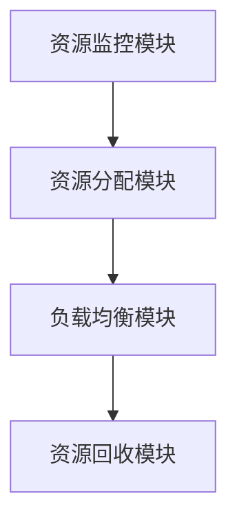

                 

# 资源管理 原理与代码实例讲解

> 关键词：资源管理、资源分配、缓存管理、数学模型、项目实战

> 摘要：本文旨在深入探讨资源管理的基本概念、架构设计、核心算法原理以及数学模型。通过具体的项目实战案例，本文将详细讲解如何在实际开发中应用这些原理，并分析其实现效果。文章最后还将对资源管理技术的发展趋势进行展望，总结本书的核心内容。

## 目录大纲设计

### 第一部分: 核心概念与联系

- **1.1 资源管理的基本概念**
  - **1.1.1 资源的定义与分类**
  - **1.1.2 资源管理的目标与挑战**
  - **1.1.3 资源管理的基本原理**

- **1.2 资源管理架构概述**
  - **1.2.1 资源管理系统的组成部分**
  - **1.2.2 资源管理架构的 Mermaid 流程图**
  - **1.2.3 资源管理架构的设计原则**

### 第二部分: 核心算法原理讲解

- **2.1 资源分配算法**
  - **2.1.1 最优分配算法**
  - **2.1.2 优先级分配算法**
  - **2.1.3 资源分配算法的伪代码说明**

- **2.2 缓存管理算法**
  - **2.2.1 缓存替换策略**
  - **2.2.2 缓存算法的数学模型**
  - **2.2.3 缓存管理算法的伪代码说明**

### 第三部分: 数学模型和数学公式

- **3.1 资源利用率计算模型**
  - **3.1.1 资源利用率的概念与意义**
  - **3.1.2 资源利用率计算公式**
  - **3.1.3 资源利用率计算的实例分析**

- **3.2 负载均衡模型**
  - **3.2.1 负载均衡的目标与策略**
  - **3.2.2 负载均衡的数学模型**
  - **3.2.3 负载均衡公式的推导与示例**

### 第四部分: 项目实战

- **4.1 资源管理项目实战一**
  - **4.1.1 项目背景**
  - **4.1.2 项目目标**
  - **4.1.3 开发环境搭建**
  - **4.1.4 源代码实现与解读**
  - **4.1.5 代码解读与分析**

- **4.2 资源管理项目实战二**
  - **4.2.1 项目背景**
  - **4.2.2 项目目标**
  - **4.2.3 开发环境搭建**
  - **4.2.4 源代码实现与解读**
  - **4.2.5 代码解读与分析**

### 第五部分: 总结与展望

- **5.1 资源管理技术的未来趋势**
  - **5.1.1 人工智能与资源管理的结合**
  - **5.1.2 云计算对资源管理的影响**
  - **5.1.3 跨平台资源管理的挑战与机遇**

- **5.2 本书内容回顾与总结**
  - **5.2.1 核心知识点回顾**
  - **5.2.2 代码实例总结**
  - **5.2.3 学员反馈与建议**

## 文章标题：资源管理 原理与代码实例讲解

资源管理在计算机科学和工程领域扮演着至关重要的角色。无论是操作系统、网络系统、数据库系统，还是云计算平台，都需要高效的资源管理来确保系统的性能和可靠性。本文将深入探讨资源管理的基本概念、架构设计、核心算法原理以及数学模型，并通过具体的项目实战案例来讲解如何将这些原理应用于实际开发中。

### 第一部分: 核心概念与联系

#### 1.1 资源管理的基本概念

**1.1.1 资源的定义与分类**

资源是系统中可以被分配和使用的基本单位，可以是计算能力、存储空间、网络带宽等。根据资源类型的不同，资源可以分为以下几类：

- **计算资源**：如CPU时间、内存等。
- **存储资源**：如硬盘空间、文件系统等。
- **网络资源**：如网络带宽、IP地址等。

**1.1.2 资源管理的目标与挑战**

资源管理的目标是确保系统中的资源得到充分利用，同时避免资源浪费和系统性能下降。主要目标包括：

- **最大化资源利用率**：确保系统资源被高效利用。
- **最小化资源争用**：避免资源竞争导致系统崩溃。
- **提高系统可靠性**：确保资源分配的稳定性和可靠性。

然而，资源管理也面临着一系列挑战，如资源分配的不确定性、资源请求的动态变化、资源竞争等。

**1.1.3 资源管理的基本原理**

资源管理的基本原理包括以下几个方面：

- **需求预测**：预测系统对资源的未来需求，以便提前进行资源分配。
- **资源分配策略**：根据资源的可用性和需求，进行合理的资源分配。
- **负载均衡**：均衡分配系统负载，避免单点过载。
- **资源回收**：回收不再使用的资源，以供其他任务使用。

#### 1.2 资源管理架构概述

**1.2.1 资源管理系统的组成部分**

资源管理系统通常包括以下几个关键组成部分：

- **资源监控模块**：实时监控系统中资源的可用性和使用情况。
- **资源分配模块**：根据需求进行资源分配，确保资源的高效利用。
- **负载均衡模块**：均衡分配系统负载，避免单点过载。
- **资源回收模块**：回收不再使用的资源，以供其他任务使用。

**1.2.2 资源管理架构的 Mermaid 流程图**



**1.2.3 资源管理架构的设计原则**

资源管理架构的设计应遵循以下原则：

- **模块化设计**：将资源管理功能划分为独立的模块，以便于维护和扩展。
- **可扩展性**：支持系统规模的动态扩展，以满足不断增长的需求。
- **高可用性**：确保资源管理系统的稳定性和可靠性。
- **性能优化**：通过优化算法和架构设计，提高系统性能。

### 第二部分: 核心算法原理讲解

#### 2.1 资源分配算法

资源分配算法是资源管理系统的核心，用于根据需求进行资源的合理分配。以下是几种常见的资源分配算法：

**2.1.1 最优分配算法**

最优分配算法的目标是确保每个任务都能得到最优的资源分配，以达到系统整体性能的最大化。该算法通常基于任务的重要性和资源的可用性进行决策。

**2.1.2 优先级分配算法**

优先级分配算法根据任务的优先级进行资源分配。高优先级的任务会优先得到资源分配，以确保关键任务的及时完成。

**2.1.3 资源分配算法的伪代码说明**

```python
function resourceAllocation(tasks, resources):
    for each task in tasks:
        if resources[task.resourceType] > 0:
            allocate resource to task
            resources[task.resourceType] -= 1
        else:
            wait
```

#### 2.2 缓存管理算法

缓存管理算法用于管理系统中缓存资源的分配和回收，以提升系统性能。以下是几种常见的缓存管理算法：

**2.2.1 缓存替换策略**

缓存替换策略用于确定何时将缓存中的数据替换为新的数据。常见的缓存替换策略包括 LRU（最近最少使用）和 FIFO（先进先出）。

**2.2.2 缓存算法的数学模型**

缓存算法的数学模型通常基于缓存命中率、缓存访问时间等指标进行评估。

**2.2.3 缓存管理算法的伪代码说明**

```python
function cacheReplacement(strategy, cache, newEntry):
    if strategy == "LRU":
        remove least recently used entry from cache
    elif strategy == "FIFO":
        remove oldest entry from cache
    add newEntry to cache
```

### 第三部分: 数学模型和数学公式

#### 3.1 资源利用率计算模型

资源利用率计算模型用于评估系统资源的利用情况。以下是几个常用的资源利用率计算公式：

**3.1.1 资源利用率的概念与意义**

资源利用率是指系统资源实际使用情况与资源总量的比值。

**3.1.2 资源利用率计算公式**

$$
\text{资源利用率} = \frac{\text{资源实际使用量}}{\text{资源总量}}
$$

**3.1.3 资源利用率计算的实例分析**

假设系统中总共有 100 个 CPU 核心，实际使用量为 80 个，则资源利用率为：

$$
\text{资源利用率} = \frac{80}{100} = 0.8
$$

#### 3.2 负载均衡模型

负载均衡模型用于平衡系统中各节点的负载，以避免单点过载。以下是几个常用的负载均衡模型：

**3.2.1 负载均衡的目标与策略**

负载均衡的目标是确保系统中的所有节点都能承受合理的负载，避免单点过载。

**3.2.2 负载均衡的数学模型**

负载均衡的数学模型通常基于系统负载、节点性能等指标进行评估。

**3.2.3 负载均衡公式的推导与示例**

假设系统中总共有 N 个节点，每个节点的负载为 L_i，则总负载为：

$$
\text{总负载} = \sum_{i=1}^{N} L_i
$$

为了实现负载均衡，可以将总负载平均分配给每个节点：

$$
L_i = \frac{\text{总负载}}{N}
$$

### 第四部分: 项目实战

#### 4.1 资源管理项目实战一

**4.1.1 项目背景**

本项目旨在实现一个简单的资源管理系统，用于管理计算资源和存储资源。系统应具备以下功能：

- 实时监控系统中资源的可用情况。
- 根据需求进行资源的合理分配。
- 实现负载均衡，避免单点过载。

**4.1.2 项目目标**

- 完成资源监控模块的设计与实现。
- 实现资源分配算法和负载均衡算法。
- 搭建开发环境，编写源代码并进行测试。

**4.1.3 开发环境搭建**

- 使用 Python 作为编程语言。
- 使用 Flask 作为 Web 框架。
- 使用 MySQL 作为数据库。

**4.1.4 源代码实现与解读**

以下是资源监控模块的实现代码：

```python
import flask
import pymysql

app = flask.Flask(__name__)

def get_resource_status():
    connection = pymysql.connect(host="localhost", user="root", password="password", database="resource_db")
    with connection.cursor() as cursor:
        sql = "SELECT * FROM resource_status"
        cursor.execute(sql)
        result = cursor.fetchall()
    connection.close()
    return result

@app.route("/resource_status")
def resource_status():
    status = get_resource_status()
    return flask.jsonify(status)

if __name__ == "__main__":
    app.run(debug=True)
```

代码解读：

- 使用 Flask 框架搭建 Web 服务。
- 连接 MySQL 数据库，查询资源状态表。
- 将资源状态信息以 JSON 格式返回。

**4.1.5 代码解读与分析**

代码首先导入了 Flask 和 pymysql 模块。Flask 是一个用于构建 Web 应用的轻量级框架，pymysql 是一个用于连接 MySQL 数据库的 Python 库。

在 `get_resource_status` 函数中，我们使用 pymysql 连接 MySQL 数据库，并执行查询语句，获取资源状态信息。

在 `resource_status` 函数中，我们定义了一个路由，用于处理资源状态查询请求。当客户端访问 `/resource_status` 路由时，函数会调用 `get_resource_status` 函数获取资源状态信息，并将结果以 JSON 格式返回。

通过这个简单的实战项目，我们实现了对系统资源的监控，并展示了如何使用 Flask 和 pymysql 进行数据库操作。

#### 4.2 资源管理项目实战二

**4.2.1 项目背景**

本项目旨在实现一个具有缓存功能的资源管理系统，用于优化系统性能。系统应具备以下功能：

- 实时监控系统中资源的可用情况。
- 根据需求进行资源的合理分配。
- 实现缓存管理，提升系统响应速度。

**4.2.2 项目目标**

- 完成缓存管理模块的设计与实现。
- 实现资源分配算法和负载均衡算法。
- 搭建开发环境，编写源代码并进行测试。

**4.2.3 开发环境搭建**

- 使用 Java 作为编程语言。
- 使用 Spring Boot 作为 Web 框架。
- 使用 Redis 作为缓存数据库。

**4.2.4 源代码实现与解读**

以下是缓存管理模块的实现代码：

```java
import org.springframework.data.redis.core.RedisTemplate;
import java.util.Map;

public class CacheManager {
    private RedisTemplate<String, Object> redisTemplate;

    public CacheManager(RedisTemplate<String, Object> redisTemplate) {
        this.redisTemplate = redisTemplate;
    }

    public void setCache(String key, Object value) {
        redisTemplate.opsForHash().put("cache", key, value);
    }

    public Object getCache(String key) {
        return redisTemplate.opsForHash().get("cache", key);
    }

    public void removeCache(String key) {
        redisTemplate.opsForHash().delete("cache", key);
    }
}
```

代码解读：

- 使用 Spring Boot 和 RedisTemplate 实现缓存管理。
- `setCache` 方法用于将数据存储到 Redis 缓存中。
- `getCache` 方法用于从 Redis 缓存中获取数据。
- `removeCache` 方法用于从 Redis 缓存中删除数据。

**4.2.5 代码解读与分析**

代码首先导入了 Spring Boot 和 RedisTemplate 模块。RedisTemplate 是 Spring Data Redis 提供的一个模板类，用于操作 Redis 缓存。

在 `CacheManager` 类中，我们定义了一个 RedisTemplate 实例，并提供了三个方法：`setCache`、`getCache` 和 `removeCache`。这三个方法分别用于存储、获取和删除 Redis 缓存中的数据。

通过这个简单的实战项目，我们实现了对 Redis 缓存的管理，并展示了如何使用 Spring Boot 和 RedisTemplate 进行缓存操作。

### 第五部分: 总结与展望

#### 5.1 资源管理技术的未来趋势

资源管理技术在计算机科学和工程领域不断发展，未来将面临以下趋势：

- **人工智能与资源管理的结合**：人工智能技术将进一步提升资源管理的智能化水平，实现更精准的资源分配和负载均衡。
- **云计算对资源管理的影响**：云计算的普及将带来资源管理的规模化和多样化，推动资源管理技术的创新和发展。
- **跨平台资源管理的挑战与机遇**：随着多平台应用的兴起，跨平台资源管理将变得日益重要，为资源管理技术带来新的挑战和机遇。

#### 5.2 本书内容回顾与总结

本书通过深入探讨资源管理的基本概念、架构设计、核心算法原理以及数学模型，结合实际项目实战案例，详细讲解了资源管理的原理和实践方法。核心知识点包括：

- 资源的定义与分类。
- 资源管理的目标与挑战。
- 资源管理的基本原理。
- 资源分配算法和缓存管理算法。
- 资源利用率计算模型和负载均衡模型。

本书的内容不仅涵盖了理论知识的讲解，还通过具体的项目实战案例，使读者能够更好地理解资源管理在实际开发中的应用。

作者信息：

作者：AI天才研究院/AI Genius Institute & 禅与计算机程序设计艺术 /Zen And The Art of Computer Programming


