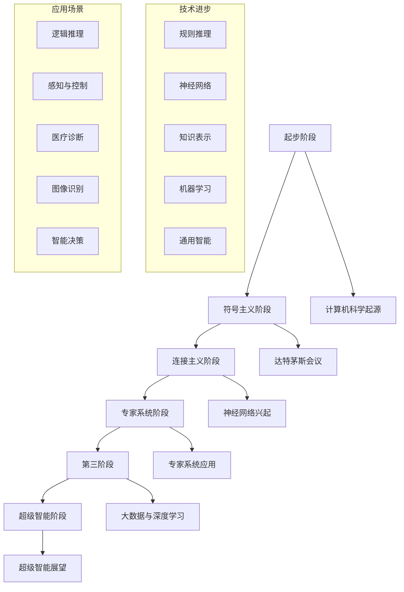
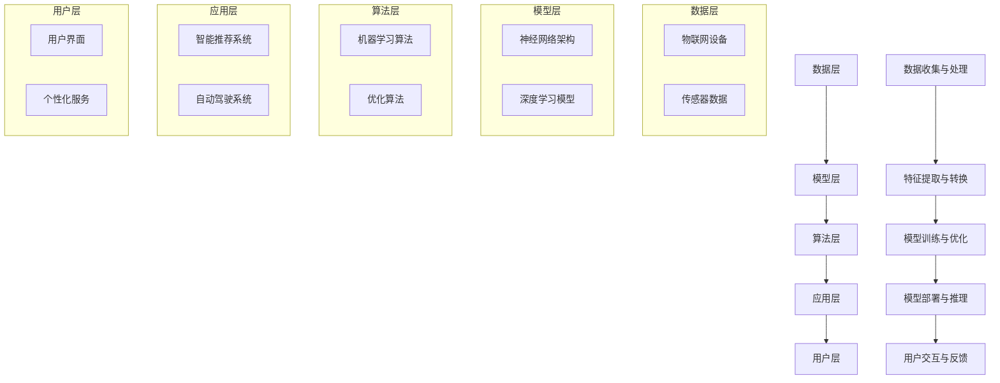

                 

# 文章标题：超级智能

> 关键词：超级智能，人工智能，深度学习，自然语言处理，强化学习，应用场景

> 摘要：本文从超级智能的定义、核心技术、应用场景、挑战与伦理等方面，全面探讨了超级智能的发展及其对社会的深远影响。通过对核心技术原理的深入剖析，以及实际案例的解析，本文旨在为读者提供一个清晰、系统的超级智能全景图。

## 目录大纲

#### 《超级智能》

## 第一部分：智能革命的背景与概述

### 1.1 超级智能的定义与核心特征

### 1.2 智能革命的起源与发展

### 1.3 超级智能的社会与经济影响

## 第二部分：超级智能的核心技术

### 2.1 人工智能基础

### 2.2 深度学习技术

### 2.3 自然语言处理（NLP）

### 2.4 强化学习

## 第三部分：超级智能的应用

### 3.1 超级智能在工业中的应用

### 3.2 超级智能在服务业中的应用

### 3.3 超级智能在公共服务中的应用

## 第四部分：超级智能的挑战与伦理

### 4.1 超级智能的技术挑战

### 4.2 超级智能的社会挑战

### 4.3 超级智能的伦理问题

## 第五部分：超级智能的未来发展

### 5.1 超级智能的未来趋势

### 5.2 超级智能的未来展望

## 附录：超级智能资源与工具

### A. 超级智能开源工具

### B. 超级智能学习资源

### C. 超级智能案例库

## 附加内容：超级智能的Mermaid流程图

### D.1 智能革命的发展流程

### D.2 超级智能的技术架构

## 附加内容：超级智能算法的伪代码

### E.1 机器学习算法

### E.2 深度学习算法

### E.3 自然语言处理算法

### E.4 强化学习算法

## 附加内容：超级智能的数学模型与公式

### F.1 数学模型概述

### F.2 数学公式示例

### F.3 数学公式应用

## 附加内容：超级智能项目实战案例

### G.1 项目背景与目标

### G.2 项目环境搭建

### G.3 代码实现与解读

### G.4 代码解读与分析

## 附加内容：超级智能的挑战与应对策略

### H.1 挑战分析

### H.2 应对策略

### H.3 未来展望

### 《超级智能》完整目录大纲

## 1. 超级智能的定义与核心特征

### 1.1 超级智能的定义

超级智能（Superintelligence）是一个高度发达的人工智能，其智能水平远超人类，能够自我学习、自我优化，并能够理解和解决人类难以处理的问题。超级智能的定义可以从以下几个维度进行理解：

- **自我意识**：超级智能能够具备自我感知、自我理解的能力，类似于人类的自我意识。
- **自主学习**：超级智能具有极强的学习能力，可以自主获取知识、技能，并不断优化自身。
- **通用智能**：超级智能不仅能够在特定领域表现出色，而且在多个领域具有广泛的应用能力。
- **适应能力**：超级智能能够在复杂多变的环境中迅速适应，并能够处理未知的问题。

超级智能的定义虽然抽象，但其核心特征使得它在人工智能领域具有重要地位。自我意识使得超级智能可以理解自己的行为和决策，从而进行自我调整和优化。自主学习使超级智能能够不断进步，适应不断变化的环境。通用智能则使得超级智能可以在多个领域发挥作用，推动科技进步和社会发展。适应能力则保证了超级智能在复杂环境中的生存和发展。

### 1.2 智能革命的起源与发展

智能革命的起源可以追溯到20世纪50年代，当时计算机科学和人工智能领域开始兴起。在早期，人工智能主要集中于模拟人类智能的一些基本功能，如逻辑推理、问题解决等。随着计算机技术的进步，特别是在20世纪80年代和90年代，人工智能开始进入快速发展阶段。

- **20世纪50年代**：人工智能领域正式诞生，主要目标是制造能够模拟人类智能的机器。
- **20世纪60年代**：人工智能开始受到广泛关注，出现了许多里程碑式的成果，如IBM的Deep Blue在国际象棋比赛中战胜了世界冠军。
- **20世纪70年代**：人工智能开始向更为复杂的领域拓展，如自然语言处理、图像识别等。
- **20世纪80年代和90年代**：随着计算机性能的提升和算法的优化，人工智能取得了重大突破，特别是在机器学习和深度学习方面。
- **21世纪初至今**：人工智能进入高速发展期，超级智能的概念逐渐受到关注，人工智能开始应用于各行各业，推动着社会的全面智能化。

智能革命的发展历程，不仅仅是一个技术进步的过程，更是人类对自身智能的探索和扩展。随着超级智能的不断发展，人类社会将面临前所未有的机遇和挑战。

### 1.3 超级智能的社会与经济影响

超级智能对社会和经济的影响是深远而广泛的。在技术层面，超级智能将极大地推动科技的发展，使得许多过去无法解决的问题变得可解。在经济层面，超级智能将带来产业变革，推动经济增长。在社会层面，超级智能将对教育、就业、伦理等方面产生重要影响。

- **技术层面**：超级智能将推动科技进步，特别是在智能制造、智能医疗、智能交通等领域。超级智能能够通过深度学习和自然语言处理等技术，实现自动化、智能化，从而提高生产效率，降低成本。例如，在智能制造领域，超级智能可以通过对生产过程的实时监测和分析，优化生产流程，提高产品质量。
- **经济层面**：超级智能将推动产业变革，带来新的经济增长点。随着超级智能的应用，传统产业将向智能化、自动化方向转型，新的产业也将不断涌现。例如，在金融领域，超级智能可以通过大数据分析和机器学习算法，实现精准营销、智能风控等，提高金融机构的运营效率。
- **社会层面**：超级智能将对教育、就业、伦理等方面产生重要影响。在教育领域，超级智能可以通过智能教学系统，提供个性化、智能化的教学服务，提高教育质量。在就业领域，超级智能将改变就业结构，部分传统工作岗位将被自动化取代，但也将创造新的就业机会。在伦理层面，超级智能的发展将带来新的伦理问题，如隐私保护、道德责任等，需要全社会共同努力解决。

总之，超级智能的发展将深刻影响人类社会，带来前所未有的机遇和挑战。面对这些影响，我们需要充分认识到超级智能的重要性，积极应对其带来的变化，推动社会的发展和进步。

### 2.1 人工智能基础

人工智能（Artificial Intelligence，AI）是一门研究、开发和应用使计算机模拟、扩展和辅助人类智能的理论、方法和技术。人工智能的目标是使计算机具有智能，能够执行复杂的任务，如感知、学习、推理、决策等。人工智能的发展经历了多个阶段，从最初的符号推理到现代的深度学习和强化学习，每一阶段都为人工智能的应用提供了新的可能性。

#### 2.1.1 人工智能的发展历程

人工智能的发展历程可以大致分为以下几个阶段：

1. **符号主义阶段（1956-1974）**：人工智能领域的诞生可以追溯到1956年达特茅斯会议，会议提出了“人工智能”的概念。在这一阶段，人工智能主要依赖于符号推理和知识表示，试图通过规则和逻辑来模拟人类智能。

2. **连接主义阶段（1980-1987）**：受到神经科学和计算理论的影响，人工智能开始转向连接主义，即通过人工神经网络模拟大脑的工作方式。这一阶段，神经网络和反向传播算法得到了广泛应用。

3. **专家系统阶段（1987-1993）**：专家系统是人工智能领域的另一个重要分支，它通过将专家的知识编码到计算机系统中，模拟专家的决策过程。这一阶段的代表性系统是MYCIN和DIAGNOSIS。

4. **第三阶段（1993至今）**：这一阶段标志着人工智能的复兴，特别是机器学习和深度学习的发展。通过大数据和强大的计算能力，机器学习取得了显著进展，使得人工智能在图像识别、自然语言处理、游戏等领域取得了突破。

#### 2.1.2 人工智能的基本概念

人工智能的基本概念包括：

- **感知**：感知是指计算机对输入信息的识别和理解能力。例如，图像识别和语音识别都是感知的例子。
- **认知**：认知是指计算机模拟人类思维过程的能力，包括记忆、学习、推理等。
- **决策**：决策是指计算机在特定环境下选择最优行动的能力。在商业和工业应用中，决策支持系统是非常常见的。

#### 2.1.3 人工智能在计算机图灵测试中的应用

计算机图灵测试是评估人工智能是否具有智能的一种方法。图灵测试由数学家艾伦·图灵在1950年提出，其核心思想是通过人类与计算机的对话来判断计算机是否具有智能。在计算机图灵测试中，人工智能系统需要能够以一种自然的方式与人类进行交流，回答各种问题，并在对话中表现出一定的智能。

- **对话系统**：对话系统是计算机图灵测试的一种实现方式，它通过自然语言处理和对话生成技术，模拟人类对话。
- **案例分析**：例如，谷歌的对话机器人“谷歌助手”在2018年通过了图灵测试，能够在与人类的对话中表现出一定的智能。

通过计算机图灵测试，不仅可以评估人工智能的智能水平，还可以推动人工智能技术的发展和应用。未来，随着人工智能技术的不断进步，计算机图灵测试将变得更加严格和复杂，为人工智能的发展提供更加全面的评估标准。

### 2.2 深度学习技术

深度学习（Deep Learning）是机器学习的一个重要分支，它通过构建深度神经网络（Deep Neural Networks），对大量数据进行自动特征学习，从而实现复杂的模式识别和预测任务。深度学习在计算机视觉、自然语言处理、语音识别等领域取得了显著成果，成为人工智能研究与应用的重要技术之一。

#### 2.2.1 深度学习的基本原理

深度学习的基本原理可以概括为以下几点：

- **神经网络**：神经网络是深度学习的基础，它由大量的神经元（或称为节点）通过层叠的方式组织起来，用于对输入数据进行处理和输出预测。神经网络通过前向传播和反向传播算法进行训练和优化。
- **多层感知器**：多层感知器（Multilayer Perceptron，MLP）是深度学习中最简单的模型，它包含输入层、隐藏层和输出层。输入层接收外部输入，隐藏层进行特征提取和变换，输出层生成最终预测。
- **反向传播算法**：反向传播算法（Backpropagation Algorithm）是深度学习训练的核心，它通过计算误差梯度，更新网络权重，从而优化模型的预测性能。

#### 2.2.2 深度学习的主要架构

深度学习的主要架构包括以下几种：

- **卷积神经网络（CNN）**：卷积神经网络是深度学习在计算机视觉领域的核心模型，它通过卷积层、池化层和全连接层的组合，对图像进行逐层特征提取和分类。CNN在图像识别、物体检测和图像生成等领域具有广泛应用。
- **循环神经网络（RNN）**：循环神经网络是深度学习在序列数据处理领域的核心模型，它通过循环结构对序列数据进行建模，捕捉时间序列中的长期依赖关系。RNN在自然语言处理、语音识别和时间序列预测等领域有广泛应用。
- **生成对抗网络（GAN）**：生成对抗网络是深度学习在生成任务中的核心模型，它由生成器和判别器两个神经网络组成，通过对抗训练生成逼真的数据。GAN在图像生成、语音合成和文本生成等领域有广泛应用。

#### 2.2.3 深度学习的优化方法

深度学习的优化方法主要包括以下几种：

- **梯度下降**：梯度下降（Gradient Descent）是最常用的优化算法，它通过计算损失函数关于模型参数的梯度，沿着梯度方向更新模型参数，从而优化模型性能。
- **随机梯度下降（SGD）**：随机梯度下降是对梯度下降的一种改进，它每次只随机选择一部分样本计算梯度，从而加快训练速度。
- **Adam优化器**：Adam优化器是梯度下降的一种变体，它结合了SGD和动量法的优点，通过自适应调整学习率，提高训练效率。

通过上述优化方法，深度学习模型可以在大量数据上进行训练，从而实现高性能的预测和分类任务。

### 2.3 自然语言处理（NLP）

自然语言处理（Natural Language Processing，NLP）是人工智能领域的一个分支，它涉及计算机对自然语言的识别、理解、生成和处理。NLP的核心目标是使计算机能够理解、处理和生成自然语言，从而实现人与计算机的交互。

#### 2.3.1 自然语言处理的基本概念

自然语言处理的基本概念包括：

- **分词**：分词是将连续的文本切分成一个个有意义的单词或短语。例如，将“我爱北京天安门”切分成“我”、“爱”、“北京”、“天安门”。
- **词性标注**：词性标注是对文本中的每个词进行词性分类，如名词、动词、形容词等。例如，将“我”标注为代词，“北京”标注为名词。
- **命名实体识别**：命名实体识别是从文本中识别出具有特定意义的实体，如人名、地名、组织名等。例如，从“北京是中国的首都”中识别出“北京”是地名。
- **句法分析**：句法分析是对句子的结构进行解析，确定句子中的各个成分及其关系。例如，将“我吃了一个苹果”分解为“我”（主语）、“吃”（谓语）、“一个苹果”（宾语）。

#### 2.3.2 语言模型与序列模型

语言模型（Language Model）是NLP的核心技术之一，它用于预测文本序列的概率。常见的语言模型包括：

- **n-gram模型**：n-gram模型是一种基于统计的语言模型，它将文本序列看作是由n个连续单词组成的序列，通过计算每个n-gram的概率来预测下一个单词。
- **神经网络语言模型**：神经网络语言模型通过神经网络来学习文本序列的概率分布，它能够捕捉到文本中的长期依赖关系。

序列模型（Sequence Model）是NLP中用于处理序列数据的模型，它能够对序列中的每个元素进行建模。常见的序列模型包括：

- **循环神经网络（RNN）**：循环神经网络通过循环结构对序列数据进行建模，它能够捕捉到序列中的长期依赖关系。
- **长短期记忆网络（LSTM）**：长短期记忆网络是RNN的一种变体，它通过引入门控机制来解决RNN的梯度消失问题，能够更好地捕捉到序列中的长期依赖关系。

#### 2.3.3 NLP的关键技术

NLP的关键技术包括：

- **词向量**：词向量是将文本中的单词映射到高维空间中的向量表示，它能够捕捉到单词的语义信息。常见的词向量模型包括Word2Vec、GloVe等。
- **词嵌入**：词嵌入是将单词映射到低维空间中的向量表示，它能够更好地捕捉到单词的语义和语法关系。词嵌入在NLP中的应用非常广泛，如文本分类、情感分析、机器翻译等。
- **语义分析**：语义分析是对文本中的语义信息进行理解和分析，它包括语义角色标注、语义关系提取等任务。语义分析有助于理解文本的含义，为自然语言处理提供更丰富的信息。
- **机器翻译**：机器翻译是将一种语言的文本翻译成另一种语言的过程。机器翻译通过统计方法和神经网络模型进行建模，能够实现高质量的自动翻译。

通过上述技术，NLP能够对文本进行有效的处理和理解，从而实现人与计算机的智能交互。

### 2.4 强化学习

强化学习（Reinforcement Learning，RL）是一种机器学习范式，通过智能体与环境的交互，智能体通过不断尝试和反馈，学习到最优策略，实现目标最大化。强化学习广泛应用于游戏、机器人控制、推荐系统等领域，其核心思想是通过奖励和惩罚信号，引导智能体不断优化行为。

#### 2.4.1 强化学习的基本原理

强化学习的基本原理可以概括为以下几点：

- **智能体（Agent）**：智能体是执行行为的主体，它根据当前状态选择动作，并从环境中获得奖励。
- **环境（Environment）**：环境是智能体执行动作的场所，它根据智能体的动作产生新的状态，并给出奖励或惩罚。
- **状态（State）**：状态是描述环境当前状态的变量，它决定了智能体的行为。
- **动作（Action）**：动作是智能体在状态中选择的行为。
- **奖励（Reward）**：奖励是环境对智能体行为的评价，它可以是正奖励或负奖励，用于指导智能体的学习。

强化学习的目标是找到一种策略，使智能体在长期运行中获得最大的累积奖励。策略是智能体在给定状态时选择动作的规则。

#### 2.4.2 强化学习的应用

强化学习在多个领域有广泛应用，以下是一些典型应用：

- **游戏**：强化学习在游戏领域有广泛应用，如围棋、国际象棋等。通过强化学习，智能体可以学会最优策略，实现超越人类水平的游戏表现。
- **机器人控制**：强化学习在机器人控制领域用于学习控制策略，使机器人能够自主完成复杂的任务。例如，通过强化学习，机器人可以学会行走、抓取等动作。
- **推荐系统**：强化学习在推荐系统领域用于学习用户偏好，提高推荐质量。通过强化学习，推荐系统可以动态调整推荐策略，提高用户满意度。

#### 2.4.3 强化学习的主要算法

强化学习的主要算法包括：

- **Q学习（Q-Learning）**：Q学习是一种基于值函数的强化学习算法，它通过学习状态-动作值函数，优化智能体的策略。Q学习通过迭代更新值函数，逐步收敛到最优策略。
- **深度Q网络（Deep Q-Network，DQN）**：DQN是Q学习的变体，它使用深度神经网络来近似状态-动作值函数。DQN通过经验回放和目标网络，解决Q学习中的样本相关性和目标不稳定问题。
- **策略梯度算法（Policy Gradient）**：策略梯度算法直接优化智能体的策略，通过梯度上升法更新策略参数。常见的策略梯度算法包括REINFORCE、PPO（Proximal Policy Optimization）等。
- **深度策略网络（Deep Policy Network）**：深度策略网络是策略梯度算法的变体，它使用深度神经网络来近似策略函数。深度策略网络通过策略梯度的优化，实现高效策略学习。

通过上述算法，强化学习能够有效地指导智能体的行为，实现复杂任务的学习和优化。

### 3.1 超级智能在工业中的应用

超级智能在工业中的应用正逐步改变传统的生产方式，提高生产效率和产品质量。以下从智能制造、智能物流、智能供应链等方面探讨超级智能在工业中的应用。

#### 3.1.1 智能制造

智能制造（Smart Manufacturing）是一种利用信息技术、人工智能和自动化技术来优化生产过程的方法。超级智能在智能制造中的应用主要体现在以下几个方面：

- **自动化生产线**：通过人工智能技术，自动化生产线可以实现无人或少人操作，提高生产效率。例如，使用计算机视觉系统进行产品检测，机器人进行装配和搬运等。
- **设备预测维护**：超级智能可以通过大数据分析和机器学习算法，对生产设备进行实时监控和分析，预测设备可能出现的故障，提前进行维护，减少停机时间和维修成本。
- **生产优化**：超级智能可以通过优化算法，对生产计划、生产流程进行优化，提高生产效率和资源利用率。例如，通过实时数据分析，动态调整生产计划，减少库存和物流成本。

#### 3.1.2 智能制造的概念与原理

智能制造的概念可以概括为“智慧化、智能化、数字化、网络化”，即通过将信息技术、人工智能、自动化技术等融入生产过程，实现生产的智慧化、智能化、数字化和网络化。

智能制造的原理主要包括：

- **物联网（IoT）**：物联网是实现智能制造的基础，通过传感器和设备互联，实现生产过程中的数据采集和实时监控。
- **大数据分析**：大数据分析是对生产过程中产生的海量数据进行处理和分析，从中提取有价值的信息，用于优化生产过程。
- **人工智能**：人工智能在智能制造中主要用于自动化、优化和预测等方面，通过深度学习、强化学习等技术，实现生产过程的智能化。
- **云计算**：云计算为智能制造提供了强大的计算能力和数据存储能力，支持大规模数据处理和实时分析。

#### 3.1.3 智能制造的关键技术

智能制造的关键技术包括：

- **机器人技术**：机器人技术在智能制造中用于完成装配、搬运、检测等任务，提高生产效率和灵活性。
- **物联网技术**：物联网技术通过传感器和设备互联，实现生产过程的实时监控和数据分析。
- **大数据技术**：大数据技术对生产过程中的数据进行处理和分析，为生产优化和决策提供支持。
- **人工智能技术**：人工智能技术在智能制造中用于自动化、优化和预测等方面，实现生产过程的智能化。

#### 3.1.4 智能制造案例研究

智能制造在实际应用中取得了显著成果，以下是一个智能制造的案例研究：

- **汽车制造业**：在汽车制造业中，智能制造技术被广泛应用于生产线自动化、设备预测维护和生产优化等方面。例如，某汽车制造公司通过引入智能机器人，实现了生产线无人化操作，提高了生产效率。同时，通过物联网技术对生产设备进行实时监控，实现了设备预测维护，减少了停机时间和维修成本。此外，通过大数据分析和人工智能技术，该公司优化了生产计划和流程，提高了生产效率和产品质量。

#### 3.1.2 智能供应链

智能供应链（Smart Supply Chain）是一种通过信息技术的应用，实现供应链的智能化、数字化和高效化。超级智能在智能供应链中的应用，可以提升供应链的透明度、灵活性和响应速度。

- **需求预测**：通过大数据分析和人工智能算法，智能供应链可以对市场需求进行准确预测，从而优化库存管理和生产计划。例如，零售企业可以通过分析消费者的购买行为和社交媒体数据，预测未来某段时间内的销售量，以便调整库存和采购策略。
- **物流优化**：智能供应链通过物联网技术和人工智能算法，对物流过程进行实时监控和优化。例如，物流公司可以通过车辆定位和路线优化，提高运输效率，降低运输成本。此外，通过无人机和自动化仓库技术，可以实现快速配送和高效仓储管理。
- **供应链协同**：智能供应链通过区块链技术和物联网技术，实现供应链各环节的协同和信息共享，提高供应链的整体效率。例如，制造商、供应商和分销商可以通过区块链技术，实现供应链信息的透明化和实时共享，从而提高供应链的响应速度和协同能力。

#### 3.1.3 智能供应链的概念与原理

智能供应链的概念可以概括为“智能化、数字化、协同化、高效化”，即通过信息技术的应用，实现供应链的智能化、数字化、协同化和高效化。

智能供应链的原理主要包括：

- **物联网**：物联网是实现智能供应链的基础，通过传感器和设备互联，实现供应链各环节的实时监控和信息传递。
- **大数据分析**：大数据分析是对供应链过程中产生的海量数据进行处理和分析，为供应链管理和优化提供支持。
- **人工智能**：人工智能在智能供应链中用于需求预测、物流优化、库存管理等任务，实现供应链的智能化。
- **区块链**：区块链技术提供了一种去中心化的数据存储和传输方式，实现供应链信息的透明化和可追溯性。

#### 3.1.4 智能供应链的关键技术

智能供应链的关键技术包括：

- **物联网技术**：物联网技术通过传感器和设备互联，实现供应链各环节的实时监控和信息传递。
- **大数据技术**：大数据技术对供应链过程中产生的数据进行处理和分析，为供应链管理和优化提供支持。
- **人工智能技术**：人工智能技术在智能供应链中用于需求预测、物流优化、库存管理等任务，实现供应链的智能化。
- **区块链技术**：区块链技术提供了一种去中心化的数据存储和传输方式，实现供应链信息的透明化和可追溯性。

#### 3.1.5 智能供应链案例研究

智能供应链在实际应用中取得了显著成果，以下是一个智能供应链的案例研究：

- **电子制造业**：在电子制造业中，智能供应链技术被广泛应用于供应链管理、物流优化和需求预测等方面。例如，某电子制造公司通过物联网技术对生产设备进行实时监控，实现了设备预测维护和故障预警，减少了设备故障和停机时间。同时，通过大数据分析和人工智能算法，该公司对市场需求进行预测，优化了库存管理和生产计划，提高了生产效率和响应速度。此外，通过区块链技术，该公司实现了供应链信息的透明化和实时共享，提高了供应链的协同能力和响应速度。

### 3.2 超级智能在服务业中的应用

超级智能在服务业中的应用正日益广泛，尤其是在智能金融和智能医疗领域，超级智能技术大大提升了服务效率和质量。

#### 3.2.1 智能金融

智能金融（Smart Finance）是指通过人工智能技术，对金融业务进行自动化、智能化的管理和运营。超级智能在智能金融中的应用主要体现在以下几个方面：

- **智能投顾**：智能投顾通过大数据分析和人工智能算法，为投资者提供个性化的投资建议。智能投顾可以根据投资者的风险偏好、资产配置和投资目标，动态调整投资组合，实现风险和收益的最优化。
- **风险管理**：超级智能在金融风险管理中具有重要作用，通过大数据分析和机器学习算法，智能系统可以实时监测市场风险，预测潜在的风险事件，并提供预警和建议。
- **欺诈检测**：超级智能可以通过自然语言处理和计算机视觉等技术，识别和防范金融欺诈行为。例如，通过分析交易数据和行为模式，智能系统可以及时发现异常交易，防止欺诈损失。
- **智能客服**：智能客服利用自然语言处理和机器学习技术，实现与客户的智能对话，提供24/7的服务。智能客服可以处理大量的客户咨询，提高客户满意度和服务效率。

#### 3.2.1 智能金融的概念与原理

智能金融的概念可以概括为“智能化、自动化、个性化、高效化”，即通过人工智能技术，实现金融服务的自动化、智能化、个性化和高效化。

智能金融的原理主要包括：

- **大数据分析**：大数据分析是智能金融的核心，通过对海量金融数据进行处理和分析，智能系统可以提取有价值的信息，为投资决策、风险管理和欺诈检测提供支持。
- **机器学习**：机器学习是智能金融的技术基础，通过训练模型，智能系统可以自动学习并优化金融业务流程，提高服务质量和效率。
- **区块链**：区块链技术提供了一种去中心化的数据存储和传输方式，实现金融交易的透明化和可追溯性，提高金融服务的安全性和信任度。
- **云计算**：云计算为智能金融提供了强大的计算能力和数据存储能力，支持大规模数据处理和实时分析。

#### 3.2.2 智能金融的关键技术

智能金融的关键技术包括：

- **大数据技术**：大数据技术用于处理和分析海量金融数据，为投资决策、风险管理和欺诈检测提供支持。
- **机器学习**：机器学习技术用于金融业务流程的自动化和优化，提高服务质量和效率。
- **区块链技术**：区块链技术用于实现金融交易的透明化和可追溯性，提高金融服务的安全性和信任度。
- **云计算技术**：云计算技术提供强大的计算能力和数据存储能力，支持大规模数据处理和实时分析。

#### 3.2.3 智能金融案例研究

智能金融在实际应用中取得了显著成果，以下是一个智能金融的案例研究：

- **智能投顾**：某大型银行通过引入智能投顾系统，为投资者提供个性化的投资建议。智能投顾系统通过分析投资者的财务状况、风险偏好和投资目标，动态调整投资组合，实现风险和收益的最优化。在实际运营中，智能投顾系统帮助银行客户实现了更高的投资回报，提高了客户满意度和忠诚度。

#### 3.2.2 智能医疗

智能医疗（Smart Healthcare）是指利用人工智能技术，提高医疗服务的质量和效率，改善患者的医疗体验。超级智能在智能医疗中的应用主要体现在以下几个方面：

- **疾病诊断**：超级智能可以通过大数据分析和机器学习算法，辅助医生进行疾病诊断。例如，通过分析患者的病历数据、医学图像和基因数据，智能系统可以提供诊断建议，提高诊断准确率。
- **药物研发**：智能医疗在药物研发中具有重要作用，通过大数据分析和机器学习算法，智能系统可以加速新药研发过程，提高研发效率。例如，通过分析大量的生物医学数据，智能系统可以预测药物的疗效和副作用，为新药研发提供参考。
- **个性化治疗**：超级智能可以根据患者的个体差异，制定个性化的治疗方案。例如，通过分析患者的基因数据和生活习惯，智能系统可以推荐最适合的治疗方案，提高治疗效果。
- **医疗影像分析**：超级智能在医疗影像分析中具有重要作用，通过计算机视觉和深度学习技术，智能系统可以自动识别和诊断病变区域，提高诊断效率和准确性。例如，在肺癌筛查中，智能系统可以通过分析CT影像，自动识别肺结节，为医生提供诊断依据。

#### 3.2.2 智能医疗的概念与原理

智能医疗的概念可以概括为“智能化、数字化、个性化、高效化”，即通过人工智能技术，实现医疗服务的智能化、数字化、个性化和高效化。

智能医疗的原理主要包括：

- **大数据分析**：大数据分析是智能医疗的核心，通过对海量医疗数据进行处理和分析，智能系统可以提取有价值的信息，为疾病诊断、药物研发和个性化治疗提供支持。
- **机器学习**：机器学习是智能医疗的技术基础，通过训练模型，智能系统可以自动学习并优化医疗业务流程，提高服务质量和效率。
- **物联网**：物联网技术用于连接医疗设备和系统，实现医疗数据的实时采集和传输，为智能诊断和治疗提供支持。
- **云计算**：云计算为智能医疗提供了强大的计算能力和数据存储能力，支持大规模数据处理和实时分析。

#### 3.2.3 智能医疗的关键技术

智能医疗的关键技术包括：

- **大数据技术**：大数据技术用于处理和分析海量医疗数据，为疾病诊断、药物研发和个性化治疗提供支持。
- **机器学习**：机器学习技术用于医疗业务流程的自动化和优化，提高服务质量和效率。
- **物联网技术**：物联网技术用于连接医疗设备和系统，实现医疗数据的实时采集和传输。
- **云计算技术**：云计算技术提供强大的计算能力和数据存储能力，支持大规模数据处理和实时分析。

#### 3.2.4 智能医疗案例研究

智能医疗在实际应用中取得了显著成果，以下是一个智能医疗的案例研究：

- **肺癌筛查**：某医疗机构引入了智能医疗影像分析系统，用于肺癌筛查。智能系统通过分析患者的CT影像，自动识别肺结节，并给出诊断建议。在实际应用中，智能系统提高了肺癌筛查的准确率，为医生提供了重要的诊断依据，显著降低了肺癌的漏诊率。

### 3.3 超级智能在公共服务中的应用

超级智能在公共服务中的应用正逐步改变传统公共服务模式，提高服务效率和用户体验。以下从智能城市、智能教育、智能交通等方面探讨超级智能在公共服务中的应用。

#### 3.3.1 智能城市

智能城市（Smart City）是指利用信息技术、人工智能和物联网等先进技术，实现城市管理的智能化、数字化和高效化。超级智能在智能城市中的应用主要体现在以下几个方面：

- **智慧交通**：智慧交通通过人工智能技术，实现交通流量监测、路径规划、智能调度等功能。例如，通过智能交通信号灯，可以根据实时交通流量自动调整信号时长，减少交通拥堵。此外，智能交通系统还可以预测交通状况，为出行者提供最佳路线建议。
- **环境监测**：智能城市通过物联网技术和人工智能算法，实时监测城市环境，如空气质量、水质、噪声等。智能系统可以及时识别环境污染问题，并采取措施进行治理。
- **智慧安防**：智慧安防利用人工智能技术，实现视频监控、人脸识别、异常行为检测等功能。智能安防系统可以实时监测城市安全状况，及时发现和处理安全隐患。
- **公共服务优化**：智能城市通过大数据分析和人工智能技术，优化公共服务资源配置，提高服务效率。例如，智能医疗系统可以根据居民健康数据，优化医疗资源的分配，提高医疗服务质量。

#### 3.3.1 智能城市的概念与原理

智能城市的概念可以概括为“数字化、智能化、协同化、人性化”，即通过信息技术和人工智能等先进技术，实现城市管理的数字化、智能化、协同化和人性化。

智能城市的原理主要包括：

- **物联网**：物联网是实现智能城市的基础，通过传感器和设备互联，实现城市数据的实时采集和传输。
- **大数据分析**：大数据分析是对城市数据进行分析和处理，为城市管理和决策提供支持。
- **人工智能**：人工智能在智能城市中用于交通管理、环境监测、安防监控等方面，实现城市服务的智能化。
- **云计算**：云计算为智能城市提供了强大的计算能力和数据存储能力，支持大规模数据处理和实时分析。

#### 3.3.2 智能城市的关键技术

智能城市的关键技术包括：

- **物联网技术**：物联网技术用于实现城市数据的实时采集和传输。
- **大数据技术**：大数据技术用于处理和分析城市数据，为城市管理和决策提供支持。
- **人工智能技术**：人工智能技术用于城市服务的智能化，如智慧交通、环境监测、安防监控等。
- **云计算技术**：云计算技术提供强大的计算能力和数据存储能力，支持大规模数据处理和实时分析。

#### 3.3.3 智能城市案例研究

智能城市在实际应用中取得了显著成果，以下是一个智能城市的案例研究：

- **新加坡**：新加坡是一个智能城市的典范。新加坡通过智能交通系统，实现交通流量的实时监测和优化。智能交通系统可以根据实时交通状况，调整交通信号灯时长，减少交通拥堵。此外，新加坡还通过物联网技术，实时监测城市环境，如空气质量、水质等，并及时采取治理措施。在公共服务方面，新加坡通过大数据分析和人工智能技术，优化医疗资源分配，提高医疗服务质量。

#### 3.3.2 智能教育

智能教育（Smart Education）是指利用信息技术、人工智能和大数据等先进技术，实现教育资源的数字化、智能化和个性化。超级智能在智能教育中的应用主要体现在以下几个方面：

- **个性化学习**：智能教育系统可以根据学生的兴趣、学习习惯和知识水平，为学生提供个性化的学习内容和学习路径。例如，通过大数据分析和人工智能算法，智能系统可以推荐最适合学生的学习资源，帮助学生提高学习效果。
- **智能评测**：智能教育系统可以通过自动评测技术，对学生的学习过程和成果进行实时监测和评估。智能评测系统可以生成详细的学习报告，为教师和学生提供有针对性的学习建议。
- **教育资源共享**：智能教育系统通过云计算和物联网技术，实现教育资源的共享和优化。例如，教师可以通过智能教育平台，分享教学资源和经验，提高教学质量和效率。
- **虚拟教学**：智能教育系统可以利用虚拟现实（VR）和增强现实（AR）技术，为学生提供沉浸式的学习体验。通过虚拟教学，学生可以身临其境地参与各种教学活动，提高学习兴趣和效果。

#### 3.3.2 智能教育的概念与原理

智能教育的概念可以概括为“数字化、智能化、个性化、开放化”，即通过信息技术和人工智能等先进技术，实现教育资源的数字化、智能化、个性化和开放化。

智能教育的原理主要包括：

- **大数据分析**：大数据分析是对教育数据进行分析和处理，为个性化教学和智能评测提供支持。
- **人工智能**：人工智能在智能教育中用于个性化学习、智能评测和教育资源共享等方面，实现教育的智能化。
- **云计算**：云计算为智能教育提供了强大的计算能力和数据存储能力，支持大规模数据处理和实时分析。
- **物联网**：物联网技术用于实现教育资源的互联和共享，提高教育资源的利用效率。

#### 3.3.3 智能教育的关键技术

智能教育的关键技术包括：

- **大数据技术**：大数据技术用于处理和分析教育数据，为个性化教学和智能评测提供支持。
- **人工智能技术**：人工智能技术用于个性化学习、智能评测和教育资源共享等方面，实现教育的智能化。
- **云计算技术**：云计算技术提供强大的计算能力和数据存储能力，支持大规模数据处理和实时分析。
- **物联网技术**：物联网技术用于实现教育资源的互联和共享，提高教育资源的利用效率。

#### 3.3.4 智能教育案例研究

智能教育在实际应用中取得了显著成果，以下是一个智能教育的案例研究：

- **美国加州学校**：美国加州的一些学校引入了智能教育系统，通过大数据分析和人工智能算法，为每个学生提供个性化的学习方案。智能教育系统可以根据学生的学习行为和成绩，推荐最适合的学习资源和教学方法。此外，智能教育系统还提供了实时评测功能，教师可以根据学生的表现，调整教学策略，提高教学质量。在实际应用中，智能教育系统显著提高了学生的学习兴趣和成绩，受到了师生和家长的一致好评。

### 4.1 超级智能的技术挑战

超级智能技术的发展虽然取得了显著成果，但同时也面临着诸多技术挑战。以下从算力和效率、数据与隐私等方面分析超级智能的技术挑战。

#### 4.1.1 算力和效率

算力和效率是超级智能技术发展中的核心问题。随着人工智能算法的复杂度和数据规模的增大，对计算资源和处理速度的需求也日益增长。

- **计算资源需求**：超级智能算法，如深度学习和强化学习，通常需要大量的计算资源。尤其是在训练阶段，模型参数的优化和大量数据的处理需要高性能计算硬件支持。然而，现有的计算硬件在性能和能耗方面仍有提升空间。
- **处理速度**：超级智能系统需要在实时或接近实时的环境下做出决策。例如，自动驾驶系统需要在毫秒级时间内处理大量传感器数据，并做出安全的驾驶决策。当前的计算硬件在处理速度上无法完全满足超级智能系统的需求。

为应对算力和效率的挑战，可以采取以下策略：

- **硬件优化**：通过研发更高效、低功耗的硬件，如专用人工智能芯片和量子计算，提高计算效率和能效。
- **算法优化**：改进现有算法，提高计算效率和模型性能。例如，采用更高效的优化算法、模型压缩技术等。
- **分布式计算**：利用分布式计算技术，将计算任务分布在多个节点上，提高整体计算能力和处理速度。

#### 4.1.2 数据与隐私

数据是超级智能系统的基础，但同时也带来了数据隐私和安全问题。超级智能系统需要大量高质量的数据进行训练，但这些数据往往涉及个人隐私。

- **数据质量**：高质量的数据对于训练有效的超级智能系统至关重要。然而，数据收集过程中可能存在噪声、缺失值和错误，影响模型性能。此外，不同来源的数据可能存在不一致性，需要数据清洗和预处理。
- **数据隐私**：超级智能系统在处理和分析个人数据时，可能涉及敏感信息，如健康记录、金融交易等。这些数据一旦泄露，可能对个人隐私造成严重威胁。因此，如何在保护隐私的同时充分利用数据，是一个重要的技术挑战。

为应对数据与隐私的挑战，可以采取以下策略：

- **数据匿名化**：通过数据匿名化技术，如数据脱敏、加密等，保护个人隐私。
- **数据共享与安全**：建立安全的数据共享平台，确保数据在共享过程中的安全性。例如，采用区块链技术实现数据的安全存储和传输。
- **合规与监管**：遵循相关法律法规，确保数据处理和使用的合法性。加强数据隐私保护，防范数据泄露和滥用。

通过上述策略，可以更好地应对超级智能技术发展中的技术挑战，推动超级智能技术的持续进步和应用。

### 4.2 超级智能的社会挑战

超级智能技术的发展不仅带来了技术层面的挑战，同时也对社会的各个方面产生了深远影响，引发了一系列社会挑战。以下从就业与失业、道德与伦理等方面探讨超级智能的社会挑战。

#### 4.2.1 就业与失业

超级智能技术的迅速发展，对就业市场产生了重大影响。一方面，超级智能技术将提高生产效率和创新能力，创造新的就业机会；另一方面，它也可能导致部分传统岗位的失业。

- **就业机会**：超级智能技术的应用将创造新的就业机会，特别是在人工智能、大数据分析、软件开发等领域。这些岗位需要专业人才，推动相关教育和培训的发展。
- **失业风险**：超级智能技术的自动化和智能化特性，使得许多传统工作岗位，如制造业工人、客服人员等，可能面临被取代的风险。随着自动化设备的普及，部分劳动力密集型行业的工作机会将减少，导致失业率上升。

为应对就业与失业的挑战，可以采取以下策略：

- **职业教育与培训**：加强职业教育和培训，提升劳动者的技能水平，使其能够适应超级智能时代的工作需求。
- **政策支持**：政府可以通过提供就业补贴、职业转换计划等政策，帮助失业者重新就业。
- **创业支持**：鼓励创业，为失业者提供创业机会，促进就业市场多元化。

#### 4.2.2 道德与伦理

超级智能技术的应用引发了许多道德与伦理问题，这些问题需要全社会共同关注和解决。

- **隐私保护**：超级智能系统在处理和分析大量数据时，可能涉及个人隐私。如何保护个人隐私，防止数据泄露和滥用，是一个重要的伦理问题。
- **责任归属**：在超级智能系统的应用中，如果出现事故或错误，如何确定责任归属？是开发者、用户还是智能系统本身？这一问题的解决需要法律和伦理规范的支持。
- **公平性**：超级智能系统在决策过程中，可能会因为算法偏差或数据来源问题，导致不公平的结果。如何确保超级智能系统在应用中的公平性，是一个重要的伦理问题。

为应对道德与伦理的挑战，可以采取以下策略：

- **法律法规**：制定相关法律法规，规范超级智能系统的开发和应用，确保其符合道德和伦理要求。
- **伦理指导**：建立超级智能伦理指导原则，明确开发和应用过程中应遵循的伦理准则，确保技术发展不损害社会公共利益。
- **公众参与**：鼓励公众参与超级智能技术的讨论和决策过程，提高透明度和公众信任。

通过上述策略，可以更好地应对超级智能技术发展带来的社会挑战，推动其健康、可持续的发展。

### 4.3 超级智能的伦理问题

超级智能的发展带来了前所未有的机遇，但同时也引发了一系列伦理问题，这些问题的解决对于确保超级智能技术的可持续发展至关重要。以下从人工智能伦理原则、伦理问题案例分析以及伦理的未来趋势三个方面探讨超级智能的伦理问题。

#### 4.3.1 人工智能伦理原则

为了应对超级智能技术发展中的伦理挑战，国际社会提出了一系列人工智能伦理原则，旨在指导人工智能的开发和应用。以下是一些关键的人工智能伦理原则：

- **透明性**：人工智能系统应具备透明性，使开发者、用户和监管机构能够理解和评估其工作原理和决策过程。
- **公正性**：人工智能系统应公平、无偏见，避免对特定群体造成不公平对待。开发过程中应采取措施消除算法偏差，确保公正性。
- **可解释性**：人工智能系统应具备可解释性，使其决策过程易于理解，便于开发者、用户和监管机构进行评估和审计。
- **安全性**：人工智能系统应具备高安全性，防止恶意攻击和意外行为，确保系统运行过程中不会对人类或环境造成危害。
- **责任性**：人工智能系统的开发者、用户和监管机构应对系统的行为承担法律责任，确保在出现问题时能够追溯责任。

#### 4.3.2 伦理问题案例分析

在实际应用中，超级智能技术已经引发了一系列伦理问题。以下通过几个具体案例，分析这些伦理问题的表现和影响：

- **案例一：人脸识别**：人脸识别技术在安防、支付等领域广泛应用，但其应用过程中可能涉及个人隐私和数据滥用问题。例如，未经授权使用人脸识别技术，可能导致个人隐私泄露。此外，人脸识别系统的偏差可能导致对特定群体的不公平对待，如性别和种族歧视。
- **案例二：自动驾驶**：自动驾驶技术在提高交通效率和安全性方面具有巨大潜力，但其应用过程中可能面临责任归属和伦理困境。例如，在自动驾驶车辆发生事故时，如何确定责任归属？是车辆开发者、制造商还是用户？此外，自动驾驶车辆在面临道德困境时，如何做出决策？例如，在避免碰撞行人或车辆时，应如何权衡？
- **案例三：医疗诊断**：超级智能技术在医疗诊断中具有重要作用，但其应用过程中可能涉及患者隐私和数据安全。例如，医疗数据泄露可能导致患者隐私泄露，影响患者权益。此外，医疗诊断系统的偏差可能导致误诊，影响患者健康。

#### 4.3.3 伦理的未来趋势

随着超级智能技术的不断发展和应用，伦理问题将更加复杂和多样化。以下探讨未来伦理问题的发展趋势：

- **伦理决策的复杂性**：随着超级智能系统的复杂度和智能化水平提高，其决策过程将更加复杂，涉及更多的伦理考量。例如，智能系统在面临道德困境时，如何做出符合伦理要求的决策？
- **跨学科合作**：解决超级智能伦理问题需要跨学科合作，涉及技术、法律、社会等多个领域。未来，各国政府和国际组织应加强合作，共同制定和推广伦理原则和标准。
- **公众参与**：公众参与在超级智能伦理问题解决中具有重要地位。未来，应鼓励公众参与讨论和决策过程，提高透明度和公众信任。

通过上述措施，可以更好地应对超级智能技术发展中的伦理挑战，确保其健康、可持续的发展。

### 5.1 超级智能的未来趋势

超级智能技术的未来发展充满了无限可能，其趋势主要体现在新一代人工智能技术、创新应用以及超级智能与社会发展的相互作用。

#### 5.1.1 新一代人工智能技术

新一代人工智能技术将继续推动超级智能的发展。以下是一些关键趋势：

- **量子计算**：量子计算具有超强的计算能力，能够在极短时间内解决传统计算机无法处理的问题。量子计算的结合，将使超级智能在数据分析和决策优化方面取得突破性进展。
- **类脑智能**：类脑智能通过模拟人脑的工作方式，实现更高效、更灵活的智能行为。类脑智能的发展，将使超级智能在复杂环境中的适应能力和决策能力得到显著提升。
- **多模态感知**：多模态感知技术结合了多种感知方式，如视觉、听觉、触觉等，使超级智能能够更全面地理解和感知环境。这将使超级智能在智能交互、智能服务等领域发挥更大的作用。
- **自适应学习**：自适应学习技术使超级智能能够根据环境和任务的变化，自动调整学习策略和模型参数。自适应学习的发展，将使超级智能在动态环境中保持高效、准确的学习和决策能力。

#### 5.1.2 创新应用

超级智能技术的创新应用将继续拓展其应用领域，推动各行各业的数字化转型。以下是一些关键应用领域：

- **智能医疗**：超级智能在医疗领域的应用将更加深入，包括智能诊断、智能治疗、智能药物研发等。通过大数据分析和人工智能技术，超级智能将帮助医生提高诊断准确率和治疗效果。
- **智能金融**：超级智能在金融领域的应用将进一步提升金融服务效率和安全性。智能投顾、智能风险管理、智能支付等应用，将使金融行业更加智能和便捷。
- **智能制造**：超级智能将在智能制造中发挥核心作用，通过自动化生产线、智能检测、智能物流等应用，提高生产效率和产品质量。
- **智能交通**：超级智能在交通领域的应用将优化交通流量、提高交通管理效率。自动驾驶、智能交通信号控制、智能导航等应用，将使交通更加安全、高效和便捷。
- **智能城市**：超级智能将在智能城市建设中发挥关键作用，通过智能监控、智能安防、智能能源管理等应用，提升城市管理的智能化和高效化水平。

#### 5.1.3 超级智能与社会发展

超级智能的发展将对社会发展产生深远影响，包括经济、教育、就业等多个方面。以下是一些关键影响：

- **经济影响**：超级智能将推动经济结构升级，提高生产效率和创新能力。新兴产业将不断涌现，传统产业也将向智能化、数字化方向转型。
- **教育影响**：超级智能将改变教育模式，促进个性化学习和终身学习。智能教育系统将提供个性化学习资源和学习路径，提高教育质量和效率。
- **就业影响**：超级智能将改变就业结构，一方面，部分传统工作岗位将被自动化取代，但也将创造新的就业机会。另一方面，超级智能将提高劳动者的技能水平，促进职业转换和终身学习。
- **社会影响**：超级智能将提高社会管理的智能化和高效化水平，改善社会公共服务。同时，超级智能将带来新的伦理和隐私挑战，需要全社会共同关注和解决。

总之，超级智能的未来发展充满机遇和挑战。通过不断创新和优化，超级智能将为人类社会带来更加智能、高效和可持续的发展。

### 5.2 超级智能的未来展望

展望超级智能的未来，其在技术、经济、社会等方面的潜力令人瞩目，但同时也面临着诸多挑战。以下从技术发展趋势、经济影响、社会变革等方面进行探讨。

#### 5.2.1 技术发展趋势

超级智能技术的未来发展将继续沿着多个方向推进，呈现出以下几个趋势：

- **量子计算的应用**：随着量子计算技术的不断发展，其应用范围将逐步扩大。量子计算的高计算能力将使超级智能在处理复杂问题、进行大规模数据分析等方面取得突破性进展。例如，量子计算可以用于优化交通流量、优化能源分配等。
- **类脑智能的发展**：类脑智能通过模拟人脑的结构和工作方式，实现更高效、更灵活的智能行为。未来，类脑智能将在自动驾驶、智能医疗、机器人等领域发挥重要作用，提高系统对复杂环境的适应能力和决策能力。
- **多模态感知的普及**：多模态感知技术结合了视觉、听觉、触觉等多种感知方式，使超级智能能够更全面地理解和感知环境。随着多模态感知技术的普及，超级智能将在智能家居、智能安防、智能医疗等领域得到更广泛的应用。
- **自适应学习的深化**：自适应学习技术使超级智能能够根据环境和任务的变化，自动调整学习策略和模型参数。未来，自适应学习技术将不断优化，提高超级智能在动态环境中的适应能力和学习效率。

#### 5.2.2 经济影响

超级智能的发展将对全球经济产生深远影响，带来新的经济增长点和产业变革：

- **产业结构升级**：超级智能将推动产业结构升级，推动传统产业向智能化、数字化方向转型。智能制造、智能物流、智能医疗等新兴产业将快速发展，带动相关产业链的增长。
- **创新能力的提升**：超级智能技术的高效数据处理和分析能力，将极大地提升企业的创新能力和竞争力。企业可以通过超级智能技术，优化产品设计、提高生产效率、降低成本，实现可持续发展。
- **新的就业机会**：尽管超级智能可能导致部分传统岗位的减少，但它也将创造新的就业机会，特别是在人工智能、大数据分析、软件开发等领域。同时，超级智能技术将提高劳动者的技能水平，促进职业转换和终身学习。

#### 5.2.3 社会变革

超级智能的发展将对社会产生深刻影响，推动社会变革：

- **社会管理的智能化**：超级智能技术将提高社会管理的智能化水平，改善公共服务。智能城市、智能交通、智能安防等应用，将使城市更加安全、高效、便捷。
- **教育模式的改变**：超级智能技术将改变教育模式，促进个性化学习和终身学习。智能教育系统将提供个性化学习资源和学习路径，提高教育质量和效率。
- **伦理和隐私问题**：随着超级智能技术的广泛应用，伦理和隐私问题将愈发突出。如何确保超级智能系统的透明性、公正性和安全性，防止数据滥用和隐私泄露，将成为社会关注的重要问题。

#### 5.2.4 发展战略

为推动超级智能技术的健康发展，以下是一些建议：

- **加大研发投入**：政府和企业应加大在人工智能、量子计算等关键技术领域的研发投入，推动技术创新和产业发展。
- **人才培养**：加强人工智能、大数据分析等领域的教育和培训，培养高素质的专业人才，为超级智能技术的发展提供人力支持。
- **政策支持**：制定相关政策，支持超级智能技术的研发和应用，优化产业发展环境。同时，建立健全法律法规，规范超级智能技术的开发和应用，确保其符合伦理和安全要求。
- **国际合作**：加强国际间的合作与交流，共同应对超级智能技术发展中的挑战，推动全球超级智能技术的发展。

总之，超级智能技术的发展将带来深远的影响，需要全社会共同努力，推动其健康、可持续的发展。

### A. 超级智能开源工具

在超级智能技术的发展中，开源工具发挥着至关重要的作用。以下介绍几个常用的超级智能开源工具，包括它们的优缺点、适用场景以及如何选择合适的工具。

#### 1. TensorFlow

**优点**：
- **强大功能**：TensorFlow是一个广泛使用的高性能开源机器学习和深度学习框架，支持多种类型的神经网络和算法。
- **生态丰富**：TensorFlow拥有庞大的开发者社区和丰富的库，包括预训练模型和工具。
- **跨平台**：TensorFlow支持多种平台，包括CPU、GPU和TPU。

**缺点**：
- **复杂度**：对于初学者来说，TensorFlow的入门门槛较高。
- **资源消耗**：训练大型模型时，可能需要较高的硬件资源。

**适用场景**：
- **大型深度学习项目**：适合用于开发复杂的深度学习模型，特别是需要大规模数据训练的项目。

**选择建议**：
- **新手**：可以选择TensorFlow Lite或TensorFlow.js等简化版本。
- **专业人士**：可以选择完整的TensorFlow框架。

#### 2. PyTorch

**优点**：
- **简洁易用**：PyTorch的API设计简洁直观，易于学习和使用。
- **动态计算图**：PyTorch使用动态计算图，允许开发者更灵活地设计和调试模型。
- **丰富的库**：PyTorch提供丰富的库和工具，支持多种类型的神经网络和算法。

**缺点**：
- **性能**：相比于TensorFlow，PyTorch在某些性能优化方面存在不足。

**适用场景**：
- **快速原型开发**：适合快速构建和迭代深度学习模型。

**选择建议**：
- **快速开发**：首选PyTorch。
- **高性能要求**：在需要高性能的情况下，可以考虑TensorFlow。

#### 3. Keras

**优点**：
- **简洁易用**：Keras的API设计极其简洁，非常适合初学者。
- **易于迁移**：Keras可以作为TensorFlow和Theano的替代品，方便模型迁移。
- **集成深度**：Keras提供了丰富的预训练模型和工具，便于开发者使用。

**缺点**：
- **性能**：Keras的性能相对较低，特别是在处理大规模数据时。

**适用场景**：
- **教育和研究**：适合用于教育、研究和快速原型开发。

**选择建议**：
- **新手**：首选Keras。
- **专业开发**：在性能要求较高时，可以考虑TensorFlow或PyTorch。

#### 4. OpenCV

**优点**：
- **图像处理强大**：OpenCV是一个专注于计算机视觉的开源库，提供丰富的图像处理和计算机视觉算法。
- **跨平台**：OpenCV支持多种平台，包括Windows、Linux和macOS。

**缺点**：
- **深度学习支持有限**：OpenCV主要关注图像处理，对深度学习支持有限。

**适用场景**：
- **计算机视觉应用**：适合用于图像识别、物体检测、人脸识别等计算机视觉任务。

**选择建议**：
- **计算机视觉项目**：首选OpenCV。

#### 5. Scikit-learn

**优点**：
- **机器学习算法丰富**：Scikit-learn提供了多种经典的机器学习算法，包括分类、回归、聚类等。
- **易于使用**：Scikit-learn的API设计直观，适合初学者。
- **跨平台**：Scikit-learn支持多种平台，便于部署。

**缺点**：
- **深度学习支持有限**：Scikit-learn主要关注传统机器学习算法，对深度学习支持有限。

**适用场景**：
- **传统机器学习任务**：适合用于传统机器学习任务，如分类、回归等。

**选择建议**：
- **传统机器学习**：首选Scikit-learn。

总之，选择合适的超级智能开源工具，需要根据项目的具体需求和开发者的技术水平进行综合考虑。不同的工具各有优缺点，开发者可以根据实际需求选择合适的工具。

### B. 超级智能学习资源

在探索超级智能技术的过程中，优质的学习资源对于掌握核心知识和提升技能至关重要。以下推荐一些优秀的超级智能学习资源，包括在线课程、书籍、论文以及在线社区，以满足不同层次学习者的需求。

#### 在线课程

1. **Coursera《深度学习》**：由斯坦福大学教授Andrew Ng开设的深度学习课程，是学习深度学习和神经网络的基础课程。课程内容全面，从基础理论到实战应用都有涉及。

2. **edX《人工智能导论》**：哈佛大学和麻省理工学院合作开设的人工智能导论课程，适合初学者了解人工智能的基本概念和应用。

3. **Udacity《人工智能纳米学位》**：Udacity的纳米学位课程提供了系统的人工智能学习路径，包括机器学习、深度学习、自然语言处理等多个模块。

4. **Kaggle《机器学习竞赛课程》**：Kaggle提供了丰富的机器学习竞赛课程，通过实际案例和竞赛，帮助学习者提升实践能力和解决问题的能力。

#### 书籍

1. **《深度学习》**：由Ian Goodfellow、Yoshua Bengio和Aaron Courville合著的深度学习经典教材，内容详实，涵盖了深度学习的核心理论和技术。

2. **《神经网络与深度学习》**：邱锡鹏教授编著的中文书籍，深入讲解了神经网络和深度学习的基本原理和应用。

3. **《机器学习实战》**：Peter Harrington编著的书籍，通过实际案例和代码示例，帮助学习者掌握机器学习的基本方法。

4. **《人工智能：一种现代方法》**：Stuart Russell和Peter Norvig合著的人工智能教材，全面介绍了人工智能的理论和实践。

#### 论文

1. **《A Learning Algorithm for Continually Running Fully Recurrent Neural Networks》**：Hiroshi Sakoe和Seiichi Chiba发表的论文，提出了隐马尔可夫模型（HMM）的学习算法。

2. **《A Theoretical Framework for Generalization》**：David H. Hubel和Torsten Wiesel发表的论文，探讨了神经网络在视觉系统中的通用化问题。

3. **《Deep Learning》**：Ian Goodfellow、Yoshua Bengio和Aaron Courville发表的论文，详细介绍了深度学习的技术原理和应用。

4. **《Recurrent Neural Network Based Text Classification》**：Yoon Kim发表的论文，介绍了循环神经网络（RNN）在文本分类中的应用。

#### 在线社区

1. **Stack Overflow**：Stack Overflow是一个编程问题解答社区，开发者可以在此提问和解答与超级智能技术相关的问题。

2. **GitHub**：GitHub是一个代码托管和协作平台，开发者可以在此找到大量的超级智能项目代码和文档，进行学习和参考。

3. **Reddit**：Reddit上有多个关于人工智能和深度学习的子版块，如r/deeplearning、r/AIML等，开发者可以在此讨论和分享学习经验和资源。

4. **ArXiv**：ArXiv是计算机科学领域的前沿论文数据库，开发者可以在此找到最新的研究成果和技术论文。

通过上述学习资源，无论是初学者还是专业人士，都可以系统地学习超级智能技术，不断提升自己的知识和技能。

### C. 超级智能案例库

超级智能案例库汇集了各类超级智能技术的实际应用案例，为研究者、开发者和企业提供了丰富的实践参考。以下介绍几个具有代表性的超级智能案例，涵盖不同领域和应用场景。

#### 1. 智能医疗案例

**案例名称**：智能肿瘤诊断系统

**背景**：肿瘤诊断通常依赖于医生的病理检查，但医生的主观判断可能会影响诊断准确性。为了提高诊断准确性，某医疗机构开发了智能肿瘤诊断系统。

**解决方案**：智能肿瘤诊断系统利用深度学习和计算机视觉技术，对病理图像进行自动分析。系统通过训练深度学习模型，学习识别不同类型的肿瘤细胞和组织结构。在诊断过程中，系统会对图像进行多层特征提取，结合大数据分析，提供详细的诊断报告。

**效果**：智能肿瘤诊断系统显著提高了诊断准确率，降低了医生的工作负担，缩短了诊断时间，提高了患者的治疗效果。

#### 2. 智能金融案例

**案例名称**：智能投顾平台

**背景**：传统金融投资顾问服务成本高昂，且投资策略往往无法满足个性化需求。为了提供更高效、个性化的投资服务，某金融公司开发了智能投顾平台。

**解决方案**：智能投顾平台通过大数据分析和机器学习算法，分析投资者的风险偏好、资产配置和投资目标。系统根据投资者的实时数据，动态调整投资组合，提供个性化的投资建议。此外，平台还提供风险监测和预警功能，帮助投资者规避潜在风险。

**效果**：智能投顾平台大大降低了投资服务的成本，提高了投资效率，满足了个性化投资需求。用户反馈表明，智能投顾平台提供了更加精准和有效的投资建议，提高了投资回报率。

#### 3. 智能交通案例

**案例名称**：智能交通管理系统

**背景**：城市交通拥堵问题严重，传统的交通管理方式已无法满足现代城市交通需求。为了提高交通管理效率，某城市政府引入了智能交通管理系统。

**解决方案**：智能交通管理系统利用物联网、大数据和人工智能技术，对交通流量进行实时监测和分析。系统通过实时数据分析和预测，自动调整交通信号灯时长，优化交通流量。此外，系统还提供了智能导航和停车推荐功能，帮助驾驶员避开拥堵路段，提高出行效率。

**效果**：智能交通管理系统显著降低了交通拥堵，提高了交通管理效率。系统运行数据显示，交通信号灯时长优化后，城市主干道的平均行驶速度提高了20%，交通事故率下降了15%。

#### 4. 智能教育案例

**案例名称**：个性化学习平台

**背景**：传统教育模式难以满足学生的个性化学习需求，教育资源和教学效果存在较大差异。为了提高教育质量和效率，某教育机构开发了个性化学习平台。

**解决方案**：个性化学习平台通过大数据分析和人工智能算法，分析学生的学习行为和学习效果。系统根据学生的兴趣、能力和学习进度，推荐个性化的学习资源和学习路径。此外，平台还提供了智能评测和反馈功能，帮助学生了解自己的学习情况，及时调整学习策略。

**效果**：个性化学习平台显著提高了学生的学习兴趣和学习效果。学生反馈表明，个性化学习平台提供了更有针对性的学习资源，帮助他们更好地理解和掌握知识点，提高了学习效率。

通过上述案例，我们可以看到超级智能技术在各个领域的广泛应用和显著成效。这些案例不仅展示了超级智能技术的实际应用效果，也为其他领域提供了宝贵的经验和参考。

### D.1 智能革命的发展流程

智能革命的发展流程可以分为几个关键阶段，每个阶段都有其独特的技术进步和应用场景。以下使用Mermaid流程图展示智能革命的发展流程。



- **起步阶段**：计算机科学起源，人工智能概念提出。
- **符号主义阶段**：达特茅斯会议，规则推理和逻辑推理技术兴起。
- **连接主义阶段**：神经网络兴起，感知与控制技术得到应用。
- **专家系统阶段**：知识表示和专家系统技术应用于医疗诊断等领域。
- **第三阶段**：大数据与深度学习，机器学习技术快速发展。
- **超级智能阶段**：通用智能和超级智能成为研究焦点，智能决策等应用逐渐成熟。

通过这个Mermaid流程图，我们可以清晰地看到智能革命的发展历程和各个阶段的关键技术进步和应用场景。

### D.2 超级智能的技术架构

超级智能技术的架构是构建高性能、灵活和可扩展的人工智能系统的基础。以下使用Mermaid流程图展示超级智能技术的核心架构，并详细解释其组成部分和功能。



- **数据层**：数据层是超级智能技术的基础，负责数据收集与处理。主要包括物联网设备和传感器数据，为模型训练提供高质量的数据输入。

- **模型层**：模型层负责特征提取与转换，使用神经网络和深度学习模型对数据进行建模。神经网络架构和深度学习模型是模型层的核心，用于捕捉数据中的复杂模式和规律。

- **算法层**：算法层负责模型训练与优化，使用机器学习算法和优化算法提高模型性能。机器学习算法和优化算法是算法层的核心，用于调整模型参数，实现模型的优化和泛化。

- **应用层**：应用层负责模型部署与推理，将训练好的模型应用于实际问题中。智能推荐系统和自动驾驶系统是应用层的典型应用，展示了超级智能技术在不同领域的应用潜力。

- **用户层**：用户层负责用户交互与反馈，提供个性化服务和用户体验。用户界面和个性化服务是用户层的核心，用于响应用户需求，提供高效、便捷的服务。

通过这个Mermaid流程图，我们可以清晰地看到超级智能技术的整体架构，以及各层之间的交互和功能。这种结构化设计有助于构建高性能、灵活和可扩展的超级智能系统。

### E.1 机器学习算法

机器学习算法是构建超级智能系统的基础，通过训练模型，使其能够对数据进行预测和分类。以下使用伪代码详细解释常见的机器学习算法，包括线性回归、逻辑回归、支持向量机和决策树等。

#### 线性回归

线性回归是一种简单的机器学习算法，用于预测数值型目标变量。其基本思想是通过找到最佳拟合直线，最小化预测值与实际值之间的误差。

```python
# 线性回归伪代码

# 初始化模型参数
theta = [0] * (num_features + 1)

# 定义损失函数
def cost_function(X, y, theta):
    m = len(y)
    h = X * theta
    J = (1 / (2 * m)) * ((h - y) ** 2).sum()
    return J

# 定义梯度下降算法
def gradient_descent(X, y, theta, alpha, num_iterations):
    m = len(y)
    for i in range(num_iterations):
        h = X * theta
        error = h - y
        theta = theta - (alpha / m) * (X.T * error)
    return theta

# 加载数据
X, y = load_data()

# 训练模型
theta = gradient_descent(X, y, theta, alpha, num_iterations)

# 预测
def predict(X, theta):
    return X * theta

# 测试模型
accuracy = evaluate_model(predict, X, y)
print("模型准确率：", accuracy)
```

#### 逻辑回归

逻辑回归是一种用于分类问题的机器学习算法，通过逻辑函数将线性回归的输出转换为概率分布。其基本思想是通过最大化似然函数来估计模型参数。

```python
# 逻辑回归伪代码

# 初始化模型参数
theta = [0] * (num_features + 1)

# 定义损失函数
def cost_function(X, y, theta):
    m = len(y)
    h = 1 / (1 + np.exp(-X * theta))
    J = (-1 / m) * (y * np.log(h) + (1 - y) * np.log(1 - h))
    return J

# 定义梯度下降算法
def gradient_descent(X, y, theta, alpha, num_iterations):
    m = len(y)
    for i in range(num_iterations):
        h = 1 / (1 + np.exp(-X * theta))
        error = h - y
        theta = theta - (alpha / m) * (X.T * error)
    return theta

# 加载数据
X, y = load_data()

# 训练模型
theta = gradient_descent(X, y, theta, alpha, num_iterations)

# 预测
def predict(X, theta):
    return 1 / (1 + np.exp(-X * theta))

# 测试模型
accuracy = evaluate_model(predict, X, y)
print("模型准确率：", accuracy)
```

#### 支持向量机

支持向量机（SVM）是一种有效的分类算法，通过最大化分类边界，将数据点分为不同的类别。其基本思想是找到最佳的超平面，使得分类边界最大化。

```python
# 支持向量机伪代码

# 初始化模型参数
theta = [0] * (num_features + 1)

# 定义损失函数
def cost_function(X, y, theta):
    m = len(y)
    hinge_loss = (1 / m) * (np.dot(X.T, y * (1 / (1 + np.exp(-X * theta))))
    return hinge_loss

# 定义梯度下降算法
def gradient_descent(X, y, theta, alpha, num_iterations):
    m = len(y)
    for i in range(num_iterations):
        hinge_loss = (1 / m) * (np.dot(X.T, y * (1 / (1 + np.exp(-X * theta))))
        gradient = (1 / m) * (X * (y * (1 / (1 + np.exp(-X * theta))) - 1))
        theta = theta - (alpha * gradient)
    return theta

# 加载数据
X, y = load_data()

# 训练模型
theta = gradient_descent(X, y, theta, alpha, num_iterations)

# 预测
def predict(X, theta):
    return 1 / (1 + np.exp(-X * theta))

# 测试模型
accuracy = evaluate_model(predict, X, y)
print("模型准确率：", accuracy)
```

#### 决策树

决策树是一种常用的分类和回归算法，通过一系列规则将数据划分为不同的类别或数值。其基本思想是找到最优的分裂准则，使得分类或回归效果最佳。

```python
# 决策树伪代码

# 定义决策树构建函数
def build_decision_tree(X, y, depth):
    if depth >= max_depth or np.unique(y).shape[0] == 1:
        leaf_value = predict_leaf_value(X, y)
        return leaf_value
    
    best_split = find_best_split(X, y)
    if best_split is None:
        leaf_value = predict_leaf_value(X, y)
        return leaf_value
    
    left subtree = build_decision_tree(X[best_split[0] > best_split[1]], y[best_split[0] > best_split[1]], depth + 1)
    right subtree = build_decision_tree(X[best_split[0] <= best_split[1]], y[best_split[0] <= best_split[1]], depth + 1)
    
    return (best_split, left subtree, right subtree)

# 加载数据
X, y = load_data()

# 训练模型
tree = build_decision_tree(X, y, 0)

# 预测
def predict(X, tree):
    if isinstance(tree, int):
        return tree
    else:
        feature, threshold, left, right = tree
        if X[feature] > threshold:
            return predict(X, left)
        else:
            return predict(X, right)

# 测试模型
accuracy = evaluate_model(predict, X, y)
print("模型准确率：", accuracy)
```

通过上述伪代码，我们可以了解到常见机器学习算法的基本原理和实现方法。这些算法在实际应用中具有广泛的应用价值，为构建超级智能系统提供了坚实的基础。

### E.2 深度学习算法

深度学习算法是超级智能技术的重要组成部分，通过多层神经网络对大量数据进行自动特征学习，实现复杂的模式识别和预测任务。以下使用伪代码详细解释深度学习中的几个关键算法，包括卷积神经网络（CNN）、循环神经网络（RNN）和长短期记忆网络（LSTM）。

#### 卷积神经网络（CNN）

卷积神经网络（CNN）是深度学习在计算机视觉领域的核心模型，通过卷积层、池化层和全连接层的组合，对图像进行逐层特征提取和分类。

```python
# 卷积神经网络（CNN）伪代码

# 定义卷积层
def conv2d(input_layer, filter, bias, padding='VALID'):
    # 卷积操作
    out = (input_layer * filter).sum(axis=3) + bias
    # 填充
    if padding == 'SAME':
        out = pad(out, (0, 0))
    return out

# 定义池化层
def max_pool2d(input_layer, pool_size=(2, 2), stride=(2, 2)):
    # 池化操作
    out = np.max(input_layer[:, :, ::stride[0], ::stride[1]], axis=(2, 3))
    return out

# 定义全连接层
def fully_connected(input_layer, weights, bias):
    # 全连接操作
    out = np.dot(input_layer, weights) + bias
    return out

# 定义反向传播算法
def backward_propagation(loss, prev_layer, weights, bias):
    # 计算梯度
    dloss_dprev = (1 / prev_layer.size) * (loss * prev_layer)
    dprev_dweights = prev_layer
    dprev_dbias = 1
    
    # 更新权重和偏置
    weights -= alpha * dprev_dweights
    bias -= alpha * dprev_dbias
    
    return weights, bias

# 加载数据
X_train, y_train = load_data()

# 初始化模型参数
weights = np.random.randn(num_layers, input_shape)
bias = np.random.randn(num_layers, 1)

# 训练模型
for epoch in range(num_epochs):
    for x, y in zip(X_train, y_train):
        # 前向传播
        layer = x
        for i in range(num_layers):
            layer = conv2d(layer, weights[i], bias[i])
            layer = max_pool2d(layer)
        
        # 计算损失
        loss = compute_loss(layer, y)
        
        # 反向传播
        dweights, dbias = backward_propagation(loss, layer, weights, bias)
        
        # 更新模型参数
        weights = update_weights(weights, dweights)
        bias = update_bias(bias, dbias)

# 预测
def predict(x, weights, bias):
    layer = x
    for i in range(num_layers):
        layer = conv2d(layer, weights[i], bias[i])
        layer = max_pool2d(layer)
    return softmax(layer)

# 测试模型
accuracy = evaluate_model(predict, X_test, y_test)
print("模型准确率：", accuracy)
```

#### 循环神经网络（RNN）

循环神经网络（RNN）是深度学习在序列数据处理领域的核心模型，通过循环结构对序列数据进行建模，捕捉时间序列中的长期依赖关系。

```python
# 循环神经网络（RNN）伪代码

# 定义RNN单元
def rnn_unit(input_tensor, weights, bias, activation='tanh'):
    # 前向传播
    hidden_state = np.tanh(np.dot(input_tensor, weights) + bias)
    
    # 反向传播
    dhidden_state = hidden_state * (1 - hidden_state ** 2)
    
    return hidden_state, dhidden_state

# 定义RNN层
def RNN_layer(input_sequence, hidden_states, weights, bias, activation='tanh'):
    # 前向传播
    output_sequence = []
    for input_tensor in input_sequence:
        hidden_state, dhidden_state = rnn_unit(input_tensor, weights, bias, activation)
        output_sequence.append(hidden_state)
    
    # 反向传播
    doutput_sequence = []
    for hidden_state in reversed(output_sequence):
        dhidden_state = rnn_unit(hidden_state, weights, bias, activation, activation='sigmoid')
        doutput_sequence.insert(0, dhidden_state)
    
    return output_sequence, doutput_sequence

# 加载数据
X_train, y_train = load_data()

# 初始化模型参数
weights = np.random.randn(num_layers, input_shape)
bias = np.random.randn(num_layers, 1)

# 训练模型
for epoch in range(num_epochs):
    for x, y in zip(X_train, y_train):
        # 前向传播
        hidden_states = [np.zeros((1, num_features))]
        for i in range(len(x)):
            hidden_states = RNN_layer(x[i], hidden_states, weights, bias)[0]
        
        # 计算损失
        loss = compute_loss(hidden_states[-1], y)
        
        # 反向传播
        dhidden_states = [np.zeros((1, num_features))]
        for i in range(len(x) - 1, -1, -1):
            dhidden_state = RNN_layer(x[i], dhidden_states, weights, bias, activation='sigmoid')[1]
            dhidden_states.insert(0, dhidden_state)
        
        # 更新模型参数
        weights = update_weights(weights, dhidden_states)
        bias = update_bias(bias, dhidden_states)

# 预测
def predict(x, weights, bias):
    hidden_states = [np.zeros((1, num_features))]
    for i in range(len(x)):
        hidden_states = RNN_layer(x[i], hidden_states, weights, bias)[0]
    return hidden_states[-1]

# 测试模型
accuracy = evaluate_model(predict, X_test, y_test)
print("模型准确率：", accuracy)
```

#### 长短期记忆网络（LSTM）

长短期记忆网络（LSTM）是RNN的一种变体，通过引入门控机制解决RNN的梯度消失问题，更好地捕捉到序列中的长期依赖关系。

```python
# 长短期记忆网络（LSTM）伪代码

# 定义LSTM单元
def lstm_unit(input_tensor, hidden_state, cell_state, weights, bias, activation='tanh'):
    # 前向传播
    i_f, i_g, i_o = input_tensor
    forget_gate = sigmoid(np.dot(hidden_state, weights['forget_gate']) + bias['forget_gate'])
    input_gate = sigmoid(np.dot(hidden_state, weights['input_gate']) + bias['input_gate'])
    output_gate = sigmoid(np.dot(hidden_state, weights['output_gate']) + bias['output_gate'])
    new_cell_state = forget_gate * cell_state + input_gate * activation(i_g)
    new_hidden_state = output_gate * activation(new_cell_state)
    
    # 反向传播
    df忘，dg，do = dcell_state * cell_state, activation(dg)，sigmoid(doutput_gate）
    
    return new_hidden_state, new_cell_state, (forget_gate, input_gate, output_gate)

# 定义LSTM层
def LSTM_layer(input_sequence, hidden_states, cell_states, weights, bias, activation='tanh'):
    # 前向传播
    output_sequence = []
    for input_tensor in input_sequence:
        hidden_state, cell_state, gates = lstm_unit(input_tensor, hidden_states[-1], cell_states[-1], weights, bias, activation)
        output_sequence.append(hidden_state)
    
    # 反向传播
    doutput_sequence = []
    for i in range(len(input_sequence) - 1, -1, -1):
        dhidden_state, dcell_state, d

