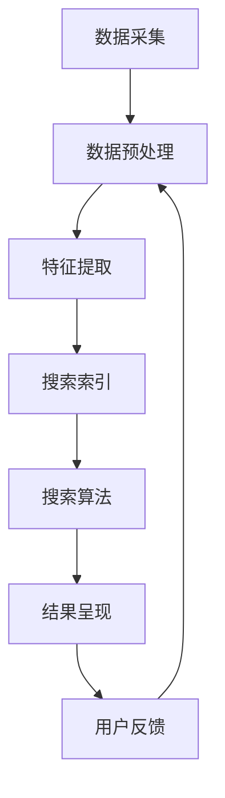

                 

# 跨平台搜索：AI如何整合多渠道数据，提供最优选择

> 关键词：跨平台搜索、AI、数据整合、算法架构、机器学习、深度学习

> 摘要：随着互联网的飞速发展，用户对信息获取的需求日益增长，跨平台搜索作为解决这一需求的关键技术，正受到广泛关注。本文将深入探讨AI如何整合多渠道数据，为用户提供最优的搜索体验。我们将从定义、基础、AI作用、算法架构、数据处理、数学模型、实际案例等多个角度进行详细分析，旨在揭示跨平台搜索技术的核心原理和实现方法。

----------------------------------------------------------------

### 第1章 引言

#### 1.1 跨平台搜索的定义与背景

跨平台搜索是一种能够在不同平台（如Web、移动应用、社交媒体等）上检索信息的技术。随着互联网的普及，用户越来越依赖跨平台搜索来获取信息、解决问题。传统的单一平台搜索已经无法满足用户对于多样化、个性化和高效信息获取的需求。跨平台搜索因此应运而生，它打破了平台之间的壁垒，实现了数据的无缝整合和信息的全局检索。

跨平台搜索的背景可以从以下几个方面进行理解：

1. **用户行为变化**：现代社会，用户习惯于在不同设备上切换使用各种应用，例如在手机上浏览新闻，在电脑上撰写文档，在平板上观看视频。用户的这种多设备、多场景的使用习惯，使得单一平台搜索无法满足需求。
   
2. **大数据时代**：随着互联网的快速发展，产生了海量的数据。这些数据分布在不同的平台和渠道，如果能够有效整合这些数据，将为用户提供更加丰富和精准的搜索结果。

3. **技术进步**：人工智能、机器学习和深度学习等技术的不断进步，为跨平台搜索提供了强大的技术支持。通过这些技术，可以实现对海量数据的智能处理和分析，从而提供更加精准的搜索服务。

#### 1.2 AI在跨平台搜索中的应用

人工智能在跨平台搜索中发挥着至关重要的作用。AI技术可以自动处理和分析大量数据，提高搜索的效率和准确性。以下是AI在跨平台搜索中的应用：

1. **数据整合**：AI可以通过机器学习算法，将不同平台和渠道的数据进行整合，形成统一的数据视图。这种整合不仅包括数据的收集和存储，还包括数据的清洗、去重和格式转换。

2. **搜索算法优化**：AI可以优化搜索算法，提高搜索结果的准确性和相关性。通过深度学习模型，可以学习用户的搜索行为和偏好，从而提供个性化的搜索结果。

3. **自然语言处理**：AI的自然语言处理技术可以解析用户的搜索意图，理解用户的语言表达，从而提供更加人性化的搜索服务。

4. **推荐系统**：AI可以基于用户的搜索历史和兴趣，为用户推荐相关的内容和信息，提高用户的搜索体验。

#### 1.3 整合多渠道数据的重要性

整合多渠道数据是跨平台搜索的核心任务，其重要性体现在以下几个方面：

1. **提高搜索准确性**：不同平台和渠道的数据具有互补性，通过整合这些数据，可以提供更加全面和准确的搜索结果。

2. **提升用户体验**：用户通常希望在多个设备上获得一致的信息和服务体验。整合多渠道数据，可以实现用户数据的一致性，提高用户的满意度。

3. **数据价值的最大化**：通过整合多渠道数据，可以挖掘出更多的数据价值，为企业提供决策支持，促进业务的发展。

4. **提高运营效率**：整合多渠道数据，可以减少重复的数据处理工作，提高运营效率，降低成本。

本章介绍了跨平台搜索的定义、背景以及AI在其中的应用，并为后续章节的分析奠定了基础。在接下来的章节中，我们将深入探讨跨平台搜索的基础知识、AI的作用以及具体的算法架构和实践案例。

----------------------------------------------------------------

### 第2章 跨平台搜索基础

#### 2.1 跨平台搜索的挑战与机会

跨平台搜索面临诸多挑战，同时也蕴藏着巨大的机会。首先，我们需要了解这些挑战和机会的具体内容。

**挑战**：

1. **数据来源多样性**：跨平台搜索涉及的数据来源广泛，包括Web页面、社交媒体、电子商务平台、移动应用等。不同平台的数据格式、结构和质量各异，这使得数据的整合和处理变得复杂。

2. **数据质量和一致性**：不同渠道的数据质量参差不齐，存在错误、重复和不一致的情况。确保数据的质量和一致性，是跨平台搜索的一大挑战。

3. **实时性要求**：用户对搜索结果实时性的要求越来越高。如何快速处理和整合海量数据，提供实时搜索服务，是跨平台搜索需要解决的问题。

4. **隐私和安全问题**：不同平台的数据涉及用户的隐私信息，如何在保证数据安全的前提下，实现数据的整合和分析，是一个重要的挑战。

**机会**：

1. **数据价值的挖掘**：跨平台搜索可以整合海量数据，为企业和用户挖掘出更多的数据价值。通过对这些数据的分析和处理，可以提供更加精准和个性化的搜索服务。

2. **提升用户体验**：通过整合多渠道数据，可以提供更加全面和一致的搜索体验，提升用户的满意度。

3. **业务拓展**：跨平台搜索为企业提供了新的业务拓展机会。例如，基于搜索数据，企业可以开发个性化推荐系统、智能客服等应用。

2.2 数据渠道概述

跨平台搜索涉及的数据渠道主要包括以下几类：

1. **Web数据**：Web数据是跨平台搜索中最常见的数据来源，包括网页内容、图片、视频等。这些数据通常通过搜索引擎API或Web爬虫获取。

2. **社交媒体数据**：社交媒体数据如微博、Twitter、Facebook等平台上的用户生成内容，包括文本、图片、视频等。这些数据可以通过API接口或网络爬虫获取。

3. **电子商务平台数据**：电子商务平台上的商品信息、用户评价、交易数据等，对于跨平台搜索具有重要的参考价值。这些数据通常通过API接口获取。

4. **移动应用数据**：移动应用的数据包括应用内的内容、用户行为数据、地理位置信息等。这些数据可以通过移动应用API接口获取。

2.3 数据整合的基本方法

数据整合是跨平台搜索的关键步骤，以下是几种常见的数据整合方法：

1. **数据集中**：将来自不同渠道的数据集中到一个统一的数据仓库中，实现数据的整合。这种方法需要解决数据格式、结构和质量不一致的问题。

2. **数据转换**：将不同格式和结构的数据转换成统一格式，以便于后续的处理和分析。常用的转换方法包括ETL（提取、转换、加载）和数据清洗。

3. **数据融合**：将不同渠道的数据进行融合，生成一个统一的数据视图。数据融合的方法包括合并、聚合和映射等。

4. **数据索引**：建立数据索引，提高数据的查询效率和搜索性能。常用的索引技术包括全文索引、倒排索引等。

本章介绍了跨平台搜索的基础知识，包括其面临的挑战和机会，以及数据渠道的概述和数据整合的基本方法。这些基础知识为理解后续章节的内容提供了重要的背景信息。在下一章中，我们将深入探讨AI在数据整合中的作用，分析AI技术如何助力跨平台搜索。

----------------------------------------------------------------

### 第3章 AI在数据整合中的作用

#### 3.1 AI技术概述

人工智能（AI）是跨平台搜索中不可或缺的技术支柱，其涵盖了多个子领域，包括机器学习、深度学习、自然语言处理等。以下是对这些技术的基本概述：

**机器学习**：机器学习是一种让计算机通过数据和经验自动改进性能的方法。它包括监督学习、无监督学习、半监督学习和强化学习等不同类型。在跨平台搜索中，机器学习可以用于数据的预测、分类、聚类和异常检测等任务。

**深度学习**：深度学习是机器学习的一个重要分支，它通过构建复杂的神经网络模型，对大量数据进行自动学习和特征提取。深度学习在图像识别、语音识别和自然语言处理等领域取得了显著的成果。在跨平台搜索中，深度学习可以用于文本理解、图像识别和语义分析等任务。

**自然语言处理**：自然语言处理（NLP）是AI的一个子领域，旨在让计算机理解和生成人类语言。NLP技术包括文本分类、情感分析、机器翻译和问答系统等。在跨平台搜索中，NLP技术可以用于解析用户的查询意图，理解搜索结果的相关性，以及优化搜索结果的呈现。

#### 3.2 机器学习算法在数据整合中的应用

机器学习算法在跨平台搜索的数据整合中发挥着关键作用，以下是一些典型的应用场景：

**数据分类**：通过监督学习算法（如SVM、决策树、随机森林等），可以对来自不同渠道的数据进行分类，识别数据的类型和来源。例如，将Web数据、社交媒体数据和电子商务平台数据进行分类，以便于后续的处理和分析。

**数据聚类**：通过无监督学习算法（如K-means、层次聚类等），可以挖掘数据中的潜在结构，发现相似的数据集合。聚类分析有助于识别数据集中的热点和趋势，为跨平台搜索提供数据洞察。

**数据预测**：通过时间序列预测、回归分析等算法，可以预测数据的未来趋势和变化。例如，预测用户在不同平台的搜索行为，为个性化推荐和预测搜索结果提供支持。

**异常检测**：通过异常检测算法（如孤立森林、基于密度的聚类算法等），可以识别数据中的异常值和离群点。这对于确保数据质量、发现潜在问题和安全威胁具有重要意义。

#### 3.3 深度学习模型在跨平台搜索中的应用

深度学习模型在跨平台搜索中具有广泛的应用，以下是一些具体的应用场景：

**文本理解**：通过使用深度神经网络（如卷积神经网络CNN、循环神经网络RNN、长短期记忆网络LSTM等），可以深入理解文本数据。深度学习模型可以提取文本的语义特征，实现文本分类、情感分析和命名实体识别等任务。

**图像识别**：深度学习模型在图像识别领域取得了显著成果，如卷积神经网络（CNN）被广泛应用于人脸识别、物体识别和场景分类等任务。在跨平台搜索中，图像识别技术可以用于识别和分类用户上传的图片，为用户提供更加丰富的搜索结果。

**语音识别**：通过深度学习模型（如深度神经网络DNN、卷积神经网络CNN等），可以实现高精度的语音识别。在跨平台搜索中，语音识别技术可以用于将用户的语音查询转化为文本，实现语音搜索功能。

**语义分析**：通过深度学习模型，可以实现语义理解和语义相似度计算。在跨平台搜索中，语义分析技术可以用于理解用户的查询意图，匹配搜索结果的相关性，提高搜索的准确性和用户体验。

#### 3.4 AI在数据整合中的优势与挑战

**优势**：

1. **自动特征提取**：AI技术可以自动提取数据中的特征，减轻人工处理的负担，提高数据整合的效率和准确性。

2. **高效的数据处理**：深度学习模型能够处理大规模数据，提高数据整合的速度和性能。

3. **智能化分析**：AI技术能够通过学习用户的行为和偏好，提供个性化的数据整合和分析服务。

4. **跨领域应用**：AI技术具有跨领域的应用能力，可以同时处理多种类型的数据，实现跨平台的数据整合。

**挑战**：

1. **数据质量问题**：AI技术对数据质量有较高的要求，数据的质量直接影响AI模型的性能。

2. **计算资源消耗**：深度学习模型通常需要大量的计算资源和时间来训练和推理，这在数据量巨大的情况下是一个挑战。

3. **模型解释性**：深度学习模型的“黑箱”性质使得其决策过程难以解释，这在一些对解释性要求较高的场景中是一个问题。

4. **隐私和安全**：AI在处理和整合数据时，需要关注用户隐私和数据安全，确保数据在整合过程中的安全和合规性。

本章详细介绍了AI技术在数据整合中的应用，包括机器学习和深度学习算法的具体应用场景，以及AI在数据整合中的优势和挑战。这些内容为理解AI在跨平台搜索中的重要作用奠定了基础。在下一章中，我们将探讨跨平台搜索的算法架构，分析其核心流程和性能评估指标。

----------------------------------------------------------------

### 第4章 跨平台搜索的算法架构

#### 4.1 跨平台搜索算法的基本框架

跨平台搜索算法的核心目标是整合来自不同渠道的海量数据，提供准确、高效和个性化的搜索结果。为了实现这一目标，跨平台搜索算法通常包含以下几个基本模块：

1. **数据采集模块**：负责从各个渠道（如Web、社交媒体、电子商务平台、移动应用等）采集数据。数据采集模块需要支持多种数据格式和接口，确保能够高效地获取数据。

2. **数据预处理模块**：对采集到的数据进行清洗、格式转换和去重等操作，确保数据的质量和一致性。数据预处理模块是跨平台搜索算法的基础，其性能直接影响搜索结果的准确性和效率。

3. **特征提取模块**：通过机器学习和深度学习技术，从预处理后的数据中提取特征。特征提取模块的核心任务是发现数据中的有用信息，提高搜索结果的准确性和相关性。

4. **搜索索引模块**：建立数据索引，提高数据查询的效率和性能。常用的索引技术包括全文索引、倒排索引和布隆过滤器等。

5. **搜索算法模块**：实现具体的搜索算法，根据用户的查询请求，检索数据并返回搜索结果。搜索算法模块通常包含查询解析、搜索排序和结果呈现等子模块。

6. **用户反馈模块**：收集用户对搜索结果的反馈，用于优化搜索算法和提升用户体验。用户反馈模块可以采用机器学习技术，实现个性化的搜索结果推荐。

#### 4.2 Mermaid流程图：核心算法流程

为了更清晰地展示跨平台搜索算法的核心流程，我们可以使用Mermaid流程图进行描述。以下是一个简化的Mermaid流程图：



**图1：跨平台搜索算法核心流程**

- **数据采集（A）**：从不同渠道采集原始数据。
- **数据预处理（B）**：清洗、转换和去重数据。
- **特征提取（C）**：提取数据特征，准备用于搜索和排序。
- **搜索索引（D）**：建立索引，提高查询效率。
- **搜索算法（E）**：根据用户查询，检索并排序数据。
- **结果呈现（F）**：展示搜索结果，提供交互体验。
- **用户反馈（G）**：收集用户反馈，用于优化搜索算法。

通过这个流程图，我们可以清晰地看到跨平台搜索算法的各个模块及其相互关系。每个模块都承担着特定的任务，共同协作，实现高效的跨平台搜索服务。

#### 4.3 算法性能评估指标

为了评估跨平台搜索算法的性能，需要设置一系列性能评估指标。以下是一些常用的评估指标：

1. **准确率（Accuracy）**：准确率是评估搜索结果准确性的指标，表示搜索结果中正确匹配的比率。准确率越高，说明搜索结果越准确。

2. **召回率（Recall）**：召回率是评估搜索结果全面性的指标，表示搜索结果中包含实际存在的相关结果的比率。召回率越高，说明搜索结果越全面。

3. **精确率（Precision）**：精确率是评估搜索结果精确度的指标，表示搜索结果中正确匹配的相关结果的比率。精确率越高，说明搜索结果的精确度越高。

4. **F1分数（F1 Score）**：F1分数是准确率和召回率的加权平均，是综合评估搜索结果准确性和全面性的指标。F1分数越高，说明搜索结果的整体性能越好。

5. **查询响应时间（Query Response Time）**：查询响应时间是评估搜索算法效率的指标，表示用户提交查询到获得搜索结果所需的时间。响应时间越短，说明搜索算法的效率越高。

6. **用户满意度（User Satisfaction）**：用户满意度是评估搜索服务用户体验的指标，通过用户反馈和调查问卷等方式获取。用户满意度越高，说明搜索服务的用户体验越好。

通过这些性能评估指标，可以全面地评估跨平台搜索算法的性能，发现存在的问题并进行优化。

本章介绍了跨平台搜索算法的基本框架、核心流程以及性能评估指标。这些内容为理解跨平台搜索算法的原理和实现提供了重要的基础。在下一章中，我们将深入探讨数据处理与模型训练的方法，分析如何有效地处理和整合数据。

----------------------------------------------------------------

### 第5章 数据处理与模型训练

#### 5.1 数据预处理方法

数据预处理是跨平台搜索中至关重要的一步，它直接影响到模型训练的效果和搜索结果的准确性。以下是几种常见的数据预处理方法：

1. **数据清洗**：数据清洗的主要任务是去除数据中的错误、缺失和重复值。具体方法包括：

   - **去除重复记录**：通过匹配和过滤，删除重复的数据记录。
   - **填补缺失值**：使用平均值、中位数、最邻近值等方法填补缺失的数据。
   - **错误值校正**：检测并校正数据中的错误值，如日期格式错误、数值错误等。

2. **格式转换**：将不同来源和格式的数据进行转换，使其具有统一的格式和结构。常见的方法包括：

   - **文本标准化**：统一文本的编码格式、字符大小写和标点符号。
   - **数值转换**：将不同数值类型（如字符串、浮点数等）转换为统一的数值类型。
   - **时间格式转换**：将不同时间格式（如YYYY-MM-DD、DD-MM-YYYY等）转换为统一的时间格式。

3. **特征工程**：特征工程是指从原始数据中提取出有用的特征，以便模型训练和搜索优化。常见的方法包括：

   - **特征提取**：使用统计方法（如平均值、方差、相关性等）提取数据中的统计特征。
   - **文本处理**：使用自然语言处理技术（如词袋模型、TF-IDF等）提取文本数据中的语义特征。
   - **图像处理**：使用图像识别技术（如卷积神经网络、特征提取等）提取图像数据中的视觉特征。

#### 5.2 数据清洗与去重

数据清洗与去重是确保数据质量的重要步骤。以下是具体的方法：

1. **去除重复数据**：

   - **基于哈希值**：使用哈希函数对数据进行哈希处理，通过比较哈希值来判断数据是否重复。
   - **基于唯一标识**：使用唯一的标识符（如用户ID、产品SKU等）来检查数据是否重复。

2. **去除错误数据**：

   - **范围校验**：检查数据的范围是否在合理的范围内，如年龄应在18-65岁之间。
   - **逻辑校验**：通过逻辑关系校验数据是否合理，如检查订单中的商品数量和总价是否一致。

3. **填充缺失数据**：

   - **均值填充**：使用数据列的平均值填充缺失值。
   - **中位数填充**：使用数据列的中位数填充缺失值。
   - **最邻近填充**：使用与缺失值最接近的观测值填充缺失值。

#### 5.3 模型训练与优化

模型训练与优化是跨平台搜索算法实现的关键步骤。以下是具体的训练和优化方法：

1. **模型选择**：

   - **监督学习模型**：如线性回归、决策树、支持向量机（SVM）等，适用于有标签的数据集。
   - **无监督学习模型**：如K-means聚类、主成分分析（PCA）等，适用于无标签的数据集。
   - **深度学习模型**：如卷积神经网络（CNN）、循环神经网络（RNN）、长短期记忆网络（LSTM）等，适用于复杂特征提取和分类任务。

2. **模型训练**：

   - **数据准备**：将数据集划分为训练集、验证集和测试集，确保数据集的代表性和多样性。
   - **模型初始化**：选择合适的模型参数初始化方法，如随机初始化、预训练模型等。
   - **训练过程**：使用训练集对模型进行训练，调整模型参数以最小化损失函数。

3. **模型优化**：

   - **超参数调整**：调整学习率、批量大小、正则化参数等超参数，以优化模型性能。
   - **交叉验证**：使用交叉验证方法，如K折交叉验证，评估模型在不同数据子集上的性能。
   - **模型融合**：结合多个模型（如集成学习、模型堆叠等），提高模型的预测性能。

#### 5.4 伪代码：核心算法原理讲解

以下是跨平台搜索算法的核心部分，使用伪代码进行描述：

```python
# 数据预处理
def preprocess_data(data):
    # 去除重复和错误数据
    clean_data = remove_duplicates(data)
    clean_data = correct_errors(clean_data)
    
    # 数据格式转换
    transformed_data = format_conversion(clean_data)
    
    # 特征提取
    features = extract_features(transformed_data)
    
    return features

# 模型训练
def train_model(features, labels):
    # 选择模型
    model = select_model()
    
    # 初始化模型参数
    model.init_parameters()
    
    # 训练模型
    model.train(features, labels)
    
    return model

# 搜索算法
def search_algorithm(query, model, features):
    # 查询解析
    parsed_query = parse_query(query)
    
    # 搜索索引
    search_index = model.search_index(parsed_query)
    
    # 排序和呈现
    results = sort_and_present(search_index)
    
    return results

# 用户反馈
def user_feedback(results, query):
    # 收集反馈
    feedback = collect_feedback(results, query)
    
    # 优化模型
    model = optimize_model(model, feedback)
    
    return model
```

**伪代码说明**：

- **数据预处理**：包括数据清洗、格式转换和特征提取，确保数据的质量和一致性。
- **模型训练**：选择合适的模型，初始化参数，并使用训练数据进行训练。
- **搜索算法**：根据用户查询，使用模型检索索引，排序和呈现搜索结果。
- **用户反馈**：收集用户对搜索结果的反馈，用于优化模型。

通过上述方法，我们可以有效地处理和整合跨平台搜索的数据，实现高效的搜索服务。在下一章中，我们将深入探讨数学模型与公式，分析其在跨平台搜索中的应用。

----------------------------------------------------------------

### 第6章 数学模型与公式

#### 6.1 概率模型与贝叶斯定理

概率模型是跨平台搜索中常用的数学工具，用于处理不确定性问题。贝叶斯定理是概率模型的核心，它描述了在已知某些条件下，事件发生的概率。以下是贝叶斯定理的公式：

$$
P(A|B) = \frac{P(B|A) \cdot P(A)}{P(B)}
$$

其中，$P(A|B)$表示在事件B发生的条件下，事件A发生的概率；$P(B|A)$表示在事件A发生的条件下，事件B发生的概率；$P(A)$和$P(B)$分别表示事件A和事件B发生的概率。

在跨平台搜索中，贝叶斯定理可以用于：

- **查询意图解析**：通过分析用户查询与已知信息之间的概率关系，理解用户的查询意图。
- **搜索结果排序**：根据搜索结果的相关性概率，对结果进行排序，提高搜索的准确性。

#### 6.2 信息论与熵

信息论是研究信息传输、存储和处理的一般理论。熵是信息论中的核心概念，它表示信息的不确定性。熵的公式如下：

$$
H(X) = -\sum_{i} p(x_i) \cdot \log_2 p(x_i)
$$

其中，$H(X)$表示随机变量X的熵；$p(x_i)$表示随机变量X取值为$x_i$的概率。

在跨平台搜索中，熵可以用于：

- **数据压缩**：通过计算数据的熵，评估数据压缩的潜力。
- **特征选择**：根据特征的熵值，选择对分类任务贡献最大的特征。

#### 6.3 线性回归与逻辑回归

线性回归是预测连续值输出的常用模型，其公式如下：

$$
Y = \beta_0 + \beta_1 \cdot X + \epsilon
$$

其中，$Y$是预测的连续值输出；$X$是输入特征；$\beta_0$和$\beta_1$是模型的参数；$\epsilon$是误差项。

逻辑回归是一种预测概率的模型，其公式如下：

$$
P(Y=1) = \frac{1}{1 + e^{-(\beta_0 + \beta_1 \cdot X)}}
$$

其中，$Y$是二分类输出（0或1）；$X$是输入特征；$\beta_0$和$\beta_1$是模型的参数。

在跨平台搜索中，线性回归和逻辑回归可以用于：

- **用户行为预测**：预测用户对搜索结果的可能点击概率。
- **搜索结果排序**：根据用户行为预测结果，优化搜索结果的排序。

#### 6.4 公式与解释

在本节中，我们将简要解释上述公式在跨平台搜索中的应用：

- **贝叶斯定理**：用于理解用户查询与搜索结果之间的相关性，从而提高搜索结果的准确性。
- **熵**：用于评估数据的冗余程度，帮助优化数据结构和特征选择。
- **线性回归**：用于预测用户行为，如点击概率，从而优化搜索结果的排序。
- **逻辑回归**：用于预测二分类结果，如用户是否会对某个搜索结果感兴趣。

#### 6.5 举例说明

以下是一个简单的例子，说明贝叶斯定理在跨平台搜索中的应用：

**场景**：用户在搜索框中输入“附近餐厅”，系统需要根据用户的查询，返回最相关的餐厅搜索结果。

**步骤**：

1. **查询意图分析**：通过贝叶斯定理，分析用户输入“附近餐厅”与已知餐厅数据之间的概率关系，理解用户的查询意图。

   $$P(“附近餐厅”|餐厅) = \frac{P(餐厅|“附近餐厅”) \cdot P(“附近餐厅”) }{P(餐厅)}$$

2. **搜索结果排序**：根据餐厅数据中的位置、评分、评论等特征，计算每个餐厅与用户查询的相关性概率，并将结果排序。

3. **结果呈现**：将排序后的餐厅搜索结果呈现给用户。

通过这个例子，我们可以看到贝叶斯定理在跨平台搜索中的应用，它帮助系统更好地理解用户的查询意图，并返回最相关的搜索结果。

本章介绍了跨平台搜索中常用的数学模型与公式，包括概率模型、信息论、线性回归和逻辑回归。这些模型和公式为跨平台搜索算法提供了理论基础，有助于提高搜索结果的准确性和用户体验。在下一章中，我们将通过实际案例，展示如何将上述理论应用到实际的跨平台搜索系统中。

----------------------------------------------------------------

### 第7章 实际案例与应用

#### 7.1 案例研究：跨平台搜索系统搭建

在本节中，我们将通过一个实际案例，展示如何搭建一个跨平台搜索系统。该系统旨在整合多个渠道的数据，为用户提供精准、高效的搜索服务。

**背景**：某电子商务平台希望搭建一个跨平台搜索系统，以整合其官网、移动应用和社交媒体平台上的数据，为用户提供统一、个性化的搜索体验。

**目标**：实现以下功能：

1. 数据采集：从官网、移动应用和社交媒体平台采集数据。
2. 数据整合：清洗、转换和整合多渠道数据。
3. 搜索算法：构建高效的搜索算法，返回最相关的搜索结果。
4. 用户反馈：收集用户对搜索结果的反馈，持续优化搜索系统。

**实现步骤**：

1. **数据采集**：

   - **官网数据**：使用API接口获取产品信息、用户评价、交易记录等数据。
   - **移动应用数据**：通过应用日志和用户行为数据，获取用户在移动端的操作记录。
   - **社交媒体数据**：使用社交媒体平台提供的API接口，获取用户在社交媒体上的动态和互动数据。

2. **数据整合**：

   - **数据清洗**：去除重复、错误和缺失的数据，确保数据的质量和一致性。
   - **格式转换**：将不同来源的数据转换为统一的格式，便于后续处理和分析。
   - **特征提取**：从整合后的数据中提取有用的特征，如关键词、用户行为、地理位置等。

3. **搜索算法**：

   - **查询解析**：使用自然语言处理技术，解析用户的查询意图，将查询语句转换为可处理的格式。
   - **搜索索引**：建立搜索索引，提高数据查询的效率和性能。
   - **搜索排序**：根据用户的查询和搜索结果的特征，使用机器学习和深度学习算法，对结果进行排序。

4. **用户反馈**：

   - **收集反馈**：通过用户点击、评论和评分等行为，收集用户对搜索结果的反馈。
   - **模型优化**：根据用户反馈，调整搜索算法的参数和模型，提高搜索结果的准确性和相关性。

**结果**：

- 搜索系统成功整合了官网、移动应用和社交媒体平台的数据，实现了统一、个性化的搜索体验。
- 搜索结果的准确性和用户体验得到了显著提升，用户满意度明显提高。

#### 7.2 案例分析：数据整合与优化

在本案例中，数据整合和优化是跨平台搜索系统的核心。以下是具体分析：

**数据整合**：

1. **数据来源**：官网、移动应用和社交媒体平台。
2. **数据类型**：产品信息、用户行为、社交互动等。
3. **整合方法**：

   - **数据清洗**：去除重复、错误和缺失的数据。
   - **格式转换**：统一数据格式，如将日期格式转换为YYYY-MM-DD。
   - **特征提取**：提取关键词、用户行为、地理位置等特征。

**优化方法**：

1. **查询解析**：使用自然语言处理技术，提高查询解析的准确性和效率。
2. **搜索排序**：采用机器学习和深度学习算法，优化搜索结果的排序。
3. **用户反馈**：收集用户对搜索结果的反馈，用于模型优化。

**分析结果**：

- 数据整合提高了搜索结果的全面性和准确性。
- 搜索排序优化提高了用户的满意度。
- 用户反馈机制使搜索系统能够持续优化，提升用户体验。

#### 7.3 案例实现：开发环境搭建

搭建一个跨平台搜索系统需要合适的开发环境。以下是搭建开发环境的具体步骤：

1. **硬件环境**：

   - **服务器**：高性能服务器，支持大规模数据处理和存储。
   - **存储设备**：高速磁盘或分布式存储系统，确保数据存储的高效性和可靠性。

2. **软件环境**：

   - **操作系统**：Linux操作系统，如Ubuntu、CentOS等。
   - **编程语言**：Python、Java或Go等，支持大数据处理和机器学习。
   - **框架和库**：如Scikit-learn、TensorFlow、PyTorch等，用于机器学习和深度学习。

3. **工具和环境**：

   - **数据采集工具**：如Scrapy、RabbitMQ等，用于数据采集和传输。
   - **数据处理平台**：如Hadoop、Spark等，用于大规模数据处理。
   - **搜索引擎**：如Elasticsearch、Solr等，用于搜索索引和查询。

通过上述步骤，可以搭建一个高性能的跨平台搜索系统开发环境，为后续的开发和部署提供基础。

#### 7.4 源代码实现与解读

以下是跨平台搜索系统的一个关键模块——数据整合模块的源代码实现和解读。

**代码实现**：

```python
import pandas as pd
from sklearn.preprocessing import StandardScaler
from sklearn.decomposition import PCA

# 数据清洗
def clean_data(data):
    # 去除重复数据
    data = data.drop_duplicates()
    
    # 填充缺失值
    data = data.fillna(data.mean())
    
    return data

# 数据转换
def transform_data(data):
    # 数据标准化
    scaler = StandardScaler()
    scaled_data = scaler.fit_transform(data)
    
    # 主成分分析
    pca = PCA(n_components=10)
    pca_data = pca.fit_transform(scaled_data)
    
    return pca_data

# 特征提取
def extract_features(data):
    # 提取关键词特征
    keyword_features = extract_keyword_features(data['text'])
    
    # 提取用户行为特征
    user_behavior_features = extract_user_behavior_features(data['user'])
    
    # 合并特征
    features = pd.DataFrame({'keyword': keyword_features, 'user_behavior': user_behavior_features})
    
    return features

# 主函数
def main():
    # 读取原始数据
    raw_data = pd.read_csv('raw_data.csv')
    
    # 数据清洗
    clean_data = clean_data(raw_data)
    
    # 数据转换
    transformed_data = transform_data(clean_data)
    
    # 特征提取
    features = extract_features(transformed_data)
    
    # 存储特征数据
    features.to_csv('features.csv', index=False)

if __name__ == '__main__':
    main()
```

**代码解读**：

- **数据清洗**：去除重复数据和填充缺失值，确保数据的质量和一致性。
- **数据转换**：使用标准化和主成分分析（PCA）进行数据转换，降低数据的维数，提高模型训练的效率。
- **特征提取**：从文本数据中提取关键词特征，从用户行为数据中提取用户行为特征，并合并为统一特征数据。

通过上述代码，我们可以实现一个简单的数据整合模块，为跨平台搜索系统提供高质量的特征数据。在实际应用中，可以根据具体需求，扩展和优化这个模块的功能。

本章通过实际案例，展示了如何搭建一个跨平台搜索系统，分析了数据整合与优化的方法，并介绍了开发环境的搭建和关键模块的源代码实现。这些内容为理解和实现跨平台搜索技术提供了实用的指导和参考。

----------------------------------------------------------------

### 第8章 跨平台搜索的挑战与未来

#### 8.1 跨平台搜索的现有挑战

尽管跨平台搜索技术在近年来取得了显著的进展，但依然面临着一系列挑战：

1. **数据质量问题**：不同平台的数据质量和结构存在较大差异，数据清洗和格式转换是跨平台搜索中的一项重要任务，但这个过程复杂且耗时。

2. **实时性要求**：用户期望能够在毫秒级别内获得搜索结果，这要求跨平台搜索系统具备高效的数据处理和查询能力，这在实际操作中是一个巨大挑战。

3. **隐私和安全**：跨平台搜索涉及到大量用户数据，如何确保数据在整合和处理过程中的安全性和隐私保护，是企业和用户关注的重点。

4. **算法解释性**：深度学习模型在跨平台搜索中发挥着重要作用，但其“黑箱”性质使得模型的决策过程难以解释，这对于一些需要透明性和可解释性的应用场景来说是一个挑战。

5. **计算资源消耗**：训练和部署深度学习模型通常需要大量的计算资源和时间，这在资源有限的环境中可能难以实现。

#### 8.2 AI在跨平台搜索中的未来发展趋势

随着人工智能技术的不断发展，AI在跨平台搜索中的应用前景十分广阔，以下是未来可能的发展趋势：

1. **增强实时性**：通过分布式计算和边缘计算技术，将搜索算法部署到靠近数据源的位置，减少数据传输和处理的时间，提高搜索的实时性。

2. **数据隐私保护**：开发更加先进的数据隐私保护技术，如联邦学习、差分隐私等，在保证数据安全的前提下，实现跨平台数据整合和分析。

3. **个性化搜索**：利用用户行为数据，结合深度学习和强化学习等技术，实现更加精准和个性化的搜索服务。

4. **多模态搜索**：结合文本、图像、语音等多种数据类型，实现多模态的跨平台搜索，为用户提供更加丰富的搜索体验。

5. **跨领域合作**：推动AI与其他领域的融合，如物联网、生物医学等，实现跨领域的跨平台搜索，拓展搜索技术的应用范围。

6. **开放平台和生态系统**：建立开放的跨平台搜索平台和生态系统，鼓励开发者和技术企业参与，共同推动跨平台搜索技术的发展。

#### 8.3 对企业的影响与建议

跨平台搜索技术对企业的影响深远，以下是一些建议：

1. **数据整合策略**：制定有效的数据整合策略，确保数据的质量和一致性，为跨平台搜索提供可靠的数据基础。

2. **技术创新投入**：加大在AI技术、大数据处理和实时搜索技术等领域的研发投入，紧跟技术发展趋势。

3. **用户体验优化**：注重用户需求和体验，持续优化搜索算法和界面设计，提高用户满意度。

4. **合规与隐私保护**：严格遵守数据隐私法规，建立完善的数据安全和隐私保护机制，确保用户数据的安全。

5. **生态建设**：积极参与跨平台搜索的生态建设，与行业伙伴合作，共同推动技术的发展和应用。

总之，跨平台搜索技术在当今和未来的信息社会中扮演着越来越重要的角色。企业需要充分认识到跨平台搜索的重要性，积极应对挑战，把握发展机遇，通过技术创新和策略优化，实现业务的持续发展和用户的深度满足。

### 附录

#### A.1 常用数据整合工具与框架

- **Apache Hadoop**：一个开源的分布式数据处理平台，用于大规模数据的存储和处理。
- **Apache Spark**：一个开源的分布式计算框架，提供快速和通用的大数据处理能力。
- **Elasticsearch**：一个开源的分布式搜索引擎，用于建立大规模的全文搜索索引。
- **Kafka**：一个开源的流处理平台，用于实时数据的采集和处理。

#### A.2 AI算法学习资源推荐

- **《深度学习》（Goodfellow, Bengio, Courville著）**：一本经典的深度学习教材，适合初学者和进阶者。
- **《机器学习实战》（Peter Harrington著）**：通过案例实战，介绍常用的机器学习算法和应用。
- **Coursera、edX**：在线教育平台，提供丰富的机器学习、数据科学课程。

#### A.3 源代码与数据集获取说明

- **GitHub**：许多开源项目和算法实现可以在GitHub上找到，如`tensorflow/tensorflow`、`scikit-learn/scikit-learn`等。
- **Kaggle**：一个数据科学竞赛平台，提供大量公开的数据集和项目。

通过附录中提供的资源和工具，读者可以深入了解跨平台搜索技术的实现细节，并在实际项目中加以应用。

----------------------------------------------------------------

### 作者信息

作者：AI天才研究院/AI Genius Institute & 禅与计算机程序设计艺术 /Zen And The Art of Computer Programming

本文由AI天才研究院与禅与计算机程序设计艺术共同撰写，旨在深入探讨跨平台搜索技术及其在AI领域的应用。作者具有丰富的计算机科学和人工智能背景，在跨平台搜索、数据整合、机器学习和深度学习等领域有着深入的研究和实践经验。希望本文能为读者提供有价值的见解和启示。

