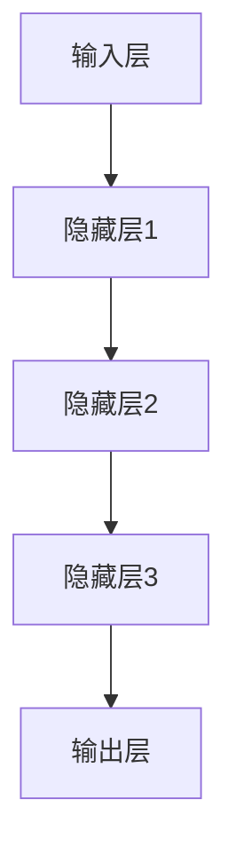
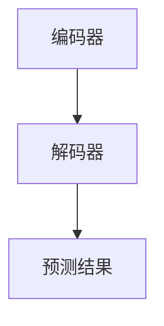

                 

# 软件2.0的伦理规范：人工智能的责任

> 关键词：软件2.0、人工智能、伦理规范、大模型、责任、监管

> 摘要：本文探讨了软件2.0时代的到来以及人工智能（AI）大模型的核心地位，分析了AI在各个领域中的应用和开发流程。同时，本文深入探讨了AI大模型的伦理规范与责任，包括伦理规范的重要性、主要伦理问题和监管机制的构建。通过案例分析和资源汇总，本文为读者提供了全面的AI大模型开发和应用指导。

## 第一部分: 软件2.0时代的AI大模型基础

### 第1章: 软件2.0与AI大模型概述

#### 第1章: 软件2.0与AI大模型概述

#### 1.1 软件2.0时代的到来

软件1.0阶段主要聚焦于计算机硬件和操作系统的发展，软件2.0阶段则标志着软件与互联网、大数据和人工智能深度融合的开始。

在软件1.0阶段，计算机系统的发展主要集中在硬件和操作系统的改进上。这一阶段的特点是软件的功能相对简单，主要服务于计算机硬件的基本需求，如文件管理、文字处理和简单的计算任务等。

然而，随着互联网的普及和大数据技术的发展，软件的功能和需求发生了巨大的变化。软件2.0阶段强调软件与互联网、大数据和人工智能的深度融合，通过这些技术的支持，软件的功能得到了极大的扩展和提升。

首先，互联网的普及使得软件可以跨越地域限制，实现全球范围内的信息共享和交流。这使得软件不再局限于本地使用，而是成为连接全球用户的重要工具。

其次，大数据技术的发展为软件提供了丰富的数据资源。通过大数据分析，软件可以更加精准地满足用户的需求，提供个性化的服务。例如，电子商务平台可以根据用户的购买历史和行为数据，推荐适合的商品。

最后，人工智能技术的引入使得软件具备了智能化的能力。人工智能大模型通过对海量数据的训练，可以实现对图像、语音、文本等数据的智能处理，从而实现智能推荐、智能客服、智能翻译等功能。

#### 1.1.2 从软件1.0到软件2.0的演进

软件2.0阶段的到来，标志着软件从单一的功能性工具向综合性的智能系统转变。这一转变主要体现在以下几个方面：

1. **软件架构的变革**：软件2.0阶段强调模块化、组件化和云计算的架构设计，使得软件系统更加灵活、可扩展和可维护。开发者可以通过微服务、容器和分布式架构等技术，快速构建和部署复杂的软件系统。

2. **数据驱动的决策**：软件2.0阶段强调数据的收集、存储、处理和分析，将数据作为核心资产。通过大数据技术和人工智能算法，软件可以从海量数据中提取有价值的信息，为决策提供支持。

3. **用户体验的提升**：软件2.0阶段注重用户体验，通过人工智能技术，软件可以更加智能化地理解用户需求，提供个性化的服务。例如，智能推荐系统可以根据用户的兴趣和行为，推荐相关的商品、内容和广告。

4. **跨界融合的发展**：软件2.0阶段强调不同领域之间的融合，如物联网（IoT）、云计算、区块链和人工智能等。这些技术的融合，使得软件可以更加全面地解决实际问题，提供跨领域的综合解决方案。

#### 1.1.3 大模型在软件2.0中的核心地位

大模型作为软件2.0的核心，是实现智能化和自动化的重要引擎。大模型具有以下重要特征：

1. **海量数据训练**：大模型通过对海量数据进行训练，可以提取出数据中的特征和规律。这使得大模型具有强大的数据处理和分析能力，可以应对复杂的业务场景。

2. **自学习能力**：大模型具有自学习能力，可以通过不断的学习和优化，提高模型的性能和准确性。这种自学习能力使得大模型能够不断适应新的环境和需求，实现持续改进。

3. **泛化能力**：大模型通过训练可以获得较高的泛化能力，可以将学到的知识应用于新的任务和场景。这使得大模型可以广泛应用于不同的业务领域，提供跨领域的解决方案。

4. **高效计算**：随着硬件技术的发展，大模型的计算能力得到了大幅提升。这使得大模型可以在实时性和低延迟的要求下，提供高效的计算和响应能力。

大模型在软件2.0中的应用范围广泛，包括自然语言处理、计算机视觉、推荐系统、智能监控等领域。通过大模型的应用，软件可以实现智能化和自动化，提高生产效率、优化业务流程和提升用户体验。

#### 1.1.4 企业级应用开发的新范式

在软件2.0时代，企业级应用开发面临着新的挑战和机遇。开发者需要具备跨领域的综合能力，包括算法、工程化、运维和业务理解等多方面。以下是企业级应用开发的新范式：

1. **敏捷开发和迭代**：企业级应用开发需要采用敏捷开发方法，快速响应业务需求的变化。通过迭代开发和持续交付，可以确保软件系统的灵活性和适应性。

2. **微服务架构**：微服务架构可以将复杂的业务系统拆分为多个独立的、可重用的服务。这种方式可以提高系统的可扩展性和可维护性，同时降低系统集成的复杂性。

3. **DevOps文化**：DevOps文化强调开发（Development）和运维（Operations）的协同工作，通过自动化和协作，实现软件开发的持续交付和部署。

4. **数据驱动**：企业级应用开发需要建立数据驱动的决策体系，通过大数据技术和人工智能算法，从海量数据中提取有价值的信息，为决策提供支持。

5. **用户体验优先**：用户体验是企业级应用开发的重要目标。通过用户研究、用户测试和用户反馈，可以不断优化和改进软件的界面和交互设计，提升用户满意度。

### 第2章: AI大模型技术基础

#### 第2章: AI大模型技术基础

#### 2.1 深度学习与神经网络基础

##### 2.1.1 神经网络的基本结构

神经网络是一种模拟人脑神经元结构和功能的计算模型，它由多个层次组成，包括输入层、隐藏层和输出层。每个层次包含多个神经元，神经元之间通过权重矩阵连接，并通过激活函数进行数据的传递和变换。

输入层接收外部输入数据，经过隐藏层的多层处理，最终输出结果。隐藏层负责对输入数据进行特征提取和变换，输出层则生成最终的预测结果。

神经网络的基本结构如图所示：

##### 2.1.2 常见的深度学习架构

深度学习架构包括卷积神经网络（CNN）、循环神经网络（RNN）、长短时记忆网络（LSTM）和Transformer等。每种架构都有其独特的优势和适用场景。

1. **卷积神经网络（CNN）**：CNN是一种专门用于处理图像数据的深度学习架构，它通过卷积层提取图像的特征，并逐层构建复杂的特征表示。CNN在计算机视觉领域取得了显著的成果，如图像分类、目标检测和图像生成等。

2. **循环神经网络（RNN）**：RNN是一种能够处理序列数据的深度学习架构，它通过循环连接的方式，将前一时刻的输出作为当前时刻的输入，从而具有记忆能力。RNN在自然语言处理、语音识别和时间序列分析等领域有广泛应用。

3. **长短时记忆网络（LSTM）**：LSTM是RNN的一种改进模型，它通过引入门控机制，有效地解决了RNN的长期依赖问题。LSTM在自然语言处理、语音识别和序列建模等领域具有广泛的应用。

4. **Transformer**：Transformer是一种基于自注意力机制的深度学习架构，它通过多头自注意力机制和位置编码，实现了对输入序列的并行处理。Transformer在自然语言处理、机器翻译和推荐系统等领域取得了显著的成果。

##### 2.1.3 深度学习优化算法

深度学习优化算法是训练深度学习模型的关键步骤，其中最常用的是梯度下降算法。梯度下降算法通过计算损失函数关于模型参数的梯度，更新模型参数，从而最小化损失函数。

1. **梯度下降（Gradient Descent）**：梯度下降是一种最简单的优化算法，它通过选择适当的步长，沿着损失函数的梯度方向更新模型参数，直至达到局部最小值。

2. **Adam优化器**：Adam优化器是梯度下降算法的一种改进，它结合了AdaGrad和RMSProp的优点，通过自适应调整学习率，提高了训练效率。

3. **动量优化**：动量优化是一种通过引入动量项，利用前一次更新的梯度方向，加速收敛的优化算法。动量优化能够有效避免陷入局部最小值。

#### 2.2 自然语言处理技术概览

##### 2.2.1 词嵌入技术

词嵌入技术是将词语映射到高维向量空间，实现语义理解和计算。词嵌入技术能够有效地将文本数据转化为数值形式，便于深度学习模型的处理。

常见的词嵌入技术包括Word2Vec、GloVe和FastText等。这些技术通过训练大规模语言模型，将词语映射到高维向量空间，使得具有相似语义的词语在向量空间中靠近。

##### 2.2.2 序列模型与注意力机制

序列模型与注意力机制是自然语言处理中的重要技术。

1. **序列模型**：序列模型是处理序列数据（如文本、音频等）的深度学习模型，常见的序列模型包括循环神经网络（RNN）和长短时记忆网络（LSTM）。这些模型通过记忆和更新序列信息，实现对序列数据的建模。

2. **注意力机制**：注意力机制是一种通过自适应分配注意力权重，对输入序列的不同部分进行重点关注的机制。注意力机制能够提高模型的表示能力，使其能够更好地处理复杂的序列数据。在自然语言处理领域，注意力机制广泛应用于机器翻译、文本生成和问答系统等任务。

##### 2.2.3 转换器架构详解

转换器（Transformer）是一种基于自注意力机制的深度学习架构，它在自然语言处理领域取得了显著的成果。转换器由编码器和解码器组成，编码器负责将输入序列编码为上下文表示，解码器则基于编码器的输出生成预测结果。

1. **编码器**：编码器通过多头自注意力机制和位置编码，对输入序列进行编码，生成上下文表示。多头自注意力机制允许模型在编码过程中同时关注输入序列的不同部分，从而提高表示能力。

2. **解码器**：解码器通过自注意力机制和交叉注意力机制，将编码器的输出与输入序列的不同部分进行融合，生成预测结果。交叉注意力机制使得解码器能够从编码器的输出中提取关键信息，从而提高生成结果的准确性。

转换器架构如图所示：

#### 2.3 大规模预训练模型原理

##### 2.3.1 预训练的概念与意义

预训练是指在大规模语料上预先训练模型，使其具有通用语言表示能力。预训练的意义在于：

1. **降低训练成本**：通过预训练，模型已经在大规模语料上完成了初步的训练，从而减少了在具体任务上的训练成本。

2. **提高模型性能**：预训练模型具有强大的语言理解和生成能力，可以显著提高具体任务的性能。

3. **通用性与迁移性**：预训练模型在大规模语料上提取了通用的语言特征，使得模型可以迁移到不同的任务和领域。

##### 2.3.2 自监督学习方法

自监督学习方法是在没有明确标注数据的情况下，通过利用未标注的数据，自动学习模型表示的方法。常见的自监督学习方法包括：

1. **掩码语言模型（MLM）**：MLM方法通过随机掩码部分输入序列的词语，训练模型预测这些掩码词语。MLM方法在预训练模型中起到了关键作用。

2. **填空（MASS）**：MASS方法通过预测输入序列中的缺失词语，训练模型生成完整的句子。

##### 2.3.3 迁移学习与微调技术

迁移学习与微调技术是将预训练模型应用于具体任务的重要方法。

1. **迁移学习**：迁移学习是指将预训练模型在不同任务上的知识进行迁移，从而提高新任务的性能。预训练模型已经在大规模语料上完成了初步的训练，迁移学习能够快速适应新任务。

2. **微调技术**：微调技术是在预训练模型的基础上，针对新任务进行进一步的训练，以适应特定的任务需求。微调技术通过在预训练模型的基础上添加少量参数，进行少量训练，从而实现模型的定制化。

### 第二部分: 企业级AI应用开发准备

#### 第3章: 企业AI战略规划

##### 3.1 AI在企业中的价值评估

AI在企业中的价值主要体现在以下几个方面：

1. **提升生产效率**：AI技术可以通过自动化和智能化手段，提升生产效率，降低人力成本。例如，智能机器人可以替代人工完成重复性、繁琐的工作，提高生产速度和质量。

2. **优化业务流程**：AI技术可以帮助企业优化业务流程，降低运营成本。例如，通过数据分析技术，企业可以更好地预测市场需求，优化库存管理，降低库存成本。

3. **提升用户体验**：AI技术可以提升用户体验，增强客户满意度。例如，通过智能客服系统，企业可以提供24小时不间断的服务，提高客户满意度。

4. **创新产品和服务**：AI技术可以帮助企业创新产品和服务，提高市场竞争力。例如，通过智能推荐系统，企业可以更好地满足用户需求，提高销售额。

##### 3.1.1 AI能力评估框架

为了评估企业在AI领域的综合能力，可以采用以下能力评估框架：

1. **技术能力**：评估企业在AI技术研发和应用方面的能力，包括算法研发、模型训练、系统集成和运维等。

2. **业务应用**：评估企业将AI技术应用于实际业务的能力，包括业务流程优化、产品和服务创新等。

3. **市场竞争力**：评估企业在市场竞争中的优势，包括市场份额、客户满意度、业务增长等。

##### 3.1.2 AI项目ROI分析方法

AI项目的ROI（投资回报率）分析是评估项目经济效益的重要方法。以下是一种常见的ROI分析方法：

1. **投资成本**：包括AI技术研发、模型训练、系统集成和运维等成本。

2. **预期收益**：包括提升生产效率、优化业务流程、提升用户体验、创新产品和服务等带来的收益。

3. **风险控制**：包括技术风险、市场风险、法律风险等，通过风险控制措施降低项目风险。

##### 3.1.3 AI对企业业务流程的影响

AI技术对企业的业务流程产生深远的影响，以下是一些典型的影响：

1. **自动化**：AI技术可以自动化处理大量重复性、繁琐的工作，降低人力成本，提高生产效率。

2. **智能化**：AI技术可以使企业的业务流程更加智能化，通过数据分析、预测和决策，优化业务流程，降低运营成本。

3. **个性化**：AI技术可以分析用户数据，提供个性化的产品和服务，提高客户满意度。

4. **创新**：AI技术可以帮助企业创新产品和服务，开拓新市场，提高市场竞争力。

### 第4章: AI大模型在企业中的应用场景

#### 第4章: AI大模型在企业中的应用场景

#### 4.1 制造业中的AI应用

AI技术在制造业中具有广泛的应用，可以提高生产效率、优化质量控制和实现预测性维护。

##### 4.1.1 智能生产与质量控制

1. **生产过程监控**：通过安装传感器和摄像头，实时监测生产线的运行状态，发现潜在的问题和故障。

2. **生产流程优化**：利用AI技术对生产流程进行分析和优化，提高生产效率，降低成本。

3. **质量控制**：利用AI技术对生产过程中的产品进行质量检测，识别和排除不合格品，确保产品质量。

##### 4.1.2 预测性维护

预测性维护是指通过监测设备运行状态，预测设备可能发生的故障，提前进行维护，避免设备停机。

1. **故障预测**：利用AI技术对设备运行数据进行实时分析，预测设备可能发生的故障，提前进行预防性维护。

2. **维护计划**：根据故障预测结果，制定合理的维护计划，确保设备正常运行。

3. **维护优化**：通过分析历史维护数据和设备运行状态，优化维护策略，降低维护成本。

#### 4.2 零售业中的AI应用

AI技术在零售业中可以提升客户体验、优化库存管理和提高营销效果。

##### 4.2.1 个性化推荐系统

个性化推荐系统通过分析用户行为数据，为用户推荐符合其兴趣和需求的产品。

1. **用户行为分析**：收集用户的历史购买记录、浏览记录和搜索记录等数据，分析用户的兴趣和偏好。

2. **推荐算法**：利用协同过滤、基于内容的推荐和深度学习等技术，为用户推荐合适的产品。

3. **推荐结果优化**：根据用户反馈和推荐效果，不断优化推荐算法，提高推荐准确性。

##### 4.2.2 库存优化

库存优化是指通过数据分析，预测市场需求，合理配置库存，降低库存成本。

1. **需求预测**：利用AI技术分析历史销售数据、市场趋势和促销活动等信息，预测未来的市场需求。

2. **库存管理**：根据需求预测结果，调整库存水平，确保库存合理，避免库存过剩或缺货。

3. **库存优化策略**：通过分析库存水平和销售情况，制定合理的库存优化策略，降低库存成本。

### 第5章: AI大模型开发与部署

#### 第5章: AI大模型开发与部署

#### 5.1 AI大模型开发流程

##### 5.1.1 数据预处理

数据预处理是AI大模型开发的重要环节，主要包括数据清洗、数据归一化和特征提取等。

1. **数据清洗**：清洗数据中的噪声、异常值和缺失值，确保数据的完整性和一致性。

2. **数据归一化**：将不同特征的数据进行归一化处理，使其具有相同的量纲，方便后续计算。

3. **特征提取**：提取数据中的关键特征，为模型训练提供有效的输入特征。

##### 5.1.2 模型设计

模型设计是根据具体任务需求，选择合适的模型架构和参数。

1. **模型架构**：根据任务特点，选择合适的模型架构，如CNN、RNN、LSTM或Transformer等。

2. **模型参数**：设置模型的参数，如学习率、批次大小、迭代次数等。

3. **模型优化**：通过调参和模型优化，提高模型的性能和准确性。

##### 5.1.3 模型训练

模型训练是指通过大规模数据进行模型的训练和优化。

1. **数据集划分**：将数据集划分为训练集、验证集和测试集，用于模型的训练、验证和测试。

2. **模型训练**：通过训练集对模型进行训练，不断调整模型参数，提高模型的性能。

3. **模型验证**：通过验证集对模型进行验证，评估模型的性能和泛化能力。

4. **模型测试**：通过测试集对模型进行测试，评估模型的实际效果。

#### 5.2 AI大模型部署与运维

##### 5.2.1 部署环境搭建

部署环境搭建是指选择合适的硬件和软件环境，搭建用于模型部署的运行环境。

1. **硬件选择**：根据模型的计算需求，选择合适的硬件设备，如CPU、GPU或TPU等。

2. **软件环境**：搭建软件环境，包括操作系统、深度学习框架、库和工具等。

3. **部署架构**：设计部署架构，包括服务架构、数据流和控制流等。

##### 5.2.2 模型评估

模型评估是指通过验证集和测试集对模型进行评估和调优。

1. **模型评估指标**：设置模型评估指标，如准确率、召回率、F1值等。

2. **模型调优**：根据评估结果，调整模型参数和结构，提高模型的性能。

3. **模型验证**：通过验证集对模型进行验证，确保模型的性能和稳定性。

##### 5.2.3 持续集成与部署

持续集成与部署是指通过自动化工具，实现模型的持续集成、测试和部署。

1. **持续集成**：将代码和模型集成到一起，进行自动化测试和验证。

2. **持续部署**：通过自动化工具，将模型部署到生产环境中，实现快速上线和迭代。

3. **运维监控**：对模型进行运维监控，确保模型的稳定运行和性能优化。

### 第三部分: AI大模型的伦理规范与责任

#### 第6章: AI大模型伦理规范

##### 6.1 伦理规范的重要性

AI大模型的伦理规范在当前时代具有重要意义。随着人工智能技术的快速发展，AI大模型在各个领域的应用日益广泛，其影响和潜在风险也逐渐显现。伦理规范可以为AI大模型的应用提供道德准则和行为指南，保障其安全性和公正性。

首先，伦理规范有助于防止AI大模型在决策过程中出现偏见和歧视。AI大模型通常基于大规模数据进行训练，这些数据可能包含历史偏见，导致模型在决策时产生不公平的结果。伦理规范可以指导开发者设计和训练模型时，关注数据的质量和多样性，避免偏见和歧视。

其次，伦理规范有助于确保AI大模型处理的数据符合隐私保护要求。在AI大模型的应用过程中，通常会收集和处理大量的个人数据。伦理规范可以指导开发者采取隐私保护措施，如数据加密、匿名化和数据最小化等，确保个人隐私得到有效保护。

最后，伦理规范有助于明确AI大模型在应用过程中的责任归属和责任承担。在AI大模型应用过程中，可能会出现法律责任和道德责任的问题。伦理规范可以为各方提供明确的指导，确保在发生问题时，责任可以得到有效追究和承担。

##### 6.2 主要伦理问题

在AI大模型的应用过程中，存在以下主要伦理问题：

1. **偏见与歧视**：AI大模型在决策过程中可能存在偏见和歧视，导致不公平的结果。例如，招聘系统可能因为数据偏见而歧视某些性别、种族或年龄段的求职者。

2. **隐私泄露**：AI大模型在处理个人数据时，可能存在隐私泄露的风险。例如，健康数据、财务数据和社交数据等敏感信息的泄露，可能导致严重的隐私侵犯。

3. **透明度不足**：AI大模型通常具有复杂的学习算法和内部结构，使得其决策过程难以解释和理解。透明度不足可能导致公众对AI大模型的信任度下降。

4. **可控性与安全性**：AI大模型在运行过程中，可能受到恶意攻击或错误操作，导致不可预测的后果。可控性与安全性的不足，可能导致AI大模型的失控和风险。

##### 6.3 伦理规范的必要性

伦理规范在AI大模型的应用中具有必要性，原因如下：

1. **保障公平性**：伦理规范可以指导开发者设计和训练模型时，关注数据的质量和多样性，避免偏见和歧视，确保模型的公平性。

2. **保护隐私**：伦理规范可以指导开发者采取隐私保护措施，如数据加密、匿名化和数据最小化等，确保个人隐私得到有效保护。

3. **提高透明度**：伦理规范可以促进开发者开发可解释性强的AI大模型，提高模型的透明度，增强公众对AI大模型的信任。

4. **确保可控性与安全性**：伦理规范可以指导开发者设计具有可控性与安全性的AI大模型，降低模型失控和风险的可能性。

#### 第7章: AI大模型的责任与监管

##### 7.1 责任体系构建

AI大模型的责任体系构建是确保AI大模型应用过程中责任明确和可追究的关键。责任体系主要包括企业责任、个人责任和法律责任等方面。

1. **企业责任**：企业在AI大模型的研发、部署和运营过程中，应承担主要责任。企业需要建立健全的伦理规范和责任制度，确保AI大模型的安全性和公正性。

2. **个人责任**：开发者、研究人员和运营人员在AI大模型的应用过程中，应承担相应的责任。个人责任包括遵循伦理规范、确保数据质量和模型性能、关注模型潜在风险等。

3. **法律责任**：在AI大模型应用过程中，如出现法律责任问题，各方应依法承担相应的法律责任。法律责任包括侵权责任、违约责任和刑事责任等。

##### 7.2 监管机制

监管机制是确保AI大模型应用过程中遵守伦理规范和法律法规的重要手段。以下是一些常见的监管机制：

1. **法规体系**：建立完善的AI大模型法规体系，明确AI大模型研发、部署和运营过程中的法律法规要求，规范各方行为。

2. **标准制定**：制定AI大模型的标准和规范，明确模型设计、训练、评估和部署等方面的要求，提高模型的可靠性和可控性。

3. **监管机构**：设立专门的监管机构，负责AI大模型伦理规范和责任的监督与执行。监管机构可以开展定期审查、风险评估和违规处罚等工作。

4. **社会监督**：鼓励公众参与AI大模型的监督和评价，提高模型的透明度和公众信任度。社会监督可以通过媒体、专家评估和公众投票等方式进行。

##### 7.3 案例分析

以下是对一些历史上的AI大模型伦理问题和责任案例进行分析和讨论，提出改进建议：

1. **案例1：招聘歧视**：某公司使用的招聘系统因数据偏见导致歧视某些性别、种族或年龄段的求职者。分析原因：招聘系统的数据来源可能存在历史偏见，训练过程中没有充分考虑数据多样性和公平性。改进建议：加强数据质量管理，引入多样性指标，优化招聘算法。

2. **案例2：隐私泄露**：某公司因AI大模型处理个人数据不当，导致大量用户隐私泄露。分析原因：公司没有采取有效的隐私保护措施，如数据加密和匿名化等。改进建议：加强隐私保护意识，制定严格的隐私保护政策和流程，确保数据安全。

3. **案例3：模型失控**：某公司AI大模型因设计缺陷和操作失误，导致生产设备失控，造成严重事故。分析原因：模型设计存在缺陷，操作人员未按照规范操作。改进建议：加强模型设计和验证，提高操作人员的培训和教育。

### 附录

#### 附录 A: AI 大模型开发工具与资源

##### A.1 主流深度学习框架对比

以下是对几种主流深度学习框架的对比，包括TensorFlow、PyTorch和JAX。

1. **TensorFlow**：

   - 特点：TensorFlow是由Google开发的开源深度学习框架，支持多种计算图和动态计算图，具有良好的生态和社区支持。
   - 优势：强大的生态系统，丰富的预训练模型和工具库，易于扩展和部署。
   - 局限性：动态计算图可能导致性能下降，调试相对困难。

2. **PyTorch**：

   - 特点：PyTorch是由Facebook开发的开源深度学习框架，基于动态计算图，具有良好的灵活性和可扩展性。
   - 优势：易于调试，动态计算图便于理解模型结构，支持自动微分。
   - 局限性：静态计算图性能较低，生态和社区支持相对较弱。

3. **JAX**：

   - 特点：JAX是由Google开发的开源深度学习框架，基于静态计算图，支持自动微分和分布式计算。
   - 优势：高性能的静态计算图，支持自动微分和分布式计算，易于扩展。
   - 局限性：生态和社区支持相对较弱，调试相对困难。

##### A.2 AI大模型常用库和工具

以下是对一些常用的AI大模型开发库和工具的介绍。

1. **Keras**：

   - 介绍：Keras是一个高层次的深度学习框架，基于TensorFlow和Theano，提供简洁的API和丰富的预训练模型。
   - 使用方法：Keras通过简洁的API，使得深度学习模型的搭建和训练变得简单和高效。

2. **NumPy**：

   - 介绍：NumPy是Python科学计算库，提供高效的数组操作和数学计算功能。
   - 使用方法：NumPy在AI大模型开发中用于数据预处理、特征提取和模型评估等任务。

3. **Pandas**：

   - 介绍：Pandas是Python数据处理库，提供数据清洗、数据转换和数据分析等功能。
   - 使用方法：Pandas在AI大模型开发中用于数据预处理、特征提取和数据分析等任务。

##### A.3 资源汇总

以下是一些AI大模型开发的学习资源，包括在线课程、教程和论文。

1. **在线课程**：

   - 《深度学习》（Goodfellow, Bengio, Courville）: 这是一本经典的深度学习教材，涵盖深度学习的基础知识和最新研究进展。
   - 《自然语言处理实战》（Bird, Klein, Loper）: 这是一本介绍自然语言处理技术的实战指南，包括文本处理、语言模型和文本分类等。

2. **教程**：

   - TensorFlow教程：TensorFlow官方网站提供了一系列教程，涵盖了深度学习的基础知识和TensorFlow的使用方法。
   - PyTorch教程：PyTorch官方网站提供了一系列教程，介绍了PyTorch的基本用法和高级特性。

3. **论文**：

   - 《Attention Is All You Need》: 这篇论文提出了Transformer架构，在自然语言处理领域取得了显著的成果。
   - 《Bert: Pre-training of Deep Bidirectional Transformers for Language Understanding》: 这篇论文提出了BERT模型，推动了自然语言处理技术的发展。

### 作者信息

- 作者：AI天才研究院/AI Genius Institute & 禅与计算机程序设计艺术 /Zen And The Art of Computer Programming

本文从软件2.0时代的背景出发，探讨了AI大模型在各个领域中的应用和开发流程，深入分析了AI大模型的伦理规范与责任。通过案例分析和资源汇总，本文为读者提供了全面的AI大模型开发和应用指导。本文旨在提高读者对AI大模型技术的理解和应用能力，推动AI技术在各个领域的创新和发展。在未来的发展中，AI大模型将发挥越来越重要的作用，我们需要不断关注和研究其伦理规范和责任问题，确保其在社会中的健康发展。|assistant|>

