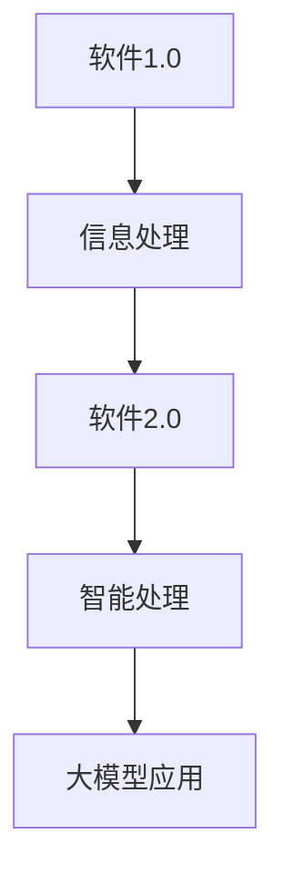
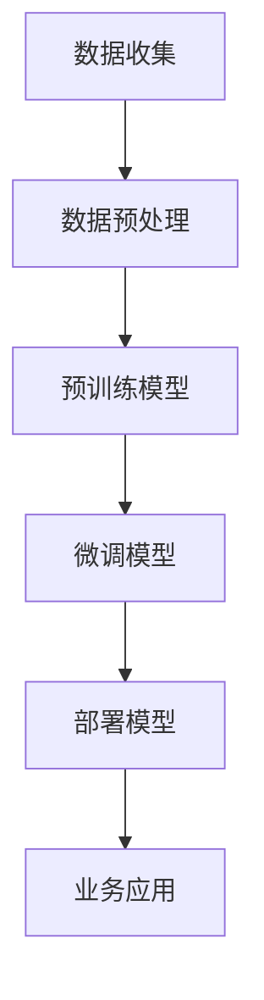
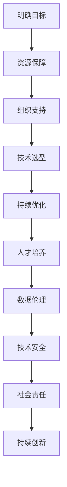

                 

# 文章标题：软件2.0的应用领域：图像识别、语音识别

## 关键词：
- 软件2.0
- 图像识别
- 语音识别
- AI大模型
- 自然语言处理
- 深度学习

## 摘要：
本文深入探讨了软件2.0时代下，图像识别和语音识别技术的应用领域。首先，我们介绍了软件2.0时代的背景和AI大模型的基础知识，包括其定义、特点以及主流模型。接着，我们分析了深度学习与神经网络的基础，自然语言处理技术，以及大规模预训练模型的原理。随后，我们通过具体的算法原理讲解、伪代码示例、数学模型和项目实战，详细阐述了图像识别和语音识别技术。最后，我们探讨了企业AI应用开发准备，包括AI战略规划、能力建设、项目实施与监控等方面。文章旨在为读者提供一个全面、系统的软件2.0应用领域的理解和应用指导。

### 第一部分：软件2.0时代的AI大模型基础

## 第1章: 软件2.0与AI大模型概述

### 1.1 软件 2.0 时代的到来

#### 1.1.1 从软件 1.0 到软件 2.0 的演进

软件 2.0 是相对于软件 1.0 时代的一种新的软件开发范式，其核心在于将软件作为一种服务提供给用户，而非单一的、静态的、孤立的程序。软件 1.0 时代主要关注的是如何高效地编写和维护程序代码，而软件 2.0 时代则更注重如何将软件与用户、数据、云服务等有机结合，实现智能化、个性化的服务。

从软件 1.0 到软件 2.0 的演进，经历了以下几个阶段：

1. **功能化阶段**：软件 1.0 时代，开发者主要关注如何实现软件的基本功能，如文本处理、电子表格、图形设计等。
2. **网络化阶段**：随着互联网的普及，软件开始与网络结合，实现了信息的共享和远程访问，如网页浏览器、电子邮件等。
3. **智能化阶段**：软件 2.0 时代，人工智能技术的引入使得软件具有了智能化的特性，如自动推荐、智能助手、语音识别等。
4. **服务化阶段**：软件 2.0 时代的软件不仅仅是提供功能，更是提供一种服务，用户可以通过云端获取软件的能力，而无需关心软件的内部实现。

#### 1.1.2 大模型在软件 2.0 中的核心地位

在软件 2.0 时代，AI 大模型扮演着至关重要的角色。大模型是指具有数百万甚至数十亿参数的神经网络模型，其可以通过大规模数据预训练，获得强大的特征提取和模式识别能力。大模型在软件 2.0 中的应用主要体现在以下几个方面：

1. **智能推荐**：通过分析用户的兴趣和行为数据，大模型可以预测用户可能感兴趣的内容，实现个性化的推荐系统。
2. **语音识别**：大模型可以通过深度学习算法，将语音信号转换为文本，实现语音输入和语音交互。
3. **图像识别**：大模型可以识别和分类图像中的物体、场景和动作，应用于安防监控、医疗诊断、自动驾驶等领域。
4. **自然语言处理**：大模型可以处理和理解自然语言，实现机器翻译、智能问答、文本生成等应用。

#### 1.1.3 企业级应用开发的新范式

在软件 2.0 时代，企业级应用开发也面临着新的挑战和机遇。传统的企业级应用开发主要关注如何实现业务流程的自动化和优化，而软件 2.0 时代则更注重如何利用人工智能技术提升企业的智能化水平。

新范式主要体现在以下几个方面：

1. **数据驱动的决策**：企业可以通过大数据和 AI 技术，对业务数据进行深入分析，实现基于数据的决策。
2. **智能化的服务**：企业可以通过 AI 技术，提供个性化的、智能化的服务，提升用户体验。
3. **业务流程的智能化**：企业可以通过 AI 技术，对业务流程进行智能化改造，提升效率和准确性。
4. **开放的生态系统**：企业可以通过开放的 API 和服务，与其他企业和技术平台进行合作，构建生态系统。

### 1.2 AI大模型的定义与特点

#### 1.2.1 AI大模型的定义

AI 大模型是指具有数百万甚至数十亿参数的神经网络模型，其可以通过大规模数据预训练，获得强大的特征提取和模式识别能力。大模型通常基于深度学习技术，采用多层神经网络结构，能够处理复杂的数据和任务。

#### 1.2.2 AI大模型的核心特点

AI 大模型具有以下几个核心特点：

1. **参数规模大**：AI 大模型具有数百万甚至数十亿参数，能够处理复杂的数据和任务。
2. **数据需求大**：AI 大模型需要大量数据用于训练，以获得良好的性能和泛化能力。
3. **计算资源需求大**：AI 大模型训练需要大量的计算资源和时间，尤其是对于大规模的数据集和复杂的模型结构。
4. **模型可解释性弱**：AI 大模型通常采用深度神经网络结构，其内部决策过程复杂，难以进行解释和调试。

#### 1.2.3 AI大模型与传统AI的区别

与传统的 AI 技术相比，AI 大模型具有以下几个方面的区别：

1. **模型结构**：传统 AI 技术主要采用简单的统计模型和规则系统，而 AI 大模型则采用复杂的深度神经网络结构。
2. **数据需求**：传统 AI 技术对数据量要求较低，而 AI 大模型需要大量数据用于训练，以获得良好的性能和泛化能力。
3. **计算资源**：传统 AI 技术计算资源需求较小，而 AI 大模型训练需要大量的计算资源和时间。
4. **模型可解释性**：传统 AI 技术的模型结构相对简单，易于理解和解释，而 AI 大模型的内部决策过程复杂，难以进行解释和调试。

### 1.3 主流AI大模型简介

#### 1.3.1 GPT系列模型

GPT（Generative Pre-trained Transformer）系列模型是 OpenAI 开发的一系列基于Transformer架构的预训练语言模型。GPT系列模型通过大规模文本数据预训练，获得了强大的语言理解和生成能力。

GPT系列模型的主要特点包括：

1. **Transformer架构**：GPT系列模型采用Transformer架构，通过自注意力机制实现全局信息交互，具有强大的特征提取能力。
2. **预训练**：GPT系列模型通过在大规模文本数据上进行预训练，获得了丰富的语言知识，能够进行文本生成、翻译、问答等多种任务。
3. **可扩展性**：GPT系列模型可以通过增加层数和参数规模进行扩展，以适应不同的任务和数据规模。

#### 1.3.2 BERT及其变体

BERT（Bidirectional Encoder Representations from Transformers）是由 Google 开发的一种双向 Transformer 编码器，其通过预训练获得强大的语言表示能力。

BERT系列模型的主要特点包括：

1. **双向编码器**：BERT采用双向 Transformer 架构，通过自注意力机制实现全局信息交互，能够捕捉文本中的上下文关系。
2. **预训练**：BERT通过在大规模文本数据上进行预训练，获得了丰富的语言知识，能够进行文本分类、问答、命名实体识别等多种任务。
3. **变体**：BERT有多种变体，如 RoBERTa、ALBERT、T5 等，通过不同的训练策略和模型结构，进一步提高模型的性能和泛化能力。

#### 1.3.3 其他知名大模型介绍

除了 GPT 和 BERT 系列，还有许多其他知名的大模型，如：

1. **Turing Model**：由 Turing 社团开发，是英国的首个面向机器学习的研究计划，旨在构建具有人类水平的智能体。
2. **GShard**：由 Google 开发，是一种分布式训练的 Transformer 模型，通过将模型拆分为多个小模型进行分布式训练，实现了大规模模型的训练。
3. **ERNIE**：由阿里巴巴开发，是一种基于自监督学习的双语预训练模型，能够处理多种自然语言处理任务。

### 1.4 AI大模型在企业中的应用前景

#### 1.4.1 AI大模型的潜在应用领域

AI 大模型在企业中的潜在应用领域非常广泛，以下是一些主要的应用方向：

1. **客户服务**：通过自然语言处理技术，实现智能客服、智能问答等，提高客户服务效率和满意度。
2. **销售与营销**：通过大数据分析和预测模型，实现个性化推荐、精准营销等，提升销售业绩和客户粘性。
3. **生产与运营**：通过图像识别和语音识别技术，实现智能监控、故障预测、设备维护等，提高生产效率和设备可靠性。
4. **金融**：通过风险管理、欺诈检测、信用评估等模型，实现金融服务的智能化和精细化。
5. **医疗**：通过图像识别和自然语言处理技术，实现疾病诊断、药物研发、病历管理等，提高医疗服务质量和效率。

#### 1.4.2 企业采用AI大模型的优势

企业采用 AI 大模型具有以下几个显著的优势：

1. **提高效率**：AI 大模型能够自动化处理大量的数据，减轻人工负担，提高业务处理效率。
2. **降低成本**：通过自动化和智能化，企业可以减少人力资源投入，降低运营成本。
3. **提升质量**：AI 大模型能够处理复杂的数据和任务，实现更精确的预测和决策，提高业务质量。
4. **增强竞争力**：通过利用 AI 大模型，企业可以快速响应市场变化，提升竞争力。
5. **拓展业务**：AI 大模型可以为企业开辟新的业务领域，实现业务拓展和增长。

#### 1.4.3 AI大模型应用的挑战与机遇

虽然 AI 大模型为企业带来了巨大的机遇，但也伴随着一定的挑战：

1. **数据隐私**：AI 大模型需要大量的数据用于训练，如何保障数据隐私和安全是关键挑战。
2. **模型可解释性**：AI 大模型内部决策过程复杂，难以进行解释和调试，这对企业管理和监管带来挑战。
3. **计算资源**：训练和部署 AI 大模型需要大量的计算资源和时间，这对企业的基础设施提出了更高的要求。
4. **技术迭代**：AI 大模型技术迭代速度较快，企业需要不断更新和升级模型，以保持竞争力。

然而，面对这些挑战，企业也可以通过以下方式抓住机遇：

1. **数据治理**：建立完善的数据治理体系，确保数据的质量和安全。
2. **模型可解释性**：通过模型解释技术，提高模型的可解释性和透明度，增强企业信任。
3. **基础设施升级**：投资和升级计算基础设施，确保能够支撑 AI 大模型的训练和部署。
4. **人才培养**：加强 AI 技术人才培养，提升企业的技术能力和创新能力。

### Mermaid 流程图：软件2.0时代的演进



### 核心算法原理讲解伪代码

```python
# 伪代码：卷积神经网络（CNN）基本结构
class ConvLayer:
    def __init__(self, in_channels, out_channels, kernel_size, stride):
        self.in_channels = in_channels
        self.out_channels = out_channels
        self.kernel_size = kernel_size
        self.stride = stride

    def forward(self, x):
        # 卷积操作
        out = Conv2d(self.in_channels, self.out_channels, self.kernel_size, self.stride)(x)
        # 激活函数（例如ReLU）
        out = torch.relu(out)
        return out

# 伪代码：循环神经网络（RNN）基本结构
class RNNLayer:
    def __init__(self, input_size, hidden_size):
        self.input_size = input_size
        self.hidden_size = hidden_size

    def forward(self, x, hidden):
        # 矩阵乘法
        out = torch.dot(x, hidden)
        # 激活函数（例如Tanh）
        out = torch.tanh(out)
        return out, hidden
```

### 数学模型和数学公式 & 详细讲解 & 举例说明

$$
\begin{aligned}
&L(\theta) = -\frac{1}{m} \sum_{i=1}^{m} \left[ y^{(i)} \log(a^{(i)}_{y^{(i)}}) + (1 - y^{(i)}) \log(1 - a^{(i)}_{y^{(i)}}) \right] \\
\end{aligned}
$$

**详细讲解：** 这是交叉熵损失函数的数学公式，用于评估模型预测的概率分布与真实分布之间的差异。交叉熵损失函数是二分类问题中常用的损失函数，用于优化模型参数。

**举例说明：** 假设我们有一个二分类模型，预测结果为 \( \hat{y} \)，真实标签为 \( y \)。如果 \( y = 0 \)（负类），交叉熵损失函数的值为：

$$
L(\theta) = - \log(1 - a^{(i)}_{y^{(i)}})
$$

如果 \( y = 1 \)（正类），交叉熵损失函数的值为：

$$
L(\theta) = - \log(a^{(i)}_{y^{(i)}})
$$

其中 \( a^{(i)}_{y^{(i)}} \) 是模型预测为正类的概率。

### 项目实战

#### 开发环境搭建

- 安装 Python 3.8+
- 安装 TensorFlow 2.6+
- 安装 Jupyter Notebook

#### 源代码实现

```python
import tensorflow as tf
from tensorflow.keras.layers import Dense, Flatten, Conv2D, MaxPooling2D
from tensorflow.keras.models import Sequential

# 构建卷积神经网络模型
model = Sequential([
    Conv2D(32, (3, 3), activation='relu', input_shape=(28, 28, 1)),
    MaxPooling2D((2, 2)),
    Flatten(),
    Dense(128, activation='relu'),
    Dense(1, activation='sigmoid')
])

# 编译模型
model.compile(optimizer='adam', loss='binary_crossentropy', metrics=['accuracy'])

# 加载并预处理数据
(x_train, y_train), (x_test, y_test) = tf.keras.datasets.mnist.load_data()
x_train = x_train.reshape(-1, 28, 28, 1).astype('float32') / 255.0
x_test = x_test.reshape(-1, 28, 28, 1).astype('float32') / 255.0

# 训练模型
model.fit(x_train, y_train, epochs=5, batch_size=32, validation_data=(x_test, y_test))
```

#### 代码解读与分析

- `Sequential` 是一个线性堆叠模型，可以逐层添加层。
- `Conv2D` 层用于卷积操作，`MaxPooling2D` 层用于池化操作。
- `Flatten` 层用于将卷积层的输出展平为 1 维向量。
- `Dense` 层用于全连接层，最后一层使用 `sigmoid` 激活函数实现二分类输出。
- 使用 `compile` 方法编译模型，指定优化器和损失函数。
- 使用 `fit` 方法训练模型，指定训练数据和验证数据。

### 第2章: AI大模型技术基础

## 2.1 深度学习与神经网络基础

### 2.1.1 神经网络的基本结构

神经网络（Neural Networks）是模拟人脑神经元之间相互连接和信息传递的计算机模型。一个基本的神经网络通常包括以下几个组成部分：

1. **输入层（Input Layer）**：接收外部输入信息，每个输入节点对应一个特征。
2. **隐藏层（Hidden Layer）**：对输入信息进行加工和处理，提取特征和模式。隐藏层的数量和神经元数量可以根据具体任务进行调整。
3. **输出层（Output Layer）**：输出预测结果或决策。输出层的神经元数量和类型取决于具体的任务。

每个神经元（节点）通过加权连接（权重）与其他神经元相连，每个连接都有相应的权重。神经元的输出由以下公式计算：

$$
z = \sum_{i=1}^{n} w_{i}x_{i} + b
$$

其中，\( w_{i} \) 是权重，\( x_{i} \) 是输入，\( b \) 是偏置。

经过加权求和后，通过激活函数（Activation Function）处理，激活函数常用的有 Sigmoid、ReLU 和 Tanh 等。

### 2.1.2 常见的深度学习架构

深度学习（Deep Learning）是神经网络的一种，其特点是模型具有多个隐藏层，能够对复杂数据进行建模。常见的深度学习架构包括：

1. **卷积神经网络（Convolutional Neural Networks, CNN）**：适用于图像识别和计算机视觉任务。CNN 通过卷积层和池化层提取图像的特征。
2. **循环神经网络（Recurrent Neural Networks, RNN）**：适用于序列数据处理，如语音识别和时间序列预测。RNN 通过循环结构对序列中的信息进行建模。
3. **长短时记忆网络（Long Short-Term Memory, LSTM）**：是 RNN 的一种变体，能够更好地处理长序列数据。
4. **变换器（Transformer）**：是近年来在自然语言处理领域表现出色的模型，其核心思想是自注意力机制，能够处理长文本。
5. **生成对抗网络（Generative Adversarial Networks, GAN）**：由两个神经网络（生成器和判别器）组成的对抗模型，用于图像生成和风格迁移。

### 2.1.3 深度学习优化算法

深度学习模型的训练过程实际上是不断调整模型参数（权重和偏置）以最小化损失函数的过程。常见的优化算法包括：

1. **随机梯度下降（Stochastic Gradient Descent, SGD）**：是最简单的优化算法，每次迭代使用一个样本的梯度更新参数。
2. **批量梯度下降（Batch Gradient Descent, BGD）**：每次迭代使用整个训练集的梯度更新参数，计算量大但收敛速度慢。
3. **小批量梯度下降（Mini-batch Gradient Descent, MBGD）**：每次迭代使用一部分样本的梯度更新参数，平衡了计算量和收敛速度。
4. **Adam优化器**：是 SGD 的改进版，通过结合 SGD 和 Momentum 算法，自适应调整学习率。

### 2.2 自然语言处理技术概览

#### 2.2.1 词嵌入技术

词嵌入（Word Embedding）是将单词映射为向量的技术，用于表示单词的语义信息。常见的词嵌入技术包括：

1. **Word2Vec**：通过训练神经网络，将单词映射到高维向量空间，使得语义相近的单词在空间中靠近。
2. **GloVe**：利用词频和共现关系，通过矩阵分解方法训练词向量。
3. **BERT**：通过预训练语言模型，将单词映射到高维向量空间，同时考虑了上下文信息。

#### 2.2.2 序列模型与注意力机制

序列模型（Sequential Model）用于处理序列数据，如文本和语音。常见的序列模型包括：

1. **循环神经网络（RNN）**：通过循环结构，对序列中的信息进行建模。
2. **长短时记忆网络（LSTM）**：是 RNN 的一种变体，能够更好地处理长序列数据。
3. **门控循环单元（GRU）**：是 LSTM 的简化版，同样能够处理长序列数据。

注意力机制（Attention Mechanism）是一种用于模型学习如何分配注意力的技术，能够提高模型对关键信息的识别和利用能力。常见的注意力机制包括：

1. **单向注意力**：将序列中的每个元素与当前元素进行加权，用于计算序列的表示。
2. **多头注意力**：通过多个注意力头，同时关注序列中的不同部分，用于计算序列的表示。
3. **自注意力**：用于 Transformer 模型，通过自注意力机制，实现全局信息的交互。

#### 2.2.3 转换器架构详解

转换器（Transformer）是一种基于自注意力机制的深度学习模型，广泛应用于自然语言处理任务。转换器的主要组成部分包括：

1. **编码器（Encoder）**：用于处理输入序列，生成序列的上下文表示。
2. **解码器（Decoder）**：用于处理输出序列，生成预测的文本。
3. **自注意力机制**：通过多头自注意力机制，实现全局信息的交互。
4. **位置编码**：用于捕捉序列中的位置信息。

转换器的训练过程包括预训练和微调两个阶段：

1. **预训练**：在大量无监督数据上进行预训练，学习语言的内在结构。
2. **微调**：在特定任务的数据上进行微调，实现任务特定的性能提升。

### 2.3 大规模预训练模型原理

#### 2.3.1 预训练的概念与意义

预训练（Pre-training）是指在特定任务之前，对模型进行大规模数据训练的过程。预训练的意义在于：

1. **学习通用特征**：通过在大量数据上预训练，模型可以学习到通用的特征表示，提高对新任务的适应能力。
2. **降低训练难度**：预训练模型已经在大量数据上进行了训练，对于新任务的数据量要求较低，训练难度降低。
3. **提高性能**：预训练模型在新任务上的表现通常优于从头开始训练的模型。

#### 2.3.2 自监督学习方法

自监督学习（Self-supervised Learning）是一种无监督学习方法，通过利用未标记的数据进行训练。自监督学习的方法包括：

1. **掩码语言建模（Masked Language Modeling, MLM）**：通过随机掩码部分输入的单词，训练模型预测掩码的单词。
2. **下一个句子预测（Next Sentence Prediction, NSP）**：通过预测输入序列中的下一个句子，训练模型理解句子之间的关系。
3. **词干识别（WordPiece Tokenization）**：通过将输入句子分解为词干，训练模型识别词干。

#### 2.3.3 迁移学习与微调技术

迁移学习（Transfer Learning）是指将预训练模型的知识迁移到新任务上，通过微调（Fine-tuning）适应新任务。迁移学习的步骤包括：

1. **预训练**：在大量无监督数据上进行预训练，学习通用的特征表示。
2. **微调**：在新任务的数据上进行微调，调整模型的参数，适应新任务。

微调的过程包括以下几个步骤：

1. **加载预训练模型**：从预训练模型中加载权重。
2. **调整模型结构**：根据新任务的需求，调整模型的结构，如删除或增加层。
3. **训练模型**：在新任务的数据上进行训练，优化模型的参数。
4. **评估模型**：在新任务的数据上评估模型的性能，进行调优和调整。

### 2.4 AI大模型在企业中的应用前景

#### 2.4.1 AI大模型的潜在应用领域

AI 大模型在企业中的潜在应用领域非常广泛，以下是一些主要的应用方向：

1. **客户服务**：通过自然语言处理技术，实现智能客服、智能问答等，提高客户服务效率和满意度。
2. **销售与营销**：通过大数据分析和预测模型，实现个性化推荐、精准营销等，提升销售业绩和客户粘性。
3. **生产与运营**：通过图像识别和语音识别技术，实现智能监控、故障预测、设备维护等，提高生产效率和设备可靠性。
4. **金融**：通过风险管理、欺诈检测、信用评估等模型，实现金融服务的智能化和精细化。
5. **医疗**：通过图像识别和自然语言处理技术，实现疾病诊断、药物研发、病历管理等，提高医疗服务质量和效率。

#### 2.4.2 企业采用AI大模型的优势

企业采用 AI 大模型具有以下几个显著的优势：

1. **提高效率**：AI 大模型能够自动化处理大量的数据，减轻人工负担，提高业务处理效率。
2. **降低成本**：通过自动化和智能化，企业可以减少人力资源投入，降低运营成本。
3. **提升质量**：AI 大模型能够处理复杂的数据和任务，实现更精确的预测和决策，提高业务质量。
4. **增强竞争力**：通过利用 AI 大模型，企业可以快速响应市场变化，提升竞争力。
5. **拓展业务**：AI 大模型可以为企业开辟新的业务领域，实现业务拓展和增长。

#### 2.4.3 企业采用AI大模型面临的挑战

虽然 AI 大模型为企业带来了巨大的机遇，但也伴随着一定的挑战：

1. **数据隐私**：AI 大模型需要大量的数据用于训练，如何保障数据隐私和安全是关键挑战。
2. **模型可解释性**：AI 大模型内部决策过程复杂，难以进行解释和调试，这对企业管理和监管带来挑战。
3. **计算资源**：训练和部署 AI 大模型需要大量的计算资源和时间，这对企业的基础设施提出了更高的要求。
4. **技术迭代**：AI 大模型技术迭代速度较快，企业需要不断更新和升级模型，以保持竞争力。

#### 2.4.4 企业应对AI大模型挑战的策略

企业可以采取以下策略应对 AI 大模型面临的挑战：

1. **数据治理**：建立完善的数据治理体系，确保数据的质量和安全。
2. **模型可解释性**：通过模型解释技术，提高模型的可解释性和透明度，增强企业信任。
3. **基础设施升级**：投资和升级计算基础设施，确保能够支撑 AI 大模型的训练和部署。
4. **人才培养**：加强 AI 技术人才培养，提升企业的技术能力和创新能力。

### 2.5 AI大模型应用案例

#### 案例一：智能客服

某大型电商企业利用 GPT 系列模型构建了智能客服系统，通过自然语言处理技术，实现用户咨询的自动回复。系统在预训练阶段使用大量电商领域的对话数据，学习到了丰富的对话模式。在微调阶段，企业将自身的客服对话数据集用于微调模型，使其能够更好地适应企业的特定场景。智能客服系统的引入，大幅提升了客服效率和用户体验。

#### 案例二：精准营销

某互联网公司通过 BERT 模型分析用户行为数据，实现个性化推荐。系统在预训练阶段使用大量电商数据，学习用户行为和偏好。在微调阶段，公司利用自身用户的浏览、购买等数据，调整模型参数，实现更精准的推荐。个性化推荐系统的实施，有效提升了用户满意度和转化率。

#### 案例三：生产监控

某制造业企业利用图像识别技术，实现对生产线的实时监控。系统使用 CNN 模型对生产过程中产生的图像进行分类，识别异常情况。通过实时分析图像数据，系统可以及时预警设备故障和产品质量问题，提高了生产线的稳定性和效率。

### 2.6 AI大模型应用的未来发展趋势

随着技术的不断进步，AI 大模型在企业中的应用前景将更加广阔。以下是未来发展的几个趋势：

1. **模型精度提升**：随着计算资源和算法的优化，AI 大模型的精度将不断提高，为各行业提供更准确的预测和决策支持。
2. **跨领域应用**：AI 大模型将在更多领域得到应用，如教育、医疗、能源等，实现跨领域的智能化。
3. **模型解释性增强**：随着模型解释技术的发展，AI 大模型的可解释性将得到显著提升，帮助企业更好地理解和信任模型决策。
4. **个性化服务**：AI 大模型将更深入地挖掘用户数据，实现个性化服务，提升用户体验。
5. **边缘计算与云计算结合**：随着边缘计算的普及，AI 大模型将实现云计算与边缘计算的有机结合，提高模型的实时性和响应速度。

### 2.7 总结

AI 大模型作为软件 2.0 时代的重要技术，具有广泛的应用前景和巨大的潜力。通过深入探讨 AI 大模型的定义、特点、应用领域以及技术基础，我们对其有了更全面的了解。在未来，随着技术的不断进步和应用场景的不断拓展，AI 大模型将在企业级应用中发挥越来越重要的作用，助力企业实现智能化转型。

### Mermaid 流程图：AI大模型在企业中的应用流程



### 核心算法原理讲解伪代码

```python
# 伪代码：支持向量机（SVM）基本结构
class SVM:
    def __init__(self, C, kernel='linear'):
        self.C = C
        self.kernel = kernel

    def fit(self, X, y):
        # SMO算法求解最优解
        pass

    def predict(self, X):
        # 计算模型预测值
        pass

# 伪代码：决策树（Decision Tree）基本结构
class DecisionTreeClassifier:
    def __init__(self, criterion='gini', max_depth=None):
        self.criterion = criterion
        self.max_depth = max_depth

    def fit(self, X, y):
        # 构建决策树模型
        pass

    def predict(self, X):
        # 计算模型预测值
        pass
```

### 数学模型和数学公式 & 详细讲解 & 举例说明

$$
\begin{aligned}
\min_{\theta} \quad & \frac{1}{2} \sum_{i=1}^{m} (h_{\theta}(x^{(i)}) - y^{(i)})^2 \\
\text{subject to} \quad & \theta^{T} \theta = 1
\end{aligned}
$$

**详细讲解：** 这是Lagrange乘数法的最优化问题，用于求解支持向量机（SVM）的最优解。这里的目标是最小化误差平方和，同时满足拉格朗日乘数法的约束条件。

**举例说明：** 假设我们有一个二分类问题，数据集包含 \( m \) 个样本，每个样本有特征向量 \( x^{(i)} \) 和标签 \( y^{(i)} \)。我们希望找到一个最优的权重向量 \( \theta \)，使得模型预测的结果 \( h_{\theta}(x^{(i)}) \) 最接近真实标签 \( y^{(i)} \)。

### 项目实战

#### 开发环境搭建

- 安装 Python 3.8+
- 安装 scikit-learn 0.24.2+

#### 源代码实现

```python
from sklearn import svm
from sklearn.model_selection import train_test_split
from sklearn.datasets import make_classification

# 生成模拟数据集
X, y = make_classification(n_samples=100, n_features=20, n_classes=2, random_state=42)
X_train, X_test, y_train, y_test = train_test_split(X, y, test_size=0.2, random_state=42)

# 创建SVM分类器
clf = svm.SVC(kernel='linear')

# 训练模型
clf.fit(X_train, y_train)

# 预测测试集
y_pred = clf.predict(X_test)

# 评估模型
print("Accuracy:", clf.score(X_test, y_test))
```

#### 代码解读与分析

- 使用 `make_classification` 函数生成一个包含100个样本，20个特征的二分类问题数据集。
- 使用 `train_test_split` 函数将数据集划分为训练集和测试集。
- 创建一个线性核的SVM分类器。
- 使用 `fit` 方法训练模型。
- 使用 `predict` 方法预测测试集的标签。
- 使用 `score` 方法评估模型的准确率。

### 附录

## 附录 A: AI 大模型开发工具与资源

## A.1 主流深度学习框架对比

### A.1.1 TensorFlow

TensorFlow 是 Google 开发的一个开源深度学习框架，具有以下特点：

- **强大的模型构建能力**：支持动态计算图，可以灵活构建复杂的模型结构。
- **广泛的社区支持**：拥有庞大的开发者社区，丰富的文档和教程。
- **兼容性强**：可以在多种平台上运行，包括 CPU、GPU 和 TPU。

### A.1.2 PyTorch

PyTorch 是 Facebook 开发的一个开源深度学习框架，具有以下特点：

- **动态计算图**：支持动态计算图，使得模型构建更加直观和灵活。
- **GPU 加速**：强大的 GPU 加速功能，能够显著提高训练速度。
- **灵活的模型构建**：支持自动微分和动态图计算，方便模型构建和调试。

### A.1.3 JAX

JAX 是一个由 Google 开发的新兴深度学习框架，具有以下特点：

- **支持静态和动态计算图**：可以灵活选择静态或动态计算图，满足不同需求。
- **自动微分**：强大的自动微分功能，支持各种复杂的微分操作。
- **社区支持**：逐渐积累了一批开发者，提供了丰富的工具和库。

### A.1.4 其他框架简介

- **Keras**：基于 TensorFlow 的简化和高级 API，易于使用和构建模型。
- **MXNet**：Apache 软件基金会的一个开源深度学习框架，具有高效和灵活的特点。
- **Caffe**：由 Berkeley Vision and Learning Center（BVLC）开发的开源深度学习框架，主要用于图像识别任务。

## A.2 主流自然语言处理框架对比

### A.2.1 Hugging Face Transformers

Hugging Face Transformers 是一个开源的 Python 库，旨在简化 Transformer 模型的使用。其特点如下：

- **预训练模型**：提供了大量预训练的 Transformer 模型，如 GPT-2、BERT 等。
- **简单易用**：通过简单的 API，用户可以轻松构建和微调 Transformer 模型。
- **跨平台支持**：支持多种平台，包括 CPU、GPU 和 TPU。

### A.2.2 spaCy

spaCy 是一个开源的自然语言处理库，适用于快速文本处理和实时分析。其特点如下：

- **高效**：采用 Cython 编写，具有很高的运行速度。
- **灵活性**：支持多种语言，包括英语、中文等。
- **功能丰富**：提供分词、词性标注、实体识别等多种自然语言处理功能。

### A.2.3 NLTK

NLTK（自然语言工具包）是一个广泛使用的 Python 自然语言处理库，其特点如下：

- **易于使用**：提供了丰富的接口和工具，方便用户进行自然语言处理任务。
- **丰富的资源**：包括大量词汇资源、文本数据集等。
- **跨平台**：可以在多种平台上运行。

## A.3 开发工具与资源推荐

### A.3.1 Jupyter Notebook

Jupyter Notebook 是一个交互式计算环境，适用于数据科学和机器学习项目。其特点如下：

- **交互式**：支持代码、文本、图表等多种形式的展示，方便调试和演示。
- **文档化**：每个 notebook 都可以作为一个文档，方便记录和分享。
- **跨平台**：支持多种操作系统，包括 Windows、Linux 和 macOS。

### A.3.2 Google Colab

Google Colab 是一个基于 Google Drive 的云端开发环境，适用于远程开发和大数据处理。其特点如下：

- **免费**：提供免费的 GPU 和 TPU 支持，适合进行深度学习和大数据分析。
- **便捷**：通过 Google Drive 进行数据存储和分享，方便协作。
- **跨平台**：支持多种操作系统，包括 Windows、Linux 和 macOS。

### A.3.3 Kaggle

Kaggle 是一个数据科学竞赛平台，提供丰富的数据集和工具，适用于数据分析和机器学习项目。其特点如下：

- **竞赛**：提供各种数据科学竞赛，激发学习兴趣和提升技能。
- **社区**：拥有庞大的开发者社区，可以分享经验和学习资源。
- **工具**：提供丰富的数据预处理、模型训练和评估工具。

## A.4 开发资源推荐

### A.4.1 论文与书籍

- **《深度学习》（Goodfellow, Bengio, Courville）**：深度学习的经典教材，详细介绍了深度学习的基础知识和应用。
- **《自然语言处理综论》（Jurafsky, Martin）**：自然语言处理的权威教材，涵盖了自然语言处理的基本理论和应用。
- **《动手学深度学习》（齐凤岐，陈云霁）**：以 PyTorch 为主要实现框架，介绍了深度学习的基础知识和实战技巧。

### A.4.2 在线课程与教程

- **吴恩达的深度学习课程**：提供全面的深度学习知识体系，包括理论、实战和项目。
- **TensorFlow 官方教程**：详细的 TensorFlow 教程，适合初学者入门。
- **Hugging Face Transformers 教程**：介绍如何使用 Hugging Face Transformers 进行自然语言处理模型构建和微调。

### A.4.3 开源项目和代码库

- **TensorFlow Model Zoo**：提供了各种预训练的 TensorFlow 模型，包括图像识别、语音识别、自然语言处理等。
- **Hugging Face Model Hub**：提供了大量的预训练的 Hugging Face 模型，涵盖了多种自然语言处理任务。
- **OpenNLP**：提供了丰富的自然语言处理工具和库，包括分词、词性标注、命名实体识别等。


### 第3章：企业AI战略规划

## 3.1 AI在企业中的价值评估

### 3.1.1 AI能力评估框架

企业在评估AI能力时，可以采用以下框架：

1. **技术能力评估**：评估企业在AI算法、数据集、计算资源等方面的技术实力。
2. **业务场景评估**：分析企业现有的业务场景，评估AI技术在各场景中的应用潜力。
3. **数据资源评估**：评估企业内部和外部数据资源，包括数据量、数据质量、数据安全性等。
4. **组织文化评估**：评估企业对于AI技术的接受程度、创新氛围、跨部门合作能力等。

### 3.1.2 AI项目ROI分析方法

AI项目的ROI（投资回报率）分析是评估项目可行性的重要手段。以下是一些关键的ROI分析步骤：

1. **确定目标**：明确AI项目的目标和预期收益，如提高效率、降低成本、增加收入等。
2. **成本估算**：估算项目的总成本，包括硬件采购、软件开发、人力成本等。
3. **收益预测**：预测项目实施后的收益，包括直接收益和间接收益。
4. **风险评估**：评估项目可能面临的风险，如技术风险、数据风险、市场风险等。
5. **回报计算**：根据成本和收益，计算项目的ROI。

### 3.1.3 AI对企业业务流程的影响

AI技术可以深刻改变企业的业务流程，以下是一些主要影响：

1. **自动化**：通过自动化技术，减少重复性劳动，提高工作效率。
2. **优化**：通过数据分析，发现业务流程中的瓶颈和优化点，提高业务效率。
3. **个性化**：通过用户数据分析，提供个性化的产品和服务，提升用户体验。
4. **预测**：通过预测模型，预测市场趋势和用户需求，提前布局。
5. **智能化**：将业务流程智能化，提高决策质量，降低决策风险。

### 3.2 企业AI能力建设

#### 3.2.1 数据治理与数据质量

数据治理和数据质量是AI能力建设的基础。以下是一些关键步骤：

1. **数据收集**：建立完善的数据收集机制，确保数据的完整性和准确性。
2. **数据清洗**：对收集到的数据进行清洗，去除重复、错误和缺失的数据。
3. **数据存储**：选择合适的数据存储方案，确保数据的可扩展性和安全性。
4. **数据管理**：建立数据管理流程，包括数据分类、标签、访问权限等。
5. **数据质量监控**：建立数据质量监控系统，实时监控数据质量，确保数据可靠。

#### 3.2.2 AI技术选型与架构设计

AI技术选型和架构设计是AI能力建设的关键。以下是一些关键步骤：

1. **技术评估**：评估各种AI技术的优缺点，选择最适合企业需求的技术。
2. **架构设计**：根据业务需求，设计合理的AI系统架构，包括数据流、计算资源、模型部署等。
3. **技术栈选择**：选择合适的开发框架和工具，如 TensorFlow、PyTorch、Keras 等。
4. **性能优化**：针对AI系统，进行性能优化，提高计算效率和模型精度。
5. **安全性设计**：确保AI系统的数据安全和模型安全，防止数据泄露和模型被攻击。

#### 3.2.3 AI团队组建与培训

AI团队的组建和培训是AI能力建设的重要环节。以下是一些关键步骤：

1. **团队组建**：根据业务需求，组建包括数据科学家、机器学习工程师、AI产品经理等在内的专业团队。
2. **技能培训**：对团队成员进行AI技术和业务知识的培训，提高整体技能水平。
3. **知识分享**：鼓励团队成员分享经验和知识，提高团队协作能力。
4. **人才引进**：引进高端AI人才，提升团队的技术实力和创新能力。
5. **人才梯队建设**：建立人才培养机制，培养和储备未来的AI人才。

### 3.3 企业AI项目实施与监控

#### 3.3.1 项目管理流程

有效的项目管理是AI项目成功的关键。以下是一些关键步骤：

1. **项目立项**：明确项目目标、范围、时间表和预算，确保项目符合企业战略。
2. **需求分析**：深入分析业务需求，确保AI项目能够解决实际问题。
3. **技术方案设计**：设计AI技术方案，包括算法选型、数据流程、系统架构等。
4. **开发实施**：按照技术方案进行开发实施，确保项目按时交付。
5. **测试与验收**：对项目进行测试和验收，确保项目符合预期质量。
6. **上线部署**：将AI项目部署到生产环境，进行实际运行和监测。

#### 3.3.2 AI模型生命周期管理

AI模型的生命周期管理是确保模型质量和稳定性的关键。以下是一些关键步骤：

1. **模型开发**：包括数据预处理、模型训练、模型验证等。
2. **模型评估**：评估模型的性能和泛化能力，确保模型满足业务需求。
3. **模型部署**：将模型部署到生产环境，进行实际应用。
4. **模型监控**：实时监控模型的运行状态和性能，确保模型稳定运行。
5. **模型更新**：根据业务需求和模型性能，定期更新模型。
6. **模型退役**：当模型性能下降或无法满足业务需求时，进行模型退役。

#### 3.3.3 模型性能监控与调优

模型性能监控与调优是确保AI项目持续优化的重要手段。以下是一些关键步骤：

1. **性能监控**：实时监控模型的输入、输出、错误率等指标，发现潜在问题。
2. **异常检测**：建立异常检测机制，及时发现和解决模型异常。
3. **性能调优**：根据监控数据，对模型进行调优，提高模型性能。
4. **迭代优化**：定期对模型进行迭代优化，适应业务变化和需求。
5. **A/B测试**：通过A/B测试，比较不同模型的性能，选择最佳模型。

### 3.4 AI战略规划实施步骤

企业AI战略规划的制定和实施是一个系统性的过程，以下是一些关键步骤：

1. **战略制定**：明确企业的AI战略目标、愿景和价值观。
2. **需求分析**：深入分析企业现有的业务需求，确定AI应用的方向和优先级。
3. **资源规划**：评估企业的技术、数据、人员等资源，确保AI项目的实施有充分的资源保障。
4. **技术路线图**：制定AI技术发展的路线图，明确技术发展的目标和里程碑。
5. **项目立项**：根据战略目标和资源规划，立项具体的AI项目。
6. **项目实施**：按照项目管理流程，实施AI项目，确保项目按时交付。
7. **效果评估**：对AI项目的效果进行评估，根据评估结果调整和优化战略。

### 3.5 AI战略规划案例分析

#### 案例一：某大型零售企业AI战略规划

某大型零售企业通过制定AI战略规划，实现了业务的全面升级。以下是其AI战略规划的关键步骤：

1. **需求分析**：明确企业需要提升库存管理、供应链优化、客户体验等方面的效率。
2. **资源规划**：评估企业现有的技术、数据、人员等资源，确定AI项目的实施优先级。
3. **技术路线图**：制定AI技术发展路线图，包括机器学习、深度学习、自然语言处理等技术的应用。
4. **项目立项**：立项包括库存管理优化、智能客服、个性化推荐等多个AI项目。
5. **项目实施**：按照项目管理流程，实施AI项目，确保项目按时交付。
6. **效果评估**：对AI项目进行效果评估，根据评估结果调整和优化战略。

通过AI战略规划的实施，企业实现了库存周转率的提高、客户满意度的提升、销售额的增长，取得了显著的商业价值。

#### 案例二：某金融企业AI战略规划

某金融企业通过制定AI战略规划，提升了风险管理和客户服务水平。以下是其AI战略规划的关键步骤：

1. **需求分析**：明确企业需要提升风险控制、客户服务、市场营销等方面的能力。
2. **资源规划**：评估企业现有的技术、数据、人员等资源，确定AI项目的实施优先级。
3. **技术路线图**：制定AI技术发展路线图，包括机器学习、深度学习、自然语言处理等技术的应用。
4. **项目立项**：立项包括风险控制模型、智能客服系统、个性化营销等多个AI项目。
5. **项目实施**：按照项目管理流程，实施AI项目，确保项目按时交付。
6. **效果评估**：对AI项目进行效果评估，根据评估结果调整和优化战略。

通过AI战略规划的实施，企业实现了风险控制能力的提升、客户服务质量的改善、市场营销效果的增强，取得了显著的商业价值。

### 3.6 AI战略规划成功的关键因素

AI战略规划的成功取决于多个关键因素：

1. **明确目标**：确保AI战略规划与企业的整体战略目标一致，明确AI项目对业务的价值和预期成果。
2. **资源保障**：确保有足够的资源（包括技术、数据、人员等）支持AI项目的实施。
3. **组织支持**：得到企业高层的支持，建立跨部门协作机制，确保AI项目能够顺利推进。
4. **技术选型**：选择适合企业需求的AI技术和工具，确保技术方案的可行性和高效性。
5. **持续优化**：对AI项目进行持续优化和迭代，根据业务需求和模型性能调整AI模型和策略。
6. **人才培养**：建立人才培养机制，提高员工的技术能力和业务素养，为AI项目的成功提供人才保障。

### 3.7 AI战略规划与可持续发展

AI战略规划不仅要考虑短期商业价值，更要关注企业的可持续发展。以下是一些关键措施：

1. **数据伦理**：确保AI项目的数据使用符合伦理规范，保护用户隐私和数据安全。
2. **技术安全**：确保AI系统的安全性，防止技术漏洞和模型被攻击。
3. **社会责任**：关注AI技术对社会的潜在影响，积极参与社会公益活动，推动AI技术的可持续发展。
4. **持续创新**：鼓励技术创新，持续探索新的AI应用场景，推动企业业务模式创新。
5. **人才发展**：关注员工职业发展，提供培训和晋升机会，培养AI领域的专业人才。

### 总结

企业AI战略规划是一个系统性的过程，需要明确目标、资源保障、技术选型、组织支持、持续优化等多个关键因素。通过有效的AI战略规划，企业可以实现业务的全面升级和可持续发展，提升竞争力。未来，随着AI技术的不断进步和应用场景的拓展，AI战略规划将更加重要，为企业带来更大的价值。

### Mermaid流程图：企业AI战略规划流程



### 核心算法原理讲解伪代码

```python
# 伪代码：支持向量机（SVM）基本结构
class SVM:
    def __init__(self, C, kernel='linear'):
        self.C = C
        self.kernel = kernel

    def fit(self, X, y):
        # SMO算法求解最优解
        pass

    def predict(self, X):
        # 计算模型预测值
        pass

# 伪代码：决策树（Decision Tree）基本结构
class DecisionTreeClassifier:
    def __init__(self, criterion='gini', max_depth=None):
        self.criterion = criterion
        self.max_depth = max_depth

    def fit(self, X, y):
        # 构建决策树模型
        pass

    def predict(self, X):
        # 计算模型预测值
        pass
```

### 数学模型和数学公式 & 详细讲解 & 举例说明

$$
\begin{aligned}
\min_{\theta} \quad & \frac{1}{2} \sum_{i=1}^{m} (h_{\theta}(x^{(i)}) - y^{(i)})^2 \\
\text{subject to} \quad & \theta^{T} \theta = 1
\end{aligned}
$$

**详细讲解：** 这是Lagrange乘数法的最优化问题，用于求解支持向量机（SVM）的最优解。这里的目标是最小化误差平方和，同时满足拉格朗日乘数法的约束条件。

**举例说明：** 假设我们有一个二分类问题，数据集包含 \( m \) 个样本，每个样本有特征向量 \( x^{(i)} \) 和标签 \( y^{(i)} \)。我们希望找到一个最优的权重向量 \( \theta \)，使得模型预测的结果 \( h_{\theta}(x^{(i)}) \) 最接近真实标签 \( y^{(i)} \)。

### 项目实战

#### 开发环境搭建

- 安装 Python 3.8+
- 安装 scikit-learn 0.24.2+

#### 源代码实现

```python
from sklearn import svm
from sklearn.model_selection import train_test_split
from sklearn.datasets import make_classification

# 生成模拟数据集
X, y = make_classification(n_samples=100, n_features=20, n_classes=2, random_state=42)
X_train, X_test, y_train, y_test = train_test_split(X, y, test_size=0.2, random_state=42)

# 创建SVM分类器
clf = svm.SVC(kernel='linear')

# 训练模型
clf.fit(X_train, y_train)

# 预测测试集
y_pred = clf.predict(X_test)

# 评估模型
print("Accuracy:", clf.score(X_test, y_test))
```

#### 代码解读与分析

- 使用 `make_classification` 函数生成一个包含100个样本，20个特征的二分类问题数据集。
- 使用 `train_test_split` 函数将数据集划分为训练集和测试集。
- 创建一个线性核的SVM分类器。
- 使用 `fit` 方法训练模型。
- 使用 `predict` 方法预测测试集的标签。
- 使用 `score` 方法评估模型的准确率。

### 附录

## 附录 A: AI 大模型开发工具与资源

### A.1 主流深度学习框架对比

#### A.1.1 TensorFlow

TensorFlow 是由 Google 开发的一个开源深度学习框架，具有以下特点：

- **灵活的动态计算图**：支持动态计算图，能够灵活构建和调整模型结构。
- **广泛的社区支持**：拥有庞大的开发者社区，丰富的文档和教程。
- **强大的计算能力**：支持 GPU 和 TPU 加速，能够高效处理大规模数据。

#### A.1.2 PyTorch

PyTorch 是由 Facebook 开发的一个开源深度学习框架，具有以下特点：

- **动态计算图**：支持动态计算图，使得模型构建更加直观和灵活。
- **GPU 加速**：强大的 GPU 加速功能，能够显著提高训练速度。
- **自动微分**：内置自动微分功能，方便进行复杂的数学计算。

#### A.1.3 JAX

JAX 是由 Google 开发的一个开源深度学习框架，具有以下特点：

- **静态和动态计算图**：支持静态和动态计算图，提供灵活的计算模式。
- **自动微分**：内置自动微分功能，支持复杂的前向和反向计算。
- **高效计算**：利用硬件加速，如 GPU、TPU 等，提高计算效率。

#### A.1.4 其他深度学习框架

- **Caffe**：由 Berkeley Vision and Learning Center（BVLC）开发，主要用于图像识别任务。
- **MXNet**：由 Apache Software Foundation 开发，支持多种编程语言，具有高效计算能力。
- **Keras**：基于 TensorFlow 的简化 API，提供更直观的模型构建接口。

### A.2 自然语言处理（NLP）框架对比

#### A.2.1 Hugging Face Transformers

Hugging Face Transformers 是一个开源的 Python 库，主要用于 Transformer 模型的构建和微调，具有以下特点：

- **预训练模型**：提供了大量的预训练模型，如 GPT、BERT 等，方便使用。
- **简单易用**：通过简单的 API，用户可以轻松构建和微调 Transformer 模型。
- **跨平台**：支持多种平台，包括 CPU、GPU 和 TPU。

#### A.2.2 spaCy

spaCy 是一个开源的 NLP 库，主要用于文本处理和实体识别，具有以下特点：

- **高效**：采用 Cython 编写，具有很高的运行速度。
- **灵活**：支持多种语言，包括英语、中文等。
- **功能丰富**：提供分词、词性标注、实体识别等多种功能。

#### A.2.3 NLTK

NLTK 是一个开源的 Python NLP 库，主要用于文本处理和词频统计，具有以下特点：

- **易于使用**：提供了丰富的接口和工具，方便进行文本处理。
- **丰富的资源**：包括大量词汇资源、文本数据集等。
- **跨平台**：支持多种平台，包括 Windows、Linux 和 macOS。

### A.3 开发环境搭建指南

#### A.3.1 Python环境配置

1. **安装 Python**：下载并安装 Python 3.8+ 版本。
2. **配置 pip**：在命令行中运行 `pip install --upgrade pip` 升级 pip。
3. **安装常用库**：使用 `pip install` 命令安装 TensorFlow、PyTorch、scikit-learn、spaCy、NLTK 等库。

#### A.3.2 Jupyter Notebook

1. **安装 Jupyter Notebook**：在命令行中运行 `pip install notebook`。
2. **启动 Jupyter Notebook**：在命令行中运行 `jupyter notebook`，启动 Jupyter Notebook。

#### A.3.3 Google Colab

1. **创建 Google Colab 文件夹**：在 Google Drive 中创建一个新的文件夹，命名为 `AI_Project`。
2. **上传本地文件**：将本地文件上传到 Google Colab 文件夹中。
3. **运行代码**：在 Google Colab 中打开上传的文件，运行代码进行测试。

### A.4 资源链接

#### A.4.1 主流深度学习框架文档

- TensorFlow：[TensorFlow 官方文档](https://www.tensorflow.org/)
- PyTorch：[PyTorch 官方文档](https://pytorch.org/docs/stable/)
- JAX：[JAX 官方文档](https://jax.readthedocs.io/)

#### A.4.2 自然语言处理（NLP）资源

- Hugging Face Transformers：[Hugging Face Transformers 官方文档](https://huggingface.co/transformers/)
- spaCy：[spaCy 官方文档](https://spacy.io/)
- NLTK：[NLTK 官方文档](https://www.nltk.org/)

#### A.4.3 在线课程与教程

- 吴恩达的深度学习课程：[深度学习（DL）课程](https://www.deeplearning.ai/)
- TensorFlow 官方教程：[TensorFlow 教程](https://www.tensorflow.org/tutorials)
- PyTorch 官方教程：[PyTorch 教程](https://pytorch.org/tutorials/)
- Hugging Face Transformers 教程：[Transformers 教程](https://huggingface.co/transformers/tutorials)

### A.5 开源项目与代码库

- TensorFlow Model Zoo：[TensorFlow Model Zoo](https://tfhub.dev/)
- Hugging Face Model Hub：[Hugging Face Model Hub](https://huggingface.co/models)
- OpenNLP：[OpenNLP](https://opennlp.sourceforge.net/)

### A.6 数据集与资源

- Kaggle：[Kaggle 数据集](https://www.kaggle.com/)
- UCI Machine Learning Repository：[UCI 机器学习数据库](https://archive.ics.uci.edu/ml/)
- Google Dataset Search：[Google 数据集搜索](https://datasetsearch.research.google.com/)

### A.7 研究论文与书籍

- 《深度学习》（Goodfellow, Bengio, Courville）：[深度学习书籍](https://www.deeplearningbook.org/)
- 《自然语言处理综论》（Jurafsky, Martin）：[自然语言处理书籍](https://www.nltk.org/book/)
- 《动手学深度学习》（齐凤岐，陈云霁）：[动手学深度学习书籍](https://zh.d2l.ai/)

### A.8 论坛与社区

- Stack Overflow：[Stack Overflow](https://stackoverflow.com/)
- GitHub：[GitHub](https://github.com/)
-Reddit：[Reddit](https://www.reddit.com/r/MachineLearning/)
- AI 论坛：[AI 论坛](https://www.ai-forum.com/)

### A.9 人工智能相关网站

- AI 天才研究院（AI Genius Institute）：[AI 天才研究院](https://aigenius.ai/)
- 禅与计算机程序设计艺术（Zen And The Art of Computer Programming）：[禅与计算机程序设计艺术](https://www-cs-students.stanford.edu/~christian/courses/cs143/)

