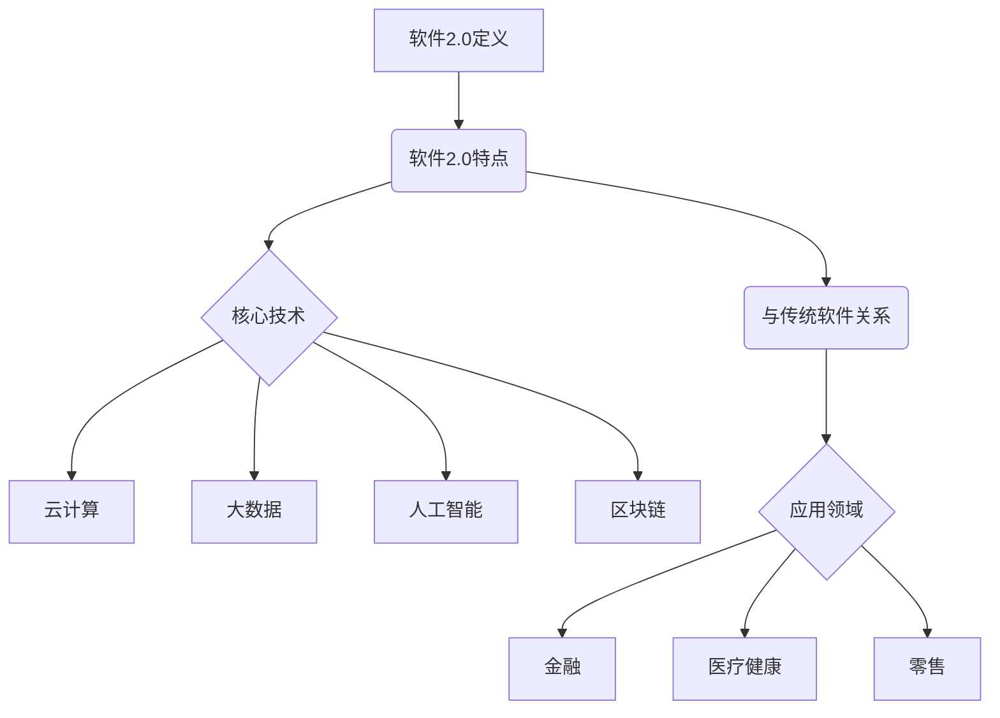
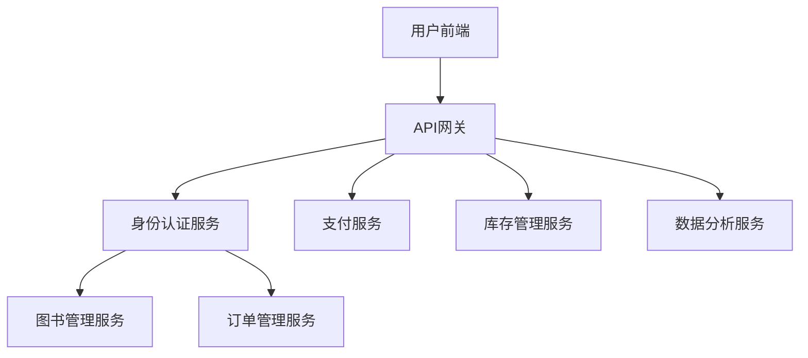

                 

# 《软件2.0的应用：从实验室走向现实》

## 关键词

- 软件2.0
- 云计算
- 大数据
- 人工智能
- 区块链
- 应用场景
- 实践案例

## 摘要

随着技术的不断发展，软件2.0的概念逐渐从理论走向实践。本文将详细介绍软件2.0的起源、核心技术、应用场景以及实践案例。通过本文的阅读，读者可以全面了解软件2.0的现状及其在各个领域的发展趋势，从而为未来的技术研究和应用提供有益的参考。

### 第一部分：软件2.0概述

#### 第1章：软件2.0的起源与发展

#### 1.1 软件2.0的定义与特点

**软件2.0的定义**

软件2.0是指一种新型软件开发模式，它强调软件的灵活性和可扩展性，以适应快速变化的业务需求。软件2.0不仅关注软件的功能，更注重软件的架构、技术选型以及开发方法。

**软件2.0的核心特点**

1. **模块化**：软件2.0强调模块化开发，使得软件系统可以方便地进行扩展和升级。
2. **可复用性**：软件2.0注重代码复用，提高开发效率。
3. **云计算**：软件2.0与云计算紧密结合，充分利用云计算的弹性扩展和成本效益。
4. **大数据**：软件2.0能够处理海量数据，为业务提供强大的数据分析能力。
5. **人工智能**：软件2.0利用人工智能技术，实现智能决策和自动化操作。

**软件2.0与Web2.0、Web3.0的关系**

Web2.0和Web3.0是互联网发展的两个阶段，而软件2.0则是一种软件开发模式。Web2.0强调用户生成内容和社交互动，Web3.0则强调去中心化和价值传递。软件2.0与这两个阶段的关系如下：

- **Web2.0**：软件2.0与Web2.0紧密结合，为Web2.0应用提供强大的技术支撑。
- **Web3.0**：软件2.0将为Web3.0提供更加完善的开发框架和工具，推动去中心化应用的普及。

#### 1.2 软件2.0的发展历程

**软件1.0到软件2.0的演变**

软件1.0是指传统的软件开发模式，强调代码的编写和调试。软件2.0则更加注重软件的架构、技术和开发方法，以适应快速变化的业务需求。

**软件2.0的代表性应用**

1. **电子商务平台**：如Amazon、Alibaba等，采用软件2.0模式，提供灵活的购物体验。
2. **社交媒体**：如Facebook、Twitter等，利用软件2.0模式，实现用户生成内容和社交互动。
3. **物联网应用**：如智能家居、智能交通等，采用软件2.0模式，实现设备的互联互通。

**软件2.0对传统软件的影响**

软件2.0的出现，使得传统软件开发模式面临巨大挑战。传统软件注重功能实现，而软件2.0更加注重系统的可扩展性、可维护性和用户体验。

#### 1.3 软件2.0的技术基础

**云计算与大数据**

**云计算的基本概念**

云计算是指通过互联网提供计算资源、存储资源、网络资源等，使得用户可以按需获取和使用资源。

**云计算的服务模式**

1. **基础设施即服务（IaaS）**：用户可以租用云计算资源，如虚拟机、存储等。
2. **平台即服务（PaaS）**：用户可以在云平台上开发、部署和运行应用程序。
3. **软件即服务（SaaS）**：用户通过互联网使用云服务提供商提供的应用程序。

**云计算的优势与挑战**

优势：

- **弹性扩展**：根据业务需求，灵活调整资源。
- **成本节约**：按需付费，降低硬件投入。
- **高可用性**：分布式架构，提高系统可靠性。

挑战：

- **安全性**：保护数据和隐私。
- **性能**：应对海量数据和高并发请求。

**大数据的概念**

大数据是指无法用传统数据库软件工具进行捕捉、管理和处理的数据集合。

**大数据的4V特性**

1. **Volume（数据量）**：数据量巨大，超出传统存储和处理能力的范围。
2. **Velocity（数据速度）**：数据处理速度要求高，以实时响应业务需求。
3. **Variety（数据多样性）**：数据类型丰富，包括结构化、半结构化和非结构化数据。
4. **Value（数据价值）**：从海量数据中提取有价值的信息，为业务决策提供支持。

**大数据的价值**

- **业务优化**：通过数据挖掘和分析，优化业务流程。
- **市场预测**：预测市场趋势，制定营销策略。
- **风险管理**：识别潜在风险，制定防范措施。

**数据存储与管理**

- **Hadoop生态**：Hadoop是一个开源的大数据处理框架，包括分布式存储（HDFS）和分布式计算（MapReduce）。
- **Spark生态系统**：Spark是一个开源的大数据处理引擎，提供高性能的分布式计算能力。
- **NoSQL数据库**：NoSQL数据库适用于处理海量数据，如MongoDB、Cassandra、Redis等。

**人工智能与机器学习**

**人工智能基础**

人工智能是指模拟、延伸和扩展人类智能的理论、方法和技术。

**人工智能的发展历程**

1. **第一代人工智能（1956-1974）**：以符号主义和逻辑推理为主要方法。
2. **第二代人工智能（1974-1980）**：以知识表示和推理为主要方法。
3. **第三代人工智能（1980-1997）**：以神经网络和机器学习为主要方法。
4. **第四代人工智能（1997至今）**：以大数据和深度学习为主要方法。

**人工智能的分类**

1. **弱人工智能**：在特定领域表现出人类智能。
2. **强人工智能**：具有全面人类智能。
3. **自然语言处理**：使计算机能够理解和生成人类语言。

**机器学习原理**

机器学习是指通过算法从数据中学习规律和模式，以便进行预测和决策。

**监督学习算法**

监督学习算法通过使用标记好的训练数据来学习数据之间的关系。以下是一个简单的监督学习算法——线性回归的伪代码：

```plaintext
function LinearRegression(trainData, trainLabels, learningRate, iterations):
    # 初始化权重
    weights = [0.0] * (numFeatures + 1)

    for i in 1 to iterations:
        # 计算预测值
        predictions = [w * x for (w, x) in zip(weights[1:], trainData)]
        predictions = [weights[0] + sum(p) for p in predictions]

        # 计算误差
        error = [y - p for (y, p) in zip(trainLabels, predictions)]

        # 更新权重
        weights = [w - (learningRate * e) for (w, e) in zip(weights, error)]

    return weights
```

**无监督学习**

无监督学习是指在没有标记数据的情况下，从数据中学习数据分布和模式。常见的无监督学习算法包括聚类算法和降维算法。

**强化学习**

强化学习是指通过试错的方式，从环境中获取反馈，不断调整策略，以达到最佳效果。常见的强化学习算法包括Q学习和深度强化学习。

**自然语言处理技术**

自然语言处理（NLP）是人工智能的一个重要分支，用于处理人类语言数据。以下是一个简单的NLP算法——词嵌入的伪代码：

```plaintext
function WordEmbedding(corpus, embeddingSize, iterations):
    # 初始化词向量
    embeddings = [[0.0] * embeddingSize for _ in range(numWords)]

    for i in 1 to iterations:
        for word, context in corpus:
            # 计算预测词向量
            predictedEmbedding = [0.0] * embeddingSize
            for contextWord in context:
                predictedEmbedding = sum([embeddings[contextWord] for contextWord in context])

            # 计算误差
            error = [embeddings[word][d] - predictedEmbedding[d] for d in 1 to embeddingSize]

            # 更新词向量
            embeddings[word] = [e - (learningRate * e) for (e, _) in zip(embeddings[word], error)]

    return embeddings
```

**数学模型与公式**

在软件2.0的应用中，数学模型是非常重要的。以下是一个简单的线性回归的数学模型：

$$
y = \beta_0 + \beta_1x_1 + \beta_2x_2 + ... + \beta_nx_n
$$

其中，$y$ 是因变量，$x_1, x_2, ..., x_n$ 是自变量，$\beta_0, \beta_1, \beta_2, ..., \beta_n$ 是模型的权重。

### 第二部分：软件2.0的应用场景

#### 第3章：软件2.0在金融行业的应用

#### 3.1 金融科技的发展趋势

金融科技（FinTech）是指利用科技手段改进金融服务、提升金融效率的一种新型产业。随着技术的不断发展，金融科技正在深刻地改变金融行业的面貌。

**金融科技的崛起**

1. **移动支付**：以支付宝、微信支付为代表的移动支付，改变了人们的支付习惯。
2. **区块链**：区块链技术在金融领域的应用，为金融交易提供了更加安全、高效的解决方案。
3. **人工智能**：人工智能技术在风险管理、信用评估、智能投顾等领域的应用，提升了金融服务的智能化水平。

**金融科技的创新方向**

1. **数字货币**：比特币等加密货币的兴起，推动了数字货币的发展。
2. **智能投顾**：利用人工智能技术，为投资者提供个性化的投资建议。
3. **区块链**：区块链技术在支付、结算、审计等领域的应用，提高了金融系统的透明度和安全性。

**软件2.0在金融中的应用**

1. **区块链在金融中的应用**

区块链技术具有去中心化、安全性强、不可篡改等特点，在金融领域具有广泛的应用前景。

- **支付与结算**：区块链技术可以提高支付和结算的效率，降低交易成本。
- **审计与监管**：区块链技术可以为金融监管提供可靠的审计日志，提高监管效率。

2. **人工智能在风险管理中的应用**

人工智能技术可以通过数据分析、机器学习等技术手段，对金融风险进行预测和评估，提高风险管理的精度和效率。

- **信用评估**：利用人工智能技术，可以更加准确地评估借款人的信用风险。
- **欺诈检测**：通过大数据分析和机器学习算法，可以实时监测交易行为，识别潜在欺诈风险。

3. **云计算在金融服务中的应用**

云计算技术可以提供强大的计算能力和存储能力，为金融服务提供高效、可靠的运行环境。

- **大数据处理**：云计算可以处理海量金融数据，为业务提供强大的数据分析能力。
- **远程办公**：云计算使得金融机构可以实现远程办公，提高员工的工作效率。

#### 第4章：软件2.0在医疗健康领域的应用

#### 4.1 医疗健康行业面临的挑战

医疗健康行业面临着许多挑战，包括数据安全与隐私、医疗资源的分配不均等。

**数据安全与隐私**

医疗数据涉及到患者隐私和个人信息，一旦泄露，可能会对个人造成严重伤害。因此，保障数据安全与隐私成为医疗健康行业的重要挑战。

**医疗资源的分配不均**

我国医疗资源分布不均，城市与农村、东部与西部之间的差距较大。如何提高医疗资源的利用效率，实现医疗服务的公平可及，是医疗健康行业面临的另一个重要挑战。

**软件2.0在医疗健康中的应用**

软件2.0技术为医疗健康行业提供了许多创新解决方案，有助于应对上述挑战。

1. **人工智能在医疗诊断中的应用**

人工智能技术可以通过深度学习、图像识别等技术，辅助医生进行疾病诊断。以下是一个简单的医疗诊断流程：

- **数据采集**：通过医疗设备采集患者的健康数据，如血压、心率、影像等。
- **数据预处理**：对采集到的数据进行分析和清洗，去除噪声和异常值。
- **模型训练**：利用训练数据，训练深度学习模型，使其具备疾病诊断能力。
- **疾病诊断**：将患者的健康数据输入训练好的模型，得到疾病诊断结果。

2. **区块链在药品供应链管理中的应用**

区块链技术可以确保药品供应链的透明性和可信性，防止药品造假和非法流通。

- **药品溯源**：通过区块链技术，可以记录药品的生产、运输、销售全过程，实现药品溯源。
- **防伪验证**：利用区块链技术，可以对药品进行防伪验证，确保药品的真实性。

3. **云计算在远程医疗服务中的应用**

云计算技术可以为远程医疗服务提供强大的计算能力和存储能力，实现医疗资源的共享和高效利用。

- **远程会诊**：通过云计算平台，医生可以远程会诊，为患者提供专业的医疗建议。
- **电子病历**：通过云计算平台，可以实现电子病历的存储和管理，提高医疗信息化的水平。

#### 第5章：软件2.0在零售行业的应用

#### 5.1 零售行业的变革

随着互联网的普及和消费升级，零售行业正面临着深刻的变革。

**电子商务的发展**

电子商务已经成为零售行业的重要组成部分，改变了人们的购物方式。

**消费者行为的变化**

消费者对购物体验的要求越来越高，追求更加个性化和智能化的服务。

**软件2.0在零售中的应用**

软件2.0技术为零售行业带来了许多创新应用，提升了零售服务的质量和效率。

1. **人工智能在个性化推荐中的应用**

人工智能技术可以通过数据分析、机器学习等技术，为消费者提供个性化的购物推荐。

- **用户画像**：通过收集和分析消费者的行为数据，构建用户画像，了解消费者的需求和偏好。
- **推荐算法**：利用机器学习算法，根据用户画像，为消费者推荐感兴趣的商品。

2. **区块链在供应链管理中的应用**

区块链技术可以确保商品供应链的透明性和可信性，提升消费者的信任度。

- **商品溯源**：通过区块链技术，可以记录商品的生产、运输、销售等全过程，实现商品溯源。
- **防伪验证**：利用区块链技术，可以对商品进行防伪验证，确保商品的真实性。

3. **云计算在零售运营中的应用**

云计算技术可以为零售运营提供强大的计算能力和存储能力，实现零售业务的高效运作。

- **库存管理**：通过云计算平台，可以实现库存的实时监控和管理，提高库存周转率。
- **订单处理**：通过云计算平台，可以实现订单的快速处理和物流跟踪，提升物流效率。

### 第三部分：软件2.0的实践与案例

#### 第6章：软件2.0项目规划与实施

#### 6.1 软件2.0项目规划

**项目需求分析**

项目需求分析是软件2.0项目规划的重要环节，主要包括以下内容：

- **功能需求**：确定系统需要实现的主要功能，如用户注册、登录、购物车、订单管理等。
- **性能需求**：确定系统的性能指标，如响应时间、并发量、数据存储容量等。
- **安全需求**：确定系统的安全要求，如数据加密、访问控制、审计日志等。

**项目技术选型**

项目技术选型主要包括以下内容：

- **开发框架**：选择适合项目的开发框架，如Django、Flask等。
- **数据库**：选择适合项目的数据库，如MySQL、MongoDB等。
- **前端技术**：选择适合项目的前端技术，如HTML、CSS、JavaScript等。
- **后端技术**：选择适合项目的后端技术，如Python、Java等。

**项目风险管理**

项目风险管理主要包括以下内容：

- **风险识别**：识别项目可能面临的风险，如技术风险、市场风险、资源风险等。
- **风险评估**：对识别出的风险进行评估，确定风险的重要性和可能影响。
- **风险应对**：制定相应的风险应对策略，如风险规避、风险转移、风险接受等。

#### 6.2 软件2.0项目实施

**系统设计与开发**

系统设计与开发是软件2.0项目实施的核心环节，主要包括以下内容：

- **系统架构设计**：设计系统的整体架构，包括前端、后端、数据库、缓存、消息队列等。
- **模块划分**：将系统划分为不同的模块，如用户模块、商品模块、订单模块等。
- **接口设计**：设计系统各模块之间的接口，确保模块之间的交互和数据传递。
- **代码实现**：根据系统架构和模块划分，实现各个模块的功能。

**系统集成与测试**

系统集成与测试是软件2.0项目实施的重要环节，主要包括以下内容：

- **系统集成**：将各个模块集成起来，确保系统可以正常运行。
- **功能测试**：测试系统各功能模块的正确性和完整性。
- **性能测试**：测试系统的性能，如响应时间、并发量、数据存储容量等。
- **安全测试**：测试系统的安全漏洞，如SQL注入、XSS攻击等。

**项目交付与维护**

项目交付与维护是软件2.0项目实施的最后环节，主要包括以下内容：

- **项目交付**：将系统交付给用户，确保系统可以正常运行。
- **上线部署**：将系统部署到生产环境，确保系统的高可用性和稳定性。
- **运维管理**：对系统进行日常运维管理，包括监控系统性能、处理故障等。
- **版本更新**：根据用户反馈和业务需求，对系统进行版本更新和优化。

#### 第7章：软件2.0的未来发展

#### 7.1 软件2.0的挑战与机遇

软件2.0的发展面临着许多挑战和机遇。

**挑战**

- **技术复杂度**：软件2.0技术涉及云计算、大数据、人工智能、区块链等多个领域，技术复杂度较高。
- **安全性**：随着系统的复杂度增加，安全风险也相应增加。
- **兼容性**：软件2.0需要与现有的软件系统进行集成和兼容。

**机遇**

- **业务创新**：软件2.0技术为业务创新提供了新的思路和工具。
- **市场拓展**：软件2.0技术可以拓展市场空间，提高企业的竞争力。
- **用户体验**：软件2.0技术可以提升用户体验，提高用户满意度。

#### 7.2 软件2.0的未来方向

软件2.0的未来发展将呈现出以下方向：

**跨领域融合**

软件2.0将与云计算、大数据、人工智能、区块链等前沿技术进行深度融合，形成新的产业生态。

**开放生态系统的构建**

软件2.0将推动开放生态系统的构建，促进不同系统之间的互联互通，实现资源的共享和优化。

**可持续发展与绿色科技**

软件2.0将注重可持续发展，通过节能减排、绿色计算等手段，为环境保护做出贡献。

### 附录

#### 附录A：软件2.0相关资源

**技术资源**

- **开源框架**：Django、Flask、Spring Boot等。
- **专业社区**：GitHub、Stack Overflow、Reddit等。
- **学术资源**：IEEE、ACM、AAAI等。

**行业报告**

- **市场调研**：IDC、Gartner、Forrester等。
- **行业趋势**：TechCrunch、VentureBeat、CNBC等。
- **政策法规**：国家互联网信息办公室、中国人民银行、工业和信息化部等。

**实用工具**

- **开发工具**：Visual Studio、Eclipse、IntelliJ IDEA等。
- **测试工具**：Selenium、JMeter、Appium等。
- **管理工具**：JIRA、Trello、Asana等。

### Mermaid 流程图



### 核心算法原理讲解

**监督学习算法**

监督学习算法通过使用标记好的训练数据来学习数据之间的关系。以下是一个简单的监督学习算法——线性回归的伪代码：

```plaintext
function LinearRegression(trainData, trainLabels, learningRate, iterations):
    # 初始化权重
    weights = [0.0] * (numFeatures + 1)

    for i in 1 to iterations:
        # 计算预测值
        predictions = [w * x for (w, x) in zip(weights[1:], trainData)]
        predictions = [weights[0] + sum(p) for p in predictions]

        # 计算误差
        error = [y - p for (y, p) in zip(trainLabels, predictions)]

        # 更新权重
        weights = [w - (learningRate * e) for (w, e) in zip(weights, error)]

    return weights
```

**自然语言处理技术**

自然语言处理（NLP）是人工智能的一个重要分支，用于处理人类语言数据。以下是一个简单的NLP算法——词嵌入的伪代码：

```plaintext
function WordEmbedding(corpus, embeddingSize, iterations):
    # 初始化词向量
    embeddings = [[0.0] * embeddingSize for _ in range(numWords)]

    for i in 1 to iterations:
        for word, context in corpus:
            # 计算预测词向量
            predictedEmbedding = [0.0] * embeddingSize
            for contextWord in context:
                predictedEmbedding = sum([embeddings[contextWord] for contextWord in context])

            # 计算误差
            error = [embeddings[word][d] - predictedEmbedding[d] for d in 1 to embeddingSize]

            # 更新词向量
            embeddings[word] = [e - (learningRate * e) for (e, _) in zip(embeddings[word], error)]

    return embeddings
```

### 数学模型与公式

在软件2.0的应用中，数学模型是非常重要的。以下是一个简单的线性回归的数学模型：

$$
y = \beta_0 + \beta_1x_1 + \beta_2x_2 + ... + \beta_nx_n
$$

其中，$y$ 是因变量，$x_1, x_2, ..., x_n$ 是自变量，$\beta_0, \beta_1, \beta_2, ..., \beta_n$ 是模型的权重。

### 项目实战

以下是一个简单的基于云计算的在线书店项目的架构图：



在这个项目中，用户通过前端访问API网关，然后通过身份认证服务进行认证。之后，用户可以通过图书管理服务、订单管理服务、支付服务、库存管理服务和数据分析服务进行操作。所有这些服务都运行在云计算平台上，以实现高可用性和可伸缩性。

### 开发环境搭建

要搭建一个基于Python的软件2.0项目，您需要以下步骤：

1. 安装Python（建议版本3.8以上）
2. 安装虚拟环境管理器（如virtualenv）
3. 创建虚拟环境并激活
4. 安装必要的Python库（如Flask、Django、TensorFlow等）

### 源代码实现与解读

以下是一个简单的Flask应用程序的代码示例：

```python
from flask import Flask, request, jsonify

app = Flask(__name__)

@app.route('/api/books', methods=['GET', 'POST'])
def books():
    if request.method == 'GET':
        # 获取图书列表
        return jsonify({'books': ['Book1', 'Book2', 'Book3']})
    elif request.method == 'POST':
        # 创建新的图书
        book_data = request.get_json()
        book_name = book_data['name']
        # 这里可以添加图书到数据库的逻辑
        return jsonify({'message': f'Book {book_name} created successfully.'})

if __name__ == '__main__':
    app.run(debug=True)
```

在这个示例中，我们创建了一个简单的Flask应用程序，它提供了一个API端点`/api/books`，支持GET和POST请求。GET请求返回一个图书列表，而POST请求用于创建一个新的图书。

### 代码解读与分析

在这个Flask应用程序中，我们定义了一个名为`books`的函数，它根据HTTP请求的方法（GET或POST）执行不同的逻辑。在GET请求中，我们返回一个包含三个图书名称的JSON对象。在POST请求中，我们获取JSON格式的图书数据，提取图书名称，并返回一个成功消息。

这个简单的应用程序展示了Flask的基本用法，但也可以作为更复杂应用的起点。在实际应用中，您可能需要添加数据库支持、认证机制、异常处理等更多功能。

### 作者

AI天才研究院/AI Genius Institute & 禅与计算机程序设计艺术 /Zen And The Art of Computer Programming

