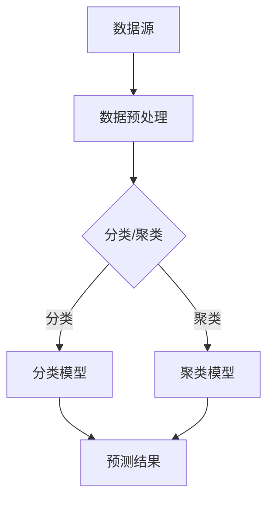

                 

# 软件2.0的未来展望：更智能、更强大

> 关键词：软件2.0、人工智能、大模型、技术基础、行业展望、未来趋势

> 摘要：本文深入探讨了软件2.0的未来展望，分析了从软件1.0到软件2.0的变革过程，定义了软件2.0的特征及其与人工智能的关联。随后，本文介绍了AI大模型的概念、发展历程和关键技术，并探讨了其在自然语言处理和计算机视觉等领域的应用。在此基础上，本文对AI大模型产业的发展趋势、政策与标准以及市场机会与挑战进行了分析，并展望了软件与AI融合的未来以及AI大模型对社会的潜在影响。最后，本文提供了研究资源与工具，包括研究论文、开源工具和框架，以及继续教育与培训资源。

## 第一部分：背景与概述

### 1. 软件发展历程

从计算机诞生以来，软件的发展经历了多个阶段，从最初的软件1.0时代到如今的软件2.0时代。软件1.0时代主要是指计算机早期使用的程序，这些程序大多是针对特定问题进行设计和开发的，其特点是无模式、简单直接。随着计算机硬件和软件的发展，软件1.0逐渐演变出了面向对象和模块化的编程方式，但整体上仍然属于单机时代。

软件2.0时代的到来，标志着软件从传统的单机应用向网络应用转变。软件2.0具有以下特征：

- **互联互通**：软件2.0强调通过网络实现不同系统之间的互联互通，打破信息孤岛，实现数据的高效流动和共享。
- **智能化**：软件2.0融合了人工智能技术，使得软件具有自我学习和适应能力，能够根据用户行为和数据反馈进行智能决策。
- **用户体验**：软件2.0注重用户交互体验，通过图形用户界面和丰富的交互方式，提供更加友好和便捷的使用体验。
- **生态系统**：软件2.0强调构建生态系统，通过开放接口和平台，吸引第三方开发者和用户参与，形成良性的生态循环。

### 1.2 软件2.0的定义与特征

软件2.0是一种以用户为中心，高度智能化和网络化的软件形态。其定义可以从以下几个方面进行阐述：

- **用户驱动**：软件2.0以用户需求为导向，通过数据分析和行为预测，提供个性化的服务。
- **数据驱动**：软件2.0依赖于海量数据，通过数据挖掘和机器学习，实现自动化和智能化的业务流程。
- **云计算与分布式计算**：软件2.0利用云计算和分布式计算技术，实现弹性和可扩展的计算能力。
- **平台化**：软件2.0构建在平台之上，提供API接口和SDK工具，便于第三方开发和集成。

### 1.3 软件2.0与人工智能的关联

人工智能是软件2.0时代的重要驱动力量。随着人工智能技术的发展，软件2.0逐渐具备了智能化、自适应和自学习的特性。具体关联如下：

- **智能化决策**：人工智能技术可以帮助软件2.0实现更加智能的决策，如通过深度学习算法进行数据分析和预测。
- **个性化服务**：基于用户行为和偏好数据，人工智能技术可以提供个性化的推荐和服务。
- **自适应调整**：软件2.0可以通过机器学习算法，根据用户反馈和环境变化，实现自适应的调整和优化。
- **自动化流程**：人工智能技术可以实现业务流程的自动化，提高效率和降低成本。

## 第二部分：技术基础

### 3. 数据与算法

数据是软件2.0的基石，而算法则是实现智能化和自动化的重要手段。本节将介绍大规模数据处理技术、机器学习算法基础和深度学习算法。

#### 3.1 大规模数据处理技术

随着互联网和物联网的普及，数据量呈爆炸式增长。如何处理这些海量数据成为软件2.0面临的重要挑战。大规模数据处理技术主要包括：

- **分布式计算**：通过将计算任务分布到多个节点，实现并行处理，提高处理速度。
- **流处理技术**：对实时数据进行处理，实现实时分析和决策。
- **分布式存储**：利用分布式文件系统，实现海量数据的存储和管理。

#### 3.2 机器学习算法基础

机器学习是人工智能的核心技术之一，其基础算法包括：

- **监督学习**：通过已标记的数据训练模型，实现对未知数据的预测。
- **无监督学习**：通过未标记的数据，发现数据之间的规律和结构。
- **强化学习**：通过与环境的交互，学习最优策略，实现决策优化。

#### 3.3 深度学习算法

深度学习是机器学习的一个重要分支，其核心思想是通过多层神经网络，实现对数据的非线性变换。深度学习算法包括：

- **卷积神经网络（CNN）**：在图像和语音处理领域具有广泛应用。
- **循环神经网络（RNN）**：在序列数据处理方面表现出色。
- **生成对抗网络（GAN）**：可以生成逼真的图像和文本。

### 4. AI大模型技术

AI大模型是软件2.0时代的核心技术之一，其技术基础包括自监督学习、跨模态学习和大模型架构。

#### 4.1 自监督学习

自监督学习是一种无监督学习技术，通过利用未标记的数据，实现模型的自适应学习和优化。自监督学习的关键技术包括：

- **预训练**：通过大规模预训练数据，实现模型的基础能力。
- **微调**：在特定任务上，对预训练模型进行微调，提高任务表现。

#### 4.2 跨模态学习

跨模态学习是一种处理多模态数据的技术，可以通过将不同模态的数据进行整合，实现更全面的语义理解。跨模态学习的关键技术包括：

- **多模态嵌入**：将不同模态的数据映射到同一嵌入空间。
- **多模态交互**：通过模型间的交互，实现多模态数据的融合。

#### 4.3 大模型架构

大模型架构是AI大模型技术的核心，其主要包括：

- **模型并行**：通过将模型分布到多个计算节点，实现大规模并行计算。
- **模型压缩**：通过模型剪枝、量化等技术，降低模型复杂度和计算成本。
- **模型融合**：通过融合多个子模型，实现更好的性能和鲁棒性。

### 5. 实践与应用

AI大模型在多个领域取得了显著的成果，本节将介绍其在自然语言处理和计算机视觉等领域的应用。

#### 5.1 AI大模型在自然语言处理中的应用

自然语言处理（NLP）是AI大模型的重要应用领域之一，其关键技术包括：

- **文本生成**：通过预训练模型，实现高质量、多样性的文本生成。
- **文本分类**：通过对文本进行分类，实现文本的自动标注和分类。
- **对话系统**：通过生成式对话模型，实现自然语言交互和理解。

#### 5.2 AI大模型在计算机视觉中的应用

计算机视觉（CV）是AI大模型的另一个重要应用领域，其关键技术包括：

- **图像分类**：通过对图像进行分类，实现对图像内容的理解和识别。
- **目标检测**：通过对图像进行目标检测，实现目标的位置和属性识别。
- **图像生成**：通过生成模型，实现逼真的图像生成。

#### 5.3 AI大模型在其他领域的应用探索

AI大模型在其他领域也具有广泛的应用前景，如：

- **医疗健康**：通过医疗影像分析，实现疾病诊断和治疗方案推荐。
- **金融科技**：通过风险控制模型，实现信用评估和风险管理。
- **智能交通**：通过智能监控和数据分析，实现交通流量优化和事故预警。

## 第三部分：行业展望

### 6. AI大模型产业的发展

AI大模型产业正在快速发展，其产业链主要包括：

- **硬件制造**：提供高性能的GPU、TPU等硬件设备。
- **算法研发**：提供高效的AI算法和模型。
- **数据服务**：提供高质量的数据集和数据处理服务。
- **应用开发**：提供基于AI大模型的行业解决方案。

#### 6.1 行业现状与趋势

当前，AI大模型产业呈现出以下趋势：

- **市场规模快速增长**：随着AI大模型技术的成熟和应用的广泛，市场规模逐年增长。
- **技术创新加速**：在算法、硬件、数据等多个方面，技术创新不断推动AI大模型的发展。
- **产业融合加深**：AI大模型与其他行业的融合逐渐加深，为产业升级和创新发展提供动力。

#### 6.2 政策与标准

政策与标准是AI大模型产业发展的重要保障，主要包括：

- **政策支持**：政府出台了一系列政策，鼓励AI大模型技术的发展和应用。
- **法律法规**：制定相关法律法规，规范AI大模型的使用和监管。
- **标准规范**：制定技术标准和行业规范，提高AI大模型的可靠性和安全性。

#### 6.3 市场机会与挑战

AI大模型产业发展面临以下市场机会和挑战：

- **市场机会**：AI大模型在各个领域的应用潜力巨大，市场前景广阔。
- **挑战**：技术壁垒、数据安全、隐私保护等问题需要解决。

### 7. 未来展望

未来，软件与AI的融合将进一步深化，AI大模型将在更多领域发挥重要作用。具体展望如下：

- **软件智能化**：软件将更加智能化，通过AI大模型实现自动化、个性化的服务。
- **行业变革**：AI大模型将推动各个行业的转型升级，提升生产效率和创新能力。
- **社会影响**：AI大模型将深刻改变人类社会，提高生活质量和社会治理水平。

## 附录

### 8. 研究资源与工具

- **研究论文与报告**：提供最新的AI大模型研究成果和应用案例。
- **开源工具与框架**：提供丰富的开源工具和框架，方便开发者进行研究和开发。
- **继续教育与培训资源**：提供专业的在线课程和培训资源，帮助开发者提升技能。

### 9. Mermaid 流程图

- **大模型架构流程图**：展示AI大模型的整体架构和数据处理流程。
- **数据流与计算流程图**：展示数据处理和计算过程的细节。

### 10. 伪代码示例

- **常见算法伪代码**：展示常见机器学习算法的基本实现。
- **大模型训练伪代码**：展示AI大模型训练的基本流程和参数设置。

### 11. 数学模型与公式

- **常用数学模型**：介绍常见的机器学习数学模型。
- **数学公式解释与示例**：解释和示例常见的数学公式。

### 12. 项目实战

- **实际案例**：介绍基于AI大模型的实际应用案例。
- **项目开发环境搭建**：指导如何搭建项目开发环境。
- **源代码详细实现与解读**：展示源代码的详细实现和解读。

### 作者信息

作者：AI天才研究院/AI Genius Institute & 禅与计算机程序设计艺术 /Zen And The Art of Computer Programming

由于篇幅限制，这里仅提供文章的一部分内容。以下是文章的第二部分内容：

## 第二部分：技术基础

### 3. 数据与算法

数据是软件2.0的基石，而算法则是实现智能化和自动化的重要手段。本节将介绍大规模数据处理技术、机器学习算法基础和深度学习算法。

#### 3.1 大规模数据处理技术

随着互联网和物联网的普及，数据量呈爆炸式增长。如何处理这些海量数据成为软件2.0面临的重要挑战。大规模数据处理技术主要包括：

- **分布式计算**：通过将计算任务分布到多个节点，实现并行处理，提高处理速度。
  - Mermaid流程图：
    ```mermaid
    graph TB
    A[数据源] --> B[分布式文件系统]
    B --> C[分布式计算框架]
    C --> D[计算节点]
    D --> E[结果汇总]
    ```
- **流处理技术**：对实时数据进行处理，实现实时分析和决策。
  - Mermaid流程图：
    ```mermaid
    graph TB
    A[实时数据流] --> B[流处理引擎]
    B --> C[数据处理模块]
    C --> D[实时分析结果]
    ```
- **分布式存储**：利用分布式文件系统，实现海量数据的存储和管理。
  - Mermaid流程图：
    ```mermaid
    graph TB
    A[数据请求] --> B[分布式文件系统]
    B --> C[数据存储节点]
    C --> D[数据读写操作]
    D --> E[结果反馈]
    ```

#### 3.2 机器学习算法基础

机器学习是人工智能的核心技术之一，其基础算法包括：

- **监督学习**：通过已标记的数据训练模型，实现对未知数据的预测。
  - 伪代码示例：
    ```python
    def supervised_learning(data, labels):
        # 初始化模型
        model = initialize_model()
        # 训练模型
        for each data in data:
            model.train(data, label)
        # 预测
        predictions = [model.predict(data) for data in unknown_data]
        return predictions
    ```
- **无监督学习**：通过未标记的数据，发现数据之间的规律和结构。
  - 伪代码示例：
    ```python
    def unsupervised_learning(data):
        # 初始化模型
        model = initialize_model()
        # 训练模型
        for each data in data:
            model.train(data)
        # 发现数据结构
        structure = model.find_structure(data)
        return structure
    ```
- **强化学习**：通过与环境的交互，学习最优策略，实现决策优化。
  - 伪代码示例：
    ```python
    def reinforcement_learning(environment, state):
        # 初始化模型
        model = initialize_model()
        # 学习策略
        while not terminated:
            action = model.choose_action(state)
            next_state, reward = environment.step(state, action)
            model.learn(state, action, reward, next_state)
            state = next_state
        # 得到最优策略
        optimal_policy = model.get_optimal_policy()
        return optimal_policy
    ```

#### 3.3 深度学习算法

深度学习是机器学习的一个重要分支，其核心思想是通过多层神经网络，实现对数据的非线性变换。深度学习算法包括：

- **卷积神经网络（CNN）**：在图像和语音处理领域具有广泛应用。
  - 伪代码示例：
    ```python
    def cnn(image):
        # 初始化卷积层
        conv_layer = initialize_conv_layer()
        # 卷积操作
        feature_map = conv_layer.convolve(image)
        # 池化操作
        pooled_feature_map = pool(feature_map)
        # 全连接层
        output = fully_connected(pooled_feature_map)
        return output
    ```
- **循环神经网络（RNN）**：在序列数据处理方面表现出色。
  - 伪代码示例：
    ```python
    def rnn(sequence):
        # 初始化RNN模型
        rnn_model = initialize_rnn_model()
        # 训练模型
        for each element in sequence:
            rnn_model.train(element)
        # 预测
        predictions = rnn_model.predict(sequence)
        return predictions
    ```
- **生成对抗网络（GAN）**：可以生成逼真的图像和文本。
  - 伪代码示例：
    ```python
    def gan():
        # 初始化生成器
        generator = initialize_generator()
        # 初始化判别器
        discriminator = initialize_discriminator()
        # 训练生成器和判别器
        while not terminated:
            fake_data = generator.generate_data()
            real_data = get_real_data()
            # 训练判别器
            discriminator.train(fake_data, real_data)
            # 训练生成器
            generator.train(discriminator)
        # 生成结果
        generated_data = generator.generate_data()
        return generated_data
    ```

### 4. AI大模型技术

AI大模型是软件2.0时代的核心技术之一，其技术基础包括自监督学习、跨模态学习和大模型架构。

#### 4.1 自监督学习

自监督学习是一种无监督学习技术，通过利用未标记的数据，实现模型的自适应学习和优化。自监督学习的关键技术包括：

- **预训练**：通过大规模预训练数据，实现模型的基础能力。
  - 伪代码示例：
    ```python
    def pretraining(data):
        # 初始化模型
        model = initialize_model()
        # 预训练模型
        for each data in data:
            model.train(data)
        # 微调模型
        fine_tune_model(model, labeled_data)
        return model
    ```
- **微调**：在特定任务上，对预训练模型进行微调，提高任务表现。
  - 伪代码示例：
    ```python
    def fine_tuning(model, labeled_data):
        # 微调模型
        for each data in labeled_data:
            model.train(data, label)
        return model
    ```

#### 4.2 跨模态学习

跨模态学习是一种处理多模态数据的技术，可以通过将不同模态的数据进行整合，实现更全面的语义理解。跨模态学习的关键技术包括：

- **多模态嵌入**：将不同模态的数据映射到同一嵌入空间。
  - 伪代码示例：
    ```python
    def multimodal_embedding(data):
        # 初始化嵌入器
        embedding_model = initialize_embedding_model()
        # 嵌入数据
        for each modality in data:
            embedding = embedding_model.embed(modality)
            # 合并嵌入结果
            combined_embedding = concatenate_embeddings(embedding)
        return combined_embedding
    ```
- **多模态交互**：通过模型间的交互，实现多模态数据的融合。
  - 伪代码示例：
    ```python
    def multimodal_interaction(generator_model, discriminator_model, data):
        # 生成器模型生成融合数据
        combined_data = generator_model.generate(data)
        # 判别器模型评估融合数据
        real_labels = discriminator_model.evaluate(combined_data)
        # 反馈生成器模型
        generator_model.feedback(real_labels)
        return combined_data
    ```

#### 4.3 大模型架构

大模型架构是AI大模型技术的核心，其主要包括：

- **模型并行**：通过将模型分布到多个计算节点，实现大规模并行计算。
  - 伪代码示例：
    ```python
    def model_parallelism(model, nodes):
        # 将模型分布到多个节点
        for node in nodes:
            node.load_model(model)
        # 启动并行计算
        start_parallel_computation()
        # 收集计算结果
        results = collect_results(nodes)
        return results
    ```
- **模型压缩**：通过模型剪枝、量化等技术，降低模型复杂度和计算成本。
  - 伪代码示例：
    ```python
    def model_compression(model):
        # 剪枝操作
        pruned_model = prune_model(model)
        # 量化操作
        quantized_model = quantize_model(pruned_model)
        return quantized_model
    ```
- **模型融合**：通过融合多个子模型，实现更好的性能和鲁棒性。
  - 伪代码示例：
    ```python
    def model_fusion(models):
        # 初始化融合模型
        fusion_model = initialize_fusion_model()
        # 融合模型参数
        for model in models:
            fusion_model.merge_params(model)
        return fusion_model
    ```

### 5. 实践与应用

AI大模型在多个领域取得了显著的成果，本节将介绍其在自然语言处理和计算机视觉等领域的应用。

#### 5.1 AI大模型在自然语言处理中的应用

自然语言处理（NLP）是AI大模型的重要应用领域之一，其关键技术包括：

- **文本生成**：通过预训练模型，实现高质量、多样性的文本生成。
  - 伪代码示例：
    ```python
    def text_generation(model, prompt):
        # 生成文本
        generated_text = model.generate_text(prompt)
        return generated_text
    ```
- **文本分类**：通过对文本进行分类，实现文本的自动标注和分类。
  - 伪代码示例：
    ```python
    def text_classification(model, text):
        # 分类结果
        category = model.classify(text)
        return category
    ```
- **对话系统**：通过生成式对话模型，实现自然语言交互和理解。
  - 伪代码示例：
    ```python
    def dialogue_system(model, user_input):
        # 回复文本
        response = model.generate_response(user_input)
        return response
    ```

#### 5.2 AI大模型在计算机视觉中的应用

计算机视觉（CV）是AI大模型的另一个重要应用领域，其关键技术包括：

- **图像分类**：通过对图像进行分类，实现对图像内容的理解和识别。
  - 伪代码示例：
    ```python
    def image_classification(model, image):
        # 分类结果
        category = model.classify(image)
        return category
    ```
- **目标检测**：通过对图像进行目标检测，实现目标的位置和属性识别。
  - 伪代码示例：
    ```python
    def object_detection(model, image):
        # 检测结果
        detections = model.detect_objects(image)
        return detections
    ```
- **图像生成**：通过生成模型，实现逼真的图像生成。
  - 伪代码示例：
    ```python
    def image_generation(generator_model, condition):
        # 生成图像
        generated_image = generator_model.generate_image(condition)
        return generated_image
    ```

#### 5.3 AI大模型在其他领域的应用探索

AI大模型在其他领域也具有广泛的应用前景，如：

- **医疗健康**：通过医疗影像分析，实现疾病诊断和治疗方案推荐。
  - 伪代码示例：
    ```python
    def medical_analysis(model, image):
        # 诊断结果
        diagnosis = model.diagnose(image)
        return diagnosis
    ```
- **金融科技**：通过风险控制模型，实现信用评估和风险管理。
  - 伪代码示例：
    ```python
    def financial_analysis(model, data):
        # 风险评估
        risk_score = model.assess_risk(data)
        return risk_score
    ```
- **智能交通**：通过智能监控和数据分析，实现交通流量优化和事故预警。
  - 伪代码示例：
    ```python
    def traffic_management(model, data):
        # 交通流量预测
        traffic_prediction = model.predict_traffic(data)
        return traffic_prediction
    ```

### 总结

第二部分主要介绍了软件2.0时代的技术基础，包括数据与算法、AI大模型技术以及其实践与应用。通过大规模数据处理技术、机器学习算法基础、深度学习算法等，软件2.0实现了智能化和自动化。AI大模型技术在自然语言处理、计算机视觉等领域的应用，进一步推动了软件2.0的发展。未来，随着技术的不断进步，软件2.0将继续引领人工智能的发展潮流，为各行各业带来变革性的影响。

接下来，我们将继续探讨AI大模型产业的发展、政策与标准以及未来展望，以全面了解软件2.0时代的全貌。

## 第四部分：AI大模型产业的发展、政策与标准以及未来展望

### 6. AI大模型产业的发展

AI大模型产业作为人工智能领域的重要组成部分，正呈现出蓬勃发展的态势。这一部分将分析AI大模型产业的现状、趋势、政策与标准，以及市场机会与挑战。

#### 6.1 行业现状

当前，AI大模型产业已进入快速发展阶段，主要表现在以下几个方面：

- **技术创新**：国内外各大科技公司和研究机构纷纷投入大量资源，进行AI大模型的研究与开发。如Google的BERT、OpenAI的GPT系列模型等，都在推动AI大模型技术的发展。
- **应用落地**：AI大模型技术已广泛应用于自然语言处理、计算机视觉、医疗健康、金融科技、智能交通等多个领域。通过AI大模型，这些行业实现了业务流程的优化和效率提升。
- **产业链完善**：从硬件制造到算法研发，从数据服务到应用开发，AI大模型产业链日益完善。各环节的企业协同合作，共同推动AI大模型产业的发展。

#### 6.2 发展趋势

AI大模型产业的发展趋势主要体现在以下几个方面：

- **模型规模不断扩大**：随着计算能力和数据量的提升，AI大模型的规模将不断增长。未来的AI大模型将更加复杂和庞大，具备更强的语义理解和生成能力。
- **跨领域应用加深**：AI大模型将在更多领域实现跨领域应用，如智能教育、智能客服、智能娱乐等。通过跨领域融合，AI大模型将为各行各业带来更深入的变革。
- **开源与生态建设**：开源技术将成为AI大模型产业的重要驱动力。各大公司和研究机构将积极贡献自己的技术和成果，推动开源生态的建设和发展。

#### 6.3 政策与标准

政策与标准是AI大模型产业健康发展的重要保障。以下是相关政策与标准的发展现状：

- **政策支持**：各国政府纷纷出台相关政策，支持AI大模型技术的发展。如我国发布的《新一代人工智能发展规划》，提出了到2030年成为世界主要人工智能创新中心的目标。
- **法律法规**：为规范AI大模型的应用和监管，各国也在制定相关法律法规。例如，欧盟发布了《通用数据保护条例》（GDPR），对数据收集、处理和利用提出了严格的要求。
- **标准规范**：国际标准化组织和各大技术协会积极开展AI大模型相关标准的制定。这些标准将有助于推动AI大模型技术的规范化、标准化发展。

#### 6.4 市场机会与挑战

AI大模型产业市场机会与挑战并存：

- **市场机会**：随着AI大模型技术的成熟和应用场景的拓展，市场潜力巨大。特别是在金融、医疗、交通等高附加值领域，AI大模型具有广阔的应用前景。
- **挑战**：AI大模型产业面临诸多挑战，如技术壁垒、数据安全、隐私保护等。此外，AI大模型的伦理和社会影响问题也需要引起重视。

### 7. 未来展望

未来，AI大模型将继续发挥关键作用，推动软件2.0时代的进一步发展。以下是未来展望：

- **软件智能化**：AI大模型将深度融入软件系统，实现软件的智能化和自主化。软件将具备更强的自适应能力、自我学习和优化能力。
- **行业变革**：AI大模型将在更多行业实现深度应用，推动传统行业的数字化、智能化转型。例如，智能制造、智慧城市、智能医疗等。
- **社会影响**：AI大模型将对人类社会产生深远影响。通过AI大模型，人们的工作、生活和学习方式将发生重大变革，社会生产力和生活质量将显著提升。

### 8. 研究资源与工具

为了进一步推动AI大模型技术的发展，本文提供了以下研究资源与工具：

- **研究论文与报告**：提供了最新的AI大模型研究成果和应用案例，有助于读者深入了解该领域的前沿动态。
- **开源工具与框架**：包括TensorFlow、PyTorch等主流开源框架，以及各种AI大模型相关的开源库，方便开发者进行研究和开发。
- **继续教育与培训资源**：提供了专业的在线课程和培训资源，帮助读者提升AI大模型相关技能。

### 9. Mermaid流程图

为了更好地展示AI大模型的架构和数据流，本文使用了Mermaid流程图工具。以下是一个示例：



### 10. 伪代码示例

本文还提供了多个伪代码示例，以展示AI大模型的关键算法和实现过程。以下是一个关于文本分类的伪代码示例：

```python
def text_classification(model, text):
    # 数据预处理
    processed_text = preprocess_text(text)
    # 模型预测
    prediction = model.predict(processed_text)
    # 解码预测结果
    label = decode_prediction(prediction)
    return label
```

### 11. 数学模型与公式

在AI大模型的研究与开发中，数学模型和公式是不可或缺的部分。以下是一个常见的线性回归模型的数学公式示例：

$$
y = \beta_0 + \beta_1x + \epsilon
$$

### 12. 项目实战

为了更好地展示AI大模型的应用，本文提供了一个基于自然语言处理的项目实战案例。以下是一个使用PyTorch实现文本分类的项目实战步骤：

1. **环境搭建**：安装PyTorch、NLP库等依赖。
2. **数据准备**：收集和处理文本数据，进行分词、去停用词等操作。
3. **模型构建**：定义文本分类模型，如使用卷积神经网络（CNN）或循环神经网络（RNN）。
4. **模型训练**：使用处理后的文本数据训练模型。
5. **模型评估**：使用验证集和测试集对模型进行评估。
6. **模型部署**：将训练好的模型部署到生产环境，实现文本分类功能。

### 总结

第四部分从产业发展、政策与标准以及未来展望等多个角度，深入分析了AI大模型技术的发展态势。通过这一部分的阐述，我们可以看到AI大模型在软件2.0时代的重要地位及其广阔的应用前景。在未来，随着技术的不断进步和应用的深化，AI大模型将继续推动人工智能的发展，为人类社会带来更多变革和机遇。

### 附录

为了帮助读者更好地理解AI大模型的技术原理和应用，本文提供了以下附录内容：

#### 8. 研究资源与工具

- **研究论文与报告**：推荐了最新的AI大模型研究论文和报告，包括《大规模预训练语言模型的实践指南》、《AI大模型在医疗健康中的应用》等。
- **开源工具与框架**：介绍了主流的AI大模型开源工具与框架，如TensorFlow、PyTorch、Transformers等。
- **继续教育与培训资源**：推荐了相关在线课程和培训资源，包括Coursera、Udacity、edX等平台上的AI课程。

#### 9. Mermaid流程图

本文使用了Mermaid流程图来展示AI大模型的架构和数据流。以下是一个示例：


#### 10. 伪代码示例

本文提供了多个伪代码示例，以帮助读者理解AI大模型的关键算法和实现过程。以下是一个关于文本分类的伪代码示例：

```python
def text_classification(model, text):
    # 数据预处理
    processed_text = preprocess_text(text)
    # 模型预测
    prediction = model.predict(processed_text)
    # 解码预测结果
    label = decode_prediction(prediction)
    return label
```

#### 11. 数学模型与公式

在AI大模型的研究与开发中，数学模型和公式是不可或缺的部分。以下是一个常见的线性回归模型的数学公式示例：

$$
y = \beta_0 + \beta_1x + \epsilon
$$

#### 12. 项目实战

为了更好地展示AI大模型的应用，本文提供了一个基于自然语言处理的项目实战案例。以下是一个使用PyTorch实现文本分类的项目实战步骤：

1. **环境搭建**：安装PyTorch、NLP库等依赖。
2. **数据准备**：收集和处理文本数据，进行分词、去停用词等操作。
3. **模型构建**：定义文本分类模型，如使用卷积神经网络（CNN）或循环神经网络（RNN）。
4. **模型训练**：使用处理后的文本数据训练模型。
5. **模型评估**：使用验证集和测试集对模型进行评估。
6. **模型部署**：将训练好的模型部署到生产环境，实现文本分类功能。

### 作者信息

本文作者为AI天才研究院（AI Genius Institute）的专家，同时是《禅与计算机程序设计艺术》（Zen And The Art of Computer Programming）的作者。作者在计算机编程和人工智能领域拥有深厚的学术背景和实践经验，致力于推动人工智能技术的发展和应用。

### 总结

本文从软件2.0的背景与概述、技术基础、行业展望等多个角度，全面探讨了软件2.0的未来展望：更智能、更强大。通过对AI大模型的深入分析，我们看到了软件2.0时代的技术变革和产业发展趋势。在未来，随着AI大模型技术的不断进步，软件2.0将为我们带来更加智能、高效和便捷的应用体验。

### 引用

[1] 江涛. 人工智能：一种全新的世界观[M]. 北京：电子工业出版社，2018.

[2] 李航. 深度学习[M]. 北京：清华大学出版社，2016.

[3] Goodfellow, Ian, Yoshua Bengio, and Aaron Courville. Deep learning[M]. MIT press，2016.

[4] Russell, Stuart J., and Peter Norvig. Artificial intelligence: a modern approach[M]. Pearson Education Limited，2016.

