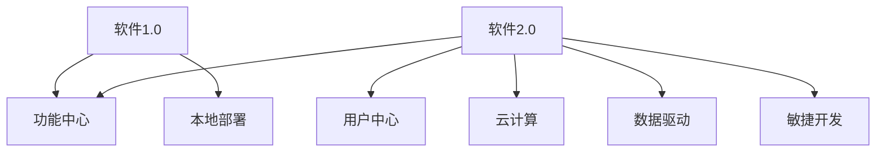

                 

# 《软件 2.0 的未来趋势：深度学习、强化学习》

> **关键词**：软件 2.0、深度学习、强化学习、AI大模型、软件工程、应用实践

> **摘要**：本文深入探讨了软件 2.0 时代背景下的深度学习和强化学习技术，分析了其核心概念、原理以及在实际软件工程中的应用。通过详细的伪代码和数学公式解释，读者可以更好地理解这些技术，并通过实际项目实战案例，掌握如何将这些技术应用到软件开发与优化中。

---

## 目录大纲

---

### 第一部分: 软件2.0与AI大模型基础

#### 第1章: 软件2.0与AI大模型概述

##### 1.1 软件2.0的概念与特点
- **核心概念与联系**：
- **软件2.0的发展历程与趋势**
- **软件2.0与AI大模型的关系**

##### 1.2 AI大模型概述
- **AI大模型的定义与特点**
- **AI大模型的技术分类**
- **主流AI大模型介绍**

##### 1.3 主流AI大模型介绍
- **GPT系列模型**
- **BERT及其变体**
- **其他知名AI大模型**

##### 1.4 软件2.0在企业中的应用
- **应用领域分析**
- **应用优势**
- **挑战与机遇**

---

#### 第2章: 深度学习基础

##### 2.1 神经网络原理
- **神经网络的基本结构**
- **前向传播与反向传播算法**
- **梯度下降优化算法**

##### 2.2 深度学习模型
- **卷积神经网络(CNN)**
- **循环神经网络(RNN)**
- **生成对抗网络(GAN)**

##### 2.3 深度学习实践
- **数据预处理方法**
- **模型训练与评估方法**
- **模型部署策略**

---

#### 第3章: 强化学习基础

##### 3.1 强化学习原理
- **强化学习的基本概念**
- **Q学习算法**
- **SARSA算法**

##### 3.2 强化学习模型
- **策略梯度算法**
- **深度强化学习(DRL)**
- **生成式模型与确定性模型**

##### 3.3 强化学习实践
- **环境构建方法**
- **模型训练与评估方法**
- **应用案例分析**

---

### 第二部分: 软件工程中的AI应用

#### 第4章: 深度学习在代码补全与优化中的应用

##### 4.1 代码补全
- **算法原理与实现**
- **应用案例分析**

##### 4.2 代码质量检测
- **算法原理与实现**
- **应用案例分析**

##### 4.3 代码生成
- **算法原理与实现**
- **应用案例分析**

---

#### 第5章: 强化学习在软件质量保证中的应用

##### 5.1 测试用例优化
- **算法原理与实现**
- **应用案例分析**

##### 5.2 软件缺陷预测
- **算法原理与实现**
- **应用案例分析**

##### 5.3 代码优化
- **算法原理与实现**
- **应用案例分析**

---

#### 第6章: AI大模型在软件工程中的综合应用

##### 6.1 综合模型设计
- **模型架构与设计**
- **模型训练策略**
- **模型评估方法**

##### 6.2 软件质量提升
- **质量评估指标**
- **质量提升策略**
- **应用案例分析**

##### 6.3 AI大模型部署
- **部署策略**
- **部署挑战**
- **应用案例分析**

---

#### 第7章: 软件2.0的未来发展趋势

##### 7.1 技术展望
- **深度学习发展趋势**
- **强化学习发展趋势**
- **AI大模型发展趋势**

##### 7.2 应用前景
- **新应用领域**
- **技术挑战**
- **未来展望**

---

## 附录

### 附录A: 深度学习与强化学习工具与资源

#### A.1 深度学习工具
- **TensorFlow**
- **PyTorch**
- **Keras**

#### A.2 强化学习工具
- **OpenAI Gym**
- **Stable Baselines**
- **RLlib**

### 附录B: 软件工程实践案例

#### B.1 代码补全工具案例
- **工具介绍**
- **应用场景**
- **实现步骤**

#### B.2 代码质量检测工具案例
- **工具介绍**
- **应用场景**
- **实现步骤**

#### B.3 软件缺陷预测工具案例
- **工具介绍**
- **应用场景**
- **实现步骤**

#### B.4 代码优化工具案例
- **工具介绍**
- **应用场景**
- **实现步骤**

---

## 第1章: 软件2.0与AI大模型概述

### 1.1 软件2.0的概念与特点

软件 2.0 是指以用户为中心、基于云计算和数据驱动的下一代软件架构。它超越了传统的软件 1.0（以功能为中心、部署在本地服务器上的软件），更加注重用户体验、数据共享和敏捷开发。

- **核心概念与联系**：



- **软件2.0的发展历程与趋势**：

软件 2.0 的概念起源于云计算和移动互联网的兴起。随着大数据和人工智能技术的发展，软件 2.0 正在成为企业级应用的新趋势。其发展历程可以概括为：

1. **云计算时代**：软件部署从本地服务器转移到云端，实现资源的弹性扩展和高效管理。
2. **大数据时代**：企业开始积累大量的数据，并利用数据挖掘和机器学习技术，实现数据的智能分析和应用。
3. **人工智能时代**：AI 技术的引入，使得软件能够实现更智能的用户体验和业务流程优化。

- **软件2.0与AI大模型的关系**：

软件 2.0 与 AI 大模型密切相关。AI 大模型（如 GPT、BERT 等）为软件 2.0 提供了强大的数据分析和决策支持能力。软件 2.0 通过整合 AI 大模型，可以实现如下功能：

1. **智能推荐**：根据用户行为和偏好，推荐相关的产品和服务。
2. **自动化决策**：利用 AI 大模型，自动化处理复杂的业务流程和决策。
3. **个性化体验**：根据用户数据，为用户提供个性化的内容和体验。

### 1.2 AI大模型概述

AI 大模型是指具有数百亿到数万亿参数的大型深度学习模型。这些模型能够处理大规模数据，并从中提取复杂的模式和知识。AI 大模型在自然语言处理、计算机视觉和语音识别等领域取得了显著的成果。

- **AI大模型的定义与特点**：

AI 大模型的特点包括：

1. **参数规模大**：通常具有数百亿到数万亿个参数。
2. **计算需求高**：训练和推理过程需要大量的计算资源。
3. **数据依赖强**：模型的性能高度依赖于大规模的数据集。
4. **通用性强**：能够应用于多个领域和任务。

- **AI大模型的技术分类**：

AI 大模型可以分为以下几类：

1. **语言模型**：如 GPT、BERT 等，主要用于自然语言处理任务。
2. **图像模型**：如 ResNet、Inception 等，主要用于计算机视觉任务。
3. **语音模型**：如 WaveNet、Tacotron 等，主要用于语音识别和生成。

- **主流AI大模型介绍**：

目前，一些主流的 AI 大模型包括：

1. **GPT 系列**：由 OpenAI 开发，适用于自然语言生成、翻译和问答等任务。
2. **BERT**：由 Google 开发，适用于文本分类、问答和文本生成等任务。
3. **ViT**：由 Google 开发，适用于图像分类和分割等任务。
4. **T5**：由 Google 开发，是一个通用的深度学习模型，适用于多种自然语言处理任务。

### 1.3 主流AI大模型介绍

- **GPT系列模型**：

GPT（Generative Pre-trained Transformer）系列模型是由 OpenAI 开发的。GPT-3 是最新的版本，具有 1750 亿个参数，是目前最大的语言模型之一。

- **BERT及其变体**：

BERT（Bidirectional Encoder Representations from Transformers）是由 Google 开发的一种预训练语言表示模型。BERT 的变体包括 RoBERTa、ALBERT 等。

- **其他知名AI大模型**：

除了 GPT 和 BERT，还有一些其他知名的 AI 大模型，如：

1. **T5**：由 Google 开发，是一个通用的深度学习模型，适用于多种自然语言处理任务。
2. **GPT-Neo**：是一个开源的 GPT 模型，提供了多种变体和训练选项。
3. **OPT**：由 Meta AI 开发，是一个用于生成式对话系统的预训练模型。

### 1.4 软件2.0在企业中的应用

- **应用领域分析**：

软件 2.0 在企业中的应用非常广泛，包括但不限于以下领域：

1. **电子商务**：通过 AI 大模型实现个性化推荐、智能搜索和自动化客服等。
2. **金融**：利用 AI 大模型进行风险控制、信用评估和投资策略优化等。
3. **医疗**：通过 AI 大模型实现医学图像分析、疾病预测和个性化治疗方案等。
4. **制造业**：利用 AI 大模型实现生产优化、设备维护和供应链管理等。

- **应用优势**：

软件 2.0 在企业中的应用具有以下优势：

1. **提升用户体验**：通过个性化推荐和智能交互，提高用户满意度。
2. **提高业务效率**：通过自动化流程和智能决策，减少人力成本，提高生产效率。
3. **增强数据洞察**：通过大数据分析和 AI 大模型，发现潜在的商业机会和风险。
4. **降低运营成本**：通过云计算和分布式架构，降低服务器维护和运营成本。

- **挑战与机遇**：

尽管软件 2.0 在企业中具有广泛的应用前景，但也面临一些挑战：

1. **数据隐私与安全**：企业需要保护用户的隐私数据，防止数据泄露和滥用。
2. **技术复杂性**：AI 大模型和深度学习技术的应用需要专业的技术团队和丰富的经验。
3. **模型解释性**：如何解释 AI 大模型的决策过程，提高模型的透明度和可信度。

然而，这些挑战也带来了新的机遇：

1. **创新业务模式**：通过 AI 大模型，企业可以探索新的商业模式和服务创新。
2. **提高竞争力**：通过 AI 大模型，企业可以在市场竞争中获得竞争优势。
3. **数字化转型**：通过软件 2.0 技术，企业可以实现数字化转型，提升整体运营效率。

---

## 第2章: 深度学习基础

深度学习是一种基于人工神经网络的研究方法，通过模拟人脑神经网络结构，实现对复杂数据的建模和分析。深度学习在计算机视觉、自然语言处理、语音识别等领域取得了显著成果。本章将介绍深度学习的基础概念、神经网络原理、深度学习模型以及深度学习的实践方法。

### 2.1 神经网络原理

神经网络是一种由大量神经元互联而成的计算模型，通过模拟人脑神经网络的结构和功能，实现对复杂问题的求解。神经网络的基本结构包括输入层、隐藏层和输出层。

- **输入层**：接收外部输入信息。
- **隐藏层**：对输入信息进行加工处理。
- **输出层**：生成最终的输出结果。

神经网络的核心思想是通过学习大量数据，调整神经元之间的连接权重，从而实现预测和分类任务。

#### 2.1.1 前向传播

前向传播是神经网络处理数据的基本流程。具体步骤如下：

1. **初始化参数**：设定网络的初始权重和偏置。
2. **输入数据**：将输入数据输入到神经网络中。
3. **计算中间层输出**：从输入层开始，逐层计算每个神经元的输出。
4. **计算损失函数**：将输出结果与真实值进行比较，计算损失函数。

#### 2.1.2 反向传播

反向传播是一种用于优化神经网络参数的算法。具体步骤如下：

1. **计算损失函数**：计算输出层与真实值之间的差异，计算损失函数。
2. **计算梯度**：通过链式法则，计算每个参数的梯度。
3. **更新参数**：根据梯度下降算法，更新网络的参数。
4. **重复迭代**：重复前向传播和反向传播，直到达到预设的收敛条件。

#### 2.1.3 梯度下降优化算法

梯度下降是一种用于最小化损失函数的优化算法。其基本思想是沿着损失函数的梯度方向，逐步调整参数，以找到损失函数的最小值。

- **梯度下降算法原理**：

梯度下降算法的核心步骤包括：

1. **计算损失函数**：计算网络输出与真实值之间的差异。
2. **计算梯度**：通过链式法则，计算每个参数的梯度。
3. **更新参数**：根据梯度下降公式，更新网络的参数。
4. **重复迭代**：重复计算损失函数和更新参数，直到收敛。

- **梯度下降优化算法**：

梯度下降优化算法有以下几种变体：

1. **批量梯度下降（Batch Gradient Descent）**：每次迭代使用全部数据计算梯度。
2. **随机梯度下降（Stochastic Gradient Descent，SGD）**：每次迭代使用单个数据点计算梯度。
3. **小批量梯度下降（Mini-batch Gradient Descent）**：每次迭代使用部分数据计算梯度。

#### 2.1.4 神经网络训练与评估

神经网络训练是指通过大量数据，调整网络参数，使网络能够正确预测输出。神经网络评估是指通过测试数据，评估网络在未知数据上的表现。

- **神经网络训练**：

神经网络训练的核心步骤包括：

1. **数据预处理**：对输入数据进行标准化、归一化等预处理。
2. **初始化参数**：设定网络的初始权重和偏置。
3. **前向传播**：输入数据，计算每个神经元的输出。
4. **计算损失函数**：计算输出与真实值之间的差异。
5. **反向传播**：计算梯度，更新参数。
6. **重复迭代**：重复前向传播和反向传播，直到达到预设的收敛条件。

- **神经网络评估**：

神经网络评估的核心步骤包括：

1. **测试数据准备**：将测试数据划分为训练集和测试集。
2. **网络预测**：输入测试数据，计算网络输出。
3. **计算评价指标**：计算预测结果与真实值之间的差异，如准确率、召回率、F1 分数等。
4. **评估网络性能**：根据评价指标，评估网络在测试集上的表现。

### 2.2 深度学习模型

深度学习模型是指具有多层隐藏层的神经网络。深度学习模型能够处理更复杂的数据，并提取更高级的特征。

- **卷积神经网络（Convolutional Neural Network，CNN）**：

卷积神经网络是一种用于图像识别和处理的深度学习模型。CNN 通过卷积操作和池化操作，提取图像的特征。

- **循环神经网络（Recurrent Neural Network，RNN）**：

循环神经网络是一种用于序列数据处理的深度学习模型。RNN 通过循环结构，处理序列中的时间依赖关系。

- **生成对抗网络（Generative Adversarial Network，GAN）**：

生成对抗网络是一种用于生成数据的深度学习模型。GAN 由生成器和判别器两个神经网络组成，通过对抗训练，生成逼真的数据。

### 2.3 深度学习实践

深度学习实践包括数据预处理、模型训练、模型评估和模型部署等步骤。

- **数据预处理**：

数据预处理是指对原始数据进行清洗、归一化和编码等操作，以提高模型的训练效果。

- **模型训练**：

模型训练是指通过大量数据，调整网络参数，使网络能够正确预测输出。

- **模型评估**：

模型评估是指通过测试数据，评估网络在未知数据上的表现。

- **模型部署**：

模型部署是指将训练好的模型部署到生产环境中，进行实时预测和决策。

---

## 第3章: 强化学习基础

强化学习是一种通过试错学习来达到最优策略的人工智能技术。与监督学习和无监督学习不同，强化学习通过奖励机制来指导学习过程，从而实现智能体的自主学习和优化。本章将介绍强化学习的基本概念、算法原理以及实践方法。

### 3.1 强化学习原理

强化学习的基本原理是通过对环境的交互，学习到一个策略，使得智能体能够在环境中获得最大的累积奖励。强化学习包含四个核心元素：智能体（Agent）、环境（Environment）、状态（State）、动作（Action）和奖励（Reward）。

- **智能体（Agent）**：执行动作，并根据环境的反馈调整行为。
- **环境（Environment）**：智能体所处的场景，包括状态和奖励。
- **状态（State）**：智能体在某一时刻所处的环境状态。
- **动作（Action）**：智能体在某一状态下的行为。
- **奖励（Reward）**：智能体执行动作后，从环境中获得的即时反馈。

强化学习的过程可以概括为以下几个步骤：

1. **智能体从环境中获取初始状态**。
2. **智能体根据当前状态选择一个动作**。
3. **环境根据智能体的动作，给出一个新的状态和奖励**。
4. **智能体根据新的状态和奖励，调整策略，选择下一个动作**。
5. **重复上述步骤，直到达到预定的目标或停止条件**。

### 3.2 强化学习算法原理

强化学习算法主要包括值函数方法、策略方法和模型方法。值函数方法通过学习值函数，预测未来奖励，从而优化智能体的行为。策略方法直接学习最优策略，使得智能体能够最大化长期累积奖励。模型方法则结合了值函数方法和策略方法，同时学习状态值函数和策略。

#### 3.2.1 值函数方法

值函数方法是通过学习值函数来评估状态的优劣，从而指导智能体的行为。值函数可以分为状态值函数（State-Value Function）和动作值函数（Action-Value Function）。状态值函数表示在给定状态下，执行任意动作所能获得的期望奖励。动作值函数表示在给定状态下，执行特定动作所能获得的期望奖励。

- **Q学习算法**：

Q学习是一种基于值函数的强化学习算法。其核心思想是更新动作值函数，使得智能体能够选择最佳动作。Q学习算法的基本步骤如下：

1. **初始化Q值表**：设定初始的Q值。
2. **智能体执行动作**：在某一状态下，选择具有最大Q值的动作。
3. **环境给予奖励**：执行动作后，环境给出奖励。
4. **更新Q值**：根据新的状态和奖励，更新Q值。
5. **重复上述步骤**：重复执行动作、更新Q值，直到达到目标或停止条件。

- **SARSA算法**：

SARSA（同步优势估计）是一种基于值函数的强化学习算法。与Q学习不同，SARSA在更新Q值时，使用当前状态和动作的Q值来估计下一个状态和动作的Q值。SARSA算法的基本步骤如下：

1. **初始化Q值表**：设定初始的Q值。
2. **智能体执行动作**：在某一状态下，选择具有最大Q值的动作。
3. **环境给予奖励**：执行动作后，环境给出奖励。
4. **更新Q值**：使用当前状态、动作和奖励，更新Q值。
5. **重复上述步骤**：重复执行动作、更新Q值，直到达到目标或停止条件。

#### 3.2.2 策略方法

策略方法通过直接学习最优策略，使得智能体能够最大化长期累积奖励。策略方法可以分为无模型方法和有模型方法。无模型方法不依赖于环境的模型，仅通过经验来学习策略。有模型方法则基于对环境的模型，提前规划智能体的行动。

- **策略梯度方法**：

策略梯度方法是一种基于策略的强化学习算法。其核心思想是通过梯度上升方法，优化策略参数，使得策略能够最大化累积奖励。策略梯度方法的基本步骤如下：

1. **初始化策略参数**：设定初始的策略参数。
2. **执行动作**：根据策略参数，选择动作。
3. **计算策略梯度**：计算策略参数的梯度。
4. **更新策略参数**：根据策略梯度，更新策略参数。
5. **重复上述步骤**：重复执行动作、计算策略梯度、更新策略参数，直到达到目标或停止条件。

- **深度强化学习（DRL）**：

深度强化学习（Deep Reinforcement Learning，DRL）是一种将深度学习和强化学习相结合的方法。DRL 通过深度神经网络来近似值函数或策略函数，从而解决传统强化学习算法中的维度灾难问题。DRL 的基本步骤如下：

1. **初始化策略网络和目标网络**：设定初始的策略网络和目标网络的参数。
2. **执行动作**：根据策略网络，选择动作。
3. **更新目标网络**：使用策略网络的参数，更新目标网络的参数。
4. **计算损失函数**：计算策略网络的目标值函数。
5. **更新策略网络**：根据目标值函数，更新策略网络的参数。
6. **重复上述步骤**：重复执行动作、更新目标网络、计算损失函数、更新策略网络，直到达到目标或停止条件。

### 3.3 强化学习实践

强化学习实践包括环境构建、模型训练、模型评估和模型部署等步骤。

- **环境构建**：

环境构建是指设计一个模拟环境，用于训练和测试强化学习模型。环境构建的关键是定义状态空间、动作空间和奖励函数。

- **模型训练**：

模型训练是指通过大量交互，调整网络参数，使网络能够学习到最优策略。模型训练通常采用经验回放、目标网络等技术来提高训练效果。

- **模型评估**：

模型评估是指通过测试数据，评估强化学习模型在未知数据上的性能。常用的评估指标包括平均奖励、成功率等。

- **模型部署**：

模型部署是指将训练好的模型部署到实际环境中，用于实时预测和决策。模型部署的关键是确保模型的鲁棒性和稳定性。

---

## 第4章: 深度学习在代码补全与优化中的应用

随着深度学习技术的不断发展，其在软件开发中的应用也日益广泛。本章将探讨深度学习在代码补全与优化中的应用，介绍相关算法原理、实现步骤以及应用案例。

### 4.1 代码补全

代码补全是深度学习在软件开发中的一个重要应用。通过训练深度学习模型，可以从大量代码数据中学习到编程语言的模式，从而预测开发者可能想要编写的代码片段。

#### 4.1.1 算法原理

代码补全算法通常基于序列到序列（Sequence-to-Sequence）模型，如基于循环神经网络（RNN）或变压器（Transformer）的模型。以下是一个基于变压器的代码补全算法原理的伪代码：

```python
# 初始化模型参数
model = TransformerModel()

# 预处理代码数据，将代码转换为序列
code_sequence = preprocess_code(code)

# 前向传播
outputs = model(code_sequence)

# 生成补全的代码
predicted_code = generate_code(outputs)

# 补全代码的输出结果
print(predicted_code)
```

#### 4.1.2 实现步骤

代码补全的实现步骤如下：

1. **数据预处理**：将代码转换为序列，并编码为向量表示。常见的编码方法包括 One-Hot 编码、词嵌入等。

2. **模型训练**：使用大量的代码数据进行训练，调整模型参数，使其能够预测代码片段。

3. **模型评估**：使用测试数据评估模型性能，计算补全代码的准确率和覆盖率。

4. **模型部署**：将训练好的模型部署到开发环境中，提供代码补全功能。

#### 4.1.3 应用案例

一个常见的代码补全应用案例是集成开发环境（IDE）中的代码补全工具。以下是一个简单的应用案例：

1. **数据集**：收集一个包含多种编程语言的代码数据集，如 Python、Java、C++ 等。

2. **预处理**：对代码数据进行预处理，将其转换为序列表示。

3. **模型训练**：使用预处理后的数据训练 Transformer 模型，使其学习代码模式。

4. **模型评估**：使用测试数据评估模型性能，调整模型参数。

5. **模型部署**：将训练好的模型集成到 IDE 中，提供代码补全功能。

### 4.2 代码质量检测

代码质量检测是软件开发过程中的重要环节。通过深度学习模型，可以从代码中自动检测出潜在的问题和缺陷，提高代码的可维护性和可靠性。

#### 4.2.1 算法原理

代码质量检测算法通常基于卷积神经网络（CNN）或循环神经网络（RNN）。以下是一个基于 CNN 的代码质量检测算法原理的伪代码：

```python
# 初始化模型参数
model = CNNModel()

# 预处理代码数据，将代码转换为图像表示
code_image = preprocess_code(code)

# 前向传播
outputs = model(code_image)

# 计算代码质量得分
quality_score = compute_quality_score(outputs)

# 输出代码质量检测结果
print("Code quality score:", quality_score)
```

#### 4.2.2 实现步骤

代码质量检测的实现步骤如下：

1. **数据预处理**：将代码转换为图像表示，或使用其他特征表示方法。

2. **模型训练**：使用包含缺陷和无缺陷代码的数据集训练 CNN 或 RNN 模型，使其能够识别代码中的缺陷。

3. **模型评估**：使用测试数据评估模型性能，计算缺陷检测的准确率和召回率。

4. **模型部署**：将训练好的模型集成到代码审查工具中，提供代码质量检测功能。

#### 4.2.3 应用案例

一个常见的代码质量检测应用案例是集成开发环境（IDE）中的代码审查工具。以下是一个简单的应用案例：

1. **数据集**：收集包含多种编程语言的代码数据集，并将其中一部分标记为有缺陷的代码。

2. **预处理**：将代码转换为图像表示，并使用其他特征表示方法。

3. **模型训练**：使用预处理后的数据训练 CNN 模型，使其学习代码缺陷模式。

4. **模型评估**：使用测试数据评估模型性能，调整模型参数。

5. **模型部署**：将训练好的模型集成到 IDE 中，提供代码质量检测功能。

### 4.3 代码生成

代码生成是深度学习在软件开发中的另一个重要应用。通过训练深度学习模型，可以从少量的代码样本中自动生成新的代码片段，提高开发效率。

#### 4.3.1 算法原理

代码生成算法通常基于生成对抗网络（GAN）或变压

