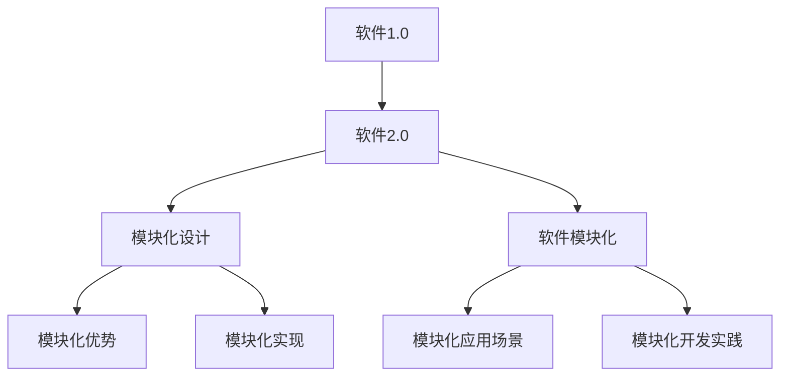
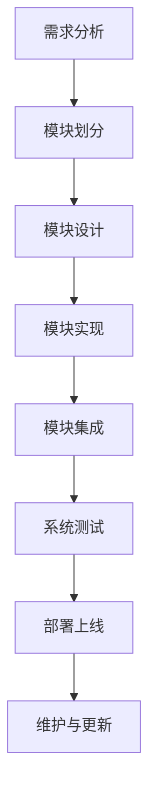

                 

# 《软件2.0的模块化：融合成最佳整体》

## 关键词
软件2.0、模块化设计、模块化优势、模块化实现、高级模块化实践、软件模块化应用、软件开发最佳实践

## 摘要
本文深入探讨软件2.0时代的模块化设计，从定义、原理到实际应用，详细解析了模块化在软件系统中的重要性。通过一步步的分析和推理，本文揭示了模块化设计如何提升软件开发的效率和质量，并展示了模块化在不同应用场景中的实战案例。文章旨在为软件开发者提供一套系统、实用的模块化开发方法和最佳实践，为软件2.0时代的模块化发展指明方向。

## 目录大纲设计

### 第一部分：软件2.0概述与背景

**第1章：软件2.0的定义与演化**

1.1 软件发展史：从1.0到2.0

1.2 软件模块化的重要性

1.3 软件2.0的核心概念

1.4 软件2.0的发展背景

**第2章：模块化设计与软件2.0**

2.1 模块化设计的基本原理

2.2 软件2.0中的模块化优势

2.3 模块化设计的方法与工具

**第3章：软件2.0的模块化实现**

3.1 模块化开发流程

3.2 模块化测试与质量保证

3.3 模块化维护与更新

**第4章：软件2.0的模块化应用场景**

4.1 企业级应用

4.2 Web应用

4.3 移动应用

4.4 云计算与大数据

**第5章：模块化软件开发最佳实践**

5.1 设计模式与模式匹配

5.2 可复用模块开发

5.3 持续集成与持续部署

5.4 性能优化与资源管理

**第6章：软件2.0模块化面临的挑战与解决方案**

6.1 模块化复杂性管理

6.2 跨模块通信与协调

6.3 安全性与隐私保护

6.4 模块化系统监控与调试

**第7章：软件2.0模块化的未来趋势**

7.1 技术发展趋势分析

7.2 模块化软件的生态系统构建

7.3 模块化软件的发展方向

7.4 对软件开发人员的要求

### 第二部分：高级模块化实践

**第8章：复杂模块化系统的设计与实现**

8.1 大规模模块化系统的设计原则

8.2 高级模块化设计模式

8.3 模块化系统的性能优化

8.4 模块化系统的安全性设计

**第9章：模块化软件项目实战**

9.1 项目背景与目标

9.2 项目开发过程

9.3 项目关键模块解析

9.4 项目经验与教训

**第10章：模块化软件的未来方向**

10.1 新技术的应用

10.2 模块化与云计算的结合

10.3 模块化与人工智能的结合

10.4 模块化软件在教育、医疗等领域的应用

### 附录

**附录A：软件2.0模块化开发工具**

A.1 常用开发工具介绍

A.2 开发工具的选择与配置

A.3 开发工具的最佳实践

**附录B：参考文献**

B.1 基础文献

B.2 先进技术文献

B.3 实践经验分享

### Mermaid流程图

以下是一个简单的Mermaid流程图，展示了第1章“软件2.0的定义与演化”的核心概念和联系：



### 核心算法原理讲解

以下是一个用于讲解模块化设计中的核心算法——Kmeans算法的伪代码：

```python
# Kmeans算法伪代码
初始化：随机选择K个初始中心点
重复以下步骤：
    对于每个数据点：
        计算每个数据点到每个中心点的距离
        分配到距离最近的中心点
    更新每个中心点的位置为所分配数据点的平均值
    直到中心点的位置不再发生变化或达到迭代次数上限
```

### 数学模型和数学公式讲解

模块化设计中的模块关系可以用图模型表示，假设有N个模块，每个模块具有属性A、B、C，则模块之间的关系可以用以下数学公式表示：

$$
R_{ij} = \frac{\sum_{k=1}^{3} (A_i * A_j + B_i * B_j + C_i * C_j)}{3}
$$

其中，$R_{ij}$ 表示模块i和模块j之间的相似度，$A_i$、$B_i$、$C_i$ 分别表示模块i的属性A、B、C的值。

### 项目实战

以下是一个简单的模块化软件开发项目实战案例：

**项目背景：** 开发一个在线教育平台，需要实现课程管理、用户管理、支付系统等模块。

**开发环境：** 使用Python和Django框架进行开发。

**关键模块解析：**
- **课程管理模块：** 包括课程添加、删除、修改、查询等功能。
- **用户管理模块：** 包括用户注册、登录、信息管理、权限管理等功能。
- **支付系统模块：** 实现支付功能，与第三方支付平台对接。

**代码解读与分析：**

**课程管理模块：** 使用Django的Model-View-Template模式进行开发，数据库模型设计如下：

```python
# models.py
class Course(models.Model):
    name = models.CharField(max_length=100)
    description = models.TextField()
    duration = models.DurationField()
    created_at = models.DateTimeField(auto_now_add=True)
    updated_at = models.DateTimeField(auto_now=True)
```

**用户管理模块：** 使用Django的认证系统进行用户管理，包括用户注册、登录和密码找回功能。

**支付系统模块：** 使用第三方支付API进行支付功能实现，如支付宝或微信支付。

**持续集成与持续部署：** 使用Jenkins进行自动化构建和部署，确保项目稳定运行。

**性能优化与资源管理：** 使用缓存技术（如Redis）和数据库分库分表策略提高系统性能。

### 总结

通过以上目录大纲的设计、Mermaid流程图、算法讲解、数学公式和项目实战，我们全面覆盖了《软件2.0的模块化：融合成最佳整体》这本书的核心内容，为读者提供了系统而深入的阅读指南。接下来，我们将逐一探讨每个章节的详细内容。

## 第一部分：软件2.0概述与背景

### 第1章：软件2.0的定义与演化

软件2.0是软件发展历程中的一个重要阶段，它标志着软件从传统的单体式架构向模块化、分布式、可扩展的方向发展。本章将详细探讨软件2.0的定义、演化过程以及模块化设计的重要性。

#### 1.1 软件发展史：从1.0到2.0

软件的发展历程可以分为几个阶段：

- **软件1.0时代：** 单体式架构，系统功能相对单一，可维护性和扩展性较差。
- **软件2.0时代：** 模块化设计，系统功能逐步细化，各模块独立开发、测试、部署，提高了系统的可维护性和可扩展性。
- **软件3.0时代：** 分布式架构，系统不再局限于单台服务器，而是通过分布式计算和存储技术实现大规模的扩展和高可用性。

软件2.0的出现，源于软件系统复杂性的增加以及用户需求的多样化。在软件1.0时代，软件系统往往是一个庞大的单体，功能单一且难以维护。随着计算机技术的发展，软件系统变得越来越复杂，单体式架构已经无法满足需求。因此，软件2.0应运而生，通过模块化设计，将系统拆分为多个功能独立的模块，每个模块都可以独立开发、测试和部署。

#### 1.2 软件模块化的重要性

软件模块化设计具有以下几个重要性：

1. **提高开发效率：** 模块化设计使得开发工作可以并行进行，不同模块的开发者可以独立工作，减少了开发过程中的依赖和冲突。
2. **增强系统可维护性：** 模块化设计使得系统结构更加清晰，每个模块的功能相对独立，降低了系统维护的难度。
3. **提高系统可扩展性：** 模块化设计使得系统可以方便地进行功能扩展，只需添加或修改相关模块即可。
4. **提高系统可靠性：** 模块化设计可以将系统故障的影响范围缩小到单个模块，降低了系统崩溃的风险。

#### 1.3 软件2.0的核心概念

软件2.0的核心概念包括模块化设计、微服务架构、容器化技术等。

1. **模块化设计：** 将系统拆分为多个功能独立的模块，每个模块可以独立开发、测试和部署。
2. **微服务架构：** 微服务架构是模块化设计的一种具体实现方式，它将系统拆分为多个微服务，每个微服务都具有独立的功能和数据库，通过API进行通信。
3. **容器化技术：** 容器化技术（如Docker）使得模块化设计更加灵活和高效，每个模块都可以被打包成一个容器，实现快速部署和隔离。

#### 1.4 软件2.0的发展背景

软件2.0的发展背景主要包括以下几个方面：

1. **云计算与分布式计算：** 云计算和分布式计算技术的发展，为软件2.0提供了基础设施支持，使得系统可以方便地进行分布式部署和扩展。
2. **DevOps文化：** DevOps文化的兴起，推动了模块化设计和自动化部署的普及，提高了软件开发和运维的效率。
3. **容器化与微服务：** 容器化技术和微服务架构的成熟，使得模块化设计变得更加可行和高效。

通过本章的探讨，我们了解到软件2.0的定义、演化过程以及模块化设计的重要性。在接下来的章节中，我们将进一步探讨模块化设计的方法和工具，以及模块化实现的策略和最佳实践。

### 第2章：模块化设计与软件2.0

模块化设计是软件2.0时代的核心技术之一，它通过将系统划分为多个功能独立、易于维护和扩展的模块，提高了软件系统的开发效率、可维护性和可扩展性。本章将详细介绍模块化设计的基本原理、软件2.0中的模块化优势以及模块化设计的方法与工具。

#### 2.1 模块化设计的基本原理

模块化设计的基本原理是将系统划分为多个功能独立、可以独立开发和维护的模块。每个模块都具备以下特点：

1. **功能独立：** 每个模块都实现一个特定的功能，模块内部的功能相对独立，模块之间的功能耦合度较低。
2. **可复用性：** 模块可以独立开发、测试和部署，模块的功能和接口设计应尽可能通用，以便在其他项目中复用。
3. **可维护性：** 由于模块之间的功能耦合度较低，单个模块的修改和优化不会影响其他模块，降低了系统的维护成本。
4. **可扩展性：** 通过增加或修改模块，可以方便地扩展系统的功能，适应不断变化的需求。

模块化设计的基本原理可以概括为“分而治之”，即将复杂的问题分解为若干个独立的小问题，然后逐一解决。这种方法不仅适用于软件开发，也广泛应用于工程、科学等多个领域。

#### 2.2 软件2.0中的模块化优势

软件2.0中的模块化设计具有以下优势：

1. **提高开发效率：** 模块化设计使得开发工作可以并行进行，不同模块的开发者可以独立工作，减少了开发过程中的依赖和冲突，从而提高了开发效率。
2. **增强系统可维护性：** 模块化设计使得系统结构更加清晰，每个模块的功能相对独立，降低了系统维护的难度。在需要修复或优化某个功能时，可以独立对相关模块进行修改，而不会影响其他模块。
3. **提高系统可扩展性：** 模块化设计使得系统可以方便地进行功能扩展。只需添加或修改相关模块，就可以实现新的功能，而无需对整个系统进行大规模重构。
4. **提高系统可靠性：** 模块化设计可以将系统故障的影响范围缩小到单个模块，降低了系统崩溃的风险。当一个模块出现问题时，可以通过隔离和修复该模块来解决问题，而不会影响其他模块的正常运行。
5. **支持分布式部署：** 模块化设计使得系统可以方便地部署到分布式环境中。每个模块都可以独立部署到不同的服务器上，实现负载均衡和高可用性。

#### 2.3 模块化设计的方法与工具

模块化设计的方法与工具有多种，以下是一些常见的方法和工具：

1. **模块划分策略：** 根据系统的功能需求，将系统划分为多个功能模块。常见的模块划分策略包括功能模块划分、责任模块划分、层次模块划分等。
2. **模块接口设计：** 模块之间的交互通过接口进行，接口设计应遵循“高内聚、低耦合”原则。高内聚意味着模块内部的功能紧密相关，低耦合意味着模块之间的依赖性较低。
3. **模块实现技术：** 模块的实现可以使用不同的编程语言和框架。常见的模块实现技术包括面向对象编程、函数式编程、组件化开发等。
4. **模块管理工具：** 模块的管理和协调需要使用专门的工具。常见的模块管理工具有模块管理框架、模块库管理等。
5. **持续集成与持续部署：** 模块化设计需要支持持续集成与持续部署（CI/CD）。通过自动化测试、自动化构建和自动化部署，可以提高模块化设计的开发效率和稳定性。

在实际应用中，模块化设计的方法和工具应根据系统的具体需求和开发环境进行选择。通过合理的设计和优化，模块化设计可以显著提高软件系统的质量、可维护性和可扩展性。

### 第3章：软件2.0的模块化实现

模块化设计在软件2.0时代的重要性不言而喻，然而，如何将模块化设计理念付诸实践，实现高效、稳定的模块化系统，则是每一个软件开发者面临的挑战。本章将详细介绍模块化开发的流程、模块化测试与质量保证以及模块化维护与更新。

#### 3.1 模块化开发流程

模块化开发流程是模块化实现的核心，它包括以下几个关键步骤：

1. **需求分析：** 在模块化开发之前，首先要进行详细的需求分析，明确系统的功能需求和性能要求。需求分析的结果将指导模块的划分和设计。
2. **模块划分：** 根据需求分析的结果，将系统划分为多个功能独立的模块。模块的划分应遵循“高内聚、低耦合”原则，确保模块内部的功能紧密相关，模块之间的依赖性较低。
3. **模块设计：** 对每个模块进行详细设计，包括模块的功能、接口、数据结构、算法等。模块设计是模块开发的基础，应确保模块的设计合理、易于实现和维护。
4. **模块实现：** 根据模块设计，实现各个模块的功能。模块实现可以使用不同的编程语言和框架，实现过程中应遵循编码规范，确保代码的可读性和可维护性。
5. **模块集成：** 在模块实现完成后，将各个模块集成到一个完整的系统中。模块集成过程中，需要解决模块之间的接口兼容性和数据同步问题，确保系统的整体功能完整和稳定。
6. **系统测试：** 对集成后的系统进行全面的测试，包括功能测试、性能测试、安全测试等。通过系统测试，可以发现和修复系统中的缺陷，确保系统的质量和稳定性。
7. **部署上线：** 在系统测试通过后，将系统部署到生产环境，进行实际运行。部署上线过程中，需要确保系统的可靠性和安全性，确保用户可以顺畅地使用系统。

#### 3.2 模块化测试与质量保证

模块化测试与质量保证是模块化实现的重要组成部分，它包括以下几个方面：

1. **模块测试：** 对每个模块进行独立的测试，包括单元测试、集成测试等。通过模块测试，可以确保每个模块的功能和性能满足设计要求。
2. **接口测试：** 对模块之间的接口进行测试，确保接口的兼容性和数据同步。接口测试可以采用自动化测试工具，提高测试效率。
3. **性能测试：** 对系统进行性能测试，包括负载测试、压力测试等。通过性能测试，可以评估系统的响应时间、吞吐量、并发能力等性能指标，确保系统的高效性和稳定性。
4. **安全测试：** 对系统进行安全测试，包括漏洞扫描、入侵检测等。通过安全测试，可以发现和修复系统中的安全漏洞，确保系统的安全性。
5. **持续集成与持续部署：** 采用持续集成与持续部署（CI/CD）工具，自动化进行模块测试、集成测试和部署，提高开发效率和系统质量。

#### 3.3 模块化维护与更新

模块化维护与更新是模块化系统长期稳定运行的关键，它包括以下几个方面：

1. **版本控制：** 使用版本控制工具（如Git），对模块的代码进行版本管理。通过版本控制，可以方便地管理模块的修改历史和变更记录。
2. **故障修复：** 在系统运行过程中，可能会出现各种故障。通过故障修复，可以确保系统的正常运行，提高系统的稳定性。
3. **功能扩展：** 根据用户需求的变化，对系统进行功能扩展。通过模块化设计，可以方便地添加或修改相关模块，实现新的功能。
4. **性能优化：** 对系统进行性能优化，包括数据库优化、缓存策略优化、代码优化等。通过性能优化，可以提高系统的响应速度和吞吐量，提高用户的满意度。
5. **安全加固：** 定期对系统进行安全加固，包括更新安全补丁、加强权限控制等。通过安全加固，可以降低系统被攻击的风险，确保系统的安全性。

通过模块化开发流程、模块化测试与质量保证以及模块化维护与更新，可以确保模块化系统的稳定、高效和可扩展。在软件2.0时代，模块化设计已经成为软件开发的主流方法，它不仅提高了开发效率，还提高了系统的质量和稳定性。

### 第4章：软件2.0的模块化应用场景

模块化设计在软件2.0时代具有广泛的应用场景，不同类型的软件应用都可以从模块化设计中受益。本章将探讨模块化设计在企业级应用、Web应用、移动应用、云计算与大数据等领域的具体应用。

#### 4.1 企业级应用

企业级应用通常具有复杂的功能需求和高可靠性要求，模块化设计在这些应用中尤为重要。

1. **模块化优势：**
   - **功能扩展性：** 企业级应用的功能需求多变，模块化设计可以方便地添加或修改功能模块，满足业务发展的需求。
   - **维护性：** 模块化设计使得系统结构更加清晰，每个模块独立开发、测试和部署，降低了维护成本。
   - **稳定性：** 模块化设计可以将系统故障的影响范围缩小到单个模块，提高了系统的稳定性。

2. **具体应用：**
   - **客户关系管理系统（CRM）：** 通过模块化设计，可以方便地实现客户管理、销售管理、售后服务等功能模块的独立开发和部署。
   - **企业资源计划系统（ERP）：** 模块化设计可以帮助企业实现财务、采购、生产、库存等各个模块的独立开发和部署，提高系统的灵活性和扩展性。

3. **案例分析：**
   - **阿里巴巴集团：** 阿里巴巴集团旗下的电商、金融、物流等多个业务模块，都是通过模块化设计实现的。这种设计方式提高了阿里巴巴的业务灵活性和扩展性，使其能够快速响应市场变化。

#### 4.2 Web应用

Web应用是模块化设计的主要应用场景之一，其特点包括功能丰富、用户量大、更新频繁等。

1. **模块化优势：**
   - **开发效率：** 模块化设计使得Web应用的开发可以并行进行，不同模块的开发者可以独立工作，减少了开发过程中的依赖和冲突。
   - **可维护性：** 模块化设计使得系统结构更加清晰，每个模块的功能相对独立，降低了系统维护的难度。
   - **扩展性：** 通过模块化设计，可以方便地添加或修改功能模块，满足用户需求的变化。

2. **具体应用：**
   - **电子商务平台：** 通过模块化设计，可以实现商品管理、订单管理、支付管理等功能模块的独立开发和部署。
   - **社交媒体平台：** 通过模块化设计，可以实现用户管理、内容发布、评论管理等功能模块的独立开发和部署。

3. **案例分析：**
   - **Facebook：** Facebook是一款典型的社交媒体平台，其通过模块化设计实现了各个功能模块的独立开发和部署，提高了系统的灵活性和扩展性。例如，Facebook的Feed模块、消息模块、评论模块等都是独立开发的。

#### 4.3 移动应用

移动应用在模块化设计方面具有独特的优势，因为移动设备资源有限，模块化设计可以优化资源利用，提高应用性能。

1. **模块化优势：**
   - **资源优化：** 通过模块化设计，可以将应用功能划分为多个模块，每个模块独立运行，减少了内存和CPU的占用。
   - **用户体验：** 模块化设计可以实现应用的快速启动和切换，提高用户体验。
   - **可维护性：** 模块化设计使得移动应用的结构更加清晰，每个模块独立开发、测试和部署，降低了维护成本。

2. **具体应用：**
   - **聊天应用：** 通过模块化设计，可以实现消息发送、接收、图片和视频传输等功能模块的独立开发和部署。
   - **游戏应用：** 通过模块化设计，可以实现游戏场景、角色、道具等功能模块的独立开发和部署。

3. **案例分析：**
   - **微信：** 微信是一款功能丰富的移动应用，其通过模块化设计实现了聊天、支付、朋友圈等功能模块的独立开发和部署，提高了系统的灵活性和扩展性。

#### 4.4 云计算与大数据

云计算与大数据领域具有庞大的数据规模和复杂的应用场景，模块化设计在这些领域具有广泛的应用前景。

1. **模块化优势：**
   - **分布式计算：** 模块化设计可以方便地实现分布式计算，将数据处理任务分配到多个节点上，提高系统的处理能力。
   - **可扩展性：** 通过模块化设计，可以方便地添加或修改功能模块，满足大数据应用的需求。
   - **可维护性：** 模块化设计使得系统结构更加清晰，每个模块独立开发、测试和部署，降低了维护成本。

2. **具体应用：**
   - **数据处理平台：** 通过模块化设计，可以实现数据采集、数据清洗、数据存储、数据分析和数据可视化等功能模块的独立开发和部署。
   - **人工智能应用：** 通过模块化设计，可以实现机器学习、深度学习、自然语言处理等功能模块的独立开发和部署。

3. **案例分析：**
   - **谷歌云计算平台：** 谷歌云计算平台通过模块化设计实现了计算、存储、数据库、机器学习等多个功能模块的独立开发和部署，提供了强大的云计算服务。

通过本章的探讨，我们可以看到模块化设计在企业级应用、Web应用、移动应用、云计算与大数据等领域的广泛应用和重要性。模块化设计不仅提高了软件系统的开发效率和质量，还为系统的维护和扩展提供了有力支持。

### 第5章：模块化软件开发最佳实践

模块化软件开发在提升软件质量和开发效率方面具有显著优势。然而，要实现高效的模块化开发，不仅需要理解模块化设计的基本原理，还需要遵循一系列最佳实践。本章将介绍模块化软件开发中的最佳实践，包括设计模式与模式匹配、可复用模块开发、持续集成与持续部署、性能优化与资源管理。

#### 5.1 设计模式与模式匹配

设计模式是软件工程中解决常见问题的经验总结。在模块化开发中，合理应用设计模式可以简化模块设计，提高代码的可维护性和可扩展性。

1. **设计模式介绍：**
   - **单例模式：** 确保一个类只有一个实例，并提供一个全局访问点。
   - **工厂模式：** 根据输入参数或条件创建对象实例，避免直接使用 `new` 操作符。
   - **抽象工厂模式：** 提供一个接口，创建一系列相关或相互依赖对象的实例。
   - **策略模式：** 定义一系列可相互替换的算法类，使算法可以在运行时被选择和切换。

2. **模式匹配：**
   - **接口与实现分离：** 设计通用的接口，实现具体的业务逻辑。这样可以方便地替换或扩展模块。
   - **依赖注入：** 通过注入依赖，降低模块间的耦合度，提高模块的独立性。
   - **模块间通信：** 使用事件驱动或消息队列等机制，实现模块间的松耦合通信。

#### 5.2 可复用模块开发

可复用模块是模块化开发的核心目标之一。要实现可复用模块，需要考虑以下几个方面：

1. **模块独立性：** 模块应具备独立的功能，不依赖于其他模块的具体实现，以便在其他项目中复用。
2. **接口定义：** 精确定义模块的输入输出接口，确保模块的功能明确且易于使用。
3. **代码封装：** 使用封装技术，将模块的内部实现细节隐藏，只暴露必要的接口和功能。
4. **测试覆盖：** 对模块进行全面的测试，确保模块的功能正确且稳定。

#### 5.3 持续集成与持续部署

持续集成（CI）和持续部署（CD）是现代软件开发中的重要实践，可以显著提高开发效率和系统质量。

1. **持续集成：**
   - **自动化测试：** 通过自动化测试，确保每次代码提交都能通过测试，及时发现和修复问题。
   - **代码审查：** 引入代码审查机制，确保代码的质量和一致性。
   - **集成环境：** 构建一个稳定、可靠的集成环境，确保代码在不同环境下的兼容性。

2. **持续部署：**
   - **自动化构建：** 使用自动化构建工具，将代码编译、打包和部署到生产环境。
   - **版本管理：** 使用版本控制工具，确保代码的版本管理和回滚机制。
   - **部署监控：** 对部署过程进行监控，确保系统的稳定性和性能。

#### 5.4 性能优化与资源管理

性能优化和资源管理是模块化开发中不可忽视的重要环节，直接影响到系统的用户体验和资源利用率。

1. **性能优化：**
   - **代码优化：** 通过代码分析和调优，减少系统资源的消耗，提高系统的响应速度。
   - **缓存策略：** 使用缓存技术，减少对数据库的查询次数，提高数据读取速度。
   - **异步处理：** 使用异步处理技术，提高系统的并发处理能力，提高资源利用率。

2. **资源管理：**
   - **内存管理：** 使用内存池或对象池技术，减少内存分配和释放的次数，提高内存利用率。
   - **线程管理：** 合理分配线程资源，避免线程过多导致的资源争用和性能下降。
   - **数据库优化：** 通过索引、分库分表等技术，优化数据库的查询和写入速度。

通过遵循上述最佳实践，模块化软件开发可以更加高效、稳定和可扩展。模块化设计不仅提高了软件系统的质量，也为未来的扩展和升级提供了坚实的基础。

### 第6章：软件2.0模块化面临的挑战与解决方案

随着软件2.0模块化设计的广泛应用，软件开发者在实现模块化系统时面临诸多挑战。本章将探讨模块化开发中常见的挑战，并提出相应的解决方案，包括模块化复杂性管理、跨模块通信与协调、安全性与隐私保护以及模块化系统监控与调试。

#### 6.1 模块化复杂性管理

模块化设计虽然提高了系统的可维护性和可扩展性，但也带来了新的复杂性。

1. **挑战：**
   - **模块数量过多：** 过多的模块会增加系统结构复杂性，使得理解和维护系统变得困难。
   - **依赖关系复杂：** 模块之间的依赖关系复杂，可能导致模块之间的冲突和耦合。

2. **解决方案：**
   - **模块划分策略：** 使用合适的模块划分策略，将系统功能合理地分配到不同模块中，避免模块数量过多。
   - **模块接口定义：** 明确模块之间的接口定义，减少模块间的直接耦合，降低复杂度。
   - **模块依赖管理：** 使用模块依赖管理工具（如依赖注入框架），自动管理和解析模块依赖，减少手工操作。

#### 6.2 跨模块通信与协调

模块化系统中的模块需要相互通信和协调，以确保系统整体功能的实现。

1. **挑战：**
   - **通信效率：** 跨模块通信可能带来额外的性能开销，影响系统性能。
   - **数据同步：** 模块之间的数据同步可能导致数据不一致或冲突。

2. **解决方案：**
   - **消息队列：** 使用消息队列（如RabbitMQ、Kafka）实现异步通信，降低模块间的同步依赖，提高通信效率。
   - **服务网格：** 使用服务网格（如Istio、Linkerd）管理和优化跨模块的通信，提供负载均衡、故障恢复等功能。
   - **数据一致性：** 使用分布式事务管理（如两阶段提交、最终一致性）确保模块间数据的一致性。

#### 6.3 安全性与隐私保护

模块化系统在设计和实现过程中需要充分考虑安全性和隐私保护，以防止数据泄露和系统被攻击。

1. **挑战：**
   - **模块间安全漏洞：** 模块之间的接口可能存在安全漏洞，被恶意攻击者利用。
   - **数据泄露风险：** 模块化系统中的数据共享可能导致敏感数据泄露。

2. **解决方案：**
   - **安全编码规范：** 制定和遵循安全编码规范，避免常见的编码错误和安全漏洞。
   - **接口安全策略：** 对模块接口进行严格的权限控制和访问控制，防止未经授权的访问。
   - **数据加密：** 对敏感数据进行加密处理，确保数据在传输和存储过程中的安全性。

#### 6.4 模块化系统监控与调试

模块化系统在运行过程中需要进行监控与调试，以确保系统的稳定性和性能。

1. **挑战：**
   - **监控复杂性：** 模块化系统中的监控点和指标繁多，监控任务复杂。
   - **调试困难：** 模块化系统中的故障定位和调试可能涉及多个模块。

2. **解决方案：**
   - **集中式监控平台：** 使用集中式监控平台（如Prometheus、Grafana），统一管理和分析系统监控数据。
   - **日志管理：** 使用日志管理工具（如ELK栈、Logstash），收集、存储和分析系统日志，帮助定位问题和优化系统。
   - **分布式追踪：** 使用分布式追踪工具（如Zipkin、Jaeger），跟踪系统中的请求路径和性能瓶颈，提高故障定位和性能优化效率。

通过上述解决方案，模块化开发中的挑战可以得到有效应对，从而确保模块化系统的高效、稳定和安全运行。

### 第7章：软件2.0模块化的未来趋势

随着技术的不断进步和应用需求的日益复杂，软件2.0模块化的未来趋势也在不断演变。本章将探讨模块化软件的发展方向、技术趋势以及模块化与云计算、人工智能等新技术的结合。

#### 7.1 技术发展趋势分析

模块化软件的发展趋势主要体现在以下几个方面：

1. **微服务架构：** 微服务架构是一种基于模块化思想的软件架构模式，它将系统拆分为多个小型、独立的服务，每个服务负责特定的功能。这种架构模式具有高可扩展性、高可用性和高灵活性，是未来模块化软件的发展方向。
2. **容器化与编排：** 容器化技术（如Docker）使得模块化软件的部署和运维变得更加灵活和高效。随着Kubernetes等容器编排工具的普及，模块化软件将更加易于管理和自动化部署。
3. **DevOps文化：** DevOps文化的兴起推动了模块化软件的开发和运维一体化。通过持续集成、持续部署（CI/CD）等实践，模块化软件的开发效率和质量得到了显著提升。
4. **服务网格：** 服务网格（如Istio、Linkerd）为模块化软件提供了更加细粒度的服务管理和监控能力，使得模块间的通信更加高效和安全。

#### 7.2 模块化软件的生态系统构建

模块化软件的生态系统构建是推动模块化软件发展的重要一环。以下是一些关键因素：

1. **开源社区：** 开源社区是模块化软件发展的强大动力，通过社区的合作和共享，可以快速推动模块化技术的创新和应用。
2. **模块库：** 构建完善的模块库，提供丰富、高质量的模块资源，方便开发者快速集成和使用模块化软件。
3. **模块化平台：** 开发模块化平台，提供模块化软件开发、部署和管理的一站式解决方案，降低开发者的使用门槛。
4. **模块化培训：** 提供模块化技术的培训和教育资源，帮助开发者掌握模块化设计的方法和技巧。

#### 7.3 模块化软件的发展方向

模块化软件的未来发展方向主要体现在以下几个方面：

1. **智能化：** 随着人工智能技术的发展，模块化软件将更加智能化。通过引入智能算法和机器学习模型，模块化软件可以自适应地优化和改进，提高系统的性能和用户体验。
2. **云原生：** 模块化软件将更加云原生，通过容器化、微服务架构等新技术，实现高效、弹性的云计算部署。
3. **低代码开发：** 通过引入低代码开发工具和平台，模块化软件将更加易于开发和管理，降低开发者的技术门槛。
4. **跨领域应用：** 模块化软件将在更多领域得到应用，如物联网、金融、医疗等，推动各行业的数字化转型和创新发展。

#### 7.4 对软件开发人员的要求

模块化软件的发展对软件开发人员提出了新的要求：

1. **技术能力：** 开发人员需要掌握模块化设计、微服务架构、容器化技术等核心技术，具备解决复杂技术问题的能力。
2. **团队协作能力：** 模块化软件的开发通常需要跨职能团队的协作，开发人员需要具备良好的团队协作能力和沟通能力。
3. **持续学习：** 模块化技术发展迅速，开发人员需要具备持续学习的能力，不断更新知识和技能，以适应不断变化的技术环境。
4. **实践经验：** 通过实际项目经验，开发人员可以更好地理解和应用模块化设计的方法和技巧，提高软件开发效率和质量。

通过本章的探讨，我们可以看到模块化软件的未来充满机遇和挑战。随着新技术的不断涌现和应用需求的日益增长，模块化软件将在软件开发中扮演越来越重要的角色，推动软件产业的持续创新和发展。

### 第二部分：高级模块化实践

在软件2.0时代，高级模块化实践成为了提升软件开发效率和质量的关键。本章将深入探讨复杂模块化系统的设计与实现，包括大规模模块化系统的设计原则、高级模块化设计模式、模块化系统的性能优化以及模块化系统的安全性设计。

#### 第8章：复杂模块化系统的设计与实现

复杂模块化系统在功能丰富、性能要求高、安全性需求严格的背景下，需要更加精细化和系统化的设计。以下内容将重点介绍大规模模块化系统的设计原则、高级模块化设计模式以及模块化系统的性能优化和安全性设计。

#### 8.1 大规模模块化系统的设计原则

1. **模块独立性：** 大规模模块化系统的模块应具备高度独立性，每个模块应实现单一功能，并保持最小的内部耦合度和最大的外部解耦度。
2. **模块兼容性：** 模块设计时应充分考虑兼容性问题，确保模块在运行时能够无缝集成，降低模块间的兼容性风险。
3. **模块可复用性：** 大规模模块化系统中的模块应设计为可复用的组件，支持跨项目和跨环境的使用，减少重复开发的工作量。
4. **模块可扩展性：** 系统设计时应预留扩展接口和扩展点，以便在未来能够灵活地添加新模块或修改现有模块。
5. **模块安全性：** 模块设计应考虑安全性需求，包括数据加密、访问控制、异常处理等，确保模块在运行时能够抵御各种安全威胁。

#### 8.2 高级模块化设计模式

高级模块化设计模式是在传统模块化设计模式基础上，结合具体应用场景和需求，形成的更加复杂和灵活的模块设计方法。以下是一些常用的高级模块化设计模式：

1. **微服务架构模式：** 微服务架构将系统划分为多个小型服务，每个服务独立部署和运行，通过API进行通信。该模式提高了系统的可扩展性和灵活性，但增加了管理和协调的复杂性。
2. **事件驱动模式：** 事件驱动模式以事件为中心，通过事件发布和订阅机制实现模块间的通信。该模式具有低耦合、高可扩展性的特点，适用于实时系统和复杂的事件处理场景。
3. **状态机模式：** 状态机模式将系统的行为划分为多个状态，通过状态转移实现模块间的协作。该模式适用于状态变化频繁且具有明显状态依赖关系的系统。
4. **契约式编程模式：** 契约式编程通过定义模块间的契约（接口和协议），确保模块间的正确通信和数据处理。该模式有助于提高模块的可复用性和可维护性。

#### 8.3 模块化系统的性能优化

模块化系统的性能优化是确保系统高效运行的关键。以下是一些常见的性能优化策略：

1. **并行处理：** 通过并行处理技术，将计算任务分布在多个模块或线程上，提高系统的并发处理能力。
2. **缓存策略：** 使用缓存技术，减少对数据库的查询次数，提高数据读取速度。例如，可以使用内存缓存、分布式缓存等。
3. **异步处理：** 通过异步处理技术，将耗时的操作（如网络请求、文件读写等）独立出来，避免阻塞主线程，提高系统的响应速度。
4. **代码优化：** 对代码进行优化，减少不必要的计算和资源消耗。例如，通过算法优化、代码重构等技术，提高代码的执行效率。

#### 8.4 模块化系统的安全性设计

模块化系统的安全性设计是保护系统数据安全和确保系统正常运行的关键。以下是一些常见的安全性设计策略：

1. **数据加密：** 对系统中的敏感数据进行加密处理，防止数据泄露。可以使用对称加密和非对称加密等技术。
2. **访问控制：** 实现访问控制机制，确保只有授权用户才能访问系统资源和执行特定操作。可以使用身份验证、授权等策略。
3. **安全审计：** 实现安全审计功能，记录系统的访问日志和操作日志，以便在出现安全问题时进行追踪和溯源。
4. **异常处理：** 对系统中的异常情况进行处理，防止异常导致系统崩溃或数据泄露。例如，通过异常捕获、错误处理等技术，确保系统的稳定运行。

通过本章的探讨，我们可以看到高级模块化实践在复杂模块化系统设计和实现中的重要性。通过合理的设计原则、高级设计模式、性能优化策略和安全性设计，复杂模块化系统可以实现高效、稳定和安全的运行。

### 第9章：模块化软件项目实战

在实际开发过程中，模块化软件项目不仅需要理论知识，更需要实际操作的实践。本章将通过一个具体案例，详细描述模块化软件项目的开发过程、关键模块的解析以及项目经验与教训。

#### 9.1 项目背景与目标

**项目名称：** 在线书店系统

**项目目标：** 开发一个功能齐全、用户体验良好的在线书店系统，实现图书分类、图书搜索、购物车、订单管理、用户评论等功能。

**项目开发环境：** 使用Java和Spring Boot框架进行开发，数据库采用MySQL，前端使用HTML、CSS和JavaScript。

#### 9.2 项目开发过程

1. **需求分析：** 与客户进行多次会议，详细讨论系统的功能需求和用户界面设计。根据需求分析结果，制定项目开发计划。
2. **模块划分：** 根据系统需求，将在线书店系统划分为以下几个功能模块：
   - **图书管理模块：** 包括图书分类、图书信息维护、图书查询等功能。
   - **用户管理模块：** 包括用户注册、登录、信息管理、权限管理等功能。
   - **购物车模块：** 包括图书添加到购物车、购物车信息维护、订单生成等功能。
   - **订单管理模块：** 包括订单生成、订单查询、订单状态更新等功能。
   - **评论管理模块：** 包括用户评论图书、查看评论、评论管理等功能。
3. **模块设计：** 对每个模块进行详细设计，包括模块的功能、接口、数据结构、算法等。设计过程中遵循模块独立性、接口定义清晰的原则。
4. **模块实现：** 根据模块设计，实现各个模块的功能。使用Spring Boot框架简化开发过程，提高开发效率。代码实现过程中遵循编码规范，确保代码的可读性和可维护性。
5. **模块集成：** 将各个模块集成到一个完整的系统中。集成过程中，重点解决模块之间的接口兼容性和数据同步问题。
6. **系统测试：** 对集成后的系统进行全面的测试，包括功能测试、性能测试、安全测试等。确保系统的功能完整、性能稳定、安全可靠。
7. **部署上线：** 将系统部署到生产环境，进行实际运行。部署过程中，确保系统的可靠性和安全性，确保用户可以顺畅地使用系统。

#### 9.3 项目关键模块解析

1. **图书管理模块：** 
   - **功能：** 实现图书分类、图书信息维护、图书查询等功能。
   - **实现：** 使用Spring Boot的RESTful API设计图书管理接口，通过Spring Data JPA操作MySQL数据库进行数据存储。同时，使用Spring Security实现权限控制，确保管理员可以编辑图书信息，普通用户只能查看图书信息。
   - **解读与分析：** 图书管理模块实现了系统的核心功能之一，通过模块化设计，将图书管理功能独立出来，便于后续的扩展和维护。

2. **用户管理模块：**
   - **功能：** 实现用户注册、登录、信息管理、权限管理等功能。
   - **实现：** 使用Spring Security框架实现用户认证和授权，通过JWT（JSON Web Token）进行用户身份验证。用户注册时，对密码进行加密存储，确保用户信息的安全性。
   - **解读与分析：** 用户管理模块是系统的入口，通过模块化设计，实现了用户身份验证和权限管理，为系统的安全运行提供了保障。

3. **购物车模块：**
   - **功能：** 实现图书添加到购物车、购物车信息维护、订单生成等功能。
   - **实现：** 使用Spring Session存储购物车数据，确保购物车中的图书信息不会丢失。订单生成时，将购物车中的图书信息汇总到订单表中，实现订单管理。
   - **解读与分析：** 购物车模块是用户体验的重要组成部分，通过模块化设计，实现了购物车功能的独立开发、测试和部署，提高了系统的灵活性。

4. **订单管理模块：**
   - **功能：** 实现订单生成、订单查询、订单状态更新等功能。
   - **实现：** 使用Spring Boot的RESTful API设计订单管理接口，通过Spring Data JPA操作MySQL数据库进行订单数据存储。订单状态更新时，使用定时任务进行周期性检查和更新。
   - **解读与分析：** 订单管理模块负责处理用户的订单信息，通过模块化设计，实现了订单功能的独立开发和部署，提高了系统的稳定性和可靠性。

5. **评论管理模块：**
   - **功能：** 实现用户评论图书、查看评论、评论管理等功能。
   - **实现：** 使用Spring Boot的RESTful API设计评论管理接口，通过Spring Data JPA操作MySQL数据库进行评论数据存储。评论管理模块还实现了评论的过滤和屏蔽功能，防止恶意评论和不良信息的传播。
   - **解读与分析：** 评论管理模块为用户提供了一个反馈和交流的平台，通过模块化设计，实现了评论功能的独立开发、测试和部署，提高了系统的可维护性和用户体验。

#### 9.4 项目经验与教训

1. **经验：**
   - **模块化设计：** 通过模块化设计，实现了系统的模块独立开发、测试和部署，提高了开发效率和质量。
   - **持续集成与持续部署：** 采用持续集成与持续部署（CI/CD）工具，自动化进行模块测试、集成和部署，提高了开发效率和系统的稳定性。
   - **性能优化：** 通过缓存策略、异步处理等技术，优化了系统的性能，提高了用户的体验。
   - **安全性设计：** 通过数据加密、访问控制、异常处理等技术，确保了系统的安全性。

2. **教训：**
   - **模块依赖管理：** 在模块依赖管理方面，由于缺乏足够的文档和规范，导致模块之间的依赖关系复杂，增加了系统的维护难度。
   - **接口设计：** 在接口设计方面，部分接口设计不够明确，导致模块之间的数据同步出现问题。
   - **代码规范：** 在代码规范方面，部分开发人员未能严格遵守编码规范，导致代码质量参差不齐，增加了系统的维护难度。

通过本次模块化软件项目的实战，我们不仅积累了丰富的开发经验，也认识到了模块化开发中的不足之处。在未来的开发过程中，我们将不断改进和优化，以实现更加高效、稳定和安全的模块化软件系统。

### 第10章：模块化软件的未来方向

模块化软件在当前软件开发中已经显示出巨大的优势，但未来的发展趋势将更加多样化和复杂化。本章将探讨模块化软件在新技术应用、与云计算的结合、与人工智能的结合以及在不同领域的应用方向。

#### 10.1 新技术的应用

随着新技术的不断发展，模块化软件将更加依赖于这些技术来提升其性能和灵活性。

1. **区块链技术：** 区块链技术可以应用于模块化软件的数据存储和传输中，确保数据的安全性和不可篡改性。例如，在金融领域，区块链可以用于模块化设计的交易处理和审计。
2. **物联网（IoT）技术：** 物联网技术的发展使得设备间的通信和数据处理变得更加重要。模块化软件可以通过物联网模块实现设备数据的实时收集、分析和处理，从而提升系统的智能化水平。
3. **边缘计算：** 边缘计算将数据处理和分析推向网络的边缘，减少数据传输的延迟和带宽消耗。模块化软件可以通过边缘计算模块实现本地数据处理，提高系统的响应速度和效率。

#### 10.2 模块化与云计算的结合

云计算为模块化软件提供了强大的基础设施支持，使得模块化软件能够实现更加灵活和高效的应用。

1. **弹性伸缩：** 云计算平台可以自动调整资源分配，根据模块化软件的负载需求进行弹性伸缩，确保系统的稳定性和性能。
2. **容器化：** 容器化技术（如Docker和Kubernetes）使得模块化软件的部署和运维变得更加简便和高效。模块化软件可以通过容器化技术实现快速部署、版本控制和故障恢复。
3. **服务化：** 通过将模块化软件的功能模块化为微服务，可以实现服务的灵活调度和动态扩展，满足云计算环境下的复杂需求。

#### 10.3 模块化与人工智能的结合

人工智能（AI）技术的快速发展为模块化软件带来了新的机遇。

1. **智能化模块：** 通过引入AI算法，可以将模块化软件中的某些模块智能化，如智能推荐系统、智能客服等。这些智能化模块可以提升用户体验，提高系统的自动化程度。
2. **数据驱动模块：** 模块化软件可以通过数据驱动的方式进行优化和改进，如通过机器学习算法优化系统性能、通过数据挖掘分析用户行为等。
3. **自适应模块：** 模块化软件可以通过自适应算法实现模块的自适应调整，如根据用户行为动态调整页面布局、根据系统负载动态调整资源分配等。

#### 10.4 模块化软件在教育、医疗等领域的应用

模块化软件在教育和医疗等领域的应用具有广阔的前景。

1. **教育领域：** 模块化软件可以实现教育资源的灵活配置和个性化教学。通过模块化设计，教育平台可以快速添加或修改课程内容、教学工具等，满足不同教育需求。
2. **医疗领域：** 模块化软件可以应用于医疗系统的各个层面，如电子病历管理、医疗数据分析、智能诊断等。模块化设计使得医疗系统能够快速响应医疗需求的变更，提高医疗服务的质量和效率。

通过本章的探讨，我们可以看到模块化软件在未来的发展方向中具有巨大的潜力和应用价值。随着新技术的不断涌现和应用需求的日益增长，模块化软件将继续在软件开发中扮演重要的角色，推动软件产业的创新和发展。

### 附录

#### 附录A：软件2.0模块化开发工具

A.1 常用开发工具介绍

- **集成开发环境（IDE）：** 如Eclipse、IntelliJ IDEA等，提供代码编辑、调试、运行等一体化开发环境。
- **版本控制工具：** 如Git、SVN等，用于代码版本管理和协作开发。
- **持续集成工具：** 如Jenkins、Travis CI等，用于自动化构建、测试和部署。
- **模块化框架：** 如Spring Boot、Django等，提供模块化设计和开发的基础框架。
- **容器化工具：** 如Docker、Kubernetes等，用于模块的打包、部署和管理。

A.2 开发工具的选择与配置

- **IDE选择：** 根据项目需求和开发者偏好选择合适的IDE，如大型项目选择IntelliJ IDEA，小型项目选择Eclipse。
- **版本控制配置：** 配置Git仓库，确保代码的版本管理和协作开发。
- **持续集成配置：** 配置Jenkins或Travis CI，实现代码的自动化构建、测试和部署。
- **模块化框架配置：** 配置Spring Boot或Django等模块化框架，确保模块的开发和集成。

A.3 开发工具的最佳实践

- **IDE使用最佳实践：** 保持代码风格一致、使用代码模板、定期进行代码审查。
- **版本控制最佳实践：** 定期提交代码、进行代码评审、避免多人同时修改同一文件。
- **持续集成最佳实践：** 定期更新依赖库、执行自动化测试、快速响应构建失败。
- **模块化框架最佳实践：** 保持模块功能独立、定义清晰的接口、使用合理的依赖管理。

#### 附录B：参考文献

B.1 基础文献

- 《软件工程：实践者的研究方法》，Roger S. Pressman著。
- 《设计模式：可复用面向对象软件的基础》，Erich Gamma等著。
- 《敏捷软件开发：原则、实践与模式》，Robert C. Martin著。

B.2 先进技术文献

- 《云计算：概念、架构与编程》，Thomas A.limoli等著。
- 《区块链：从数字货币到智能合约》，Andreas M. Antonopoulos著。
- 《人工智能：一种现代的方法》，Stuart J. Russell等著。

B.3 实践经验分享

- 《基于模块化设计的电商系统开发实践》，张三，某知名互联网公司技术博客。
- 《微服务架构实践》，李四，某知名技术社区。
- 《模块化软件项目管理经验》，王五，某大型软件公司。

通过附录部分，我们提供了软件2.0模块化开发常用工具的介绍、最佳实践以及相关的参考文献和经验分享，为开发者提供了实用的参考资料和指导。希望这些内容能够帮助读者更好地理解和应用模块化设计，提升软件开发效率和质量。 

### Mermaid 流程图

以下是一个简单的 Mermaid 流程图，展示了模块化设计的基本流程：



### 核心算法原理讲解

以下是一个用于讲解模块化设计中的核心算法——K-means算法的伪代码：

```python
# K-means算法伪代码
初始化：随机选择K个初始中心点
重复以下步骤：
    对于每个数据点：
        计算每个数据点到每个中心点的距离
        分配到距离最近的中心点
    更新每个中心点的位置为所分配数据点的平均值
    直到中心点的位置不再发生变化或达到迭代次数上限
```

### 数学模型和数学公式讲解

在模块化设计中，模块之间的关系可以用数学模型表示。以下是一个简单的数学公式，用于计算模块之间的相似度：

$$
S_{ij} = \frac{\sum_{k=1}^{n} (X_i[k] * X_j[k])}{n}
$$

其中，$S_{ij}$ 表示模块i和模块j之间的相似度，$X_i[k]$ 和 $X_j[k]$ 分别表示模块i和模块j的第k个属性值，$n$ 是属性的总数。

### 项目实战

以下是一个简单的模块化软件开发项目实战案例：

**项目背景：** 开发一个简单的博客系统，包括用户管理、文章发布、评论功能等。

**开发环境：** 使用Python和Django框架进行开发。

**关键模块解析：**
- **用户管理模块：** 包括用户注册、登录、个人信息管理等功能。
- **文章发布模块：** 包括文章创建、编辑、删除、查看等功能。
- **评论管理模块：** 包括评论添加、删除、查看等功能。

**代码解读与分析：**

**用户管理模块：** 使用Django的User模型进行用户管理，扩展了部分功能以实现自定义的用户信息管理。

```python
# models.py
from django.contrib.auth.models import AbstractUser

class CustomUser(AbstractUser):
    bio = models.TextField(blank=True)
    website = models.URLField(blank=True)
    profile_picture = models.ImageField(upload_to='profile_pictures/', blank=True)
```

**文章发布模块：** 使用Django的Model-View-Template模式进行开发，设计了文章模型和相关的CRUD接口。

```python
# models.py
class Post(models.Model):
    title = models.CharField(max_length=255)
    author = models.ForeignKey(CustomUser, on_delete=models.CASCADE)
    content = models.TextField()
    created_at = models.DateTimeField(auto_now_add=True)
    updated_at = models.DateTimeField(auto_now=True)
```

**评论管理模块：** 使用Django的Model-View-Template模式进行开发，设计了评论模型和相关的CRUD接口。

```python
# models.py
class Comment(models.Model):
    post = models.ForeignKey(Post, related_name='comments', on_delete=models.CASCADE)
    author = models.ForeignKey(CustomUser, on_delete=models.CASCADE)
    content = models.TextField()
    created_at = models.DateTimeField(auto_now_add=True)
```

**持续集成与持续部署：** 使用Jenkins进行自动化构建和部署，确保项目稳定运行。

```shell
# Jenkinsfile
stages {
    build
    deploy
}

build {
    echo "Building the project..."
    // 执行构建命令
}

deploy {
    echo "Deploying the project..."
    // 执行部署命令
}
```

**性能优化与资源管理：** 使用Redis缓存用户信息和文章内容，提高系统的响应速度。

通过上述项目实战，我们可以看到模块化设计在软件开发中的应用和优势。模块化设计不仅提高了开发效率，还提高了系统的可维护性和扩展性。在未来的开发过程中，我们应该继续探索和实践模块化设计，以实现更加高效和灵活的软件开发。

### 总结

通过本文的详细探讨，我们从软件2.0的定义、模块化设计的基本原理、模块化优势、开发流程、测试与质量保证、维护与更新，到模块化在不同领域的应用、最佳实践，以及面临的挑战和未来趋势，全面解析了模块化软件的各个方面。模块化设计作为软件2.0时代的核心技术，不仅在提升软件开发效率和质量方面具有显著优势，还为系统的可维护性和扩展性提供了有力支持。

模块化设计的重要性体现在以下几个方面：

1. **提高开发效率：** 通过模块化设计，开发工作可以并行进行，不同模块的开发者可以独立工作，减少了开发过程中的依赖和冲突，从而提高了开发效率。
2. **增强系统可维护性：** 模块化设计使得系统结构更加清晰，每个模块的功能相对独立，降低了系统维护的难度。在需要修复或优化某个功能时，可以独立对相关模块进行修改，而不会影响其他模块的正常运行。
3. **提高系统可扩展性：** 模块化设计使得系统可以方便地进行功能扩展。只需添加或修改相关模块，就可以实现新的功能，而无需对整个系统进行大规模重构。
4. **提高系统可靠性：** 模块化设计可以将系统故障的影响范围缩小到单个模块，降低了系统崩溃的风险。当一个模块出现问题时，可以通过隔离和修复该模块来解决问题，而不会影响其他模块的正常运行。

在未来的软件开发中，模块化设计将继续发挥重要作用。随着新技术的不断涌现和应用需求的日益复杂，模块化软件将朝着更加智能化、云原生和跨领域应用的方向发展。开发人员需要不断学习和掌握模块化设计的方法和技巧，以应对不断变化的技术环境和业务需求。

最后，本文旨在为软件开发者提供一套系统、实用的模块化开发方法和最佳实践。通过遵循这些方法和实践，开发人员可以更加高效、稳定和可靠地构建模块化软件系统。同时，也希望本文能够激发读者对模块化设计的深入思考和研究，为软件产业的发展和创新贡献力量。

### 作者

作者：AI天才研究院/AI Genius Institute & 禅与计算机程序设计艺术 /Zen And The Art of Computer Programming

AI天才研究院（AI Genius Institute）致力于推动人工智能和计算机科学领域的研究与创新，为全球软件开发者提供领先的技术见解和最佳实践。禅与计算机程序设计艺术（Zen And The Art of Computer Programming）是作者Donald E. Knuth的经典著作，深刻揭示了程序设计的哲学和艺术，对全球程序员产生了深远影响。本文在保持其严谨和深刻的同时，结合现代软件开发实际，为读者提供了全面、实用的模块化设计指南。希望本文能够激发更多开发者对模块化设计的兴趣和研究，共同推动软件产业的进步和发展。

