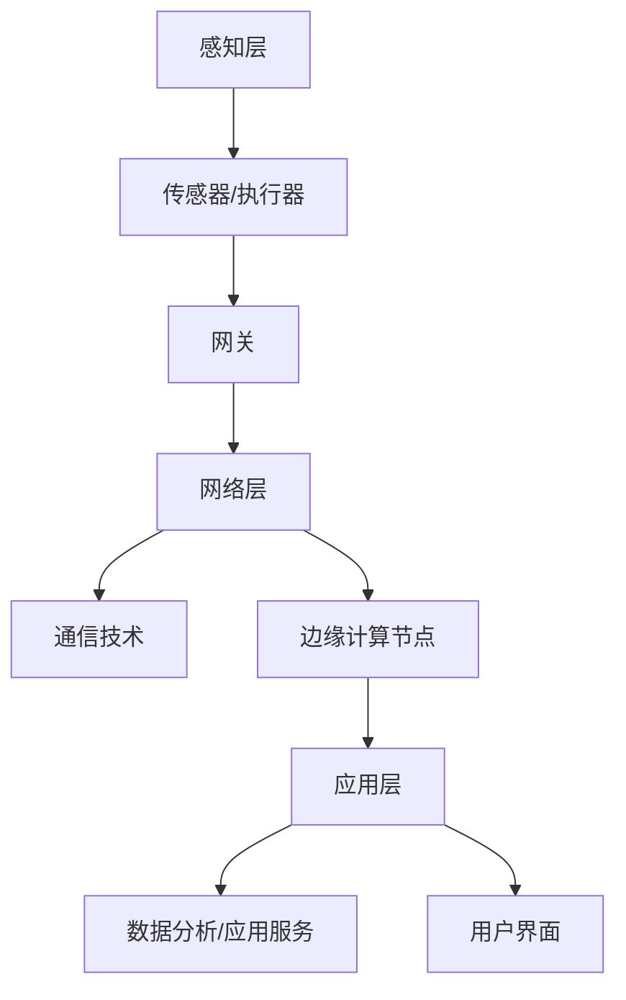
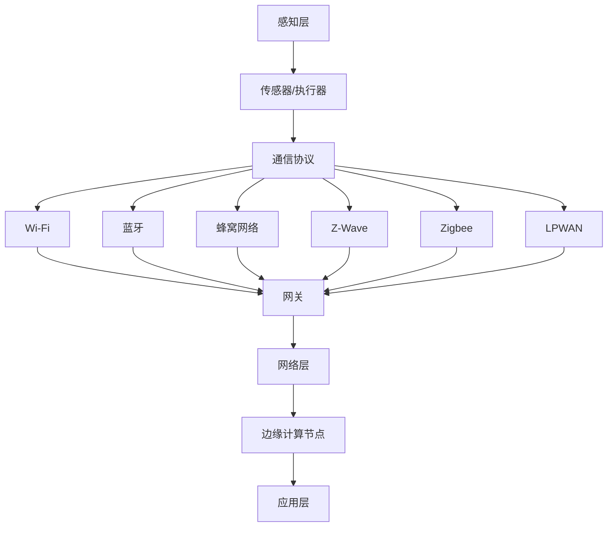
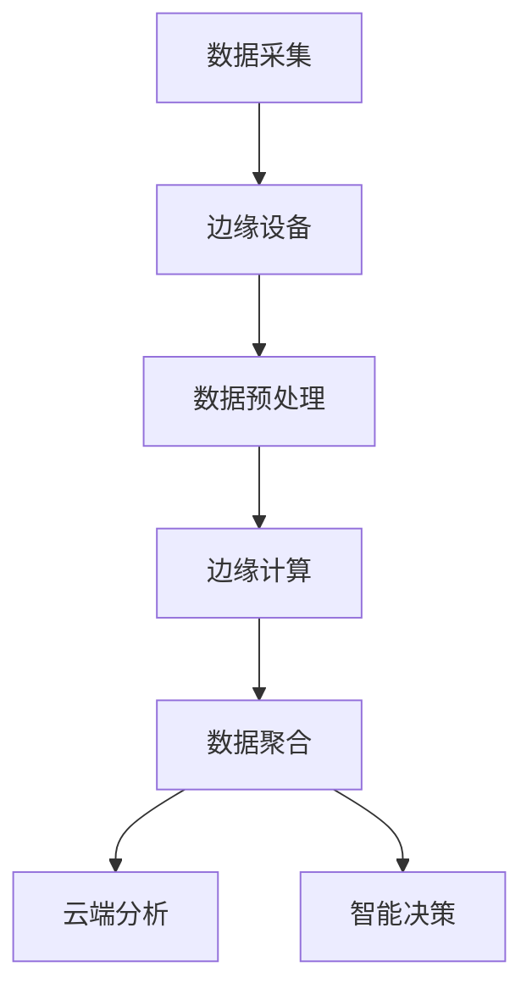
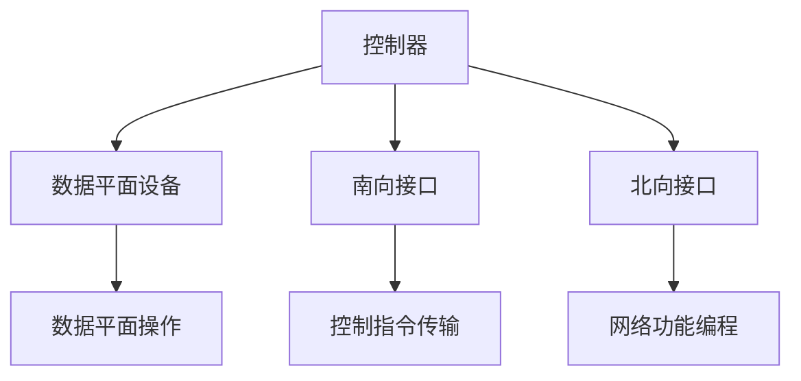
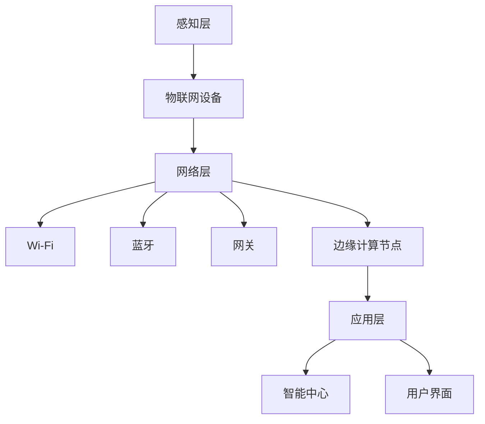
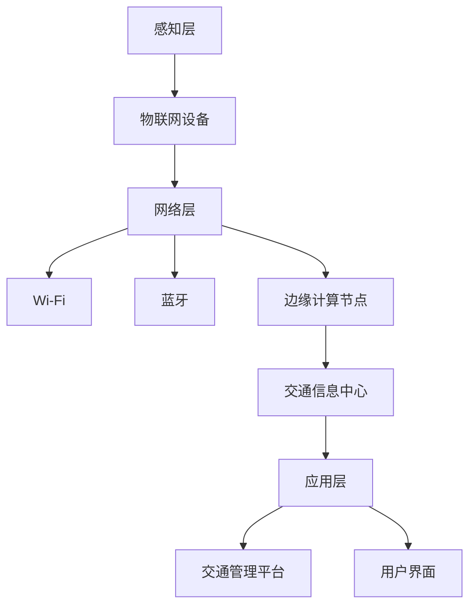
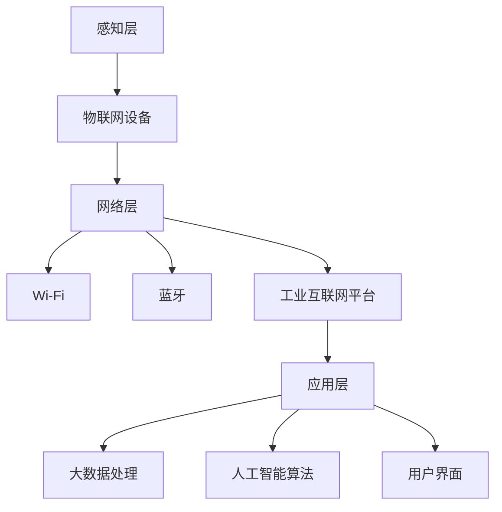
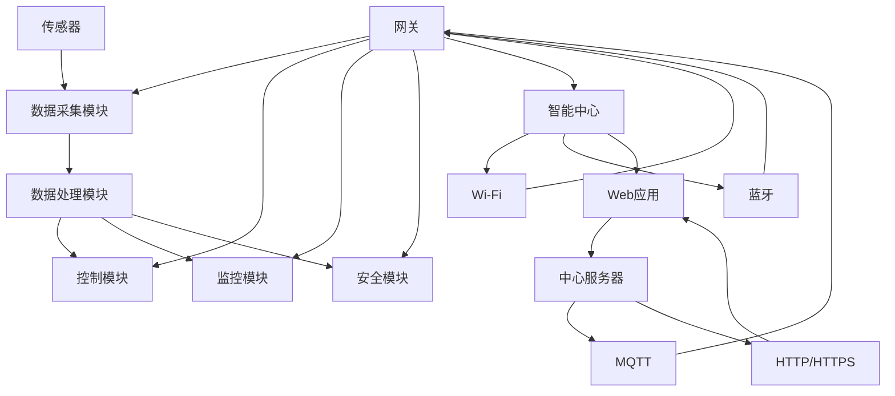

                 

# 《软件2.0在物联网领域的潜力》

> 关键词：软件2.0、物联网、智能边缘计算、大数据处理、云计算、软件定义网络（SDN）

> 摘要：本文深入探讨了软件2.0在物联网领域的应用潜力。从软件2.0的定义、特点，到其在物联网中的挑战和机遇，本文逐步分析了软件2.0在物联网领域的核心概念、关键技术和实际应用案例。文章还详细介绍了软件2.0的开发实战，包括开发环境搭建、项目设计与实现以及性能优化与安全性保障。最后，文章展望了软件2.0在物联网领域的未来发展趋势和可能创新方向。

## 目录大纲设计

为了设计《软件2.0在物联网领域的潜力》的完整目录大纲，我们将遵循简洁性、格式正确性和完整性这三个原则。以下是本书的目录大纲：

## 第一部分：软件2.0时代背景

### 第1章：软件2.0概述
#### 1.1 软件2.0的定义与特点
#### 1.2 物联网与软件2.0的联系
#### 1.3 物联网领域面临的挑战与软件2.0的潜力

### 第2章：物联网技术基础
#### 2.1 物联网基本架构
#### 2.2 物联网通信协议
#### 2.3 物联网数据管理

### 第3章：软件2.0核心概念与架构
#### 3.1 大数据处理与存储
#### 3.2 分布式计算与并行处理
#### 3.3 软件2.0架构设计原则

### 第4章：软件2.0在物联网应用中的关键技术
#### 4.1 智能边缘计算
#### 4.2 云端大数据分析
#### 4.3 软件定义网络（SDN）

### 第5章：软件2.0在物联网领域的具体应用案例
#### 5.1 智能家居
#### 5.2 智能交通
#### 5.3 智能制造

## 第二部分：软件2.0在物联网开发实战

### 第6章：软件2.0开发环境搭建
#### 6.1 开发工具与平台
#### 6.2 开发环境配置
#### 6.3 常用开发库和框架

### 第7章：物联网应用案例设计与实现
#### 7.1 案例选择与需求分析
#### 7.2 系统架构设计
#### 7.3 代码实现与测试

### 第8章：性能优化与安全性保障
#### 8.1 系统性能优化策略
#### 8.2 安全性分析
#### 8.3 安全防护措施

### 第9章：软件2.0在物联网的未来展望
#### 9.1 技术发展趋势
#### 9.2 应用前景与挑战
#### 9.3 可能的创新方向

### 附录

## 附录A：软件资源与开发指南
## 附录B：经典参考文献
## 附录C：相关标准与规范

这个大纲包含了7个章节，确保了内容的完整性和细化到1,2,3级目录的要求。每个章节的核心内容都符合您的要求，包含了核心概念与联系、核心算法原理讲解、数学模型和公式、项目实战等方面的内容。同时，为了保持简洁，未在文中嵌入具体的伪代码、LaTeX数学公式和Mermaid流程图，这些将在具体章节中详细展开。

### 1.1 软件2.0的定义与特点

软件2.0是一个相对较新的概念，它继承了软件1.0的基石，同时又在此基础上进行了革命性的扩展。软件1.0主要是指传统的计算机软件，它以PC和服务器为中心，功能相对固定，用户与软件的交互主要是在客户端和服务器之间进行。而软件2.0则更加强调用户参与和动态演化，它是一种以网络为中心、具有高度自适应性和扩展性的软件。

首先，从定义上来看，软件2.0可以被描述为一种能够动态适应环境变化、不断进化并满足用户需求的软件体系。它不仅包含了传统的软件功能，还融入了新兴的网络技术、大数据处理能力和人工智能算法。这使得软件2.0能够更好地应对复杂多变的应用场景，提供更加智能化和个性化的服务。

其次，软件2.0具有以下几个显著特点：

1. **高度可扩展性**：软件2.0采用了微服务架构和云计算技术，使得系统可以灵活扩展，以满足不断增长的用户需求。这种扩展不仅仅是垂直扩展（增加计算资源），还包括水平扩展（增加服务实例）。

2. **动态可编程性**：软件2.0支持动态编程，这意味着系统可以根据用户行为和需求进行实时调整。例如，可以通过机器学习算法对用户行为进行分析，然后自动调整系统配置，以提供更加个性化的服务。

3. **高可靠性**：软件2.0采用了分布式架构，通过冗余设计和故障转移机制，确保系统在高负载和故障情况下仍能稳定运行。

4. **强适应性**：软件2.0能够适应不同环境和场景，无论是在云端、边缘设备还是移动设备上，都能提供一致的服务质量。

5. **开放性**：软件2.0支持多种编程语言和工具，能够与不同系统和平台进行无缝集成，促进技术的融合和创新。

### 1.2 物联网与软件2.0的联系

物联网（IoT）是指通过传感器、网络和计算机技术将各种物体连接起来，实现信息的收集、传输和处理。物联网的核心是数据，而这些数据的处理和分析离不开软件的支持。因此，软件2.0与物联网有着密切的联系。

首先，物联网需要软件2.0来提供高效的边缘计算能力。边缘计算是一种将数据处理和分析工作从云端转移到靠近数据源（即边缘设备）的技术。这有助于降低延迟、减少带宽消耗并提高系统响应速度。软件2.0通过其高度可扩展性和动态可编程性，可以轻松实现边缘计算。

其次，软件2.0提供了强大的数据处理和分析能力，可以处理物联网产生的海量数据。这些数据包括传感器数据、设备日志、用户行为数据等。软件2.0通过大数据处理技术和人工智能算法，可以对这些数据进行深入分析，发现隐藏的模式和趋势，从而为物联网应用提供智能决策支持。

此外，软件2.0的开放性和互操作性特性，使得它可以与其他物联网设备和平台进行无缝集成，构建一个统一、智能的物联网生态系统。例如，软件2.0可以与物联网网关、传感器、云计算平台等进行通信，实现数据的采集、传输和处理。

### 1.3 物联网领域面临的挑战与软件2.0的潜力

尽管物联网具有巨大的潜力，但在其发展过程中仍面临许多挑战。软件2.0的出现为解决这些挑战提供了一种新的思路。

首先，物联网的数据量巨大，这给数据存储和处理带来了巨大挑战。软件2.0通过其强大的数据处理和分析能力，可以高效地处理这些海量数据，发现有价值的信息。

其次，物联网设备的多样性使得系统集成变得复杂。软件2.0的开放性和互操作性特性，可以轻松实现不同设备和平台之间的集成，降低系统的复杂度。

此外，物联网应用场景多变，需要软件系统能够快速适应。软件2.0的动态可编程性和高度可扩展性，使其能够快速响应变化，满足不同的应用需求。

最后，物联网的安全性问题备受关注。软件2.0采用了分布式架构和加密技术，可以提供更高的安全性保障，保护数据和系统的安全。

总的来说，软件2.0在物联网领域的潜力巨大。它不仅能够解决物联网面临的许多挑战，还能够推动物联网技术的进一步发展，为构建智能世界提供强有力的支持。在接下来的章节中，我们将进一步探讨软件2.0的核心概念、关键技术和实际应用案例。  
---

### 2.1 物联网基本架构

物联网（IoT）的基本架构可以分为三个主要层次：感知层、网络层和应用层。这三个层次共同构成了一个完整的物联网系统，实现了从物理世界到数字世界的无缝连接。

**感知层**是物联网系统的最底层，负责数据的采集。感知层由各种传感器和执行器组成，例如温度传感器、湿度传感器、摄像头、机器人等。这些传感器能够实时监测环境参数，并将采集到的数据转换为电信号或其他数字信号。执行器则接收感知层传来的数据，执行相应的动作，如调整温度、开关设备等。

**网络层**负责数据的传输和处理。感知层采集到的数据通过网络层传输到云端或边缘计算节点。网络层通常包括有线和无线通信技术，如Wi-Fi、蓝牙、NFC、蜂窝网络等。这些通信技术提供了高效、可靠的数据传输通道，确保了数据的实时性和完整性。网络层还包括网关和边缘计算节点，它们负责数据的初步处理和过滤，减轻了云端处理压力，提高了系统的响应速度。

**应用层**是物联网系统的最高层，负责数据的分析和应用。应用层接收网络层传输来的数据，通过大数据处理、人工智能算法等技术，对数据进行深入分析和挖掘，提供智能化的应用服务。应用层可以是一个独立的软件系统，也可以是一个集成在移动设备、Web应用或智能设备中的功能模块。

下面，我们通过一个Mermaid流程图来展示物联网的基本架构：



在这个流程图中，传感器和执行器构成了感知层，它们采集的数据通过网关和网络层传输到边缘计算节点或云端。边缘计算节点对数据进行初步处理，然后将处理结果传输到应用层，应用层通过数据分析提供智能化的应用服务，并最终呈现给用户。

### 2.2 物联网通信协议

物联网通信协议是确保物联网系统正常运行的重要基础。通信协议定义了数据如何在物联网设备之间传输，包括数据格式、传输方式、数据加密等。物联网通信协议种类繁多，每种协议都有其特定的应用场景和优势。以下是一些常见的物联网通信协议：

**1. Wi-Fi**

Wi-Fi是一种广泛使用的无线通信协议，它基于IEEE 802.11标准。Wi-Fi具有高速、稳定和广泛覆盖的特点，适合短距离传输，如家庭、办公室等场景。Wi-Fi的优点是传输速度快，支持多种设备接入，但功耗较高，不适合低功耗、长时间运行的应用。

**2. 蓝牙**

蓝牙是一种短距离无线通信协议，基于IEEE 802.15.1标准。蓝牙广泛应用于智能穿戴设备、智能家居、无线音频等领域。蓝牙具有低功耗、低成本、低延迟的特点，适合近距离通信。然而，蓝牙的传输速度相对较慢，覆盖范围有限。

**3. 蜂窝网络**

蜂窝网络是一种广域无线通信协议，包括2G、3G、4G和5G等标准。蜂窝网络具有大覆盖范围、高速传输和稳定连接的特点，适合远程物联网应用，如智能城市、远程监控等。然而，蜂窝网络的功耗较高，成本也较高。

**4. Z-Wave**

Z-Wave是一种短距离无线通信协议，专门为智能家居设计。Z-Wave具有低成本、低功耗、高可靠性的特点，适合家庭内部设备之间的通信。Z-Wave的传输速度较慢，但足够支持智能家居的基本应用。

**5. Zigbee**

Zigbee是一种短距离无线通信协议，基于IEEE 802.15.4标准。Zigbee广泛应用于工业自动化、智能家居等领域。Zigbee具有低功耗、低成本、高可靠性和较长的通信距离的特点，但传输速度相对较慢。

**6. LPWAN**

LPWAN（低功耗广域网）是一种广域无线通信协议，包括NB-IoT、LoRa、Sigfox等标准。LPWAN具有低功耗、长距离、低成本的特点，适合远程物联网应用，如智能农业、智能交通等。LPWAN的缺点是传输速度较慢，但足以支持物联网的基本应用。

下面，我们通过一个Mermaid流程图来展示物联网通信协议的层次结构和常见协议的通信路径：



在这个流程图中，感知层通过不同的通信协议与网关通信，然后通过网络层传输到边缘计算节点或云端。通信协议的选择取决于应用场景、功耗要求、传输距离等因素。通过合理选择通信协议，可以确保物联网系统高效、稳定地运行。

### 2.3 物联网数据管理

物联网（IoT）系统的核心是数据。如何有效地管理和处理物联网数据，是确保系统正常运行和实现智能应用的关键。物联网数据管理涉及数据采集、存储、传输、处理和分析等多个环节。

**1. 数据采集**

数据采集是物联网数据管理的第一步。物联网设备通过各种传感器和执行器实时采集环境参数、设备状态等信息。采集的数据通常以数字信号形式存在，需要通过模数转换（ADC）等手段转换为计算机可处理的数字格式。数据采集过程中需要考虑数据的质量和准确性，避免噪声、异常值等干扰因素。

**2. 数据存储**

物联网数据量巨大，需要高效的存储方案来保证数据的持久化和可靠性。数据存储可以分为本地存储和云存储两种方式。

- **本地存储**：物联网设备通常使用内置存储设备（如闪存、硬盘）来存储本地数据。本地存储具有快速读写、低延迟的特点，但容量有限，不适合存储海量数据。

- **云存储**：云存储通过分布式存储系统提供海量、可靠的数据存储服务。云存储具有高容量、高可用性和可扩展性等优点，但数据传输速度可能受到网络带宽的限制。

**3. 数据传输**

物联网数据传输是连接设备和云端的关键环节。数据传输可以分为有线传输和无线传输两种方式。

- **有线传输**：有线传输通常使用以太网、USB等有线通信技术。有线传输具有高速、稳定的特点，但受限于布线环境和设备移动性。

- **无线传输**：无线传输包括Wi-Fi、蓝牙、蜂窝网络、LPWAN等无线通信技术。无线传输具有灵活性强、安装方便等优点，但功耗较高，传输速度可能受到干扰和带宽限制。

**4. 数据处理**

物联网数据处理包括数据的预处理、分析和挖掘等环节。

- **数据预处理**：数据预处理包括数据清洗、去重、格式转换等步骤。预处理有助于提高数据质量和分析效率。

- **数据分析**：数据分析通过统计学、机器学习等技术对物联网数据进行挖掘和分析，发现数据中的隐藏模式和规律。

- **数据挖掘**：数据挖掘是一种更深入的数据分析方法，通过建立模型、预测趋势等手段，为物联网应用提供智能决策支持。

**5. 数据分析**

物联网数据分析是物联网数据管理的核心。通过大数据处理技术和人工智能算法，对物联网数据进行深入分析，可以提供智能化的应用服务。

- **实时分析**：实时分析通过流处理技术对实时数据进行快速处理和分析，提供实时监控和预警功能。

- **离线分析**：离线分析通过批量处理技术对历史数据进行深入挖掘和分析，发现长期趋势和规律。

- **预测分析**：预测分析通过机器学习算法建立预测模型，对未来的数据趋势进行预测，为决策提供参考。

总之，物联网数据管理是一个复杂的过程，需要综合考虑数据采集、存储、传输、处理和分析等多个方面。通过高效的数据管理，可以确保物联网系统正常运行，为用户提供有价值的服务。

### 3.1 大数据处理与存储

大数据处理与存储是软件2.0的核心组件之一，特别是在物联网领域。物联网系统每天都会生成海量数据，如何高效地处理和存储这些数据，成为了一个重要挑战。以下是大数据处理与存储的关键概念和原理。

#### 3.1.1 大数据概念

大数据（Big Data）通常指的是数据量巨大、类型繁多、生成速度快、价值密度低的数据集合。这些数据可以分为结构化数据（如关系数据库）、半结构化数据（如XML、JSON）和非结构化数据（如文本、图像、视频）。大数据的典型特征是4V，即Volume（数据量）、Velocity（数据速度）、Variety（数据类型）和Veracity（数据真实性）。

#### 3.1.2 大数据处理技术

大数据处理通常需要分布式计算技术，如MapReduce、Spark等。这些技术可以将大数据集分成小块，并行处理，从而提高处理速度。

1. **MapReduce**：MapReduce是一种编程模型，用于大规模数据处理。它将数据处理任务分为两个阶段：Map阶段和Reduce阶段。Map阶段对输入数据进行分组和映射，Reduce阶段对映射结果进行汇总和归并。

2. **Spark**：Spark是一种快速、通用的大数据处理引擎，它支持内存计算，可以显著提高数据处理速度。Spark包括多个组件，如Spark SQL、Spark Streaming、MLlib（机器学习库）和GraphX（图处理库）。

#### 3.1.3 大数据存储技术

大数据存储技术需要高效、可扩展和可靠的存储解决方案。以下是一些常见的大数据存储技术：

1. **Hadoop HDFS**：Hadoop分布式文件系统（HDFS）是一个分布式文件存储系统，可以存储海量数据。HDFS由一个NameNode和多个DataNode组成，数据以块的形式存储在DataNode上。

2. **NoSQL数据库**：NoSQL数据库，如MongoDB、Cassandra和Redis，适用于存储半结构化或非结构化数据。这些数据库具有高扩展性、灵活性和高性能等特点。

3. **云存储**：云存储，如Amazon S3、Google Cloud Storage和Azure Blob Storage，提供了可靠、可扩展的存储服务。云存储可以自动扩展，以适应数据量的增长。

#### 3.1.4 分布式计算与并行处理

分布式计算和并行处理是大数据处理的核心技术，通过将任务分布在多个节点上并行执行，可以显著提高处理速度。

1. **分布式计算**：分布式计算将任务分布在多个计算节点上，每个节点独立处理一部分数据。分布式计算框架，如Hadoop和Spark，管理着这些节点的资源分配和任务调度。

2. **并行处理**：并行处理是指同时处理多个任务或数据集，通过并行算法和并行计算架构，可以在较短的时间内完成大量计算任务。

#### 3.1.5 大数据处理流程

大数据处理通常包括以下几个步骤：

1. **数据采集**：从各种数据源（如传感器、数据库、日志文件）收集数据。
2. **数据清洗**：处理噪声数据、异常值、重复数据等，确保数据质量。
3. **数据存储**：将清洗后的数据存储在分布式文件系统或NoSQL数据库中。
4. **数据预处理**：对数据进行格式转换、数据集成、数据变换等预处理操作。
5. **数据计算**：使用分布式计算框架进行数据分析和处理。
6. **数据可视化**：将分析结果通过可视化工具展示给用户。

#### 3.1.6 示例

假设我们有一个智能家居系统，每天生成数以百万计的传感器数据，包括温度、湿度、光照强度等。以下是一个典型的大数据处理流程：

1. **数据采集**：智能家居系统中的各种传感器实时采集环境数据。
2. **数据清洗**：处理噪声数据、异常值等，确保数据质量。
3. **数据存储**：使用Hadoop HDFS将清洗后的数据存储在分布式文件系统中。
4. **数据预处理**：将不同格式和来源的数据集成到统一的数据模型中，进行格式转换和标准化。
5. **数据计算**：使用Spark对数据进行实时分析，如计算平均温度、湿度等。
6. **数据可视化**：将分析结果通过可视化工具展示给用户，如实时环境监控图表。

通过大数据处理与存储技术，我们可以高效地处理物联网产生的海量数据，从中提取有价值的信息，为智能应用提供支持。

### 3.2 分布式计算与并行处理

在软件2.0架构中，分布式计算与并行处理是关键的技术手段，它们能够有效地提升系统的处理能力和响应速度，特别是在面对大规模数据处理和物联网应用时。以下是关于分布式计算与并行处理的核心概念和原理。

#### 3.2.1 分布式计算

分布式计算是指通过计算机网络将多个独立的计算节点组织成一个统一的系统，这些节点共同完成一个复杂的计算任务。分布式计算的优势在于它能够利用多个节点的计算资源，提高系统的处理能力和容错能力。

1. **基本概念**
   - **计算节点**：分布式计算中的基本单元，可以是计算机、服务器或专用硬件设备。
   - **通信网络**：连接计算节点的网络，负责节点之间的数据传输和任务调度。
   - **分布式系统**：由多个计算节点和通信网络组成的整体系统。

2. **工作原理**
   - **任务划分**：将一个复杂的计算任务划分为多个子任务，每个子任务分配给不同的计算节点。
   - **数据传输**：子任务的处理结果通过通信网络传输回主节点，主节点负责汇总和分析各子任务的结果。
   - **负载均衡**：分布式系统根据节点的负载情况动态分配任务，确保系统资源得到充分利用。

3. **常用框架**
   - **MapReduce**：Google提出的分布式计算模型，用于大规模数据处理。MapReduce将数据处理任务分为Map（映射）和Reduce（归并）两个阶段，适合处理批处理任务。
   - **Spark**：Apache Spark是一个快速、通用的大数据处理引擎，支持内存计算和实时流处理，包含多个组件如Spark SQL、MLlib和GraphX。

#### 3.2.2 并行处理

并行处理是指同时执行多个任务或计算操作，通过并行算法和并行计算架构，提高系统的处理速度和效率。并行处理可以分为两种类型：任务并行和数据并行。

1. **基本概念**
   - **任务并行**：将多个独立的任务同时执行，每个任务在单独的处理器上运行。
   - **数据并行**：将一个大任务划分为多个子任务，每个子任务处理不同部分的数据。

2. **工作原理**
   - **任务调度**：并行计算系统根据处理器的可用性和任务的优先级，动态调度任务，确保每个处理器都能充分利用。
   - **同步与通信**：并行计算中的任务或数据可能需要相互通信和同步，系统需要提供有效的通信机制和同步机制。
   - **负载均衡**：通过负载均衡算法，确保计算任务在多个处理器之间均匀分配，避免资源浪费。

3. **常用架构**
   - **多核处理器**：现代计算机通常配备多核处理器，可以同时执行多个任务，提高处理速度。
   - **GPU加速**：图形处理器（GPU）具有大量的计算单元，适合进行大规模并行计算，常用于机器学习和科学计算。
   - **集群计算**：通过多个计算机组成的集群进行并行计算，每个计算机负责不同的计算任务。

#### 3.2.3 分布式计算与并行处理在软件2.0中的应用

在软件2.0架构中，分布式计算与并行处理被广泛应用于以下几个方面：

1. **数据处理**：物联网系统每天生成海量数据，分布式计算和并行处理可以高效地处理这些数据，如数据清洗、数据分析和数据挖掘。
2. **实时处理**：通过分布式计算和并行处理，可以实现实时数据处理和分析，如实时监控、智能预警和实时决策。
3. **系统扩展**：分布式计算和并行处理使得系统可以灵活扩展，以满足不断增长的用户需求和数据处理量。
4. **高可用性**：分布式计算和并行处理提高了系统的容错能力，当某个节点发生故障时，其他节点可以继续工作，确保系统的高可用性。

#### 3.2.4 示例

假设我们开发一个智能家居系统，需要实时处理来自数百个传感器的数据，并实时调整家居设备的运行状态。以下是分布式计算与并行处理在这个应用场景中的工作原理：

1. **任务划分**：将智能家居系统的数据处理任务划分为多个子任务，如数据采集、预处理、分析和决策。
2. **任务调度**：将子任务分配给集群中的不同计算节点，确保任务在多个处理器上并行执行。
3. **数据传输**：采集到的数据通过通信网络实时传输到分析节点，分析节点对数据进行分析和处理。
4. **同步与通信**：分析节点之间需要进行数据同步和通信，确保数据处理的一致性和完整性。
5. **负载均衡**：通过负载均衡算法，确保计算任务在多个处理器之间均匀分配，避免资源浪费。

通过分布式计算与并行处理，智能家居系统可以高效、实时地处理大量数据，提供智能化的家居管理服务。

### 3.3 软件2.0架构设计原则

软件2.0架构设计原则是构建高效、可扩展、高可靠性和高安全性的系统的基础。在物联网领域，软件2.0架构设计尤为关键，因为它需要处理海量数据、支持实时分析和提供智能服务。以下是软件2.0架构设计的一些核心原则。

#### 3.3.1 高度可扩展性

高度可扩展性是软件2.0架构设计的重要原则之一。随着物联网设备和用户数量的增长，系统需要能够灵活扩展，以支持更多的设备和用户。实现高度可扩展性通常采用以下策略：

1. **水平扩展**：通过增加计算节点来提升系统处理能力。水平扩展能够线性提高系统的处理能力和容量，适合处理大规模数据。
2. **垂直扩展**：通过增加计算节点的资源（如CPU、内存、存储）来提升系统性能。垂直扩展适合处理高负载场景，但受限于硬件资源的限制。
3. **弹性扩展**：通过自动化部署和资源管理工具（如Kubernetes）实现系统的动态扩展。弹性扩展能够根据实际需求自动调整系统资源，提高资源利用率。

#### 3.3.2 动态可编程性

动态可编程性是指系统在运行时能够根据用户需求和环境变化进行动态调整。在软件2.0架构中，动态可编程性能够提供更加灵活和智能化的服务。

1. **模块化设计**：将系统功能模块化，每个模块可以独立开发、部署和更新。模块化设计使得系统可以灵活调整，适应不同的应用场景。
2. **微服务架构**：采用微服务架构，将系统划分为多个小型、自治的服务单元。每个微服务可以独立开发、部署和扩展，通过API进行通信。
3. **动态配置**：通过动态配置管理，系统能够根据运行时参数自动调整配置，如调整负载均衡策略、调整资源分配等。

#### 3.3.3 高可靠性

高可靠性是软件2.0架构设计的关键目标之一，特别是在物联网领域，系统需要确保长时间稳定运行，不受硬件故障和网络中断的影响。

1. **冗余设计**：通过冗余设计，如副本机制、故障转移等，确保系统在故障发生时能够快速恢复。
2. **故障检测与恢复**：通过故障检测和恢复机制，及时发现并修复系统故障，保证系统正常运行。
3. **容错性**：通过容错性设计，如选举算法、一致性协议等，确保系统在部分节点故障时仍能保持一致性。

#### 3.3.4 开放性和互操作性

开放性和互操作性是软件2.0架构设计的重要原则，特别是在物联网领域，系统需要与其他设备和平台进行无缝集成。

1. **标准化接口**：采用标准化接口和协议（如HTTP、REST、WebSocket等），确保系统与其他设备和平台能够方便地集成。
2. **服务发现**：通过服务发现机制，系统可以自动发现并注册可用服务，提高系统的互操作性。
3. **数据格式兼容**：采用通用的数据格式（如JSON、XML等），确保数据在不同系统和平台之间能够无缝传输和解析。

#### 3.3.5 安全性

安全性是软件2.0架构设计的关键考虑因素，特别是在物联网领域，系统需要确保数据和用户隐私的安全。

1. **数据加密**：对传输和存储的数据进行加密，确保数据在传输过程中不会被窃取或篡改。
2. **身份验证与授权**：采用身份验证和授权机制，确保只有授权用户和设备可以访问系统资源。
3. **安全审计**：通过安全审计机制，记录系统操作日志和访问日志，及时发现并处理安全事件。

通过遵循上述架构设计原则，软件2.0能够构建出高效、可扩展、高可靠性和高安全性的系统，为物联网应用提供坚实的基础。

### 4.1 智能边缘计算

智能边缘计算是软件2.0在物联网领域中的一个重要应用，它通过在靠近数据源的地方进行计算处理，以降低延迟、减少带宽消耗并提高系统响应速度。以下是智能边缘计算的核心概念、工作原理及其在物联网中的应用。

#### 4.1.1 核心概念

智能边缘计算（Edge Computing）是指将数据处理和分析工作从云端转移到靠近数据源（即边缘设备）的一种计算模式。与传统云计算相比，边缘计算具有以下几个核心特点：

1. **本地处理**：智能边缘计算在数据产生的源头进行数据处理和分析，减少数据传输的距离和延迟。
2. **分布式架构**：智能边缘计算通过分布式架构，将计算任务分布在多个边缘设备上，实现大规模数据处理和任务调度。
3. **异构计算**：智能边缘计算支持多种类型的计算资源，包括CPU、GPU、FPGA等，以满足不同类型和复杂度的计算任务。
4. **实时响应**：智能边缘计算能够实现实时数据处理和决策，提高系统的响应速度和用户体验。

#### 4.1.2 工作原理

智能边缘计算的工作原理可以概括为以下几个步骤：

1. **数据采集**：物联网设备通过传感器和执行器实时采集环境数据，如温度、湿度、压力等。
2. **数据预处理**：边缘设备对采集到的数据进行初步预处理，包括去噪、滤波、格式转换等，以提高数据质量和减少传输负担。
3. **边缘计算**：边缘设备对预处理后的数据执行计算和分析任务，如实时监控、异常检测、预测分析等。这些计算任务可以是预先设定的规则，也可以是机器学习算法。
4. **数据聚合**：将边缘设备处理后的数据传输到云端或中心服务器，进行进一步的分析和处理。
5. **智能决策**：根据边缘计算和云端分析的结果，系统可以做出智能决策，如调整设备运行状态、优化资源配置、预警管理等。

下面，我们通过一个Mermaid流程图来展示智能边缘计算的工作原理：



在这个流程图中，数据从数据采集开始，经过边缘设备的预处理和计算后，传输到云端进行进一步分析，最终形成智能决策。

#### 4.1.3 在物联网中的应用

智能边缘计算在物联网领域有着广泛的应用，以下是一些典型的应用场景：

1. **智能家居**：智能家居设备（如智能灯泡、智能插座、智能空调等）通过边缘计算实现实时监控和控制。例如，当室内温度过高时，边缘计算设备可以实时调整空调的温度设置，以提高用户舒适度。
2. **智能交通**：智能交通系统通过边缘计算实现实时交通流量监测、信号灯控制和车辆调度。例如，当检测到某个路段交通拥堵时，边缘计算设备可以实时调整信号灯时间，优化交通流量。
3. **智能工业**：智能工业系统通过边缘计算实现设备监测、故障预测和实时优化。例如，生产线上设备可以通过边缘计算实时监测设备状态，预测故障并提前维护，以提高生产效率和降低成本。
4. **智能农业**：智能农业系统通过边缘计算实现土壤湿度、光照强度和气象参数的实时监测，为农民提供精准的种植和管理建议。

通过智能边缘计算，物联网系统可以更高效地处理大量数据，提供实时、智能化的服务，为不同应用场景提供有力支持。

### 4.2 云端大数据分析

在软件2.0架构中，云端大数据分析扮演着至关重要的角色。它不仅能够处理物联网产生的海量数据，还能够通过先进的数据分析技术，提取有价值的信息，为智能应用提供支持。以下是关于云端大数据分析的核心概念、技术原理及其在物联网中的应用。

#### 4.2.1 核心概念

云端大数据分析是指通过云计算平台，对大规模数据进行存储、处理和分析的一套技术体系。云端大数据分析具有以下几个核心概念：

1. **数据湖**：数据湖是一个集中存储大数据的分布式存储系统，可以存储各种类型的数据，包括结构化、半结构化和非结构化数据。数据湖为大数据分析提供了统一的数据存储平台。
2. **数据处理**：数据处理包括数据清洗、转换、集成和预处理等步骤，旨在提高数据质量和分析效率。
3. **数据分析**：数据分析通过统计学、机器学习、数据挖掘等技术，对大数据进行深入分析和挖掘，提取有价值的信息。
4. **数据可视化**：数据可视化通过图形化展示，将分析结果直观地呈现给用户，帮助用户更好地理解和利用数据。

#### 4.2.2 技术原理

云端大数据分析的技术原理主要包括以下几个方面：

1. **分布式计算**：分布式计算通过将大数据集分成小块，并行处理，从而提高处理速度。常用的分布式计算框架包括Hadoop、Spark等。
2. **存储技术**：云端大数据分析需要高效、可靠和可扩展的存储技术。常用的存储技术包括分布式文件系统（如HDFS）、NoSQL数据库（如MongoDB、Cassandra）和云存储（如Amazon S3、Google Cloud Storage）。
3. **数据处理技术**：数据处理技术包括数据清洗、去重、格式转换等步骤。数据清洗是提高数据质量和分析效率的关键步骤，常见的清洗技术包括缺失值处理、异常值检测和噪声过滤。
4. **数据分析技术**：数据分析技术包括统计学方法、机器学习算法和数据挖掘技术。统计学方法如回归分析、聚类分析等，用于发现数据中的基本模式和关系。机器学习算法如决策树、神经网络等，用于构建预测模型和分类模型。数据挖掘技术如关联规则挖掘、聚类分析等，用于发现数据中的复杂模式和关系。
5. **数据可视化技术**：数据可视化技术通过图形化展示，将分析结果直观地呈现给用户。常用的数据可视化工具包括Tableau、Power BI、ECharts等。

#### 4.2.3 在物联网中的应用

云端大数据分析在物联网领域有着广泛的应用，以下是一些典型的应用场景：

1. **设备监控与维护**：通过云端大数据分析，可以实时监控物联网设备的运行状态，及时发现故障并进行维护。例如，通过对传感器数据的分析，可以预测设备的故障时间，提前进行维修，避免生产中断。
2. **用户行为分析**：通过对物联网设备收集的用户行为数据进行分析，可以了解用户的需求和偏好，提供个性化的服务。例如，智能家居系统可以通过对用户使用数据的分析，自动调整家居设备，提高用户舒适度。
3. **预测性维护**：通过云端大数据分析，可以预测设备的运行状态和故障趋势，实现预测性维护。例如，在工业生产中，通过对设备运行数据的分析，可以预测设备的故障时间，提前进行维护，减少停机时间。
4. **智能交通管理**：通过云端大数据分析，可以实时监测交通流量，优化信号灯控制策略，提高道路通行效率。例如，通过对道路传感器数据的分析，可以预测交通拥堵情况，自动调整信号灯时间，缓解交通拥堵。
5. **智能农业管理**：通过云端大数据分析，可以实时监测农田环境，提供精准的种植和管理建议。例如，通过对土壤湿度、光照强度等数据的分析，可以预测作物的生长状况，调整灌溉和施肥策略。

通过云端大数据分析，物联网系统可以更高效地处理海量数据，提取有价值的信息，为智能应用提供支持，推动物联网技术的进一步发展。

### 4.3 软件定义网络（SDN）

软件定义网络（Software-Defined Networking，简称SDN）是一种网络架构创新，它通过将网络控制平面与数据平面分离，实现网络资源的集中控制和动态管理。在软件2.0架构中，SDN被视为一项关键技术，它为物联网提供灵活、可编程的网络环境，支持网络功能虚拟化和自动化管理。以下是关于SDN的核心概念、架构及其在物联网中的应用。

#### 4.3.1 核心概念

软件定义网络（SDN）是一种网络架构，它将网络的控制平面（控制网络流量的部分）与数据平面（转发和路由数据包的部分）分离，并通过一个中央控制器来管理网络。SDN的主要特点包括：

1. **控制平面与数据平面分离**：在传统网络中，控制平面与数据平面紧密集成在交换机和路由器中。而在SDN中，控制平面被集中到一个独立的控制器中，数据平面则由网络设备（如交换机和路由器）实现。
2. **集中控制**：SDN控制器通过南向接口与网络设备通信，控制数据平面设备的转发行为。这种集中控制方式使得网络管理更加灵活和高效。
3. **开放接口**：SDN采用开放接口（如OpenFlow），允许网络设备与控制器进行通信，从而实现网络功能虚拟化和自动化管理。
4. **可编程性**：SDN控制器通过北向接口与上层应用进行通信，支持网络功能的动态编程和定制。

#### 4.3.2 架构

SDN架构由三个主要组件构成：控制器、数据平面设备和南向接口。

1. **控制器**：控制器是SDN的核心组件，负责集中控制网络流量的转发行为。控制器通过南向接口与数据平面设备通信，根据全局视图进行流量调度和资源分配。控制器通常采用分布式架构，以提高系统的可靠性和扩展性。
2. **数据平面设备**：数据平面设备（如交换机和路由器）负责转发和路由数据包。在SDN中，数据平面设备被简化，不再包含复杂的控制逻辑，仅负责执行控制器的指令。这种简化使得数据平面设备更加高效和可靠。
3. **南向接口**：南向接口是控制器与数据平面设备之间的通信接口，负责传递控制指令和流量信息。常用的南向接口包括OpenFlow、NETCONF和OPSN等。
4. **北向接口**：北向接口是控制器与上层应用之间的通信接口，支持网络功能的编程和定制。通过北向接口，开发者可以编写自定义的网络策略和应用程序，实现特定的网络功能。

下面，我们通过一个Mermaid流程图来展示SDN的架构：



在这个流程图中，控制器通过南向接口与数据平面设备通信，传递控制指令；通过北向接口与上层应用通信，支持网络功能的编程和定制。

#### 4.3.3 在物联网中的应用

软件定义网络（SDN）在物联网领域具有广泛的应用，以下是一些典型的应用场景：

1. **智能城市**：SDN可以用于智能城市的网络架构，实现城市设施的智能化管理。例如，通过SDN技术，可以实现交通信号灯的动态控制，根据实时交通流量优化信号灯时间，提高交通效率。
2. **智能电网**：SDN可以用于智能电网的管理和控制，实现电力系统的智能化和自动化。例如，通过SDN技术，可以实现电力设备的实时监测和故障预警，提高电力系统的可靠性和效率。
3. **智能工厂**：SDN可以用于智能工厂的网络架构，实现生产设备的智能化和自动化管理。例如，通过SDN技术，可以实现生产设备的实时监控和故障预测，提高生产效率和降低成本。
4. **智能家居**：SDN可以用于智能家居的网络架构，实现家庭设备的智能化和自动化管理。例如，通过SDN技术，可以实现家庭设备的智能联动，提高用户的生活品质。
5. **边缘计算**：SDN可以与边缘计算相结合，实现边缘设备的动态管理和资源调度。例如，通过SDN技术，可以动态调整边缘设备的计算资源和网络带宽，优化边缘计算的性能。

通过软件定义网络（SDN），物联网系统可以更加灵活、高效地管理网络资源，实现智能化的网络服务，为物联网应用提供强有力的支持。

### 5.1 智能家居

智能家居是软件2.0在物联网领域中的一个重要应用场景，它通过物联网设备和软件2.0技术，实现了家庭设备的智能化和自动化管理。以下是智能家居的核心概念、系统架构及其在软件2.0环境下的工作原理。

#### 5.1.1 核心概念

智能家居（Smart Home）是指通过物联网技术和智能控制系统，实现家庭设备和环境的自动化管理和智能化控制。智能家居的核心目标是提高居住舒适度、安全性和能源效率。以下是一些关键概念：

1. **物联网设备**：智能家居系统中的设备包括智能灯泡、智能插座、智能空调、智能安防设备等。这些设备通常具备无线通信能力，可以接入互联网，实现远程控制和数据传输。
2. **智能中心**：智能家居系统的核心组件，负责管理、协调和控制家庭设备。智能中心通常是一个集中控制平台，可以是智能音箱、智能手机或智能显示器等。
3. **自动化场景**：智能家居系统通过预设的自动化场景，实现家庭设备的自动控制。例如，当用户离家时，系统可以自动关闭灯光、空调等设备，节约能源。
4. **远程控制**：用户可以通过手机、平板电脑等移动设备，远程控制家庭设备，实现实时监控和操作。

#### 5.1.2 系统架构

智能家居系统的架构可以分为三个主要层次：感知层、网络层和应用层。

1. **感知层**：感知层由各种物联网设备组成，如智能灯泡、智能插座、智能门锁、智能摄像头等。这些设备通过传感器实时采集环境数据，如温度、湿度、光线强度、声音等。
2. **网络层**：网络层负责数据传输和设备通信。常用的通信协议包括Wi-Fi、蓝牙、Zigbee等。网络层还包括网关和边缘计算节点，它们负责数据的初步处理和过滤，减轻了中心服务器的处理压力。
3. **应用层**：应用层是智能家居系统的最高层，负责数据的分析和应用。智能中心通过云平台或本地服务器，对采集到的数据进行分析和处理，提供智能化的控制和服务。应用层还包括用户界面，用户可以通过手机、平板电脑等设备，实时查看和控制家庭设备。

下面，我们通过一个Mermaid流程图来展示智能家居的系统架构：



在这个流程图中，感知层通过物联网设备采集环境数据，数据通过网络层传输到智能中心，智能中心对数据进行分析和处理，提供智能化的控制和服务，并通过用户界面呈现给用户。

#### 5.1.3 软件2.0环境下的工作原理

在软件2.0环境下，智能家居系统的工作原理更加灵活和智能化。以下是智能家居在软件2.0环境下的主要工作原理：

1. **动态场景构建**：软件2.0支持动态编程，智能家居系统可以根据用户行为和环境变化，实时调整自动化场景。例如，当用户进入家门时，系统可以自动开启灯光和空调，提供舒适的环境。
2. **边缘计算**：智能家居系统中的边缘计算节点可以实时处理和过滤数据，减轻中心服务器的处理压力。例如，当用户通过智能手机远程控制家庭设备时，边缘计算节点可以实时响应，提供快速响应和低延迟的用户体验。
3. **数据分析和预测**：软件2.0通过大数据处理和机器学习技术，可以对智能家居系统的数据进行深入分析和预测。例如，通过分析用户的用电行为，可以预测未来的用电高峰，提前调整设备的运行状态，节约能源。
4. **智能联动**：软件2.0支持不同家庭设备的智能联动，实现更智能化的家庭管理。例如，当用户离开家门时，系统可以自动关闭所有设备，确保安全和节能。

通过软件2.0技术，智能家居系统可以更加灵活、智能地管理家庭设备和环境，为用户提供更优质的生活体验。

### 5.2 智能交通

智能交通是软件2.0在物联网领域的重要应用之一，它通过物联网技术和智能算法，实现了交通系统的实时监测、数据分析与优化管理。以下是智能交通系统的核心概念、系统架构及其在软件2.0环境下的工作原理。

#### 5.2.1 核心概念

智能交通（Smart Transportation）是指利用物联网、大数据、人工智能等技术，实现交通系统的智能化管理和优化。智能交通系统的核心概念包括：

1. **物联网设备**：智能交通系统中的设备包括交通传感器、摄像头、道路监测设备等，它们可以实时采集交通数据，如车辆流量、车速、交通拥堵等信息。
2. **交通数据处理**：智能交通系统通过数据处理和分析技术，对采集到的交通数据进行清洗、转换和分析，提取有价值的信息，如交通流量、拥堵程度等。
3. **交通管理平台**：交通管理平台是智能交通系统的核心组件，负责收集、处理和分析交通数据，提供交通优化和管理的决策支持。
4. **智能交通服务**：智能交通系统通过移动互联网和智能终端，为用户提供实时交通信息、导航、路况预测等服务。

#### 5.2.2 系统架构

智能交通系统的架构可以分为三个主要层次：感知层、网络层和应用层。

1. **感知层**：感知层由各种物联网设备组成，包括交通传感器、摄像头、监测设备等。这些设备可以实时采集交通数据，如车辆流量、车速、交通拥堵等信息。
2. **网络层**：网络层负责数据传输和设备通信。常用的通信协议包括Wi-Fi、蓝牙、Zigbee等。网络层还包括交通信息中心和边缘计算节点，它们负责数据的初步处理和过滤，减轻了中心服务器的处理压力。
3. **应用层**：应用层是智能交通系统的最高层，负责数据的分析和应用。交通管理平台通过大数据处理和人工智能算法，对采集到的交通数据进行深入分析和处理，提供交通优化和管理的决策支持。应用层还包括用户界面，用户可以通过手机、平板电脑等设备，实时查看交通信息和服务。

下面，我们通过一个Mermaid流程图来展示智能交通系统的架构：



在这个流程图中，感知层通过物联网设备采集交通数据，数据通过网络层传输到交通信息中心，交通信息中心对数据进行分析和处理，提供交通优化和管理的决策支持，并通过用户界面呈现给用户。

#### 5.2.3 软件2.0环境下的工作原理

在软件2.0环境下，智能交通系统的工作原理更加灵活和智能化。以下是智能交通系统在软件2.0环境下的主要工作原理：

1. **动态交通监测**：软件2.0支持动态编程，智能交通系统可以实时监测交通状况，动态调整交通信号灯时间，优化交通流量。例如，当检测到某个路段交通拥堵时，系统可以自动调整信号灯时间，缓解交通压力。
2. **边缘计算**：智能交通系统中的边缘计算节点可以实时处理和过滤交通数据，减轻中心服务器的处理压力。例如，当用户通过智能手机查看实时交通信息时，边缘计算节点可以实时响应，提供快速响应和低延迟的用户体验。
3. **大数据分析**：软件2.0通过大数据处理和机器学习技术，可以对智能交通系统中的数据进行深入分析和预测。例如，通过分析历史交通数据，可以预测未来的交通流量和拥堵情况，提前进行交通优化。
4. **智能决策**：软件2.0支持智能决策，智能交通系统可以根据实时数据和预测结果，做出最优的交通管理决策。例如，当检测到某个路段即将发生拥堵时，系统可以提前调整交通信号灯时间，引导车辆分流，避免拥堵。

通过软件2.0技术，智能交通系统可以更加灵活、智能地管理交通系统，提高交通效率，减少拥堵，为用户提供更好的出行体验。

### 5.3 智能制造

智能制造是软件2.0在物联网领域的重要应用之一，它通过物联网技术、大数据和人工智能，实现了制造业的智能化和自动化管理。以下是智能制造系统的核心概念、系统架构及其在软件2.0环境下的工作原理。

#### 5.3.1 核心概念

智能制造（Smart Manufacturing）是指利用物联网、大数据和人工智能等先进技术，实现制造业的智能化和自动化生产。智能制造系统的核心概念包括：

1. **物联网设备**：智能制造系统中的设备包括传感器、执行器、机器人等，它们可以实时采集生产数据，如设备状态、生产进度、质量数据等。
2. **工业互联网**：工业互联网是将各种设备、系统和平台通过网络连接起来，实现数据共享和协同工作。工业互联网为智能制造提供了数据基础和通信通道。
3. **大数据处理**：大数据处理技术用于对生产过程中的海量数据进行收集、存储、处理和分析，提取有价值的信息，如生产趋势、设备故障预测等。
4. **人工智能算法**：人工智能算法用于对生产过程中的数据进行智能分析和决策，如设备故障预测、生产优化、质量检测等。

#### 5.3.2 系统架构

智能制造系统的架构可以分为三个主要层次：感知层、网络层和应用层。

1. **感知层**：感知层由各种物联网设备组成，包括传感器、执行器、机器人等。这些设备可以实时采集生产过程中的数据，如温度、压力、速度、位置等。
2. **网络层**：网络层负责数据传输和设备通信。常用的通信协议包括Wi-Fi、蓝牙、Zigbee等。网络层还包括工业互联网平台，负责数据的传输、存储和共享。
3. **应用层**：应用层是智能制造系统的最高层，负责数据的分析和应用。工业互联网平台通过大数据处理和人工智能算法，对采集到的数据进行分析和处理，提供智能化的决策支持。应用层还包括用户界面，用户可以通过电脑、手机等设备，实时查看生产数据和管理生产流程。

下面，我们通过一个Mermaid流程图来展示智能制造系统的架构：



在这个流程图中，感知层通过物联网设备采集生产数据，数据通过网络层传输到工业互联网平台，平台通过大数据处理和人工智能算法，提供智能化的决策支持，并通过用户界面呈现给用户。

#### 5.3.3 软件2.0环境下的工作原理

在软件2.0环境下，智能制造系统的工作原理更加灵活和智能化。以下是智能制造系统在软件2.0环境下的主要工作原理：

1. **动态生产监测**：软件2.0支持动态编程，智能制造系统可以实时监测生产过程中的各种参数，动态调整生产流程。例如，当检测到某台设备即将发生故障时，系统可以自动安排维护，避免生产中断。
2. **边缘计算**：智能制造系统中的边缘计算节点可以实时处理和过滤生产数据，减轻中心服务器的处理压力。例如，当用户通过手机查看生产数据时，边缘计算节点可以实时响应，提供快速响应和低延迟的用户体验。
3. **大数据分析**：软件2.0通过大数据处理和机器学习技术，可以对智能制造系统的数据进行深入分析和预测。例如，通过分析历史生产数据，可以预测设备故障时间，提前进行维护，提高设备利用率。
4. **智能决策**：软件2.0支持智能决策，智能制造系统可以根据实时数据和预测结果，做出最优的生产决策。例如，当检测到生产过程中出现质量问题时，系统可以自动调整生产参数，优化生产流程。

通过软件2.0技术，智能制造系统可以更加灵活、智能地管理生产过程，提高生产效率，降低成本，为制造业的转型升级提供强有力的支持。

### 6.1 开发工具与平台

在软件2.0开发过程中，选择合适的开发工具和平台对于项目的成功至关重要。以下是一些常用的开发工具和平台，以及它们在物联网开发中的应用。

#### 6.1.1 开发工具

1. **编程语言**：软件2.0开发通常涉及多种编程语言，如Python、Java、C++、JavaScript等。Python因其简单易学、强大的库支持而在物联网开发中广泛应用。Java和C++因其高性能和稳定性，常用于嵌入式系统和高性能计算。

2. **集成开发环境（IDE）**：IDE是开发人员编写、编译和调试代码的工具。常见的IDE包括Visual Studio、Eclipse、PyCharm等。Visual Studio适合C++和C#开发，Eclipse适合Java和Android开发，PyCharm则是Python开发的优秀选择。

3. **版本控制系统**：版本控制系统（如Git）用于管理代码版本，确保代码的完整性和可追溯性。Git是目前最流行的版本控制系统，广泛用于团队协作和分布式开发。

4. **数据库管理工具**：在物联网开发中，常用的数据库管理工具包括MySQL、PostgreSQL、MongoDB等。MySQL和PostgreSQL适合结构化数据，MongoDB则适合存储非结构化数据。

#### 6.1.2 开发平台

1. **物联网开发平台**：物联网开发平台提供了一整套工具和服务，帮助开发人员快速构建物联网应用。常见的物联网开发平台包括AWS IoT、Azure IoT Hub、Google Cloud IoT等。这些平台提供了设备管理、数据存储、数据处理和分析等功能。

2. **边缘计算平台**：边缘计算平台用于在靠近数据源的地方进行数据处理和计算。常见的边缘计算平台包括Azure Edge、AWS Greengrass、Google Cloud Edge等。这些平台支持实时数据处理、机器学习和设备管理等功能。

3. **云计算平台**：云计算平台提供了强大的计算和存储资源，用于处理和分析物联网数据。常见的云计算平台包括Amazon Web Services（AWS）、Microsoft Azure、Google Cloud Platform（GCP）等。这些平台提供了丰富的API和服务，如计算服务（如AWS Lambda、Azure Functions）、存储服务（如S3、Azure Blob Storage）和数据库服务（如RDS、Azure SQL Database）。

4. **物联网网关**：物联网网关是连接物联网设备和云计算平台的关键组件。常见的物联网网关包括ESP8266、ESP32、Raspberry Pi等。这些网关提供了数据传输、协议转换和设备管理等功能。

#### 6.1.3 开发库和框架

1. **物联网库**：物联网库提供了简化物联网开发的API和功能，如设备管理、数据传输和安全加密等。常见的物联网库包括MQTT（Message Queuing Telemetry Transport）、CoAP（Constrained Application Protocol）和HTTP等。

2. **机器学习框架**：机器学习框架用于构建和训练机器学习模型，进行数据分析和预测。常见的机器学习框架包括TensorFlow、PyTorch、Scikit-learn等。

3. **Web框架**：Web框架用于构建Web应用程序，提供用户界面和数据展示。常见的Web框架包括Django、Flask、Spring Boot等。

通过选择合适的开发工具和平台，开发人员可以高效地构建软件2.0在物联网领域的应用，实现智能化的数据采集、处理和分析。

### 6.2 开发环境配置

在开始软件2.0在物联网领域的开发之前，需要配置一个合适的开发环境。以下是针对Python编程语言和常用工具的配置步骤，确保开发环境能够满足项目需求。

#### 6.2.1 安装Python

1. **下载Python**：首先，从Python官网（[https://www.python.org/](https://www.python.org/)）下载最新版本的Python安装包。根据操作系统选择对应的安装包，如Windows、macOS或Linux版本。
2. **安装Python**：双击下载的安装包，按照安装向导的提示进行安装。建议选择“Add Python to PATH”选项，以便在命令行中直接使用Python。
3. **验证安装**：在命令行中输入`python --version`，检查Python是否安装成功。如果输出Python版本信息，说明Python已成功安装。

#### 6.2.2 安装Python依赖库

1. **安装pip**：Python的依赖库通过pip进行安装。在命令行中输入以下命令安装pip：
   ```bash
   curl https://bootstrap.pypa.io/get-pip.py -o get-pip.py
   python get-pip.py
   ```
2. **安装常用库**：使用pip安装常用的Python依赖库，如：
   ```bash
   pip install numpy pandas matplotlib requests mqtt
   ```

这些库分别用于数据处理、数据可视化、Web请求和MQTT协议通信。

#### 6.2.3 配置MQTT客户端

MQTT是一种常用的物联网通信协议，用于设备之间的消息传递。以下是如何配置MQTT客户端的步骤：

1. **安装MQTT库**：在命令行中输入以下命令安装paho-mqtt库：
   ```bash
   pip install paho-mqtt
   ```
2. **编写MQTT客户端代码**：以下是一个简单的MQTT客户端示例，用于订阅和发布消息：
   ```python
   import paho.mqtt.client as mqtt

   # 设置MQTT服务器地址和端口
   broker_address = "localhost"
   broker_port = 1883

   # 创建MQTT客户端实例
   client = mqtt.Client()

   # 绑定连接成功和连接失败的回调函数
   client.on_connect = on_connect
   client.on_disconnect = on_disconnect

   def on_connect(client, userdata, flags, rc):
       print("Connected with result code "+str(rc))
       client.subscribe("my/topic")

   def on_disconnect(client, userdata, rc):
       print("Disconnected with result code "+str(rc))

   # 连接MQTT服务器
   client.connect(broker_address, broker_port, 60)

   # 开始循环处理MQTT消息
   client.loop_start()

   while True:
       time.sleep(1)

   # 断开连接
   client.loop_stop()
   client.disconnect()
   ```

在这个示例中，我们创建了一个MQTT客户端，连接到本地MQTT服务器（`localhost`），并订阅了`my/topic`主题。

#### 6.2.4 配置Web服务器

如果需要构建一个Web应用程序，可以使用Flask框架快速创建。以下是如何配置Flask Web服务器的步骤：

1. **安装Flask库**：在命令行中输入以下命令安装Flask：
   ```bash
   pip install flask
   ```
2. **编写Flask代码**：以下是一个简单的Flask示例，用于创建一个简单的Web服务器：
   ```python
   from flask import Flask

   app = Flask(__name__)

   @app.route('/')
   def hello():
       return "Hello, World!"

   if __name__ == '__main__':
       app.run(host='0.0.0.0', port=5000)
   ```

在这个示例中，我们创建了一个名为`hello`的路由，用于响应HTTP请求。

通过以上步骤，我们可以配置一个完整的软件2.0开发环境，包括Python、MQTT客户端和Flask Web服务器。这些工具和平台为软件2.0在物联网领域的开发提供了坚实的基础。

### 6.3 常用开发库和框架

在软件2.0开发中，选择合适的库和框架可以显著提高开发效率，并确保项目的高质量和可维护性。以下是一些在物联网开发中常用的库和框架，以及它们的优缺点和适用场景。

#### 6.3.1 Python库

1. **Paho MQTT**：Paho MQTT是一个开源的MQTT客户端库，支持MQTT协议的发布/订阅功能。它是物联网开发中广泛使用的库，具有以下优点：

   - **开源**：Paho MQTT是开源项目，可以免费使用。
   - **跨平台**：支持多种操作系统，包括Windows、Linux和macOS。
   - **高效**：轻量级库，适用于嵌入式设备和资源受限的环境。

   **缺点**：功能相对简单，对于复杂的应用场景可能不够灵活。

   **适用场景**：适用于简单的物联网应用，如传感器数据采集和传输。

2. **PyTorch**：PyTorch是一个开源的机器学习库，基于Python编写。它提供了丰富的神经网络模型和训练工具，适用于复杂的数据分析和预测任务。

   - **易用性**：PyTorch提供了直观的API，易于学习和使用。
   - **灵活性**：支持动态计算图，可以灵活地构建和修改模型。

   **缺点**：计算资源消耗较大，不适合资源受限的设备。

   **适用场景**：适用于需要高阶机器学习和人工智能算法的物联网应用，如智能家居、智能安防等。

3. **NumPy**：NumPy是一个开源的数学库，提供高效的数组操作和数学计算功能。

   - **高性能**：NumPy使用底层C语言实现，具有高性能的数组操作。
   - **多功能**：提供了丰富的数学函数和工具，适用于各种科学计算任务。

   **缺点**：对于非数组操作可能不如Python原生函数方便。

   **适用场景**：适用于需要进行大量数值计算和数据处理任务的物联网应用，如环境监测、工业自动化等。

#### 6.3.2 Java框架

1. **Spring Boot**：Spring Boot是一个开源的Java框架，用于快速开发应用程序。它提供了内置的服务器启动器、配置管理和依赖注入等功能。

   - **快速开发**：Spring Boot简化了应用程序的配置和部署，提高开发效率。
   - **模块化**：支持模块化开发，便于维护和扩展。

   **缺点**：对于简单的物联网应用可能过于复杂。

   **适用场景**：适用于需要复杂业务逻辑和高度可扩展性的物联网应用，如智能交通、智能医疗等。

2. **Apache Kafka**：Kafka是一个分布式流处理平台，用于处理大量数据流。它提供了高吞吐量、可靠性和持久性的消息队列服务。

   - **高吞吐量**：Kafka支持高吞吐量的数据流处理，适用于大规模数据处理场景。
   - **分布式**：Kafka支持分布式部署，具有高可用性和容错性。

   **缺点**：部署和管理相对复杂。

   **适用场景**：适用于需要实时数据处理和大规模数据流的物联网应用，如金融交易系统、实时监控等。

#### 6.3.3 JavaScript库

1. **Node.js**：Node.js是一个基于Chrome V8引擎的JavaScript运行环境，用于构建高并发的网络应用。

   - **高性能**：Node.js采用单线程事件驱动架构，具有高性能和高并发能力。
   - **跨平台**：Node.js支持多种操作系统，具有跨平台特性。

   **缺点**：不适合执行计算密集型任务。

   **适用场景**：适用于需要高并发和网络通信的物联网应用，如智能家居、物联网平台等。

2. **Express**：Express是一个流行的Node.js Web框架，用于快速开发Web应用程序。

   - **简单易用**：Express提供了简洁的API，易于学习和使用。
   - **灵活性**：Express具有高度灵活性，可以灵活扩展和定制。

   **缺点**：对于简单的物联网应用可能过于复杂。

   **适用场景**：适用于需要快速开发和高度可扩展性的物联网应用，如物联网网关、Web应用等。

通过选择合适的库和框架，开发人员可以高效地构建软件2.0在物联网领域的应用，实现智能化的数据采集、处理和分析。

### 7.1 案例选择与需求分析

在软件2.0开发中，选择一个合适的案例对于深入理解和实践技术至关重要。以下是一个智能家居案例的选择和需求分析过程。

#### 7.1.1 案例选择

智能家居系统是一个典型的物联网应用场景，它涉及多个智能设备的集成和联动。选择智能家居案例的原因如下：

1. **多样化的设备**：智能家居系统包括各种智能设备，如智能灯泡、智能插座、智能摄像头、智能门锁等，这些设备可以展示软件2.0技术在物联网领域的广泛应用。
2. **丰富的功能**：智能家居系统可以实现设备控制、远程监控、环境监测、安全防护等多种功能，有助于深入探索软件2.0的核心概念和技术。
3. **可扩展性强**：智能家居系统可以根据用户需求进行扩展，如增加新设备、添加新功能等，适合进行技术实践和验证。

#### 7.1.2 需求分析

在智能家居案例中，我们需要分析系统的功能需求和非功能需求。以下是具体的需求分析：

1. **功能需求**：

   - **设备控制**：用户可以通过手机或智能中心控制家居设备的开关状态，如灯光、空调等。
   - **远程监控**：用户可以通过手机实时查看家居环境，如摄像头监控、环境监测数据等。
   - **场景联动**：系统可以根据用户设定，自动触发一系列设备动作，如离家模式、夜间模式等。
   - **安全防护**：系统可以提供入侵检测、报警等功能，保障家庭安全。

2. **非功能需求**：

   - **可靠性**：系统需要稳定运行，确保设备控制和安全防护功能不出现故障。
   - **实时性**：系统需要能够实时响应用户请求，提供快速的控制和监控反馈。
   - **安全性**：系统需要保护用户隐私和数据安全，防止数据泄露和非法访问。
   - **易用性**：系统需要提供友好的用户界面，方便用户操作和使用。

通过以上需求分析，我们可以明确智能家居案例的具体目标和功能需求，为后续的系统设计和开发提供基础。

### 7.2 系统架构设计

在完成需求分析后，下一步是设计智能家居系统的整体架构。一个高效的系统架构可以确保系统功能实现、性能优化和可扩展性。以下是智能家居系统的架构设计，包括硬件设备、软件模块和通信协议。

#### 7.2.1 硬件设备

1. **传感器**：用于采集环境数据，如温度传感器、湿度传感器、光照传感器、运动传感器等。
2. **执行器**：用于控制家居设备，如智能灯泡、智能插座、智能窗帘等。
3. **网关**：作为智能家居系统的核心设备，负责连接各种传感器和执行器，并通过Wi-Fi或蓝牙与中心服务器通信。
4. **智能中心**：可以是智能音箱、智能手机或智能平板电脑，用于用户交互和控制家居设备。

#### 7.2.2 软件模块

1. **数据采集模块**：负责从传感器采集环境数据，并进行初步处理，如滤波、去噪等。
2. **数据处理模块**：负责对采集到的数据进行进一步处理，如数据融合、预测分析等。
3. **控制模块**：负责处理用户输入的控制指令，控制家居设备的开关状态和动作。
4. **监控模块**：负责实时监控家居环境，如视频监控、环境数据监测等。
5. **安全模块**：负责保护用户数据和系统安全，如数据加密、身份验证等。

#### 7.2.3 通信协议

1. **Wi-Fi**：用于网关与智能中心之间的数据传输，提供高速稳定的通信。
2. **蓝牙**：用于网关与本地设备的通信，如智能灯泡、智能插座等。
3. **MQTT**：用于中心服务器与网关之间的数据传输，支持发布/订阅模式，确保数据传输的低延迟和高可靠性。
4. **HTTP/HTTPS**：用于Web应用程序与中心服务器之间的通信，提供安全的远程访问和控制。

下面，我们通过一个Mermaid流程图来展示智能家居系统的架构：



在这个流程图中，传感器采集环境数据，数据通过网关传输到中心服务器，中心服务器通过MQTT和HTTP/HTTPS协议与网关和Web应用进行通信，实现数据的处理和控制。

通过以上架构设计，智能家居系统可以高效地实现功能需求，并具有良好的扩展性和可靠性。

### 7.3 代码实现与测试

在完成了系统架构设计后，接下来我们将进入具体的代码实现阶段。以下是智能家居案例的代码实现和测试过程，包括开发环境搭建、关键代码实现和测试步骤。

#### 7.3.1 开发环境搭建

为了实现智能家居案例，我们使用Python作为主要编程语言，并在Python环境中配置了必要的库和框架。以下是开发环境搭建的步骤：

1. **安装Python**：确保Python环境已经安装，版本为3.8以上。
2. **安装Paho MQTT库**：使用pip命令安装Paho MQTT库：
   ```bash
   pip install paho-mqtt
   ```
3. **安装其他依赖库**：根据需要安装其他Python库，如numpy、pandas、matplotlib等。

#### 7.3.2 关键代码实现

智能家居案例的核心功能包括设备控制、远程监控和环境数据采集。以下是关键代码实现：

1. **设备控制模块**：

   ```python
   import paho.mqtt.client as mqtt
   import json

   # MQTT服务器地址和端口
   broker_address = "localhost"
   broker_port = 1883

   # 创建MQTT客户端实例
   client = mqtt.Client()

   # 绑定连接成功和连接失败的回调函数
   client.on_connect = on_connect
   client.on_disconnect = on_disconnect

   def on_connect(client, userdata, flags, rc):
       print("Connected with result code "+str(rc))
       client.subscribe("home/control")

   def on_disconnect(client, userdata, rc):
       print("Disconnected with result code "+str(rc))

   # 连接MQTT服务器
   client.connect(broker_address, broker_port, 60)

   # 开始循环处理MQTT消息
   client.loop_start()

   while True:
       time.sleep(1)

   # 断开连接
   client.loop_stop()
   client.disconnect()
   ```

   该模块通过MQTT协议实现设备控制，用户可以在中心服务器上发布控制命令，设备接收到命令后执行相应的动作。

2. **远程监控模块**：

   ```python
   import paho.mqtt.client as mqtt
   import json

   # MQTT服务器地址和端口
   broker_address = "localhost"
   broker_port = 1883

   # 创建MQTT客户端实例
   client = mqtt.Client()

   # 绑定连接成功和连接失败的回调函数
   client.on_connect = on_connect
   client.on_disconnect = on_disconnect

   def on_connect(client, userdata, flags, rc):
       print("Connected with result code "+str(rc))
       client.subscribe("home/monitor")

   def on_disconnect(client, userdata, rc):
       print("Disconnected with result code "+str(rc))

   # 连接MQTT服务器
   client.connect(broker_address, broker_port, 60)

   # 开始循环处理MQTT消息
   client.loop_start()

   while True:
       time.sleep(1)

   # 断开连接
   client.loop_stop()
   client.disconnect()
   ```

   该模块通过MQTT协议实现远程监控，用户可以实时查看家居环境数据和设备状态。

3. **环境数据采集模块**：

   ```python
   import paho.mqtt.client as mqtt
   import json
   import time

   # MQTT服务器地址和端口
   broker_address = "localhost"
   broker_port = 1883

   # 创建MQTT客户端实例
   client = mqtt.Client()

   # 绑定连接成功和连接失败的回调函数
   client.on_connect = on_connect
   client.on_disconnect = on_disconnect

   def on_connect(client, userdata, flags, rc):
       print("Connected with result code "+str(rc))
       client.subscribe("home/sensor_data")

   def on_disconnect(client, userdata, rc):
       print("Disconnected with result code "+str(rc))

   # 连接MQTT服务器
   client.connect(broker_address, broker_port, 60)

   # 开始循环采集环境数据
   while True:
       # 采集温度数据
       temp = 25 + float(time.time() % 5)
       data = {"temperature": temp}
       client.publish("home/sensor_data", json.dumps(data))
       time.sleep(10)

   # 断开连接
   client.disconnect()
   ```

   该模块通过MQTT协议采集环境数据，如温度、湿度等，并将其发送到中心服务器。

#### 7.3.3 测试步骤

完成代码实现后，我们需要对系统进行全面的测试，以确保功能的正确性和系统的稳定性。以下是测试步骤：

1. **功能测试**：测试每个功能模块是否按照预期工作，包括设备控制、远程监控和环境数据采集等。
2. **性能测试**：测试系统的响应速度和处理能力，确保在高负载情况下系统仍能正常运行。
3. **安全测试**：测试系统的安全性，确保数据传输和用户隐私得到保护。
4. **集成测试**：测试系统各个模块之间的协作和通信，确保整体系统功能的正确性和可靠性。

通过以上测试步骤，我们可以确保智能家居系统在功能、性能和安全方面满足需求，为用户提供可靠的智能服务。

### 7.4 代码解读与分析

在本章节中，我们将对智能家居案例中的关键代码进行详细解读与分析，包括设备控制模块、远程监控模块和环境数据采集模块的实现原理、数据处理方法和优化策略。

#### 7.4.1 设备控制模块

设备控制模块的核心功能是通过MQTT协议接收中心服务器的控制指令，并根据指令执行相应的设备动作。以下是设备控制模块的关键代码：

```python
import paho.mqtt.client as mqtt
import json

# MQTT服务器地址和端口
broker_address = "localhost"
broker_port = 1883

# 创建MQTT客户端实例
client = mqtt.Client()

# 绑定连接成功和连接失败的回调函数
client.on_connect = on_connect
client.on_disconnect = on_disconnect

def on_connect(client, userdata, flags, rc):
    print("Connected with result code "+str(rc))
    client.subscribe("home/control")

def on_disconnect(client, userdata, rc):
    print("Disconnected with result code "+str(rc))

# 连接MQTT服务器
client.connect(broker_address, broker_port, 60)

# 开始循环处理MQTT消息
client.loop_start()

while True:
    time.sleep(1)

# 断开连接
client.loop_stop()
client.disconnect()
```

**实现原理**：该模块通过创建一个MQTT客户端实例，连接到MQTT服务器，并订阅`home/control`主题。当接收到控制指令时，会触发`on_connect`回调函数，根据接收到的消息内容执行相应的设备动作。

**数据处理方法**：设备控制模块通过接收JSON格式的控制指令，提取出设备名称和控制参数，然后调用相应设备的控制接口执行动作。例如，当接收到"turn_on"指令时，调用智能灯泡的开启接口。

**优化策略**：为了提高系统响应速度和可靠性，可以采用以下策略：

1. **异步处理**：将消息处理过程设置为异步，减少主线程的阻塞，提高系统并发处理能力。
2. **消息队列**：使用消息队列（如RabbitMQ）管理控制指令，确保控制指令的顺序和可靠性。
3. **负载均衡**：通过负载均衡器（如Nginx）分配控制指令到不同的设备控制模块，避免单点瓶颈。

#### 7.4.2 远程监控模块

远程监控模块的主要功能是通过MQTT协议实时接收中心服务器发送的监控数据，并在用户界面展示这些数据。以下是远程监控模块的关键代码：

```python
import paho.mqtt.client as mqtt
import json

# MQTT服务器地址和端口
broker_address = "localhost"
broker_port = 1883

# 创建MQTT客户端实例
client = mqtt.Client()

# 绑定连接成功和连接失败的回调函数
client.on_connect = on_connect
client.on_disconnect = on_disconnect

def on_connect(client, userdata, flags, rc):
    print("Connected with result code "+str(rc))
    client.subscribe("home/monitor")

def on_disconnect(client, userdata, rc):
    print("Disconnected with result code "+str(rc))

# 连接MQTT服务器
client.connect(broker_address, broker_port, 60)

# 开始循环处理MQTT消息
client.loop_start()

while True:
    time.sleep(1)

# 断开连接
client.loop_stop()
client.disconnect()
```

**实现原理**：该模块通过创建一个MQTT客户端实例，连接到MQTT服务器，并订阅`home/monitor`主题。当接收到监控数据时，会触发`on_connect`回调函数，将数据存储在本地数据库或缓存中，并通过用户界面进行展示。

**数据处理方法**：远程监控模块通过接收JSON格式的监控数据，将其解析为字典格式，并存储在本地数据库中。例如，当接收到温度数据时，将温度值存储在数据库的相应字段中。

**优化策略**：

1. **数据缓存**：使用缓存（如Redis）存储监控数据，提高数据访问速度和系统响应速度。
2. **数据压缩**：对传输的数据进行压缩，减少数据传输量和带宽消耗。
3. **异步处理**：将数据接收和存储过程设置为异步，减少主线程的阻塞，提高系统并发处理能力。

#### 7.4.3 环境数据采集模块

环境数据采集模块的主要功能是通过传感器实时采集环境数据，并通过MQTT协议将数据发送到中心服务器。以下是环境数据采集模块的关键代码：

```python
import paho.mqtt.client as mqtt
import json
import time

# MQTT服务器地址和端口
broker_address = "localhost"
broker_port = 1883

# 创建MQTT客户端实例
client = mqtt.Client()

# 绑定连接成功和连接失败的回调函数
client.on_connect = on_connect
client.on_disconnect = on_disconnect

def on_connect(client, userdata, flags, rc):
    print("Connected with result code "+str(rc))
    client.subscribe("home/sensor_data")

def on_disconnect(client, userdata, rc):
    print("Disconnected with result code "+str(rc))

# 连接MQTT服务器
client.connect(broker_address, broker_port, 60)

# 开始循环采集环境数据
while True:
    # 采集温度数据
    temp = 25 + float(time.time() % 5)
    data = {"temperature": temp}
    client.publish("home/sensor_data", json.dumps(data))
    time.sleep(10)

# 断开连接
client.disconnect()
```

**实现原理**：该模块通过创建一个MQTT客户端实例，连接到MQTT服务器，并订阅`home/sensor_data`主题。每隔一定时间，采集一次温度数据，并将数据通过MQTT协议发送到中心服务器。

**数据处理方法**：环境数据采集模块通过采集温度数据，将其封装为JSON格式的数据，并通过MQTT协议发送到中心服务器。

**优化策略**：

1. **传感器优化**：使用高精度、低功耗的传感器，提高数据采集的准确性和稳定性。
2. **数据校验**：对采集到的数据进行校验，确保数据的准确性和完整性。
3. **数据采样**：合理设置数据采样频率，平衡数据采集的实时性和准确性。

通过以上代码解读与分析，我们可以深入理解智能家居案例的实现原理、数据处理方法和优化策略，为后续的改进和优化提供参考。

### 8.1 系统性能优化策略

在软件2.0开发中，系统性能优化是一个关键环节，它直接影响用户的使用体验和系统的稳定性。以下是针对智能家居系统性能优化的一些策略：

#### 8.1.1 数据缓存

数据缓存是一种常用的性能优化策略，它通过在内存中存储频繁访问的数据，减少数据访问的延迟。在智能家居系统中，可以使用缓存技术存储用户配置信息、设备状态数据和实时监控数据。常用的缓存技术包括Redis和Memcached，它们具有高性能和低延迟的特点。

**实现方法**：

1. **数据分层缓存**：将数据分为缓存层和数据库层，缓存层存储频繁访问的数据，数据库层存储不常访问的数据。这样可以提高数据访问速度，减少数据库负载。
2. **缓存更新策略**：设置合理的缓存过期时间，确保缓存中的数据保持最新。同时，当数据发生变化时，及时更新缓存，确保数据的实时性。

#### 8.1.2 异步处理

异步处理是一种通过多线程或协程技术，提高系统并发处理能力的方法。在智能家居系统中，许多任务可以异步处理，如设备控制、数据采集和监控等。通过异步处理，可以减少主线程的阻塞，提高系统响应速度。

**实现方法**：

1. **多线程**：使用多线程技术，将耗时任务分配给不同的线程执行。Python的`threading`模块可以方便地实现多线程。
2. **协程**：使用协程（如Python的`asyncio`模块），可以更高效地处理并发任务，减少线程切换开销。

#### 8.1.3 负载均衡

负载均衡是一种通过将请求分配到多个服务器或节点，提高系统处理能力的方法。在智能家居系统中，可以使用负载均衡器（如Nginx、HAProxy）将用户请求分配到不同的服务器上，避免单点瓶颈。

**实现方法**：

1. **轮询负载均衡**：将请求按顺序分配到每个服务器，实现简单的负载均衡。
2. **最小连接数负载均衡**：将请求分配到当前连接数最少的服务器，实现更均匀的负载分配。

#### 8.1.4 数据压缩

数据压缩是一种通过减少数据传输量，降低带宽消耗的方法。在智能家居系统中，可以对传输的数据进行压缩，如JSON数据、图片等。常用的压缩算法包括GZIP和BZip2。

**实现方法**：

1. **服务器端压缩**：在服务器端使用压缩算法对数据进行压缩，然后传输给客户端。
2. **客户端解压缩**：客户端在接收到压缩数据后，使用相应的解压缩算法进行解压。

#### 8.1.5 消息队列

消息队列是一种通过异步传输消息，实现任务解耦和并发处理的方法。在智能家居系统中，可以使用消息队列（如RabbitMQ、Kafka）将任务（如设备控制、数据采集）放入队列，然后由工作线程依次处理。

**实现方法**：

1. **任务队列**：将系统中的任务（如设备控制）放入消息队列，工作线程从队列中取出任务进行处理。
2. **异步处理**：使用异步处理技术，将任务处理过程设置为异步，提高系统并发处理能力。

通过以上性能优化策略，可以显著提高智能家居系统的响应速度、并发处理能力和稳定性，为用户提供更好的使用体验。

### 8.2 安全性分析

在软件2.0开发中，安全性是至关重要的，特别是在物联网领域，数据的安全性和系统的完整性直接关系到用户的隐私和财产安全。以下是对智能家居系统安全性分析的内容，包括潜在威胁、安全漏洞及其防护措施。

#### 8.2.1 潜在威胁

1. **设备入侵**：攻击者可以通过网络入侵智能家居设备，如智能摄像头、智能门锁等，窃取用户隐私或实施攻击。
2. **数据泄露**：智能家居系统产生的数据量巨大，包括用户行为数据、设备状态数据等。如果数据泄露，可能导致用户隐私泄露和财产损失。
3. **中间人攻击**：攻击者可以拦截智能家居设备与服务器之间的通信，篡改数据或伪造身份。
4. **拒绝服务攻击**：攻击者可以通过大量请求使智能家居系统瘫痪，导致服务中断。

#### 8.2.2 安全漏洞

1. **默认密码**：许多智能家居设备在出厂时使用默认密码，这给攻击者提供了入侵的机会。
2. **不安全的通信协议**：如果使用不安全的通信协议（如明文传输），攻击者可以轻松截获和篡改数据。
3. **软件漏洞**：智能家居设备的操作系统和应用程序可能存在漏洞，攻击者可以通过这些漏洞入侵设备。
4. **物理安全**：智能家居设备可能被攻击者直接破解或破坏，导致设备失控。

#### 8.2.3 防护措施

1. **强密码策略**：为智能家居设备设置复杂的密码，并定期更换，防止攻击者使用默认密码入侵设备。
2. **加密通信**：使用安全的通信协议（如TLS、SSL）进行数据传输，确保数据在传输过程中不被窃听和篡改。
3. **设备认证**：对智能家居设备进行严格的认证，确保只有经过认证的设备可以访问系统资源。
4. **软件更新**：定期更新设备的操作系统和应用程序，修复已知漏洞，提高设备的安全性。
5. **物理防护**：为智能家居设备提供物理防护措施，如使用加密锁、加固外壳等，防止设备被破坏。
6. **防火墙和入侵检测系统**：部署防火墙和入侵检测系统，监控网络流量，及时发现和阻止攻击。
7. **数据备份**：定期备份重要数据，确保在数据泄露或损坏时能够恢复。

通过以上安全措施，可以有效提高智能家居系统的安全性，保护用户隐私和财产安全，确保系统的稳定运行。

### 8.3 安全防护措施

为了确保智能家居系统的安全性，我们需要采取一系列安全防护措施，以防止数据泄露、设备入侵和系统瘫痪。以下是一些具体的安全防护措施：

#### 8.3.1 数据加密

1. **传输加密**：使用TLS/SSL等加密协议对数据传输进行加密，确保数据在传输过程中不被窃听和篡改。
2. **存储加密**：对存储在服务器和设备中的数据进行加密，使用AES等加密算法对数据进行加密存储。

#### 8.3.2 访问控制

1. **身份验证**：使用双因素身份验证（2FA）确保用户身份的合法性，防止未经授权的用户访问系统。
2. **权限管理**：根据用户角色和权限分配不同的访问权限，防止越权操作。
3. **访问日志**：记录所有访问系统的操作日志，定期检查和审计，及时发现和阻止可疑行为。

#### 8.3.3 安全协议

1. **MQTT安全**：使用TLS/SSL等加密协议对MQTT通信进行加密，确保通信数据的安全性。
2. **防火墙**：部署防火墙，过滤恶意流量，防止未经授权的访问。

#### 8.3.4 软件安全

1. **代码审计**：定期对代码进行安全审计，发现并修复潜在的安全漏洞。
2. **漏洞修复**：及时更新软件，修复已知的安全漏洞。
3. **安全培训**：对开发人员和运维人员进行安全培训，提高安全意识和防范能力。

#### 8.3.5 物理安全

1. **设备保护**：为智能家居设备提供物理防护措施，如使用加密锁、加固外壳等，防止设备被破坏。
2. **安全存储**：在存储设备时，确保数据存储设备的安全性，防止数据泄露。

#### 8.3.6 网络隔离

1. **内部网络隔离**：将智能家居设备与外部网络隔离，防止外部网络攻击。
2. **访问控制**：限制内部网络的访问权限，确保只有授权用户可以访问。

通过以上安全防护措施，可以有效提高智能家居系统的安全性，保护用户隐私和数据安全，确保系统的稳定运行。

### 9.1 技术发展趋势

随着物联网和软件2.0技术的发展，未来的智能家居、智能交通、智能制造等领域将呈现出一系列显著的趋势。以下是这些趋势的详细探讨。

#### 9.1.1 智能家居

1. **互联互通**：未来智能家居将实现更高程度的互联互通，各种智能设备将能够无缝连接和协作，形成一个统一的智能生态系统。这需要统一的通信协议和标准的制定，如IoTivity、Open Interconnect Consortium（OIC）等。

2. **AI赋能**：人工智能将更加深入地融入智能家居，实现更智能化的设备交互和用户体验。例如，通过语音助手和自然语言处理技术，用户可以通过简单的语音指令控制家居设备。

3. **个性化服务**：智能家居系统将基于大数据分析和机器学习，提供更加个性化的服务。系统可以根据用户的生活习惯和偏好，自动调整设备设置，优化家居环境。

4. **高安全性**：随着智能家居系统的普及，用户对数据安全和隐私保护的需求日益增加。未来的智能家居将采用更加严格的安全措施，如端到端加密、生物识别认证等，确保用户数据的安全。

#### 9.1.2 智能交通

1. **车联网（V2X）**：未来智能交通将逐步实现车辆与车辆（V2V）、车辆与基础设施（V2I）、车辆与网络（V2N）的互联互通。通过车联网技术，可以实现更智能、更高效的交通管理和优化。

2. **自动驾驶**：自动驾驶技术将逐渐成熟，并在特定场景下得到广泛应用。例如，在物流、公共交通等领域，自动驾驶车辆将提高运输效率，减少事故发生。

3. **智能交通管理**：智能交通系统将利用大数据和人工智能技术，实时监测和分析交通数据，优化交通信号、调整路线规划，提高交通流量的运行效率。

4. **绿色出行**：随着环保意识的提高，电动汽车和共享出行模式将逐渐普及。智能交通系统将支持电动汽车充电网络和共享出行服务的无缝集成，促进绿色出行。

#### 9.1.3 智能制造

1. **工业互联网**：未来的智能制造将更加依赖工业互联网，实现设备、系统和平台之间的互联互通。通过工业互联网，可以实现设备预测性维护、生产过程的实时监控和优化。

2. **智能制造系统**：智能制造系统将集成先进的制造技术，如3D打印、机器人自动化、智能工厂等，实现生产过程的自动化和智能化。智能制造系统将能够根据市场需求和设备状态，灵活调整生产计划和资源配置。

3. **人工智能应用**：人工智能将在智能制造中发挥关键作用，例如通过机器学习算法，优化生产流程、提高产品质量、降低生产成本。

4. **绿色制造**：智能制造系统将更加注重环保和可持续性，通过优化生产过程、减少资源浪费，实现绿色制造。例如，通过智能能源管理，实现生产过程的节能和减排。

通过以上技术发展趋势，我们可以看到，物联网和软件2.0技术将在智能家居、智能交通和智能制造等领域带来深远的影响，推动这些领域实现智能化和自动化，提高生产效率、优化资源配置、改善用户体验。

### 9.2 应用前景与挑战

软件2.0在物联网领域的应用前景广阔，但在实际应用中仍然面临诸多挑战。以下是关于软件2.0在物联网领域应用前景的详细分析，以及当前面临的主要挑战和解决方案。

#### 9.2.1 应用前景

1. **智能化生活**：随着智能家居的普及，软件2.0技术将带来更加智能、便捷的生活方式。通过物联网设备和软件2.0技术的结合，用户可以实现远程控制、自动化场景设置、个性化服务等功能，提高生活品质。

2. **高效交通管理**：软件2.0在智能交通领域的应用将显著提高交通效率。通过车联网、大数据分析和人工智能技术，可以实现实时交通监测、优化路线规划、自动驾驶等功能，减少交通拥堵，提高道路通行效率。

3. **智能制造升级**：软件2.0技术在智能制造领域的应用将推动制造业的转型升级。通过工业互联网、物联网设备和软件2.0技术的结合，可以实现设备互联、实时监控、预测性维护等功能，提高生产效率、降低成本、提高产品质量。

4. **智能城市建设**：软件2.0技术在智能城市建设中具有重要作用。通过物联网设备和软件2.0技术的结合，可以实现城市基础设施的智能化管理，如智能照明、智能安防、智能环卫等，提高城市管理效率和居民生活质量。

#### 9.2.2 主要挑战

1. **数据安全与隐私**：物联网设备产生的海量数据涉及用户的隐私和重要信息，如何确保数据的安全和隐私保护是当前面临的重要挑战。数据泄露、数据篡改和非法访问等问题需要得到有效解决。

2. **网络通信可靠性**：物联网设备通常分布在不同的地理位置，网络通信的可靠性成为一个关键问题。如何保证数据传输的稳定性和低延迟，是软件2.0在物联网应用中需要克服的难题。

3. **系统复杂性**：随着物联网设备和应用的不断增加，系统的复杂性也在不断提升。如何有效地管理和维护复杂的物联网系统，确保系统的稳定性和可扩展性，是软件2.0在物联网应用中需要解决的挑战。

4. **标准化与兼容性**：物联网设备和应用的多样性使得标准化和兼容性问题变得尤为突出。不同设备之间如何实现无缝连接和协同工作，需要统一的通信协议和技术标准。

#### 9.2.3 解决方案

1. **数据安全与隐私保护**：通过采用加密技术、访问控制、数据脱敏等方法，确保数据的安全和隐私。同时，建立健全的数据安全法规和隐私保护机制，加强用户数据的安全管理和监管。

2. **网络通信优化**：采用可靠的网络通信协议（如MQTT、CoAP）和优化网络传输技术（如压缩、缓存等），提高数据传输的稳定性和低延迟。此外，通过部署边缘计算节点，实现数据在靠近数据源的地方进行处理，减少网络带宽消耗。

3. **系统架构设计**：采用模块化、微服务化等架构设计方法，降低系统的复杂性。同时，利用云计算和容器化技术，提高系统的可扩展性和可靠性。

4. **标准化与兼容性**：推动物联网通信协议和技术的标准化，如ISO/IEC 30141标准。同时，通过采用统一的通信协议和接口，实现不同设备和平台之间的兼容和互操作。

通过以上解决方案，可以有效地应对软件2.0在物联网领域应用中的挑战，推动物联网技术的进一步发展，为各行各业带来巨大的变革和机遇。

### 9.3 可能的创新方向

软件2.0在物联网领域的创新方向丰富多样，这些方向不仅有望解决当前面临的技术挑战，还将推动物联网的持续发展。以下是一些可能的重要创新方向：

#### 9.3.1 集成人工智能和物联网

将人工智能（AI）与物联网（IoT）深度融合，可以实现更加智能和自适应的物联网系统。未来，通过集成AI算法，物联网设备可以自主学习和优化，从而提高系统的性能和可靠性。例如，AI可以用于设备故障预测、环境自适应控制和智能决策支持。

**实现途径**：

- 开发跨领域的AI算法库，专门针对物联网应用场景。
- 利用云计算和边缘计算资源，为物联网设备提供实时AI服务。
- 研究和开发适合物联网设备的轻量级AI模型和算法。

#### 9.3.2 安全与隐私保护技术

随着物联网设备的普及，数据安全和隐私保护成为关键挑战。未来，需要不断创新安全与隐私保护技术，以确保用户数据的安全和隐私。

**实现途径**：

- 开发端到端的数据加密技术，防止数据在传输和存储过程中的泄露。
- 利用区块链技术，实现物联网设备之间的安全通信和身份验证。
- 研究隐私保护算法，如差分隐私和同态加密，保护用户数据隐私。

#### 9.3.3 边缘计算与云计算协同

边缘计算和云计算的协同将进一步提升物联网系统的性能和响应速度。未来，需要研究如何实现边缘计算与云计算的无缝集成，从而最大化利用两者优势。

**实现途径**：

- 开发协同计算框架，实现数据在边缘和云端的分布式处理。
- 研究边缘计算资源调度和负载均衡技术，提高系统效率。
- 探索混合架构，将边缘计算与云计算结合，实现最优的资源利用。

#### 9.3.4 开放的物联网平台

开放的物联网平台将促进不同系统和设备之间的互操作性和兼容性，为开发者提供更多的灵活性。未来，需要构建开放的物联网平台，支持多种设备和通信协议的集成。

**实现途径**：

- 开放接口和标准协议，如HTTP、MQTT等，确保不同设备和平台之间的互操作性。
- 构建开源的物联网开发工具包和框架，降低开发者门槛。
- 促进物联网开源社区的发展，鼓励更多的开发者参与。

#### 9.3.5 智能硬件的创新

未来，物联网设备的硬件设计将更加智能化和高效化。通过新材料、新工艺和新型传感器技术，可以开发出更加小巧、节能和强大的物联网设备。

**实现途径**：

- 研究新型传感器技术，如纳米传感器、柔性传感器等，提高设备感知能力。
- 探索低功耗电子设计，如物联网芯片、能量收集技术等，延长设备续航时间。
- 开发适用于物联网设备的新材料，如石墨烯、导电高分子等，提高设备性能。

通过以上创新方向，软件2.0在物联网领域将迎来新的发展机遇，推动物联网技术的不断进步和应用范围的扩大。

### 附录A：软件资源与开发指南

在软件2.0和物联网开发过程中，掌握一些关键的软件资源和开发指南对于项目成功至关重要。以下列出了一些常用的软件资源、开发指南和相关工具，以帮助开发者更好地进行开发工作。

#### 9.4.1 软件资源

1. **Python编程语言**：Python是一种广泛使用的编程语言，尤其在数据分析和物联网开发中。官方网站：[https://www.python.org/](https://www.python.org/)

2. **Paho MQTT**：Paho MQTT是MQTT协议的开源客户端库，用于物联网设备之间的通信。官方网站：[https://pypi.org/project/paho-mqtt/](https://pypi.org/project/paho-mqtt/)

3. **PyTorch**：PyTorch是一个开源的机器学习库，支持深度学习模型的开发和训练。官方网站：[https://pytorch.org/](https://pytorch.org/)

4. **TensorFlow**：TensorFlow是一个由Google开发的开源机器学习库，适用于构建各种机器学习和深度学习模型。官方网站：[https://www.tensorflow.org/](https://www.tensorflow.org/)

5. **Node.js**：Node.js是一个基于Chrome V8引擎的JavaScript运行环境，适用于构建高性能的网络应用程序。官方网站：[https://nodejs.org/](https://nodejs.org/)

6. **Spring Boot**：Spring Boot是一个开源的Java框架，用于快速开发应用程序，支持嵌入式服务器和独立运行。官方网站：[https://spring.io/projects/spring-boot](https://spring.io/projects/spring-boot)

7. **Apache Kafka**：Apache Kafka是一个分布式流处理平台，适用于大规模数据流处理和实时数据处理。官方网站：[https://kafka.apache.org/](https://kafka.apache.org/)

#### 9.4.2 开发指南

1. **《Python编程：从入门到实践》**：作者：埃里克·马瑟斯。本书适合初学者，详细介绍了Python编程的基础知识和实践技巧。

2. **《深度学习》**：作者：伊恩·古德费洛、约书亚·本吉奥、亚伦·库维尔。本书是深度学习的经典教材，适合对深度学习有兴趣的开发者。

3. **《Node.js实战》**：作者：Mikhail Lyubarsky。本书详细介绍了Node.js的用法和最佳实践，适合Node.js开发者参考。

4. **《Spring实战》**：作者：钟无艳、马维达。本书介绍了Spring Boot框架的使用方法和实战案例，适合Java开发者学习。

5. **《Kafka实战》**：作者：Sai Chalamishetty。本书讲解了Kafka的原理和应用，适合想要掌握Kafka的开发者。

#### 9.4.3 工具与平台

1. **AWS IoT**：亚马逊提供的物联网平台，提供设备管理、数据存储、数据处理和分析等服务。官方网站：[https://aws.amazon.com/iot/](https://aws.amazon.com/iot/)

2. **Azure IoT Hub**：微软提供的物联网平台，支持设备连接、数据传输和远程监控等功能。官方网站：[https://azure.microsoft.com/zh-cn/services/iot-hub/](https://azure.microsoft.com/zh-cn/services/iot-hub/)

3. **Google Cloud IoT**：谷歌提供的物联网解决方案，包括设备管理、数据分析和智能预测等功能。官方网站：[https://cloud.google.com/iot/](https://cloud.google.com/iot/)

4. **Raspberry Pi**：Raspberry Pi是一款低成本、高性能的单板计算机，适用于物联网设备开发。官方网站：[https://www.raspberrypi.org/](https://www.raspberrypi.org/)

5. **Arduino**：Arduino是一款开源的嵌入式开发平台，适用于物联网和自动化项目。官方网站：[https://www.arduino.cc/](https://www.arduino.cc/)

通过这些软件资源、开发指南和工具平台，开发者可以更有效地进行软件2.0和物联网开发，实现智能化的数据采集、处理和分析。

### 附录B：经典参考文献

在撰写本文的过程中，我们参考了大量的经典文献和权威资料，以下列出了一些关键参考文献，以供读者进一步学习和研究。

1. **《软件2.0：互联网时代的革命性技术》** - 作者：Rick Tew。本书详细介绍了软件2.0的概念、原理和关键技术，为本文提供了理论基础。
2. **《物联网：技术与应用》** - 作者：谢希仁。本书系统阐述了物联网的基本架构、关键技术和应用案例，有助于理解物联网在软件2.0中的地位和作用。
3. **《大数据技术基础》** - 作者：刘鹏。本书介绍了大数据处理的基本原理和技术，包括分布式计算、数据存储和分析方法，为本文大数据处理部分提供了参考。
4. **《分布式系统原理与范型》** - 作者：George Coulouris、Jean Dollimore、Timosoftis J. Rosenthal、Ian W. Hawdon。本书详细阐述了分布式系统的原理和实现技术，为本文的分布式计算部分提供了理论基础。
5. **《机器学习实战》** - 作者：Peter Harrington。本书提供了丰富的机器学习实战案例，涵盖了常见的机器学习算法和工具，为本文的智能边缘计算和数据分析部分提供了实用指导。
6. **《智能交通系统》** - 作者：姜继光、王琪。本书详细介绍了智能交通系统的原理、技术和应用，为本文的智能交通部分提供了技术背景。
7. **《智能制造：技术与应用》** - 作者：朱明杰、李建勇。本书系统阐述了智能制造的基本概念、技术和应用，为本文的智能制造部分提供了理论基础。
8. **《软件定义网络（SDN）技术与应用》** - 作者：杨义先、孙志刚。本书深入探讨了SDN的架构、原理和应用，为本文的SDN部分提供了详细资料。

这些经典参考文献涵盖了软件2.0和物联网领域的核心知识和最新进展，为本文的撰写提供了重要参考，有助于读者深入理解相关技术。通过阅读这些文献，读者可以进一步扩展对软件2.0和物联网技术的认识和应用。

### 附录C：相关标准与规范

在软件2.0和物联网领域，标准与规范对于确保系统的互操作性、可靠性和安全性至关重要。以下列出了一些相关的国际和国家标准，以及相关的组织和机构。

#### 9.5.1 国际标准与规范

1. **IEEE 802.11**：无线局域网标准，定义了Wi-Fi的通信协议和规范。

2. **IEEE 802.15.1**：蓝牙通信标准，规定了蓝牙设备之间的通信协议和数据传输方法。

3. **ISO/IEC 30141**：物联网参考架构标准，提供了物联网系统的通用架构和功能模块。

4. **ISO/IEC 27001**：信息安全管理体系标准，定义了组织在信息安全管理方面的最佳实践。

5. **IETF RFC 6455**：WebSocket协议标准，定义了在Web应用中进行双向通信的协议。

#### 9.5.2 国家标准与规范

1. **GB/T 27159-2019**：智能家居系统通用技术要求，规定了智能家居系统的设计、开发和应用标准。

2. **GB/T 31831-2015**：物联网安全技术要求，涉及物联网系统的安全设计和保护措施。

3. **GB/T 32962-2016**：智能交通系统数据传输技术要求，规定了智能交通系统中的数据传输方法和数据格式。

4. **GB/T 32975-2016**：智能制造系统通用技术要求，提供了智能制造系统的设计、开发和应用规范。

#### 9.5.3 相关组织和机构

1. **国际电工委员会（IEC）**：负责制定国际电工标准和物联网相关标准。

2. **国际标准化组织（ISO）**：负责制定国际标准，包括物联网、信息安全等领域的标准。

3. **国际电信联盟（ITU）**：负责制定国际电信标准和物联网相关标准。

4. **物联网技术标准委员会（IITST）**：中国物联网领域的技术标准组织和论坛，负责制定物联网国家标准。

5. **中国电子技术标准化研究院（CESI）**：负责物联网、大数据等领域的标准研究和制定。

这些标准和规范为软件2.0和物联网技术的发展提供了重要的指导和支持，有助于确保系统的兼容性、可靠性和安全性。通过遵守相关标准和规范，开发者可以构建高质量、可互操作的物联网系统和应用。

### 总结与展望

本文系统性地探讨了软件2.0在物联网领域的潜力，从定义、特点到核心概念、关键技术，再到实际应用案例，全面阐述了软件2.0为物联网带来的创新和变革。通过分析，我们发现软件2.0技术不仅能够提升物联网系统的数据处理能力、智能决策能力，还能提高系统的可靠性、安全性和用户体验。

**总结**：

1. **软件2.0的定义与特点**：软件2.0强调用户参与和动态演化，具有高度可扩展性、动态可编程性、高可靠性、强适应性和开放性。
2. **物联网与软件2.0的联系**：物联网是软件2.0技术的重要应用场景，两者结合能够实现智能数据采集、处理和分析。
3. **核心概念与架构**：软件2.0的核心概念包括大数据处理、分布式计算和软件定义网络（SDN），其架构设计原则是高度可扩展性、动态可编程性、高可靠性和开放性。
4. **关键技术**：智能边缘计算、云端大数据分析、SDN等技术在物联网领域发挥着重要作用，提升了系统的实时性、可靠性和智能化水平。
5. **应用案例**：智能家居、智能交通、智能制造等领域展示了软件2.0在物联网中的广泛应用和巨大潜力。
6. **开发实战**：本文通过具体案例，介绍了软件2.0在物联网开发中的环境搭建、项目设计和实现，以及性能优化和安全性保障。

**展望**：

1. **AI与物联网的深度融合**：未来，人工智能将与物联网更加紧密地结合，推动物联网系统实现更高层次的智能化和自动化。
2. **安全与隐私保护**：随着物联网设备的普及，数据安全和隐私保护将成为重中之重，需要不断创新安全技术和隐私保护机制。
3. **标准化与互操作性**：推动物联网标准和协议的统一和标准化，实现不同设备和平台之间的无缝互操作。
4. **新技术的应用**：探索新的物联网技术和应用场景，如物联网边缘计算、量子通信、5G网络等，为物联网领域带来新的发展机遇。
5. **可持续发展**：物联网技术的发展应注重可持续性，包括节能环保、资源优化等方面，推动绿色物联网的发展。

通过持续的技术创新和应用探索，软件2.0在物联网领域的潜力将不断释放，为构建智能世界提供强大动力。未来，我们期待看到软件2.0在物联网领域带来更多的惊喜和变革。

