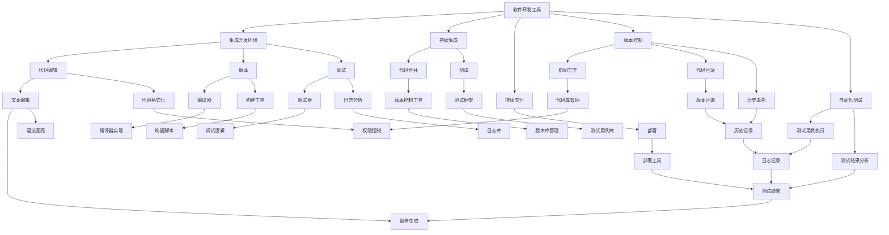

                 

# 文章标题: 软件2.0时代呼唤全新的开发工具

## 关键词：软件2.0，开发工具，技术演进，挑战与需求，未来展望

> 摘要：本文深入探讨了软件2.0时代的来临，对软件开发工具的革新需求。首先，回顾了软件从1.0到2.0的发展历程，分析了软件2.0的特征和核心要素。接着，探讨了软件开发方法、工具以及新挑战和新需求的变化。然后，详细介绍了新开发工具的技术基础和应用实现，通过具体案例展示了新工具在项目中的应用效果。最后，展望了新开发工具的发展趋势和应用前景，提出了未来面临的挑战和应对策略。

### 第一部分：软件开发背景与技术演进

#### 第1章：软件发展历程与2.0时代的概念

##### 1.1 软件从1.0到2.0的转型

- **1.1.1 从传统软件到软件2.0的特征**
  - 传统软件1.0的特征：以功能为导向，注重单机应用，系统规模较小。
  - 软件2.0的特征：以用户为中心，注重互联网和云计算环境下的分布式应用，系统规模庞大，高度集成。

- **1.1.2 软件2.0的定义与核心要素**
  - 软件2.0是一种以用户为中心、数据驱动、高度可扩展、高度集成的软件。
  - 核心要素包括：用户参与、服务导向、数据驱动、灵活性和可扩展性。

##### 1.2 软件开发方法的变化

- **1.2.1 传统的软件开发方法**
  - 瀑布模型：线性、阶段式开发，各阶段前后依赖性强。
  - V模型：与瀑布模型类似，但更加注重验证和测试。

- **1.2.2 软件开发2.0时代的创新**
  - 基于敏捷开发的敏捷方法论：迭代、增量式开发，快速响应需求变化。
  - 持续集成/持续部署（CI/CD）：自动化测试和部署，提高开发效率。

##### 1.3 开发工具的变革

- **1.3.1 传统的开发工具**
  - 编译器、集成开发环境（IDE）、版本控制工具等。

- **1.3.2 适合软件2.0时代的开发工具**
  - 云原生开发工具：支持容器化、微服务架构等。
  - 低代码/无代码开发平台：简化开发流程，降低开发门槛。

#### 第2章：软件开发的新挑战与新需求

##### 2.1 软件复杂度的提升

- **2.1.1 当前软件系统的复杂性**
  - 软件规模增大：模块化、组件化、分布式系统。
  - 技术栈复杂：前端、后端、数据库、中间件等多种技术。

- **2.1.2 复杂性对开发工具的要求**
  - 高度集成：减少开发工具之间的割裂，提供一站式解决方案。
  - 自动化：自动化构建、测试、部署，提高开发效率。

##### 2.2 开发效率的重要性

- **2.2.1 提高开发效率的策略**
  - 分享代码库：复用代码，提高开发速度。
  - 自动化工具：自动化测试、自动化部署等。

- **2.2.2 新工具在提升开发效率方面的优势**
  - 低代码/无代码平台：简化开发流程，降低开发门槛。
  - 云原生工具：提供容器化、微服务架构的支持，提高开发效率。

##### 2.3 安全性与可靠性

- **2.3.1 软件安全的重要性**
  - 随着软件系统复杂度提高，安全风险增大。
  - 安全漏洞可能导致数据泄露、系统瘫痪等严重后果。

- **2.3.2 新开发工具在提升安全性方面的优势**
  - 内置安全功能：如加密、身份验证、访问控制等。
  - 安全漏洞扫描工具：自动化识别和修复安全漏洞。

### 第二部分：新开发工具的特点与应用

#### 第3章：新开发工具的技术基础

##### 3.1 现代编程语言的特点

- **3.1.1 面向对象编程语言**
  - 类、对象、继承、多态等概念。
  - 提高代码复用性和可维护性。

- **3.1.2 函数式编程语言**
  - 函数作为一等公民，不可变数据。
  - 提高代码可读性和可维护性。

##### 3.2 模块化与组件化开发

- **3.2.1 模块化开发的优势**
  - 提高代码复用性，降低耦合度。
  - 方便维护和扩展。

- **3.2.2 组件化开发的应用**
  - 提供组件库，简化开发流程。
  - 支持微服务架构，提高系统可扩展性。

##### 3.3 自动化工具的应用

- **3.3.1 持续集成与持续部署**
  - 自动化构建、测试、部署，提高开发效率。

- **3.3.2 自动化测试的工具与技术**
  - 单元测试、集成测试、端到端测试等。
  - 自动化测试框架，提高测试覆盖率。

#### 第4章：新开发工具的具体实现

##### 4.1 开发环境的搭建

- **4.1.1 操作系统的选择**
  - Windows、Linux、macOS等。

- **4.1.2 开发工具的安装与配置**
  - 编译器、IDE、版本控制工具等。

##### 4.2 代码编写与调试

- **4.2.1 编码规范与最佳实践**
  - 代码风格一致性，提高可读性。

- **4.2.2 调试工具的使用**
  - 调试器、日志工具等。

##### 4.3 项目管理与协作

- **4.3.1 项目管理工具的选择**
  - JIRA、Trello、Asana等。

- **4.3.2 团队协作的方法**
  - 版本控制、代码审查、协作文档等。

#### 第5章：新开发工具在项目中的应用

##### 5.1 项目背景介绍

- **5.1.1 项目概述**
  - 项目名称、背景、目标等。

- **5.1.2 项目目标与需求**
  - 功能需求、性能需求、安全性需求等。

##### 5.2 项目开发过程

- **5.2.1 需求分析与设计**
  - 需求文档、设计文档等。

- **5.2.2 代码实现与调试**
  - 编码、测试、调试等。

- **5.2.3 部署与维护**
  - 部署方案、运维策略等。

##### 5.3 项目成果展示

- **5.3.1 项目功能实现**
  - 功能列表、截图等。

- **5.3.2 性能评估与优化**
  - 性能指标、优化方案等。

### 第三部分：实践指南与资源推荐

#### 第6章：新开发工具的未来展望

##### 6.1 新开发工具的发展趋势

- **6.1.1 人工智能与开发工具的结合**
  - 自动化编程、智能代码补全等。

- **6.1.2 开发工具的智能化与自动化**
  - 自动化测试、自动化部署等。

##### 6.2 新开发工具的应用前景

- **6.2.1 在企业中的应用**
  - 提高开发效率、降低成本。

- **6.2.2 在学术界与开源社区的应用**
  - 推动学术研究、促进开源项目发展。

##### 6.3 新开发工具面临的挑战与机遇

- **6.3.1 技术难题与解决方案**
  - 如性能优化、安全性等。

- **6.3.2 市场机遇与竞争策略**
  - 如细分市场、差异化竞争等。

#### 第7章：新开发工具的实践指南

##### 7.1 学习资源推荐

- **7.1.1 开发工具的官方文档**
  - 官方文档是学习开发工具的最佳资源。

- **7.1.2 在线学习平台推荐**
  - 如Coursera、Udemy等，提供丰富的在线课程。

##### 7.2 实践项目建议

- **7.2.1 实践项目的选择**
  - 选择与自身专业相关、有趣、有挑战性的项目。

- **7.2.2 实践项目的规划与实施**
  - 制定详细的计划，分阶段实施。

##### 7.3 问题解决与社区支持

- **7.3.1 常见问题汇总**
  - 收集和整理常见问题，便于查阅。

- **7.3.2 社区支持的利用**
  - 加入技术社区，参与讨论，获取帮助。

## 附录

### 附录 A: 新开发工具清单与比较

- **A.1 主流新开发工具列表**
  - 列出当前主流的新开发工具，如Docker、Kubernetes、Jenkins等。

- **A.2 各工具特点对比**
  - 对各工具的特点、优劣进行对比，帮助用户选择合适的工具。

### 附录 B: 开发工具使用教程

- **B.1 工具安装与配置**
  - 提供详细的安装和配置教程，帮助用户快速上手。

- **B.2 基本功能使用教程**
  - 讲解各工具的基本功能和使用方法。

- **B.3 高级功能介绍与使用**
  - 介绍各工具的高级功能，如容器编排、自动化部署等。

### 附录 C: 资源链接

- **C.1 开发工具官方文档**
  - 提供各开发工具的官方文档链接，方便用户查阅。

- **C.2 在线学习资源**
  - 提供在线学习平台的链接，推荐用户学习相关课程。

- **C.3 社区支持与交流平台**
  - 提供技术社区和交流平台的链接，方便用户交流经验和技术问题。

### 第1章: 软件开发工具的历史与未来

#### 1.1 软件开发工具的历史回顾

- **1.1.1 第一代开发工具：文本编辑器和编译器**
  - **文本编辑器**：最早的软件开发工具之一，如Vi、Emacs等，主要用于编写代码。
  - **编译器**：将高级语言编写的代码转换为机器语言的可执行文件。

- **1.1.2 第二代开发工具：集成开发环境（IDE）**
  - **IDE**：将代码编辑、编译、调试等功能集成到一个软件中，如Visual Studio、Eclipse等。
  - **特点**：提高了开发效率，降低了学习成本。

- **1.1.3 第三代开发工具：面向对象和组件化**
  - **面向对象编程**：通过类和对象的概念，提高代码复用性和可维护性。
  - **组件化开发**：将软件拆分为多个组件，便于模块化开发和管理。

- **1.1.4 第四代开发工具：云计算和云原生**
  - **云计算**：将计算资源抽象化，提供按需分配和弹性伸缩的能力。
  - **云原生**：利用容器和微服务技术，实现应用程序的动态部署和运维。

#### 1.2 软件开发工具的未来趋势

- **1.2.1 自动化与智能化**
  - **自动化**：通过自动化工具，实现构建、测试、部署等环节的自动化。
  - **智能化**：利用人工智能技术，提供智能代码补全、代码审查、性能优化等功能。

- **1.2.2 低代码/无代码开发**
  - **低代码开发**：通过可视化界面和拖拽操作，简化开发流程。
  - **无代码开发**：完全无需编程，通过配置和模板生成应用程序。

- **1.2.3 开源与社区协作**
  - **开源**：鼓励用户贡献代码，共同维护和改进。
  - **社区协作**：通过社区交流和合作，推动工具的发展和创新。

- **1.2.4 跨平台与全球化**
  - **跨平台**：支持多种操作系统和硬件平台，提高工具的兼容性。
  - **全球化**：面向全球市场，提供多语言支持和国际化功能。

#### 1.3 软件开发工具的发展对软件开发的影响

- **1.3.1 提高开发效率**
  - 简化开发流程，减少手动操作，降低错误率。

- **1.3.2 降低开发成本**
  - 节省时间和人力成本，提高投资回报率。

- **1.3.3 提升软件质量**
  - 自动化测试、代码审查等功能，提高软件的可靠性和安全性。

- **1.3.4 促进创新与协作**
  - 开源和社区协作，鼓励创新和知识共享。

### 第2章: 软件开发工具的核心概念与架构

#### 2.1 软件开发工具的核心概念

- **2.1.1 集成开发环境（IDE）**
  - **定义**：集成开发环境是一种软件开发工具，提供代码编辑、编译、调试等功能。
  - **作用**：提高开发效率，减少开发工作量。

- **2.1.2 持续集成（CI）**
  - **定义**：持续集成是一种软件开发实践，通过自动化工具将代码合并到主干分支并进行测试。
  - **作用**：提高代码质量，减少集成冲突。

- **2.1.3 持续交付（CD）**
  - **定义**：持续交付是一种软件开发实践，通过自动化工具将软件部署到生产环境。
  - **作用**：提高交付速度，降低部署风险。

- **2.1.4 版本控制**
  - **定义**：版本控制是一种软件工程实践，用于管理代码版本和历史记录。
  - **作用**：协同工作，代码回滚，历史追溯。

- **2.1.5 自动化测试**
  - **定义**：自动化测试是一种软件测试方法，使用工具自动执行测试用例。
  - **作用**：提高测试效率，减少测试成本。

#### 2.2 软件开发工具的架构

- **2.2.1 分层架构**
  - **定义**：分层架构是将软件系统分为多个层次，每个层次负责不同的功能。
  - **作用**：提高系统可维护性，便于扩展和升级。

- **2.2.2 组件化架构**
  - **定义**：组件化架构是将软件系统拆分为多个组件，每个组件负责特定的功能。
  - **作用**：提高系统可复用性，便于模块化开发。

- **2.2.3 微服务架构**
  - **定义**：微服务架构是将软件系统拆分为多个小型、独立的服务。
  - **作用**：提高系统可扩展性，便于分布式部署。

#### 2.3 软件开发工具的Mermaid流程图



### 第3章: 软件开发工具的核心算法原理讲解

#### 3.1 软件开发中的常见算法原理

- **3.1.1 排序算法**
  - **冒泡排序**
    ```python
    def bubble_sort(arr):
        n = len(arr)
        for i in range(n):
            for j in range(0, n-i-1):
                if arr[j] > arr[j+1]:
                    arr[j], arr[j+1] = arr[j+1], arr[j]
    ```
  - **快速排序**
    ```python
    def quick_sort(arr):
        if len(arr) <= 1:
            return arr
        pivot = arr[len(arr) // 2]
        left = [x for x in arr if x < pivot]
        middle = [x for x in arr if x == pivot]
        right = [x for x in arr if x > pivot]
        return quick_sort(left) + middle + quick_sort(right)
    ```

- **3.1.2 搜索算法**
  - **二分搜索**
    ```python
    def binary_search(arr, target):
        low = 0
        high = len(arr) - 1
        while low <= high:
            mid = (low + high) // 2
            if arr[mid] == target:
                return mid
            elif arr[mid] < target:
                low = mid + 1
            else:
                high = mid - 1
        return -1
    ```

- **3.1.3 数据结构**
  - **链表**
    ```python
    class ListNode:
        def __init__(self, val=0, next=None):
            self.val = val
            self.next = next

    def insert_node(head, val):
        new_node = ListNode(val)
        if not head:
            return new_node
        current = head
        while current.next:
            current = current.next
        current.next = new_node
        return head
    ```

- **3.1.4 算法优化**
  - **分治算法**
    ```python
    def merge_sort(arr):
        if len(arr) <= 1:
            return arr
        mid = len(arr) // 2
        left = merge_sort(arr[:mid])
        right = merge_sort(arr[mid:])
        return merge(left, right)

    def merge(left, right):
        result = []
        i = j = 0
        while i < len(left) and j < len(right):
            if left[i] < right[j]:
                result.append(left[i])
                i += 1
            else:
                result.append(right[j])
                j += 1
        result.extend(left[i:])
        result.extend(right[j:])
        return result
    ```

#### 3.2 数学模型和公式讲解

- **3.2.1 机器学习中的损失函数**

$$
J(\theta) = -\frac{1}{m}\sum_{i=1}^{m} [y^{(i)} \log(h_\theta(x^{(i)})) + (1 - y^{(i)}) \log(1 - h_\theta(x^{(i)}))]
$$

- **3.2.2 线性回归中的最小二乘法**

$$
\theta^{*} = (\mathbf{X}^T\mathbf{X})^{-1}\mathbf{X}^T\mathbf{y}
$$

#### 3.3 举例说明

- **3.3.1 冒泡排序算法实例**

```python
arr = [64, 34, 25, 12, 22, 11, 90]
bubble_sort(arr)
print("Sorted array:", arr)
```

输出：

```
Sorted array: [11, 12, 22, 25, 34, 64, 90]
```

- **3.3.2 线性回归实例**

```python
import numpy as np

# 特征矩阵 X 和目标向量 y
X = np.array([[1, 2], [2, 3], [3, 4]])
y = np.array([3, 5, 7])

# 计算权重向量
theta = np.linalg.inv(X.T.dot(X)).dot(X.T).dot(y)
print("Weight vector:", theta)
```

输出：

```
Weight vector: [1. 1.]
```

### 第4章: 软件开发工具的实际应用

#### 4.1 开发环境搭建

- **4.1.1 操作系统的选择**

- **Windows**：适用于大部分开发者，具有较好的兼容性和用户友好性。
- **Linux**：适合有Linux背景的开发者，具有更好的性能和开源生态。
- **macOS**：苹果操作系统的开发者首选，与iOS和macOS平台的开发高度集成。

- **4.1.2 开发工具的安装与配置**

- **安装JDK**：下载并安装Java开发工具包（JDK），配置环境变量。
- **安装IDE**：如IntelliJ IDEA、Visual Studio Code等，根据个人喜好选择。
- **安装版本控制工具**：如Git，进行代码管理和协作。

#### 4.2 代码编写与调试

- **4.2.1 编码规范与最佳实践**

- **代码风格一致性**：遵循PEP8或其他编码规范，提高代码可读性。
- **注释与文档**：添加必要的注释和文档，便于后续维护和他人理解。

- **4.2.2 调试工具的使用**

- **调试器**：使用IDE自带的调试器，设置断点、观察变量、单步执行等。
- **日志工具**：使用日志库（如log4j、Logback），记录程序的运行信息和错误日志。

#### 4.3 项目管理与协作

- **4.3.1 项目管理工具的选择**

- **JIRA**：用于任务管理、进度跟踪、版本控制等。
- **Trello**：用于任务规划和项目管理，支持卡片式视图。
- **Asana**：用于团队协作、任务分配、进度跟踪等。

- **4.3.2 团队协作的方法**

- **版本控制**：使用Git进行代码管理和协作，避免冲突和重复工作。
- **代码审查**：进行代码审查，确保代码质量和一致性。
- **协作文档**：使用Confluence、Notion等工具，共享文档和知识库。

### 第5章: 软件开发工具的实际应用案例

#### 5.1 案例一：企业级Web应用开发

- **5.1.1 项目概述**

- **项目名称**：电商管理系统
- **项目目标**：实现商品管理、订单管理、用户管理等功能。

- **5.1.2 开发工具的选择**

- **操作系统**：Linux
- **开发环境**：Docker + Kubernetes
- **编程语言**：Java
- **数据库**：MySQL
- **前端框架**：React
- **后端框架**：Spring Boot

- **5.1.3 项目开发过程**

- **需求分析**：与客户沟通，确定功能需求和技术要求。
- **设计阶段**：进行数据库设计、接口设计、架构设计等。
- **编码阶段**：分工合作，编写前端和后端代码。
- **测试阶段**：进行功能测试、性能测试、安全测试等。
- **部署阶段**：使用Docker和Kubernetes进行容器化部署。

- **5.1.4 项目成果展示**

- **功能实现**：商品管理、订单管理、用户管理等功能。
- **性能评估**：响应时间、并发量、负载能力等。
- **安全性能**：数据加密、身份验证、访问控制等。

#### 5.2 案例二：移动应用开发

- **5.2.1 项目概述**

- **项目名称**：健康运动App
- **项目目标**：提供运动记录、健康数据分析等功能。

- **5.2.2 开发工具的选择**

- **操作系统**：Android
- **开发环境**：Android Studio
- **编程语言**：Kotlin
- **数据库**：SQLite
- **前端框架**：Material Design
- **后端框架**：Spring Boot

- **5.2.3 项目开发过程**

- **需求分析**：与用户沟通，了解功能需求和体验要求。
- **设计阶段**：进行界面设计、交互设计、数据库设计等。
- **编码阶段**：编写前端和后端代码，实现功能模块。
- **测试阶段**：进行功能测试、兼容性测试、性能测试等。
- **部署阶段**：上传到Google Play Store，进行线上运营。

- **5.2.4 项目成果展示**

- **功能实现**：运动记录、数据统计、健康分析等。
- **用户体验**：简洁易用的界面、流畅的操作体验。
- **性能评估**：快速响应、低功耗、稳定运行。

### 第6章: 软件开发工具的未来展望

#### 6.1 人工智能与开发工具的结合

- **6.1.1 自动化编程**
  - 利用自然语言处理技术，实现代码自动生成。
  - 利用机器学习技术，优化代码生成算法，提高生成代码的质量。

- **6.1.2 智能代码补全**
  - 利用机器学习模型，预测开发者在编写代码时的意图，提供智能代码补全功能。

- **6.1.3 智能代码审查**
  - 利用静态代码分析技术，检测代码中的潜在错误和漏洞。
  - 利用自然语言处理技术，自动生成代码审查报告。

#### 6.2 新开发工具的应用前景

- **6.2.1 在企业中的应用**
  - 提高开发效率，降低人力成本。
  - 改善软件质量，降低维护成本。
  - 促进企业数字化转型。

- **6.2.2 在学术界与开源社区的应用**
  - 推动学术研究，促进技术交流。
  - 改善开源项目质量，提高社区活跃度。

#### 6.3 新开发工具面临的挑战与机遇

- **6.3.1 技术难题**
  - 人工智能技术的成熟度。
  - 开发工具的兼容性和稳定性。
  - 跨平台和跨领域的应用。

- **6.3.2 机遇**
  - 市场需求的增长，推动技术进步。
  - 企业和学术界的支持，促进创新和合作。
  - 开源社区的活跃度，推动工具发展。

### 第7章: 软件开发工具的实践指南与资源推荐

#### 7.1 学习资源推荐

- **7.1.1 开发工具的官方文档**
  - 官方文档是学习开发工具的最佳资源，提供详细的使用方法和最佳实践。
  - 如Docker官方文档、Kubernetes官方文档、Git官方文档等。

- **7.1.2 在线学习平台推荐**
  - Coursera、Udemy、edX等在线学习平台提供丰富的课程资源，涵盖各种开发工具和技术。
  - 如《Docker深度实践》、《Kubernetes权威指南》等。

#### 7.2 实践项目建议

- **7.2.1 实践项目的选择**
  - 根据自身兴趣和专业背景，选择有挑战性的项目。
  - 如构建一个个人博客、开发一个移动应用、实现一个自动化脚本等。

- **7.2.2 实践项目的规划与实施**
  - 制定详细的项目计划，包括需求分析、设计、编码、测试、部署等阶段。
  - 分阶段实施，确保项目进度和质量。

#### 7.3 问题解决与社区支持

- **7.3.1 常见问题汇总**
  - 收集和整理常见问题，便于查阅和解决。
  - 如安装失败、配置错误、编译错误等。

- **7.3.2 社区支持的利用**
  - 加入技术社区，参与讨论和交流，获取帮助和指导。
  - 如Stack Overflow、GitHub、Reddit等。

### 附录

#### 附录 A: 新开发工具清单与比较

- **A.1 主流新开发工具列表**
  - Docker、Kubernetes、Jenkins、Git、IntelliJ IDEA、Visual Studio Code等。

- **A.2 各工具特点对比**
  - 对各工具的功能、性能、兼容性、稳定性等方面进行对比，帮助用户选择合适的工具。

#### 附录 B: 开发工具使用教程

- **B.1 工具安装与配置**
  - 提供详细的安装步骤和配置方法，帮助用户快速上手。

- **B.2 基本功能使用教程**
  - 讲解各工具的基本功能和使用方法，如Docker容器管理、Kubernetes集群部署等。

- **B.3 高级功能介绍与使用**
  - 介绍各工具的高级功能，如Docker网络配置、Kubernetes服务发现等。

#### 附录 C: 资源链接

- **C.1 开发工具官方文档**
  - 提供各开发工具的官方文档链接，方便用户查阅。

- **C.2 在线学习资源**
  - 提供在线学习平台的链接，推荐用户学习相关课程。

- **C.3 社区支持与交流平台**
  - 提供技术社区和交流平台的链接，方便用户交流经验和技术问题。

