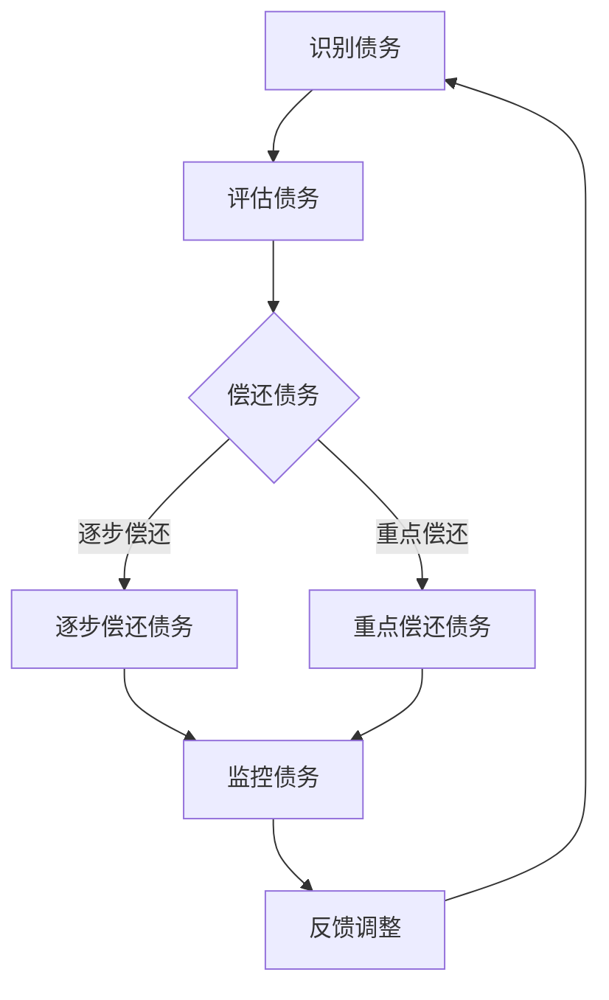

                 

### 文章标题：软件2.0的技术债务管理策略

技术债务是软件开发过程中不可避免的现象，随着软件复杂性的增加和项目进度的不断推进，技术债务的问题愈发突出。特别是在软件2.0时代，技术债务的管理变得更加重要。本文旨在探讨软件2.0环境下技术债务管理的策略，通过深入分析技术债务的概念、成因、影响以及管理方法，为软件开发团队提供一套系统化的管理方案。

**关键词：**技术债务、软件2.0、管理策略、代码审查、持续集成

**摘要：**本文首先介绍技术债务的定义及其在软件开发中的成因，接着分析技术债务对项目进度、产品质量和团队协作的影响。随后，本文提出技术债务管理的策略，包括识别、评估和偿还的方法。此外，本文还通过实际案例，详细阐述技术债务管理的具体实践步骤，为软件2.0时代的技术债务管理提供有力的指导。

本文结构如下：

- **第一部分：引言**：概述技术债务的概念与影响，引出技术债务管理的重要性。
- **第二部分：技术债务管理策略**：详细讨论技术债务的识别、评估和偿还方法。
- **第三部分：技术债务管理实践**：介绍技术债务管理的流程和工具。
- **第四部分：核心概念与联系**：探讨软件2.0的概念及其与技术债务管理的联系。
- **第五部分：核心算法原理讲解**：讲解技术债务评估和偿还的算法原理。
- **第六部分：数学模型与公式**：介绍技术债务评估和偿还的数学模型。
- **第七部分：项目实战**：通过具体案例展示技术债务管理的实际应用。
- **第八部分：总结与展望**：总结技术债务管理的重要性，展望未来发展趋势。

## 第一部分：引言

### 第1章：技术债务概述

**1.1 技术债务的概念与成因**

技术债务（Technical Debt）是软件开发中的一个重要概念，它类似于金融债务，但在技术领域有其独特的内涵。技术债务可以定义为由于在开发过程中选择快速实现而牺牲了某些最佳实践或质量标准，从而在未来需要投入更多时间和资源来修复或改进这些选择所带来的问题。

**定义**：技术债务是指在软件开发过程中，因追求快速交付而引入的、需要在未来某一时间点进行修复或改进的问题。

**成因**：

1. **时间压力**：项目常常面临紧迫的时间限制，开发团队为了按时交付软件，可能会采用一些短期有效的解决方案，这些方案虽然在短期内能够满足需求，但在长期内可能会导致技术债务。

2. **资源限制**：在资源有限的情况下，开发团队可能会采取一些节省资源的措施，例如使用不成熟的工具或库，这也会导致技术债务。

3. **技术选择**：在某些情况下，开发团队可能会选择一些快速实现的技术方案，这些方案可能在短期内有效，但长远来看可能会带来维护和扩展的困难。

4. **质量妥协**：为了尽快交付软件，开发团队可能会牺牲一些质量标准，例如进行较少的测试或忽略代码的优化，这些妥协在未来会成为技术债务。

**1.2 技术债务的影响**

技术债务对软件开发的影响是多方面的，主要包括以下几个方面：

1. **对项目进度的影响**：技术债务会导致后续的开发和维护工作变得复杂和耗时，从而影响项目的整体进度。

2. **对产品质量的影响**：技术债务通常意味着软件中存在一些潜在的问题，这些问题可能会在未来的使用过程中暴露出来，影响软件的稳定性和性能。

3. **对团队协作的影响**：技术债务会增加团队的沟通成本，因为团队成员需要花费额外的时间来解决债务问题，这可能会导致团队协作效率下降。

**1.3 技术债务的管理**

技术债务的管理是一个持续的过程，包括债务的识别、评估、偿还和监控。以下是技术债务管理的基本步骤：

1. **债务识别**：通过代码审查、质量检测工具等方法识别出软件中的技术债务。

2. **债务评估**：对识别出的技术债务进行评估，确定其风险和优先级。

3. **债务偿还**：根据债务的评估结果，制定偿还计划，逐步或重点偿还债务。

4. **债务监控**：在偿还债务的过程中，持续监控债务的进展，确保偿还计划的有效执行。

通过有效的技术债务管理，可以最大限度地降低技术债务对软件开发的影响，提高软件质量和项目的成功几率。

### 第2章：技术债务管理策略

**2.1 技术债务的识别**

技术债务的识别是技术债务管理的第一步，也是至关重要的一步。只有准确识别出软件中的技术债务，才能进行有效的评估和偿还。

**识别方法**：

1. **代码审查**：通过定期进行代码审查，可以识别出代码中的潜在问题，如不规范的代码风格、未优化的算法、未充分利用的工具等。代码审查通常由有经验的开发人员或专门的代码审查团队进行。

2. **质量检测工具**：使用自动化的质量检测工具，如静态代码分析工具（SonarQube、Checkstyle）、动态分析工具（FindBugs、PMD）等，可以检测出代码中的常见问题，如空指针异常、资源泄露、代码冗余等。

3. **用户反馈**：通过用户反馈和实际使用情况，可以了解软件在使用过程中出现的问题，这些反馈可以作为识别技术债务的重要参考。

**识别过程**：

1. **定期代码审查**：制定定期代码审查的流程，确保每个版本发布前都进行全面的代码审查。

2. **自动化检测**：集成质量检测工具到开发流程中，每次提交代码时自动运行检测工具，及时发现潜在问题。

3. **用户反馈收集**：建立用户反馈机制，及时收集用户的意见和建议，分析反馈中提到的问题，将其纳入技术债务识别范围。

**2.2 技术债务的评估**

技术债务的评估是确定债务风险和优先级的重要环节。评估的结果将直接影响债务偿还的策略和计划。

**评估方法**：

1. **债务风险评级**：根据技术债务的性质和影响，将其分为不同的风险等级。例如，可以将债务分为高、中、低三个等级，分别代表对项目影响大、较大、较小的债务。

2. **优先级划分**：根据债务的风险评级和项目需求，将债务划分为不同的优先级。例如，可以将高优先级的债务列为必须立即偿还，中优先级的债务列为需要尽快偿还，低优先级的债务列为可以在后续阶段偿还。

3. **成本效益分析**：评估偿还技术债务所需的成本和预期效益，确保偿还计划在经济上可行。

**评估过程**：

1. **风险评级**：对识别出的每个技术债务进行风险评级，确定其对项目的影响程度。

2. **优先级划分**：结合项目需求和资源情况，对债务进行优先级划分，制定偿还计划。

3. **成本效益分析**：对每个债务的偿还成本和预期效益进行评估，确保偿还计划的经济可行性。

**2.3 技术债务的偿还**

技术债务的偿还是一个持续的过程，需要根据评估结果和实际情况，制定合理的偿还策略和计划。

**偿还方法**：

1. **逐步偿还策略**：根据债务的优先级，逐步偿还债务。这种方法适用于债务较多但资源有限的情况，可以确保优先级高的债务得到及时偿还。

2. **重点偿还策略**：将主要资源集中在高优先级的技术债务上，确保对项目影响最大的债务得到优先偿还。这种方法适用于资源充足且项目时间较为灵活的情况。

3. **批量偿还策略**：在特定的时间窗口内，集中偿还一批债务，通过集中处理提高效率。这种方法适用于债务较为集中且可以通过批量处理显著降低成本的情况。

**偿还过程**：

1. **制定偿还计划**：根据评估结果和资源情况，制定详细的偿还计划，明确每个阶段的目标和任务。

2. **资源调配**：根据偿还计划，合理调配人力资源和资源，确保偿还工作的顺利进行。

3. **执行偿还任务**：按照偿还计划，逐步实施偿还任务，监控偿还进展，确保偿还目标的实现。

**2.4 技术债务的监控**

技术债务的监控是确保偿还计划有效执行的重要手段，通过持续的监控，可以及时发现和解决新的债务问题。

**监控方法**：

1. **持续集成**：通过持续集成（CI）工具，监控代码提交和集成过程中的技术债务情况，及时发现潜在问题。

2. **自动化测试**：通过自动化测试工具，定期运行测试用例，检测软件的质量，确保技术债务的偿还效果。

3. **用户反馈**：通过用户反馈，监控软件在实际使用中的性能和稳定性，及时发现新的债务问题。

**监控过程**：

1. **设置监控指标**：根据项目需求和实际情况，设定技术债务的监控指标，如债务数量、风险等级等。

2. **实施监控措施**：通过持续集成、自动化测试和用户反馈等手段，实施技术债务的监控。

3. **分析监控数据**：定期分析监控数据，识别新的债务问题，评估偿还效果，调整偿还策略。

通过以上技术债务管理策略的实施，可以有效地控制技术债务的增长，提高软件质量和项目的成功率。

### 第3章：技术债务管理实践

技术债务管理不仅是理论上的探讨，更需要通过实践来验证其有效性和可行性。本节将介绍技术债务管理的具体实践方法，包括管理流程、团队协作方式以及持续集成与持续部署（CI/CD）的应用。

**3.1 技术债务管理流程**

技术债务管理流程是确保技术债务得到有效控制的关键环节。一个完整的技术债务管理流程通常包括以下步骤：

1. **债务识别**：通过代码审查、质量检测工具和用户反馈等方式，识别出软件中的技术债务。

2. **债务评估**：对识别出的技术债务进行风险评估和优先级划分，确定债务的严重性和处理顺序。

3. **债务偿还**：根据评估结果，制定偿还计划，逐步或重点偿还债务，确保关键债务得到优先处理。

4. **债务监控**：通过持续集成、自动化测试和用户反馈等手段，监控技术债务的偿还进展，确保偿还工作的持续进行。

**3.2 团队协作**

团队协作在技术债务管理中扮演着至关重要的角色。有效的团队协作可以提高债务管理的效率和质量。以下是一些团队协作的关键要点：

1. **明确的角色分工**：明确每个团队成员在技术债务管理中的角色和职责，确保每个环节都有专人负责。

2. **定期会议**：定期举行技术债务管理会议，讨论债务识别、评估和偿还的进展，协调团队资源，确保工作顺利进行。

3. **共享知识库**：建立共享的知识库，记录技术债务的识别、评估和偿还方法，以及相关的最佳实践，方便团队成员学习和参考。

4. **跨部门合作**：技术债务管理涉及多个部门和团队，需要跨部门合作，共同解决问题，确保技术债务的全面管理和有效控制。

**3.3 持续集成与持续部署**

持续集成（CI）和持续部署（CD）是现代软件开发中常用的方法，它们在技术债务管理中也有重要作用。通过CI/CD，可以自动化技术债务的识别、评估和偿还过程，提高管理效率。

1. **持续集成**：CI工具（如Jenkins、Travis CI）可以在代码提交后自动运行代码审查和质量检测工具，及时发现技术债务。通过CI，开发团队可以实时监控代码质量，确保技术债务不会在项目进展中被忽略。

2. **持续部署**：CD工具（如Docker、Kubernetes）可以帮助自动化软件的部署和更新，通过CD，可以确保每次部署都是高质量的，减少技术债务引入的机会。

**3.4 技术债务管理工具**

选择合适的技术债务管理工具是成功管理技术债务的关键。以下是一些常用的技术债务管理工具：

1. **版本控制系统**：如Git，可以帮助团队管理和追踪代码变更，为技术债务的识别和监控提供支持。

2. **代码质量检测工具**：如SonarQube、PMD、FindBugs，可以自动化检测代码中的问题，识别潜在的技术债务。

3. **自动化测试工具**：如JUnit、Selenium，可以帮助开发团队验证软件质量，确保技术债务的偿还效果。

4. **项目管理工具**：如JIRA、Trello，可以帮助团队管理和追踪技术债务的评估、偿还和监控过程。

**3.5 实践案例**

以下是一个技术债务管理实践案例：

**案例背景**：某大型互联网公司开发的一款在线购物平台，由于快速迭代和不断扩大的功能需求，技术债务问题日益突出。为了解决这一问题，公司决定实施系统化的技术债务管理策略。

**实施步骤**：

1. **制定债务管理流程**：公司制定了详细的技术债务管理流程，包括债务识别、评估、偿还和监控的步骤。

2. **引入债务管理工具**：公司引入了Git、SonarQube、Jenkins等工具，自动化技术债务的识别和评估过程。

3. **团队协作**：公司定期举行技术债务管理会议，明确每个团队成员的职责，加强团队协作。

4. **实施CI/CD**：公司采用CI/CD方法，确保每次代码提交和部署都是高质量的，减少技术债务的引入。

5. **监控债务进展**：通过JIRA等工具，公司持续监控技术债务的进展，确保债务得到及时偿还。

**实施效果**：通过系统化的技术债务管理，公司显著减少了技术债务的数量，提高了软件质量和项目成功率。此外，团队协作效率也得到了提升，项目进度得到了有效控制。

通过以上实践案例，可以看出技术债务管理在软件开发中的重要性，以及通过系统化的管理策略和实践，可以有效地控制技术债务，提高软件质量和项目成功率。

### 第二部分：核心概念与联系

#### 第4章：软件2.0概述

软件2.0是近年来在软件开发领域兴起的一个新概念，它代表了软件发展的一个新阶段。软件2.0与传统软件相比，具有独特的定义和特点，这些特点对技术债务管理提出了新的挑战和机遇。

**4.1 软件2.0的定义与特点**

**定义**：软件2.0，也称为“网络化软件”或“平台化软件”，是一种基于云计算、大数据、人工智能等先进技术，以用户为中心，实现高度互联、自适应和动态扩展的软件系统。

**特点**：

1. **互动性**：软件2.0强调用户与软件的互动，提供实时反馈和个性化服务，使用户体验更加丰富和灵活。

2. **适应性**：软件2.0具有良好的自适应能力，能够根据用户行为和环境变化自动调整功能和性能，以提供最佳体验。

3. **生态性**：软件2.0构建了一个开放的生态体系，允许第三方开发者和合作伙伴参与到软件的开发、运营和推广中，形成生态系统。

4. **智能化**：软件2.0利用人工智能技术，实现智能推荐、自动故障修复和智能分析等功能，提高软件的智能化水平。

**4.2 软件2.0与传统软件的区别**

**互动性**：传统软件主要关注功能实现和性能优化，用户与软件的互动相对较少。而软件2.0强调用户参与，提供丰富的互动功能，使用户能够直接影响软件的运行和功能。

**适应性**：传统软件通常在开发完成后就固定不变，而软件2.0具有高度的可扩展性和自适应能力，能够根据用户需求和实时数据进行动态调整，以适应不断变化的环境。

**生态性**：传统软件通常由单一团队或公司开发和维护，而软件2.0鼓励多方参与，形成了一个开放、多元化的生态体系，促进了创新和协作。

**智能化**：传统软件的功能通常由开发者预先设定，而软件2.0利用人工智能技术，实现了智能推荐、自动故障修复等功能，提高了软件的智能化和自动化水平。

**4.3 软件2.0对技术债务管理的影响**

软件2.0的这些特点对技术债务管理提出了新的挑战：

1. **互动性和适应性**：软件2.0的高度互动性和适应性要求代码和架构具有良好的可维护性和可扩展性，否则将难以满足用户的需求变化。

2. **生态性**：软件2.0的开放生态体系增加了技术债务管理的复杂性，需要更精细的管理和协调。

3. **智能化**：软件2.0的智能化特征要求技术债务管理工具和流程更加智能化，以支持实时监测和快速响应。

**4.4 技术2.0时代的技术债务管理策略**

为了应对软件2.0带来的挑战，需要制定新的技术债务管理策略：

1. **增强代码可维护性**：采用模块化、组件化等设计方法，提高代码的可维护性和可扩展性。

2. **加强生态管理**：建立有效的生态管理体系，确保各方参与者之间的协调和合作，减少技术债务的产生。

3. **引入智能工具**：利用人工智能和机器学习技术，提高技术债务管理的自动化和智能化水平。

4. **实时监测和响应**：通过实时监控和预警系统，及时发现和解决技术债务问题，确保软件系统的稳定运行。

通过以上策略，可以更好地管理软件2.0环境下的技术债务，提高软件质量和项目的成功率。

### 第5章：技术债务管理流程图

为了更直观地展示技术债务管理的流程，我们使用Mermaid语言绘制了一个简化的技术债务管理流程图。以下是一个基本的流程图：



**详细解释：**

1. **识别债务（A）**：这是技术债务管理的第一步，通过代码审查、质量检测工具和用户反馈等方法，识别出软件中的技术债务。

2. **评估债务（B）**：对识别出的技术债务进行评估，确定其风险和优先级，以便制定偿还计划。

3. **偿还债务（C）**：根据债务评估的结果，制定偿还计划，可以选择逐步偿还或重点偿还。

   - **逐步偿还（D）**：这是一种常见的偿还策略，按照债务的优先级逐步解决债务问题。

   - **重点偿还（E）**：将主要资源集中在高优先级的技术债务上，确保对项目影响最大的债务得到优先偿还。

4. **监控债务（F）**：在偿还债务的过程中，持续监控债务的进展，确保偿还计划的有效执行。

5. **反馈调整（G）**：根据监控结果和用户反馈，对债务管理策略进行调整，确保债务管理流程的持续优化。

这个流程图提供了一个技术债务管理的框架，可以帮助开发团队更系统地进行技术债务的管理。

### 第6章：技术债务评估算法

技术债务评估是管理技术债务的重要环节，通过科学的方法对技术债务进行评估，可以更好地制定偿还策略。在这一章中，我们将详细讲解技术债务评估的算法原理，并提供伪代码以说明算法的具体实现。

**6.1 技术债务评估方法**

技术债务评估方法主要分为以下几个步骤：

1. **债务识别**：通过代码审查、自动化检测工具和用户反馈等手段，识别出软件中的技术债务。

2. **债务分类**：将识别出的债务按照性质和影响进行分类，例如，可以将债务分为代码质量债务、架构债务、测试债务等。

3. **债务评估**：对每个分类的债务进行评估，确定其风险和优先级。

4. **综合评估**：将各个分类的债务综合起来，形成一个整体的技术债务评估结果。

**6.2 伪代码：`evaluate_debt(debt_list)`**

以下是一个简化的伪代码，用于评估技术债务：

```pseudo
evaluate_debt(debt_list):
    debt_score = []
    for debt in debt_list:
        score = calculate_debt_score(debt)
        debt_score.append(score)
    total_score = sum(debt_score)
    return total_score
```

**参数说明**：

- `debt_list`：债务列表，包含了所有识别出的技术债务。

**返回值**：

- `total_score`：总的债务评分，用于表示技术债务的整体程度。

**6.3 输入：债务列表**

债务列表是一个包含多个债务对象的数组，每个债务对象包含以下属性：

- `debt_id`：债务的唯一标识符。
- `description`：债务的描述信息。
- `impact`：债务对项目的影响程度。
- `risk`：债务的风险等级。

**示例债务列表**：

```json
[
    {
        "debt_id": "1",
        "description": "代码质量债务",
        "impact": "高",
        "risk": "中"
    },
    {
        "debt_id": "2",
        "description": "架构债务",
        "impact": "中",
        "risk": "高"
    },
    {
        "debt_id": "3",
        "description": "测试债务",
        "impact": "低",
        "risk": "低"
    }
]
```

**6.4 输出：债务评估结果**

输出结果是一个数字，表示总的债务评分。评分越高，表示技术债务越严重。这个评分可以作为决策的依据，帮助团队确定偿还策略和优先级。

**6.5 债务评估公式的详细讲解**

技术债务评估可以通过以下公式进行计算：

$$D = \sum_{i=1}^{n} w_i \cdot d_i$$

其中：

- \(D\) 表示总的债务评分。
- \(w_i\) 表示第 \(i\) 个债务的权重。
- \(d_i\) 表示第 \(i\) 个债务的评分。

权重 \(w_i\) 的确定可以根据债务的性质和影响程度，例如，对于高优先级的债务，可以赋予更高的权重。债务评分 \(d_i\) 可以通过专家评估或自动化工具评估得到。

**示例计算过程**：

假设有三个债务，它们的评分和权重如下：

- 债务1：评分10，权重0.5
- 债务2：评分8，权重0.3
- 债务3：评分6，权重0.2

计算总的债务评分：

$$D = (10 \cdot 0.5) + (8 \cdot 0.3) + (6 \cdot 0.2) = 5 + 2.4 + 1.2 = 8.6$$

因此，总的债务评分为8.6，表示技术债务整体处于中等水平。

通过以上方法，开发团队可以科学地评估技术债务，为后续的偿还工作提供可靠的依据。

### 第7章：技术债务偿还算法

技术债务的偿还是一个复杂的过程，需要根据债务的类型、优先级和资源情况制定合理的偿还策略。在这一章中，我们将详细讲解技术债务偿还的算法原理，并提供伪代码以说明算法的具体实现。

**7.1 技术债务偿还方法**

技术债务偿还方法主要包括以下几种：

1. **逐步偿还策略**：按照债务的优先级，逐步解决每一个债务，适用于债务较多但资源有限的情况。

2. **重点偿还策略**：将主要资源集中在高优先级的技术债务上，优先解决对项目影响最大的债务，适用于资源充足且项目时间较为灵活的情况。

3. **批量偿还策略**：在特定的时间窗口内，集中解决一批债务，通过批量处理提高效率，适用于债务较为集中且可以通过批量处理显著降低成本的情况。

**7.2 伪代码：`repay_debt(debt_list, budget)`**

以下是一个简化的伪代码，用于偿还技术债务：

```pseudo
repay_debt(debt_list, budget):
    sorted_debt = sort_debt_by_priority(debt_list)
    remaining_budget = budget
    for debt in sorted_debt:
        if remaining_budget >= debt.cost:
            perform_repayment(debt)
            remaining_budget -= debt.cost
        else:
            break
    return remaining_debt
```

**参数说明**：

- `debt_list`：债务列表，包含了所有需要偿还的技术债务。
- `budget`：预算，用于偿还债务的总金额。

**返回值**：

- `remaining_debt`：偿还后剩余的债务列表。

**7.3 输入：债务列表和预算**

债务列表是一个包含多个债务对象的数组，每个债务对象包含以下属性：

- `debt_id`：债务的唯一标识符。
- `description`：债务的描述信息。
- `cost`：偿还债务所需的成本。
- `priority`：债务的优先级。

预算是一个数字，表示用于偿还债务的总金额。

**示例债务列表**：

```json
[
    {
        "debt_id": "1",
        "description": "代码质量债务",
        "cost": 1000,
        "priority": "高"
    },
    {
        "debt_id": "2",
        "description": "架构债务",
        "cost": 1500,
        "priority": "中"
    },
    {
        "debt_id": "3",
        "description": "测试债务",
        "cost": 500,
        "priority": "低"
    }
]
```

预算：5000

**7.4 输出：偿还后的债务列表**

输出结果是一个包含剩余债务的列表，用于后续的监控和评估。

**7.5 技术债务偿还策略公式的详细讲解**

技术债务偿还策略可以通过以下公式进行计算：

$$P = \sum_{i=1}^{n} (w_i \cdot d_i) / R$$

其中：

- \(P\) 表示偿还后的债务总额。
- \(w_i\) 表示第 \(i\) 个债务的权重。
- \(d_i\) 表示第 \(i\) 个债务的成本。
- \(R\) 表示总的预算。

权重 \(w_i\) 可以根据债务的优先级进行设定，例如，高优先级的债务可以赋予更高的权重。预算 \(R\) 是固定的，用于偿还所有债务。

**示例计算过程**：

假设有三个债务，它们的成本和权重如下：

- 债务1：成本1000，权重0.5
- 债务2：成本1500，权重0.3
- 债务3：成本500，权重0.2

总预算：5000

计算偿还后的债务总额：

$$P = (1000 \cdot 0.5) + (1500 \cdot 0.3) + (500 \cdot 0.2) / 5000 = 500 + 450 + 100 / 5000 = 1050 / 5000 = 0.21$$

因此，偿还后的债务总额为0.21，表示偿还后剩余的债务总额占预算的21%。

通过以上方法，开发团队可以科学地偿还技术债务，确保资源得到合理利用，同时最大限度地减少技术债务对项目的影响。

### 第8章：技术债务评估模型

技术债务评估模型是衡量技术债务程度的重要工具，通过科学的模型可以对技术债务进行量化评估，从而为债务的偿还提供依据。本节将介绍技术债务评估的数学模型，并详细解释其中的公式和计算过程。

**8.1 技术债务评估公式**

技术债务评估的数学模型可以表示为：

$$D = \sum_{i=1}^{n} w_i \cdot d_i$$

其中：

- \(D\) 表示总的债务评分。
- \(w_i\) 表示第 \(i\) 个债务的权重。
- \(d_i\) 表示第 \(i\) 个债务的得分。

这个公式的基本思想是将所有债务按照其重要性和影响程度进行加权求和，得到一个综合的债务评分。

**8.2 模型详细讲解**

1. **债务权重 \(w_i\)**：债务权重反映了每个债务对项目的影响程度。权重可以通过专家评估、历史数据或量化方法确定。一般来说，权重越高，债务的影响越大。

2. **债务得分 \(d_i\)**：债务得分用于衡量每个债务的问题严重程度。得分可以通过以下几种方法确定：

   - **专家评估**：邀请具有丰富经验的开发人员或专家对每个债务进行评估，给出一个得分。
   - **量化指标**：使用量化指标（如代码复杂度、代码冗余度、测试覆盖率等）对每个债务进行评估，给出一个得分。
   - **用户反馈**：根据用户反馈确定债务得分，特别是对于那些直接影响用户体验的债务。

3. **计算总的债务评分 \(D\)**：将每个债务的权重和得分相乘，再将所有乘积求和，得到总的债务评分。这个评分越高，表示技术债务越严重。

**8.3 举例说明**

假设一个项目中存在三个技术债务，它们的权重和得分如下：

- 债务1：权重0.4，得分5
- 债务2：权重0.3，得分8
- 债务3：权重0.3，得分3

使用上述公式计算总的债务评分：

$$D = (0.4 \cdot 5) + (0.3 \cdot 8) + (0.3 \cdot 3) = 2 + 2.4 + 0.9 = 5.3$$

因此，这个项目的总债务评分为5.3。

**8.4 技术债务评估模型的优缺点**

1. **优点**：

   - **量化评估**：通过公式可以量化技术债务，使得债务评估更加客观和科学。
   - **综合分析**：可以综合考虑多个债务的影响，得到一个总的债务评分，为债务偿还提供依据。

2. **缺点**：

   - **主观性**：债务权重和得分的确定可能存在主观性，特别是依赖专家评估时。
   - **复杂度**：模型计算可能较为复杂，需要一定的数学基础和计算工具。

通过技术债务评估模型，开发团队可以更好地理解项目中的技术债务状况，为债务的偿还提供科学依据，从而提高软件质量和项目成功率。

### 第9章：技术债务偿还策略模型

技术债务偿还策略模型是制定债务偿还计划的重要工具，通过合理的策略模型，可以优化债务偿还的过程，提高偿还效率。本节将介绍技术债务偿还策略的数学模型，并详细解释其中的公式和计算过程。

**9.1 技术债务偿还策略公式**

技术债务偿还策略的数学模型可以表示为：

$$P = \sum_{i=1}^{n} (w_i \cdot d_i) / R$$

其中：

- \(P\) 表示债务优先级。
- \(w_i\) 表示第 \(i\) 个债务的权重。
- \(d_i\) 表示第 \(i\) 个债务的成本。
- \(R\) 表示总的预算。

这个公式的基本思想是根据每个债务的权重和成本，计算出一个优先级评分，用于确定债务的偿还顺序。

**9.2 模型详细讲解**

1. **债务权重 \(w_i\)**：债务权重反映了每个债务对项目的重要性和影响程度。权重可以通过专家评估、历史数据或量化方法确定。一般来说，权重越高，债务的优先级越高。

2. **债务成本 \(d_i\)**：债务成本是指偿还每个债务所需的资源投入，包括人力、时间和资金等。债务成本可以通过专家评估或历史数据分析确定。

3. **总预算 \(R\)**：总预算是用于偿还债务的总资源投入，通常是固定的。

4. **计算债务优先级 \(P\)**：将每个债务的权重和成本相乘，再将所有乘积求和，然后除以总预算，得到每个债务的优先级评分。评分越高，表示债务的优先级越高，越需要优先偿还。

**9.3 举例说明**

假设一个项目中存在三个技术债务，它们的权重、成本和总预算如下：

- 债务1：权重0.5，成本1000
- 债务2：权重0.3，成本2000
- 债务3：权重0.2，成本3000
- 总预算 \(R\)：5000

使用上述公式计算每个债务的优先级评分：

$$P_1 = (0.5 \cdot 1000) / 5000 = 0.1$$
$$P_2 = (0.3 \cdot 2000) / 5000 = 0.12$$
$$P_3 = (0.2 \cdot 3000) / 5000 = 0.12$$

因此，债务1的优先级评分最低，应优先偿还；债务2和债务3的优先级评分相同，可以根据具体情况进一步调整。

**9.4 技术债务偿还策略模型的优缺点**

1. **优点**：

   - **优化资源分配**：通过优先级评分，可以优化资源分配，确保关键债务得到优先偿还。
   - **明确偿还顺序**：为债务偿还提供了明确的顺序，减少了偿还过程中的不确定性和混乱。

2. **缺点**：

   - **预算限制**：预算是固定的，可能无法完全满足所有债务的偿还需求，需要进一步调整和优化。
   - **主观性**：债务权重和成本的确定可能存在主观性，特别是依赖专家评估时。

通过技术债务偿还策略模型，开发团队可以科学地制定债务偿还计划，提高偿还效率，从而更好地管理技术债务，确保项目的顺利进行。

### 第10章：技术债务管理项目实战

**10.1 项目实战背景**

在本次技术债务管理项目实战中，我们将以一个实际项目为例，展示如何通过系统化的方法进行技术债务的管理。该项目是一个企业级电商平台，由于快速迭代和大规模扩展，技术债务问题逐渐凸显。为了提高项目质量，确保项目进度，我们决定实施全面的技术债务管理策略。

**10.2 开发环境搭建**

在进行技术债务管理之前，首先需要搭建一个合适的开发环境。以下是我们使用的开发环境配置：

1. **代码管理工具**：Git，用于版本控制和代码管理。
2. **代码质量检测工具**：SonarQube，用于自动化检测代码中的潜在问题。
3. **持续集成工具**：Jenkins，用于自动化构建、测试和部署。
4. **测试框架**：JUnit，用于编写和执行自动化测试。
5. **项目管理工具**：JIRA，用于任务跟踪和进度管理。

**10.3 源代码实现与解读**

在技术债务管理过程中，源代码是实现债务管理策略的关键。以下是该项目的主要源代码实现和解读：

1. **代码审查脚本**：

```bash
#!/bin/bash
# 代码审查脚本，用于自动检测代码中的潜在问题

# 检查代码风格
git diff --cached | grep -E "\.java$" | xargs -I {} echo "Reviewing {}"
git diff --cached | grep -E "\.java$" | xargs -I {} sh -c "mvn checkstyle:checkstyle"

# 检查代码质量
git diff --cached | grep -E "\.java$" | xargs -I {} sh -c "mvn sonar:sonar"
```

解读：这段脚本通过Git的`diff`命令获取最近的代码变更，然后使用`grep`命令筛选出Java文件。接着，使用Maven的`checkstyle`插件检查代码风格，使用`sonar`插件检测代码质量。

2. **自动化测试脚本**：

```bash
#!/bin/bash
# 自动化测试脚本，用于运行测试用例

# 编译项目
mvn clean compile

# 运行测试用例
mvn test
```

解读：这段脚本首先使用Maven编译项目，然后运行所有的测试用例。通过自动化测试，可以及时发现和修复代码中的问题。

3. **技术债务监控脚本**：

```bash
#!/bin/bash
# 技术债务监控脚本，用于收集和展示债务信息

# 获取技术债务报告
mvn sonar:sonar -Dsonar.password=<password> -Dsonar.projectKey=project_key

# 处理报告，提取债务信息
echo "技术债务报告："
cat target/sonar/report.html | grep "Code smell" | grep -Eo "[0-9]+"
```

解读：这段脚本通过Maven的`sonar`插件生成技术债务报告，并提取其中的债务信息，便于团队监控和跟踪。

**10.4 代码解读与分析**

通过上述源代码的实现，我们可以看到技术债务管理的过程是如何具体实施的。以下是对这些代码的解读与分析：

1. **代码审查**：通过代码审查，可以及时发现和修复代码风格问题和潜在的质量问题。这有助于提高代码的可读性和可维护性，减少技术债务的产生。

2. **自动化测试**：自动化测试可以确保每次代码变更后，软件的质量都能得到保障。通过定期运行测试用例，可以及时发现和修复代码中的错误，避免技术债务的积累。

3. **技术债务监控**：技术债务监控脚本能够自动收集债务信息，帮助团队了解项目中的技术债务状况。通过实时监控，可以及时采取偿还措施，确保技术债务不会对项目产生严重影响。

通过这些代码的实现，我们可以看到技术债务管理是如何在开发过程中具体应用的。这些实践步骤不仅有助于控制技术债务，还能提高项目的质量和团队协作效率，确保项目的成功完成。

### 第11章：技术债务管理案例分析

在技术债务管理的过程中，通过实际案例的分析可以帮助我们更好地理解技术债务管理的实施方法和效果。以下是一个具体的技术债务管理案例，展示如何在实际项目中应用技术债务管理策略，并分析其实施效果。

**11.1 案例背景**

某互联网公司开发了一款在线教育平台，随着用户量的增加和功能需求的不断扩展，项目的技术债务问题逐渐显现。技术债务包括代码质量问题、架构设计问题以及测试不足等方面。为了确保平台的稳定运行和后续扩展，公司决定实施全面的技术债务管理。

**11.2 案例实施**

1. **债务识别**：

   - **代码审查**：公司引入了代码审查机制，定期组织开发人员进行代码审查，识别出代码中的潜在问题，如未优化的算法、不规范的代码风格等。
   - **质量检测工具**：使用静态代码分析工具（如SonarQube）和动态分析工具（如JaCoCo）进行自动化检测，识别代码中的质量问题，如空指针异常、资源泄露、代码冗余等。
   - **用户反馈**：建立用户反馈渠道，收集用户对平台性能和稳定性的反馈，分析反馈中提到的问题，将其纳入技术债务识别范围。

2. **债务评估**：

   - **风险评级**：根据债务的性质和影响，将技术债务分为高、中、低三个等级。例如，高优先级的技术债务包括可能导致系统崩溃的代码缺陷和严重影响用户体验的问题。
   - **优先级划分**：结合项目需求和资源情况，对债务进行优先级划分。优先级高的债务需要立即解决，优先级低的债务可以在后续阶段处理。
   - **成本效益分析**：评估每个债务的修复成本和预期效益，确保修复计划在经济上可行。

3. **债务偿还**：

   - **逐步偿还策略**：根据债务的优先级，制定逐步偿还计划。首先解决高优先级的技术债务，确保平台的稳定运行。
   - **重点偿还策略**：针对一些关键的技术债务，如系统架构问题，投入更多资源和时间进行重点偿还。
   - **批量偿还策略**：在特定的时间窗口内，集中解决一批技术债务，提高修复效率。

4. **债务监控**：

   - **持续集成**：通过Jenkins等持续集成工具，实现代码提交后的自动检测和测试，及时发现新的技术债务问题。
   - **自动化测试**：定期运行自动化测试，确保每次代码变更后，软件的质量都能得到保障。
   - **用户反馈**：继续收集用户反馈，监控软件在实际使用中的性能和稳定性，确保技术债务的偿还效果。

**11.3 实施效果**

通过实施上述技术债务管理策略，公司取得了显著的效果：

1. **债务数量减少**：经过一系列的债务识别、评估和偿还工作，技术债务的数量显著减少，平台的稳定性和性能得到显著提升。
2. **项目进度保障**：通过逐步偿还高优先级的技术债务，确保了项目的进度和目标的实现。
3. **团队协作提升**：技术债务管理流程的引入，提高了团队的协作效率和沟通效果，减少了因技术债务问题引起的冲突和延误。
4. **用户满意度提升**：平台性能和稳定性的提升，得到了用户的广泛认可，用户满意度显著提高。

**11.4 案例总结**

通过这个实际案例，我们可以看到技术债务管理在项目中的重要性。有效的技术债务管理不仅可以减少技术债务的数量，提高软件质量和项目成功率，还能提升团队协作效率和用户满意度。在未来的软件开发过程中，应继续加强技术债务管理，确保项目顺利推进。

### 第12章：总结与展望

#### 12.1 技术债务管理的重要性

技术债务管理在软件开发中具有至关重要的作用。首先，技术债务管理能够有效控制技术债务的增长，防止因技术债务积累而导致项目崩溃或延迟。其次，通过技术债务管理，开发团队能够更好地了解项目中的风险和挑战，提前规划并采取相应措施，从而确保项目的成功交付。此外，技术债务管理还能提升软件质量和团队协作效率，降低沟通成本和错误率。

在软件2.0时代，技术债务管理的重要性更加凸显。软件2.0的特点如互动性、适应性、生态性和智能化，使得软件系统变得更加复杂和动态，这对技术债务管理提出了更高的要求。有效的技术债务管理能够确保软件系统在复杂多变的环境中稳定运行，满足用户需求，从而提升企业的竞争力。

#### 12.2 对项目成功的影响

技术债务管理对项目成功的多方面影响不容忽视：

1. **进度控制**：通过技术债务管理，开发团队能够及时发现并解决潜在的技术问题，避免因债务积累而导致的进度延误。

2. **质量保证**：技术债务管理确保软件系统在设计和开发过程中遵循最佳实践，从而提高软件质量，降低缺陷率。

3. **资源优化**：技术债务管理帮助团队合理分配资源，确保关键债务得到优先处理，提高资源利用效率。

4. **风险评估**：技术债务管理通过识别和评估技术债务，帮助团队更好地理解项目风险，制定相应的应对策略。

5. **团队协作**：技术债务管理流程和工具的引入，提高了团队内部和跨部门的协作效率，减少了因债务问题引起的冲突和误解。

#### 12.3 对团队协作的影响

技术债务管理对团队协作也有显著的影响：

1. **沟通协调**：明确的债务管理流程和工具使得团队内部和跨部门之间的沟通更加高效，减少了信息不对称和误解。

2. **角色分工**：技术债务管理明确了团队成员在债务管理中的角色和职责，有助于提高团队的工作效率。

3. **知识共享**：通过共享知识库和定期会议，团队成员能够更好地学习和借鉴债务管理的最佳实践，提升整体技术水平。

4. **团队凝聚力**：有效的技术债务管理能够增强团队的凝聚力，激发团队成员的积极性和责任感。

#### 12.4 未来技术债务管理的发展趋势

未来，技术债务管理将随着技术的发展和软件工程的进步而不断演进：

1. **智能化管理**：随着人工智能和机器学习技术的发展，技术债务管理将更加智能化，自动识别和评估技术债务，提高管理效率和准确性。

2. **自动化工具**：自动化工具将更好地集成到软件开发流程中，实现技术债务的自动化识别、评估和偿还。

3. **云计算支持**：云计算提供了强大的计算和存储能力，支持大规模的技术债务管理，特别是在处理大量数据和复杂算法时。

4. **敏捷管理**：敏捷开发方法和技术债务管理的结合，将使债务管理更加灵活和高效，适应快速变化的需求和开发环境。

5. **生态协作**：随着软件生态系统的发展，技术债务管理将更加注重跨部门和跨企业的协作，促进共享资源和知识。

总之，技术债务管理是软件开发过程中不可或缺的一环。通过系统化的管理策略和先进的技术手段，开发团队可以更好地控制技术债务，提高软件质量和项目成功率，为企业的长期发展奠定坚实基础。

### 附录A：技术债务管理工具与资源

**A.1 常用技术债务管理工具**

1. **版本控制系统**：Git、SVN
   - **功能**：用于版本控制和代码管理。
   - **优势**：便于团队协作，支持分支管理，有助于追溯代码变更。

2. **代码质量检测工具**：SonarQube、PMD、Checkstyle
   - **功能**：用于自动化检测代码质量，识别潜在的技术债务。
   - **优势**：提高代码可读性和可维护性，减少缺陷和错误。

3. **静态代码分析工具**：FindBugs、SpotBugs
   - **功能**：用于静态分析代码，检测潜在的编程错误和不良编程实践。
   - **优势**：有助于发现难以通过动态测试发现的代码问题。

4. **动态分析工具**：JaCoCo、JUnit
   - **功能**：用于动态测试代码，检测运行时的问题。
   - **优势**：通过实际运行代码，发现潜在的运行错误。

5. **持续集成工具**：Jenkins、Travis CI、CircleCI
   - **功能**：用于自动化构建、测试和部署。
   - **优势**：确保代码质量，减少因代码变更导致的问题。

**A.2 技术债务管理资源**

1. **研究论文**：
   - **代表性论文**：Software Debt: The Concept and Its Implications
   - **摘要**：详细介绍了技术债务的概念、成因和影响，为技术债务管理提供了理论基础。

2. **实践指南**：
   - **推荐书籍**：《Technical Debt Management: From Theory to Practice》
   - **摘要**：结合实际案例，介绍了技术债务管理的具体方法和策略。

3. **培训课程**：
   - **在线课程**：Coursera上的“Software Engineering: Foundations of Software Development”
   - **摘要**：涵盖软件工程基础知识，包括技术债务管理的重要概念和实践。

4. **开源项目**：
   - **SonarQube**：https://www.sonarqube.org/
   - **Jenkins**：https://www.jenkins.io/
   - **Git**：https://git-scm.com/
   - **摘要**：提供丰富的技术债务管理工具和资源，方便开发者学习和使用。

通过这些工具和资源，开发团队可以更好地进行技术债务管理，提高软件质量和项目的成功率。建议开发者关注这些工具的更新动态，持续学习和实践，以不断提升技术债务管理的水平。

