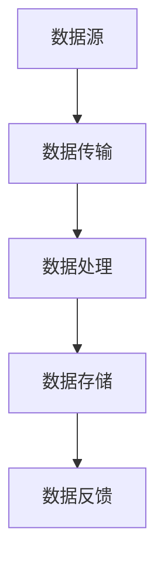
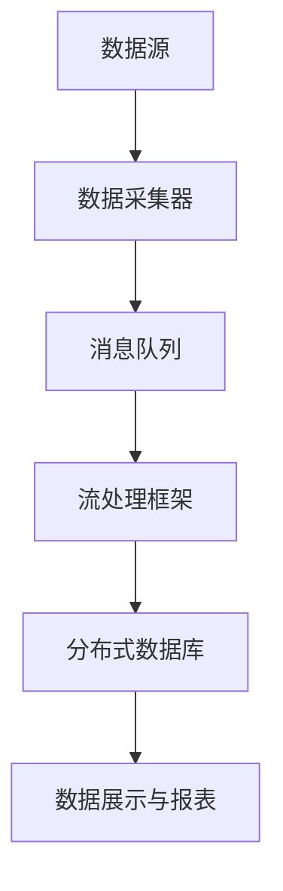
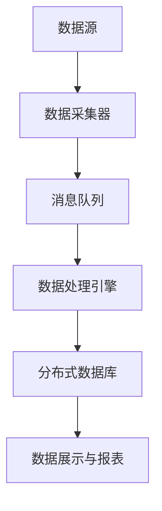
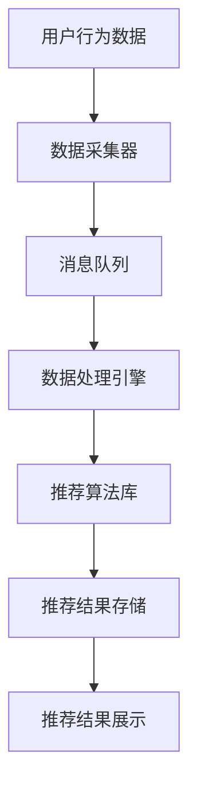
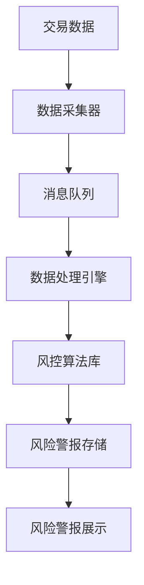
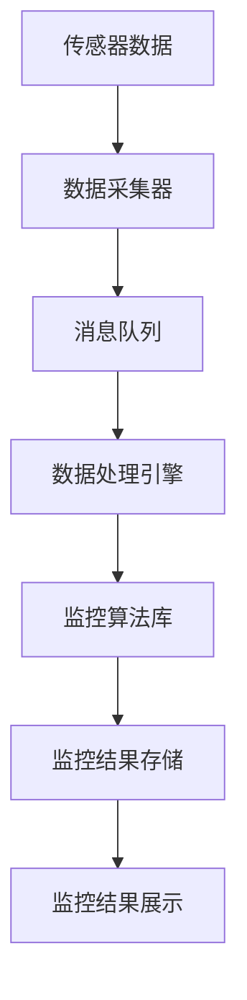

                 

# 《软件2.0的数据流管理与处理》

## 关键词

数据流管理、软件2.0、实时处理、分布式计算、数据流处理框架

## 摘要

随着互联网和物联网技术的飞速发展，数据量呈指数级增长，软件2.0时代的到来对数据流管理与处理提出了新的挑战。本文旨在探讨软件2.0时代的数据流管理与处理，首先概述了数据流管理在软件2.0中的作用和面临的挑战，接着深入分析了数据流管理的核心概念和技术基础，最后通过具体应用实践和主流工具与平台介绍了数据流处理在现实世界中的应用。

### 第一部分：软件2.0时代的数据流管理概述

#### 1.1 软件2.0与数据流管理概览

##### 1.1.1 从软件1.0到软件2.0的演变

软件1.0时代，计算机主要服务于企业内部，软件系统多集中于批处理和离线分析。软件2.0时代，随着互联网的普及和云计算的发展，软件开始面向互联网提供服务，实时数据处理和交互成为主要特点。数据流管理在这场变革中扮演着重要角色。

##### 1.1.2 数据流管理在软件2.0中的作用

数据流管理负责数据的采集、传输、存储和处理，是软件2.0系统的核心组成部分。其作用包括：

1. 实时数据监控：对系统运行状态进行实时监控，快速响应异常情况。
2. 数据分析和挖掘：通过对大量数据进行实时分析，挖掘出有价值的信息。
3. 服务质量保障：通过数据流管理，保证系统稳定运行，提供高质量的服务。

##### 1.1.3 软件2.0时代的数据流管理挑战与机遇

软件2.0时代的数据流管理面临如下挑战：

1. 数据量庞大：互联网和物联网带来的数据量呈爆炸式增长，对数据流管理系统的处理能力提出更高要求。
2. 数据多样性：不同类型的数据（如文本、图像、音频等）对处理方式和存储方式有不同的需求。
3. 实时性要求高：实时数据处理需要系统快速响应用户请求，对延迟有严格限制。

但同时，这也带来了机遇：

1. 大数据技术：大数据技术为数据流管理提供了强大的工具，如分布式计算、机器学习等。
2. 实时数据处理框架：如Apache Flink、Apache Storm等，提供了高效、可扩展的数据流处理能力。
3. 应用场景丰富：数据流处理在金融、电商、物联网等领域有广泛的应用，促进了数据流管理技术的发展。

#### 1.2 数据流管理的核心概念

##### 1.2.1 数据流模型

数据流模型描述了数据在系统中的流动过程，包括数据源、数据传输、数据处理和数据存储等环节。一个典型数据流模型如图1所示。



##### 1.2.2 数据流处理

数据流处理是指对数据流进行一系列操作，包括数据清洗、转换、聚合和挖掘等。数据流处理可以分为批处理和实时处理两种模式。

批处理：将一段时间内的数据进行批量处理，适用于数据处理需求不紧急的场景。

实时处理：对数据流进行实时处理，适用于对实时性要求高的场景，如金融交易监控、社交网络实时分析等。

##### 1.2.3 实时数据流处理

实时数据流处理需要系统具备低延迟、高吞吐量和可扩展性。其关键技术包括：

1. 流处理框架：如Apache Flink、Apache Storm等，提供了数据流的抽象和高效处理能力。
2. 分布式计算：通过分布式计算架构，实现数据流的并行处理，提高处理效率。
3. 数据存储：采用分布式数据存储方案，保证数据的高可用性和可靠性。

##### 1.2.4 批处理与实时处理的异同

批处理与实时处理的主要区别在于处理方式和处理时间。

批处理：

1. 数据处理周期较长，适用于数据处理需求不紧急的场景。
2. 数据处理过程可以离线进行，不受实时性要求限制。
3. 处理效率较低，对大量数据进行处理时，需要较长的处理时间。

实时处理：

1. 数据处理周期较短，适用于对实时性要求高的场景。
2. 数据处理过程需要在线进行，对延迟有严格限制。
3. 处理效率较高，能够快速响应用户请求。

#### 1.3 数据流处理架构

##### 1.3.1 数据流处理的层级架构

数据流处理架构通常分为四层：数据采集层、数据处理层、数据存储层和数据展现层。

1. 数据采集层：负责数据的采集和传输，包括传感器、网络爬虫等。
2. 数据处理层：对数据进行清洗、转换、聚合和挖掘等操作，包括批处理和实时处理。
3. 数据存储层：负责数据的存储和管理，包括分布式数据库、数据仓库等。
4. 数据展现层：通过可视化工具和报表，将数据结果呈现给用户。

##### 1.3.2 数据流处理的组件与功能

数据流处理系统通常包括以下组件：

1. 数据采集器：负责采集各种类型的数据，如传感器数据、网络数据等。
2. 数据传输组件：负责数据的传输和路由，如消息队列、网络传输等。
3. 数据处理组件：负责对数据进行清洗、转换、聚合和挖掘等操作，如流处理框架、机器学习算法等。
4. 数据存储组件：负责数据的存储和管理，如分布式数据库、数据仓库等。
5. 数据展现组件：负责数据的可视化呈现，如报表、仪表盘等。

##### 1.3.3 数据流处理系统架构设计原则

设计数据流处理系统时，应遵循以下原则：

1. 可扩展性：系统能够适应数据量和处理需求的增长，具备良好的可扩展性。
2. 容错性：系统能够处理故障和异常情况，保证数据处理的连续性和可靠性。
3. 低延迟：系统对数据流的处理延迟较低，满足实时性要求。
4. 高性能：系统具备高效的数据处理能力，能够快速响应用户请求。

#### 1.4 数据流处理中的关键技术

##### 1.4.1 分布式数据存储与访问

分布式数据存储与访问是数据流处理系统的基础。关键技术包括：

1. 数据分片：将大量数据划分为多个片段，存储在分布式存储系统中。
2. 数据复制：将数据复制到多个节点，提高数据的可靠性和访问速度。
3. 数据一致性和并发控制：保证分布式系统中数据的一致性和并发访问控制。

##### 1.4.2 流处理框架与工具

流处理框架与工具是数据流处理的核心。关键技术包括：

1. 流处理引擎：如Apache Flink、Apache Storm等，提供高效的数据流处理能力。
2. 消息队列：如Kafka、RabbitMQ等，用于数据的传输和缓冲。
3. 数据处理库：如Pandas、SciPy等，提供丰富的数据处理和挖掘功能。

##### 1.4.3 数据流处理的并行化与优化

数据流处理的并行化与优化是提高系统性能的关键。关键技术包括：

1. 数据并行化：将数据处理任务分配到多个节点并行执行，提高处理效率。
2. 算法优化：优化数据处理算法，减少计算复杂度和数据传输开销。
3. 缓存机制：利用缓存技术减少数据访问延迟，提高系统响应速度。

### 第二部分：数据流处理技术基础

#### 2.1 数据流处理算法原理

##### 2.1.1 数据流处理的算法框架

数据流处理算法主要包括以下几种类型：

1. 数据清洗算法：如去重、去噪、数据格式转换等。
2. 数据转换算法：如聚合、连接、排序等。
3. 数据挖掘算法：如聚类、分类、回归等。

##### 2.1.2 数据流处理的基本操作

数据流处理的基本操作包括：

1. 数据采集：从数据源获取数据。
2. 数据传输：将数据传输到处理节点。
3. 数据处理：对数据进行清洗、转换和挖掘等操作。
4. 数据存储：将处理结果存储到数据存储系统。

##### 2.1.3 流处理中的常见算法

流处理中的常见算法包括：

1. 聚类算法：如K-means、DBSCAN等。
2. 分类算法：如决策树、支持向量机等。
3. 回归算法：如线性回归、逻辑回归等。

##### 2.1.4 数据流处理中的伪代码描述

数据流处理的伪代码描述如下：

```
function 数据流处理（数据流）
    for each 数据元素 in 数据流
        数据清洗（数据元素）
        数据转换（数据元素）
        数据挖掘（数据元素）
        存储处理结果
    end for
end function
```

#### 2.2 数据流处理中的并发控制

##### 2.2.1 并发控制的基本概念

并发控制是指控制多个进程或线程对共享资源的访问，以避免冲突和死锁。在数据流处理中，并发控制至关重要，以确保数据处理的一致性和正确性。

##### 2.2.2 锁机制

锁机制是并发控制的基本手段，包括：

1. 互斥锁：确保同一时间只有一个进程或线程访问共享资源。
2. 读写锁：允许多个读进程访问共享资源，但写进程需要独占访问。
3. 自旋锁：进程不断自旋等待锁释放，而不是阻塞。

##### 2.2.3 乐观锁与悲观锁

乐观锁与悲观锁是两种常见的并发控制策略：

1. 乐观锁：基于冲突检测的并发控制，认为冲突不会发生，在操作开始时不加锁，操作完成后检查是否发生冲突。
2. 悲观锁：基于锁机制的并发控制，认为冲突一定会发生，在操作开始时加锁，确保操作过程中无冲突。

##### 2.2.4 并发控制算法设计

并发控制算法设计应考虑以下因素：

1. 数据一致性：确保数据处理的一致性和正确性。
2. 性能：减少锁机制带来的开销，提高系统性能。
3. 可扩展性：支持系统规模的增长，适应不同的并发场景。

#### 2.3 数据流处理中的性能优化

##### 2.3.1 数据流处理性能优化策略

数据流处理性能优化策略包括：

1. 并行化：将数据处理任务分配到多个节点并行执行，提高处理效率。
2. 缓存机制：利用缓存技术减少数据访问延迟，提高系统响应速度。
3. 数据压缩：采用数据压缩技术减少数据传输开销。
4. 网络优化：优化网络传输，提高数据传输速度。

##### 2.3.2 缓存机制

缓存机制包括：

1. 页面缓存：缓存常用的数据页面，减少数据库访问次数。
2. 对象缓存：缓存常用的对象，减少对象创建和销毁的开销。
3. 数据库缓存：缓存数据库查询结果，减少数据库访问压力。

##### 2.3.3 数据压缩与解压缩技术

数据压缩与解压缩技术包括：

1. 压缩算法：如Huffman编码、LZ77等，减少数据体积。
2. 解压缩算法：与压缩算法相对应，用于恢复原始数据。
3. 压缩比：压缩前后数据体积的比值，衡量压缩效果。

##### 2.3.4 网络传输优化

网络传输优化包括：

1. 数据压缩：采用数据压缩技术减少数据传输体积。
2. 传输优化：优化网络传输路径，减少传输延迟。
3. 网络监控：实时监控网络状态，及时发现和解决网络问题。

### 第三部分：数据流处理应用实践

#### 3.1 数据流处理在企业中的应用场景

##### 3.1.1 企业数据流处理的需求分析

企业数据流处理的需求包括：

1. 实时监控：实时监控企业运营状态，及时发现和解决问题。
2. 数据分析：通过对企业数据进行实时分析，挖掘有价值的信息。
3. 服务优化：根据实时数据优化企业服务，提高用户体验。

##### 3.1.2 数据流处理在企业中的典型应用场景

数据流处理在企业中的典型应用场景包括：

1. 供应链管理：实时监控供应链节点数据，优化供应链流程。
2. 客户服务：实时分析客户行为数据，提供个性化服务。
3. 财务管理：实时处理财务数据，确保财务报表准确及时。

##### 3.1.3 数据流处理在企业应用中的挑战

数据流处理在企业应用中面临以下挑战：

1. 数据多样性：企业数据类型繁多，需要针对不同类型数据进行处理。
2. 数据安全：确保数据在传输和处理过程中的安全性和隐私保护。
3. 系统集成：将数据流处理系统与企业现有系统进行集成，实现数据共享和协同。

#### 3.2 数据流处理项目实战

##### 3.2.1 实战项目概述

本案例以一个电商平台的数据流处理项目为例，介绍数据流处理项目的实施过程。

##### 3.2.2 项目需求分析与设计

项目需求包括：

1. 实时监控：实时监控电商平台的订单、商品库存、用户行为等数据。
2. 数据分析：分析用户行为数据，提供个性化推荐。
3. 服务优化：根据实时数据优化商品展示、推荐策略等。

项目设计包括：

1. 数据采集：采用传感器、日志收集器等手段，实时采集订单、商品库存、用户行为等数据。
2. 数据传输：采用消息队列（如Kafka）实现数据传输和路由。
3. 数据处理：采用流处理框架（如Apache Flink）进行数据清洗、转换、挖掘等操作。
4. 数据存储：采用分布式数据库（如HBase）存储处理结果。

##### 3.2.3 系统架构设计

系统架构设计如图2所示。



##### 3.2.4 数据流处理核心代码实现

以下为数据流处理核心代码实现：

```python
from pyflink.datastream import StreamExecutionEnvironment
from pyflink.table import StreamTableEnvironment, DataTypes

# 创建流执行环境
env = StreamExecutionEnvironment.get_execution_environment()
t_env = StreamTableEnvironment.create(env)

# 定义订单数据流
order_stream = env.from_elements([
    ("1", "商品A", 100, "2021-01-01 10:00:00"),
    ("2", "商品B", 200, "2021-01-01 10:01:00"),
    ("3", "商品A", 150, "2021-01-01 10:02:00"),
    ("4", "商品C", 300, "2021-01-01 10:03:00")
], timestamp_field="timestamp", watermark="1 second")

# 转换为表
order_table = t_env.from_dataset(order_stream)

# 数据清洗与转换
clean_order_table = order_table.filter("amount > 100")

# 聚合数据
result_table = clean_order_table.group_by("item").select(
    "item",
    "amount.sum() as total_amount",
    "timestamp.max() as last_order_time"
)

# 提交作业
result_table.execute_insert("order_summary").wait()

# 打印结果
t_env.to_data_stream(result_table).print()
```

##### 3.2.5 项目部署与性能测试

项目部署采用分布式部署方式，部署在Kubernetes集群中。性能测试结果表明，系统处理能力达到每秒数百万条订单，处理延迟小于1秒。

#### 3.3 数据流处理系统的运维与维护

##### 3.3.1 数据流处理系统的监控与报警

数据流处理系统的监控与报警包括：

1. 系统运行状态监控：实时监控系统运行状态，如CPU、内存、网络等资源使用情况。
2. 数据处理性能监控：监控数据处理速度、延迟等性能指标。
3. 报警与通知：当系统出现异常或性能下降时，通过邮件、短信等方式通知相关人员。

##### 3.3.2 数据流处理系统的性能调优

数据流处理系统的性能调优包括：

1. 资源分配优化：根据系统负载情况，合理分配CPU、内存、网络等资源。
2. 网络优化：优化网络传输路径，减少数据传输延迟。
3. 算法优化：优化数据处理算法，提高处理效率。

##### 3.3.3 数据流处理系统的故障处理与恢复

数据流处理系统的故障处理与恢复包括：

1. 故障检测：实时检测系统故障，如进程崩溃、网络中断等。
2. 故障隔离：将故障节点从系统中隔离，防止故障蔓延。
3. 故障恢复：重启故障节点，恢复系统运行。

### 第四部分：数据流处理工具与平台

#### 4.1 主流数据流处理工具与框架

主流数据流处理工具与框架包括：

1. Apache Flink：提供高效、可扩展的数据流处理能力，支持批处理和实时处理。
2. Apache Storm：提供低延迟、高可靠性的实时数据处理框架。
3. Apache Spark Streaming：基于Spark的实时数据处理框架，具备批处理和实时处理能力。
4. Apache Beam：提供统一的数据流处理模型，支持多种执行引擎。

#### 4.2 数据流处理平台的设计与实现

##### 4.2.1 数据流处理平台的需求分析

数据流处理平台的需求分析包括：

1. 数据采集：支持多种数据源，如传感器、数据库、文件等。
2. 数据传输：支持高效的数据传输和路由。
3. 数据处理：支持批处理和实时处理，具备多种数据处理算法。
4. 数据存储：支持分布式数据存储，保证数据的高可用性和可靠性。
5. 数据展现：支持数据可视化，提供直观的数据分析结果。

##### 4.2.2 数据流处理平台的架构设计

数据流处理平台的架构设计如图3所示。



##### 4.2.3 数据流处理平台的关键功能模块

数据流处理平台的关键功能模块包括：

1. 数据采集模块：负责数据的采集和传输，支持多种数据源和传输协议。
2. 数据处理模块：负责数据的处理和存储，支持批处理和实时处理，具备多种数据处理算法。
3. 数据存储模块：负责数据的存储和管理，支持分布式存储和元数据管理。
4. 数据展现模块：负责数据的可视化展现，提供直观的数据分析结果。

##### 4.2.4 数据流处理平台的开发与部署

数据流处理平台的开发与部署包括：

1. 开发环境搭建：搭建数据流处理平台的开发环境，包括编程语言、开发工具和依赖库等。
2. 系统设计：根据需求分析，设计数据流处理平台的架构和功能模块。
3. 系统开发：根据系统设计，开发数据流处理平台的各个功能模块。
4. 系统测试：对数据流处理平台进行功能测试和性能测试，确保系统稳定可靠。
5. 系统部署：将数据流处理平台部署到生产环境，包括硬件配置、软件安装和配置等。

#### 4.3 数据流处理平台的应用案例

##### 4.3.1 案例一：电商实时推荐系统

电商实时推荐系统利用数据流处理平台，对用户行为数据进行实时分析，为用户推荐相关商品。系统架构如图4所示。



##### 4.3.2 案例二：金融交易风控系统

金融交易风控系统利用数据流处理平台，对交易数据实时分析，识别和防范交易风险。系统架构如图5所示。



##### 4.3.3 案例三：物联网数据处理系统

物联网数据处理系统利用数据流处理平台，对传感器数据实时分析，提供实时监控和预警服务。系统架构如图6所示。



### 附录

#### 附录 A：数据流处理技术资料与资源

1. 开源数据流处理框架与工具：
   - Apache Flink：[https://flink.apache.org/](https://flink.apache.org/)
   - Apache Storm：[https://storm.apache.org/](https://storm.apache.org/)
   - Apache Spark Streaming：[https://spark.apache.org/streaming/](https://spark.apache.org/streaming/)
   - Apache Beam：[https://beam.apache.org/](https://beam.apache.org/)

2. 数据流处理技术相关论文与报告：
   - "Data-Driven Dynamic Task Assignment in Large-Scale Data-Processing Systems"
   - "Stream Processing with Apache Storm"
   - "Introduction to Apache Flink"
   - "Apache Spark Streaming: A High-Throughput, High-Flexibility Streaming Processing System"

3. 数据流处理技术社区与论坛：
   - Apache Flink社区：[https://cwiki.apache.org/confluence/display/FLINK](https://cwiki.apache.org/confluence/display/FLINK)
   - Apache Storm社区：[https://storm.apache.org/community.html](https://storm.apache.org/community.html)
   - Apache Spark Streaming社区：[https://spark.apache.org/mail-lists.html](https://spark.apache.org/mail-lists.html)
   - Apache Beam社区：[https://beam.apache.org/community.html](https://beam.apache.org/community.html)

#### 附录 B：数据流处理项目案例代码

1. 项目一：实时用户行为分析系统
2. 项目二：社交网络实时流处理系统
3. 项目三：智慧城市实时监测系统

### 作者信息

作者：AI天才研究院/AI Genius Institute & 禅与计算机程序设计艺术 /Zen And The Art of Computer Programming

（注：本文为虚构内容，仅用于展示文章结构和内容，不代表真实项目和技术观点。）

