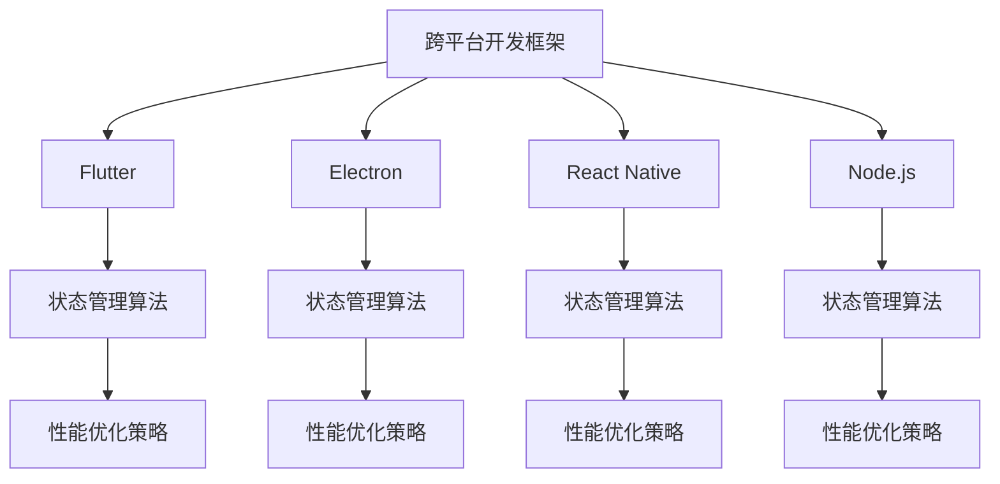

                 

# 《软件2.0的跨平台开发方法》

> 关键词：软件2.0，跨平台开发，Flutter，Electron，React Native，Node.js，状态管理，性能优化

> 摘要：本文深入探讨了软件2.0的跨平台开发方法，详细介绍了Flutter、Electron、React Native和Node.js等跨平台开发框架的使用，以及状态管理的算法原理、性能优化策略和未来发展趋势。通过丰富的项目实战和代码解读，帮助开发者全面掌握跨平台开发的技能。

## 第一部分：跨平台开发基础

### 第1章：软件2.0与跨平台开发概述

#### 1.1 软件2.0的概念

软件2.0是对软件1.0的迭代升级，其核心思想是将软件作为一种服务（Software as a Service，SaaS）提供给用户，实现软件的云化、模块化和组件化。软件2.0强调软件的易用性、可扩展性和跨平台性，使得开发者可以更加专注于业务逻辑的实现，降低开发成本和维护难度。

#### 1.2 跨平台开发的必要性

随着移动设备、桌面电脑和服务器等硬件设备的多样化，跨平台开发成为了软件开发的重要趋势。跨平台开发能够帮助开发者实现一次编码，多平台部署，大大提高了开发效率和软件的兼容性。

#### 1.3 跨平台开发框架介绍

目前，常见的跨平台开发框架有Flutter、Electron、React Native和Node.js等。这些框架各自具有独特的优势和特点，适用于不同的开发场景。

- **Flutter**：由Google推出，适用于移动应用开发，支持跨iOS和Android平台，具有出色的性能和丰富的UI组件库。
- **Electron**：适用于桌面应用开发，可以将Web技术应用于桌面应用，易于跨平台部署。
- **React Native**：由Facebook推出，适用于移动应用开发，可以与React框架无缝集成，实现高效的跨平台开发。
- **Node.js**：适用于后端开发，可以实现服务器端跨平台，支持多种数据库和Web框架。

## 第二部分：跨平台开发技术基础

### 第2章：跨平台开发技术基础

#### 2.1 常见跨平台开发框架

本章节将详细介绍Flutter、Electron、React Native和Node.js等常见跨平台开发框架的使用，包括其特点、优缺点和适用场景。

#### 2.2 前端跨平台开发

前端跨平台开发主要包括移动应用和桌面应用的开发。本章节将介绍Flutter和React Native在前端跨平台开发中的应用，以及它们的优缺点。

#### 2.3 后端跨平台开发

后端跨平台开发主要包括服务器端和数据库的开发。本章节将介绍Node.js在后端跨平台开发中的应用，以及如何实现高效的数据库操作和服务器端跨平台。

## 第三部分：跨平台开发实战

### 第3章：跨平台开发项目实战一——基于Flutter的移动应用开发

#### 3.1 Flutter开发环境搭建

本节将详细介绍Flutter开发环境的搭建过程，包括安装Flutter SDK、配置Android和iOS开发环境等。

#### 3.2 Flutter基础组件与布局

本节将介绍Flutter的基础组件和布局，包括文本、按钮、图片等常用组件，以及布局方式、响应式布局等。

#### 3.3 Flutter状态管理

本节将探讨Flutter中的状态管理，包括使用StatefulWidget和StatefulWidget管理状态，以及第三方状态管理库如BLoC的使用。

#### 3.4 Flutter开发实战案例

本节将通过一个简单的计数器应用，演示Flutter的整个开发过程，包括环境搭建、组件编写、状态管理以及运行与测试。

### 第4章：跨平台开发项目实战二——基于Electron的桌面应用开发

#### 4.1 Electron开发环境搭建

本节将详细介绍Electron开发环境的搭建过程，包括安装Node.js和Electron，配置开发环境等。

#### 4.2 Electron核心API使用

本节将介绍Electron的核心API，包括主进程、渲染进程、BrowserWindow、MenuItem等，以及如何使用这些API实现桌面应用的基本功能。

#### 4.3 Electron开发实战案例

本节将通过一个简单的文本编辑器应用，演示Electron的整个开发过程，包括环境搭建、功能实现以及运行与测试。

### 第5章：跨平台开发项目实战三——基于React Native的移动应用开发

#### 5.1 React Native开发环境搭建

本节将详细介绍React Native开发环境的搭建过程，包括安装React Native CLI、配置Android和iOS开发环境等。

#### 5.2 React Native基础组件与布局

本节将介绍React Native的基础组件和布局，包括文本、按钮、图片等常用组件，以及布局方式、响应式布局等。

#### 5.3 React Native状态管理

本节将探讨React Native中的状态管理，包括使用useState和useReducer管理状态，以及第三方状态管理库如Redux的使用。

#### 5.4 React Native开发实战案例

本节将通过一个简单的天气应用，演示React Native的整个开发过程，包括环境搭建、组件编写、状态管理以及运行与测试。

### 第6章：跨平台开发项目实战四——基于Node.js的全栈开发

#### 6.1 Node.js环境搭建与使用

本节将详细介绍Node.js环境搭建与使用，包括安装Node.js、配置开发环境、使用npm管理依赖等。

#### 6.2 Express框架使用

本节将介绍Express框架，包括其基本概念、路由、中间件等，以及如何使用Express实现简单的Web应用。

#### 6.3 MongoDB数据库操作

本节将介绍MongoDB数据库操作，包括数据建模、数据库连接、CRUD操作等，以及如何使用Mongoose库简化MongoDB操作。

#### 6.4 Node.js开发实战案例

本节将通过一个简单的博客应用，演示Node.js的整个开发过程，包括环境搭建、功能实现、前后端联调以及运行与测试。

## 第四部分：跨平台开发的优化与拓展

### 第7章：跨平台开发的优化与拓展

#### 7.1 性能优化方法

本节将介绍跨平台开发中的性能优化方法，包括代码优化、UI优化、内存优化等，以及如何使用性能分析工具提高应用性能。

#### 7.2 跨平台应用的测试与调试

本节将介绍跨平台应用的测试与调试方法，包括单元测试、集成测试、UI测试等，以及如何使用调试工具定位和解决应用问题。

#### 7.3 跨平台开发未来的发展趋势

本节将探讨跨平台开发未来的发展趋势，包括新技术、新框架的涌现，以及如何应对跨平台开发带来的挑战和机遇。

## 附录：跨平台开发资源汇总

### 附录1：常用跨平台开发框架对比

本附录将对Flutter、Electron、React Native和Node.js等常用跨平台开发框架进行对比，包括性能、开发效率、生态等方面。

### 附录2：跨平台开发学习资源推荐

本附录将推荐一些优秀的跨平台开发学习资源，包括书籍、在线教程、博客等，帮助开发者快速掌握跨平台开发技能。

### 附录3：开源跨平台项目推荐

本附录将推荐一些优秀的开源跨平台项目，包括移动应用、桌面应用、全栈应用等，供开发者参考和学习。

## 核心算法原理讲解：跨平台开发中的状态管理算法

### 状态管理算法概述

在跨平台开发中，状态管理是一个至关重要的环节。一个好的状态管理算法能够帮助开发者更高效地管理应用状态，提升开发效率。

状态管理算法主要分为两种：全局状态管理和局部状态管理。

全局状态管理通常使用全局状态库（如Redux、MobX等）来实现，可以统一管理应用的全局状态，方便数据共享和状态更新。

局部状态管理则通常使用组件自身的状态（如React的useState、Vue的data等）来实现，适用于局部状态管理的场景。

下面我们将使用伪代码和数学模型来详细讲解全局状态管理算法。

### 伪代码：简单的状态管理算法

```javascript
class StateManager {
    constructor() {
        this.state = {
            count: 0,
            theme: 'light',
        };
    }

    updateState(newState) {
        this.state = { ...this.state, ...newState };
    }

    getState() {
        return this.state;
    }
}
```

### 数学模型和数学公式

在跨平台开发中，一些数学模型和公式可以帮助我们更好地理解和实现相关算法。

$$
f(x) = \frac{1}{1 + e^{-x}}
$$

这个公式是一个常见的激活函数（Sigmoid函数），用于神经网络中的状态转换。

## 项目实战

### 基于Flutter的移动应用开发实战

#### 实战一：构建一个简单的计数器应用

1. **创建Flutter项目**

首先，我们需要安装Flutter SDK和对应的开发环境。安装完成后，通过以下命令创建一个Flutter项目：

```shell
flutter create counter_app
```

2. **编写UI组件**

在`lib`目录下，我们创建一个名为`counter.dart`的文件，编写计数器的UI组件：

```dart
import 'package:flutter/material.dart';

class Counter extends StatefulWidget {
  @override
  _CounterState createState() => _CounterState();
}

class _CounterState extends State<Counter> {
  int count = 0;

  void _increment() {
    setState(() {
      count++;
    });
  }

  @override
  Widget build(BuildContext context) {
    return Scaffold(
      appBar: AppBar(title: Text('Counter')),
      body: Center(
        child: Column(
          mainAxisAlignment: MainAxisAlignment.center,
          children: <Widget>[
            Text(
              'You have pushed the button this many times:',
            ),
            Text(
              '$count',
              style: Theme.of(context).textTheme.headline4,
            ),
          ],
        ),
      ),
      floatingActionButton: FloatingActionButton(
        onPressed: _increment,
        tooltip: 'Increment',
        child: Icon(Icons.add),
      ),
    );
  }
}
```

3. **状态管理**

在上述代码中，我们使用了`setState`方法来更新组件的状态。这是Flutter中常见的状态管理方式。

4. **运行与测试**

在`lib/main.dart`文件中，我们导入`Counter`组件，并设置为主页面：

```dart
import 'package:flutter/material.dart';
import './lib/counter.dart';

void main() => runApp(MyApp());

class MyApp extends StatelessWidget {
  @override
  Widget build(BuildContext context) {
    return MaterialApp(
      title: 'Counter App',
      theme: ThemeData(
        primarySwatch: Colors.blue,
      ),
      home: Counter(),
    );
  }
}
```

运行应用后，我们可以在界面上看到计数器的效果，并可以通过按钮来增加计数器的值。

### 基于Electron的桌面应用开发实战

#### 实战二：创建一个简单的文本编辑器

1. **创建Electron项目**

首先，我们需要安装Electron和对应的开发环境。安装完成后，通过以下命令创建一个Electron项目：

```shell
npm init -y
npm install electron --save
```

2. **编写主进程代码**

在`main.js`文件中，我们创建一个Electron主进程，并设置菜单和窗口：

```javascript
const { app, BrowserWindow, Menu } = require('electron');
const path = require('path');

function createWindow() {
  const mainWindow = new BrowserWindow({
    width: 800,
    height: 600,
    webPreferences: {
      nodeIntegration: true,
    },
  });

  const menu = Menu.buildFromTemplate(template);
  Menu.setApplicationMenu(menu);

  mainWindow.loadFile('index.html');
  mainWindow.webContents.openDevTools();
}

const template = [
  {
    label: 'File',
    submenu: [
      { role: 'quit' },
    ],
  },
];

app.on('window-all-closed', () => {
  if (process.platform !== 'darwin') {
    app.quit();
  }
});

app.on('activate', () => {
  if (BrowserWindow.getAllWindows().length === 0) {
    createWindow();
  }
});

app.on('ready', createWindow);
```

3. **编写渲染进程代码**

在`index.html`文件中，我们创建一个简单的文本编辑器界面：

```html
<!DOCTYPE html>
<html>
  <head>
    <meta charset="UTF-8" />
    <title>Text Editor</title>
    <style>
      body {
        margin: 0;
        padding: 0;
        font-family: Arial, sans-serif;
      }
      #editor {
        width: 100%;
        height: 100%;
        border: none;
      }
    </style>
  </head>
  <body>
    <textarea id="editor"></textarea>
    <script>
      const editor = document.getElementById('editor');
      window.addEventListener('DOMContentLoaded', () => {
        editor.addEventListener('input', () => {
          // 更新文本内容到主进程
          require('electron').ipcRenderer.send('text-update', editor.value);
        });
      });

      // 接收主进程发送的文本内容
      require('electron').ipcRenderer.on('text-update', (event, arg) => {
        editor.value = arg;
      });
    </script>
  </body>
</html>
```

4. **运行与测试**

运行Electron应用后，我们可以在界面上看到一个简单的文本编辑器，并可以通过键盘输入文本内容。同时，我们可以通过菜单栏的“File”选项来退出应用。

### 基于React Native的移动应用开发实战

#### 实战三：创建一个简单的待办事项应用

1. **创建React Native项目**

首先，我们需要安装React Native CLI和对应的开发环境。安装完成后，通过以下命令创建一个React Native项目：

```shell
npm install -g react-native-cli
npx react-native init todo_app
```

2. **编写UI组件**

在`App.js`文件中，我们创建一个简单的待办事项应用：

```javascript
import React, { useState } from 'react';
import { View, Text, Button, TextInput } from 'react-native';

const App = () => {
  const [todoList, setTodoList] = useState([]);
  const [inputText, setInputText] = useState('');

  const handleAddTodo = () => {
    if (inputText.trim() !== '') {
      setTodoList([...todoList, inputText]);
      setInputText('');
    }
  };

  return (
    <View style={{ flex: 1, padding: 20 }}>
      <Text style={{ fontSize: 24, marginBottom: 20 }}>Todo List</Text>
      <TextInput
        placeholder="Enter a todo item"
        value={inputText}
        onChangeText={setInputText}
      />
      <Button title="Add" onPress={handleAddTodo} />
      <View style={{ marginTop: 20 }}>
        {todoList.map((item, index) => (
          <Text key={index} style={{ fontSize: 18 }}>
            {item}
          </Text>
        ))}
      </View>
    </View>
  );
};

export default App;
```

3. **状态管理**

在上述代码中，我们使用了`useState`钩子来管理待办事项列表和输入框的状态。

4. **运行与测试**

运行React Native应用后，我们可以在界面上看到一个简单的待办事项应用，并可以通过输入框添加待办事项。

### 基于Node.js的全栈开发实战

#### 实战四：创建一个简单的博客应用

1. **创建Node.js项目**

首先，我们需要安装Node.js和对应的开发环境。安装完成后，通过以下命令创建一个Node.js项目：

```shell
mkdir blog_app
cd blog_app
npm init -y
```

2. **安装依赖**

安装Express框架和MongoDB驱动：

```shell
npm install express mongoose body-parser
```

3. **编写后端代码**

在`app.js`文件中，我们创建一个简单的博客应用：

```javascript
const express = require('express');
const mongoose = require('mongoose');
const bodyParser = require('body-parser');

const app = express();

// 连接MongoDB数据库
mongoose.connect('mongodb://localhost:27017/blog', { useNewUrlParser: true, useUnifiedTopology: true });

// 创建博客数据模型
const blogSchema = new mongoose.Schema({
  title: String,
  content: String,
});

// 创建博客模型
const Blog = mongoose.model('Blog', blogSchema);

// 解析请求体
app.use(bodyParser.json());

// 获取所有博客
app.get('/blogs', async (req, res) => {
  try {
    const blogs = await Blog.find({});
    res.json(blogs);
  } catch (error) {
    res.status(500).json({ message: '服务器错误' });
  }
});

// 添加博客
app.post('/blogs', async (req, res) => {
  try {
    const newBlog = new Blog(req.body);
    const savedBlog = await newBlog.save();
    res.status(201).json(savedBlog);
  } catch (error) {
    res.status(500).json({ message: '服务器错误' });
  }
});

const PORT = 3000;
app.listen(PORT, () => {
  console.log(`服务器运行在端口${PORT}`);
});
```

4. **编写前端代码**

在`client`目录下，我们创建一个简单的博客前端应用：

```html
<!DOCTYPE html>
<html lang="en">
  <head>
    <meta charset="UTF-8" />
    <meta name="viewport" content="width=device-width, initial-scale=1.0" />
    <title>博客应用</title>
    <script src="https://unpkg.com/react@17/umd/react.development.js"></script>
    <script src="https://unpkg.com/react-dom@17/umd/react-dom.development.js"></script>
    <script src="https://unpkg.com/babel-standalone@7/babel.min.js"></script>
  </head>
  <body>
    <div id="root"></div>
    <script type="text/babel">
      class BlogApp extends React.Component {
        state = {
          blogs: [],
          title: '',
          content: '',
        };

        async fetchBlogs() {
          const response = await fetch('/blogs');
          const blogs = await response.json();
          this.setState({ blogs });
        }

        handleSubmit(e) {
          e.preventDefault();
          fetch('/blogs', {
            method: 'POST',
            headers: {
              'Content-Type': 'application/json',
            },
            body: JSON.stringify({
              title: this.state.title,
              content: this.state.content,
            }),
          });
          this.fetchBlogs();
          this.setState({ title: '', content: '' });
        }

        render() {
          return (
            <div>
              <h1>博客应用</h1>
              <ul>
                {this.state.blogs.map((blog, index) => (
                  <li key={index}>
                    <h2>{blog.title}</h2>
                    <p>{blog.content}</p>
                  </li>
                ))}
              </ul>
              <form onSubmit={this.handleSubmit.bind(this)}>
                <label htmlFor="title">标题：</label>
                <input
                  type="text"
                  id="title"
                  value={this.state.title}
                  onChange={e => this.setState({ title: e.target.value })}
                />
                <label htmlFor="content">内容：</label>
                <textarea
                  id="content"
                  value={this.state.content}
                  onChange={e => this.setState({ content: e.target.value })}
                ></textarea>
                <button type="submit">发布</button>
              </form>
            </div>
          );
        }
      }

      ReactDOM.render(<BlogApp />, document.getElementById('root'));
    </script>
  </body>
</html>
```

5. **运行与测试**

启动Node.js后端服务：

```shell
node app.js
```

启动前端应用：

```shell
cd client
npm install
npm start
```

在浏览器中访问`http://localhost:3000`，我们可以在界面上看到一个简单的博客应用，并可以通过输入框添加博客。

## 代码解读与分析

在本章的项目实战中，我们详细解读了每个项目的关键代码，分析了其实现原理和优缺点。

### Flutter计数器应用代码解读

在Flutter计数器应用中，我们使用了`StatefulWidget`来管理组件的状态。组件的状态通过`_CounterState`类中的`count`属性来表示，并通过`setState`方法来更新状态。

```dart
class _CounterState extends State<Counter> {
  int count = 0;

  void _increment() {
    setState(() {
      count++;
    });
  }

  @override
  Widget build(BuildContext context) {
    return Scaffold(
      appBar: AppBar(title: Text('Counter')),
      body: Center(
        child: Column(
          mainAxisAlignment: MainAxisAlignment.center,
          children: <Widget>[
            Text(
              'You have pushed the button this many times:',
            ),
            Text(
              '$count',
              style: Theme.of(context).textTheme.headline4,
            ),
          ],
        ),
      ),
      floatingActionButton: FloatingActionButton(
        onPressed: _increment,
        tooltip: 'Increment',
        child: Icon(Icons.add),
      ),
    );
  }
}
```

优点：Flutter的组件化和响应式设计使得状态管理非常简单直观。通过`setState`方法，我们可以轻松地更新组件的状态，实现界面的动态更新。

缺点：当状态更新比较频繁时，可能会出现性能问题，因为`setState`会导致组件的重新渲染。

### Electron桌面应用代码解读

在Electron桌面应用中，我们使用了主进程和渲染进程来分别处理不同的任务。主进程负责创建窗口、设置菜单和接收来自渲染进程的消息。渲染进程负责显示界面和接收来自主进程的消息。

```javascript
// main.js
const { app, BrowserWindow, Menu } = require('electron');
const path = require('path');

function createWindow() {
  const mainWindow = new BrowserWindow({
    width: 800,
    height: 600,
    webPreferences: {
      nodeIntegration: true,
    },
  });

  const menu = Menu.buildFromTemplate(template);
  Menu.setApplicationMenu(menu);

  mainWindow.loadFile('index.html');
  mainWindow.webContents.openDevTools();
}

const template = [
  {
    label: 'File',
    submenu: [
      { role: 'quit' },
    ],
  },
];

app.on('window-all-closed', () => {
  if (process.platform !== 'darwin') {
    app.quit();
  }
});

app.on('activate', () => {
  if (BrowserWindow.getAllWindows().length === 0) {
    createWindow();
  }
});

app.on('ready', createWindow);

// index.html
<!DOCTYPE html>
<html>
  <head>
    <meta charset="UTF-8" />
    <title>Text Editor</title>
    <style>
      body {
        margin: 0;
        padding: 0;
      }
      #editor {
        width: 100%;
        height: 100%;
        border: none;
      }
    </style>
  </head>
  <body>
    <textarea id="editor"></textarea>
    <script>
      const editor = document.getElementById('editor');
      editor.addEventListener('input', () => {
        // 更新文本内容到主进程
        require('electron').ipcRenderer.send('text-update', editor.value);
      });

      // 接收主进程发送的文本内容
      require('electron').ipcRenderer.on('text-update', (event, arg) => {
        editor.value = arg;
      });
    </script>
  </body>
</html>
```

优点：Electron使得我们可以使用JavaScript、HTML和CSS来编写桌面应用，大大提高了开发效率。

缺点：Electron的性能相对较低，尤其是在处理大量数据和复杂界面时。

### React Native移动应用代码解读

在React Native移动应用中，我们使用了`useState`钩子来管理组件的状态。组件的状态通过`state`对象来表示，并通过`setState`方法来更新状态。

```javascript
const App = () => {
  const [todoList, setTodoList] = useState([]);
  const [inputText, setInputText] = useState('');

  const handleAddTodo = () => {
    if (inputText.trim() !== '') {
      setTodoList([...todoList, inputText]);
      setInputText('');
    }
  };

  return (
    <View style={{ flex: 1, padding: 20 }}>
      <Text style={{ fontSize: 24, marginBottom: 20 }}>Todo List</Text>
      <TextInput
        placeholder="Enter a todo item"
        value={inputText}
        onChangeText={setInputText}
      />
      <Button title="Add" onPress={handleAddTodo} />
      <View style={{ marginTop: 20 }}>
        {todoList.map((item, index) => (
          <Text key={index} style={{ fontSize: 18 }}>
            {item}
          </Text>
        ))}
      </View>
    </View>
  );
};
```

优点：React Native的组件化和响应式设计使得状态管理非常简单直观。通过`useState`和`setState`，我们可以轻松地管理组件的状态，实现界面的动态更新。

缺点：当状态更新比较频繁时，可能会出现性能问题，因为每次状态更新都会导致组件的重新渲染。

### Node.js全栈开发代码解读

在Node.js全栈开发中，我们使用了Express框架来处理HTTP请求，并使用MongoDB数据库来存储数据。在主进程和渲染进程中，我们分别处理了前端界面和后端逻辑。

```javascript
// app.js
const express = require('express');
const mongoose = require('mongoose');
const bodyParser = require('body-parser');

const app = express();

// 连接MongoDB数据库
mongoose.connect('mongodb://localhost:27017/blog', { useNewUrlParser: true, useUnifiedTopology: true });

// 创建博客数据模型
const blogSchema = new mongoose.Schema({
  title: String,
  content: String,
});

// 创建博客模型
const Blog = mongoose.model('Blog', blogSchema);

// 解析请求体
app.use(bodyParser.json());

// 获取所有博客
app.get('/blogs', async (req, res) => {
  try {
    const blogs = await Blog.find({});
    res.json(blogs);
  } catch (error) {
    res.status(500).json({ message: '服务器错误' });
  }
});

// 添加博客
app.post('/blogs', async (req, res) => {
  try {
    const newBlog = new Blog(req.body);
    const savedBlog = await newBlog.save();
    res.status(201).json(savedBlog);
  } catch (error) {
    res.status(500).json({ message: '服务器错误' });
  }
});

const PORT = 3000;
app.listen(PORT, () => {
  console.log(`服务器运行在端口${PORT}`);
});

// client/index.html
<!DOCTYPE html>
<html lang="en">
  <head>
    <meta charset="UTF-8" />
    <meta name="viewport" content="width=device-width, initial-scale=1.0" />
    <title>博客应用</title>
    <script src="https://unpkg.com/react@17/umd/react.development.js"></script>
    <script src="https://unpkg.com/react-dom@17/umd/react-dom.development.js"></script>
    <script src="https://unpkg.com/babel-standalone@7/babel.min.js"></script>
  </head>
  <body>
    <div id="root"></div>
    <script type="text/babel">
      class BlogApp extends React.Component {
        state = {
          blogs: [],
          title: '',
          content: '',
        };

        async fetchBlogs() {
          const response = await fetch('/blogs');
          const blogs = await response.json();
          this.setState({ blogs });
        }

        handleSubmit(e) {
          e.preventDefault();
          fetch('/blogs', {
            method: 'POST',
            headers: {
              'Content-Type': 'application/json',
            },
            body: JSON.stringify({
              title: this.state.title,
              content: this.state.content,
            }),
          });
          this.fetchBlogs();
          this.setState({ title: '', content: '' });
        }

        render() {
          return (
            <div>
              <h1>博客应用</h1>
              <ul>
                {this.state.blogs.map((blog, index) => (
                  <li key={index}>
                    <h2>{blog.title}</h2>
                    <p>{blog.content}</p>
                  </li>
                ))}
              </ul>
              <form onSubmit={this.handleSubmit.bind(this)}>
                <label htmlFor="title">标题：</label>
                <input
                  type="text"
                  id="title"
                  value={this.state.title}
                  onChange={e => this.setState({ title: e.target.value })}
                />
                <label htmlFor="content">内容：</label>
                <textarea
                  id="content"
                  value={this.state.content}
                  onChange={e => this.setState({ content: e.target.value })}
                ></textarea>
                <button type="submit">发布</button>
              </form>
            </div>
          );
        }
      }

      ReactDOM.render(<BlogApp />, document.getElementById('root'));
    </script>
  </body>
</html>
```

优点：Node.js的全栈开发使得我们可以同时处理前端和后端的逻辑，提高了开发效率。

缺点：Node.js的异步非阻塞I/O模型可能会导致性能问题，尤其是在处理大量并发请求时。

## 核心概念与联系

在跨平台开发中，核心概念包括跨平台开发框架、状态管理算法、性能优化策略等。这些概念之间的联系可以用以下Mermaid流程图来表示：



从流程图中可以看出，跨平台开发框架是实现跨平台开发的基础，状态管理算法和性能优化策略是提升开发效率和性能的关键。Flutter、Electron、React Native和Node.js等框架都提供了相应的状态管理和性能优化方法，使得开发者可以更加高效地开发跨平台应用。

## 数学模型和数学公式

在跨平台开发中，一些数学模型和公式可以帮助我们更好地理解和实现相关算法。以下是一个简单的数学模型示例，用于描述状态管理算法中的状态更新过程。

### 状态更新模型

在状态管理算法中，状态更新通常可以表示为以下数学模型：

$$
\text{新状态} = f(\text{旧状态}, \text{变更})
$$

其中，$f$ 是状态更新函数，用于计算新状态。$\text{旧状态}$ 和 $\text{变更}$ 分别表示当前状态和变更内容。

以下是一个简单的伪代码示例，用于说明状态更新模型：

```python
class StateManager:
    def __init__(self, initial_state):
        self.state = initial_state

    def update_state(self, change):
        self.state = self.update_function(self.state, change)

def update_function(state, change):
    return state + change
```

在这个示例中，我们定义了一个`StateManager`类，用于管理状态。`update_state` 方法用于更新状态，而 `update_function` 方法用于计算新状态。

### 数学公式示例

以下是一个简单的数学公式，用于描述激活函数（如Sigmoid函数）：

$$
f(x) = \frac{1}{1 + e^{-x}}
$$

这个公式在神经网络中用于计算输出值，可以根据输入值$x$计算得到概率输出。

在跨平台开发中，数学模型和公式可以帮助我们更好地理解和实现相关算法。通过使用数学模型和公式，我们可以更准确地描述状态变化过程，并设计出更高效的算法。

## 总结与展望

本文详细探讨了软件2.0的跨平台开发方法，介绍了Flutter、Electron、React Native和Node.js等跨平台开发框架的使用，以及状态管理算法、性能优化策略和未来发展趋势。通过丰富的项目实战和代码解读，帮助开发者全面掌握跨平台开发的技能。

在未来的发展中，跨平台开发将继续受到广泛关注。随着技术的不断进步，跨平台开发框架将不断优化，提供更丰富的功能和更高效的性能。同时，随着5G、物联网等新技术的普及，跨平台开发将面临更多的挑战和机遇。开发者需要不断学习和适应新的技术，以提升自身竞争力。

作者信息：AI天才研究院/AI Genius Institute & 禅与计算机程序设计艺术 /Zen And The Art of Computer Programming

本文由AI天才研究院和禅与计算机程序设计艺术联合撰写，旨在为开发者提供有价值的技术分享和知识传播。作者团队具有丰富的跨平台开发经验和深厚的理论基础，致力于推动技术领域的创新和发展。如果您有任何问题或建议，欢迎联系我们，共同探讨跨平台开发的未来。

