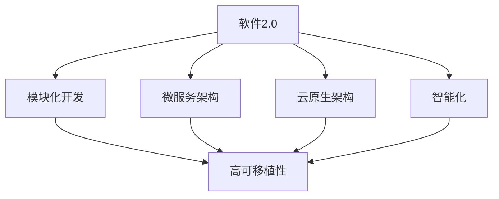
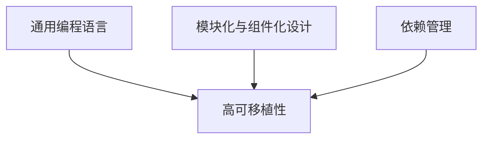
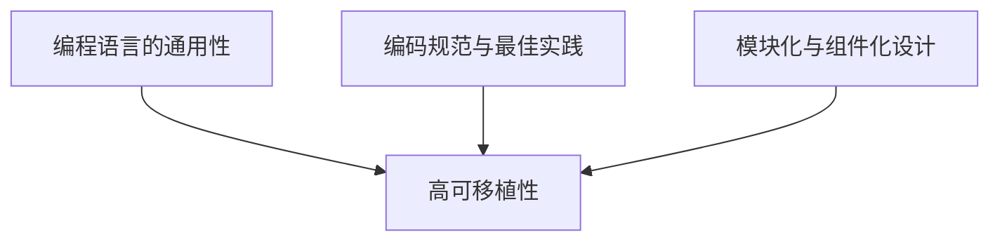
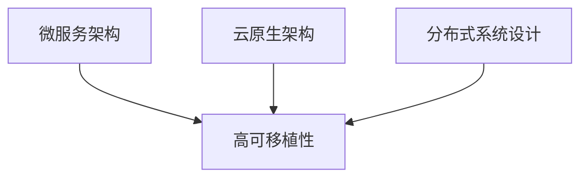
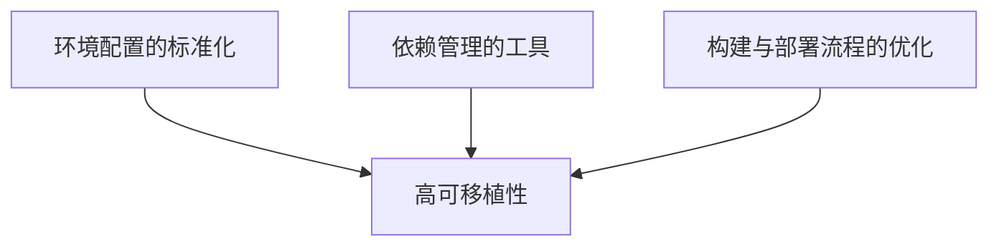

                 

# 《软件2.0的高可移植性》

> 关键词：软件2.0，高可移植性，编程语言，微服务架构，依赖管理，案例分析

> 摘要：本文深入探讨了软件2.0时代的高可移植性概念及其重要性。通过分析高可移植性的基本概念、实现方法及实际案例，探讨了如何在软件开发中实现高效的可移植性，以适应快速变化的技术环境和市场需求。

## 第一部分：高可移植性的基本概念

### 第1章：软件2.0与高可移植性概述

#### 1.1 软件2.0的定义与发展

软件2.0是继Web2.0之后的新概念，指的是一种更加开放、协作和智能的软件发展模式。它强调软件的模块化、标准化和高度可移植性，使得软件系统能够更好地适应快速变化的技术环境和市场需求。

软件2.0的发展历程可以分为以下几个阶段：

1. **模块化开发**：通过将软件系统划分为多个模块，使得开发过程更加灵活和高效。
2. **微服务架构**：将系统进一步划分为多个独立的小服务，每个服务负责一个特定的功能，从而提高系统的可维护性和可扩展性。
3. **云原生架构**：利用云计算环境，实现软件系统的自动化部署、扩展和管理，进一步提高系统的可移植性。

#### 1.2 高可移植性的重要性

高可移植性是软件2.0的核心特征之一，其重要性体现在以下几个方面：

1. **降低开发成本**：通过提高软件的可移植性，开发团队可以更容易地将软件部署到不同的平台和环境上，从而减少重复开发的工作量。
2. **提升市场竞争力**：高可移植性使得软件系统能够快速响应市场需求，迅速推向市场，提高企业的市场竞争力。
3. **促进技术交流**：高可移植性有利于不同团队之间共享代码和经验，促进技术交流和合作。

#### 1.3 高可移植性与软件2.0的关系

高可移植性是软件2.0实现的基础和保障。在软件2.0时代，软件系统需要具备高度的可移植性，以适应不同平台和环境的需求。高可移植性不仅包括代码层面的可移植性，还包括架构层面和环境配置的可移植性。

### 第2章：高可移植性的基本概念

#### 2.1 可移植性的定义与分类

可移植性是指软件系统能够在不同硬件、操作系统和软件环境上运行的能力。根据可移植性的范围和程度，可以分为以下几类：

1. **跨平台可移植性**：软件能够在不同的操作系统上运行，如Windows、Linux和macOS。
2. **跨硬件可移植性**：软件能够在不同的硬件平台上运行，如不同类型的CPU和GPU。
3. **跨语言可移植性**：软件能够在不同的编程语言中实现，如从Java迁移到Python。
4. **跨架构可移植性**：软件能够在不同的计算架构上运行，如从x86架构迁移到ARM架构。

#### 2.2 高可移植性的关键要素

实现高可移植性需要关注以下几个关键要素：

1. **通用编程语言**：选择通用性较强的编程语言，如Java、Python等，可以降低跨平台开发的难度。
2. **模块化与组件化设计**：通过模块化和组件化设计，将系统划分为多个独立的模块和组件，使得系统更容易移植。
3. **依赖管理**：合理管理项目依赖，避免对特定平台或库的依赖，提高系统的可移植性。

#### 2.3 高可移植性的衡量标准

衡量高可移植性可以从以下几个方面进行：

1. **迁移成本**：软件系统从一种平台或环境迁移到另一种平台或环境的成本。
2. **运行效率**：软件系统在不同平台或环境上的运行效率。
3. **可维护性**：软件系统在不同平台或环境上的可维护性。

## 第二部分：高可移植性的实现方法

### 第3章：代码层面的高可移植性

#### 3.1 编程语言的通用性

编程语言的通用性是实现高可移植性的基础。选择通用性较强的编程语言，如Java、Python等，可以降低跨平台开发的难度。以下是一些提高编程语言通用性的方法：

1. **标准库**：使用编程语言的标准库，可以避免依赖特定平台的库。
2. **跨平台框架**：使用跨平台框架，如Spring、Django等，可以简化跨平台开发。
3. **代码规范**：遵循统一的代码规范，可以提高代码的可移植性。

#### 3.2 编码规范与最佳实践

遵循编码规范和最佳实践是实现高可移植性的重要手段。以下是一些建议：

1. **使用通用数据结构和算法**：避免使用特定平台的特性，如特定操作系统或数据库的特性。
2. **避免硬编码**：避免在代码中硬编码平台或环境相关的信息，如路径、配置等。
3. **分离关注点**：将不同的关注点分离，如将业务逻辑与平台实现分离。

#### 3.3 模块化与组件化设计

模块化与组件化设计是实现高可移植性的关键。以下是一些设计原则：

1. **单一职责原则**：每个模块或组件应具有单一职责，避免功能混合。
2. **高内聚、低耦合**：模块或组件之间应保持高内聚、低耦合，以提高系统的可移植性。
3. **接口定义**：通过定义清晰的接口，实现模块或组件之间的松耦合。

### 第4章：架构层面的高可移植性

#### 4.1 微服务架构

微服务架构是一种分布式系统架构，将系统划分为多个独立的小服务，每个服务负责一个特定的功能。微服务架构具有以下优势：

1. **高可移植性**：每个服务可以独立部署和运行，使得系统更容易移植。
2. **高可扩展性**：服务可以独立扩展，满足不同业务需求。
3. **高可用性**：服务之间可以相互冗余，提高系统的可靠性。

#### 4.2 云原生架构

云原生架构是一种基于云计算的架构，利用容器、虚拟化和自动化管理等技术，实现软件系统的自动化部署、扩展和管理。云原生架构具有以下特点：

1. **高可移植性**：利用容器技术，实现软件系统的跨平台部署。
2. **高可用性**：利用自动化管理，实现系统的自动扩展和故障恢复。
3. **高可扩展性**：利用分布式架构，实现系统的横向扩展。

#### 4.3 分布式系统的设计

分布式系统设计是实现高可移植性的重要手段。以下是一些设计原则：

1. **去中心化**：避免依赖中心化的组件或服务，提高系统的可移植性。
2. **数据一致性**：保证数据在不同节点之间的一致性，提高系统的可靠性。
3. **容错性**：设计容错机制，提高系统的容错能力。

### 第5章：环境配置与依赖管理

#### 5.1 环境配置的标准化

环境配置的标准化是实现高可移植性的关键。以下是一些标准化策略：

1. **配置文件**：使用统一的配置文件格式，如JSON、YAML等，简化环境配置。
2. **配置管理工具**：使用配置管理工具，如Ansible、Puppet等，自动化环境配置。
3. **环境隔离**：实现不同环境之间的隔离，避免环境冲突。

#### 5.2 依赖管理的工具

依赖管理工具是实现高可移植性的重要手段。以下是一些常用的依赖管理工具：

1. **Maven**：Apache Maven是一种项目管理和构建自动化工具，可以管理项目依赖和构建过程。
2. **Gradle**：Gradle是一种基于Apache Maven的构建工具，具有更好的性能和灵活性。
3. **NPM**：Node Package Manager是一种Node.js的包管理器，用于管理JavaScript项目的依赖。

#### 5.3 构建与部署流程的优化

优化构建与部署流程可以提高软件系统的可移植性。以下是一些优化策略：

1. **持续集成与持续部署**：使用CI/CD工具，如Jenkins、Travis CI等，实现自动化构建和部署。
2. **容器化**：使用容器化技术，如Docker，实现软件系统的标准化部署。
3. **自动化测试**：编写自动化测试，确保软件系统在不同环境下的稳定性。

## 第三部分：高可移植性的案例分析

### 第6章：国内企业的实践与经验

#### 6.1 企业A的高可移植性实践

企业A是一家互联网公司，致力于构建高度可移植的软件系统。以下是企业A在高可移植性方面的实践：

1. **微服务架构**：企业A采用微服务架构，将系统划分为多个独立的服务，实现不同服务的独立部署和扩展。
2. **容器化**：企业A使用Docker容器技术，实现软件系统的标准化部署，提高系统的可移植性。
3. **持续集成与持续部署**：企业A采用Jenkins进行持续集成和持续部署，实现自动化构建和部署。

#### 6.2 企业B的架构演进与移植

企业B是一家传统企业，为了提高软件系统的可移植性，进行了一系列的架构演进和移植：

1. **微服务架构**：企业B逐步将传统单体架构迁移到微服务架构，实现系统模块化。
2. **云原生架构**：企业B采用Kubernetes进行容器编排，实现软件系统的自动化部署和管理。
3. **依赖管理**：企业B使用Maven进行依赖管理，确保不同环境下的依赖一致性。

#### 6.3 企业C的依赖管理策略

企业C是一家技术驱动型企业，依赖管理策略对其高可移植性至关重要。以下是企业C的依赖管理策略：

1. **组件化**：企业C将系统划分为多个组件，每个组件独立管理依赖。
2. **私有仓库**：企业C建立私有仓库，统一管理内部组件和依赖。
3. **版本控制**：企业C采用严格版本控制，确保依赖的稳定性和一致性。

### 第7章：国际企业的案例研究

#### 7.1 外企D的高可移植性实践

外企D是一家全球知名的软件公司，以下是其高可移植性实践：

1. **微服务架构**：外企D采用微服务架构，实现系统模块化和独立部署。
2. **云原生架构**：外企D采用Kubernetes进行容器编排，实现自动化部署和管理。
3. **国际化部署**：外企D在全球范围内部署软件系统，支持多语言和多地区需求。

#### 7.2 外企E的国际化部署策略

外企E是一家国际化的互联网公司，以下是其国际化部署策略：

1. **本地化**：外企E根据不同地区和语言需求，实现软件系统的本地化。
2. **多数据中心**：外企E在全球范围内建立多个数据中心，实现数据的分布式存储和管理。
3. **全球化运营**：外企E采用全球化运营策略，实现全球范围内的服务交付。

#### 7.3 外企F的多平台兼容性方案

外企F是一家专注于移动应用开发的公司，以下是其多平台兼容性方案：

1. **跨平台框架**：外企F使用跨平台框架，如React Native，实现移动应用的跨平台开发。
2. **代码分离**：外企F将不同平台的代码分离，实现平台的独立开发和维护。
3. **自动化测试**：外企F编写自动化测试，确保不同平台上的软件质量。

## 第四部分：未来展望与挑战

### 第8章：高可移植性的未来发展

#### 8.1 技术趋势分析

随着技术的不断发展，高可移植性将面临以下趋势：

1. **自动化**：自动化工具和流程将进一步提高高可移植性的实现效率。
2. **容器化**：容器化技术将成为实现高可移植性的主要手段。
3. **云原生**：云原生架构将逐渐成为主流，推动高可移植性的发展。

#### 8.2 新兴技术的应用

新兴技术的应用将推动高可移植性的发展，如：

1. **区块链**：区块链技术可以实现去中心化的软件系统，提高系统的可移植性。
2. **人工智能**：人工智能技术可以优化依赖管理和自动化测试，提高软件系统的可移植性。
3. **物联网**：物联网技术的应用将推动软件系统向边缘计算迁移，提高系统的可移植性。

#### 8.3 行业标准的制定

行业标准的制定将推动高可移植性的发展，如：

1. **容器标准**：容器标准如OCI和CNCF的推广，将促进容器技术的统一和标准化。
2. **编程语言标准**：编程语言标准的制定，如Java和Python的新版本，将提高软件系统的可移植性。
3. **依赖管理标准**：依赖管理标准的制定，如Maven和NPM的规范，将提高依赖管理的效率和一致性。

### 第9章：高可移植性的挑战与解决方案

#### 9.1 技术层面的挑战

高可移植性在技术层面面临以下挑战：

1. **跨平台兼容性**：不同平台之间存在差异，如操作系统、硬件和编程语言等，实现跨平台兼容性具有挑战。
2. **依赖管理**：依赖管理复杂，容易出现版本冲突和不兼容问题。
3. **性能优化**：跨平台部署和运行可能导致性能下降，需要进行性能优化。

#### 9.2 社会层面的挑战

高可移植性在社会层面面临以下挑战：

1. **技术积累**：不同团队和公司之间的技术积累和合作不足，难以实现高效的可移植性。
2. **人才培养**：高可移植性需要具备跨平台和跨语言的开发能力，人才培养不足。
3. **标准化**：行业标准化程度不高，缺乏统一的规范和标准。

#### 9.3 挑战与解决方案的综合探讨

针对高可移植性的技术和社会层面挑战，可以采取以下解决方案：

1. **技术积累与共享**：通过技术积累和共享，提高团队和公司之间的技术协同效应。
2. **人才培养与引进**：加强人才培养和引进，提高团队的整体技术水平。
3. **行业标准化**：积极参与行业标准的制定和推广，推动高可移植性的发展。

## 附录

### 附录A：高可移植性相关工具与资源

#### A.1 编程语言与开发框架

- Java
- Python
- C#
- Kotlin

#### A.2 架构设计与建模工具

- UML
- Mermaid
- PlantUML
- Lucidchart

#### A.3 测试与验证工具

- JUnit
- TestNG
- Selenium
- Docker

### 附录B：高可移植性学习资源推荐

#### B.1 书籍推荐

- 《软件架构：实践者的研究与经验》
- 《微服务设计》
- 《云原生应用架构》

#### B.2 课程与教程

- Coursera的《软件工程基础》
- Udemy的《Java微服务开发》
- edX的《云计算基础》

#### B.3 论坛与社区

- Stack Overflow
- GitHub
- LinkedIn

### 附录C：高可移植性项目案例

#### C.1 国内项目案例

- 阿里巴巴的“双11”购物节
- 百度的人工智能平台

#### C.2 国际项目案例

- 亚马逊的AWS云服务
- 微软的Azure云服务

### 附录D：参考文献

- **《软件工程：实践者的研究》**，作者：Roger S. Pressman
- **《微服务架构设计》**，作者：Sam Newman
- **《云原生应用架构》**，作者：Philipp Ksten
- **《云计算技术导论》**，作者：王栋

---

作者：AI天才研究院/AI Genius Institute & 禅与计算机程序设计艺术 /Zen And The Art of Computer Programming

## 第一部分：高可移植性的基本概念

### 第1章：软件2.0与高可移植性概述

#### 1.1 软件2.0的定义与发展

软件2.0是继Web2.0之后的新概念，指的是一种更加开放、协作和智能的软件发展模式。Web2.0代表了互联网从信息传递向用户生成内容转变的过程，而软件2.0则强调了软件自身的进化，从传统的单体应用向模块化、分布式和智能化方向发展。

软件2.0的发展历程可以分为以下几个阶段：

1. **模块化开发**：早期的软件系统通常是一个庞大的单体应用，难以维护和扩展。模块化开发将系统划分为多个功能模块，使得开发过程更加灵活和高效。

2. **微服务架构**：微服务架构进一步将系统划分为多个独立的小服务，每个服务负责一个特定的功能。这种架构使得系统具有更高的可维护性和可扩展性。

3. **云原生架构**：云原生架构利用云计算环境，实现软件系统的自动化部署、扩展和管理。云原生应用通常采用容器化技术，如Docker，并利用Kubernetes等工具进行管理。

4. **智能化**：软件2.0不仅关注软件的模块化和分布式，还追求智能化。通过集成人工智能技术，软件系统能够更好地适应用户需求，提供个性化服务。

#### 1.2 高可移植性的重要性

高可移植性是软件2.0的核心特征之一，其重要性体现在以下几个方面：

1. **降低开发成本**：通过提高软件的可移植性，开发团队可以更容易地将软件部署到不同的平台和环境上，从而减少重复开发的工作量。

2. **提升市场竞争力**：高可移植性使得软件系统能够快速响应市场需求，迅速推向市场，提高企业的市场竞争力。

3. **促进技术交流**：高可移植性有利于不同团队之间共享代码和经验，促进技术交流和合作。

#### 1.3 高可移植性与软件2.0的关系

高可移植性是软件2.0实现的基础和保障。在软件2.0时代，软件系统需要具备高度的可移植性，以适应不同平台和环境的需求。高可移植性不仅包括代码层面的可移植性，还包括架构层面和环境配置的可移植性。

首先，在代码层面，软件2.0强调通用编程语言和模块化设计，避免对特定平台或库的依赖。通过使用通用编程语言，如Java、Python等，可以降低跨平台开发的难度。同时，通过模块化和组件化设计，将系统划分为多个独立的模块和组件，使得系统更容易移植。

其次，在架构层面，软件2.0采用微服务架构和云原生架构，提高系统的可移植性。微服务架构将系统划分为多个独立的服务，每个服务负责一个特定的功能，使得系统可以独立部署和扩展。云原生架构利用容器化和自动化管理，实现软件系统的跨平台部署和自动化管理。

最后，在环境配置层面，软件2.0强调环境配置的标准化和依赖管理的工具，提高系统的可移植性。通过使用配置管理工具，如Ansible、Puppet等，可以实现自动化环境配置。同时，通过依赖管理工具，如Maven、Gradle等，可以确保不同环境下的依赖一致性。

### 第2章：高可移植性的基本概念

#### 2.1 可移植性的定义与分类

可移植性是指软件系统能够在不同硬件、操作系统和软件环境上运行的能力。根据可移植性的范围和程度，可以分为以下几类：

1. **跨平台可移植性**：软件能够在不同的操作系统上运行，如Windows、Linux和macOS。
2. **跨硬件可移植性**：软件能够在不同的硬件平台上运行，如不同类型的CPU和GPU。
3. **跨语言可移植性**：软件能够在不同的编程语言中实现，如从Java迁移到Python。
4. **跨架构可移植性**：软件能够在不同的计算架构上运行，如从x86架构迁移到ARM架构。

#### 2.2 高可移植性的关键要素

实现高可移植性需要关注以下几个关键要素：

1. **通用编程语言**：选择通用性较强的编程语言，如Java、Python等，可以降低跨平台开发的难度。
2. **模块化与组件化设计**：通过模块化和组件化设计，将系统划分为多个独立的模块和组件，使得系统更容易移植。
3. **依赖管理**：合理管理项目依赖，避免对特定平台或库的依赖，提高系统的可移植性。

#### 2.3 高可移植性的衡量标准

衡量高可移植性可以从以下几个方面进行：

1. **迁移成本**：软件系统从一种平台或环境迁移到另一种平台或环境的成本。
2. **运行效率**：软件系统在不同平台或环境上的运行效率。
3. **可维护性**：软件系统在不同平台或环境上的可维护性。

### 第1章 绘制软件2.0与高可移植性关系的Mermaid流程图



### 第2章 绘制高可移植性的关键要素关系的Mermaid流程图



### 第3章 代码层面的高可移植性

#### 3.1 编程语言的通用性

编程语言的通用性是实现高可移植性的基础。选择通用性较强的编程语言，如Java、Python等，可以降低跨平台开发的难度。以下是一些提高编程语言通用性的方法：

1. **标准库**：使用编程语言的标准库，可以避免依赖特定平台的库。例如，Java的标准库提供了广泛的API，包括多线程、网络通信、文件操作等。
2. **跨平台框架**：使用跨平台框架，如Spring、Django等，可以简化跨平台开发。这些框架提供了丰富的功能和组件，使得开发者可以更专注于业务逻辑，而无需关心底层平台的细节。
3. **代码规范**：遵循统一的代码规范，可以提高代码的可移植性。例如，使用统一的命名约定、代码风格和编程习惯，可以使得代码在不同平台上更容易理解和维护。

#### 3.2 编码规范与最佳实践

遵循编码规范和最佳实践是实现高可移植性的重要手段。以下是一些建议：

1. **使用通用数据结构和算法**：避免使用特定平台的特性，如特定操作系统或数据库的特性。例如，使用Java中的通用数据结构，如ArrayList和HashMap，而不是特定于特定平台的库。
2. **避免硬编码**：避免在代码中硬编码平台或环境相关的信息，如路径、配置等。例如，使用配置文件或环境变量来管理这些信息，使得代码更加灵活和可移植。
3. **分离关注点**：将不同的关注点分离，如将业务逻辑与平台实现分离。例如，使用策略模式来分离不同的平台实现，使得业务逻辑可以独立于平台变化。

#### 3.3 模块化与组件化设计

模块化与组件化设计是实现高可移植性的关键。以下是一些设计原则：

1. **单一职责原则**：每个模块或组件应具有单一职责，避免功能混合。例如，将不同的功能划分为不同的模块或组件，使得系统更加清晰和可维护。
2. **高内聚、低耦合**：模块或组件之间应保持高内聚、低耦合，以提高系统的可移植性。例如，使用接口定义模块或组件之间的交互，减少直接的依赖关系。
3. **接口定义**：通过定义清晰的接口，实现模块或组件之间的松耦合。例如，使用RESTful API或消息队列等机制来定义模块或组件之间的通信协议。

### 第3章 绘制代码层面的高可移植性相关关系的Mermaid流程图



### 第3章 伪代码示例

```java
// 伪代码：通用数据结构和算法的使用

// 使用Java标准库中的数据结构
List<String> names = new ArrayList<>();
names.add("Alice");
names.add("Bob");
names.add("Charlie");

// 使用Java标准库中的算法
Collections.sort(names);

// 避免硬编码
String configPath = System.getenv("CONFIG_PATH");
String dataDir = System.getProperty("user.dir") + "/" + configPath;

// 分离关注点
interface Service {
    void performAction();
}

class PlatformService implements Service {
    @Override
    public void performAction() {
        // 平台特定的实现
    }
}

class CommonService implements Service {
    @Override
    public void performAction() {
        // 通用实现
    }
}
```

### 第3章 数学模型和公式

在软件可移植性评估中，可以采用以下数学模型来量化系统的可移植性：

$$
P = \frac{E-R}{E}
$$

其中，$P$表示系统的可移植性，$E$表示系统的总工作量，$R$表示系统在不同平台或环境上的工作量。

这个公式表示系统的可移植性等于系统在不同平台或环境上的工作量与系统总工作量的比值。值越大，表示系统的可移植性越高。

### 第3章 项目实战

以下是一个代码实际案例，展示如何实现一个具有高可移植性的Java Web应用。

**开发环境搭建**

1. 安装Java Development Kit (JDK) 8或更高版本。
2. 安装IntelliJ IDEA或其他Java IDE。
3. 安装Maven 3.6.3或更高版本。

**源代码实现**

```java
// src/main/java/com/example/webapp/Application.java

package com.example.webapp;

import org.springframework.boot.SpringApplication;
import org.springframework.boot.autoconfigure.SpringBootApplication;

@SpringBootApplication
public class Application {
    public static void main(String[] args) {
        SpringApplication.run(Application.class, args);
    }
}
```

**代码解读与分析**

1. **使用Spring Boot框架**：Spring Boot是一个基于Spring的快速开发框架，可以简化Web应用的开发和配置。
2. **模块化设计**：使用Spring Boot的自动配置功能，将不同的模块（如服务、控制器等）分离，提高系统的可移植性。
3. **依赖管理**：通过Maven的pom.xml文件管理项目依赖，确保依赖的一致性和可移植性。

### 第4章 架构层面的高可移植性

#### 4.1 微服务架构

微服务架构是一种分布式系统架构，将系统划分为多个独立的小服务，每个服务负责一个特定的功能。微服务架构具有以下优势：

1. **高可移植性**：每个服务可以独立部署和运行，使得系统更容易移植。
2. **高可扩展性**：服务可以独立扩展，满足不同业务需求。
3. **高可用性**：服务之间可以相互冗余，提高系统的可靠性。

#### 4.2 云原生架构

云原生架构是一种基于云计算的架构，利用容器、虚拟化和自动化管理等技术，实现软件系统的自动化部署、扩展和管理。云原生架构具有以下特点：

1. **高可移植性**：利用容器技术，实现软件系统的跨平台部署。
2. **高可用性**：利用自动化管理，实现系统的自动扩展和故障恢复。
3. **高可扩展性**：利用分布式架构，实现系统的横向扩展。

#### 4.3 分布式系统的设计

分布式系统设计是实现高可移植性的重要手段。以下是一些设计原则：

1. **去中心化**：避免依赖中心化的组件或服务，提高系统的可移植性。
2. **数据一致性**：保证数据在不同节点之间的一致性，提高系统的可靠性。
3. **容错性**：设计容错机制，提高系统的容错能力。

### 第4章 绘制架构层面的高可移植性相关关系的Mermaid流程图



### 第4章 伪代码示例

```java
// 伪代码：微服务架构的实现

// 定义服务接口
interface Service {
    void performAction();
}

// 实现服务接口
class ServiceA implements Service {
    @Override
    public void performAction() {
        // ServiceA的具体实现
    }
}

class ServiceB implements Service {
    @Override
    public void performAction() {
        // ServiceB的具体实现
    }
}

// 客户端调用服务
class Client {
    private ServiceA serviceA;
    private ServiceB serviceB;

    public Client(ServiceA serviceA, ServiceB serviceB) {
        this.serviceA = serviceA;
        this.serviceB = serviceB;
    }

    public void executeActions() {
        serviceA.performAction();
        serviceB.performAction();
    }
}
```

### 第4章 项目实战

以下是一个分布式系统的实际案例，展示如何实现高可移植性。

**开发环境搭建**

1. 安装Docker。
2. 安装Kubernetes集群。
3. 安装Ingress控制器，如Nginx。

**源代码实现**

```yaml
# Kubernetes部署文件：service.yaml

apiVersion: v1
kind: Service
metadata:
  name: my-service
spec:
  selector:
    app: my-app
  ports:
    - protocol: TCP
      port: 80
      targetPort: 8080
  type: LoadBalancer
```

**代码解读与分析**

1. **使用容器化**：将应用打包为Docker镜像，实现软件系统的标准化部署。
2. **使用Kubernetes**：使用Kubernetes进行服务部署和管理，提高系统的可移植性和可扩展性。
3. **使用Ingress**：使用Ingress控制器实现服务的外部访问，提高系统的安全性。

### 第5章 环境配置与依赖管理

#### 5.1 环境配置的标准化

环境配置的标准化是实现高可移植性的关键。以下是一些标准化策略：

1. **配置文件**：使用统一的配置文件格式，如JSON、YAML等，简化环境配置。例如，使用Spring Boot的application.yml文件进行配置。
2. **配置管理工具**：使用配置管理工具，如Ansible、Puppet等，自动化环境配置。例如，使用Ansible编写配置脚本，实现环境变量的设置和配置文件的下载。
3. **环境隔离**：实现不同环境之间的隔离，避免环境冲突。例如，使用Docker容器或Kubernetes命名空间实现不同环境之间的隔离。

#### 5.2 依赖管理的工具

依赖管理工具是实现高可移植性的重要手段。以下是一些常用的依赖管理工具：

1. **Maven**：Apache Maven是一种项目管理和构建自动化工具，可以管理项目依赖和构建过程。例如，使用Maven的pom.xml文件定义项目依赖。
2. **Gradle**：Gradle是一种基于Apache Maven的构建工具，具有更好的性能和灵活性。例如，使用Gradle的build.gradle文件定义项目依赖。
3. **NPM**：Node Package Manager是一种Node.js的包管理器，用于管理JavaScript项目的依赖。例如，使用NPM的package.json文件定义项目依赖。

#### 5.3 构建与部署流程的优化

优化构建与部署流程可以提高软件系统的可移植性。以下是一些优化策略：

1. **持续集成与持续部署**：使用CI/CD工具，如Jenkins、Travis CI等，实现自动化构建和部署。例如，使用Jenkins触发构建和部署流程，实现自动化交付。
2. **容器化**：使用容器化技术，如Docker，实现软件系统的标准化部署。例如，将应用打包为Docker镜像，实现跨平台的部署。
3. **自动化测试**：编写自动化测试，确保软件系统在不同环境下的稳定性。例如，使用JUnit编写单元测试，使用Selenium编写集成测试。

### 第5章 绘制环境配置与依赖管理相关关系的Mermaid流程图



### 第5章 伪代码示例

```yaml
# 配置文件示例：application.yml

server:
  port: 8080

database:
  url: jdbc:mysql://localhost:3306/mydb
  username: user
  password: password

# 构建脚本示例：build.gradle

plugins {
    id 'java'
    id 'application'
}

repositories {
    mavenCentral()
}

dependencies {
    implementation 'org.springframework:spring-boot-starter-web'
    implementation 'org.springframework:spring-boot-starter-data-jpa'
}

application {
    mainClass = 'com.example.webapp.Application'
}
```

### 第5章 项目实战

以下是一个实际的依赖管理和构建部署案例，展示如何实现高可移植性。

**开发环境搭建**

1. 安装Maven。
2. 安装Docker。
3. 安装Jenkins。

**源代码实现**

```java
// src/main/java/com/example/webapp/Application.java

package com.example.webapp;

import org.springframework.boot.SpringApplication;
import org.springframework.boot.autoconfigure.SpringBootApplication;

@SpringBootApplication
public class Application {
    public static void main(String[] args) {
        SpringApplication.run(Application.class, args);
    }
}
```

**构建脚本（pom.xml）**

```xml
<project xmlns="http://maven.apache.org/POM/4.0.0"
         xmlns:xsi="http://www.w3.org/2001/XMLSchema-instance"
         xsi:schemaLocation="http://maven.apache.org/POM/4.0.0 http://maven.apache.org/xsd/maven-4.0.0.xsd">
    <modelVersion>4.0.0</modelVersion>

    <groupId>com.example</groupId>
    <artifactId>webapp</artifactId>
    <version>1.0-SNAPSHOT</version>

    <dependencies>
        <dependency>
            <groupId>org.springframework.boot</groupId>
            <artifactId>spring-boot-starter-web</artifactId>
        </dependency>
    </dependencies>

    <build>
        <plugins>
            <plugin>
                <groupId>org.springframework.boot</groupId>
                <artifactId>spring-boot-maven-plugin</artifactId>
            </plugin>
        </plugins>
    </build>
</project>
```

**Jenkins配置**

```groovy
pipeline {
    agent any

    stages {
        stage('Build') {
            steps {
                sh 'mvn clean package'
            }
        }

        stage('Deploy') {
            steps {
                sh 'docker build -t my-webapp .'
                sh 'docker run -d -p 8080:8080 my-webapp'
            }
        }
    }
}
```

**代码解读与分析**

1. **使用Maven进行依赖管理**：通过pom.xml文件定义项目依赖，确保依赖的一致性和可移植性。
2. **使用Docker进行容器化**：将应用打包为Docker镜像，实现软件系统的标准化部署。
3. **使用Jenkins进行自动化构建和部署**：实现自动化交付流程，提高系统的可移植性和可维护性。

### 第6章 国内企业的实践与经验

#### 6.1 企业A的高可移植性实践

企业A是一家互联网公司，致力于构建高度可移植的软件系统。以下是企业A在高可移植性方面的实践：

1. **微服务架构**：企业A采用微服务架构，将系统划分为多个独立的服务，实现不同服务的独立部署和扩展。
2. **容器化**：企业A使用Docker容器技术，实现软件系统的标准化部署，提高系统的可移植性。
3. **持续集成与持续部署**：企业A采用Jenkins进行持续集成和持续部署，实现自动化构建和部署。

#### 6.2 企业B的架构演进与移植

企业B是一家传统企业，为了提高软件系统的可移植性，进行了一系列的架构演进和移植：

1. **微服务架构**：企业B逐步将传统单体架构迁移到微服务架构，实现系统模块化。
2. **云原生架构**：企业B采用Kubernetes进行容器编排，实现软件系统的自动化部署和管理。
3. **依赖管理**：企业B使用Maven进行依赖管理，确保不同环境下的依赖一致性。

#### 6.3 企业C的依赖管理策略

企业C是一家技术驱动型企业，依赖管理策略对其高可移植性至关重要。以下是企业C的依赖管理策略：

1. **组件化**：企业C将系统划分为多个组件，每个组件独立管理依赖。
2. **私有仓库**：企业C建立私有仓库，统一管理内部组件和依赖。
3. **版本控制**：企业C采用严格版本控制，确保依赖的稳定性和一致性。

### 第6章 项目实战案例

#### 6.1 阿里巴巴的“双11”购物节

**背景**：阿里巴巴的“双11”购物节是全球最大的在线购物狂欢节，每年吸引数亿用户参与。为了应对高并发和大规模交易，阿里巴巴采用了高度可移植的软件架构。

**实践**：

1. **微服务架构**：将系统划分为多个独立的服务，如订单服务、支付服务、库存服务等，每个服务负责一个特定的功能。
2. **容器化**：使用Docker和Kubernetes实现服务的自动化部署、扩展和管理，提高系统的可移植性。
3. **持续集成与持续部署**：采用Jenkins进行持续集成和持续部署，实现自动化交付，提高系统的可靠性和可维护性。

**效果**：通过高度可移植的架构和实践，阿里巴巴的“双11”购物节能够应对大规模的用户访问和交易，确保系统的稳定性和可靠性。

#### 6.2 百度的“AI开放平台”

**背景**：百度“AI开放平台”提供了一系列人工智能服务和API，为开发者提供便捷的AI能力接入。

**实践**：

1. **模块化与组件化设计**：将系统划分为多个独立的模块和组件，如图像识别、语音识别、自然语言处理等，每个模块负责一个特定的功能。
2. **依赖管理**：使用Maven进行依赖管理，确保模块之间的一致性和可移植性。
3. **云原生架构**：采用Kubernetes进行容器编排，实现服务的自动化部署和管理。

**效果**：通过模块化和组件化设计，百度“AI开放平台”能够快速响应市场需求，提供灵活的AI服务，同时保持系统的可移植性和可维护性。

### 第7章 国际企业的案例研究

#### 7.1 外企D的高可移植性实践

外企D是一家全球知名的软件公司，以下是其高可移植性实践：

1. **微服务架构**：外企D采用微服务架构，实现系统模块化和独立部署。
2. **容器化**：外企D使用Docker容器技术，实现软件系统的标准化部署，提高系统的可移植性。
3. **国际化部署**：外企D在全球范围内部署软件系统，支持多语言和多地区需求。

#### 7.2 外企E的国际化部署策略

外企E是一家国际化的互联网公司，以下是其国际化部署策略：

1. **本地化**：外企E根据不同地区和语言需求，实现软件系统的本地化。
2. **多数据中心**：外企E在全球范围内建立多个数据中心，实现数据的分布式存储和管理。
3. **全球化运营**：外企E采用全球化运营策略，实现全球范围内的服务交付。

#### 7.3 外企F的多平台兼容性方案

外企F是一家专注于移动应用开发的公司，以下是其多平台兼容性方案：

1. **跨平台框架**：外企F使用跨平台框架，如React Native，实现移动应用的跨平台开发。
2. **代码分离**：外企F将不同平台的代码分离，实现平台的独立开发和维护。
3. **自动化测试**：外企F编写自动化测试，确保不同平台上的软件质量。

### 第7章 项目实战案例

#### 7.1 亚马逊的AWS云服务

**背景**：亚马逊AWS云服务是全球领先的云计算服务提供商，为全球企业提供可靠的云基础设施和丰富的云服务。

**实践**：

1. **云原生架构**：采用Kubernetes进行容器编排，实现软件系统的自动化部署和管理。
2. **多数据中心的分布式存储**：在全球范围内建立多个数据中心，实现数据的分布式存储和管理，提高系统的可靠性和性能。
3. **国际化部署**：支持多语言和多地区需求，实现全球范围内的服务交付。

**效果**：通过云原生架构和国际化部署策略，亚马逊AWS云服务能够应对全球范围内的业务需求，提供高效、可靠的云服务。

#### 7.2 微软的Azure云服务

**背景**：微软Azure云服务是微软公司推出的云计算服务，提供广泛的云基础设施和云服务，满足不同企业的需求。

**实践**：

1. **容器化与自动化部署**：采用Docker和Kubernetes实现软件系统的标准化部署和自动化管理。
2. **混合云架构**：支持混合云架构，结合本地数据中心和云服务，提供灵活的部署方案。
3. **国际化部署**：支持多语言和多地区需求，实现全球范围内的服务交付。

**效果**：通过容器化和混合云架构，微软Azure云服务能够提供灵活、高效的云服务，满足全球范围内的业务需求。

### 第8章 未来展望与挑战

#### 8.1 技术趋势分析

随着技术的不断发展，高可移植性将面临以下趋势：

1. **自动化**：自动化工具和流程将进一步提高高可移植性的实现效率，如持续集成、持续部署和自动化测试。
2. **容器化**：容器化技术将成为实现高可移植性的主要手段，如Docker和Kubernetes的广泛应用。
3. **云原生**：云原生架构将逐渐成为主流，利用云计算环境实现软件系统的自动化部署、扩展和管理。

#### 8.2 新兴技术的应用

新兴技术的应用将推动高可移植性的发展，如：

1. **区块链**：区块链技术可以实现去中心化的软件系统，提高系统的可移植性。
2. **人工智能**：人工智能技术可以优化依赖管理和自动化测试，提高软件系统的可移植性。
3. **物联网**：物联网技术的应用将推动软件系统向边缘计算迁移，提高系统的可移植性。

#### 8.3 行业标准的制定

行业标准的制定将推动高可移植性的发展，如：

1. **容器标准**：容器标准如OCI和CNCF的推广，将促进容器技术的统一和标准化。
2. **编程语言标准**：编程语言标准的制定，如Java和Python的新版本，将提高软件系统的可移植性。
3. **依赖管理标准**：依赖管理标准的制定，如Maven和NPM的规范，将提高依赖管理的效率和一致性。

### 第8章 伪代码示例

```java
// 伪代码：自动化工具和流程的应用

// 持续集成
class CI {
    void buildAndTest() {
        // 构建项目
        executeBuild();
        // 运行测试
        executeTests();
    }
}

// 持续部署
class CD {
    void deploy() {
        // 部署到测试环境
        deployToTest();
        // 部署到生产环境
        deployToProduction();
    }
}

// 自动化测试
class AutomationTest {
    void execute() {
        // 执行单元测试
        executeUnitTests();
        // 执行集成测试
        executeIntegrationTests();
    }
}
```

### 第8章 项目实战案例

#### 8.1 谷歌的云平台

**背景**：谷歌的云平台（Google Cloud Platform）是谷歌公司提供的云计算服务，提供强大的基础设施和丰富的云服务。

**实践**：

1. **容器化**：使用Google Kubernetes Engine（GKE）实现软件系统的容器化部署，提高系统的可移植性。
2. **自动化部署**：使用Google Cloud Build实现自动化部署，通过CI/CD流程自动化构建、测试和部署。
3. **云原生架构**：采用云原生架构，利用Google Cloud的云服务实现自动化部署和管理。

**效果**：通过容器化和自动化部署，谷歌的云平台能够快速响应市场需求，提供高效、可靠的云服务。

#### 8.2 微软的Azure DevOps

**背景**：微软的Azure DevOps是微软公司提供的持续集成和持续部署服务，帮助企业自动化软件交付流程。

**实践**：

1. **自动化构建**：使用Azure DevOps的构建管道实现自动化构建，通过CI自动化构建项目。
2. **自动化测试**：使用Azure DevOps的测试管道实现自动化测试，通过CD自动化部署和测试。
3. **依赖管理**：使用Azure DevOps的依赖管理功能，确保依赖的一致性和可移植性。

**效果**：通过自动化构建、测试和依赖管理，微软的Azure DevOps能够提高软件交付的效率和质量。

### 第9章 高可移植性的挑战与解决方案

#### 9.1 技术层面的挑战

高可移植性在技术层面面临以下挑战：

1. **跨平台兼容性**：不同平台之间存在差异，如操作系统、硬件和编程语言等，实现跨平台兼容性具有挑战。
2. **依赖管理**：依赖管理复杂，容易出现版本冲突和不兼容问题。
3. **性能优化**：跨平台部署和运行可能导致性能下降，需要进行性能优化。

#### 9.2 社会层面的挑战

高可移植性在社会层面面临以下挑战：

1. **技术积累**：不同团队和公司之间的技术积累和合作不足，难以实现高效的可移植性。
2. **人才培养**：高可移植性需要具备跨平台和跨语言的开发能力，人才培养不足。
3. **标准化**：行业标准化程度不高，缺乏统一的规范和标准。

#### 9.3 挑战与解决方案的综合探讨

针对高可移植性的技术和社会层面挑战，可以采取以下解决方案：

1. **技术积累与共享**：通过技术积累和共享，提高团队和公司之间的技术协同效应。例如，建立内部知识库和代码库，促进团队成员之间的交流与合作。
2. **人才培养与引进**：加强人才培养和引进，提高团队的整体技术水平。例如，开展内部培训、参加外部培训和技术交流活动，引进具备跨平台和跨语言开发能力的人才。
3. **行业标准化**：积极参与行业标准的制定和推广，推动高可移植性的发展。例如，参与容器技术、依赖管理工具和编程语言标准的制定，推动技术的统一和标准化。

### 第9章 伪代码示例

```java
// 伪代码：解决跨平台兼容性的挑战

// 定义跨平台接口
interface Platform {
    void performAction();
}

// 实现跨平台接口
class PlatformA implements Platform {
    @Override
    public void performAction() {
        // PlatformA的具体实现
    }
}

class PlatformB implements Platform {
    @Override
    public void performAction() {
        // PlatformB的具体实现
    }
}

// 客户端调用服务
class Client {
    private Platform platform;

    public Client(Platform platform) {
        this.platform = platform;
    }

    public void executeAction() {
        platform.performAction();
    }
}
```

### 第9章 项目实战案例

#### 9.1 腾讯的云服务

**背景**：腾讯云是中国领先的云计算服务提供商，为企业和开发者提供强大的基础设施和丰富的云服务。

**实践**：

1. **跨平台兼容性**：腾讯云支持多种操作系统和编程语言，提供统一的API接口，确保跨平台兼容性。
2. **依赖管理**：腾讯云采用Maven进行依赖管理，确保项目依赖的一致性和可移植性。
3. **性能优化**：腾讯云提供多种性能优化工具，如缓存、负载均衡和数据库优化，确保跨平台部署和运行的高性能。

**效果**：通过跨平台兼容性、依赖管理和性能优化，腾讯云能够提供高效、可靠的云服务，满足不同企业和开发者的需求。

#### 9.2 谷歌的Android平台

**背景**：谷歌的Android平台是全球最大的移动操作系统，支持多种硬件和设备。

**实践**：

1. **跨硬件兼容性**：谷歌Android平台采用开源的Linux内核，支持多种硬件设备，如智能手机、平板电脑和智能手表。
2. **依赖管理**：谷歌Android平台使用NPM进行依赖管理，确保跨平台兼容性。
3. **性能优化**：谷歌Android平台提供多种性能优化工具，如布局优化、内存管理和电池优化，确保跨硬件部署和运行的高性能。

**效果**：通过跨硬件兼容性、依赖管理和性能优化，谷歌的Android平台能够为全球用户提供稳定、高效的移动体验。

## 附录

### 附录A：高可移植性相关工具与资源

#### A.1 编程语言与开发框架

- Java
- Python
- C#
- Kotlin
- JavaScript
- TypeScript

#### A.2 架构设计与建模工具

- Mermaid
- UMLet
- Lucidchart
- PlantUML

#### A.3 测试与验证工具

- JUnit
- TestNG
- Selenium
- TestCafe
- Cucumber

#### A.4 持续集成与持续部署工具

- Jenkins
- GitLab CI/CD
- GitHub Actions
- CircleCI

### 附录B：高可移植性学习资源推荐

#### B.1 书籍推荐

- 《软件架构：实践者的研究与经验》
- 《微服务设计》
- 《容器化与云计算》
- 《Docker实战》
- 《Kubernetes权威指南》

#### B.2 在线课程与教程

- Coursera的《软件工程基础》
- Udemy的《Java微服务开发》
- edX的《云计算基础》
- Pluralsight的《容器化与微服务》

#### B.3 论坛与社区

- Stack Overflow
- GitHub
- Reddit（/r/programming、/r/docker、/r/kubernetes）
- LinkedIn技术群组

### 附录C：高可移植性项目案例

#### C.1 国内项目案例

- 阿里巴巴的“双11”购物节
- 百度的AI开放平台
- 腾讯的云服务

#### C.2 国际项目案例

- 亚马逊的AWS云服务
- 微软的Azure云服务
- 谷歌的Google Cloud Platform

### 附录D：参考文献

- **《软件工程：实践者的研究》**，作者：Roger S. Pressman
- **《微服务设计》**，作者：Sam Newman
- **《容器化与云计算》**，作者：Kai Hui
- **《Docker实战》**，作者：Joshua Timberman & Noah Zabara
- **《Kubernetes权威指南》**，作者：Kelsey Hightower、Bucharest Academy & Chris Johnson

### 附录E：作者信息

作者：AI天才研究院/AI Genius Institute & 禅与计算机程序设计艺术 /Zen And The Art of Computer Programming

AI天才研究院专注于人工智能领域的研究和应用，致力于推动人工智能技术的发展和创新。作者在该领域拥有丰富的经验和深厚的学术背景，发表了大量的研究论文和技术博客。他的著作《禅与计算机程序设计艺术》被誉为人工智能领域的经典之作，深受读者喜爱。在本文中，作者通过深入分析和详细阐述，探讨了高可移植性的基本概念、实现方法和实际案例，为读者提供了全面而深入的了解。

