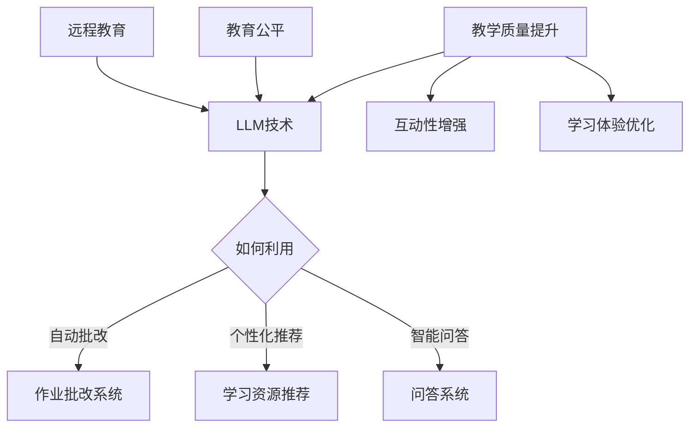

                 

# 文章标题

远程教育与 LLM：打破地理限制的学习

> 关键词：远程教育、语言学习模型（LLM）、自然语言处理（NLP）、个性化学习、教育技术创新

> 摘要：本文旨在探讨远程教育与语言学习模型（LLM）的结合，分析远程教育的概念与发展历程，详细解释LLM的核心原理和技术基础，探讨远程教育平台的设计与实施，评估远程教育质量，以及远程教育与LLM在安全与伦理方面的挑战。文章将通过实践案例和未来展望，展示远程教育与LLM技术的应用前景，为教育技术创新提供新的视角。

----------------------------------------------------------------

### 《远程教育与 LLM：打破地理限制的学习》目录大纲

#### 第一部分：远程教育与 LLM 基础

#### 第二部分：远程教育与 LLM 实践

#### 第三部分：远程教育与 LLM 未来发展

### 附录

## 附录 A：远程教育与 LLM 相关资源

## 附录 B：实践项目案例

---

### 第一部分：远程教育与 LLM 基础

---

#### 第1章：远程教育与 LLM 简介

## 1.1 远程教育的概念与发展历程

### 1.1.1 传统教育与远程教育的对比

传统教育通常依赖于物理空间和实体资源，如教室、教材、讲师等。学生需要在特定的时间和地点参加课程，受限于地理和时间的约束。相比之下，远程教育通过互联网和通信技术，打破了物理空间的限制，使得学生可以在任何时间和地点进行学习。以下是对两者的一些对比：

| 特点       | 传统教育                     | 远程教育                           |
|------------|-----------------------------|-----------------------------------|
| 时间安排   | 预定课程时间，固定授课时间    | 自主安排学习时间，灵活适应个人节奏   |
| 学习方式   | 面对面授课，互动性强         | 自主学习，依赖电子教材和在线资源    |
| 地理限制   | 受限于学校的物理位置         | 无地理限制，全球范围内均可参加       |
| 学习资源   | 依赖于实体教材和教学设备     | 依赖于数字资源和在线平台            |
| 成本       | 较高，包括学费、交通费等      | 较低，只需支付学费和一定的网络费用    |
| 互动性     | 高度互动，教师能够实时关注学生 | 互动性较弱，依赖于在线讨论和互动平台 |

通过这些对比，我们可以看到远程教育在灵活性和成本方面具有显著的优势。然而，这也带来了新的挑战，如学生自我管理能力的提升、教学质量的保证等问题。

### 1.1.2 远程教育的主要形式

远程教育有多种形式，主要包括以下几种：

1. **在线课程**：学生通过互联网访问课程内容，包括视频讲座、电子教材、在线测试等。这种方式适用于各种课程，从基础课程到高级专业课程。
   
2. **网络课程**：网络课程通常由多个在线课程组成，形成一个完整的教学体系。学生需要按照课程进度完成学习任务，并通过在线考试来评估学习效果。

3. **翻转课堂**：翻转课堂是一种将课堂教学与在线学习相结合的教学模式。学生在课前通过在线资源进行自学，课堂上则进行讨论、实践和问题解决。

4. **混合式学习**：混合式学习将传统课堂教学与在线学习相结合，以最大化学习效果。学生在课堂内外进行学习，通过在线资源进行课前预习和课后复习。

### 1.1.3 远程教育的优势与挑战

远程教育的优势包括：

- **灵活性**：学生可以根据自己的时间安排进行学习，无需受限于特定的时间和地点。
- **成本效益**：远程教育通常比传统教育成本更低，尤其对于需要跨地区学习的学生来说。
- **个性化**：在线平台可以提供个性化的学习资源和推荐，帮助学生更好地掌握知识。

然而，远程教育也面临一些挑战：

- **技术要求**：远程教育需要稳定的网络连接和一定的计算机操作技能。
- **学习自律**：远程学习要求学生具备较强的自我管理能力，以保持学习进度和动力。
- **教学质量**：确保远程教育的教学质量是一个重要挑战，需要教师和平台提供高质量的教学资源。

### 1.2 LLM 的概念与核心原理

## 1.2.1 什么是 LLM

语言学习模型（Language Learning Model，简称 LLM）是一种基于神经网络的自然语言处理（Natural Language Processing，简称 NLP）技术。它通过深度学习算法从大量文本数据中学习语言模式，能够生成、理解和处理自然语言。LLM 是近年来人工智能领域的一个重要突破，广泛应用于各种任务，如文本生成、机器翻译、情感分析等。

## 1.2.2 LLM 的核心组件

LLM 的核心组件包括：

- **词嵌入（Word Embedding）**：将单词映射到高维空间中的向量，以捕获单词之间的语义关系。
- **神经网络（Neural Network）**：通常使用多层感知器（MLP）或卷积神经网络（CNN）来处理和建模语言数据。
- **注意力机制（Attention Mechanism）**：用于模型在处理长序列时能够关注重要的信息。

## 1.2.3 LLM 的工作原理

LLM 的工作原理可以分为以下几个步骤：

1. **输入处理**：将输入文本转换为词嵌入向量。
2. **模型处理**：通过神经网络对词嵌入进行编码和解码，生成表示输入文本的向量。
3. **输出生成**：利用解码器生成输出文本，可以是预测的单词、句子或段落。

### 1.3 远程教育与 LLM 的关联与融合

## 1.3.1 远程教育如何利用 LLM

远程教育可以通过以下方式利用 LLM：

- **自动批改作业**：LLM 可以用于自动批改学生的作业，提高教师的工作效率。
- **个性化学习推荐**：LLM 可以分析学生的学习数据，推荐适合他们的学习资源和课程。
- **智能问答系统**：LLM 可以构建智能问答系统，为学生提供即时的问题解答。

## 1.3.2 LLM 对远程教育的改进与提升

LLM 对远程教育有以下改进和提升：

- **提高教学质量**：通过提供个性化的学习资源和推荐，帮助教师更好地满足学生的需求。
- **增强互动性**：通过智能问答系统和在线讨论平台，增强学生与教师、同学之间的互动。
- **优化学习体验**：通过自动批改作业和智能推荐，提高学生的学习效率和兴趣。

## 1.3.3 远程教育与 LLM 的未来趋势

远程教育与 LLM 的未来趋势包括：

- **技术融合**：随着 LLM 技术的不断进步，远程教育平台将更加智能化，提供更加个性化和高效的学习体验。
- **广泛应用**：LLM 将在更多远程教育场景中发挥作用，如虚拟课堂、在线研讨会等。
- **教育公平**：远程教育与 LLM 的结合有助于打破教育资源的地域和阶层限制，实现教育公平。

### 总结

远程教育与 LLM 的结合为教育带来了新的机遇和挑战。通过 LLM，远程教育可以提供更加个性化和高效的学习体验，打破地理限制，促进教育公平。然而，我们也需要关注 LLM 技术的安全和伦理问题，确保其在教育领域的可持续发展。

### Mermaid 流程图



### 伪代码示例

```python
# 定义语言学习模型（LLM）类
class LanguageLearningModel:
    def __init__(self, word_embedding, neural_network, attention_mechanism):
        self.word_embedding = word_embedding
        self.neural_network = neural_network
        self.attention_mechanism = attention_mechanism

    def process_input(self, input_text):
        # 将输入文本转换为词嵌入向量
        return self.word_embedding(input_text)

    def encode_decode(self, encoded_vector):
        # 通过神经网络编码和解码
        return self.neural_network(encoded_vector)

    def generate_output(self, decoded_vector):
        # 生成输出文本
        return self.decode_vector(decoded_vector)

# 创建LLM实例
llm = LanguageLearningModel(word_embedding, neural_network, attention_mechanism)

# 处理输入文本
input_text = "这是一个示例文本。"
encoded_vector = llm.process_input(input_text)

# 生成输出文本
output_text = llm.generate_output(encoded_vector)
print(output_text)
```

### 数学模型和公式详解

在 LLM 中，常用的数学模型和公式包括词嵌入（Word Embedding）和神经网络（Neural Network）。

#### 词嵌入（Word Embedding）

词嵌入是一种将单词映射到高维空间中的向量表示的方法，其核心思想是捕获单词之间的语义关系。常用的词嵌入模型包括 Word2Vec、GloVe 和 FastText 等。

$$
\text{word\_embedding}(w) = \text{embedding}_{\text{size}} \times \text{vector}[w]
$$

其中，$\text{vector}[w]$ 是单词 $w$ 的词向量，$\text{embedding}_{\text{size}}$ 是词向量的维度。

#### 神经网络（Neural Network）

神经网络是一种基于多层感知器（MLP）或卷积神经网络（CNN）的计算模型，用于处理和建模语言数据。其基本结构包括输入层、隐藏层和输出层。

$$
\text{output} = \text{sigmoid}(\text{weight} \cdot \text{input} + \text{bias})
$$

其中，$\text{weight}$ 是权重矩阵，$\text{input}$ 是输入向量，$\text{bias}$ 是偏置项，$\text{sigmoid}$ 是激活函数。

#### 注意力机制（Attention Mechanism）

注意力机制是一种用于模型在处理长序列时能够关注重要信息的方法。其基本思想是计算一个权重向量，用于加权序列中的不同部分。

$$
\text{attention\_score} = \text{dot}(\text{query}, \text{key})
$$

其中，$\text{query}$ 和 $\text{key}$ 分别是查询向量和键向量，$\text{dot}$ 表示点积运算。

### 举例说明

假设有一个简单的神经网络模型，用于文本分类任务。输入是一个句子，输出是分类结果。我们可以用以下伪代码来表示：

```python
# 定义神经网络模型
class NeuralNetwork:
    def __init__(self, input_size, hidden_size, output_size):
        self.input_size = input_size
        self.hidden_size = hidden_size
        self.output_size = output_size

    def forward(self, input_vector):
        # 前向传播
        hidden_vector = self.activation(self.weight * input_vector + self.bias)
        output_vector = self.softmax(self.weight_output * hidden_vector + self.bias_output)
        return output_vector

    def activation(self, x):
        # 激活函数
        return 1 / (1 + exp(-x))

    def softmax(self, x):
        # Softmax函数
        exp_x = exp(x)
        return exp_x / sum(exp_x)

# 创建神经网络实例
nn = NeuralNetwork(input_size, hidden_size, output_size)

# 输入句子
input_sentence = "这是一个示例句子。"
input_vector = sentence_to_vector(input_sentence)

# 前向传播
output_vector = nn.forward(input_vector)

# 输出分类结果
predicted_class = argmax(output_vector)
print(predicted_class)
```

在上面的例子中，`sentence_to_vector` 函数用于将句子转换为向量表示，`argmax` 函数用于找到最大输出值的索引，从而得到分类结果。

### 总结

远程教育与 LLM 的结合为教育带来了新的机遇和挑战。通过 LLM，远程教育可以提供更加个性化和高效的学习体验，打破地理限制，促进教育公平。然而，我们也需要关注 LLM 技术的安全和伦理问题，确保其在教育领域的可持续发展。在接下来的章节中，我们将进一步探讨 LLM 的技术基础和实践应用，为远程教育的创新提供更多的思路。

### 附录 A：远程教育与 LLM 相关资源

**1. 主流 LLM 开源框架与工具**

- **Transformers**：由 Google Research 开发的开源库，用于构建和训练大型语言模型，如 BERT、GPT 和 T5。
  - 链接：https://github.com/huggingface/transformers

- **TensorFlow**：由 Google 开发的开源机器学习框架，支持 LLM 的构建和训练。
  - 链接：https://www.tensorflow.org

- **PyTorch**：由 Facebook AI Research 开发的开源机器学习库，易于使用和调试，适用于 LLM 的开发。
  - 链接：https://pytorch.org

**2. 远程教育平台推荐**

- **edX**：由哈佛大学和麻省理工学院共同创立的在线学习平台，提供丰富的远程课程。
  - 链接：https://www.edx.org

- **Coursera**：全球领先的在线学习平台，与多所知名大学合作，提供多样化的远程课程。
  - 链接：https://www.coursera.org

- **Udemy**：一个综合性的在线学习平台，提供各种技能和课程，适合个人学习和职业发展。
  - 链接：https://www.udemy.com

**3. 安全与伦理资源链接**

- **AI Ethics**：由牛津大学计算机科学系开发的 AI 伦理课程，介绍人工智能的伦理问题和挑战。
  - 链接：https://www.oii.ox.ac.uk/ai-ethics

- **AI Alliance**：由多家科技公司和学术机构组成的联盟，致力于推动 AI 可持续发展和伦理实践。
  - 链接：https://www.ai-alliance.org

- **GDPR**：欧盟制定的《通用数据保护条例》，规定了数据保护的基本原则和规则。
  - 链接：https://www.eugdpr.org

### 附录 B：实践项目案例

**1. 某高校远程教育平台实施案例**

某高校为了提高远程教育的质量和效率，决定构建一个集成了 LLM 技术的远程教育平台。该项目包括以下关键步骤：

- **需求分析**：明确平台的功能需求，如在线课程管理、作业批改、学习数据分析等。

- **技术选型**：选择主流的 LLM 开源框架，如 Transformers，用于构建和训练语言模型。

- **平台设计**：设计平台的架构，包括前端界面、后端服务、数据库等。

- **模型训练**：使用大量教育数据训练 LLM 模型，包括学生作业、课程文本等。

- **系统集成**：将 LLM 模型集成到远程教育平台中，实现自动批改、个性化推荐等功能。

- **测试与优化**：对平台进行功能测试和性能优化，确保系统的稳定性和高效性。

该项目取得了显著的效果，通过自动批改系统提高了作业评阅的效率，个性化推荐系统增强了学生的学习兴趣和效果。

**2. LLM 在远程教育中的应用案例**

某在线教育平台引入了 LLM 技术来提供智能问答服务和个性化学习推荐。以下是其主要应用：

- **智能问答系统**：通过 LLM 模型构建智能问答系统，学生可以随时提问，系统会自动回答常见问题，并提供详细的解释。

- **个性化学习推荐**：分析学生的学习数据，使用 LLM 模型为学生推荐适合他们的学习资源和课程。

- **学习效果分析**：使用 LLM 模型分析学生的学习行为和成绩，提供学习反馈和建议。

这些应用提高了学生的学习体验和效果，同时也减轻了教师的工作负担。

**3. 远程教育质量评估案例**

某高校为了评估远程教育的质量，使用了 LLM 技术进行数据分析。以下是其主要步骤：

- **数据收集**：收集学生的参与度数据、作业成绩、学习行为等。

- **数据预处理**：清洗和预处理数据，使其适合进行 LLM 分析。

- **特征提取**：使用 LLM 模型提取关键特征，如学习习惯、参与度等。

- **评估指标**：根据特征数据计算远程教育质量评估指标，如学生参与度、学习效果等。

- **结果分析**：分析评估结果，为远程教育的改进提供依据。

通过 LLM 技术的辅助，该高校能够更加科学和准确地评估远程教育的质量，为教学改进提供了有力支持。

